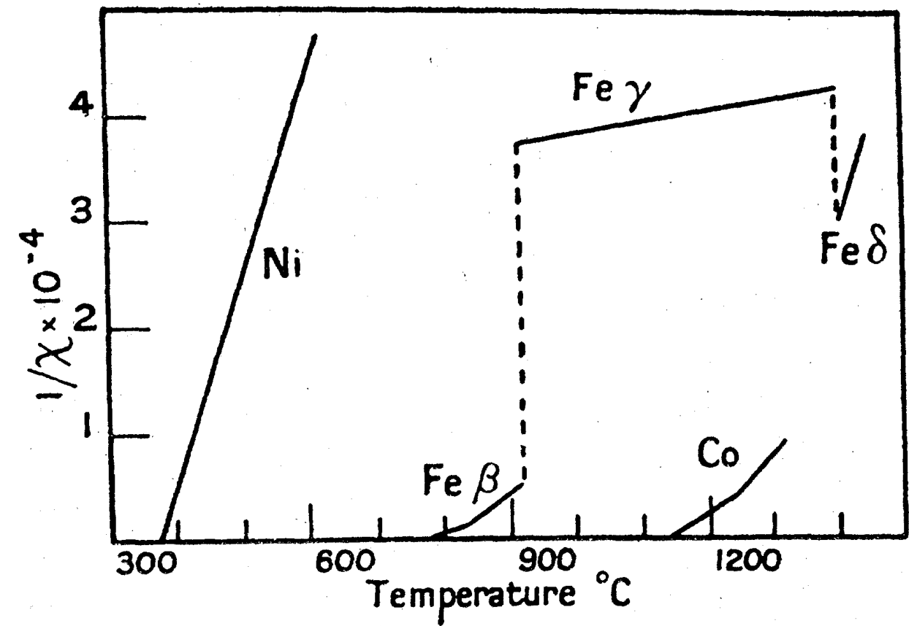
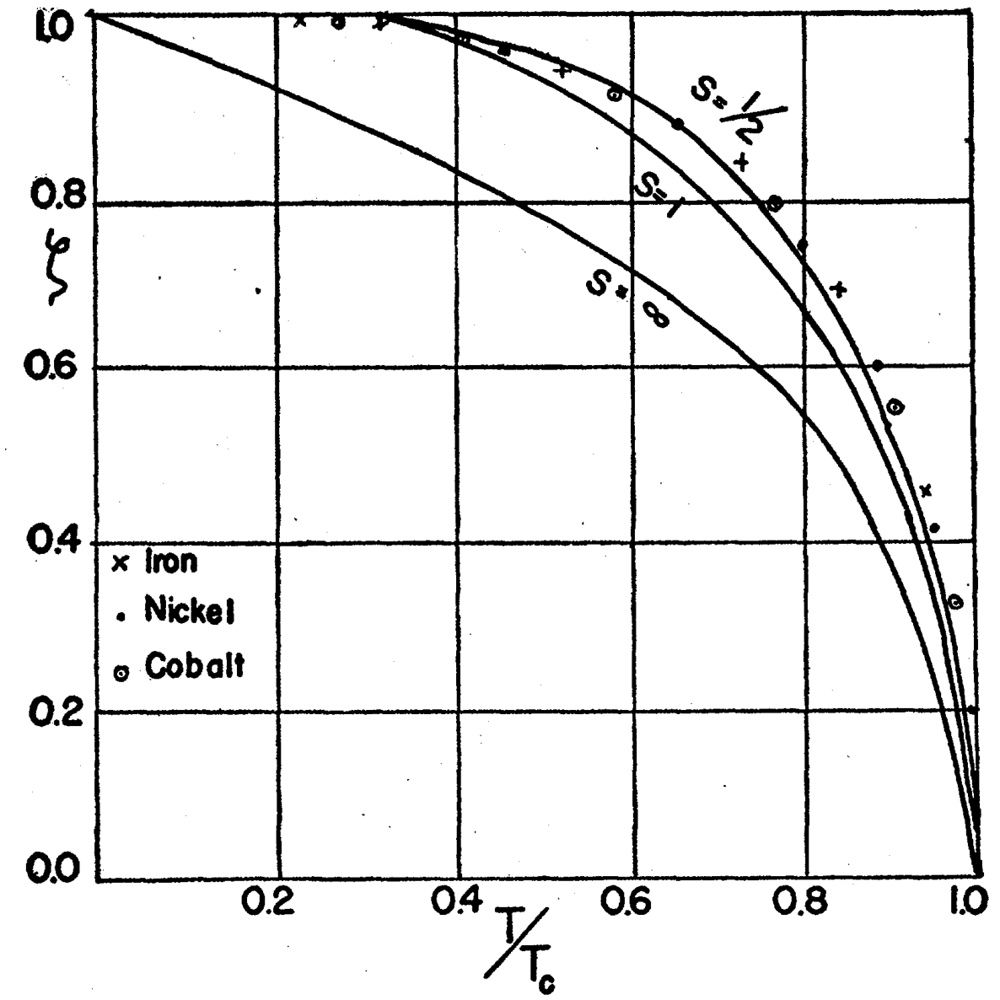
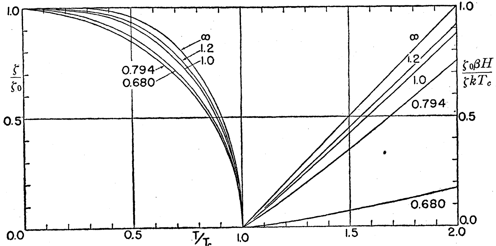
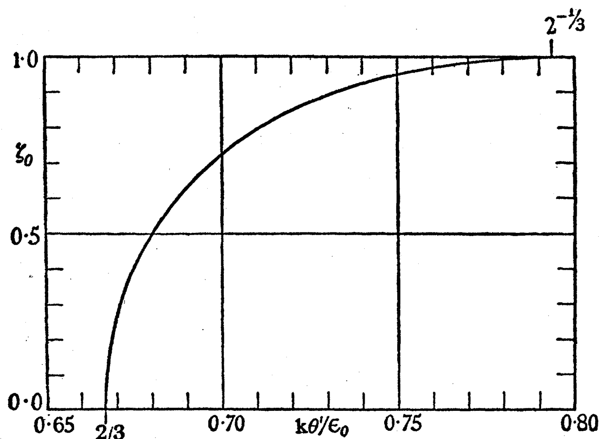

# 多铁与磁电异质结：机制与理论 (Multiferroic & Magnetoelectric Heterostructures: Mechanisms & Theory)

> 收录多铁性与磁电耦合的微观机制、分类框架、磁电耦合自由能公式，以及铁磁/反铁磁序的经典理论图解（居里-外斯定律、布里渊函数、斯托纳理论等）。

[[科研Wiki/wiki/figures/heterostructures-stacking-multiferroic|← 返回多铁与磁电异质结总览]]

---

## 📐 磁电耦合与多铁公式 (Magnetoelectric Coupling & Multiferroic Formulae)

### 1. 双磁序线性磁电耦合自由能
线性磁电项 f_me = g_i E_i L₊ L₋，描述两独立磁序序参量 L₊、L₋ 与电场 E_i 的耦合。

*   **来源**：[[../papers/mostovoyMultiferroicsDifferentRoutes2024]]
*   **关键特征**：两磁序在电场下耦合，是多铁性磁电效应的自由能基础。

### 2. 螺旋自旋结构表达式
螺旋自旋序 S(x) = A₁ e₁ cos(q·x) + A₂ e₂ sin(q·x)，含传播矢量 q 与旋转平面基矢 e₁、e₂。

*   **来源**：[[../papers/mostovoyMultiferroicsDifferentRoutes2024]]
*   **关键特征**：单 q 螺旋序是第 II 类多铁极化的常见母序。

### 3. 逆 DM 微观键偶极
逆 Dzyaloshinskii–Moriya 相互作用诱导的键偶极 d_ij ∝ r̂_ij × (S_i × S_j)。

*   **来源**：[[../papers/mostovoyMultiferroicsDifferentRoutes2024]]
*   **关键特征**：键偶极由相邻自旋的叉乘决定，构成自旋螺旋诱导极化的微观起源。

### 4. 杂化非本征铁电耦合
三线性杂化耦合 f_int = g Δ₁ Δ₂ E，两序参量 Δ₁、Δ₂ 与电场 E 耦合产生极化。

*   **来源**：[[../papers/mostovoyMultiferroicsDifferentRoutes2024]]
*   **关键特征**：多序三线性耦合是杂化非本征多铁性的机制。

### 5. 弱铁磁矩耦合
弱铁磁矩与磁场的耦合 f_wfm = λ Δ₁ L H。

*   **来源**：[[../papers/mostovoyMultiferroicsDifferentRoutes2024]]
*   **关键特征**：弱铁磁矩演化出磁电响应及光磁电效应。

### 6. 磁光张量约束
无场螺旋态下磁光/电导张量满足 α^em_ij(ω) = α^me_ji(ω)。

*   **来源**：[[../papers/mostovoyMultiferroicsDifferentRoutes2024]]
*   **关键特征**：对称约束支持非互易光学效应。

---

## 🧲 多铁机制与分类 (Multiferroic Mechanisms & Classification)

### 1. 四类多铁机制
图1 展示孤对电子、几何、电荷有序、自旋驱动（逆 DM/交换伸缩/p-d 杂化）四类多铁性机制。

*   **来源**：[[../papers/fiebigEvolutionMultiferroics2016]]
*   **关键特征**：自旋驱动机制源于逆 DM 与交换伸缩，是第 II 类多铁的核心。

### 2. 单相多铁最大极化对比
图2 对比不同机制单相多铁材料的最大极化值（对数轴，BiFeO₃~100、LuFe₂O₄~25、h-YMnO₃~5.6、自旋驱动<1 μC/cm²）。

*   **来源**：[[../papers/fiebigEvolutionMultiferroics2016]]
*   **关键特征**：第 I 类（孤对电子）极化可高达两个数量级，远大于第 II 类。

### 3. 多铁家族树
图1 展示多铁材料家族树：d0/孤对电子铁电根与 d/f 电子磁性根组合形成各材料分支。

*   **来源**：[[../papers/spaldinAdvancesMagnetoelectricMultiferroics2019]]
*   **关键特征**：铁电根与磁性根的兼容性是筛选单相多铁的核心准则。

### 4. 磁电多极子
图5 展示磁电多极子：单极子（左）、环形矩（中）、四极子（右），分别对应磁电张量的不同分量。

*   **来源**：[[../papers/spaldinAdvancesMagnetoelectricMultiferroics2019]]
*   **关键特征**：磁电多极子为磁电响应的空间分组提供对称性语言。

### 5. 铁磁/铁电/多铁的对称性
图1 展示铁磁/铁电/多铁体在时间反演与空间反演下的对称性破缺关系。

*   **来源**：[[../papers/RecentAdvancesGrowth2025]]
*   **关键特征**：多铁性需同时破缺时间反演与空间反演对称性。

### 6. 铁性序与交叉耦合分类
图2 展示铁性序（M/P/ε）及其磁电、压电、磁致伸缩交叉耦合，并区分第 I/II 型多铁。

*   **来源**：[[../papers/RecentAdvancesGrowth2025]]
*   **关键特征**：铁性序间的线性/二次交叉耦合统一了磁电与压电物理。

### 7. 交换收缩与电荷有序诱导极化
对比螺旋自旋序、交换收缩导致离子偏离中心对称位置、双层 Lu(Fe2.5+)₂O₄ 电荷有序以及钙钛矿 YNiO₃ 中 ↑↑↓↓ 型自旋序诱导极化的四种机制。

*   **来源**：[[../papers/cheongMultiferroicsMagneticTwist2007a]]
*   **关键特征**：综述 Nature Materials 2007 经典图解，概括第 I 类与第 II 类多铁的微观起源。

### 8. 单层 NiI₂ 多铁性起源示意
单层 NiI₂ 单胞及描述自旋螺旋序所需的 9a×√3a 超胞，自旋-轨道耦合 λSOC 诱导沿 y 方向的净电极化 P，并示意最近邻 FM J1 与第三近邻 AFM J3 交换作用。

*   **来源**：[[../papers/aminiAtomicscaleVisualizationMultiferroicity2024]]
*   **关键特征**：螺旋传播矢量 q 沿 x、旋转矢量 e 沿 z，符合第 II 类多铁的逆 Dzyaloshinskii–Moriya 机制。

---

## 🧪 磁性序理论 (Magnetic Ordering Theory)

### 1. 磁偶极子排列
图1 展示顺磁/铁磁/反铁磁的磁偶极子排列示意。

*   **来源**：[[../papers/hillWhyAreThere2000a]]
*   **关键特征**：以偶极子取向直观区分三类磁有序。

### 2. 铁磁/亚铁磁磁滞回线
图2 展示铁磁/亚铁磁体的磁滞回线以及余磁与矫顽场。

*   **来源**：[[../papers/hillWhyAreThere2000a]]
*   **关键特征**：磁滞回线是铁磁序的标志性响应。

### 3. 居里-外斯定律
图1 展示居里点以上磁化率倒数 1/χ 对温度的线性关系（Fe、Ni），验证居里-外斯定律。

*   **来源**：[[../papers/vanvleckSurveyTheoryFerromagnetism1945]]
*   **关键特征**：外推截距给出顺磁居里点，验证居里-外斯行为。

### 4. 居里点附近的放大
图2 显示镍在居里点附近放大，区分顺磁居里点 Tc 与铁磁居里点 Tc'（相差约 20 K）。

*   **来源**：[[../papers/vanvleckSurveyTheoryFerromagnetism1945]]
*   **关键特征**：铁磁与顺磁居里点差异由短程有序引起。

### 5. 布里渊函数磁化曲线
图3 对比约化饱和磁化强度 I/I0 对约化温度 T/Tc：经典 S=∞ 与量子 S=1/2、1 等布里渊曲线，Ni、Co 数据支持量子曲线。

*   **来源**：[[../papers/vanvleckSurveyTheoryFerromagnetism1945]]
*   **关键特征**：实验数据更接近有限自旋量子曲线而非经典 S=∞。

### 6. 斯托纳理论
图4 展示斯托纳巡游磁性理论：左侧 T<Tc 约化磁化强度、右侧 T>Tc 约化 1/χ，不同曲线对应 kθ'/ε0；∞ 极限回归 S=1/2 外斯曲线。

*   **来源**：[[../papers/vanvleckSurveyTheoryFerromagnetism1945]]
*   **关键特征**：巡游（能带）磁性在强交换极限下过渡到局域外斯行为。

### 7. 约化饱和磁矩随交换强度
图5 展示 T=0 时约化饱和磁矩 ζ0 随 kθ'/ε0 变化；2/3<kθ'/ε0<2^(-1/3) 区间 ζ0<1，解释非整数玻尔磁子数。

*   **来源**：[[../papers/vanvleckSurveyTheoryFerromagnetism1945]]
*   **关键特征**：磁化强度连续下降解释过渡金属非整数磁矩。

### 8. 反铁磁 χ(T) 与奈尔点
图6 展示反铁磁体 χ(T) 对约化温度：理论实线与 MnO 实验虚线（Bizette 等），奈尔温度处出现峰值。

*   **来源**：[[../papers/vanvleckSurveyTheoryFerromagnetism1945]]
*   **关键特征**：奈尔温度处磁化率峰值是反铁磁转变的标志。
