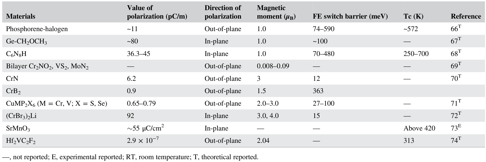
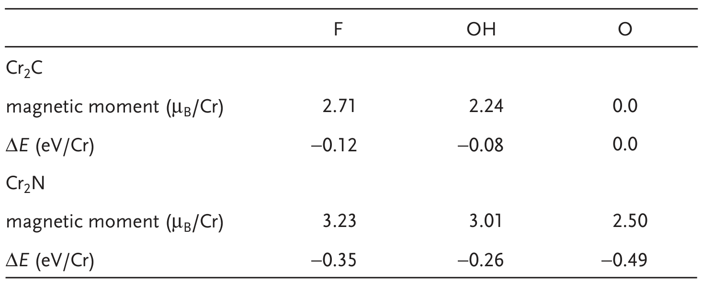
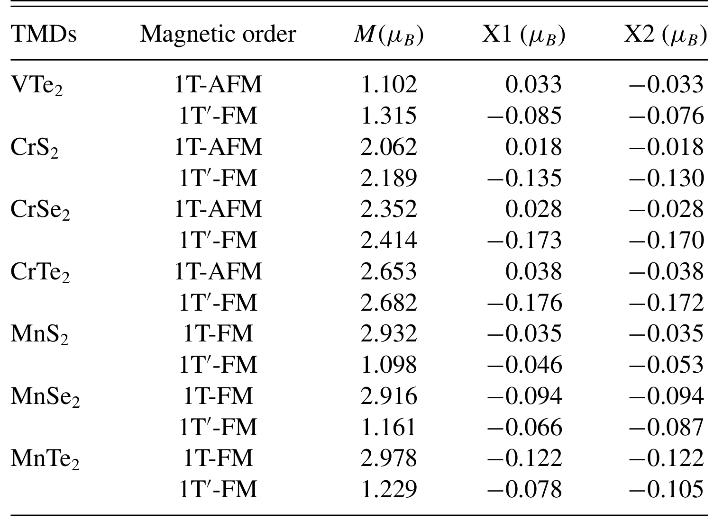

# 多铁与磁电异质结：参数汇总表 (Multiferroic & Magnetoelectric Heterostructures: Parameter Tables)

> 收录二维多铁材料体系的汇总对比表，以及各类材料的交换耦合、磁各向异性、磁矩与 DMI 等关键参数表。

[[科研Wiki/wiki/figures/heterostructures-stacking-multiferroic|← 返回多铁与磁电异质结总览]]

---

## 📋 多铁材料体系汇总 (Multiferroic Material System Summaries)

### 1. 二维范德华多铁材料体系汇总
按年份、材料、厚度、铁电居里温度 TC-FE、极化值、磁有序温度、工程化方法及实验/理论分类汇总近年报道的二维多铁候选体系。

<table>
<thead>
<tr>
<th>Year</th>
<th>material</th>
<th>Thickness</th>
<th>TC-FE</th>
<th>polarization</th>
<th>TC-FM/TN-AFM</th>
<th>engineering method</th>
<th>exp./theor</th>
<th>ref</th>
</tr>
</thead>
<tbody>
<tr>
<td>2019</td>
<td>ReS2</td>
<td>monolayer</td>
<td>RT</td>
<td>0.85 μC cm−2</td>
<td>RT</td>
<td>chemical modulation</td>
<td>exp</td>
<td>53</td>
</tr>
<tr>
<td>2020</td>
<td>Fe0.2In1.8Se3</td>
<td>6.8 nm</td>
<td>RT</td>
<td>PFM test</td>
<td>8 K</td>
<td>magnetic ions incorporation</td>
<td>exp</td>
<td>12</td>
</tr>
<tr>
<td>2022</td>
<td>p-SnSe</td>
<td>23.6 nm</td>
<td>RT</td>
<td>PFM test</td>
<td>337 K</td>
<td>chemical modulation</td>
<td>exp</td>
<td>13</td>
</tr>
<tr>
<td>2023</td>
<td>Fe1+xTe2</td>
<td>18.3 nm</td>
<td>RT</td>
<td>PFM test</td>
<td>300 K</td>
<td>chemical modulation</td>
<td>exp</td>
<td>54</td>
</tr>
<tr>
<td>2023</td>
<td>CuCrP2S6</td>
<td>170 nm</td>
<td>145 K</td>
<td>PFM test</td>
<td>32 K</td>
<td>magnetic ions incorporation</td>
<td>exp</td>
<td>43</td>
</tr>
<tr>
<td>2023</td>
<td>CuCrP2S6</td>
<td>2.6 nm 200.0 nm</td>
<td>RT</td>
<td>PFM test 14.97 μC cm−2</td>
<td></td>
<td>magnetic ions incorporation</td>
<td>exp</td>
<td>38</td>
</tr>
<tr>
<td>2024</td>
<td>CuCrSe2</td>
<td>1.6 nm</td>
<td>RT</td>
<td>PFM test</td>
<td>120 K</td>
<td>magnetic ions incorporation</td>
<td>exp</td>
<td>45</td>
</tr>
<tr>
<td>2024</td>
<td>Cr2S3</td>
<td>2.0 nm 13.0 nm</td>
<td>RT</td>
<td>0.80 μC cm−2 4.30 μC cm−2</td>
<td>200 K</td>
<td>interfacial interaction</td>
<td>exp</td>
<td>14</td>
</tr>
<tr>
<td>2022</td>
<td>NiI2</td>
<td>0.65 nm</td>
<td>&lt;60 K</td>
<td>SHG test</td>
<td>75 K</td>
<td>intrinsic</td>
<td>exp</td>
<td>55</td>
</tr>
<tr>
<td>2024</td>
<td>NiI2</td>
<td>few-layer</td>
<td>&lt;10 K</td>
<td>0.03 μC cm−2</td>
<td>35 K</td>
<td>intrinsic</td>
<td>exp</td>
<td>56</td>
</tr>
<tr>
<td>2025</td>
<td>VCl3</td>
<td>0.56 nm</td>
<td>&lt;20 K</td>
<td>0.04 μC cm−2</td>
<td>16 K</td>
<td>interfacial interaction</td>
<td>exp</td>
<td>57</td>
</tr>
<tr>
<td>2017</td>
<td>CrN</td>
<td>monolayer</td>
<td></td>
<td>6 × 10−6 μC m−1</td>
<td></td>
<td>intrinsic</td>
<td>theor</td>
<td>58</td>
</tr>
<tr>
<td>2018</td>
<td>Hf2VC2F2</td>
<td>monolayer</td>
<td></td>
<td>0.27 μC cm−2</td>
<td>313 K</td>
<td>intrinsic</td>
<td>theor</td>
<td>32</td>
</tr>
<tr>
<td>2018</td>
<td>CrBr3</td>
<td>monolayer</td>
<td></td>
<td>1 × 10−4 μC m−1</td>
<td>50 K</td>
<td>intrinsic</td>
<td>theor</td>
<td>24</td>
</tr>
<tr>
<td>2019</td>
<td>VOI2</td>
<td>monolayer</td>
<td></td>
<td>61.00 μC cm−2</td>
<td></td>
<td>intrinsic</td>
<td>theor</td>
<td>59</td>
</tr>
<tr>
<td>2019</td>
<td>γ-GeSe</td>
<td>monolayer</td>
<td>RT</td>
<td>4.47 μC cm−2</td>
<td>900 K</td>
<td>chemical modulation</td>
<td>theor</td>
<td>60</td>
</tr>
<tr>
<td>2019</td>
<td>Ni0.03MoS2</td>
<td>bilayer</td>
<td></td>
<td>2 × 10−6 μC m−1</td>
<td></td>
<td>magnetic ions incorporation</td>
<td>theor</td>
<td>61</td>
</tr>
<tr>
<td>2020</td>
<td>VS2</td>
<td>bilayer</td>
<td></td>
<td>0.20 μC cm−2</td>
<td></td>
<td>intrinsic</td>
<td>theor</td>
<td>29</td>
</tr>
<tr>
<td>2021</td>
<td>HfFeSe3</td>
<td>monolayer</td>
<td>RT</td>
<td>1 × 10−4 μC m−1</td>
<td>RT</td>
<td>magnetic ions incorporation</td>
<td>theor</td>
<td>62</td>
</tr>
<tr>
<td>2023</td>
<td>CrCoS4</td>
<td>monolayer</td>
<td>RT</td>
<td>5 × 10−7 μC m−1</td>
<td>RT</td>
<td>magnetic ions incorporation</td>
<td>theor</td>
<td>42</td>
</tr>
<tr>
<td>2023</td>
<td>MnSe</td>
<td>bilayer</td>
<td></td>
<td>3 × 10−6 μC m−1</td>
<td></td>
<td>sliding configuration controlling</td>
<td>theor</td>
<td>63</td>
</tr>
<tr>
<td>2024</td>
<td>GdI2</td>
<td>bilayer</td>
<td></td>
<td>4 × 10−6 μC m−1</td>
<td></td>
<td>sliding configuration controlling</td>
<td>theor</td>
<td>15</td>
</tr>
</tbody>
</table>

*   **来源**：[[../papers/tangMultiferroicityTwodimensionalVan2025]]
*   **关键特征**：实验体系极化多通过 PFM 验证，理论体系涵盖本征、化学调制、磁性离子掺杂与滑移构型调控四类策略。

### 2. 已报道低维多铁材料汇总
表2 汇总已报道的低维多铁材料体系（含磁矩一列）。

*   **来源**：[[../papers/huProgressProspectsLowdimensional2019]]
*   **关键特征**：按维度与磁矩系统梳理低维多铁候选。

### 3. 二维磁性材料汇总
表1 汇总二维磁性材料体系。

*   **来源**：[[../papers/liuSpintronicsTwoDimensionalMaterials2020b]]
*   **关键特征**：为二维自旋电子学与多铁研究提供磁性材料清单。

### 4. EPR 与磁参数汇总
表1 汇总 EPR 参数、居里-外斯参数、有效磁矩与室温电导率。

*   **来源**：[[../papers/Unknown2003charge]]
*   **关键特征**：由磁化率与电导率刻画材料磁电性质。

### 5. Cr₂C/Cr₂N 功能化体系磁参数
表3 汇总 Cr₂C/Cr₂N 功能化体系的磁矩与铁磁-非磁能量差。

*   **来源**：[[../papers/khazaeiNovelElectronicMagnetic2013]]
*   **关键特征**：比较不同功能化基团对磁性稳定性的影响。

### 6. 1T 与 1T′ 相原子磁矩
表II 给出 1T 与 1T′ 相中各原子磁矩，证实 FM 相中硫族原子出现反平行诱导磁矩（超交换特征）。

*   **来源**：[[../papers/chenFerromagneticNonmagnetic1T2022]]
*   **关键特征**：硫族原子诱导磁矩是超交换铁磁性判据。

---

## ⚙️ 交换耦合与磁序参数 (Exchange Coupling & Magnetic Ordering Parameters)

### 1. 表：ScCrP₂Se₆ 反铁电相磁序能量与交换耦合
表 I 给出 2×1×1 超胞中四种磁序（FM、AFM1、AFM2、AFM3）相对 FM 构型的总能量（meV），以及 Cr1–Cr2、Cr1–Cr3、Cr1–Cr4 路径的最近邻交换耦合参数 J1、J2、J3，正 J 对应铁磁相互作用。

*   **来源**：[[../papers/fengFerroelectricityMultiferroicityTwodimensional2020]]
*   **关键特征**：用于判定 ScCrP₂Se₆ 单层在 AFE 相下的磁基态与层内交换强度。

### 2. 表：ScCrP₂Se₆ 铁电/反铁电相磁各向异性能
表 II 列出 ScCrP₂Se₆ 单层 FE 与 AFE 两相的磁各向异性能（μeV），易磁化轴能量取零。

*   **来源**：[[../papers/fengFerroelectricityMultiferroicityTwodimensional2020]]
*   **关键特征**：对比铁电与反铁电相的磁各向异性差异，揭示电极化对自旋取向的调制。

### 3. 表：双层 FGT 不同滑移操作的相对能量
表 1 汇总双层 Fe₃GeTe₂（FGT）在不同层间滑移操作下的相对能量，参考态为滑移 (1/3, −1/3) 与 (−1/3, 1/3) 两构型。

*   **来源**：[[../papers/miaoMagneticFerroelectricMetal2024]]
*   **关键特征**：确定层间滑移诱导的两极化态能量简并，是磁性铁电金属的能量学基础。

### 4. 表：双层 GdI₂ 不同堆积的层间距离与交换参数
表 1 给出各堆积构型下 Gd 原子最近邻与次近邻层间距离（括号内为每单胞磁交换作用数）、计算的 Heisenberg 交换参数以及层间 AFM 与 FM 态的能量差。

*   **来源**：[[../papers/xunCoexistingMagnetismFerroelectric2024]]
*   **关键特征**：J∥ 约 −8.2 meV 主导层内 AFM，层间 J1⊥ 随堆积由 0.243 变为 −0.036 meV。

### 5. 表：双层 GdI₂ AA/AB/AB′/BA′ 堆积交换参数
列出四种堆积构型的 Gd–Gd 最近邻与次近邻距离、层间交换 J1⊥、J2⊥、层内交换 J∥ 及 AFM–FM 能量差 ΔE 的具体数值。

<table><thead><tr><th style="text-align:left">stacking</th><th style="text-align:left">Gd−Gd NN (Å)</th><th style="text-align:left">Gd−Gd second-NN (Å)</th><th style="text-align:left">J1⊥ (meV)</th><th style="text-align:left">J2⊥ (meV)</th><th style="text-align:left">J∥ (meV)</th><th style="text-align:left">ΔE (meV)</th></tr></thead><tbody><tr><td style="text-align:left">AA</td><td style="text-align:left">8.139 [1]</td><td style="text-align:left">9.145 [6]</td><td style="text-align:left">0.243</td><td style="text-align:left">−0.003</td><td style="text-align:left">−8.253</td><td style="text-align:left">−1.794</td></tr><tr><td style="text-align:left">AB</td><td style="text-align:left">7.888 [3]</td><td style="text-align:left">8.922 [3]</td><td style="text-align:left">−0.036</td><td style="text-align:left">−0.007</td><td style="text-align:left">−8.242</td><td style="text-align:left">1.046</td></tr><tr><td style="text-align:left">AB′</td><td style="text-align:left">7.505 [1]</td><td style="text-align:left">8.586 [6]</td><td style="text-align:left">0.002</td><td style="text-align:left">−0.004</td><td style="text-align:left">−8.235</td><td style="text-align:left">0.206</td></tr><tr><td style="text-align:left">BA′</td><td style="text-align:left">7.915 [3]</td><td style="text-align:left">8.946 [3]</td><td style="text-align:left">0.066</td><td style="text-align:left">−0.008</td><td style="text-align:left">−8.256</td><td style="text-align:left">−1.403</td></tr></tbody></table>

*   **来源**：[[../papers/xunCoexistingMagnetismFerroelectric2024]]
*   **关键特征**：AA 与 BA′ 为 AFM 基态，AB 为 FM 基态，证实层间滑移可切换磁序并诱导铁谷极化。

### 6. 表：Cr₄S₄FBr₂ 家族及若干二维材料的磁电参数
表 1 汇总单层 Cr₄S₄FBr₂ 家族与若干二维单层/双层材料的磁交换参数 J、Néel/Curie 温度、易轴、磁各向异性能 MAE、面外偶极矩 D 及铁电翻转能垒等数据。

*   **来源**：[[../papers/yuFerroelectricControlMagnetism2026]]
*   **关键特征**：系统对比卤化物插层 A 型反铁磁体的磁电性能，为铁电控磁提供材料筛选依据。

### 7. 表：P1–P4 磁矩与交换参数
表1 汇总 P1–P4 各构型的磁矩与交换参数 J1。

*   **来源**：[[../papers/wuNonvolatileSwitchableHalfmetallicity2024]]
*   **关键特征**：界面距离调控磁矩与交换，支撑可切换半金属性。

### 8. 表：T-CdCr₂Te₄ 顶层/底层 Cr 的 J 与 DMI 参数
表3 汇总 T-CdCr₂Te₄ 顶层/底层 Cr 的交换参数 J 与 DMI 参数。

*   **来源**：[[../papers/zhaoRealization2DMultiferroic2024]]
*   **关键特征**：定量刻画层间/层内交换与 DMI，是磁电/磁弹耦合的微观输入。
