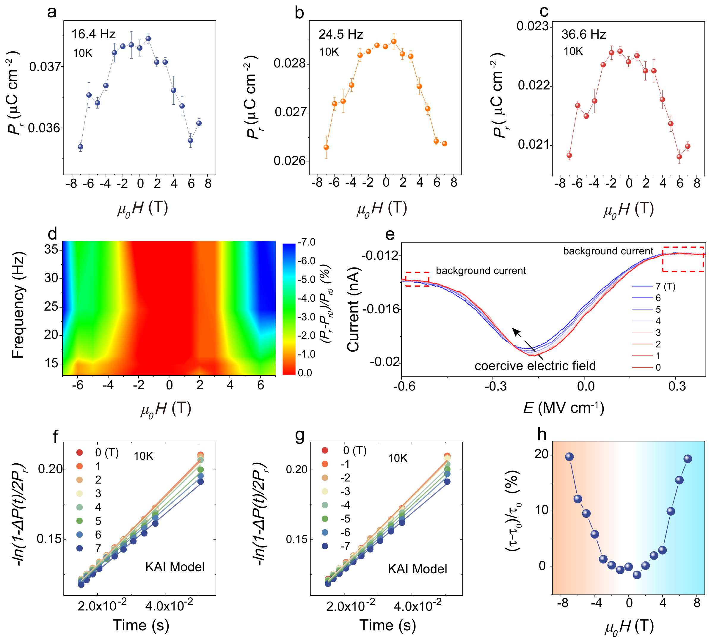
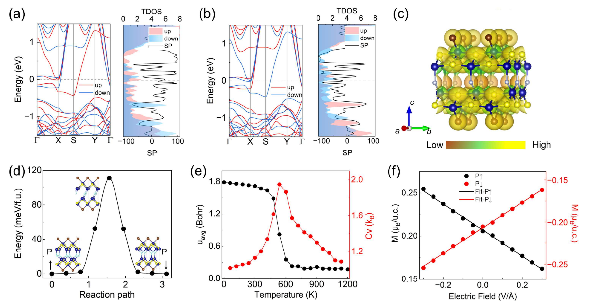
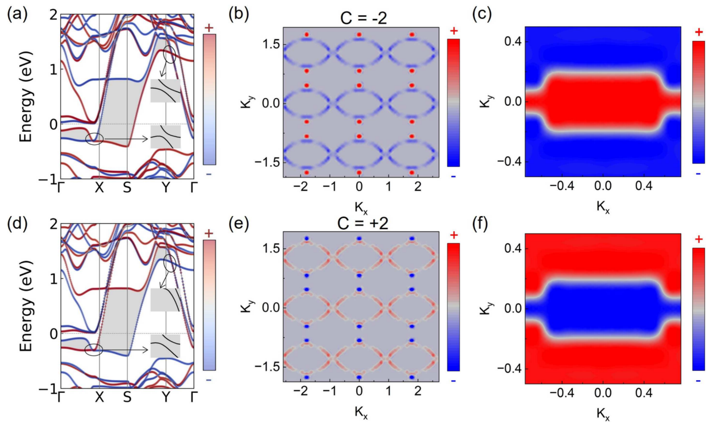

# 多铁与磁电异质结 (Multiferroic & Magnetoelectric Heterostructures)

> 收录二维多铁材料、铁电-铁磁共存、磁电耦合异质结（如 Tl₂NO₂/WTe₂）及范德华多铁候选体系的结构与物性图表，涵盖铁电极化翻转、层间滑移调控磁性、PFM/MFM 电写磁读等关键实验与计算结果。

[[科研Wiki/wiki/figures/_index|← 返回总索引]]

---

## 🧲 多铁共存与磁电耦合 (Multiferroic Coexistence & Magnetoelectric Coupling)

### 1. 表：ScCrP₂Se₆ 反铁电相磁序能量与交换耦合
表 I 给出 2×1×1 超胞中四种磁序（FM、AFM1、AFM2、AFM3）相对 FM 构型的总能量（meV），以及 Cr1–Cr2、Cr1–Cr3、Cr1–Cr4 路径的最近邻交换耦合参数 J1、J2、J3，正 J 对应铁磁相互作用。

*   **来源**：[[../papers/fengFerroelectricityMultiferroicityTwodimensional2020]]
*   **关键特征**：用于判定 ScCrP₂Se₆ 单层在 AFE 相下的磁基态与层内交换强度。

### 2. 表：ScCrP₂Se₆ 铁电/反铁电相磁各向异性能
表 II 列出 ScCrP₂Se₆ 单层 FE 与 AFE 两相的磁各向异性能（μeV），易磁化轴能量取零。

*   **来源**：[[../papers/fengFerroelectricityMultiferroicityTwodimensional2020]]
*   **关键特征**：对比铁电与反铁电相的磁各向异性差异，揭示电极化对自旋取向的调制。

### 3. 表：双层 FGT 不同滑移操作的相对能量
表 1 汇总双层 Fe₃GeTe₂（FGT）在不同层间滑移操作下的相对能量，参考态为滑移 (1/3, −1/3) 与 (−1/3, 1/3) 两构型。

*   **来源**：[[../papers/miaoMagneticFerroelectricMetal2024]]
*   **关键特征**：确定层间滑移诱导的两极化态能量简并，是磁性铁电金属的能量学基础。

### 4. 表：二维范德华多铁材料体系汇总
按年份、材料、厚度、铁电居里温度 TC-FE、极化值、磁有序温度、工程化方法及实验/理论分类汇总近年报道的二维多铁候选体系。

<table>
<thead>
<tr>
<th>Year</th>
<th>material</th>
<th>Thickness</th>
<th>TC-FE</th>
<th>polarization</th>
<th>TC-FM/TN-AFM</th>
<th>engineering method</th>
<th>exp./theor</th>
<th>ref</th>
</tr>
</thead>
<tbody>
<tr>
<td>2019</td>
<td>ReS2</td>
<td>monolayer</td>
<td>RT</td>
<td>0.85 μC cm−2</td>
<td>RT</td>
<td>chemical modulation</td>
<td>exp</td>
<td>53</td>
</tr>
<tr>
<td>2020</td>
<td>Fe0.2In1.8Se3</td>
<td>6.8 nm</td>
<td>RT</td>
<td>PFM test</td>
<td>8 K</td>
<td>magnetic ions incorporation</td>
<td>exp</td>
<td>12</td>
</tr>
<tr>
<td>2022</td>
<td>p-SnSe</td>
<td>23.6 nm</td>
<td>RT</td>
<td>PFM test</td>
<td>337 K</td>
<td>chemical modulation</td>
<td>exp</td>
<td>13</td>
</tr>
<tr>
<td>2023</td>
<td>Fe1+xTe2</td>
<td>18.3 nm</td>
<td>RT</td>
<td>PFM test</td>
<td>300 K</td>
<td>chemical modulation</td>
<td>exp</td>
<td>54</td>
</tr>
<tr>
<td>2023</td>
<td>CuCrP2S6</td>
<td>170 nm</td>
<td>145 K</td>
<td>PFM test</td>
<td>32 K</td>
<td>magnetic ions incorporation</td>
<td>exp</td>
<td>43</td>
</tr>
<tr>
<td>2023</td>
<td>CuCrP2S6</td>
<td>2.6 nm 200.0 nm</td>
<td>RT</td>
<td>PFM test 14.97 μC cm−2</td>
<td></td>
<td>magnetic ions incorporation</td>
<td>exp</td>
<td>38</td>
</tr>
<tr>
<td>2024</td>
<td>CuCrSe2</td>
<td>1.6 nm</td>
<td>RT</td>
<td>PFM test</td>
<td>120 K</td>
<td>magnetic ions incorporation</td>
<td>exp</td>
<td>45</td>
</tr>
<tr>
<td>2024</td>
<td>Cr2S3</td>
<td>2.0 nm 13.0 nm</td>
<td>RT</td>
<td>0.80 μC cm−2 4.30 μC cm−2</td>
<td>200 K</td>
<td>interfacial interaction</td>
<td>exp</td>
<td>14</td>
</tr>
<tr>
<td>2022</td>
<td>NiI2</td>
<td>0.65 nm</td>
<td>&lt;60 K</td>
<td>SHG test</td>
<td>75 K</td>
<td>intrinsic</td>
<td>exp</td>
<td>55</td>
</tr>
<tr>
<td>2024</td>
<td>NiI2</td>
<td>few-layer</td>
<td>&lt;10 K</td>
<td>0.03 μC cm−2</td>
<td>35 K</td>
<td>intrinsic</td>
<td>exp</td>
<td>56</td>
</tr>
<tr>
<td>2025</td>
<td>VCl3</td>
<td>0.56 nm</td>
<td>&lt;20 K</td>
<td>0.04 μC cm−2</td>
<td>16 K</td>
<td>interfacial interaction</td>
<td>exp</td>
<td>57</td>
</tr>
<tr>
<td>2017</td>
<td>CrN</td>
<td>monolayer</td>
<td></td>
<td>6 × 10−6 μC m−1</td>
<td></td>
<td>intrinsic</td>
<td>theor</td>
<td>58</td>
</tr>
<tr>
<td>2018</td>
<td>Hf2VC2F2</td>
<td>monolayer</td>
<td></td>
<td>0.27 μC cm−2</td>
<td>313 K</td>
<td>intrinsic</td>
<td>theor</td>
<td>32</td>
</tr>
<tr>
<td>2018</td>
<td>CrBr3</td>
<td>monolayer</td>
<td></td>
<td>1 × 10−4 μC m−1</td>
<td>50 K</td>
<td>intrinsic</td>
<td>theor</td>
<td>24</td>
</tr>
<tr>
<td>2019</td>
<td>VOI2</td>
<td>monolayer</td>
<td></td>
<td>61.00 μC cm−2</td>
<td></td>
<td>intrinsic</td>
<td>theor</td>
<td>59</td>
</tr>
<tr>
<td>2019</td>
<td>γ-GeSe</td>
<td>monolayer</td>
<td>RT</td>
<td>4.47 μC cm−2</td>
<td>900 K</td>
<td>chemical modulation</td>
<td>theor</td>
<td>60</td>
</tr>
<tr>
<td>2019</td>
<td>Ni0.03MoS2</td>
<td>bilayer</td>
<td></td>
<td>2 × 10−6 μC m−1</td>
<td></td>
<td>magnetic ions incorporation</td>
<td>theor</td>
<td>61</td>
</tr>
<tr>
<td>2020</td>
<td>VS2</td>
<td>bilayer</td>
<td></td>
<td>0.20 μC cm−2</td>
<td></td>
<td>intrinsic</td>
<td>theor</td>
<td>29</td>
</tr>
<tr>
<td>2021</td>
<td>HfFeSe3</td>
<td>monolayer</td>
<td>RT</td>
<td>1 × 10−4 μC m−1</td>
<td>RT</td>
<td>magnetic ions incorporation</td>
<td>theor</td>
<td>62</td>
</tr>
<tr>
<td>2023</td>
<td>CrCoS4</td>
<td>monolayer</td>
<td>RT</td>
<td>5 × 10−7 μC m−1</td>
<td>RT</td>
<td>magnetic ions incorporation</td>
<td>theor</td>
<td>42</td>
</tr>
<tr>
<td>2023</td>
<td>MnSe</td>
<td>bilayer</td>
<td></td>
<td>3 × 10−6 μC m−1</td>
<td></td>
<td>sliding configuration controlling</td>
<td>theor</td>
<td>63</td>
</tr>
<tr>
<td>2024</td>
<td>GdI2</td>
<td>bilayer</td>
<td></td>
<td>4 × 10−6 μC m−1</td>
<td></td>
<td>sliding configuration controlling</td>
<td>theor</td>
<td>15</td>
</tr>
</tbody>
</table>

*   **来源**：[[../papers/tangMultiferroicityTwodimensionalVan2025]]
*   **关键特征**：实验体系极化多通过 PFM 验证，理论体系涵盖本征、化学调制、磁性离子掺杂与滑移构型调控四类策略。

### 5. 表：双层 GdI₂ 不同堆积的层间距离与交换参数
表 1 给出各堆积构型下 Gd 原子最近邻与次近邻层间距离（括号内为每单胞磁交换作用数）、计算的 Heisenberg 交换参数以及层间 AFM 与 FM 态的能量差。

*   **来源**：[[../papers/xunCoexistingMagnetismFerroelectric2024]]
*   **关键特征**：J∥ 约 −8.2 meV 主导层内 AFM，层间 J1⊥ 随堆积由 0.243 变为 −0.036 meV。

### 6. 表：双层 GdI₂ AA/AB/AB′/BA′ 堆积交换参数
列出四种堆积构型的 Gd–Gd 最近邻与次近邻距离、层间交换 J1⊥、J2⊥、层内交换 J∥ 及 AFM–FM 能量差 ΔE 的具体数值。

<table><thead><tr><th style="text-align:left">stacking</th><th style="text-align:left">Gd−Gd NN (Å)</th><th style="text-align:left">Gd−Gd second-NN (Å)</th><th style="text-align:left">J1⊥ (meV)</th><th style="text-align:left">J2⊥ (meV)</th><th style="text-align:left">J∥ (meV)</th><th style="text-align:left">ΔE (meV)</th></tr></thead><tbody><tr><td style="text-align:left">AA</td><td style="text-align:left">8.139 [1]</td><td style="text-align:left">9.145 [6]</td><td style="text-align:left">0.243</td><td style="text-align:left">−0.003</td><td style="text-align:left">−8.253</td><td style="text-align:left">−1.794</td></tr><tr><td style="text-align:left">AB</td><td style="text-align:left">7.888 [3]</td><td style="text-align:left">8.922 [3]</td><td style="text-align:left">−0.036</td><td style="text-align:left">−0.007</td><td style="text-align:left">−8.242</td><td style="text-align:left">1.046</td></tr><tr><td style="text-align:left">AB′</td><td style="text-align:left">7.505 [1]</td><td style="text-align:left">8.586 [6]</td><td style="text-align:left">0.002</td><td style="text-align:left">−0.004</td><td style="text-align:left">−8.235</td><td style="text-align:left">0.206</td></tr><tr><td style="text-align:left">BA′</td><td style="text-align:left">7.915 [3]</td><td style="text-align:left">8.946 [3]</td><td style="text-align:left">0.066</td><td style="text-align:left">−0.008</td><td style="text-align:left">−8.256</td><td style="text-align:left">−1.403</td></tr></tbody></table>

*   **来源**：[[../papers/xunCoexistingMagnetismFerroelectric2024]]
*   **关键特征**：AA 与 BA′ 为 AFM 基态，AB 为 FM 基态，证实层间滑移可切换磁序并诱导铁谷极化。

### 7. 表：Cr₄S₄FBr₂ 家族及若干二维材料的磁电参数
表 1 汇总单层 Cr₄S₄FBr₂ 家族与若干二维单层/双层材料的磁交换参数 J、Néel/Curie 温度、易轴、磁各向异性能 MAE、面外偶极矩 D 及铁电翻转能垒等数据。

*   **来源**：[[../papers/yuFerroelectricControlMagnetism2026]]
*   **关键特征**：系统对比卤化物插层 A 型反铁磁体的磁电性能，为铁电控磁提供材料筛选依据。

### 8. X₂NO₂ 单层三相晶体结构与声子谱
顶视与侧视展示 X₂NO₂ 单层 fcc、FE-ZB′、FE-WZ′ 三相的原子结构，并给出 Tl₂NO₂ 三相的声子色散谱以验证动力学稳定性。

*   **来源**：[[../papers/aiFerroelectricityCoexistedPorbital2022]]
*   **关键特征**：FE-ZB′ 与 FE-WZ′ 两相均无虚频，证实 p 轨道铁电相的动力学稳定性。

### 9. FE-WZ′ X₂NO₂ 电子结构与自旋电荷密度
PBE 水平下 FE-WZ′ X₂NO₂ 单层的自旋极化能带与元素分辨 PDOS，以及 sAFM 与 FM 构型的自旋电荷密度顶/侧视图。

*   **来源**：[[../papers/aiFerroelectricityCoexistedPorbital2022]]
*   **关键特征**：自旋电荷密度等势面取 0.1 e/ų，青色与橙色分别表示自旋向上与向下电子。

### 10. X₂NO₂ 铁电极化与静电势
弛豫单层沿 z 方向的静电势曲线（上下真空能级差定义为 ΔΦ），以及 FE-WZ′ 相对 fcc Tl₂NO₂、FE-ZB′ 相对 fcc In₂NO₂ 的电荷密度差。

*   **来源**：[[../papers/aiFerroelectricityCoexistedPorbital2022]]
*   **关键特征**：绿色/黄色/紫色分别表示电荷耗尽、积累与电极化方向，量化 p 轨道铁电的极化强度。

### 11. Tl₂NO₂/WTe₂ 异质结中的磁电效应
极化向上与向下两种 Tl₂NO₂/WTe₂ 异质结的自旋分辨电荷密度差，以及对应构型的自旋分辨能带结构。

*   **来源**：[[../papers/aiFerroelectricityCoexistedPorbital2022]]
*   **关键特征**：极化翻转改变界面电荷转移，可实现对 WTe₂ 自旋通道的电学调控。

### 12. 单层 NiI₂ 多铁性起源示意
单层 NiI₂ 单胞及描述自旋螺旋序所需的 9a×√3a 超胞，自旋-轨道耦合 λSOC 诱导沿 y 方向的净电极化 P，并示意最近邻 FM J1 与第三近邻 AFM J3 交换作用。

*   **来源**：[[../papers/aminiAtomicscaleVisualizationMultiferroicity2024]]
*   **关键特征**：螺旋传播矢量 q 沿 x、旋转矢量 e 沿 z，符合第 II 类多铁的逆 Dzyaloshinskii–Moriya 机制。

### 13. 单层 NiI₂ 的 STM 表征
HOPG 上单层 NiI₂ 的大面积 STM 扫描、dI/dV 点谱、小区域 STM 图像、原子分辨 STM 及对应 FFT，并与 DFT 模拟的导带 STM 图像对比。

*   **来源**：[[../papers/aminiAtomicscaleVisualizationMultiferroicity2024]]
*   **关键特征**：扫描范围 370×400 nm² 至 6.5×6.5 nm²，结合 FFT 与 DFT 确认自旋螺旋超结构。

### 14. NiI₂ 电极化的 STM 探测
多铁畴区的小区域 STM 扫描与沿 q 矢量的 dI/dV 线谱，黑点箭头表示局域电极化的方向与强度，红蓝点标记零极化与最大极化位置。

*   **来源**：[[../papers/aminiAtomicscaleVisualizationMultiferroicity2024]]
*   **关键特征**：导带边缘能量随极化位置周期性调制，直接将电子结构与磁致电极化耦合。

### 15. 交换收缩与电荷有序诱导极化
对比螺旋自旋序、交换收缩导致离子偏离中心对称位置、双层 Lu(Fe2.5+)₂O₄ 电荷有序以及钙钛矿 YNiO₃ 中 ↑↑↓↓ 型自旋序诱导极化的四种机制。

*   **来源**：[[../papers/cheongMultiferroicsMagneticTwist2007a]]
*   **关键特征**：综述 Nature Materials 2007 经典图解，概括第 I 类与第 II 类多铁的微观起源。

### 16. Sc₂P₂Se₆ 与 ScCrP₂Se₆ 单层铁电相结构
铁电相下 Sc₂P₂Se₆ 与 ScCrP₂Se₆ 单层的顶视与侧视结构，菱形表示原胞，箭头标示电极化方向。

*   **来源**：[[../papers/fengFerroelectricityMultiferroicityTwodimensional2020]]
*   **关键特征**：Cr 取代 Sc 位引入局域磁矩，使 ScCrP₂Se₆ 成为二维多铁候选。

### 17. 铁电极化随归一化位移的变化
Sc₂P₂Se₆ 与 ScCrP₂Se₆ 单层的铁电极化作为沿 c 轴归一化位移的函数曲线，呈现典型双势阱铁电回线。

*   **来源**：[[../papers/fengFerroelectricityMultiferroicityTwodimensional2020]]
*   **关键特征**：Cr 取代后仍保持可逆极化翻转，证实铁电性与磁性共存。

### 18. ScCrP₂Se₆ FE/AFE 相能量与磁各向异性
FE 相（FM、AFM）与 AFE 相（FM、AFM1–3）相对能量（最低能量取零），以及 (110) 面内随角度变化的磁各向异性能，插图给出相邻 Cr 离子间距。

*   **来源**：[[../papers/fengFerroelectricityMultiferroicityTwodimensional2020]]
*   **关键特征**：确定磁基态构型并量化电极化相对自旋取向的调控。

### 19. 双层 FGT 滑移结构与极化等高线
双层 Fe₃GeTe₂ 初始态 IM、state-1 与 state-2 的原子结构，state-1/2 由层间滑移 (1/3,−1/3) 与 (−1/3,1/3) 获得；并给出垂直极化随滑移方向与距离的等高线图。

*   **来源**：[[../papers/miaoMagneticFerroelectricMetal2024]]
*   **关键特征**：橙色箭头标示极化方向、红色箭头标示 Fe 位自旋方向，证实磁性铁电金属性。

### 20. FGT 单层与双层自旋极化能带
FGT 单层以及 state-1/state-2 双层的自旋极化能带结构对比。

*   **来源**：[[../papers/miaoMagneticFerroelectricMetal2024]]
*   **关键特征**：层间滑移改变带边自旋分裂，反映极化对电子结构的调制。

### 21. state-1 双层 FGT 的 Fe-d 轨道投影态密度与能带
state-1 双层 FGT 的 Fe-d 轨道投影 DOS，以及 state-1、state-2 自旋上/下的 Fe-d 轨道分辨能带，费米能级移至零。

*   **来源**：[[../papers/miaoMagneticFerroelectricMetal2024]]
*   **关键特征**：费米能级附近 Fe-d 态主导，两极化态呈现自旋通道不对称。

### 22. 双层 FGT 极化随双轴应变的变化
state-1 与 state-2 双层 FGT 的垂直极化分别作为双轴面内应变的函数曲线。

*   **来源**：[[../papers/miaoMagneticFerroelectricMetal2024]]
*   **关键特征**：应变为极化提供连续可调变量，可用于应变电子学调控磁电极化。

### 23. 单层 BP 原子结构、ELF 与能带
单层黑磷（BP）的键长键角标注结构、等值面 0.85 eÅ⁻³ 的电子局域化函数（ELF）顶/侧视图，以及 GGA–PBE 与 HSE06 计算的能带结构对比。

*   **来源**：[[../papers/shenEmergenceMultipleFerroelectric2025]]
*   **关键特征**：HSE06 带隙显著大于 PBE，为多层堆叠铁电分析提供电子结构基准。

### 24. 双层 BP 堆叠构型与势能面
双层 BP 多种堆叠构型的顶/侧视图，以及以 AB 堆叠为 (0,0) 参考的二维势能面等高线，ΔE = E − E_AB。

*   **来源**：[[../papers/shenEmergenceMultipleFerroelectric2025]]
*   **关键特征**：AB 为基态，周围 AE/AF 等亚稳态构成多重铁电序的能量景观。

### 25. 三层 BP 堆叠能量与面内/面外极化
三层 BP 不同堆叠构型（蓝虚线内为相邻层 AB 或 AE/AF 堆叠），及其相对能量、面外极化与面内极化，基态 BAB 能量取零。

*   **来源**：[[../papers/shenEmergenceMultipleFerroelectric2025]]
*   **关键特征**：三层中可共存面内与面外极化，涌现多重铁电序。

### 26. 三层 BP 极性态转换与差分电荷密度
EAB、BAE、BAF 极性态之间的转换及其差分电荷密度（黄/蓝等势面 3×10⁻⁴ eÅ⁻³ 表示电子积累/耗尽），CI-NEB 计算的翻转路径及声子色散。

*   **来源**：[[../papers/shenEmergenceMultipleFerroelectric2025]]
*   **关键特征**：BAB 与 EAF 为中间态，路径能垒决定多层 BP 铁电翻转可行性。

### 27. 四层 BP 堆叠极化与翻转路径
四层 BP 相邻层取 AB 或 AE(AF) 的堆叠构型（E′ 由 E 平移 (0,0.5) 得到），面外/面内极化及相邻面外极化态之间的动力学路径。

*   **来源**：[[../papers/shenEmergenceMultipleFerroelectric2025]]
*   **关键特征**：ΔE_i 标示各中间态能量，展示层数增加对翻转路径的影响。

### 28. BP 厚 slab 的 ABABABAE/AF 堆叠与翻转
含 ABABABAE 或 ABABABAF 堆叠的 BP 厚 slab 原子结构（灰色虚线框为对应基态 ABABABAB 的移动块）、沿 c 轴的平面平均静电势及 CI-NEB 翻转路径。

*   **来源**：[[../papers/shenEmergenceMultipleFerroelectric2025]]
*   **关键特征**：厚层极限下仍保持可翻转的界面极化，对器件应用有意义。

### 29. 单层/双层 CrTe₂ 原子结构与 STM 表征
1T-CrTe₂ 晶格结构顶/侧视图（Cr 蓝球夹于 Te 黄球之间形成 vdW 层状结构），以及石墨烯/SiC(0001) 衬底上外延单层 CrTe₂ 的 STM 形貌与线轮廓。

*   **来源**：[[../papers/tianRoomtemperatureTwodimensionalMultiferroic2026]]
*   **关键特征**：扫描参数 Vs=−0.5 V、I=50 pA，为室温二维多铁金属提供原子级成像证据。

### 30. CrTe₂ 中 z-AFM 到 FM 的电荷转移
随表面电荷密度增加由 z-AFM 向 FM 转变的结构示意（背景色标示电荷转移增强），z-AFM 与 FM 单层静电势，以及 z-AFM/FM 双层超晶格的差分电荷密度。

*   **来源**：[[../papers/tianRoomtemperatureTwodimensionalMultiferroic2026]]
*   **关键特征**：红色为电子积累、绿色为耗尽，层间电荷转移（ICT）是室温多铁性的核心机制。

### 31. 双层 CrTe₂ 的 PFM 电写与 MFM 磁读
0 V、±6 V、±7 V、±8 V 写入电压下双层 CrTe₂ 的盒中盒 PFM 铁电畴图像，以及写入后同一区域的 MFM 图像。

*   **来源**：[[../papers/tianRoomtemperatureTwodimensionalMultiferroic2026]]
*   **关键特征**：±7 V 以上电畴与磁畴完全对应，实现非易失性电写磁读。

### 32. 磁场依赖的双层 CrTe₂ PFM/MFM
外磁场强度 0、500、900、1300 Oe 写入后双层 CrTe₂ 的盒中盒 PFM 图像及对应 MFM 图像。

*   **来源**：[[../papers/tianRoomtemperatureTwodimensionalMultiferroic2026]]
*   **关键特征**：磁场可擦除/调控已写入多铁畴，证实双向磁电耦合。

### 33. 三层 NiI₂ 的 Raman 与 MCD 表征
三层 NiI₂ 器件 (110) 晶面示意、532 nm 激光激发的圆偏振分辨 Raman 谱（"SM" 为层间剪切模），以及 +3 T、0 T、−3 T 下的 MCD 谱。

*   **来源**：[[../papers/wuCoexistenceFerroelectricityAntiferroelectricity2024]]
*   **关键特征**：MCD 信号随磁场反向而反向，零场无剩磁，反映非共线反铁磁特征。

### 34. 三层 NiI₂ 非共线反铁磁纹理
10 K 下 2.33 eV 激光、选定磁场的偏振 RMCD 映射图，以及双半子（bimerons）状磁畴的自旋纹理示意与放大 RMCD 图像。

*   **来源**：[[../papers/wuCoexistenceFerroelectricityAntiferroelectricity2024]]
*   **关键特征**：黑箭头表示面内自旋分量、颜色表示面外分量，揭示拓扑磁纹理。

### 35. 三层 NiI₂ 中铁电与反铁电序共存
器件 1 在不同频率下的 P-E 与 I-E 回线、扣除背景后的 I-E 回线（Lorentz 拟合得到 FE-AFE 与 AFE-FE 两对翻转峰），以及螺旋构型的俯视示意。

*   **来源**：[[../papers/wuCoexistenceFerroelectricityAntiferroelectricity2024]]
*   **关键特征**：两对翻转峰证实铁电与反铁电序共存，区别于常规铁电体。

### 36. 三层 NiI₂ 中铁电性的磁控
不同频率下剩余极化 Pr 随面外磁场的变化、以 (Pr−Pr0)/Pr0 表示的磁控比率相图（频率-磁场二维），以及不同磁场下的 I-E 曲线。

*   **来源**：[[../papers/wuCoexistenceFerroelectricityAntiferroelectricity2024]]
*   **关键特征**：磁场可显著调制剩余极化，实现磁性对铁电序的反向控制。

### 37. 磁性-铁电-铁谷共存多铁机制示意
AA 堆积双层为 AFM 基态且无自发谷极化；滑移至 AB 或 BA 堆积后磁基态切换为 FM 并出现自发谷极化，谷极化还可通过 AB 堆积内的铁电翻转操控。

*   **来源**：[[../papers/xunCoexistingMagnetismFerroelectric2024]]
*   **关键特征**：单一滑移自由度同时控制磁性、铁电性与铁谷性，构成"铁谷多铁"。

### 38. 单层 GdI₂ 晶体结构、稳定性与电子结构
单层 GdI₂ 顶/侧视晶体结构、电子局域化函数、高对称方向声子谱、自旋极化能带、考虑 SOC 的轨道分辨能带，以及磁矩沿 +z/−z 的 SOC 能带。

*   **来源**：[[../papers/xunCoexistingMagnetismFerroelectric2024]]
*   **关键特征**：无虚频证实动力学稳定，磁矩方向反转可调控 SOC 能带分裂。

### 39. 双层 GdI₂ 层间滑无能垒与磁序能量差
AA 与 AA′ 堆积双层 GdI₂ 上下层间的滑无能垒曲线（灰/蓝球表示 AFM/FM 基态，橙球为能量极小值），以及沿 [11̅0] 与 [100] 方向层间平移时 AFM-FM 能量差。

*   **来源**：[[../papers/xunCoexistingMagnetismFerroelectric2024]]
*   **关键特征**：滑移过程中磁基态发生 AFM↔FM 切换，是滑移铁电控磁的直接体现。

### 40. GdI₂ 轨道依赖层间交换作用
轨道依赖层间交换示意图（AFM 中 dz²–dz² 跃迁允许、FM 中禁戒），AA/AB/AB′/BA′ 堆积下 Gd 最近邻 J1⊥（红）与次近邻 J2⊥（蓝），以及相应超-超交换作用示意。

*   **来源**：[[../papers/xunCoexistingMagnetismFerroelectric2024]]
*   **关键特征**：堆积几何改变 dz² 轨道重叠方向，决定层间磁耦合符号。

### 41. AA/AB/BA 堆积双层 GdI₂ 能带与 Berry 曲率
考虑 SOC 后 AA、AB、BA 三种堆积双层 GdI₂ 的自旋分辨能带结构与 Berry 曲率。

*   **来源**：[[../papers/xunCoexistingMagnetismFerroelectric2024]]
*   **关键特征**：AB/BA 堆积出现符号相反的谷极化 Berry 曲率，可通过铁电翻转反转山谷霍尔效应。

### 42. 铁电驱动二维 A 型反铁磁磁化翻转
2D A 型反铁磁体中由反演对称破缺驱动、铁电极化反转磁化取向的机制示意（红蓝盘分别表示上下 CrSBr 单层，灰球为插层卤素原子，箭头表示总磁化 Mtot 与电极化 P），并给出极化态的自旋分辨能带。

*   **来源**：[[../papers/yuFerroelectricControlMagnetism2026]]
*   **关键特征**：插层卤素打破上下对称，使 P 翻转带动 Mtot 反转，实现纯电学磁翻转。

### 43. Cr₄S₄FBr₂ 能带、静电势与翻转路径
单层 Cr₄S₄FBr₂ 在正（P↑）、负（P↓）极化态下的自旋分辨能带与 TDOS、−0.1 至 2.0 Ry 等值面静电势，以及两稳态间铁电翻转路径的能量演化（插图为初态、中间态与末态几何）。

*   **来源**：[[../papers/yuFerroelectricControlMagnetism2026]]
*   **关键特征**：双势阱曲线给出铁电翻转能垒，证实极化双稳态。

### 44. Cr₄S₄FBr₂ SOC 能带、Berry 曲率与自旋纹理
P↑ 与 P↓ 态下考虑 SOC 的能带结构、费米能级附近至第 93 条占据带的 Berry 曲率，以及第 93 条带的自旋纹理。

*   **来源**：[[../papers/yuFerroelectricControlMagnetism2026]]
*   **关键特征**：P↑ 与 P↓ 的 Berry 曲率/自旋纹理呈镜像关系，支撑铁电对拓扑与自旋输运的调控。

### 45. T-AM₂X₄ 与 H-AM₂X₄ 插层结构
将 A 原子嵌入 1T- 与 2H-MX₂ 双层所得 T-AM₂X₄ 和 H-AM₂X₄ 结构示意，A 与 A′ 标示插层原子的不同位置。

*   **来源**：[[../papers/zhaoRealization2DMultiferroic2024]]
*   **关键特征**：插层诱导的结构不对称性是实现二维多铁性的通用构筑策略。

---

## 🔗 相关概念与实体 (Related Concepts & Entities)

**核心概念**：[[../concepts/multiferroicity|多铁性]]、[[../concepts/magnetoelectric-coupling|磁电耦合]]、[[../concepts/sliding-ferroelectricity|滑移铁电性]]、[[../concepts/antiferroelectricity|反铁电性]]、[[../concepts/type-ii-multiferroicity|第II类多铁]]、[[../concepts/spin-orbit-coupling|自旋轨道耦合 (SOC)]]、[[../concepts/berry-phase|Berry相位]]、[[../concepts/ferrovalley|铁谷性]]、[[../concepts/strain-engineering|应变工程]]、[[../concepts/density-functional-theory|密度泛函理论 (DFT)]]

**相关材料/实体**：[[../entities/Fe3GeTe2|Fe₃GeTe₂ (FGT)]]、[[../entities/WTe2|WTe₂]]、[[../entities/NiI2|NiI₂]]、[[../entities/CrTe2|CrTe₂]]、[[../entities/black-phosphorus|黑磷 (BP)]]、[[../entities/crsbr|CrSBr]]
