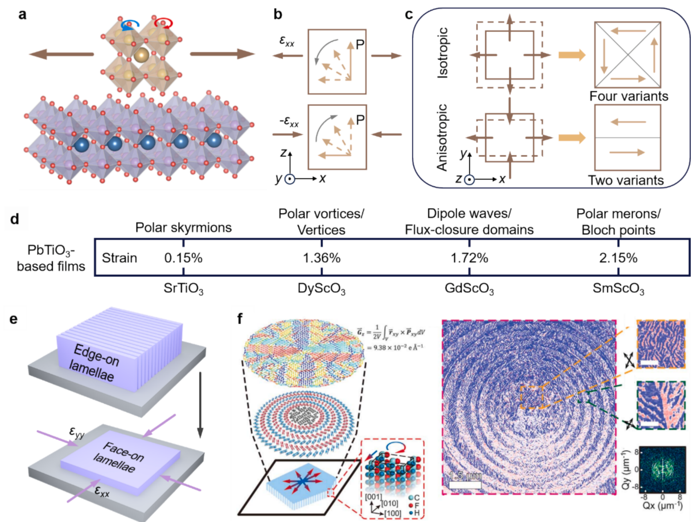
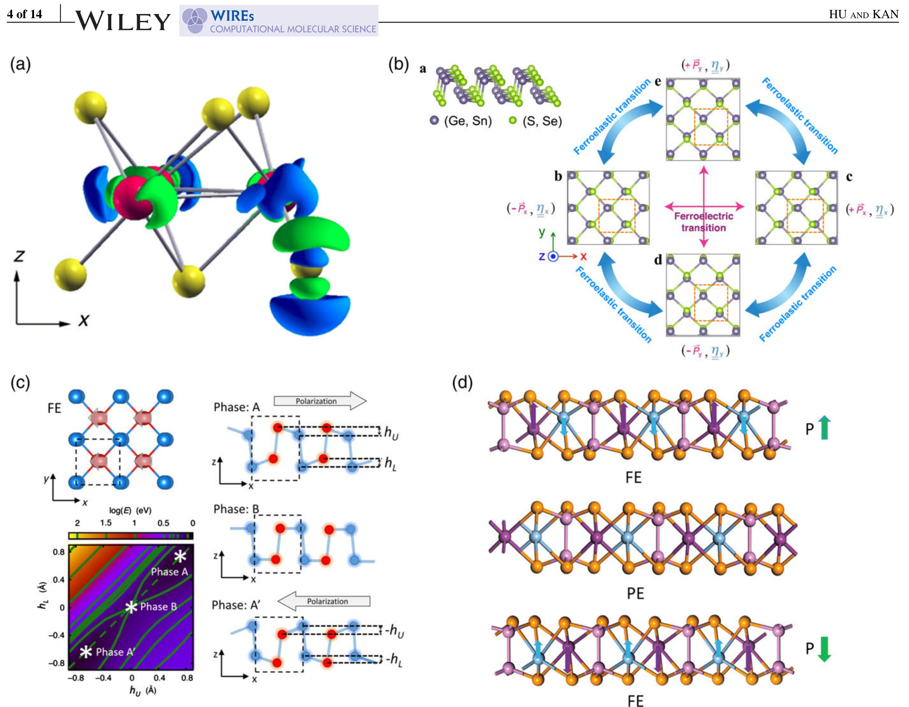
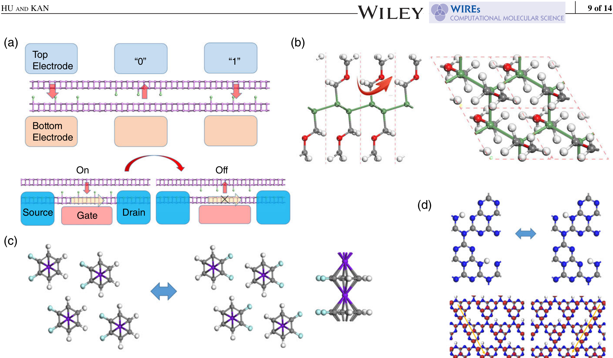
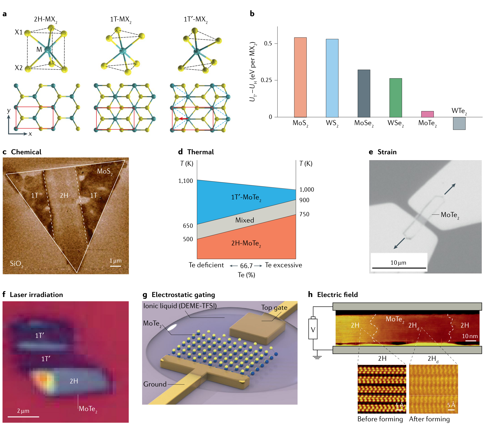
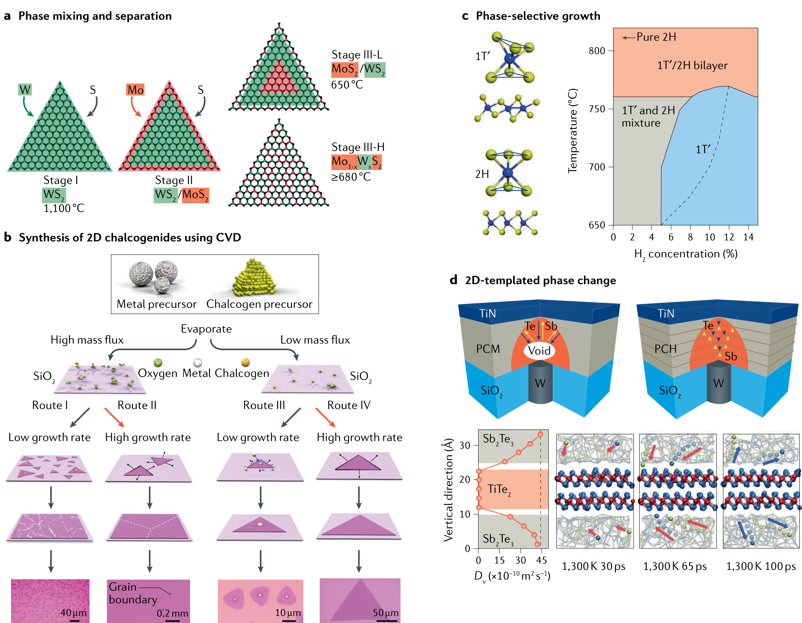
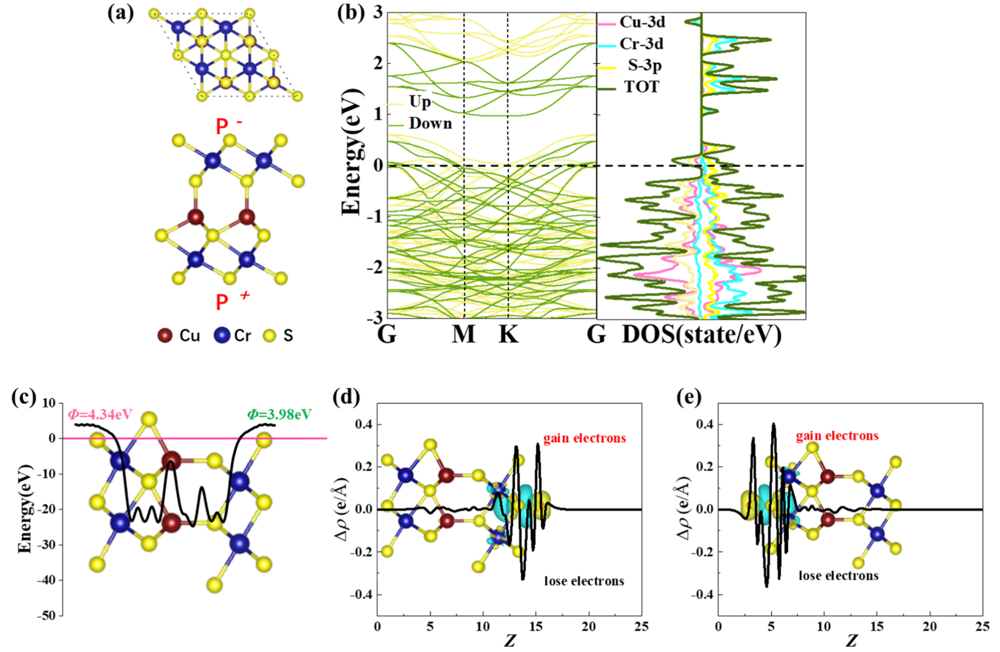
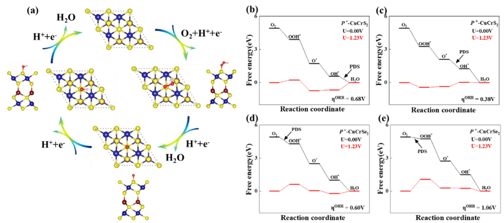
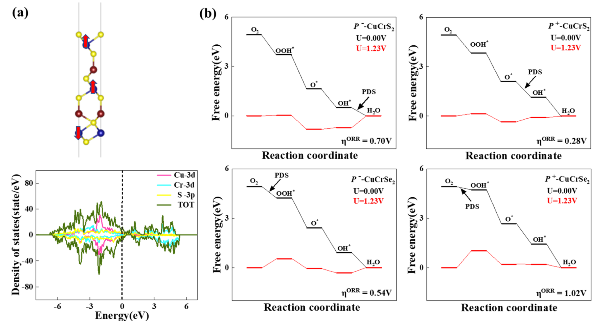
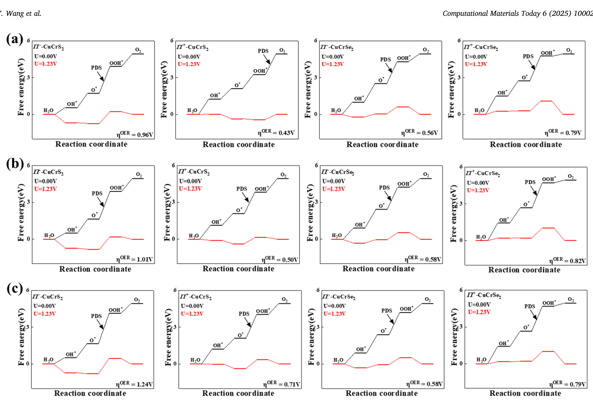

# 极性金属、拓扑相、CDW 与相变 (Polar Metals, Topological Phases & CDW)

> 收录极性/铁电金属、拓扑极性材料、电荷密度波（CDW）开关与二维结构相变相关图表，涵盖铁电异质结中的应变工程、单层 VS₂/TiTe₂ 的 CDW 能隙，以及 CuCrX₂ 极性金属表面的电催化反应。

[[科研Wiki/wiki/figures/_index|← 返回总索引]]

---

## 🌀 极性金属、拓扑相与电荷密度波 (Polar Metals, Topological Phases & CDW)

### 1. 表：低维多铁材料的极化、磁矩与翻转势垒
汇总多种二维功能化材料（磷烯-卤素、Ge-CH₂OCH₃、CrN、CuMP₂X₆、SrMnO₃ 等）的极化值、极化方向、磁矩、铁电翻转势垒与居里温度。

<table>
<thead>
<tr>
<th style="text-align:left">Materials</th>
<th style="text-align:left">Value of polarization (pC/m)</th>
<th style="text-align:left">Direction of polarization</th>
<th style="text-align:left">Magnetic moment (μB)</th>
<th style="text-align:left">FE switch barrier (meV)</th>
<th style="text-align:left">Tc (K)</th>
<th style="text-align:left">Reference</th>
</tr>
</thead>
<tbody>
<tr>
<td style="text-align:left">Phosphorene-halogen</td>
<td style="text-align:left">~11</td>
<td style="text-align:left">Out-of-plane</td>
<td style="text-align:left">1.0</td>
<td style="text-align:left">74–590</td>
<td style="text-align:left">~572</td>
<td style="text-align:left">66T</td>
</tr>
<tr>
<td style="text-align:left">Ge-CH2OCH3</td>
<td style="text-align:left">~80</td>
<td style="text-align:left">In-plane</td>
<td style="text-align:left">1.0</td>
<td style="text-align:left">~100</td>
<td style="text-align:left">—</td>
<td style="text-align:left">67T</td>
</tr>
<tr>
<td style="text-align:left">C6N8H</td>
<td style="text-align:left">36.3–45</td>
<td style="text-align:left">In-plane</td>
<td style="text-align:left">1.0</td>
<td style="text-align:left">70–480</td>
<td style="text-align:left">250–700</td>
<td style="text-align:left">68T</td>
</tr>
<tr>
<td style="text-align:left">Bilayer Cr2NO2, VS2, MoN2</td>
<td style="text-align:left">—</td>
<td style="text-align:left">Out-of-plane</td>
<td style="text-align:left">0.008–0.09</td>
<td style="text-align:left">—</td>
<td style="text-align:left">—</td>
<td style="text-align:left">69T</td>
</tr>
<tr>
<td style="text-align:left">CrN</td>
<td style="text-align:left">6.2</td>
<td style="text-align:left">Out-of-plane</td>
<td style="text-align:left">3</td>
<td style="text-align:left">12</td>
<td style="text-align:left">—</td>
<td style="text-align:left">70T</td>
</tr>
<tr>
<td style="text-align:left">CrB2</td>
<td style="text-align:left">0.9</td>
<td style="text-align:left">Out-of-plane</td>
<td style="text-align:left">1.5</td>
<td style="text-align:left">363</td>
<td style="text-align:left">—</td>
<td style="text-align:left">—</td>
</tr>
<tr>
<td style="text-align:left">CuMP2X6 (M = Cr, V; X = S, Se)</td>
<td style="text-align:left">0.65–0.79</td>
<td style="text-align:left">Out-of-plane</td>
<td style="text-align:left">2.0–3.0</td>
<td style="text-align:left">27–100</td>
<td style="text-align:left">—</td>
<td style="text-align:left">71T</td>
</tr>
<tr>
<td style="text-align:left">(CrBr3)2Li</td>
<td style="text-align:left">92</td>
<td style="text-align:left">In-plane</td>
<td style="text-align:left">3.0, 4.0</td>
<td style="text-align:left">15</td>
<td style="text-align:left">—</td>
<td style="text-align:left">72T</td>
</tr>
<tr>
<td style="text-align:left">SrMnO3</td>
<td style="text-align:left">55 μC/cm2</td>
<td style="text-align:left">In-plane</td>
<td style="text-align:left">—</td>
<td style="text-align:left">—</td>
<td style="text-align:left">Above 420</td>
<td style="text-align:left">73E</td>
</tr>
<tr>
<td style="text-align:left">Hf2VC2F2</td>
<td style="text-align:left">2.9 × 10−7</td>
<td style="text-align:left">Out-of-plane</td>
<td style="text-align:left">2.04</td>
<td style="text-align:left">—</td>
<td style="text-align:left">313</td>
<td style="text-align:left">74T</td>
</tr>
</tbody>
</table>

*   **来源**：[[../papers/huProgressProspectsLowdimensional2019]]
*   **关键特征**：涵盖面内/面外极化与磁矩共存的二维多铁候选体系，(CrBr₃)₂Li 极化高达 92 pC/m 而翻转势垒仅 15 meV。

### 2. 应变工程调控极性拓扑结构
通过 ABO₃ 型外延异质结的晶格失配施加弹性应变，改变晶格参数、氧八面体旋转与晶体对称性，从而调控铁电极化旋转和拓扑相。

*   **来源**：[[../papers/hanPolarTopologicalMaterials2025]]
*   **关键特征**：张应变与压应变在 x-y 平面内驱动四方铁电体的极化向不同方向旋转，是工程极性拓扑（涡旋、斯格明子）的核心手段。

### 3. 铁电异质结中的极性拓扑相图
在不同静电、弹性边界条件的衬底上生长铁电异质结，可形成周期性极性拓扑阵列；给出了 PbTiO₃/SrTiO₃ 超晶格在 DyScO₃ 衬底上的拓扑相图。

*   **来源**：[[../papers/hanPolarTopologicalMaterials2025]]

### 4. 二维范德华材料中铁电性的发现
展示了三类开创性二维铁电体系：cell-tripled 1T-MoS₂ 中由电荷密度差反演对称破缺证实的铁电性、第 IV 主族单硫族化物（MX）的铁弹/铁电序，以及相关单层结构的顶视图。

*   **来源**：[[../papers/huProgressProspectsLowdimensional2019]]

### 5. 化学功能化锗烯/锡烯与 MoS₂ 的可翻转极化
甲基封端的锗烯/锡烯、Sn(P,As,Sb)-CH₂OCH₃，以及经 CH₂F、CHO、COOH、CONH₂ 官能化的锗烯/锡烯和单层 MoS₂ 的侧视与顶视结构，蓝色箭头标示极化可翻转。

*   **来源**：[[../papers/huProgressProspectsLowdimensional2019]]

### 6. 化学功能化诱导的低维多铁性
展示基于卤素修饰磷烯双层的高密度二维多铁隧道结阵列与场效应晶体管（具有垂直极化与"可移动"磁性），以及 CH₂OCH₃ 功能化锗烯层的多铁结构模型。

*   **来源**：[[../papers/huProgressProspectsLowdimensional2019]]
*   **关键特征**：通过化学官能化在同一二维体系中同时引入铁电极化与磁性，实现电写磁读的高密度器件原型。

### 7. MBE 与拓扑反应制备单层 VS₂
通过 MBE 生长 VTe₂ 再经拓扑硫化反应制备单层 1T-VS₂，RHEED 图案证实晶格收缩，光电子能谱确认 Te 被完全替换，并以 STM 表征薄膜形貌。

*   **来源**：[[../papers/kawakamiChargedensityWaveAssociated2023]]

### 8. 单层 VTe₂ 与 VS₂ 的能带结构
40 K 下沿 KΓΜ 方向的 ARPES 强度图对比单层 VTe₂ 与 VS₂ 的能带色散，并与第一性原理计算的 1T-VS₂ 能带对比；VS₂ 整体谱线更为弥散，可能与 CDW 关联效应相关。

*   **来源**：[[../papers/kawakamiChargedensityWaveAssociated2023]]

### 9. 整个费米面上的 CDW 能隙打开
在 40 K 下沿多个代表性 k 切向的 ARPES 测量显示，单层 VS₂ 的整条费米面均出现 CDW 能隙，叠加在 1T-VS₂ 计算费米面上的实测强度印证了 CDW 序的二维全局特征。

*   **来源**：[[../papers/kawakamiChargedensityWaveAssociated2023]]
*   **关键特征**：CDW 能隙在整条费米面上一致打开，区别于仅在局部嵌套矢量处打开的常规 CDW 图像。

### 10. 2H↔1T′ 结构相变的多场驱动
汇总了二维 MoTe₂ 中的逆压电效应、激光诱导的 2H→1T′ 图案化、离子液体场效应晶体管中静电掺杂驱动的相变，以及垂直电场诱导 2Hd 导电丝的形成。

*   **来源**：[[../papers/liPhaseTransitions2D2021]]

### 11. 二维材料中的铁性相变
包括单层 1T′-WTe₂ 中等价取向态与铁弹性（三种取向变体对应相对于 1T 母相的微小自发应变及畴界），以及原子级薄 SnTe 中的铁电性晶体结构示意。

*   **来源**：[[../papers/liPhaseTransitions2D2021]]
*   **关键特征**：WTe₂ 中三种铁弹变体可由应变切换；SnTe 在原子级厚度下仍保留铁电极化。

### 12. 二维或二维模板化的扩散型相变
展示了 CVD 生长 MoS₂/WS₂ 异质结与 Mo_xW_{1−x}S₂ 固溶体时，高温下成分混合、低温下相分离的扩散相变过程，以及过渡金属硫族化合物形貌/缺陷含量对生长动力学的依赖。

*   **来源**：[[../papers/liPhaseTransitions2D2021]]

### 13. 双层 CuCrS₂ 极性金属的几何与电子结构
双层 CuCrS₂ 的几何结构、能带结构与态密度，以及 xy 平面平均静电势；并给出氧原子吸附在 P⁻ 与 P⁺ 两表面时沿 −z 方向的差分电荷密度积分（黄色为电子积累、蓝色为耗尽）。

*   **来源**：[[../papers/wangTwodimensionalFerroelectricMetal2025]]
*   **关键特征**：两极性表面对氧吸附的电荷响应显著不对称，为铁电金属表面电催化选择性提供微观基础。

### 14. 双层 CuCrX₂ 表面的 ORR 反应路径
双层 CuCrX₂ 表面氧还原反应（ORR）的路径示意，以及四电子路径下 P⁻、P⁺ 两表面的吉布斯自由能变化图。

*   **来源**：[[../papers/wangTwodimensionalFerroelectricMetal2025]]

### 15. 三层 CuCrS₂ 的自旋构型与 ORR 自由能
三层 CuCrS₂ 的基态自旋构型与投影态密度（PDOS），以及三层 CuCrX₂ 两表面在四电子 ORR 路径下的吉布斯自由能变化图。

*   **来源**：[[../papers/wangTwodimensionalFerroelectricMetal2025]]

### 16. 多层 CuCrX₂ 表面的 OER 自由能
双层、三层与四层 CuCrX₂ 两表面在四电子析氧反应（OER）路径下的吉布斯自由能变化图，对比不同厚度与极性面对反应决速步的影响。

*   **来源**：[[../papers/wangTwodimensionalFerroelectricMetal2025]]

### 17. 单层 1T-TiTe₂ 的晶体结构与 CDW 能带折叠
生长于双层石墨烯/SiC 上的单层 TiTe₂ 晶体结构示意，hν = 80 eV 的 EDC，30 K 下沿 MΓM 方向的 ARPES 强度图与第一性原理能带对比，以及 1T-TiTe₂ 正常相与 CDW 相的布里渊区（CDW 折叠由虚线标示）。

*   **来源**：[[../papers/yanagizawaSwitchingChargedensityWave2023]]
*   **关键特征**：白色箭头标示的折叠能带对应 CDW 超结构波矢，证实单层 1T-TiTe₂ 中的 CDW 序。

### 18. 单层 TiTe₂ 的 CDW 相 ARPES 能带结构
单层 TiTe₂ 在 CDW 相中的 ARPES 强度图以及整体能带结构示意，对比显示 CDW 折叠对费米面附近能带的重构。

*   **来源**：[[../papers/yanagizawaSwitchingChargedensityWave2023]]

### 19. 电子掺杂对 TiTe₂ 磁化率 χ₀(q) 的调控
电子掺杂前后单层 TiTe₂ 的 Re[χ₀(q)] 强度图对比，两图化学势相差 0.1 eV，用于揭示费米能级移动对 CDW 波矢处磁化率峰的影响。

![图：电子掺杂前后单层 TiTe₂ 的 Re[χ₀(q)] 磁化率强度对比](../../raw/figures/yanagizawaSwitchingChargedensityWave2023/fig_4_BQBPQY75.png)
*   **来源**：[[../papers/yanagizawaSwitchingChargedensityWave2023]]
*   **关键特征**：化学势移动 0.1 eV 即可显著改变 χ₀(q) 的峰位与强度，为静电门控开关 CDW 提供理论依据。

---

## 🔗 相关概念与实体 (Related Concepts & Entities)

**核心概念**：[[../concepts/polar-metals|极性金属]]、[[../concepts/ferroelectric-metal|铁电金属]]、[[../concepts/charge-density-wave|电荷密度波（CDW）]]、[[../concepts/multiferroicity|多铁性]]、[[../concepts/ferroelectricity|铁电性]]、[[../concepts/ferroelasticity|铁弹性]]、[[../concepts/strain-engineering|应变工程]]、[[../concepts/topological-defects|极性拓扑缺陷（涡旋/斯格明子）]]、[[../concepts/electronic-phase-transition|电子结构相变]]、[[../concepts/electrocatalysis|电催化（ORR/OER）]]

**相关材料/实体**：[[../entities/VS2|VS₂]]、[[../entities/TiTe2|TiTe₂]]、[[../entities/VTe2|VTe₂]]、[[../entities/MoTe2|MoTe₂]]、[[../entities/WTe2|WTe₂]]、[[../entities/SnTe|SnTe]]、[[../entities/SrMnO3|SrMnO₃]]、[[../entities/PbTiO3|PbTiO₃]]、[[../entities/CuCrSe2|CuCrX₂（CuCrS₂/CuCrSe₂）]]、[[../entities/group-iv-monochalcogenides|第 IV 主族单硫族化物 MX]]
