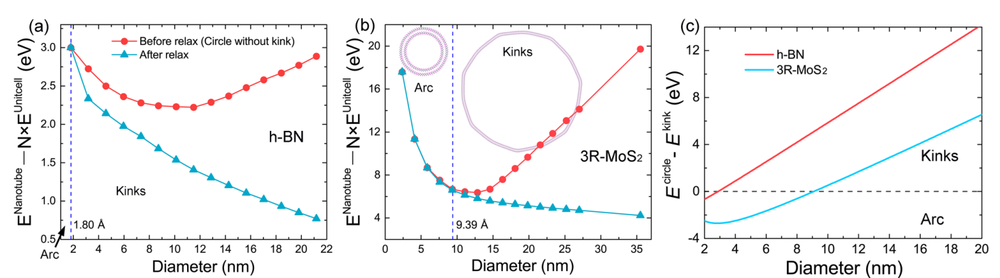

# 层间滑移铁电：机制、翻转与动力学 (Sliding Ferroelectricity: Mechanism & Switching)

> 收录层间滑移铁电的物理机制、层间滑动路径、极化翻转动力学与超快切换相关图表，涵盖双层/多层 BN、TMD、RuX₂、HgX₂ 等范德华体系，并附关键的计算数据表格。

[[科研Wiki/wiki/figures/_index|← 返回总索引]]

---

## 🖼️ 滑移机制、堆积路径与翻转动力学 (Sliding Mechanism, Stacking Pathways & Switching Dynamics)

### 1. 表：HgX₂ 块体与双层的层间结合能与极化
计算给出 HgX₂（X=Cl、Br、I）块体及双层的层间结合能 Eb、面外极化 P、Hg 相对八面体中心的极性位移 dHg，以及 FE-PE 能垒 ΔE。

*   **来源**：[[../papers/chenStrongSlidingFerroelectricity2024]]
*   **关键特征**：FE-HgI₂ 双层极化可达约 0.16 μC/cm²，实验上可探测。

### 2. 表：RuX₂ 双层/三层的晶格常数、MAE 与极化
列出 RuCl₂、RuBr₂、RuI₂ AB 堆积的面内晶格常数 a、磁各向异性能 MAE，以及双层 P₁ 与三层 P₂ 滑移铁电极化。

*   **来源**：[[../papers/hanTunableSlidingFerroelectricity2025]]
*   **关键特征**：随卤素原子量增加，极化与 MAE 同步显著增大。

### 3. 表：DP 模型与 DFT 对 h-BN 双层结构的对比
深度势能（DP）模型与 DFT 完全弛豫得到的各种堆积双层/单层的晶格常数、层间距、键长（Å）与能量（meV）。

*   **来源**：[[../papers/heUltrafastSwitchingDynamics2024]]
*   **关键特征**：DP 模型与 DFT 结果高度吻合，支撑大尺度动力学模拟的可靠性。

### 4. 表：1T″-MoSe₂ 双层 S5、S6 态的极化组态
列出 S5、S6 态中顶层与底层本征极化 P_T^I、P_B^I、层间极化组态 P_T^I−P_B^I 以及总极化 P_tot（单位 pC/m）。

*   **来源**：[[../papers/tangCombiningIntrinsicSlidinginduced2025]]
*   **关键特征**：本征极化与滑移诱导极化组合可形成六重极化多态。

### 5. 表：AB 堆积范德华双层的垂直极化
系统计算了多种 AB 堆积范德华双层（如 BN、MoS₂、InSe 等）的垂直极化值。

*   **来源**：[[../papers/wuSlidingFerroelectricity2D2021a]]
*   **关键特征**：普遍存在的层间电荷转移使非极性组分也能产生面外极化。

### 6. 表：论文结构与核心作用对应
梳理论文各板块（引言、方法、结果与讨论、结论）的对应内容及其在论证滑移铁电中的核心作用。

<table><thead><tr><th>论文板块</th><th>对应内容</th><th>核心作用</th></tr></thead><tbody><tr><td>Introduction</td><td>背景综述与问题提出</td><td>建立研究必要性与知识基础</td></tr><tr><td>Methods</td><td>VASP计算方法、DFT参数设置</td><td>保证计算的可靠性</td></tr><tr><td>Results &amp; Discussion</td><td>结构稳定性 → 电子/磁性质 → 滑动铁电性质 → 极化调控（层数、应变） → MAE机制 → 铁谷讨论</td><td>系统呈现结果并辅以机制分析</td></tr><tr><td>Conclusion</td><td>总结发现、展望应用</td><td>提炼核心贡献</td></tr></tbody></table>

*   **来源**：[[../papers/hanTunableSlidingFerroelectricity2025]]

### 7. 表：RuX₂ 晶格、极化与磁各向异性能汇总
不同卤素 RuX₂ 体系的晶格常数、双层/三层层间极化及 MAE 数值。

<table><thead><tr><th>指标</th><th>晶格常数a（Å）</th><th>双层P1(pC/m)</th><th>三层P2(pC/m)</th><th>MAE（meV）</th></tr></thead><tbody><tr><td>RuCl₂</td><td>3.447</td><td>0.087</td><td>0.13</td><td>2.79</td></tr><tr><td>RuBr₂</td><td>3.613</td><td>0.16</td><td>0.28</td><td>6.59</td></tr><tr><td>RuI₂</td><td>3.897</td><td>0.49</td><td>1.03</td><td>14.28</td></tr></tbody></table>

*   **来源**：[[../papers/hanTunableSlidingFerroelectricity2025]]
*   **关键特征**：RuI₂ 双层/三层极化分别为 0.49、1.03 pC/m，MAE 高达 14.28 meV。

### 8. 表：滑移铁电的非易失存储应用优势
总结滑移铁电在 FeFET 等非易失存储应用方向上的优势。

<table><thead><tr><th>应用方向</th><th>优势</th></tr></thead><tbody><tr><td>非易失存储（FeFET）</td><td>切换能量低、反转快，多层堆叠纳米尺度构建</td></tr></tbody></table>

*   **来源**：[[../papers/hanTunableSlidingFerroelectricity2025]]

### 9. HgI₂ 层间滑移铁电与 Rashba 自旋纹理总览
FE-HgI₂ 兼具强滑移铁电性（高达 0.16 μC/cm²）与层间滑移可调的 Rashba 自旋纹理，可实现二维尺度上电控自旋探测。

*   **来源**：[[../papers/chenStrongSlidingFerroelectricity2024]]
*   **关键特征**：极化强度实验可探测，适用于二维自旋电子器件。

### 10. HgI₂ 中 PE→±P 铁电相的层间滑移转变
（a）中心对称顺电相 PE 经层间滑移转变为具有相反面外极化的 ±P 铁电相的侧视与顶视示意；（b）PE-HgI₂ 块体声子谱中显著的虚频软模指示层间滑移不稳定性。

*   **来源**：[[../papers/chenStrongSlidingFerroelectricity2024]]
*   **关键特征**：层间偶极（红色箭头）随滑移反向，无需离子反转即可翻转极化。

### 11. FE-HgI₂ 的电势分布、翻转路径与电荷密度差
（a）FE-HgI₂ 双层的面平均静电势与屏蔽电荷 Δρ 分布，两端存在非零电势差；（b）±P 态间翻转路径与能垒（HgI₂、HgBr₂）；（c）层间电荷密度差揭示极化的层间起源。

*   **来源**：[[../papers/chenStrongSlidingFerroelectricity2024]]

### 12. HgI₂ 多层中极化随层数的演化
（a）三至六层 HgI₂ 多层的面平均屏蔽电荷分布，可区分层间区与单层区对总极化的贡献，顶/底表面积累极性表面电荷；（b）总极化随层数的演化。

*   **来源**：[[../papers/chenStrongSlidingFerroelectricity2024]]
*   **关键特征**：极化主要来自层间电荷重构，随层数近似线性累加。

### 13. FE 与 PE 相 HgI₂ 双层能带与 Rashba 自旋劈裂
FE（+P）与 PE 相 HgI₂ 双层的能带结构对比；FE 相带边出现 Rashba 自旋劈裂，VBM/CBM 分裂为内、外自旋分辨支，呈顺时针/逆时针螺旋纹理，而中心对称 PE 相无此劈裂。

*   **来源**：[[../papers/chenStrongSlidingFerroelectricity2024]]
*   **关键特征**：滑移极化直接耦合 Rashba 效应，可电控自旋纹理。

### 14. 单层 RuX₂ 结构、声子谱与双层磁构型
（a）单层 RuX₂ 原子结构；（b）声子谱验证动力学稳定性；（c）双层 RuCl₂ 在 AFM 与 FM 构型下的自旋极化电荷密度（青色/红色分别对应自旋上/下）。

*   **来源**：[[../papers/hanTunableSlidingFerroelectricity2025]]

### 15. RuX₂ 双层极化翻转路径与高对称堆积
（a）双层 RuX₂ 在 ±P 态间翻转的过渡路径；（b）AB、AA、BA 三种高对称堆积结构示意，红色虚线标示侧向滑移引起的堆积次序变化，黄色箭头为极化方向。

*   **来源**：[[../papers/hanTunableSlidingFerroelectricity2025]]
*   **关键特征**：翻转能垒分别为 7.10、15.31、37.84 meV/f.u.（RuCl₂、RuBr₂、RuI₂）。

### 16. RuX₂ 极化纹理与层间差分电荷密度
（a）–（c）RuCl₂、RuBr₂、RuI₂ 的极化纹理，三圆分别对应 AB、AA、BA 堆积，AB/BA 处极化最大；（d）–（f）RuI₂ 双层三种堆积的层间电荷密度及沿 z 轴的面积分差分电荷密度。

*   **来源**：[[../papers/hanTunableSlidingFerroelectricity2025]]
*   **关键特征**：层间电荷得失直接决定 AB/BA 处的反向极化。

### 17. RuX₂ 三层极化翻转路径与堆积结构
（a）三层 RuX₂ 在 ±P 态间翻转的过渡路径；（b）三种高对称结构示意：底两层固定为 AB 堆积，上两层分别构成 AB、AA、BA 堆积。

*   **来源**：[[../papers/hanTunableSlidingFerroelectricity2025]]
*   **关键特征**：三层翻转能垒为 7.16、16.41、35.37 meV/f.u.，与双层相当。

### 18. 不同弯曲角下 AB 畴双层 h-BN 的原子结构
（a）平坦双层沿扶手椅方向人工弯曲的示意，弯曲诱导层间滑移 Δd=θ×D（D 为层间距）；（b）–（d）不同弯曲角下优化后的原子结构。

*   **来源**：[[../papers/heSwitchingTwodimensionalSliding2025]]
*   **关键特征**：弯曲角直接换算为层间滑移距离，几何驱动极化翻转。

### 19. DP 预测的扭折形成能景与弯曲角弛豫
（a）弯曲诱导滑移路径上的堆积能景：AB、BA 为局域极小，鞍点 SP 与 AA 为局域极大，绿色球示意不稳定构型向 AB/BA 弛豫；（b）优化弯曲角随参数的变化。

*   **来源**：[[../papers/heSwitchingTwodimensionalSliding2025]]

### 20. 弯曲 h-BN 中的扭折畴壁与循环切换
（a）31° 扭折形成 Néel 型畴壁，极化由向上平滑旋转至向下；（b）57° 扭折形成 Ising 型铁电畴壁，壁心极化为零；（c）弯曲滑移诱导 AB→SP→BA→AA 循环切换示意。

*   **来源**：[[../papers/heSwitchingTwodimensionalSliding2025]]
*   **关键特征**：扭折作为几何约束下的滑移铁电畴壁，类型由弯曲角决定。

### 21. h-BN 与 3R-MoS₂ 纳米管形成能及圆管-扭折能量差
（a）、（b）DP 模型计算的 h-BN、3R-MoS₂ 纳米管形成能随管径的变化（弛豫前后对比）；（c）解析模型给出的圆形纳米管与扭折纳米管能量差随管径的变化。

*   **来源**：[[../papers/heSwitchingTwodimensionalSliding2025]]
*   **关键特征**：小管径下扭折构型能量更优，是弯曲体系的几何弛豫模式。

### 22. h-BN 双层极化随侧向滑移的映射与最小能垒路径
（a）DFT 与机器学习势计算的电极化矢量：上层相对下层在一个单胞内侧向滑移时面外极化 Pz 的彩色映射；（b）沿最小能垒平移路径的面外极化与总能量变化，AB、BA 对应两反向自发极化态。

*   **来源**：[[../papers/heUltrafastSwitchingDynamics2024]]
*   **关键特征**：AB↔BA 间翻转能垒极低，是超快切换的能量基础。

### 23. h-BN 双层 AB 畴的声子色散与态密度
DP 模型与 DFT 分别计算的 h-BN 双层 AB 畴声子色散关系及声子态密度（DOS）。

*   **来源**：[[../papers/heUltrafastSwitchingDynamics2024]]
*   **关键特征**：DP 声子谱与 DFT 吻合，验证机器学习势的动力学精度。

### 24. 温度依赖的 h-BN 双层结构与极化
4 万原子超胞 AB 堆积双层 h-BN 在 0–700 K 的 DPMD 模拟：（a）原子结构；（b）层间距与极化随温度变化；（c）垂直极化与层间距的关系。

*   **来源**：[[../papers/heUltrafastSwitchingDynamics2024]]
*   **关键特征**：极化与层间距强相关，高温下仍保持层间铁电序。

### 25. 300 K 下 h-BN 双层畴壁运动的时变模拟
（a）含两个 0° 畴壁的铁电纹理在 t=0 施加横向剪切力 Fs=5×10⁻³ eV/Å 后，0、2.5、5、8、9 ps 的快照，畴壁快速运动并在约 9 ps 后湮灭；（b）0° 与 90° 畴壁在剪切应力下 AB 畴随时间的演化。

*   **来源**：[[../papers/heUltrafastSwitchingDynamics2024]]
*   **关键特征**：畴壁速度约 6000 m/s，临界翻转场较整体滑移降低两个数量级。

### 26. 扭转莫尔双层 BN 极化随垂直电场的变化
扭转莫尔双层 BN 的空间平均极化随垂直电场 Ev 的变化；插图为最大电场与零电场下近乎可逆的极化纹理。

*   **来源**：[[../papers/heUltrafastSwitchingDynamics2024]]
*   **关键特征**：莫尔铁电可被垂直电场近可逆调控。

### 27. 本征与滑移诱导极化组合的多态示意
复合铁电体中本征极化 P^I（源于层内离子运动）与滑移诱导极化 P^S（依赖堆积方式）组合，在双层中可形成八个极化态；（a）、（b）为畸变 1T 相（铁电）H 堆积双层的两种层间极化耦合组态。

*   **来源**：[[../papers/tangCombiningIntrinsicSlidinginduced2025]]
*   **关键特征**：两类极化独立可控，极大扩展了铁电存储的态密度。

### 28. 1T″-MoSe₂ 双层的极化多态
（a）1T″-MoSe₂ 单层几何结构（1T 相的 2×2 超胞）；（b）单层极化翻转能垒；（c）–（i）H 堆积双层的各种堆积构型；（j）各堆积 P^S 符号；（k）–（p）对应极化分布。

*   **来源**：[[../papers/tangCombiningIntrinsicSlidinginduced2025]]
*   **关键特征**：H 堆积下可实现六重可切换极化态。

### 29. 1T″-MoSe₂ 双层多态间的转换路径
（a）、（b）S1-S2-S3-S4 与 S1-S2-S5-S6-S3-S4 路径的能垒（仅示本征极化向下的层）；（c）六重极化态的切换；（d）各态净极化及相互间能垒。

*   **来源**：[[../papers/tangCombiningIntrinsicSlidinginduced2025]]
*   **关键特征**：多步低能垒路径使六态切换在能量上可行。

### 30. 1T″-MoSe₂ 三层十态极化转换
（a）–（e）转换涉及的堆积次序；（f）外电场下十个极化态切换示意；（g）各态极化大小及路径能垒。

*   **来源**：[[../papers/tangCombiningIntrinsicSlidinginduced2025]]
*   **关键特征**：层数增加使可切换态数增至十个，利于多态存储。

### 31. 滑移铁电机制总览：BN、莫尔与 3R 相
（A）BN 双层经层间滑移的铁电翻转路径，黑箭头由带正电 B 指向邻层带负电 N，红箭头为极化方向；（B）扭转 BN 双层莫尔超晶格中的铁电畴；（C）铁电性 3R 块体 MoS₂ 与 InSe；（D）相关机制延伸。

*   **来源**：[[../papers/wuSlidingFerroelectricity2D2021a]]
*   **关键特征**：层间滑移是贯穿双层、莫尔与 3R 块体的统一铁电机制。

### 32. 不同堆积下的极性/非极性相
（A）ABC 与 AB 堆积块体 BN 的层间差分电荷密度（蓝/黄分别为电子耗尽/积累）；（B）不同堆积块体 MoS₂；（C）三方与六方 SnS₂；（D）正交与单斜 WTe₂；（E）R 型与 H 型 CrI₃/CrBr₃。

*   **来源**：[[../papers/wuSlidingFerroelectricity2D2021a]]
*   **关键特征**：堆积次序是决定层状材料极性有无的通用开关。

### 33. WTe₂ 与 BN 薄层中铁电性的实验探测
（A）探测 WTe₂ 薄片铁电畴与偏压依赖压电响应相位的器件装置与图像；（B）由金属顶栅（Au/Cr）/hBN/石墨烯/0° 平行堆积双层 BN（P-BBN）/hBN/金属底栅（PdAu）构成的双栅范德华异质结器件，及石墨烯电阻 Rxx 随 VT/dT 的变化。

*   **来源**：[[../papers/wuSlidingFerroelectricity2D2021a]]
*   **关键特征**：石墨烯电阻的滞后回线标志双层 BN 极化的电可切换性。

### 34. 莫尔铁电性
（A）扭转 hBN 的静电力显微镜图像，呈三角形势调制；（B）扭转半导体双层不同堆积区上下层能带的相对偏移示意；（C）莫尔超胞不同堆积区层间激子能量随扭转角的变化。

*   **来源**：[[../papers/wuSlidingFerroelectricity2D2021a]]
*   **关键特征**：莫尔周期势在局域域内诱发可重构的铁电极化。

### 35. 低翻转能垒与高热稳定性
（A）WTe₂ 双层中低"集体"能垒的铁电翻转与高"孤立"能垒的 FE-AFE 转变对比；（B）MoS₂ 双层中的波纹位错（ripplocation）；（C）BN 双层中光驱动的 AA′→AB′ 堆积转变。

*   **来源**：[[../papers/wuSlidingFerroelectricity2D2021a]]
*   **关键特征**：集体滑移机制兼具低翻转能垒与高热稳定性。

### 36. 滑移铁电的机遇示意
以示意图总结滑移铁电在基础物理与器件应用方面的未来机遇。

*   **来源**：[[../papers/wuSlidingFerroelectricity2D2021a]]

### 37. 单层 GeSe 的铁性相变
（a）单层 GeSe 晶体结构；（b）具有不同自发应变 η 与极化 P 的四个等价畴变体；（c）升降温过程中势能随温度的演化；（d）升降温中平均晶格参数变化；（e）–（h）典型原子构型。

*   **来源**：[[../papers/yangRipplingFerroicPhase2021]]
*   **关键特征**：升温/降温中势能与晶格参数突变，指示一级铁性相变。

### 38. 波纹对温度诱导铁性相变的影响
（a）无约束（粉）与受约束（绿）模型在降温中平均铁性序参量随温度的演化；（b）两者的温度依赖弛豫时间 τ；（c）平均曲率 κ 的演化及 κ 与铁性序沿 x、y 方向的关联。

*   **来源**：[[../papers/yangRipplingFerroicPhase2021]]
*   **关键特征**：波纹曲率与铁性序强相关，改变相变温度与动力学。

### 39. 双轴应变对波纹的调控
（a）350 K 下单层 GeSe 平均曲率随双轴应变的变化；（b）、（c）0% 应变下 2.0 ps 平均的表面形貌与局域铁性序；（d）、（e）0.2% 双轴压缩应变下的对应结果，压缩增强波纹而拉伸使其弛豫。

*   **来源**：[[../papers/yangRipplingFerroicPhase2021]]
*   **关键特征**：0.2% 压缩应变即可显著增强波纹并调制铁性畴。

### 40. 波纹对铁性畴切换的影响
（a）50 K 下相对平坦（蓝）与强波纹（红）单层 GeSe 的应力-应变曲线；（b）–（i）平坦样品中应力诱导畴切换的典型构型；（j）–（q）强波纹样品中的对应过程；（r）应力降的概率分布，波纹使截断幂律分布发生改变。

*   **来源**：[[../papers/yangRipplingFerroicPhase2021]]
*   **关键特征**：波纹改变畴切换的雪崩统计，从截断幂律过渡到不同分布。

---

## 🔗 相关概念与实体 (Related Concepts & Entities)

**核心概念**：[[../concepts/sliding-ferroelectricity|滑移铁电性]]、[[../concepts/ferroelectricity|铁电性]]、[[../concepts/polarization-switching|极化翻转]]、[[../concepts/polarization-multistates|极化多态]]、[[../concepts/moire-superlattice|莫尔超晶格]]、[[../concepts/rashba-spin-texture|Rashba 自旋纹理]]、[[../concepts/interlayer-charge-transfer|层间电荷转移]]、[[../concepts/domain-wall-motion|畴壁运动]]、[[../concepts/strain-engineering|应变工程]]、[[../concepts/machine-learning-potential|机器学习势]]

**相关材料/实体**：[[../entities/h-BN|h-BN（六方氮化硼）]]、[[../entities/TMDs|TMDs（过渡金属二硫化物）]]、[[../entities/WTe2|WTe₂]]、[[../entities/graphene|石墨烯]]、[[../entities/HgI2|HgI₂]]、[[../entities/HgBr2|HgBr₂]]、[[../entities/GeSe|GeSe]]、[[../entities/CrI3|CrI₃]]、[[../entities/deep-potential|Deep Potential（DP）]]、[[../entities/VASP|VASP]]、[[../entities/FeFET|FeFET（铁电场效应管）]]
