---
tags:
  - type/figure-collection
---

# 异质结与堆叠

> 异质结、堆叠、范德华异质结构、莫尔超晶格、界面结构

## 条目

### 1. Dielectric and conductivity spectra
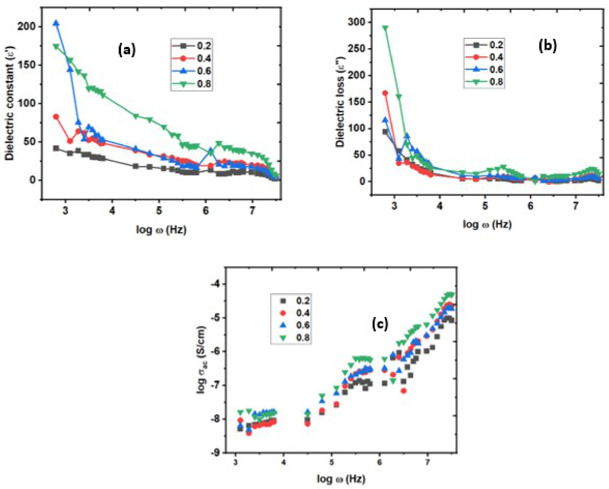
*   **来源**：[[../papers/Perugu2024morphology]]
*   **图示描述**：三联子图 (a)(b)(c) 共享横轴 log ω（对应 42 Hz–5 MHz）；(a) 纵轴为介电常数实部 ε'，(b) 为虚部 ε''，(c) 为交流电导率对数 log σ_ac（S/cm），四条曲线对应 x=0.2–0.8。
*   **关键特征**：所有样品在低频下 ε'、ε'' 都很高，随频率升高迅速下降，到 log ω≈5.864 后趋于平缓并出现共振/弛豫，是典型 Maxwell-Wagner 界面（空间电荷）极化；介电损耗在 log ω=5.483 与 7.492 处出现两个弛豫峰；ε'、ε'' 与 σ_ac 均随 La 含量增加而整体升高，σ_ac 用 Jonscher 幂律 σ_ac=Aωⁿ+σ_dc 拟合，n 值在 0.364–0.872 之间，log σ_dc 由 −6.869 增至 −6.186 S/cm；x=0.8 样品在 100 Hz 下 ε'=174.8、ε''=290.2。

### 2. 图2 铁性序（M/P/ε）及其磁电、压电、磁致伸缩交叉耦合与I/II型分类
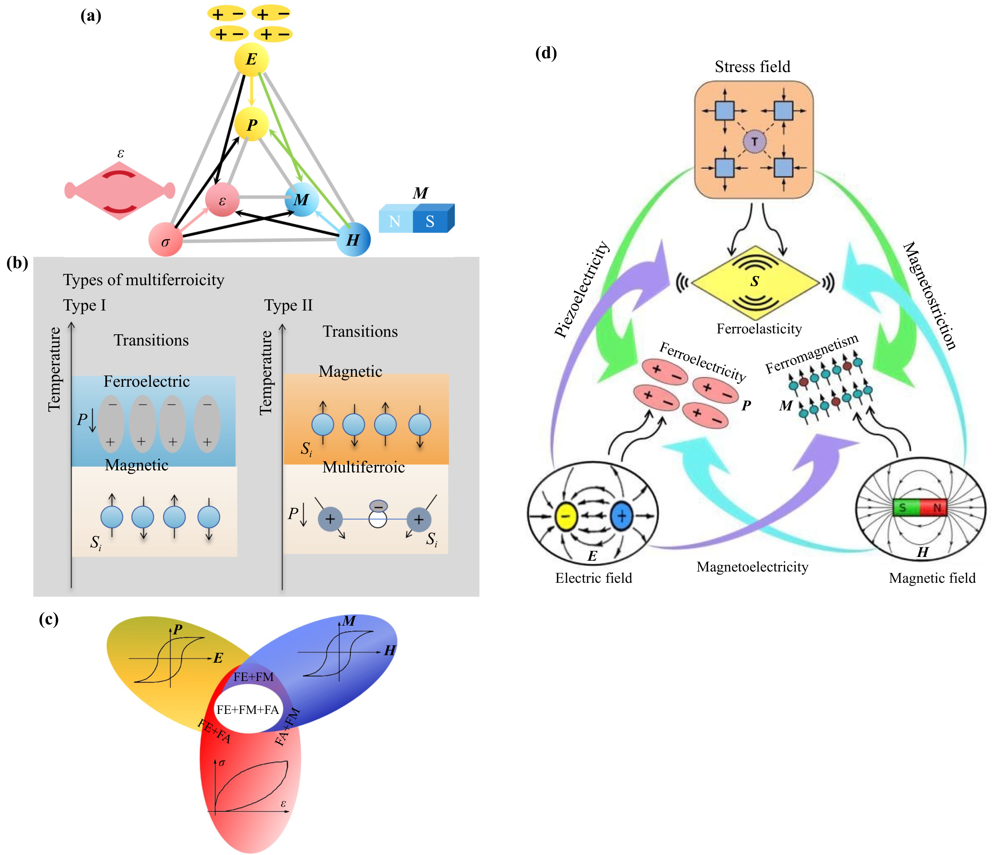
*   **来源**：[[../papers/RecentAdvancesGrowth2025]]
*   **图示描述**：三幅示意子图展示三种"自上而下"的液相剥离机制：(a) 离子插层（离子进入层间扩大间距、削弱 vdW 力）、(b) 离子交换（溶液离子与层间离子反应实现剥离）、(c) 超声辅助剥离（空化气泡破裂产生的微射流克服层间作用力）。
*   **关键特征**：离子插层可能引入杂质或改变母体结构；超声辅助是当前最普遍、高效的液相路线；共同缺点是产率有限、片层尺寸小、可能残留溶剂/离子污染，层数与尺寸可控性差。

### 3. 图4：六边形 CA 网格的中心元胞与六个最近邻
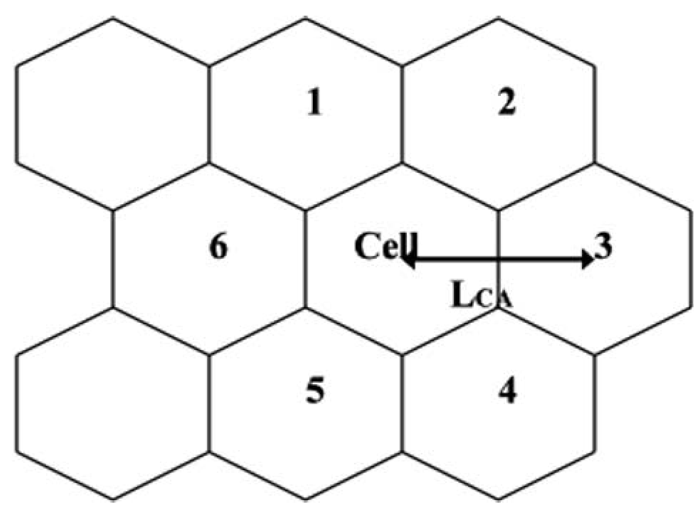
*   **来源**：[[../papers/Zhang2002b]]
*   **图示描述**：二维六边形格子，标出中心元胞 (i,j) 及编号 1–6 的六个最近邻，L_CA 为相邻元胞中心间距。
*   **关键特征**：网格为 200×200 元胞、对应 0.6×0.6 mm 试样；各边界面采用周期性边界；显式有限体积扩散式 16–17 中的求和即遍历这 6 个邻居；时间步长 Δt（式 23）以 L_CA 为特征长度。

### 4. 图5：元胞的 γ / α / α-γ 界面三种状态
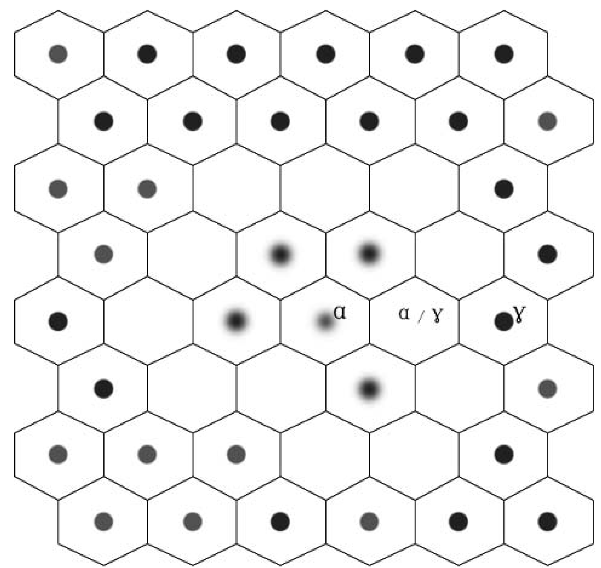
*   **来源**：[[../papers/Zhang2002b]]
*   **图示描述**：展示连续 α/γ 相界面如何被离散到 CA 网格上，元胞可处于奥氏体 γ、铁素体 α 或 α/γ 界面三种状态之一。
*   **关键特征**：界面元胞同时携带 α、γ 两相分数 f（式 21），扩散系数按 f 在 Dα、Dγ 间加权（式 19–20）；每个元胞还用 1–100 的整数标记结晶取向以区分不同晶粒；模型只考虑 γ→α，不考虑逆相变。

### 5. 元胞三态：α/γ/α-γ界面

*   **来源**：[[../papers/Zhang2003a]]
*   **图示描述**：CA 网格中元胞的三种状态示意图——α（铁素体）、γ（奥氏体）以及介于两者之间的"α/γ 界面"过渡态。
*   **关键特征**：界面元胞不是几何边界而是活跃的溶质再分配区域；铁素体通过"界面元胞被相邻 α 元胞捕获"实现生长，同时碳原子向周围 γ 元胞扩散；形核仅发生在奥氏体晶界元胞上。

### 6. 图4 Ti135/Ti257/Ti895不同温度PDF与原子堆积快照
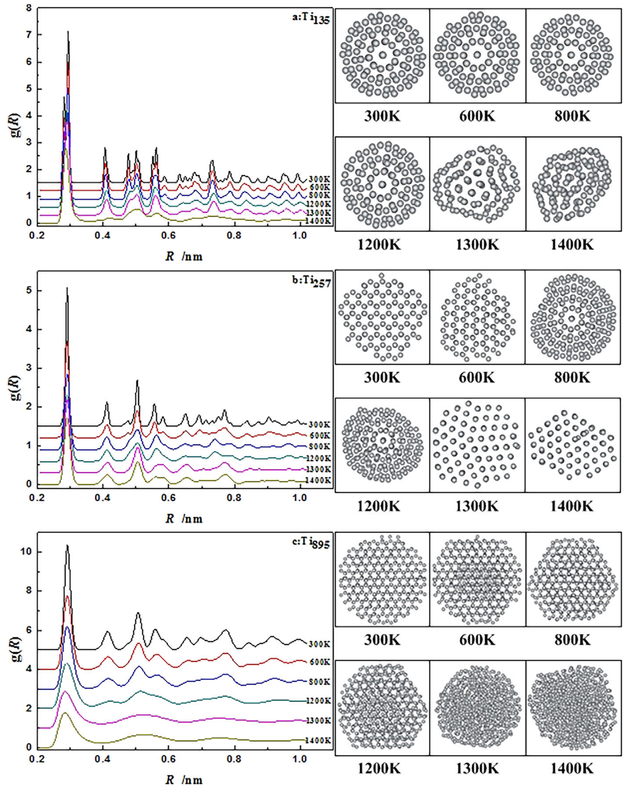
*   **来源**：[[../papers/Zhang2019a]]
*   **图示描述**：三栏(a/b/c)分别对应Ti135、Ti257、Ti895，左侧为300–1400 K若干温度的对分布函数$g(R)$（R以nm为单位），右侧为统计窗内能量最低构型的原子堆积快照。
*   **关键特征**：Ti135在300 K即呈Ih特征PDF并保持至1200 K，1400 K峰消失转为液态；Ti257在800 K出现峰位右移与远峰突变，对应HCP→Ih→FCC，1300 K形成五重孪晶（界面为HCP），1400 K分裂为两块；Ti895主峰在1300 K前保持HCP，仅峰高降低，1300 K后突变为液态；PDF与快照互为印证，是全文最综合的结构演变证据。

### 7. 图7 铁电金属 WTe₂：三个等效畸变矢量、层间滑移翻转路径与差分电荷密度

*   **来源**：[[../papers/bhowalPolarMetalsPrinciples2023b]]
*   **图示描述**：(a) 六方对称性下三个等效极化上态 P1up/P2up/P3up（实线）与下态 P1down/P2down/P3down（虚线）的畸变矢量示意；(b) 双层 WTe₂ 上层相对下层沿 x 滑移 (d₁+d₂) 实现垂直极化翻转；(c) 滑移前后层间差分电荷密度，显示化学键合反转。
*   **关键特征**：沿同一畸变矢量直接上下翻转能垒极高，但跨矢量路径（如 P1up→P2up→P1down）能垒显著降低；面内滑移与面外极化在空间上解耦，自由电子限于面内输运；层间 Te–Te 成键状态随滑移反转，是极化的微观来源。

### 8. 图0 TOC/摘要图
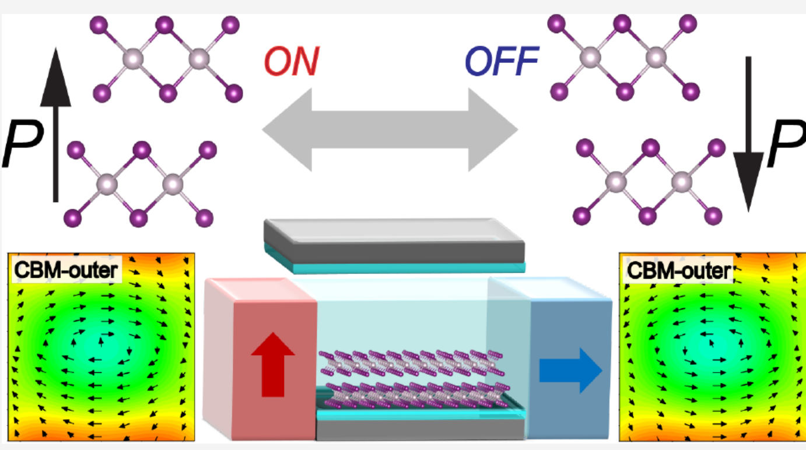
*   **来源**：[[../papers/chenStrongSlidingFerroelectricity2024]]
*   **图示描述**：论文目录/摘要概念图，以艺术化示意浓缩全文主线：HgI₂ 多层通过相邻单层沿 *b* 轴相对滑动产生垂直极化（滑动铁电性），同时层间电荷重排与强自旋-轨道耦合赋予体系可被极化翻转调控的 Rashba 自旋纹理。
*   **关键特征**：并列呈现"层间滑动→面外极化 ±P"与"极化翻转→自旋纹理反转"两条因果链，把铁电双稳态与自旋电子学功能耦合在同一张图中；定量卖点为厚纳米片饱和极化 ~0.16 μC/cm²、双层翻转势垒 24.65 meV/f.u.、自旋 FET 沟道长度 143 nm。

### 9. 表1 HgX₂体相与双层关键参数：结合能、极化、Hg位移、FE-PE能垒
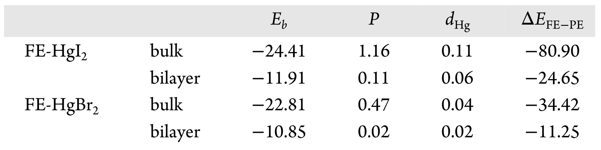
*   **来源**：[[../papers/chenStrongSlidingFerroelectricity2024]]

### 10. 图3 多层HgI₂极化厚度依赖：(a) 3-6层Δρ(z)分区积分，(b) 总极化随层数饱和，(c) 平均层间极化下降
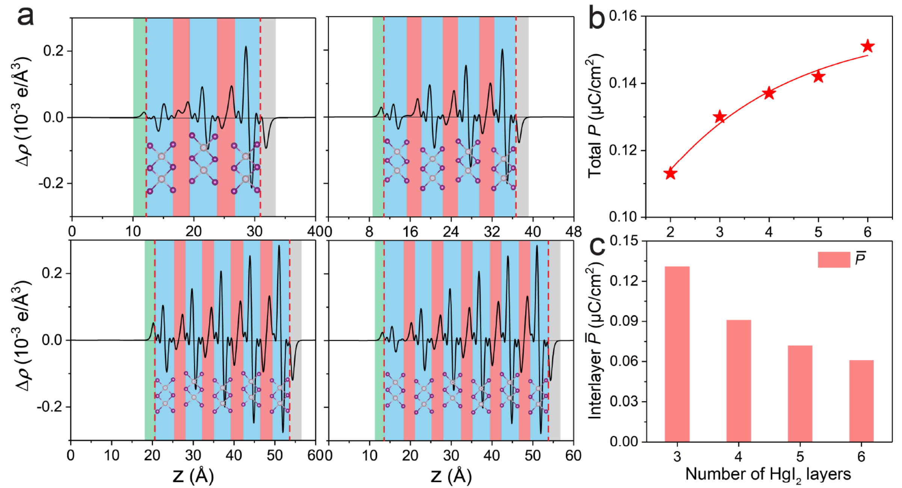
*   **来源**：[[../papers/chenStrongSlidingFerroelectricity2024]]

### 11. 图1 电荷有序诱导铁电性的四种模型（位点/键中心电荷序、↑↑↓↓+交换伸缩、LuFe₂O₄双层、YNiO₃）
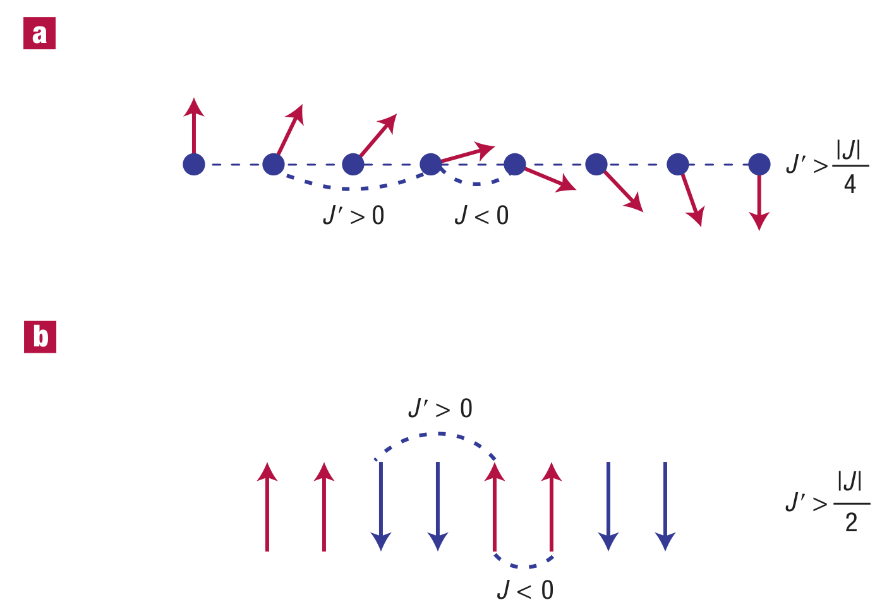
*   **来源**：[[../papers/cheongMultiferroicsMagneticTwist2007a]]
*   **图示描述**：(a) 一维链上位点中心与键中心电荷序共存，红/蓝球代表不同价态阳离子，绿色虚线为二聚键，二者叠加产生沿链方向的净极化 P；(b) ↑↑↓↓ 共线自旋序与位点中心电荷序耦合，平行自旋对被拉近、反平行对被推远（黑色箭头为离子位移），通过交换伸缩产生 P；(c) LuFe₂O₄ 双层三角晶格，Fe 平均价 +2.5，上下两层 Fe²⁺:Fe³⁺ 比分别为 2:1 与 1:2，层间电荷失衡产生垂直于层面的 P；(d) 钙钛矿 YNiO₃ 在 a–b 面内 ↑↑↓↓ 自旋序与 Ni³⁺/Ni^(3−δ)+ 电荷序协同破缺中心对称。
*   **关键特征**：(1) 面板 a 对应 Pr₁₋ₓCaₓMnO₃ 中键中心/位点中心电荷序共存机制（Efremov et al., Nature Mater. 2004）；(2) 面板 b 是后续 RMn₂O₅ 交换伸缩机制的一维原型；(3) 面板 c 中 LuFe₂O₄ 电荷有序温度约 350 K，是电子铁电体的代表；(4) 面板 d 说明电荷序与磁序可协同破缺反演对称，为 RNiO₃ 等材料的多铁性提供理论预期。

### 12. 文中图14（版式插图）
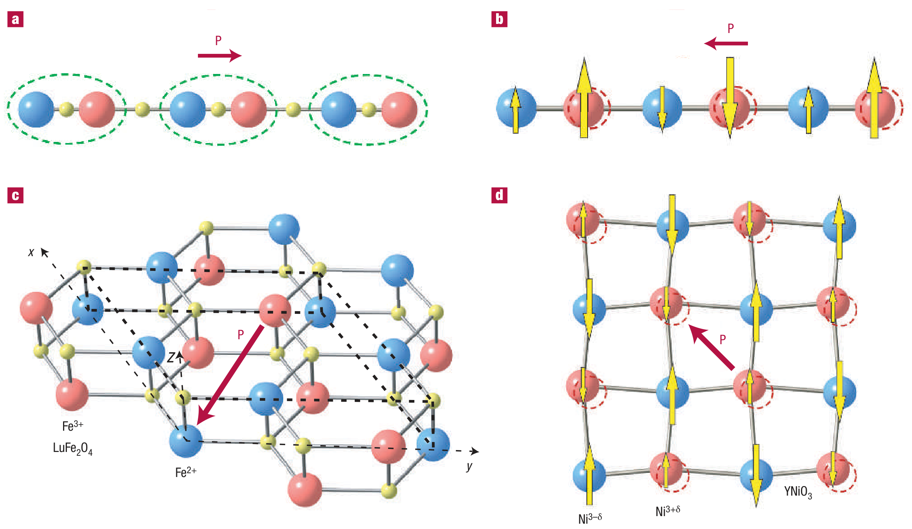
*   **来源**：[[../papers/cheongMultiferroicsMagneticTwist2007a]]
*   **图示描述**：综述正文中的版式插图，raw/note 未给出该编号图的独立解析段落；从其在原文中的位置判断，用于配合多铁性材料或磁电异质结构相关的文字讨论。
*   **关键特征**：无定量数据；作为示意图辅助正文论述，具体物理内容以所链接的图表页与原文为准。

### 13. 图6 1T-TaSe2 C-CDW三维超结构

*   **来源**：[[../papers/chowdhuryReviewTheoreticalComputational]]
*   **图示描述**：(a) 13 个 Ta 原子组成的"大卫之星"团簇及 Se 原子在 c 轴方向的高度起伏（红高蓝低）；(b) 层间堆叠关系；(c)–(h) 沿 [001]、[102] 等晶轴的实验与模拟电子衍射图样，c 轴坐标以 c 为单位。
*   **关键特征**：C-CDW 相中层间形成长程有序三维堆垛（蓝虚线三角标出），模拟衍射图样与实验高度吻合。

### 14. 图1 ： -> [[../figures/heterostructures-stacking|异质结与堆叠]]
 -> [[../figures/heterostructures-stacking|异质结与堆叠]]](../../raw/figures/cossuStackingChargedensityWaves2024/fig_1_Q8LV7XLD.png)
*   **来源**：[[../papers/cossuStackingChargedensityWaves2024]]
*   **图示描述**：(a) 给出 1H-NbSe₂ 单层与 2H-NbSe₂ 双层的顶视图/侧视图，双层为 BAB-CAC 堆叠、两层相对旋转 π；(b) 用上下层对应关系示意反演对称；(c)–(e) 展示单层三种最稳定 CDW 模式 HC、CC、HX；(f)–(l) 以橙/绿两色晶格叠加方式枚举 HC-HC 与 HC-CC 两类 blend 的所有非等价位移 S1–S4。
*   **关键特征**：双层是保持块体中心对称性的最小单元；三种单层 CDW 模式以"混合物（blend）×位移（displacement）"方式构成全部候选构型；2H 两层旋转 π 的事实使得即使是非混合的 HC-HC 也无法沿 ẑ 平移把两层映射到彼此，这是层间堆叠自由度的几何根源。

### 15. 图2 ：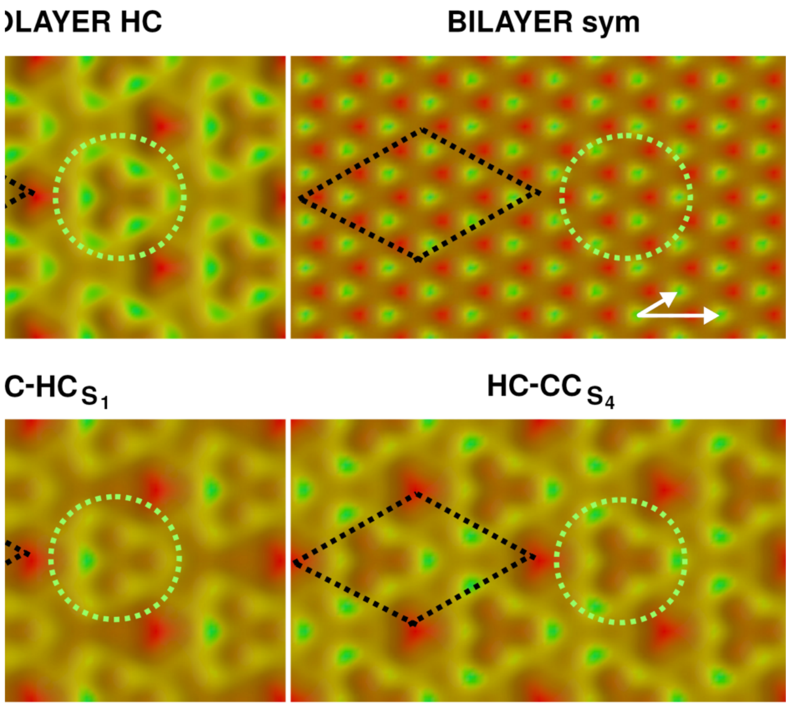 → [[../figures/heterostructures-stacking|异质结与堆叠]]
 → [[../figures/heterostructures-stacking|异质结与堆叠]]](../../raw/figures/cossuStackingChargedensityWaves2024/fig_2_T57PVLQW.png)
*   **来源**：[[../papers/cossuStackingChargedensityWaves2024]]
*   **图示描述**：以三维轴测视角重绘图1(f)–(l) 中七种最重要的堆叠构型（HC-HC 的 S1/S2/S3 与 HC-CC 的 S1–S4），用垂直黑线对齐两层 Nb 原子平面以突出相对平移。
*   **关键特征**：仅看 Nb 层时，HC-HC 系列看似可由一个平移矢量关联，但加入 Se 原子坐标后这种表观对称被打破；不同位移对应的层间 Nb-Nb、Se-Se 投影重叠模式清晰可辨。

### 16. 图3 ： → [[../figures/heterostructures-stacking|异质结与堆叠]]
 → [[../figures/heterostructures-stacking|异质结与堆叠]]](../../raw/figures/cossuStackingChargedensityWaves2024/fig_3_IFCX25A7.png)
*   **来源**：[[../papers/cossuStackingChargedensityWaves2024]]
*   **图示描述**：上图为对称态（sym）与三种最稳定 CDW（HC-HC_(S1)、HC-HC_(S3)、HC-CC_(S4)）的总态密度，横轴为能量（eV，E_F=0），纵轴为 DOS（任意单位）；下图为 E_F 附近放大图。
*   **关键特征**：四条曲线整体形状相似，但 CDW 构型在 E_F 处均出现态密度耗尽（赝能隙），能量最低的 HC-HC_(S3) 耗尽最明显；HC-CC_(S4) 在 −1.8 eV 出现一尖锐峰，投影 DOS 指认为层间 Se 原子 p_z 轨道杂化，是层间耦合的直接电子指纹。

### 17. 表II ： -> [[../figures/mathematical-models-formulas|光学、输运与其他解析公式]]
 -> [[../figures/mathematical-models-formulas|光学、输运与其他解析公式]]](../../raw/figures/cossuStackingChargedensityWaves2024/tab_2_X3L9MSGS.png)
*   **来源**：[[../papers/cossuStackingChargedensityWaves2024]]
*   **图示描述**：列出 2H-NbSe₂ 双层 HC-HC、HC-CC 等 blend 各位移构型相对基态的能量（meV/f.u.），同时给出 GGA 与 GGA+DF 两套结果；右侧并列 1H-NbSe₂ 单层 HC、CC、HX 的能量作为对照。
*   **关键特征**：双层基态为 HC-HC_(S3)；第一激发态 HC-HC_(S1) 为 0.06/0.21 meV/f.u.，第二激发态 HC-CC_(S4) 为 0.18/0.39 meV/f.u.；前三激发态能量窗口仅 0.18（GGA）/0.39（GGA+DF）meV/f.u.，小于单层 HC–CC 差 0.51/1.43 meV/f.u.；对称相能量为 3.78/4.94 meV/f.u.，vdW 修正整体放大能量差但不改变排序。

### 18. 图4 转角依赖的光响应度-光子能量关系、偏压调制、调制深度与FDTD热点模拟
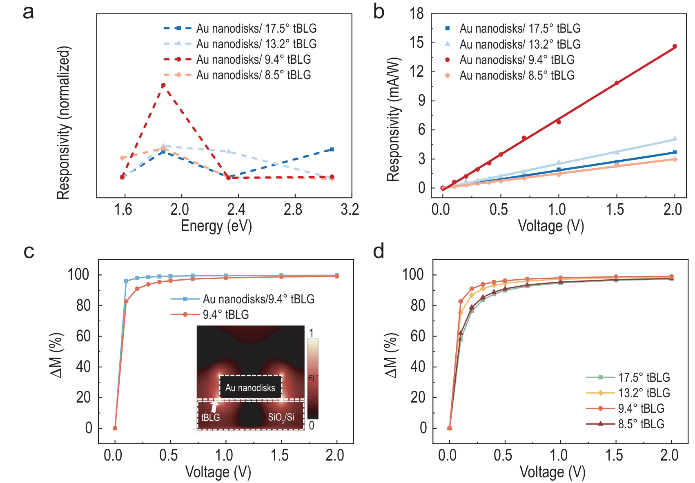
*   **来源**：[[../papers/duUltrasensitiveOptoelectronicBiosensor2025]]
*   **图示描述**：(a) 集成相同尺寸金纳米盘的 8.5°、9.4°、13.2°、17.5° 器件归一化光响应度随入射光子能量的变化；(b) 各转角器件响应度随 0–2 V 偏压的变化；(c) 9.4° Au/tBLG 调制深度 ΔM 随偏压的曲线，内嵌 FDTD 光场热点分布；(d) 不同转角纯 tBLG 的调制深度与阈值电压对比。
*   **关键特征**：9.4° 器件响应在约 1.88 eV 处出现尖峰，恰好对应 2E_VHS = 1.84 eV 与 660 nm 光能量；9.4° Au/tBLG 在仅 0.2 V 偏压下即达到 ΔM ≈ 100%；纯 tBLG 中 9.4° 样品阈值电压最低，与 DFPT 给出的最高面内介电常数一致；FDTD 显示热点集中于金纳米盘边缘。调制深度定义 ΔM = (Cp−C)/(Cp+C)。

### 19. 图3 a)BN双层铁电翻转与graphene/BN异质结堆叠势；b)V族元素单层（As/Sb/Bi）未畸变/畸变结构与As单层自由能等高线
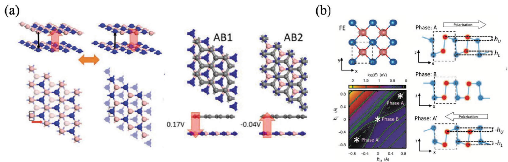
*   **来源**：[[../papers/guanRecentProgressTwoDimensional2020]]
*   **图示描述**：(a) 对比中心对称 c1T 与畸变 d1T-MoS₂ 的原子结构、能带结构及电荷密度差；(b) 展示 MX₂（M=Mo,W；X=S,Se,Te）从中心对称相到三聚化相的畸变模式与锯齿链。
*   **关键特征**：电荷密度差图直观显示 Mo 原子面内位移打破反演对称，是二维铁电性的必要条件；三聚化形成“之”字形金属链，是自发极化的结构起源；对应 Shirodkar & Waghmare PRL 2014 提出的电子-声子耦合驱动的不正铁电性。

### 20. 图5：双层石墨烯新奇滑移铁电（LSAS现象/能带模型/多级铁电响应/Vt-Vb相图/WSe₂屏蔽对照/ABC堆垛BN-石墨烯）
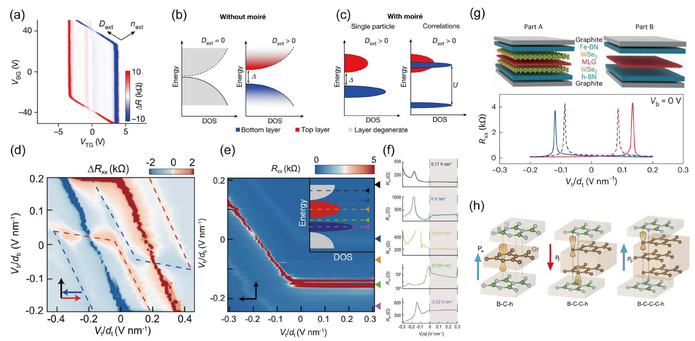
*   **来源**：[[../papers/guoAdvancesTwodimensionalFerroelectric2025]]
*   **图示描述**：(a) BN 封装双层石墨烯（BLG）正/反向背栅扫描相图之差，白色区域即"层特异性异常屏蔽"（LSAS）；(b,c) 垂直电场下 BLG 层间电荷转移与极化形成的能量/态密度示意模型；(d) 更精细的 Vt-Vb 相图，在电荷中性点（CNP）和莫尔平带完全填充点（FFP）附近均出现电滞回环；(e,f) 五条切割线位置及对应的电阻-Vt 响应；(g) 插入 WSe₂ 屏蔽 BN/石墨烯莫尔势前后的回滞对比；(h) 上下 BN 与单层石墨烯形成 ABC 堆垛时产生层间自极化的结构示意。
*   **关键特征**：LSAS 表明极化态可冻结并屏蔽外场；Lu 组测得层间电荷转移密度高达 10¹³ cm⁻²，对应极化约 5 pC/m，100 K 内保持电滞、300 K 基本消失；魔角 TBG 在 <100 mK 下铁电双稳态可与超导/关联绝缘态共存。2025 年 WSe₂ 屏蔽实验（回滞仍存在）与 ABC 堆垛 BN-石墨烯（室温极化约 1.76 μC/cm²）共同动摇了"石墨烯本征铁电"的归因。

### 21. 公式(2)：层间差分电荷密度 Δρ_interlayer(r) = ρ_total(r) − Σ_i ρ_isolated^i(r)
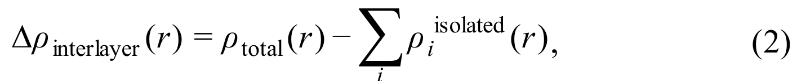
*   **来源**：[[../papers/guoAdvancesTwodimensionalFerroelectric2025]]
*   **图示描述**：层间差分电荷密度定义为异质结总电荷密度减去各孤立层电荷密度之和：Δρ_interlayer(r) = ρ_total(r) − Σ_i ρ_isolated^i(r)。
*   **关键特征**：直观显示层间滑移后电子在界面的积累（正值）与耗尽（负值）区域，配合 Berry 相位极化与 NEB 能垒，构成滑移铁电理论分析"三件套"，用于判定电荷重分布方向并量化层间电荷转移。

### 22. 图3 双层 TaS₂ 的 STM：无序 2×2 CDW，2Δ=18±9 meV，层间严格外延且莫尔消失

*   **来源**：[[../papers/hallEnvironmentalControlCharge]]
*   **图示描述**：图3 为双层 TaS₂ 的 STM/STS：(a) 大尺度形貌显示第二层岛在第一层上严格外延，且第二层上 Gr/Ir 莫尔条纹消失；(b,c) 高分辨恒流像呈现一个仅在数个周期内保持、局部可缺失的"无序 2×2"超结构（青色菱形为 2×2 单胞，紫色为原子晶格），插图 FFT 中 2×2 斑点弥散；(d,e) 占据态/空态恒高像再次出现对比度反转；(f) 归一化 STS 谱在 E_F 处呈部分能隙。
*   **关键特征**：第二层相对第一层零旋转失配，与单层对 Gr 的 4° 取向分散形成对照；BL 中驻波图案几乎消失、莫尔消失，均说明 TaS₂–TaS₂ 层间耦合强于 TaS₂–Gr 耦合；CDW 周期从 3×3 转为短程无序的 2×2；部分能隙 2Δ = 18 ± 9 meV，明显小于单层 3×3 CDW 的 32 meV；作者提出层间偏压 Δε₀ 或 vdW 间隙中自插层 Ta 原子提供额外电荷是可能成因，但承认仍属推测。

### 23. 图6 双层声子色散：层间偏压 Δε₀ 将主导失稳从 2/3 ΓM 推向 M
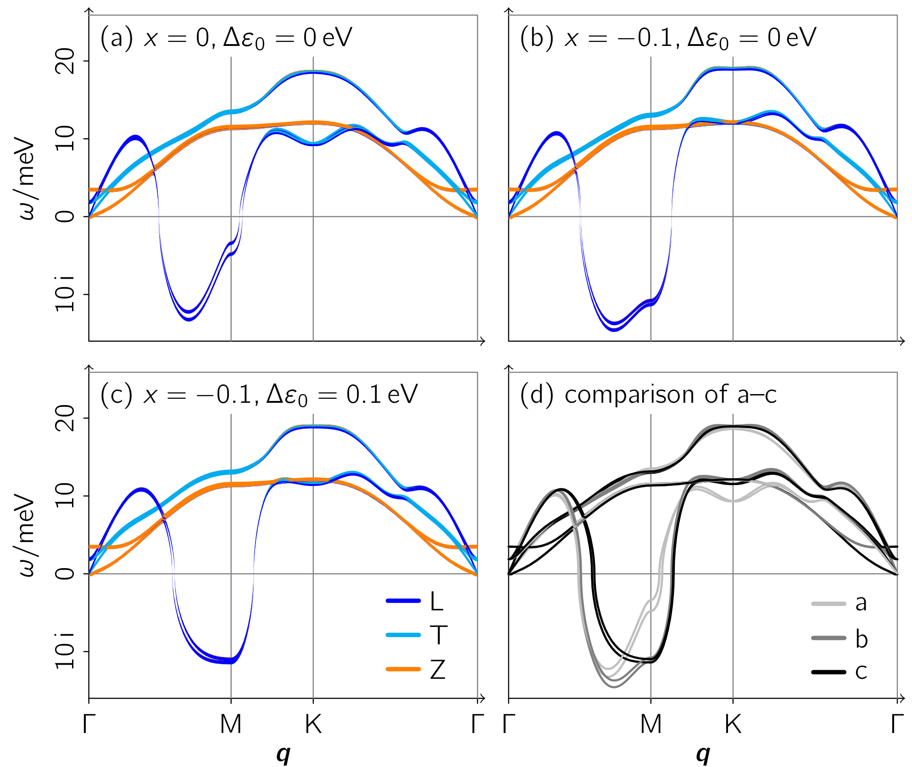
*   **来源**：[[../papers/hallEnvironmentalControlCharge]]
*   **图示描述**：图6 为固定 Γ = 1 meV 时双层 2H-TaS₂ 在不同电荷掺杂 x 与层间偏压 Δε₀ 下的声学支声子色散：(a) 自由未掺杂 BL（x=0, Δε₀=0）的虚频区与 ML 几乎相同，最深失稳仍在 2/3 ΓM；(b) 仅引入 x = −0.1 掺杂，M 点失稳加深但 2/3 ΓM 仍占优，不足以解释 2×2；(c) 在 x = −0.1 基础上叠加 Δε₀ = 0.1 eV（一层在位能 +Δε₀/2、另一层 −Δε₀/2），失稳区被"展平"并向 M 移动；(d) 直接叠合 (a)–(c) 的色散以可视化偏压效应。
*   **关键特征**：自由 BL 与 ML 声子谱高度相似，说明单纯层数本身不导致 2×2；x = −0.1 的均匀掺杂不足以翻转 q_c；引入层间电势差 Δε₀ = 0.1 eV 可使 M 与 2/3 ΓM 失稳拉平并最终把 q_c 推向 M，从而在能量上允许 2×2 CDW；自插层 Ta 原子也可能提供额外电荷参与这一重整化。

### 24. THz场下极性涡旋集体动力学：CW/CCW涡旋对弹簧球链模型；004超晶格峰与δ04卫星峰傅里叶谱中的可调涡旋子模式；涡旋子振荡周期内的手性动态反转

*   **来源**：[[../papers/hanPolarTopologicalMaterials2025]]
*   **图示描述**：(a) CW/CCW 涡旋对集体动力学被建模为弹簧连接的球链，可作横向/纵向振动；(b) THz 泵浦-硬 X 射线探针下 004 超晶格峰与 δ04 卫星峰的傅里叶谱，显示可调涡旋子模式；(c,d) 原子位移涡旋（紫）与静态极化涡旋（品红）在振荡周期内的动态演化，包含手性周期性反转。
*   **关键特征**：涡旋子频率约 0.08–0.3 THz 可调；弹性能决定等效弹簧常数；η 为归一化衍射强度；手性在 CW/CCW 之间动态反转。

### 25. 图2 翻转路径能垒与堆叠构型

*   **来源**：[[../papers/hanTunableSlidingFerroelectricity2025]]
*   **图示描述**：(a) 横轴为沿 [110] 方向从 AB 经 AA 滑至 BA 的层间滑移坐标，纵轴为相对能量（meV/f.u.），三条曲线分别对应 RuCl₂/RuBr₂/RuI₂ 双层；(b) AB、AA、BA 三种高对称堆叠的原子示意，红色虚线标滑移路径，黄色箭头标极化方向。
*   **关键特征**：AB 与 BA 是两个简并的 ±P 能量极小值，AA 为镜面对称的顺电过渡态（能量最高）；翻转势垒 RuCl₂ 7.10、RuBr₂ 15.31、RuI₂ 37.84 meV/f.u.，远低于 In₂Se₃（~66 meV）、PbTiO₃（~240 meV）、双层 CrI₃（57.42 meV）和 NiI₂（~50 meV）；AA 保持 P-6m2 镜面对称无极化，AB/BA 降至 P-3m1 并产生反向垂直极化。

### 26. 图4 三层翻转路径与应变调控

*   **来源**：[[../papers/hanTunableSlidingFerroelectricity2025]]
*   **图示描述**：(a) 三层 RuX₂ 顶层沿长对角线滑移时的 NEB 能量路径；(b) 下两层固定为 AB、顶层滑移构成三层 AB/AA/BA 堆叠的示意图；(c) RuI₂ 双层与三层极化 P 随归一化层间距 d/d₀ 的变化（d₀ 为平衡间距，d<d₀ 为压缩、d>d₀ 为拉伸）。
*   **关键特征**：三层翻转势垒 RuCl₂/RuBr₂/RuI₂ 为 7.16/16.41/35.37 meV/f.u.，与双层几乎相同；三层极化升至 0.13/0.28/1.03 pC/m，其中 RuI₂ 约为双层 0.49 pC/m 的 2.1 倍；P 随 d/d₀ 单调变化，压缩应变显著增强、拉伸应变削弱极化，双层与三层趋势一致。

### 27. 表I 晶格常数、极化与MAE

*   **来源**：[[../papers/hanTunableSlidingFerroelectricity2025]]
*   **图示描述**：论文唯一的主文表格，按 RuCl₂/RuBr₂/RuI₂ 三行汇总 AB 堆叠下的面内晶格常数 a、双层 SFE 极化 P₁、三层 SFE 极化 P₂ 与磁各向异性能 MAE。
*   **关键特征**：a 由 3.447→3.613→3.897 Å 随卤素半径递增；P₁ 由 0.087→0.16→0.49 pC/m、P₂ 由 0.13→0.28→1.03 pC/m，三层约为双层 1.5–2.1 倍；MAE 由 2.79→8.59→14.28 meV 单调增大；RuI₂ 在极化、磁稳定性两项均居首。

### 28. 图1 双层h-BN在不同初始弯曲角θ下弛豫后的原子结构：θ<12°恢复平面，12°<θ<62°形成31°单扭结，θ>62°形成31°+57°双扭结
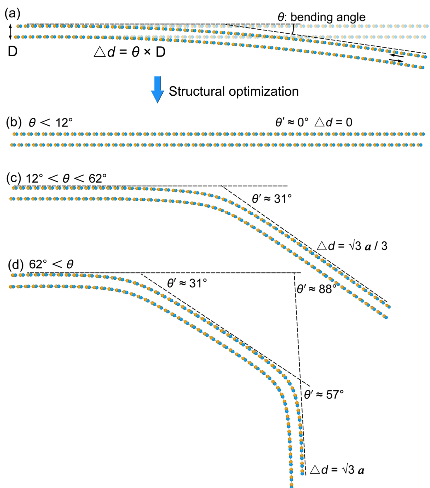
*   **来源**：[[../papers/heSwitchingTwodimensionalSliding2025]]
*   **图示描述**：图1以侧视原子结构展示双层 h-BN 从平面 AB 堆叠出发，沿 x 轴人为施加初始弯曲角 θ 后再做全原子弛豫得到的最终构型；(a) 为理想圆弧示意，(b)–(d) 分别对应小、中、大三种 θ 下弛豫后的平面、单扭结和双扭结形态。
*   **关键特征**：弯曲区特征长度 12.3 nm，层间滑移量满足几何关系 Δd = θ·D（D 为层间距 3.25 Å）；θ < 12° 时回弹为平面（θ₀ = 0°），12° < θ < 62° 时形成角度固定的 31° 单扭结，θ > 62° 时出现 31° + 57° 紧邻双扭结；扭结卸载后不回弹，属于不可逆塑性重构，区别于常规二维薄片的弹性弯曲。

### 29. 图2 (a)层间滑动路径上的堆垛能景观（AB/BA为极小值，SP/AA为极大值）；(b)弛豫后角度θ₀随初始θ的阶梯状关系，临界角12°和62°
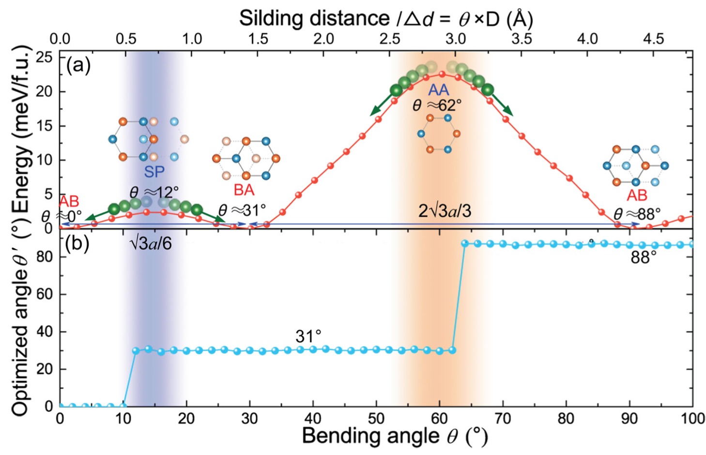
*   **来源**：[[../papers/heSwitchingTwodimensionalSliding2025]]
*   **图示描述**：图2把结构现象与能量景观对应起来：(a) 横轴为弯曲驱动的层间滑移路径、纵轴为堆垛能，绘出 AB/BA 极小值与 SP/AA 极大值构成的双势阱；(b) 横轴为初始弯曲角 θ、纵轴为弛豫后角度 θ₀，显示三段离散平台。
*   **关键特征**：AB、BA 为全局能量极小（稳定极化堆垛），SP（鞍点）和 AA 为能量极大（不稳定堆垛）；到达 SP 对应 Δd = 0.71 Å、θ = 12°，到达 AA 对应 Δd = 2.84 Å、θ = 62°；θ₀–θ 曲线在 12° 和 62° 处发生跳变，把弯曲响应切成 0°、31°、31°+57° 三个离散态。

### 30. 图1 h-BN双层铁电性：极化矢量随层间滑移的演化、能量势垒与电荷密度差
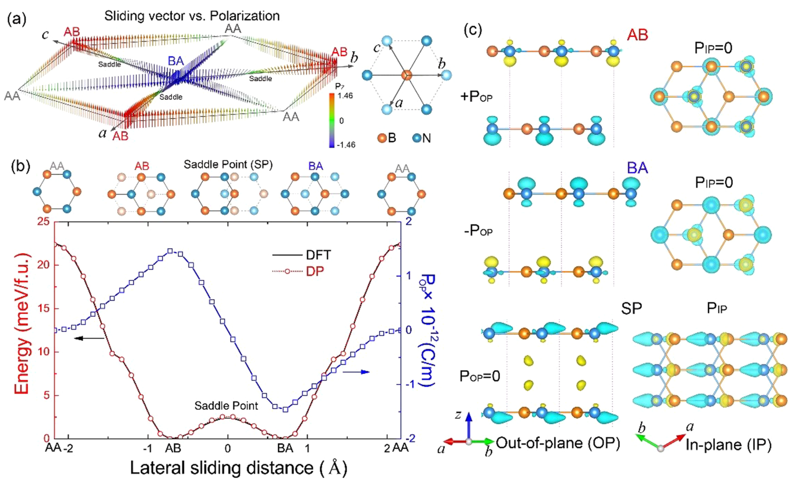
*   **来源**：[[../papers/heUltrafastSwitchingDynamics2024]]
*   **图示描述**：以h-BN双层为对象，展示铁电极化如何由层间滑移与层间电荷转移产生。(a)极化矢量随上下层相对滑移一整个晶胞的变化，颜色编码面外极化Pz；(b)沿最低能量路径上Pz与体系总能量随滑移距离的演化；(c)AB、BA及鞍点(SP)三种构型的原子排布与电荷密度差（等值面0.00017 e/ų）。
*   **关键特征**：AB与BA为两个能量简并的稳态，分别对应向上与向下的面外极化Pz=1.46×10⁻¹² C/m；二者由鞍点隔开，鞍点为纯面内极化1.38×10⁻¹² C/m，极化模长在翻转路径上几乎不变；完全重叠的AA构型能量最高、不稳定；电荷由一层转移至另一层，极化源于电荷转移而非离子位移。

### 31. 图4 50-700 K热稳定性：层间距与极化随温度变化
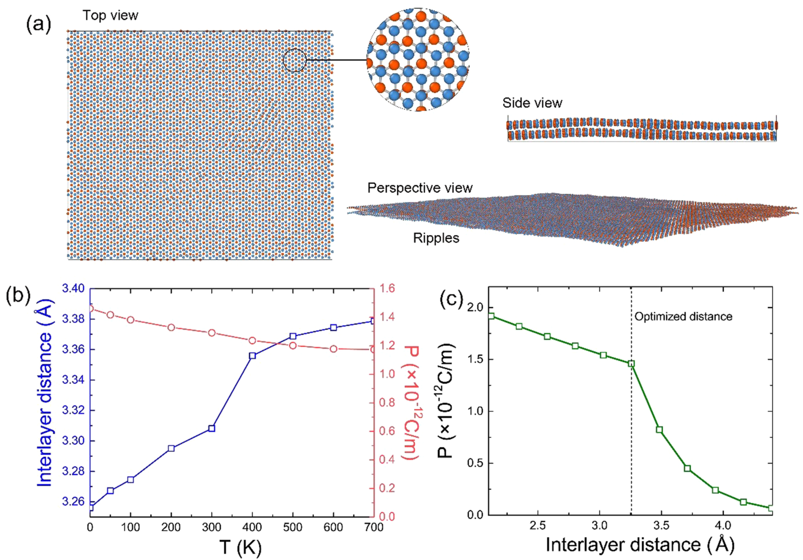
*   **来源**：[[../papers/heUltrafastSwitchingDynamics2024]]
*   **图示描述**：基于100×100×1(40,000原子)超胞的NPT-DPMD模拟。(a)600 K下的原子结构快照；(b)平均层间距与面外极化随温度(0–700 K)的变化；(c)Pz对层间距的依赖关系。
*   **关键特征**：高温下仍保持单畴完整、未自发成核畴壁；700 K时层间距热膨胀增大，Pz由1.46×10⁻¹² C/m略降至1.14×10⁻¹² C/m；Pz随层间距单调递减。

### 32. 图7 0.385°扭转莫尔结构的P-E曲线：无回滞，超顺电态
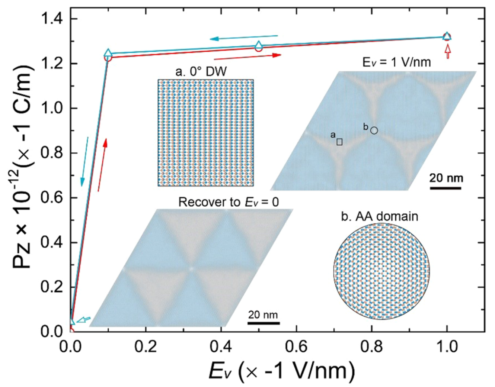
*   **来源**：[[../papers/heUltrafastSwitchingDynamics2024]]
*   **图示描述**：0.385°扭转莫尔双层(355,012原子)的空间平均面外极化Pz随垂直电场Ev的变化(P-E曲线)，插图为最大电场与零电场下的极化纹理。
*   **关键特征**：弛豫后AB/BA畴扩张为三角形、高能AA畴收缩为点；Pz在超低临界Ev≈0.026 V/nm即快速饱和至1.32×10⁻¹² C/m(此时BA畴变为类六边形)；撤场后纹理恢复、Pz归零；整条P-E曲线无开口、无回滞。

### 33. 图1 MoTe₂层状结构与P/M层内畸变、+/−层间滑移符号体系，定义1T′-I/II与Td↑/Td↓四种堆垛
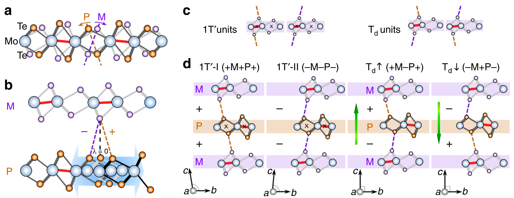
*   **来源**：[[../papers/huangPolarPhaseDomain2019]]
*   **图示描述**：(a) 单层 MoTe₂ 截面示意，Mo 偏离中心形成沿 a 轴的金属性锯齿链（粗红线），Te 八面体畸变为 P（逆时针，橙）和 M（顺时针，紫）两种取向；(b) 定义层间剪切 +/− 符号（最近邻 Te–Te 连线相对 T₀ 参考态 λ=0 的顺/逆时针偏移）；(c) 对比 1T′ 单元（上下层间剪切同号 ++ 或 −−，保留反演中心）与 Td 单元（上下层间剪切反号 +− 或 −+，破缺反演、产生沿 c 轴极化）；(d) 三层堆垛展示 1T′-I(+M+P+)、1T′-II(−M−P−)、Td↑(+M−P+)、Td↓(−M+P−) 四种宏观态，绿箭头标示 Td↑/Td↓ 反向极化。
*   **关键特征**：P/M 为固定的层内畸变，+/− 为可变的层间滑移；1T′ 上下剪切同号故无极化，Td 上下剪切反号故有沿 c 轴的未补偿偶极；λ=0 对应假想高对称正交 T₀ 相；该符号体系把看似不同的两相关进同一套堆垛语言，是理解全文畴壁结构的基础。

### 34. 图2 截面DF-TEM与HAADF-STEM：室温1T′孪晶壁含Td单元，80 K下Td/1T′类超晶格相畴壁
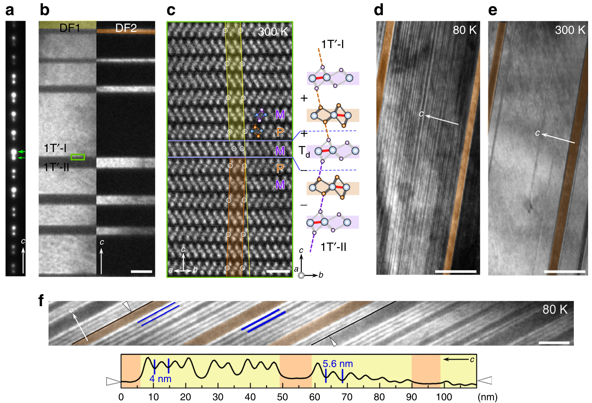
*   **来源**：[[../papers/huangPolarPhaseDomain2019]]
*   **图示描述**：(a–b) 室温截面 DF-TEM 与 SAED，沿 c 轴出现明暗交替的准周期单斜孪晶条带（1T′-I/1T′-II），平均畴宽约 0.5 μm，衍射斑点沿 c 轴分裂；(c) 沿 [110] 的原子分辨 HAADF-STEM，蓝线为孪晶界面，除镜面操作外两侧还发生层间滑移，在界面自然嵌入一个单层 Td 单元（−M+）；(d–e) 同区域 80 K 与 300 K DF-TEM 对比，降温后原 1T′ 孪晶畴内部出现更细密的短程条纹，对应新形核的 Td 薄板；(f) 高倍 DF-TEM 及强度线扫，显示 −(Td)ₘ(1T′)ₙ− 周期性调制。
*   **关键特征**：室温 1T′ 孪晶壁本身就是 Td 相成核种子（滑移反射产生 −M+ 剪切）；Td 并非从孪晶壁外延生长，而是在 1T′ 畴内部以薄板状独立大量形核；最薄超晶格周期约 4 nm，由约 6 个 Td 或 1T′ 原子层组成；相共存被归因于机械约束对层间滑移的恢复力。

### 35. 图1 h-BN 双层滑动铁电原理、GPRI/LPRI 与 DFT 势降对比、莫尔畴壁

*   **来源**：[[../papers/kaurRecentAdvancesTheoretical2025a]]
*   **图示描述**：(a)(b) 双层 BN 与 C/BN 异质双层的上/下垂直极化示意；(c) h-BN 双层 AB/AA/BA 等堆垛构型；(d) 沿扶手椅方向位移时 DFT 势降（蓝圈）与全局极化登记指数 GPRI（红线）的一维对比；(e)(f) GPRI 与 DFT 势降的二维平面图；(g)(h) 0.5° 转角 h-BN 的局部极化登记指数 LPRI 图及跨畴壁剖面。
*   **关键特征**：σ_BN=σ_NB=0.22b（b=a/√3，a=2.51 Å）时 GPRI 与 DFT 势降吻合最佳；LPRI 再现 KPFM 电势景观，畴壁宽约 10 nm；证明滑动极化可用原子横向高斯重叠度定量描述并推广至转角莫尔体系。

### 36. 图7 III–V/IV 族二元双层 (BP, GaN, GeC)：极化与电负性比/有效距离关系、GeC 为唯一全局极性基态

*   **来源**：[[../papers/kaurRecentAdvancesTheoretical2025a]]
*   **图示描述**：(a) AC 堆垛下 BP、GaN、GeC 双层侧视图；(b) AC→AB 的 NEB 能垒与极化；(c) 最佳层间距与阴/阳离子电负性比 Ea/Ec 的相关；(d) 极化对有效距离 deff 的依赖；(e) 极化与电负性比/deff 的关系；(f) AA′（BP/BAs 为 AC′）相对 AC 的能量差。
*   **关键特征**：仅 AB 与 AC 为能量简并的反极性态；BSb、InN 为褶皱结构且极化与势垒更大；点电荷模型表明层间距越小极化越高；除 GeC 外其余材料全局极小为中心对称 AA′/AC′，故 GeC 的滑动铁电在实验上最可行。

### 37. 图8 Janus TMD (SeMoS/TeMoS)：内建电场比压缩层间距更能提升极化而不显著升能垒；MoS2/WS2 异质双层

*   **来源**：[[../papers/kaurRecentAdvancesTheoretical2025a]]
*   **图示描述**：(a) SeMoS AB/AC 两极性态俯/侧视图；(b) 沿 z 方向面平均电势；(c) AB→AC 的能垒与极化；(d)(e) XMoY、XWY 双层极化随最佳层间距的变化；(f) 极化-有效距离负线性关系；(g)(h) 层间距对极化和能垒的调制；(i) 内建电场（红点）与改变层间距（蓝点）对极化-能垒的调制对比（紫点为 MoS2）；(j)(k) 外电场下能垒变化与 AB/AC 能量差对极化的线性关系；(l–p) 2H-MoS2、类 2H/类 3R MoS2/WS2 的结构与差分电荷密度。
*   **关键特征**：内建电场操控电子极化而非离子极化，故 TeMoS 极化较 MoS2 提升 65% 而能垒不显著升高；极化越大，单位电场诱导的 AB/AC 能量差越大，越易电控翻转；MoS2/WS2 异质双层（C3v 点群）上/下态横向相差 1.83 Å，AA-up 比 AA-down 稳定 1.9 meV/f.u.，2.4 V/nm 电场即可翻转相对稳定性。

### 38. 图11 MoSi2N4/MoGe2N4 双层：层分辨 VBM/CBM、莫尔 II 型量子点阵列

*   **来源**：[[../papers/kaurRecentAdvancesTheoretical2025a]]
*   **图示描述**：(a) MoSi2N4/MoGe2N4 两相反极化等效结构；(b) NEB 翻转路径；(c)(d) MoSi2N4 双层的 VBM/CBM 层分布与 PDOS；(e) 转角莫尔超晶格中不同堆垛区的能带对齐示意。
*   **关键特征**：MoSi2N4、MoGe2N4 双面外极化分别为 3.36、3.05 pC/m（同构 CrSi2N4、WSi2N4 为 2.49、3.44 pC/m）；面电荷密度 1.31 μC/cm²，电子迁移率达 7990 cm²·V⁻¹·s⁻¹；一层贡献 VBM、另一层贡献 CBM，翻转 FE 即交换两层；小角扭转形成 II 型异质结量子点阵列，莫尔势源于垂直极化而非层间杂化，可用于激子捕获。

### 39. 图13 GeS2/CuInP2S6：位移铁电+滑动铁电四/六态耦合、莫尔极化织构、0.7 TB/cm² 存储密度

*   **来源**：[[../papers/kaurRecentAdvancesTheoretical2025a]]
*   **图示描述**：(a) GeS2/CIPS 异质结中"层滑动+Cu 离子位移"双机制翻转路径；(b) HP+→HP− 的极化与能垒；(c)(d) 沿 z 的差分电荷密度、电荷转移量及 Cu 离子位移能垒；(e)(f) 三层异质结莫尔超晶格示意及 R0/R1/R2 三个高对称区；(g)(h) P+/P− 态极化织构与跨 R2 的周期极化；(i) 各区 Cu 位移距离上的转变势垒。
*   **关键特征**：GeS2/CIPS 有四个极化态；GeS2/CIPS/GeS2 因两个可滑 GeS2 层出现 HP±、LP1±、LP2± 六态，HP± 极化对称值 ±11.77 pC/m；Cu 位移改变内建场并与滑动铁电强耦合，使莫尔阵列中原本不可能的翻转成为可能；转变势垒 286 meV 在各区近似相同；5° 转角下存储密度 0.7 TB/cm²。

### 40. 图15 四层/多层石墨烯极性堆垛 (ABAC, CABA, CBAB)、滑动莫尔铁电性、平带

*   **来源**：[[../papers/kaurRecentAdvancesTheoretical2025a]]
*   **图示描述**：(a) 四层石墨烯 ABAC↔CABA↔CBAB 极性态翻转；(b) NEB 路径；(c) 极性态差分电荷密度与 Hirschfeld 电荷分析；(d) 2+2 与 1+3 转角四层石墨烯的堆垛畴图（NP 为非极性畴，X 为不利畴）；(e)(f) 未转角与 1.08° 转角四层石墨烯能带。
*   **关键特征**：ABAB、ABCB 非极性，ABAC、CABA、CBAB 为镜像相关极性态；P⊥=0.21 pC/m、P∥=57.49 pC/m，势垒 <5 meV；五层 ABABC/ABACB 为 0.17/0.32 pC/m，六层有 5 个极性态 0.05–1.0 pC/m；1+3 转角可电场切换极性畴/非极性畴，称"滑动莫尔铁电性"；极性 CABC 近费米能级具平带，ABAC 同时有线性色散带与平带。

### 41. 图19 2H-MnBi2Te4 双层：滑动切换磁序与拓扑（陈数），层间 Te-pz 耦合

*   **来源**：[[../papers/kaurRecentAdvancesTheoretical2025a]]
*   **图示描述**：(a) 3R/2H 堆垛双层 MBT 侧视图；(b) AB 堆垛俯视图，绿箭头为滑动路径（红/蓝球为上/下层 Mn，黄/紫球为 Te/Bi）；(c) 2H 堆垛翻转路径（插图为最小/最大能量点差分电荷密度）；(d)(e) 沿滑动路径的总能量与层间交换能；(f) 面外 FM 序下不同堆垛的投影能带（插图突出边缘态）。
*   **关键特征**：仅 2H 堆垛因反演破缺允许极化；亚稳 AB′、AC′ 能量相近且低于 AA、AC，NEB 势垒 30 meV/u.c.；除 AA 外各构型均为 AFM，磁相可由层间滑动切换；AB、AB′、AC′ 在 FM 序下 Γ 点附近能带反转，出现自旋极化边缘态与非零陈数，预示 QAH 效应；平庸绝缘体层间距更大、Te-pz 层间耦合更弱。

### 42. 图24 CrI3/MnSe2 异质双层：紧束缚+DFT 揭示磁序可反转层间电子极化，非易失磁电耦合

*   **来源**：[[../papers/kaurRecentAdvancesTheoretical2025a]]
*   **图示描述**：(a) CrI3 与 (b) MnSe2 单层原子结构俯视图；(c) CrI3/MnSe2 异质双层能量随层间滑动的剖面，标出 S1（FM 全局最小）、S2（AFM 局域最小）、S3（全局最大）；(d)(e) 双离子与四离子团簇模型中 P_ex=P_AFM−P_FM 随磁性离子在位能差 Δdd 与跳跃强度 t、tpp 的变化。
*   **关键特征**：S1 结构中 P_i^FM=−0.0073 e·Å/u.c.（电荷由 MnSe2 转向 CrI3），P_i^AFM=0.0202 e·Å/u.c.；固定离子位置时极化值相近，表明电子极化主导；层间滑动可非易失切换磁序并反转电极化，证实 vdW 磁性异质结中非易失磁电耦合的存在。

### 43. 图27 PtBr3：AA′/AB′/AC′ 堆垛、晶体霍尔效应、MOKE 克尔角与椭偏率随 ±P 反转

*   **来源**：[[../papers/kaurRecentAdvancesTheoretical2025a]]
*   **图示描述**：PtBr3 双层 AA′、AB′、AC′ 等堆垛构型、极化翻转路径，以及晶体霍尔效应、磁光克尔角与椭偏率随 ±P 极化反转的曲线。
*   **关键特征**：滑动破坏 PT 对称后出现交变磁相，伴随晶体霍尔效应与磁光克尔效应 (MOKE)；克尔角与椭偏率在 ±P 间反号，可作为非易失电学读取信号。（raw/note 未给出该图定量数值，仅作定性描述。）

### 44. 图1 MAX相到MXene的结构演变及A/B型空心位
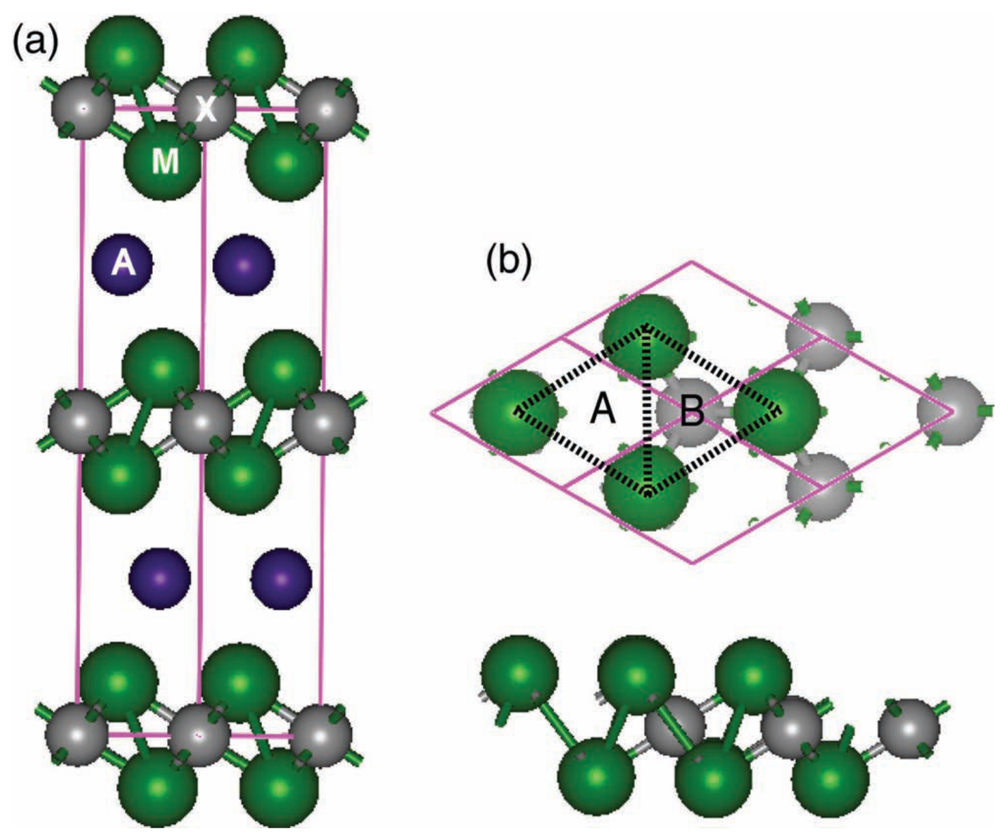
*   **来源**：[[../papers/khazaeiNovelElectronicMagnetic2013]]
*   **图示描述**：(a) 层状 M₂AX 块体 MAX 相的典型结构，M（过渡金属）、A（主族元素）、X（C/N）原子层交替堆垛；(b) 移除 A 层后所得二维 M₂X（MXene）的俯视图与侧视图，呈现 M–X–M 三层原子板。
*   **关键特征**：M–X 键为强共价/离子键，M–A 键为较弱的金属键，这是化学刻蚀能选择性去除 A 层的结构基础；俯视图虚线标出 A 型空心位（正下方无 X 原子）和 B 型空心位（正下方有 X 原子），二者是后续 F/OH/O 官能团可能的吸附位点。

### 45. Fig. 3 界面相变存储与 Sb2Te3-GeTe 超晶格扩散开关
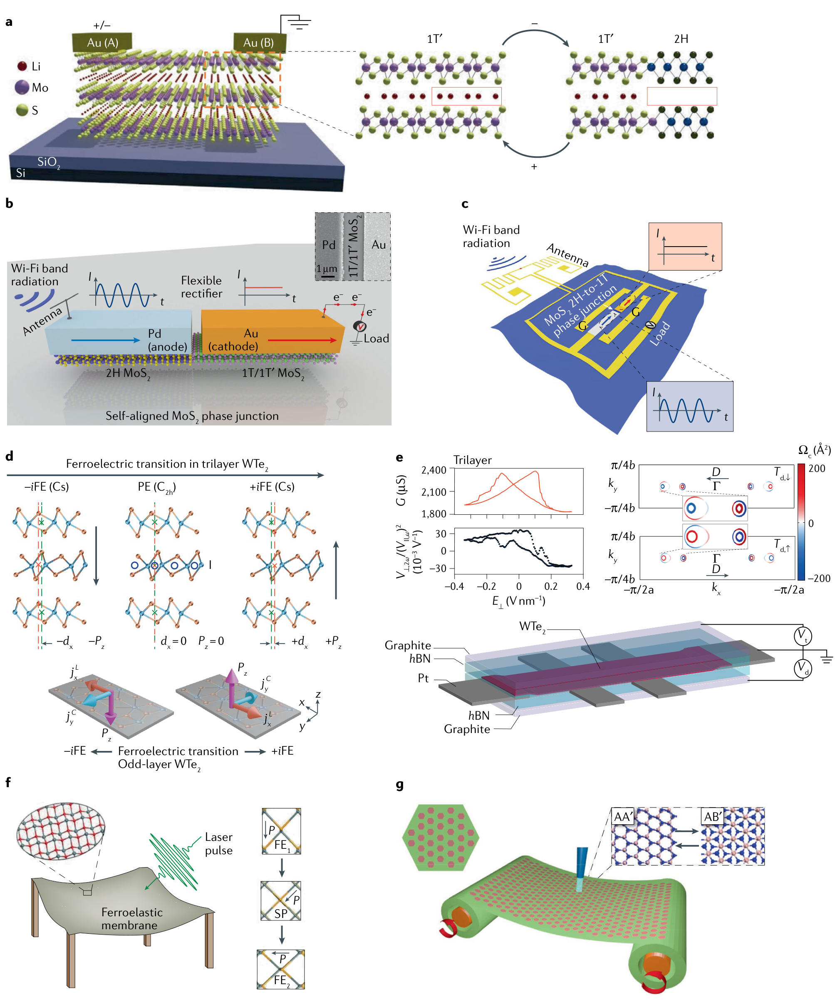
*   **来源**：[[../papers/liPhaseTransitions2D2021]]
*   **图示描述**：原子模型示意 Sb2Te3–GeTe 超晶格中 GeTe 二维晶层（厚度约 5 Å）内 Ge、Te 原子的扩散开关过程，相邻的 Sb2Te3 层因应变而几乎不可动，对 GeTe 层的扩散起调制作用。
*   **关键特征**：原子迁移被限制在约 5 Å 厚的 GeTe 层内，而非三维块体中的长程扩散；应变 Sb2Te3 层作为不可动模板调控扩散路径与能垒，从而提升开关速度、降低写入能耗，并显著减小电阻漂移与噪声；二维限域使相变熵变和潜热同步下降。

### 46. 表1 二维磁性材料
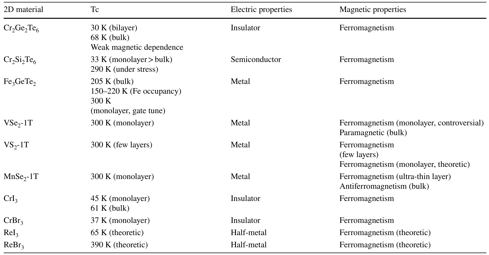
*   **来源**：[[../papers/liuSpintronicsTwoDimensionalMaterials2020b]]
*   **图示描述**：表格汇总十余种层状铁磁/反铁磁材料的居里温度 Tc、导电类型（金属/半导体/绝缘体）、易轴方向、磁各向异性等关键参数，覆盖 Cr、Fe、V、Mn、Re 等多种磁性元素。
*   **关键特征**：Cr2Ge2Te6 与 Cr2Si2Te6 为双层 Tc≈30 K 的铁磁绝缘体，CrI3 层间 AFM/FM 可由堆叠与静电掺杂切换；Fe3GeTe2 金属性、本征 Tc 约 130 K（离子栅可推至室温以上）；VSe2、1T-VS2、MnSe2 被列为室温铁磁候选；CrBr3、ReI3、ReBr3 提供更宽的磁各向异性与带隙选择。

### 47. 图3 高效电注入

*   **来源**：[[../papers/liuSpintronicsTwoDimensionalMaterials2020b]]
*   **图示描述**：(a,b) 为 PC/PDMS"快速拾取法"逐层堆叠 vdW 异质结并释放到目标衬底的工艺示意；(c,d) 分别为注入极化率 pin、检测极化率 pd 随直流偏压（V）的变化；(e) 为 FM/双层 hBN/石墨烯/hBN 器件结构；(f) 为氟化石墨烯作势垒、非氟化石墨烯作输运通道的双层结构。
*   **关键特征**：(c,d) 中 pin 与 pd 在合适偏压下均可逼近 ±100%，对应 Gurram et al. Nat. Commun. 8, 248 (2017)；快速拾取法避免了聚合物残留和界面污染，是实现高质量 hBN 封装的关键；氟化石墨烯提供了与石墨烯同源、可图形化的替代势垒。

### 48. 图8 自旋操控
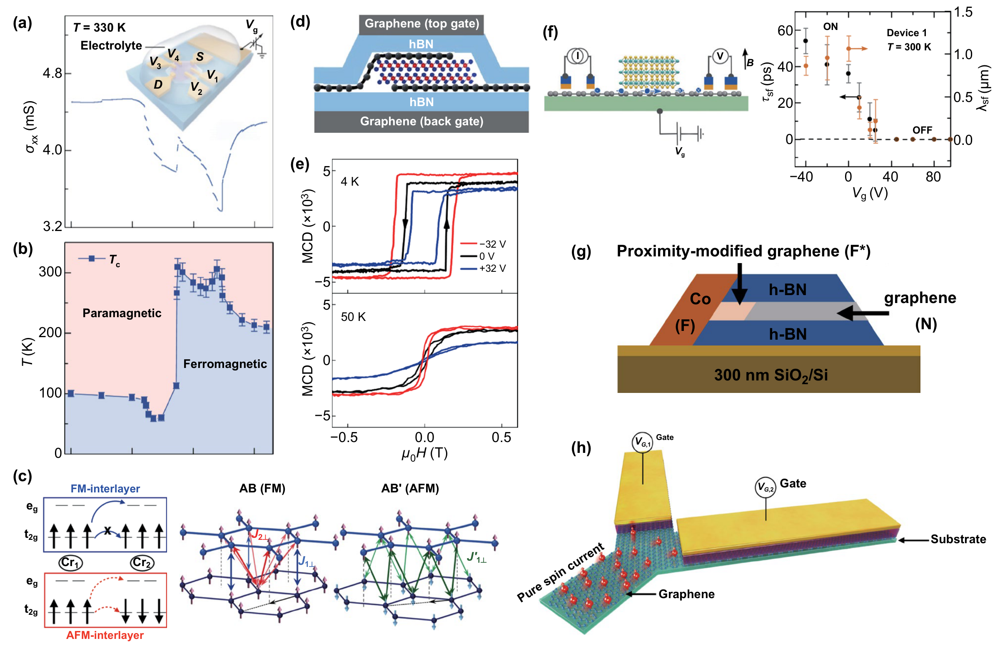
*   **来源**：[[../papers/liuSpintronicsTwoDimensionalMaterials2020b]]
*   **图示描述**：(a,b) 离子液体栅压 Vg 调控三层 Fe3GeTe2 电导 σxx 及温度-栅压相图；(c) CrI3 层间轨道依赖的超-超交换示意；(d,e) 双栅双层 CrI3 器件及 MCD 信号随磁场的变化；(f) MoS2/石墨烯异质结室温非局域电阻 RNL（Ω）随磁场 B（mT）的自旋阀曲线；(g) 一维边缘接触磁邻近效应；(h) Y 型石墨烯自旋流解复用器由栅压 VG,i 路由自旋流。
*   **关键特征**：离子栅将 Fe3GeTe2 的 Tc 推至室温以上（Deng et al., Nature 563, 94, 2018）；双层 CrI3 经静电掺杂可在层间 AFM 与 FM 之间完全可逆切换；CrI3 磁耦合由堆叠方式通过轨道依赖超-超交换决定；MoS2/石墨烯在室温下实现栅压可调自旋阀信号。

### 49. 图10 综述概览
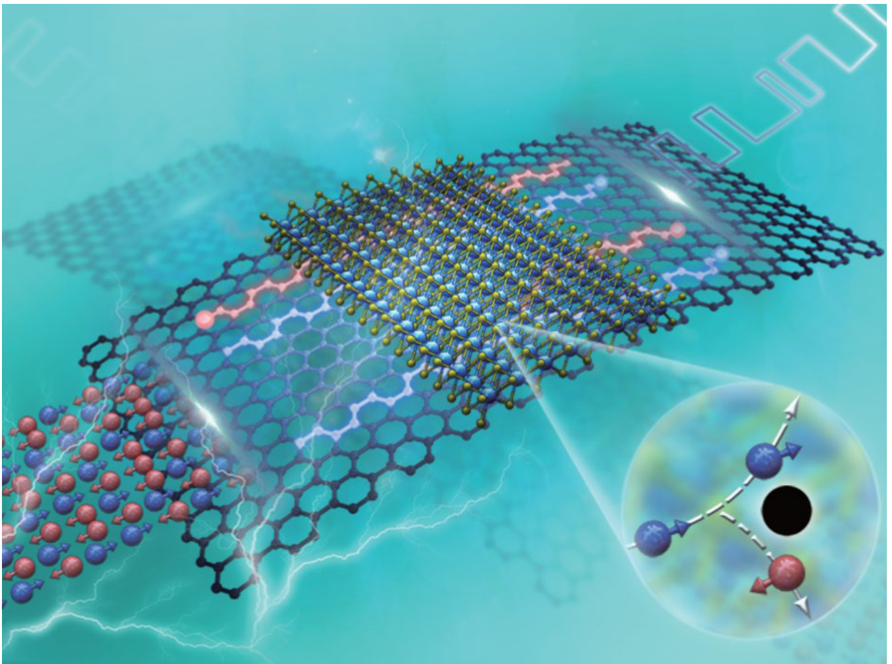
*   **来源**：[[../papers/liuSpintronicsTwoDimensionalMaterials2020b]]
*   **图示描述**：综述的全局概念图，左侧为电学/光学注入端把不同自旋（不同颜色）电子注入二维材料；中段为自旋在二维通道中反向扩散并被 vdW 异质结界面效应（SOC、邻近、磁交换）操控；右侧最终输出可用于逻辑的信号。
*   **关键特征**：用颜色编码自旋方向，直观呈现"相反自旋反向扩散"的纯自旋流图像；把注入（电/光/SOC）、输运（2D 通道）、操控（异质结界面）、应用（逻辑信号）四幕压缩为单一视觉骨架。

### 50. 图4 候选机制排除：XANES排除价态转变、老化实验估算势垒>1 eV、RTe3/EuTe4结构对比、层间相位切换模型
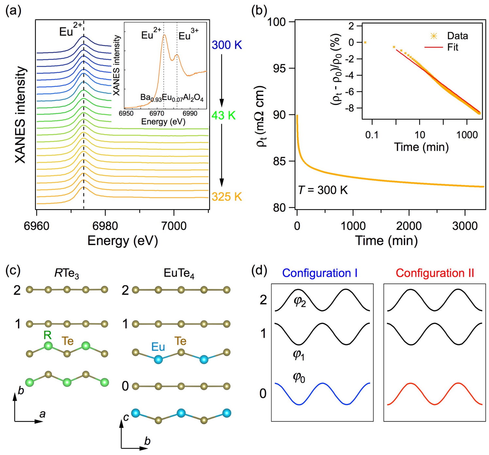
*   **来源**：[[../papers/lvUnconventionalHystereticTransition2022]]
*   **图示描述**：四格图系统排除已知机制并提出新模型。(a)43–325 K范围内Eu L₃边XANES谱，插图为Ba₀.₉₃Eu₀.₀₇Al₂O₄参考样；(b)完成400 K→20 K→300 K热循环后立即在300 K测的电阻率随时间衰减，插图为相对于ρ₀的百分比变化–对数时间图及对数拟合；(c)RTe₃与EuTe₄的结构对比示意；(d)Te单层与Te双层CDW的两种面外构型（同相φ=0、反相φ=π）。
*   **关键特征**：XANES全温区只出现Eu²⁺峰、无Eu³⁺信号，排除价态转变；老化曲线在3000 min内准对数衰减幅度<10%，与升降温分支间数量级差异相比可忽略；用τ~3000 min、ν₀~1 THz估算势垒 w ~ k_BT ln(ν₀τ) > 1 eV（室温k_BT≈26 meV），且扫速从0.15到10 K/min变化时滞回几乎不变，排除强玻璃态；结构对比指出RTe₃仅有Te双层而EuTe₄多出Te单层，由此提出相对相位自由度，自由能取 F = F₀ + a(T)cos φ + b cos²φ，φ=0与φ=π近简并，两态切换即巨滞回来源。

### 51. 图1 IM/State-1/State-2原子结构、极化等高线与NEB翻转势垒
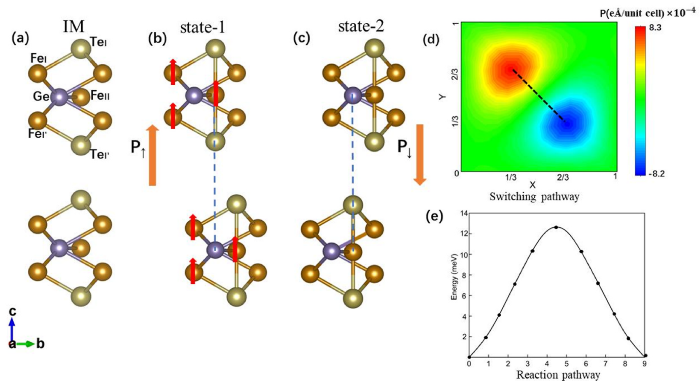
*   **来源**：[[../papers/miaoMagneticFerroelectricMetal2024]]
*   **图示描述**：(a–c) 为双层 FGT 的三种堆垛侧视图——AA 对齐的非极性中间态 IM、顶层相对底层滑移 (1/3, 1/3) 的 State-1 (P↑)、滑移 (−1/3, −1/3) 的 State-2 (P↓)，橙色箭头标极化方向、Fe 上的红箭头标自旋方向；(d) 为垂直极化随层间滑移方向与距离变化的二维等高线图，黑色虚线标出 P↑↔P↓ 最低能量翻转路径；(e) 为沿该路径的 NEB 能量曲线。
*   **关键特征**：State-1 与 State-2 极化大小相等、方向相反，约 ±8.3×10⁻⁴ eÅ/unit cell；Bader 电荷分析显示两层间有 ~0.03 e 的未补偿垂直电荷转移，是极化的微观起源；CI-NEB 给出的翻转势垒约 13 meV/unit cell，低于 In₂Se₃ (~60 meV/unit cell) 而高于 WTe₂ (~0.6 meV/unit cell)，因只需克服弱层间 vdW 作用，室温下可翻转。

### 52. 表1 不同滑移操作下双层FGT的相对能量
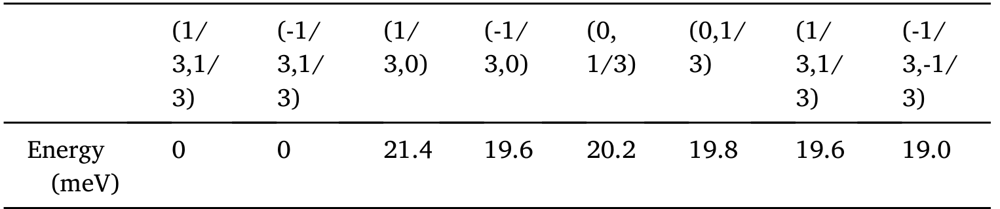
*   **来源**：[[../papers/miaoMagneticFerroelectricMetal2024]]
*   **图示描述**：以 (1/3, 1/3) 与 (−1/3, −1/3) 两种滑移（即 State-1、State-2）的能量为零点，列出 8 种代表性层间平移操作的体系相对能量（meV）。
*   **关键特征**：State-1 与 State-2 能量简并为 0 meV，是全局能量最低点；其余 (±1/3, 0)、(0, ±1/3)、(±1/3, ∓1/3) 等构型能量均高出约 19.6–21.4 meV/unit cell，热力学上明显不利；该能量排序与图 1(d) 的极化/能量景观相互印证，说明 IM 态会自发弛豫到 State-1 或 State-2。

### 53. 图2 从MAX相粉末经HF刻蚀、洗涤到手风琴状多层MXene的合成流程示意图

*   **来源**：[[../papers/naguib25thAnniversaryArticle2013a]]
*   **图示描述**：流程示意——MAX 相粉末在室温 HF 水溶液中搅拌，A 层被选择性溶出并由 O/OH/F 终端取代，再经离心/过滤、去离子水洗涤至 pH≈4–6，最终得到松散堆叠、形似手风琴的多层 MXene 颗粒。
*   **关键特征**：① HF 浓度与时间必须按材料精细调控（如 Ti₂AlC 用 10% HF/10 h，Ta₄AlC₃ 需 50% HF/72 h），过浓或过久会过度刻蚀甚至完全溶解；② 洗涤目的在于去除 AlF₃ 等副产物并终止反应；③ 所得多层 MXene 层间已由氢键/范德华作用连接，为后续插层—分层奠定基础；④ 该流程确立了"从强化学键合 3D 前驱体化学刻蚀制备 2D 材料"的普适新范式。

### 54. 图7 Ti3C2Tx经DMSO插层—水分层—丁达尔效应胶体—过滤成纸的全过程示意

*   **来源**：[[../papers/naguib25thAnniversaryArticle2013a]]
*   **图示描述**：示意多层 Ti₃C₂Tₓ 经 DMSO 插层显著撑大层间距，再在去离子水中温和超声获得少层/单层 MXene 水相悬浮液；激光笔照射呈现丁达尔散射光路，证明胶体性质；过滤后得到柔性、无粘结剂的 MXene"纸"。
*   **关键特征**：① DMSO 插层 Δc 可达约 15.4 Å（环境水共插层），空气中放置 3 周后 c 轴可翻倍；② 水中温和超声约 6 h 即可大规模分层，无需表面活性剂；③ 丁达尔效应证实胶体稳定分散；④ 这是当时唯一能大规模分层的 MXene 体系（Ti₃C₂Tₓ），把材料从多层粉末推向可加工的二维胶体与自支撑膜。

### 55. 图3 CIPS三种AFE相（层间/层内I/层内II）结构及相对FE相能量（最大差30.5 meV/f.u.）

*   **来源**：[[../papers/neumayerCompetingPolarPhases2025]]
*   **图示描述**：(a)–(c) 为三种 AFE 有序结构示意图：(a) interlayer AFE 为相邻层间偶极反平行，(b)(c) intralayer AFE I/II 为同一层内偶极反平行的不同构型；(d) 为三种 AFE 相相对于 FE 相的能量差柱状图，纵轴单位 meV/f.u.。
*   **关键特征**：interlayer AFE 能量最低；三种 AFE 相与 FE 相的最大能量差仅 30.5 meV/f.u.；所有 AFE 构型净极化为零但 Cu 位置不同；CIPSe 中则是层内 AFE 最稳定（与 CIPS 形成对比），CCPS 还预测出 Cu 移入 vdW 间隙的 AFE 相。

### 56. 图2 双层BP六种高对称堆叠、二维势能面（AB/AE/AF三个极小值）及各堆叠化学势
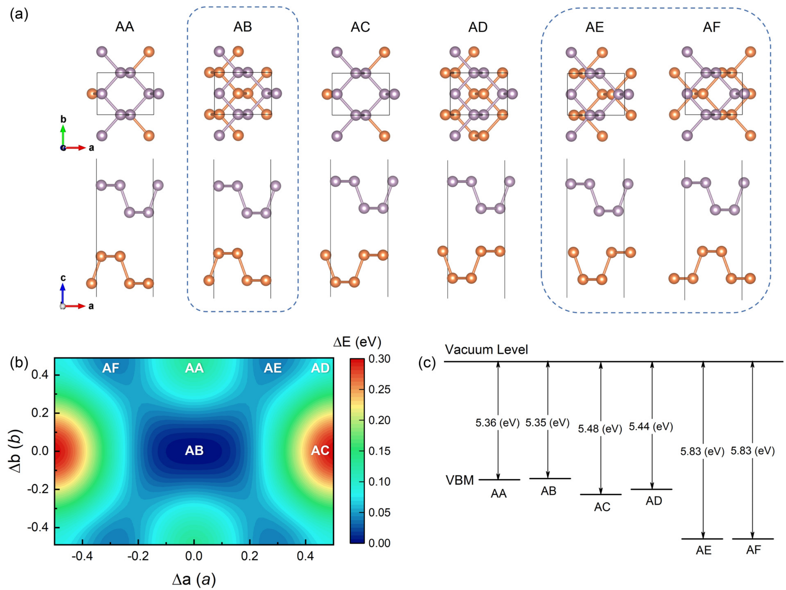
*   **来源**：[[../papers/shenEmergenceMultipleFerroelectric2025]]
*   **图示描述**：(a) AA、AB、AC、AD、AE、AF 六种高对称双层堆叠的俯视/侧视；(b) 以上层相对下层平移矢量 (Δa, Δb) 为坐标、以 AB 为能量零点的二维势能面；(c) HSE06 计算的各堆叠原子化学势柱状对比。
*   **关键特征**：势能面上只有 AB（基态，Pbcm）、AE、AF 三个稳定极小值，AE/AF 由 AA 平移约 ±0.28a 得到；所有双层堆叠仍保持中心对称、极化为零；但不同堆叠化学势不同，说明层间相对位置可改变电子能量分布，为多层不对称堆叠引发垂直电势差和电荷转移埋下伏笔；这张"地图"也是后文将 N 层堆叠降维为相邻双层组合穷举的依据。

### 57. 图3 三层BP堆叠穷举、相对能量及面外/面内极化（EAB：0.06 / 1.32 pC/m）
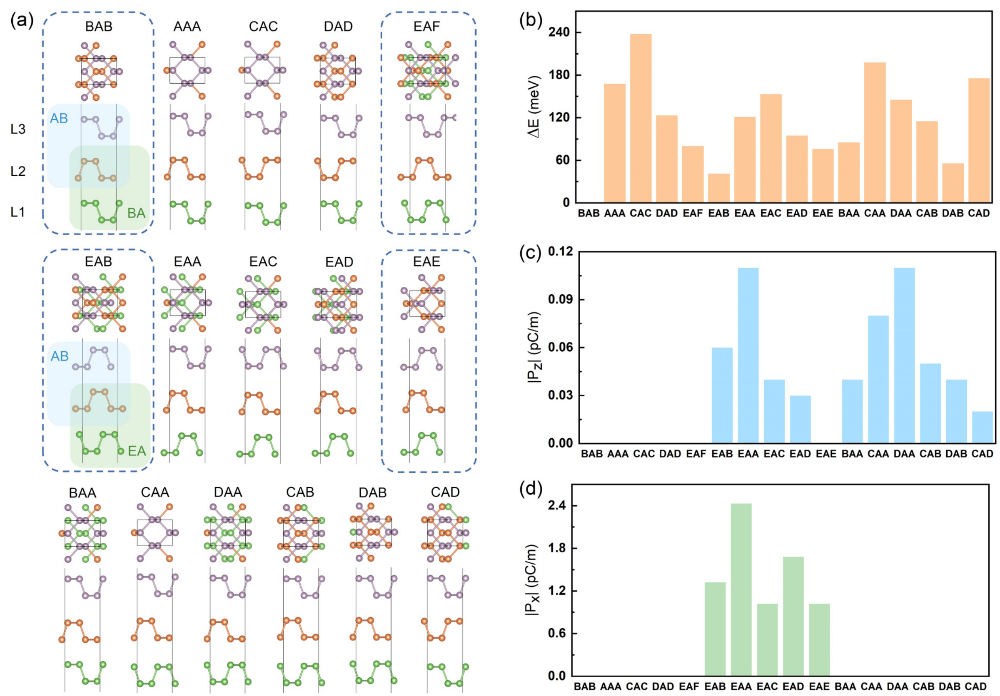
*   **来源**：[[../papers/shenEmergenceMultipleFerroelectric2025]]
*   **图示描述**：(a) 把三层构型视为 L1–L2、L2–L3 两个相邻双层堆叠的组合并穷举；(b) 以非极性基态 BAB 为零点的各构型相对能量；(c)(d) 分别为 Berry 相位法计算的面外和面内极化柱状图（单位 pC/m）。
*   **关键特征**：EAB（AB+AE 组合，空间群 Pm）能量仅比 BAB 高约 40 meV，属可实现的亚稳态；EAB 面外极化 0.06 pC/m、面内极化 1.32 pC/m，BAB 等对称构型极化皆为零；与石墨烯需到四层才出现面外极化不同，BP 因相邻双层有 AB/AE/AF 多种极小值，三层即可打破反演对称；这是论文"从 0 到 1"的核心证据。

### 58. 图2 多铁复合结构：(a) LuFeO3/LuFe2O4原子级超晶格；(b) BaTiO3-CoFe2O4垂直纳米柱；(c) BFO应变诱导T/R混合相及R'磁性相
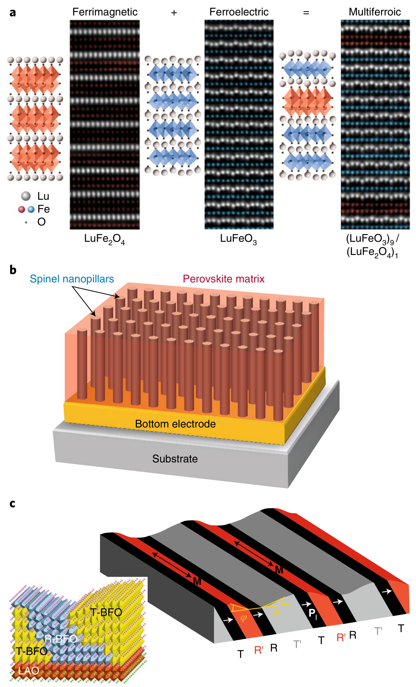
*   **来源**：[[../papers/spaldinAdvancesMagnetoelectricMultiferroics2019]]
*   **图示描述**：三个子图分别展示三类复合多铁结构的原子/显微示意图：(a) LuFeO₃/LuFe₂O₄ 水平原子级超晶格的逐层堆垛；(b) CoFe₂O₄ 磁性纳米柱垂直外延嵌入 BaTiO₃ 铁电基体的三维阵列；(c) LaAlO₃ 衬底上 BFO 薄膜受应变形成四方相 T 与菱方相 R 共存的纳米混合相。
*   **关键特征**：①水平超晶格提供巨大的化学/结构组合空间，并已在 SrTiO₃/PbTiO₃ 超晶格中观察到电场可控手性极化涡旋；②垂直纳米复合的三维异质外延增强磁电耦合和矫顽场，但仍存在<20 nm 纳米柱合成、位错/反相边界磁无序及单向交换偏置等开放问题；③BFO 的 T/R 相界处出现磁性增强的 R' 相，将相界本身变成功能界面。

### 59. Fig.3 钙钛矿/本征2D/滑动三种铁电机制对比
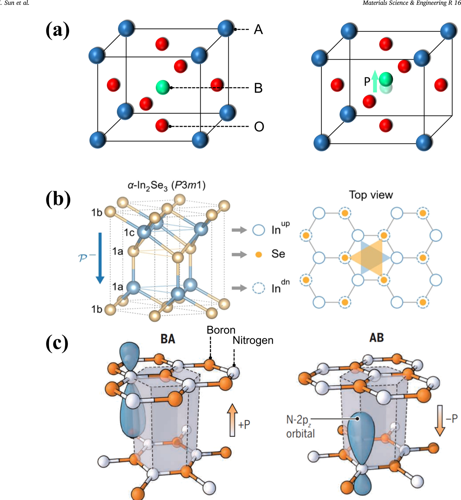
*   **来源**：[[../papers/sunSlidingFerroelectricityTwodimensional2025]]
*   **图示描述**：三联对比示意图，分别展示 (a) 传统 ABO₃ 钙钛矿的 B 位离子位移、(b) α-In₂Se₃ 等二维本征铁电中层内原子位移、(c) h-BN 等范德华双层的层间整体滑移。
*   **关键特征**：把"滑动"确立为与离子位移并列的第三类铁电机制；前两者依赖层内原子位移，滑动 FE 依赖层间整体滑移；不涉及强化学键断裂，因此本征抗疲劳、翻转能垒低；与 Table 1 的四类铁电材料优缺点对比形成机制级呼应。

### 60. Fig.4 三种构建滑动铁电的途径
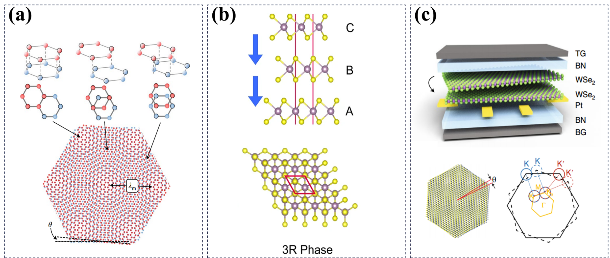
*   **来源**：[[../papers/sunSlidingFerroelectricityTwodimensional2025]]
*   **图示描述**：三联示意图展示三条工程化路径：(a) 石墨烯等双层通过小角度扭转形成长周期莫尔超晶格；(b) 3R 菱方堆叠（R3m）借固有非中心对称性产生极化；(c) 同质/异质双层间人为控制扭转角打破反演对称。
*   **关键特征**：莫尔超晶格由周期势起伏重新调制电荷分布；3R 相直接利用非中心对称堆叠；扭转角是最普适、可调的方法；三条路径共同构成后续材料与器件设计的"工程手册"。

### 61. Fig.5 3R/2H结构与莫尔条纹弛豫
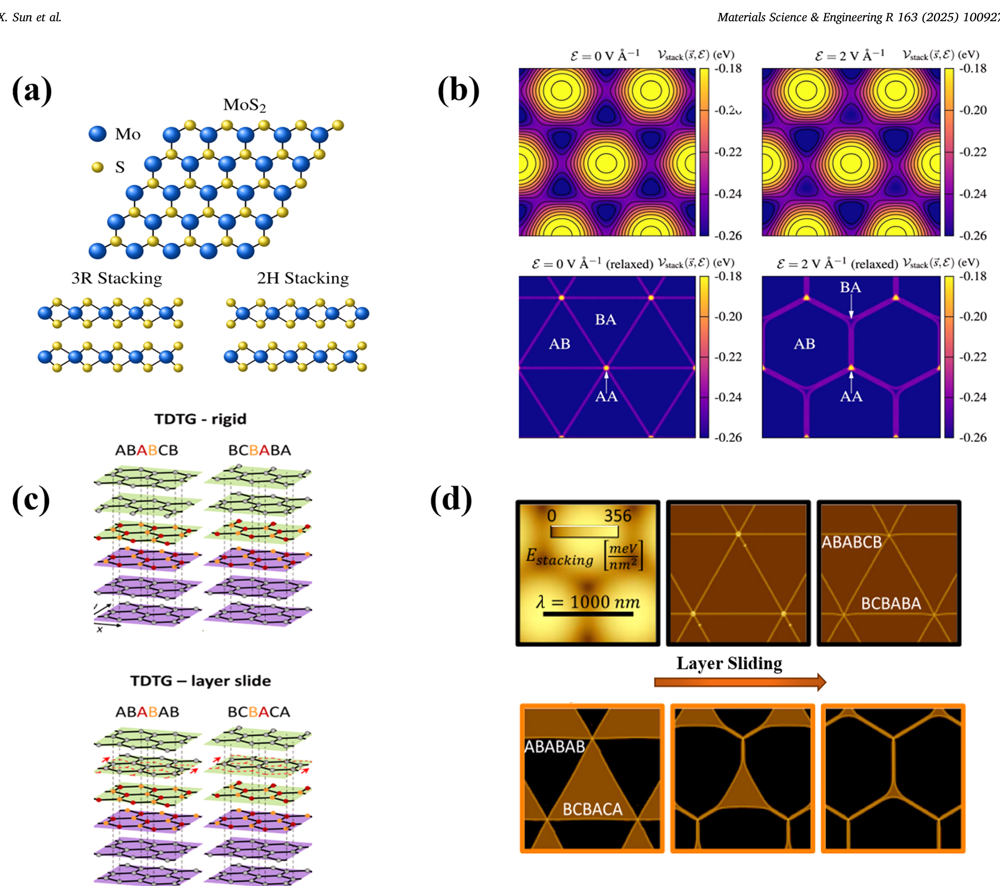
*   **来源**：[[../papers/sunSlidingFerroelectricityTwodimensional2025]]
*   **图示描述**：以 MoS₂ 和石墨烯为例的结构细节图：(a) 3R 菱方相与 2H 六方相的原子结构对照；(b) 3R 堆叠下晶格弛豫、畴壁形成与能带对应；(c–d) 扭转双层/三层石墨烯中的莫尔条纹、层间滑移与畴演化。
*   **关键特征**：2H 为镜面对称、偶数层抵消极化，3R 为非中心对称、偶数层仍保留 OOP 极化；K 谷动量分裂到不同层，栅压可调控极化；石墨烯通过莫尔周期势与畴壁运动被纳入滑动 FE 范畴，显示机制普适性。

### 62. Fig.6 CVD制备与UV胶带转移
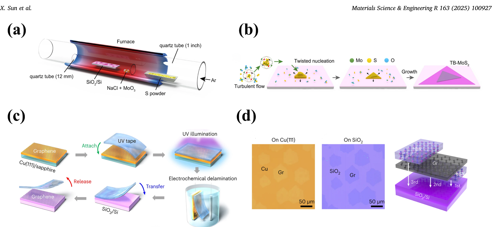
*   **来源**：[[../papers/sunSlidingFerroelectricityTwodimensional2025]]
*   **图示描述**：制备方法示意：(a–b) 以硫粉和 MoO₃ 为前驱体、Ar 为保护气的 CVD 生长 MoS₂ 装置；(c–d) 利用 UV 胶带从块体机械剥离并把石墨烯转移到铜网等衬底的流程。
*   **关键特征**：CVD 属"自下而上"路线，可直接生长特定相（如 3R）和异质结，但可能引入缺陷；机械剥离+堆叠转移属"自上而下"路线，能获得高质量单晶并精确控制扭转角，但样品尺寸小、层数难控；两者互补，是当前材料制备的基础。

### 63. Fig.8 4D-STEM与扭转堆叠畴壁动力学
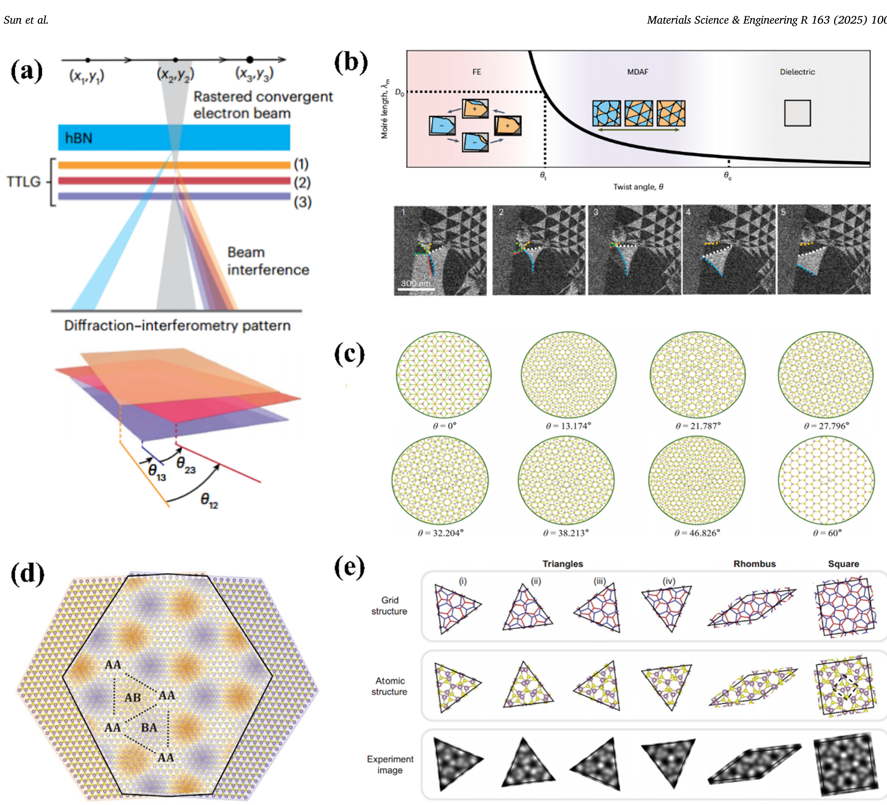
*   **来源**：[[../papers/sunSlidingFerroelectricityTwodimensional2025]]
*   **图示描述**：以 4D-STEM 为主的结构表征：(a) 暗场成像原理；(b) 扭转角减小过程中非铁电—铁电转变时畴壁运动的实时序列；(c) MoSSe 扭转后 Se–Se 构象对应的层间滑动；(d) 扭转堆叠形成的波纹/涡旋状极化纹理示意。
*   **关键特征**：4D-STEM 在皮米（pm）尺度分辨层间位移与局部堆垛构型，空间分辨率可达约 80 pm；直接观测畴壁运动与铁电相形成；不同扭转角对应不同莫尔周期和极化分布；为滑动 FE 微观起源提供最直接的结构证据。

### 64. Fig.9 石墨烯/h-BN扭转超晶格器件
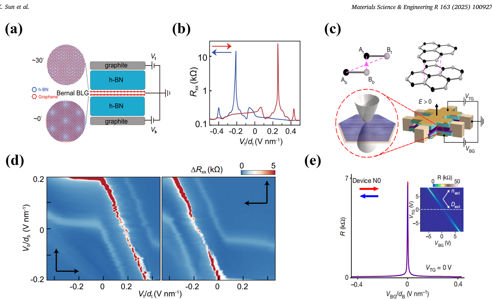
*   **来源**：[[../papers/sunSlidingFerroelectricityTwodimensional2025]]
*   **图示描述**：石墨烯/h-BN 扭转超晶格器件案例：(a) vdW 器件结构；(b) 转移曲线中的显著迟滞；(c) Bernal 堆叠双层石墨烯晶格与层间滑动路径；(d) 石墨烯扭转形成超晶格的双层器件；(e) 不同构型下的电阻特性。
*   **关键特征**：上层 h-BN/石墨烯 30°、下层 0° 扭转的器件出现显著铁电滞回；多层滑动路径计算显示存在对应能量转换的跨层滑动；以电学输运数据直接证明石墨烯体系中可重复、可调控的滑动铁电；属"理论到实践"的首批证据之一。

### 65. Fig.12 MX（GaSe等）堆叠、SS-PFM与SHG
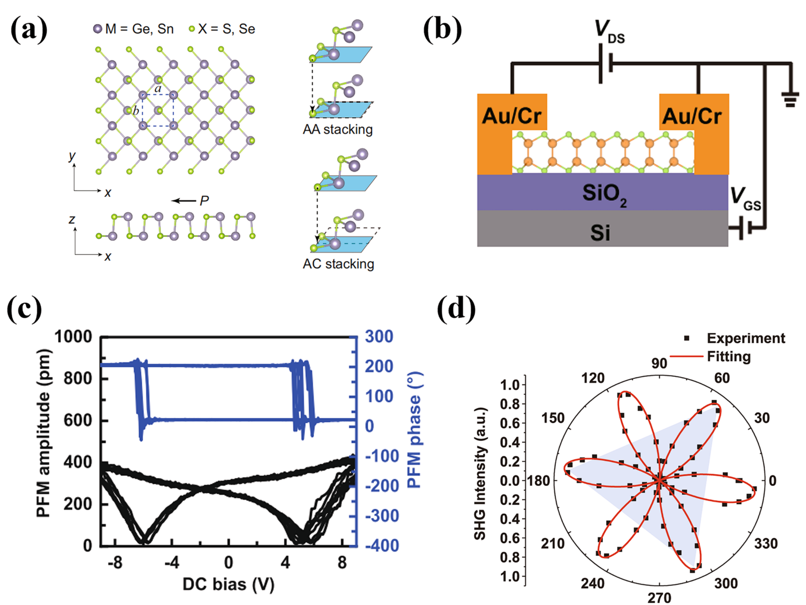
*   **来源**：[[../papers/sunSlidingFerroelectricityTwodimensional2025]]
*   **图示描述**：MX 族（GaSe、GeSe、SnSe 等）案例：(a) AA/AC/AB/AD 堆叠构型与层间滑移诱导极化；(b) 器件结构示意；(c) GaSe 纳米片的开关谱 PFM（SS-PFM）；(d) SHG 信号强度随偏振角的依赖。
*   **关键特征**：能量排序 AC < AB < AA < AD，AA/AC 倾向铁电、AB/AD 倾向反铁电；多层 GaSe 以层内滑动为主，电阻切换重复性好、ON/OFF 比高；SHG 偏振依赖证实反演对称破缺；为 MX 族在 FE/AFE 之间切换提供实验依据。

### 66. Table 3 扭转角—铁电性对应关系
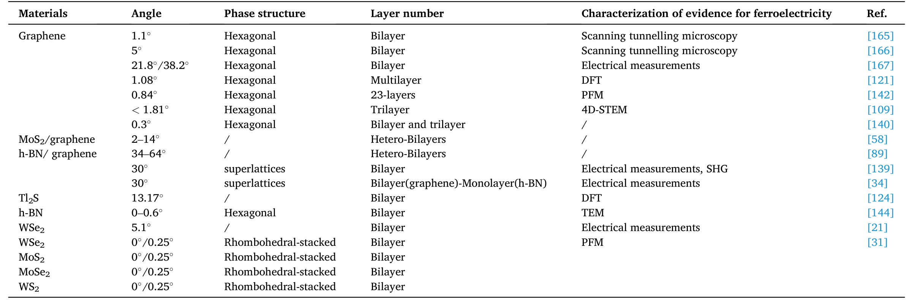
*   **来源**：[[../papers/sunSlidingFerroelectricityTwodimensional2025]]
*   **图示描述**：层间扭转角与铁电性关联表，覆盖石墨烯、MoS₂/石墨烯、h-BN/石墨烯、Tl₂S、h-BN、WSe₂、MoS₂、MoSe₂、WS₂ 等体系，列出扭转角度、相结构、层数和表征证据。
*   **关键特征**：石墨烯扭转角范围可从约 0.3° 至 38.2°；WSe₂ 报道约 5.1° 等具体角度；扭转角与莫尔周期、铁电相稳定性直接相关；为"扭转角工程"提供可查的实验/理论参数清单。

### 67. Eq.1 滑动双层在垂直电场下的哈密顿量
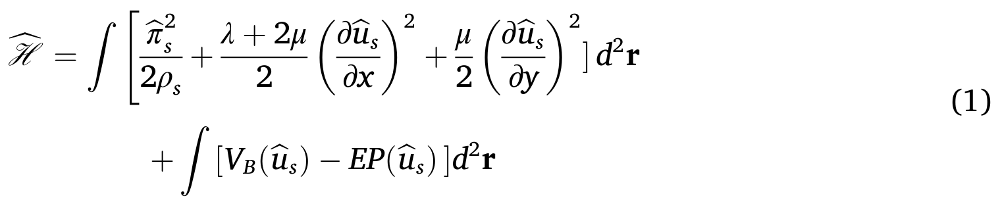
*   **来源**：[[../papers/sunSlidingFerroelectricityTwodimensional2025]]
*   **图示描述**：垂直外电场下滑动双层的连续介质哈密顿量，以层间滑移场 ûₛ 为自由度，包含共轭动量 π̂ₛ = ρₛ ûₛ、层间压缩弹性常数 λ 与层间剪切弹性常数 μ 等参量。
*   **关键特征**：把层间滑移形式化为与电场耦合的力学自由度；λ、μ 分别控制层间压缩与剪切刚度；与 Landau–Ginzburg 自由能结合可导出矫顽场、畴壁能和翻转路径；是连接微观 DFT 计算与宏观器件响应的理论核心。

### 68. 图1 本征+滑移极化的八态概念模型（FE/AFE 耦合）
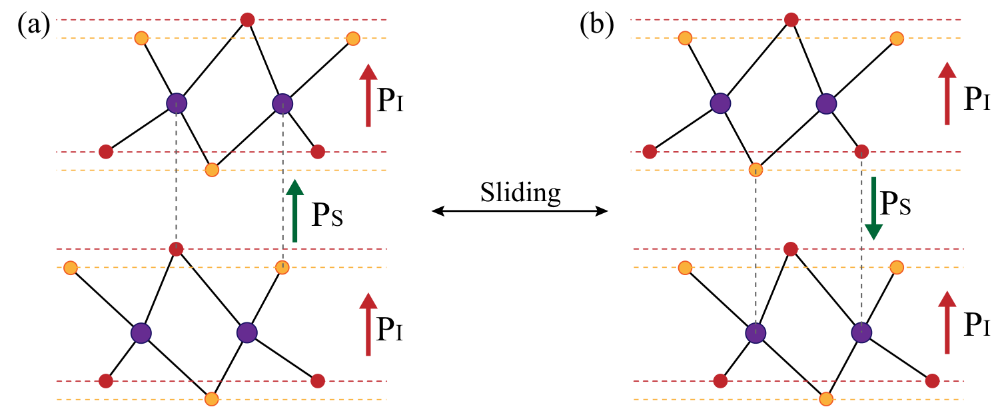
*   **来源**：[[../papers/tangCombiningIntrinsicSlidinginduced2025]]
*   **图示描述**：概念示意图，(a) 双层结构侧视给出层间铁电耦合（FE，两层 PI 同向）与反铁电耦合（AFE，头对头/尾对尾）两种排列，红箭头为本征极化 PI、绿箭头为滑移诱导极化 PS；(b) 俯视展开 H 堆叠下 PI 上下方向与 PS 配置组合出的全部八种极化组态。
*   **关键特征**：两个自由度（每层 PI 方向 + 层间 PS）组合给出 2³=8 个理论态；FE/AFE 耦合由层内 PI 相对方向决定；尾对尾 AFE 组态在后续电场合规切换路径中不出现，故双层实际可切换态缩减为 6 个。

### 69. 图2 1T″-MoSe2 单层结构、PI 翻转势垒(271 meV/f.u.)、八种 H 堆叠构型及差分电荷密度
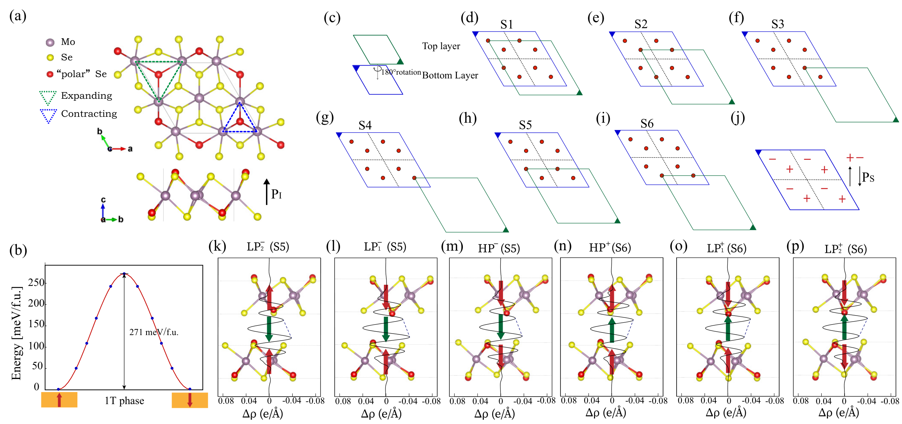
*   **来源**：[[../papers/tangCombiningIntrinsicSlidinginduced2025]]
*   **图示描述**：材料实现证据图。(a) 1T″-MoSe₂ 单层几何，由 1T 相 2×2 重构而来，Mo 原子形成收缩/扩张三角形导致 Se 面外位移；(b) NEB 给出单层 PI 翻转能量势垒；(c)–(j) H 堆叠双层八种构型 S1–S8 及各自 PS 符号；(k)–(p) S5、S6 在不同层间极化耦合（IPC）下的平面平均差分电荷密度 Δρ（e/Å），红蓝区分别对应电子积累/耗尽。
*   **关键特征**：单层 PI 翻转势垒 271 meV/f.u.（MoS₂ 212、MoTe₂ 306 meV/f.u.）；Berry 相极化 0.18 pC/m（MoS₂ 0.32、MoTe₂ 0.22 pC/m），折算约 0.018 μC/cm²；八种构型 PS 符号按 {S1,S3,S5} 与 {S2,S4,S6} 分为两组，符号不随 IPC 改变（堆叠顺序不变、电子重构保持）；Δρ 显示层间电子积累/耗尽导致电荷重心偏移，PS 幅值可大于 PI；各堆叠均为能量局域极小，构型间能量差约 20 meV/f.u.。

### 70. 图3 双层六态切换：滑移路径 NEB 势垒、HP+/LP−₂/LP−₁/HP− 循环及各态净极化
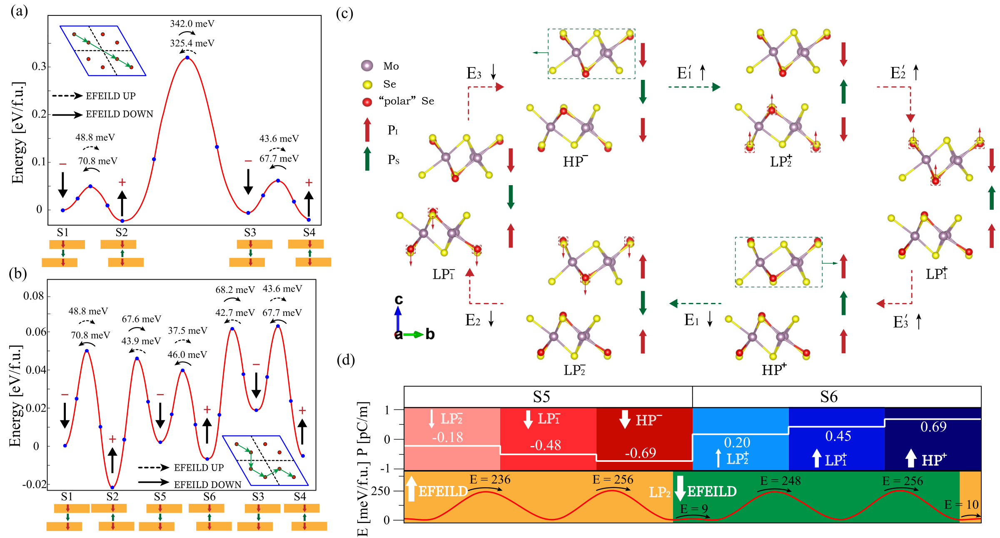
*   **来源**：[[../papers/tangCombiningIntrinsicSlidinginduced2025]]
*   **图示描述**：双层切换机制核心图。(a)(b) 固定层内极化向下时各堆叠间滑移 NEB 路径与势垒；(c) 外电场 E₁↓/E₂↓/E₃↓ 驱动下 HP⁺→LP⁻₂→LP⁻₁→HP⁻ 再反向回到 HP⁺ 的六态循环；(d) 六态净极化值（pC/m）及相邻态间转换势垒。
*   **关键特征**：S2→S5 势垒约 44 meV/f.u.，远低于 S2→S3 的约 325 meV/f.u.，系统优先走 S2→S5→S6→S3 低能路径，构成"逐层滑移"；S5↔S6 势垒约 38–46 meV/f.u.；LP⁻₂ 中顶层 PI 翻转势垒比底层低 10 meV/f.u.，使中等电场只翻顶层（LP⁻₂→LP⁻₁），更大电场才翻底层（LP⁻₁→HP⁻）；六态 HP⁺、LP⁻₂、LP⁻₁、HP⁻、LP⁺₂、LP⁺₁ 均为能量局域极小，对应 log₂6≈2.58 bit/单元。

### 71. 图4 三层十态切换：堆叠顺序、逐层滑移-逐层翻转路径、E1<E2≈E3<E4<E5 电场分级
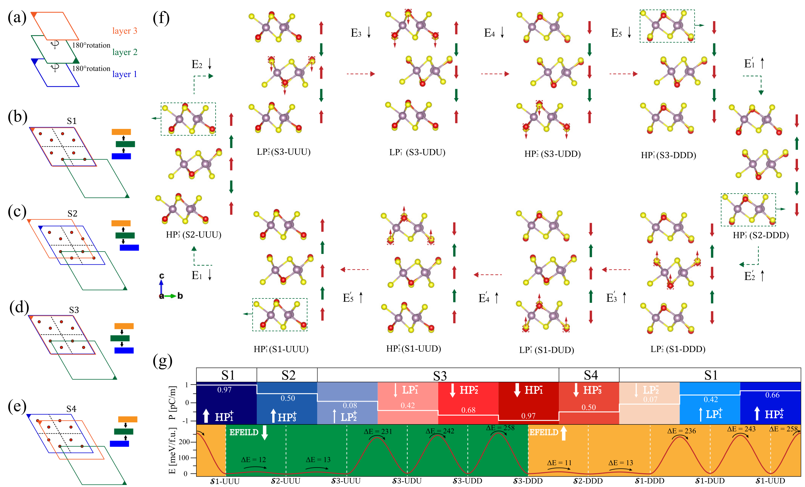
*   **来源**：[[../papers/tangCombiningIntrinsicSlidinginduced2025]]
*   **图示描述**：三层拓展图。(a)–(e) H 堆叠三层 1T″-MoSe₂ 在切换中涉及的五种堆叠顺序；(f) 从 HP⁺₁ 出发经多次逐层滑移和逐层翻转至 HP⁻₁ 的十态切换路径；(g) 十态净极化大小及相邻转换势垒，给出所需电场趋势。
*   **关键特征**：底层滑移势垒 12 meV/f.u. 低于顶层 13 meV/f.u.，故先发生层选择性滑移；LP⁺₂ 态中中间层因承受两个反向层间极化的有效内场，其 PI 翻转势垒反而低于顶/底层，被优先翻转；顶/底层 PI 翻转势垒差约 16 meV/f.u.；所需电场满足 E₁↓ < E₂↓ ≈ E₃↓ < E₄↓ < E₅↓；共 10 个可切换态，对应 log₂10≈3.32 bit/单元。

### 72. 表I S5/S6 堆叠下 PT_I、PB_I、PS、Ptot（pC/m）数值
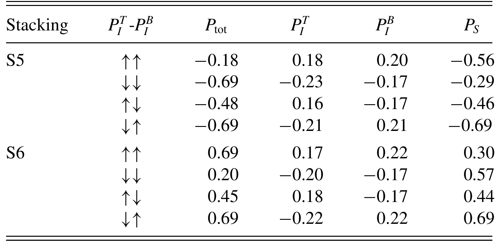
*   **来源**：[[../papers/tangCombiningIntrinsicSlidinginduced2025]]
*   **图示描述**：表 I 列出 S5、S6 两种堆叠在四种层内极化组态（↑↑、↓↓、↑↓、↓↑）下的顶层本征极化 PT_I、底层本征极化 PB_I、滑移诱导极化 PS 与总极化 Ptot，单位均为 pC/m。
*   **关键特征**：同一堆叠下 PS 符号在四种 IPC 中保持一致（S5 全为负、S6 全为正），仅幅值小幅变化（S5 约 −0.29 至 −0.69 pC/m，S6 约 0.30 至 0.69 pC/m）；PT_I/PB_I 随层内方向翻转在 ±0.16 至 ±0.23 pC/m 范围；Ptot 在 −0.69 至 +0.69 pC/m 间变化，FE 耦合 ↑↑/↓↓ 给出最大净极化，AFE 耦合 ↑↓/↓↑ 给出较低但非零的净极化。

### 73. 图4 原子滑移过程与广义堆垛层错能（GSFE）曲线

*   **来源**：[[../papers/wangFormationMechanismTwin2019]]
*   **图示描述**：上半部分为单层 1T'-WTe₂ 沿 x 方向刚性滑移的六个快照 I→VI，蓝色阴影为逐渐扩展的孪晶区，a₀ 为 [110] 方向单位长度；下半部分为对应滑移距离的 GSFE 曲线，蓝线对应 trailing partial 恢复原态、红线对应 twinning partial 形成一个原子层宽孪晶、粉线对应孪晶进一步生长。
*   **关键特征**：曲线上定义 γusf（不稳定层错能，I→II 能垒）、γsf（层错态 III 能量）、γutf（不稳定孪晶能，III→IV 能垒）；计算得到 γusf/γutf = 0.894，接近最大值 1，孪晶倾向很大，与样品中罕见孤立层错一致；γutf 约为典型三维金属 Al、Ni、Cu 的三倍，体现二维层内集体滑移路径的高能垒；基于 Peierls 框架推导：I→II 产生层错需 6.4% 剪切应变（速率决定步骤），III→IV 孪晶成核需 5.0%，V→VI 孪晶生长需 5.2%。

### 74. 表2 In₂NO₂/MoSe₂ 异质结 ±P 态磁参数（J、d_k、k、K 等）

*   **来源**：[[../papers/wangTunableD0Topological2025b]]
*   **图示描述**：表格列出 In₂NO₂/MoSe₂ 异质结在 -P 与 +P 两种铁电极化态下的海森堡交换 J、面内 DMI d_k、各向异性交换 k、单离子各向异性 K（含 K_MCA、K_MSA 分解）以及 N 原子磁矩 M_N 等关键磁参数，附单位（meV / μeV / μ_B）。
*   **关键特征**：两态 J、d_k 等参数均出现差异，d_k 在 ±P 态下符号相反、幅值略有差别；这些数值是图5(c)(d) 微磁学模拟的直接输入，定量解释了为何两极化态的斯格明子稳定磁场窗口不同。

### 75. Hf2MnC2O2/Sc2CO2 异异质结 DW-(I) 与 UP-(II) 稳定堆垛构型（图2）

*   **来源**：[[../papers/wuNonvolatileSwitchableHalfmetallicity2024]]
*   **图示描述**：(a,b) 分别为 Hf₂MnC₂O₂ 与 Sc₂CO₂ 单层俯视图；(c,d) 为能量最稳定的 DW-(I)（对应 Pk）和 UP-(II)（对应 Pm）侧视堆垛，绿色箭头标 Sc₂CO₂ 面外极化方向，并标 d、d_O–O、d_O–Sc。
*   **关键特征**：Sc₂CO₂ a=3.35 Å，与 Hf₂MnC₂O₂ 晶格失配 <3.3%；两种堆垛中 Hf₂MnC₂O₂ 的 O 原子均位于 Sc 原子上方；界面 O–O、O–Sc 距离远大于共价/离子半径之和，证明层间为纯 vdW 耦合；Pk/Pm 为 Sc₂CO₂ 两个能量简并的铁电稳态。

### 76. 表1 AB堆叠vdW双层计算垂直极化（pC/m）：BN 2.08, ZnO 8.22, AlN 10.29, GaN 9.72, SiC 6.17, MoS2 0.97, InSe 0.24, GaSe 0.46
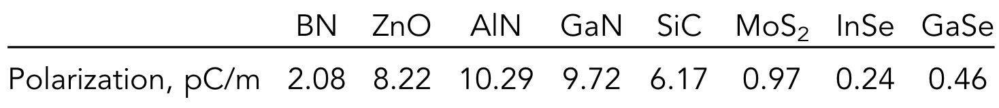
*   **来源**：[[../papers/wuSlidingFerroelectricity2D2021a]]
*   **图示描述**：第一性原理计算得到的 AB 堆垛范德华双层垂直极化值汇总表，单位为二维极化单位 pC/m。
*   **关键特征**：BN 2.08、ZnO 8.22、AlN 10.29、GaN 9.72、SiC 6.17、MoS₂ 0.97、InSe 0.24、GaSe 0.46 pC/m；其中 AlN 双层 10.29 pC/m 是当时已知二维铁电中最高垂直极化，约为 BN 的五倍；pC/m 除以层间距可换算为三维 μC/cm²（BN 的 2.08 pC/m ≈ 0.68 μC/cm²）。

### 77. 表2 vdW体结构计算垂直极化（μC/cm²）：3R-BN 2.41（正文另给7.6）, 3R-MoS2 0.52, 3R-InSe 0.08, h-SnS2 0.18, h-SnSe2 0.42, h-CrI3 0.06, ZrI2 0.31
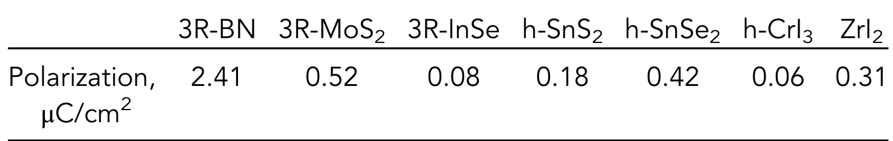
*   **来源**：[[../papers/wuSlidingFerroelectricity2D2021a]]
*   **图示描述**：范德华体相结构的计算垂直极化值汇总表，单位为三维标准单位 μC/cm²。
*   **关键特征**：3R-BN 2.41（正文另给 7.6）μC/cm²，3R-MoS₂ 0.52，3R-InSe 0.08，六方相 h-SnS₂ 0.18、h-SnSe₂ 0.42，h-CrI₃ 0.06，ZrI₂ 0.31 μC/cm²；体相因不受退极化场限制，极化可比双层显著增强；涵盖 R3m 蜂窝体系（3R 相）、1T/1T' 体系的六角/正交极性相。

### 78. 图4 莫尔铁电性：扭转hBN的EFM三角电势超晶格、半导体双层II型能带对齐、层间激子能量随扭转角
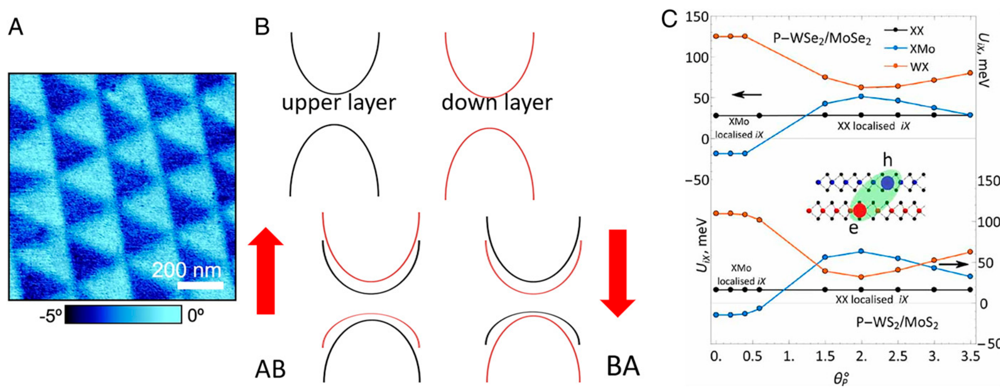
*   **来源**：[[../papers/wuSlidingFerroelectricity2D2021a]]
*   **图示描述**：莫尔铁电性的实验观测与理论模型。(A) 扭转 h-BN 双层的静电力显微镜（EFM）图像，呈现规则三角超晶格电势分布；(B) 扭转半导体双层不同局域堆垛区域中上下层能带的相对位移，形成 II 型（type-II）能带对齐；(C) WX₂/MoX₂（X=S,Se）扭转双层中，不同堆叠域的层间激子能量随扭转角变化的理论曲线。
*   **关键特征**：EFM 三角图案直接对应 AB/BA/AA 局域堆垛的周期电势调制；II 型对齐使电子、空穴分别局限于不同层，莫尔铁电畴壁网络可捕获电子、空穴和层间激子，形成量子点阵列；MX₂/M'X'₂/MX₂ 三层还预测了双色莫尔电势与具有相反电偶极的两个独立三角超晶格。

### 79. 表1 不同堆垛下Gd-Gd层间距离、配位数、海森堡交换参数J及ΔE

*   **来源**：[[../papers/xunCoexistingMagnetismFerroelectric2024]]
*   **图示描述**：汇总 AA、AB、AB′、BA′ 四种典型堆垛下 Gd–Gd 最近邻（NN）与次近邻（second-NN）层间距离、每单胞交换键数（方括号）、海森堡交换参数 J₁⊥、J₂⊥、J∥ 以及层间 AFM-FM 能量差 ΔE。
*   **关键特征**：AA 堆垛 NN 距离 8.139 Å、每胞 1 条 J₁⊥ 键，J₁⊥=0.243 meV（AFM）、J₂⊥=−0.003 meV、J∥=−8.253 meV、ΔE=−1.794 meV，NN 的 AFM 耦合压制 6 条 J₂⊥ 的弱 FM 贡献，整体为 AFM；AB 堆垛 NN 距离缩短到 7.888 Å、每胞 3 条 J₁⊥ 键，J₁⊥=−0.036 meV 反号为 FM、J₂⊥=−0.007 meV、ΔE=+1.046 meV，整体 FM；AB′ 配位数与 AA 相同（1+6）但 J₁⊥ 仅 0.002 meV、ΔE=+0.206 meV，BA′ 配位数与 AB 相同（3+3）但 J₁⊥=0.066 meV、ΔE=−1.403 meV，二者磁基态相反，说明仅靠配位数不足以判断磁序，对称性/轨道重叠才是关键；层内 J∥ 约 −8.25 meV 始终为强 FM。

### 80. 图3 双层GdI₂滑移能垒、层间交换能随滑移路径变化及二维磁相图

*   **来源**：[[../papers/xunCoexistingMagnetismFerroelectric2024]]
*   **图示描述**：上排 (a–c) 对应 AA 类堆垛、下排 (d–f) 对应 AA′ 类堆垛；(a,d) 为沿滑移路径的总能曲线（灰/蓝球分别表示 AFM/FM 磁基态，橙色球为能量极小），(b,e) 为 AFM-FM 能量差 ΔE 沿 [1̄10]（红实线）和 [100]（蓝虚线）方向的变化，(c,f) 为 6×6 网格扫描得到的全二维滑移空间磁相图（红=FM，蓝=AFM）。
*   **关键特征**：AB 与 BA 是 AA 类的能量最低稳态，AB→BA 翻转能垒仅 16.42 meV（低于室温 k_BT≈26 meV）；AA 堆垛层间交换能 ΔE≈−1.794 meV（AFM 基态），AB/BA 为 +1.046 meV（FM 基态）；AA′ 类中 BA′ 最稳、AB′ 能量高 0.75 meV，AB′ 附近为 FM、其余多为 AFM；相图清晰显示 D3h 对称的 AA 为 AFM，破缺 xy 镜面降至 C3v 的 AB/BA 区域转为 FM，并伴随面外电极化（真空能级跃变 ΔΦ=±22.86 meV，P=3.68×10⁻¹² C/m）。

### 81. 图4 轨道依赖层间交换及Gd-I-I-Gd超超交换路径示意图

*   **来源**：[[../papers/xunCoexistingMagnetismFerroelectric2024]]
*   **图示描述**：(a) 为 d 轨道选择定则示意，对比 d_z²–d_z² 虚跃迁在 AFM/FM 构型下的允许/禁止；(b–e) 标出 AA、AB、AB′、BA′ 四种堆垛中最近邻 J₁⊥（红色连线）和次近邻 J₂⊥（蓝色连线）的 Gd–Gd 交换路径；(f–i) 为对应的 Gd–I–I–Gd 超超交换轨道示意图。
*   **关键特征**：基于 Gd 4f⁷5d¹ 构型与洪特规则，d_z²–d_z² 半满轨道间跃迁仅在 AFM 自旋下允许，倾向 AFM；而 d_z²→空 d_xy/d_x²−y²、d_z²→d_xz/d_yz 的跃迁由局域洪特耦合主导，倾向 FM；AA 堆垛中 J₁⊥ 沿 d_z²–d_z² 路径主导（J₁⊥=0.243 meV，AFM），J₂⊥ 较弱；AB 堆垛因滑移改变轨道重叠，J₁⊥ 变为 d_z²–d_xy/d_x²−y² 路径（J₁⊥=−0.036 meV，FM），J₂⊥ 亦为 FM，整体磁基态由 AFM 翻转为 FM。

### 82. 公式4 气泡高宽比 h/R=√(πγ/(5C₁Y))
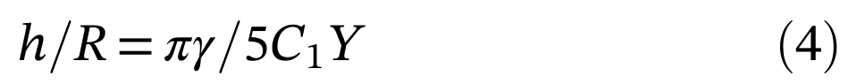
*   **来源**：[[../papers/yangStrainEngineeringTwodimensional2021]]
*   **图示描述**：范德华界面自发气泡形貌参数（高度 h、半径 R）的力学平衡关系。
*   **关键特征**：h/R=√(πγ/(5C₁Y))，原文式 (4)；γ 为二维材料对衬底的粘附能，C₁ 为数值系数，Y 为二维材料杨氏模量；气泡高宽比仅由材料/衬底力学参数决定，与气泡个体尺寸无关，可用来反推界面粘附能。

### 83. 图2

*   **来源**：[[../papers/zahraCriticalAnalysisFerroelectric2025]]
*   **图示描述**：(a) 周期表中标出 M（早期过渡金属）、A（IIIA/IVA 族）、X（C/N）元素；(b) 从三维 MAX 相选择性刻蚀 A 层再经分层得到二维 MXene 纳米片；(c) 按 M 元素数量分为单过渡金属（如 Ti3C2）与双过渡金属（如 Mo2TiC2）MXene。
*   **关键特征**：M-X 为金属/离子/共价混合键，强于 M-A 金属键，故刻蚀仅断 M-A；已报道约 155 种 MAX 相、约 55 种 MXene；n=1 时 M 原子呈 ABAB 六方密堆，n=2、3 时呈 ABCABC 面心立方堆垛；通式 M_{n+1}X_nT_x 的来源一目了然。

### 84. 图4
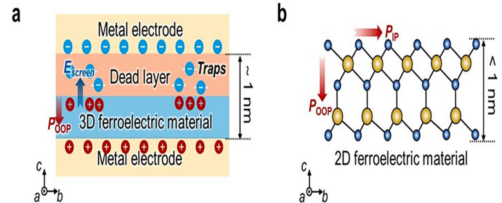
*   **来源**：[[../papers/zahraCriticalAnalysisFerroelectric2025]]
*   **图示描述**：(a) 3D 铁电电容中电极/界面处的屏蔽电荷产生 E_screen 屏蔽场，叠加退极化场削弱面外极化；(b) 以 In2Se3 为代表的 2D 范德华铁电体单层结构，无界面死层即可保持面内/面外极化。
*   **关键特征**：厚度越薄，死层对 3D 铁电体的压制越显著；范德华表面干净、无悬挂键，使 2D 铁电在纳米尺度仍稳定；该图是"为什么要在 2D MXene 中找铁电"的核心物理动机。

### 85. 图7

*   **来源**：[[../papers/zahraCriticalAnalysisFerroelectric2025]]
*   **图示描述**：(a–c) 在 Ti3C2Tx 纳米片上原位生长 BaTiO3 纳米颗粒的合成策略；(e–h) 从 Ti3AlC2 MAX 相→多层 Ti3C2Tx→少层 Ti3C2Tx→BT/f-Ti3C2Tx 复合物的 SEM 形貌演变；(k) BTO 借助表面亚稳态 Ti 原子在 MXene 上成核的原子示意图。
*   **关键特征**：MXene 表面的亚稳态 Ti 原子充当天然反应位点，无需额外添加剂即可实现 BTO 紧密成核；"原位生长"保证高质量界面，是后续锂电内建电场富集 Li+ 的结构基础。

### 86. 图1 层间堆叠/滑移方式与四多铁态的对称性联结

*   **来源**：[[../papers/zhaoOpticalFingerprintsTwodimensional2024]]
*   **图示描述**：(a) 两种层间堆叠/滑移方案的示意：Case 1（单层无 P̂ 但有 M̂_z，如 VSe₂）采用 A/A 堆叠并沿扶手椅方向滑移；Case 2（单层有 P̂ 但无 M̂_z，如 MnBi₂Te₄）采用 A/B 堆叠（B = Ĉ_2z A）后再滑移。(b) 四个多铁态 P↑N↑、P↑N↓、P↓N↓、P↓N↑ 的方块图，红箭头表示上下层磁矩（奈尔矢量 N = M_top − M_bottom），绿箭头表示面外铁电极化 P。
*   **关键特征**：M̂_z 同时翻转 P 与 N（P↑N↑ ↔ P↓N↓）；T̂ 只翻转 N（P↑N↑ ↔ P↑N↓）；M̂_z T̂ 只翻转 P（P↑N↑ ↔ P↓N↑），三操作将四态联结成闭环。
