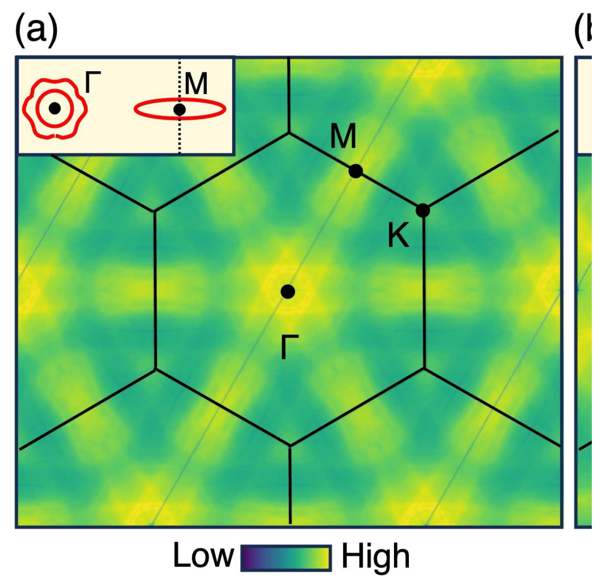

# 异质结与堆叠层 (Heterostructures & Layer Stacking)

> 收录范德华叠层、层间相对滑动/剪切力、莫尔超晶格、扭角构型、异质结界面、单层/双层对比相关的图表、数据表及物理公式。
> 共收录相关条目 **347** 个（图: 225, 表: 122, 公式: 0）。

[[_index|← 返回总索引]]

---

## 📊 数据表 (Tables)
#

### bhowalPolarMetalsPrinciples2023b - Table MD-T1

|
Key
|Value|
|--:|:--|
|文献类型|journalArticle|
|标题|Polar Metals: Principles and Prospects|
|短标题|极性金属：原理与展望|
|作者|[[Sayantika Bhowal]]、 [[Nicola A. Spaldin]]|
|期刊名称|[[Annual Review of Materials Research]]|
|DOI|[10.1146/annurev-matsci-080921-105501](https://doi.org/10.1146/annurev-matsci-080921-105501)|
|存档位置|60|
|文库编目|14.6|
|索书号|1|
|版权||
|分类|[[05_极化金属与半金属 (Polar Metals/Semimetals)]]|
|条目链接|[My Library](zotero://select/library/items/SQBJZA7W)|
|PDF 附件|[PDF](zotero://open-pdf/library/items/2NYA9H3Q)|
|关联文献|[[zhangEmergingFrontiersTwodimensional2025]]、 [[chenStrongSlidingFerroelectricity2024]]、 [[zhangNonvolatileControlTopological2025]]、 [[kresseEfficientIterativeSchemes1996d]]、 [[gaoGiantChiralMagnetoelectric2024a]]、 [[tangMultiferroicityTwodimensionalVan2025]]、 [[laiTwodimensionalFerromagnetismDriven2019b]]、 [[guoAdvancesTwodimensionalFerroelectric2025]]、 [[feiFerroelectricSwitchingTwodimensional2018a]]、 [[wuSlidingFerroelectricity2D2021a]]、 [[cuiIntercorrelatedInplaneOutofplane2018a]]、 [[zhaoOpticalFingerprintsTwodimensional2024]]、 [[tahirFerroelectricityNonvolatileMemristor2025]]、 [[cheongMultiferroicsMagneticTwist2007a]]、 [[wangVASPKITUserfriendlyInterface2021a]]、 [[songEvidenceSinglelayerVan2022]]、 [[sharmaRoomtemperatureFerroelectricSemimetal2019]]、 [[laiTwodimensionalFerromagnetismDriven2019]]、 [[blochlProjectorAugmentedwaveMethod1994b]]、 [[dingPredictionIntrinsicTwodimensional2017a]]、 [[naguib25thAnniversaryArticle2013a]]、 [[RecentAdvancesGrowth2025]]、 [[aminiAtomicscaleVisualizationMultiferroicity2024]]、 [[wuNonvolatileSwitchableHalfmetallicity2024]]、 [[kresseUltrasoftPseudopotentialsProjector1999c]]、 [[yuFerroelectricControlMagnetism2026]]、 [[henkelmanClimbingImageNudged2000c]]、 [[hanTunableSlidingFerroelectricity2025]]、 [[perdewGeneralizedGradientApproximation1996a]]、 [[sunSlidingFerroelectricityTwodimensional2025b]]、 [[tangCombiningIntrinsicSlidinginduced2025]]、 [[wangTunableD0Topological2025b]]、 [[wangTwodimensionalFerroelectricMetal2025]]、 [[gaoStrainEngineeringFerroelectric2024]]、 [[caiFerroelectricitydrivenStrainmediatedMagnetoelectric2025]]、 [[wuCoexistenceFerroelectricityAntiferroelectricity2024]]、 [[kaurRecentAdvancesTheoretical2025a]]、 [[miaoMagneticFerroelectricMetal2024]]、 [[heSwitchingTwodimensionalSliding2025]]、 [[zhaoRealization2DMultiferroic2024]]、 [[hillWhyAreThere2000a]]、 [[sattarFunctionalizedDoubleTransition2025]]、 [[songEvidenceSinglelayerVan2022b]]、 [[zahraCriticalAnalysisFerroelectric2025]]、 [[dudarevElectronenergylossSpectraStructural1998a]]、 [[neumayerCompetingPolarPhases2025]]、 [[tianRoomtemperatureTwodimensionalMultiferroic2026]]、 [[xunCoexistingMagnetismFerroelectric2024]]、 [[king-smithTheoryPolarizationCrystalline1993]]、 [[king-smithTheoryPolarizationCrystalline1993c]]|

- **位置**: PDF 第 - 页
- **来源文献**: `bhowalPolarMetalsPrinciples2023b`
- **元数据属性**:
  - **标签 (Tags)**: —
  - **材料 (Materials)**: —
  - **方法 (Methods)**: —

---

### chenStrongSlidingFerroelectricity2024 - Table tab_1

**Table 1**

Table 1. Calculated Interlayer Binding Energies Eb (meV/ Å2), Out-of-Plane Polarizations P (μC/cm2), Hg Polar Displacement Relative to the Octahedral Center (dHg in Å), and FE-PE Energy Barriers ΔEFE−PE (meV/f.u.) for HgX2 Bulks and Bilayers

- **位置**: PDF 第 2 页
- **来源文献**: `chenStrongSlidingFerroelectricity2024`
- **元数据属性**:
  - **标签 (Tags)**: —
  - **材料 (Materials)**: —
  - **方法 (Methods)**: —

---

### chenStrongSlidingFerroelectricity2024 - Table MD-T1

|
Key
|Value|
|--:|:--|
|文献类型|journalArticle|
|标题|Strong Sliding Ferroelectricity and Interlayer Sliding Controllable Spintronic Effect in Two-Dimensional HgI2 Layers|
|短标题|二维HgI2层中的强滑动铁电性和层间滑动可控自旋电子学效应|
|作者|[[Xinfeng Chen]]、 [[Xinkai Ding]]、 [[Gaoyang Gou]]、 [[Xiao Cheng Zeng]]|
|期刊名称|[[Nano Letters]]|
|DOI|[10.1021/acs.nanolett.3c04869](https://doi.org/10.1021/acs.nanolett.3c04869)|
|存档位置|39|
|文库编目|9.1|
|索书号|2|
|版权||
|分类|[[03_二维铁电与滑动铁电 (2D/Sliding Ferroelectricity)]]|
|条目链接|[My Library](zotero://select/library/items/3Q4MAH3N)|
|PDF 附件|[PDF](zotero://open-pdf/library/items/GHWX7HXA)|
|关联文献|[[zhangEmergingFrontiersTwodimensional2025]]、 [[zhangNonvolatileControlTopological2025]]、 [[kresseEfficientIterativeSchemes1996d]]、 [[gaoGiantChiralMagnetoelectric2024a]]、 [[tangMultiferroicityTwodimensionalVan2025]]、 [[laiTwodimensionalFerromagnetismDriven2019b]]、 [[guoAdvancesTwodimensionalFerroelectric2025]]、 [[feiFerroelectricSwitchingTwodimensional2018a]]、 [[wuSlidingFerroelectricity2D2021a]]、 [[cuiIntercorrelatedInplaneOutofplane2018a]]、 [[zhaoOpticalFingerprintsTwodimensional2024]]、 [[tahirFerroelectricityNonvolatileMemristor2025]]、 [[cheongMultiferroicsMagneticTwist2007a]]、 [[wangVASPKITUserfriendlyInterface2021a]]、 [[songEvidenceSinglelayerVan2022]]、 [[sharmaRoomtemperatureFerroelectricSemimetal2019]]、 [[laiTwodimensionalFerromagnetismDriven2019]]、 [[blochlProjectorAugmentedwaveMethod1994b]]、 [[dingPredictionIntrinsicTwodimensional2017a]]、 [[naguib25thAnniversaryArticle2013a]]、 [[RecentAdvancesGrowth2025]]、 [[aminiAtomicscaleVisualizationMultiferroicity2024]]、 [[wuNonvolatileSwitchableHalfmetallicity2024]]、 [[kresseUltrasoftPseudopotentialsProjector1999c]]、 [[yuFerroelectricControlMagnetism2026]]、 [[henkelmanClimbingImageNudged2000c]]、 [[hanTunableSlidingFerroelectricity2025]]、 [[perdewGeneralizedGradientApproximation1996a]]、 [[sunSlidingFerroelectricityTwodimensional2025b]]、 [[tangCombiningIntrinsicSlidinginduced2025]]、 [[wangTunableD0Topological2025b]]、 [[wangTwodimensionalFerroelectricMetal2025]]、 [[gaoStrainEngineeringFerroelectric2024]]、 [[caiFerroelectricitydrivenStrainmediatedMagnetoelectric2025]]、 [[wuCoexistenceFerroelectricityAntiferroelectricity2024]]、 [[kaurRecentAdvancesTheoretical2025a]]、 [[miaoMagneticFerroelectricMetal2024]]、 [[heSwitchingTwodimensionalSliding2025]]、 [[zhaoRealization2DMultiferroic2024]]、 [[hillWhyAreThere2000a]]、 [[bhowalPolarMetalsPrinciples2023b]]、 [[sattarFunctionalizedDoubleTransition2025]]、 [[songEvidenceSinglelayerVan2022b]]、 [[zahraCriticalAnalysisFerroelectric2025]]、 [[dudarevElectronenergylossSpectraStructural1998a]]、 [[neumayerCompetingPolarPhases2025]]、 [[tianRoomtemperatureTwodimensionalMultiferroic2026]]、 [[xunCoexistingMagnetismFerroelectric2024]]、 [[king-smithTheoryPolarizationCrystalline1993]]、 [[king-smithTheoryPolarizationCrystalline1993c]]|

- **位置**: PDF 第 - 页
- **来源文献**: `chenStrongSlidingFerroelectricity2024`
- **元数据属性**:
  - **标签 (Tags)**: —
  - **材料 (Materials)**: —
  - **方法 (Methods)**: —

---

### chowdhuryReviewTheoreticalComputational - Table MD-T1

|
Key
|Value|
|--:|:--|
|文献类型|journalArticle|
|标题|Review of theoretical and computational methods for 2D ma- terials exhibiting charge density waves|
|短标题|二维电荷密度波材料的理论和计算方法综述|
|作者|[[Sugata Chowdhury]]、 [[Heather M Hill]]、 [[Albert F Rigosi]]、 [[Patrick M Vora]]、 [[Angela R Hight Walker]]、 [[Francesca Tavazza]]|
|期刊名称||
|DOI||
|存档位置||
|文库编目|0|
|索书号|0|
|版权||
|分类|[[06_单层 CDW 与维度效应 (Monolayer/Dimension)]]|
|条目链接|[My Library](zotero://select/library/items/WSZIPQ6F)|
|PDF 附件|<ul><li><a href="zotero://open-pdf/library/items/KFKBAVVK">Chowdhury 等 - Review of theoretical and computational methods for 2D ma- terials exhibiting charge density waves</a></li><li><a href="zotero://open-pdf/library/items/INZW26TR">Chowdhury 等 - Review of theoretical and computational methods for 2D ma- terials exhibiting charge density waves.pdf</a></li></ul>|
|关联文献||

- **位置**: PDF 第 - 页
- **来源文献**: `chowdhuryReviewTheoreticalComputational`
- **元数据属性**:
  - **标签 (Tags)**: —
  - **材料 (Materials)**: —
  - **方法 (Methods)**: —

---

### chowdhuryReviewTheoreticalComputational - Table MD-T2

**MD Table 2**

| Mode (cm-1) | Exp – 4K | 10K | 30K | 50K | 60K | 300K |
|-------------|----------|-----|-----|-----|-----|------|
| E²₂g (shear) - Stressed | 26 | 30.7 | X | X | X | 32.8 |
| 2E2g (CDW) - Stressed | 51 | 48.8 | 46.6 | 44.6 | 42.8 | X |
| 1A1g (CDW) - Stressed | 79 | 76.0 | 67.6 | 63.0 | 62.6 | X |
| E²₂g (shear) - Unstressed | 26 | 34.9 | 32.3 | 33.6 | 32.0 | 31.8 |
| 2E2g (CDW) - Unstressed | 51 | 42.4 | 42.2 | 39.1 | 38.1 | 36.1 |
| 1A1g (CDW) - Unstressed | 79 | 80.4 | 80.0 | 76.3 | 75.3 | 75.1 |

- **位置**: PDF 第 - 页
- **来源文献**: `chowdhuryReviewTheoreticalComputational`
- **元数据属性**:
  - **标签 (Tags)**: —
  - **材料 (Materials)**: —
  - **方法 (Methods)**: —

---

### cossuStackingChargedensityWaves2024 - Table tab_2

**Table 2**

TABLE II. Relative energies of the most competitive CDWs identified in the 2H-NbSe2 bilayer, as computed via GGA and GGA+DF. Energies are given in meV/f.u. and with respect to the most favorable configuration, denoted as the ground state “GS.” CDWs from the CC-HX and HX-HX blends are not shown, since they have much higher energies. On the right side, corresponding re-sults for the 1H-NbSe2 monolayer are reported, alongside the closest bilayer group. The solution labeled as “sym” refers to the no

- **位置**: PDF 第 6 页
- **来源文献**: `cossuStackingChargedensityWaves2024`
- **元数据属性**:
  - **标签 (Tags)**: —
  - **材料 (Materials)**: —
  - **方法 (Methods)**: —

---

### cossuStackingChargedensityWaves2024 - Table T3

**Table 3**

<table>
<thead>
<tr>
<th></th>
<th>Bilayer</th>
<th>Bilayer</th>
<th>Monolayer</th>
<th>Monolayer</th>
</tr>
</thead>
<tbody>
<tr>
<td></td>
<td>GGA</td>
<td>GGA+DF</td>
<td>GGA</td>
<td>GGA+DF</td>
</tr>
<tr>
<td>sym</td>
<td>3.78</td>
<td>4.94</td>
<td>sym 3.94</td>
<td>6.11</td>
</tr>
<tr>
<td>HC-HC blend</td>
<td></td>
<td></td>
<td>HC</td>
<td></td>
</tr>
<tr>
<td>S1</td>
<td>0.06</td>
<td>0.21</td>
<td>GS</td>
<td>GS</td>
</tr>
<tr>
<td>S2</td>
<td>0.23</td>
<td>0.72</td>
<td></td>
<td></td>
</tr>
<tr>
<td>S3</td>
<td>GS</td>
<td>GS</td>
<td></td>
<td></td>
</tr>
<tr>
<td>HC-CC blend</td>
<td></td>
<td></td>
<td>CC</td>
<td></td>
</tr>
<tr>
<td>S1</td>
<td>0.31</td>
<td>0.82</td>
<td>0.51</td>
<td>1.43</td>
</tr>
<tr>
<td>S2</td>
<td>0.28</td>
<td>0.57</td>
<td></td>
<td></td>
</tr>
<tr>
<td>S3</td>
<td>0.44</td>
<td>1.24</td>
<td></td>
<td></td>
</tr>
<tr>
<td>S4</td>
<td>0.18</td>
<td>0.39</td>
<td></td>
<td></td>
</tr>
<tr>
<td>HC-HX blend</td>
<td></td>
<td></td>
<td>HX</td>
<td></td>
</tr>
<tr>
<td>S1</td>
<td>1.02</td>
<td>1.34</td>
<td>1.18</td>
<td>2.06</td>
</tr>
<tr>
<td>S2</td>
<td>0.51</td>
<td>0.74</td>
<td></td>
<td></td>
</tr>
<tr>
<td>S3</td>
<td>0.66</td>
<td>1.18</td>
<td></td>
<td></td>
</tr>
<tr>
<td>CC-CC blend</td>
<td></td>
<td></td>
<td></td>
<td></td>
</tr>
<tr>
<td>S1</td>
<td>0.57</td>
<td>1.11</td>
<td></td>
<td></td>
</tr>
<tr>
<td>S2</td>
<td>0.48</td>
<td>1.03</td>
<td></td>
<td></td>
</tr>
<tr>
<td>S3</td>
<td>0.59</td>
<td>1.36</td>
<td></td>
<td></td>
</tr>
</tbody>
</table>

- **位置**: PDF 第 - 页
- **来源文献**: `cossuStackingChargedensityWaves2024`
- **元数据属性**:
  - **标签 (Tags)**: —
  - **材料 (Materials)**: —
  - **方法 (Methods)**: —

---

### cossuStackingChargedensityWaves2024 - Table MD-T1

|
Key
|Value|
|--:|:--|
|文献类型|journalArticle|
|标题|Stacking of charge-density waves in                     <mml:math xmlns:mml="http://www.w3.org/1998/Math/MathML">                       <mml:mn>2</mml:mn>                       <mml:mi mathvariant="normal">H</mml:mi>                       <mml:mtext>−</mml:mtext>                       <mml:msub>                         <mml:mi>NbSe</mml:mi>                         <mml:mn>2</mml:mn>                       </mml:msub>                     </mml:math>                     bilayers|
|短标题|电荷密度波的叠加http://www.w3.org/1998/Math/MathML“><mml:mn>2<mml:mn>2<mml:mn>|
|作者|[[F. Cossu]]、 [[D. Nafday]]、 [[K. Palotás]]、 [[M. Biderang]]、 [[H.-S. Kim]]、 [[A. Akbari]]、 [[I. Di Marco]]|
|期刊名称|[[Physical Review Research]]|
|DOI|[10.1103/PhysRevResearch.6.043111](https://doi.org/10.1103/PhysRevResearch.6.043111)|
|存档位置|4|
|文库编目|4|
|索书号|2|
|版权||
|分类|[[06_单层 CDW 与维度效应 (Monolayer/Dimension)]]|
|条目链接|[My Library](zotero://select/library/items/S4EBAT4T)|
|PDF 附件|<ul><li><a href="zotero://open-pdf/library/items/H3W2XLQ2">Cossu 等 - 2024 - Stacking of charge-density waves in                     mmlmath xmlnsmml=httpwww.w3.org1998</a></li><li><a href="zotero://open-pdf/library/items/Z55KKUNZ">Cossu 等 - 2024 - Stacking of charge-density waves in                     mmlmath xmlnsmml=httpwww.w3.org1998.pdf</a></li></ul>|
|关联文献||

- **位置**: PDF 第 - 页
- **来源文献**: `cossuStackingChargedensityWaves2024`
- **元数据属性**:
  - **标签 (Tags)**: —
  - **材料 (Materials)**: —
  - **方法 (Methods)**: —

---

### dingPredictionIntrinsicTwodimensional2017a - Table MD-T1

|
Key
|Value|
|--:|:--|
|文献类型|journalArticle|
|标题|Prediction of intrinsic two-dimensional ferroelectrics in In2Se3 and other III2-VI3 van der Waals materials|
|短标题|In2Se3等III2-VI3范德华材料中本征二维铁电体的预测|
|作者|[[Wenjun Ding]]、 [[Jianbao Zhu]]、 [[Zhe Wang]]、 [[Yanfei Gao]]、 [[Di Xiao]]、 [[Yi Gu]]、 [[Zhenyu Zhang]]、 [[Wenguang Zhu]]|
|期刊名称|[[Nature Communications]]|
|DOI|[10.1038/ncomms14956](https://doi.org/10.1038/ncomms14956)|
|存档位置|1371|
|文库编目|18.1|
|索书号|1|
|版权||
|分类|[[10_Van der Waals Physics]]|
|条目链接|[My Library](zotero://select/library/items/GXWEAXWZ)|
|PDF 附件|[PDF](zotero://open-pdf/library/items/8456JNI8)|
|关联文献|[[zhangEmergingFrontiersTwodimensional2025]]、 [[chenStrongSlidingFerroelectricity2024]]、 [[zhangNonvolatileControlTopological2025]]、 [[kresseEfficientIterativeSchemes1996d]]、 [[gaoGiantChiralMagnetoelectric2024a]]、 [[tangMultiferroicityTwodimensionalVan2025]]、 [[laiTwodimensionalFerromagnetismDriven2019b]]、 [[guoAdvancesTwodimensionalFerroelectric2025]]、 [[feiFerroelectricSwitchingTwodimensional2018a]]、 [[wuSlidingFerroelectricity2D2021a]]、 [[cuiIntercorrelatedInplaneOutofplane2018a]]、 [[zhaoOpticalFingerprintsTwodimensional2024]]、 [[tahirFerroelectricityNonvolatileMemristor2025]]、 [[cheongMultiferroicsMagneticTwist2007a]]、 [[wangVASPKITUserfriendlyInterface2021a]]、 [[songEvidenceSinglelayerVan2022]]、 [[sharmaRoomtemperatureFerroelectricSemimetal2019]]、 [[laiTwodimensionalFerromagnetismDriven2019]]、 [[blochlProjectorAugmentedwaveMethod1994b]]、 [[naguib25thAnniversaryArticle2013a]]、 [[RecentAdvancesGrowth2025]]、 [[aminiAtomicscaleVisualizationMultiferroicity2024]]、 [[wuNonvolatileSwitchableHalfmetallicity2024]]、 [[kresseUltrasoftPseudopotentialsProjector1999c]]、 [[yuFerroelectricControlMagnetism2026]]、 [[henkelmanClimbingImageNudged2000c]]、 [[hanTunableSlidingFerroelectricity2025]]、 [[perdewGeneralizedGradientApproximation1996a]]、 [[sunSlidingFerroelectricityTwodimensional2025b]]、 [[tangCombiningIntrinsicSlidinginduced2025]]、 [[wangTunableD0Topological2025b]]、 [[wangTwodimensionalFerroelectricMetal2025]]、 [[gaoStrainEngineeringFerroelectric2024]]、 [[caiFerroelectricitydrivenStrainmediatedMagnetoelectric2025]]、 [[wuCoexistenceFerroelectricityAntiferroelectricity2024]]、 [[kaurRecentAdvancesTheoretical2025a]]、 [[miaoMagneticFerroelectricMetal2024]]、 [[heSwitchingTwodimensionalSliding2025]]、 [[zhaoRealization2DMultiferroic2024]]、 [[hillWhyAreThere2000a]]、 [[bhowalPolarMetalsPrinciples2023b]]、 [[sattarFunctionalizedDoubleTransition2025]]、 [[songEvidenceSinglelayerVan2022b]]、 [[zahraCriticalAnalysisFerroelectric2025]]、 [[dudarevElectronenergylossSpectraStructural1998a]]、 [[neumayerCompetingPolarPhases2025]]、 [[tianRoomtemperatureTwodimensionalMultiferroic2026]]、 [[xunCoexistingMagnetismFerroelectric2024]]、 [[king-smithTheoryPolarizationCrystalline1993]]、 [[king-smithTheoryPolarizationCrystalline1993c]]|

- **位置**: PDF 第 - 页
- **来源文献**: `dingPredictionIntrinsicTwodimensional2017a`
- **元数据属性**:
  - **标签 (Tags)**: —
  - **材料 (Materials)**: —
  - **方法 (Methods)**: —

---

### duUltrasensitiveOptoelectronicBiosensor2025 - Table MD-T1

|
Key
|Value|
|--:|:--|
|文献类型|journalArticle|
|标题|Ultrasensitive optoelectronic biosensor arrays based on twisted bilayer graphene superlattice|
|短标题|基于扭曲双层石墨烯超晶格的超灵敏光电生物传感器阵列|
|作者|[[Bowen Du]]、 [[Xilin Tian]]、 [[Zhi Chen]]、 [[Yanqi Ge]]、 [[Chuanghu Chen]]、 [[Haiyan Gao]]、 [[Zhongyang Liu]]、 [[Jungchen Tung]]、 [[Dror Fixler]]、 [[Songrui Wei]]、 [[Shi Chen]]、 [[Han Zhang]]|
|期刊名称|[[National Science Review]]|
|DOI|[10.1093/nsr/nwaf357](https://doi.org/10.1093/nsr/nwaf357)|
|存档位置|98|
|文库编目|17.1|
|索书号|1|
|版权|https://creativecommons.org/licenses/by/4.0/|
|分类|[[04_石墨烯/氧化石墨烯 (G/GO Sensors)]]|
|条目链接|[My Library](zotero://select/library/items/XAK7F6XW)|
|PDF 附件|<ul><li><a href="zotero://open-pdf/library/items/ATBJ2FN4">Du 等 - 2025 - Ultrasensitive optoelectronic biosensor arrays based on twisted bilayer graphene superlattice</a></li><li><a href="zotero://open-pdf/library/items/2SL33RMM">Du 等 - 2025 - Ultrasensitive optoelectronic biosensor arrays based on twisted bilayer graphene superlattice.pdf</a></li></ul>|
|关联文献||

- **位置**: PDF 第 - 页
- **来源文献**: `duUltrasensitiveOptoelectronicBiosensor2025`
- **元数据属性**:
  - **标签 (Tags)**: —
  - **材料 (Materials)**: —
  - **方法 (Methods)**: —

---

### feiFerroelectricSwitchingTwodimensional2018a - Table MD-T1

|
Key
|Value|
|--:|:--|
|文献类型|journalArticle|
|标题|Ferroelectric switching of a two-dimensional metal|
|短标题|二维金属的铁电开关|
|作者|[[Zaiyao Fei]]、 [[Wenjin Zhao]]、 [[Tauno A. Palomaki]]、 [[Bosong Sun]]、 [[Moira K. Miller]]、 [[Zhiying Zhao]]、 [[Jiaqiang Yan]]、 [[Xiaodong Xu]]、 [[David H. Cobden]]|
|期刊名称|[[Nature]]|
|DOI|[10.1038/s41586-018-0336-3](https://doi.org/10.1038/s41586-018-0336-3)|
|存档位置|1002|
|文库编目|56.1|
|索书号|1|
|版权||
|分类|[[02_极化翻转动力学 (Polarization Switching)]]|
|条目链接|[My Library](zotero://select/library/items/AMP44BB6)|
|PDF 附件|[PDF](zotero://open-pdf/library/items/M7KXLTZD)|
|关联文献|[[zhangEmergingFrontiersTwodimensional2025]]、 [[chenStrongSlidingFerroelectricity2024]]、 [[zhangNonvolatileControlTopological2025]]、 [[kresseEfficientIterativeSchemes1996d]]、 [[gaoGiantChiralMagnetoelectric2024a]]、 [[tangMultiferroicityTwodimensionalVan2025]]、 [[laiTwodimensionalFerromagnetismDriven2019b]]、 [[guoAdvancesTwodimensionalFerroelectric2025]]、 [[wuSlidingFerroelectricity2D2021a]]、 [[cuiIntercorrelatedInplaneOutofplane2018a]]、 [[zhaoOpticalFingerprintsTwodimensional2024]]、 [[tahirFerroelectricityNonvolatileMemristor2025]]、 [[cheongMultiferroicsMagneticTwist2007a]]、 [[wangVASPKITUserfriendlyInterface2021a]]、 [[songEvidenceSinglelayerVan2022]]、 [[sharmaRoomtemperatureFerroelectricSemimetal2019]]、 [[laiTwodimensionalFerromagnetismDriven2019]]、 [[blochlProjectorAugmentedwaveMethod1994b]]、 [[dingPredictionIntrinsicTwodimensional2017a]]、 [[naguib25thAnniversaryArticle2013a]]、 [[RecentAdvancesGrowth2025]]、 [[aminiAtomicscaleVisualizationMultiferroicity2024]]、 [[wuNonvolatileSwitchableHalfmetallicity2024]]、 [[kresseUltrasoftPseudopotentialsProjector1999c]]、 [[yuFerroelectricControlMagnetism2026]]、 [[henkelmanClimbingImageNudged2000c]]、 [[hanTunableSlidingFerroelectricity2025]]、 [[perdewGeneralizedGradientApproximation1996a]]、 [[sunSlidingFerroelectricityTwodimensional2025b]]、 [[tangCombiningIntrinsicSlidinginduced2025]]、 [[wangTunableD0Topological2025b]]、 [[wangTwodimensionalFerroelectricMetal2025]]、 [[gaoStrainEngineeringFerroelectric2024]]、 [[caiFerroelectricitydrivenStrainmediatedMagnetoelectric2025]]、 [[wuCoexistenceFerroelectricityAntiferroelectricity2024]]、 [[kaurRecentAdvancesTheoretical2025a]]、 [[miaoMagneticFerroelectricMetal2024]]、 [[heSwitchingTwodimensionalSliding2025]]、 [[zhaoRealization2DMultiferroic2024]]、 [[hillWhyAreThere2000a]]、 [[bhowalPolarMetalsPrinciples2023b]]、 [[sattarFunctionalizedDoubleTransition2025]]、 [[songEvidenceSinglelayerVan2022b]]、 [[zahraCriticalAnalysisFerroelectric2025]]、 [[dudarevElectronenergylossSpectraStructural1998a]]、 [[neumayerCompetingPolarPhases2025]]、 [[tianRoomtemperatureTwodimensionalMultiferroic2026]]、 [[xunCoexistingMagnetismFerroelectric2024]]、 [[king-smithTheoryPolarizationCrystalline1993]]、 [[king-smithTheoryPolarizationCrystalline1993c]]|

- **位置**: PDF 第 - 页
- **来源文献**: `feiFerroelectricSwitchingTwodimensional2018a`
- **元数据属性**:
  - **标签 (Tags)**: —
  - **材料 (Materials)**: —
  - **方法 (Methods)**: —

---

### fengFerroelectricityMultiferroicityTwodimensional2020 - Table tab_1

**Table 1**

Table I  Total energies (meV) relative to the energy of FM configuration (EFM) of four  magnetic orders (FM, AFM1, AFM2 and AFM3) in a 2 × 1 × 1 supercell of the ScCrP2Se6  monolayer at AFE phase. Nearest-neighbor exchange coupling parameters (J1, J2 and J3) of Cr1-  Cr2, Cr1- Cr3 and Cr1 - Cr4 paths, respectively. Positive J corresponds to ferromagnetic  interaction.

- **位置**: PDF 第 11 页
- **来源文献**: `fengFerroelectricityMultiferroicityTwodimensional2020`
- **元数据属性**:
  - **标签 (Tags)**: —
  - **材料 (Materials)**: —
  - **方法 (Methods)**: —

---

### fengFerroelectricityMultiferroicityTwodimensional2020 - Table tab_2

**Table 2**

Table Ⅱ Magnetic anisotropy energy (μeV) for the FE and AFE phases of the ScCrP2Se6  monolayer. The energies of easy magnetization axis are set to be zero.

- **位置**: PDF 第 12 页
- **来源文献**: `fengFerroelectricityMultiferroicityTwodimensional2020`
- **元数据属性**:
  - **标签 (Tags)**: —
  - **材料 (Materials)**: —
  - **方法 (Methods)**: —

---

### fengFerroelectricityMultiferroicityTwodimensional2020 - Table MD-T1

|
Key
|Value|
|--:|:--|
|文献类型|journalArticle|
|标题|Ferroelectricity and multiferroicity in two-dimensional Sc                     2                     P                     2                     Se                     6                     and ScCrP                     2                     Se                     6                     monolayers|
|短标题|二维Sc2P2Se6|
|作者|[[Xukun Feng]]、 [[Jian Liu]]、 [[Xikui Ma]]、 [[Mingwen Zhao]]|
|期刊名称|[[Physical Chemistry Chemical Physics]]|
|DOI|[10.1039/C9CP06966F](https://doi.org/10.1039/C9CP06966F)|
|存档位置|26|
|文库编目|2.9|
|索书号|3|
|版权||
|分类|[[03_二维铁电与滑动铁电 (2D/Sliding Ferroelectricity)]]|
|条目链接|[My Library](zotero://select/library/items/IJ4U6MRB)|
|PDF 附件|<ul><li><a href="zotero://open-pdf/library/items/7VH7JRZB">Feng 等 - 2020 - Ferroelectricity and multiferroicity in two-dimensional Sc                     2</a></li><li><a href="zotero://open-pdf/library/items/B6YVXTAX">Feng 等 - 2020 - Ferroelectricity and multiferroicity in two-dimensional Sc2P2Se6 an.pdf</a></li></ul>|
|关联文献||

- **位置**: PDF 第 - 页
- **来源文献**: `fengFerroelectricityMultiferroicityTwodimensional2020`
- **元数据属性**:
  - **标签 (Tags)**: —
  - **材料 (Materials)**: —
  - **方法 (Methods)**: —

---

### Girlando1986interface - Table MD-T1

|
Key
|Value|
|--:|:--|
|文献类型|journalArticle|
|标题|Neutral-ionic interface in mixed stack charge transfer compounds: Pressure induced ionic phase of tetrathiafulvalene-chloranil (TTF CA)|
|短标题|混合堆积电荷转移化合物中的中性离子界面：四硫富瓦烯-氯苯胺（TTF-CA）的压力诱导离子相|
|作者|[[A. Girlando]]、 [[C. Pecile]]、 [[A. Brillante]]、 [[K. Syassen]]|
|期刊名称|[[Solid State Communications]]|
|DOI|[10.1016/0038-1098(86)90918-X](https://doi.org/10.1016/0038-1098(86)90918-X)|
|存档位置|34|
|文库编目|2.8|
|索书号|3|
|版权||
|分类|[[02_中性-离子转变 (Neutral-Ionic Transition)]]|
|条目链接|[My Library](zotero://select/library/items/5DPGZFES)|
|PDF 附件||
|关联文献||

- **位置**: PDF 第 - 页
- **来源文献**: `Girlando1986interface`
- **元数据属性**:
  - **标签 (Tags)**: —
  - **材料 (Materials)**: —
  - **方法 (Methods)**: —

---

### Guan2022a - Table MD-T1

|
Key
|Value|
|--:|:--|
|文献类型|journalArticle|
|标题|Theoretical design of BAs/WX2 (X = S, Se) heterostructures for high-performance photovoltaic applications from DFT calculations|
|短标题|基于DFT计算的高性能光伏用BAs/WX2（X=S，Se）异质结构的理论设计|
|作者|[[Yue Guan]]、 [[Xiaodan Li]]、 [[Qingmiao Hu]]、 [[Dandan Zhao]]、 [[Lin Zhang]]|
|期刊名称|[[Applied Surface Science]]|
|DOI|[10.1016/j.apsusc.2022.153865](https://doi.org/10.1016/j.apsusc.2022.153865)|
|存档位置||
|文库编目|6.6|
|索书号|2|
|版权||
|分类|[[东北大学张林老师]]|
|条目链接|[My Library](zotero://select/library/items/VURTQPZJ)|
|PDF 附件||
|关联文献||

- **位置**: PDF 第 - 页
- **来源文献**: `Guan2022a`
- **元数据属性**:
  - **标签 (Tags)**: —
  - **材料 (Materials)**: —
  - **方法 (Methods)**: —

---

### Guan2023 - Table MD-T1

|
Key
|Value|
|--:|:--|
|文献类型|journalArticle|
|标题|Effects of atom doping on the electronic and magnetic properties of BAs/WSe2 heterostructure|
|短标题|原子掺杂对BAs/WSe2异质结构电子和磁性的影响|
|作者|[[Yue Guan]]、 [[Yifan Cheng]]、 [[Zhiwei Cheng]]、 [[Xiaodan Li]]、 [[Lin Zhang]]|
|期刊名称|[[Materials Today Communications]]|
|DOI|[10.1016/j.mtcomm.2023.107108](https://doi.org/10.1016/j.mtcomm.2023.107108)|
|存档位置||
|文库编目|4.9|
|索书号|3|
|版权||
|分类|[[东北大学张林老师]]|
|条目链接|[My Library](zotero://select/library/items/SY5F3H28)|
|PDF 附件||
|关联文献||

- **位置**: PDF 第 - 页
- **来源文献**: `Guan2023`
- **元数据属性**:
  - **标签 (Tags)**: —
  - **材料 (Materials)**: —
  - **方法 (Methods)**: —

---

### Guan2024a - Table MD-T1

|
Key
|Value|
|--:|:--|
|文献类型|journalArticle|
|标题|Theoretical design of graphene/tungsten dichalcogenide (Gr/WX2, X=S, Se) heterostructures used for anode materials of LIBs from DFT calculations|
|短标题|LIBs阳极材料石墨烯/二氯化钨（Gr/WX2，X=S，Se）异质结构的DFT理论设计|
|作者|[[Yue Guan]]、 [[Dandan Zhao]]、 [[Xiaodan Li]]、 [[Lin Zhang]]|
|期刊名称|[[Surfaces and Interfaces]]|
|DOI|[10.1016/j.surfin.2024.104993](https://doi.org/10.1016/j.surfin.2024.104993)|
|存档位置||
|文库编目|6|
|索书号|2|
|版权||
|分类|[[东北大学张林老师]]|
|条目链接|[My Library](zotero://select/library/items/ANN7E232)|
|PDF 附件||
|关联文献||

- **位置**: PDF 第 - 页
- **来源文献**: `Guan2024a`
- **元数据属性**:
  - **标签 (Tags)**: —
  - **材料 (Materials)**: —
  - **方法 (Methods)**: —

---

### Guan2024b - Table MD-T1

|
Key
|Value|
|--:|:--|
|文献类型|journalArticle|
|标题|Insight into graphene/boron arsenide heterostructure used for high-performance lithium-ion battery anode materials: The first principles study|
|短标题|石墨烯/砷化硼异质结构用于高性能锂离子电池负极材料的第一性原理研究|
|作者|[[Yue Guan]]、 [[Guoyu Huang]]、 [[Xiaodan Li]]、 [[Lin Zhang]]|
|期刊名称||
|DOI||
|存档位置||
|文库编目|0|
|索书号|0|
|版权||
|分类|[[东北大学张林老师]]|
|条目链接|[My Library](zotero://select/library/items/NBKAYLF3)|
|PDF 附件||
|关联文献||

- **位置**: PDF 第 - 页
- **来源文献**: `Guan2024b`
- **元数据属性**:
  - **标签 (Tags)**: —
  - **材料 (Materials)**: —
  - **方法 (Methods)**: —

---

### guoAdvancesTwodimensionalFerroelectric2025 - Table MD-T1

|
Key
|Value|
|--:|:--|
|文献类型|journalArticle|
|标题|Advances in two-dimensional ferroelectric materials|
|短标题|二维铁电材料的研究进展|
|作者|[[Zi-Han Guo]]、 [[Lin He]]|
|期刊名称|[[Chinese Science Bulletin]]|
|DOI|[10.1360/TB-2025-0214](https://doi.org/10.1360/TB-2025-0214)|
|存档位置|1|
|文库编目|1.2|
|索书号|1|
|版权||
|分类|[[06_单层 CDW 与维度效应 (Monolayer/Dimension)]]|
|条目链接|[My Library](zotero://select/library/items/AKEWVUN5)|
|PDF 附件|<ul><li><a href="zotero://open-pdf/library/items/V8SPVIJ9">Guo和He - 2025 - Advances in two-dimensional ferroelectric materials</a></li><li><a href="zotero://open-pdf/library/items/NIL4PP8B">Guo和He - 2025 - Advances in two-dimensional ferroelectric materials.pdf</a></li></ul>|
|关联文献|[[zhangEmergingFrontiersTwodimensional2025]]、 [[chenStrongSlidingFerroelectricity2024]]、 [[zhangNonvolatileControlTopological2025]]、 [[kresseEfficientIterativeSchemes1996d]]、 [[gaoGiantChiralMagnetoelectric2024a]]、 [[tangMultiferroicityTwodimensionalVan2025]]、 [[laiTwodimensionalFerromagnetismDriven2019b]]、 [[feiFerroelectricSwitchingTwodimensional2018a]]、 [[wuSlidingFerroelectricity2D2021a]]、 [[cuiIntercorrelatedInplaneOutofplane2018a]]、 [[zhaoOpticalFingerprintsTwodimensional2024]]、 [[tahirFerroelectricityNonvolatileMemristor2025]]、 [[cheongMultiferroicsMagneticTwist2007a]]、 [[wangVASPKITUserfriendlyInterface2021a]]、 [[songEvidenceSinglelayerVan2022]]、 [[sharmaRoomtemperatureFerroelectricSemimetal2019]]、 [[laiTwodimensionalFerromagnetismDriven2019]]、 [[blochlProjectorAugmentedwaveMethod1994b]]、 [[dingPredictionIntrinsicTwodimensional2017a]]、 [[naguib25thAnniversaryArticle2013a]]、 [[RecentAdvancesGrowth2025]]、 [[aminiAtomicscaleVisualizationMultiferroicity2024]]、 [[wuNonvolatileSwitchableHalfmetallicity2024]]、 [[kresseUltrasoftPseudopotentialsProjector1999c]]、 [[yuFerroelectricControlMagnetism2026]]、 [[henkelmanClimbingImageNudged2000c]]、 [[hanTunableSlidingFerroelectricity2025]]、 [[perdewGeneralizedGradientApproximation1996a]]、 [[sunSlidingFerroelectricityTwodimensional2025b]]、 [[tangCombiningIntrinsicSlidinginduced2025]]、 [[wangTunableD0Topological2025b]]、 [[wangTwodimensionalFerroelectricMetal2025]]、 [[gaoStrainEngineeringFerroelectric2024]]、 [[caiFerroelectricitydrivenStrainmediatedMagnetoelectric2025]]、 [[wuCoexistenceFerroelectricityAntiferroelectricity2024]]、 [[kaurRecentAdvancesTheoretical2025a]]、 [[miaoMagneticFerroelectricMetal2024]]、 [[heSwitchingTwodimensionalSliding2025]]、 [[zhaoRealization2DMultiferroic2024]]、 [[hillWhyAreThere2000a]]、 [[bhowalPolarMetalsPrinciples2023b]]、 [[sattarFunctionalizedDoubleTransition2025]]、 [[songEvidenceSinglelayerVan2022b]]、 [[zahraCriticalAnalysisFerroelectric2025]]、 [[dudarevElectronenergylossSpectraStructural1998a]]、 [[neumayerCompetingPolarPhases2025]]、 [[tianRoomtemperatureTwodimensionalMultiferroic2026]]、 [[xunCoexistingMagnetismFerroelectric2024]]、 [[king-smithTheoryPolarizationCrystalline1993]]、 [[king-smithTheoryPolarizationCrystalline1993c]]|

- **位置**: PDF 第 - 页
- **来源文献**: `guoAdvancesTwodimensionalFerroelectric2025`
- **元数据属性**:
  - **标签 (Tags)**: —
  - **材料 (Materials)**: —
  - **方法 (Methods)**: —

---

### hallEnvironmentalControlCharge - Table MD-T1

|
Key
|Value|
|--:|:--|
|文献类型|journalArticle|
|标题|Environmental Control of Charge Density Wave Order in Monolayer 2H-TaS2|
|短标题|单层2H-TaS中电荷密度波序的环境控制|
|作者|[[Joshua Hall]]、 [[Niels Ehlen]]、 [[Jan Berges]]、 [[Erik van Loon]]、 [[Camiel van Efferen]]、 [[Clifford Murray]]、 [[Malte Rösner]]、 [[Jun Li]]、 [[Boris V. Senkovskiy]]、 [[Martin Hell]]、 [[Matthias Rolf]]、 [[Tristan Heider]]、 [[María C. Asensio]]、 [[José Avila]]、 [[Lukasz Plucinski]]、 [[Tim Wehling]]、 [[Alexander Grüneis]]、 [[Thomas Michely]]|
|期刊名称|[[ACS Nano]]|
|DOI|[10.1021/acsnano.9b03419](https://doi.org/10.1021/acsnano.9b03419)|
|存档位置||
|文库编目|0|
|索书号|0|
|版权||
|分类|[[06_单层 CDW 与维度效应 (Monolayer/Dimension)]]|
|条目链接|[My Library](zotero://select/library/items/CFTFPNTK)|
|PDF 附件|[PDF](zotero://open-pdf/library/items/ALN7EYFD)|
|关联文献||

- **位置**: PDF 第 - 页
- **来源文献**: `hallEnvironmentalControlCharge`
- **元数据属性**:
  - **标签 (Tags)**: —
  - **材料 (Materials)**: —
  - **方法 (Methods)**: —

---

### hanTunableSlidingFerroelectricity2025 - Table tab_2

**Table 2**

TABLE I. In-plane lattice constant a and MAE of RuX2 (X ¼ Cl, Br, and I) AB stack-ing, SFE polarization P1 of bilayer structures, and SFE polarization P2 of trilayer structures.

- **位置**: PDF 第 4 页
- **来源文献**: `hanTunableSlidingFerroelectricity2025`
- **元数据属性**:
  - **标签 (Tags)**: —
  - **材料 (Materials)**: —
  - **方法 (Methods)**: —

---

### heSwitchingTwodimensionalSliding2025 - Table MD-T1

|
Key
|Value|
|--:|:--|
|文献类型|journalArticle|
|标题|Switching Two-Dimensional Sliding Ferroelectrics by Mechanical Bending|
|短标题|机械弯曲切换二维滑动铁电体|
|作者|[[Ri He]]、 [[Hua Wang]]、 [[Fenglin Deng]]、 [[Yuxiang Gao]]、 [[Bingwen Zhang]]、 [[Yubai Shi]]、 [[Run-Wei Li]]、 [[Zhicheng Zhong]]|
|期刊名称|[[Physical Review Letters]]|
|DOI|[10.1103/PhysRevLett.134.076101](https://doi.org/10.1103/PhysRevLett.134.076101)|
|存档位置||
|文库编目|9.4|
|索书号|1|
|版权||
|分类|[[02_极化翻转动力学 (Polarization Switching)]]|
|条目链接|[My Library](zotero://select/library/items/RXAQ7PX6)|
|PDF 附件|[PDF](zotero://open-pdf/library/items/VGV7MZFW)|
|关联文献|[[zhangEmergingFrontiersTwodimensional2025]]、 [[chenStrongSlidingFerroelectricity2024]]、 [[zhangNonvolatileControlTopological2025]]、 [[kresseEfficientIterativeSchemes1996d]]、 [[gaoGiantChiralMagnetoelectric2024a]]、 [[tangMultiferroicityTwodimensionalVan2025]]、 [[laiTwodimensionalFerromagnetismDriven2019b]]、 [[guoAdvancesTwodimensionalFerroelectric2025]]、 [[feiFerroelectricSwitchingTwodimensional2018a]]、 [[wuSlidingFerroelectricity2D2021a]]、 [[cuiIntercorrelatedInplaneOutofplane2018a]]、 [[zhaoOpticalFingerprintsTwodimensional2024]]、 [[tahirFerroelectricityNonvolatileMemristor2025]]、 [[cheongMultiferroicsMagneticTwist2007a]]、 [[wangVASPKITUserfriendlyInterface2021a]]、 [[songEvidenceSinglelayerVan2022]]、 [[sharmaRoomtemperatureFerroelectricSemimetal2019]]、 [[laiTwodimensionalFerromagnetismDriven2019]]、 [[blochlProjectorAugmentedwaveMethod1994b]]、 [[dingPredictionIntrinsicTwodimensional2017a]]、 [[naguib25thAnniversaryArticle2013a]]、 [[RecentAdvancesGrowth2025]]、 [[aminiAtomicscaleVisualizationMultiferroicity2024]]、 [[wuNonvolatileSwitchableHalfmetallicity2024]]、 [[kresseUltrasoftPseudopotentialsProjector1999c]]、 [[yuFerroelectricControlMagnetism2026]]、 [[henkelmanClimbingImageNudged2000c]]、 [[hanTunableSlidingFerroelectricity2025]]、 [[perdewGeneralizedGradientApproximation1996a]]、 [[sunSlidingFerroelectricityTwodimensional2025b]]、 [[tangCombiningIntrinsicSlidinginduced2025]]、 [[wangTunableD0Topological2025b]]、 [[wangTwodimensionalFerroelectricMetal2025]]、 [[gaoStrainEngineeringFerroelectric2024]]、 [[caiFerroelectricitydrivenStrainmediatedMagnetoelectric2025]]、 [[wuCoexistenceFerroelectricityAntiferroelectricity2024]]、 [[kaurRecentAdvancesTheoretical2025a]]、 [[miaoMagneticFerroelectricMetal2024]]、 [[zhaoRealization2DMultiferroic2024]]、 [[hillWhyAreThere2000a]]、 [[bhowalPolarMetalsPrinciples2023b]]、 [[sattarFunctionalizedDoubleTransition2025]]、 [[songEvidenceSinglelayerVan2022b]]、 [[zahraCriticalAnalysisFerroelectric2025]]、 [[dudarevElectronenergylossSpectraStructural1998a]]、 [[neumayerCompetingPolarPhases2025]]、 [[tianRoomtemperatureTwodimensionalMultiferroic2026]]、 [[xunCoexistingMagnetismFerroelectric2024]]、 [[king-smithTheoryPolarizationCrystalline1993]]、 [[king-smithTheoryPolarizationCrystalline1993c]]|

- **位置**: PDF 第 - 页
- **来源文献**: `heSwitchingTwodimensionalSliding2025`
- **元数据属性**:
  - **标签 (Tags)**: —
  - **材料 (Materials)**: —
  - **方法 (Methods)**: —

---

### heUltrafastSwitchingDynamics2024 - Table tab_1

**Table 1**

Table 1  The lattice constants, layer distance, bond length (Å) and energies (meV) of various stacking bilayers/monolayer fully relaxed by the deep potential (DP) model and  DFT.

- **位置**: PDF 第 4 页
- **来源文献**: `heUltrafastSwitchingDynamics2024`
- **元数据属性**:
  - **标签 (Tags)**: —
  - **材料 (Materials)**: —
  - **方法 (Methods)**: —

---

### heUltrafastSwitchingDynamics2024 - Table MD-T1

|
Key
|Value|
|--:|:--|
|文献类型|journalArticle|
|标题|Ultrafast switching dynamics of the ferroelectric order in stacking-engineered ferroelectrics|
|短标题|堆垛工程铁电体中铁电有序的超快开关动力学|
|作者|[[Ri He]]、 [[Bingwen Zhang]]、 [[Hua Wang]]、 [[Lei Li]]、 [[Ping Tang]]、 [[Gerrit Bauer]]、 [[Zhicheng Zhong]]|
|期刊名称|[[Acta Materialia]]|
|DOI|[10.1016/j.actamat.2023.119416](https://doi.org/10.1016/j.actamat.2023.119416)|
|存档位置|38|
|文库编目|9.3|
|索书号|2|
|版权||
|分类|[[02_极化翻转动力学 (Polarization Switching)]]|
|条目链接|[My Library](zotero://select/library/items/ZTNTAL7L)|
|PDF 附件|<ul><li><a href="zotero://open-pdf/library/items/23DND38E">He 等 - 2024 - Ultrafast switching dynamics of the ferroelectric order in stacking-engineered ferroelectrics</a></li><li><a href="zotero://open-pdf/library/items/TXWZZ3EK">He 等 - 2024 - Ultrafast switching dynamics of the ferroelectric order in stacking-engineered ferroelectrics.pdf</a></li></ul>|
|关联文献||

- **位置**: PDF 第 - 页
- **来源文献**: `heUltrafastSwitchingDynamics2024`
- **元数据属性**:
  - **标签 (Tags)**: —
  - **材料 (Materials)**: —
  - **方法 (Methods)**: —

---

### Hou2008a - Table MD-T1

|
Key
|Value|
|--:|:--|
|文献类型|journalArticle|
|标题|A Novel Tetrathiafulvalene- (TTF-) Fused Poly(aryleneethynylene) with an Acceptor Main Chain and Donor Side Chains: Intramolecular Charge Transfer (CT), Stacking Structure, and Photovoltaic Property|
|短标题|新型四硫富瓦烯（TTF-）主链和施主侧链熔融聚芳炔：分子内电荷转移（CT）、堆积结构和光伏性能|
|作者|[[Yanhui Hou]]、 [[Yongsheng Chen]]、 [[Qian Liu]]、 [[Min Yang]]、 [[Xiangjian Wan]]、 [[Shougen Yin]]、 [[Ao Yu]]|
|期刊名称|[[Macromolecules]]|
|DOI|[10.1021/ma702864c](https://doi.org/10.1021/ma702864c)|
|存档位置|39|
|文库编目|5.7|
|索书号|2|
|版权||
|分类|[[01_电荷转移盐 (Charge Transfer Salts)]]|
|条目链接|[My Library](zotero://select/library/items/FIV79YY7)|
|PDF 附件||
|关联文献||

- **位置**: PDF 第 - 页
- **来源文献**: `Hou2008a`
- **元数据属性**:
  - **标签 (Tags)**: —
  - **材料 (Materials)**: —
  - **方法 (Methods)**: —

---

### huProgressProspectsLowdimensional2019 - Table T3

**Table 3**

<table>
<thead>
<tr>
<th style="text-align:left">Materials</th>
<th style="text-align:left">Value of polarization (pC/m)</th>
<th style="text-align:left">Direction of polarization</th>
<th style="text-align:left">Magnetic moment (μB)</th>
<th style="text-align:left">FE switch barrier (meV)</th>
<th style="text-align:left">Tc (K)</th>
<th style="text-align:left">Reference</th>
</tr>
</thead>
<tbody>
<tr>
<td style="text-align:left">Phosphorene-halogen</td>
<td style="text-align:left">~11</td>
<td style="text-align:left">Out-of-plane</td>
<td style="text-align:left">1.0</td>
<td style="text-align:left">74–590</td>
<td style="text-align:left">~572</td>
<td style="text-align:left">66T</td>
</tr>
<tr>
<td style="text-align:left">Ge-CH2OCH3</td>
<td style="text-align:left">~80</td>
<td style="text-align:left">In-plane</td>
<td style="text-align:left">1.0</td>
<td style="text-align:left">~100</td>
<td style="text-align:left">—</td>
<td style="text-align:left">67T</td>
</tr>
<tr>
<td style="text-align:left">C6N8H</td>
<td style="text-align:left">36.3–45</td>
<td style="text-align:left">In-plane</td>
<td style="text-align:left">1.0</td>
<td style="text-align:left">70–480</td>
<td style="text-align:left">250–700</td>
<td style="text-align:left">68T</td>
</tr>
<tr>
<td style="text-align:left">Bilayer Cr2NO2, VS2, MoN2</td>
<td style="text-align:left">—</td>
<td style="text-align:left">Out-of-plane</td>
<td style="text-align:left">0.008–0.09</td>
<td style="text-align:left">—</td>
<td style="text-align:left">—</td>
<td style="text-align:left">69T</td>
</tr>
<tr>
<td style="text-align:left">CrN</td>
<td style="text-align:left">6.2</td>
<td style="text-align:left">Out-of-plane</td>
<td style="text-align:left">3</td>
<td style="text-align:left">12</td>
<td style="text-align:left">—</td>
<td style="text-align:left">70T</td>
</tr>
<tr>
<td style="text-align:left">CrB2</td>
<td style="text-align:left">0.9</td>
<td style="text-align:left">Out-of-plane</td>
<td style="text-align:left">1.5</td>
<td style="text-align:left">363</td>
<td style="text-align:left">—</td>
<td style="text-align:left">—</td>
</tr>
<tr>
<td style="text-align:left">CuMP2X6 (M = Cr, V; X = S, Se)</td>
<td style="text-align:left">0.65–0.79</td>
<td style="text-align:left">Out-of-plane</td>
<td style="text-align:left">2.0–3.0</td>
<td style="text-align:left">27–100</td>
<td style="text-align:left">—</td>
<td style="text-align:left">71T</td>
</tr>
<tr>
<td style="text-align:left">(CrBr3)2Li</td>
<td style="text-align:left">92</td>
<td style="text-align:left">In-plane</td>
<td style="text-align:left">3.0, 4.0</td>
<td style="text-align:left">15</td>
<td style="text-align:left">—</td>
<td style="text-align:left">72T</td>
</tr>
<tr>
<td style="text-align:left">SrMnO3</td>
<td style="text-align:left">55 μC/cm2</td>
<td style="text-align:left">In-plane</td>
<td style="text-align:left">—</td>
<td style="text-align:left">—</td>
<td style="text-align:left">Above 420</td>
<td style="text-align:left">73E</td>
</tr>
<tr>
<td style="text-align:left">Hf2VC2F2</td>
<td style="text-align:left">2.9 × 10−7</td>
<td style="text-align:left">Out-of-plane</td>
<td style="text-align:left">2.04</td>
<td style="text-align:left">—</td>
<td style="text-align:left">313</td>
<td style="text-align:left">74T</td>
</tr>
</tbody>
</table>

- **位置**: PDF 第 - 页
- **来源文献**: `huProgressProspectsLowdimensional2019`
- **元数据属性**:
  - **标签 (Tags)**: —
  - **材料 (Materials)**: —
  - **方法 (Methods)**: —

---

### ishidaSemimetallicHallProperties1985 - Table MD-T1

|
Key
|Value|
|--:|:--|
|文献类型|journalArticle|
|标题|Semimetallic Hall properties of PbTe-SnTe superlattice|
|短标题|PbTe-SnTe超晶格的半金属霍尔特性|
|作者|[[A. Ishida]]、 [[M. Aoki]]、 [[H. Fujiyasu]]|
|期刊名称|[[Journal of Applied Physics]]|
|DOI|[10.1063/1.335995](https://doi.org/10.1063/1.335995)|
|存档位置|41|
|文库编目|2.7|
|索书号|3|
|版权||
|分类|[[05_极化金属与半金属 (Polar Metals/Semimetals)]]、[[07_异质结与隧道结 (Heterostructures/Tunnel Junctions)]]、[[03_碲化铅/锡 (PbTe/SnTe) 动力学]]|
|条目链接|[My Library](zotero://select/library/items/NNLBVFU2)|
|PDF 附件||
|关联文献||

- **位置**: PDF 第 - 页
- **来源文献**: `ishidaSemimetallicHallProperties1985`
- **元数据属性**:
  - **标签 (Tags)**: —
  - **材料 (Materials)**: —
  - **方法 (Methods)**: —

---

### kaurRecentAdvancesTheoretical2025a - Table tab_2

**Table 2**

Table 2:  Reported Curie temperature in Kelvin units for the discussed sliding ferroelectric materials.  e

- **位置**: PDF 第 47 页
- **来源文献**: `kaurRecentAdvancesTheoretical2025a`
- **元数据属性**:
  - **标签 (Tags)**: —
  - **材料 (Materials)**: —
  - **方法 (Methods)**: —

---

### kaurRecentAdvancesTheoretical2025a - Table MD-T1

|
Key
|Value|
|--:|:--|
|文献类型|journalArticle|
|标题|Recent advances in theoretical investigations of sliding ferroelectricity in layered and van der Waals two-dimensional materials|
|短标题|层状和范德华二维材料中滑动铁电性的理论研究进展|
|作者|[[Arneet Kaur]]、 [[Abir De Sarkar]]|
|期刊名称|[[Journal of Physics：Condensed Matter]]|
|DOI|[10.1088/1361-648X/addf05](https://doi.org/10.1088/1361-648X/addf05)|
|存档位置||
|文库编目|0|
|索书号|0|
|版权||
|分类|[[03_二维铁电与滑动铁电 (2D/Sliding Ferroelectricity)]]|
|条目链接|[My Library](zotero://select/library/items/QGM7RIPI)|
|PDF 附件|[PDF](zotero://open-pdf/library/items/3U7JU5XX)|
|关联文献|[[zhangEmergingFrontiersTwodimensional2025]]、 [[chenStrongSlidingFerroelectricity2024]]、 [[zhangNonvolatileControlTopological2025]]、 [[kresseEfficientIterativeSchemes1996d]]、 [[gaoGiantChiralMagnetoelectric2024a]]、 [[tangMultiferroicityTwodimensionalVan2025]]、 [[laiTwodimensionalFerromagnetismDriven2019b]]、 [[guoAdvancesTwodimensionalFerroelectric2025]]、 [[feiFerroelectricSwitchingTwodimensional2018a]]、 [[wuSlidingFerroelectricity2D2021a]]、 [[cuiIntercorrelatedInplaneOutofplane2018a]]、 [[zhaoOpticalFingerprintsTwodimensional2024]]、 [[tahirFerroelectricityNonvolatileMemristor2025]]、 [[cheongMultiferroicsMagneticTwist2007a]]、 [[wangVASPKITUserfriendlyInterface2021a]]、 [[songEvidenceSinglelayerVan2022]]、 [[sharmaRoomtemperatureFerroelectricSemimetal2019]]、 [[laiTwodimensionalFerromagnetismDriven2019]]、 [[blochlProjectorAugmentedwaveMethod1994b]]、 [[dingPredictionIntrinsicTwodimensional2017a]]、 [[naguib25thAnniversaryArticle2013a]]、 [[RecentAdvancesGrowth2025]]、 [[aminiAtomicscaleVisualizationMultiferroicity2024]]、 [[wuNonvolatileSwitchableHalfmetallicity2024]]、 [[kresseUltrasoftPseudopotentialsProjector1999c]]、 [[yuFerroelectricControlMagnetism2026]]、 [[henkelmanClimbingImageNudged2000c]]、 [[hanTunableSlidingFerroelectricity2025]]、 [[perdewGeneralizedGradientApproximation1996a]]、 [[sunSlidingFerroelectricityTwodimensional2025b]]、 [[tangCombiningIntrinsicSlidinginduced2025]]、 [[wangTunableD0Topological2025b]]、 [[wangTwodimensionalFerroelectricMetal2025]]、 [[gaoStrainEngineeringFerroelectric2024]]、 [[caiFerroelectricitydrivenStrainmediatedMagnetoelectric2025]]、 [[wuCoexistenceFerroelectricityAntiferroelectricity2024]]、 [[miaoMagneticFerroelectricMetal2024]]、 [[heSwitchingTwodimensionalSliding2025]]、 [[zhaoRealization2DMultiferroic2024]]、 [[hillWhyAreThere2000a]]、 [[bhowalPolarMetalsPrinciples2023b]]、 [[sattarFunctionalizedDoubleTransition2025]]、 [[songEvidenceSinglelayerVan2022b]]、 [[zahraCriticalAnalysisFerroelectric2025]]、 [[dudarevElectronenergylossSpectraStructural1998a]]、 [[neumayerCompetingPolarPhases2025]]、 [[tianRoomtemperatureTwodimensionalMultiferroic2026]]、 [[xunCoexistingMagnetismFerroelectric2024]]、 [[king-smithTheoryPolarizationCrystalline1993]]、 [[king-smithTheoryPolarizationCrystalline1993c]]|

- **位置**: PDF 第 - 页
- **来源文献**: `kaurRecentAdvancesTheoretical2025a`
- **元数据属性**:
  - **标签 (Tags)**: —
  - **材料 (Materials)**: —
  - **方法 (Methods)**: —

---

### kawakamiChargedensityWaveAssociated2023 - Table MD-T1

|
Key
|Value|
|--:|:--|
|文献类型|journalArticle|
|标题|Charge-density wave associated with higher-order Fermi-surface nesting in monolayer VS2|
|短标题|单层VS2中与高阶费米表面嵌套相关的电荷密度波|
|作者|[[Tappei Kawakami]]、 [[Katsuaki Sugawara]]、 [[Hirofumi Oka]]、 [[Kosuke Nakayama]]、 [[Ken Yaegashi]]、 [[Seigo Souma]]、 [[Takashi Takahashi]]、 [[Tomoteru Fukumura]]、 [[Takafumi Sato]]|
|期刊名称|[[npj 2D Materials and Applications]]|
|DOI|[10.1038/s41699-023-00395-z](https://doi.org/10.1038/s41699-023-00395-z)|
|存档位置|13|
|文库编目|9.2|
|索书号|2|
|版权||
|分类|[[01_费米面嵌套理论 (Fermi Surface Nesting)]]|
|条目链接|[My Library](zotero://select/library/items/8GZ9G9YK)|
|PDF 附件|[PDF](zotero://open-pdf/library/items/6C5XNRJP)|
|关联文献||

- **位置**: PDF 第 - 页
- **来源文献**: `kawakamiChargedensityWaveAssociated2023`
- **元数据属性**:
  - **标签 (Tags)**: —
  - **材料 (Materials)**: —
  - **方法 (Methods)**: —

---

### king-smithTheoryPolarizationCrystalline1993 - Table MD-T1

|
Key
|Value|
|--:|:--|
|文献类型|journalArticle|
|标题|Theory of polarization of crystalline solids|
|短标题|晶体固体极化理论|
|作者|[[R. D. King-Smith]]、 [[David Vanderbilt]]|
|期刊名称|[[Physical Review B]]|
|DOI|[10.1103/PhysRevB.47.1651](https://doi.org/10.1103/PhysRevB.47.1651)|
|存档位置|3979|
|文库编目|3.7|
|索书号|2|
|版权|http://link.aps.org/licenses/aps-default-license|
|分类|[[02_极化翻转动力学 (Polarization Switching)]]|
|条目链接|[My Library](zotero://select/library/items/YBKYY23B)|
|PDF 附件|[PDF](zotero://open-pdf/library/items/MT5SMW7D)|
|关联文献|[[zhangEmergingFrontiersTwodimensional2025]]、 [[chenStrongSlidingFerroelectricity2024]]、 [[zhangNonvolatileControlTopological2025]]、 [[kresseEfficientIterativeSchemes1996d]]、 [[gaoGiantChiralMagnetoelectric2024a]]、 [[tangMultiferroicityTwodimensionalVan2025]]、 [[laiTwodimensionalFerromagnetismDriven2019b]]、 [[guoAdvancesTwodimensionalFerroelectric2025]]、 [[feiFerroelectricSwitchingTwodimensional2018a]]、 [[wuSlidingFerroelectricity2D2021a]]、 [[cuiIntercorrelatedInplaneOutofplane2018a]]、 [[zhaoOpticalFingerprintsTwodimensional2024]]、 [[tahirFerroelectricityNonvolatileMemristor2025]]、 [[cheongMultiferroicsMagneticTwist2007a]]、 [[wangVASPKITUserfriendlyInterface2021a]]、 [[songEvidenceSinglelayerVan2022]]、 [[sharmaRoomtemperatureFerroelectricSemimetal2019]]、 [[laiTwodimensionalFerromagnetismDriven2019]]、 [[blochlProjectorAugmentedwaveMethod1994b]]、 [[dingPredictionIntrinsicTwodimensional2017a]]、 [[naguib25thAnniversaryArticle2013a]]、 [[RecentAdvancesGrowth2025]]、 [[aminiAtomicscaleVisualizationMultiferroicity2024]]、 [[wuNonvolatileSwitchableHalfmetallicity2024]]、 [[kresseUltrasoftPseudopotentialsProjector1999c]]、 [[yuFerroelectricControlMagnetism2026]]、 [[henkelmanClimbingImageNudged2000c]]、 [[hanTunableSlidingFerroelectricity2025]]、 [[perdewGeneralizedGradientApproximation1996a]]、 [[sunSlidingFerroelectricityTwodimensional2025b]]、 [[tangCombiningIntrinsicSlidinginduced2025]]、 [[wangTunableD0Topological2025b]]、 [[wangTwodimensionalFerroelectricMetal2025]]、 [[gaoStrainEngineeringFerroelectric2024]]、 [[caiFerroelectricitydrivenStrainmediatedMagnetoelectric2025]]、 [[wuCoexistenceFerroelectricityAntiferroelectricity2024]]、 [[kaurRecentAdvancesTheoretical2025a]]、 [[miaoMagneticFerroelectricMetal2024]]、 [[heSwitchingTwodimensionalSliding2025]]、 [[zhaoRealization2DMultiferroic2024]]、 [[hillWhyAreThere2000a]]、 [[bhowalPolarMetalsPrinciples2023b]]、 [[sattarFunctionalizedDoubleTransition2025]]、 [[songEvidenceSinglelayerVan2022b]]、 [[zahraCriticalAnalysisFerroelectric2025]]、 [[dudarevElectronenergylossSpectraStructural1998a]]、 [[neumayerCompetingPolarPhases2025]]、 [[tianRoomtemperatureTwodimensionalMultiferroic2026]]、 [[xunCoexistingMagnetismFerroelectric2024]]|

- **位置**: PDF 第 - 页
- **来源文献**: `king-smithTheoryPolarizationCrystalline1993`
- **元数据属性**:
  - **标签 (Tags)**: —
  - **材料 (Materials)**: —
  - **方法 (Methods)**: —

---

### kresseEfficientIterativeSchemes1996d - Table MD-T1

|
Key
|Value|
|--:|:--|
|文献类型|journalArticle|
|标题|Efficient iterative schemes for<i>ab initio</i>total-energy calculations using a plane-wave basis set|
|短标题|基于平面波基集的从头算总能量计算的高效迭代格式|
|作者|[[G. Kresse]]、 [[J. Furthmüller]]|
|期刊名称|[[Physical Review B]]|
|DOI|[10.1103/PhysRevB.54.11169](https://doi.org/10.1103/PhysRevB.54.11169)|
|存档位置|118314|
|文库编目|3.9|
|索书号|2|
|版权||
|分类|[[方法文献]]|
|条目链接|[My Library](zotero://select/library/items/5NEXEUMV)|
|PDF 附件|<ul><li><a href="zotero://open-pdf/library/items/EJPSRQ5K">使用平面波基集进行<i>从头开始</i>总能量计算的高效迭代方案-silicon-dual</a></li><li><a href="zotero://open-pdf/library/items/JHR92UID">Kresse和Furthmüller - 1996 - Efficient iterative schemes forab initiototal-energy calculations using a plane-wave basis se</a></li></ul>|
|关联文献|[[zhangEmergingFrontiersTwodimensional2025]]、 [[chenStrongSlidingFerroelectricity2024]]、 [[zhangNonvolatileControlTopological2025]]、 [[gaoGiantChiralMagnetoelectric2024a]]、 [[tangMultiferroicityTwodimensionalVan2025]]、 [[laiTwodimensionalFerromagnetismDriven2019b]]、 [[guoAdvancesTwodimensionalFerroelectric2025]]、 [[feiFerroelectricSwitchingTwodimensional2018a]]、 [[wuSlidingFerroelectricity2D2021a]]、 [[cuiIntercorrelatedInplaneOutofplane2018a]]、 [[zhaoOpticalFingerprintsTwodimensional2024]]、 [[tahirFerroelectricityNonvolatileMemristor2025]]、 [[cheongMultiferroicsMagneticTwist2007a]]、 [[wangVASPKITUserfriendlyInterface2021a]]、 [[songEvidenceSinglelayerVan2022]]、 [[sharmaRoomtemperatureFerroelectricSemimetal2019]]、 [[laiTwodimensionalFerromagnetismDriven2019]]、 [[blochlProjectorAugmentedwaveMethod1994b]]、 [[dingPredictionIntrinsicTwodimensional2017a]]、 [[naguib25thAnniversaryArticle2013a]]、 [[RecentAdvancesGrowth2025]]、 [[aminiAtomicscaleVisualizationMultiferroicity2024]]、 [[wuNonvolatileSwitchableHalfmetallicity2024]]、 [[kresseUltrasoftPseudopotentialsProjector1999c]]、 [[yuFerroelectricControlMagnetism2026]]、 [[henkelmanClimbingImageNudged2000c]]、 [[hanTunableSlidingFerroelectricity2025]]、 [[perdewGeneralizedGradientApproximation1996a]]、 [[sunSlidingFerroelectricityTwodimensional2025b]]、 [[tangCombiningIntrinsicSlidinginduced2025]]、 [[wangTunableD0Topological2025b]]、 [[wangTwodimensionalFerroelectricMetal2025]]、 [[gaoStrainEngineeringFerroelectric2024]]、 [[caiFerroelectricitydrivenStrainmediatedMagnetoelectric2025]]、 [[wuCoexistenceFerroelectricityAntiferroelectricity2024]]、 [[kaurRecentAdvancesTheoretical2025a]]、 [[miaoMagneticFerroelectricMetal2024]]、 [[heSwitchingTwodimensionalSliding2025]]、 [[zhaoRealization2DMultiferroic2024]]、 [[hillWhyAreThere2000a]]、 [[bhowalPolarMetalsPrinciples2023b]]、 [[sattarFunctionalizedDoubleTransition2025]]、 [[songEvidenceSinglelayerVan2022b]]、 [[zahraCriticalAnalysisFerroelectric2025]]、 [[dudarevElectronenergylossSpectraStructural1998a]]、 [[neumayerCompetingPolarPhases2025]]、 [[tianRoomtemperatureTwodimensionalMultiferroic2026]]、 [[xunCoexistingMagnetismFerroelectric2024]]、 [[king-smithTheoryPolarizationCrystalline1993]]、 [[king-smithTheoryPolarizationCrystalline1993c]]|

- **位置**: PDF 第 - 页
- **来源文献**: `kresseEfficientIterativeSchemes1996d`
- **元数据属性**:
  - **标签 (Tags)**: —
  - **材料 (Materials)**: —
  - **方法 (Methods)**: —

---

### krishnamurthiSpinChargeDensity2020 - Table MD-T1

|
Key
|Value|
|--:|:--|
|文献类型|journalArticle|
|标题|Spin/charge density waves at the boundaries of transition metal dichalcogenides|
|短标题|过渡金属二元化合物界面上的自旋/电荷密度波|
|作者|[[Sridevi Krishnamurthi]]、 [[Geert Brocks]]|
|期刊名称|[[Physical Review B]]|
|DOI|[10.1103/PhysRevB.102.161106](https://doi.org/10.1103/PhysRevB.102.161106)|
|存档位置|17|
|文库编目|3.9|
|索书号|2|
|版权||
|分类|[[02_过渡金属硫族化合物 (TMDCs)]]、[[06_单层 CDW 与维度效应 (Monolayer/Dimension)]]|
|条目链接|[My Library](zotero://select/library/items/IKTKMUWP)|
|PDF 附件|[PDF](zotero://open-pdf/library/items/DT8LBKQK)|
|关联文献||

- **位置**: PDF 第 - 页
- **来源文献**: `krishnamurthiSpinChargeDensity2020`
- **元数据属性**:
  - **标签 (Tags)**: —
  - **材料 (Materials)**: —
  - **方法 (Methods)**: —

---

### laiTwodimensionalFerromagnetismDriven2019 - Table MD-T1

|
Key
|Value|
|--:|:--|
|文献类型|journalArticle|
|标题|Two-dimensional ferromagnetism and driven ferroelectricity in van der Waals CuCrP                     2                     S                     6|
|短标题|vanderWaalsCuCrP中的二维铁磁性和驱动铁电性|
|作者|[[Youfang Lai]]、 [[Zhigang Song]]、 [[Yi Wan]]、 [[Mingzhu Xue]]、 [[Changsheng Wang]]、 [[Yu Ye]]、 [[Lun Dai]]、 [[Zhidong Zhang]]、 [[Wenyun Yang]]、 [[Honglin Du]]、 [[Jinbo Yang]]|
|期刊名称|[[Nanoscale]]|
|DOI|[10.1039/C9NR00738E](https://doi.org/10.1039/C9NR00738E)|
|存档位置|172|
|文库编目|5.1|
|索书号|3|
|版权||
|分类|[[10_Van der Waals Physics]]、[[03_超导电性与磁性 (Superconductivity & Magnetism)]]|
|条目链接|[My Library](zotero://select/library/items/EBJWKQAM)|
|PDF 附件|[PDF](zotero://open-pdf/library/items/4HBP9C27)|
|关联文献|[[zhangEmergingFrontiersTwodimensional2025]]、 [[chenStrongSlidingFerroelectricity2024]]、 [[zhangNonvolatileControlTopological2025]]、 [[kresseEfficientIterativeSchemes1996d]]、 [[gaoGiantChiralMagnetoelectric2024a]]、 [[tangMultiferroicityTwodimensionalVan2025]]、 [[guoAdvancesTwodimensionalFerroelectric2025]]、 [[feiFerroelectricSwitchingTwodimensional2018a]]、 [[wuSlidingFerroelectricity2D2021a]]、 [[cuiIntercorrelatedInplaneOutofplane2018a]]、 [[zhaoOpticalFingerprintsTwodimensional2024]]、 [[tahirFerroelectricityNonvolatileMemristor2025]]、 [[cheongMultiferroicsMagneticTwist2007a]]、 [[wangVASPKITUserfriendlyInterface2021a]]、 [[songEvidenceSinglelayerVan2022]]、 [[sharmaRoomtemperatureFerroelectricSemimetal2019]]、 [[blochlProjectorAugmentedwaveMethod1994b]]、 [[dingPredictionIntrinsicTwodimensional2017a]]、 [[naguib25thAnniversaryArticle2013a]]、 [[RecentAdvancesGrowth2025]]、 [[aminiAtomicscaleVisualizationMultiferroicity2024]]、 [[wuNonvolatileSwitchableHalfmetallicity2024]]、 [[kresseUltrasoftPseudopotentialsProjector1999c]]、 [[yuFerroelectricControlMagnetism2026]]、 [[henkelmanClimbingImageNudged2000c]]、 [[hanTunableSlidingFerroelectricity2025]]、 [[perdewGeneralizedGradientApproximation1996a]]、 [[sunSlidingFerroelectricityTwodimensional2025b]]、 [[tangCombiningIntrinsicSlidinginduced2025]]、 [[wangTunableD0Topological2025b]]、 [[wangTwodimensionalFerroelectricMetal2025]]、 [[gaoStrainEngineeringFerroelectric2024]]、 [[caiFerroelectricitydrivenStrainmediatedMagnetoelectric2025]]、 [[wuCoexistenceFerroelectricityAntiferroelectricity2024]]、 [[kaurRecentAdvancesTheoretical2025a]]、 [[miaoMagneticFerroelectricMetal2024]]、 [[heSwitchingTwodimensionalSliding2025]]、 [[zhaoRealization2DMultiferroic2024]]、 [[hillWhyAreThere2000a]]、 [[bhowalPolarMetalsPrinciples2023b]]、 [[sattarFunctionalizedDoubleTransition2025]]、 [[songEvidenceSinglelayerVan2022b]]、 [[zahraCriticalAnalysisFerroelectric2025]]、 [[dudarevElectronenergylossSpectraStructural1998a]]、 [[neumayerCompetingPolarPhases2025]]、 [[tianRoomtemperatureTwodimensionalMultiferroic2026]]、 [[xunCoexistingMagnetismFerroelectric2024]]、 [[king-smithTheoryPolarizationCrystalline1993]]、 [[king-smithTheoryPolarizationCrystalline1993c]]|

- **位置**: PDF 第 - 页
- **来源文献**: `laiTwodimensionalFerromagnetismDriven2019`
- **元数据属性**:
  - **标签 (Tags)**: —
  - **材料 (Materials)**: —
  - **方法 (Methods)**: —

---

### Li2012controlled - Table MD-T1

|
Key
|Value|
|--:|:--|
|文献类型|journalArticle|
|标题|Controlled growth of epitaxial BiFeO3 films using self-assembled BiFeO3-CoFe2O4 multiferroic heterostructures as a template|
|短标题|以自组装BiFeO3-CoFe2O4多铁异质结构为模板控制生长BiFeO3薄膜|
|作者|[[Yanxi Li]]、 [[Yaodong Yang]]、 [[Jianjun Yao]]、 [[Ravindranath Viswan]]、 [[Zhiguang Wang]]、 [[Jiefang Li]]、 [[D. Viehland]]|
|期刊名称|[[Applied Physics Letters]]|
|DOI|[10.1063/1.4734508](https://doi.org/10.1063/1.4734508)|
|存档位置|28|
|文库编目|3.8|
|索书号|3|
|版权||
|分类|[[07_异质结与隧道结 (Heterostructures/Tunnel Junctions)]]|
|条目链接|[My Library](zotero://select/library/items/ZQQGMBCG)|
|PDF 附件||
|关联文献||

- **位置**: PDF 第 - 页
- **来源文献**: `Li2012controlled`
- **元数据属性**:
  - **标签 (Tags)**: —
  - **材料 (Materials)**: —
  - **方法 (Methods)**: —

---

### Li2013bonding - Table tab_2

**Table 2**

TABLE II. Calculated Young’s modulus E (GPa), ultimate strength σ∗(GPa), ultimate strain ε∗corresponding to the ultimate strength for armchair and zigzag directions, anisotropy factor φ and the charge transfer ∆Q (e) from M to X for strain-free MX2 monolayer sheets.

- **位置**: PDF 第 4 页
- **来源文献**: `Li2013bonding`
- **元数据属性**:
  - **标签 (Tags)**: —
  - **材料 (Materials)**: —
  - **方法 (Methods)**: —

---

### Li2013bonding - Table MD-T1

|
Key
|Value|
|--:|:--|
|文献类型|journalArticle|
|标题|Bonding Charge Density and Ultimate Strength of Monolayer Transition Metal Dichalcogenides|
|短标题|过渡金属二元化合物单层膜的键电荷密度和极限强度|
|作者|[[Junwen Li]]、 [[Nikhil V. Medhekar]]、 [[Vivek B. Shenoy]]|
|期刊名称|[[The Journal of Physical Chemistry C]]|
|DOI|[10.1021/jp403986v](https://doi.org/10.1021/jp403986v)|
|存档位置|167|
|文库编目|3.4|
|索书号|3|
|版权||
|分类|[[02_过渡金属硫族化合物 (TMDCs)]]|
|条目链接|[My Library](zotero://select/library/items/35X9C3NP)|
|PDF 附件|[PDF](zotero://open-pdf/library/items/8SNFIBD4)|
|关联文献||

- **位置**: PDF 第 - 页
- **来源文献**: `Li2013bonding`
- **元数据属性**:
  - **标签 (Tags)**: —
  - **材料 (Materials)**: —
  - **方法 (Methods)**: —

---

### liFerroelasticityDomainPhysics2016 - Table MD-T1

|
Key
|Value|
|--:|:--|
|文献类型|journalArticle|
|标题|Ferroelasticity and domain physics in two-dimensional transition metal dichalcogenide monolayers|
|短标题|二维过渡金属二氯化铝单分子膜的铁弹性和畴物理|
|作者|[[Wenbin Li]]、 [[Ju Li]]|
|期刊名称|[[Nature Communications]]|
|DOI|[10.1038/ncomms10843](https://doi.org/10.1038/ncomms10843)|
|存档位置|160|
|文库编目|15.7|
|索书号|1|
|版权||
|分类|[[01_机器学习势函数 (ML Potentials)]]|
|条目链接|[My Library](zotero://select/library/items/9Z329P6J)|
|PDF 附件|<ul><li><a href="zotero://open-pdf/library/items/NRUQSN5R">Li和Li - 2016 - Ferroelasticity and domain physics in two-dimensional transition metal dichalcogenide monolayers</a></li><li><a href="zotero://open-pdf/library/items/ASD3VSQR">Li和Li - 2016 - Ferroelasticity and domain physics in two-dimensional transition metal dichalcogenide monolayers.pdf</a></li></ul>|
|关联文献||

- **位置**: PDF 第 - 页
- **来源文献**: `liFerroelasticityDomainPhysics2016`
- **元数据属性**:
  - **标签 (Tags)**: —
  - **材料 (Materials)**: —
  - **方法 (Methods)**: —

---

### liMonolayerPuckeredPentagonal2022 - Table MD-T1

|
Key
|Value|
|--:|:--|
|文献类型|journalArticle|
|标题|Monolayer puckered pentagonal VTe2: An emergent two-dimensional ferromagnetic semiconductor with multiferroic coupling|
|短标题|单层折叠五边形VTe2:一种具有多铁性耦合的二维铁磁半导体|
|作者|[[Xuanyi Li]]、 [[Zhili Zhu]]、 [[Qing Yang]]、 [[Zexian Cao]]、 [[Yeliang Wang]]、 [[Sheng Meng]]、 [[Jiatao Sun]]、 [[Hongjun Gao]]|
|期刊名称|[[Nano Research]]|
|DOI|[10.1007/s12274-021-3692-5](https://doi.org/10.1007/s12274-021-3692-5)|
|存档位置|33|
|文库编目|9.0|
|索书号|1|
|版权||
|分类|[[03_二维铁电与滑动铁电 (2D/Sliding Ferroelectricity)]]|
|条目链接|[My Library](zotero://select/library/items/XJMZRJEC)|
|PDF 附件|<ul><li><a href="zotero://open-pdf/library/items/GMMS86V5">Li 等 - 2022 - Monolayer puckered pentagonal VTe2 An emergent two-dimensional ferromagnetic semiconductor with mul</a></li><li><a href="zotero://open-pdf/library/items/HCD6TLME">Li 等 - 2022 - Monolayer puckered pentagonal VTe2 An emergent two-dimensional ferromagnetic semiconductor with mul.pdf</a></li></ul>|
|关联文献||

- **位置**: PDF 第 - 页
- **来源文献**: `liMonolayerPuckeredPentagonal2022`
- **元数据属性**:
  - **标签 (Tags)**: —
  - **材料 (Materials)**: —
  - **方法 (Methods)**: —

---

### loHomojunctionLeadtintellurideDiode1977 - Table MD-T1

|
Key
|Value|
|--:|:--|
|文献类型|journalArticle|
|标题|Homojunction lead-tin-telluride diode lasers with increased frequency tuning range|
|短标题|频率调谐范围增大的碲锡铅半导体激光器|
|作者|[[W. Lo]]|
|期刊名称|[[IEEE Journal of Quantum Electronics]]|
|DOI|[10.1109/JQE.1977.1069429](https://doi.org/10.1109/JQE.1977.1069429)|
|存档位置|25|
|文库编目|1.9|
|索书号|3|
|版权||
|分类|[[05_光电特性与非线性吸收 (Optical Properties)]]、[[07_异质结与隧道结 (Heterostructures/Tunnel Junctions)]]、[[03_碲化铅/锡 (PbTe/SnTe) 动力学]]|
|条目链接|[My Library](zotero://select/library/items/578VPJAH)|
|PDF 附件||
|关联文献||

- **位置**: PDF 第 - 页
- **来源文献**: `loHomojunctionLeadtintellurideDiode1977`
- **元数据属性**:
  - **标签 (Tags)**: —
  - **材料 (Materials)**: —
  - **方法 (Methods)**: —

---

### miaoMagneticFerroelectricMetal2024 - Table tab_1

**Table 1**

Table 1  Relative energy for bilayer FGT under different sliding operations, with respect  to the sliding operations of (1/3, −1/3) and (−1/3, 1/3).

- **位置**: PDF 第 2 页
- **来源文献**: `miaoMagneticFerroelectricMetal2024`
- **元数据属性**:
  - **标签 (Tags)**: —
  - **材料 (Materials)**: —
  - **方法 (Methods)**: —

---

### miaoMagneticFerroelectricMetal2024 - Table MD-T1

|
Key
|Value|
|--:|:--|
|文献类型|journalArticle|
|标题|Magnetic ferroelectric metal in bilayer Fe3GeTe2 under interlayer sliding|
|短标题|层间滑动作用下双层Fe3GeTe2中的磁性铁电金属|
|作者|[[Xiaoyan Miao]]、 [[Milorad Milošević]]、 [[Chunmei Zhang]]|
|期刊名称|[[Physica B：Condensed Matter]]|
|DOI|[10.1016/j.physb.2024.416427](https://doi.org/10.1016/j.physb.2024.416427)|
|存档位置|2|
|文库编目|3.2|
|索书号|3|
|版权||
|分类|[[03_二维铁电与滑动铁电 (2D/Sliding Ferroelectricity)]]|
|条目链接|[My Library](zotero://select/library/items/R2TZ62V5)|
|PDF 附件|[PDF](zotero://open-pdf/library/items/DLL3HIP5)|
|关联文献|[[zhangEmergingFrontiersTwodimensional2025]]、 [[chenStrongSlidingFerroelectricity2024]]、 [[zhangNonvolatileControlTopological2025]]、 [[kresseEfficientIterativeSchemes1996d]]、 [[gaoGiantChiralMagnetoelectric2024a]]、 [[tangMultiferroicityTwodimensionalVan2025]]、 [[laiTwodimensionalFerromagnetismDriven2019b]]、 [[guoAdvancesTwodimensionalFerroelectric2025]]、 [[feiFerroelectricSwitchingTwodimensional2018a]]、 [[wuSlidingFerroelectricity2D2021a]]、 [[cuiIntercorrelatedInplaneOutofplane2018a]]、 [[zhaoOpticalFingerprintsTwodimensional2024]]、 [[tahirFerroelectricityNonvolatileMemristor2025]]、 [[cheongMultiferroicsMagneticTwist2007a]]、 [[wangVASPKITUserfriendlyInterface2021a]]、 [[songEvidenceSinglelayerVan2022]]、 [[sharmaRoomtemperatureFerroelectricSemimetal2019]]、 [[laiTwodimensionalFerromagnetismDriven2019]]、 [[blochlProjectorAugmentedwaveMethod1994b]]、 [[dingPredictionIntrinsicTwodimensional2017a]]、 [[naguib25thAnniversaryArticle2013a]]、 [[RecentAdvancesGrowth2025]]、 [[aminiAtomicscaleVisualizationMultiferroicity2024]]、 [[wuNonvolatileSwitchableHalfmetallicity2024]]、 [[kresseUltrasoftPseudopotentialsProjector1999c]]、 [[yuFerroelectricControlMagnetism2026]]、 [[henkelmanClimbingImageNudged2000c]]、 [[hanTunableSlidingFerroelectricity2025]]、 [[perdewGeneralizedGradientApproximation1996a]]、 [[sunSlidingFerroelectricityTwodimensional2025b]]、 [[tangCombiningIntrinsicSlidinginduced2025]]、 [[wangTunableD0Topological2025b]]、 [[wangTwodimensionalFerroelectricMetal2025]]、 [[gaoStrainEngineeringFerroelectric2024]]、 [[caiFerroelectricitydrivenStrainmediatedMagnetoelectric2025]]、 [[wuCoexistenceFerroelectricityAntiferroelectricity2024]]、 [[kaurRecentAdvancesTheoretical2025a]]、 [[heSwitchingTwodimensionalSliding2025]]、 [[zhaoRealization2DMultiferroic2024]]、 [[hillWhyAreThere2000a]]、 [[bhowalPolarMetalsPrinciples2023b]]、 [[sattarFunctionalizedDoubleTransition2025]]、 [[songEvidenceSinglelayerVan2022b]]、 [[zahraCriticalAnalysisFerroelectric2025]]、 [[dudarevElectronenergylossSpectraStructural1998a]]、 [[neumayerCompetingPolarPhases2025]]、 [[tianRoomtemperatureTwodimensionalMultiferroic2026]]、 [[xunCoexistingMagnetismFerroelectric2024]]、 [[king-smithTheoryPolarizationCrystalline1993]]、 [[king-smithTheoryPolarizationCrystalline1993c]]|

- **位置**: PDF 第 - 页
- **来源文献**: `miaoMagneticFerroelectricMetal2024`
- **元数据属性**:
  - **标签 (Tags)**: —
  - **材料 (Materials)**: —
  - **方法 (Methods)**: —

---

### nakataRobustChargedensityWave2021 - Table MD-T1

|
Key
|Value|
|--:|:--|
|文献类型|journalArticle|
|标题|Robust charge-density wave strengthened by electron correlations in monolayer 1T-TaSe2 and 1T-NbSe2|
|短标题|1T-TaSe2和1T-NbSe2单层膜中电子关联增强的鲁棒电荷密度波|
|作者|[[Yuki Nakata]]、 [[Katsuaki Sugawara]]、 [[Ashish Chainani]]、 [[Hirofumi Oka]]、 [[Changhua Bao]]、 [[Shaohua Zhou]]、 [[Pei-Yu Chuang]]、 [[Cheng-Maw Cheng]]、 [[Tappei Kawakami]]、 [[Yasuaki Saruta]]、 [[Tomoteru Fukumura]]、 [[Shuyun Zhou]]、 [[Takashi Takahashi]]、 [[Takafumi Sato]]|
|期刊名称|[[Nature Communications]]|
|DOI|[10.1038/s41467-021-26105-1](https://doi.org/10.1038/s41467-021-26105-1)|
|存档位置|104|
|文库编目|18.1|
|索书号|1|
|版权||
|分类|[[08_Material Specific (Ta/Nb/V)]]|
|条目链接|[My Library](zotero://select/library/items/3RWW68L8)|
|PDF 附件|<ul><li><a href="zotero://open-pdf/library/items/Y9K3DQDN">Nakata 等 - 2021 - Robust charge-density wave strengthened by electron correlations in monolayer 1T-TaSe2 and 1T-NbSe2</a></li><li><a href="zotero://open-pdf/library/items/DGYVU86C">Nakata 等 - 2021 - Robust charge-density wave strengthened by electron correlations in monolayer 1T-TaSe2 and 1T-NbSe2.pdf</a></li></ul>|
|关联文献||

- **位置**: PDF 第 - 页
- **来源文献**: `nakataRobustChargedensityWave2021`
- **元数据属性**:
  - **标签 (Tags)**: —
  - **材料 (Materials)**: —
  - **方法 (Methods)**: —

---

### neumayerCompetingPolarPhases2025 - Table MD-T1

|
Key
|Value|
|--:|:--|
|文献类型|journalArticle|
|标题|Competing polar phases in 2D ferroelectric transition metal thio- and selenophosphates|
|短标题|二维铁电过渡金属硫代和硒酸盐中的竞争极性相|
|作者|[[Sabine Neumayer]]、 [[Huimin Qiao]]、 [[Nina Balke]]|
|期刊名称|[[Applied Physics Letters]]|
|DOI|[10.1063/5.0253879](https://doi.org/10.1063/5.0253879)|
|存档位置|4|
|文库编目|3.8|
|索书号|3|
|版权||
|分类|[[03_二维铁电与滑动铁电 (2D/Sliding Ferroelectricity)]]|
|条目链接|[My Library](zotero://select/library/items/WHA5HQJD)|
|PDF 附件|[PDF](zotero://open-pdf/library/items/WYBM275Y)|
|关联文献|[[zhangEmergingFrontiersTwodimensional2025]]、 [[chenStrongSlidingFerroelectricity2024]]、 [[zhangNonvolatileControlTopological2025]]、 [[kresseEfficientIterativeSchemes1996d]]、 [[gaoGiantChiralMagnetoelectric2024a]]、 [[tangMultiferroicityTwodimensionalVan2025]]、 [[laiTwodimensionalFerromagnetismDriven2019b]]、 [[guoAdvancesTwodimensionalFerroelectric2025]]、 [[feiFerroelectricSwitchingTwodimensional2018a]]、 [[wuSlidingFerroelectricity2D2021a]]、 [[cuiIntercorrelatedInplaneOutofplane2018a]]、 [[zhaoOpticalFingerprintsTwodimensional2024]]、 [[tahirFerroelectricityNonvolatileMemristor2025]]、 [[cheongMultiferroicsMagneticTwist2007a]]、 [[wangVASPKITUserfriendlyInterface2021a]]、 [[songEvidenceSinglelayerVan2022]]、 [[sharmaRoomtemperatureFerroelectricSemimetal2019]]、 [[laiTwodimensionalFerromagnetismDriven2019]]、 [[blochlProjectorAugmentedwaveMethod1994b]]、 [[dingPredictionIntrinsicTwodimensional2017a]]、 [[naguib25thAnniversaryArticle2013a]]、 [[RecentAdvancesGrowth2025]]、 [[aminiAtomicscaleVisualizationMultiferroicity2024]]、 [[wuNonvolatileSwitchableHalfmetallicity2024]]、 [[kresseUltrasoftPseudopotentialsProjector1999c]]、 [[yuFerroelectricControlMagnetism2026]]、 [[henkelmanClimbingImageNudged2000c]]、 [[hanTunableSlidingFerroelectricity2025]]、 [[perdewGeneralizedGradientApproximation1996a]]、 [[sunSlidingFerroelectricityTwodimensional2025b]]、 [[tangCombiningIntrinsicSlidinginduced2025]]、 [[wangTunableD0Topological2025b]]、 [[wangTwodimensionalFerroelectricMetal2025]]、 [[gaoStrainEngineeringFerroelectric2024]]、 [[caiFerroelectricitydrivenStrainmediatedMagnetoelectric2025]]、 [[wuCoexistenceFerroelectricityAntiferroelectricity2024]]、 [[kaurRecentAdvancesTheoretical2025a]]、 [[miaoMagneticFerroelectricMetal2024]]、 [[heSwitchingTwodimensionalSliding2025]]、 [[zhaoRealization2DMultiferroic2024]]、 [[hillWhyAreThere2000a]]、 [[bhowalPolarMetalsPrinciples2023b]]、 [[sattarFunctionalizedDoubleTransition2025]]、 [[songEvidenceSinglelayerVan2022b]]、 [[zahraCriticalAnalysisFerroelectric2025]]、 [[dudarevElectronenergylossSpectraStructural1998a]]、 [[tianRoomtemperatureTwodimensionalMultiferroic2026]]、 [[xunCoexistingMagnetismFerroelectric2024]]、 [[king-smithTheoryPolarizationCrystalline1993]]、 [[king-smithTheoryPolarizationCrystalline1993c]]|

- **位置**: PDF 第 - 页
- **来源文献**: `neumayerCompetingPolarPhases2025`
- **元数据属性**:
  - **标签 (Tags)**: —
  - **材料 (Materials)**: —
  - **方法 (Methods)**: —

---

### niuDirectVisualizationLargeScale2021 - Table MD-T1

|
Key
|Value|
|--:|:--|
|文献类型|journalArticle|
|标题|Direct Visualization of Large‐Scale Intrinsic Atomic Lattice Structure and Its Collective Anisotropy in Air‐Sensitive Monolayer 1T’‐ WTe2|
|短标题|气敏单层膜中大尺度本征原子晶格结构及其集体各向异性的直接可视化|
|作者|[[Kangdi Niu]]、 [[Mouyi Weng]]、 [[Songge Li]]、 [[Zenglong Guo]]、 [[Gang Wang]]、 [[Mengjiao Han]]、 [[Feng Pan]]、 [[Junhao Lin]]|
|期刊名称|[[Advanced Science]]|
|DOI|[10.1002/advs.202101563](https://doi.org/10.1002/advs.202101563)|
|存档位置|16|
|文库编目|14.1|
|索书号|1|
|版权||
|分类|[[06_单层 CDW 与维度效应 (Monolayer/Dimension)]]|
|条目链接|[My Library](zotero://select/library/items/3X5IXGI9)|
|PDF 附件|<ul><li><a href="zotero://open-pdf/library/items/5AUB4BTM">Niu 等 - 2021 - Direct Visualization of Large‐Scale Intrinsic Atomic Lattice Structure and Its Collective Anisotropy</a></li><li><a href="zotero://open-pdf/library/items/SYKBMANV">Niu 等 - 2021 - Direct Visualization of Large‐Scale Intrinsic Atomic Lattice Structure and Its Collective Anisotropy.pdf</a></li><li><a href="zotero://open-pdf/library/items/W7Z9GB3F">Niu 等 - 2021 - Direct Visualization of Large‐Scale Intrinsic Atomic Lattice Structure and Its Collective Anisotropy.pdf</a></li></ul>|
|关联文献||

- **位置**: PDF 第 - 页
- **来源文献**: `niuDirectVisualizationLargeScale2021`
- **元数据属性**:
  - **标签 (Tags)**: —
  - **材料 (Materials)**: —
  - **方法 (Methods)**: —

---

### sattarFunctionalizedDoubleTransition2025 - Table MD-T1

|
Key
|Value|
|--:|:--|
|文献类型|journalArticle|
|标题|Functionalized double transition metal Mo2Ti2C3Tx ferroelectric MXene and laser-reduced graphene based flexible memristors for next-generation two-dimensional ferrotronics|
|短标题|功能化双过渡金属Mo2Ti2C3Tx铁电MXene和激光还原石墨烯基柔性忆阻器在下一代二维铁电材料中的应用|
|作者|[[Kubra Sattar]]、 [[Rabia Tahir]]、 [[Syedah Afsheen Zahra]]、 [[Zhenyue Nie]]、 [[Jing Wang]]、 [[Houbing Huang]]、 [[Syed Rizwan]]|
|期刊名称|[[Carbon]]|
|DOI|[10.1016/j.carbon.2025.120149](https://doi.org/10.1016/j.carbon.2025.120149)|
|存档位置|13|
|文库编目|12.7|
|索书号|2|
|版权||
|分类|[[08_铁电忆阻器 (Ferroelectric Memristors)]]|
|条目链接|[My Library](zotero://select/library/items/UHCWCIMB)|
|PDF 附件|[PDF](zotero://open-pdf/library/items/CLCKMWP2)|
|关联文献|[[zhangEmergingFrontiersTwodimensional2025]]、 [[chenStrongSlidingFerroelectricity2024]]、 [[zhangNonvolatileControlTopological2025]]、 [[kresseEfficientIterativeSchemes1996d]]、 [[gaoGiantChiralMagnetoelectric2024a]]、 [[tangMultiferroicityTwodimensionalVan2025]]、 [[laiTwodimensionalFerromagnetismDriven2019b]]、 [[guoAdvancesTwodimensionalFerroelectric2025]]、 [[feiFerroelectricSwitchingTwodimensional2018a]]、 [[wuSlidingFerroelectricity2D2021a]]、 [[cuiIntercorrelatedInplaneOutofplane2018a]]、 [[zhaoOpticalFingerprintsTwodimensional2024]]、 [[tahirFerroelectricityNonvolatileMemristor2025]]、 [[cheongMultiferroicsMagneticTwist2007a]]、 [[wangVASPKITUserfriendlyInterface2021a]]、 [[songEvidenceSinglelayerVan2022]]、 [[sharmaRoomtemperatureFerroelectricSemimetal2019]]、 [[laiTwodimensionalFerromagnetismDriven2019]]、 [[blochlProjectorAugmentedwaveMethod1994b]]、 [[dingPredictionIntrinsicTwodimensional2017a]]、 [[naguib25thAnniversaryArticle2013a]]、 [[RecentAdvancesGrowth2025]]、 [[aminiAtomicscaleVisualizationMultiferroicity2024]]、 [[wuNonvolatileSwitchableHalfmetallicity2024]]、 [[kresseUltrasoftPseudopotentialsProjector1999c]]、 [[yuFerroelectricControlMagnetism2026]]、 [[henkelmanClimbingImageNudged2000c]]、 [[hanTunableSlidingFerroelectricity2025]]、 [[perdewGeneralizedGradientApproximation1996a]]、 [[sunSlidingFerroelectricityTwodimensional2025b]]、 [[tangCombiningIntrinsicSlidinginduced2025]]、 [[wangTunableD0Topological2025b]]、 [[wangTwodimensionalFerroelectricMetal2025]]、 [[gaoStrainEngineeringFerroelectric2024]]、 [[caiFerroelectricitydrivenStrainmediatedMagnetoelectric2025]]、 [[wuCoexistenceFerroelectricityAntiferroelectricity2024]]、 [[kaurRecentAdvancesTheoretical2025a]]、 [[miaoMagneticFerroelectricMetal2024]]、 [[heSwitchingTwodimensionalSliding2025]]、 [[zhaoRealization2DMultiferroic2024]]、 [[hillWhyAreThere2000a]]、 [[bhowalPolarMetalsPrinciples2023b]]、 [[zahraCriticalAnalysisFerroelectric2025]]、 [[dudarevElectronenergylossSpectraStructural1998a]]、 [[neumayerCompetingPolarPhases2025]]、 [[tianRoomtemperatureTwodimensionalMultiferroic2026]]、 [[xunCoexistingMagnetismFerroelectric2024]]、 [[king-smithTheoryPolarizationCrystalline1993]]、 [[king-smithTheoryPolarizationCrystalline1993c]]|

- **位置**: PDF 第 - 页
- **来源文献**: `sattarFunctionalizedDoubleTransition2025`
- **元数据属性**:
  - **标签 (Tags)**: —
  - **材料 (Materials)**: —
  - **方法 (Methods)**: —

---

### Sharma2020on - Table MD-T1

|
Key
|Value|
|--:|:--|
|文献类型|journalArticle|
|标题|On the role of different 2D materials/heterostructures in fiber-optic SPR humidity sensor in visible spectral region|
|短标题|不同二维材料/异质结构在可见光区光纤SPR湿度传感器中的作用|
|作者|[[Anuj K. Sharma]]、 [[Baljinder Kaur]]、 [[Vasile A. Popescu]]|
|期刊名称|[[Optical Materials]]|
|DOI|[10.1016/j.optmat.2020.109824](https://doi.org/10.1016/j.optmat.2020.109824)|
|存档位置|31|
|文库编目|4.3|
|索书号|3|
|版权||
|分类|[[07_Humidity Specific Mechanisms]]|
|条目链接|[My Library](zotero://select/library/items/N65IPNCX)|
|PDF 附件||
|关联文献||

- **位置**: PDF 第 - 页
- **来源文献**: `Sharma2020on`
- **元数据属性**:
  - **标签 (Tags)**: —
  - **材料 (Materials)**: —
  - **方法 (Methods)**: —

---

### sharmaRoomtemperatureFerroelectricSemimetal2019 - Table MD-T1

|
Key
|Value|
|--:|:--|
|文献类型|journalArticle|
|标题|A room-temperature ferroelectric semimetal|
|短标题|一种室温铁电半金属|
|作者|[[Pankaj Sharma]]、 [[Fei-Xiang Xiang]]、 [[Ding-Fu Shao]]、 [[Dawei Zhang]]、 [[Evgeny Y. Tsymbal]]、 [[Alex R. Hamilton]]、 [[Jan Seidel]]|
|期刊名称|[[Science Advances]]|
|DOI|[10.1126/sciadv.aax5080](https://doi.org/10.1126/sciadv.aax5080)|
|存档位置|307|
|文库编目|13.9|
|索书号|1|
|版权||
|分类|[[05_极化金属与半金属 (Polar Metals/Semimetals)]]|
|条目链接|[My Library](zotero://select/library/items/DTWZPQJW)|
|PDF 附件|<ul><li><a href="zotero://open-pdf/library/items/XAM8QP4G">Sharma 等 - 2019 - A room-temperature ferroelectric semimetal</a></li><li><a href="zotero://open-pdf/library/items/KI9LXYFU">Sharma 等 - 2019 - A room-temperature ferroelectric semimetal.pdf</a></li></ul>|
|关联文献|[[zhangEmergingFrontiersTwodimensional2025]]、 [[chenStrongSlidingFerroelectricity2024]]、 [[zhangNonvolatileControlTopological2025]]、 [[kresseEfficientIterativeSchemes1996d]]、 [[gaoGiantChiralMagnetoelectric2024a]]、 [[tangMultiferroicityTwodimensionalVan2025]]、 [[laiTwodimensionalFerromagnetismDriven2019b]]、 [[guoAdvancesTwodimensionalFerroelectric2025]]、 [[feiFerroelectricSwitchingTwodimensional2018a]]、 [[wuSlidingFerroelectricity2D2021a]]、 [[cuiIntercorrelatedInplaneOutofplane2018a]]、 [[zhaoOpticalFingerprintsTwodimensional2024]]、 [[tahirFerroelectricityNonvolatileMemristor2025]]、 [[cheongMultiferroicsMagneticTwist2007a]]、 [[wangVASPKITUserfriendlyInterface2021a]]、 [[songEvidenceSinglelayerVan2022]]、 [[laiTwodimensionalFerromagnetismDriven2019]]、 [[blochlProjectorAugmentedwaveMethod1994b]]、 [[dingPredictionIntrinsicTwodimensional2017a]]、 [[naguib25thAnniversaryArticle2013a]]、 [[RecentAdvancesGrowth2025]]、 [[aminiAtomicscaleVisualizationMultiferroicity2024]]、 [[wuNonvolatileSwitchableHalfmetallicity2024]]、 [[kresseUltrasoftPseudopotentialsProjector1999c]]、 [[yuFerroelectricControlMagnetism2026]]、 [[henkelmanClimbingImageNudged2000c]]、 [[hanTunableSlidingFerroelectricity2025]]、 [[perdewGeneralizedGradientApproximation1996a]]、 [[sunSlidingFerroelectricityTwodimensional2025b]]、 [[tangCombiningIntrinsicSlidinginduced2025]]、 [[wangTunableD0Topological2025b]]、 [[wangTwodimensionalFerroelectricMetal2025]]、 [[gaoStrainEngineeringFerroelectric2024]]、 [[caiFerroelectricitydrivenStrainmediatedMagnetoelectric2025]]、 [[wuCoexistenceFerroelectricityAntiferroelectricity2024]]、 [[kaurRecentAdvancesTheoretical2025a]]、 [[miaoMagneticFerroelectricMetal2024]]、 [[heSwitchingTwodimensionalSliding2025]]、 [[zhaoRealization2DMultiferroic2024]]、 [[hillWhyAreThere2000a]]、 [[bhowalPolarMetalsPrinciples2023b]]、 [[sattarFunctionalizedDoubleTransition2025]]、 [[songEvidenceSinglelayerVan2022b]]、 [[zahraCriticalAnalysisFerroelectric2025]]、 [[dudarevElectronenergylossSpectraStructural1998a]]、 [[neumayerCompetingPolarPhases2025]]、 [[tianRoomtemperatureTwodimensionalMultiferroic2026]]、 [[xunCoexistingMagnetismFerroelectric2024]]、 [[king-smithTheoryPolarizationCrystalline1993]]、 [[king-smithTheoryPolarizationCrystalline1993c]]|

- **位置**: PDF 第 - 页
- **来源文献**: `sharmaRoomtemperatureFerroelectricSemimetal2019`
- **元数据属性**:
  - **标签 (Tags)**: —
  - **材料 (Materials)**: —
  - **方法 (Methods)**: —

---

### shuTwoDimensionalBlackArsenic2020 - Table MD-T1

|
Key
|Value|
|--:|:--|
|文献类型|journalArticle|
|标题|Two-Dimensional Black Arsenic Phosphorus for Ultrafast Photonics in Near- and Mid-Infrared Regimes|
|短标题|用于近红外和中红外超快光子学的二维黑砷磷|
|作者|[[Yiqing Shu]]、 [[Jia Guo]]、 [[Taojian Fan]]、 [[Yijun Xu]]、 [[Penglai Guo]]、 [[Zhenhong Wang]]、 [[Leiming Wu]]、 [[Yanqi Ge]]、 [[Zhitao Lin]]、 [[Dingtao Ma]]、 [[Songrui Wei]]、 [[Jianqing Li]]、 [[Han Zhang]]、 [[Weicheng Chen]]|
|期刊名称|[[ACS Applied Materials & Interfaces]]|
|DOI|[10.1021/acsami.0c12408](https://doi.org/10.1021/acsami.0c12408)|
|存档位置|62|
|文库编目|8.2|
|索书号|2|
|版权|https://doi.org/10.15223/policy-029|
|分类|[[06_单层 CDW 与维度效应 (Monolayer/Dimension)]]|
|条目链接|[My Library](zotero://select/library/items/8CSH4N7E)|
|PDF 附件|[PDF](zotero://open-pdf/library/items/ETMYBJFP)|
|关联文献||

- **位置**: PDF 第 - 页
- **来源文献**: `shuTwoDimensionalBlackArsenic2020`
- **元数据属性**:
  - **标签 (Tags)**: —
  - **材料 (Materials)**: —
  - **方法 (Methods)**: —

---

### songEvidenceSinglelayerVan2022 - Table MD-T1

|
Key
|Value|
|--:|:--|
|文献类型|journalArticle|
|标题|Evidence for a single-layer van der Waals multiferroic|
|短标题|单层范德华多铁性的证据|
|作者|[[Qian Song]]、 [[Connor A. Occhialini]]、 [[Emre Ergeçen]]、 [[Batyr Ilyas]]、 [[Danila Amoroso]]、 [[Paolo Barone]]、 [[Jesse Kapeghian]]、 [[Kenji Watanabe]]、 [[Takashi Taniguchi]]、 [[Antia S. Botana]]、 [[Silvia Picozzi]]、 [[Nuh Gedik]]、 [[Riccardo Comin]]|
|期刊名称|[[Nature]]|
|DOI|[10.1038/s41586-021-04337-x](https://doi.org/10.1038/s41586-021-04337-x)|
|存档位置|351|
|文库编目|48.5|
|索书号|1|
|版权||
|分类|[[10_Van der Waals Physics]]、[[01_多铁性综述 (Multiferroics Review)]]|
|条目链接|[My Library](zotero://select/library/items/DGY8QFB7)|
|PDF 附件|<ul><li><a href="zotero://open-pdf/library/items/YSYUDUHA">Song 等 - 2022 - Evidence for a single-layer van der Waals multiferroic</a></li><li><a href="zotero://open-pdf/library/items/A6VIUUJ8">Song 等 - 2022 - Evidence for a single-layer van der Waals multiferroic.pdf</a></li><li><a href="zotero://open-pdf/library/items/GKWKZW7Z">Song 等 - 2022 - Evidence for a single-layer van der Waals multiferroic.pdf</a></li></ul>|
|关联文献|[[zhangEmergingFrontiersTwodimensional2025]]、 [[chenStrongSlidingFerroelectricity2024]]、 [[zhangNonvolatileControlTopological2025]]、 [[kresseEfficientIterativeSchemes1996d]]、 [[gaoGiantChiralMagnetoelectric2024a]]、 [[tangMultiferroicityTwodimensionalVan2025]]、 [[laiTwodimensionalFerromagnetismDriven2019b]]、 [[guoAdvancesTwodimensionalFerroelectric2025]]、 [[feiFerroelectricSwitchingTwodimensional2018a]]、 [[wuSlidingFerroelectricity2D2021a]]、 [[cuiIntercorrelatedInplaneOutofplane2018a]]、 [[zhaoOpticalFingerprintsTwodimensional2024]]、 [[tahirFerroelectricityNonvolatileMemristor2025]]、 [[cheongMultiferroicsMagneticTwist2007a]]、 [[wangVASPKITUserfriendlyInterface2021a]]、 [[sharmaRoomtemperatureFerroelectricSemimetal2019]]、 [[laiTwodimensionalFerromagnetismDriven2019]]、 [[blochlProjectorAugmentedwaveMethod1994b]]、 [[dingPredictionIntrinsicTwodimensional2017a]]、 [[naguib25thAnniversaryArticle2013a]]、 [[RecentAdvancesGrowth2025]]、 [[aminiAtomicscaleVisualizationMultiferroicity2024]]、 [[wuNonvolatileSwitchableHalfmetallicity2024]]、 [[kresseUltrasoftPseudopotentialsProjector1999c]]、 [[yuFerroelectricControlMagnetism2026]]、 [[henkelmanClimbingImageNudged2000c]]、 [[hanTunableSlidingFerroelectricity2025]]、 [[perdewGeneralizedGradientApproximation1996a]]、 [[sunSlidingFerroelectricityTwodimensional2025b]]、 [[tangCombiningIntrinsicSlidinginduced2025]]、 [[wangTunableD0Topological2025b]]、 [[wangTwodimensionalFerroelectricMetal2025]]、 [[gaoStrainEngineeringFerroelectric2024]]、 [[caiFerroelectricitydrivenStrainmediatedMagnetoelectric2025]]、 [[wuCoexistenceFerroelectricityAntiferroelectricity2024]]、 [[kaurRecentAdvancesTheoretical2025a]]、 [[miaoMagneticFerroelectricMetal2024]]、 [[heSwitchingTwodimensionalSliding2025]]、 [[zhaoRealization2DMultiferroic2024]]、 [[hillWhyAreThere2000a]]、 [[bhowalPolarMetalsPrinciples2023b]]、 [[sattarFunctionalizedDoubleTransition2025]]、 [[zahraCriticalAnalysisFerroelectric2025]]、 [[dudarevElectronenergylossSpectraStructural1998a]]、 [[neumayerCompetingPolarPhases2025]]、 [[tianRoomtemperatureTwodimensionalMultiferroic2026]]、 [[xunCoexistingMagnetismFerroelectric2024]]、 [[king-smithTheoryPolarizationCrystalline1993]]、 [[king-smithTheoryPolarizationCrystalline1993c]]|

- **位置**: PDF 第 - 页
- **来源文献**: `songEvidenceSinglelayerVan2022`
- **元数据属性**:
  - **标签 (Tags)**: —
  - **材料 (Materials)**: —
  - **方法 (Methods)**: —

---

### sunSlidingFerroelectricityTwodimensional2025 - Table tab_1

**Table 1**

Table 1  Comparison of the main advantages and disadvantages of perovskite ferroelec­ tric, hafnium-based ferroelectric, typical 2D ferroelectric and sliding ferroelec­ tric materials.

- **位置**: PDF 第 5 页
- **来源文献**: `sunSlidingFerroelectricityTwodimensional2025`
- **元数据属性**:
  - **标签 (Tags)**: —
  - **材料 (Materials)**: —
  - **方法 (Methods)**: —

---

### sunSlidingFerroelectricityTwodimensional2025 - Table tab_2

**Table 2**

Table 2  Experimental report and theoretical predicted 2D materials with sliding ferroelectricity.

- **位置**: PDF 第 11 页
- **来源文献**: `sunSlidingFerroelectricityTwodimensional2025`
- **元数据属性**:
  - **标签 (Tags)**: —
  - **材料 (Materials)**: —
  - **方法 (Methods)**: —

---

### sunSlidingFerroelectricityTwodimensional2025 - Table tab_3

**Table 3**

Table 3  The correlation between interlayer twist angle and ferroelectricity.

- **位置**: PDF 第 18 页
- **来源文献**: `sunSlidingFerroelectricityTwodimensional2025`
- **元数据属性**:
  - **标签 (Tags)**: —
  - **材料 (Materials)**: —
  - **方法 (Methods)**: —

---

### sunSlidingFerroelectricityTwodimensional2025 - Table T1

**Table 1**

<table>
<thead>
<tr>
<th style="text-align:left">Material Types</th>
<th style="text-align:left">Advantages</th>
<th style="text-align:left">Disadvantages</th>
<th style="text-align:left">Ref.</th>
</tr>
</thead>
<tbody>
<tr>
<td style="text-align:left">Conventional perovskite ferroelectric materials</td>
<td style="text-align:left">✓ High polarization value ✓ High commercialization value</td>
<td style="text-align:left">◆ Strong depolarization field ◆ Incompatible with semiconductor devices ◆ Fatigue issue</td>
<td style="text-align:left">[7, 46]</td>
</tr>
<tr>
<td style="text-align:left">Hafnium-based ferroelectric materials</td>
<td style="text-align:left">✓ Ferroelectricity for one-unite cell ✓ High polarization value ✓ High dielectric constant and wide bandgap ✓ Compatible with semiconductor devices</td>
<td style="text-align:left">◆ Metastable structure ◆ Large coercive field ◆ Fatigue issue</td>
<td style="text-align:left">[47]</td>
</tr>
<tr>
<td style="text-align:left">2D intrinsic ferroelectric materials</td>
<td style="text-align:left">✓ Ferroelectricity for monolayer ✓ Without dangling bonds ✓ Compatible with semiconductor devices ✓ Low power consumption ✓ High mobility</td>
<td style="text-align:left">◆ Low polarization value ◆ Few 2D materials</td>
<td style="text-align:left">[48, 44, 49, 50]</td>
</tr>
<tr>
<td style="text-align:left">Sliding ferroelectric materials</td>
<td style="text-align:left">✓ Ferroelectricity for bilayer or multilayer ✓ Fatigue-free characteristics ✓ Without dangling bonds ✓ Compatible with semiconductor devices ✓ Low-power consumption ✓ More 2D materials</td>
<td style="text-align:left">◆ Very low polarization value</td>
<td style="text-align:left">[1,2, 29, 33, 35]</td>
</tr>
</tbody>
</table>

- **位置**: PDF 第 - 页
- **来源文献**: `sunSlidingFerroelectricityTwodimensional2025`
- **元数据属性**:
  - **标签 (Tags)**: —
  - **材料 (Materials)**: —
  - **方法 (Methods)**: —

---

### sunSlidingFerroelectricityTwodimensional2025 - Table T3

**Table 3**

<table>
<thead>
<tr>
<th style="text-align:left">Types</th>
<th style="text-align:left">Materials</th>
<th style="text-align:left">Layer number</th>
<th style="text-align:left">Polarization Intensity</th>
<th style="text-align:left">Characterization of evidence for ferroelectricity</th>
<th style="text-align:left">Ref.</th>
</tr>
</thead>
<tbody>
<tr>
<td style="text-align:left"><strong>Experimental validation</strong></td>
<td style="text-align:left">h-BN</td>
<td style="text-align:left">Trilayer</td>
<td style="text-align:left">/</td>
<td style="text-align:left">Electrical measurements</td>
<td style="text-align:left">[115]</td>
</tr>
<tr>
<td style="text-align:left"></td>
<td style="text-align:left">h-BN</td>
<td style="text-align:left">Bilayer</td>
<td style="text-align:left">/</td>
<td style="text-align:left">KPFM</td>
<td style="text-align:left">[29]</td>
</tr>
<tr>
<td style="text-align:left"></td>
<td style="text-align:left">r-BN</td>
<td style="text-align:left">Trilayer</td>
<td style="text-align:left">/</td>
<td style="text-align:left">KPFM, TEM</td>
<td style="text-align:left">[116]</td>
</tr>
<tr>
<td style="text-align:left"></td>
<td style="text-align:left">WTe2</td>
<td style="text-align:left">Bilayer/Trilayer</td>
<td style="text-align:left">/</td>
<td style="text-align:left">Electrical measurements</td>
<td style="text-align:left">[20]</td>
</tr>
<tr>
<td style="text-align:left"></td>
<td style="text-align:left">GaSe</td>
<td style="text-align:left">Monolayer</td>
<td style="text-align:left">6.19 pC m⁻¹</td>
<td style="text-align:left">KPFM, PFM, SHG</td>
<td style="text-align:left">[36]</td>
</tr>
<tr>
<td style="text-align:left"></td>
<td style="text-align:left">3R-MoS2</td>
<td style="text-align:left">Bilayer</td>
<td style="text-align:left">/</td>
<td style="text-align:left">Electrical measurements</td>
<td style="text-align:left">[19,31]</td>
</tr>
<tr>
<td style="text-align:left"></td>
<td style="text-align:left">WTe2</td>
<td style="text-align:left">Trilayer</td>
<td style="text-align:left">/</td>
<td style="text-align:left">SHG, Electrical measurements</td>
<td style="text-align:left">[28]</td>
</tr>
<tr>
<td style="text-align:left"></td>
<td style="text-align:left">1T’-ReS2</td>
<td style="text-align:left">Multilayer</td>
<td style="text-align:left">/</td>
<td style="text-align:left">SHG, PFM, TEM</td>
<td style="text-align:left">[117]</td>
</tr>
<tr>
<td style="text-align:left"></td>
<td style="text-align:left">γ-InSe</td>
<td style="text-align:left">~50 nm</td>
<td style="text-align:left">/</td>
<td style="text-align:left">STEM</td>
<td style="text-align:left">[118]</td>
</tr>
<tr>
<td style="text-align:left"></td>
<td style="text-align:left">TaS2</td>
<td style="text-align:left">Bilayer</td>
<td style="text-align:left">/</td>
<td style="text-align:left">STEM</td>
<td style="text-align:left">[119]</td>
</tr>
<tr>
<td style="text-align:left"></td>
<td style="text-align:left">WS2</td>
<td style="text-align:left">Bilayer</td>
<td style="text-align:left">/</td>
<td style="text-align:left">PFM</td>
<td style="text-align:left">[31]</td>
</tr>
<tr>
<td style="text-align:left"></td>
<td style="text-align:left">MoSe2</td>
<td style="text-align:left">Bilayer</td>
<td style="text-align:left">/</td>
<td style="text-align:left"></td>
<td style="text-align:left"></td>
</tr>
<tr>
<td style="text-align:left"></td>
<td style="text-align:left">WSe2</td>
<td style="text-align:left">Bilayer</td>
<td style="text-align:left">/</td>
<td style="text-align:left"></td>
<td style="text-align:left"></td>
</tr>
<tr>
<td style="text-align:left"></td>
<td style="text-align:left">WSe2</td>
<td style="text-align:left">Trilayer</td>
<td style="text-align:left">/</td>
<td style="text-align:left">TEM</td>
<td style="text-align:left">[120]</td>
</tr>
<tr>
<td style="text-align:left"></td>
<td style="text-align:left">Cd3Cl6</td>
<td style="text-align:left">Bilayer</td>
<td style="text-align:left">/</td>
<td style="text-align:left">PFM, SHG, Electrical measurements</td>
<td style="text-align:left">[6]</td>
</tr>
<tr>
<td style="text-align:left"><strong>Theoretical prediction</strong></td>
<td style="text-align:left">Graphene</td>
<td style="text-align:left">Multilayer (&gt;3)</td>
<td style="text-align:left">/</td>
<td style="text-align:left">DFT</td>
<td style="text-align:left">[121]</td>
</tr>
<tr>
<td style="text-align:left"></td>
<td style="text-align:left">MnSe</td>
<td style="text-align:left">Bilayer</td>
<td style="text-align:left">/</td>
<td style="text-align:left">DFT, GGA-PBE, PAW, NEB</td>
<td style="text-align:left">[59]</td>
</tr>
<tr>
<td style="text-align:left"></td>
<td style="text-align:left">WTe2</td>
<td style="text-align:left">Bilayer</td>
<td style="text-align:left">/</td>
<td style="text-align:left">DFT, PBE, PAW, GGA</td>
<td style="text-align:left">[122]</td>
</tr>
<tr>
<td style="text-align:left"></td>
<td style="text-align:left">1T’-WTe2</td>
<td style="text-align:left">Bilayer</td>
<td style="text-align:left">/</td>
<td style="text-align:left">DFT, PBE NEB, PAW, GGA</td>
<td style="text-align:left">[123]</td>
</tr>
<tr>
<td style="text-align:left"></td>
<td style="text-align:left">MoSSe</td>
<td style="text-align:left">Bilayer</td>
<td style="text-align:left">/</td>
<td style="text-align:left">DFT</td>
<td style="text-align:left">[114]</td>
</tr>
<tr>
<td style="text-align:left"></td>
<td style="text-align:left">Tl2S</td>
<td style="text-align:left">Bilayer</td>
<td style="text-align:left">0.037 pC m⁻¹</td>
<td style="text-align:left">DFT</td>
<td style="text-align:left">[124]</td>
</tr>
<tr>
<td style="text-align:left"></td>
<td style="text-align:left">VSe2</td>
<td style="text-align:left">Bilayer</td>
<td style="text-align:left">/</td>
<td style="text-align:left">DFT, PAW, PBE, GGA</td>
<td style="text-align:left">[125]</td>
</tr>
<tr>
<td style="text-align:left"></td>
<td style="text-align:left">MX, (M = Ge, Sn; X = S, Se)</td>
<td style="text-align:left">Bilayer</td>
<td style="text-align:left">/</td>
<td style="text-align:left">DFT, PAW, GGA-PBE</td>
<td style="text-align:left">[55]</td>
</tr>
<tr>
<td style="text-align:left"></td>
<td style="text-align:left">MX2 (M = Mo, W; X = S, Se)</td>
<td style="text-align:left">Bilayer</td>
<td style="text-align:left">0.77 pC m⁻¹ / 0.59 pC m⁻¹ / 0.69 pC m⁻¹ / 0.73 pC m⁻¹</td>
<td style="text-align:left">DFT</td>
<td style="text-align:left">[126]</td>
</tr>
<tr>
<td style="text-align:left"></td>
<td style="text-align:left">GeS2/CuInP2S6</td>
<td style="text-align:left">Bilayer and Trilayer</td>
<td style="text-align:left">/</td>
<td style="text-align:left">DFT</td>
<td style="text-align:left">[127]</td>
</tr>
<tr>
<td style="text-align:left"></td>
<td style="text-align:left">HgI2</td>
<td style="text-align:left">Bilayer</td>
<td style="text-align:left">/</td>
<td style="text-align:left">DFT</td>
<td style="text-align:left">[128]</td>
</tr>
<tr>
<td style="text-align:left"></td>
<td style="text-align:left">HgBr2</td>
<td style="text-align:left">Bilayer</td>
<td style="text-align:left">/</td>
<td style="text-align:left"></td>
<td style="text-align:left"></td>
</tr>
<tr>
<td style="text-align:left"></td>
<td style="text-align:left">FeCl2</td>
<td style="text-align:left">Bilayer</td>
<td style="text-align:left">/</td>
<td style="text-align:left">DFT, PAW, PBE, GGA</td>
<td style="text-align:left">[125]</td>
</tr>
<tr>
<td style="text-align:left"></td>
<td style="text-align:left">GdI2</td>
<td style="text-align:left">Bilayer</td>
<td style="text-align:left">/</td>
<td style="text-align:left">DFT, GGA, PBE</td>
<td style="text-align:left">[129]</td>
</tr>
<tr>
<td style="text-align:left"></td>
<td style="text-align:left">CrI3</td>
<td style="text-align:left">Bilayer</td>
<td style="text-align:left">/</td>
<td style="text-align:left">DFT</td>
<td style="text-align:left">[130]</td>
</tr>
<tr>
<td style="text-align:left"></td>
<td style="text-align:left">β-ZrI2</td>
<td style="text-align:left">Trilayer</td>
<td style="text-align:left">/</td>
<td style="text-align:left">DFT, PBE</td>
<td style="text-align:left">[131]</td>
</tr>
<tr>
<td style="text-align:left"></td>
<td style="text-align:left">MoA2N4 (A = Si, Ge)</td>
<td style="text-align:left">Bilayer</td>
<td style="text-align:left">//</td>
<td style="text-align:left">DFT, GGA, PBE, PAW</td>
<td style="text-align:left">[132]</td>
</tr>
<tr>
<td style="text-align:left"></td>
<td style="text-align:left">BX (X = P, As, Sb)</td>
<td style="text-align:left">Bilayer</td>
<td style="text-align:left">1.075 pC m⁻¹ / 0.965 pC m⁻¹ / 3.707 pC m⁻¹</td>
<td style="text-align:left">DFT</td>
<td style="text-align:left">[133]</td>
</tr>
<tr>
<td style="text-align:left"></td>
<td style="text-align:left">YN (Y = Al, Ga, In)</td>
<td style="text-align:left">Bilayer</td>
<td style="text-align:left">7.194 pC m⁻¹ / 5.765 pC m⁻¹ / 13.837 pC m⁻¹</td>
<td style="text-align:left"></td>
<td style="text-align:left"></td>
</tr>
<tr>
<td style="text-align:left"></td>
<td style="text-align:left">ZC (Z = Si, Ge, Sn)</td>
<td style="text-align:left">Bilayer</td>
<td style="text-align:left">2.895 pC m⁻¹ / 2.780 pC m⁻¹ / 4.415 pC m⁻¹</td>
<td style="text-align:left"></td>
<td style="text-align:left"></td>
</tr>
<tr>
<td style="text-align:left"></td>
<td style="text-align:left">B2X3 (X = S, Se, Te)</td>
<td style="text-align:left">Bilayer</td>
<td style="text-align:left">±1.23 pC m⁻¹</td>
<td style="text-align:left">DFT</td>
<td style="text-align:left">[134]</td>
</tr>
<tr>
<td style="text-align:left"></td>
<td style="text-align:left">LaBr2</td>
<td style="text-align:left">Bilayer</td>
<td style="text-align:left">/</td>
<td style="text-align:left">DFT, GGA</td>
<td style="text-align:left">[135]</td>
</tr>
<tr>
<td style="text-align:left"></td>
<td style="text-align:left">VSi2N4</td>
<td style="text-align:left">Trilayer</td>
<td style="text-align:left">/</td>
<td style="text-align:left">DFT</td>
<td style="text-align:left">[136]</td>
</tr>
<tr>
<td style="text-align:left"></td>
<td style="text-align:left">PdSe2/PtSe2</td>
<td style="text-align:left">Bilayer</td>
<td style="text-align:left">±17.11 pC cm⁻¹</td>
<td style="text-align:left">DFT, PAW, PBE, GGA</td>
<td style="text-align:left">[137]</td>
</tr>
<tr>
<td style="text-align:left"></td>
<td style="text-align:left">Cr2Ge2Te6</td>
<td style="text-align:left">Bilayer</td>
<td style="text-align:left">/</td>
<td style="text-align:left">DFT</td>
<td style="text-align:left">[138]</td>
</tr>
<tr>
<td style="text-align:left"></td>
<td style="text-align:left">Fe3GeTe2</td>
<td style="text-align:left">Bilayer</td>
<td style="text-align:left">/</td>
<td style="text-align:left"></td>
<td style="text-align:left"></td>
</tr>
</tbody>
</table>

- **位置**: PDF 第 - 页
- **来源文献**: `sunSlidingFerroelectricityTwodimensional2025`
- **元数据属性**:
  - **标签 (Tags)**: —
  - **材料 (Materials)**: —
  - **方法 (Methods)**: —

---

### sunSlidingFerroelectricityTwodimensional2025 - Table T5

**Table 5**

<table>
<thead>
<tr>
<th style="text-align:left">Materials</th>
<th style="text-align:left">Angle</th>
<th style="text-align:left">Phase structure</th>
<th style="text-align:left">Layer number</th>
<th style="text-align:left">Characterization of evidence for ferroelectricity</th>
<th style="text-align:left">Ref.</th>
</tr>
</thead>
<tbody>
<tr>
<td style="text-align:left">Graphene</td>
<td style="text-align:left">1.1°</td>
<td style="text-align:left">Hexagonal</td>
<td style="text-align:left">Bilayer</td>
<td style="text-align:left">Scanning tunnelling microscopy</td>
<td style="text-align:left">[165]</td>
</tr>
<tr>
<td style="text-align:left"></td>
<td style="text-align:left">5°</td>
<td style="text-align:left">Hexagonal</td>
<td style="text-align:left">Bilayer</td>
<td style="text-align:left">Scanning tunnelling microscopy</td>
<td style="text-align:left">[166]</td>
</tr>
<tr>
<td style="text-align:left"></td>
<td style="text-align:left">21.8°/38.2°</td>
<td style="text-align:left">Hexagonal</td>
<td style="text-align:left">Bilayer</td>
<td style="text-align:left">Electrical measurements</td>
<td style="text-align:left">[167]</td>
</tr>
<tr>
<td style="text-align:left"></td>
<td style="text-align:left">1.08°</td>
<td style="text-align:left">Hexagonal</td>
<td style="text-align:left">Multilayer</td>
<td style="text-align:left">DFT</td>
<td style="text-align:left">[121]</td>
</tr>
<tr>
<td style="text-align:left"></td>
<td style="text-align:left">0.84°</td>
<td style="text-align:left">Hexagonal</td>
<td style="text-align:left">23-layers</td>
<td style="text-align:left">PFM</td>
<td style="text-align:left">[142]</td>
</tr>
<tr>
<td style="text-align:left"></td>
<td style="text-align:left">&lt; 1.81°</td>
<td style="text-align:left">Hexagonal</td>
<td style="text-align:left">Trilayer</td>
<td style="text-align:left">4D-STEM</td>
<td style="text-align:left">[109]</td>
</tr>
<tr>
<td style="text-align:left"></td>
<td style="text-align:left">0.3°</td>
<td style="text-align:left">Hexagonal</td>
<td style="text-align:left">Bilayer and trilayer</td>
<td style="text-align:left">/</td>
<td style="text-align:left">[140]</td>
</tr>
<tr>
<td style="text-align:left">MoS2/graphene</td>
<td style="text-align:left">2–14°</td>
<td style="text-align:left">/</td>
<td style="text-align:left">Hetero-Bilayers</td>
<td style="text-align:left">/</td>
<td style="text-align:left">[58]</td>
</tr>
<tr>
<td style="text-align:left">h-BN/ graphene</td>
<td style="text-align:left">34–64°</td>
<td style="text-align:left">/</td>
<td style="text-align:left">Hetero-Bilayers</td>
<td style="text-align:left">/</td>
<td style="text-align:left">[89]</td>
</tr>
<tr>
<td style="text-align:left"></td>
<td style="text-align:left">30°</td>
<td style="text-align:left">superlattices</td>
<td style="text-align:left">Bilayer</td>
<td style="text-align:left">Electrical measurements, SHG</td>
<td style="text-align:left">[139]</td>
</tr>
<tr>
<td style="text-align:left"></td>
<td style="text-align:left">30°</td>
<td style="text-align:left">superlattices</td>
<td style="text-align:left">Bilayer(graphene)-Monolayer(h-BN)</td>
<td style="text-align:left">Electrical measurements</td>
<td style="text-align:left">[34]</td>
</tr>
<tr>
<td style="text-align:left">Tl2S</td>
<td style="text-align:left">13.17°</td>
<td style="text-align:left">/</td>
<td style="text-align:left">Bilayer</td>
<td style="text-align:left">DFT</td>
<td style="text-align:left">[124]</td>
</tr>
<tr>
<td style="text-align:left">h-BN</td>
<td style="text-align:left">0–0.6°</td>
<td style="text-align:left">Hexagonal</td>
<td style="text-align:left">Bilayer</td>
<td style="text-align:left">TEM</td>
<td style="text-align:left">[144]</td>
</tr>
<tr>
<td style="text-align:left">WSe2</td>
<td style="text-align:left">5.1°</td>
<td style="text-align:left">/</td>
<td style="text-align:left">Bilayer</td>
<td style="text-align:left">Electrical measurements</td>
<td style="text-align:left">[21]</td>
</tr>
<tr>
<td style="text-align:left">WSe2</td>
<td style="text-align:left">0°/0.25°</td>
<td style="text-align:left">Rhombohedral-stacked</td>
<td style="text-align:left">Bilayer</td>
<td style="text-align:left">PFM</td>
<td style="text-align:left">[31]</td>
</tr>
<tr>
<td style="text-align:left">MoS2</td>
<td style="text-align:left">0°/0.25°</td>
<td style="text-align:left">Rhombohedral-stacked</td>
<td style="text-align:left">Bilayer</td>
<td style="text-align:left"></td>
<td style="text-align:left"></td>
</tr>
<tr>
<td style="text-align:left">MoSe2</td>
<td style="text-align:left">0°/0.25°</td>
<td style="text-align:left">Rhombohedral-stacked</td>
<td style="text-align:left">Bilayer</td>
<td style="text-align:left"></td>
<td style="text-align:left"></td>
</tr>
<tr>
<td style="text-align:left">WS2</td>
<td style="text-align:left">0°/0.25°</td>
<td style="text-align:left">Rhombohedral-stacked</td>
<td style="text-align:left">Bilayer</td>
<td style="text-align:left"></td>
<td style="text-align:left"></td>
</tr>
</tbody>
</table>

- **位置**: PDF 第 - 页
- **来源文献**: `sunSlidingFerroelectricityTwodimensional2025`
- **元数据属性**:
  - **标签 (Tags)**: —
  - **材料 (Materials)**: —
  - **方法 (Methods)**: —

---

### sunSlidingFerroelectricityTwodimensional2025 - Table MD-T1

|
Key
|Value|
|--:|:--|
|文献类型|journalArticle|
|标题|Sliding ferroelectricity in two-dimensional materials and device applications|
|短标题|滑动铁电在二维材料和器件中的应用|
|作者|[[Xiaoyao Sun]]、 [[Qian Xia]]、 [[Tengfei Cao]]、 [[Shuoguo Yuan]]|
|期刊名称|[[Materials Science and Engineering：R：Reports]]|
|DOI|[10.1016/j.mser.2025.100927](https://doi.org/10.1016/j.mser.2025.100927)|
|存档位置|19|
|文库编目|DOI.org|
|索书号||
|版权||
|分类|[[03_二维铁电与滑动铁电 (2D/Sliding Ferroelectricity)]]|
|条目链接|[My Library](zotero://select/library/items/UJRJMZE9)|
|PDF 附件|<ul><li><a href="zotero://open-pdf/library/items/XPCABSJ9">Sun 等 - 2025 - Sliding ferroelectricity in two-dimensional materials and device applications</a></li><li><a href="zotero://open-pdf/library/items/T4VJ7XLC">Sun 等 - 2025 - Sliding ferroelectricity in two-dimensional materials and device applications.pdf</a></li></ul>|
|关联文献||

- **位置**: PDF 第 - 页
- **来源文献**: `sunSlidingFerroelectricityTwodimensional2025`
- **元数据属性**:
  - **标签 (Tags)**: —
  - **材料 (Materials)**: —
  - **方法 (Methods)**: —

---

### tahirFerroelectricityNonvolatileMemristor2025 - Table MD-T1

|
Key
|Value|
|--:|:--|
|文献类型|journalArticle|
|标题|Ferroelectricity and Nonvolatile Memristor Applications of Free‐Standing 2D Niobium Carbide: A New Frontier of Free‐Standing MXene in Electronic Devices|
|短标题|自由基二维碳化铌的铁电性和非易失性忆阻应用：自由基MXene在电子器件中的新前沿|
|作者|[[Rabia Tahir]]、 [[Sheryar Abid]]、 [[Kubra Sattar]]、 [[Arooma Syed]]、 [[Iftikhar Hussain]]、 [[Kaili Zhang]]、 [[Syed Rizwan]]|
|期刊名称|[[Small]]|
|DOI|[10.1002/smll.202506828](https://doi.org/10.1002/smll.202506828)|
|存档位置|2|
|文库编目|11.8|
|索书号|2|
|版权||
|分类|[[08_铁电忆阻器 (Ferroelectric Memristors)]]|
|条目链接|[My Library](zotero://select/library/items/CHFP8WVB)|
|PDF 附件|[PDF](zotero://open-pdf/library/items/SFKUR7DL)|
|关联文献|[[zhangEmergingFrontiersTwodimensional2025]]、 [[chenStrongSlidingFerroelectricity2024]]、 [[zhangNonvolatileControlTopological2025]]、 [[kresseEfficientIterativeSchemes1996d]]、 [[gaoGiantChiralMagnetoelectric2024a]]、 [[tangMultiferroicityTwodimensionalVan2025]]、 [[laiTwodimensionalFerromagnetismDriven2019b]]、 [[guoAdvancesTwodimensionalFerroelectric2025]]、 [[feiFerroelectricSwitchingTwodimensional2018a]]、 [[wuSlidingFerroelectricity2D2021a]]、 [[cuiIntercorrelatedInplaneOutofplane2018a]]、 [[zhaoOpticalFingerprintsTwodimensional2024]]、 [[cheongMultiferroicsMagneticTwist2007a]]、 [[wangVASPKITUserfriendlyInterface2021a]]、 [[songEvidenceSinglelayerVan2022]]、 [[sharmaRoomtemperatureFerroelectricSemimetal2019]]、 [[laiTwodimensionalFerromagnetismDriven2019]]、 [[blochlProjectorAugmentedwaveMethod1994b]]、 [[dingPredictionIntrinsicTwodimensional2017a]]、 [[naguib25thAnniversaryArticle2013a]]、 [[RecentAdvancesGrowth2025]]、 [[aminiAtomicscaleVisualizationMultiferroicity2024]]、 [[wuNonvolatileSwitchableHalfmetallicity2024]]、 [[kresseUltrasoftPseudopotentialsProjector1999c]]、 [[yuFerroelectricControlMagnetism2026]]、 [[henkelmanClimbingImageNudged2000c]]、 [[hanTunableSlidingFerroelectricity2025]]、 [[perdewGeneralizedGradientApproximation1996a]]、 [[sunSlidingFerroelectricityTwodimensional2025b]]、 [[tangCombiningIntrinsicSlidinginduced2025]]、 [[wangTunableD0Topological2025b]]、 [[wangTwodimensionalFerroelectricMetal2025]]、 [[gaoStrainEngineeringFerroelectric2024]]、 [[caiFerroelectricitydrivenStrainmediatedMagnetoelectric2025]]、 [[wuCoexistenceFerroelectricityAntiferroelectricity2024]]、 [[kaurRecentAdvancesTheoretical2025a]]、 [[miaoMagneticFerroelectricMetal2024]]、 [[heSwitchingTwodimensionalSliding2025]]、 [[zhaoRealization2DMultiferroic2024]]、 [[hillWhyAreThere2000a]]、 [[bhowalPolarMetalsPrinciples2023b]]、 [[sattarFunctionalizedDoubleTransition2025]]、 [[songEvidenceSinglelayerVan2022b]]、 [[zahraCriticalAnalysisFerroelectric2025]]、 [[dudarevElectronenergylossSpectraStructural1998a]]、 [[neumayerCompetingPolarPhases2025]]、 [[tianRoomtemperatureTwodimensionalMultiferroic2026]]、 [[xunCoexistingMagnetismFerroelectric2024]]、 [[king-smithTheoryPolarizationCrystalline1993]]、 [[king-smithTheoryPolarizationCrystalline1993c]]|

- **位置**: PDF 第 - 页
- **来源文献**: `tahirFerroelectricityNonvolatileMemristor2025`
- **元数据属性**:
  - **标签 (Tags)**: —
  - **材料 (Materials)**: —
  - **方法 (Methods)**: —

---

### Tan2025theoretical - Table MD-T1

|
Key
|Value|
|--:|:--|
|文献类型|journalArticle|
|标题|Theoretical study about band-gap and velocity Fermi renormalization of carrier density in monolayer transition-metal dichalcogenides|
|短标题|单层过渡金属二元化合物载流子密度带隙和速度费米重正化的理论研究|
|作者|[[Le Van Tan]]|
|期刊名称|[[Materials Science and Engineering：B]]|
|DOI|[10.1016/j.mseb.2025.117995](https://doi.org/10.1016/j.mseb.2025.117995)|
|存档位置|3|
|文库编目|5.7|
|索书号|3|
|版权||
|分类|[[06_单层 CDW 与维度效应 (Monolayer/Dimension)]]|
|条目链接|[My Library](zotero://select/library/items/JZFF5H3K)|
|PDF 附件||
|关联文献||

- **位置**: PDF 第 - 页
- **来源文献**: `Tan2025theoretical`
- **元数据属性**:
  - **标签 (Tags)**: —
  - **材料 (Materials)**: —
  - **方法 (Methods)**: —

---

### tangCombiningIntrinsicSlidinginduced2025 - Table tab_5

**Table 5**

TABLE I. Polarization states for S5 and S6. PT I and PB I (pC/m) denote the intrinsic polarizations in the top and bottom layers, respec-tively. PT I -PB I represent the interlayer polarization configurations. Ptot denotes the total polarization (pC/m).

- **位置**: PDF 第 3 页
- **来源文献**: `tangCombiningIntrinsicSlidinginduced2025`
- **元数据属性**:
  - **标签 (Tags)**: —
  - **材料 (Materials)**: —
  - **方法 (Methods)**: —

---

### tangCombiningIntrinsicSlidinginduced2025 - Table MD-T1

|
Key
|Value|
|--:|:--|
|文献类型|journalArticle|
|标题|Combining intrinsic and sliding-induced polarizations for multistates in two-dimensional ferroelectrics|
|短标题|二维铁电体中多态本征极化和滑动诱导极化的结合|
|作者|[[Chuhan Tang]]、 [[Zhiqiang Tian]]、 [[Tao Ouyang]]、 [[Anlian Pan]]、 [[Mingxing Chen]]|
|期刊名称|[[Physical Review B]]|
|DOI|[10.1103/PhysRevB.111.L081407](https://doi.org/10.1103/PhysRevB.111.L081407)|
|存档位置|8|
|文库编目|3.9|
|索书号|2|
|版权||
|分类|[[02_极化翻转动力学 (Polarization Switching)]]|
|条目链接|[My Library](zotero://select/library/items/M645VPJN)|
|PDF 附件|<ul><li><a href="zotero://open-pdf/library/items/DUWCS2VJ">Tang 等 - 2025 - Combining intrinsic and sliding-induced polarizations for multistates in two-dimensional ferroelectr</a></li><li><a href="zotero://open-pdf/library/items/LV2JFJ9R">Tang 等 - 2025 - Combining intrinsic and sliding-induced polarizations for multistates in two-dimensional ferroelectr.pdf</a></li></ul>|
|关联文献|[[zhangEmergingFrontiersTwodimensional2025]]、 [[chenStrongSlidingFerroelectricity2024]]、 [[zhangNonvolatileControlTopological2025]]、 [[kresseEfficientIterativeSchemes1996d]]、 [[gaoGiantChiralMagnetoelectric2024a]]、 [[tangMultiferroicityTwodimensionalVan2025]]、 [[laiTwodimensionalFerromagnetismDriven2019b]]、 [[guoAdvancesTwodimensionalFerroelectric2025]]、 [[feiFerroelectricSwitchingTwodimensional2018a]]、 [[wuSlidingFerroelectricity2D2021a]]、 [[cuiIntercorrelatedInplaneOutofplane2018a]]、 [[zhaoOpticalFingerprintsTwodimensional2024]]、 [[tahirFerroelectricityNonvolatileMemristor2025]]、 [[cheongMultiferroicsMagneticTwist2007a]]、 [[wangVASPKITUserfriendlyInterface2021a]]、 [[songEvidenceSinglelayerVan2022]]、 [[sharmaRoomtemperatureFerroelectricSemimetal2019]]、 [[laiTwodimensionalFerromagnetismDriven2019]]、 [[blochlProjectorAugmentedwaveMethod1994b]]、 [[dingPredictionIntrinsicTwodimensional2017a]]、 [[naguib25thAnniversaryArticle2013a]]、 [[RecentAdvancesGrowth2025]]、 [[aminiAtomicscaleVisualizationMultiferroicity2024]]、 [[wuNonvolatileSwitchableHalfmetallicity2024]]、 [[kresseUltrasoftPseudopotentialsProjector1999c]]、 [[yuFerroelectricControlMagnetism2026]]、 [[henkelmanClimbingImageNudged2000c]]、 [[hanTunableSlidingFerroelectricity2025]]、 [[perdewGeneralizedGradientApproximation1996a]]、 [[sunSlidingFerroelectricityTwodimensional2025b]]、 [[wangTunableD0Topological2025b]]、 [[wangTwodimensionalFerroelectricMetal2025]]、 [[gaoStrainEngineeringFerroelectric2024]]、 [[caiFerroelectricitydrivenStrainmediatedMagnetoelectric2025]]、 [[wuCoexistenceFerroelectricityAntiferroelectricity2024]]、 [[kaurRecentAdvancesTheoretical2025a]]、 [[miaoMagneticFerroelectricMetal2024]]、 [[heSwitchingTwodimensionalSliding2025]]、 [[zhaoRealization2DMultiferroic2024]]、 [[hillWhyAreThere2000a]]、 [[bhowalPolarMetalsPrinciples2023b]]、 [[sattarFunctionalizedDoubleTransition2025]]、 [[songEvidenceSinglelayerVan2022b]]、 [[zahraCriticalAnalysisFerroelectric2025]]、 [[dudarevElectronenergylossSpectraStructural1998a]]、 [[neumayerCompetingPolarPhases2025]]、 [[tianRoomtemperatureTwodimensionalMultiferroic2026]]、 [[xunCoexistingMagnetismFerroelectric2024]]、 [[king-smithTheoryPolarizationCrystalline1993]]、 [[king-smithTheoryPolarizationCrystalline1993c]]|

- **位置**: PDF 第 - 页
- **来源文献**: `tangCombiningIntrinsicSlidinginduced2025`
- **元数据属性**:
  - **标签 (Tags)**: —
  - **材料 (Materials)**: —
  - **方法 (Methods)**: —

---

### tangMultiferroicityTwodimensionalVan2025 - Table T1

**Table 1**

<table>
<thead>
<tr>
<th>Year</th>
<th>material</th>
<th>Thickness</th>
<th>TC-FE</th>
<th>polarization</th>
<th>TC-FM/TN-AFM</th>
<th>engineering method</th>
<th>exp./theor</th>
<th>ref</th>
</tr>
</thead>
<tbody>
<tr>
<td>2019</td>
<td>ReS2</td>
<td>monolayer</td>
<td>RT</td>
<td>0.85 μC cm−2</td>
<td>RT</td>
<td>chemical modulation</td>
<td>exp</td>
<td>53</td>
</tr>
<tr>
<td>2020</td>
<td>Fe0.2In1.8Se3</td>
<td>6.8 nm</td>
<td>RT</td>
<td>PFM test</td>
<td>8 K</td>
<td>magnetic ions incorporation</td>
<td>exp</td>
<td>12</td>
</tr>
<tr>
<td>2022</td>
<td>p-SnSe</td>
<td>23.6 nm</td>
<td>RT</td>
<td>PFM test</td>
<td>337 K</td>
<td>chemical modulation</td>
<td>exp</td>
<td>13</td>
</tr>
<tr>
<td>2023</td>
<td>Fe1+xTe2</td>
<td>18.3 nm</td>
<td>RT</td>
<td>PFM test</td>
<td>300 K</td>
<td>chemical modulation</td>
<td>exp</td>
<td>54</td>
</tr>
<tr>
<td>2023</td>
<td>CuCrP2S6</td>
<td>170 nm</td>
<td>145 K</td>
<td>PFM test</td>
<td>32 K</td>
<td>magnetic ions incorporation</td>
<td>exp</td>
<td>43</td>
</tr>
<tr>
<td>2023</td>
<td>CuCrP2S6</td>
<td>2.6 nm 200.0 nm</td>
<td>RT</td>
<td>PFM test 14.97 μC cm−2</td>
<td></td>
<td>magnetic ions incorporation</td>
<td>exp</td>
<td>38</td>
</tr>
<tr>
<td>2024</td>
<td>CuCrSe2</td>
<td>1.6 nm</td>
<td>RT</td>
<td>PFM test</td>
<td>120 K</td>
<td>magnetic ions incorporation</td>
<td>exp</td>
<td>45</td>
</tr>
<tr>
<td>2024</td>
<td>Cr2S3</td>
<td>2.0 nm 13.0 nm</td>
<td>RT</td>
<td>0.80 μC cm−2 4.30 μC cm−2</td>
<td>200 K</td>
<td>interfacial interaction</td>
<td>exp</td>
<td>14</td>
</tr>
<tr>
<td>2022</td>
<td>NiI2</td>
<td>0.65 nm</td>
<td>&lt;60 K</td>
<td>SHG test</td>
<td>75 K</td>
<td>intrinsic</td>
<td>exp</td>
<td>55</td>
</tr>
<tr>
<td>2024</td>
<td>NiI2</td>
<td>few-layer</td>
<td>&lt;10 K</td>
<td>0.03 μC cm−2</td>
<td>35 K</td>
<td>intrinsic</td>
<td>exp</td>
<td>56</td>
</tr>
<tr>
<td>2025</td>
<td>VCl3</td>
<td>0.56 nm</td>
<td>&lt;20 K</td>
<td>0.04 μC cm−2</td>
<td>16 K</td>
<td>interfacial interaction</td>
<td>exp</td>
<td>57</td>
</tr>
<tr>
<td>2017</td>
<td>CrN</td>
<td>monolayer</td>
<td></td>
<td>6 × 10−6 μC m−1</td>
<td></td>
<td>intrinsic</td>
<td>theor</td>
<td>58</td>
</tr>
<tr>
<td>2018</td>
<td>Hf2VC2F2</td>
<td>monolayer</td>
<td></td>
<td>0.27 μC cm−2</td>
<td>313 K</td>
<td>intrinsic</td>
<td>theor</td>
<td>32</td>
</tr>
<tr>
<td>2018</td>
<td>CrBr3</td>
<td>monolayer</td>
<td></td>
<td>1 × 10−4 μC m−1</td>
<td>50 K</td>
<td>intrinsic</td>
<td>theor</td>
<td>24</td>
</tr>
<tr>
<td>2019</td>
<td>VOI2</td>
<td>monolayer</td>
<td></td>
<td>61.00 μC cm−2</td>
<td></td>
<td>intrinsic</td>
<td>theor</td>
<td>59</td>
</tr>
<tr>
<td>2019</td>
<td>γ-GeSe</td>
<td>monolayer</td>
<td>RT</td>
<td>4.47 μC cm−2</td>
<td>900 K</td>
<td>chemical modulation</td>
<td>theor</td>
<td>60</td>
</tr>
<tr>
<td>2019</td>
<td>Ni0.03MoS2</td>
<td>bilayer</td>
<td></td>
<td>2 × 10−6 μC m−1</td>
<td></td>
<td>magnetic ions incorporation</td>
<td>theor</td>
<td>61</td>
</tr>
<tr>
<td>2020</td>
<td>VS2</td>
<td>bilayer</td>
<td></td>
<td>0.20 μC cm−2</td>
<td></td>
<td>intrinsic</td>
<td>theor</td>
<td>29</td>
</tr>
<tr>
<td>2021</td>
<td>HfFeSe3</td>
<td>monolayer</td>
<td>RT</td>
<td>1 × 10−4 μC m−1</td>
<td>RT</td>
<td>magnetic ions incorporation</td>
<td>theor</td>
<td>62</td>
</tr>
<tr>
<td>2023</td>
<td>CrCoS4</td>
<td>monolayer</td>
<td>RT</td>
<td>5 × 10−7 μC m−1</td>
<td>RT</td>
<td>magnetic ions incorporation</td>
<td>theor</td>
<td>42</td>
</tr>
<tr>
<td>2023</td>
<td>MnSe</td>
<td>bilayer</td>
<td></td>
<td>3 × 10−6 μC m−1</td>
<td></td>
<td>sliding configuration controlling</td>
<td>theor</td>
<td>63</td>
</tr>
<tr>
<td>2024</td>
<td>GdI2</td>
<td>bilayer</td>
<td></td>
<td>4 × 10−6 μC m−1</td>
<td></td>
<td>sliding configuration controlling</td>
<td>theor</td>
<td>15</td>
</tr>
</tbody>
</table>

- **位置**: PDF 第 - 页
- **来源文献**: `tangMultiferroicityTwodimensionalVan2025`
- **元数据属性**:
  - **标签 (Tags)**: —
  - **材料 (Materials)**: —
  - **方法 (Methods)**: —

---

### Tomasetta1974heterostructure - Table MD-T1

|
Key
|Value|
|--:|:--|
|文献类型|journalArticle|
|标题|Lead-tin-telluride heterostructure diode lasers|
|短标题|碲锡铅异质结半导体激光器|
|作者|[[L. Tomasetta]]、 [[C. Fonstad]]|
|期刊名称|[[IEEE Journal of Quantum Electronics]]|
|DOI|[10.1109/JQE.1974.1068364](https://doi.org/10.1109/JQE.1974.1068364)|
|存档位置||
|文库编目|1.9|
|索书号|3|
|版权||
|分类|[[01_机器学习势函数 (ML Potentials)]]|
|条目链接|[My Library](zotero://select/library/items/W84DMQRP)|
|PDF 附件||
|关联文献||

- **位置**: PDF 第 - 页
- **来源文献**: `Tomasetta1974heterostructure`
- **元数据属性**:
  - **标签 (Tags)**: —
  - **材料 (Materials)**: —
  - **方法 (Methods)**: —

---

### Wang2023interface - Table MD-T1

|
Key
|Value|
|--:|:--|
|文献类型|journalArticle|
|标题|Mechanoluminescence-powered bite-controlled human–machine interface|
|短标题|机械视觉动力咬合控制人机界面|
|作者|[[Chunfeng Wang]]、 [[Hongjie Hu]]、 [[Deliang Zhu]]、 [[Caofeng Pan]]|
|期刊名称|[[Science Bulletin]]|
|DOI|[10.1016/j.scib.2023.02.036](https://doi.org/10.1016/j.scib.2023.02.036)|
|存档位置|17|
|文库编目|20.7|
|索书号|1|
|版权||
|分类|[[07_发光机理与陷阱物理 (ML Mechanisms)]]|
|条目链接|[My Library](zotero://select/library/items/33Y52L37)|
|PDF 附件||
|关联文献||

- **位置**: PDF 第 - 页
- **来源文献**: `Wang2023interface`
- **元数据属性**:
  - **标签 (Tags)**: —
  - **材料 (Materials)**: —
  - **方法 (Methods)**: —

---

### wangTunableD0Topological2025b - Table tab_2

**Table 2**

TABLE II. Magnetic coupling parameters of the In2NO2/MoSe2 heterostructure.

- **位置**: PDF 第 7 页
- **来源文献**: `wangTunableD0Topological2025b`
- **元数据属性**:
  - **标签 (Tags)**: —
  - **材料 (Materials)**: —
  - **方法 (Methods)**: —

---

### wangTwodimensionalFerroelectricMetal2025 - Table MD-T1

|
Key
|Value|
|--:|:--|
|文献类型|journalArticle|
|标题|Two-dimensional ferroelectric metal CuCrX2 (X = S, Se) for efficient electrocatalysis|
|短标题|二维铁电金属CuCrX2（X = S、Se）有效电催化|
|作者|[[Ying Wang]]、 [[Chengliang Lu]]、 [[Menghao Wu]]|
|期刊名称|[[Computational Materials Today]]|
|DOI|[10.1016/j.commt.2025.100029](https://doi.org/10.1016/j.commt.2025.100029)|
|存档位置|3|
|文库编目|0|
|索书号|0|
|版权||
|分类|[[06_单层 CDW 与维度效应 (Monolayer/Dimension)]]|
|条目链接|[My Library](zotero://select/library/items/MTBQZH6G)|
|PDF 附件|[PDF](zotero://open-pdf/library/items/RI3992LX)|
|关联文献|[[zhangEmergingFrontiersTwodimensional2025]]、 [[chenStrongSlidingFerroelectricity2024]]、 [[zhangNonvolatileControlTopological2025]]、 [[kresseEfficientIterativeSchemes1996d]]、 [[gaoGiantChiralMagnetoelectric2024a]]、 [[tangMultiferroicityTwodimensionalVan2025]]、 [[laiTwodimensionalFerromagnetismDriven2019b]]、 [[guoAdvancesTwodimensionalFerroelectric2025]]、 [[feiFerroelectricSwitchingTwodimensional2018a]]、 [[wuSlidingFerroelectricity2D2021a]]、 [[cuiIntercorrelatedInplaneOutofplane2018a]]、 [[zhaoOpticalFingerprintsTwodimensional2024]]、 [[tahirFerroelectricityNonvolatileMemristor2025]]、 [[cheongMultiferroicsMagneticTwist2007a]]、 [[wangVASPKITUserfriendlyInterface2021a]]、 [[songEvidenceSinglelayerVan2022]]、 [[sharmaRoomtemperatureFerroelectricSemimetal2019]]、 [[laiTwodimensionalFerromagnetismDriven2019]]、 [[blochlProjectorAugmentedwaveMethod1994b]]、 [[dingPredictionIntrinsicTwodimensional2017a]]、 [[naguib25thAnniversaryArticle2013a]]、 [[RecentAdvancesGrowth2025]]、 [[aminiAtomicscaleVisualizationMultiferroicity2024]]、 [[wuNonvolatileSwitchableHalfmetallicity2024]]、 [[kresseUltrasoftPseudopotentialsProjector1999c]]、 [[yuFerroelectricControlMagnetism2026]]、 [[henkelmanClimbingImageNudged2000c]]、 [[hanTunableSlidingFerroelectricity2025]]、 [[perdewGeneralizedGradientApproximation1996a]]、 [[sunSlidingFerroelectricityTwodimensional2025b]]、 [[tangCombiningIntrinsicSlidinginduced2025]]、 [[wangTunableD0Topological2025b]]、 [[gaoStrainEngineeringFerroelectric2024]]、 [[caiFerroelectricitydrivenStrainmediatedMagnetoelectric2025]]、 [[wuCoexistenceFerroelectricityAntiferroelectricity2024]]、 [[kaurRecentAdvancesTheoretical2025a]]、 [[miaoMagneticFerroelectricMetal2024]]、 [[heSwitchingTwodimensionalSliding2025]]、 [[zhaoRealization2DMultiferroic2024]]、 [[hillWhyAreThere2000a]]、 [[bhowalPolarMetalsPrinciples2023b]]、 [[sattarFunctionalizedDoubleTransition2025]]、 [[songEvidenceSinglelayerVan2022b]]、 [[zahraCriticalAnalysisFerroelectric2025]]、 [[dudarevElectronenergylossSpectraStructural1998a]]、 [[neumayerCompetingPolarPhases2025]]、 [[tianRoomtemperatureTwodimensionalMultiferroic2026]]、 [[xunCoexistingMagnetismFerroelectric2024]]、 [[king-smithTheoryPolarizationCrystalline1993]]、 [[king-smithTheoryPolarizationCrystalline1993c]]|

- **位置**: PDF 第 - 页
- **来源文献**: `wangTwodimensionalFerroelectricMetal2025`
- **元数据属性**:
  - **标签 (Tags)**: —
  - **材料 (Materials)**: —
  - **方法 (Methods)**: —

---

### wongEvidenceMetallic1T - Table MD-T1

|
Key
|Value|
|--:|:--|
|文献类型|journalArticle|
|标题|Evidence for metallic 1T phase, 3D1 electronic configuration and charge density wave order in molecular-beam epitaxy grown monolayer VTe2|
|短标题|分子束外延生长单层VTe2中金属1T相、3D1电子构型和电荷密度波序的证据|
|作者|[[Ping Kwan Johnny Wong]]、 [[Wen Zhang]]、 [[Jun Zhou]]、 [[Fabio Bussolotti]]、 [[Xinmao Yin]]、 [[Alpha T N’Diaye]]、 [[Simon A Morton]]、 [[Wei Chen]]、 [[Kuan Eng Johnson Goh]]、 [[Michel P de Jong]]、 [[Yuan Ping Feng]]、 [[Andrew Thye Shen Wee]]|
|期刊名称||
|DOI||
|存档位置||
|文库编目|0|
|索书号|0|
|版权||
|分类|[[08_Material Specific (Ta/Nb/V)]]|
|条目链接|[My Library](zotero://select/library/items/SF3LL28H)|
|PDF 附件|<ul><li><a href="zotero://open-pdf/library/items/YSV62FP4">Wong 等 - Evidence for metallic 1T phase, 3D1 electronic configuration and charge density wave order in molecu</a></li><li><a href="zotero://open-pdf/library/items/EGFZ7UPA">Wong 等 - Evidence for metallic 1T phase, 3D1 electronic configuration and charge density wave order in molecu.pdf</a></li></ul>|
|关联文献||

- **位置**: PDF 第 - 页
- **来源文献**: `wongEvidenceMetallic1T`
- **元数据属性**:
  - **标签 (Tags)**: —
  - **材料 (Materials)**: —
  - **方法 (Methods)**: —

---

### Wu2009multiferroic - Table MD-T1

|
Key
|Value|
|--:|:--|
|文献类型|journalArticle|
|标题|Multiferroic behavior and impedance spectroscopy of bilayered BiFeO3/CoFe2O4 thin films|
|短标题|BiFeO3/CoFe2O4双层薄膜的多铁性行为和阻抗谱|
|作者|[[Jiagang Wu]]、 [[John Wang]]|
|期刊名称|[[Journal of Applied Physics]]|
|DOI|[10.1063/1.3153955](https://doi.org/10.1063/1.3153955)|
|存档位置|79|
|文库编目|2.7|
|索书号|3|
|版权||
|分类|[[09_BiFeO3 Specific]]|
|条目链接|[My Library](zotero://select/library/items/SG45YQ2I)|
|PDF 附件||
|关联文献||

- **位置**: PDF 第 - 页
- **来源文献**: `Wu2009multiferroic`
- **元数据属性**:
  - **标签 (Tags)**: —
  - **材料 (Materials)**: —
  - **方法 (Methods)**: —

---

### wuElectrostaticGatingIntercalation2022 - Table MD-T1

|
Key
|Value|
|--:|:--|
|文献类型|journalArticle|
|标题|Electrostatic gating and intercalation in 2D materials|
|短标题|二维材料中的静电门控与插层|
|作者|[[Yecun Wu]]、 [[Danfeng Li]]、 [[Chun-Lan Wu]]、 [[Harold Y. Hwang]]、 [[Yi Cui]]|
|期刊名称|[[Nature Reviews Materials]]|
|DOI|[10.1038/s41578-022-00473-6](https://doi.org/10.1038/s41578-022-00473-6)|
|存档位置|198|
|文库编目|86.2|
|索书号|1|
|版权||
|分类|[[06_单层 CDW 与维度效应 (Monolayer/Dimension)]]|
|条目链接|[My Library](zotero://select/library/items/62HMEAQ4)|
|PDF 附件|<ul><li><a href="zotero://open-pdf/library/items/3JIFZM8U">Wu 等 - 2022 - Electrostatic gating and intercalation in 2D materials</a></li><li><a href="zotero://open-pdf/library/items/55GACLZ8">Wu 等 - 2022 - Electrostatic gating and intercalation in 2D materials.pdf</a></li></ul>|
|关联文献||

- **位置**: PDF 第 - 页
- **来源文献**: `wuElectrostaticGatingIntercalation2022`
- **元数据属性**:
  - **标签 (Tags)**: —
  - **材料 (Materials)**: —
  - **方法 (Methods)**: —

---

### wuNonvolatileSwitchableHalfmetallicity2024 - Table T1

**Table 1**

<table>
<thead>
<tr>
<th style="text-align:left">Stacking structures</th>
<th style="text-align:left">P1</th>
<th style="text-align:left">P2</th>
<th style="text-align:left">P3</th>
<th style="text-align:left">P4</th>
</tr>
</thead>
<tbody>
<tr>
<td style="text-align:left">M_Mn (μ_B)</td>
<td style="text-align:left">3.53</td>
<td style="text-align:left">3.48</td>
<td style="text-align:left">3.48</td>
<td style="text-align:left">3.44</td>
</tr>
<tr>
<td style="text-align:left">M_C1 (μ_B)</td>
<td style="text-align:left">0.17</td>
<td style="text-align:left">0.17</td>
<td style="text-align:left">0.15</td>
<td style="text-align:left">0.15</td>
</tr>
<tr>
<td style="text-align:left">M_C2 (μ_B)</td>
<td style="text-align:left">0.17</td>
<td style="text-align:left">0.15</td>
<td style="text-align:left">0.17</td>
<td style="text-align:left">0.15</td>
</tr>
<tr>
<td style="text-align:left">J₁ (meV)</td>
<td style="text-align:left">6.72</td>
<td style="text-align:left">9.76</td>
<td style="text-align:left">9.76</td>
<td style="text-align:left">11.57</td>
</tr>
</tbody>
</table>

- **位置**: PDF 第 - 页
- **来源文献**: `wuNonvolatileSwitchableHalfmetallicity2024`
- **元数据属性**:
  - **标签 (Tags)**: —
  - **材料 (Materials)**: —
  - **方法 (Methods)**: —

---

### wuSlidingFerroelectricity2D2021a - Table tab_1

**Table 1**

Table 1. Computed vertical polarizations of AB stacking van der Waals bilayers (21)

- **位置**: PDF 第 3 页
- **来源文献**: `wuSlidingFerroelectricity2D2021a`
- **元数据属性**:
  - **标签 (Tags)**: —
  - **材料 (Materials)**: —
  - **方法 (Methods)**: —

---

### wuSlidingFerroelectricity2D2021a - Table MD-T1

|
Key
|Value|
|--:|:--|
|文献类型|journalArticle|
|标题|Sliding ferroelectricity in 2D van der Waals materials: Related physics and future opportunities|
|短标题|二维范德华材料中的滑动铁电性：相关物理和未来机遇|
|作者|[[Menghao Wu]]、 [[Ju Li]]|
|期刊名称|[[Proceedings of the National Academy of Sciences]]|
|DOI|[10.1073/pnas.2115703118](https://doi.org/10.1073/pnas.2115703118)|
|存档位置|326|
|文库编目|9.5|
|索书号|1|
|版权||
|分类|[[03_二维铁电与滑动铁电 (2D/Sliding Ferroelectricity)]]|
|条目链接|[My Library](zotero://select/library/items/B52WT4T8)|
|PDF 附件|[PDF](zotero://open-pdf/library/items/3H3MNWVL)|
|关联文献|[[zhangEmergingFrontiersTwodimensional2025]]、 [[chenStrongSlidingFerroelectricity2024]]、 [[zhangNonvolatileControlTopological2025]]、 [[kresseEfficientIterativeSchemes1996d]]、 [[gaoGiantChiralMagnetoelectric2024a]]、 [[tangMultiferroicityTwodimensionalVan2025]]、 [[laiTwodimensionalFerromagnetismDriven2019b]]、 [[guoAdvancesTwodimensionalFerroelectric2025]]、 [[feiFerroelectricSwitchingTwodimensional2018a]]、 [[cuiIntercorrelatedInplaneOutofplane2018a]]、 [[zhaoOpticalFingerprintsTwodimensional2024]]、 [[tahirFerroelectricityNonvolatileMemristor2025]]、 [[cheongMultiferroicsMagneticTwist2007a]]、 [[wangVASPKITUserfriendlyInterface2021a]]、 [[songEvidenceSinglelayerVan2022]]、 [[sharmaRoomtemperatureFerroelectricSemimetal2019]]、 [[laiTwodimensionalFerromagnetismDriven2019]]、 [[blochlProjectorAugmentedwaveMethod1994b]]、 [[dingPredictionIntrinsicTwodimensional2017a]]、 [[naguib25thAnniversaryArticle2013a]]、 [[RecentAdvancesGrowth2025]]、 [[aminiAtomicscaleVisualizationMultiferroicity2024]]、 [[wuNonvolatileSwitchableHalfmetallicity2024]]、 [[kresseUltrasoftPseudopotentialsProjector1999c]]、 [[yuFerroelectricControlMagnetism2026]]、 [[henkelmanClimbingImageNudged2000c]]、 [[hanTunableSlidingFerroelectricity2025]]、 [[perdewGeneralizedGradientApproximation1996a]]、 [[sunSlidingFerroelectricityTwodimensional2025b]]、 [[tangCombiningIntrinsicSlidinginduced2025]]、 [[wangTunableD0Topological2025b]]、 [[wangTwodimensionalFerroelectricMetal2025]]、 [[gaoStrainEngineeringFerroelectric2024]]、 [[caiFerroelectricitydrivenStrainmediatedMagnetoelectric2025]]、 [[wuCoexistenceFerroelectricityAntiferroelectricity2024]]、 [[kaurRecentAdvancesTheoretical2025a]]、 [[miaoMagneticFerroelectricMetal2024]]、 [[heSwitchingTwodimensionalSliding2025]]、 [[zhaoRealization2DMultiferroic2024]]、 [[hillWhyAreThere2000a]]、 [[bhowalPolarMetalsPrinciples2023b]]、 [[sattarFunctionalizedDoubleTransition2025]]、 [[songEvidenceSinglelayerVan2022b]]、 [[zahraCriticalAnalysisFerroelectric2025]]、 [[dudarevElectronenergylossSpectraStructural1998a]]、 [[neumayerCompetingPolarPhases2025]]、 [[tianRoomtemperatureTwodimensionalMultiferroic2026]]、 [[xunCoexistingMagnetismFerroelectric2024]]、 [[king-smithTheoryPolarizationCrystalline1993]]、 [[king-smithTheoryPolarizationCrystalline1993c]]|

- **位置**: PDF 第 - 页
- **来源文献**: `wuSlidingFerroelectricity2D2021a`
- **元数据属性**:
  - **标签 (Tags)**: —
  - **材料 (Materials)**: —
  - **方法 (Methods)**: —

---

### xunCoexistingMagnetismFerroelectric2024 - Table tab_1

**Table 1**

Table 1. Interlayer Distance of Nearest Neighbors and Second-Nearest Neighbors between Gd Atoms, the Number of Magnetic Exchange Interactions per Unit Cell in Brackets, the Calculated Heisenberg Exchange Parameters, and the Energy Difference between Interlayer AFM and FM States for the Different Stacking Configurations

- **位置**: PDF 第 5 页
- **来源文献**: `xunCoexistingMagnetismFerroelectric2024`
- **元数据属性**:
  - **标签 (Tags)**: —
  - **材料 (Materials)**: —
  - **方法 (Methods)**: —

---

### xunCoexistingMagnetismFerroelectric2024 - Table T1

**Table 1**

<table><thead><tr><th style="text-align:left">stacking</th><th style="text-align:left">Gd−Gd NN (Å)</th><th style="text-align:left">Gd−Gd second-NN (Å)</th><th style="text-align:left">J1⊥ (meV)</th><th style="text-align:left">J2⊥ (meV)</th><th style="text-align:left">J∥ (meV)</th><th style="text-align:left">ΔE (meV)</th></tr></thead><tbody><tr><td style="text-align:left">AA</td><td style="text-align:left">8.139 [1]</td><td style="text-align:left">9.145 [6]</td><td style="text-align:left">0.243</td><td style="text-align:left">−0.003</td><td style="text-align:left">−8.253</td><td style="text-align:left">−1.794</td></tr><tr><td style="text-align:left">AB</td><td style="text-align:left">7.888 [3]</td><td style="text-align:left">8.922 [3]</td><td style="text-align:left">−0.036</td><td style="text-align:left">−0.007</td><td style="text-align:left">−8.242</td><td style="text-align:left">1.046</td></tr><tr><td style="text-align:left">AB′</td><td style="text-align:left">7.505 [1]</td><td style="text-align:left">8.586 [6]</td><td style="text-align:left">0.002</td><td style="text-align:left">−0.004</td><td style="text-align:left">−8.235</td><td style="text-align:left">0.206</td></tr><tr><td style="text-align:left">BA′</td><td style="text-align:left">7.915 [3]</td><td style="text-align:left">8.946 [3]</td><td style="text-align:left">0.066</td><td style="text-align:left">−0.008</td><td style="text-align:left">−8.256</td><td style="text-align:left">−1.403</td></tr></tbody></table>

- **位置**: PDF 第 - 页
- **来源文献**: `xunCoexistingMagnetismFerroelectric2024`
- **元数据属性**:
  - **标签 (Tags)**: —
  - **材料 (Materials)**: —
  - **方法 (Methods)**: —

---

### yanagizawaSwitchingChargedensityWave2023 - Table MD-T1

|
Key
|Value|
|--:|:--|
|文献类型|journalArticle|
|标题|Switching of charge-density wave by carrier tuning in monolayer  <mml:math xmlns:mml="http://www.w3.org/1998/Math/MathML"><mml:msub><mml:mi mathvariant="normal">TiTe</mml:mi><mml:mn>2</mml:mn></mml:msub></mml:math>|
|短标题|单层膜中载流子调谐电荷密度波的转换http://www.w3.org/1998/Math/MathML“><mml:msub><mml:mimathvariant=“normal”>此处|
|作者|[[Koki Yanagizawa]]、 [[Katsuaki Sugawara]]、 [[Tappei Kawakami]]、 [[Ryuichi Ando]]、 [[Ken Yaegashi]]、 [[Kosuke Nakayama]]、 [[Seigo Souma]]、 [[Kiyohisa Tanaka]]、 [[Miho Kitamura]]、 [[Koji Horiba]]、 [[Hiroshi Kumigashira]]、 [[Takashi Takahashi]]、 [[Takafumi Sato]]|
|期刊名称|[[Physical Review Materials]]|
|DOI|[10.1103/PhysRevMaterials.7.104002](https://doi.org/10.1103/PhysRevMaterials.7.104002)|
|存档位置||
|文库编目|3.6|
|索书号|2|
|版权||
|分类|[[06_单层 CDW 与维度效应 (Monolayer/Dimension)]]|
|条目链接|[My Library](zotero://select/library/items/73VRULGH)|
|PDF 附件|<ul><li><a href="zotero://open-pdf/library/items/8F265FWA">Yanagizawa 等 - 2023 - Switching of charge-density wave by carrier tuning in monolayer  mmlmath xmlnsmml=httpwww.w3.</a></li><li><a href="zotero://open-pdf/library/items/L5LCW862">Yanagizawa 等 - 2023 - Switching of charge-density wave by carrier tuning in monolayer  mmlmath xmlnsmml=httpwww.w3..pdf</a></li></ul>|
|关联文献||

- **位置**: PDF 第 - 页
- **来源文献**: `yanagizawaSwitchingChargedensityWave2023`
- **元数据属性**:
  - **标签 (Tags)**: —
  - **材料 (Materials)**: —
  - **方法 (Methods)**: —

---

### yanDecipheringStabilityTwodimensional2025 - Table MD-T1

|
Key
|Value|
|--:|:--|
|文献类型|journalArticle|
|标题|Deciphering the stability of two-dimensional III-V semiconductors: Building blocks and their versatile assembly|
|短标题|解读二维III-V半导体的稳定性：积木及其多功能组装|
|作者|[[Yuan Yan]]、 [[Kaiyun Chen]]、 [[Minglei Sun]]、 [[Yinchang Ma]]、 [[Peiyao Wang]]、 [[Junkai Deng]]、 [[Xixiang Zhang]]、 [[Jefferson Zhe Liu]]|
|期刊名称|[[Science Advances]]|
|DOI|[10.1126/sciadv.adu5294](https://doi.org/10.1126/sciadv.adu5294)|
|存档位置|8|
|文库编目|12.5|
|索书号|1|
|版权||
|分类|[[06_单层 CDW 与维度效应 (Monolayer/Dimension)]]|
|条目链接|[My Library](zotero://select/library/items/MNZEA4Y6)|
|PDF 附件|<ul><li><a href="zotero://open-pdf/library/items/NN7PIM3Y">Yan 等 - 2025 - Deciphering the stability of two-dimensional III-V semiconductors Building blocks and their versati</a></li><li><a href="zotero://open-pdf/library/items/BP88QBRF">Yan 等 - 2025 - Deciphering the stability of two-dimensional III-V semiconductors Building blocks and their versati.pdf</a></li><li><a href="zotero://open-pdf/library/items/6WY9TYDH">Yan 等 - 2025 - Deciphering the stability of two-dimensional III-V semiconductors Building blocks and their versati.pdf</a></li></ul>|
|关联文献||

- **位置**: PDF 第 - 页
- **来源文献**: `yanDecipheringStabilityTwodimensional2025`
- **元数据属性**:
  - **标签 (Tags)**: —
  - **材料 (Materials)**: —
  - **方法 (Methods)**: —

---

### yuFerroelectricControlMagnetism2026 - Table tab_1

**Table 1**

Table 1. Magnetic and Electronic Properties of Monolayer Cr4S4FBr2 Family and Several 2D Monolayer and Bilayer (BL) Materialsb

2 aThe values are all derived from this work. bMagnetic exchange parameters (J/meV), Néel temperature and Curie temperature for ferroelectric− paraelectric transition TN/TC (K), easy axis (EA) (out-of-plane c-axis, in-plane b/a-axis, in-plane), magnetic anisotropy energy (MAE/μeV) per magnetic center, out-of-plane dipole moment (D/pC·m−1), switching barrier of ferroele

- **位置**: PDF 第 3 页
- **来源文献**: `yuFerroelectricControlMagnetism2026`
- **元数据属性**:
  - **标签 (Tags)**: —
  - **材料 (Materials)**: —
  - **方法 (Methods)**: —

---

### zahraCriticalAnalysisFerroelectric2025 - Table MD-T1

|
Key
|Value|
|--:|:--|
|文献类型|journalArticle|
|标题|A critical analysis of ferroelectric and ferromagnetic properties in two-dimensional MXene|
|短标题|二维MXene铁电和铁磁性质的临界分析|
|作者|[[Saman Zahra]]、 [[Bo Dai]]、 [[Xianhua Wei]]、 [[Fei Zhou]]、 [[Syed Irfan]]|
|期刊名称|[[Critical Reviews in Solid State and Materials Sciences]]|
|DOI|[10.1080/10408436.2025.2511122](https://doi.org/10.1080/10408436.2025.2511122)|
|存档位置||
|文库编目|12.7|
|索书号|2|
|版权||
|分类|[[12_MXenes 综述与性质 (MXenes Review)]]|
|条目链接|[My Library](zotero://select/library/items/VQRUKA7E)|
|PDF 附件|<ul><li><a href="zotero://open-pdf/library/items/SIKGG6KP">Zahra 等 - 2026 - A critical analysis of ferroelectric and ferromagnetic properties in two-dimensional MXene</a></li><li><a href="zotero://open-pdf/library/items/9337872A">Zahra 等 - 2026 - A critical analysis of ferroelectric and ferromagnetic properties in two-dimensional MXene.pdf</a></li></ul>|
|关联文献|[[zhangEmergingFrontiersTwodimensional2025]]、 [[chenStrongSlidingFerroelectricity2024]]、 [[zhangNonvolatileControlTopological2025]]、 [[kresseEfficientIterativeSchemes1996d]]、 [[gaoGiantChiralMagnetoelectric2024a]]、 [[tangMultiferroicityTwodimensionalVan2025]]、 [[laiTwodimensionalFerromagnetismDriven2019b]]、 [[guoAdvancesTwodimensionalFerroelectric2025]]、 [[feiFerroelectricSwitchingTwodimensional2018a]]、 [[wuSlidingFerroelectricity2D2021a]]、 [[cuiIntercorrelatedInplaneOutofplane2018a]]、 [[zhaoOpticalFingerprintsTwodimensional2024]]、 [[tahirFerroelectricityNonvolatileMemristor2025]]、 [[cheongMultiferroicsMagneticTwist2007a]]、 [[wangVASPKITUserfriendlyInterface2021a]]、 [[songEvidenceSinglelayerVan2022]]、 [[sharmaRoomtemperatureFerroelectricSemimetal2019]]、 [[laiTwodimensionalFerromagnetismDriven2019]]、 [[blochlProjectorAugmentedwaveMethod1994b]]、 [[dingPredictionIntrinsicTwodimensional2017a]]、 [[naguib25thAnniversaryArticle2013a]]、 [[RecentAdvancesGrowth2025]]、 [[aminiAtomicscaleVisualizationMultiferroicity2024]]、 [[wuNonvolatileSwitchableHalfmetallicity2024]]、 [[kresseUltrasoftPseudopotentialsProjector1999c]]、 [[yuFerroelectricControlMagnetism2026]]、 [[henkelmanClimbingImageNudged2000c]]、 [[hanTunableSlidingFerroelectricity2025]]、 [[perdewGeneralizedGradientApproximation1996a]]、 [[sunSlidingFerroelectricityTwodimensional2025b]]、 [[tangCombiningIntrinsicSlidinginduced2025]]、 [[wangTunableD0Topological2025b]]、 [[wangTwodimensionalFerroelectricMetal2025]]、 [[gaoStrainEngineeringFerroelectric2024]]、 [[caiFerroelectricitydrivenStrainmediatedMagnetoelectric2025]]、 [[wuCoexistenceFerroelectricityAntiferroelectricity2024]]、 [[kaurRecentAdvancesTheoretical2025a]]、 [[miaoMagneticFerroelectricMetal2024]]、 [[heSwitchingTwodimensionalSliding2025]]、 [[zhaoRealization2DMultiferroic2024]]、 [[hillWhyAreThere2000a]]、 [[bhowalPolarMetalsPrinciples2023b]]、 [[sattarFunctionalizedDoubleTransition2025]]、 [[songEvidenceSinglelayerVan2022b]]、 [[dudarevElectronenergylossSpectraStructural1998a]]、 [[neumayerCompetingPolarPhases2025]]、 [[tianRoomtemperatureTwodimensionalMultiferroic2026]]、 [[xunCoexistingMagnetismFerroelectric2024]]、 [[king-smithTheoryPolarizationCrystalline1993]]、 [[king-smithTheoryPolarizationCrystalline1993c]]|

- **位置**: PDF 第 - 页
- **来源文献**: `zahraCriticalAnalysisFerroelectric2025`
- **元数据属性**:
  - **标签 (Tags)**: —
  - **材料 (Materials)**: —
  - **方法 (Methods)**: —

---

### Zhang2023tuneable - Table MD-T1

|
Key
|Value|
|--:|:--|
|文献类型|journalArticle|
|标题|Tuneable physical properties of ReI3 through ferroelectric polarization switching in 2D van der Waals multiferroic heterostructures|
|短标题|二维范德华多铁性异质结中通过铁电极化开关调节ReI3的物理性质|
|作者|[[Xiaoou Zhang]]、 [[Di Wang]]、 [[Xianzhong Zhu]]、 [[Jianxin Shi]]|
|期刊名称|[[Physics Letters A]]|
|DOI|[10.1016/j.physleta.2023.128699](https://doi.org/10.1016/j.physleta.2023.128699)|
|存档位置|3|
|文库编目|2.7|
|索书号|3|
|版权||
|分类|[[02_极化翻转动力学 (Polarization Switching)]]|
|条目链接|[My Library](zotero://select/library/items/VEXGNK7M)|
|PDF 附件||
|关联文献||

- **位置**: PDF 第 - 页
- **来源文献**: `Zhang2023tuneable`
- **元数据属性**:
  - **标签 (Tags)**: —
  - **材料 (Materials)**: —
  - **方法 (Methods)**: —

---

### zhangEmergingFrontiersTwodimensional2025 - Table MD-T1

|
Key
|Value|
|--:|:--|
|文献类型|journalArticle|
|标题|Emerging frontiers in two-dimensional sliding ferroelectrics|
|短标题|二维滑动铁电体的新前沿|
|作者|[[Qing Zhang]]、 [[Aiqing Fan]]、 [[Yongshuai Wang]]、 [[Fan Wu]]、 [[Lin Li]]、 [[Hong Meng]]、 [[Dechao Geng]]|
|期刊名称|[[npj 2D Materials and Applications]]|
|DOI|[10.1038/s41699-025-00600-1](https://doi.org/10.1038/s41699-025-00600-1)|
|存档位置|16|
|文库编目|9.2|
|索书号|2|
|版权||
|分类|[[03_二维铁电与滑动铁电 (2D/Sliding Ferroelectricity)]]|
|条目链接|[My Library](zotero://select/library/items/2W6V8X6T)|
|PDF 附件|[PDF](zotero://open-pdf/library/items/2BCW36F4)|
|关联文献|[[chenStrongSlidingFerroelectricity2024]]、 [[zhangNonvolatileControlTopological2025]]、 [[kresseEfficientIterativeSchemes1996d]]、 [[gaoGiantChiralMagnetoelectric2024a]]、 [[tangMultiferroicityTwodimensionalVan2025]]、 [[laiTwodimensionalFerromagnetismDriven2019b]]、 [[guoAdvancesTwodimensionalFerroelectric2025]]、 [[feiFerroelectricSwitchingTwodimensional2018a]]、 [[wuSlidingFerroelectricity2D2021a]]、 [[cuiIntercorrelatedInplaneOutofplane2018a]]、 [[zhaoOpticalFingerprintsTwodimensional2024]]、 [[tahirFerroelectricityNonvolatileMemristor2025]]、 [[cheongMultiferroicsMagneticTwist2007a]]、 [[wangVASPKITUserfriendlyInterface2021a]]、 [[songEvidenceSinglelayerVan2022]]、 [[sharmaRoomtemperatureFerroelectricSemimetal2019]]、 [[laiTwodimensionalFerromagnetismDriven2019]]、 [[blochlProjectorAugmentedwaveMethod1994b]]、 [[dingPredictionIntrinsicTwodimensional2017a]]、 [[naguib25thAnniversaryArticle2013a]]、 [[RecentAdvancesGrowth2025]]、 [[aminiAtomicscaleVisualizationMultiferroicity2024]]、 [[wuNonvolatileSwitchableHalfmetallicity2024]]、 [[kresseUltrasoftPseudopotentialsProjector1999c]]、 [[yuFerroelectricControlMagnetism2026]]、 [[henkelmanClimbingImageNudged2000c]]、 [[hanTunableSlidingFerroelectricity2025]]、 [[perdewGeneralizedGradientApproximation1996a]]、 [[sunSlidingFerroelectricityTwodimensional2025b]]、 [[tangCombiningIntrinsicSlidinginduced2025]]、 [[wangTunableD0Topological2025b]]、 [[wangTwodimensionalFerroelectricMetal2025]]、 [[gaoStrainEngineeringFerroelectric2024]]、 [[caiFerroelectricitydrivenStrainmediatedMagnetoelectric2025]]、 [[wuCoexistenceFerroelectricityAntiferroelectricity2024]]、 [[kaurRecentAdvancesTheoretical2025a]]、 [[miaoMagneticFerroelectricMetal2024]]、 [[heSwitchingTwodimensionalSliding2025]]、 [[zhaoRealization2DMultiferroic2024]]、 [[hillWhyAreThere2000a]]、 [[bhowalPolarMetalsPrinciples2023b]]、 [[sattarFunctionalizedDoubleTransition2025]]、 [[songEvidenceSinglelayerVan2022b]]、 [[zahraCriticalAnalysisFerroelectric2025]]、 [[dudarevElectronenergylossSpectraStructural1998a]]、 [[neumayerCompetingPolarPhases2025]]、 [[tianRoomtemperatureTwodimensionalMultiferroic2026]]、 [[xunCoexistingMagnetismFerroelectric2024]]、 [[king-smithTheoryPolarizationCrystalline1993]]、 [[king-smithTheoryPolarizationCrystalline1993c]]|

- **位置**: PDF 第 - 页
- **来源文献**: `zhangEmergingFrontiersTwodimensional2025`
- **元数据属性**:
  - **标签 (Tags)**: —
  - **材料 (Materials)**: —
  - **方法 (Methods)**: —

---

### zhangEmergingFrontiersTwodimensional2025 - Table MD-T2

**MD Table 2**

| Material | Phase | Stacking | Number of layers | Space/point group | Polarization intensity | Strategy | Characterization technique | Ref. |
| :--- | :--- | :--- | :--- | :--- | :--- | :--- | :--- | :--- |
| hBN |  | parallel | 2 |  | P2D = 2.25 (0.37) × 10-12 C m-1 | noncentrosymmetric stacking | vertical PFM | 25 |
| hBN |  | parallel | 2 |  | PZ/A = 0.33 Debye/nm2 | noncentrosymmetric stacking | KPFM | 26 |
| hBN |  | Bernal-type | multi |  | 3.01 Debye/nm2 | noncentrosymmetric stacking | KPFM, PUND | 31 |
| graphene |  | Bernal and rhombohedral | &gt;3 |  | 0.32 pC/m | noncentrosymmetric stacking |  | 37 |
| hBN |  | 7/90 nm twist |  |  |  |  | PFM | 38 |
| hBN/graphene |  | rhombohedral | 3 |  | 1.76 μC/cm2 | heterostructure | device | 39 |
| graphene |  | Bernal | 2 |  | 5 pC/m |  | FTJ | 40 |
| MoS2 | 2H |  | 2 |  | d33 = 37.54 pm/V | strain | PFM, FTJ, C-AFM | 41 |
| MoS2 | 3R | rhombohedral | 2 | P3m1 | 0.8-1.5 pC/m | photoexcitation |  | 42 |
| MoS2/WS2 |  | 3R-like and 2H-like | 2 | 3m | d33 = 1.95-2.09 pm/V | heterostructure | PFM | 43 |
| MoS2 | 3R | rhombohedral | 2 | C3v |  | stacking | device | 44 |
| CCC |  |  |  | P21 | 0.3-0.4 μC/cm2 | hybrid crystal | PFM | 45 |
| HgI2 |  |  |  | Cmc21 | 0.16 μC/cm2 | theoretical |  | 46 |
| NbI4 |  |  |  | Cmc21 | 0.11 μC/cm2 | theoretical |  | 47 |
| kagome-B2X3 (X = S, Se, Te) |  |  | 2 | P62m, P1, P321, Cm, C2 |  | theoretical |  | 48 |
| ZrI2 |  |  | 2 | Pmn21 | 0.39 μC/cm2 | theoretical |  | 49 |
| β-ZrI2 |  |  |  | C1h |  | theoretical |  | 51 |

- **位置**: PDF 第 - 页
- **来源文献**: `zhangEmergingFrontiersTwodimensional2025`
- **元数据属性**:
  - **标签 (Tags)**: —
  - **材料 (Materials)**: —
  - **方法 (Methods)**: —

---

### zhangFullyCompensatedFerrimagnetism2025 - Table MD-T1

|
Key
|Value|
|--:|:--|
|文献类型|journalArticle|
|标题|Fully compensated ferrimagnetism in a Cr                     2                     TiC                     2                     monolayer MXene|
|短标题|Cr2TiC2|
|作者|[[Zhiwei Zhang]]、 [[Yajie Wei]]、 [[Dingwen Zhang]]、 [[Haoshen Ye]]、 [[G. P. Zhang]]、 [[Dongmei Bai]]、 [[Jianli Wang]]|
|期刊名称|[[Nanoscale]]|
|DOI|[10.1039/D5NR02850G](https://doi.org/10.1039/D5NR02850G)|
|存档位置||
|文库编目|5.1|
|索书号|3|
|版权||
|分类|[[03_超导电性与磁性 (Superconductivity & Magnetism)]]|
|条目链接|[My Library](zotero://select/library/items/B592YS24)|
|PDF 附件||
|关联文献||

- **位置**: PDF 第 - 页
- **来源文献**: `zhangFullyCompensatedFerrimagnetism2025`
- **元数据属性**:
  - **标签 (Tags)**: —
  - **材料 (Materials)**: —
  - **方法 (Methods)**: —

---

### Zhao2022a - Table MD-T1

|
Key
|Value|
|--:|:--|
|文献类型|journalArticle|
|标题|Thermal stability and mechanical properties of Si/Ge superlattice nanowires having inclination interfaces from simulations at atomic scale|
|短标题|倾斜界面Si/Ge超晶格纳米线的热稳定性和力学性能|
|作者|[[Dandan Zhao]]、 [[Feng Dai]]、 [[Jing Li]]、 [[Lin Zhang]]|
|期刊名称|[[Applied Physics A]]|
|DOI|[10.1007/s00339-022-05903-4](https://doi.org/10.1007/s00339-022-05903-4)|
|存档位置||
|文库编目|3|
|索书号|3|
|版权||
|分类|[[东北大学张林老师]]|
|条目链接|[My Library](zotero://select/library/items/KVIMBWG9)|
|PDF 附件||
|关联文献||

- **位置**: PDF 第 - 页
- **来源文献**: `Zhao2022a`
- **元数据属性**:
  - **标签 (Tags)**: —
  - **材料 (Materials)**: —
  - **方法 (Methods)**: —

---

### zhongHighthroughputExfoliationMultiferroic2025 - Table T1

**Table 1**

<table>
<thead>
<tr>
<th style="text-align:left">ABO3 monolayers</th>
<th style="text-align:left">a</th>
<th style="text-align:left">b</th>
<th style="text-align:left">Symmetry</th>
<th style="text-align:left">Magnetic moment</th>
<th style="text-align:left">TN/TC</th>
<th style="text-align:left">Critical strain</th>
<th style="text-align:left">Phase transition</th>
<th style="text-align:left">Phase-interlocked properties</th>
</tr>
</thead>
<tbody>
<tr>
<td style="text-align:left">SrIrO3</td>
<td style="text-align:left">5.45</td>
<td style="text-align:left">5.27</td>
<td style="text-align:left">Pc</td>
<td style="text-align:left">0.507 (Ir)</td>
<td style="text-align:left">135</td>
<td style="text-align:left">a-axis compress 3.5%</td>
<td style="text-align:left">Pc (AFM)→ P4bm (FM)</td>
<td style="text-align:left">Switch between semiconductor (Eg = 1:14 eV) to spin-polarized metal</td>
</tr>
<tr>
<td style="text-align:left">SrOsO3</td>
<td style="text-align:left">5.45</td>
<td style="text-align:left">5.45</td>
<td style="text-align:left">P4mm</td>
<td style="text-align:left">1.646 (Os)</td>
<td style="text-align:left">300</td>
<td style="text-align:left">ab-biaxial compress 1%</td>
<td style="text-align:left">P4mm (AFM)→ P4bm (AFM)</td>
<td style="text-align:left">Band ordering rearrangement near VBM from spin splitting ( ~ 0.61 eV) to spin degeneration</td>
</tr>
<tr>
<td style="text-align:left">SrMoO3</td>
<td style="text-align:left">5.52</td>
<td style="text-align:left">5.52</td>
<td style="text-align:left">P4mm</td>
<td style="text-align:left">1.386 (Mo)</td>
<td style="text-align:left">315</td>
<td style="text-align:left">a-axis stretch 0.7% b-axis compress 2.7%</td>
<td style="text-align:left">P4mm (AFM)→Pc (AFM)</td>
<td style="text-align:left">Switch between semiconductor (Eg = 0:19 eV) to spin-polarized metal</td>
</tr>
<tr>
<td style="text-align:left">BiFeO3</td>
<td style="text-align:left">5.49</td>
<td style="text-align:left">5.37</td>
<td style="text-align:left">Pc</td>
<td style="text-align:left">4.082 (Fe)</td>
<td style="text-align:left">280</td>
<td style="text-align:left">a-axis compress 4% b-axis compress 3%</td>
<td style="text-align:left">Pc (AFM) → P4mm (FM)</td>
<td style="text-align:left">Reduced Eg (from 3.31 to 0.60 eV) and enhanced spin polarization near the band edge</td>
</tr>
</tbody>
</table>

- **位置**: PDF 第 - 页
- **来源文献**: `zhongHighthroughputExfoliationMultiferroic2025`
- **元数据属性**:
  - **标签 (Tags)**: —
  - **材料 (Materials)**: —
  - **方法 (Methods)**: —

---

### zhongHighthroughputExfoliationMultiferroic2025 - Table MD-T1

|
Key
|Value|
|--:|:--|
|文献类型|journalArticle|
|标题|High-throughput exfoliation of multiferroic ternary oxide monolayers with high transition temperature and giant spin splitting|
|短标题|具有高转变温度和巨自旋分裂的多铁三元氧化物单分子膜的高通量剥离|
|作者|[[Yongle Zhong]]、 [[Yuxiang Xiao]]、 [[Zhengfang Qian]]、 [[Wen Xiong]]、 [[Pu Huang]]|
|期刊名称|[[npj Computational Materials]]|
|DOI|[10.1038/s41524-025-01867-0](https://doi.org/10.1038/s41524-025-01867-0)|
|存档位置||
|文库编目|11.9|
|索书号|1|
|版权||
|分类|[[03_二维铁电与滑动铁电 (2D/Sliding Ferroelectricity)]]|
|条目链接|[My Library](zotero://select/library/items/9Q2N2BM4)|
|PDF 附件|<ul><li><a href="zotero://open-pdf/library/items/T76YPXFH">Zhong 等 - 2025 - High-throughput exfoliation of multiferroic ternary oxide monolayers with high transition temperatur</a></li><li><a href="zotero://open-pdf/library/items/683IR2A9">Zhong 等 - 2025 - High-throughput exfoliation of multiferroic ternary oxide monolayers with high transition temperatur.pdf</a></li><li><a href="zotero://open-pdf/library/items/JRKFHZ7J">Zhong 等 - 2025 - High-throughput exfoliation of multiferroic ternary oxide monolayers with high transition temperatur.pdf</a></li></ul>|
|关联文献||

- **位置**: PDF 第 - 页
- **来源文献**: `zhongHighthroughputExfoliationMultiferroic2025`
- **元数据属性**:
  - **标签 (Tags)**: —
  - **材料 (Materials)**: —
  - **方法 (Methods)**: —

---

### Zhu2014 - Table MD-T1

|
Key
|Value|
|--:|:--|
|文献类型|journalArticle|
|标题|Graphitic carbon nitride: Synthesis, properties, and applications in catalysis|
|短标题|石墨氮化碳的合成、性能及其催化应用|
|作者|[[Junjiang Zhu]]、 [[Ping Xiao]]、 [[Hailong Li]]、 [[Sonia A. C. Carabineiro]]|
|期刊名称|[[ACS Applied Materials & Interfaces]]|
|DOI|[10.1021/am505032j](https://doi.org/10.1021/am505032j)|
|存档位置||
|文库编目|8.2|
|索书号|2|
|版权||
|分类|[[06_合成与分子修饰 (Molecular Synthesis)]]|
|条目链接|[My Library](zotero://select/library/items/QF75VB8L)|
|PDF 附件||
|关联文献||

- **位置**: PDF 第 - 页
- **来源文献**: `Zhu2014`
- **元数据属性**:
  - **标签 (Tags)**: —
  - **材料 (Materials)**: —
  - **方法 (Methods)**: —

---

## aminiAtomicscaleVisualizationMultiferroicity2024 - Table MD-T1

|
Key
|Value|
|--:|:--|
|文献类型|journalArticle|
|标题|Atomic‐Scale Visualization of Multiferroicity in Monolayer NiI2|
|短标题|单层NiI中多铁性的原子尺度可视化2|
|作者|[[Mohammad Amini]]、 [[Adolfo O. Fumega]]、 [[Héctor González‐Herrero]]、 [[Viliam Vaňo]]、 [[Shawulienu Kezilebieke]]、 [[Jose L. Lado]]、 [[Peter Liljeroth]]|
|期刊名称|[[Advanced Materials]]|
|DOI|[10.1002/adma.202311342](https://doi.org/10.1002/adma.202311342)|
|存档位置|60|
|文库编目|29.1|
|索书号|1|
|版权||
|分类|[[01_多铁性综述 (Multiferroics Review)]]|
|条目链接|[My Library](zotero://select/library/items/IQEJ78DI)|
|PDF 附件|<ul><li><a href="zotero://open-pdf/library/items/HFBWW8QI">Amini 等 - 2024 - Atomic‐Scale Visualization of Multiferroicity in Monolayer NiI2</a></li><li><a href="zotero://open-pdf/library/items/R4P85CPY">Amini 等 - 2024 - Atomic‐Scale Visualization of Multiferroicity in Monolayer NiI2.pdf</a></li></ul>|
|关联文献|[[zhangEmergingFrontiersTwodimensional2025]]、 [[chenStrongSlidingFerroelectricity2024]]、 [[zhangNonvolatileControlTopological2025]]、 [[kresseEfficientIterativeSchemes1996d]]、 [[gaoGiantChiralMagnetoelectric2024a]]、 [[tangMultiferroicityTwodimensionalVan2025]]、 [[laiTwodimensionalFerromagnetismDriven2019b]]、 [[guoAdvancesTwodimensionalFerroelectric2025]]、 [[feiFerroelectricSwitchingTwodimensional2018a]]、 [[wuSlidingFerroelectricity2D2021a]]、 [[cuiIntercorrelatedInplaneOutofplane2018a]]、 [[zhaoOpticalFingerprintsTwodimensional2024]]、 [[tahirFerroelectricityNonvolatileMemristor2025]]、 [[cheongMultiferroicsMagneticTwist2007a]]、 [[wangVASPKITUserfriendlyInterface2021a]]、 [[sharmaRoomtemperatureFerroelectricSemimetal2019]]、 [[blochlProjectorAugmentedwaveMethod1994b]]、 [[dingPredictionIntrinsicTwodimensional2017a]]、 [[naguib25thAnniversaryArticle2013a]]、 [[RecentAdvancesGrowth2025]]、 [[wuNonvolatileSwitchableHalfmetallicity2024]]、 [[kresseUltrasoftPseudopotentialsProjector1999c]]、 [[yuFerroelectricControlMagnetism2026]]、 [[henkelmanClimbingImageNudged2000c]]、 [[hanTunableSlidingFerroelectricity2025]]、 [[perdewGeneralizedGradientApproximation1996a]]、 [[sunSlidingFerroelectricityTwodimensional2025b]]、 [[tangCombiningIntrinsicSlidinginduced2025]]、 [[wangTunableD0Topological2025b]]、 [[wangTwodimensionalFerroelectricMetal2025]]、 [[gaoStrainEngineeringFerroelectric2024]]、 [[caiFerroelectricitydrivenStrainmediatedMagnetoelectric2025]]、 [[wuCoexistenceFerroelectricityAntiferroelectricity2024]]、 [[kaurRecentAdvancesTheoretical2025a]]、 [[miaoMagneticFerroelectricMetal2024]]、 [[heSwitchingTwodimensionalSliding2025]]、 [[zhaoRealization2DMultiferroic2024]]、 [[hillWhyAreThere2000a]]、 [[bhowalPolarMetalsPrinciples2023b]]、 [[sattarFunctionalizedDoubleTransition2025]]、 [[songEvidenceSinglelayerVan2022b]]、 [[zahraCriticalAnalysisFerroelectric2025]]、 [[dudarevElectronenergylossSpectraStructural1998a]]、 [[neumayerCompetingPolarPhases2025]]、 [[tianRoomtemperatureTwodimensionalMultiferroic2026]]、 [[xunCoexistingMagnetismFerroelectric2024]]、 [[king-smithTheoryPolarizationCrystalline1993c]]|

- **位置**: PDF 第 - 页
- **来源文献**: `aminiAtomicscaleVisualizationMultiferroicity2024`
- **元数据属性**:
  - **标签 (Tags)**: `#Done`
  - **材料 (Materials)**: —
  - **方法 (Methods)**: `DFT`, `STM`

---

### blochlProjectorAugmentedwaveMethod1994b - Table MD-T1

|
Key
|Value|
|--:|:--|
|文献类型|journalArticle|
|标题|Projector augmented-wave method|
|短标题|投影仪增强波法|
|作者|[[P. E. Blöchl]]|
|期刊名称|[[Physical Review B]]|
|DOI|[10.1103/physrevb.50.17953](https://doi.org/10.1103/physrevb.50.17953)|
|存档位置|88429|
|文库编目|3.9|
|索书号|2|
|版权||
|分类|[[方法文献]]|
|条目链接|[My Library](zotero://select/library/items/G2N48MS7)|
|PDF 附件|[Blöchl - 1994 - Projector augmented-wave method.pdf](zotero://open-pdf/library/items/ZQEXZ782)|
|关联文献|[[zhangEmergingFrontiersTwodimensional2025]]、 [[chenStrongSlidingFerroelectricity2024]]、 [[zhangNonvolatileControlTopological2025]]、 [[kresseEfficientIterativeSchemes1996d]]、 [[gaoGiantChiralMagnetoelectric2024a]]、 [[tangMultiferroicityTwodimensionalVan2025]]、 [[laiTwodimensionalFerromagnetismDriven2019b]]、 [[guoAdvancesTwodimensionalFerroelectric2025]]、 [[feiFerroelectricSwitchingTwodimensional2018a]]、 [[wuSlidingFerroelectricity2D2021a]]、 [[cuiIntercorrelatedInplaneOutofplane2018a]]、 [[zhaoOpticalFingerprintsTwodimensional2024]]、 [[tahirFerroelectricityNonvolatileMemristor2025]]、 [[cheongMultiferroicsMagneticTwist2007a]]、 [[wangVASPKITUserfriendlyInterface2021a]]、 [[sharmaRoomtemperatureFerroelectricSemimetal2019]]、 [[dingPredictionIntrinsicTwodimensional2017a]]、 [[naguib25thAnniversaryArticle2013a]]、 [[RecentAdvancesGrowth2025]]、 [[aminiAtomicscaleVisualizationMultiferroicity2024]]、 [[wuNonvolatileSwitchableHalfmetallicity2024]]、 [[kresseUltrasoftPseudopotentialsProjector1999c]]、 [[yuFerroelectricControlMagnetism2026]]、 [[henkelmanClimbingImageNudged2000c]]、 [[hanTunableSlidingFerroelectricity2025]]、 [[perdewGeneralizedGradientApproximation1996a]]、 [[sunSlidingFerroelectricityTwodimensional2025b]]、 [[tangCombiningIntrinsicSlidinginduced2025]]、 [[wangTunableD0Topological2025b]]、 [[wangTwodimensionalFerroelectricMetal2025]]、 [[gaoStrainEngineeringFerroelectric2024]]、 [[caiFerroelectricitydrivenStrainmediatedMagnetoelectric2025]]、 [[wuCoexistenceFerroelectricityAntiferroelectricity2024]]、 [[kaurRecentAdvancesTheoretical2025a]]、 [[miaoMagneticFerroelectricMetal2024]]、 [[heSwitchingTwodimensionalSliding2025]]、 [[zhaoRealization2DMultiferroic2024]]、 [[hillWhyAreThere2000a]]、 [[bhowalPolarMetalsPrinciples2023b]]、 [[sattarFunctionalizedDoubleTransition2025]]、 [[songEvidenceSinglelayerVan2022b]]、 [[zahraCriticalAnalysisFerroelectric2025]]、 [[dudarevElectronenergylossSpectraStructural1998a]]、 [[neumayerCompetingPolarPhases2025]]、 [[tianRoomtemperatureTwodimensionalMultiferroic2026]]、 [[xunCoexistingMagnetismFerroelectric2024]]、 [[king-smithTheoryPolarizationCrystalline1993c]]|

- **位置**: PDF 第 - 页
- **来源文献**: `blochlProjectorAugmentedwaveMethod1994b`
- **元数据属性**:
  - **标签 (Tags)**: —
  - **材料 (Materials)**: —
  - **方法 (Methods)**: `DFT`, `first-principles`

---

### caiFerroelectricitydrivenStrainmediatedMagnetoelectric2025 - Table MD-T1

|
Key
|Value|
|--:|:--|
|文献类型|journalArticle|
|标题|Ferroelectricity-driven strain-mediated magnetoelectric coupling in two-dimensional multiferroic heterostructure|
|短标题|二维多铁异质结构中Ferroelectricity-driven应变介导的磁电耦合|
|作者|[[Chuanyang Cai]]、 [[Yao Wen]]、 [[Shiheng Liang]]、 [[Lei Yin]]、 [[Ruiqing Cheng]]、 [[Hao Wang]]、 [[Xiaoqiang Feng]]、 [[Liang Liu]]、 [[Jun He]]|
|期刊名称|[[Nature Communications]]|
|DOI|[10.1038/s41467-025-65688-x](https://doi.org/10.1038/s41467-025-65688-x)|
|存档位置|16|
|文库编目|18.1|
|索书号|1|
|版权||
|分类|[[01_多铁性综述 (Multiferroics Review)]]|
|条目链接|[My Library](zotero://select/library/items/NFNA29AG)|
|PDF 附件|[PDF](zotero://open-pdf/library/items/BN4Y3NS5)|
|关联文献|[[zhangEmergingFrontiersTwodimensional2025]]、 [[chenStrongSlidingFerroelectricity2024]]、 [[zhangNonvolatileControlTopological2025]]、 [[kresseEfficientIterativeSchemes1996d]]、 [[gaoGiantChiralMagnetoelectric2024a]]、 [[tangMultiferroicityTwodimensionalVan2025]]、 [[laiTwodimensionalFerromagnetismDriven2019b]]、 [[guoAdvancesTwodimensionalFerroelectric2025]]、 [[feiFerroelectricSwitchingTwodimensional2018a]]、 [[wuSlidingFerroelectricity2D2021a]]、 [[cuiIntercorrelatedInplaneOutofplane2018a]]、 [[zhaoOpticalFingerprintsTwodimensional2024]]、 [[tahirFerroelectricityNonvolatileMemristor2025]]、 [[cheongMultiferroicsMagneticTwist2007a]]、 [[wangVASPKITUserfriendlyInterface2021a]]、 [[sharmaRoomtemperatureFerroelectricSemimetal2019]]、 [[blochlProjectorAugmentedwaveMethod1994b]]、 [[dingPredictionIntrinsicTwodimensional2017a]]、 [[naguib25thAnniversaryArticle2013a]]、 [[RecentAdvancesGrowth2025]]、 [[aminiAtomicscaleVisualizationMultiferroicity2024]]、 [[wuNonvolatileSwitchableHalfmetallicity2024]]、 [[kresseUltrasoftPseudopotentialsProjector1999c]]、 [[yuFerroelectricControlMagnetism2026]]、 [[henkelmanClimbingImageNudged2000c]]、 [[hanTunableSlidingFerroelectricity2025]]、 [[perdewGeneralizedGradientApproximation1996a]]、 [[sunSlidingFerroelectricityTwodimensional2025b]]、 [[tangCombiningIntrinsicSlidinginduced2025]]、 [[wangTunableD0Topological2025b]]、 [[wangTwodimensionalFerroelectricMetal2025]]、 [[gaoStrainEngineeringFerroelectric2024]]、 [[wuCoexistenceFerroelectricityAntiferroelectricity2024]]、 [[kaurRecentAdvancesTheoretical2025a]]、 [[miaoMagneticFerroelectricMetal2024]]、 [[heSwitchingTwodimensionalSliding2025]]、 [[zhaoRealization2DMultiferroic2024]]、 [[hillWhyAreThere2000a]]、 [[bhowalPolarMetalsPrinciples2023b]]、 [[sattarFunctionalizedDoubleTransition2025]]、 [[songEvidenceSinglelayerVan2022b]]、 [[zahraCriticalAnalysisFerroelectric2025]]、 [[dudarevElectronenergylossSpectraStructural1998a]]、 [[neumayerCompetingPolarPhases2025]]、 [[tianRoomtemperatureTwodimensionalMultiferroic2026]]、 [[xunCoexistingMagnetismFerroelectric2024]]、 [[king-smithTheoryPolarizationCrystalline1993c]]|

- **位置**: PDF 第 - 页
- **来源文献**: `caiFerroelectricitydrivenStrainmediatedMagnetoelectric2025`
- **元数据属性**:
  - **标签 (Tags)**: `#Done`
  - **材料 (Materials)**: `Fe3GeTe2`
  - **方法 (Methods)**: `DFT`, `AFM`, `TEM`, `CVD`, `first-principles`, `Raman`

---

### cheongMultiferroicsMagneticTwist2007a - Table MD-T1

|
Key
|Value|
|--:|:--|
|文献类型|journalArticle|
|标题|Multiferroics: a magnetic twist for ferroelectricity|
|短标题|多铁性：铁电的磁扭曲|
|作者|[[Sang-Wook Cheong]]、 [[Maxim Mostovoy]]|
|期刊名称|[[Nature Materials]]|
|DOI|[10.1038/nmat1804](https://doi.org/10.1038/nmat1804)|
|存档位置|4366|
|文库编目|38|
|索书号|1|
|版权||
|分类|[[01_多铁性综述 (Multiferroics Review)]]|
|条目链接|[My Library](zotero://select/library/items/CWD5QBWM)|
|PDF 附件|[PDF](zotero://open-pdf/library/items/ZMGSM9H2)|
|关联文献|[[zhangEmergingFrontiersTwodimensional2025]]、 [[chenStrongSlidingFerroelectricity2024]]、 [[zhangNonvolatileControlTopological2025]]、 [[kresseEfficientIterativeSchemes1996d]]、 [[gaoGiantChiralMagnetoelectric2024a]]、 [[tangMultiferroicityTwodimensionalVan2025]]、 [[laiTwodimensionalFerromagnetismDriven2019b]]、 [[guoAdvancesTwodimensionalFerroelectric2025]]、 [[feiFerroelectricSwitchingTwodimensional2018a]]、 [[wuSlidingFerroelectricity2D2021a]]、 [[cuiIntercorrelatedInplaneOutofplane2018a]]、 [[zhaoOpticalFingerprintsTwodimensional2024]]、 [[tahirFerroelectricityNonvolatileMemristor2025]]、 [[wangVASPKITUserfriendlyInterface2021a]]、 [[sharmaRoomtemperatureFerroelectricSemimetal2019]]、 [[blochlProjectorAugmentedwaveMethod1994b]]、 [[dingPredictionIntrinsicTwodimensional2017a]]、 [[naguib25thAnniversaryArticle2013a]]、 [[RecentAdvancesGrowth2025]]、 [[aminiAtomicscaleVisualizationMultiferroicity2024]]、 [[wuNonvolatileSwitchableHalfmetallicity2024]]、 [[kresseUltrasoftPseudopotentialsProjector1999c]]、 [[yuFerroelectricControlMagnetism2026]]、 [[henkelmanClimbingImageNudged2000c]]、 [[hanTunableSlidingFerroelectricity2025]]、 [[perdewGeneralizedGradientApproximation1996a]]、 [[sunSlidingFerroelectricityTwodimensional2025b]]、 [[tangCombiningIntrinsicSlidinginduced2025]]、 [[wangTunableD0Topological2025b]]、 [[wangTwodimensionalFerroelectricMetal2025]]、 [[gaoStrainEngineeringFerroelectric2024]]、 [[caiFerroelectricitydrivenStrainmediatedMagnetoelectric2025]]、 [[wuCoexistenceFerroelectricityAntiferroelectricity2024]]、 [[kaurRecentAdvancesTheoretical2025a]]、 [[miaoMagneticFerroelectricMetal2024]]、 [[heSwitchingTwodimensionalSliding2025]]、 [[zhaoRealization2DMultiferroic2024]]、 [[hillWhyAreThere2000a]]、 [[bhowalPolarMetalsPrinciples2023b]]、 [[sattarFunctionalizedDoubleTransition2025]]、 [[songEvidenceSinglelayerVan2022b]]、 [[zahraCriticalAnalysisFerroelectric2025]]、 [[dudarevElectronenergylossSpectraStructural1998a]]、 [[neumayerCompetingPolarPhases2025]]、 [[tianRoomtemperatureTwodimensionalMultiferroic2026]]、 [[xunCoexistingMagnetismFerroelectric2024]]、 [[king-smithTheoryPolarizationCrystalline1993c]]|

- **位置**: PDF 第 - 页
- **来源文献**: `cheongMultiferroicsMagneticTwist2007a`
- **元数据属性**:
  - **标签 (Tags)**: `#Done`
  - **材料 (Materials)**: `BiFeO3`
  - **方法 (Methods)**: `AFM`

---

### cuiIntercorrelatedInplaneOutofplane2018a - Table MD-T1

|
Key
|Value|
|--:|:--|
|文献类型|journalArticle|
|标题|Intercorrelated In-Plane and Out-of-Plane Ferroelectricity in Ultrathin Two-Dimensional Layered Semiconductor In2 Se3|
|短标题|超薄二维层状半导体中相互关联的面内和面外铁电性In2Se3|
|作者|[[Chaojie Cui]]、 [[Wei-Jin Hu]]、 [[Xingxu Yan]]、 [[Christopher Addiego]]、 [[Wenpei Gao]]、 [[Yao Wang]]、 [[Zhe Wang]]、 [[Linze Li]]、 [[Yingchun Cheng]]、 [[Peng Li]]、 [[Xixiang Zhang]]、 [[Husam N. Alshareef]]、 [[Tom Wu]]、 [[Wenguang Zhu]]、 [[Xiaoqing Pan]]、 [[Lain-Jong Li]]|
|期刊名称|[[Nano Letters]]|
|DOI|[10.1021/acs.nanolett.7b04852](https://doi.org/10.1021/acs.nanolett.7b04852)|
|存档位置|806|
|文库编目|9.1|
|索书号|2|
|版权||
|分类|[[01_多铁性综述 (Multiferroics Review)]]|
|条目链接|[My Library](zotero://select/library/items/B8RVUHBX)|
|PDF 附件|[PDF](zotero://open-pdf/library/items/KDVQBBQG)|
|关联文献|[[zhangEmergingFrontiersTwodimensional2025]]、 [[chenStrongSlidingFerroelectricity2024]]、 [[zhangNonvolatileControlTopological2025]]、 [[kresseEfficientIterativeSchemes1996d]]、 [[gaoGiantChiralMagnetoelectric2024a]]、 [[tangMultiferroicityTwodimensionalVan2025]]、 [[laiTwodimensionalFerromagnetismDriven2019b]]、 [[guoAdvancesTwodimensionalFerroelectric2025]]、 [[feiFerroelectricSwitchingTwodimensional2018a]]、 [[wuSlidingFerroelectricity2D2021a]]、 [[zhaoOpticalFingerprintsTwodimensional2024]]、 [[tahirFerroelectricityNonvolatileMemristor2025]]、 [[cheongMultiferroicsMagneticTwist2007a]]、 [[wangVASPKITUserfriendlyInterface2021a]]、 [[sharmaRoomtemperatureFerroelectricSemimetal2019]]、 [[blochlProjectorAugmentedwaveMethod1994b]]、 [[dingPredictionIntrinsicTwodimensional2017a]]、 [[naguib25thAnniversaryArticle2013a]]、 [[RecentAdvancesGrowth2025]]、 [[aminiAtomicscaleVisualizationMultiferroicity2024]]、 [[wuNonvolatileSwitchableHalfmetallicity2024]]、 [[kresseUltrasoftPseudopotentialsProjector1999c]]、 [[yuFerroelectricControlMagnetism2026]]、 [[henkelmanClimbingImageNudged2000c]]、 [[hanTunableSlidingFerroelectricity2025]]、 [[perdewGeneralizedGradientApproximation1996a]]、 [[sunSlidingFerroelectricityTwodimensional2025b]]、 [[tangCombiningIntrinsicSlidinginduced2025]]、 [[wangTunableD0Topological2025b]]、 [[wangTwodimensionalFerroelectricMetal2025]]、 [[gaoStrainEngineeringFerroelectric2024]]、 [[caiFerroelectricitydrivenStrainmediatedMagnetoelectric2025]]、 [[wuCoexistenceFerroelectricityAntiferroelectricity2024]]、 [[kaurRecentAdvancesTheoretical2025a]]、 [[miaoMagneticFerroelectricMetal2024]]、 [[heSwitchingTwodimensionalSliding2025]]、 [[zhaoRealization2DMultiferroic2024]]、 [[hillWhyAreThere2000a]]、 [[bhowalPolarMetalsPrinciples2023b]]、 [[sattarFunctionalizedDoubleTransition2025]]、 [[songEvidenceSinglelayerVan2022b]]、 [[zahraCriticalAnalysisFerroelectric2025]]、 [[dudarevElectronenergylossSpectraStructural1998a]]、 [[neumayerCompetingPolarPhases2025]]、 [[tianRoomtemperatureTwodimensionalMultiferroic2026]]、 [[xunCoexistingMagnetismFerroelectric2024]]、 [[king-smithTheoryPolarizationCrystalline1993c]]|

- **位置**: PDF 第 - 页
- **来源文献**: `cuiIntercorrelatedInplaneOutofplane2018a`
- **元数据属性**:
  - **标签 (Tags)**: `#Done`
  - **材料 (Materials)**: `In2Se3`, `CuInP2S6`
  - **方法 (Methods)**: `DFT`, `STEM`, `PFM`, `AFM`, `TEM`, `CVD`, `Raman`

---

### dudarevElectronenergylossSpectraStructural1998a - Table MD-T1

|
Key
|Value|
|--:|:--|
|文献类型|journalArticle|
|标题|Electron-energy-loss spectra and the structural stability of nickel oxide: An LSDA+U study|
|短标题|Electron-energy-loss光谱与氧化镍结构稳定性的LSDA+U研究|
|作者|[[S. L. Dudarev]]、 [[G. A. Botton]]、 [[S. Y. Savrasov]]、 [[C. J. Humphreys]]、 [[A. P. Sutton]]|
|期刊名称|[[Physical Review B]]|
|DOI|[10.1103/PhysRevB.57.1505](https://doi.org/10.1103/PhysRevB.57.1505)|
|存档位置|14427|
|文库编目|3.9|
|索书号|2|
|版权||
|分类|[[05_二硫键与结构畸变 (Structural Distortion)]]、[[01_多铁性综述 (Multiferroics Review)]]|
|条目链接|[My Library](zotero://select/library/items/VWQCW4I9)|
|PDF 附件|<ul><li><a href="zotero://open-pdf/library/items/R66ZJXGD">Dudarev 等 - 1998 - Electron-energy-loss spectra and the structural stability of nickel oxide An LSDA+U study</a></li><li><a href="zotero://open-pdf/library/items/A62Z4KJA">Dudarev 等 - 1998 - Electron-energy-loss spectra and the structural stability of nickel oxide An LSDA+U study.pdf</a></li></ul>|
|关联文献|[[zhangEmergingFrontiersTwodimensional2025]]、 [[chenStrongSlidingFerroelectricity2024]]、 [[zhangNonvolatileControlTopological2025]]、 [[kresseEfficientIterativeSchemes1996d]]、 [[gaoGiantChiralMagnetoelectric2024a]]、 [[tangMultiferroicityTwodimensionalVan2025]]、 [[laiTwodimensionalFerromagnetismDriven2019b]]、 [[guoAdvancesTwodimensionalFerroelectric2025]]、 [[feiFerroelectricSwitchingTwodimensional2018a]]、 [[wuSlidingFerroelectricity2D2021a]]、 [[cuiIntercorrelatedInplaneOutofplane2018a]]、 [[zhaoOpticalFingerprintsTwodimensional2024]]、 [[tahirFerroelectricityNonvolatileMemristor2025]]、 [[cheongMultiferroicsMagneticTwist2007a]]、 [[wangVASPKITUserfriendlyInterface2021a]]、 [[sharmaRoomtemperatureFerroelectricSemimetal2019]]、 [[blochlProjectorAugmentedwaveMethod1994b]]、 [[dingPredictionIntrinsicTwodimensional2017a]]、 [[naguib25thAnniversaryArticle2013a]]、 [[RecentAdvancesGrowth2025]]、 [[aminiAtomicscaleVisualizationMultiferroicity2024]]、 [[wuNonvolatileSwitchableHalfmetallicity2024]]、 [[kresseUltrasoftPseudopotentialsProjector1999c]]、 [[yuFerroelectricControlMagnetism2026]]、 [[henkelmanClimbingImageNudged2000c]]、 [[hanTunableSlidingFerroelectricity2025]]、 [[perdewGeneralizedGradientApproximation1996a]]、 [[sunSlidingFerroelectricityTwodimensional2025b]]、 [[tangCombiningIntrinsicSlidinginduced2025]]、 [[wangTunableD0Topological2025b]]、 [[wangTwodimensionalFerroelectricMetal2025]]、 [[gaoStrainEngineeringFerroelectric2024]]、 [[caiFerroelectricitydrivenStrainmediatedMagnetoelectric2025]]、 [[wuCoexistenceFerroelectricityAntiferroelectricity2024]]、 [[kaurRecentAdvancesTheoretical2025a]]、 [[miaoMagneticFerroelectricMetal2024]]、 [[heSwitchingTwodimensionalSliding2025]]、 [[zhaoRealization2DMultiferroic2024]]、 [[hillWhyAreThere2000a]]、 [[bhowalPolarMetalsPrinciples2023b]]、 [[sattarFunctionalizedDoubleTransition2025]]、 [[songEvidenceSinglelayerVan2022b]]、 [[zahraCriticalAnalysisFerroelectric2025]]、 [[neumayerCompetingPolarPhases2025]]、 [[tianRoomtemperatureTwodimensionalMultiferroic2026]]、 [[xunCoexistingMagnetismFerroelectric2024]]、 [[king-smithTheoryPolarizationCrystalline1993c]]|

- **位置**: PDF 第 - 页
- **来源文献**: `dudarevElectronenergylossSpectraStructural1998a`
- **元数据属性**:
  - **标签 (Tags)**: `#Done`
  - **材料 (Materials)**: —
  - **方法 (Methods)**: `DFT`, `STM`, `TEM`, `first-principles`, `第一性原理`, `XAS`

---

### gaoGiantChiralMagnetoelectric2024a - Table MD-T1

|
Key
|Value|
|--:|:--|
|文献类型|journalArticle|
|标题|Giant chiral magnetoelectric oscillations in a van der Waals multiferroic|
|短标题|范德华多铁氧体中的巨手征磁电振荡|
|作者|[[Frank Y. Gao]]、 [[Xinyue Peng]]、 [[Xinle Cheng]]、 [[Emil Viñas Boström]]、 [[Dong Seob Kim]]、 [[Ravish K. Jain]]、 [[Deepak Vishnu]]、 [[Kalaivanan Raju]]、 [[Raman Sankar]]、 [[Shang-Fan Lee]]、 [[Michael A. Sentef]]、 [[Takashi Kurumaji]]、 [[Xiaoqin Li]]、 [[Peizhe Tang]]、 [[Angel Rubio]]、 [[Edoardo Baldini]]|
|期刊名称|[[Nature]]|
|DOI|[10.1038/s41586-024-07678-5](https://doi.org/10.1038/s41586-024-07678-5)|
|存档位置|60|
|文库编目|56.1|
|索书号|1|
|版权||
|分类|[[01_多铁性综述 (Multiferroics Review)]]|
|条目链接|[My Library](zotero://select/library/items/6EUPMMEH)|
|PDF 附件|[PDF](zotero://open-pdf/library/items/I2PKUV7C)|
|关联文献|[[zhangEmergingFrontiersTwodimensional2025]]、 [[chenStrongSlidingFerroelectricity2024]]、 [[zhangNonvolatileControlTopological2025]]、 [[kresseEfficientIterativeSchemes1996d]]、 [[tangMultiferroicityTwodimensionalVan2025]]、 [[laiTwodimensionalFerromagnetismDriven2019b]]、 [[guoAdvancesTwodimensionalFerroelectric2025]]、 [[feiFerroelectricSwitchingTwodimensional2018a]]、 [[wuSlidingFerroelectricity2D2021a]]、 [[cuiIntercorrelatedInplaneOutofplane2018a]]、 [[zhaoOpticalFingerprintsTwodimensional2024]]、 [[tahirFerroelectricityNonvolatileMemristor2025]]、 [[cheongMultiferroicsMagneticTwist2007a]]、 [[wangVASPKITUserfriendlyInterface2021a]]、 [[sharmaRoomtemperatureFerroelectricSemimetal2019]]、 [[blochlProjectorAugmentedwaveMethod1994b]]、 [[dingPredictionIntrinsicTwodimensional2017a]]、 [[naguib25thAnniversaryArticle2013a]]、 [[RecentAdvancesGrowth2025]]、 [[aminiAtomicscaleVisualizationMultiferroicity2024]]、 [[wuNonvolatileSwitchableHalfmetallicity2024]]、 [[kresseUltrasoftPseudopotentialsProjector1999c]]、 [[yuFerroelectricControlMagnetism2026]]、 [[henkelmanClimbingImageNudged2000c]]、 [[hanTunableSlidingFerroelectricity2025]]、 [[perdewGeneralizedGradientApproximation1996a]]、 [[sunSlidingFerroelectricityTwodimensional2025b]]、 [[tangCombiningIntrinsicSlidinginduced2025]]、 [[wangTunableD0Topological2025b]]、 [[wangTwodimensionalFerroelectricMetal2025]]、 [[gaoStrainEngineeringFerroelectric2024]]、 [[caiFerroelectricitydrivenStrainmediatedMagnetoelectric2025]]、 [[wuCoexistenceFerroelectricityAntiferroelectricity2024]]、 [[kaurRecentAdvancesTheoretical2025a]]、 [[miaoMagneticFerroelectricMetal2024]]、 [[heSwitchingTwodimensionalSliding2025]]、 [[zhaoRealization2DMultiferroic2024]]、 [[hillWhyAreThere2000a]]、 [[bhowalPolarMetalsPrinciples2023b]]、 [[sattarFunctionalizedDoubleTransition2025]]、 [[songEvidenceSinglelayerVan2022b]]、 [[zahraCriticalAnalysisFerroelectric2025]]、 [[dudarevElectronenergylossSpectraStructural1998a]]、 [[neumayerCompetingPolarPhases2025]]、 [[tianRoomtemperatureTwodimensionalMultiferroic2026]]、 [[xunCoexistingMagnetismFerroelectric2024]]、 [[king-smithTheoryPolarizationCrystalline1993c]]|

- **位置**: PDF 第 - 页
- **来源文献**: `gaoGiantChiralMagnetoelectric2024a`
- **元数据属性**:
  - **标签 (Tags)**: `#Done`
  - **材料 (Materials)**: —
  - **方法 (Methods)**: `DFT`, `first-principles`, `Raman`

---

### gaoStrainEngineeringFerroelectric2024 - Table MD-T1

|
Key
|Value|
|--:|:--|
|文献类型|journalArticle|
|标题|Strain engineering of ferroelectric polarization and domain in the two-dimensional multiferroic semiconductor|
|短标题|二维多铁性半导体中铁电极化和畴的应变工程|
|作者|[[Lijing Gao]]、 [[Xiaofang Chen]]、 [[Jingshan Qi]]|
|期刊名称|[[Applied Physics Letters]]|
|DOI|[10.1063/5.0239890](https://doi.org/10.1063/5.0239890)|
|存档位置|1|
|文库编目|3.8|
|索书号|3|
|版权||
|分类|[[01_多铁性综述 (Multiferroics Review)]]|
|条目链接|[My Library](zotero://select/library/items/MW64GHEG)|
|PDF 附件|[PDF](zotero://open-pdf/library/items/CKS2WVJ5)|
|关联文献|[[zhangEmergingFrontiersTwodimensional2025]]、 [[chenStrongSlidingFerroelectricity2024]]、 [[zhangNonvolatileControlTopological2025]]、 [[kresseEfficientIterativeSchemes1996d]]、 [[gaoGiantChiralMagnetoelectric2024a]]、 [[tangMultiferroicityTwodimensionalVan2025]]、 [[laiTwodimensionalFerromagnetismDriven2019b]]、 [[guoAdvancesTwodimensionalFerroelectric2025]]、 [[feiFerroelectricSwitchingTwodimensional2018a]]、 [[wuSlidingFerroelectricity2D2021a]]、 [[cuiIntercorrelatedInplaneOutofplane2018a]]、 [[zhaoOpticalFingerprintsTwodimensional2024]]、 [[tahirFerroelectricityNonvolatileMemristor2025]]、 [[cheongMultiferroicsMagneticTwist2007a]]、 [[wangVASPKITUserfriendlyInterface2021a]]、 [[sharmaRoomtemperatureFerroelectricSemimetal2019]]、 [[blochlProjectorAugmentedwaveMethod1994b]]、 [[dingPredictionIntrinsicTwodimensional2017a]]、 [[naguib25thAnniversaryArticle2013a]]、 [[RecentAdvancesGrowth2025]]、 [[aminiAtomicscaleVisualizationMultiferroicity2024]]、 [[wuNonvolatileSwitchableHalfmetallicity2024]]、 [[kresseUltrasoftPseudopotentialsProjector1999c]]、 [[yuFerroelectricControlMagnetism2026]]、 [[henkelmanClimbingImageNudged2000c]]、 [[hanTunableSlidingFerroelectricity2025]]、 [[perdewGeneralizedGradientApproximation1996a]]、 [[sunSlidingFerroelectricityTwodimensional2025b]]、 [[tangCombiningIntrinsicSlidinginduced2025]]、 [[wangTunableD0Topological2025b]]、 [[wangTwodimensionalFerroelectricMetal2025]]、 [[caiFerroelectricitydrivenStrainmediatedMagnetoelectric2025]]、 [[wuCoexistenceFerroelectricityAntiferroelectricity2024]]、 [[kaurRecentAdvancesTheoretical2025a]]、 [[miaoMagneticFerroelectricMetal2024]]、 [[heSwitchingTwodimensionalSliding2025]]、 [[zhaoRealization2DMultiferroic2024]]、 [[hillWhyAreThere2000a]]、 [[bhowalPolarMetalsPrinciples2023b]]、 [[sattarFunctionalizedDoubleTransition2025]]、 [[songEvidenceSinglelayerVan2022b]]、 [[zahraCriticalAnalysisFerroelectric2025]]、 [[dudarevElectronenergylossSpectraStructural1998a]]、 [[neumayerCompetingPolarPhases2025]]、 [[tianRoomtemperatureTwodimensionalMultiferroic2026]]、 [[xunCoexistingMagnetismFerroelectric2024]]、 [[king-smithTheoryPolarizationCrystalline1993c]]|

- **位置**: PDF 第 - 页
- **来源文献**: `gaoStrainEngineeringFerroelectric2024`
- **元数据属性**:
  - **标签 (Tags)**: `#Done`
  - **材料 (Materials)**: `In2Se3`
  - **方法 (Methods)**: `DFT`

---

### hanTunableSlidingFerroelectricity2025 - Table T1

<table><thead><tr><th>论文板块</th><th>对应内容</th><th>核心作用</th></tr></thead><tbody><tr><td>Introduction</td><td>背景综述与问题提出</td><td>建立研究必要性与知识基础</td></tr><tr><td>Methods</td><td>VASP计算方法、DFT参数设置</td><td>保证计算的可靠性</td></tr><tr><td>Results &amp; Discussion</td><td>结构稳定性 → 电子/磁性质 → 滑动铁电性质 → 极化调控（层数、应变） → MAE机制 → 铁谷讨论</td><td>系统呈现结果并辅以机制分析</td></tr><tr><td>Conclusion</td><td>总结发现、展望应用</td><td>提炼核心贡献</td></tr></tbody></table>

- **位置**: PDF 第 - 页
- **来源文献**: `hanTunableSlidingFerroelectricity2025`
- **元数据属性**:
  - **标签 (Tags)**: `#Done`
  - **材料 (Materials)**: `h-BN`, `graphene`, `石墨烯`
  - **方法 (Methods)**: `DFT`, `AFM`

---

### hanTunableSlidingFerroelectricity2025 - Table T2

<table><thead><tr><th>指标</th><th>晶格常数a（Å）</th><th>双层P1(pC/m)</th><th>三层P2(pC/m)</th><th>MAE（meV）</th></tr></thead><tbody><tr><td>RuCl₂</td><td>3.447</td><td>0.087</td><td>0.13</td><td>2.79</td></tr><tr><td>RuBr₂</td><td>3.613</td><td>0.16</td><td>0.28</td><td>6.59</td></tr><tr><td>RuI₂</td><td>3.897</td><td>0.49</td><td>1.03</td><td>14.28</td></tr></tbody></table>

- **位置**: PDF 第 - 页
- **来源文献**: `hanTunableSlidingFerroelectricity2025`
- **元数据属性**:
  - **标签 (Tags)**: `#Done`
  - **材料 (Materials)**: `h-BN`, `graphene`, `石墨烯`
  - **方法 (Methods)**: `DFT`, `AFM`

---

### hanTunableSlidingFerroelectricity2025 - Table T3

<table><thead><tr><th>应用方向</th><th>优势</th></tr></thead><tbody><tr><td>非易失存储（FeFET）</td><td>切换能量低、反转快，多层堆叠纳米尺度构建</td></tr></tbody></table>

- **位置**: PDF 第 - 页
- **来源文献**: `hanTunableSlidingFerroelectricity2025`
- **元数据属性**:
  - **标签 (Tags)**: `#Done`
  - **材料 (Materials)**: `h-BN`, `graphene`, `石墨烯`
  - **方法 (Methods)**: `DFT`, `AFM`

---

### hanTunableSlidingFerroelectricity2025 - Table MD-T1

|
Key
|Value|
|--:|:--|
|文献类型|journalArticle|
|标题|Tunable sliding ferroelectricity in two-dimensional van der Waals RuX2 (X = Cl, Br, and I) multiferroic layers|
|短标题|二维vanderWaalsRuX2（X=Cl、Br和I）多铁层中的可调滑动铁电性|
|作者|[[Peng Han]]、 [[Jingtong Zhang]]、 [[Xumin Chen]]、 [[Jie Wang]]|
|期刊名称|[[Applied Physics Letters]]|
|DOI|[10.1063/5.0249647](https://doi.org/10.1063/5.0249647)|
|存档位置|11|
|文库编目|3.8|
|索书号|3|
|版权||
|分类|[[01_多铁性综述 (Multiferroics Review)]]|
|条目链接|[My Library](zotero://select/library/items/KRMPDUJI)|
|PDF 附件|[PDF](zotero://open-pdf/library/items/YQGVCC68)|
|关联文献|[[zhangEmergingFrontiersTwodimensional2025]]、 [[chenStrongSlidingFerroelectricity2024]]、 [[zhangNonvolatileControlTopological2025]]、 [[kresseEfficientIterativeSchemes1996d]]、 [[gaoGiantChiralMagnetoelectric2024a]]、 [[tangMultiferroicityTwodimensionalVan2025]]、 [[laiTwodimensionalFerromagnetismDriven2019b]]、 [[guoAdvancesTwodimensionalFerroelectric2025]]、 [[feiFerroelectricSwitchingTwodimensional2018a]]、 [[wuSlidingFerroelectricity2D2021a]]、 [[cuiIntercorrelatedInplaneOutofplane2018a]]、 [[zhaoOpticalFingerprintsTwodimensional2024]]、 [[tahirFerroelectricityNonvolatileMemristor2025]]、 [[cheongMultiferroicsMagneticTwist2007a]]、 [[wangVASPKITUserfriendlyInterface2021a]]、 [[sharmaRoomtemperatureFerroelectricSemimetal2019]]、 [[blochlProjectorAugmentedwaveMethod1994b]]、 [[dingPredictionIntrinsicTwodimensional2017a]]、 [[naguib25thAnniversaryArticle2013a]]、 [[RecentAdvancesGrowth2025]]、 [[aminiAtomicscaleVisualizationMultiferroicity2024]]、 [[wuNonvolatileSwitchableHalfmetallicity2024]]、 [[kresseUltrasoftPseudopotentialsProjector1999c]]、 [[yuFerroelectricControlMagnetism2026]]、 [[henkelmanClimbingImageNudged2000c]]、 [[perdewGeneralizedGradientApproximation1996a]]、 [[sunSlidingFerroelectricityTwodimensional2025b]]、 [[tangCombiningIntrinsicSlidinginduced2025]]、 [[wangTunableD0Topological2025b]]、 [[wangTwodimensionalFerroelectricMetal2025]]、 [[gaoStrainEngineeringFerroelectric2024]]、 [[caiFerroelectricitydrivenStrainmediatedMagnetoelectric2025]]、 [[wuCoexistenceFerroelectricityAntiferroelectricity2024]]、 [[kaurRecentAdvancesTheoretical2025a]]、 [[miaoMagneticFerroelectricMetal2024]]、 [[heSwitchingTwodimensionalSliding2025]]、 [[zhaoRealization2DMultiferroic2024]]、 [[hillWhyAreThere2000a]]、 [[bhowalPolarMetalsPrinciples2023b]]、 [[sattarFunctionalizedDoubleTransition2025]]、 [[songEvidenceSinglelayerVan2022b]]、 [[zahraCriticalAnalysisFerroelectric2025]]、 [[dudarevElectronenergylossSpectraStructural1998a]]、 [[neumayerCompetingPolarPhases2025]]、 [[tianRoomtemperatureTwodimensionalMultiferroic2026]]、 [[xunCoexistingMagnetismFerroelectric2024]]、 [[king-smithTheoryPolarizationCrystalline1993c]]|

- **位置**: PDF 第 - 页
- **来源文献**: `hanTunableSlidingFerroelectricity2025`
- **元数据属性**:
  - **标签 (Tags)**: `#Done`
  - **材料 (Materials)**: `h-BN`, `graphene`, `石墨烯`
  - **方法 (Methods)**: `DFT`, `AFM`

---

### henkelmanClimbingImageNudged2000c - Table MD-T1

|
Key
|Value|
|--:|:--|
|文献类型|journalArticle|
|标题|A climbing image nudged elastic band method for finding saddle points and minimum energy paths|
|短标题|一种用于寻找鞍点和最小能量路径的爬升图像微推弹性带方法|
|作者|[[Graeme Henkelman]]、 [[Blas P. Uberuaga]]、 [[Hannes Jónsson]]|
|期刊名称|[[The Journal of Chemical Physics]]|
|DOI|[10.1063/1.1329672](https://doi.org/10.1063/1.1329672)|
|存档位置|20582|
|文库编目|3.7|
|索书号|3|
|版权||
|分类|[[方法文献]]|
|条目链接|[My Library](zotero://select/library/items/KAA6AH75)|
|PDF 附件|<ul><li><a href="zotero://open-pdf/library/items/2NLFBZNE">Henkelman 等 - 2000 - A climbing image nudged elastic band method for finding saddle points and minimum energy paths</a></li><li><a href="zotero://open-pdf/library/items/32WM55WY">Henkelman 等 - 2000 - A climbing image nudged elastic band method for finding saddle points and minimum energy paths.pdf</a></li><li><a href="zotero://open-pdf/library/items/L6TWHXAV">Henkelman 等 - 2000 - A climbing image nudged elastic band method for finding saddle points and minimum energy paths.pdf</a></li></ul>|
|关联文献|[[zhangEmergingFrontiersTwodimensional2025]]、 [[chenStrongSlidingFerroelectricity2024]]、 [[zhangNonvolatileControlTopological2025]]、 [[kresseEfficientIterativeSchemes1996d]]、 [[gaoGiantChiralMagnetoelectric2024a]]、 [[tangMultiferroicityTwodimensionalVan2025]]、 [[laiTwodimensionalFerromagnetismDriven2019b]]、 [[guoAdvancesTwodimensionalFerroelectric2025]]、 [[feiFerroelectricSwitchingTwodimensional2018a]]、 [[wuSlidingFerroelectricity2D2021a]]、 [[cuiIntercorrelatedInplaneOutofplane2018a]]、 [[zhaoOpticalFingerprintsTwodimensional2024]]、 [[tahirFerroelectricityNonvolatileMemristor2025]]、 [[cheongMultiferroicsMagneticTwist2007a]]、 [[wangVASPKITUserfriendlyInterface2021a]]、 [[sharmaRoomtemperatureFerroelectricSemimetal2019]]、 [[blochlProjectorAugmentedwaveMethod1994b]]、 [[dingPredictionIntrinsicTwodimensional2017a]]、 [[naguib25thAnniversaryArticle2013a]]、 [[RecentAdvancesGrowth2025]]、 [[aminiAtomicscaleVisualizationMultiferroicity2024]]、 [[wuNonvolatileSwitchableHalfmetallicity2024]]、 [[kresseUltrasoftPseudopotentialsProjector1999c]]、 [[yuFerroelectricControlMagnetism2026]]、 [[hanTunableSlidingFerroelectricity2025]]、 [[perdewGeneralizedGradientApproximation1996a]]、 [[sunSlidingFerroelectricityTwodimensional2025b]]、 [[tangCombiningIntrinsicSlidinginduced2025]]、 [[wangTunableD0Topological2025b]]、 [[wangTwodimensionalFerroelectricMetal2025]]、 [[gaoStrainEngineeringFerroelectric2024]]、 [[caiFerroelectricitydrivenStrainmediatedMagnetoelectric2025]]、 [[wuCoexistenceFerroelectricityAntiferroelectricity2024]]、 [[kaurRecentAdvancesTheoretical2025a]]、 [[miaoMagneticFerroelectricMetal2024]]、 [[heSwitchingTwodimensionalSliding2025]]、 [[zhaoRealization2DMultiferroic2024]]、 [[hillWhyAreThere2000a]]、 [[bhowalPolarMetalsPrinciples2023b]]、 [[sattarFunctionalizedDoubleTransition2025]]、 [[songEvidenceSinglelayerVan2022b]]、 [[zahraCriticalAnalysisFerroelectric2025]]、 [[dudarevElectronenergylossSpectraStructural1998a]]、 [[neumayerCompetingPolarPhases2025]]、 [[tianRoomtemperatureTwodimensionalMultiferroic2026]]、 [[xunCoexistingMagnetismFerroelectric2024]]、 [[king-smithTheoryPolarizationCrystalline1993c]]|

- **位置**: PDF 第 - 页
- **来源文献**: `henkelmanClimbingImageNudged2000c`
- **元数据属性**:
  - **标签 (Tags)**: —
  - **材料 (Materials)**: —
  - **方法 (Methods)**: `DFT`

---

### hillWhyAreThere2000a - Table MD-T1

|
Key
|Value|
|--:|:--|
|文献类型|journalArticle|
|标题|Why Are There so Few Magnetic Ferroelectrics?|
|短标题|为什么磁性铁电体如此之少？|
|作者|[[Nicola A. Hill]]|
|期刊名称|[[The Journal of Physical Chemistry B]]|
|DOI|[10.1021/jp000114x](https://doi.org/10.1021/jp000114x)|
|存档位置|3538|
|文库编目|3.2|
|索书号|3|
|版权||
|分类|[[01_多铁性综述 (Multiferroics Review)]]|
|条目链接|[My Library](zotero://select/library/items/SCIATZPH)|
|PDF 附件|[PDF](zotero://open-pdf/library/items/TP335773)|
|关联文献|[[zhangEmergingFrontiersTwodimensional2025]]、 [[chenStrongSlidingFerroelectricity2024]]、 [[zhangNonvolatileControlTopological2025]]、 [[kresseEfficientIterativeSchemes1996d]]、 [[gaoGiantChiralMagnetoelectric2024a]]、 [[tangMultiferroicityTwodimensionalVan2025]]、 [[laiTwodimensionalFerromagnetismDriven2019b]]、 [[guoAdvancesTwodimensionalFerroelectric2025]]、 [[feiFerroelectricSwitchingTwodimensional2018a]]、 [[wuSlidingFerroelectricity2D2021a]]、 [[cuiIntercorrelatedInplaneOutofplane2018a]]、 [[zhaoOpticalFingerprintsTwodimensional2024]]、 [[tahirFerroelectricityNonvolatileMemristor2025]]、 [[cheongMultiferroicsMagneticTwist2007a]]、 [[wangVASPKITUserfriendlyInterface2021a]]、 [[sharmaRoomtemperatureFerroelectricSemimetal2019]]、 [[blochlProjectorAugmentedwaveMethod1994b]]、 [[dingPredictionIntrinsicTwodimensional2017a]]、 [[naguib25thAnniversaryArticle2013a]]、 [[RecentAdvancesGrowth2025]]、 [[aminiAtomicscaleVisualizationMultiferroicity2024]]、 [[wuNonvolatileSwitchableHalfmetallicity2024]]、 [[kresseUltrasoftPseudopotentialsProjector1999c]]、 [[yuFerroelectricControlMagnetism2026]]、 [[henkelmanClimbingImageNudged2000c]]、 [[hanTunableSlidingFerroelectricity2025]]、 [[perdewGeneralizedGradientApproximation1996a]]、 [[sunSlidingFerroelectricityTwodimensional2025b]]、 [[tangCombiningIntrinsicSlidinginduced2025]]、 [[wangTunableD0Topological2025b]]、 [[wangTwodimensionalFerroelectricMetal2025]]、 [[gaoStrainEngineeringFerroelectric2024]]、 [[caiFerroelectricitydrivenStrainmediatedMagnetoelectric2025]]、 [[wuCoexistenceFerroelectricityAntiferroelectricity2024]]、 [[kaurRecentAdvancesTheoretical2025a]]、 [[miaoMagneticFerroelectricMetal2024]]、 [[heSwitchingTwodimensionalSliding2025]]、 [[zhaoRealization2DMultiferroic2024]]、 [[bhowalPolarMetalsPrinciples2023b]]、 [[sattarFunctionalizedDoubleTransition2025]]、 [[songEvidenceSinglelayerVan2022b]]、 [[zahraCriticalAnalysisFerroelectric2025]]、 [[dudarevElectronenergylossSpectraStructural1998a]]、 [[neumayerCompetingPolarPhases2025]]、 [[tianRoomtemperatureTwodimensionalMultiferroic2026]]、 [[xunCoexistingMagnetismFerroelectric2024]]、 [[king-smithTheoryPolarizationCrystalline1993c]]|

- **位置**: PDF 第 - 页
- **来源文献**: `hillWhyAreThere2000a`
- **元数据属性**:
  - **标签 (Tags)**: `#Done`
  - **材料 (Materials)**: `BiFeO3`
  - **方法 (Methods)**: `DFT`

---

### kresseUltrasoftPseudopotentialsProjector1999c - Table MD-T1

|
Key
|Value|
|--:|:--|
|文献类型|journalArticle|
|标题|From ultrasoft pseudopotentials to the projector augmented-wave method|
|短标题|从超软伪势到投影仪增广波方法|
|作者|[[G. Kresse]]、 [[D. Joubert]]|
|期刊名称|[[Physical Review B]]|
|DOI|[10.1103/PhysRevB.59.1758](https://doi.org/10.1103/PhysRevB.59.1758)|
|存档位置|81397|
|文库编目|3.9|
|索书号|2|
|版权||
|分类|[[方法文献]]|
|条目链接|[My Library](zotero://select/library/items/JSJTZKPQ)|
|PDF 附件|[Kresse和Joubert - 1999 - From ultrasoft pseudopotentials to the projector augmented-wave method.pdf](zotero://open-pdf/library/items/UGLXUUMM)|
|关联文献|[[zhangEmergingFrontiersTwodimensional2025]]、 [[chenStrongSlidingFerroelectricity2024]]、 [[zhangNonvolatileControlTopological2025]]、 [[kresseEfficientIterativeSchemes1996d]]、 [[gaoGiantChiralMagnetoelectric2024a]]、 [[tangMultiferroicityTwodimensionalVan2025]]、 [[laiTwodimensionalFerromagnetismDriven2019b]]、 [[guoAdvancesTwodimensionalFerroelectric2025]]、 [[feiFerroelectricSwitchingTwodimensional2018a]]、 [[wuSlidingFerroelectricity2D2021a]]、 [[cuiIntercorrelatedInplaneOutofplane2018a]]、 [[zhaoOpticalFingerprintsTwodimensional2024]]、 [[tahirFerroelectricityNonvolatileMemristor2025]]、 [[cheongMultiferroicsMagneticTwist2007a]]、 [[wangVASPKITUserfriendlyInterface2021a]]、 [[sharmaRoomtemperatureFerroelectricSemimetal2019]]、 [[blochlProjectorAugmentedwaveMethod1994b]]、 [[dingPredictionIntrinsicTwodimensional2017a]]、 [[naguib25thAnniversaryArticle2013a]]、 [[RecentAdvancesGrowth2025]]、 [[aminiAtomicscaleVisualizationMultiferroicity2024]]、 [[wuNonvolatileSwitchableHalfmetallicity2024]]、 [[yuFerroelectricControlMagnetism2026]]、 [[henkelmanClimbingImageNudged2000c]]、 [[hanTunableSlidingFerroelectricity2025]]、 [[perdewGeneralizedGradientApproximation1996a]]、 [[sunSlidingFerroelectricityTwodimensional2025b]]、 [[tangCombiningIntrinsicSlidinginduced2025]]、 [[wangTunableD0Topological2025b]]、 [[wangTwodimensionalFerroelectricMetal2025]]、 [[gaoStrainEngineeringFerroelectric2024]]、 [[caiFerroelectricitydrivenStrainmediatedMagnetoelectric2025]]、 [[wuCoexistenceFerroelectricityAntiferroelectricity2024]]、 [[kaurRecentAdvancesTheoretical2025a]]、 [[miaoMagneticFerroelectricMetal2024]]、 [[heSwitchingTwodimensionalSliding2025]]、 [[zhaoRealization2DMultiferroic2024]]、 [[hillWhyAreThere2000a]]、 [[bhowalPolarMetalsPrinciples2023b]]、 [[sattarFunctionalizedDoubleTransition2025]]、 [[songEvidenceSinglelayerVan2022b]]、 [[zahraCriticalAnalysisFerroelectric2025]]、 [[dudarevElectronenergylossSpectraStructural1998a]]、 [[neumayerCompetingPolarPhases2025]]、 [[tianRoomtemperatureTwodimensionalMultiferroic2026]]、 [[xunCoexistingMagnetismFerroelectric2024]]、 [[king-smithTheoryPolarizationCrystalline1993c]]|

- **位置**: PDF 第 - 页
- **来源文献**: `kresseUltrasoftPseudopotentialsProjector1999c`
- **元数据属性**:
  - **标签 (Tags)**: `#unread`
  - **材料 (Materials)**: —
  - **方法 (Methods)**: `DFT`, `first-principles`, `第一性原理`

---

### naguib25thAnniversaryArticle2013a - Table MD-T1

|
Key
|Value|
|--:|:--|
|文献类型|journalArticle|
|标题|25th Anniversary Article: MXenes: A New Family of Two‐Dimensional Materials|
|短标题|25周年纪念文章：MXenes：二维材料的新家族|
|作者|[[Michael Naguib]]、 [[Vadym N. Mochalin]]、 [[Michel W. Barsoum]]、 [[Yury Gogotsi]]|
|期刊名称|[[Advanced Materials]]|
|DOI|[10.1002/adma.201304138](https://doi.org/10.1002/adma.201304138)|
|存档位置|6103|
|文库编目|29.1|
|索书号|1|
|版权||
|分类|[[01_多铁性综述 (Multiferroics Review)]]|
|条目链接|[My Library](zotero://select/library/items/HCB6BSV3)|
|PDF 附件|<ul><li><a href="zotero://open-pdf/library/items/BRSS8IFM">Naguib 等 - 2014 - 25th Anniversary Article MXenes A New Family of Two‐Dimensional Materials</a></li><li><a href="zotero://open-pdf/library/items/2NE3XFKT">Naguib 等 - 2014 - 25th Anniversary Article MXenes A New Family of Two‐Dimensional Materials.pdf</a></li></ul>|
|关联文献|[[zhangEmergingFrontiersTwodimensional2025]]、 [[chenStrongSlidingFerroelectricity2024]]、 [[zhangNonvolatileControlTopological2025]]、 [[kresseEfficientIterativeSchemes1996d]]、 [[gaoGiantChiralMagnetoelectric2024a]]、 [[tangMultiferroicityTwodimensionalVan2025]]、 [[laiTwodimensionalFerromagnetismDriven2019b]]、 [[guoAdvancesTwodimensionalFerroelectric2025]]、 [[feiFerroelectricSwitchingTwodimensional2018a]]、 [[wuSlidingFerroelectricity2D2021a]]、 [[cuiIntercorrelatedInplaneOutofplane2018a]]、 [[zhaoOpticalFingerprintsTwodimensional2024]]、 [[tahirFerroelectricityNonvolatileMemristor2025]]、 [[cheongMultiferroicsMagneticTwist2007a]]、 [[wangVASPKITUserfriendlyInterface2021a]]、 [[sharmaRoomtemperatureFerroelectricSemimetal2019]]、 [[blochlProjectorAugmentedwaveMethod1994b]]、 [[dingPredictionIntrinsicTwodimensional2017a]]、 [[RecentAdvancesGrowth2025]]、 [[aminiAtomicscaleVisualizationMultiferroicity2024]]、 [[wuNonvolatileSwitchableHalfmetallicity2024]]、 [[kresseUltrasoftPseudopotentialsProjector1999c]]、 [[yuFerroelectricControlMagnetism2026]]、 [[henkelmanClimbingImageNudged2000c]]、 [[hanTunableSlidingFerroelectricity2025]]、 [[perdewGeneralizedGradientApproximation1996a]]、 [[sunSlidingFerroelectricityTwodimensional2025b]]、 [[tangCombiningIntrinsicSlidinginduced2025]]、 [[wangTunableD0Topological2025b]]、 [[wangTwodimensionalFerroelectricMetal2025]]、 [[gaoStrainEngineeringFerroelectric2024]]、 [[caiFerroelectricitydrivenStrainmediatedMagnetoelectric2025]]、 [[wuCoexistenceFerroelectricityAntiferroelectricity2024]]、 [[kaurRecentAdvancesTheoretical2025a]]、 [[miaoMagneticFerroelectricMetal2024]]、 [[heSwitchingTwodimensionalSliding2025]]、 [[zhaoRealization2DMultiferroic2024]]、 [[hillWhyAreThere2000a]]、 [[bhowalPolarMetalsPrinciples2023b]]、 [[sattarFunctionalizedDoubleTransition2025]]、 [[songEvidenceSinglelayerVan2022b]]、 [[zahraCriticalAnalysisFerroelectric2025]]、 [[dudarevElectronenergylossSpectraStructural1998a]]、 [[neumayerCompetingPolarPhases2025]]、 [[tianRoomtemperatureTwodimensionalMultiferroic2026]]、 [[xunCoexistingMagnetismFerroelectric2024]]、 [[king-smithTheoryPolarizationCrystalline1993c]]|

- **位置**: PDF 第 - 页
- **来源文献**: `naguib25thAnniversaryArticle2013a`
- **元数据属性**:
  - **标签 (Tags)**: `#Done`
  - **材料 (Materials)**: `h-BN`, `MXenes`, `TMDs`, `graphene`, `石墨烯`, `water`
  - **方法 (Methods)**: `DFT`, `STM`, `AFM`, `TEM`, `CVD`

---

### perdewGeneralizedGradientApproximation1996a - Table 1

---
作者: [John P. Perdew, Kieron Burke, Matthias Ernzerhof]
中文标题: 广义梯度逼近变得简单
分类: [方法文献]
影响因子: 1
---

# Generalized Gradient Approximation Made Simple
[!info]+ 
Metadata

|
Key
|Value|
|--:|:--|
|文献类型|journalArticle|
|标题|Generalized Gradient Approximation Made Simple|
|短标题|广义梯度逼近变得简单|
|作者|[[John P. Perdew]]、 [[Kieron Burke]]、 [[Matthias Ernzerhof]]|
|期刊名称|[[Physical Review Letters]]|
|DOI|[10.1103/PhysRevLett.77.3865](https://doi.org/10.1103/PhysRevLett.77.3865)|
|存档位置|204214|
|文库编目|9.4|
|索书号|1|
|版权||
|分类|[[方法文献]]|
|条目链接|[My Library](zotero://select/library/items/KVVHCH48)|
|PDF 附件|[Perdew 等 - 1996 - Generalized Gradient Approximation Made Simple.pdf](zotero://open-pdf/library/items/A4FNJKCS)|
|关联文献|[[zhangEmergingFrontiersTwodimensional2025]]、 [[chenStrongSlidingFerroelectricity2024]]、 [[zhangNonvolatileControlTopological2025]]、 [[kresseEfficientIterativeSchemes1996d]]、 [[gaoGiantChiralMagnetoelectric2024a]]、 [[tangMultiferroicityTwodimensionalVan2025]]、 [[laiTwodimensionalFerromagnetismDriven2019b]]、 [[guoAdvancesTwodimensionalFerroelectric2025]]、 [[feiFerroelectricSwitchingTwodimensional2018a]]、 [[wuSlidingFerroelectricity2D2021a]]、 [[cuiIntercorrelatedInplaneOutofplane2018a]]、 [[zhaoOpticalFingerprintsTwodimensional2024]]、 [[tahirFerroelectricityNonvolatileMemristor2025]]、 [[cheongMultiferroicsMagneticTwist2007a]]、 [[wangVASPKITUserfriendlyInterface2021a]]、 [[sharmaRoomtemperatureFerroelectricSemimetal2019]]、 [[blochlProjectorAugmentedwaveMethod1994b]]、 [[dingPredictionIntrinsicTwodimensional2017a]]、 [[naguib25thAnniversaryArticle2013a]]、 [[RecentAdvancesGrowth2025]]、 [[aminiAtomicscaleVisualizationMultiferroicity2024]]、 [[wuNonvolatileSwitchableHalfmetallicity2024]]、 [[kresseUltrasoftPseudopotentialsProjector1999c]]、 [[yuFerroelectricControlMagnetism2026]]、 [[henkelmanClimbingImageNudged2000c]]、 [[hanTunableSlidingFerroelectricity2025]]、 [[sunSlidingFerroelectricityTwodimensional2025b]]、 [[tangCombiningIntrinsicSlidinginduced2025]]、 [[wangTunableD0Topological2025b]]、 [[wangTwodimensionalFerroelectricMetal2025]]、 [[gaoStrainEngineeringFerroelectric2024]]、 [[caiFerroelectricitydrivenStrainmediatedMagnetoelectric2025]]、 [[wuCoexistenceFerroelectricityAntiferroelectricity2024]]、 [[kaurRecentAdvancesTheoretical2025a]]、 [[miaoMagneticFerroelectricMetal2024]]、 [[heSwitchingTwodimensionalSliding2025]]、 [[zhaoRealization2DMultiferroic2024]]、 [[hillWhyAreThere2000a]]、 [[bhowalPolarMetalsPrinciples2023b]]、 [[sattarFunctionalizedDoubleTransition2025]]、 [[songEvidenceSinglelayerVan2022b]]、 [[zahraCriticalAnalysisFerroelectric2025]]、 [[dudarevElectronenergylossSpectraStructural1998a]]、 [[neumayerCompetingPolarPhases2025]]、 [[tianRoomtemperatureTwodimensionalMultiferroic2026]]、 [[xunCoexistingMagnetismFerroelectric2024]]、 [[king-smithTheoryPolarizationCrystalline1993c]]|
^Metadata

[!example]- 
本文标签

`$=dv.current().file.tags`

[!quote]- 
Abstract

[!tldr]- 
隐藏信息

itemType:: journalArticle
title:: Generalized Gradient Approximation Made Simple
shortTitle:: 广义梯度逼近变得简单
creators:: [[John P. Perdew]]、 [[Kieron Burke]]、 [[Matthias Ernzerhof]]
publicationTitle:: [[Physical Review Letters]]
journalAbbreviation:: Phys. Rev. Lett.
volume:: 77
issue:: 18
pages:: 3865-3868
series:: 
language:: en
DOI:: [10.1103/PhysRevLett.77.3865](https://doi.org/10.1103/PhysRevLett.77.3865)
ISSN:: 0031-9007, 1079-7114
url:: [https://link.aps.org/doi/10.1103/PhysRevLett.77.3865](https://link.aps.org/doi/10.1103/PhysRevLett.77.3865)
archive:: 
archiveLocation:: 204214
libraryCatalog:: 9.4
callNumber:: 1
JCRQ:: Q1
rights:: 
extra:: 🏷️ /unread、📒、🤖️
collection:: [[方法文献]]
tags:: #unread #🤖️
related:: [[zhangEmergingFrontiersTwodimensional2025]]、 [[chenStrongSlidingFerroelectricity2024]]、 [[zhangNonvolatileControlTopological2025]]、 [[kresseEfficientIterativeSchemes1996d]]、 [[gaoGiantChiralMagnetoelectric2024a]]、 [[tangMultiferroicityTwodimensionalVan2025]]、 [[laiTwodimensionalFerromagnetismDriven2019b]]、 [[guoAdvancesTwodimensionalFerroelectric2025]]、 [[feiFerroelectricSwitchingTwodimensional2018a]]、 [[wuSlidingFerroelectricity2D2021a]]、 [[cuiIntercorrelatedInplaneOutofplane2018a]]、 [[zhaoOpticalFingerprintsTwodimensional2024]]、 [[tahirFerroelectricityNonvolatileMemristor2025]]、 [[cheongMultiferroicsMagneticTwist2007a]]、 [[wangVASPKITUserfriendlyInterface2021a]]、 [[sharmaRoomtemperatureFerroelectricSemimetal2019]]、 [[blochlProjectorAugmentedwaveMethod1994b]]、 [[dingPredictionIntrinsicTwodimensional2017a]]、 [[naguib25thAnniversaryArticle2013a]]、 [[RecentAdvancesGrowth2025]]、 [[aminiAtomicscaleVisualizationMultiferroicity2024]]、 [[wuNonvolatileSwitchableHalfmetallicity2024]]、 [[kresseUltrasoftPseudopotentialsProjector1999c]]、 [[yuFerroelectricControlMagnetism2026]]、 [[henkelmanClimbingImageNudged2000c]]、 [[hanTunableSlidingFerroelectricity2025]]、 [[sunSlidingFerroelectricityTwodimensional2025b]]、 [[tangCombiningIntrinsicSlidinginduced2025]]、 [[wangTunableD0Topological2025b]]、 [[wangTwodimensionalFerroelectricMetal2025]]、 [[gaoStrainEngineeringFerroelectric2024]]、 [[caiFerroelectricitydrivenStrainmediatedMagnetoelectric2025]]、 [[wuCoexistenceFerroelectricityAntiferroelectricity2024]]、 [[kaurRecentAdvancesTheoretical2025a]]、 [[miaoMagneticFerroelectricMetal2024]]、 [[heSwitchingTwodimensionalSliding2025]]、 [[zhaoRealization2DMultiferroic2024]]、 [[hillWhyAreThere2000a]]、 [[bhowalPolarMetalsPrinciples2023b]]、 [[sattarFunctionalizedDoubleTransition2025]]、 [[songEvidenceSinglelayerVan2022b]]、 [[zahraCriticalAnalysisFerroelectric2025]]、 [[dudarevElectronenergylossSpectraStructural1998a]]、 [[neumayerCompetingPolarPhases2025]]、 [[tianRoomtemperatureTwodimensionalMultiferroic2026]]、 [[xunCoexistingMagnetismFerroelectric2024]]、 [[king-smithTheoryPolarizationCrystalline1993c]]
itemLink:: [My Library](zotero://select/library/items/KVVHCH48)
pdfLink:: [Perdew 等 - 1996 - Generalized Gradient Approximation Made Simple.pdf](zotero://open-pdf/library/items/A4FNJKCS)
qnkey:: perdewGeneralizedGradientApproximation1996a
date:: 1996-10-28
dateY:: 1996
dateAdded:: 2026-08-04
datetimeAdded:: 2026-08-04 11:38:56
dateModified:: 2026-08-10
datetimeModified:: 2026-08-10 04:39:51

abstract:: 

%--------------ω--------------%

## ✏️ 笔记区

[!WARNING]+ 
🐣 总结

🎯 一句话总结:: 

[!inbox]- 
📫 导入时间

⏰ importDate:: 2026-08-10
⏰ importDateTime:: 2026-08-10 02:12:12

%--------------ω--------------%

## ❶ 🤖️ AI 文献解读

🚀 [笔记回链](zotero://select/library/items/MTJ4J8WS)

^KEYaiPapers

🤖 AI 解读，快人一步

> **Defining the Research Focus**
> 
> I'm now zeroing in on the research paper's core topic, "Generalized Gradient Approximation Made Simple" by Perdew. My aim is to grasp the fundamental concepts and the specific aspects of the paper that need deep interpretation. I need to understand this topic thoroughly.
> 
> **Clarifying the Approach**
> 
> I'm now diving into the paper's structure and logic, mapping out how the authors approach their simplification of the GGA functional. The problems with PW91 are what motivated this paper. I'm focusing on their construction of the correlation and exchange components separately, building towards the new GGA formulation. It's becoming clearer how they will validate their approach against the previous standard.
> 
> **Analyzing the Methodology**
> 
> I'm now outlining the introduction, aiming to concisely present the context of DFT and the challenge of approximating exchange-correlation energy. I will introduce LSD and GGA, highlighting the limitations of existing approaches. My focus is on clearly stating the paper's goal: a simplified, superior GGA, specifically addressing the PW91 shortcomings.
> 
> **Constructing the Analysis**
> 
> I'm now building the analytical framework, focusing on the core content. I'm starting with the Kohn-Sham DFT foundation and elaborating on the LSD/GGA distinctions. I've pinpointed the flaws in the PW91 functional to provide context for PBE's improvements. The upcoming task is dissecting the PBE construction and its validation strategy.
> 
> **Dissecting the Core Content**
> 
> I'm now methodically breaking down the paper's central ideas. I'm focusing on the Kohn-Sham DFT foundation and the need to approximate exchange-correlation energy. Then I'm working through the PW91 shortcomings as the motivation for a better GGA. Next up is explaining the process to derive a new GGA.
> 
> **Synthesizing the Core**
> 
> I'm now integrating the discussion of the Kohn-Sham DFT foundation with the specifics of the exchange-correlation energy approximations. I'm carefully connecting the PW91 shortcomings to the need for a simpler, yet accurate GGA. I've broken down each section of the analysis, starting with the Introduction, and moving through the logic, figures, tables, and core content, culminating in the paper's conclusions.
> 
> **Refining the Interpretation**
> 
> I'm now integrating all elements of the paper's key content, starting with its core DFT foundations, the PW91 functional, and the motivation for PBE's improvements. I'm focusing on the derivation of the exchange and correlation components. I will delve into the figures, tables, and the validation strategy. The goal is a synthesis of the paper's claims and contributions.
> 
> **Analyzing the Methodology**
> 
> I'm now integrating the analysis elements, starting with a detailed overview of the paper's central claims on DFT fundamentals and GGA improvements. I'm focusing on the context and limitations of PW91, leading into PBE's design choices. I'm prioritizing the justification for a simpler yet superior GGA.
> 
> **Analyzing the Validation Approach**
> 
> I'm now zeroing in on the validation methods used to establish the effectiveness of the new GGA. Specifically, I am focused on the comparisons performed, the metrics used, and the implications of these comparisons. I have started the detailed analysis of Table I and Figure 1, identifying the need to fully understand the strengths and weaknesses of this approach.
> 
> I'm now reviewing my analysis plan, and I've started the deep analysis of each of the required sections.
> 
> **Analyzing the Validation Metrics**
> 
> I'm now deeply engaged in the comparison between PBE, PW91, and experimental data. Specifically, I am focused on extracting critical insights from Table I and Figure 1. I am considering the implications of the "Mean abs. error" metric in the context of the various methods.
> 
> **Synthesizing Validation Findings**
> 
> I'm now consolidating the validation methods used to assess the new GGA's effectiveness, in particular the comparison against PW91 and experimental data. Analyzing Table I and Figure 1 has focused me on identifying critical performance differences. This is guiding my examination of metrics, allowing insights into the strengths and weaknesses of this approach.
> 
> **Assessing the Metrics**
> 
> I'm now zeroing in on the detailed numerical findings within the paper. Specifically, the "Mean abs. error" in Table I. I've begun to consider the performance of PBE against PW91 and experimental data. Analyzing Figure 1 and Table I highlights the new GGA's strengths and where it has its weaknesses.
> 
> **Assessing the Metrics**
> 
> I'm now closely reviewing the "Mean abs. error" data in Table I, comparing PBE's performance to PW91 and experimental outcomes. I'm focusing on identifying instances where PBE exhibits comparable or improved accuracy. I want to pinpoint where the simplified GGA achieves its best results.
> 
> **Initiating the Deep Dive**
> 
> I'm now fully immersed in dissecting Perdew's paper, "Generalized Gradient Approximation Made Simple." I've outlined the paper's structure and identified the key aspects requiring in-depth interpretation. The focus is on understanding the core methodology, validation, and implications of this new GGA formulation. I will begin by analyzing the sections one at a time.

好的，我将作为您的学术文献深度解读专家，为您提供对Perdew, Burke, Ernzerhof于1996年发表在《Physical Review Letters》上的论文“Generalized Gradient Approximation Made Simple”的深度结构化解读。

* * *

# 学术文献深度解读报告

## 一、引言

**密度泛函理论（Density Functional Theory, DFT）** 是计算原子、分子和固体基态电子结构性质的强大量子力学方法。在DFT框架下，**交换-关联能量（Exchange-Correlation Energy, EXC）** 的精确形式是未知的，因此，其近似是DFT计算成功的关键。早期的近似如**局域自旋密度（Local Spin Density, LSD）近似** 因其简单性而广受欢迎，但它在描述体系非均匀性方面存在局限。

为了超越LSD的局限，**广义梯度近似（Generalized Gradient Approximation, GGA）** 被引入，它通过纳入电子密度的梯度信息，显著改善了对总能量、原子化能和结构差异的描述。其中，Perdew-Wang 1991 (PW91) GGA曾是广为接受且表现出色的GGA功能之一。然而，PW91存在一些实际问题，包括其推导的复杂性、函数形式的不透明性、参数的过多以及在某些物理极限下（如均匀电子气线性响应、均匀标度行为）的不理想表现，甚至导致势能出现不平滑的“摆动”。

本篇论文《Generalized Gradient Approximation Made Simple》旨在解决这些挑战。作者Perdew、Burke和Ernzerhof提出了一种**新的、更简单的GGA功能（PBE）**，其所有参数（除LSD部分外）均为基本常数。该功能基于PW91构造背后的最普遍特征，通过满足一系列关键物理条件，实现了对PW91的显著简化和改进。具体而言，PBE在保证与PW91相当的计算精度的前提下，优化了均匀电子气的线性响应、在高密度极限下的均匀标度行为，并产生了更平滑的交换-关联势能，使其更易于理解、应用和进一步改进。

## 二、论文结构与逻辑概览

本论文的逻辑链条清晰，遵循了“发现问题—提出解决方案—构建模型—验证模型—总结优势”的经典科研范式：

1.  **引出背景与问题**：首先，文章介绍了Kohn-Sham DFT在电子结构计算中的广泛应用，并指出其核心挑战在于交换-关联能量的近似。LSD和GGA作为主要的近似形式被提及，并强调了GGA相较于LSD的改进。随后，文章详细列举了当时先进的PW91 GGA存在的六大问题，这些问题主要围绕其复杂性、非透明性以及在特定物理极限下的不足，从而引出了开发新GGA的必要性。
2.  **构建关联能量（EC）功能**：作者首先从关联能量（EC）的GGA形式入手，定义了关键的无量纲密度梯度**t**。通过设定三个基本条件——慢变极限（t → 0）下的二阶梯度展开、快变极限（t → ∞）下关联能消失的行为，以及高密度极限下均匀标度的正确性——来构造梯度贡献项**H**。通过一个简单的**ansatz**（假设函数形式）并确定其中的参数，成功推导出了新的关联能量功能。
3.  **构建交换能量（EX）功能**：接着，论文转向交换能量（EX）的GGA构造。作者提出了四个条件：均匀密度标度行为、精确的自旋标度关系、均匀电子气线性响应（尤其强调恢复LSD的线性响应），以及满足Lieb-Oxford界限。通过一个简洁的函数形式**FX(s)**，并利用这些条件确定其参数，最终得到了新的交换能量功能。
4.  **集成与对比**：新构建的关联能和交换能功能共同构成了新的GGA。作者引入了一个**增强因子（enhancement factor）FXC** 来表示GGA的**非局域性（nonlocality）**，并通过图1展示了新GGA与PW91在这一关键特性上的数值相似性。
5.  **性能验证**：论文通过计算一系列小分子的**原子化能（atomization energies）**来验证新GGA的实际性能。表1的结果表明，新GGA（被称为PBE）在原子化能的计算精度上与更为复杂的PW91功能基本一致，且显著优于LSD和**限制性Hartree-Fock（UHF）**方法。
6.  **总结与展望**：文章最后总结了新GGA的优势，即其简化了的推导和形式、完全基于基本常数的参数、改进的均匀电子气线性响应和更平滑的势能，以及与PW91相当的精度。论文也间接指出了未来可能的研究方向，例如对某些小修正的后续工作。

整体而言，论文逻辑严谨，从理论基础出发，通过满足物理条件来构造功能，再通过数值计算验证其有效性，最终提出了一个既理论自洽又具有良好实践性能的新功能。

## 三、所有图表深度解析

本论文包含一张图和一个表格，它们是理解新GGA性能和特点的关键。

### 图1: Enhancement factors of Eq. (15) showing GGA nonlocality.

-   **标题翻译**：图1：方程(15)所示的增强因子，展示了GGA的非局域性。
-   **图示内容**：这张图展示了**增强因子** $F_{XC}$ 作为**无量纲密度梯度** $s$ 的函数曲线。图中包含两条实线（代表本论文提出的简化GGA，即PBE）和两条空心圆点线（代表PW91 GGA）。每种GGA都展示了两种自旋极化情况：$z=0$（自旋未极化）和 $z=1$（完全自旋极化）。
-   **轴标注与单位/量纲**：
    -   横轴：`s`，表示**无量纲密度梯度**。这是一个无量纲量，定义为 $s = |\nabla n| / (2 k_F n)$，其中 $|\nabla n|$ 是电子密度梯度的模长，`n` 是电子密度，`kF` 是费米波矢。
    -   纵轴：`FXC`，表示**增强因子**。这是一个无量纲量，定义为广义梯度近似交换关联能密度与局域交换能密度之比，它衡量了GGA对局域交换能的修正程度，反映了非局域性的强度。
-   **深度解析**：
    1.  **非局域性体现**：`FXC` 随 `s` 的变化展现了GGA的**非局域性**。当 $s=0$ 时，体系趋于均匀电子气，`FXC` 接近于1，表示GGA退化为LSD。随着 `s` 增大，密度梯度变大，`FXC` 偏离1，表明非局域性效应增强。
    2.  **交换与关联的相对贡献**：在低 `s` 值时，`FXC` 随 `s` 增加，说明交换能的非局域性增强。但在高 `s` 值时，尤其是低密度（高 $r_s$）体系中，关联能的非局域性可能变得更强。文章指出，“交换在**高密度极限（high-density limit）**中占主导地位”，“随着还原梯度 $s$ 在固定 $r_s$ 下增加，交换作用增强，而关联作用减弱。交换非局域性在**价电子密度（valence-electron densities）**中占主导地位”。
    3.  **与PW91的对比**：图中最引人注目的是，新GGA的曲线（实线）与PW91的曲线（空心圆点线）在 `s` 的整个考察范围内（0到3）几乎完全重合，尤其是在化学物理中常见的 $0 \le s \le 3$ 范围内。这表明，尽管新GGA在推导上更为简化，但在描述交换-关联能的非局域性方面，它与PW91的功能行为是**数值上非常相似**的。这有力地支持了新GGA的有效性，即在简化模型的同时保持了原有模型的关键物理特性。
    4.  **自旋极化效应**：`z=0` (未极化) 和 `z=1` (完全极化) 的曲线存在差异，说明自旋极化程度会影响交换-关联能的非局域性行为。通常，完全自旋极化体系的增强因子值更高。

### 表1: Atomization energies of molecules, in kcal/mol (1 eV = 23.06 kcal/mol).

-   **标题翻译**：表1：分子的原子化能，单位为千卡/摩尔 (1 eV = 23.06 kcal/mol)。
-   **表格内容**：该表列出了多种小分子（如H2, LiH, CH4, NH3, H2O, HF, Li2, LiF, Be2, C2H2, C2H4, HCN, CO, N2, NO, O2, F2, P2, Cl2）使用不同计算方法得到的原子化能，并与实验值进行了对比。计算方法包括：UHF (Unrestricted Hartree-Fock)、LSD (Local Spin Density)、PW91 (Perdew-Wang 1991 GGA)、PBE (本文提出的简化GGA)。
-   **列标注与单位/量纲**：
    -   `System`：分子体系名称。
    -   `DEUHF`：使用**非限制性Hartree-Fock**计算的原子化能，单位：**kcal/mol**。
    -   `DELSD`：使用**局域自旋密度近似**计算的原子化能，单位：**kcal/mol**。
    -   `DEPW91`：使用**Perdew-Wang 1991 GGA**计算的原子化能，单位：**kcal/mol**。
    -   `DEPBE`：使用**本文提出的简化GGA (PBE)** 计算的原子化能，单位：**kcal/mol**。
    -   `DEexpt`：实验测量的原子化能（已去除零点振动），单位：**kcal/mol**。
    -   `Mean abs. error`：不同计算方法相对于实验值的**平均绝对误差**，单位：**kcal/mol**。
-   **深度解析**：
    1.  **方法间比较**：
        -   **UHF**方法在所有方法中误差最大（71.2 kcal/mol），表明它在描述多电子体系的关联效应方面存在严重不足。
        -   **LSD**方法的误差明显小于UHF（31.4 kcal/mol），但仍较大，说明其对电子非均匀性的描述能力有限。
        -   **PW91** GGA的平均绝对误差显著降低至8.0 kcal/mol，显示了GGA在原子化能计算方面的优越性。
        -   **PBE** GGA的平均绝对误差为7.9 kcal/mol。
    2.  **PBE与PW91的性能对比**：PBE的平均绝对误差（7.9 kcal/mol）与PW91（8.0 kcal/mol）几乎相同。对于大多数单个分子，PBE和PW91的原子化能值也极其接近。这强有力地证明了，**本文提出的简化GGA在实际应用中能够达到与复杂PW91功能相当的精度，甚至略微更优（误差略小）**。
    3.  **原子化能的重要性**：原子化能是衡量分子中化学键强度和稳定性的关键物理量，对于预测化学反应、材料稳定性以及设计新材料具有重要意义。PBE在这一指标上的优异表现，证明了它是一个可靠且有效的DFT功能。
    4.  **个别体系的差异**：虽然总体误差相似，但在个别体系如F2，PBE和PW91的结果与实验值仍有一定差距，且彼此之间也存在微小差异。这提示我们，即使是先进的GGA，在某些特定体系的精确描述上仍有提升空间。

## 四、正文核心内容剖析

本节将深入探讨论文正文的核心内容，包括其理论基础、方法模型、关键结果及讨论。

### 4.1 Kohn-Sham DFT与交换-关联能量的近似

**Kohn-Sham密度泛函理论（Kohn-Sham DFT）** [1,2] 是当前广泛用于原子、分子和固体自洽场电子结构计算的方法。在该理论中，体系的基态性质可以由电子自旋密度 $n_\uparrow(\mathbf{r})$ 和 $n_\downarrow(\mathbf{r})$ 唯一确定。核心挑战在于**交换-关联能量** $E_{XC} = E_X + E_C$ 作为一个自旋密度泛函的形式必须被近似。

#### 4.1.1 局域自旋密度（LSD）近似

最流行的泛函形式之一是**局域自旋密度（LSD）近似** [Eq. (1)]： $E_{XC}^{LSD}[n_\uparrow, n_\downarrow] = \int d^3r , n , e_{XC}^{unif}(n_\uparrow, n_\downarrow)$ 其中 $n = n_\uparrow + n_\downarrow$ 是总电子密度，$e_{XC}^{unif}(n_\uparrow, n_\downarrow)$ 是均匀电子气单位粒子交换-关联能量。LSD的优点是简单且计算效率高，但由于它只考虑了局部密度信息，在描述电子密度变化缓慢的体系中效果较好，但在描述原子、分子和固体中普遍存在的密度非均匀性时存在明显缺陷。

#### 4.1.2 广义梯度近似（GGA）

为了弥补LSD的不足，**广义梯度近似（GGA）** [Eq. (2)] 被引入 [3,4]： $E_{XC}^{GGA}[n_\uparrow, n_\downarrow] = \int d^3r , f(n_\uparrow, n_\downarrow, \nabla n_\uparrow, \nabla n_\downarrow)$ GGA泛函除了依赖于电子密度外，还依赖于电子密度的梯度。相比于LSD，GGA通常能改善总能量 [4]、原子化能 [4-6]、能垒和结构能差异 [7-9] 等。GGA倾向于使化学键扩张和软化 [6]，这有时能纠正LSD的预测 [10]，有时则会过度纠正 [11]。通常，GGA比LSD更倾向于密度非均匀性。

为了实际计算， $e_{XC}^{unif}$ 和函数 $f$ 必须是参数化的解析函数。均匀电子气的 $e_{XC}^{unif}$ 已经很完善 [12]，但 $f$ 的最佳选择仍是争论的焦点。半经验的GGA对小分子可能非常成功，但对均匀电子气中的离域电子（因此也对简单金属）会失效。通过对围绕电子的交换-关联空穴的二阶密度梯度展开进行截断，并满足精确空穴的求和规则，可以构建**第一性原理数值GGA** [13]。Perdew-Wang 1991 (PW91) [14] 功能是对此数值GGA的解析拟合，并被设计来满足更多精确条件 [13]。

### 4.2 PW91 GGA存在的问题

尽管PW91在GGA领域取得了巨大成功，但它也存在一系列问题：

1.  **推导复杂**：PW91的推导过程漫长，依赖于大量细节。
2.  **函数复杂且不透明**：拟合数值结果的解析函数 $f$ 复杂且难以理解。
3.  **过度参数化**：功能中的参数过多。
4.  **参数非无缝连接**：导致在小梯度 [16] 和大梯度 [16,17] 情况下交换-关联势能 $dE_{XC}/dn(\mathbf{r})$ 出现**虚假摆动（spurious wiggles）**，这会给基于GGA的电子-离子**赝势（pseudopotentials）**构建带来困扰 [18-20]。
5.  **均匀标度行为不正确**：虽然数值GGA关联能功能在Levy的均匀标度到高密度极限 [21] 下行为正确 [13]，但其解析参数化（PW91）不正确 [22]。
6.  **线性响应描述不佳**：PW91在密度变化缓慢或较小时，会退化为二阶梯度展开，这使得它在描述均匀电子气密度的线性响应方面不如LSD令人满意 [20,23]。作者指出，这个缺陷常被忽视：Eq. (2) 的半局域形式对于重现精确泛函的所有已知行为来说过于受限 [13]。

### 4.3 新GGA的简单推导（PBE GGA）

与PW91旨在满足尽可能多的精确条件不同，本文提出的GGA只满足那些在能量上具有重要意义的条件。例如，在简单金属的赝势理论中，**线性响应（linear-response）**极限具有重要的物理意义，而恢复慢变极限下的精确二阶梯度展开对实际体系的能量影响很小。作者通过对PW91实空间构造背后最普遍的特征的依赖，提出了一种新的简单GGA，其所有参数（除 $e_{XC}^{unif}$ 中的参数外）都是**基本常数（fundamental constants）**。

#### 4.3.1 关联能量（EC）的构造

关联能量的GGA形式从以下表达式开始 [Eq. (3)]： $E_C^{GGA}[n_\uparrow, n_\downarrow] = \int d^3r , n [e_C^{unif}(r_s, z) + H(r_s, z, t)]$ 其中：

-   $r_s$ 是**局域Seitz半径**，定义为 $n = 3/(4\pi r_s^3)$。
-   $z = (n_\uparrow - n_\downarrow)/n$ 是**相对自旋极化**。
-   $t = |\nabla n| / (2 k_s n)$ 是**无量纲密度梯度** [13,14]。这里 $f(z) = [(1+z)^{2/3} + (1-z)^{2/3}]/2$ 是一个**自旋标度因子** [24]，而 $k_s = \sqrt{4k_F/(\pi a_0)}$ 是Thomas-Fermi屏蔽波数，$a_0$ 是玻尔半径。

作者通过三个条件来构建梯度贡献项**H**：

(a) **慢变极限（t → 0）**：在此极限下，$H$ 由其二阶梯度展开式给出 [24]，即 $H \approx (e^2/a_0) f(z)^3 \beta t^2$ [Eq. (4)]，其中 $\beta \approx 0.066725$。这是关联能的弱 $r_s$ 依赖梯度系数的高密度极限 [25]，也自然地从早期讨论的数值GGA中得到 [13]。

(b) **快变极限（t → ∞）**：在此极限下，$H \approx -e_C^{unif}$ [Eq. (5)]，使得关联能量消失。在数值GGA中，当 $t \to \infty$ 时，关联空穴密度 $n_C$ 上的求和规则 $\int d^3u , n_C(\mathbf{r}, \mathbf{r}+\mathbf{u}) = 0$ 仅在 $n_C = 0$ 时满足。这意味着在有限体系的电子密度尾部，交换能密度和势能主导其关联对应项。

(c) **均匀标度到高密度极限**：在 $n(\mathbf{r}) \to \lambda^3 n(\mathbf{r}/\lambda)$ 且 $\lambda \to \infty$ 的均匀标度下（此时 $r_s \to 0$ 且 $t \to \infty$），关联能必须标度为一个常数 [21]。这意味着 $H$ 必须抵消 $e_C^{unif}$ 在此极限下的对数奇异性 [28]：$e_C^{unif}(r_s, z) \to (e^2/a_0) f(z)^3 [g \ln(r_s/a_0) - v]$。因此，$H \approx (e^2/a_0) g f(z)^3 \ln t^2$ [Eq. (6)]。

这些条件通过以下简单的**ansatz**得到满足 [Eq. (7)]： $H = \frac{e^2}{a_0} g f^3 \ln \left[ 1 + \frac{\beta}{g} t^2 \left( \frac{1+At^2}{1+At^2+A^2t^4} \right) \right]$ 其中 $A = \beta / (g f \exp(2e_C^{unif} / (g f^3 e^2/a_0)) - 1)^2$ [Eq. (8)]。该函数 $H$ 在 $t=0$ 时符合Eq. (4) 的行为，并随着 $t \to \infty$ 单调增长到Eq. (5) 的极限，从而确保 $E_C^{GGA} \le 0$。

#### 4.3.2 交换能量（EX）的构造

交换能量的GGA从四个进一步的条件来构建：

(d) **均匀密度标度**：在与条件(c)描述的均匀密度标度下，$E_X$ 必须像 $\lambda$ 一样标度 [30]。因此，对于处处 $z \ne 0$，必须有 $E_X^{GGA} = \int d^3r , n , e_X^{unif}(n) F_X(s)$ [Eq. (10)]，其中 $e_X^{unif} = -3e^2 k_F / (4\pi)$。为了恢复正确的均匀气极限，$F_X(0) = 1$。

(e) **精确自旋标度关系**：精确的交换能满足自旋标度关系 [31]：$E_X[n_\uparrow, n_\downarrow] = (E_X[2n_\uparrow] + E_X[2n_\downarrow])/2$ [Eq. (11)]。

(f) **均匀电子气线性响应**：对于自旋非极化均匀电子气的线性响应（即均匀密度附近的小密度变化），LSD是交换-关联能的极佳近似 [23]，而梯度展开则不是 [20]。为了恢复LSD的线性响应，必须有（当 $s \to 0$ 时） $F_X(s) \approx 1 + m s^2$ [Eq. (12)]，其中 $m = \beta (\pi/3)^2 \approx 0.21951$，这个**有效梯度系数**抵消了关联能的梯度系数。这是新GGA的一个关键改进点。

(g) **Lieb-Oxford界限**：**Lieb-Oxford界限** [14] 要求 $E_X[n_\uparrow, n_\downarrow] \ge E_{XC}[n_\uparrow, n_\downarrow] \ge -1.679 e^2 \int d^3r , n^{4/3}$ [Eq. (13)]。如果自旋极化增强因子 $F_X(z=1, s) = (2^{1/3}) F_X(s/2^{1/3})$ 逐渐增长，最大值不超过 $2.273$（即 $F_X(s) \le 1.804$），则该界限将得到满足。

满足Eq. (12) 和 Eq. (13) 的一个简单 $F_X(s)$ 形式是 [Eq. (14)]： $F_X(s) = 1 + \kappa - \kappa / (1 + m s^2 / \kappa)$ 其中 $\kappa \approx 0.804$。Becke [32] 曾提出过这种形式，但使用了经验系数。

### 4.4 增强因子与非局域性

为了描绘新GGA的**非局域性（nonlocality）**，作者定义了相对于局域交换的**交换-关联增强因子** $F_{XC}$ [Eq. (15)]： $E_{XC}^{GGA}[n_\uparrow, n_\downarrow] = \int d^3r , n , e_X^{unif}(n) F_{XC}(r_s, z, s)$ 这个公式可以精确表示任何GGA，当 $z$ 与 $\mathbf{r}$ 无关时，且在近似意义下始终有效。LSD对应于 $F_{XC}(r_s, z, s) \approx F_{XC}(r_s, z, 0)$ 的进一步近似。

图1展示了新GGA和PW91的 $F_{XC}$ 的非局域性或对 $s$ 的依赖性，表明它们在数值上相似。实际体系的感兴趣范围是 $0 \le s \le 3$ 和 $0 \le r_s/a_0 \le 10$。

讨论指出，在高密度极限 ($r_s \to 0$)，交换能占据主导，此时 $F_{XC}(r_s, z, s) \approx F_X(z, s)$。当固定 $r_s$ 且还原梯度 $s$ 增加时，交换作用增强，而关联作用减弱。交换的非局域性在价电子密度 ($1 \le r_s/a_0 \le 10$) 中占主导地位，因此对于大多数物理 $r_s$，GGA比LSD更倾向于密度非均匀性。只有在低密度极限下，关联作用才变得比交换作用更强，以至于关联的非局域性占据主导。

### 4.5 性能与优势

本文提出的GGA保留了LSD的正确特征，并结合了梯度校正非局域性中能量上最重要的特征。为了简化，PBE牺牲了PW91的一些正确但能量上不那么重要的特征：(1) 在慢变极限下 $E_X$ 和 $E_C$ 的精确二阶梯度系数，以及 (2) 在还原梯度 $s$ 趋于无穷大时 $E_X$ 的不均匀标度。

表1中分子原子化能的计算结果表明，新的简单 $E_{XC}^{GGA}$ 功能与更复杂的PW91功能产生了基本相同的结果。除了额外满足条件(c)（均匀标度）和(f)（线性响应）以及具有更平滑的势能外，新GGA与PW91非常接近。然而，其更简单的形式和推导使其更易于理解、应用，并有可能进一步改进。

## 五、结论与贡献

本论文的核心贡献在于提出了一种**简化版广义梯度近似（PBE GGA）**，成功解决了先前GGA（特别是PW91）在理论复杂性、公式形式和参数化方面存在的诸多问题。

**主要结论包括：**

1.  **功能简化与参数透明化**：PBE GGA提供了一个形式更简单、推导更清晰的交换-关联能泛函。其所有参数（除LSD部分外）均基于**基本常数**，而非经验拟合，这显著增强了其理论的稳健性和普适性。
2.  **改进的物理行为**：新功能成功地纠正了PW91在**均匀电子气线性响应**方面的不足，使其能更准确地描述小密度波动；同时，在高密度极限下展现出正确的**均匀标度行为**。此外，PBE生成了**更平滑的交换-关联势能**，这对于构建**赝势**等实际计算至关重要。
3.  **计算精度保持**：通过对一系列小分子**原子化能**的计算验证，PBE GGA的平均绝对误差与复杂的PW91 GGA相当，甚至略优，远超LSD和UHF方法。这表明，简化并未牺牲其在实际计算中的准确性。

**本文对学术领域的具体贡献：**

-   **降低了DFT泛函的理论门槛**：提供了一个易于理解、应用和教学的GGA模型，有助于初学者和非专业人士更快地掌握DFT计算的核心。
-   **提升了泛函的理论严谨性**：通过基于基本常数而非经验参数来构建功能，增强了DFT泛函的物理基础和可信度。
-   **为后续功能开发奠定基础**：其简单的形式和清晰的物理条件使得PBE成为一个更易于分析、修改和在此基础上进行改进的平台，为开发下一代或更高阶的密度泛函提供了便利。
-   **优化了计算实践**：更平滑的势能和对线性响应的准确描述，有助于提高基于DFT的电子结构计算在某些关键应用（如赝势生成、分子动力学模拟）中的稳定性和可靠性。

总而言之，PBE GGA的提出，是DFT领域一个重要的里程碑，它在理论简洁性、物理准确性和计算精度之间取得了卓越的平衡，成为后续GGA发展（如PBEsol, revPBE等）的重要基石。

## 六、未来发展方向展望

本论文虽然提出了一种成功的简化GGA，但科学研究总是不断前进的，文中也隐约提及或可以推演出一些未来的研究方向：

1.  **Δz修正的推导与影响评估**：论文在构建关联能时提及，“对Eq. (3) 的 $\Delta z$ 修正，对于大多数目的而言很小，将在未来的工作中推导”。这意味着作者团队计划进一步完善PBE功能，特别是考虑**自旋极化梯度**的影响，这可能会在某些高自旋极化体系中带来更精细的描述。
2.  **更广泛的体系验证与性能评估**：虽然论文展示了PBE在小分子原子化能计算上的优秀表现，但DFT泛函的性能往往具有体系依赖性。未来研究可以系统地将PBE应用于更广泛的体系，例如：
    -   **固体物理**：评估其在晶格常数、体模量、带隙、表面能等方面的表现。
    -   **催化与材料科学**：测试其在吸附能、反应活化能、过渡态能量以及磁性材料性质预测上的准确性。
    -   **大分子与生物体系**：探讨其在复杂生物分子相互作用中的适用性。
3.  **探索PBE的局限性与特定失效场景**：论文中为了简化，PBE牺牲了PW91的一些“不那么重要”的特征（如精确二阶梯度系数和非均匀标度），但这些特征在某些特定极端条件下可能变得重要。未来的工作可以识别并深入研究PBE可能表现不佳的特定场景或物理条件，从而为进一步改进提供方向。
4.  **基于PBE的泛函家族发展**：PBE的简洁性和基础性使其成为进一步发展的理想起点。实际上，后续研究确实涌现出大量基于PBE进行改进或调整的泛函（如PBEsol用于描述固体，revPBE用于改善键长等）。未来的工作可以继续探索：
    -   将**轨道信息**或**哈特里-福克交换**混合到PBE中，开发**杂化泛函（hybrid functionals）**。
    -   结合**范德华力（van der Waals forces）**修正，以更好地描述弱相互作用体系。
    -   发展**元GGA（meta-GGA）**，引入**动能密度**信息，进一步提高精度。
5.  **在非平衡态和激发态中的应用**：PBE主要用于基态性质的计算。未来的研究可以探索其在**含时DFT（Time-Dependent DFT, TDDFT）**框架下对激发态、光谱性质等的描述能力，以及在非平衡态过程（如电子输运）中的适用性。
6.  **计算效率与并行化优化**：随着体系规模的增大，即使是相对简单的泛函也需要高效的计算实现。未来的工作可以专注于PBE泛函及其改进版在高性能计算环境中的效率优化和并行化策略。

## 七、学术思考与批判性分析

本论文在DFT泛函发展史上具有重要意义，其提供的“简单化”思路对学术界影响深远。以下是基于这篇文献提出的几个深度问题，旨在引发更深层次的思考：

1.  **简化与精度的权衡边界**：PBE通过牺牲PW91在慢变极限下的精确二阶梯度系数和高梯度下EX的不均匀标度，实现了形式的简化，但仍保持了高精度。这一成功是否意味着在泛函设计中，某些“精确”条件对实际能量计算的影响确实微乎其微？在何种具体物理或化学场景下，这些被牺牲的特性（例如，对于极高或极低密度梯度区域的体系）可能会导致与PW91或其他更复杂GGA的显著差异，从而揭示这种简化策略的边界？
2.  **“第一性原理”参数的哲学与实践**：PBE的一大亮点是所有参数（除LSD部分外）都是基本常数。这种“第一性原理”的构造方式在物理学上具有很高的吸引力。相较于A.D. Becke等提出的半经验或高度参数化的GGA，这种方法论上的转变对理论物理或计算化学领域的功能设计有何深远启发？它在提升泛函普适性和可移植性方面的优势何在？同时，这种方法是否也隐含着某种局限，例如在追求“物理完美”时，可能错过某些通过经验参数才能捕捉到的复杂相互作用？
3.  **势能平滑性与线性响应的实际影响**：论文强调新GGA对均匀电子气线性响应的准确描述以及更平滑的势能。在实际的电子结构计算中，例如在构建**赝势**、进行**分子动力学模拟**，或处理**激发态和非绝热过程**时，这些改进具体带来了哪些至关重要的好处？是否存在某些特定的计算挑战，是只有通过PBE的这些特性才能有效克服的？
4.  **方法论上的创新与启发**：PW91基于详细的实空间构造和对众多精确条件的拟合，而PBE则从PW91背后的“最普遍特征”出发，通过满足几个能量上重要的条件来推导。这种从“复杂详细”到“简洁普适”的方法论转变，对理论科学领域的功能或模型开发有何普适性启示？它是否提示我们，在面对复杂的物理系统时，抓住少数核心的、能量相关的物理原则可能比追求全面满足所有已知条件更有效率和更具稳健性？
5.  **PBE功能在DFT体系中的定位及其演变**：PBE功能是DFT领域的一个里程碑，后续的PBEsol、revPBE等泛函都是在PBE的基础上进行改进。这种基于“核心泛函”进行微调的策略，是如何推动DFT泛函家族的持续发展的？这是否意味着DFT泛函的未来发展趋势是围绕少数几个经过充分验证的基础泛函进行渐进式优化，而不是每次都从零开始构建全新的泛函？

## 八、用户问题预测与解答

本节将针对初学者和非专业读者可能遇到的常见问题，提供系统性解答，帮助他们更好地理解该论文的核心内容。

### Q1: 什么是**密度泛函理论（DFT）**，它为什么重要？

**A1:** **密度泛函理论（Density Functional Theory, DFT）** 是一种用于研究多电子体系量子力学性质的计算方法。在物理和化学中，原子、分子和固体由原子核和电子组成。DFT的核心思想是：一个多电子体系的基态能量和所有其他性质，原则上可以由其**电子密度**（而不是更复杂的波函数）唯一确定。

**为什么重要？**

1.  **计算效率高**：与传统量子化学方法（如Hartree-Fock或从头算方法）相比，DFT在计算复杂性上大大降低。波函数是3N个空间坐标的函数（N为电子数），而电子密度只是3个空间坐标的函数，这使得DFT能够高效地处理包含数百甚至数千个原子的复杂体系。
2.  **准确性与普适性**：通过对**交换-关联能量**进行适当的近似，DFT能够以相对较高的精度预测各种体系的性质，如分子结构、反应能量、振动频率、电子能带结构、材料性能等。它已成为物理、化学、材料科学和生物学等领域最常用的计算工具之一。

### Q2: **局域自旋密度（LSD）近似**和**广义梯度近似（GGA）**有什么区别？GGA为什么更好？

**A2:** LSD和GGA都是DFT中用来近似**交换-关联能量（EXC）**的泛函。

-   **局域自旋密度（LSD）近似**：这是最简单的近似。它假设体系的每个空间点，其交换-关联能密度只取决于该点的**电子密度**本身，就像它是一个均匀电子气的一部分一样。LSD的优点是计算成本低。但由于它忽略了电子密度的空间变化（即**梯度**），所以在描述实际体系中普遍存在的密度不均匀性时，精度通常不够高，例如会系统性地高估化学键能。
-   **广义梯度近似（GGA）**：作为LSD的改进，GGA除了考虑局部**电子密度**外，还引入了**电子密度的梯度**信息。梯度描述了密度变化的快慢和方向。通过考虑梯度，GGA能够捕捉到电子密度的非均匀性特征，从而更准确地描述电子间的交换和关联效应。

**GGA为什么更好？** GGA通过纳入梯度信息，能够：

1.  **提高精度**：GGA通常能显著改善对分子结构、键能、原子化能、反应能垒等性质的预测精度，使其更接近实验值。
2.  **更准确地描述非均匀性**：对密度梯度敏感，使得GGA能够更好地处理化学键、分子间作用力、表面现象等涉及电子密度快速变化的物理化学问题。
3.  **拓宽应用范围**：LSD在描述简单金属和高度离域电子体系时表现尚可，但GGA的引入使其在处理共价键、离子键体系乃至复杂的催化反应和材料设计中表现出更高的可靠性。

### Q3: 这篇论文提出的新GGA（PBE）与之前的**PW91 GGA**相比，主要改进点在哪里？

**A3:** 这篇论文提出的**PBE（Perdew-Burke-Ernzerhof）GGA**是PW91 GGA的一个重要简化和改进版本。主要改进点包括：

1.  **推导和形式的简化**：PBE的推导过程比PW91更直接、更简洁，其最终的数学形式也更简单、更透明，易于理解和实现。
2.  **参数基于基本常数**：PBE功能中的所有参数（除了来自LSD部分）都仅仅是**基本物理常数**（如电子电荷、玻尔半径），而不是像PW91那样需要通过拟合或经验参数来确定。这大大增加了PBE的理论严谨性和普适性。
3.  **更准确的均匀电子气线性响应**：PBE特别设计来纠正PW91在描述**均匀电子气线性响应**方面的不足。这意味着PBE在处理小的电子密度波动时，能够给出更可靠的结果。
4.  **更平滑的交换-关联势能**：PW91的解析形式有时会在某些区域导致交换-关联势能出现“摆动”或不连续性，这在构造**赝势**等计算中会引入问题。PBE通过其简化的形式和构造条件，确保了势能的**平滑性**，提升了计算的稳定性和可靠性。
5.  **正确的均匀标度行为**：PBE在电子密度标度到高密度极限时，能够保持关联能的正确物理行为，而PW91在这方面存在缺陷。

尽管有这些简化和改进，PBE在计算分子**原子化能**等关键性质时，其精度与更复杂的PW91功能几乎相同，这证明了PBE在理论优雅性和实际性能之间取得了出色的平衡。

### Q4: 论文中提到的**“增强因子”**和**“非局域性”**在GGA中扮演什么角色？

**A4:**

-   **增强因子（Enhancement Factor）**：在GGA中，交换-关联能通常被表示为局域部分乘以一个“增强因子”。这个因子是一个依赖于电子密度及其梯度的函数，它量化了 GGA 对 LSD 预测的局域交换-关联能的修正程度。如果增强因子等于1，GGA就退化为LSD。当增强因子偏离1时，就体现了**非局域性**效应。图1中展示的 $F_{XC}$ 就是一个交换-关联增强因子。
-   **非局域性（Nonlocality）**：在DFT的语境中，**非局域性**指的是电子间的交换-关联作用不仅仅取决于某一点的局部电子密度，还取决于该点周围的电子密度分布（即密度梯度等信息）。LSD近似是**局域的**，因为它只考虑了局部密度。而GGA通过引入**密度梯度**信息，能够捕捉到电子密度的空间变化特征，从而体现出**非局域性**。

**它们在GGA中扮演的角色：** 增强因子是GGA实现非局域性修正的关键数学工具。通过设计合适的增强因子函数（例如PBE中的 $F_X(s)$ 和 $H$），GGA能够超越LSD的局限，更准确地描述电子如何在非均匀密度分布中相互作用。正是这种对非局域性的有效描述，使得GGA在预测分子和材料的各种物理化学性质时表现出更高的精度。简单来说，增强因子通过引入密度的空间变化（即梯度），量化了非局域性对能量的贡献，从而校正了局域近似的不足。

### Q5: 为什么分子原子化能是评估一个**GGA**功能好坏的重要指标？PBE在这个指标上表现如何？

**A5:** **分子原子化能（Atomization Energy）** 是指将一个分子分解成其组成原子所需的总能量。它本质上是分子中所有化学键能量的总和。

**为什么是重要指标？**

1.  **衡量化学键强度**：原子化能直接反映了分子中化学键的强度和稳定性。准确预测原子化能，意味着泛函能够可靠地描述不同化学键的形成和断裂过程。
2.  **预测化学反应**：许多化学反应的能量变化都与反应物和产物的原子化能紧密相关。一个能够准确计算原子化能的泛函，对于预测反应活化能、反应热、平衡常数等至关重要。
3.  **普适性检验**：分子原子化能涉及多种化学环境（单键、双键、三键、不同元素的组合等），因此它是一个对DFT泛函普适性和可靠性进行全面检验的良好指标。如果一个泛函在这个指标上表现良好，通常意味着它在描述化学键合方面是可靠的。

**PBE在这个指标上表现如何？** 在论文的表1中，PBE（新的简化GGA）在计算一系列小分子原子化能时，其**平均绝对误差**为7.9 **kcal/mol**。这与当时先进且复杂的PW91 GGA（8.0 **kcal/mol**）的性能几乎相同，并且显著优于LSD（31.4 **kcal/mol**）和UHF（71.2 **kcal/mol**）等早期或更简单的理论方法。

**结论是：PBE在分子原子化能的计算上表现出色，达到了与PW91相当的“化学精度”，这有力地证明了它是一个在实际化学问题中高度可靠和有效的GGA功能。**

## 九、专区：便于 Obsidian Dataview 插件调用

领域基础知识:: Density Functional Theory (DFT), Kohn-Sham equations, exchange-correlation energy (EXC), Local Spin Density (LSD) approximation, Generalized Gradient Approximation (GGA), electron spin densities, dimensionless density gradient (s), enhancement factor (FXC), atomization energy. 研究背景:: DFT广泛应用于原子、分子和固体的电子结构计算。EXC泛函的精确形式未知，其近似是DFT的关键挑战。LSD是早期近似，GGA通过引入密度梯度信息提高了精度。Perdew-Wang 1991 (PW91) GGA是广泛使用的GGA之一，但在推导复杂性、函数形式、参数化、势能平滑性和某些物理行为（如均匀电子气线性响应、均匀标度）上存在问题，亟需一个更简单、更鲁棒的替代。 作者的问题意识:: 现有先进GGA（如PW91）尽管性能良好，但推导复杂、形式不透明、参数过多且非连续，导致势能波动及某些物理性质描述不准确。作者旨在开发一个推导和形式都更简单、参数基于基本常数、且能纠正PW91特定缺陷（如线性响应和均匀标度）的新GGA泛函。 主要研究对象:: 电子自旋密度(n↑(r)和n↓(r))及它们的梯度，用于构建**交换关联能量泛函**的**关联能（EC）**和**交换能（EX）**部分。 主要研究方法:: 基于一系列基本物理条件（包括慢变极限下的二阶梯度展开、快变极限行为、高密度极限下的均匀标度行为、精确的自旋标度关系、均匀电子气线性响应、Lieb-Oxford界限）来构造和简化广义梯度近似的关联能（EC）和交换能（EX）部分。通过数学**ansatz**（函数形式假定）和物理常数确定所有参数，避免经验拟合，并与PW91及实验数据（如分子原子化能）进行对比验证。 研究意义:: 提出了一种推导和形式都更简单、参数完全基于基本常数、且在关键物理特性上有所改进（如更准确的均匀电子气线性响应、更平滑的势能）的广义梯度近似泛函（PBE）。这使得GGA更易于理解、应用和进一步改进，同时保持了与复杂PW91近似相当的计算精度，并为后续DFT泛函的发展奠定了基础。 研究结论:: 论文成功推导出了一个新的简单广义梯度近似（PBE），它仅基于PW91背后最普遍的实空间构造特征，但解决了PW91的六个主要问题。PBE的所有参数（除了LSD部分）都是基本常数，它能准确描述均匀电子气的线性响应，在高密度极限下表现出正确的均匀标度行为，并提供更平滑的势能。在计算分子原子化能方面，PBE与复杂的PW91功能提供了基本相同的准确结果。 对领域的贡献:: 1. 提供了一个**更简单、更透明、更易于理解和应用**的GGA功能（PBE），显著降低了理论复杂性。2. 实现了**参数的“第一性原理”化**，所有参数均为基本常数，增加了功能的理论严谨性和普适性。3. 纠正了先前GGA（如PW91）在**均匀电子气线性响应**和**均匀标度行为**方面的不足，提高了功能在特定物理限制下的准确性。4. 改善了**交换关联势能的平滑性**，这对于赝势的构建等实际计算具有重要意义。5. 通过实验数据验证，证明了这种简化并未牺牲其在**原子化能计算方面的精度**，为DFT实践提供了一个强大且稳定的新工具，并成为后续GGA泛函发展的重要基石。 未来研究方向提及:: `Δz` 对公式(3)的修正将在未来的工作中推导。新GGA的简单形式和推导使其更易于理解、应用，并“或许改进”。 未来研究方向思考:: 1. 系统性地研究`Δz`修正对PBE功能性能的影响，特别是在高自旋极化体系中的表现。2. 将PBE功能应用于更广泛的体系（如固体、表面、催化、大分子等）进行全面验证，评估其在晶格常数、带隙、反应活化能等其他关键物理化学性质上的表现。3. 探索PBE的简单形式是否能为开发更高阶的密度泛函（如元GGA或杂化泛函）提供新的见解或简化途径。4. 研究PBE在非平衡态或激发态计算中的适用性与局限性，例如结合含时DFT (TDDFT)。5. 进一步分析PBE在特定极限下“牺牲”的精确二阶梯度系数和非均匀标度特性，在哪些情况下可能会导致显著差异，并考虑如何以最小的复杂性代价进行弥补。

* * *

🚀 [笔记回链](zotero://select/library/items/MTJ4J8WS)

* * *

`Gemini`  `gemini-2.5-flash`  _由批量 AI 解读自动生成于 2026/8/10 02:12:11 （重新解读）_

🏷️ #🤖️/AI文献解读 🏷️ #🤖️/AI文献阅读

^KEYAD219DA3

## ❷ 🤖️ 论文双语转写📌

🚀 [笔记回链](zotero://select/library/items/H4T8SWBY)

^KEYaiPaper0

🤖 AI 解读，快人一步

# Generalized Gradient Approximation Made Simple

简化广义梯度近似 **Generalized Gradient Approximation (GGA)**: 广义梯度近似，一种在密度泛函理论中用于改善交换相关能描述的方法，通过引入电子密度的梯度来提高精度。

John P. Perdew, Kieron Burke,* Matthias Ernzerhof Department of Physics and Quantum Theory Group, Tulane University, New Orleans, Louisiana 70118 (Received 21 May 1996) 约翰·P·珀杜，基伦·伯克*，马蒂亚斯·恩泽霍夫 杜兰大学物理与量子理论组，新奥尔良，路易斯安那州 70118 （1996年5月21日收到）

Generalized gradient approximations (GGA’s) for the exchange-correlation energy improve upon the local spin density (LSD) description of atoms, molecules, and solids. We present a simple derivation of a simple GGA, in which all parameters (other than those in LSD) are fundamental constants. Only general features of the detailed construction underlying the Perdew-Wang 1991 (PW91) GGA are invoked. Improvements over PW91 include an accurate description of the linear response of the uniform electron gas, correct behavior under uniform scaling, and a smoother potential. [S0031-9007(96)01479-2] 用于交换相关能的广义梯度近似（GGA）改进了局部自旋密度（LSD）对原子、分子和固体的描述。我们提出了一种简单 GGA 的简明推导，其中除 LSD 之外的所有参数均为基本常数。本方法仅调用了 Perdew-Wang 1991 (PW91) GGA 详细构建中的通用特征。相对于 PW91 的改进包括：对均匀电子气线性响应的准确描述、在均匀缩放下的正确行为以及更平滑的势能。 **Exchange-Correlation Energy**: 交换相关能，在密度泛函理论中描述电子之间非经典相互作用的能量项。 **Local Spin Density (LSD)**: 局部自旋密度近似，一种最简单的泛函，假设每一点的能量仅取决于该点的电子密度。

PACS numbers: 71.15.Mb, 71.45.Gm PACS 分类号：71.15.Mb, 71.45.Gm

Kohn-Sham density functional theory [1,2] is widely used for self-consistent-field electronic structure calculations of the ground-state properties of atoms, molecules, and solids. In this theory, only the exchange-correlation energy $E_{XC} = E_X + E_C$ as a functional of the electron spin densities $n_\uparrow(\mathbf{r})$ and $n_\downarrow(\mathbf{r})$ must be approximated. The most popular functionals have a form appropriate for slowly varying densities: the local spin density (LSD) approximation **Kohn-Sham density functional theory**: Kohn-Sham 密度泛函理论，一种将多体问题转化为单粒子问题的量子力学框架，用于计算系统的基态性质。

Kohn-Sham 密度泛函理论 [1,2] 被广泛用于原子、分子和固体的基态性质自洽场电子结构计算。在该理论中，唯一需要近似的是作为电子自旋密度 $n_\uparrow(\mathbf{r})$ 和 $n_\downarrow(\mathbf{r})$ 泛函的交换相关能 $E_{XC} = E_X + E_C$。最常用的泛函形式适用于缓慢变化的密度：即局部自旋密度 (LSD) 近似

$$E_{XC}^{LSD} [n_\uparrow, n_\downarrow] = \int d^3r n \epsilon_{XC}^{unif} (n_\uparrow, n_\downarrow), \quad (1)$$ (1) 局部自旋密度近似公式

where $n = n_\uparrow + n_\downarrow$, and the generalized gradient approximation (GGA) [3,4] 其中 $n = n_\uparrow + n_\downarrow$，而广义梯度近似 (GGA) [3,4] 为：

$$E_{XC}^{GGA} [n_\uparrow, n_\downarrow] = \int d^3r f(n_\uparrow, n_\downarrow, \nabla n_\uparrow, \nabla n_\downarrow). \quad (2)$$ (2) 广义梯度近似公式

In comparison with LSD, GGA’s tend to improve total energies [4], atomization energies [4–6], energy barriers and structural energy differences [7–9]. GGA’s expand and soften bonds [6], an effect that sometimes corrects [10] and sometimes overcorrects [11] the LSD prediction. Typically, GGA’s favor density inhomogeneity more than LSD does. 与 LSD 相比，GGA 倾向于改善总能量 [4]、原子化能 [4-6]、能垒和结构能量差 [7-9]。GGA 会使化学键伸长并软化 [6]，这种效应有时会修正 [10] 而有时会过度修正 [11] LSD 的预测。通常， GGA 比 LSD 更倾向于密度不均匀性。 **Atomization Energy**: 原子化能，将分子分解为独立基态原子所需的能量。

To facilitate practical calculations, $\epsilon_{XC}^{unif}$ and $f$ must be parametrized analytic functions. The exchange-correlation energy per particle of a uniform electron gas, $\epsilon_{XC}^{unif} (n_\uparrow, n_\downarrow)$ is well established [12], but the best choice for $f(n_\uparrow, n_\downarrow, \nabla n_\uparrow, \nabla n_\downarrow)$ is still a matter of debate. Judging the derivations and formal properties of various GGA’s can guide a rational choice among them. Semiempirical GGA’s can be remarkably successful for small molecules, but fail for delocalized electrons in the uniform gas [when $f(n_\uparrow, n_\downarrow, 0, 0) \neq n \epsilon_{XC}^{unif}(n_\uparrow, n_\downarrow)$] and thus in simple metals. A first-principles numerical GGA can be constructed [13] by starting from the second-order density-gradient expansion for the exchange-correlation hole surrounding the electron in a system of slowly varying density, then cutting off its spurious long-range parts to satisfy sum rules on the exact hole. The Perdew-Wang 1991 (PW91) [14] functional is an analytic fit to this numerical GGA, designed to satisfy several further exact conditions [13]. 为了方便实际计算，$\epsilon_{XC}^{unif}$ 和 $f$ 必须是参数化的解析函数。均匀电子气的单粒子交换相关能 $\epsilon_{XC}^{unif} (n_\uparrow, n_\downarrow)$ 已经得到了充分的研究 [12]，但 $f(n_\uparrow, n_\downarrow, \nabla n_\uparrow, \nabla n_\downarrow)$ 的最佳选择仍然存在争议。通过评估各种 GGA 的推导过程和形式性质，可以引导我们在其中做出合理选择。半经验 GGA 在小分子中可能非常成功，但在均匀电子气的离域电子中（当 $f(n_\uparrow, n_\downarrow, 0, 0) \neq n \epsilon_{XC}^{unif}(n_\uparrow, n_\downarrow)$ 时）以及简单的金属中会失效。可以通过从缓慢变化密度系统中围绕电子的交换相关孔的二阶密度梯度展开开始，然后切断其虚假的远程部分以满足精确孔的求和规则，从而构建一个第一原理数值 GGA [13]。Perdew-Wang 1991 (PW91) [14] 泛函是对该数值 GGA 的解析拟合，旨在满足若干进一步的精确条件 [13]。 **Uniform Electron Gas**: 均匀电子气，一种理想化的物理模型，其中电子在统一的正电背景中均匀分布。 **Exchange-Correlation Hole**: 交换相关孔，由于泡利不相容原理和库仑排斥，电子周围其他电子密度降低而形成的区域。

PW91 incorporates some inhomogeneity effects while retaining many of the best features of LSD, but has its own problems: (1) The derivation is long, and depends on a mass of detail. (2) The analytic function $f$, fitted to the numerical results of the real-space cutoff, is complicated and nontransparent. (3) $f$ is overparametrized. (4) The parameters are not seamlessly joined [15], leading to spurious wiggles in the exchange-correlation potential $\delta E_{XC}/\delta n_\sigma(\mathbf{r})$ for small [16] and large [16,17] dimensionless density gradients, which can bedevil the construction of GGA-based electron-ion pseudopotentials [18–20]. (5) Although the numerical GGA correlation energy functional behaves properly [13] under Levy’s uniform scaling to the high-density limit [21], its analytic parametrization (PW91) does not [22]. (6) Because PW91 reduces to the second-order gradient expansion for density variations that are either slowly varying or small, it describes the linear response of the density of a uniform electron gas less satisfactorily than does LSD [20,23]. PW91 在保留 LSD 许多优秀特性的同时引入了一些不均匀性效应，但它自身也存在问题：(1) 推导过程冗长且依赖大量细节。(2) 拟合实空间切断数值结果的解析函数 $f$ 复杂且不透明。(3) $f$ 存在过度参数化。(4) 参数之间没有无缝连接 [15]，导致在无量纲密度梯度较小 [16] 或较大 [16,17] 时，交换相关势 $\delta E_{XC}/\delta n_\sigma(\mathbf{r})$ 出现虚假的波动，这可能会给基于 GGA 的电子-离子伪势的构建带来麻烦 [18-20]。(5) 尽管数值 GGA 相关能泛函在向高密度极限的 Levy 均匀缩放 [21] 下表现正常 [13]，但其解析参数化 (PW91) 并非如此 [22]。(6) 由于 PW91 在密度变化缓慢或较小时退化为二阶梯度展开，它对均匀电子气密度的线性响应描述不如 LSD 令人满意 [20,23]。 **Pseudopotentials**: 伪势，一种简化计算的方法，用有效势代替原子核及其内层电子对价电子的作用。

This last problem illustrates a fact which is often overlooked: The semilocal form of Eq. (2) is too restrictive to reproduce all the known behaviors of the exact functional [13]. In contrast to the construction of the PW91 functional, which was designed to satisfy as many exact conditions as possible, the GGA presented here satisfies only those which are energetically significant. For example, in the pseudopotential theory of simple metals, the linear-response limit is physically important. On the other hand, recovery of the exact second-order gradient expansion in the slowly varying limit makes little difference to the energies of real systems. We solve the 6 problems above with a simple new derivation of a simple new GGA functional in which all parameters [other than those in $\epsilon_{XC}^{unif}(n_\uparrow, n_\downarrow)$] are fundamental constants. Although the derivation depends only on the most general features of the real-space construction [13] behind PW91, the resulting functional is close to numerical GGA. We begin with the GGA for correlation in the form 最后一个问题说明了一个经常被忽视的事实：方程 (2) 的半局部形式过于限制，无法复现精确泛函的所有已知行为 [13]。与旨在满足尽可能多精确条件的 PW91 泛函构建不同，这里提出的 GGA 仅满足那些在能量上具有显著意义的条件。例如，在简单金属的伪势理论中，线性响应极限在物理上很重要。另一方面，在缓慢变化极限下恢复精确的二阶梯度展开对真实系统的能量几乎没有影响。我们通过对一个新的简单 GGA 泛函进行简明地推导，解决了上述 6 个问题，其中除 $\epsilon_{XC}^{unif}(n_\uparrow, n_\downarrow)$ 之外的所有参数均为基本常数。虽然推导仅依赖于 PW91 背后的实空间构建 [13] 的最通用特征，但最终得到的泛函与数值 GGA 非常接近。我们从如下形式的相关能 GGA 开始：

$$E_{C}^{GGA} [n_\uparrow, n_\downarrow] = \int d^3r n [ \epsilon_{C}^{unif}(r_s, \zeta) + H(r_s, \zeta, t) ], \quad (3)$$ (3) 相关能 GGA 公式

* * *

### Page 3865-3866 (Continued)

where $r_s$ is the local Seitz radius ($n = 3/(4\pi r_s^3) = k_F^3/3\pi^2$), $\zeta = (n_\uparrow - n_\downarrow)/n$ is the relative spin polarization, and $t = |\nabla n|/2k_F n$ is a dimensionless density gradient [13,14]. Here $f(\zeta) = f(1+\zeta)^{2/3} + (1-\zeta)^{2/3})/2$ is a spin-scaling factor [24], and $k_s = \sqrt{4k_F/\pi a_0}$ is the Thomas-Fermi screening wave number ($a_0 = \hbar^2/me^2$). $\mathcal{O}(\zeta^2)$ corrections to Eq. (3), which are small for most purposes, will be derived in later work. 其中 $r_s$ 是局部 Seitz 半径 ($n = 3/(4\pi r_s^3) = k_F^3/3\pi^2$)，$\zeta = (n_\uparrow - n_\downarrow)/n$ 是相对自旋极化，而 $t = |\nabla n|/2k_F n$ 是无量纲密度梯度 [13,14]。这里 $f(\zeta) = [ (1+\zeta)^{2/3} + (1-\zeta)^{2/3} ]/2$ 是一个自旋缩放因子 [24]，$k_s = \sqrt{4k_F/\pi a_0}$ 是 Thomas-Fermi 屏蔽波数 ($a_0 = \hbar^2/me^2$)。对方程 (3) 的 $\mathcal{O}(\zeta^2)$ 修正对于大多数目的来说都很小，将在后续工作中推导。 **Seitz Radius**: Seitz 半径，定义为一个电子所占据的球形空间的半径。 **Spin Polarization**: 自旋极化，描述系统中自旋向上和自旋向下电子数量不平衡的程度。

We construct the gradient contribution $H$ from three conditions: (a) In the slowly varying limit ($t \to 0$), $H$ is given by its second-order gradient expansion [24] 我们根据三个条件构建梯度贡献 $H$：(a) 在缓慢变化极限 ($t \to 0$) 下，$H$ 由其二阶梯度展开给出 [24]：

$$H \to (e^2/a_0) b f^3 t^2, \quad (4)$$ (4) 缓慢变化极限下的 $H$

where $b \approx 0.066725$. This is the high-density ($r_s \to 0$) limit [25] of the weakly $r_s$-dependent gradient coefficient [26] for the correlation energy [with a Yukawa interaction $(e^2/u) \exp(-ku)$ in the limit $k \to 0$], and also the coefficient which emerges naturally from the numerical GGA [13] discussed earlier. (b) In the rapidly varying limit $t \to \infty$, 其中 $b \approx 0.066725$。这是相关能的弱 $r_s$ 依赖梯度系数 [26] 在高密度 ($r_s \to 0$) 极限 [25] 下的值 [在 $k \to 0$ 极限下采用 Yukawa 相互作用 $(e^2/u) \exp(-ku)$]，也是之前讨论的数值 GGA [13] 中自然出现的系数。(b) 在快速变化极限 $t \to \infty$ 时，

$$H \to -2\epsilon_{C}^{unif}, \quad (5)$$ (5) 快速变化极限下的 $H$

making correlation vanish. As $t \to \infty$ in the numerical GGA, the sum rule $\int d^3u n_C(\mathbf{r}, \mathbf{r}+\mathbf{u}) = 0$ on the correlation hole density $n_C$ is only satisfied by $n_C = 0$. For example, in the tail of the electron density of a finite system, the exchange energy density and potential dominate their correlation counterparts in reality, but not in LSD. (c) Under uniform scaling to the high-density limit [$n(\mathbf{r}) \to \lambda^3 n(\lambda\mathbf{r})$ and $\lambda \to \infty$, whence $r_s \to 0$ as $\lambda^{-1}$ and $t \to \infty$ as $\lambda^{1/2}$], the correlation energy must scale to a constant [21]. Thus [27] $H$ must cancel the logarithmic singularity of $\epsilon_{C}^{unif}$ [28] in this limit: $\epsilon_{C}^{unif}(r_s, \zeta) \to (e^2/a_0) f^3 [ \ln(r_s/a_0) - \gamma ]$, where $\gamma$ and $\nu$ are weak functions [12] of $\zeta$ which we shall replace by their $\zeta = 0$ values, $\gamma = (1 - \ln 2)/\pi^2 \approx 0.031091$ and $\nu \approx 0.046644$, so 使相关能消失。在数值 GGA 中，当 $t \to \infty$ 时，相关孔密度 $n_C$ 的求和规则 $\int d^3u n_C(\mathbf{r}, \mathbf{r}+\mathbf{u}) = 0$ 仅在 $n_C = 0$ 时满足。例如，在有限系统的电子密度尾部，实际上交换能密度和势能主导了相关能部分，但在 LSD 中并非如此。(c) 在向高密度极限的均匀缩放下 [$n(\mathbf{r}) \to \lambda^3 n(\lambda\mathbf{r})$ 且 $\lambda \to \infty$，由此 $r_s$ 随 $\lambda^{-1}$ 趋于 0，而 $t$ 随 $\lambda^{1/2}$ 趋于 $\infty$]，相关能必须缩放为一个常数 [21]。因此 [27]，$H$ 在此极限下必须抵消 $\epsilon_{C}^{unif}$ 的对数奇异性 [28]：$\epsilon_{C}^{unif}(r_s, \zeta) \to (e^2/a_0) f^3 [ \ln(r_s/a_0) - \gamma ]$，其中 $\gamma$ 和 $\nu$ 是 $\zeta$ 的弱函数 [12]，我们将它们用 $\zeta = 0$ 时的值代替，$\gamma = (1 - \ln 2)/\pi^2 \approx 0.031091$ 且 $\nu \approx 0.046644$，因此：

$$H \to (e^2/a_0) g f^3 \ln t^2. \quad (6)$$ (6) 高密度缩放极限下的 $H$

Conditions (a), (b), and (c) are satisfied by the simple ansatz 条件 (a)、(b) 和 (c) 由以下简单的假设形式满足：

$$H = (e^2/a_0) g f^3 \left[ 3 \ln \left( \frac{\Omega}{1 + bt^2/g} \right) \left( 1 - \frac{1 + At^2}{1 + At^2 + A^2t^4} \right) \right], \quad (7)$$ (7) $H$ 的 ansatz 表达式

where 其中

$$A = \frac{b}{g} \exp(2\epsilon_{C}^{unif}/(g f^3 e^2/a_0) - 1). \quad (8)$$ (8) 参数 $A$ 的定义

The function $H$ starts out from $t = 0$ like Eq. (4), and grows monotonically to the limit of Eq. (5) as $t \to \infty$; thus $E_{C}^{GGA} \ge 0$. (H appears as one of two terms in the PW91 correlation energy, but with $g = 0.025$.) Under uniform scaling to the high density limit, $E_{C}^{GGA}$ tends to 函数 $H$ 从 $t = 0$ 开始如方程 (4) 所示，并在 $t \to \infty$ 时单调增长至方程 (5) 的极限；因此 $E_{C}^{GGA} \ge 0$。（$H$ 作为 PW91 相关能中的两项之一出现，但 $g = 0.025$。）在向高密度极限的均匀缩放下，$E_{C}^{GGA}$ 趋向于：

$$\frac{2e^2}{a_0} \int d^3r n f^3 \left[ 3 \ln \left( \frac{1}{1 + x^2 + (x^2)^2} \right) \right], \quad (9)$$ (9) 高密度极限下的 $E_C^{GGA}$

where $s = |\nabla n|/2k_F n = (r_s/a_0)^{1/2} f t/c$ is another dimensionless density gradient, $c = (3\pi^2/16)^{1/3} \approx 1.2277$, and $x = (b/g) c^2 \exp(- \nu g) \approx 0.72161$. The correlation energy for a two-electron ion of nuclear charge $Z \to \infty$ is $-2$ by LSD, $-1$ by PW91, $-0.0482$ Hartree by Eq. (9), and $-0.0467$ exactly [29]. For a finite system, $s$ cannot vanish identically, except on sets of measure zero, so Eq. (9) is finite; for an infinite jellium, $s$ vanishes everywhere, and Eq. (9) reduces to $-2$ as GGA reduces to LSD. 其中 $s = |\nabla n|/2k_F n = (r_s/a_0)^{1/2} f t/c$ 是另一个无量纲密度梯度，$c = (3\pi^2/16)^{1/3} \approx 1.2277$，且 $x = (b/g) c^2 \exp(- \nu g) \approx 0.72161$。对于核电荷 $Z \to \infty$ 的双电子离子，相关能由 LSD 计算为 $-2$，由 PW91 计算为 $-1$，由方程 (9) 计算为 $-0.0482$ Hartree，而精确值为 $-0.0467$ [29]。对于有限系统，除零测集外，$s$ 不能恒为零，因此方程 (9) 是有限的；对于无限 jellium（均匀正电背景），$s$ 到处为零，方程 (9) 退化为 $-2$，如同 GGA 退化为 LSD 一样。 **Jellium**: 电子气模型（jellium），一种将原子核和内层电子简化为均匀正电背景的物理模型。

The GGA for the exchange energy will be constructed from four further conditions: (d) Under the uniform density scaling described along with condition (c) above, $E_X$ must scale [30] like $\lambda$. Thus, for $\zeta = 0$ everywhere, we must have 交换能的 GGA 将基于另外四个条件构建：(d) 在上述条件 (c) 描述的均匀密度缩放下，$E_X$ 必须按 $\lambda$ 缩放 [30]。因此，在 $\zeta = 0$ 处，我们必须有：

$$E_{X}^{GGA} [n_\uparrow, n_\downarrow] = \int d^3r n \epsilon_{X}^{unif}(s) F_X(s), \quad (10)$$ (10) 交换能 GGA 公式

where $\epsilon_{X}^{unif} = - \frac{3}{4} e^2 k_F / \pi$. To recover the correct uniform gas limit, $F_X(0) = 1$. 其中 $\epsilon_{X}^{unif} = - \frac{3}{4} e^2 k_F / \pi$。为了恢复正确的均匀气体极限，必须满足 $F_X(0) = 1$。

* * *

### Page 3866-3867 (Continued)

(e) The exact exchange energy obeys the spin-scaling relationship [31] (e) 精确交换能遵循自旋缩放关系 [31]：

$$E_X [n_\uparrow, n_\downarrow] = \frac{1}{2} [ E_X [2n_\uparrow] + E_X [2n_\downarrow] ]. \quad (11)$$ (11) 自旋缩放关系

(f) For the linear response of the spin-unpolarized uniform electron gas, i.e., for small density variations around the uniform density, LSD is an excellent approximation [23] to the exchange-correlation energy, while the gradient expansion is not [20]. To recover the LSD linear response, we must have (as $s \to 0$) (f) 对于无自旋极化均匀电子气的线性响应，即均匀密度附近的微小密度变化，LSD 是交换相关能的一个极好近似 [23]，而梯度展开则不是 [20]。为了恢复 LSD 的线性响应，我们必须满足（当 $s \to 0$ 时）：

$$F_X(s) \to 1 + m s^2, \quad (12)$$ (12) 线性响应极限下的 $F_X$

where $m = \frac{1}{2} \pi^{2/3} \approx 0.21951$, the effective gradient coefficient for exchange, cancels that for correlation. (g) The Lieb-Oxford bound [14] 其中 $m = \frac{1}{2} \pi^{2/3} \approx 0.21951$ 是交换能的有效梯度系数，它抵消了相关能的梯度项。(g) Lieb-Oxford 边界 [14]：

$$E_X [n_\uparrow, n_\downarrow] \ge E_{XC} [n_\uparrow, n_\downarrow] \ge - 1.679 e^2 \int d^3r n^{4/3} \quad (13)$$ (13) Lieb-Oxford 边界

will be satisfied if the spin-polarized enhancement factor $F_{X\sigma} = \frac{1}{2^{1/3} F_{Xs}(s/2^{1/3})}$ grows gradually with $s$ to a maximum value less than or equal to 2.273, i.e., $F_{Xs}(s) \le 1.804$. A simple $F_{Xs}(s)$ satisfying Eqs. (12) and (13) is 如果自旋极化增强因子 $F_{X\sigma} = \frac{1}{2^{1/3} F_{Xs}(s/2^{1/3})}$ 随 $s$ 逐渐增长到小于或等于 2.273 的最大值，即 $F_{Xs}(s) \le 1.804$，则满足该边界。一个满足方程 (12) 和 (13) 的简单 $F_{Xs}(s)$ 为：

$$F_{Xs}(s) = 1 + \kappa - \kappa \sqrt{1 + m s^2}, \quad (14)$$ (14) $F_{Xs}$ 的表达式

where $\kappa = 0.804$. Becke [32] proposed this form, but with empirical coefficients ($\kappa = 0.967, m = 0.235$). To portray the nonlocality of the new GGA, we define the enhancement factor [4] $F_{XC}$ over local exchange 其中 $\kappa = 0.804$。Becke [32] 提出了这种形式，但使用了经验系数 ($\kappa = 0.967, m = 0.235$)。为了刻画新 GGA 的非局部性，我们定义相对于局部交换的增强因子 [4] $F_{XC}$：

$$E_{XC}^{GGA} [n_\uparrow, n_\downarrow] = \int d^3r n \epsilon_{X}^{unif}(s) F_{XC}(r_s, \zeta, s). \quad (15)$$ (15) 增强因子 $F_{XC}$ 的定义

Equation (15) represents any GGA exactly when $\zeta$ is independent of $\mathbf{r}$, and is always approximately valid. LSD corresponds to the further approximation $F_{XC}(r_s, \zeta, s) \to F_{XC}(r_s, \zeta, 0)$. Figure 1 displays the nonlocality or $s$ dependence of $F_{XC}$ for $\zeta = 0$ and $1$ for our simplified GGA and for PW91, demonstrating their numerical similarity. The range of interest for real systems [9] is $0 \le s \le 3$ and $0 \le r_s/a_0 \le 10$. Exchange dominates the high-density limit, with $F_{XC}(r_s, \zeta, s) \to F_{X\zeta}(s)$ as $r_s \to 0$, where $F_{X\zeta}(s)$ is found from Eqs. (10) and (11) by dropping $\mathcal{O}(\zeta^2)$ contributions. As the reduced gradient $s$ increases at fixed $r_s$, exchange turns on more strongly, while correlation turns off. The exchange nonlocality is dominant for valence-electron densities ($1 \le r_s/a_0 \le 10$), so that for most physical $r_s$ GGA favors density inhomogeneity more than LSD does. Only in the low-density limit is correlation so strong in comparison with exchange that the correlation nonlocality dominates. Note also the approximate cancellation of nonlocality in the low-density fully spin-polarized ($r_s \to \infty, \zeta = 1$) limit, where the exchange-correlation hole becomes as deep, and therefore (by the sum rule [13]) as local, as it can be on the scale set by the local density itself. 方程 (15) 在 $\zeta$ 与 $\mathbf{r}$ 无关时可以精确表示任何 GGA，且在一般情况下近似有效。LSD 对应于进一步的近似 $F_{XC}(r_s, \zeta, s) \to F_{XC}(r_s, \zeta, 0)$。图 1 展示了我们的简化 GGA 与 PW91 在 $\zeta = 0$ 和 $1$ 时 $F_{XC}$ 的非局部性（或 $s$ 依赖性），证明了它们在数值上的相似性。真实系统的关注范围 [9] 为 $0 \le s \le 3$ 且 $0 \le r_s/a_0 \le 10$。在高密度极限下，交换能占据主导，当 $r_s \to 0$ 时，$F_{XC}(r_s, \zeta, s) \to F_{X\zeta}(s)$，其中 $F_{X\zeta}(s)$ 通过方程 (10) 和 (11) 舍弃 $\mathcal{O}(\zeta^2)$ 项得到。在固定 $r_s$ 时，随着约化梯度 $s$ 的增加，交换能的影响增强，而相关能的影响减弱。对于价电子密度 ($1 \le r_s/a_0 \le 10$)，交换非局部性占主导，因此在大多数物理 $r_s$ 下，GGA 比 LSD 更倾向于密度不均匀性。只有在低密度极限下，相关能相对于交换能足够强，使得相关非局部性占主导。另请注意，在低密度全自旋极化 ($r_s \to \infty, \zeta = 1$) 极限下，非局部性近似相互抵消，此时交换相关孔变得尽可能深，因此（根据求和规则 [13]）在局部密度设定的尺度上变得尽可能局部。

**Nonlocality**: 非局部性，指泛函在某一点的值不仅取决于该点的密度，还取决于周围区域的密度信息（如梯度）。

The GGA proposed here retains correct features of LSD, and combines them with the most energetically important features of gradient-corrected nonlocality. The correct but less important features of PW91 which have been sacrificed are (1) correct second-order gradient coefficients for $E_X$ and $E_C$ in the slowly varying limit, and (2) correct nonuniform scaling of $E_X$ in limits where the reduced gradient $s$ tends to $\infty$. Calculations of atomization energies for small molecules (Table I) also show that our simple new $E_{XC}^{GGA}$ yields essentially the same results as the more Byzantine PW91. Except for its additional satisfaction of conditions (c) and (f) and its smoother potential, the new GGA is close to PW91. However, its simpler form and derivation make it easier to understand, apply, and perhaps improve. 这里提出的 GGA 保留了 LSD 的正确特征，并将它们与能量上最重要的梯度修正非局部特征相结合。为了简化而牺牲的 PW91 的正确但较不重要的特征包括：(1) 缓慢变化极限下 $E_X$ 和 $E_C$ 的正确二阶梯度系数，(2) 在约化梯度 $s \to \infty$ 极限下 $E_X$ 的正确非均匀缩放。对小分子的原子化能计算（表 I）还表明，我们简单的全新 $E_{XC}^{GGA}$ 产生的结果与更为复杂（Byzantine）的 PW91 基本上相同。除了额外满足条件 (c) 和 (f) 以及具有更平滑的势能外，新 GGA 与 PW91 非常接近。然而，其更简单的形式和推导使其更容易被理解、应用，或许也更容易改进。

**TABLE I. Atomization energies of molecules, in kcal/mol (1 eV = 23.06 kcal/mol).** **表 I. 分子的原子化能，单位 kcal/mol (1 eV = 23.06 kcal/mol)。**

<table><thead><tr><th style="text-align:left">System</th><th style="text-align:left">$D_E$ UHF</th><th style="text-align:left">$D_E$ LSD</th><th style="text-align:left">$D_E$ PW91</th><th style="text-align:left">$D_E$ PBE</th><th style="text-align:left">$D_E$ expt</th></tr></thead><tbody><tr><td style="text-align:left">$\text{H}_2$</td><td style="text-align:left">84</td><td style="text-align:left">113</td><td style="text-align:left">105</td><td style="text-align:left">105</td><td style="text-align:left">109</td></tr><tr><td style="text-align:left">$\text{LiH}$</td><td style="text-align:left">33</td><td style="text-align:left">60</td><td style="text-align:left">53</td><td style="text-align:left">52</td><td style="text-align:left">58</td></tr><tr><td style="text-align:left">$\text{CH}$</td><td style="text-align:left">328</td><td style="text-align:left">462</td><td style="text-align:left">421</td><td style="text-align:left">420</td><td style="text-align:left">419</td></tr><tr><td style="text-align:left">$\text{NH}$</td><td style="text-align:left">201</td><td style="text-align:left">337</td><td style="text-align:left">303</td><td style="text-align:left">302</td><td style="text-align:left">297</td></tr><tr><td style="text-align:left">$\text{OH}$</td><td style="text-align:left">68</td><td style="text-align:left">124</td><td style="text-align:left">110</td><td style="text-align:left">110</td><td style="text-align:left">107</td></tr><tr><td style="text-align:left">$\text{H}_2\text{O}$</td><td style="text-align:left">155</td><td style="text-align:left">267</td><td style="text-align:left">235</td><td style="text-align:left">234</td><td style="text-align:left">232</td></tr><tr><td style="text-align:left">$\text{HF}$</td><td style="text-align:left">97</td><td style="text-align:left">162</td><td style="text-align:left">143</td><td style="text-align:left">142</td><td style="text-align:left">141</td></tr><tr><td style="text-align:left">$\text{Li}_2$</td><td style="text-align:left">23</td><td style="text-align:left">20</td><td style="text-align:left">19</td><td style="text-align:left">24</td><td style="text-align:left">24</td></tr><tr><td style="text-align:left">$\text{LiF}$</td><td style="text-align:left">89</td><td style="text-align:left">153</td><td style="text-align:left">137</td><td style="text-align:left">136</td><td style="text-align:left">139</td></tr><tr><td style="text-align:left">$\text{Be}_2$</td><td style="text-align:left">27</td><td style="text-align:left">13</td><td style="text-align:left">10</td><td style="text-align:left">10</td><td style="text-align:left">3</td></tr><tr><td style="text-align:left">$\text{C}_2\text{H}_2$</td><td style="text-align:left">294</td><td style="text-align:left">460</td><td style="text-align:left">415</td><td style="text-align:left">415</td><td style="text-align:left">405</td></tr><tr><td style="text-align:left">$\text{C}_2\text{H}_4$</td><td style="text-align:left">428</td><td style="text-align:left">633</td><td style="text-align:left">573</td><td style="text-align:left">571</td><td style="text-align:left">563</td></tr><tr><td style="text-align:left">$\text{HCN}$</td><td style="text-align:left">199</td><td style="text-align:left">361</td><td style="text-align:left">326</td><td style="text-align:left">326</td><td style="text-align:left">312</td></tr><tr><td style="text-align:left">$\text{CO}$</td><td style="text-align:left">174</td><td style="text-align:left">299</td><td style="text-align:left">269</td><td style="text-align:left">269</td><td style="text-align:left">259</td></tr><tr><td style="text-align:left">$\text{N}_2$</td><td style="text-align:left">115</td><td style="text-align:left">267</td><td style="text-align:left">242</td><td style="text-align:left">243</td><td style="text-align:left">229</td></tr><tr><td style="text-align:left">$\text{NO}$</td><td style="text-align:left">53</td><td style="text-align:left">199</td><td style="text-align:left">171</td><td style="text-align:left">172</td><td style="text-align:left">153</td></tr><tr><td style="text-align:left">$\text{O}_2$</td><td style="text-align:left">33</td><td style="text-align:left">175</td><td style="text-align:left">143</td><td style="text-align:left">144</td><td style="text-align:left">121</td></tr><tr><td style="text-align:left">$\text{F}_2$</td><td style="text-align:left">237</td><td style="text-align:left">78</td><td style="text-align:left">54</td><td style="text-align:left">53</td><td style="text-align:left">39</td></tr><tr><td style="text-align:left">$\text{P}_2$</td><td style="text-align:left">36</td><td style="text-align:left">142</td><td style="text-align:left">120</td><td style="text-align:left">120</td><td style="text-align:left">117</td></tr><tr><td style="text-align:left">$\text{Cl}_2$</td><td style="text-align:left">17</td><td style="text-align:left">81</td><td style="text-align:left">64</td><td style="text-align:left">63</td><td style="text-align:left">58</td></tr><tr><td style="text-align:left"><strong>Mean abs. error</strong></td><td style="text-align:left"><strong>71.2</strong></td><td style="text-align:left"><strong>31.4</strong></td><td style="text-align:left"><strong>8.0</strong></td><td style="text-align:left"><strong>7.9</strong></td><td style="text-align:left">$\dots$</td></tr></tbody></table>

- **位置**: PDF 第 - 页
- **来源文献**: `perdewGeneralizedGradientApproximation1996a`
- **元数据属性**:
  - **标签 (Tags)**: `#unread`
  - **材料 (Materials)**: —
  - **方法 (Methods)**: `DFT`, `first-principles`, `第一性原理`

---

### perdewGeneralizedGradientApproximation1996a - Table MD-T1

|
Key
|Value|
|--:|:--|
|文献类型|journalArticle|
|标题|Generalized Gradient Approximation Made Simple|
|短标题|广义梯度逼近变得简单|
|作者|[[John P. Perdew]]、 [[Kieron Burke]]、 [[Matthias Ernzerhof]]|
|期刊名称|[[Physical Review Letters]]|
|DOI|[10.1103/PhysRevLett.77.3865](https://doi.org/10.1103/PhysRevLett.77.3865)|
|存档位置|204214|
|文库编目|9.4|
|索书号|1|
|版权||
|分类|[[方法文献]]|
|条目链接|[My Library](zotero://select/library/items/KVVHCH48)|
|PDF 附件|[Perdew 等 - 1996 - Generalized Gradient Approximation Made Simple.pdf](zotero://open-pdf/library/items/A4FNJKCS)|
|关联文献|[[zhangEmergingFrontiersTwodimensional2025]]、 [[chenStrongSlidingFerroelectricity2024]]、 [[zhangNonvolatileControlTopological2025]]、 [[kresseEfficientIterativeSchemes1996d]]、 [[gaoGiantChiralMagnetoelectric2024a]]、 [[tangMultiferroicityTwodimensionalVan2025]]、 [[laiTwodimensionalFerromagnetismDriven2019b]]、 [[guoAdvancesTwodimensionalFerroelectric2025]]、 [[feiFerroelectricSwitchingTwodimensional2018a]]、 [[wuSlidingFerroelectricity2D2021a]]、 [[cuiIntercorrelatedInplaneOutofplane2018a]]、 [[zhaoOpticalFingerprintsTwodimensional2024]]、 [[tahirFerroelectricityNonvolatileMemristor2025]]、 [[cheongMultiferroicsMagneticTwist2007a]]、 [[wangVASPKITUserfriendlyInterface2021a]]、 [[sharmaRoomtemperatureFerroelectricSemimetal2019]]、 [[blochlProjectorAugmentedwaveMethod1994b]]、 [[dingPredictionIntrinsicTwodimensional2017a]]、 [[naguib25thAnniversaryArticle2013a]]、 [[RecentAdvancesGrowth2025]]、 [[aminiAtomicscaleVisualizationMultiferroicity2024]]、 [[wuNonvolatileSwitchableHalfmetallicity2024]]、 [[kresseUltrasoftPseudopotentialsProjector1999c]]、 [[yuFerroelectricControlMagnetism2026]]、 [[henkelmanClimbingImageNudged2000c]]、 [[hanTunableSlidingFerroelectricity2025]]、 [[sunSlidingFerroelectricityTwodimensional2025b]]、 [[tangCombiningIntrinsicSlidinginduced2025]]、 [[wangTunableD0Topological2025b]]、 [[wangTwodimensionalFerroelectricMetal2025]]、 [[gaoStrainEngineeringFerroelectric2024]]、 [[caiFerroelectricitydrivenStrainmediatedMagnetoelectric2025]]、 [[wuCoexistenceFerroelectricityAntiferroelectricity2024]]、 [[kaurRecentAdvancesTheoretical2025a]]、 [[miaoMagneticFerroelectricMetal2024]]、 [[heSwitchingTwodimensionalSliding2025]]、 [[zhaoRealization2DMultiferroic2024]]、 [[hillWhyAreThere2000a]]、 [[bhowalPolarMetalsPrinciples2023b]]、 [[sattarFunctionalizedDoubleTransition2025]]、 [[songEvidenceSinglelayerVan2022b]]、 [[zahraCriticalAnalysisFerroelectric2025]]、 [[dudarevElectronenergylossSpectraStructural1998a]]、 [[neumayerCompetingPolarPhases2025]]、 [[tianRoomtemperatureTwodimensionalMultiferroic2026]]、 [[xunCoexistingMagnetismFerroelectric2024]]、 [[king-smithTheoryPolarizationCrystalline1993c]]|

- **位置**: PDF 第 - 页
- **来源文献**: `perdewGeneralizedGradientApproximation1996a`
- **元数据属性**:
  - **标签 (Tags)**: `#unread`
  - **材料 (Materials)**: —
  - **方法 (Methods)**: `DFT`, `first-principles`, `第一性原理`

---

### RecentAdvancesGrowth2025 - Table T2

<table><thead><tr><th>表征手段</th><th>特征参数</th><th>结果</th></tr></thead><tbody><tr><td>AFM</td><td>高度轮廓</td><td>证实为单一单元层（1.8 nm）</td></tr><tr><td>XRD</td><td>θ摇摆曲线</td><td>局限在半极宽度84.0°–85.5°</td></tr><tr><td>XPS</td><td>化学态</td><td>形成Cr₂S₃及Al-S键（连接单层或基底）</td></tr></tbody></table>

- **位置**: PDF 第 - 页
- **来源文献**: `RecentAdvancesGrowth2025`
- **元数据属性**:
  - **标签 (Tags)**: `#Done`
  - **材料 (Materials)**: `TMDs`, `graphene`, `石墨烯`
  - **方法 (Methods)**: `STEM`, `PFM`, `STM`, `AFM`, `CVD`, `拉曼`

---

### RecentAdvancesGrowth2025 - Table MD-T1

|
Key
|Value|
|--:|:--|
|文献类型|journalArticle|
|标题|Recent advances in growth, characterization, and application of two-dimensional multiferroic materials|
|短标题|二维多铁材料的生长、表征及应用研究进展|
|作者||
|期刊名称|[[Frontiers of Physics]]|
|DOI|[10.15302/frontphys.2025.044302](https://doi.org/10.15302/frontphys.2025.044302)|
|存档位置|3|
|文库编目|6.6|
|索书号|2|
|版权||
|分类|[[01_多铁性综述 (Multiferroics Review)]]|
|条目链接|[My Library](zotero://select/library/items/HDCR8MGU)|
|PDF 附件|[PDF](zotero://open-pdf/library/items/6Q2I2L7R)|
|关联文献|[[zhangEmergingFrontiersTwodimensional2025]]、 [[chenStrongSlidingFerroelectricity2024]]、 [[zhangNonvolatileControlTopological2025]]、 [[kresseEfficientIterativeSchemes1996d]]、 [[gaoGiantChiralMagnetoelectric2024a]]、 [[tangMultiferroicityTwodimensionalVan2025]]、 [[laiTwodimensionalFerromagnetismDriven2019b]]、 [[guoAdvancesTwodimensionalFerroelectric2025]]、 [[feiFerroelectricSwitchingTwodimensional2018a]]、 [[wuSlidingFerroelectricity2D2021a]]、 [[cuiIntercorrelatedInplaneOutofplane2018a]]、 [[zhaoOpticalFingerprintsTwodimensional2024]]、 [[tahirFerroelectricityNonvolatileMemristor2025]]、 [[cheongMultiferroicsMagneticTwist2007a]]、 [[wangVASPKITUserfriendlyInterface2021a]]、 [[sharmaRoomtemperatureFerroelectricSemimetal2019]]、 [[blochlProjectorAugmentedwaveMethod1994b]]、 [[dingPredictionIntrinsicTwodimensional2017a]]、 [[naguib25thAnniversaryArticle2013a]]、 [[aminiAtomicscaleVisualizationMultiferroicity2024]]、 [[wuNonvolatileSwitchableHalfmetallicity2024]]、 [[kresseUltrasoftPseudopotentialsProjector1999c]]、 [[yuFerroelectricControlMagnetism2026]]、 [[henkelmanClimbingImageNudged2000c]]、 [[hanTunableSlidingFerroelectricity2025]]、 [[perdewGeneralizedGradientApproximation1996a]]、 [[sunSlidingFerroelectricityTwodimensional2025b]]、 [[tangCombiningIntrinsicSlidinginduced2025]]、 [[wangTunableD0Topological2025b]]、 [[wangTwodimensionalFerroelectricMetal2025]]、 [[gaoStrainEngineeringFerroelectric2024]]、 [[caiFerroelectricitydrivenStrainmediatedMagnetoelectric2025]]、 [[wuCoexistenceFerroelectricityAntiferroelectricity2024]]、 [[kaurRecentAdvancesTheoretical2025a]]、 [[miaoMagneticFerroelectricMetal2024]]、 [[heSwitchingTwodimensionalSliding2025]]、 [[zhaoRealization2DMultiferroic2024]]、 [[hillWhyAreThere2000a]]、 [[bhowalPolarMetalsPrinciples2023b]]、 [[sattarFunctionalizedDoubleTransition2025]]、 [[songEvidenceSinglelayerVan2022b]]、 [[zahraCriticalAnalysisFerroelectric2025]]、 [[dudarevElectronenergylossSpectraStructural1998a]]、 [[neumayerCompetingPolarPhases2025]]、 [[tianRoomtemperatureTwodimensionalMultiferroic2026]]、 [[xunCoexistingMagnetismFerroelectric2024]]、 [[king-smithTheoryPolarizationCrystalline1993c]]|

- **位置**: PDF 第 - 页
- **来源文献**: `RecentAdvancesGrowth2025`
- **元数据属性**:
  - **标签 (Tags)**: `#Done`
  - **材料 (Materials)**: `TMDs`, `graphene`, `石墨烯`
  - **方法 (Methods)**: `STEM`, `PFM`, `STM`, `AFM`, `CVD`, `拉曼`

---

### songEvidenceSinglelayerVan2022b - Table MD-T1

|
Key
|Value|
|--:|:--|
|文献类型|journalArticle|
|标题|Evidence for a single-layer van der Waals multiferroic|
|短标题|单层范德华多铁性的证据|
|作者|[[Qian Song]]、 [[Connor A. Occhialini]]、 [[Emre Ergeçen]]、 [[Batyr Ilyas]]、 [[Danila Amoroso]]、 [[Paolo Barone]]、 [[Jesse Kapeghian]]、 [[Kenji Watanabe]]、 [[Takashi Taniguchi]]、 [[Antia S. Botana]]、 [[Silvia Picozzi]]、 [[Nuh Gedik]]、 [[Riccardo Comin]]|
|期刊名称|[[Nature]]|
|DOI|[10.1038/s41586-021-04337-x](https://doi.org/10.1038/s41586-021-04337-x)|
|存档位置|378|
|文库编目|56.1|
|索书号|1|
|版权||
|分类|[[01_多铁性综述 (Multiferroics Review)]]|
|条目链接|[My Library](zotero://select/library/items/VCURTAHK)|
|PDF 附件|<ul><li><a href="zotero://open-pdf/library/items/232FCSKM">Song 等 - 2022 - Evidence for a single-layer van der Waals multiferroic</a></li><li><a href="zotero://open-pdf/library/items/GKWKZW7Z">Song 等 - 2022 - Evidence for a single-layer van der Waals multiferroic.pdf</a></li></ul>|
|关联文献|[[zhangEmergingFrontiersTwodimensional2025]]、 [[chenStrongSlidingFerroelectricity2024]]、 [[zhangNonvolatileControlTopological2025]]、 [[kresseEfficientIterativeSchemes1996d]]、 [[gaoGiantChiralMagnetoelectric2024a]]、 [[tangMultiferroicityTwodimensionalVan2025]]、 [[laiTwodimensionalFerromagnetismDriven2019b]]、 [[guoAdvancesTwodimensionalFerroelectric2025]]、 [[feiFerroelectricSwitchingTwodimensional2018a]]、 [[wuSlidingFerroelectricity2D2021a]]、 [[cuiIntercorrelatedInplaneOutofplane2018a]]、 [[zhaoOpticalFingerprintsTwodimensional2024]]、 [[tahirFerroelectricityNonvolatileMemristor2025]]、 [[cheongMultiferroicsMagneticTwist2007a]]、 [[wangVASPKITUserfriendlyInterface2021a]]、 [[sharmaRoomtemperatureFerroelectricSemimetal2019]]、 [[blochlProjectorAugmentedwaveMethod1994b]]、 [[dingPredictionIntrinsicTwodimensional2017a]]、 [[naguib25thAnniversaryArticle2013a]]、 [[RecentAdvancesGrowth2025]]、 [[aminiAtomicscaleVisualizationMultiferroicity2024]]、 [[wuNonvolatileSwitchableHalfmetallicity2024]]、 [[kresseUltrasoftPseudopotentialsProjector1999c]]、 [[yuFerroelectricControlMagnetism2026]]、 [[henkelmanClimbingImageNudged2000c]]、 [[hanTunableSlidingFerroelectricity2025]]、 [[perdewGeneralizedGradientApproximation1996a]]、 [[sunSlidingFerroelectricityTwodimensional2025b]]、 [[tangCombiningIntrinsicSlidinginduced2025]]、 [[wangTunableD0Topological2025b]]、 [[wangTwodimensionalFerroelectricMetal2025]]、 [[gaoStrainEngineeringFerroelectric2024]]、 [[caiFerroelectricitydrivenStrainmediatedMagnetoelectric2025]]、 [[wuCoexistenceFerroelectricityAntiferroelectricity2024]]、 [[kaurRecentAdvancesTheoretical2025a]]、 [[miaoMagneticFerroelectricMetal2024]]、 [[heSwitchingTwodimensionalSliding2025]]、 [[zhaoRealization2DMultiferroic2024]]、 [[hillWhyAreThere2000a]]、 [[bhowalPolarMetalsPrinciples2023b]]、 [[sattarFunctionalizedDoubleTransition2025]]、 [[zahraCriticalAnalysisFerroelectric2025]]、 [[dudarevElectronenergylossSpectraStructural1998a]]、 [[neumayerCompetingPolarPhases2025]]、 [[tianRoomtemperatureTwodimensionalMultiferroic2026]]、 [[xunCoexistingMagnetismFerroelectric2024]]、 [[king-smithTheoryPolarizationCrystalline1993c]]|

- **位置**: PDF 第 - 页
- **来源文献**: `songEvidenceSinglelayerVan2022b`
- **元数据属性**:
  - **标签 (Tags)**: `#Done`
  - **材料 (Materials)**: —
  - **方法 (Methods)**: `DFT`, `PFM`, `AFM`, `first-principles`, `Raman`, `拉曼`

---

### sunSlidingFerroelectricityTwodimensional2025b - Table T1

<table><thead><tr><th>章节</th><th>主题</th><th>核心功能</th></tr></thead><tbody><tr><td>第1章</td><td>引言</td><td>概述铁电材料历史、传统材料的尺寸瓶颈问题、滑移铁电的发现背景与综述定位</td></tr><tr><td>第2章</td><td>滑移铁电基本原理</td><td>阐述滑移铁电的物理机制、极化产生模式、结构构筑途径与理论模型</td></tr><tr><td>第3章</td><td>制备与表征方法</td><td>介绍化学气相沉积（CVD）、物理气相沉积（PVD）、机械剥离与堆叠工艺；矢量压电力显微镜（PFM）、电学表征、二次谐波（SHG）、透射电镜（TEM）</td></tr><tr><td>第4章</td><td>二维滑移铁电材料体系</td><td>分述石墨烯、氮化硼（BN）、过渡金属硫族化合物（TMDs）、MX、异质结、InSe等材料</td></tr><tr><td>第5章</td><td>滑移铁电器件应用</td><td>铁电场效应晶体管（FeFET）、铁电突触器件、铁电隧道结（FTJ）、逻辑存储器件、光伏随机存储器</td></tr><tr><td>第6章</td><td>总结与展望</td><td>提出大规模制备、性能调控、多功能器件、热稳定性、产业化等五大未来方向</td></tr></tbody></table>

- **位置**: PDF 第 - 页
- **来源文献**: `sunSlidingFerroelectricityTwodimensional2025b`
- **元数据属性**:
  - **标签 (Tags)**: `#Done`
  - **材料 (Materials)**: `MoS2`, `h-BN`, `BiFeO3`, `TMDs`, `石墨烯`
  - **方法 (Methods)**: `DFT`, `STEM`, `PFM`, `AFM`, `TEM`, `CVD`

---

### sunSlidingFerroelectricityTwodimensional2025b - Table T2

<table><thead><tr><th>构筑方式</th><th>原理</th><th>代表性材料</th></tr></thead><tbody><tr><td><strong>Moiré超晶格</strong></td><td>两层同质（或异质）材料随机旋转&gt;，形成莫尔条纹周期势，在局域域内诱发铁电极化</td><td>扭转双层石墨烯、h-BN/石墨烯</td></tr><tr><td><strong>3R相结构</strong></td><td>TMD的3R（斜方六面堆积、非中心对称）结构，自然具有高低序；对应的层间滑动即可实现极化开关</td><td>3R-MoS₂、3R-WSe₂</td></tr><tr><td><strong>扭转角</strong></td><td>通过人工化学操作构建扭转角，使同质结或异构的反演对称性破缺</td><td>任意两层同为2D单层材料均可叠加</td></tr></tbody></table>

- **位置**: PDF 第 - 页
- **来源文献**: `sunSlidingFerroelectricityTwodimensional2025b`
- **元数据属性**:
  - **标签 (Tags)**: `#Done`
  - **材料 (Materials)**: `MoS2`, `h-BN`, `BiFeO3`, `TMDs`, `石墨烯`
  - **方法 (Methods)**: `DFT`, `STEM`, `PFM`, `AFM`, `TEM`, `CVD`

---

### sunSlidingFerroelectricityTwodimensional2025b - Table T3

<table><thead><tr><th>方法</th><th>优势</th><th>局限</th></tr></thead><tbody><tr><td><strong>CVD</strong></td><td>可大面积，控制层数、合成异质结（如3R-MoS₂逆流CVD）</td><td>表面引入缺陷与杂质；对区措施可靠性要求高</td></tr><tr><td><strong>PVD</strong></td><td>低污染、大面积均匀成膜，可调控晶型</td><td>面外延面积受限制</td></tr><tr><td><strong>机械剥离/转移</strong></td><td>高质量，层结构完整性高，可控扭转角堆叠</td><td>产出低、面积小、可控性差，重复性弱</td></tr><tr><td><strong>液相剥离</strong></td><td>可实现纳米厚薄片大量生成</td><td>横向尺寸不均，界面污染</td></tr><tr><td><strong>电化学剥离</strong></td><td>高质量，高效</td><td>可能破坏层状结构（使薄片碎裂）</td></tr></tbody></table>

- **位置**: PDF 第 - 页
- **来源文献**: `sunSlidingFerroelectricityTwodimensional2025b`
- **元数据属性**:
  - **标签 (Tags)**: `#Done`
  - **材料 (Materials)**: `MoS2`, `h-BN`, `BiFeO3`, `TMDs`, `石墨烯`
  - **方法 (Methods)**: `DFT`, `STEM`, `PFM`, `AFM`, `TEM`, `CVD`

---

### sunSlidingFerroelectricityTwodimensional2025b - Table MD-T1

|
Key
|Value|
|--:|:--|
|文献类型|journalArticle|
|标题|Sliding ferroelectricity in two-dimensional materials and device applications|
|短标题|滑动铁电在二维材料和器件中的应用|
|作者|[[Xiaoyao Sun]]、 [[Qian Xia]]、 [[Tengfei Cao]]、 [[Shuoguo Yuan]]|
|期刊名称|[[Materials Science and Engineering：R：Reports]]|
|DOI|[10.1016/j.mser.2025.100927](https://doi.org/10.1016/j.mser.2025.100927)|
|存档位置|26|
|文库编目|21.1|
|索书号|1|
|版权||
|分类||
|条目链接|[My Library](zotero://select/library/items/KZZ35845)|
|PDF 附件|[PDF](zotero://open-pdf/library/items/RB96PKFS)|
|关联文献|[[zhangEmergingFrontiersTwodimensional2025]]、 [[chenStrongSlidingFerroelectricity2024]]、 [[zhangNonvolatileControlTopological2025]]、 [[kresseEfficientIterativeSchemes1996d]]、 [[gaoGiantChiralMagnetoelectric2024a]]、 [[tangMultiferroicityTwodimensionalVan2025]]、 [[laiTwodimensionalFerromagnetismDriven2019b]]、 [[guoAdvancesTwodimensionalFerroelectric2025]]、 [[feiFerroelectricSwitchingTwodimensional2018a]]、 [[wuSlidingFerroelectricity2D2021a]]、 [[cuiIntercorrelatedInplaneOutofplane2018a]]、 [[zhaoOpticalFingerprintsTwodimensional2024]]、 [[tahirFerroelectricityNonvolatileMemristor2025]]、 [[cheongMultiferroicsMagneticTwist2007a]]、 [[wangVASPKITUserfriendlyInterface2021a]]、 [[sharmaRoomtemperatureFerroelectricSemimetal2019]]、 [[blochlProjectorAugmentedwaveMethod1994b]]、 [[dingPredictionIntrinsicTwodimensional2017a]]、 [[naguib25thAnniversaryArticle2013a]]、 [[RecentAdvancesGrowth2025]]、 [[aminiAtomicscaleVisualizationMultiferroicity2024]]、 [[wuNonvolatileSwitchableHalfmetallicity2024]]、 [[kresseUltrasoftPseudopotentialsProjector1999c]]、 [[yuFerroelectricControlMagnetism2026]]、 [[henkelmanClimbingImageNudged2000c]]、 [[hanTunableSlidingFerroelectricity2025]]、 [[perdewGeneralizedGradientApproximation1996a]]、 [[tangCombiningIntrinsicSlidinginduced2025]]、 [[wangTunableD0Topological2025b]]、 [[wangTwodimensionalFerroelectricMetal2025]]、 [[gaoStrainEngineeringFerroelectric2024]]、 [[caiFerroelectricitydrivenStrainmediatedMagnetoelectric2025]]、 [[wuCoexistenceFerroelectricityAntiferroelectricity2024]]、 [[kaurRecentAdvancesTheoretical2025a]]、 [[miaoMagneticFerroelectricMetal2024]]、 [[heSwitchingTwodimensionalSliding2025]]、 [[zhaoRealization2DMultiferroic2024]]、 [[hillWhyAreThere2000a]]、 [[bhowalPolarMetalsPrinciples2023b]]、 [[sattarFunctionalizedDoubleTransition2025]]、 [[songEvidenceSinglelayerVan2022b]]、 [[zahraCriticalAnalysisFerroelectric2025]]、 [[dudarevElectronenergylossSpectraStructural1998a]]、 [[neumayerCompetingPolarPhases2025]]、 [[tianRoomtemperatureTwodimensionalMultiferroic2026]]、 [[xunCoexistingMagnetismFerroelectric2024]]、 [[king-smithTheoryPolarizationCrystalline1993c]]|

- **位置**: PDF 第 - 页
- **来源文献**: `sunSlidingFerroelectricityTwodimensional2025b`
- **元数据属性**:
  - **标签 (Tags)**: `#Done`
  - **材料 (Materials)**: `MoS2`, `h-BN`, `BiFeO3`, `TMDs`, `石墨烯`
  - **方法 (Methods)**: `DFT`, `STEM`, `PFM`, `AFM`, `TEM`, `CVD`

---

### tangMultiferroicityTwodimensionalVan2025 - Table MD-T1

|
Key
|Value|
|--:|:--|
|文献类型|journalArticle|
|标题|Towards Multiferroicity in Two-Dimensional Van Der Waals Materials: Challenges and Opportunities|
|短标题|迈向二维VanDerWaals材料的多铁性：挑战与机遇|
|作者|[[Zikun Tang]]、 [[Yi Hu]]、 [[Lukas Rogée]]、 [[Duanzijing Liu]]、 [[Shu Ping Lau]]|
|期刊名称|[[Chemistry of Materials]]|
|DOI|[10.1021/acs.chemmater.5c01047](https://doi.org/10.1021/acs.chemmater.5c01047)|
|存档位置|8|
|文库编目|7.1|
|索书号|2|
|版权||
|分类|[[01_多铁性综述 (Multiferroics Review)]]|
|条目链接|[My Library](zotero://select/library/items/6KTX7AVH)|
|PDF 附件|[PDF](zotero://open-pdf/library/items/485FD2F8)|
|关联文献|[[zhangEmergingFrontiersTwodimensional2025]]、 [[chenStrongSlidingFerroelectricity2024]]、 [[zhangNonvolatileControlTopological2025]]、 [[kresseEfficientIterativeSchemes1996d]]、 [[gaoGiantChiralMagnetoelectric2024a]]、 [[laiTwodimensionalFerromagnetismDriven2019b]]、 [[guoAdvancesTwodimensionalFerroelectric2025]]、 [[feiFerroelectricSwitchingTwodimensional2018a]]、 [[wuSlidingFerroelectricity2D2021a]]、 [[cuiIntercorrelatedInplaneOutofplane2018a]]、 [[zhaoOpticalFingerprintsTwodimensional2024]]、 [[tahirFerroelectricityNonvolatileMemristor2025]]、 [[cheongMultiferroicsMagneticTwist2007a]]、 [[wangVASPKITUserfriendlyInterface2021a]]、 [[sharmaRoomtemperatureFerroelectricSemimetal2019]]、 [[blochlProjectorAugmentedwaveMethod1994b]]、 [[dingPredictionIntrinsicTwodimensional2017a]]、 [[naguib25thAnniversaryArticle2013a]]、 [[RecentAdvancesGrowth2025]]、 [[aminiAtomicscaleVisualizationMultiferroicity2024]]、 [[wuNonvolatileSwitchableHalfmetallicity2024]]、 [[kresseUltrasoftPseudopotentialsProjector1999c]]、 [[yuFerroelectricControlMagnetism2026]]、 [[henkelmanClimbingImageNudged2000c]]、 [[hanTunableSlidingFerroelectricity2025]]、 [[perdewGeneralizedGradientApproximation1996a]]、 [[sunSlidingFerroelectricityTwodimensional2025b]]、 [[tangCombiningIntrinsicSlidinginduced2025]]、 [[wangTunableD0Topological2025b]]、 [[wangTwodimensionalFerroelectricMetal2025]]、 [[gaoStrainEngineeringFerroelectric2024]]、 [[caiFerroelectricitydrivenStrainmediatedMagnetoelectric2025]]、 [[wuCoexistenceFerroelectricityAntiferroelectricity2024]]、 [[kaurRecentAdvancesTheoretical2025a]]、 [[miaoMagneticFerroelectricMetal2024]]、 [[heSwitchingTwodimensionalSliding2025]]、 [[zhaoRealization2DMultiferroic2024]]、 [[hillWhyAreThere2000a]]、 [[bhowalPolarMetalsPrinciples2023b]]、 [[sattarFunctionalizedDoubleTransition2025]]、 [[songEvidenceSinglelayerVan2022b]]、 [[zahraCriticalAnalysisFerroelectric2025]]、 [[dudarevElectronenergylossSpectraStructural1998a]]、 [[neumayerCompetingPolarPhases2025]]、 [[tianRoomtemperatureTwodimensionalMultiferroic2026]]、 [[xunCoexistingMagnetismFerroelectric2024]]、 [[king-smithTheoryPolarizationCrystalline1993c]]|

- **位置**: PDF 第 - 页
- **来源文献**: `tangMultiferroicityTwodimensionalVan2025`
- **元数据属性**:
  - **标签 (Tags)**: `#Done`
  - **材料 (Materials)**: `In2Se3`, `Fe3GeTe2`, `CrI3`, `Cr2Ge2Te6`
  - **方法 (Methods)**: `PFM`, `AFM`

---

### tianRoomtemperatureTwodimensionalMultiferroic2026 - Table MD-T1

|
Key
|Value|
|--:|:--|
|文献类型|journalArticle|
|标题|Room-temperature two-dimensional multiferroic metal with voltage-controllable magnetic order|
|短标题|具有voltage-controllable磁序的室温二维多铁金属|
|作者|[[Dacheng Tian]]、 [[Shulin Zhong]]、 [[Jianyu Dong]]、 [[Song Zhou]]、 [[Zhiwen Liu]]、 [[Kai Chen]]、 [[Wenhua Zhang]]、 [[Liang Cao]]、 [[Xiaoyue He]]、 [[Xiu Li]]、 [[Tengyu Guo]]、 [[Kunrong Du]]、 [[Haifeng Feng]]、 [[Yu Wang]]、 [[Peng Cheng]]、 [[Yiqi Zhang]]、 [[Baojie Feng]]、 [[Kehui Wu]]、 [[Suhuai Wei]]、 [[Yi Du]]、 [[Yunhao Lu]]、 [[Lan Chen]]|
|期刊名称|[[Nature Materials]]|
|DOI|[10.1038/s41563-026-02537-2](https://doi.org/10.1038/s41563-026-02537-2)|
|存档位置|10|
|文库编目|38|
|索书号|1|
|版权||
|分类|[[01_多铁性综述 (Multiferroics Review)]]|
|条目链接|[My Library](zotero://select/library/items/WQP9UN77)|
|PDF 附件|[PDF](zotero://open-pdf/library/items/URSYHF4R)|
|关联文献|[[zhangEmergingFrontiersTwodimensional2025]]、 [[chenStrongSlidingFerroelectricity2024]]、 [[zhangNonvolatileControlTopological2025]]、 [[kresseEfficientIterativeSchemes1996d]]、 [[gaoGiantChiralMagnetoelectric2024a]]、 [[tangMultiferroicityTwodimensionalVan2025]]、 [[laiTwodimensionalFerromagnetismDriven2019b]]、 [[guoAdvancesTwodimensionalFerroelectric2025]]、 [[feiFerroelectricSwitchingTwodimensional2018a]]、 [[wuSlidingFerroelectricity2D2021a]]、 [[cuiIntercorrelatedInplaneOutofplane2018a]]、 [[zhaoOpticalFingerprintsTwodimensional2024]]、 [[tahirFerroelectricityNonvolatileMemristor2025]]、 [[cheongMultiferroicsMagneticTwist2007a]]、 [[wangVASPKITUserfriendlyInterface2021a]]、 [[sharmaRoomtemperatureFerroelectricSemimetal2019]]、 [[blochlProjectorAugmentedwaveMethod1994b]]、 [[dingPredictionIntrinsicTwodimensional2017a]]、 [[naguib25thAnniversaryArticle2013a]]、 [[RecentAdvancesGrowth2025]]、 [[aminiAtomicscaleVisualizationMultiferroicity2024]]、 [[wuNonvolatileSwitchableHalfmetallicity2024]]、 [[kresseUltrasoftPseudopotentialsProjector1999c]]、 [[yuFerroelectricControlMagnetism2026]]、 [[henkelmanClimbingImageNudged2000c]]、 [[hanTunableSlidingFerroelectricity2025]]、 [[perdewGeneralizedGradientApproximation1996a]]、 [[sunSlidingFerroelectricityTwodimensional2025b]]、 [[tangCombiningIntrinsicSlidinginduced2025]]、 [[wangTunableD0Topological2025b]]、 [[wangTwodimensionalFerroelectricMetal2025]]、 [[gaoStrainEngineeringFerroelectric2024]]、 [[caiFerroelectricitydrivenStrainmediatedMagnetoelectric2025]]、 [[wuCoexistenceFerroelectricityAntiferroelectricity2024]]、 [[kaurRecentAdvancesTheoretical2025a]]、 [[miaoMagneticFerroelectricMetal2024]]、 [[heSwitchingTwodimensionalSliding2025]]、 [[zhaoRealization2DMultiferroic2024]]、 [[hillWhyAreThere2000a]]、 [[bhowalPolarMetalsPrinciples2023b]]、 [[sattarFunctionalizedDoubleTransition2025]]、 [[songEvidenceSinglelayerVan2022b]]、 [[zahraCriticalAnalysisFerroelectric2025]]、 [[dudarevElectronenergylossSpectraStructural1998a]]、 [[neumayerCompetingPolarPhases2025]]、 [[xunCoexistingMagnetismFerroelectric2024]]、 [[king-smithTheoryPolarizationCrystalline1993c]]|

- **位置**: PDF 第 - 页
- **来源文献**: `tianRoomtemperatureTwodimensionalMultiferroic2026`
- **元数据属性**:
  - **标签 (Tags)**: `#Done`
  - **材料 (Materials)**: —
  - **方法 (Methods)**: `DFT`, `PFM`, `STM`, `AFM`

---

### wangTunableD0Topological2025b - Table MD-T1

|
Key
|Value|
|--:|:--|
|文献类型|journalArticle|
|标题|Tunable d0 topological magnetic states in multiferroic monolayer In2NO2|
|短标题|多铁单层In2NO2中的可调谐d0拓扑磁态|
|作者|[[Fei Wang]]、 [[Li Deng]]、 [[Yanzhao Wu]]、 [[Xiang Yin]]、 [[Junwei Tong]]、 [[Xianmin Zhang]]|
|期刊名称|[[Applied Physics Letters]]|
|DOI|[10.1063/5.0282076](https://doi.org/10.1063/5.0282076)|
|存档位置|1|
|文库编目|3.8|
|索书号|3|
|版权||
|分类|[[01_多铁性综述 (Multiferroics Review)]]|
|条目链接|[My Library](zotero://select/library/items/M8QIGEEB)|
|PDF 附件|[PDF](zotero://open-pdf/library/items/HWA3YDIU)|
|关联文献|[[zhangEmergingFrontiersTwodimensional2025]]、 [[chenStrongSlidingFerroelectricity2024]]、 [[zhangNonvolatileControlTopological2025]]、 [[kresseEfficientIterativeSchemes1996d]]、 [[gaoGiantChiralMagnetoelectric2024a]]、 [[tangMultiferroicityTwodimensionalVan2025]]、 [[laiTwodimensionalFerromagnetismDriven2019b]]、 [[guoAdvancesTwodimensionalFerroelectric2025]]、 [[feiFerroelectricSwitchingTwodimensional2018a]]、 [[wuSlidingFerroelectricity2D2021a]]、 [[cuiIntercorrelatedInplaneOutofplane2018a]]、 [[zhaoOpticalFingerprintsTwodimensional2024]]、 [[tahirFerroelectricityNonvolatileMemristor2025]]、 [[cheongMultiferroicsMagneticTwist2007a]]、 [[wangVASPKITUserfriendlyInterface2021a]]、 [[sharmaRoomtemperatureFerroelectricSemimetal2019]]、 [[blochlProjectorAugmentedwaveMethod1994b]]、 [[dingPredictionIntrinsicTwodimensional2017a]]、 [[naguib25thAnniversaryArticle2013a]]、 [[RecentAdvancesGrowth2025]]、 [[aminiAtomicscaleVisualizationMultiferroicity2024]]、 [[wuNonvolatileSwitchableHalfmetallicity2024]]、 [[kresseUltrasoftPseudopotentialsProjector1999c]]、 [[yuFerroelectricControlMagnetism2026]]、 [[henkelmanClimbingImageNudged2000c]]、 [[hanTunableSlidingFerroelectricity2025]]、 [[perdewGeneralizedGradientApproximation1996a]]、 [[sunSlidingFerroelectricityTwodimensional2025b]]、 [[tangCombiningIntrinsicSlidinginduced2025]]、 [[wangTwodimensionalFerroelectricMetal2025]]、 [[gaoStrainEngineeringFerroelectric2024]]、 [[caiFerroelectricitydrivenStrainmediatedMagnetoelectric2025]]、 [[wuCoexistenceFerroelectricityAntiferroelectricity2024]]、 [[kaurRecentAdvancesTheoretical2025a]]、 [[miaoMagneticFerroelectricMetal2024]]、 [[heSwitchingTwodimensionalSliding2025]]、 [[zhaoRealization2DMultiferroic2024]]、 [[hillWhyAreThere2000a]]、 [[bhowalPolarMetalsPrinciples2023b]]、 [[sattarFunctionalizedDoubleTransition2025]]、 [[songEvidenceSinglelayerVan2022b]]、 [[zahraCriticalAnalysisFerroelectric2025]]、 [[dudarevElectronenergylossSpectraStructural1998a]]、 [[neumayerCompetingPolarPhases2025]]、 [[tianRoomtemperatureTwodimensionalMultiferroic2026]]、 [[xunCoexistingMagnetismFerroelectric2024]]、 [[king-smithTheoryPolarizationCrystalline1993c]]|

- **位置**: PDF 第 - 页
- **来源文献**: `wangTunableD0Topological2025b`
- **元数据属性**:
  - **标签 (Tags)**: `#Done`
  - **材料 (Materials)**: `MoS2`, `WS2`, `MoSe2`, `In2Se3`
  - **方法 (Methods)**: `DFT`, `STM`, `TEM`, `first-principles`

---

### wuCoexistenceFerroelectricityAntiferroelectricity2024 - Table MD-T1

|
Key
|Value|
|--:|:--|
|文献类型|journalArticle|
|标题|Coexistence of ferroelectricity and antiferroelectricity in 2D van der Waals multiferroic|
|短标题|二维范德华多铁性中铁电性与antiferroelectricity的共存|
|作者|[[Yangliu Wu]]、 [[Zhaozhuo Zeng]]、 [[Haipeng Lu]]、 [[Xiaocang Han]]、 [[Chendi Yang]]、 [[Nanshu Liu]]、 [[Xiaoxu Zhao]]、 [[Liang Qiao]]、 [[Wei Ji]]、 [[Renchao Che]]、 [[Longjiang Deng]]、 [[Peng Yan]]、 [[Bo Peng]]|
|期刊名称|[[Nature Communications]]|
|DOI|[10.1038/s41467-024-53019-5](https://doi.org/10.1038/s41467-024-53019-5)|
|存档位置|48|
|文库编目|18.1|
|索书号|1|
|版权||
|分类|[[01_多铁性综述 (Multiferroics Review)]]|
|条目链接|[My Library](zotero://select/library/items/PI8XF4SH)|
|PDF 附件|<ul><li><a href="zotero://open-pdf/library/items/4I6CMSD9">Wu 等 - 2024 - Coexistence of ferroelectricity and antiferroelectricity in 2D van der Waals multiferroic</a></li><li><a href="zotero://open-pdf/library/items/V5ZUEHTC">Wu 等 - 2024 - Coexistence of ferroelectricity and antiferroelectricity in 2D van der Waals multiferroic.pdf</a></li></ul>|
|关联文献|[[zhangEmergingFrontiersTwodimensional2025]]、 [[chenStrongSlidingFerroelectricity2024]]、 [[zhangNonvolatileControlTopological2025]]、 [[kresseEfficientIterativeSchemes1996d]]、 [[gaoGiantChiralMagnetoelectric2024a]]、 [[tangMultiferroicityTwodimensionalVan2025]]、 [[laiTwodimensionalFerromagnetismDriven2019b]]、 [[guoAdvancesTwodimensionalFerroelectric2025]]、 [[feiFerroelectricSwitchingTwodimensional2018a]]、 [[wuSlidingFerroelectricity2D2021a]]、 [[cuiIntercorrelatedInplaneOutofplane2018a]]、 [[zhaoOpticalFingerprintsTwodimensional2024]]、 [[tahirFerroelectricityNonvolatileMemristor2025]]、 [[cheongMultiferroicsMagneticTwist2007a]]、 [[wangVASPKITUserfriendlyInterface2021a]]、 [[sharmaRoomtemperatureFerroelectricSemimetal2019]]、 [[blochlProjectorAugmentedwaveMethod1994b]]、 [[dingPredictionIntrinsicTwodimensional2017a]]、 [[naguib25thAnniversaryArticle2013a]]、 [[RecentAdvancesGrowth2025]]、 [[aminiAtomicscaleVisualizationMultiferroicity2024]]、 [[wuNonvolatileSwitchableHalfmetallicity2024]]、 [[kresseUltrasoftPseudopotentialsProjector1999c]]、 [[yuFerroelectricControlMagnetism2026]]、 [[henkelmanClimbingImageNudged2000c]]、 [[hanTunableSlidingFerroelectricity2025]]、 [[perdewGeneralizedGradientApproximation1996a]]、 [[sunSlidingFerroelectricityTwodimensional2025b]]、 [[tangCombiningIntrinsicSlidinginduced2025]]、 [[wangTunableD0Topological2025b]]、 [[wangTwodimensionalFerroelectricMetal2025]]、 [[gaoStrainEngineeringFerroelectric2024]]、 [[caiFerroelectricitydrivenStrainmediatedMagnetoelectric2025]]、 [[kaurRecentAdvancesTheoretical2025a]]、 [[miaoMagneticFerroelectricMetal2024]]、 [[heSwitchingTwodimensionalSliding2025]]、 [[zhaoRealization2DMultiferroic2024]]、 [[hillWhyAreThere2000a]]、 [[bhowalPolarMetalsPrinciples2023b]]、 [[sattarFunctionalizedDoubleTransition2025]]、 [[songEvidenceSinglelayerVan2022b]]、 [[zahraCriticalAnalysisFerroelectric2025]]、 [[dudarevElectronenergylossSpectraStructural1998a]]、 [[neumayerCompetingPolarPhases2025]]、 [[tianRoomtemperatureTwodimensionalMultiferroic2026]]、 [[xunCoexistingMagnetismFerroelectric2024]]、 [[king-smithTheoryPolarizationCrystalline1993c]]|

- **位置**: PDF 第 - 页
- **来源文献**: `wuCoexistenceFerroelectricityAntiferroelectricity2024`
- **元数据属性**:
  - **标签 (Tags)**: `#Done`
  - **材料 (Materials)**: `graphene`, `石墨烯`
  - **方法 (Methods)**: `DFT`, `STEM`, `AFM`

---

### wuNonvolatileSwitchableHalfmetallicity2024 - Table MD-T1

|
Key
|Value|
|--:|:--|
|文献类型|journalArticle|
|标题|Nonvolatile switchable half-metallicity and magnetism in the MXene Hf2 MnC2 O2 /Sc2 CO2 multiferroic heterostructure|
|短标题|MXeneHf2MnC2O2/Sc2CO2多铁异质结构中的非易失性可切换半金属性和磁性|
|作者|[[Changwei Wu]]、 [[Shanwei Sun]]、 [[Weiping Gong]]、 [[Jiangyu Li]]、 [[Xiao Wang]]|
|期刊名称|[[Physical Chemistry Chemical Physics]]|
|DOI|[10.1039/D3CP04847K](https://doi.org/10.1039/D3CP04847K)|
|存档位置|4|
|文库编目|3|
|索书号|3|
|版权||
|分类|[[01_多铁性综述 (Multiferroics Review)]]|
|条目链接|[My Library](zotero://select/library/items/J6HCDKNM)|
|PDF 附件|[PDF](zotero://open-pdf/library/items/ZN5QFA8V)|
|关联文献|[[zhangEmergingFrontiersTwodimensional2025]]、 [[chenStrongSlidingFerroelectricity2024]]、 [[zhangNonvolatileControlTopological2025]]、 [[kresseEfficientIterativeSchemes1996d]]、 [[gaoGiantChiralMagnetoelectric2024a]]、 [[tangMultiferroicityTwodimensionalVan2025]]、 [[laiTwodimensionalFerromagnetismDriven2019b]]、 [[guoAdvancesTwodimensionalFerroelectric2025]]、 [[feiFerroelectricSwitchingTwodimensional2018a]]、 [[wuSlidingFerroelectricity2D2021a]]、 [[cuiIntercorrelatedInplaneOutofplane2018a]]、 [[zhaoOpticalFingerprintsTwodimensional2024]]、 [[tahirFerroelectricityNonvolatileMemristor2025]]、 [[cheongMultiferroicsMagneticTwist2007a]]、 [[wangVASPKITUserfriendlyInterface2021a]]、 [[sharmaRoomtemperatureFerroelectricSemimetal2019]]、 [[blochlProjectorAugmentedwaveMethod1994b]]、 [[dingPredictionIntrinsicTwodimensional2017a]]、 [[naguib25thAnniversaryArticle2013a]]、 [[RecentAdvancesGrowth2025]]、 [[aminiAtomicscaleVisualizationMultiferroicity2024]]、 [[kresseUltrasoftPseudopotentialsProjector1999c]]、 [[yuFerroelectricControlMagnetism2026]]、 [[henkelmanClimbingImageNudged2000c]]、 [[hanTunableSlidingFerroelectricity2025]]、 [[perdewGeneralizedGradientApproximation1996a]]、 [[sunSlidingFerroelectricityTwodimensional2025b]]、 [[tangCombiningIntrinsicSlidinginduced2025]]、 [[wangTunableD0Topological2025b]]、 [[wangTwodimensionalFerroelectricMetal2025]]、 [[gaoStrainEngineeringFerroelectric2024]]、 [[caiFerroelectricitydrivenStrainmediatedMagnetoelectric2025]]、 [[wuCoexistenceFerroelectricityAntiferroelectricity2024]]、 [[kaurRecentAdvancesTheoretical2025a]]、 [[miaoMagneticFerroelectricMetal2024]]、 [[heSwitchingTwodimensionalSliding2025]]、 [[zhaoRealization2DMultiferroic2024]]、 [[hillWhyAreThere2000a]]、 [[bhowalPolarMetalsPrinciples2023b]]、 [[sattarFunctionalizedDoubleTransition2025]]、 [[songEvidenceSinglelayerVan2022b]]、 [[zahraCriticalAnalysisFerroelectric2025]]、 [[dudarevElectronenergylossSpectraStructural1998a]]、 [[neumayerCompetingPolarPhases2025]]、 [[tianRoomtemperatureTwodimensionalMultiferroic2026]]、 [[xunCoexistingMagnetismFerroelectric2024]]、 [[king-smithTheoryPolarizationCrystalline1993c]]|

- **位置**: PDF 第 - 页
- **来源文献**: `wuNonvolatileSwitchableHalfmetallicity2024`
- **元数据属性**:
  - **标签 (Tags)**: `#Done`
  - **材料 (Materials)**: `MXenes`
  - **方法 (Methods)**: `DFT`, `AFM`, `first-principles`

---

### xunCoexistingMagnetismFerroelectric2024 - Table MD-T1

|
Key
|Value|
|--:|:--|
|文献类型|journalArticle|
|标题|Coexisting Magnetism, Ferroelectric, and Ferrovalley Multiferroic in Stacking-Dependent Two-Dimensional Materials|
|短标题|堆叠相关二维材料中共存的磁性、铁电性和铁谷多铁性|
|作者|[[Wei Xun]]、 [[Chao Wu]]、 [[Hanbo Sun]]、 [[Weixi Zhang]]、 [[Yin-Zhong Wu]]、 [[Ping Li]]|
|期刊名称|[[Nano Letters]]|
|DOI|[10.1021/acs.nanolett.4c00597](https://doi.org/10.1021/acs.nanolett.4c00597)|
|存档位置|157|
|文库编目|9.1|
|索书号|2|
|版权||
|分类|[[01_多铁性综述 (Multiferroics Review)]]|
|条目链接|[My Library](zotero://select/library/items/XA5R9IDE)|
|PDF 附件|<ul><li><a href="zotero://open-pdf/library/items/CL4KYHMR">Xun 等 - 2024 - Coexisting Magnetism, Ferroelectric, and Ferrovalley Multiferroic in Stacking-Dependent Two-Dimensio</a></li><li><a href="zotero://open-pdf/library/items/JMERBVLP">Xun 等 - 2024 - Coexisting Magnetism, Ferroelectric, and Ferrovalley Multiferroic in Stacking-Dependent Two-Dimensio.pdf</a></li></ul>|
|关联文献|[[zhangEmergingFrontiersTwodimensional2025]]、 [[chenStrongSlidingFerroelectricity2024]]、 [[zhangNonvolatileControlTopological2025]]、 [[kresseEfficientIterativeSchemes1996d]]、 [[gaoGiantChiralMagnetoelectric2024a]]、 [[tangMultiferroicityTwodimensionalVan2025]]、 [[laiTwodimensionalFerromagnetismDriven2019b]]、 [[guoAdvancesTwodimensionalFerroelectric2025]]、 [[feiFerroelectricSwitchingTwodimensional2018a]]、 [[wuSlidingFerroelectricity2D2021a]]、 [[cuiIntercorrelatedInplaneOutofplane2018a]]、 [[zhaoOpticalFingerprintsTwodimensional2024]]、 [[tahirFerroelectricityNonvolatileMemristor2025]]、 [[cheongMultiferroicsMagneticTwist2007a]]、 [[wangVASPKITUserfriendlyInterface2021a]]、 [[sharmaRoomtemperatureFerroelectricSemimetal2019]]、 [[blochlProjectorAugmentedwaveMethod1994b]]、 [[dingPredictionIntrinsicTwodimensional2017a]]、 [[naguib25thAnniversaryArticle2013a]]、 [[RecentAdvancesGrowth2025]]、 [[aminiAtomicscaleVisualizationMultiferroicity2024]]、 [[wuNonvolatileSwitchableHalfmetallicity2024]]、 [[kresseUltrasoftPseudopotentialsProjector1999c]]、 [[yuFerroelectricControlMagnetism2026]]、 [[henkelmanClimbingImageNudged2000c]]、 [[hanTunableSlidingFerroelectricity2025]]、 [[perdewGeneralizedGradientApproximation1996a]]、 [[sunSlidingFerroelectricityTwodimensional2025b]]、 [[tangCombiningIntrinsicSlidinginduced2025]]、 [[wangTunableD0Topological2025b]]、 [[wangTwodimensionalFerroelectricMetal2025]]、 [[gaoStrainEngineeringFerroelectric2024]]、 [[caiFerroelectricitydrivenStrainmediatedMagnetoelectric2025]]、 [[wuCoexistenceFerroelectricityAntiferroelectricity2024]]、 [[kaurRecentAdvancesTheoretical2025a]]、 [[miaoMagneticFerroelectricMetal2024]]、 [[heSwitchingTwodimensionalSliding2025]]、 [[zhaoRealization2DMultiferroic2024]]、 [[hillWhyAreThere2000a]]、 [[bhowalPolarMetalsPrinciples2023b]]、 [[sattarFunctionalizedDoubleTransition2025]]、 [[songEvidenceSinglelayerVan2022b]]、 [[zahraCriticalAnalysisFerroelectric2025]]、 [[dudarevElectronenergylossSpectraStructural1998a]]、 [[neumayerCompetingPolarPhases2025]]、 [[tianRoomtemperatureTwodimensionalMultiferroic2026]]、 [[king-smithTheoryPolarizationCrystalline1993c]]|

- **位置**: PDF 第 - 页
- **来源文献**: `xunCoexistingMagnetismFerroelectric2024`
- **元数据属性**:
  - **标签 (Tags)**: `#Done`
  - **材料 (Materials)**: `In2Se3`, `TMDs`
  - **方法 (Methods)**: `DFT`, `AFM`

---

### yuFerroelectricControlMagnetism2026 - Table MD-T1

|
Key
|Value|
|--:|:--|
|文献类型|journalArticle|
|标题|Ferroelectric Control of Magnetism and Giant Magnetoresistance Via Intercalation-Induced Symmetry Breaking in Two-Dimensional Multiferroics with Strong Magnetoelectric Coupling|
|短标题|强磁电耦合二维多铁材料中intercalation-induced对称性破缺对磁性和巨磁电阻的铁电控制|
|作者|[[Cuiju Yu]]、 [[Liangliang Hong]]、 [[Zhao Chen]]、 [[Zhao Liu]]、 [[Shizhe Jiao]]、 [[Xiaofeng Liu]]、 [[Wei Hu]]|
|期刊名称|[[The Journal of Physical Chemistry Letters]]|
|DOI|[10.1021/acs.jpclett.6c00390](https://doi.org/10.1021/acs.jpclett.6c00390)|
|存档位置||
|文库编目|4.5|
|索书号|2|
|版权||
|分类|[[01_多铁性综述 (Multiferroics Review)]]|
|条目链接|[My Library](zotero://select/library/items/K8QQEGEB)|
|PDF 附件|[PDF](zotero://open-pdf/library/items/KZMHI3XC)|
|关联文献|[[zhangEmergingFrontiersTwodimensional2025]]、 [[chenStrongSlidingFerroelectricity2024]]、 [[zhangNonvolatileControlTopological2025]]、 [[kresseEfficientIterativeSchemes1996d]]、 [[gaoGiantChiralMagnetoelectric2024a]]、 [[tangMultiferroicityTwodimensionalVan2025]]、 [[laiTwodimensionalFerromagnetismDriven2019b]]、 [[guoAdvancesTwodimensionalFerroelectric2025]]、 [[feiFerroelectricSwitchingTwodimensional2018a]]、 [[wuSlidingFerroelectricity2D2021a]]、 [[cuiIntercorrelatedInplaneOutofplane2018a]]、 [[zhaoOpticalFingerprintsTwodimensional2024]]、 [[tahirFerroelectricityNonvolatileMemristor2025]]、 [[cheongMultiferroicsMagneticTwist2007a]]、 [[wangVASPKITUserfriendlyInterface2021a]]、 [[sharmaRoomtemperatureFerroelectricSemimetal2019]]、 [[blochlProjectorAugmentedwaveMethod1994b]]、 [[dingPredictionIntrinsicTwodimensional2017a]]、 [[naguib25thAnniversaryArticle2013a]]、 [[RecentAdvancesGrowth2025]]、 [[aminiAtomicscaleVisualizationMultiferroicity2024]]、 [[wuNonvolatileSwitchableHalfmetallicity2024]]、 [[kresseUltrasoftPseudopotentialsProjector1999c]]、 [[henkelmanClimbingImageNudged2000c]]、 [[hanTunableSlidingFerroelectricity2025]]、 [[perdewGeneralizedGradientApproximation1996a]]、 [[sunSlidingFerroelectricityTwodimensional2025b]]、 [[tangCombiningIntrinsicSlidinginduced2025]]、 [[wangTunableD0Topological2025b]]、 [[wangTwodimensionalFerroelectricMetal2025]]、 [[gaoStrainEngineeringFerroelectric2024]]、 [[caiFerroelectricitydrivenStrainmediatedMagnetoelectric2025]]、 [[wuCoexistenceFerroelectricityAntiferroelectricity2024]]、 [[kaurRecentAdvancesTheoretical2025a]]、 [[miaoMagneticFerroelectricMetal2024]]、 [[heSwitchingTwodimensionalSliding2025]]、 [[zhaoRealization2DMultiferroic2024]]、 [[hillWhyAreThere2000a]]、 [[bhowalPolarMetalsPrinciples2023b]]、 [[sattarFunctionalizedDoubleTransition2025]]、 [[songEvidenceSinglelayerVan2022b]]、 [[zahraCriticalAnalysisFerroelectric2025]]、 [[dudarevElectronenergylossSpectraStructural1998a]]、 [[neumayerCompetingPolarPhases2025]]、 [[tianRoomtemperatureTwodimensionalMultiferroic2026]]、 [[xunCoexistingMagnetismFerroelectric2024]]、 [[king-smithTheoryPolarizationCrystalline1993c]]|

- **位置**: PDF 第 - 页
- **来源文献**: `yuFerroelectricControlMagnetism2026`
- **元数据属性**:
  - **标签 (Tags)**: `#Done`
  - **材料 (Materials)**: —
  - **方法 (Methods)**: `DFT`, `AFM`

---

### zhangNonvolatileControlTopological2025 - Table MD-T1

|
Key
|Value|
|--:|:--|
|文献类型|journalArticle|
|标题|Nonvolatile control of topological magnetism in two-dimensional CrInTe2/In2Se3 multiferroic heterostructures|
|短标题|二维CrInTe2/In2Se3多铁异质结构拓扑磁性的非易失性控制|
|作者|[[Shuo Zhang]]、 [[Yunfei Zhang]]、 [[Dan Xing]]、 [[Lixiu Guan]]、 [[Junguang Tao]]|
|期刊名称|[[Materials Today Chemistry]]|
|DOI|[10.1016/j.mtchem.2025.103049](https://doi.org/10.1016/j.mtchem.2025.103049)|
|存档位置||
|文库编目|7.4|
|索书号|2|
|版权||
|分类|[[01_多铁性综述 (Multiferroics Review)]]|
|条目链接|[My Library](zotero://select/library/items/3XD6QXZ5)|
|PDF 附件|[PDF](zotero://open-pdf/library/items/NB55NM5L)|
|关联文献|[[zhangEmergingFrontiersTwodimensional2025]]、 [[chenStrongSlidingFerroelectricity2024]]、 [[kresseEfficientIterativeSchemes1996d]]、 [[gaoGiantChiralMagnetoelectric2024a]]、 [[tangMultiferroicityTwodimensionalVan2025]]、 [[laiTwodimensionalFerromagnetismDriven2019b]]、 [[guoAdvancesTwodimensionalFerroelectric2025]]、 [[feiFerroelectricSwitchingTwodimensional2018a]]、 [[wuSlidingFerroelectricity2D2021a]]、 [[cuiIntercorrelatedInplaneOutofplane2018a]]、 [[zhaoOpticalFingerprintsTwodimensional2024]]、 [[tahirFerroelectricityNonvolatileMemristor2025]]、 [[cheongMultiferroicsMagneticTwist2007a]]、 [[wangVASPKITUserfriendlyInterface2021a]]、 [[sharmaRoomtemperatureFerroelectricSemimetal2019]]、 [[blochlProjectorAugmentedwaveMethod1994b]]、 [[dingPredictionIntrinsicTwodimensional2017a]]、 [[naguib25thAnniversaryArticle2013a]]、 [[RecentAdvancesGrowth2025]]、 [[aminiAtomicscaleVisualizationMultiferroicity2024]]、 [[wuNonvolatileSwitchableHalfmetallicity2024]]、 [[kresseUltrasoftPseudopotentialsProjector1999c]]、 [[yuFerroelectricControlMagnetism2026]]、 [[henkelmanClimbingImageNudged2000c]]、 [[hanTunableSlidingFerroelectricity2025]]、 [[perdewGeneralizedGradientApproximation1996a]]、 [[sunSlidingFerroelectricityTwodimensional2025b]]、 [[tangCombiningIntrinsicSlidinginduced2025]]、 [[wangTunableD0Topological2025b]]、 [[wangTwodimensionalFerroelectricMetal2025]]、 [[gaoStrainEngineeringFerroelectric2024]]、 [[caiFerroelectricitydrivenStrainmediatedMagnetoelectric2025]]、 [[wuCoexistenceFerroelectricityAntiferroelectricity2024]]、 [[kaurRecentAdvancesTheoretical2025a]]、 [[miaoMagneticFerroelectricMetal2024]]、 [[heSwitchingTwodimensionalSliding2025]]、 [[zhaoRealization2DMultiferroic2024]]、 [[hillWhyAreThere2000a]]、 [[bhowalPolarMetalsPrinciples2023b]]、 [[sattarFunctionalizedDoubleTransition2025]]、 [[songEvidenceSinglelayerVan2022b]]、 [[zahraCriticalAnalysisFerroelectric2025]]、 [[dudarevElectronenergylossSpectraStructural1998a]]、 [[neumayerCompetingPolarPhases2025]]、 [[tianRoomtemperatureTwodimensionalMultiferroic2026]]、 [[xunCoexistingMagnetismFerroelectric2024]]、 [[king-smithTheoryPolarizationCrystalline1993c]]|

- **位置**: PDF 第 - 页
- **来源文献**: `zhangNonvolatileControlTopological2025`
- **元数据属性**:
  - **标签 (Tags)**: `#Done`
  - **材料 (Materials)**: `In2Se3`
  - **方法 (Methods)**: `DFT`, `STM`, `first-principles`

---

### zhaoOpticalFingerprintsTwodimensional2024 - Table MD-T1

|
Key
|Value|
|--:|:--|
|文献类型|journalArticle|
|标题|Optical fingerprints of two-dimensional interlayer-sliding multiferroic materials|
|短标题|二维层间滑动多铁材料的光学指纹|
|作者|[[Hong-Miao Zhao]]、 [[Hang Zhou]]、 [[Wei Gan]]、 [[Hui Han]]、 [[Hui Li]]、 [[Rui-Chun Xiao]]|
|期刊名称|[[Physical Review B]]|
|DOI|[10.1103/PhysRevB.110.125413](https://doi.org/10.1103/PhysRevB.110.125413)|
|存档位置|4|
|文库编目|3.9|
|索书号|2|
|版权||
|分类|[[01_多铁性综述 (Multiferroics Review)]]|
|条目链接|[My Library](zotero://select/library/items/BK4MKECB)|
|PDF 附件|[PDF](zotero://open-pdf/library/items/6RRN36P2)|
|关联文献|[[zhangEmergingFrontiersTwodimensional2025]]、 [[chenStrongSlidingFerroelectricity2024]]、 [[zhangNonvolatileControlTopological2025]]、 [[kresseEfficientIterativeSchemes1996d]]、 [[gaoGiantChiralMagnetoelectric2024a]]、 [[tangMultiferroicityTwodimensionalVan2025]]、 [[laiTwodimensionalFerromagnetismDriven2019b]]、 [[guoAdvancesTwodimensionalFerroelectric2025]]、 [[feiFerroelectricSwitchingTwodimensional2018a]]、 [[wuSlidingFerroelectricity2D2021a]]、 [[cuiIntercorrelatedInplaneOutofplane2018a]]、 [[tahirFerroelectricityNonvolatileMemristor2025]]、 [[cheongMultiferroicsMagneticTwist2007a]]、 [[wangVASPKITUserfriendlyInterface2021a]]、 [[sharmaRoomtemperatureFerroelectricSemimetal2019]]、 [[blochlProjectorAugmentedwaveMethod1994b]]、 [[dingPredictionIntrinsicTwodimensional2017a]]、 [[naguib25thAnniversaryArticle2013a]]、 [[RecentAdvancesGrowth2025]]、 [[aminiAtomicscaleVisualizationMultiferroicity2024]]、 [[wuNonvolatileSwitchableHalfmetallicity2024]]、 [[kresseUltrasoftPseudopotentialsProjector1999c]]、 [[yuFerroelectricControlMagnetism2026]]、 [[henkelmanClimbingImageNudged2000c]]、 [[hanTunableSlidingFerroelectricity2025]]、 [[perdewGeneralizedGradientApproximation1996a]]、 [[sunSlidingFerroelectricityTwodimensional2025b]]、 [[tangCombiningIntrinsicSlidinginduced2025]]、 [[wangTunableD0Topological2025b]]、 [[wangTwodimensionalFerroelectricMetal2025]]、 [[gaoStrainEngineeringFerroelectric2024]]、 [[caiFerroelectricitydrivenStrainmediatedMagnetoelectric2025]]、 [[wuCoexistenceFerroelectricityAntiferroelectricity2024]]、 [[kaurRecentAdvancesTheoretical2025a]]、 [[miaoMagneticFerroelectricMetal2024]]、 [[heSwitchingTwodimensionalSliding2025]]、 [[zhaoRealization2DMultiferroic2024]]、 [[hillWhyAreThere2000a]]、 [[bhowalPolarMetalsPrinciples2023b]]、 [[sattarFunctionalizedDoubleTransition2025]]、 [[songEvidenceSinglelayerVan2022b]]、 [[zahraCriticalAnalysisFerroelectric2025]]、 [[dudarevElectronenergylossSpectraStructural1998a]]、 [[neumayerCompetingPolarPhases2025]]、 [[tianRoomtemperatureTwodimensionalMultiferroic2026]]、 [[xunCoexistingMagnetismFerroelectric2024]]、 [[king-smithTheoryPolarizationCrystalline1993c]]|

- **位置**: PDF 第 - 页
- **来源文献**: `zhaoOpticalFingerprintsTwodimensional2024`
- **元数据属性**:
  - **标签 (Tags)**: `#Done`
  - **材料 (Materials)**: `Fe3GeTe2`, `CrI3`, `Cr2Ge2Te6`
  - **方法 (Methods)**: `DFT`, `AFM`, `first-principles`, `Raman`

---

### zhaoRealization2DMultiferroic2024 - Table MD-T1

|
Key
|Value|
|--:|:--|
|文献类型|journalArticle|
|标题|Realization of 2D multiferroic with strong magnetoelectric coupling by intercalation: a first-principles high-throughput prediction|
|短标题|插层实现强磁电耦合二维多铁性：第一性原理高通量预测|
|作者|[[Ying Zhao]]、 [[Yanxia Wang]]、 [[Yue Yang]]、 [[Jijun Zhao]]、 [[Xue Jiang]]|
|期刊名称|[[npj Computational Materials]]|
|DOI|[10.1038/s41524-024-01301-x](https://doi.org/10.1038/s41524-024-01301-x)|
|存档位置|28|
|文库编目|13.1|
|索书号|1|
|版权||
|分类|[[01_多铁性综述 (Multiferroics Review)]]|
|条目链接|[My Library](zotero://select/library/items/S9KV358U)|
|PDF 附件|[PDF](zotero://open-pdf/library/items/MNI5774G)|
|关联文献|[[zhangEmergingFrontiersTwodimensional2025]]、 [[chenStrongSlidingFerroelectricity2024]]、 [[zhangNonvolatileControlTopological2025]]、 [[kresseEfficientIterativeSchemes1996d]]、 [[gaoGiantChiralMagnetoelectric2024a]]、 [[tangMultiferroicityTwodimensionalVan2025]]、 [[laiTwodimensionalFerromagnetismDriven2019b]]、 [[guoAdvancesTwodimensionalFerroelectric2025]]、 [[feiFerroelectricSwitchingTwodimensional2018a]]、 [[wuSlidingFerroelectricity2D2021a]]、 [[cuiIntercorrelatedInplaneOutofplane2018a]]、 [[zhaoOpticalFingerprintsTwodimensional2024]]、 [[tahirFerroelectricityNonvolatileMemristor2025]]、 [[cheongMultiferroicsMagneticTwist2007a]]、 [[wangVASPKITUserfriendlyInterface2021a]]、 [[sharmaRoomtemperatureFerroelectricSemimetal2019]]、 [[blochlProjectorAugmentedwaveMethod1994b]]、 [[dingPredictionIntrinsicTwodimensional2017a]]、 [[naguib25thAnniversaryArticle2013a]]、 [[RecentAdvancesGrowth2025]]、 [[aminiAtomicscaleVisualizationMultiferroicity2024]]、 [[wuNonvolatileSwitchableHalfmetallicity2024]]、 [[kresseUltrasoftPseudopotentialsProjector1999c]]、 [[yuFerroelectricControlMagnetism2026]]、 [[henkelmanClimbingImageNudged2000c]]、 [[hanTunableSlidingFerroelectricity2025]]、 [[perdewGeneralizedGradientApproximation1996a]]、 [[sunSlidingFerroelectricityTwodimensional2025b]]、 [[tangCombiningIntrinsicSlidinginduced2025]]、 [[wangTunableD0Topological2025b]]、 [[wangTwodimensionalFerroelectricMetal2025]]、 [[gaoStrainEngineeringFerroelectric2024]]、 [[caiFerroelectricitydrivenStrainmediatedMagnetoelectric2025]]、 [[wuCoexistenceFerroelectricityAntiferroelectricity2024]]、 [[kaurRecentAdvancesTheoretical2025a]]、 [[miaoMagneticFerroelectricMetal2024]]、 [[heSwitchingTwodimensionalSliding2025]]、 [[hillWhyAreThere2000a]]、 [[bhowalPolarMetalsPrinciples2023b]]、 [[sattarFunctionalizedDoubleTransition2025]]、 [[songEvidenceSinglelayerVan2022b]]、 [[zahraCriticalAnalysisFerroelectric2025]]、 [[dudarevElectronenergylossSpectraStructural1998a]]、 [[neumayerCompetingPolarPhases2025]]、 [[tianRoomtemperatureTwodimensionalMultiferroic2026]]、 [[xunCoexistingMagnetismFerroelectric2024]]、 [[king-smithTheoryPolarizationCrystalline1993c]]|

- **位置**: PDF 第 - 页
- **来源文献**: `zhaoRealization2DMultiferroic2024`
- **元数据属性**:
  - **标签 (Tags)**: `#Done`
  - **材料 (Materials)**: —
  - **方法 (Methods)**: `DFT`, `AFM`, `first-principles`

---

### aminiAtomicscaleVisualizationMultiferroicity2024 - Table MD-T1

|
Key
|Value|
|--:|:--|
|文献类型|journalArticle|
|标题|Atomic‐Scale Visualization of Multiferroicity in Monolayer NiI2|
|短标题|单层NiI中多铁性的原子尺度可视化|
|作者|[[Mohammad Amini]]、 [[Adolfo O. Fumega]]、 [[Héctor González‐Herrero]]、 [[Viliam Vaňo]]、 [[Shawulienu Kezilebieke]]、 [[Jose L. Lado]]、 [[Peter Liljeroth]]|
|期刊名称|[[Advanced Materials]]|
|DOI|[10.1002/adma.202311342](https://doi.org/10.1002/adma.202311342)|
|存档位置|60|
|文库编目|29.1|
|索书号|1|
|版权||
|分类|[[01_多铁性综述 (Multiferroics Review)]]|
|条目链接|[My Library](zotero://select/library/items/IQEJ78DI)|
|PDF 附件|<ul><li><a href="zotero://open-pdf/library/items/HFBWW8QI">Amini 等 - 2024 - Atomic‐Scale Visualization of Multiferroicity in Monolayer NiI2</a></li><li><a href="zotero://open-pdf/library/items/R4P85CPY">Amini 等 - 2024 - Atomic‐Scale Visualization of Multiferroicity in Monolayer NiI2.pdf</a></li></ul>|
|关联文献|[[zhangEmergingFrontiersTwodimensional2025]]、 [[chenStrongSlidingFerroelectricity2024]]、 [[zhangNonvolatileControlTopological2025]]、 [[kresseEfficientIterativeSchemes1996d]]、 [[gaoGiantChiralMagnetoelectric2024a]]、 [[tangMultiferroicityTwodimensionalVan2025]]、 [[laiTwodimensionalFerromagnetismDriven2019b]]、 [[guoAdvancesTwodimensionalFerroelectric2025]]、 [[feiFerroelectricSwitchingTwodimensional2018a]]、 [[wuSlidingFerroelectricity2D2021a]]、 [[cuiIntercorrelatedInplaneOutofplane2018a]]、 [[zhaoOpticalFingerprintsTwodimensional2024]]、 [[tahirFerroelectricityNonvolatileMemristor2025]]、 [[cheongMultiferroicsMagneticTwist2007a]]、 [[wangVASPKITUserfriendlyInterface2021a]]、 [[songEvidenceSinglelayerVan2022]]、 [[sharmaRoomtemperatureFerroelectricSemimetal2019]]、 [[laiTwodimensionalFerromagnetismDriven2019]]、 [[blochlProjectorAugmentedwaveMethod1994b]]、 [[dingPredictionIntrinsicTwodimensional2017a]]、 [[naguib25thAnniversaryArticle2013a]]、 [[RecentAdvancesGrowth2025]]、 [[wuNonvolatileSwitchableHalfmetallicity2024]]、 [[kresseUltrasoftPseudopotentialsProjector1999c]]、 [[yuFerroelectricControlMagnetism2026]]、 [[henkelmanClimbingImageNudged2000c]]、 [[hanTunableSlidingFerroelectricity2025]]、 [[perdewGeneralizedGradientApproximation1996a]]、 [[sunSlidingFerroelectricityTwodimensional2025b]]、 [[tangCombiningIntrinsicSlidinginduced2025]]、 [[wangTunableD0Topological2025b]]、 [[wangTwodimensionalFerroelectricMetal2025]]、 [[gaoStrainEngineeringFerroelectric2024]]、 [[caiFerroelectricitydrivenStrainmediatedMagnetoelectric2025]]、 [[wuCoexistenceFerroelectricityAntiferroelectricity2024]]、 [[kaurRecentAdvancesTheoretical2025a]]、 [[miaoMagneticFerroelectricMetal2024]]、 [[heSwitchingTwodimensionalSliding2025]]、 [[zhaoRealization2DMultiferroic2024]]、 [[hillWhyAreThere2000a]]、 [[bhowalPolarMetalsPrinciples2023b]]、 [[sattarFunctionalizedDoubleTransition2025]]、 [[songEvidenceSinglelayerVan2022b]]、 [[zahraCriticalAnalysisFerroelectric2025]]、 [[dudarevElectronenergylossSpectraStructural1998a]]、 [[neumayerCompetingPolarPhases2025]]、 [[tianRoomtemperatureTwodimensionalMultiferroic2026]]、 [[xunCoexistingMagnetismFerroelectric2024]]、 [[king-smithTheoryPolarizationCrystalline1993]]、 [[king-smithTheoryPolarizationCrystalline1993c]]|

- **位置**: PDF 第 - 页
- **来源文献**: `aminiAtomicscaleVisualizationMultiferroicity2024`
- **元数据属性**:
  - **标签 (Tags)**: —
  - **材料 (Materials)**: —
  - **方法 (Methods)**: —

---

## 🖼️ 相关图示 (Figures)

### aiFerroelectricityCoexistedPorbital2022 - Figure 1

**Figure 1**: Fig. 1 Crystal structures and dynamic stability. Top and side views of X2NO2 monolayer with (a) fcc, (b) FE-ZB′ and (c) FE−WZ′ phase (dashed lines denote a unit cell). The phonon spectra of Tl2NO2 monolayer with (d) fcc, (e) FE-ZB′ and (f) FE−WZ′ phase.

- **位置**: PDF 第 2 页
- **来源文献**: `aiFerroelectricityCoexistedPorbital2022`
- **元数据属性**:
  - **标签 (Tags)**: `unread`
  - **材料 (Materials)**: —
  - **方法 (Methods)**: —

---

### aiFerroelectricityCoexistedPorbital2022 - Figure 2

**Figure 2**: Fig. 2 Electronic and magnetic properties. a The spin-polarized band structure (left) and the element-resolved PDOS (right) at PBE level for FE−WZ′ X2NO2 monolayer near the Fermi level, which is set to zero. Γ (0, 0, 0), M (1/2, 0, 0), and K (1/3, 1/3, 0) are the highly symmetric points in reciprocal space. b Top and side views of the spin charge density for sAFM and FM FE−WZ′ X2NO2 monolayers. The isovalue is 0.1 electron per Å3. Spin-up and spin-down electrons are colored as cyan and orange, r

- **位置**: PDF 第 3 页
- **来源文献**: `aiFerroelectricityCoexistedPorbital2022`
- **元数据属性**:
  - **标签 (Tags)**: `unread`
  - **材料 (Materials)**: —
  - **方法 (Methods)**: —

---

### aiFerroelectricityCoexistedPorbital2022 - Figure 3

**Figure 3**: Fig. 3 Ferroelectric properties. a Electrostatic potential curve of the relaxed monolayers along the z-direction. The electrostatic potential difference (ΔΦ) is defined as the vacuum level difference between the top and bottom surfaces. b Top and side views of charge density differences between FE-WZ′ and fcc Tl2NO2 (left), and between FE-ZB′ and fcc In2NO2 (right). Green, yellow, and violet colors denote depleted charge, accumulated charge, and electric polarization, respectively. The isovalue 

- **位置**: PDF 第 4 页
- **来源文献**: `aiFerroelectricityCoexistedPorbital2022`
- **元数据属性**:
  - **标签 (Tags)**: `unread`
  - **材料 (Materials)**: —
  - **方法 (Methods)**: —

---

### aiFerroelectricityCoexistedPorbital2022 - Figure 4

**Figure 4**: Fig. 4 A possible magnetoelectric effect in Tl2NO2/WTe2 heterostructure. a, b The charge density differences in spin-up and spin-down channels for Tl2NO2/WTe2 heterostructure with polarization directions pointing (a) upward and (b) downward. Red, wathet, gray, orange, and green spheres denote O, N, Tl, Te, and W atoms, respectively. The green arrows denote the direction of polarizations. The interlayer distance is donated by d. (c, d) The spin-resolved band structure of the Tl2NO2/WTe2 heterostr

- **位置**: PDF 第 6 页
- **来源文献**: `aiFerroelectricityCoexistedPorbital2022`
- **元数据属性**:
  - **标签 (Tags)**: `unread`
  - **材料 (Materials)**: —
  - **方法 (Methods)**: —

---

### aminiAtomicscaleVisualizationMultiferroicity2024 - Figure 1

**Figure 1**: Figure 1. Origin of multiferroicity in monolayer NiI2. a) Unit cell of monolayer NiI2. 9a × √ 3a supercell is required to describe the magnetic spin-spiral order with propagation vector q in the x-direction and rotation vector e in the z-direction. The presence of spin-orbit coupling 휆SOC induces a net electric polarization P in the y-direction. b) Ferromagnetic first neighbor J1 and antiferromagnetic third neighbor J3 magnetic exchange interactions between Ni atoms giving rise to the spin spira

- **位置**: PDF 第 2 页
- **来源文献**: `aminiAtomicscaleVisualizationMultiferroicity2024`
- **元数据属性**:
  - **标签 (Tags)**: `Done`
  - **材料 (Materials)**: —
  - **方法 (Methods)**: —

---

### aminiAtomicscaleVisualizationMultiferroicity2024 - Figure 2

**Figure 2**: Figure 2. Characterization of monolayer NiI2. a) Large area STM scan of monolayer NiI2 on HOPG (image size: 370 × 400 nm2, V = 1.2 V, I = 4 pA). b) dI/dV point spectra measured on monolayer NiI2 (blue dot shown in panel a). c,d) Small-area STM images of monolayer NiI2 at 0.3 V and 0.9 V, respectively (image size: 25 × 25 nm2). e,f) Atomic resolution STM scan of monolayer NiI2 (image size 6.5 × 6.5 nm2, V = 0.43 V, I = 100 pA) and corresponding FFT. g,h) DFT-computed STM image at the conduction b

- **位置**: PDF 第 3 页
- **来源文献**: `aminiAtomicscaleVisualizationMultiferroicity2024`
- **元数据属性**:
  - **标签 (Tags)**: `Done`
  - **材料 (Materials)**: —
  - **方法 (Methods)**: —

---

### aminiAtomicscaleVisualizationMultiferroicity2024 - Figure 3

**Figure 3**: Figure 3. Probing electric polarization in NiI2. a) Small area STM scan showing a multiferroic domain where a line spectrum was performed along the green arrow (V = 1 V, I = 100 pA). Red and blue dots show the 0 and maximum polarization, respectively. The small black arrows indicate both the direction and strength of the local electric polarization. b) dI/dV line spectrum capturing the conduction band of monolayer NiI2 along the green arrow in panel (a) parallel to the q vector. c) dI/dV spectra

- **位置**: PDF 第 5 页
- **来源文献**: `aminiAtomicscaleVisualizationMultiferroicity2024`
- **元数据属性**:
  - **标签 (Tags)**: `Done`
  - **材料 (Materials)**: —
  - **方法 (Methods)**: —

---

### chen3dLevelSymmetry2025 - Figure 1

**Figure 1**: FIG. 1. Distinctive electronic properties of Mn2N passivated with different surface atoms/groups. (a) The crystal structure of monolayer Mn2N. (b) The monolayer Mn2N with oxygen passivated bottom surface and top surface passivated with O, F, OH, or Cl. Mn2NO2 has a symmetrical structure. Mn2NOF, Mn2NOOH, and Mn2NOCl have asymmetrical structures (Janus structures). (c) Den-sity of state (DOS) of Mn2NOX (X = O, F, OH, and Cl). The O and Cl passivated Mn2N shows half-metallic, whereas the F and OH 

- **位置**: PDF 第 2 页
- **来源文献**: `chen3dLevelSymmetry2025`
- **元数据属性**:
  - **标签 (Tags)**: —
  - **材料 (Materials)**: `TMDs及其变体（MoS2）`
  - **方法 (Methods)**: —

---

### chenStrongSlidingFerroelectricity2024 - Figure 0

**Figure 0**: possess strong sliding ferroelectricity up to 0.16 μC/cm, readily detectable in experiment. Moreover, robust sliding ferroelectricity and interlayer sliding controllable Rashba spin texture of FE-HgI2 layers enable potential applications as 2D spintronic devices such that the electric control of electron spin detection can be realized at the 2D regime.

- **位置**: PDF 第 1 页
- **来源文献**: `chenStrongSlidingFerroelectricity2024`
- **元数据属性**:
  - **标签 (Tags)**: `Done`
  - **材料 (Materials)**: —
  - **方法 (Methods)**: —

---

### chenStrongSlidingFerroelectricity2024 - Figure 1

**Figure 1**: Figure 1. (a) Schematic diagrams for the transition from centrosymmetric PE to FE phase (±P states) with opposite out-of-plane polarizations via interlayer sliding. Both side and top views are shown. Hg and halogen atoms are in gray and violet colors, respectively. The red arrows denote interlayer dipoles. (b) Simulated phonon spectrum for the PE-HgI2 bulk, where the soft phonon mode with notable imaginary frequencies indicates the substantial interlayer sliding instability inherent in the PE-Hg

- **位置**: PDF 第 2 页
- **来源文献**: `chenStrongSlidingFerroelectricity2024`
- **元数据属性**:
  - **标签 (Tags)**: `Done`
  - **材料 (Materials)**: —
  - **方法 (Methods)**: —

---

### chenStrongSlidingFerroelectricity2024 - Figure 2

**Figure 2**: Figure 2. (a) Plane-averaged electrostatic potential (top) profile among FE-HgI2 bilayers, where the out-of-plane polarization can lead to the nonzero potential offset between the two ends. The simulated planar-averaged screening charge Δρ (bottom) along the out-of-plane direction for the +P state of the FE-HgI2 bilayer. (b) Simulated transition pathway and energy barriers for switching polarizations between ±P states of FE-HgI2 and FE-HgBr2 bilayers, respectively. (c) The interlayer charge dens

- **位置**: PDF 第 3 页
- **来源文献**: `chenStrongSlidingFerroelectricity2024`
- **元数据属性**:
  - **标签 (Tags)**: `Done`
  - **材料 (Materials)**: —
  - **方法 (Methods)**: —

---

### chenStrongSlidingFerroelectricity2024 - Figure 3

**Figure 3**: Figure 3. (a) Planar-averaged screening charge profiles among FE-HgI2 multilayers composed of three, four, five, and six HgI2 monolayers, respectively. After the integration of Δρ from regions marked in red and blue colors, the contributions from interlayer and monolayer regions to total P can be obtained. Green and gray areas indicate the polar surface charges accumulated at the top and bottom surfaces, respectively. (b) The evolutions of total P for HgI2 multilayers as a function of the number

- **位置**: PDF 第 4 页
- **来源文献**: `chenStrongSlidingFerroelectricity2024`
- **元数据属性**:
  - **标签 (Tags)**: `Done`
  - **材料 (Materials)**: —
  - **方法 (Methods)**: —

---

### chenStrongSlidingFerroelectricity2024 - Figure 4

**Figure 4**: Figure 4. (a) The calculated band structures of the HgI2 bilayer in FE (+P state) and PE phases, respectively. Spin-splitting of band extrema arising from the Rashba effect are presented in FE-HgI2 but absent in the centrosymmetric PE phase. The enlarged cyan frame illustrates the Rashba spin-splitting of VBM and CBM into spin-resolved outer and inner band branches (abbreviated as CBM-inner and -outer, VBM-inner and -outer), respectively. The inner and outer band branches characterize “clockwise

- **位置**: PDF 第 5 页
- **来源文献**: `chenStrongSlidingFerroelectricity2024`
- **元数据属性**:
  - **标签 (Tags)**: `Done`
  - **材料 (Materials)**: —
  - **方法 (Methods)**: —

---

### cheongMultiferroicsMagneticTwist2007a - Figure 14

**Figure 14**: 14 nature materials | VOL 6 | JANUARY 2007 | www.nature.com/naantiferromagnetic couplings. Ions are shifted away from centrosymmetric positions by exchange striction. c, Charge ordering in bilayered Lu(Fe2.5+)2O4 with a triangof Fe ions in each layer. The charge transfer from the top to bottom layer gives rise to net electric polarization. d, Possible polarization induced by charge ordering a↑↑↓↓-type spin ordering in the a–b plane of perovskite YNiO3.

- **位置**: PDF 第 3 页
- **来源文献**: `cheongMultiferroicsMagneticTwist2007a`
- **元数据属性**:
  - **标签 (Tags)**: `Done`
  - **材料 (Materials)**: —
  - **方法 (Methods)**: —

---

### cossuStackingChargedensityWaves2024 - Figure 2

**Figure 2**: F calculations of the 2H-NbSe2 bilayer in the symmetric phase, as well as CS1, and HC-CCS4. Data for the 1H-NbSe2 monolayer in the HC structure tup. Black dashed rhombus and green dashed circle, respectively, denote er of the three bilayers is always assumed to be an HC-type CDW. The ctors.

- **位置**: PDF 第 16 页
- **来源文献**: `cossuStackingChargedensityWaves2024`
- **元数据属性**:
  - **标签 (Tags)**: `unread`
  - **材料 (Materials)**: —
  - **方法 (Methods)**: —

---

### cossuStackingChargedensityWaves2024 - Figure 3

**Figure 3**: FIG. 3. Top panel: total DOS of the CDW structures identified as the most energetically favorable in the 2H-NbSe2 bilayer, compared to the symmetric state. The Fermi level is at zero energy. Bottom panel: magnified view around the Fermi level.

- **位置**: PDF 第 11 页
- **来源文献**: `cossuStackingChargedensityWaves2024`
- **元数据属性**:
  - **标签 (Tags)**: `unread`
  - **材料 (Materials)**: —
  - **方法 (Methods)**: —

---

### duUltrasensitiveOptoelectronicBiosensor2025 - Figure 2

**Figure 2**: Figure 2. Selective enhancement of tBLG structures via Au nanodisks. (a) The Raman spectra of SLG and tBLG domains  with twist angles of 8.5°, 9.4°, 13.2° and 17.5° were analyzed. The inset image shows a G-band intensity mapping of the  9.4° tBLG domain. (b) The top image shows the SEM image of Au nanodisks. The bottom image displays a height map with  white dashed lines. (c) The variation of photocurrents with bias voltage for SLG, AB-stacked bilayer graphene (AB-BLG), Au  nanodisks/SLG, tBLG a

- **位置**: PDF 第 4 页
- **来源文献**: `duUltrasensitiveOptoelectronicBiosensor2025`
- **元数据属性**:
  - **标签 (Tags)**: `unread`
  - **材料 (Materials)**: `石墨烯`
  - **方法 (Methods)**: —

---

### duUltrasensitiveOptoelectronicBiosensor2025 - Figure 4

**Figure 4**: Figure 4. Variation of photocurrent and modulation depth of Au nanodisks/tBLG het-  erostructure at different twist angles. (a) The photocurrent versus the energy of the  incident photon. Au nanodisks/tBLG domains with twist angles of 8.5°, 9.4°, 13.2° and  17.5°. The plots are normalized with those of AB-BLG. (b) Variations of responsivity for  Au nanodisks/tBLG structure at 8.5°, 9.4°, 13.2° and 17.5°, respectively. (c) The mod-  ulation depth of the 9.4° twist angle Au nanodisks/tBLG structur

- **位置**: PDF 第 6 页
- **来源文献**: `duUltrasensitiveOptoelectronicBiosensor2025`
- **元数据属性**:
  - **标签 (Tags)**: `unread`
  - **材料 (Materials)**: `石墨烯`
  - **方法 (Methods)**: —

---

### duUltrasensitiveOptoelectronicBiosensor2025 - Figure 5

**Figure 5**: Figure 5. Detection of miRNA through the Au nanodisks/tBLG heterostructure. (a) Schematic representation of DNA origami  assembly. (b) PAGE of the DNA origami folding process. (c) TEM image of DNA origami formed by 1–8 strands. (d) Top: AFM  image of the AuNPs/origami/Au nanodisks heterostructure. Bottom: height profile of AuNPs/DNA origami attached to Au  nanodisks. (e) The curves depict the photocurrent variations with bias voltage for T-DNA at concentrations ranging from  100 pM to 1 fM. (f) 

- **位置**: PDF 第 7 页
- **来源文献**: `duUltrasensitiveOptoelectronicBiosensor2025`
- **元数据属性**:
  - **标签 (Tags)**: `unread`
  - **材料 (Materials)**: `石墨烯`
  - **方法 (Methods)**: —

---

### fengFerroelectricityMultiferroicityTwodimensional2020 - Figure 1

**Figure 1**: Fig. 1 The top and side views of (a) Sc2P2Se6 and (b) ScCrP2Se6 monolayers at FE phase.  The rhombuses express the primitive cell. The arrow indicates the direction of electric  polarization

- **位置**: PDF 第 22 页
- **来源文献**: `fengFerroelectricityMultiferroicityTwodimensional2020`
- **元数据属性**:
  - **标签 (Tags)**: `unread`
  - **材料 (Materials)**: —
  - **方法 (Methods)**: —

---

### fengFerroelectricityMultiferroicityTwodimensional2020 - Figure 2

**Figure 2**: Fig. 2 The ferroelectric polarization of Sc2P2Se6 (a) and ScCrP2Se6 monolayer (b) as a  function of normalized displacement along the c axis

- **位置**: PDF 第 23 页
- **来源文献**: `fengFerroelectricityMultiferroicityTwodimensional2020`
- **元数据属性**:
  - **标签 (Tags)**: `unread`
  - **材料 (Materials)**: —
  - **方法 (Methods)**: —

---

### fengFerroelectricityMultiferroicityTwodimensional2020 - Figure 4

**Figure 4**: Fig. 4 (a) The relative energies of FE phase (FM and AFM) and AFE phase (FM, AFM1,  AFM2 and AFM3) for ScCrP2Se6 monolayer. The lowest energy is set to be zero. The  distances (Å) between adjacent Cr ions are presented in the inset of this figure. (b) The  angle-dependent magnetic anisotropy energy in the (110) plane of ScCrP2Se6  monolayer. The angle is relative to the vertical (z-) direction.

- **位置**: PDF 第 25 页
- **来源文献**: `fengFerroelectricityMultiferroicityTwodimensional2020`
- **元数据属性**:
  - **标签 (Tags)**: `unread`
  - **材料 (Materials)**: —
  - **方法 (Methods)**: —

---

### gongAbsenceCriticalThickness2023 - Figure 4

**Figure 4**: Fig. 4 | The topological number and possible formation mechanism of ferro-electric skyrmions. The distributions of polarization a and topological density b at the PTO/STO interface for the STO/PTO/STO model with the PTO layer thickness of 4 nm obtained from phase-field simulations. c Dependence of the topological number (NQ) on thickness. d RSM around (103) Bragg spot of the STO

- **位置**: PDF 第 5 页
- **来源文献**: `gongAbsenceCriticalThickness2023`
- **元数据属性**:
  - **标签 (Tags)**: `unread`
  - **材料 (Materials)**: `ABO3型钙钛矿`
  - **方法 (Methods)**: —

---

### guanRecentProgressTwoDimensional2020 - Figure 10

**Figure 10**: Figure 10.  a) Structure of 2D 1T′ WTe2 and the device geometry. Evidence for ferroelectric switching in WTe2, including the conductance G of undoped  trilayer device T1 and bilayer device B1. b) The graphene conductance at a series of temperature, indicating the two conductance states, is associated  with different out-of-plane polarization states of WTe2. Reproduced with permission.[115] Copyright 2018, Springer Nature Limited.

- **位置**: PDF 第 14 页
- **来源文献**: `guanRecentProgressTwoDimensional2020`
- **元数据属性**:
  - **标签 (Tags)**: `参考文献-layer`
  - **材料 (Materials)**: —
  - **方法 (Methods)**: —

---

### guanRecentProgressTwoDimensional2020 - Figure 11

**Figure 11**: Figure 11.  a) Raman spectra obtained from experiments and calculations. b) HRTEM image of 2H and c) d1T-MoTe2. d) PFM phase image of mon-olayer d1T-MoTe2 poled by ±8 V. e) Top-view HRTEM image of d1T-MoTe2 and f) the atomic structure of monolayer d1T-MoTe2. g) PFM phase hysteresis  and butterfly loops of monolayer d1T-MoTe2. h) Top view of the charge density difference between the 1T and d1T phases. i) I–V characteristics of  monolayer d1T-MoTe2 on Pt. Reproduced with permission.[120] Copyright

- **位置**: PDF 第 15 页
- **来源文献**: `guanRecentProgressTwoDimensional2020`
- **元数据属性**:
  - **标签 (Tags)**: `参考文献-layer`
  - **材料 (Materials)**: —
  - **方法 (Methods)**: —

---

### guanRecentProgressTwoDimensional2020 - Figure 13

**Figure 13**: Figure 13.  Mechanisms inducing 2D ferroelectricity. Intralayer interaction including a) schematic images of ion displacement and electron polariza-tion. Reproduced with permission.[170] Copyright 2016, American Chemical Society. b) Dipole locking with the breaking and forming of covalent bonds.  Reproduced with permission.[102] Copyright 2018, American Physical Society. c) The geometric structure of the BN bilayers, indicating the ferroelectric  switching pathways. Reproduced with permission.[4

- **位置**: PDF 第 20 页
- **来源文献**: `guanRecentProgressTwoDimensional2020`
- **元数据属性**:
  - **标签 (Tags)**: `参考文献-layer`
  - **材料 (Materials)**: —
  - **方法 (Methods)**: —

---

### guanRecentProgressTwoDimensional2020 - Figure 14

**Figure 14**: Figure 14.  a) Ferroelectric junction, IP heterostructure of germanene, and ferroelectric PN junction on hydroxylized silica surface. Reproduced with  permission.[60] Copyright 2016, American Chemical Society. b) In2Se3/graphene and In2Se3/WSe3 heterostructure. Reproduced with permission.[48]  Copyright 2016, Nature Publishing Group. c) Schematic diagram of 2D-FTJ (p-type doping MX)/MX/(n-type doping MX) and the k||-resolved transmis-sions of the monolayer In:SnSe/SnSe/Sb:SnSe homostructure at t

- **位置**: PDF 第 22 页
- **来源文献**: `guanRecentProgressTwoDimensional2020`
- **元数据属性**:
  - **标签 (Tags)**: `参考文献-layer`
  - **材料 (Materials)**: —
  - **方法 (Methods)**: —

---

### guanRecentProgressTwoDimensional2020 - Figure 15

**Figure 15**: Figure 15.  a) Ferroelectric field-effect transistors based on MoS2 and CuInP2S6 2D van der Waals heterostructure. Reproduced with permission.[179]  Copyright 2018, American Chemical Society. b) Electrically controlled planar In2Se3 device. Reproduced with permission.[97] Copyright 2018, American  Chemical Society. c) Nonvolatile memory device based on FTJ with IP polarization. Reproduced with permission.[108] Copyright 2016, The American  Association for the Advancement of Science.

- **位置**: PDF 第 23 页
- **来源文献**: `guanRecentProgressTwoDimensional2020`
- **元数据属性**:
  - **标签 (Tags)**: `参考文献-layer`
  - **材料 (Materials)**: —
  - **方法 (Methods)**: —

---

### guanRecentProgressTwoDimensional2020 - Figure 18

**Figure 18**: Figure 18.  a) Band structure of ferroelectric-phase GeSe monolayer in the Px and Py states. Reproduced with permission.[197] Copyright 2017, IOP Pub-lishing Ltd. b) Rashba splitting bands with positive and negative ferroelectric displacements, respectively. Reproduced with permission.[198] Copyright  2017, The Royal Society of Chemistry. c) Significant effect of the ferroelectric polarization on the growth and transport properties of the MoS2 films.  Reproduced with permission.[199] Copyright 2

- **位置**: PDF 第 26 页
- **来源文献**: `guanRecentProgressTwoDimensional2020`
- **元数据属性**:
  - **标签 (Tags)**: `参考文献-layer`
  - **材料 (Materials)**: —
  - **方法 (Methods)**: —

---

### guanRecentProgressTwoDimensional2020 - Figure 2

**Figure 2**: Figure 2.  a) Valence bands at the valley without and with spin-orbit coupling. Reproduced with permission.[47] Copyright 2015, American Physical  Society. b) 3D crystal structure of layered In2Se3 and a side view of several structures in one quintuple layer In2Se3. The black arrows indicate the  directions of the spontaneous polarization in the FE-ZB0 and FE-WZ0 structures. Reproduced with permission.[48] Copyright 2016, Nature Publishing  Group. c) Top view of the structure of monolayer AgBiP2

- **位置**: PDF 第 4 页
- **来源文献**: `guanRecentProgressTwoDimensional2020`
- **元数据属性**:
  - **标签 (Tags)**: `参考文献-layer`
  - **材料 (Materials)**: —
  - **方法 (Methods)**: —

---

### guanRecentProgressTwoDimensional2020 - Figure 3

**Figure 3**: Figure 3.  2D ferroelectric materials in theory. a) Ferroelectric switching of BN bilayer and stacking configurations of a graphene/BN heterobilayer with  distinct interlayer potentials. Reproduced with permission.[49] Copyright 2017, American Chemical Society. b) Top and side views of group-V elemental  monolayer with undistorted and distorted structures and free energy contour for an As monolayer. Reproduced with permission.[57] Copyright 2018,  Wiley-VCH Verlag GmbH &amp; Co. KGaA, Weinheim.

- **位置**: PDF 第 5 页
- **来源文献**: `guanRecentProgressTwoDimensional2020`
- **元数据属性**:
  - **标签 (Tags)**: `参考文献-layer`
  - **材料 (Materials)**: —
  - **方法 (Methods)**: —

---

### guanRecentProgressTwoDimensional2020 - Figure 4

**Figure 4**: Figure 4.  a) Side and top views of methyl-terminated germanene/stanine, Sn (P, As, Sb)–CH2OCH3, silicon (111) passivated by –SH and –Cl and  graphene nanostripes functionalized by –OH and –F. Reproduced with permission.[60] Copyright 2016, American Chemical Society. b) Pathway of fer-roelectric switching of SnS/SnSe monolayer. Reproduced with permission.[69] Copyright 2016, American Chemical Society.

- **位置**: PDF 第 5 页
- **来源文献**: `guanRecentProgressTwoDimensional2020`
- **元数据属性**:
  - **标签 (Tags)**: `参考文献-layer`
  - **材料 (Materials)**: —
  - **方法 (Methods)**: —

---

### guoAdvancesTwodimensionalFerroelectric2025 - Figure 6

**Figure 6**: 图 6 (网络版彩色)铁电畴操控实验. (a) 背栅调控下PFM测量R-MoSe 2的示意图和振幅图. 比例尺为300 nm [75]. (b, c) 应变较大区域的莫尔畴壁  存在畴壁合并的现象 [87]. (d~g) 四种畴壁结构的电回滞特性 [89]  Figure 6 (Color online) Ferroelectric domain manipulation experiments. (a) Schematic illustration and amplitude image of lateral PFM measurement  on back-gated R-MoSe 2 device. Scale bar, 300 nm [75]. (b, c) Moiré domain wall coalescence behavior in high-strain regions [87]. (d–g) Electrical  hysteresis of four domain wall configurations [89]

- **位置**: PDF 第 10 页
- **来源文献**: `guoAdvancesTwodimensionalFerroelectric2025`
- **元数据属性**:
  - **标签 (Tags)**: `Done`
  - **材料 (Materials)**: —
  - **方法 (Methods)**: —

---

### hallEnvironmentalControlCharge - Figure 6

**Figure 6**: Figure 6: (a–c) Dispersions of the acoustic phonon branches of BL 2H-TaS2 at different levels of charge doping x and interlayer bias potential ∆ϵ0 for a fixed broadening Γ = 1 meV. (d) Direct comparison of the dispersions from panels (a–c).

- **位置**: PDF 第 18 页
- **来源文献**: `hallEnvironmentalControlCharge`
- **元数据属性**:
  - **标签 (Tags)**: `unread`
  - **材料 (Materials)**: —
  - **方法 (Methods)**: —

---

### hanPolarTopologicalMaterials2025 - Figure 6

**Figure 6**: Fig. 6. Elastic strain and energy modulation effects in engineering polar topological structures. (a) Schematic illustration of strain engineering  through lattice mismatch in ABO3-type epitaxial heterostructures, which dominantly influences the lattice parameters, oxygen octahedral rotations  and crystal symmetries of epitaxial films. (b) Ferroelectric polarization rotation under tensile strain (εxx) and compressive strain (−εxx) in the x-y  plane for tetragonal ferroelectrics with initial c-do

- **位置**: PDF 第 8 页
- **来源文献**: `hanPolarTopologicalMaterials2025`
- **元数据属性**:
  - **标签 (Tags)**: `unread`
  - **材料 (Materials)**: —
  - **方法 (Methods)**: —

---

### hanPolarTopologicalMaterials2025 - Figure 7

**Figure 7**: Fig. 7. Polar topological structures in ferroelectric heterostructures. (a) Schematic of ferroelectric heterostructures grown on substrates with  variable electrostatic, elastic and other boundary conditions. (b) Periodicity topological phase diagram for PbTiO3/SrTiO3 superlattice on DyScO3  substrate [92]. Copyright © 2017, American Chemical Society.

- **位置**: PDF 第 9 页
- **来源文献**: `hanPolarTopologicalMaterials2025`
- **元数据属性**:
  - **标签 (Tags)**: `unread`
  - **材料 (Materials)**: —
  - **方法 (Methods)**: —

---

### hanTunableSlidingFerroelectricity2025 - Figure 1

**Figure 1**: FIG. 1. (a) Atomic structures and (b) phonon spectra of monolayer RuX2. (c) Spin-polarized charge densities of bilayer RuCl2 in both AFM and FM configurations. Cyan and red isosurfaces stand correspond to spin-up and spin-down densities, respectively.

- **位置**: PDF 第 3 页
- **来源文献**: `hanTunableSlidingFerroelectricity2025`
- **元数据属性**:
  - **标签 (Tags)**: `Done`
  - **材料 (Materials)**: —
  - **方法 (Methods)**: —

---

### hanTunableSlidingFerroelectricity2025 - Figure 2

**Figure 2**: FIG. 2. (a) Transition pathway during the switching of polarization between 6P states of the RuX2 bilayers, where polarization switching barriers of 7.10, 15.31, and 37.84 meV/f.u. are predicted for RuCl2, RuBr2, and RuI2, respectively. (b) Schematic diagrams of three highly symmetric structures: AB stacking, AA stacking, and BA stacking. The change in relative stacking order for the lateral shift is shown by red dashed lines and the yellow arrows denote the polarization direction.

- **位置**: PDF 第 4 页
- **来源文献**: `hanTunableSlidingFerroelectricity2025`
- **元数据属性**:
  - **标签 (Tags)**: `Done`
  - **材料 (Materials)**: —
  - **方法 (Methods)**: —

---

### hanTunableSlidingFerroelectricity2025 - Figure 3

**Figure 3**: FIG. 3. The polarization texture of (a) RuCl2, (b) RuBr2, and (c) RuI2. The three circles in (a) represent the AB, AA, and BA stacking structures, with AB and BA stacking struc-tures at the point of the highest polarization. (d)–(f) Interlayer charge density and the planar-integrated differential charge density as a function of z axis distance for AB, AA, and BA stacking of the RuI2 bilayer. Red and blue regions represent the gained and lost electrons with an isovalue of 7.7 �10�5 e/˚A3, respect

- **位置**: PDF 第 5 页
- **来源文献**: `hanTunableSlidingFerroelectricity2025`
- **元数据属性**:
  - **标签 (Tags)**: `Done`
  - **材料 (Materials)**: —
  - **方法 (Methods)**: —

---

### hanTunableSlidingFerroelectricity2025 - Figure 4

**Figure 4**: FIG. 4. (a) Transition pathway during the switching of polarization between 6P states of the RuX2 trilayers, where polarization switching barriers of 7.16, 16.41, and 35.37 meV/f.u. are predicted for RuCl2, RuBr2, and RuI2, respectively. (b) Schematic diagrams of three highly symmetric structures. The lower two layers of atoms followed AB stacking and were kept fixed, while the upper two layers are constructed as AB, AA, and BA stacking, respectively. The change in relative stacking order for th

- **位置**: PDF 第 6 页
- **来源文献**: `hanTunableSlidingFerroelectricity2025`
- **元数据属性**:
  - **标签 (Tags)**: `Done`
  - **材料 (Materials)**: —
  - **方法 (Methods)**: —

---

### heSwitchingTwodimensionalSliding2025 - Figure 1

**Figure 1**: FIG. 1. Atomic structures of AB domain bilayers h-BN with different bending angles. (a) Schematic representation of a flat bilayer undergoing artificial bending along the armchair direc-tion. The interlayer distance and in-plane lattice parameters within each layer are assumed to remain constant during the bending deformation. The induced interlayer sliding distance, Δd, is directly proportional to the bending angle θ∶Δd ¼ θ × D, where D is interlayer distance. (b)–(d) Optimized atomic struc-tur

- **位置**: PDF 第 2 页
- **来源文献**: `heSwitchingTwodimensionalSliding2025`
- **元数据属性**:
  - **标签 (Tags)**: `Done`
  - **材料 (Materials)**: —
  - **方法 (Methods)**: —

---

### heSwitchingTwodimensionalSliding2025 - Figure 2

**Figure 2**: FIG. 2. Deep potential predicted energies and structures for kink formation. (a) Stacking energy landscape as a function of interlayer sliding pathway induced during bending deformation. The AB and BA stackings have local energy minima, while the saddle point (SP) and AA stackings exhibit local energy maxima. The downward green balls schematically illustrate the relaxation of unstable SP and AA stackings toward more energetically favorable AB or BA configurations. (b) Plot of optimized bending a

- **位置**: PDF 第 2 页
- **来源文献**: `heSwitchingTwodimensionalSliding2025`
- **元数据属性**:
  - **标签 (Tags)**: `Done`
  - **材料 (Materials)**: —
  - **方法 (Methods)**: —

---

### heSwitchingTwodimensionalSliding2025 - Figure 3

**Figure 3**: FIG. 3. Side and top views of atomic configurations and polarization textures in bent bilayer h-BN. (a) A 31° kink, forming a N´eel-type domain wall with a smooth rotation of polarization from upward to downward. (b) A 57° kink, forming an Ising-type ferroelectric domain wall with a vanishing polari-zation at the wall center. (c) Schematic representation of the cyclic switching between AB, SP, BA, and AA stacking con-figurations induced by relative interlayer sliding during bending deformation. 

- **位置**: PDF 第 3 页
- **来源文献**: `heSwitchingTwodimensionalSliding2025`
- **元数据属性**:
  - **标签 (Tags)**: `Done`
  - **材料 (Materials)**: —
  - **方法 (Methods)**: —

---

### heSwitchingTwodimensionalSliding2025 - Figure 4

**Figure 4**: FIG. 4. Formation energies of (a) h-BN nanotube and (b) 3R-MoS2 nanotube, respectively, as a function of diameter, calculated before and after atomic relaxation by deep potential model. The formation energy is defined as the energy difference between the nanotube and an equivalent AB stacking bilayer with same number of atoms. (c) The energy difference between circular nanotube (Ecircle) and kinked nanotube (−Ekink) as a function of diameter calculated by analytical model described by Eq. (1).

- **位置**: PDF 第 4 页
- **来源文献**: `heSwitchingTwodimensionalSliding2025`
- **元数据属性**:
  - **标签 (Tags)**: `Done`
  - **材料 (Materials)**: —
  - **方法 (Methods)**: —

---

### heUltrafastSwitchingDynamics2024 - Figure 1

**Figure 1**: Fig. 1. Ferroelectricity in h-BN bilayers as calculated by density functional theory (DFT) and the machine-learning potential model. (a) The electric polarization  vector as a function of lateral sliding of the upper relative to the lower layer over a unit cell (right panel). The colors indicate the out-of-plane polarization Pz. (b) Out  of plane polarization and total energy change along the translation pathway with minimum barrier. The AB and BA stacking corresponds to two opposite spontaneous

- **位置**: PDF 第 3 页
- **来源文献**: `heUltrafastSwitchingDynamics2024`
- **元数据属性**:
  - **标签 (Tags)**: —
  - **材料 (Materials)**: `氮化硼BN`
  - **方法 (Methods)**: —

---

### heUltrafastSwitchingDynamics2024 - Figure 3

**Figure 3**: Fig. 3. The phonon dispersion relations and density of states (DOS) of the AB  domain of h-BN bilayer calculated by the DP model and DFT.

- **位置**: PDF 第 5 页
- **来源文献**: `heUltrafastSwitchingDynamics2024`
- **元数据属性**:
  - **标签 (Tags)**: —
  - **材料 (Materials)**: `氮化硼BN`
  - **方法 (Methods)**: —

---

### heUltrafastSwitchingDynamics2024 - Figure 4

**Figure 4**: Fig. 4. AB stacking configuration of bilayer h-BN (40,000 atoms supercell) at temperatures from 0 K to 700 K from the DPMD simulation. The temperature-  dependent (a) atomic structures, (b) interlayer distance and polarization. (c) The perpendicular polarization as a function of interlayer distance.

- **位置**: PDF 第 5 页
- **来源文献**: `heUltrafastSwitchingDynamics2024`
- **元数据属性**:
  - **标签 (Tags)**: —
  - **材料 (Materials)**: `氮化硼BN`
  - **方法 (Methods)**: —

---

### heUltrafastSwitchingDynamics2024 - Figure 6

**Figure 6**: Fig. 6. Time-dependent simulations of DW motion in h-BN bilayers at 300 K.  (a) Ferroelectric textures with two 0˚DWs under an external lateral shear force  Fs (i.e. perpendicular Ev) of 5 × 10−3 eV/Å switched on at t = 0. The snapshots  at 0, 2.5, 5, 8, and 9 ps reveal fast motion. The DWs annihilate each other after  ~9 ps. (b) Evolution of the AB domain with time under shear stresses for 0˚and  90˚DWs.

- **位置**: PDF 第 7 页
- **来源文献**: `heUltrafastSwitchingDynamics2024`
- **元数据属性**:
  - **标签 (Tags)**: —
  - **材料 (Materials)**: `氮化硼BN`
  - **方法 (Methods)**: —

---

### heUltrafastSwitchingDynamics2024 - Figure 7

**Figure 7**: Fig. 7. Spatially averaged of polarization of a twisted Moir´e bilayer BN as a  function of a perpendicular electric field (Ev). The insets show the nearly  reversible polarization texture for the largest and zero Ev.

- **位置**: PDF 第 7 页
- **来源文献**: `heUltrafastSwitchingDynamics2024`
- **元数据属性**:
  - **标签 (Tags)**: —
  - **材料 (Materials)**: `氮化硼BN`
  - **方法 (Methods)**: —

---

### huangPolarPhaseDomain2019 - Figure 1

**Figure 1**: Fig. 1 Flexible layer-structured MoTe2. a Schematic models of a single layer of MoTe2 with either P (Plus, CCW rotation) or M (Minus, CW)-type Te octahedral deformations in the cross-section view. Mo, blue; Te of a P layer, orange; Te of a M layer, purple. The red lines indicate Mo–Mo zigzags along the a axis. Orange and purple arc arrows represent the directions of the Te octahedral deformations. b Schematic models of bilayer MoTe2 with P−M and P +M configurations, counting from the bottom P la

- **位置**: PDF 第 3 页
- **来源文献**: `huangPolarPhaseDomain2019`
- **元数据属性**:
  - **标签 (Tags)**: `unread`
  - **材料 (Materials)**: `TMDs及其变体（MoS2）`
  - **方法 (Methods)**: —

---

### huangTwodimensionalIn2Se3Rising2022 - Figure 3

**Figure 3**: FIGURE 3 The structures of 2D In2Se3 obtained by first-principles calculations. (A) Top view of the crystal structure of monolayer In2Se3. Each layer of In2Se3 contains only one element, and the atoms in each layer are located at one of the A, B, and C sites. (B) 3D structure of α phase with upward polarization. (C–F) Side and top views of ferroelectric α phase with different polarizations, paraelectric β phase, and distorted β0 phase, respectively. The red and black arrows mark the directions o

- **位置**: PDF 第 5 页
- **来源文献**: `huangTwodimensionalIn2Se3Rising2022`
- **元数据属性**:
  - **标签 (Tags)**: `unread`
  - **材料 (Materials)**: `In2Se3`
  - **方法 (Methods)**: —

---

### huangTwodimensionalIn2Se3Rising2022 - Figure 9

**Figure 9**: FIGURE 9 Molecular dynamics (MD) simulation of the transition from ferroelectric to paraelectric in 2D In2Se3 induced by shear phonon mode. (A) Initial and (B) final atomic structure of the 4-ps MD simulation at 750 K. (C) Schematic diagram of the shear phonon mode that triggers the ferroelectric transition of the α phase. (D,E) The displacements of atoms in different layers along the x and y directions during the 4-ps simulation. (F) Projection of atomic displacements on 12 optical phonon modes

- **位置**: PDF 第 14 页
- **来源文献**: `huangTwodimensionalIn2Se3Rising2022`
- **元数据属性**:
  - **标签 (Tags)**: `unread`
  - **材料 (Materials)**: `In2Se3`
  - **方法 (Methods)**: —

---

### huProgressProspectsLowdimensional2019 - Figure 1

**Figure 1**: FIGURE 1 Discovery of ferroelectricity in two-dimensional van der Waals materials. (a) The broken inversion symmetry in the charge density difference confirms ferroelectricity in the cell-tripled 1T-MoS2. (Reprinted with permission from Reference 26. Copyright 2014 American Physical Society) (b) Structure of monolayer Group IV monochalcogenides (MX) and their ferroelastic and ferroelectric orders. (Reprinted with permission from Reference 44. Copyright 2017 IOP Publishing Ltd) (c) Top view of Gr

- **位置**: PDF 第 4 页
- **来源文献**: `huProgressProspectsLowdimensional2019`
- **元数据属性**:
  - **标签 (Tags)**: `参考文献-layer`
  - **材料 (Materials)**: —
  - **方法 (Methods)**: —

---

### huProgressProspectsLowdimensional2019 - Figure 2

**Figure 2**: FIGURE 2 Side and top views of (a) methyl-terminated germanene/stanene and (b) Sn(P, As, Sb) CH2OCH3, where the blue arrow denotes that the polarization is switchable. Side and top views of (c) germanene/stanene functionalized by CH2F, CHO, and COOH, respectively. Side view of MoS2 monolayer functionalized by (d) COOH and (e) CONH2, respectively. (Reprinted with permission from Reference 42. Copyright 2016 American Chemical Society)

- **位置**: PDF 第 6 页
- **来源文献**: `huProgressProspectsLowdimensional2019`
- **元数据属性**:
  - **标签 (Tags)**: `参考文献-layer`
  - **材料 (Materials)**: —
  - **方法 (Methods)**: —

---

### huProgressProspectsLowdimensional2019 - Figure 5

**Figure 5**: FIGURE 5 Low-dimensional multiferroics induced by chemical functionalization. (a) Design of high-density two-dimensional multiferroic tunnel junction array and field-effect transistor based on halogen-decorated phosphorene bilayer with vertical polarization and “mobile” magnetism. (Reprinted with permission from Reference 66. Copyright 2017 American Chemical Society) (b) Side and top views of the structural model for multiferroic CH2OCH3-functionalized germanene layer. (Reprinted with permission

- **位置**: PDF 第 9 页
- **来源文献**: `huProgressProspectsLowdimensional2019`
- **元数据属性**:
  - **标签 (Tags)**: `参考文献-layer`
  - **材料 (Materials)**: —
  - **方法 (Methods)**: —

---

### kaurRecentAdvancesTheoretical2025a - Figure 1

**Figure 1**: Fig. 1: (a) Illustration of up and down vertical polarization induced by charge polarization in a bilayer BN  system.; (b) C/BN heterobilayer arrangement for vertical polarization. Schematic of a C/BN heterobilayer  configuration generating vertical polarization. Note that in the heterobilayer, the magnitude of polarization  can differ in the two oppositely polarized systems. (c) Depiction of stacking configurations for an h-BN  bilayer. (d) Polarization profiles derived from Density Functional 

- **位置**: PDF 第 5 页
- **来源文献**: `kaurRecentAdvancesTheoretical2025a`
- **元数据属性**:
  - **标签 (Tags)**: `Done`
  - **材料 (Materials)**: —
  - **方法 (Methods)**: —

---

### kaurRecentAdvancesTheoretical2025a - Figure 10

**Figure 10**: Fig. 10: (a) Top and side views of the ReSe2 monolayer. (b) Top and side views of the ferroelectric bi-stable  states A and A′, along with the nonpolar intermediate B state for the ReS2 bilayer. (c) Energy contour plot  for the ReSe2 bilayer as a function of the sliding distances (풍풂, 풍풃). (d) Energy barrier for ferroelectric  switching between the states A and A′. (e) Charge density difference plot, with yellow (blue) bubbles  indicating the accumulation (depletion) of electrons. Illustration o

- **位置**: PDF 第 20 页
- **来源文献**: `kaurRecentAdvancesTheoretical2025a`
- **元数据属性**:
  - **标签 (Tags)**: `Done`
  - **材料 (Materials)**: —
  - **方法 (Methods)**: —

---

### kaurRecentAdvancesTheoretical2025a - Figure 11

**Figure 11**: Fig. 11: (a) Two equivalent crystal structures with opposite polarizations for the bilayer MoSi2N4 and  MoGe2N4. (b) Ferroelectric switching pathway for the bilayer MoSi2N4 and MoGe2N4 calculated using the  NEB method. (c) Distributions of the VBM and CBM bands, and (d) the partial density of states (PDOS)  for the bilayer MoSi2N4. (e) Band alignment representation across different stacking regions in the Moiré  superlattice of a twisted MoSi2N4 bilayer. Reprinted with permission from ref. [67].

- **位置**: PDF 第 21 页
- **来源文献**: `kaurRecentAdvancesTheoretical2025a`
- **元数据属性**:
  - **标签 (Tags)**: `Done`
  - **材料 (Materials)**: —
  - **方法 (Methods)**: —

---

### kaurRecentAdvancesTheoretical2025a - Figure 12

**Figure 12**: Fig. 12: (a) Top and side views of the crystal structures of polar (±P) and non-polar (PE) bulk HgX2. (b)  Energy double-well profile and polarization behaviour along the switching pathway for bulk HgX2. (c)  Energy double-well profile for the HgX2 bilayer system. (d) Planar-averaged screening charge profiles for  the HgI2 multilayers comprising three, four, five, and six layers. (e) Total interlayer polarization and (f)  average interlayer polarization as a function of the number of HgI2 layers

- **位置**: PDF 第 22 页
- **来源文献**: `kaurRecentAdvancesTheoretical2025a`
- **元数据属性**:
  - **标签 (Tags)**: `Done`
  - **材料 (Materials)**: —
  - **方法 (Methods)**: —

---

### kaurRecentAdvancesTheoretical2025a - Figure 13

**Figure 13**: Fig. 13: (a) Ferroelectric switching paths in the GeS2/CuInP2S6 heterostructure, involving both layer sliding  and ion displacement mechanisms. (b) Polarization and energy barrier profiles for the transition from the  HP+ state to the HP- state in the heterostructure. (c) Differential charge density (Δρ) along the z direction  and charge transfer (n) for the GeS2/CuInP2S6 and GeS2/CuInP2S6/GeS2 heterostructures. (d) Energy  barrier for Cu ion displacement along the black dashed line in (c) for b

- **位置**: PDF 第 24 页
- **来源文献**: `kaurRecentAdvancesTheoretical2025a`
- **元数据属性**:
  - **标签 (Tags)**: `Done`
  - **材料 (Materials)**: —
  - **方法 (Methods)**: —

---

### kaurRecentAdvancesTheoretical2025a - Figure 14

**Figure 14**: Fig. 14: (a) Geometric structure of the two ferroelectric states formed by intercalated graphene between  two parallel h-BN layers. (b) Energy barrier profile for ferroelectric switching, and (c) differential charge  density plots for the two bipolar states. (d) Independent molecular behavior enables the benzene molecular  layer/graphene/h-BN heterostructure to achieve high-density storage through sliding ferroelectric  switching. Reprinted with permission from ref. [71]. Copyright © 2023 Wiley-

- **位置**: PDF 第 25 页
- **来源文献**: `kaurRecentAdvancesTheoretical2025a`
- **元数据属性**:
  - **标签 (Tags)**: `Done`
  - **材料 (Materials)**: —
  - **方法 (Methods)**: —

---

### kaurRecentAdvancesTheoretical2025a - Figure 15

**Figure 15**: Fig. 15: (a) Switching among polar stacking states ABAC, CABA, and CBAB in four-layer graphene, and  (b) the corresponding ferroelectric switching pathway, calculated by the NEB method. (c) Differential  charge density distributions for the polar states, along with Hirschfeld charge analysis. Yellow and blue iso-surfaces represent the electron accumulation and depletion caused by layer stacking. (d) Stacking domain  chart for 2 + 2 and 1 + 3 twisted tetralayer graphene, where NP and X denote the

- **位置**: PDF 第 26 页
- **来源文献**: `kaurRecentAdvancesTheoretical2025a`
- **元数据属性**:
  - **标签 (Tags)**: `Done`
  - **材料 (Materials)**: —
  - **方法 (Methods)**: —

---

### kaurRecentAdvancesTheoretical2025a - Figure 16

**Figure 16**: Fig. 16: (a) Geometric structures of 1-uc freestanding BTO with BaO (upper panel) and TiO2 (lower panel)  terminations and (b) SnS monolayer. Polar structures of 1-uc BTO on SnS with (c) BaO termination and  (e) TiO2 termination. (d, f) Energy barriers and polarization switching pathways for the BTO/SnS  heterostructure with BaO termination and TiO2 termination, respectively. Red and green arrows represent  the polarization direction in the SnS and BTO layers. Energy landscapes (left panels), po

- **位置**: PDF 第 28 页
- **来源文献**: `kaurRecentAdvancesTheoretical2025a`
- **元数据属性**:
  - **标签 (Tags)**: `Done`
  - **材料 (Materials)**: —
  - **方法 (Methods)**: —

---

### kaurRecentAdvancesTheoretical2025a - Figure 17

**Figure 17**: Fig. 17: (a, b) Top view of the VS2 bilayer in up (AB) and down (BA) polarization states. (c, d, e) Charge  density difference plots for the VS2 bilayer in polar states (AB, BA) and the non-polar state (AA). (f) Double-well potential curve for the VSe2 bilayer (paramagnetic state) with respect to interlayer sliding. (g, h) Band  structure with SOC for the antiferromagnetic FE configurations 푷↑푴↑↓ and 푷↓푴↓↑ and corresponding  berry curvature in the first Brillouin zone. (i, j) Band structure with

- **位置**: PDF 第 30 页
- **来源文献**: `kaurRecentAdvancesTheoretical2025a`
- **元数据属性**:
  - **标签 (Tags)**: `Done`
  - **材料 (Materials)**: —
  - **方法 (Methods)**: —

---

### kaurRecentAdvancesTheoretical2025a - Figure 18

**Figure 18**: Fig. 18: (a) Crystal structures of the three phases of layered ZrI2: 1T′(휶), 푻ퟎ, and 푻풅(휷). The symbols M  and P stand for the clockwise and counterclockwise rotated ZrI6 octahedra in ZrI2 bulk. The ± sign  represents the displacement direction of the I-I bond relative to the lower trilayer. (b) Enlarged view of the  phonon spectrum for 푻ퟎ- ZrI2. (c) FE polarization in 푻풅(휷)-ZrI2 via the intermediate 푻ퟎ phase. (d) Double-well energy curve and polarization as a function of interlayer sliding dist

- **位置**: PDF 第 33 页
- **来源文献**: `kaurRecentAdvancesTheoretical2025a`
- **元数据属性**:
  - **标签 (Tags)**: `Done`
  - **材料 (Materials)**: —
  - **方法 (Methods)**: —

---

### kaurRecentAdvancesTheoretical2025a - Figure 19

**Figure 19**: Fig. 19: (a) Side view of 3R and 2H stacking configurations for the bilayer MoBi2Te4. (b) Top view of the  AB stacking configuration, with a green arrow representing the sliding pathway. Red (blue) balls are the  Mn atoms in the upper (lower) layer, while the yellow (purple) balls correspond to Te (Bi) atoms. (c)  Ferroelectric switching pathway for the 2H stacking configuration. Insets show the differential charge  density at the minimum and maximum energy points along the pathway. (d) Variatio

- **位置**: PDF 第 35 页
- **来源文献**: `kaurRecentAdvancesTheoretical2025a`
- **元数据属性**:
  - **标签 (Tags)**: `Done`
  - **材料 (Materials)**: —
  - **方法 (Methods)**: —

---

### kaurRecentAdvancesTheoretical2025a - Figure 2

**Figure 2**: Fig. 2: (a) Variation in out-of-plane polarization and electric dipole moment as a function of interlayer  spacing. (b) Phase diagram of the electric dipole moment as a function of interlayer spacing and applied in-plane biaxial strain. Changes in the out-of-plane interlayer distance (ΔZ) with the applied uniaxial strain  along the (c) x and (d) y directions, respectively. Reprinted with permission from ref. [40]. Copyright ©  2022 American Physical Society.

- **位置**: PDF 第 6 页
- **来源文献**: `kaurRecentAdvancesTheoretical2025a`
- **元数据属性**:
  - **标签 (Tags)**: `Done`
  - **材料 (Materials)**: —
  - **方法 (Methods)**: —

---

### kaurRecentAdvancesTheoretical2025a - Figure 20

**Figure 20**: Fig. 20: (a) Crystal structure of bulk MnBi2Te4 (MBT). (b) Atomic structures of four-layer MnBi2Te4  (FLMBT) after breaking 푷 symmetry and corresponding ferroelectric switching. (c) NEB calculated energy  barrier for 푷ퟏ-FLMBT. (d) The band structure of 푷ퟏ-FLMBT with SOC. (e) Anomalous Hall conductivity  for the 푷ퟏ-FLMBT and 푷ퟏ ′ -FLMBT. (f) Chern number as a function of interlayer distance increment (휹d)  between surface single layer and trilayer in pristine FLMBT. Reprinted with permission from

- **位置**: PDF 第 36 页
- **来源文献**: `kaurRecentAdvancesTheoretical2025a`
- **元数据属性**:
  - **标签 (Tags)**: `Done`
  - **材料 (Materials)**: —
  - **方法 (Methods)**: —

---

### kaurRecentAdvancesTheoretical2025a - Figure 21

**Figure 21**: Fig. 21: Geometric structures of (a) anti-parallel stacked CrI3 bilayer, (b) anti-parallel stacked Cr2Ge2Te6  bilayer, and (c) parallel stacked Fe3GeTe2 bilayer. The states I and II in (a), (b) &amp; (c) are bi-stable  ferroelectric states with opposite polarization marked as red arrows. (d) The energy barrier for the  ferroelectric switching for the CrI3, Cr2Ge2Te6, and Fe3GeTe2 bilayers. Reprinted with permission from ref.  [96]. Copyright © 2023 Elsevier.  Ma

- **位置**: PDF 第 37 页
- **来源文献**: `kaurRecentAdvancesTheoretical2025a`
- **元数据属性**:
  - **标签 (Tags)**: `Done`
  - **材料 (Materials)**: —
  - **方法 (Methods)**: —

---

### kaurRecentAdvancesTheoretical2025a - Figure 22

**Figure 22**: Fig. 22: (a) The energy profile of interlayer sliding of MnSe bilayer. (b) The energy barrier for the  ferroelectricity switching ABBA of MnSe bilayer. (c) The geometric structures of the bi-stable  ferroelectric states AB, BA and the intermediate state IS. (d) The polarization and magnetic moment along  the switching pathway ABBA. (e) The differential charge density with yellow (blue) bubbles denoting the  accumulation (depletion) of electrons in bi-stable states. The variation in electric po

- **位置**: PDF 第 38 页
- **来源文献**: `kaurRecentAdvancesTheoretical2025a`
- **元数据属性**:
  - **标签 (Tags)**: `Done`
  - **材料 (Materials)**: —
  - **方法 (Methods)**: —

---

### kaurRecentAdvancesTheoretical2025a - Figure 23

**Figure 23**: Fig. 23: (a) Top and side view of VI2 monolayer. Noncollinear Y (120°-ordered) AFM order with (b) positive  and (c) negative spin spiral chirality in VI2 monolayer. (d) A schematic demonstrating spin spiral order  induced electric polarization. (e) The variation in energy difference between down and up spin spiral  chirality (∆푬푫→푼) with the external out-of-plane electric field in VI2 monolayer. (f) The energy distribution  plot for VI2 bilayer showing different stackings (with reference to AB).

- **位置**: PDF 第 40 页
- **来源文献**: `kaurRecentAdvancesTheoretical2025a`
- **元数据属性**:
  - **标签 (Tags)**: `Done`
  - **材料 (Materials)**: —
  - **方法 (Methods)**: —

---

### kaurRecentAdvancesTheoretical2025a - Figure 24

**Figure 24**: Fig. 24: Top view of atomic structures of (a) CrI3 and (b) MnSe2 monolayers. (c) Energy profiles of  CrI3/MnSe2 heterobilayer as a function of interlayer sliding, indicating sliding configurations S1, S2, and  S3. The variation in electric polarization difference (푷풆풙= 푷푨푭푴−푷푭푴) with the on-site energy difference  (Δdd) between magnetic ions and the hopping strength (풕 represents the interatomic hopping integrals of  the two-ion model and 풕풑풑 represents the hopping between non-magnetic orbitals 

- **位置**: PDF 第 41 页
- **来源文献**: `kaurRecentAdvancesTheoretical2025a`
- **元数据属性**:
  - **标签 (Tags)**: `Done`
  - **材料 (Materials)**: —
  - **方法 (Methods)**: —

---

### kaurRecentAdvancesTheoretical2025a - Figure 25

**Figure 25**: Fig. 25: (a) AA stacked SnS2/MnPSe3/SnS2 heterostructure with polarization along the +z direction arising  from a dipole moment contribution from the S-P atom pair. (b) Two transition paths for ferroelectric  switching in the trilayer heterostructure based on sliding sequential order and (c) the corresponding  transition energy barriers. Reprinted with permission from ref. [104]. Copyright © 2024 American  Chemical Society.  d

- **位置**: PDF 第 42 页
- **来源文献**: `kaurRecentAdvancesTheoretical2025a`
- **元数据属性**:
  - **标签 (Tags)**: `Done`
  - **材料 (Materials)**: —
  - **方法 (Methods)**: —

---

### kaurRecentAdvancesTheoretical2025a - Figure 26

**Figure 26**: Figure 26: (a) Model for Ferroelectric switching and their corresponding (b) charge depletion around Mn  ions and (c) energy band structures for the SnS2/MnPSe3/SnS2 heterostructure. Reprinted with permission  from ref. [104]. Copyright © 2024 American Chemical Society.  a

- **位置**: PDF 第 43 页
- **来源文献**: `kaurRecentAdvancesTheoretical2025a`
- **元数据属性**:
  - **标签 (Tags)**: `Done`
  - **材料 (Materials)**: —
  - **方法 (Methods)**: —

---

### kaurRecentAdvancesTheoretical2025a - Figure 27

**Figure 27**: Fig. 27: (a) Top and side views of PtBr3 monolayer. (b)-(d) Crystal structures of AA′, AB′, and AC′ stacking  orders of PtBr3 bilayer. (e) Crystal Hall Effect. (f) Kerr angle and (g) ellipticity in magneto-optical Kerr  effect (MOKE) for +푷 and -푷 phases of AC′ stacking. Reprinted with permission from ref. [109]. Copyright  © 2024 American Physical Society.    M

- **位置**: PDF 第 44 页
- **来源文献**: `kaurRecentAdvancesTheoretical2025a`
- **元数据属性**:
  - **标签 (Tags)**: `Done`
  - **材料 (Materials)**: —
  - **方法 (Methods)**: —

---

### kaurRecentAdvancesTheoretical2025a - Figure 28

**Figure 28**: Figure 28: Energy vs polarization for a number of sliding ferroelectric bilayers. Plot (b) provides a  magnified view of the low energy-polarization region.  n

- **位置**: PDF 第 47 页
- **来源文献**: `kaurRecentAdvancesTheoretical2025a`
- **元数据属性**:
  - **标签 (Tags)**: `Done`
  - **材料 (Materials)**: —
  - **方法 (Methods)**: —

---

### kaurRecentAdvancesTheoretical2025a - Figure 3

**Figure 3**: Fig. 3: (a) Schematic representation of 풑풛 orbital distortion in AB stacking of BN bilayer. (b) Projected band  structure of the AB-stacked BN bilayer. (c) Partial charge density corresponding to points ① and ② in  Fig. 2.3 (b), respectively. (d) Variation in polarization as a function of the electric field in the range (-0.05,  0.05) V/Å. (e) NEB calculations along the path (ABAABAAPAB) with different colors  representing the different values of the electric field. The inset shows the varia

- **位置**: PDF 第 7 页
- **来源文献**: `kaurRecentAdvancesTheoretical2025a`
- **元数据属性**:
  - **标签 (Tags)**: `Done`
  - **材料 (Materials)**: —
  - **方法 (Methods)**: —

---

### kaurRecentAdvancesTheoretical2025a - Figure 4

**Figure 4**: Fig. 4: (a) The variation of the imaginary part of the order parameter (흍) with temperature. 풂∗ and 풃∗ are  the reciprocal lattice vectors and 푮= 풂∗−풃∗. Purple arrows represent the sliding vector 풕. (b) Coercive  field (푬⊥,풄) as a function of temperature (orange line).  The purple line represents the 푬⊥,풄 as a function of  temperature as an additional parallel electric field (푬∥) of 0.2 V/Å is applied at 60° counterclockwise to y-axis (×). (c) The relationship between 푬⊥,풄 and 푬∥, as obtained an

- **位置**: PDF 第 9 页
- **来源文献**: `kaurRecentAdvancesTheoretical2025a`
- **元数据属性**:
  - **标签 (Tags)**: `Done`
  - **材料 (Materials)**: —
  - **方法 (Methods)**: —

---

### kaurRecentAdvancesTheoretical2025a - Figure 5

**Figure 5**: Fig. 5: (a) The energy surface depicting all the stacking configurations. (b) The energy and (c) polarization  as a function of the amplitude of E (4) mode (Q[E(4)]). (d) Sketch represents the polarization vector change  when sliding between AB and BA configurations. (e)The electric field pulse used in simulations generating  (f) polarization components (푷풙, 푷풚, 푷풛) and (g) magnetic moment components (푴풙, 푴풚, 푴풛). Reprinted  with permission from ref. [48]. Copyright © 2024 American Physical Soci

- **位置**: PDF 第 10 页
- **来源文献**: `kaurRecentAdvancesTheoretical2025a`
- **元数据属性**:
  - **标签 (Tags)**: `Done`
  - **材料 (Materials)**: —
  - **方法 (Methods)**: —

---

### kaurRecentAdvancesTheoretical2025a - Figure 6

**Figure 6**: Fig. 6: (a) Geometric structures of two oppositely polarized states and intermediate state. (b) NEB  translation pathway connecting the polarized states for the WTe2 bilayer. Energy and vertical polarization  plot as the upper layer dragged along the (c) -풙 direction at 풚 = ퟎ; and (d) -풚 direction at 풙 = −(풂+ 풃)/ퟐ. (e) Variation in vertical polarization with compression of the interlayer distance. (f) Polarization  profiles calculated using Density Functional Theory (DFT) potential drop (open bl

- **位置**: PDF 第 13 页
- **来源文献**: `kaurRecentAdvancesTheoretical2025a`
- **元数据属性**:
  - **标签 (Tags)**: `Done`
  - **材料 (Materials)**: —
  - **方法 (Methods)**: —

---

### kaurRecentAdvancesTheoretical2025a - Figure 7

**Figure 7**: Fig. 7: (a) Side views of BP, GaN, and GeC bilayers in the AC stacking configuration. (b) Energy barrier  and polarization along the AC → AB stacking switching pathway, calculated using the NEB method. (c)  Correlation between the optimal interlayer distance and the anion-to-cation electronegativity ratio (푬풂/푬풄).  (d) Polarization as a function of the system&#39;s effective distance 풅풆풇풇. (e) Relationship between polarization  and the electronegativity ratio normalized by the effective distance

- **位置**: PDF 第 15 页
- **来源文献**: `kaurRecentAdvancesTheoretical2025a`
- **元数据属性**:
  - **标签 (Tags)**: `Done`
  - **材料 (Materials)**: —
  - **方法 (Methods)**: —

---

### kaurRecentAdvancesTheoretical2025a - Figure 8

**Figure 8**: Fig. 8: (a) Top and side views of the two polarized states, AB and AC, of the SeMoS bilayer. (b) Planar-averaged electric potential for the SeMoS bilayer along the z direction. (c) Energy barrier and polarization  along the switching pathway ABAC. Polarization as a function of the optimal interlayer distance for the  (d) XMoY bilayer and (e) XWY bilayer. (f) Relationship between polarization and effective distance. (g)  Variation in polarization with changes in the interlayer distance. (h) Ener

- **位置**: PDF 第 17 页
- **来源文献**: `kaurRecentAdvancesTheoretical2025a`
- **元数据属性**:
  - **标签 (Tags)**: `Done`
  - **材料 (Materials)**: —
  - **方法 (Methods)**: —

---

### kaurRecentAdvancesTheoretical2025a - Figure 9

**Figure 9**: Fig. 9: A schematic representation of layer-polarized spin Hall effect (LP-SHE) for hole-doped (left) and  electron-doped (right) polar stacked bilayers exhibiting sliding ferroelectricity. (b) and (c) Layer-polarized  band structures for AB and BA stacked MoTe2 bilayer, respectively. (d) Berry curvature near the valence  band maximum (VBM) along high-symmetry lines of the MoTe2 bilayer. (f) Spin Berry curvature-projected  band structure and 풌-resolved spin Berry curvature along high-symmetry li

- **位置**: PDF 第 19 页
- **来源文献**: `kaurRecentAdvancesTheoretical2025a`
- **元数据属性**:
  - **标签 (Tags)**: `Done`
  - **材料 (Materials)**: —
  - **方法 (Methods)**: —

---

### kawakamiChargedensityWaveAssociated2023 - Figure 1

**Figure 1**: Fig. 1 Fabrication of monolayer VS2 film by combining MBE and topotactic reaction. a Schematics of topotactic growth procedure for monolayer 1T-VS2 film. b, c RHEED patterns of VTe2 and VS2 films on bilayer (BL) graphene, respectively. d Direct comparison of RHEED intensity profiles between VTe2 and VS2. e Photoemission spectrum in wide EB range of monolayer VS2 measured with hν = 250 eV. Inset shows the comparison around the Te-4d core levels between VTe2 and VS2. f Constant current STM image o

- **位置**: PDF 第 2 页
- **来源文献**: `kawakamiChargedensityWaveAssociated2023`
- **元数据属性**:
  - **标签 (Tags)**: `unread`
  - **材料 (Materials)**: —
  - **方法 (Methods)**: —

---

### kawakamiChargedensityWaveAssociated2023 - Figure 2

**Figure 2**: Fig. 2 Band structure of monolayer VTe2 and VS2. a, b ARPES-intensity plots of monolayer VTe2 and VS2 films, respectively, measured along the KΓΜ cut at T = 40 K. c, d Same as (a) and (b), but expanded around EF. Dashed curves in (a–d) are a guide for the eyes to trace the band dispersion. e Calculated band structure of monolayer 1T-VS2 obtained with first-principles band calculations. Note that the overall intensity profile of VS2 seems more diffuse than that of VTe2, likely due to the increase

- **位置**: PDF 第 3 页
- **来源文献**: `kawakamiChargedensityWaveAssociated2023`
- **元数据属性**:
  - **标签 (Tags)**: `unread`
  - **材料 (Materials)**: —
  - **方法 (Methods)**: —

---

### kawakamiChargedensityWaveAssociated2023 - Figure 3

**Figure 3**: Fig. 3 CDW-gap opening on the entire Fermi surface. a Plots of ARPES intensity as a function of 2D wave vector at representative EB’s for monolayer VS2. Red solid curves indicate the calculated FS for monolayer 1T-VS2. kx and ky are defined according to the BZ of BL graphene. Black solid lines represent the BZ of monolayer VS2. b1–b5 ARPES-intensity plots as a function of the wave vector and EB, measured at T = 40 K along representative k cuts shown by red dashed lines in (a) (cuts 1–5). c Calcu

- **位置**: PDF 第 4 页
- **来源文献**: `kawakamiChargedensityWaveAssociated2023`
- **元数据属性**:
  - **标签 (Tags)**: `unread`
  - **材料 (Materials)**: —
  - **方法 (Methods)**: —

---

### kimObservationPhaseTransition1997 - Figure 3

**Figure 3**: FIG. 3. �a�The schematic crystal structure near the T- and H-phase boundary along �1120�section. The surface S atom sheet slides coherently along the �1120�direction and stops to make a phase boundary. �b�The surface S atom configuration at the inter-face predicts that the surface S rows between the T and H phase should have a (�3/6) fraction of a lattice constant mismatch ��1 Šat the interface �Ref. 9��. One of the most effective ways to convert the T to the H phase is through a collective mot

- **位置**: PDF 第 3 页
- **来源文献**: `kimObservationPhaseTransition1997`
- **元数据属性**:
  - **标签 (Tags)**: `unread`, `方法：扫描隧道显微镜（STM）`
  - **材料 (Materials)**: `TMDs及其变体（MoS2）`
  - **方法 (Methods)**: —

---

### lezoualchStudyChargeDensity - Figure 3

**Figure 3**: Figure 3.7: (a) STM image of (4×1) and (4×4) CDW phases coexisting at the vicinity of grain boundary in monolayer 1T-VTe2 [97]. (b) STM image of a (5×1) CDW phase. The line profile corresponding to the blue dashed line reveals a periodicity of 1.7 nm [97]. (c) STM image of the (2 √ 3 × 2 √ 3) CDW phase of monolayer 1T-VTe2. Inset: Fast Fourier transform image where the blue and red circles mark the Bragg and CDW vectors, respectively [98]. (d) ARPES measurement of the electronic structure surfac

- **位置**: PDF 第 51 页
- **来源文献**: `lezoualchStudyChargeDensity`
- **元数据属性**:
  - **标签 (Tags)**: `unread`
  - **材料 (Materials)**: —
  - **方法 (Methods)**: —

---

### lezoualchStudyChargeDensity - Figure 6

**Figure 6**: Figure 6.5: a) DFT calculations of the energy barrier for the transition between different charged configurations of the CDWs.(b) Schematic of the charged VTe2 monolayer, where one electron per 4 × 4 unit cell was added to simulate the additional charge.

- **位置**: PDF 第 96 页
- **来源文献**: `lezoualchStudyChargeDensity`
- **元数据属性**:
  - **标签 (Tags)**: `unread`
  - **材料 (Materials)**: —
  - **方法 (Methods)**: —

---

### lezoualchStudyChargeDensity - Figure 7

**Figure 7**: Figure 7.7: Conductance of the various CDW phases in monolayer 1T-VTe2 a) and asso-ciated I/V simulation b). Comparision of 1T-VSe2 and 1T-VTe2 monolayer conductance c) and related I/V simulation d).

- **位置**: PDF 第 106 页
- **来源文献**: `lezoualchStudyChargeDensity`
- **元数据属性**:
  - **标签 (Tags)**: `unread`
  - **材料 (Materials)**: —
  - **方法 (Methods)**: —

---

### Li2013bonding - Figure 1

**Figure 1**: FIG. 1. A schematic showing the crystal structure of a TMD monolayer (MX2) with (a) top view and (b) side view. The transition metal (M) and chalcogen (X) atoms are represented by purple (large) and yellow (small) spheres, respectively. The unit cell (red) and the orthogonal supercell (blue) are also depicted in (a). The armchair and zigzag orientations corre-spond to x and y directions, respectively.

- **位置**: PDF 第 2 页
- **来源文献**: `Li2013bonding`
- **元数据属性**:
  - **标签 (Tags)**: `unread`
  - **材料 (Materials)**: —
  - **方法 (Methods)**: —

---

### Li2013bonding - Figure 2

**Figure 2**: FIG. 2. Tensile stress σ as a function of uniaxial strain ε along (a) armchair and (b) zigzag directions, respectively, for monolayer MX2 (M = Mo, W; X = S, Se, Te) TMDs. Solid and dashed lines are used for WX2 and MoX2, respectively.

- **位置**: PDF 第 3 页
- **来源文献**: `Li2013bonding`
- **元数据属性**:
  - **标签 (Tags)**: `unread`
  - **材料 (Materials)**: —
  - **方法 (Methods)**: —

---

### Li2013bonding - Figure 3

**Figure 3**: FIG. 3. Total and projected density of states for strain-free monolayer MX2 (M = Mo, W; X = S, Se, Te) TMDs. For the transition metal M and the chalcogen X, the density of states are projected onto s, p, d and s, p orbitals, respectively. The Fermi level is set to zero.

- **位置**: PDF 第 4 页
- **来源文献**: `Li2013bonding`
- **元数据属性**:
  - **标签 (Tags)**: `unread`
  - **材料 (Materials)**: —
  - **方法 (Methods)**: —

---

### Li2013bonding - Figure 4

**Figure 4**: FIG. 4. Bonding charge density for monolayer MX2 (M = Mo, W; X = S, Se, Te) TMDs, obtained as the charge density difference between the valence charge density of the monolayer and the superposition of the valence charge density of the neutral constituent atoms. Red and blue colors indicate the electron accumulation and depletion, respectively. The color scale is in the units of e/Bohr3.

- **位置**: PDF 第 5 页
- **来源文献**: `Li2013bonding`
- **元数据属性**:
  - **标签 (Tags)**: `unread`
  - **材料 (Materials)**: —
  - **方法 (Methods)**: —

---

### Li2013bonding - Figure 5

**Figure 5**: FIG. 5. Variation of (a) the Young’s modulus and (b) the ultimate strength of monolayer MX2 (M = Mo, W; X = S, Se, Te) TMDs with the charge transfer ∆Q from transition metal M to chalcogens X.

- **位置**: PDF 第 5 页
- **来源文献**: `Li2013bonding`
- **元数据属性**:
  - **标签 (Tags)**: `unread`
  - **材料 (Materials)**: —
  - **方法 (Methods)**: —

---

### liFerroelasticityDomainPhysics2016 - Figure 1

**Figure 1**: Figure 1 | Atomistic structure of of 1T–WTe2 and 1T0–WTe2 monolayers. The 2D primitive cells of 1T and 1T0 are highlighted in green and red, respectively. The primitive cell of 1T0 corresponds to the 1� ffiffiffi 3 p supercell of 1T. The 1T0 phase can be derived via the structural distortion of the 1T phase, which is schematically illustrated in the side views. These features are generic to all other group VI MX2 monolayers.

- **位置**: PDF 第 2 页
- **来源文献**: `liFerroelasticityDomainPhysics2016`
- **元数据属性**:
  - **标签 (Tags)**: `方法：第一性原理计算`
  - **材料 (Materials)**: `TMDs及其变体（MoS2）`
  - **方法 (Methods)**: —

---

### liFerroelasticityDomainPhysics2016 - Figure 2

**Figure 2**: Figure 2 | Three orientation variants of 1T0–MX2 monolayers. (a) The three symmetry-equivalent directions of structural distortion in the 1T structure are indicated by arrows and numerical labels on the triangular lattice formed by M atoms. The corresponding primitive cells of the 1T0 phase after structural distortion are represented as shaded rectangles. (b– d) Relaxed atomistic structure of the 1T0 phase after structural distortion along the three different directions, which are referred to as

- **位置**: PDF 第 3 页
- **来源文献**: `liFerroelasticityDomainPhysics2016`
- **元数据属性**:
  - **标签 (Tags)**: `方法：第一性原理计算`
  - **材料 (Materials)**: `TMDs及其变体（MoS2）`
  - **方法 (Methods)**: —

---

### liFerroelasticityDomainPhysics2016 - Figure 4

**Figure 4**: Figure 4 | Potential energies of the three variants of 1T0–WTe2 monolayers as a function of shear strain with respect to the equilibrium supercell of the O1 variant. The O2 or O3 variant becomes energetically more favourable when negative- or positive-shear strain of a few percent is imposed on the O1 variant.

- **位置**: PDF 第 4 页
- **来源文献**: `liFerroelasticityDomainPhysics2016`
- **元数据属性**:
  - **标签 (Tags)**: `方法：第一性原理计算`
  - **材料 (Materials)**: `TMDs及其变体（MoS2）`
  - **方法 (Methods)**: —

---

### liFerroelasticityDomainPhysics2016 - Figure 6

**Figure 6**: Figure 6 | NEB calculation of transformation barrier and the pathway for orientation switching. The initial configuration of the NEB calculation is the O1 variant of 1T0–WTe2 monolayers at ground state (zero external stress), while the final state is the strained O2 variant with the same supercell dimensions as those of the O1 variant. (a) Change of the system energy per chemical formula unit as a function of reaction coordinate. (b) The corresponding atomistic structure of the system along the 

- **位置**: PDF 第 6 页
- **来源文献**: `liFerroelasticityDomainPhysics2016`
- **元数据属性**:
  - **标签 (Tags)**: `方法：第一性原理计算`
  - **材料 (Materials)**: `TMDs及其变体（MoS2）`
  - **方法 (Methods)**: —

---

### liFerroelasticityDomainPhysics2016 - Figure 7

**Figure 7**: Figure 7 | Ferroelastic domain boundaries between different orientation variants. (a–c) Illustrate the DFT-relaxed atomistic structures of domain boundaries formed between the O1 and O2, O1 and O3, and O2 and O3 variants of 1T0–WTe2 monolayers, respectively. To help guide the eyes, domains of different variants are shaded in distinct colours: O1 variant in orange, O2 variant in green and O3 variant in blue.

- **位置**: PDF 第 6 页
- **来源文献**: `liFerroelasticityDomainPhysics2016`
- **元数据属性**:
  - **标签 (Tags)**: `方法：第一性原理计算`
  - **材料 (Materials)**: `TMDs及其变体（MoS2）`
  - **方法 (Methods)**: —

---

### liMonolayerPuckeredPentagonal2022 - Figure 2

**Figure 2**: Figure 2  (a) The calculated phonon dispersions of the monolayer PP-VTe2.  (b) The relative total energy with different relative displacements between  two sub-layers. The coordinate value represents the ratio of the sliding  length to the cell parameters. (c) Band structures of the PP-VTe2 with and  without SOC. A 0.33 eV band gap is illustrated. (d) The gradual reduction  of the band gap with the increase of the layer thickness of the PP-VTe2  slab. The coordinate value represents the number o

- **位置**: PDF 第 2 页
- **来源文献**: `liMonolayerPuckeredPentagonal2022`
- **元数据属性**:
  - **标签 (Tags)**: —
  - **材料 (Materials)**: `TMDs及其变体（MoS2）`
  - **方法 (Methods)**: —

---

### liPhaseTransitions2D2021 - Figure 2

**Figure 2**: inverse piezoelectric effect. f | Laser-​induced patterning of MoTe2 few  layers from the 2H into the 1T′ phase. g | Schematic of an ionic liquid  field-​effect transistor, showing the electrostatic-​doping-​driven phase  transition of a 2H MoTe2 monolayer to the 1T′ phase. DEME-​TFSI,  diethylmethyl(2-​methoxyethyl)ammonium bis(trifluoromethylsulfonyl) imide. h | Vertical-​electric-​field-​induced formation of a conducting filament  with 2Hd phase in 2H-​MoTe2. Panel a reprinted with permission

- **位置**: PDF 第 7 页
- **来源文献**: `liPhaseTransitions2D2021`
- **元数据属性**:
  - **标签 (Tags)**: —
  - **材料 (Materials)**: —
  - **方法 (Methods)**: —

---

### liPhaseTransitions2D2021 - Figure 4

**Figure 4**: Fig. 4 | Ferroic phase transitions in 2D materials. a | Symmetry-​equivalent  orientation states and ferroelasticity in monolayer 1T′-​WTe2. The  three orientation variants have slightly different spontaneous strains with  respect to the parental 1T phase, which allows strain-​induced switching  from one orientation to another. The atomistic model shows domain  boundaries formed between two orientation variants. b | Ferroelectricity in  atomically thin SnTe. Schematic of the crystal structure of

- **位置**: PDF 第 9 页
- **来源文献**: `liPhaseTransitions2D2021`
- **元数据属性**:
  - **标签 (Tags)**: —
  - **材料 (Materials)**: —
  - **方法 (Methods)**: —

---

### liPhaseTransitions2D2021 - Figure 5

**Figure 5**: Fig. 5 | 2D or 2D-templated diffusive phase transitions. a | Chemical  vapour deposition (CVD) growth of a phase-​separated MoS2/WS2  heterostructure and solid-​solution MoxW1−xS2 alloy. Compositional mixing  and segregation are favoured at high and low growth temperatures,  respectively. b | Synthesis of 2D transition-​metal chalcogenides by CVD. The  morphology and defect content of 2D transition-​metal chalcogenides  depend on the growth kinetics, including mass flux of metal precursors and  

- **位置**: PDF 第 11 页
- **来源文献**: `liPhaseTransitions2D2021`
- **元数据属性**:
  - **标签 (Tags)**: —
  - **材料 (Materials)**: —
  - **方法 (Methods)**: —

---

### liuSpintronicsTwoDimensionalMaterials2020b - Figure 1

**Figure 1**: Fig. 1   Schematic diagram of magnetic engineering strategy. a Hydrogenated graphene. b Vacancy graphene. c Graphene nanoribbon. Different  colors represent magnetic moments in different directions [15]. d Calculated Mexican hat band dispersion in electrically biased Bernal stacked  bilayer graphene. The diverging electronic DOS at the edge of the Mexican hat potentially results in ferromagnetic Stoner instability [38]. e  Schematic drawing (with top gate) of the devices, which can prove the pro

- **位置**: PDF 第 3 页
- **来源文献**: `liuSpintronicsTwoDimensionalMaterials2020b`
- **元数据属性**:
  - **标签 (Tags)**: `unread`, `参考文献-layer`
  - **材料 (Materials)**: —
  - **方法 (Methods)**: —

---

### liuSpintronicsTwoDimensionalMaterials2020b - Figure 10

**Figure 10**: Fig. 10   Schematic of the spintronics based on 2D materials. Elec‑ trons can be injected into 2D materials to generate spin current (the  colors present the different spin) by electrical or optical injection, in  which the electrons with different spins diffuse in the opposite direc‑ tion. The spin could be manipulated by the interface effect of the 2D  heterostructure to produce logic signals. (Color figure online)

- **位置**: PDF 第 18 页
- **来源文献**: `liuSpintronicsTwoDimensionalMaterials2020b`
- **元数据属性**:
  - **标签 (Tags)**: `unread`, `参考文献-layer`
  - **材料 (Materials)**: —
  - **方法 (Methods)**: —

---

### liuSpintronicsTwoDimensionalMaterials2020b - Figure 4

**Figure 4**: Fig. 4   a Schematic of the optical injection structure with ­WSe2. Utilizing circularly polarized light, the spin-polarized electrons will generate  in ­WSe2, and then diffuse into graphene and cause non-local spin signals, as shown on the right. When there is no light, the signal is in its initial  state. And once there is light, the signal rises rapidly [104]. b Schematic of Co/MoS2 heterostructure and experimental configuration. The figure  below describes the principle of spin injection [10

- **位置**: PDF 第 8 页
- **来源文献**: `liuSpintronicsTwoDimensionalMaterials2020b`
- **元数据属性**:
  - **标签 (Tags)**: `unread`, `参考文献-layer`
  - **材料 (Materials)**: —
  - **方法 (Methods)**: —

---

### liuSpintronicsTwoDimensionalMaterials2020b - Figure 5

**Figure 5**: Fig. 5   Edelstein effect. Top: a Energy dispersion surfaces of the 2D states at a Rashba interface and b Dirac dispersion cone of the surface  or interface states of a topological insulator. Bottom: a Fermi contours of Rashba states with two contours with helical spin configurations of  opposite chirality and b TI surface or interface states. c, d Edelstein effect: A flow of electrons along x ( j2D(x) c &lt; 0 in the figure) in c Rashba or d  TI. 2DEGs are associated with shifts Δk of the Fermi

- **位置**: PDF 第 9 页
- **来源文献**: `liuSpintronicsTwoDimensionalMaterials2020b`
- **元数据属性**:
  - **标签 (Tags)**: `unread`, `参考文献-layer`
  - **材料 (Materials)**: —
  - **方法 (Methods)**: —

---

### liuSpintronicsTwoDimensionalMaterials2020b - Figure 8

**Figure 8**: Fig. 8   a, b Ferromagnetism in an atomically thin ­Fe3GeTe2 (FGT) flake modulated by an ionic gate. a Conductance as a function of the gate  voltage Vg measured in a trilayer FGT device at room temperature. The inset shows a schematic of the FGT device structure. b Phase diagram  of the trilayer FGT sample as the gate voltage and temperature are varied [99]. c Schematic of the orbital-dependent interlayer super-super-exchange interactions in ­CrI3 [167]. d, e 2D ­CrI3 field-effect devices. d A 

- **位置**: PDF 第 14 页
- **来源文献**: `liuSpintronicsTwoDimensionalMaterials2020b`
- **元数据属性**:
  - **标签 (Tags)**: `unread`, `参考文献-layer`
  - **材料 (Materials)**: —
  - **方法 (Methods)**: —

---

### liuSpintronicsTwoDimensionalMaterials2020b - Figure 9

**Figure 9**: Fig. 9   a Schematic representation with a multilayer ­MoS2 ferromagnetic contacts and a ­MoS2 spacer [182]. b Hall resistance of the tunneling  spin valves based on ­Fe3GeTe2/hBN/Fe3GeTe2 heterostructure. The left and right insets are, respectively, an optical microscope image of the  device and a schematic of the device cross section [183]. c Schematic of spin filtering effect in graphene. Fcc Fermi surface projections for Co  (Ni, Cu) majority and minority spins. For graphene, surfaces of con

- **位置**: PDF 第 17 页
- **来源文献**: `liuSpintronicsTwoDimensionalMaterials2020b`
- **元数据属性**:
  - **标签 (Tags)**: `unread`, `参考文献-layer`
  - **材料 (Materials)**: —
  - **方法 (Methods)**: —

---

### lvUnconventionalHystereticTransition2022 - Figure 1

**Figure 1**: FIG. 1. Incommensurate CDW in EuTe4. (a) Crystal structure of EuTe4. Black lines denote the primary unit cell, which contains two motifs of the Te square lattice (right panel): bilayer (Te 1 and Te 2) and monolayer (Te 0). (b) Room temperature x-ray diffraction pattern taken with 30.6 keV photon energy in transmission mode. (c) Room temperature high-resolution x-ray intensity cut along the (0, K, 10) direction, taken with 11 keV photons in reflection geometry. (d) Room temperature Fermi surface 

- **位置**: PDF 第 3 页
- **来源文献**: `lvUnconventionalHystereticTransition2022`
- **元数据属性**:
  - **标签 (Tags)**: `unread`
  - **材料 (Materials)**: —
  - **方法 (Methods)**: —

---

### martinThinfilmFerroelectricMaterials2016 - Figure 1

**Figure 1**: Figure 1 | Thin-film strain effects. a | Cross-sectional, atomic-scale Z‑contrast image of  the compositionally abrupt interface in the CaTiO3/SrTiO3/BaTiO3 tri-colour superlattice,  together with a schematic illustration of the structure (left). Wide-angle X‑ray diffraction  scan of the same superlattice showing high crystallinity, significant long-range  periodicity and the superlattice peaks expected for such structures (right). The STO 001  and 002 peaks arise from the substrate SrTiO3; the 

- **位置**: PDF 第 3 页
- **来源文献**: `martinThinfilmFerroelectricMaterials2016`
- **元数据属性**:
  - **标签 (Tags)**: `unread`, `参考文献-layer`
  - **材料 (Materials)**: —
  - **方法 (Methods)**: —

---

### miaoMagneticFerroelectricMetal2024 - Figure 1

**Figure 1**: Fig. 1. (a–c) Atomic structures of the bilayer FGT for (a) IM, (b) state-1, and (c) state-2. State-1 and state-2 can be obtained by interlayer sliding from IM under  sliding operations (1/3, −1/3) (P↑) and (−1/3, 1/3) (P↓). The orange arrows indicate the polarization direction. The direction of spin is indicated by the red arrows  on Fe atoms. (d) Contour plot of vertical polarization versus the sliding direction and distance of the FGT bilayer. A black dotted line indicates the polarization-  s

- **位置**: PDF 第 2 页
- **来源文献**: `miaoMagneticFerroelectricMetal2024`
- **元数据属性**:
  - **标签 (Tags)**: `Done`
  - **材料 (Materials)**: —
  - **方法 (Methods)**: —

---

### miaoMagneticFerroelectricMetal2024 - Figure 2

**Figure 2**: Fig. 2. Spin-polarized band structure for (a) FGT monolayer and (b) state-1/state-2 bilayer FGT.

- **位置**: PDF 第 3 页
- **来源文献**: `miaoMagneticFerroelectricMetal2024`
- **元数据属性**:
  - **标签 (Tags)**: `Done`
  - **材料 (Materials)**: —
  - **方法 (Methods)**: —

---

### miaoMagneticFerroelectricMetal2024 - Figure 3

**Figure 3**: Fig. 3. (a) The Fe-d orbital projected density of states of state-1 bilayer FGT. Panels (b) and (c) correspond to spin-up and spin-down Fe-d orbital-resolved band  structure of state-1 and state-2 FGT. The Fermi level is shifted to 0.

- **位置**: PDF 第 4 页
- **来源文献**: `miaoMagneticFerroelectricMetal2024`
- **元数据属性**:
  - **标签 (Tags)**: `Done`
  - **材料 (Materials)**: —
  - **方法 (Methods)**: —

---

### miaoMagneticFerroelectricMetal2024 - Figure 4

**Figure 4**: Fig. 4. The variation of polarization in (a) state-1 and (b) state-2 bilayer FGT, respectively, as a function of the biaxial in-plane stra

- **位置**: PDF 第 4 页
- **来源文献**: `miaoMagneticFerroelectricMetal2024`
- **元数据属性**:
  - **标签 (Tags)**: `Done`
  - **材料 (Materials)**: —
  - **方法 (Methods)**: —

---

### naguib25thAnniversaryArticle2013a - Figure 6

**Figure 6**: Figure 6.  Molecular dynamics simulations of OH-terminated Ti 3 C 2 intercalated with hydrazine. a) Change in MXene  c value as a function of the  number of N 2 H 4 intercalated molecules. As the latter is increased, fi rst a monolayer of N 2 H 4 molecules is formed, corresponding to an  N / C ratio 0.4  ( c  ≈ 25–26 Å). Further increase in the number of N 2 H 4 -intercalated molecules results in the onset of the formation of a second layer, which is not com-plete up to the maximum  N / C ratio 

- **位置**: PDF 第 7 页
- **来源文献**: `naguib25thAnniversaryArticle2013a`
- **元数据属性**:
  - **标签 (Tags)**: `Done`
  - **材料 (Materials)**: —
  - **方法 (Methods)**: —

---

### neumayerCompetingPolarPhases2025 - Figure 3

**Figure 3**: FIG. 3. The structure of three different AFE phases in CIPS for (a) interlayer and (b) and (c) intralayer AFE ordering. (d) Energy of the three AFE phases with respect to the FE phase. Adapted with permission from Neumayer et al., ACS Nano 16, 2452 (2022).

- **位置**: PDF 第 5 页
- **来源文献**: `neumayerCompetingPolarPhases2025`
- **元数据属性**:
  - **标签 (Tags)**: `Done`
  - **材料 (Materials)**: —
  - **方法 (Methods)**: —

---

### neumayerCompetingPolarPhases2025 - Figure 6

**Figure 6**: FIG. 6. (a) HAADF STEM image of an FIB cross section of CIPS flake showing defects in layer stacking after a Bragg image was formed using the h002i reflection. (b) Map of the strain component and eyy via Geometric Phase Analysis.91

- **位置**: PDF 第 8 页
- **来源文献**: `neumayerCompetingPolarPhases2025`
- **元数据属性**:
  - **标签 (Tags)**: `Done`
  - **材料 (Materials)**: —
  - **方法 (Methods)**: —

---

### nicholsonUniaxialStraininducedPhase2021 - Figure 4

**Figure 4**: Fig. 4 Observation of reduced interlayer coupling and Lifshitz transition in the Dirac dispersions. a Calculated relative bond strengths in the 6 × 1 phase highlighting significant weakening of the interlayer bonds. Bond strength changes are given with reference to the integrated COHP in the high-temperature phase. The majority of interlayer bonds are strongly weakened (blue) in the 6 × 1 phase. All bond strengths are tabulated in Supplementary Table S1. b Out-of-plane (kz) ARPES dispersions at 

- **位置**: PDF 第 5 页
- **来源文献**: `nicholsonUniaxialStraininducedPhase2021`
- **元数据属性**:
  - **标签 (Tags)**: `unread`
  - **材料 (Materials)**: `TMDs及其变体（MoS2）`
  - **方法 (Methods)**: —

---

### niuDirectVisualizationLargeScale2021 - Figure 1

**Figure 1**: Figure 1. Optical and STEM imaging of air-sensitive WTe2 monolayer. Optical images of 1T′-WTe2 exposed in air a) right after the growth and b) after 5 min. A clear dimming of the contrast from a) purple to b) pale purple is visible. Optical images of 1T’-WTe2 in the glove-box c) right after the growth and d) after 48 h. No obvious change of contrast is visible. Large-scale high-angle annular dark field (HAADF) STEM images of large-scale WTe2 monolayer prepared e) in air and f) in the inert envir

- **位置**: PDF 第 3 页
- **来源文献**: `niuDirectVisualizationLargeScale2021`
- **元数据属性**:
  - **标签 (Tags)**: —
  - **材料 (Materials)**: `TMDs及其变体（MoS2）`
  - **方法 (Methods)**: —

---

### niuDirectVisualizationLargeScale2021 - Figure 2

**Figure 2**: Figure 2. Atomic characterizations of the collective distorted lattice in continuous monolayer WTe2. a) HAADF-STEM image of WTe2 monolayer. Corru-gated areas are marked by orange and blue shades representing the ascending and descending sections of the ripple structure, respectively. The direction of the crystal plane (110) is marked by white dotted lines, which is also the boundary of the ripple structure. The arrows indicate the direction of the ripple. b,e) Atomic models of the marked orange 

- **位置**: PDF 第 4 页
- **来源文献**: `niuDirectVisualizationLargeScale2021`
- **元数据属性**:
  - **标签 (Tags)**: —
  - **材料 (Materials)**: `TMDs及其变体（MoS2）`
  - **方法 (Methods)**: —

---

### niuDirectVisualizationLargeScale2021 - Figure 3

**Figure 3**: Figure 3. Anisotropy of continuous ripple in large-scale WTe2 monolayer. a,b) STEM image of ripples propagating perpendicular to the (110) crystal planes and the corresponding spatial distribution mapping of the distorted quadrilateral units. The bending directions of ripple are determined by the distorted quadrilateral units, labeled as “Bend up” and “Bend down” in (a). The two bending sections are separated by green dotted lines. The boundary of the quadrilateral units in (b) shows that all ri

- **位置**: PDF 第 5 页
- **来源文献**: `niuDirectVisualizationLargeScale2021`
- **元数据属性**:
  - **标签 (Tags)**: —
  - **材料 (Materials)**: `TMDs及其变体（MoS2）`
  - **方法 (Methods)**: —

---

### niuDirectVisualizationLargeScale2021 - Figure 4

**Figure 4**: Figure 4. Anisotropic distribution of intrinsic Te vacancies modulated by ripple structure in WTe2 monolayer. a–d) HAADF-STEM images and the atomic structure of four distinct Te vacancy sites in WTe2 monolayer. Red dotted circles represent the positions of the missing Te atoms. e) Atomic structure of the bending region from the side view. The bending is divided into the upper and lower regions, which are symmetric according to the change of the slope. The bending trend of W atom chain is depicte

- **位置**: PDF 第 6 页
- **来源文献**: `niuDirectVisualizationLargeScale2021`
- **元数据属性**:
  - **标签 (Tags)**: —
  - **材料 (Materials)**: `TMDs及其变体（MoS2）`
  - **方法 (Methods)**: —

---

### niuDirectVisualizationLargeScale2021 - Figure 5

**Figure 5**: Figure 5. Anisotropic response of the ripple to the differently oriented grains and structure in partially oxidized case. a) STEM image of ripples near grain boundary (GB) in monolayer WTe2. Yellow arrows indicate the possible strain direction from the GB. The crystal plane of (100), (110), and (1−10) on both sides are marked by white dashed lines. The direction of the ripple in the right grain is indicated by the gray arrow. b) Atomic-scale STEM image of fine step-like ripple structures within 

- **位置**: PDF 第 7 页
- **来源文献**: `niuDirectVisualizationLargeScale2021`
- **元数据属性**:
  - **标签 (Tags)**: —
  - **材料 (Materials)**: `TMDs及其变体（MoS2）`
  - **方法 (Methods)**: —

---

### pedramraziManipulatingTopologicalDomain2019 - Figure 1

**Figure 1**: Figure 1. STM tip-induced structural change in monolayer 1T′−WSe2. STM topographic images of a monolayer 1T′−WSe2 island (a) before and (b) after applying a tip voltage pulse (Vpulse= 10 V, Δt = 100 ms, tip−surface separation = 6 Å). The tip pulse creates 1T′/1T′ domain boundaries having different rotational orientations. STM topographic images show a different island (c) before and (d) after an applied tip voltage pulse (Vpulse= 10 V, Δt = 100 ms, tip−surface separation = 6 Å) induces a 1T′ to 

- **位置**: PDF 第 2 页
- **来源文献**: `pedramraziManipulatingTopologicalDomain2019`
- **元数据属性**:
  - **标签 (Tags)**: `unread`
  - **材料 (Materials)**: `TMDs及其变体（MoS2）`
  - **方法 (Methods)**: —

---

### pedramraziManipulatingTopologicalDomain2019 - Figure 3

**Figure 3**: Figure 3. Comparison of electronic properties of 120° 1T′/1T′ domain boundary and 1T′/1H boundary coexisting in single-layer WSe2. (a) STM image of a mixed-phase WSe2 island with a 120° 1T′/ 1T′ domain boundary (standard STM topograph). The 1T′/1H interface is marked by a vertical dashed line, while the 1T′/1T′ interface is outlined by a dashed oval (Vs = 1 V, It = 10 pA). dI/dV maps of the same area are shown for (b) Vs = −400 mV, (c) −120 mV, (d) −60 mV, and (e) +150 mV. Spectroscopy parameter

- **位置**: PDF 第 4 页
- **来源文献**: `pedramraziManipulatingTopologicalDomain2019`
- **元数据属性**:
  - **标签 (Tags)**: `unread`
  - **材料 (Materials)**: `TMDs及其变体（MoS2）`
  - **方法 (Methods)**: —

---

### pedramraziManipulatingTopologicalDomain2019 - Figure 4

**Figure 4**: Figure 4. Calculated band structure and local density of states of different 1T′/1T′ domain boundaries. Calculated band structure of (a) 120°, (b) 60°, and (c) 0° 1T′/1T′ domain boundaries for 1T′−WSe2 monolayer. Bulk states are gray, and spin-polarized interface modes are red and blue. (d−f) Calculated LDOS of top-layer Se atoms at a domain boundary (black solid curve) compared to LDOS in the bulk (black dashed curve) for (d) 120°, (e) 60°, and (f) 0° 1T′/1T′ domain boundaries. The Fermi level 

- **位置**: PDF 第 5 页
- **来源文献**: `pedramraziManipulatingTopologicalDomain2019`
- **元数据属性**:
  - **标签 (Tags)**: `unread`
  - **材料 (Materials)**: `TMDs及其变体（MoS2）`
  - **方法 (Methods)**: —

---

### pengStrainEngineering2D2020 - Figure 1

**Figure 1**: Fig. 1 Crystal and electronic band structures, and PL and absorption spectra of unstrained 2D TMDCs. a Schematic of the crystal structure of monolayer MX2 (ref. 14). b Schematic of an exciton in reciprocal space formed via the Coulomb attraction between an electron in the conduction band (CB) and a hole in the valence band (VB)62. c Electronic bands around the K and K′ points of MX2 showing spin–orbit coupling-induced energy splitting. d Band structure of monolayer (1L) MoS2 obtained from DFT ca

- **位置**: PDF 第 5 页
- **来源文献**: `pengStrainEngineering2D2020`
- **元数据属性**:
  - **标签 (Tags)**: `unread`
  - **材料 (Materials)**: `TMDs及其变体（MoS2）`, `石墨烯`
  - **方法 (Methods)**: —

---

### pengStrainEngineering2D2020 - Figure 11

**Figure 11**: Fig. 11 Strained TMDC-based single-photon emitters and high-resolution nanoimaging. a PL map of locally strained monolayer WSe2 127. b Schematic of the scheme to realize a strain-induced quantum emitter through local deformation atomically thin WSe2 by a nanopillar to achieve a point-like elastic strain perturbation127. c Second-order photon correlation statistics from a single quantum emitter in a, revealing evident antibunching [g(2)(0) = 0.07 ± 0.04 and τ = 2.8 ± 0.2 ns]127. d Irreversible ev

- **位置**: PDF 第 21 页
- **来源文献**: `pengStrainEngineering2D2020`
- **元数据属性**:
  - **标签 (Tags)**: `unread`
  - **材料 (Materials)**: `TMDs及其变体（MoS2）`, `石墨烯`
  - **方法 (Methods)**: —

---

### pengStrainEngineering2D2020 - Figure 2

**Figure 2**: Fig. 2 Band structures and PL and absorption spectra of strained TMDCs under different strains. a Band structures of monolayer MoS2 at lattice constant of 3.160, 3.190, and 3.225 Å corresponding to 0%, 1%, and 3% tensile strains calculated by DFT, G0W0, and SCGW0, respectively32. b, c Evolution of PL and absorption spectra (b) and peak positions (c) of monolayer MoS2 under various uniaxial tensile strains. Note that the dashed black line overlaid on the PL spectra in b indicates the PL peak of P

- **位置**: PDF 第 7 页
- **来源文献**: `pengStrainEngineering2D2020`
- **元数据属性**:
  - **标签 (Tags)**: `unread`
  - **材料 (Materials)**: `TMDs及其变体（MoS2）`, `石墨烯`
  - **方法 (Methods)**: —

---

### pengStrainEngineering2D2020 - Figure 5

**Figure 5**: Fig. 5 Gap opening and Raman responses of strained graphene. a Calculated band structure (valence band marked as VB and conduction band marked as CB) of graphene under combined shear and uniaxial strain with ε = 15% (ref. 58). b, c Raman spectra of graphene as a function of uniaxial strain, showing the evolution of the 2D (b)30 and G (c) bands111. d Eigenvectors of G+ and G−modes for strained graphene calculated by density-functional perturbation theory, where G−is polarized along the strain axi

- **位置**: PDF 第 12 页
- **来源文献**: `pengStrainEngineering2D2020`
- **元数据属性**:
  - **标签 (Tags)**: `unread`
  - **材料 (Materials)**: `TMDs及其变体（MoS2）`, `石墨烯`
  - **方法 (Methods)**: —

---

### pengStrainEngineering2D2020 - Figure 8

**Figure 8**: Fig. 8 Thermal expansion and piezoelectric effect for generating homogeneous biaxial strain. a Schematic of the differential thermal expansion induced homogeneous biaxial tensile strain in monolayer WSe2, whose thermal expansion coefficient is larger than that of the substrate121. b Schematic diagram of MoS2 sandwiched between a piezoelectric PMN-PT substrate and a graphene layer serving as an electrode76. c Schematics of scotch-tape-exfoliated graphene on a PMN-PT substrate (upper panel) and an

- **位置**: PDF 第 16 页
- **来源文献**: `pengStrainEngineering2D2020`
- **元数据属性**:
  - **标签 (Tags)**: `unread`
  - **材料 (Materials)**: `TMDs及其变体（MoS2）`, `石墨烯`
  - **方法 (Methods)**: —

---

### pengStrainEngineering2D2020 - Figure 9

**Figure 9**: Fig. 9 Wrinkling and nanostructure support for local strain generation. a Schematic of the formation of wrinkled 2D MoS2 (ref. 41), and b optical microscopy image of a wrinkled MoS2 sheet41. c, d SEM micrograph of an array of silica nanopillars on a silicon substrate and d fabrication procedures for a layered material (LM) on the nanopillars126. e AFM image of monolayer WSe2 on a silica nanopillar (upper panel), and height profiles of the nanopillar before (blue area) and after (pink line) LM de

- **位置**: PDF 第 17 页
- **来源文献**: `pengStrainEngineering2D2020`
- **元数据属性**:
  - **标签 (Tags)**: `unread`
  - **材料 (Materials)**: `TMDs及其变体（MoS2）`, `石墨烯`
  - **方法 (Methods)**: —

---

### RecentAdvancesGrowth2025 - Figure 10

**Figure 10**: Fig. 10  (a, b) Schematic illumination of large and thick flakes removal. (c) Fabrication of electrical devices with few-layer NiI2. After being removed, thick NiI2 flakes promise the quality of the heterostructure according to the large height differences result in the poor flake-to-flake contact as well as incorporated gas bubble. (d–f) Schematic fabrication of the NiI2 (&gt;10 layers) Hall bar, referring to flake pick-up and transfer, stacking hBN/graphene/NiI2/hBN, patterning, etching, and e

- **位置**: PDF 第 10 页
- **来源文献**: `RecentAdvancesGrowth2025`
- **元数据属性**:
  - **标签 (Tags)**: `Done`
  - **材料 (Materials)**: —
  - **方法 (Methods)**: —

---

### shenEmergenceMultipleFerroelectric2025 - Figure 1

**Figure 1**: FIG. 1. (a) Atomic structure of monolayer BP with different bond lengths and bond angles. (b) Top and side views of the ELF of monolayer BP with the isovalue of 0.85 eÅ−3. The dashed lines indicate the unit cell. (c) Electronic band structures of monolayer BP calculated using GGA–PBE (red dashed lines) and HSE06 (black lines). The Fermi level is indicated by the horizontal dashed line.

- **位置**: PDF 第 2 页
- **来源文献**: `shenEmergenceMultipleFerroelectric2025`
- **元数据属性**:
  - **标签 (Tags)**: `unread`
  - **材料 (Materials)**: —
  - **方法 (Methods)**: —

---

### shenEmergenceMultipleFerroelectric2025 - Figure 2

**Figure 2**: FIG. 2. (a) Various stacking configurations of bilayer BP, where the upper and lower panels show the top and side views, respectively. Different layers are labeled in different colors. (b) Contour plot of the 2D potential energy surface for bilayer BP, with (0.0,0.0) corresponding to AB stacking, where �a and �b denote the translation between the upper and lower BP layers. �E = E −EAB, where E is the free energy of each shifted configuration and EAB is the free energy of the ground-state AB stac

- **位置**: PDF 第 3 页
- **来源文献**: `shenEmergenceMultipleFerroelectric2025`
- **元数据属性**:
  - **标签 (Tags)**: `unread`
  - **材料 (Materials)**: —
  - **方法 (Methods)**: —

---

### shenEmergenceMultipleFerroelectric2025 - Figure 3

**Figure 3**: FIG. 3. (a) Various stacking configurations of trilayer BP, where the structures within the blue dashed lines correspond to AB or AE (AF) stacking between adjacent layers. (b) Relative energies, (c) out-of-plane polarizations, and (d) in-plane polarizations for the different stacking configurations of trilayer BP, with the energy of the ground-state BAB configuration set to 0 meV.

- **位置**: PDF 第 4 页
- **来源文献**: `shenEmergenceMultipleFerroelectric2025`
- **元数据属性**:
  - **标签 (Tags)**: `unread`
  - **材料 (Materials)**: —
  - **方法 (Methods)**: —

---

### shenEmergenceMultipleFerroelectric2025 - Figure 4

**Figure 4**: FIG. 4. (a) Transformation between the polar states EAB, BAE, and BAF, along with their differential charge density distributions, where yellow and blue isosurfaces (3 × 10−4 eÅ−3) indicate electron accumulation and depletion after layer stacking, respectively. The polarization directions are denoted by blue arrows. (b) The corresponding switching pathways calculated using the CI-NEB method. The atomic structures of two intermediate states, BAB and EAF, are listed on the right. (c) Phonon disper

- **位置**: PDF 第 5 页
- **来源文献**: `shenEmergenceMultipleFerroelectric2025`
- **元数据属性**:
  - **标签 (Tags)**: `unread`
  - **材料 (Materials)**: —
  - **方法 (Methods)**: —

---

### shenEmergenceMultipleFerroelectric2025 - Figure 5

**Figure 5**: FIG. 5. (a) Various stacking configurations of tetralayer BP with adjacent layers stacked in AB or AE (AF) configurations, where the E’ stacking is derived from the E stacking through a shift of (0, 0.5). (b) Out-of-plane and (c) in-plane polarizations for the various stacking configurations of tetralayer BP. (d) The kinetic pathways for transformations between neighboring out-of-plane polarization states of tetralayer BP, with the energy of the initial state set to 0 meV. �Ei indicates the ener

- **位置**: PDF 第 7 页
- **来源文献**: `shenEmergenceMultipleFerroelectric2025`
- **元数据属性**:
  - **标签 (Tags)**: `unread`
  - **材料 (Materials)**: —
  - **方法 (Methods)**: —

---

### shenEmergenceMultipleFerroelectric2025 - Figure 6

**Figure 6**: FIG. 6. (a) Atomic structures of the BP slab with ABABABAE or ABABABAF stacking. The gray dashed boxes indicate the moving blocks corresponding to the ground-state ABABABAB configuration. The blue arrows denote the polarization directions. (b) Plane-averaged electrostatic potential along the c axis for the BP slab with ABABABAE or ABABABAF stacking. (c) The corresponding switching pathways calculated using the CI-NEB method.

- **位置**: PDF 第 8 页
- **来源文献**: `shenEmergenceMultipleFerroelectric2025`
- **元数据属性**:
  - **标签 (Tags)**: `unread`
  - **材料 (Materials)**: —
  - **方法 (Methods)**: —

---

### sunSlidingFerroelectricityTwodimensional2025 - Figure 1

**Figure 1**: Fig. 1. The overview of typical 2D sliding ferroelectric materials and device applications including ferroelectric tunnel junction, field-effect transistor, photovoltaic  devices, and synaptic devices.

- **位置**: PDF 第 2 页
- **来源文献**: `sunSlidingFerroelectricityTwodimensional2025`
- **元数据属性**:
  - **标签 (Tags)**: `unread`, `参考文献-layer`
  - **材料 (Materials)**: —
  - **方法 (Methods)**: —

---

### sunSlidingFerroelectricityTwodimensional2025 - Figure 10

**Figure 10**: Fig. 10. (a) Configurations associated with h-BN stacking types. (b) I-V curves for different bias states for each type in (a). (c-d) Evolution of domains in h-BN with  applied electric field [115]. Copyright 2024, Springer Nature. (e) Interlayer differential charge density. (f) The r-BN is polarized in the z-axis direction. (g) PFM  signals at different temperatures indicating the Curie temperature. (h) Amplitude and phase loops of PFM measurements at different bias states [116]. Copyright  202

- **位置**: PDF 第 13 页
- **来源文献**: `sunSlidingFerroelectricityTwodimensional2025`
- **元数据属性**:
  - **标签 (Tags)**: `unread`, `参考文献-layer`
  - **材料 (Materials)**: —
  - **方法 (Methods)**: —

---

### sunSlidingFerroelectricityTwodimensional2025 - Figure 11

**Figure 11**: Fig. 11. (a) Relationship between electric field and drain current at different layer-number [3]. Copyright 2022, Springer Nature. (b) Relationship between applied  electric field and conductance for trilayer WTe2 [20]. Copyright 2018, Springer Nature. (c) Schematic diagram of 3R-MoS2 double-gate device [3]. Copyright 2022,  Springer Nature. (d) Schematic diagram of two-gate control and atomic structure stacking of 3R-MoS2 [19]. Copyright 2024, Springer Nature. (e-f) Device diagram of  WSe2 and 

- **位置**: PDF 第 15 页
- **来源文献**: `sunSlidingFerroelectricityTwodimensional2025`
- **元数据属性**:
  - **标签 (Tags)**: `unread`, `参考文献-layer`
  - **材料 (Materials)**: —
  - **方法 (Methods)**: —

---

### sunSlidingFerroelectricityTwodimensional2025 - Figure 12

**Figure 12**: Fig. 12. Structure and devices of MX. (a) Forms of stacking and polarization of MX, AA, and AC stacking, interlayer sliding induced polarization [55]. Copyright  2022, Springer Nature. (b) Schematic diagram of devices of MX. (c) SS-PFM testing on GaSe nanoflakes. (d) Dependence of SHG signal intensity and polarization  angle [36]. Copyright 2022, Springer Nature.

- **位置**: PDF 第 18 页
- **来源文献**: `sunSlidingFerroelectricityTwodimensional2025`
- **元数据属性**:
  - **标签 (Tags)**: `unread`, `参考文献-layer`
  - **材料 (Materials)**: —
  - **方法 (Methods)**: —

---

### sunSlidingFerroelectricityTwodimensional2025 - Figure 14

**Figure 14**: Fig. 14. (a) Schematic of ferroelectricity polarization of chalcogenide structure at the top and sliding ferroelectricity polarization transfer at the bottom. (b) 3R-MoS2  device with different pulse widths for 53 ns, 100 ns, and 10 μs write pulses. The change of drain current for different pulse widths reflects the ultrafast program­ mability of the sliding ferroelectric transistor. (c) Average magnetic domain reversal speed of 3R-MoS2 device under different electric fields [2]. Copyright 2024,

- **位置**: PDF 第 22 页
- **来源文献**: `sunSlidingFerroelectricityTwodimensional2025`
- **元数据属性**:
  - **标签 (Tags)**: `unread`, `参考文献-layer`
  - **材料 (Materials)**: —
  - **方法 (Methods)**: —

---

### sunSlidingFerroelectricityTwodimensional2025 - Figure 15

**Figure 15**: Fig. 15. (a) Schematic of the sliding ferroelectric based synaptic device with graphene/h-BN heterostructure built with double gating as channel layer material. (b)  Moir´e periodic potential at the top interface locally locates the charge to enable lateral flow of electrons. (c) Training for the input pattern. (d) Training the two  output neurons signals in response to the input pattern [34]. Copyright 2023, Springer Nature.

- **位置**: PDF 第 22 页
- **来源文献**: `sunSlidingFerroelectricityTwodimensional2025`
- **元数据属性**:
  - **标签 (Tags)**: `unread`, `参考文献-layer`
  - **材料 (Materials)**: —
  - **方法 (Methods)**: —

---

### sunSlidingFerroelectricityTwodimensional2025 - Figure 16

**Figure 16**: Fig. 16. (a) FTJs using few-layer h-BN and bilayer 3R-MoS2 as the tunneling layer, with graphene as the electrode. (b-c) Bilayer h-BN and bilayer 3R-MoS2 using as  tunneling layers with tunneling conductance (dI/dV), and Vsd is used for graphene and graphite with applied voltages. The domain walls are pinned to the edges of  the tunneling region [199]. Copyright 2024, Springer Nature. (e-f) Heterogeneous bilayer MoS2/WS2 as tunneling layer material in high and low resistance states and  the corr

- **位置**: PDF 第 23 页
- **来源文献**: `sunSlidingFerroelectricityTwodimensional2025`
- **元数据属性**:
  - **标签 (Tags)**: `unread`, `参考文献-layer`
  - **材料 (Materials)**: —
  - **方法 (Methods)**: —

---

### sunSlidingFerroelectricityTwodimensional2025 - Figure 17

**Figure 17**: Fig. 17. (a) Schematic of the logic device, using dual gating to implement the logic device. (b-c) Sliding ferroelectric construction of the logic device using bilayer  and trilayer MoSi2N4 instead of the channel material in (a) to implement the polarization behavior [206]. Copyright 2023, Springer Nature.

- **位置**: PDF 第 25 页
- **来源文献**: `sunSlidingFerroelectricityTwodimensional2025`
- **元数据属性**:
  - **标签 (Tags)**: `unread`, `参考文献-layer`
  - **材料 (Materials)**: —
  - **方法 (Methods)**: —

---

### sunSlidingFerroelectricityTwodimensional2025 - Figure 18

**Figure 18**: Fig. 18. (a) Thresholds for long term potentiation and long-term depression in artificial synaptic transistors were measured by applying a pulse with an amplitude of  4 V at the bias between −2 V and 2 V, with a bottom gate bias between 0 ~ 1 V. (b) Schematic representation of a simulated biological synapse and the adaptive  behavior of the synaptic transistor without and with consideration of the eye. (c) Bidirectional synaptic threshold sliding with adjustable threshold θtm (m = 1, 2, 3,  …) f

- **位置**: PDF 第 26 页
- **来源文献**: `sunSlidingFerroelectricityTwodimensional2025`
- **元数据属性**:
  - **标签 (Tags)**: `unread`, `参考文献-layer`
  - **材料 (Materials)**: —
  - **方法 (Methods)**: —

---

### sunSlidingFerroelectricityTwodimensional2025 - Figure 2

**Figure 2**: Fig. 2. Typical development of 2D sliding ferroelectricity materials. In 2017, the emergence of predicted sliding ferroelectrics [17]. Copyright 2017, American  Chemical Society. In 2020, structural prediction and observation for h-BN/graphene [26]. Copyright 2020, Springer Nature. For graphene superlattices to be  observed [27]. Copyright 2020, Springer Nature. In 2021, observation of the polarization of the h-BN surface [29]. Copyright 2021, American Association for the  Advancement of Science

- **位置**: PDF 第 3 页
- **来源文献**: `sunSlidingFerroelectricityTwodimensional2025`
- **元数据属性**:
  - **标签 (Tags)**: `unread`, `参考文献-layer`
  - **材料 (Materials)**: —
  - **方法 (Methods)**: —

---

### sunSlidingFerroelectricityTwodimensional2025 - Figure 3

**Figure 3**: Fig. 3. (a) Polarization generation of ABO3-type ferroelectricity materials. (b) Intrinsic ferroelectricity of 2D materials such as α‑In2Se3 [44]. Copyright 2024  American Chemical Society. (c) Sliding ferroelectric generation mechanism such as h-BN [45]. Copyright 2021, American Association for the Advancement  of Science.

- **位置**: PDF 第 4 页
- **来源文献**: `sunSlidingFerroelectricityTwodimensional2025`
- **元数据属性**:
  - **标签 (Tags)**: `unread`, `参考文献-layer`
  - **材料 (Materials)**: —
  - **方法 (Methods)**: —

---

### sunSlidingFerroelectricityTwodimensional2025 - Figure 4

**Figure 4**: Fig. 4. (a) Building superlattices between bilayers, graphene is a typical hexagonal structure that forms Moir´e lattice after rotation [27]. Copyright 2020, Springer  Nature. (b) Sliding between bilayers of the non-centrosymmetric 3 R structure generates sliding ferroelectrics [3]. Copyright 2022, Springer Nature. (c) Twisting  between bilayers is a typical method of constructing sliding ferroelectrics [21]. Copyright 2020, Springer Nature.

- **位置**: PDF 第 6 页
- **来源文献**: `sunSlidingFerroelectricityTwodimensional2025`
- **元数据属性**:
  - **标签 (Tags)**: `unread`, `参考文献-layer`
  - **材料 (Materials)**: —
  - **方法 (Methods)**: —

---

### sunSlidingFerroelectricityTwodimensional2025 - Figure 5

**Figure 5**: Fig. 5. (a) Schematic of the atomic structure of the MoS2 including 3 R phase, and 2 H phase (mirror-symmetric stacking). (b) The lattice relaxation and polarization  concerning the 3 R rhombic stacking [63]. Copyright 2022, Springer Nature. (c) Moir´e-striped superlattice of twisted bimolecular trilayer graphene. (d) Interlayer  sliding, change of domains during relaxation [64]. Copyright 2022, Springer Nature.

- **位置**: PDF 第 7 页
- **来源文献**: `sunSlidingFerroelectricityTwodimensional2025`
- **元数据属性**:
  - **标签 (Tags)**: `unread`, `参考文献-layer`
  - **材料 (Materials)**: —
  - **方法 (Methods)**: —

---

### sunSlidingFerroelectricityTwodimensional2025 - Figure 7

**Figure 7**: Fig. 7. (a) Detection of the ferroelectricity of the metal sample WTe2. (b) Phase diagram of the dependent piezoelectric response of the sample [99]. Copyright 2019,  American Association for the Advancement of Science. (c) The amplitude response of the bilayer heterostructure [98]. Copyright 2022, American Association for the  Advancement of Science. (d) Effect of gate bias on polarization, surface point maps at different gate biases for different biases, and energy band structure of bilayer  3

- **位置**: PDF 第 9 页
- **来源文献**: `sunSlidingFerroelectricityTwodimensional2025`
- **元数据属性**:
  - **标签 (Tags)**: `unread`, `参考文献-layer`
  - **材料 (Materials)**: —
  - **方法 (Methods)**: —

---

### sunSlidingFerroelectricityTwodimensional2025 - Figure 8

**Figure 8**: Fig. 8. (a) 4D-STEM for dark field imaging [109]. (b) The movement of the domain walls is observed in real-time under the condition that the direction of  non-ferroelectricity and ferroelectricity is induced, and the angle of twist is reduced [113]. Copyright 2023, Springer Nature. (c) MoSSe twist angle produces a sliding  corresponding Se-Se conformation [114]. Copyright 2024, Royal Society of Chemistry. (d) Schematic representation of the ripple structure produced by the twisted  stacking of t

- **位置**: PDF 第 10 页
- **来源文献**: `sunSlidingFerroelectricityTwodimensional2025`
- **元数据属性**:
  - **标签 (Tags)**: `unread`, `参考文献-layer`
  - **材料 (Materials)**: —
  - **方法 (Methods)**: —

---

### sunSlidingFerroelectricityTwodimensional2025 - Figure 9

**Figure 9**: Fig. 9. (a) Schematic of vdW device with twisted superlattice formed by graphene and h-BN. (b) Hysteresis performance of transfer curves. [139]. Copyright 2022,  Springer Nature. (c) The lattice structure of Bernal-stacked bilayer graphene [26]. Copyright 2020, Springer Nature. (d) Double-layer graphene device, graphene is  twisted to form a superlattice [139]. Copyright 2022, Springer Nature. (e) Resistance property of graphene device [26]. Copyright 2020, Springer Nature.

- **位置**: PDF 第 12 页
- **来源文献**: `sunSlidingFerroelectricityTwodimensional2025`
- **元数据属性**:
  - **标签 (Tags)**: `unread`, `参考文献-layer`
  - **材料 (Materials)**: —
  - **方法 (Methods)**: —

---

### tangCombiningIntrinsicSlidinginduced2025 - Figure 1

**Figure 1**: FIG. 1. Sketch of polarization multistates in composite ferro-electrics, which exhibit both intrinsic and stacking-induced polariza-tions. The former (PI) originates from the motion of ions within the layers, while the latter (PS) is dependent on specific stacking. There are eight polarization states for their combination in a bilayer. (a) and (b) show two configurations of interlayer polarization coupling for a bilayer with distorted 1T phase (ferroelectric) in the H stacking.

- **位置**: PDF 第 2 页
- **来源文献**: `tangCombiningIntrinsicSlidinginduced2025`
- **元数据属性**:
  - **标签 (Tags)**: `Done`
  - **材料 (Materials)**: —
  - **方法 (Methods)**: —

---

### tangCombiningIntrinsicSlidinginduced2025 - Figure 2

**Figure 2**: FIG. 2. Polarization multistates in a 1T ′′-MoSe2 bilayer. (a) Geometric structure of the 1T ′′-MoSe2 monolayer, which is derived from a 2 × 2 supercell of the 1T phase. (b) The energy barrier in meV per formula unit (f.u.) for reversing the polarizations in the 1T ′′-MoSe2 monolayer. (c)–(i) The stacking configurations of the H-stacking 1T ′′-TMD bilayer. The cells for the 1T phase are denoted by dashed parallelograms. (j) The signs of PS for the stackings show in (d)–(i). (k)–(p) Polarizations

- **位置**: PDF 第 2 页
- **来源文献**: `tangCombiningIntrinsicSlidinginduced2025`
- **元数据属性**:
  - **标签 (Tags)**: `Done`
  - **材料 (Materials)**: —
  - **方法 (Methods)**: —

---

### tangCombiningIntrinsicSlidinginduced2025 - Figure 3

**Figure 3**: FIG. 3. Transformation of the polarization multistates in a 1T ′′-MoSe2 bilayer. (a) and (b) Energy barriers for the pathways along S1-S2-S3-S4 and S1-S2-S5-S6-S3-S4, respectively (see the insets). Here, we only show the barriers for the layers with downward intrinsic polarizations. Others show the same trend. (c) Switching of the sextuple polarization states for a 1T ′′-MoSe2 bilayer. (d) Net polarizations for the multistates and energy barriers for the pathways between them.

- **位置**: PDF 第 4 页
- **来源文献**: `tangCombiningIntrinsicSlidinginduced2025`
- **元数据属性**:
  - **标签 (Tags)**: `Done`
  - **材料 (Materials)**: —
  - **方法 (Methods)**: —

---

### tangCombiningIntrinsicSlidinginduced2025 - Figure 4

**Figure 4**: FIG. 4. Transformation of the polarization multistates in a 1T ′′-MoSe2 trilayer. (a)–(e) Stacking orders involved in the transformation. (f) Schematics of switching the ten polarization states under external electric fields. (g) Magnitudes of the polarization and energy barriers for the pathways between them.

- **位置**: PDF 第 5 页
- **来源文献**: `tangCombiningIntrinsicSlidinginduced2025`
- **元数据属性**:
  - **标签 (Tags)**: `Done`
  - **材料 (Materials)**: —
  - **方法 (Methods)**: —

---

### tianRoomtemperatureTwodimensionalMultiferroic2026 - Figure 1

**Figure 1**: Fig. 1 | Atomic-scale structural and electronic characterization of monolayer  and bilayer CrTe2. a, Top view (upper) and side view (lower) of the lattice  structure of 1T-CrTe2, where Cr atoms (blue spheres) are sandwiched by Te atoms  (yellow spheres), forming a vdW layered structure. b, STM topographic image  of epitaxial monolayer CrTe2 on a graphene/SiC(0001) substrate (scanning  parameters: sample bias voltage (Vs) = −0.5 V, tunnelling current (I) = 50 pA).  The line profile across the ste

- **位置**: PDF 第 2 页
- **来源文献**: `tianRoomtemperatureTwodimensionalMultiferroic2026`
- **元数据属性**:
  - **标签 (Tags)**: `Done`
  - **材料 (Materials)**: —
  - **方法 (Methods)**: —

---

### tianRoomtemperatureTwodimensionalMultiferroic2026 - Figure 2

**Figure 2**: corresponding structural schematic as the surface charge density increases,  indicating charge transfer from the z-AFM to the FM configuration. The  background colour shading indicates an increase of charge transfer.   d, Electrostatic potential of monolayer CrTe2 in the z-AFM and FM configurations,  respectively. e, Left: differential charge density (Δρ = ρz-AFM/FM − ρz-AFM − ρFM) of  the z-AFM/FM bilayer superlattice. The red regions correspond to electron  accumulation, whereas the green regi

- **位置**: PDF 第 6 页
- **来源文献**: `tianRoomtemperatureTwodimensionalMultiferroic2026`
- **元数据属性**:
  - **标签 (Tags)**: `Done`
  - **材料 (Materials)**: —
  - **方法 (Methods)**: —

---

### tianRoomtemperatureTwodimensionalMultiferroic2026 - Figure 3

**Figure 3**: Fig. 3 | Electrical writing by PFM and magnetic reading by MFM for  multiferroic bilayer CrTe2. a–d, PFM images showing box-in-box ferroelectric  domain structures for bilayer CrTe2 on graphene/SiC(0001) written under  applied voltages of 0 V (a), ±6 V (b), ±7 V (c) and ±8 V (d). e–h, MFM images   of the same area on bilayer CrTe2 taken after the PFM writing processes as in

- **位置**: PDF 第 4 页
- **来源文献**: `tianRoomtemperatureTwodimensionalMultiferroic2026`
- **元数据属性**:
  - **标签 (Tags)**: `Done`
  - **材料 (Materials)**: —
  - **方法 (Methods)**: —

---

### tianRoomtemperatureTwodimensionalMultiferroic2026 - Figure 4

**Figure 4**: Fig. 4 | Magnetic-field-dependent PFM and MFM images of bilayer CrTe2.  a–d, PFM images showing box-in-box ferroelectric domain structures for bilayer  CrTe2 on graphene/SiC(0001) after writing under an applied magnetic field  strength of 0 Oe (a), 500 Oe (b), 900 Oe (c) and 1,300 Oe (d). e–h, MFM images  of the same area on bilayer CrTe2 obtained under the corresponding magnetic

- **位置**: PDF 第 5 页
- **来源文献**: `tianRoomtemperatureTwodimensionalMultiferroic2026`
- **元数据属性**:
  - **标签 (Tags)**: `Done`
  - **材料 (Materials)**: —
  - **方法 (Methods)**: —

---

### wangFormationMechanismTwin2019 - Figure 1

**Figure 1**: Figure 1 Experimental setup and surface rippling. (a) A schematic demonstration  of the sample stacking and strain generated due to the heating/cooling of indium  which has been used as glue between WTe2 and Si substrate. (b) STM images of  several surface rippling at different sample locations. Scale bars are 50 nm.

- **位置**: PDF 第 2 页
- **来源文献**: `wangFormationMechanismTwin2019`
- **元数据属性**:
  - **标签 (Tags)**: —
  - **材料 (Materials)**: `TMDs及其变体（MoS2）`
  - **方法 (Methods)**: —

---

### wangFormationMechanismTwin2019 - Figure 3

**Figure 3**: Figure 3 Strain analysis. (a) and (b) Strain mapping in normal and twin areas  (scale bars: 2 nm) taken from a large sample of 600 μm × 800 μm size. Black  dashed lines indicate TDBs positions. (c) Average line profiles of shear strain within  the white frames in (a) and (b), along the x direction in (b). (d) Measurements  of the strain measured at different locations of the sample with their separations  much larger than the STM-detection window: The plots in each location consist of  the mean 

- **位置**: PDF 第 3 页
- **来源文献**: `wangFormationMechanismTwin2019`
- **元数据属性**:
  - **标签 (Tags)**: —
  - **材料 (Materials)**: `TMDs及其变体（MoS2）`
  - **方法 (Methods)**: —

---

### wangFormationMechanismTwin2019 - Figure 4

**Figure 4**: Figure 4 Generalized stacking fault energy (GSFE) analysis. (Upper part) The  twin is obtained by rigidly sliding the upper half of a pristine 1T’-WTe2 along  the x direction sequentially, as indicated in frames I to VI. The twin region is  shaded blue. The unit length of 1T’-WTe2 in the [110] direction is defined as a0.  (Lower part) The associated GSFE is given with the following definitions: γusf =  unstable stacking fault energy; γsf = stacking fault energy; γutf = unstable twin fault  energ

- **位置**: PDF 第 3 页
- **来源文献**: `wangFormationMechanismTwin2019`
- **元数据属性**:
  - **标签 (Tags)**: —
  - **材料 (Materials)**: `TMDs及其变体（MoS2）`
  - **方法 (Methods)**: —

---

### wangTunableD0Topological2025b - Figure 1

**Figure 1**: FIG. 1. (a) Atomic structures of monolayer In2NO2 with two polarization states of -P (upper) and þP (lower). The gray arrow represents the polarization direction. (b) Band structure of monolayer In2NO2 without (w/o) and with (w) spin–orbit coupling (SOC). (c) Differential charge density of monolayer In2NO2. Yellow and cyan iso-surfaces (0.007 e bohr�3) represent charge accumulation and depletion regions, respectively. (d) Total density of states (TDOS) of the monolayer In2NO2, and projected dens

- **位置**: PDF 第 3 页
- **来源文献**: `wangTunableD0Topological2025b`
- **元数据属性**:
  - **标签 (Tags)**: `unread`, `参考文献-layer`, `Done`
  - **材料 (Materials)**: `In2NO2`
  - **方法 (Methods)**: —

---

### wangTunableD0Topological2025b - Figure 2

**Figure 2**: FIG. 2. (a) Atomic-resolved spin–orbit coupling energy difference (DESOC) for each atom in monolayer In2NO2. (b) Topological spin textures with magnetic field of 0 T (upper) and 1 T (lower) at a temperature of 0 K. (c) Spin direction at each position (left) and schematic diagram of Dzyaloshinskii–Moriya interaction directions for the �P and þP states (right).

- **位置**: PDF 第 4 页
- **来源文献**: `wangTunableD0Topological2025b`
- **元数据属性**:
  - **标签 (Tags)**: `unread`, `参考文献-layer`, `Done`
  - **材料 (Materials)**: `In2NO2`
  - **方法 (Methods)**: —

---

### wangTunableD0Topological2025b - Figure 5

**Figure 5**: FIG. 5. (a) Structure of In2NO2/MoSe2 heterostructure with �P and þP states. (b) Differential charge density of In2NO2/MoSe2 heterostructure with �P and þP states. Yellow and cyan iso-surfaces (0.000 28 e bohr�3) represent charge accumulation and depletion regions, respectively. Topological charge Q of In2NO2/MoSe2 heterostructure with (c) �P state and (d) þP state as functions of out-of-plane magnetic field. The green and pink regions correspond to the binary state “0” with Q ¼ 0 and the binary

- **位置**: PDF 第 7 页
- **来源文献**: `wangTunableD0Topological2025b`
- **元数据属性**:
  - **标签 (Tags)**: `unread`, `参考文献-layer`, `Done`
  - **材料 (Materials)**: `In2NO2`
  - **方法 (Methods)**: —

---

### wangTwodimensionalFerroelectricMetal2025 - Figure 1

**Figure 1**: Fig. 1. (a) Geometric structure of bilayer CuCrS2. (b) Band structure and density of states (DOS) for bilayer CuCrS2. (c) The xy-plane average electrostatic potential of  bilayer CuCrS2. The integrals of differential charge densities along -z direction of bilayer CuCrS2 with oxygen atom adsorbed at (d) P - surface and (e) P + surface.  Areas in yellow and blue correspond to electron deposition and depletion, respectively, and the isosurface value is set as 0.0025 e/Å3.

- **位置**: PDF 第 2 页
- **来源文献**: `wangTwodimensionalFerroelectricMetal2025`
- **元数据属性**:
  - **标签 (Tags)**: `Done`
  - **材料 (Materials)**: —
  - **方法 (Methods)**: —

---

### wangTwodimensionalFerroelectricMetal2025 - Figure 3

**Figure 3**: Fig. 3. (a) The pathway diagram of ORR reaction on bilayer CuCrX2 surface. (b)-(e) The Gibbs free energy change diagrams for the ORR reactions on two surfaces of  bilayer CuCrX2 under the four-electron pathways.

- **位置**: PDF 第 3 页
- **来源文献**: `wangTwodimensionalFerroelectricMetal2025`
- **元数据属性**:
  - **标签 (Tags)**: `Done`
  - **材料 (Materials)**: —
  - **方法 (Methods)**: —

---

### wangTwodimensionalFerroelectricMetal2025 - Figure 4

**Figure 4**: Fig. 4. (a) Ground state spin configuration and PDOS of trilayer CuCrS2. (b) The Gibbs free energy change diagrams for the ORR reactions on two surfaces of trilayer  CuCrX2 under the four-electron pathways.

- **位置**: PDF 第 4 页
- **来源文献**: `wangTwodimensionalFerroelectricMetal2025`
- **元数据属性**:
  - **标签 (Tags)**: `Done`
  - **材料 (Materials)**: —
  - **方法 (Methods)**: —

---

### wangTwodimensionalFerroelectricMetal2025 - Figure 6

**Figure 6**: Fig. 6. The Gibbs free energy change diagrams for the OER reactions on two surfaces of (a)bilayer, (b)trilayer and (c)four-layer CuCrX2 under the four-  electron pathways.

- **位置**: PDF 第 5 页
- **来源文献**: `wangTwodimensionalFerroelectricMetal2025`
- **元数据属性**:
  - **标签 (Tags)**: `Done`
  - **材料 (Materials)**: —
  - **方法 (Methods)**: —

---

### wuCoexistenceFerroelectricityAntiferroelectricity2024 - Figure 110

**Figure 110**: the (110) lattice planes of the NiI2 crystal. d Circular polarization resolved Raman spectra of a trilayer NiI2 device (Fig. 1a) at room temperature, excited by 532 nm laser. “SM” indicates the interlayer shear mode of trilayer NiI2. e The MCD spectra of trilayer NiI2 at +3T, 0T and −3T. MCD signals are sensitive to spin electronic tran-sitions and magnetic moments in the electronic states. The MCD features are spin-sign dependent and reverse as magnetic field switch. The zero remanent MCD signa

- **位置**: PDF 第 2 页
- **来源文献**: `wuCoexistenceFerroelectricityAntiferroelectricity2024`
- **元数据属性**:
  - **标签 (Tags)**: `Done`
  - **材料 (Materials)**: —
  - **方法 (Methods)**: —

---

### wuCoexistenceFerroelectricityAntiferroelectricity2024 - Figure 2

**Figure 2**: Fig. 2 | Non-collinear antiferromagnetism in trilayer NiI2 device. a Polar RMCD maps upon a 2.33 eV laser with diffraction-limited spatial resolution (see Methods), collected at 10 K and selected magnetic field (the black arrows indicate the direc-tion of the applied magnetic field). b Schematic of the spin textures of bimerons-like domains and corresponding zoom-in RMCD images (white dashed-line box in Fig. 2a). The black arrows represent the in-plane components, while colors denote the out-of-

- **位置**: PDF 第 3 页
- **来源文献**: `wuCoexistenceFerroelectricityAntiferroelectricity2024`
- **元数据属性**:
  - **标签 (Tags)**: `Done`
  - **材料 (Materials)**: —
  - **方法 (Methods)**: —

---

### wuCoexistenceFerroelectricityAntiferroelectricity2024 - Figure 3

**Figure 3**: Fig. 3 | Existence of ferroelectric and anti-ferroelectric orders in trilayer NiI2 device. a, b P-E and I-E loops at various frequencies from device 1. c Corresponding I-E loops from Fig. 3b subtracted the current background. Two pairs of current peaks (FE-AFE and AFE-FE switching peaks) were obtained by Lorentz fitting. d Schematics of spiral configuration in top views. The light blue spheres and red arrows represent the Cr atoms in the top layer and their spins. e Schematics of spiral configur

- **位置**: PDF 第 4 页
- **来源文献**: `wuCoexistenceFerroelectricityAntiferroelectricity2024`
- **元数据属性**:
  - **标签 (Tags)**: `Done`
  - **材料 (Materials)**: —
  - **方法 (Methods)**: —

---

### wuCoexistenceFerroelectricityAntiferroelectricity2024 - Figure 4

**Figure 4**: Fig. 4 | Magnetic control of ferroelectricity in trilayer NiI2 device. a–c Pr as a function of the out-of-plane magnetic field at different frequencies. For all relevant panels error bars represent mean ± standard error of the mean. d The phase dia-gram of the magnetic control ratio, (Pr - Pr0)/Pr0, by tuning both the frequency and magnetic field, where Pr and Pr0 represent the remanent polarization with and without the magnetic field, respectively. e I-E curves at different magnetic field. The

- **位置**: PDF 第 6 页
- **来源文献**: `wuCoexistenceFerroelectricityAntiferroelectricity2024`
- **元数据属性**:
  - **标签 (Tags)**: `Done`
  - **材料 (Materials)**: —
  - **方法 (Methods)**: —

---

### wuNonvolatileSwitchableHalfmetallicity2024 - Figure 1

**Figure 1**: Fig. 1 (a) Top and (b) side views of the Hf2MnC2O2 MXene monolayer. Spin charge density of the (c) FM and (d) AFM states of the MXene Hf2MnC2O2 monolayer. The blue and green colors represent spin-up and spin-down electrons, respectively. (e) Direct and (f) superexchange interactions. Spin-polarized band structures of (g) spin-up and (h) spin-down electrons.

- **位置**: PDF 第 2 页
- **来源文献**: `wuNonvolatileSwitchableHalfmetallicity2024`
- **元数据属性**:
  - **标签 (Tags)**: `Done`
  - **材料 (Materials)**: —
  - **方法 (Methods)**: —

---

### wuNonvolatileSwitchableHalfmetallicity2024 - Figure 2

**Figure 2**: Fig. 2 (a) Top view of (a) Hf2MnC2O2 and (b) Sc2CO2 monolayers. Structural diagrams of (c) DW-(I) and (d) UP-(I) Hf2MnC2O2/Sc2CO2 het-erostructures. C, O, Sc, Mn and Hf are represented by gray, red, cyan, blue and purple balls, respectively. d, dO–O and dO–O are the interlayer distance, the minimum distance between the O atom in Hf2MnC2O2 and the O atom in Sc2CO2, and the minimum distance between the O atom in Hf2MnC2O2 and the Sc atom in Sc2CO2, respectively. The green arrow represents the dire

- **位置**: PDF 第 3 页
- **来源文献**: `wuNonvolatileSwitchableHalfmetallicity2024`
- **元数据属性**:
  - **标签 (Tags)**: `Done`
  - **材料 (Materials)**: —
  - **方法 (Methods)**: —

---

### wuNonvolatileSwitchableHalfmetallicity2024 - Figure 5

**Figure 5**: Fig. 5 Electronic band structures of (a) Hf2MnC2O2 and (b) Sc2CO2, (c) and (d) Hf2MnC2O2/Sc2CO2 Pk, and (e) and (f) Hf2MnC2O2/Sc2CO2 Pm. Green and red lines represent the contributions from the spin-up and spin-down channels of Hf2MnC2O2, and black lines denote the contributions from the Sc2CO2 monolayer.

- **位置**: PDF 第 5 页
- **来源文献**: `wuNonvolatileSwitchableHalfmetallicity2024`
- **元数据属性**:
  - **标签 (Tags)**: `Done`
  - **材料 (Materials)**: —
  - **方法 (Methods)**: —

---

### wuNonvolatileSwitchableHalfmetallicity2024 - Figure 8

**Figure 8**: Fig. 8 (a)–(d) Optimized geometries of the four structural states of P1, P2, P3 and P4. Electronic band structures of P1 (e) and (f), P2 (i) and (j), P3 (g) and (h) and P4 (k) and (l). Green and red lines represent the contributions from the spin-up and spin-down channels of Hf2MnC2O2, and black lines denote the contributions from the Sc2CO2 monolayer. The green arrow represents the direction of polarization.

- **位置**: PDF 第 7 页
- **来源文献**: `wuNonvolatileSwitchableHalfmetallicity2024`
- **元数据属性**:
  - **标签 (Tags)**: `Done`
  - **材料 (Materials)**: —
  - **方法 (Methods)**: —

---

### wuNonvolatileSwitchableHalfmetallicity2024 - Figure 9

**Figure 9**: Fig. 9 Orbital-resolved magnetic anisotropy energy of Mn and Hf atoms for (a) and (d) the Hf2MnC2O2 monolayer and (b) and (e) Hf2MnC2O2/Sc2CO2-Pk and (c) and (f) Hf2MnC2O2/Sc2CO2-Pm heterostructures, respectively.

- **位置**: PDF 第 8 页
- **来源文献**: `wuNonvolatileSwitchableHalfmetallicity2024`
- **元数据属性**:
  - **标签 (Tags)**: `Done`
  - **材料 (Materials)**: —
  - **方法 (Methods)**: —

---

### wuSlidingFerroelectricity2D2021a - Figure 1

**Figure 1**: Fig. 1. Mechanism of sliding ferroelectricity. (A) Ferroelectric switching pathway of BN bilayer via interlayer sliding, where the black arrows point from positively charged B atoms to the nearest N atoms of other layers with negative charges and red arrows denote the polarization directions. (B) Ferroelectric domains of Moir�e superlattice in twisted BN bilayer. (C) Ferroelectric 3R bulk MoS2 and InSe. Reproduced with permission from ref. 21 (Copyright 2017, American Chemical Society). (D) The 

- **位置**: PDF 第 2 页
- **来源文献**: `wuSlidingFerroelectricity2D2021a`
- **元数据属性**:
  - **标签 (Tags)**: `Done`
  - **材料 (Materials)**: —
  - **方法 (Methods)**: —

---

### wuSlidingFerroelectricity2D2021a - Figure 2

**Figure 2**: Fig. 2. Polar and nonpolar phases upon different stacking. (A) Interlayer differential charge density of ABC and AB stacking bulk BN, where blue and yellow isosurfaces indicate electron depletion and accumulation after layer stacking, respectively. (B) Bulk MoS2 of different stacking configurations. (C) Trigonal and hexagonal SnS2. (D) Orthorhombic and monoclinic WTe2. (E) R-type and H-type CrI3/CrBr3.

- **位置**: PDF 第 3 页
- **来源文献**: `wuSlidingFerroelectricity2D2021a`
- **元数据属性**:
  - **标签 (Tags)**: `Done`
  - **材料 (Materials)**: —
  - **方法 (Methods)**: —

---

### wuSlidingFerroelectricity2D2021a - Figure 3

**Figure 3**: Fig. 3. Detection of ferroelectricity in WTe2 and BN thin layer. (A) Device setups and images for probing the ferroelectric domains and bias-dependent piezoresponse phase of WTe2 flake. Reprinted from ref. 34 which is licensed under CC BY 4.0. (B) The design of a dual-gated van der Waals heterostructure device composed of a metal top gate (Au/Cr)/hBN/graphene/0° parallel stacked bilayer BN (P-BBN)/hBN/metal bottom gate (PdAu), and its resistance Rxx of graphene as a function of VT/dT, with the t

- **位置**: PDF 第 5 页
- **来源文献**: `wuSlidingFerroelectricity2D2021a`
- **元数据属性**:
  - **标签 (Tags)**: `Done`
  - **材料 (Materials)**: —
  - **方法 (Methods)**: —

---

### wuSlidingFerroelectricity2D2021a - Figure 4

**Figure 4**: Fig. 4. Moir�e ferroelectricity. (A) Electrostatic force microscopy image of twisted hBN with triangular potential modulation. Reprinted from ref. 40 which is licensed under CC BY 4.0. (B) Schematic relative shift between the bands of the upper and down layer in different stacking regions of twisted semiconducting bilayer. Reprinted with permission from ref. 41. (C) Twist-angle dependence of interlayer exciton energy in different stacking regions of moir�e supercell. Reprinted from ref. 42 which

- **位置**: PDF 第 6 页
- **来源文献**: `wuSlidingFerroelectricity2D2021a`
- **元数据属性**:
  - **标签 (Tags)**: `Done`
  - **材料 (Materials)**: —
  - **方法 (Methods)**: —

---

### wuSlidingFerroelectricity2D2021a - Figure 5

**Figure 5**: Fig. 5. Low switching barrier with high thermal stability. (A) A comparison of ferroelectric switching with a low “collective” barrier, and ferro-electric (FE)-antiferroelectric (AFE) transition with a high “isolated” barrier in WTe2 bilayer. Reprinted with permission from ref. 22. (B) Ripplo-cation in MoS2 bilayer. Reprinted with permission from ref. 31. (C) Optical-driven transition from AA0 to AB0 stacking in BN bilayer. Reprinted with permission from ref. 57.

- **位置**: PDF 第 7 页
- **来源文献**: `wuSlidingFerroelectricity2D2021a`
- **元数据属性**:
  - **标签 (Tags)**: `Done`
  - **材料 (Materials)**: —
  - **方法 (Methods)**: —

---

### wuSlidingFerroelectricity2D2021a - Figure 6

**Figure 6**: Fig. 6. Schematic diagram of the opportunities in sliding ferroelectricity.

- **位置**: PDF 第 8 页
- **来源文献**: `wuSlidingFerroelectricity2D2021a`
- **元数据属性**:
  - **标签 (Tags)**: `Done`
  - **材料 (Materials)**: —
  - **方法 (Methods)**: —

---

### xueEmergingNonvolatileMemories2011 - Figure 65

**Figure 65**: al interfaces from the circuit designer’s point of view. In 65nm technology, the cell area simulation results show that

- **位置**: PDF 第 4 页
- **来源文献**: `xueEmergingNonvolatileMemories2011`
- **元数据属性**:
  - **标签 (Tags)**: `unread`, `参考文献-layer`
  - **材料 (Materials)**: —
  - **方法 (Methods)**: —

---

### xunCoexistingMagnetismFerroelectric2024 - Figure 1

**Figure 1**: Figure 1. Illustration of the mechanism of a coexisting magnetic, ferroelectric, and ferrovalley multiferroic. (a) The magnetic ground state of AA stacking bilayer lattice is the AFM state, without spontaneous valley polarization. On an AA stacking slide to AB stacking (b) or BA stacking (c), the magnetic ground state will switch to an FM state. Simultaneously, spontaneous valley polarization will be realized. The valley polarization can also be manipulated via ferroelectric switching in AB stac

- **位置**: PDF 第 2 页
- **来源文献**: `xunCoexistingMagnetismFerroelectric2024`
- **元数据属性**:
  - **标签 (Tags)**: `Done`
  - **材料 (Materials)**: —
  - **方法 (Methods)**: —

---

### xunCoexistingMagnetismFerroelectric2024 - Figure 2

**Figure 2**: Figure 2. (a) Crystal structures of monolayer GdI2 from top and side views. (b) Electron localization function of monolayer GdI2. (c) The calculated phonon spectrum along the high symmetry. (d) Spin-polarized band structure of monolayer GdI2. (e) The orbital-resolved band structure with consideration of SOC. (f, g) The band structures with consideration of SOC of magnetic moments along +z (f) and −z (g) axis directions, respectively.

- **位置**: PDF 第 2 页
- **来源文献**: `xunCoexistingMagnetismFerroelectric2024`
- **元数据属性**:
  - **标签 (Tags)**: `Done`
  - **材料 (Materials)**: —
  - **方法 (Methods)**: —

---

### xunCoexistingMagnetismFerroelectric2024 - Figure 3

**Figure 3**: Figure 3. Sliding energy barrier between upper and lower layers of (a) AA stacking and (d) AA′ stacking bilayer GdI2. The gray and blue balls indicate that the magnetic ground states are AFM and FM states, respectively. The orange balls represent the energy minima. The energy difference between interlayer AFM and FM states as a function of interlayer translation along [11̅0] (solid red line) and [100] (dotted blue line) direction for AA stacking (b) and AA′ stacking (e) bilayer GdI2. The full sp

- **位置**: PDF 第 3 页
- **来源文献**: `xunCoexistingMagnetismFerroelectric2024`
- **元数据属性**:
  - **标签 (Tags)**: `Done`
  - **材料 (Materials)**: —
  - **方法 (Methods)**: —

---

### xunCoexistingMagnetismFerroelectric2024 - Figure 4

**Figure 4**: Figure 4. (a) Schematic of the orbital dependent interlayer exchange interactions. The hopping from dz 2−dz 2 is allowed in the AFM exchange, whereas it is prohibited in the FM exchange. (b−e) The interlayer Gd nearest neighbor and second-nearest neighbor correspond to J1⊥(red) and J2⊥(blue) for AA (b), AB (c), AB′ (d), and BA′ (e) stacking, respectively. (f−i) Schematics of supersuperexchange for AA (f), AB (g), AB′ (h), and BA′ (i) stacking, respectively.

- **位置**: PDF 第 4 页
- **来源文献**: `xunCoexistingMagnetismFerroelectric2024`
- **元数据属性**:
  - **标签 (Tags)**: `Done`
  - **材料 (Materials)**: —
  - **方法 (Methods)**: —

---

### xunCoexistingMagnetismFerroelectric2024 - Figure 5

**Figure 5**: Figure 5. Spin-resolved band structures and Berry curvatures of AA (a, b), AB (c, d), and BA (e, f) stacking bilayer GdI2 with consideration of the SOC effect.

- **位置**: PDF 第 5 页
- **来源文献**: `xunCoexistingMagnetismFerroelectric2024`
- **元数据属性**:
  - **标签 (Tags)**: `Done`
  - **材料 (Materials)**: —
  - **方法 (Methods)**: —

---

### xuTwodimensionalFerroelasticityVan2021 - Figure 6

**Figure 6**: Fig. 6 Surface wrinkles across 120° DWs owing to the 3D stacking in 3R β’-In2Se3. a, b Atomic-resolution cross-sectional STEM images with the structure models overlaid, and polarized-light images showing multidomain patterns, with AFM topographic images taken from the highlighted regions, for 2H (a) and 3R (b) β’-In2Se3 crystals. 3R β’-In2Se3 displays a majority of 60° DWs and minor 120° DWs, with surfaces wrinkles across 120° DWs as revealed by the surface profile in the lower-left inset. In co

- **位置**: PDF 第 7 页
- **来源文献**: `xuTwodimensionalFerroelasticityVan2021`
- **元数据属性**:
  - **标签 (Tags)**: `unread`
  - **材料 (Materials)**: `In2Se3`
  - **方法 (Methods)**: —

---

### xuTwodimensionalFerroelasticityVan2021 - Figure 7

**Figure 7**: Fig. 7 Inclined 60° DWs owing to the 3D stacking in 3R β’-In2Se3. a Polarized-light image showing the domain wall shift at the top surface across a step edge. b AFM topography and lateral PFM phase images of the area in a. The large in-plane piezoresponse in 3R β’-In2Se3 gives domain contrast in the lateral PFM phase image, which is not visible in the corresponding AFM image. The measured height change at the step edge is ~270 nm and the wall shift at the top surface is ~480 nm. c Schematic draw

- **位置**: PDF 第 7 页
- **来源文献**: `xuTwodimensionalFerroelasticityVan2021`
- **元数据属性**:
  - **标签 (Tags)**: `unread`
  - **材料 (Materials)**: `In2Se3`
  - **方法 (Methods)**: —

---

### yanagizawaSwitchingChargedensityWave2023 - Figure 1

**Figure 1**: FIG. 1. (a) Schematic view of crystal structure o TiTe2 grown on bilayer graphene/SiC. Electron be SiC substrate. (c) EDCs of monolayer 1T-TiTe2 with hν = 80 eV. (d) (left) Plots of ARPES intens intensity of monolayer 1T-TiTe2 along the MΓM c of monolayer 1T-TiTe2 obtained with the first-pri measured at T = 30 K. White arrows highlight fol CDW. (g) BZ of 1T-TiTe2 in the normal phase (b broken line).

- **位置**: PDF 第 31 页
- **来源文献**: `yanagizawaSwitchingChargedensityWave2023`
- **元数据属性**:
  - **标签 (Tags)**: `unread`
  - **材料 (Materials)**: —
  - **方法 (Methods)**: —

---

### yanagizawaSwitchingChargedensityWave2023 - Figure 3

**Figure 3**: FIG. 3. (a) ARPES-intensity plots of monolayer phase. (b) Schematics of the overall band structur (b) but for monolayer TiTe2.

- **位置**: PDF 第 35 页
- **来源文献**: `yanagizawaSwitchingChargedensityWave2023`
- **元数据属性**:
  - **标签 (Tags)**: `unread`
  - **材料 (Materials)**: —
  - **方法 (Methods)**: —

---

### yanagizawaSwitchingChargedensityWave2023 - Figure 4

**Figure 4**: FIG. 4. (a), (b) The intensity plots of Re[χ0(q))] and electron-doped monolayer TiTe2, respectively. chemical potential is 0.1 eV between (a) and (b).

- **位置**: PDF 第 37 页
- **来源文献**: `yanagizawaSwitchingChargedensityWave2023`
- **元数据属性**:
  - **标签 (Tags)**: `unread`
  - **材料 (Materials)**: —
  - **方法 (Methods)**: —

---

### yangRipplingFerroicPhase2021 - Figure 1

**Figure 1**: Figure 1.  Ferroic phase transition in monolayer GeSe. a) Crystal structure of monolayer GeSe. b) Four equivalent domain variants with different spon-taneous strain (η) and polarization (P  ). The domains are color coded by the direction of the ferroic orders. c) The evolution of potential energy as  a function of temperature upon heating and cooling. d) The average lattice parameters as function of temperature upon heating (upper panel) and  cooling (lower panel). e–h) Typical atomic configura

- **位置**: PDF 第 2 页
- **来源文献**: `yangRipplingFerroicPhase2021`
- **元数据属性**:
  - **标签 (Tags)**: —
  - **材料 (Materials)**: `III-V族半导体及其变体（PbTe）`
  - **方法 (Methods)**: —

---

### yangRipplingFerroicPhase2021 - Figure 2

**Figure 2**: Figure 2.  The effect of ripples on temperature induced ferroic phase transition in monolayer GeSe. a) The evolution of the averaged magnitude of ferroic  orders as function of temperature upon cooling for the unconstrained (pink) and constrained (green) models. b) Temperature-dependent relaxation  time τ for the unconstrained (pink) and constrained (green) models. c) The evolution of mean curvature κ and the correlations between κ and ferroic  orders as function of temperature along x- (red) an

- **位置**: PDF 第 4 页
- **来源文献**: `yangRipplingFerroicPhase2021`
- **元数据属性**:
  - **标签 (Tags)**: —
  - **材料 (Materials)**: `III-V族半导体及其变体（PbTe）`
  - **方法 (Methods)**: —

---

### yangRipplingFerroicPhase2021 - Figure 3

**Figure 3**: Figure 3.  Controlling ripple by applying biaxial strain. a) Averaged curvature as function of biaxial strain at 350 K in monolayer GeSe. b,c), The  b) surface morphology and c) local ferroic orders of monolayer GeSe averaged over 2.0 ps under 0% strain at 350 K. d,e), The d) surface morphology and  e) local ferroic orders averaged over 2.0 ps for monolayer GeSe under 0.2% biaxial compressive strain at 350 K. The ripple deformation is enhanced by  compressive strain while relaxed by tensile stra

- **位置**: PDF 第 5 页
- **来源文献**: `yangRipplingFerroicPhase2021`
- **元数据属性**:
  - **标签 (Tags)**: —
  - **材料 (Materials)**: `III-V族半导体及其变体（PbTe）`
  - **方法 (Methods)**: —

---

### yangRipplingFerroicPhase2021 - Figure 4

**Figure 4**: Figure 4.  The effect of ripples on ferroic domain switching in monolayer GeSe. a) Stress–strain curve in relatively flat (blue) and heavily rippled (red)  monolayer GeSe at 50 K. b–i) Typical atomic configurations during stress induced domain switching process in a relatively flat sample. j–q) Typical  atomic configurations upon stress induced domain switching in a heavily rippled sample. r) The PDF of stress drop upon tension. Ripples make a  cut-off power-law distribution (blue circles) chang

- **位置**: PDF 第 6 页
- **来源文献**: `yangRipplingFerroicPhase2021`
- **元数据属性**:
  - **标签 (Tags)**: —
  - **材料 (Materials)**: `III-V族半导体及其变体（PbTe）`
  - **方法 (Methods)**: —

---

### yangStrainEngineeringTwodimensional2021 - Figure 1

**Figure 1**: FIGURE 1 (A) Schematic diagram of the process for forming ReSe2 wrinkles by prestretched PDMS substrate.34 Adapted with permission: Copyright 2015, American Chemical Society. (B) The process for forming InSe wrinkles by pre-bent PDMS substrate.36 Reproduced with permission: Copyright 2019, Royal Society of Chemistry. (C) Illustration of laser-induced local heating. (D) Schematic diagram of biaxial tensile strain in monolayer MoS2.44 Reproduced with permission: Copyright 2015, IOP Publishing Ltd.

- **位置**: PDF 第 3 页
- **来源文献**: `yangStrainEngineeringTwodimensional2021`
- **元数据属性**:
  - **标签 (Tags)**: `unread`, `参考文献-layer`
  - **材料 (Materials)**: —
  - **方法 (Methods)**: —

---

### yangStrainEngineeringTwodimensional2021 - Figure 3

**Figure 3**: FIGURE 3 Schematic diagram of (A) compressive and (B) tensile strain generation when applying forces at the middle or edge of monolayer MoS2.70 Adapted with permission: Copyright 2015, Springer Nature. (C) Diagram of the setup for the electrical measurement of suspended MoS2 membrane under compressive strain caused by AFM tip.71 Reproduced with permission: Copyright 2015, American Chemical Society. (D) OM image of bubbles at the interface of MoS2 and h-BN (The scale bar was 10 μm). (E) AFM image

- **位置**: PDF 第 8 页
- **来源文献**: `yangStrainEngineeringTwodimensional2021`
- **元数据属性**:
  - **标签 (Tags)**: `unread`, `参考文献-layer`
  - **材料 (Materials)**: —
  - **方法 (Methods)**: —

---

### yangStrainEngineeringTwodimensional2021 - Figure 4

**Figure 4**: FIGURE 4 (A) The red shift and splitting of G Raman peak of monolayer graphene under uniaxial strain.50 Reproduced with permission: Copyright 2009, American Physical Society. (B) The splitting of E0 Raman peak of monolayer MoS2 under uniaxial strain.51 Reproduced with permission: Copyright 2013, American Chemical Society. (C) OM image of a wrinkled MoS2 flake. (D) Raman mapping of the E1 2g mode of the MoS2 flake in (C).87 Reproduced with permission: Copyright 2019, Royal Society of Chemistry. (

- **位置**: PDF 第 10 页
- **来源文献**: `yangStrainEngineeringTwodimensional2021`
- **元数据属性**:
  - **标签 (Tags)**: `unread`, `参考文献-layer`
  - **材料 (Materials)**: —
  - **方法 (Methods)**: —

---

### yangStrainEngineeringTwodimensional2021 - Figure 6

**Figure 6**: FIGURE 6 Schematic of the biaxial tensile strain-induced magnetism of (A) NbS2 and (B) NbSe2.111 Reproduced with permission: Copyright 2012, American Chemical Society. (C) The MFM phase and amplitude images of wrinkled monolayer ReSe2 on a Gel-PAK film substrate.34 Reproduced with permission: Copyright 2015, American Chemical Society. (D) Atomic stacking patterns of 2H, 1T, and 1T0 phases of MX2-type TMDs. (E) Schematic diagram of gradual transition from 2H phase to 1T0 phase under tensile strai

- **位置**: PDF 第 15 页
- **来源文献**: `yangStrainEngineeringTwodimensional2021`
- **元数据属性**:
  - **标签 (Tags)**: `unread`, `参考文献-layer`
  - **材料 (Materials)**: —
  - **方法 (Methods)**: —

---

### yangStrainEngineeringTwodimensional2021 - Figure 8

**Figure 8**: FIGURE 8 (A) Schematic diagram of a crumpled graphene photodetector. (B) Comparison of light absorption ability of wrinkled and flat graphene.29 Reproduced with permission: Copyright 2016, Wiley-VCH. (C) Photoresponse in the monolayer MoS2 photodetector under different strains, and the corresponding diagram of energy band change.142 Reproduced with permission: Copyright 2016, Wiley-VCH

- **位置**: PDF 第 19 页
- **来源文献**: `yangStrainEngineeringTwodimensional2021`
- **元数据属性**:
  - **标签 (Tags)**: `unread`, `参考文献-layer`
  - **材料 (Materials)**: —
  - **方法 (Methods)**: —

---

### yuFerroelectricControlMagnetism2026 - Figure 1

**Figure 1**: Figure 1. (a) Schematic diagram of ferroelectricity-driven reversal of magnetization orientation via inversion symmetry breaking in 2D A-type antiferromagnets. Red and blue disks represent the top and bottom CrSBr monolayers, respectively. Gray spheres represent the intercalated halogen atoms (e.g., F, Cl, Br, I). Red (blue) and gray arrows represent the orientation of total magnetization (Mtot) and the electric polarization (P). Right panels represent the spin-resolved band structures for the p

- **位置**: PDF 第 2 页
- **来源文献**: `yuFerroelectricControlMagnetism2026`
- **元数据属性**:
  - **标签 (Tags)**: `Done`
  - **材料 (Materials)**: —
  - **方法 (Methods)**: —

---

### yuFerroelectricControlMagnetism2026 - Figure 2

**Figure 2**: Figure 2. Spin-resolved band structures and total density of states (TDOS) of monolayer Cr4S4FBr2 for the (a) positive (P ↑) and (b) negative (P ↓) ferroelectric polarization states. (c) Electrostatic potential on the isosurface ranging from −0.1 Ry (red) to 2.0 Ry (yellow) for monolayer Cr4S4FBr2. (d) Energy evolution along the ferroelectric switching pathway between bistable states in monolayer Cr4S4FBr2. The inserts display the initial, intermediate, and final geometries from left to right. (

- **位置**: PDF 第 3 页
- **来源文献**: `yuFerroelectricControlMagnetism2026`
- **元数据属性**:
  - **标签 (Tags)**: `Done`
  - **材料 (Materials)**: —
  - **方法 (Methods)**: —

---

### yuFerroelectricControlMagnetism2026 - Figure 3

**Figure 3**: Figure 3. Band structures with spin−orbital coupling of monolayer Cr4S4FBr2 for the (a) positive (P ↑) and (d) negative (P ↓) ferroelectric polarization states. The Berry curvatures from first to the highest occupied (93rd) band near the Fermi level for the (b) P ↑and (e) P ↓states. The spin textures of the No. 93 for the (c) P ↑and (f) P ↓states, respectively.

- **位置**: PDF 第 5 页
- **来源文献**: `yuFerroelectricControlMagnetism2026`
- **元数据属性**:
  - **标签 (Tags)**: `Done`
  - **材料 (Materials)**: —
  - **方法 (Methods)**: —

---

### Zhang2002b - Figure 5

**Figure 5**: FIG. 5. Schematic illustration of �/�interface cells, which separate the �and �domains corresponding to three states (�/�interface, �and �) of cells in the CA lattice.

- **位置**: PDF 第 4 页
- **来源文献**: `Zhang2002b`
- **元数据属性**:
  - **标签 (Tags)**: `unread`
  - **材料 (Materials)**: —
  - **方法 (Methods)**: —

---

### Zhang2003a - Figure 3

**Figure 3**: Fig. 3. A schematic diagram of cells, each of them has an α, γ, or “α/γ interface” state in the CA lattice.

- **位置**: PDF 第 4 页
- **来源文献**: `Zhang2003a`
- **元数据属性**:
  - **标签 (Tags)**: `unread`
  - **材料 (Materials)**: —
  - **方法 (Methods)**: —

---

### zhangNonvolatileControlTopological2025 - Figure 1

**Figure 1**: Fig. 1. (a) Top and side views of ML CrInTe2. (b) Top and side views of ML In2Se3, with arrows (P↑ and P↓) indicating the polarization direction. (c) Top and side  views of CrInTe2/In2Se3 heterostructure featuring different stacking configurations, depicting both upward (P↑) and downward (P↓) polarizations of In2Se3.

- **位置**: PDF 第 3 页
- **来源文献**: `zhangNonvolatileControlTopological2025`
- **元数据属性**:
  - **标签 (Tags)**: `Done`
  - **材料 (Materials)**: —
  - **方法 (Methods)**: —

---

### zhaoOpticalFingerprintsTwodimensional2024 - Figure 1

**Figure 1**: FIG. 1. (a) The interlayer-stacking and -sliding methods to achieve the interlayer-sliding multiferroicity. In the case of mono-layers lacking ˆP symmetry but possessing ˆMz symmetry (case 1), the A/A stacking mode is utilized. On the other hand, for monolayers with ˆP symmetry but lacking ˆMz symmetry (case 2), the A/B stacking mode is employed. (b) The four multiferroic states (P↑N↑, P↑N↓, P↓N↓, and P↓N↑) and the interconnected symmetry. The red arrows represent the direction of magnetic momen

- **位置**: PDF 第 2 页
- **来源文献**: `zhaoOpticalFingerprintsTwodimensional2024`
- **元数据属性**:
  - **标签 (Tags)**: `Done`
  - **材料 (Materials)**: —
  - **方法 (Methods)**: —

---

### zhaoOpticalFingerprintsTwodimensional2024 - Figure 2

**Figure 2**: FIG. 2. Calculated (a) anomalous photoconductivity σ A xy and (b) SHG coefficients of the bilayer VSe2 in four multiferroic states. The calculated SHG and Kerr coefficients within different multiferroic states are consistent with the results in Table I.

- **位置**: PDF 第 4 页
- **来源文献**: `zhaoOpticalFingerprintsTwodimensional2024`
- **元数据属性**:
  - **标签 (Tags)**: `Done`
  - **材料 (Materials)**: —
  - **方法 (Methods)**: —

---

### zhaoRealization2DMultiferroic2024 - Figure 1

**Figure 1**: Fig. 1 | The structural diagram of T-AM2X4 and H-AM2X4. a T-AM2X4 and b H-AM2X4 structure diagrams obtained by intercalating A atom into 1T- and 2H-MX2 bilayers. The A and A′ represent the atomic positions of the intercalated atoms

- **位置**: PDF 第 3 页
- **来源文献**: `zhaoRealization2DMultiferroic2024`
- **元数据属性**:
  - **标签 (Tags)**: `Done`
  - **材料 (Materials)**: —
  - **方法 (Methods)**: —

---

### zhengAnisotropicSuperconductivityTwodimensional2025 - Figure 1

**Figure 1**: FIG. 1. (a) Atomic structure of Cu3(CO)6 monolayer in top view. The unit cell is indicated by the solid black lines. Carbon is depicted in black, copper in blue, oxygen in red. (b) Calculated orbital-resolved band structures along �-K-M-�and (c) the corresponding partial electronic DOSs of Cu3(CO)6 monolayer. The total DOSs are depicted in gray with the Fermi level set to 0 eV. (d) The 2D Fermi surface of the Cu3(CO)6 monolayer is formed by three bands that cross the Fermi level, with the color 

- **位置**: PDF 第 3 页
- **来源文献**: `zhengAnisotropicSuperconductivityTwodimensional2025`
- **元数据属性**:
  - **标签 (Tags)**: `unread`
  - **材料 (Materials)**: `MOFs`
  - **方法 (Methods)**: —

---

### zhengAnisotropicSuperconductivityTwodimensional2025 - Figure 2

**Figure 2**: FIG. 2. (a) Phonon spectrum for Cu3(CO)6 monolayer with the size of the red circles drawn proportionally to the magnitude of EPC λqν. (b) Projected phonon density of states. The black, red, and blue represent the contributions of Cu, O, and C atoms, respectively. (c) Partial PhDOS projected onto the in-plane (xy, parallel to the Cu-BHO plane, red line) and out-of-plane (z, perpendicular to the Cu-BHO plane, blue line) vibrations. (d) Frequency-dependent Eliashberg spectral function α2F(ω) and cu

- **位置**: PDF 第 4 页
- **来源文献**: `zhengAnisotropicSuperconductivityTwodimensional2025`
- **元数据属性**:
  - **标签 (Tags)**: `unread`
  - **材料 (Materials)**: `MOFs`
  - **方法 (Methods)**: —

---

### zhengAnisotropicSuperconductivityTwodimensional2025 - Figure 3

**Figure 3**: FIG. 3. (a) Momentum-resolved electron-phonon coupling parameters λnk of monolayer Cu3(CO)6 on the Fermi surface, with the corresponding normalized distribution ρ(λnk) ofλnk. (b) Momentum-resolved superconducting gap �nk (in meV) on the Fermi surface at 5 K with the corresponding normalized distribution ρ(�nk) of �nk. (c) Energy distribution of the anisotropic superconducting gap �k of Cu3(CO)6 monolayer as a function of temperature. The red dashed line, fitted over the entire temperature range 

- **位置**: PDF 第 5 页
- **来源文献**: `zhengAnisotropicSuperconductivityTwodimensional2025`
- **元数据属性**:
  - **标签 (Tags)**: `unread`
  - **材料 (Materials)**: `MOFs`
  - **方法 (Methods)**: —

---

### zhengAnisotropicSuperconductivityTwodimensional2025 - Figure 4

**Figure 4**: FIG. 4. (a) Real part (static or bare) χ ′(q) and (b) imaginary part (Fermi nesting function) χ ′′(q) of the electronic susceptibility for the Cu3(CO)6 monolayer. The red, green, and blue regions have high, intermediate, and low values of χ ′(q) and χ ′′(q), respectively.

- **位置**: PDF 第 6 页
- **来源文献**: `zhengAnisotropicSuperconductivityTwodimensional2025`
- **元数据属性**:
  - **标签 (Tags)**: `unread`
  - **材料 (Materials)**: `MOFs`
  - **方法 (Methods)**: —

---

### zhongHighthroughputExfoliationMultiferroic2025 - Figure 3

**Figure 3**: Fig. 3 | Phase-interlocked band structure and spin characteristics in ABO3 monolayers. a Electronic band structures (HSE06 + SOC) for the SrOsO3 and SrIrO3 monolayers, highlighting the spin-splitting band ordering exchange and semiconductor−to−spin-polarized metal transition behaviour. The red and blue lines, accompanied with up and down arrows, denote the spin-up and spin-down

- **位置**: PDF 第 5 页
- **来源文献**: `zhongHighthroughputExfoliationMultiferroic2025`
- **元数据属性**:
  - **标签 (Tags)**: `unread`
  - **材料 (Materials)**: —
  - **方法 (Methods)**: —

---

### zhongHighthroughputExfoliationMultiferroic2025 - Figure 4

**Figure 4**: Fig. 4 | Modulation of phase transition via strain in ABO3 monolayers. a Potential energy diagrams for the P4mm and P4bm phases, where the energy of the P4bm phase exceeds that of the P4mm phase under an external field, thereby flipping the potential and inducing the phase transition. b, c Crystal bonding network of SrOsO3 monolayer, illustrating both out-of-plane and in-plane Os-O bond lengths (d1 and d), along with the twist angle (θ) of the Os-O pentahedron as functions of in-plane biaxial st

- **位置**: PDF 第 7 页
- **来源文献**: `zhongHighthroughputExfoliationMultiferroic2025`
- **元数据属性**:
  - **标签 (Tags)**: `unread`
  - **材料 (Materials)**: —
  - **方法 (Methods)**: —

---## 📐 物理公式 (Formulas)
### kresseEfficientIterativeSchemes1996d - \langle q'|U|q\rangle = \delta_{qq'} \frac{4\pi e^2}{q^2}

$$
(51)

For **metals** the **dielectric matrix diverges quadratically** for **small q**; this **behavior** is usually called ‘‘**charge sloshing**.’’ Mind that the **dielectric matrix** does not diverge in **insulators** making **self-consistent calculations** much easier in **insulators**.
对于**金属**，**介电矩阵**在**小q值**时呈**二次方发散**；这种**行为**通常被称为“**电荷晃动**”。请注意，**介电矩阵**在**绝缘体**中不会发散，这使得**绝缘体**中的**自洽计算**更容易。
**金属 (metals)**: （已解释）
**介电矩阵呈二次方发散 (dielectric matrix diverges quadratically)**: 介电矩阵的某个元素随参数的平方而无限增大。
**小q值 (small q)**: 小的波矢量值，对应于长波长。
**行为 (behavior)**: 系统或函数表现出的特性。
**电荷晃动 (charge sloshing)**: （已解释）
**介电矩阵 (dielectric matrix)**: （已解释）
**绝缘体 (insulators)**: （已解释）
**自洽计算 (self-consistent calculations)**: （已解释）

Recently, **Annett**34 discussed some aspects of the **convergence of the charge density mixing approach**. He points out that **accelerated Broyden-like methods**62 exist, but incorrectly states that they should not have an **improved scaling** over the **steepest-descent approach**. There is at least one method ~**Tchebycheff acceleration scheme**!) proposed by **Akai** and **Dederichs**11 for which it was shown explicitly that the **number of iterations is proportional to A√Gmax /Gmin**. In addition, **Blügel**60 has demonstrated for several examples that **Broyden-like methods are even more efficient than the Tchebycheff acceleration scheme** and it is well known that **all Broyden or quasi-Newton schemes**62 show also a **quadratic convergence**.13 We therefore assume that for these **methods** the **number of iterations necessary to converge to a specific accuracy** is proportional to A√Gmax /Gmin ~we will come back to this **topic** in Sec. IV B and Sec. V B 2!). In practice, we are again resorting to the **DIIS scheme** proposed by **Pulay**.53 Recently we were able to show39 that this **scheme is closely related to the charge density mixing scheme proposed by Johnson**.61 **Johnson’s scheme** is a **variant of the well known Broyden algorithms**.62 These **algorithms** try to build up an **approximation of the Jacobian ma trix J or the inverse of the Jacobian matrix G5J21 by updating an approximation of the Jacobian matrix at each iteration** and were pioneered for **electronic structure calcula tions** by **Bendt** and **Zunger**63 and **Ho**, **Ihm**, and **Joannopoulos**.58 **Storing the full N3N Jacobian matrix is rarely possible for large self-consistency problems**, but in the
最近，**Annett**³⁴讨论了**电荷密度混合方法收敛性**的一些方面。他指出存在**加速Broyden型方法**⁶²，但错误地声称它们相对于**最速下降法**不应具有**改进的缩放性能**。至少有一种方法（**Tchebycheff加速方案**！）由**Akai**和**Dederichs**¹¹提出，其明确表明**迭代次数与A√G_max/G_min成正比**。此外，**Blügel**⁶⁰已通过几个例子证明，**Broyden型方法甚至比Tchebycheff加速方案更高效**，并且众所周知，**所有Broyden或准牛顿方案**⁶²也表现出**二次收敛**¹³。因此，我们假设对于这些**方法**，**收敛到特定精度所需的迭代次数**与A√G_max/G_min成正比（我们将在第四节B和第五节B2中回到这个**主题**！）。在实践中，我们再次求助于**Pulay**⁵³提出的**DIIS方案**。最近我们能够证明³⁹，这个**方案与Johnson提出的电荷密度混合方案密切相关**⁶¹。**Johnson的方案**是**众所周知的Broyden算法的变体**⁶²。这些**算法**试图**通过在每次迭代中更新雅可比矩阵的近似来构建雅可比矩阵J或雅可比矩阵G=J⁻¹的逆的近似**，并由**Bendt**和**Zunger**⁶³以及**Ho**、**Ihm**和**Joannopoulos**⁵⁸开创用于**电子结构计算**。**存储完整的N×N雅可比矩阵对于大型自洽问题很少可能**，但在
**Annett**: （已解释）
**电荷密度混合方法收敛性 (convergence of the charge density mixing approach)**: 电荷密度混合算法的收敛性能。
**加速Broyden型方法 (accelerated Broyden-like methods)**: 一类通过近似雅可比矩阵来加速收敛的Broyden方法。
**改进的缩放性能 (improved scaling)**: 算法性能随系统尺寸增长的改善。
**最速下降法 (steepest-descent approach)**: （已解释）
**Tchebycheff加速方案 (Tchebycheff acceleration scheme)**: 一种基于切比雪夫多项式的迭代加速方法。
**Akai**: H. Akai，凝聚态物理计算领域的研究人员。
**Dederichs**: （已解释）
**迭代次数与A√Gmax /Gmin成正比 (number of iterations is proportional to A√Gmax /Gmin)**: 迭代次数与这个比值成正比。
**Blügel**: S. Blügel，凝聚态物理计算领域的研究人员。
**Broyden型方法甚至比Tchebycheff加速方案更高效 (Broyden-like methods are even more efficient than the Tchebycheff acceleration scheme)**: Broyden方法在某些情况下比Tchebycheff方法收敛更快。
**Broyden或准牛顿方案 (Broyden or quasi-Newton schemes)**: 一类优化算法，通过近似Hessian矩阵或其逆来加速收敛。
**二次收敛 (quadratic convergence)**: 迭代误差在每一步都平方下降的收敛速度。
**方法 (methods)**: （已解释）
**收敛到特定精度所需的迭代次数 (number of iterations necessary to converge to a specific accuracy)**: （已解释）
**主题 (topic)**: （已解释）
**DIIS方案 (DIIS scheme)**: （已解释）
**Pulay**: （已解释）
**方案与Johnson提出的电荷密度混合方案密切相关 (scheme is closely related to the charge density mixing scheme proposed by Johnson)**: 两种方法在原理或数学形式上相似。
**Johnson’s scheme**: D.D. Johnson提出的电荷密度混合方案。
**Broyden算法的变体 (variant of the well known Broyden algorithms)**: Broyden算法的一种修改或特殊形式。
**算法 (algorithms)**: （已解释）
**通过在每次迭代中更新雅可比矩阵的近似来构建雅可比矩阵J或雅可比矩阵G=J⁻¹的逆的近似 (build up an approximation of the Jacobian matrix J or the inverse of the Jacobian matrix G=J⁻¹ by updating an approximation of the Jacobian matrix at each iteration)**: 逐步构建雅可比矩阵或其逆的近似。
**电子结构计算 (electronic structure calcula tions)**: 计算多电子体系的量子力学性质。
**Bendt**: P. Bendt，凝聚态物理计算领域的研究人员。
**Zunger**: （已解释）
**Ho**: （已解释）
**Ihm**: J. Ihm，凝聚态物理计算领域的研究人员。
**Joannopoulos**: J.D. Joannopoulos，凝聚态物理计算领域的研究人员。
**存储完整的N×N雅可比矩阵对于大型自洽问题很少可能 (Storing the full N×N Jacobian matrix is rarely possible for large self-consistency problems)**: 雅可比矩阵通常太大，无法完全存储。

past few years several **authors** were able to derive **modified algorithms** which require only the **storage of a few N-dimensional vectors** for each **iteration**.64,60 **Johnson’s approach** is such a **reformation of a modified Broyden scheme** proposed by **Vanderbilt** and **Louie**,59 in which **all information obtained in previous steps is kept during the update of the inverse of the Jacobian matrix**. It was demonstrated, for instance, in Ref. 59 that this **scheme is superior to Broyden’s second method**, and in several **tests** we have seen that especially for **surfaces** the **improvement of Pulay’s method over Broyden’s second method can be substantial** ~see also our recent work39!).
在过去的几年里，几位**作者**能够推导出**改进的算法**，这些算法在每次**迭代**中只需**存储几个N维矢量**⁶⁴,⁶⁰。**Johnson的方法**是对**Vanderbilt**和**Louie**⁵⁹提出的**改进Broyden方案**的**重构**，其中**在更新雅可比矩阵的逆时，保留了先前步骤中获得的所有信息**。例如，参考文献59证明，这个**方案优于Broyden第二方法**，并且在几次**测试**中我们发现，特别是在**表面**计算中，**Pulay方法相对于Broyden第二方法的改进可能非常显著**（另见我们最近的工作³⁹！）。
**作者 (authors)**: 论文的撰写者。
**改进的算法 (modified algorithms)**: 经过修改以提高性能的算法。
**存储几个N维矢量 (storage of a few N-dimensional vectors)**: 只需存储少量与系统尺寸N相关的矢量，而不是整个矩阵。
**迭代 (iteration)**: （已解释）
**Johnson的方法 (Johnson’s approach)**: D.D. Johnson提出的方法。
**改进Broyden方案的重构 (reformation of a modified Broyden scheme)**: 对Broyden方案进行修改和重新构建。
**Vanderbilt**: （已解释）
**Louie**: （已解释）
**在更新雅可比矩阵的逆时，保留了先前步骤中获得的所有信息 (all information obtained in previous steps is kept during the update of the inverse of the Jacobian matrix)**: 算法利用了历史信息来改进收敛。
**方案优于Broyden第二方法 (scheme is superior to Broyden’s second method)**: 该方案的性能优于Broyden第二方法。
**测试 (tests)**: 实验或模拟。
**表面 (surfaces)**: 材料与真空或其他介质之间的界面。
**Pulay方法相对于Broyden第二方法的改进可能非常显著 (improvement of Pulay’s method over Broyden’s second method can be substantial)**: Pulay方法在性能上比Broyden第二方法有显著提升。

## A. Pulay mixing
Pulay混合

In this section we will shortly review **Pulay’s approach**, using a **notation** which is more **natural** for the **problem of charge density mixing**. In the **scheme of Pulay**53 the **input charge density** and the **residual vectors** are **stored for a number of mixing steps**. A **new optimal input charge density** is obtained in each **step** as a **linear combination of the input charge densities of all previous steps**,
在本节中，我们将简要回顾**Pulay的方法**，使用一种对于**电荷密度混合问题**更**自然**的**符号系统**。在**Pulay方案**⁵³中，**输入电荷密度**和**残差矢量**被**存储用于多个混合步骤**。在每个**步骤**中，通过**所有先前步骤的输入电荷密度的线性组合**获得**新的最优输入电荷密度**：
**Pulay的方法 (Pulay’s approach)**: Pulay提出的DIIS方法。
**符号系统 (notation)**: 数学或科学中使用的符号表示方法。
**自然 (natural)**: 直观或符合逻辑。
**电荷密度混合问题 (problem of charge density mixing)**: 在自洽计算中，电荷密度混合的挑战。
**Pulay方案 (scheme of Pulay)**: （已解释）
**输入电荷密度 (input charge density)**: （已解释）
**残差矢量 (residual vectors)**: （已解释）
**存储用于多个混合步骤 (stored for a number of mixing steps)**: 算法在多个迭代步中保存了相关信息。
**新的最优输入电荷密度 (new optimal input charge density)**: 通过优化过程得到的最佳输入电荷密度。
**步骤 (step)**: 算法中的一个操作。
**所有先前步骤的输入电荷密度的线性组合 (linear combination of the input charge densities of all previous steps)**: 将过去迭代的输入电荷密度进行加权平均。

$$

- **位置**: PDF 第 - 页
- **来源文献**: `kresseEfficientIterativeSchemes1996d`
- **元数据属性**:
  - **标签 (Tags)**: `#unread`
  - **方法 (Methods)**: `DFT`, `TEM`, `第一性原理`

---
