# 数学模型与物理公式 (Mathematical Models & Formulas)

> 本页为 [[mathematical-models|物理模型与数学公式]] 的子页面：电荷密度波、电荷有序模型。

[[科研Wiki/wiki/figures/_index|← 返回总索引]]

---

## ⚛️ CDW与强关联电子系统 (CDW & Strong Correlations)

[[mathematical-models|← 返回数学模型与物理公式]]

### 1. 理论与 ARPES 测得的电子自能虚部 ImΣ(k_F,ω) 对比，ω<60 meV 呈线
理论与 ARPES 测得的电子自能虚部 ImΣ(k_F,ω) 对比，ω<60 meV 呈线性，>60 meV 饱和

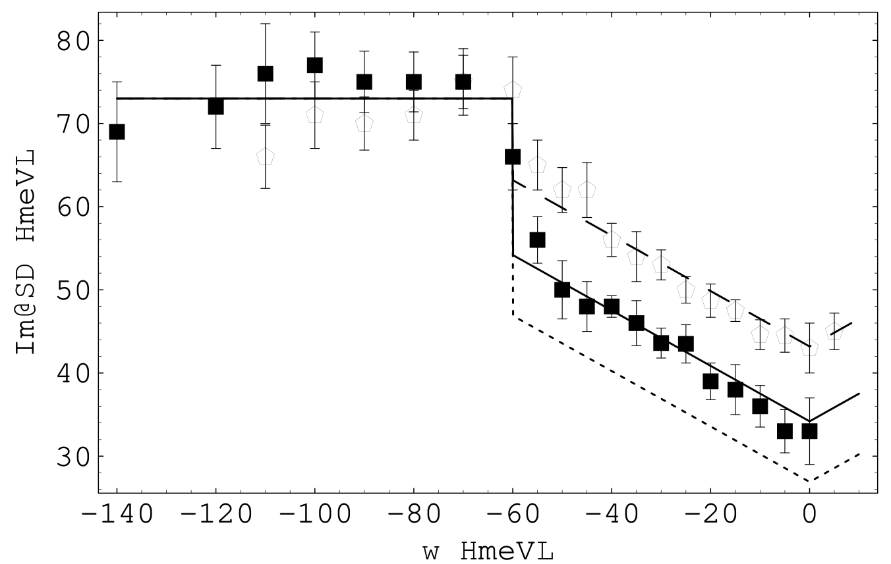
*   **来源**：[[../papers/CastroNeto2001charge]]

### 2. 公式（见原始图注）
出自「Charge Density Wave, Superconductivity, and Anomalous Metallic Behavior in 2D Transition Metal Dichalcogenides」的公式

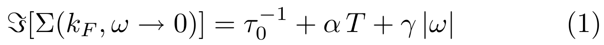
*   **来源**：[[../papers/CastroNeto2001charge]]

### 3. 公式（见原始图注）
出自「Charge Density Wave, Superconductivity, and Anomalous Metallic Behavior in 2D Transition Metal Dichalcogenides」的公式

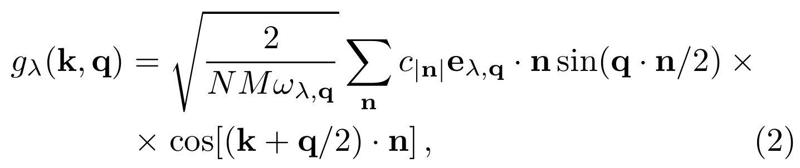
*   **来源**：[[../papers/CastroNeto2001charge]]

### 4. 公式（见原始图注）
出自「Charge Density Wave, Superconductivity, and Anomalous Metallic Behavior in 2D Transition Metal Dichalcogenides」的公式

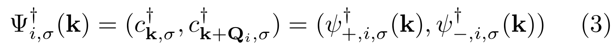
*   **来源**：[[../papers/CastroNeto2001charge]]

### 5. 公式（见原始图注）
出自「Charge Density Wave, Superconductivity, and Anomalous Metallic Behavior in 2D Transition Metal Dichalcogenides」的公式

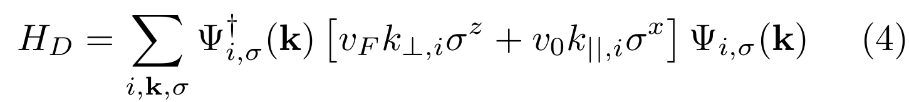
*   **来源**：[[../papers/CastroNeto2001charge]]

### 6. 公式（见原始图注）
出自「Charge Density Wave, Superconductivity, and Anomalous Metallic Behavior in 2D Transition Metal Dichalcogenides」的公式

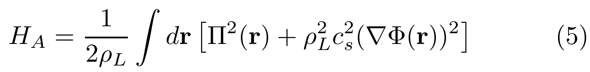
*   **来源**：[[../papers/CastroNeto2001charge]]

### 7. 公式（见原始图注）
出自「Charge Density Wave, Superconductivity, and Anomalous Metallic Behavior in 2D Transition Metal Dichalcogenides」的公式

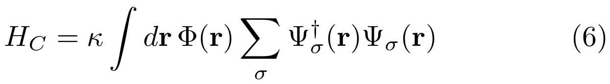
*   **来源**：[[../papers/CastroNeto2001charge]]

### 8. 公式（见原始图注）
出自「Charge Density Wave, Superconductivity, and Anomalous Metallic Behavior in 2D Transition Metal Dichalcogenides」的公式

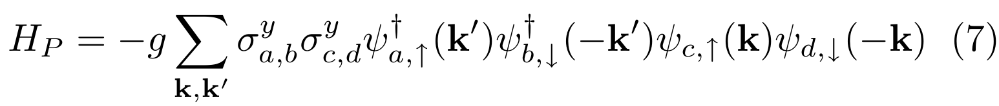
*   **来源**：[[../papers/CastroNeto2001charge]]

### 9. 公式（见原始图注）
出自「Charge Density Wave, Superconductivity, and Anomalous Metallic Behavior in 2D Transition Metal Dichalcogenides」的公式

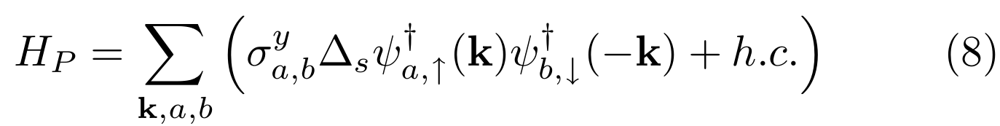
*   **来源**：[[../papers/CastroNeto2001charge]]

### 10. 公式（见原始图注）
出自「Charge Density Wave, Superconductivity, and Anomalous Metallic Behavior in 2D Transition Metal Dichalcogenides」的公式

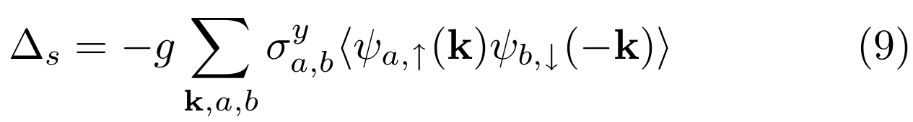
*   **来源**：[[../papers/CastroNeto2001charge]]

### 11. 公式：_11
_11

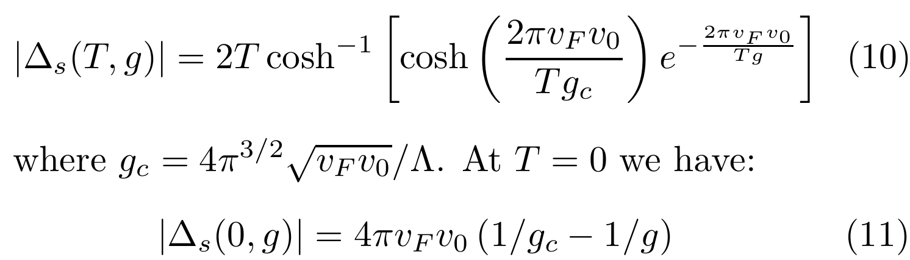
*   **来源**：[[../papers/CastroNeto2001charge]]

### 12. 公式：_12
_12

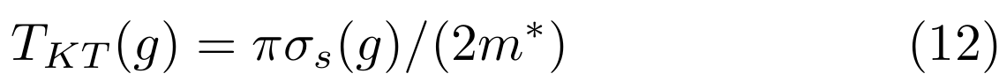
*   **来源**：[[../papers/CastroNeto2001charge]]

### 13. φ=π/2 时的 CDW 原子位移模式（蓝色原子构成未畸变子晶格）；插图为总能量随 φ 的
φ=π/2 时的 CDW 原子位移模式（蓝色原子构成未畸变子晶格）；插图为总能量随 φ 的变化，固定 μ 与固定 N 两种极端均在 π/2 取极小

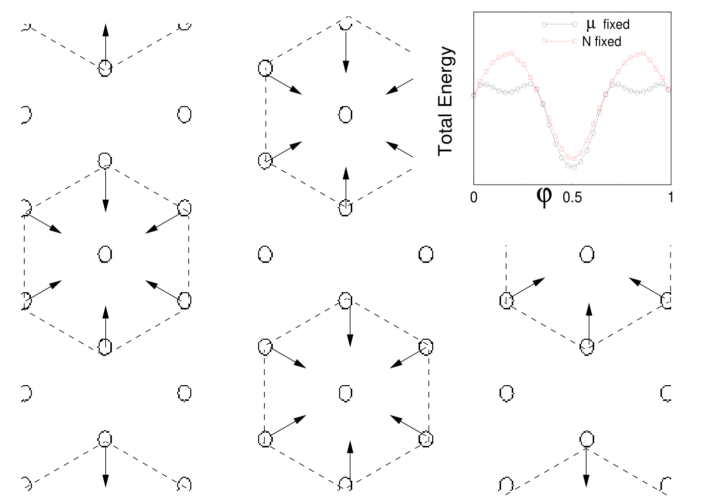
*   **来源**：[[../papers/Barnett2006coexistence]]

### 14. 公式：紧束缚色散 ε⁰_k=Σ_R t_|R| cos(k·R)
紧束缚色散 ε⁰_k=Σ_R t_|R| cos(k·R)

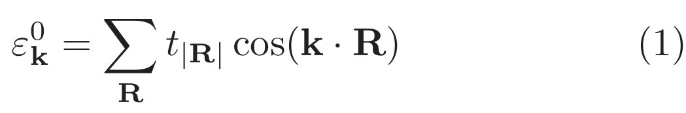
*   **来源**：[[../papers/Barnett2006coexistence]]

### 15. 公式：Σ1 对称原子位移 δR=Σ_Q u cos(Q·R+φ) Q̂
Σ1 对称原子位移 δR=Σ_Q u cos(Q·R+φ) Q̂

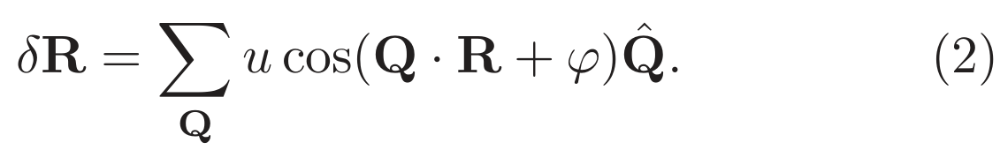
*   **来源**：[[../papers/Barnett2006coexistence]]

### 16. 公式：CDW 微扰 H'=Σ_{k,Q} Δ_Q^k c_k†c_{k+Q}+h.c.
CDW 微扰 H'=Σ_{k,Q} Δ_Q^k c_k†c_{k+Q}+h.c.

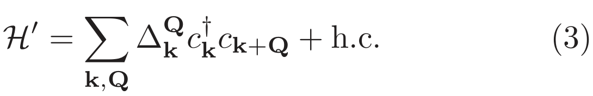
*   **来源**：[[../papers/Barnett2006coexistence]]

### 17. 公式：电子-声子耦合矩阵元 Δ_Q^k
电子-声子耦合矩阵元 Δ_Q^k

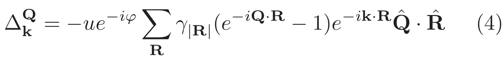
*   **来源**：[[../papers/Barnett2006coexistence]]

### 18. 公式：总能量 E_tot(u,φ)=∫^μ ερ(ε)dε+E_el(u)
总能量 E_tot(u,φ)=∫^μ ερ(ε)dε+E_el(u)

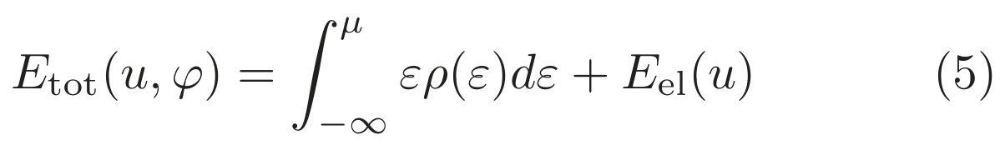
*   **来源**：[[../papers/Barnett2006coexistence]]

### 19. CrS₂、CrSe₂、CrTe₂在双轴应变(εx, εy)下的总能量地形图，显示NM-CD
CrS₂、CrSe₂、CrTe₂在双轴应变(εx, εy)下的总能量地形图，显示NM-CDW与FM-CDW两个能谷及其间势垒（101/35.1/5.9 meV/f.u.）

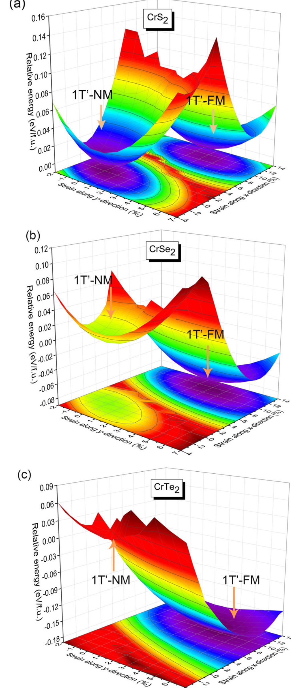
*   **来源**：[[../papers/chenFerromagneticNonmagnetic1T2022]]

### 20. 电荷掺杂诱导CrS₂ NM↔FM CDW可逆相变：(a)(b) 晶格常数随电子/空穴注入的
电荷掺杂诱导CrS₂ NM↔FM CDW可逆相变：(a)(b) 晶格常数随电子/空穴注入的滞后回线；(c) 相变能垒随掺杂浓度降低

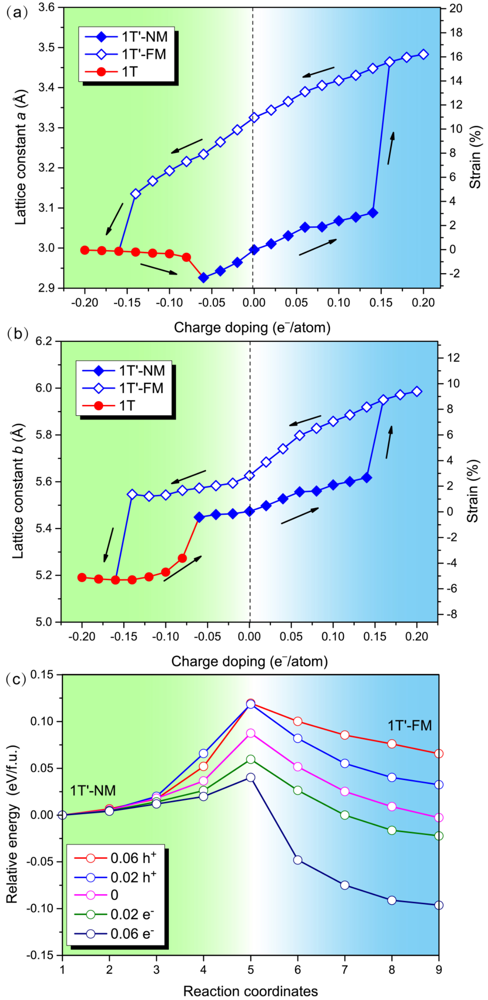
*   **来源**：[[../papers/chenFerromagneticNonmagnetic1T2022]]

### 21. GGA+DF 下各 CDW 构型的 Se-Se 键长斑块模式
GGA+DF 下各 CDW 构型的 Se-Se 键长斑块模式

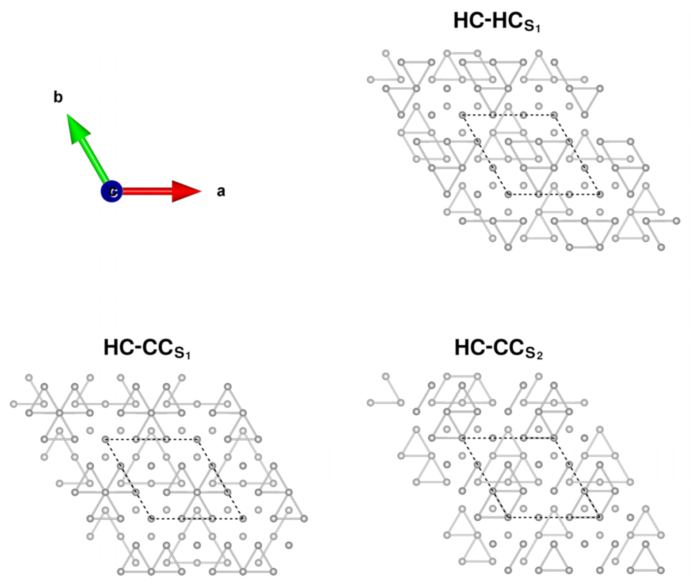
*   **来源**：[[../papers/cossuStackingChargedensityWaves2024]]

### 22. 正常相、单层 HC 与双层三种 CDW 的恒流模式模拟 STM 图像（-0.2 V）
正常相、单层 HC 与双层三种 CDW 的恒流模式模拟 STM 图像（-0.2 V）

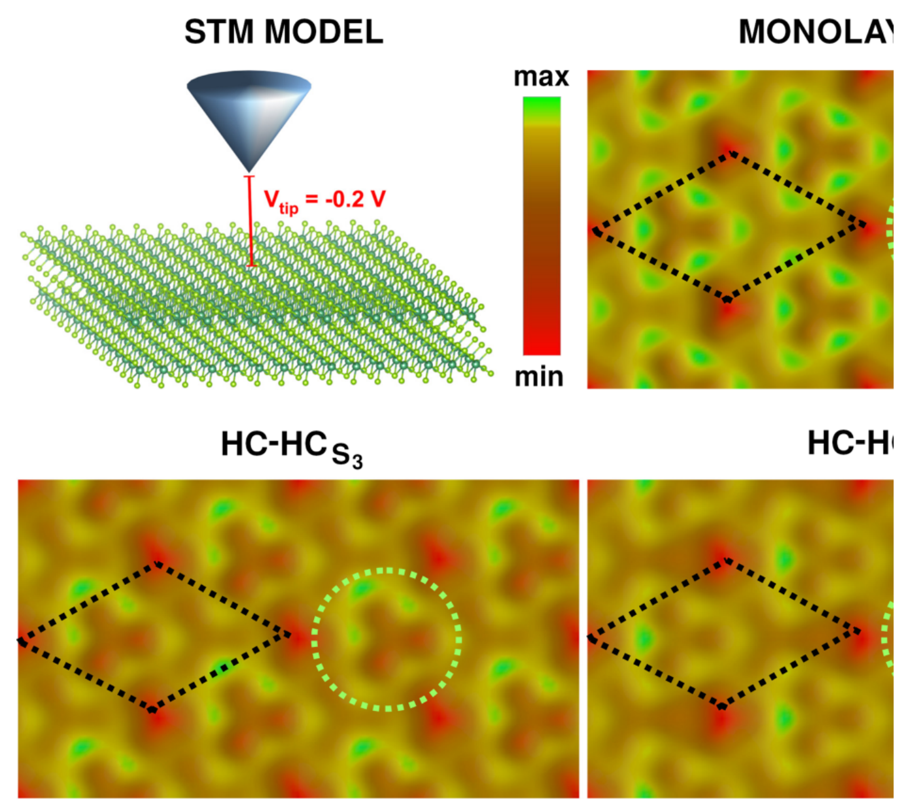
*   **来源**：[[../papers/cossuStackingChargedensityWaves2024]]

### 23. 表：II：双层与单层 CDW 相对能量（GGA 与 GGA+DF，meV/f.u.）
II：双层与单层 CDW 相对能量（GGA 与 GGA+DF，meV/f.u.）

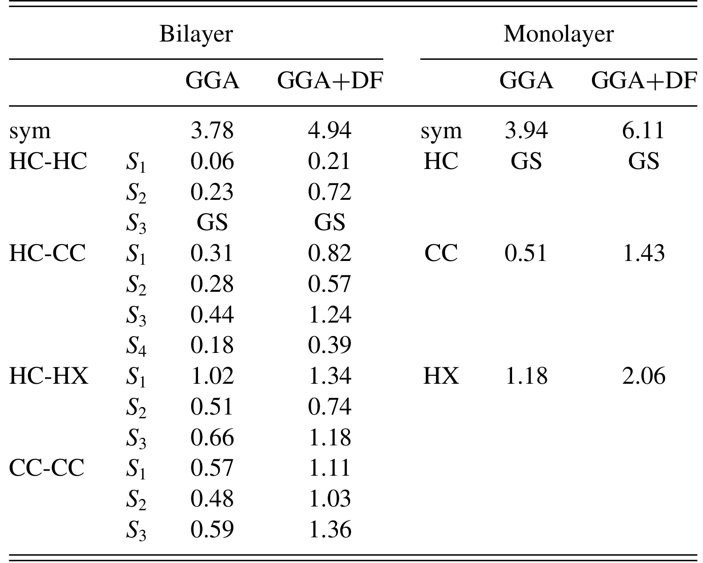
*   **来源**：[[../papers/cossuStackingChargedensityWaves2024]]

### 24. DMFT 电阻率随温度变化（x=0 与 x=1）及 TaSeS 超导序参量的 BCS 拟合
DMFT 电阻率随温度变化（x=0 与 x=1）及 TaSeS 超导序参量的 BCS 拟合

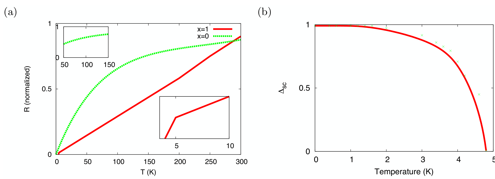
*   **来源**：[[../papers/Koley2020charge]]

### 25. PoDW相电荷磁化率的费曼图与三轨道模型计算结果
PoDW相电荷磁化率的费曼图与三轨道模型计算结果

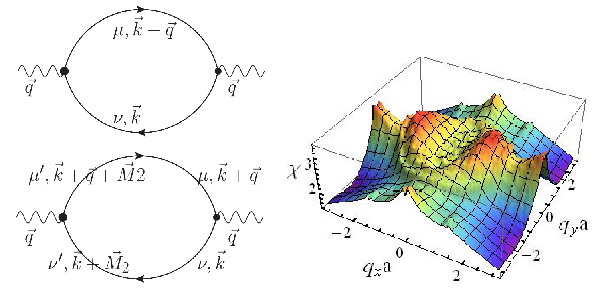
*   **来源**：[[../papers/Kang2012dimer]]

### 26. 轨道成分导致C4对称性破缺的费曼图
轨道成分导致C4对称性破缺的费曼图

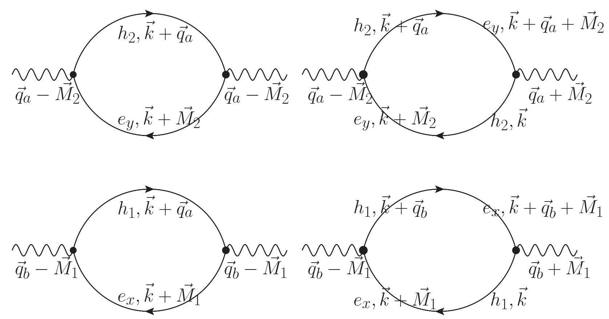
*   **来源**：[[../papers/Kang2012dimer]]

### 27. 低温拉曼光谱与CDW振膜模式
低温拉曼光谱与CDW振膜模式

*   **来源**：[[../papers/chowdhuryReviewTheoreticalComputational]]

### 28. 论文图4：1T-VSe₂ 与 1T-VTe₂ 单层沿 Γ-M-K-Γ 的声子色散，虚频软模
论文图4：1T-VSe₂ 与 1T-VTe₂ 单层沿 Γ-M-K-Γ 的声子色散，虚频软模标志 CDW 失稳波矢

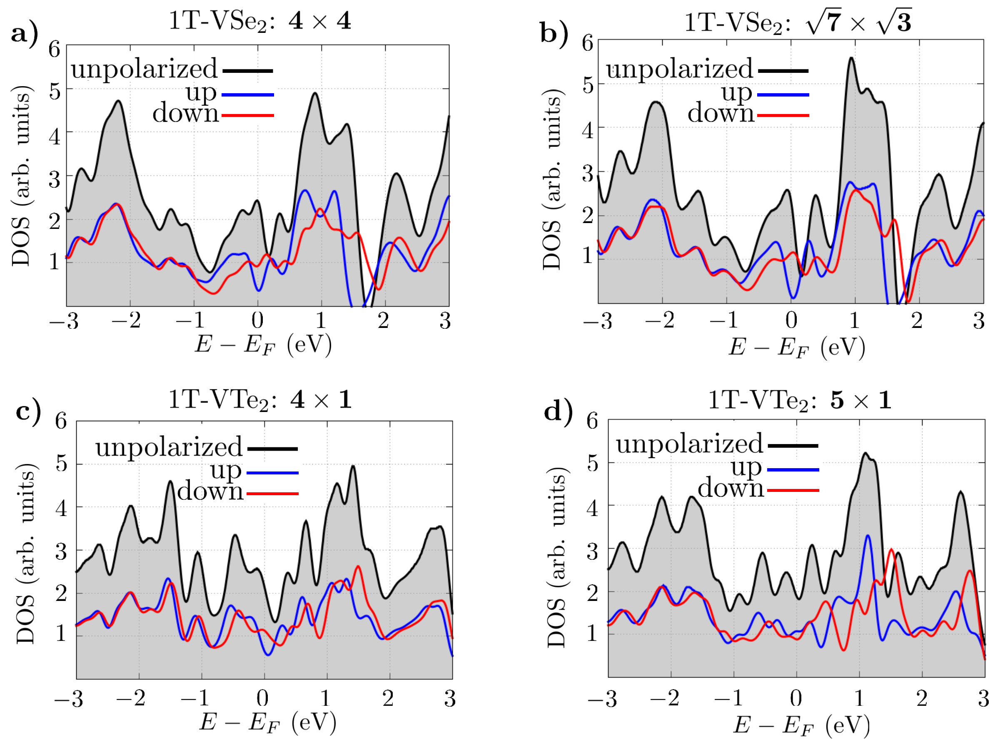
*   **来源**：[[../papers/lezoualchStudyChargeDensity]]

### 29. 不同掺杂 x 与杂化 Γ 下的声子色散及掺杂–杂化 CDW 相图（3×3 / 2×2 / 
不同掺杂 x 与杂化 Γ 下的声子色散及掺杂–杂化 CDW 相图（3×3 / 2×2 / 无 CDW）

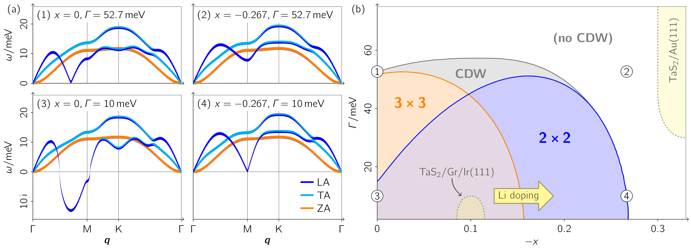
*   **来源**：[[../papers/hallEnvironmentalControlCharge]]

### 30. 公式：由 TB 费米面面积计算载流子浓度 n_e=2−(A_FS,h,↑+A_FS,h,↓
由 TB 费米面面积计算载流子浓度 n_e=2−(A_FS,h,↑+A_FS,h,↓)/A_BZ

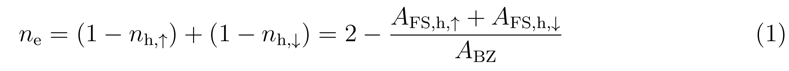
*   **来源**：[[../papers/hallEnvironmentalControlCharge]]

### 31. 公式：声子自能 Π_{qαβ}=(2/N)Σ g (f_{k+q,m}−f_{k,n})/
声子自能 Π_{qαβ}=(2/N)Σ g (f_{k+q,m}−f_{k,n})/(ε_{k+q,m}−ε_{k,n}) g*

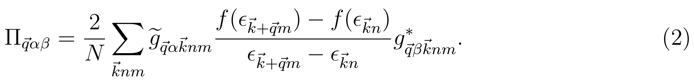
*   **来源**：[[../papers/hallEnvironmentalControlCharge]]

### 32. 非均匀超导渗流与涡旋约束示意：(a) 0D 成核→1D 网络渗流→2D 全域超导；(b) 
非均匀超导渗流与涡旋约束示意：(a) 0D 成核→1D 网络渗流→2D 全域超导；(b) 1D 通道中涡旋被钉扎，解释 Little-Parks 振荡

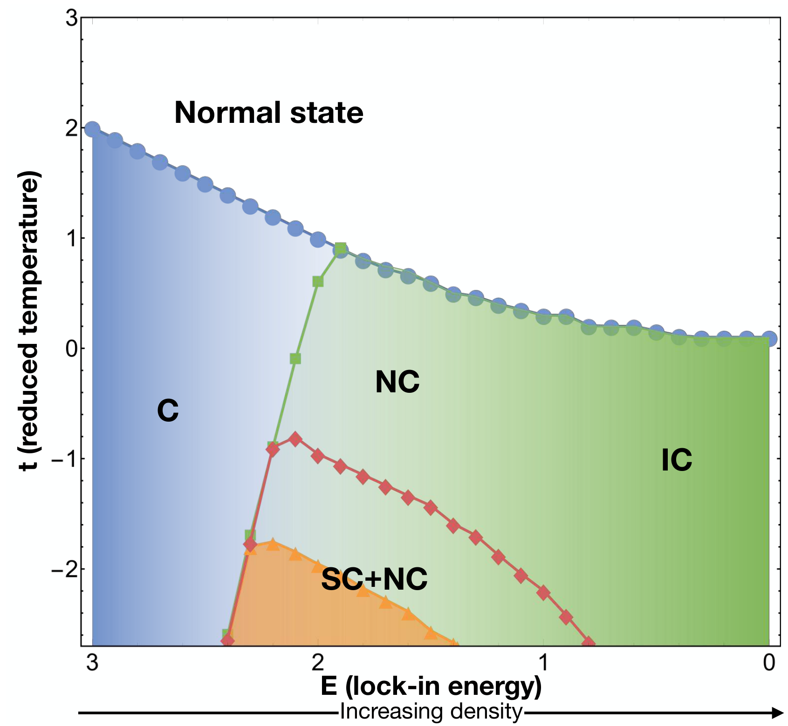
*   **来源**：[[../papers/Chen2019superconductivity]]

### 33. 公式：σ_sc∝λ^-2=(4πn_s e²/m*c²)/(1+ξ/l)
σ_sc∝λ^-2=(4πn_s e²/m*c²)/(1+ξ/l)

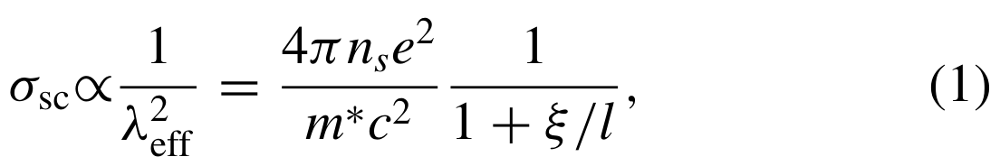
*   **来源**：[[../papers/Islam2025enhancement]]

### 34. 公式：α模型双能隙加权叠加：σ_sc(T)/σ_sc(0)=ωσ_1+(1-ω)σ_2
α模型双能隙加权叠加：σ_sc(T)/σ_sc(0)=ωσ_1+(1-ω)σ_2

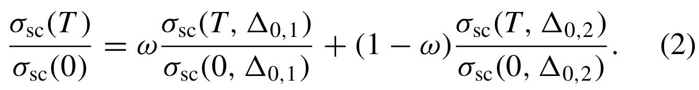
*   **来源**：[[../papers/Islam2025enhancement]]

### 35. (BEDT-TTF)₁.₅CuCl₂ 磁化率随温度变化，4–50 K 服从居里-外斯定律，
(BEDT-TTF)₁.₅CuCl₂ 磁化率随温度变化，4–50 K 服从居里-外斯定律，50 K 以上偏离

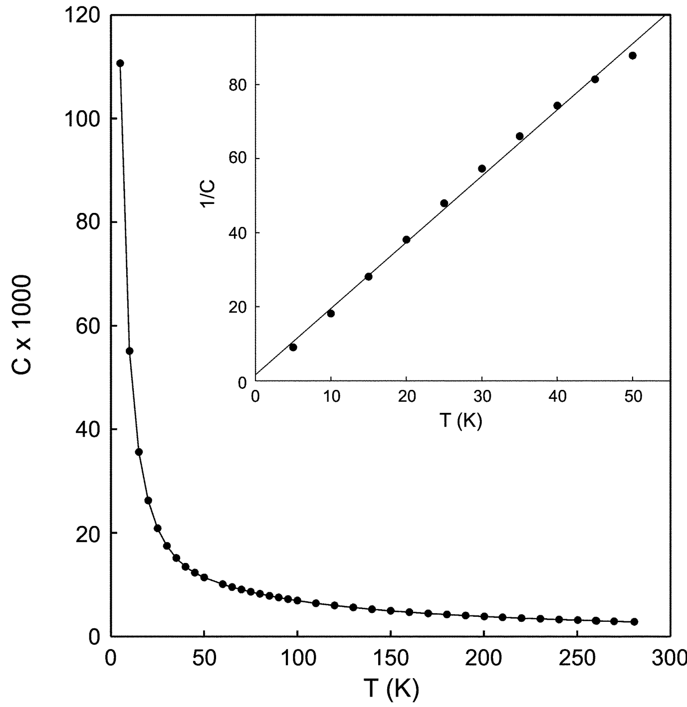
*   **来源**：[[../papers/Unknown2003charge]]

### 36. 公式：调制深度与相位差关系 Δφ=(2π/λ)·h·(n-n₀)
调制深度与相位差关系 Δφ=(2π/λ)·h·(n-n₀)

*   **来源**：[[../papers/Unknown2025diffractive]]

### 37. 公式：远场振幅为输入振幅与相位的FFT
远场振幅为输入振幅与相位的FFT

*   **来源**：[[../papers/Unknown2025diffractive]]

### 38. 公式：轴锥镜后理论空间强度分布（零阶贝塞尔函数J₀）
轴锥镜后理论空间强度分布（零阶贝塞尔函数J₀）

*   **来源**：[[../papers/Unknown2025diffractive]]

---

## 🔗 相关概念与实体 (Related Concepts & Entities)

**核心概念**：[[../concepts/density-functional-theory|密度泛函理论 (DFT)]]、[[../concepts/paw-method|投影增强波法 (PAW/USPP)]]、[[../concepts/berry-phase|Berry 相与现代极化理论]]、[[../concepts/born-effective-charge|Born 有效电荷]]、[[../concepts/ferroelectricity|铁电性]]、[[../concepts/multiferroicity|多铁性]]、[[../concepts/charge-density-wave|电荷密度波 (CDW)]]、[[../concepts/flexoelectric-effect|挠曲电效应]]、[[../concepts/peierls-distortion|Peierls 畸变]]、[[../concepts/superconducting-dome|超导穹顶]]

**相关材料/实体**：[[../entities/h-BN|h-BN]]、[[../entities/graphene|石墨烯]]、[[../entities/TMDs|过渡金属二硫化物 (TMDs)]]、[[../entities/NbSe2|2H-NbSe₂]]、[[../entities/BiFeO3|BiFeO₃]]、[[../entities/HZO|HfZrO (HZO)]]、[[../entities/In2Se3|In₂Se₃]]、[[../entities/BaTiO3|BaTiO₃]]、[[../entities/WTe2|WTe₂]]

