---
tags:
  - type/figure-collection
---

# 理论模型与计算方法：计算方法与泛函

> 属于 [[mathematical-models|理论模型与计算方法]]

## 条目

### 1. Cu原胞总能量随k网格阶数的幂律收敛，Bloechl修正显著优于线性四面体法

*   **来源**：[[../papers/Delley2000]]
*   **图示描述**：纵轴为金属 Cu 原胞总能量差（mHa），横轴为 k 网格阶数；圆点表示启用 Bloechl 二阶（费米面曲率）修正的四面体法，三角形表示线性四面体法，实心/空心分别对应未平移/平移网格。
*   **关键特征**：与 Si 不同，Cu 因费米面切割部分填充能带，总能量随网格阶数按**幂律**缓慢收敛；Bloechl 修正曲线在所有阶数下都比线性四面体法低数个量级的误差，显著加速金属 k 点积分；Cu 原胞默认取 8 阶网格；二阶修正会在部分 k 点引入负占据权重（积分总占据仍正定），可结合有限温度占据或高斯展宽抑制 SCF 虚假振荡。

### 2. 六方固体6×6×n未平移k网格在ab面的投影，特殊k点以粗体标出

*   **来源**：[[../papers/Delley2000]]
*   **图示描述**：将三维 6×6×n 未平移 Monkhorst–Pack 网格投影到六方晶格的 ab 倒格面上；普通圆圈表示倒格点，粗体点表示经空间群对称性约化后需显式计算的"特殊 k 点"。
*   **关键特征**：要让网格点恰好落在 K–H 线（石墨半金属简并线）上，ab 面网格阶数必须为 3 的倍数；因此能带/DOS 展示用 12×12×4，而日常性质计算为避免 E_F 处简并导致的虚假占据，选用 8×8×4 网格（ab 面阶数不是 3 的倍数，避开 K–H 采样问题）；该示意图是对称性约化与 k 网格设计的直观教具。

### 3. 表II 石墨、硅、α-S8的DMol3原子化能与298 K生成热
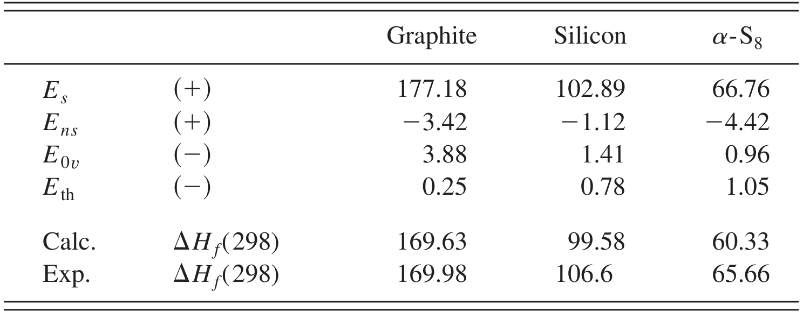
*   **来源**：[[../papers/Delley2000]]
*   **图示描述**：列出石墨、硅、α-S8的价层能量Es、非球形势能Ens、零点振动能E0v、热焓修正Eth及298 K生成热ΔHf，并与实验值逐项对照。
*   **关键特征**：石墨ΔHf计算169.63 vs 实验169.98 kcal/mol（吻合极好）；硅99.58 vs 106.6、α-S8 60.33 vs 65.66，偏差约6-7 kcal/mol，反映共价固体中基组与泛函的系统性欠束缚。

### 4. 图2 双光子波函数频谱

*   **来源**：[[../papers/Nakanishi2009full]]
*   **图示描述**：在 (ω₁,ω₂) 频域平面上对比双光子波函数加时序前后的模值。横轴取差频 ω₋ = (ω₁−ω₂)/2，纵轴取和频 ω₊ = ω₁+ω₂；(a) 为原始波函数 |Ψ|，(b) 为时序波函数 |Ψ̃|，即 ψ(t₁,t₂)θ(t₂−t₁) 的二维傅里叶变换。
*   **关键特征**：(a) 中谱形沿 ω₊ 方向宽 1/T（相干时间决定）、沿 ω₋ 方向宽 1/τ（关联时间决定），因 τ≪T 呈沿 ω₋ 拉长的椭圆，直观显示光子对在频率上的反关联；(b) 中阶跃函数频谱 Θ(ω) 含 1/ω 柯西主值项，与 Ψ 卷积后沿 ω₋ 方向被显著展宽并形成长尾；正是这一拖尾使 P₂ 对中间态失谐仅按 1/Δ² 缓慢衰减，而非 δ 函数。

### 5. 图3 时域波函数

*   **来源**：[[../papers/Nakanishi2009full]]
*   **图示描述**：在 (t₁,t₂) 到达时间平面上绘制 |ψ(t₁,t₂)| 的等值线，对比本文解析处理的两类双光子波函数。(a) 高斯型 ψ∝exp[−(t₁+t₂)²/(16T²)]exp[−(t₁−t₂)²/(4τ²)]，可由高斯频谱滤波获得；(b) 矩形型 ψ∝exp[−(t₁+t₂)²/(16T²)]·Π_τ(t₁−t₂)，Π_τ 为 |t|<τ 的窗函数，由 II 型 SPDC 加双折射群速度补偿产生。
*   **关键特征**：两图沿 t₁+t₂ 方向均为宽 T 的高斯包络，对应长相干时间；沿 t₁−t₂ 方向高斯型呈平滑的窄高斯峰（宽 τ），矩形型则是在 [−τ,τ] 内均匀、边界陡然截断的硬窗；矩形窗在频域对应 sinc 函数并具有精确零点，这是它能实现 P₁=0 的数学来源，而高斯型频谱无零点、只能指数压低。

### 6. 优化结构

*   **来源**：[[../papers/Wei2021]]
*   **图示描述**：12 种锯齿型竹节状 N-CNT 经 SCC-DFTB 几何优化后的侧视图（上排）与俯视图（下排），按手性指数 n 从 3 到 14 排列。
*   **关键特征**：侧视图中紫色 N 原子环相对灰色 C 原子环明显向管轴收缩，表明 N-N 相互作用强于 C-C；俯视图中随 n 增大管径递增，C 环与 N 环保持同心环状构型；体系原子数从 (3,0) 的 72 个增至 (14,0) 的 336 个，体现 DFTB 处理大体系的能力。

### 7. 表1 重构表面二聚体键长与翘曲角（与DFT和实验值对比）

*   **来源**：[[../papers/Wu2018]]
*   **图示描述**：汇总DFTB计算的p(2×2)、c(4×2)重构中二聚体键长和翘曲角，并与Northrup(DFT,17°)、Miwa(DFT,2.27 Å/15.7°)及实验值(7.4°–8°)对比。
*   **关键特征**：键长2.30 Å(短)和2.60 Å(长)；翘曲角9.81°(短键)、8.30°和10.36°(长键两种情形)；DFTB翘曲角整体小于DFT文献值但更接近实验。

### 8. Si(001) c(4×2)重构slab模型及Ge二聚体初始h、θ定义

*   **来源**：[[../papers/Wu2021]]
*   **图示描述**：图(a)为沿[001]方向的俯视图，图(b)为沿[110]方向的侧视图，展示DFTB弛豫后形成c(4×2)重构的Si(001) slab（6×6周期、3原子层、真空层265 Å）；大球为Si（紫色下凹Si1、蓝色上翘Si2、橙色中间层、绿色后表面），小球为Ge二聚体（红色Ge1、粉色Ge2），并标出初始高度h和倾角θ两个扫描变量。
*   **关键特征**：干净表面Si二聚体键长2.60 Å、键能5.358 eV、弯曲角10.36°；下凹Si1布居3.66（失电子）、上翘Si2布居4.374（得电子），中性Si/Ge原子布居基准为4.0；Ge二聚体初始键长2.239 Å；h扫描范围1.0–5.2 Å（步长1 Å），θ扫描0°–170°（步长10°），共774个初始构型。

### 9. 表1 EAM势参数
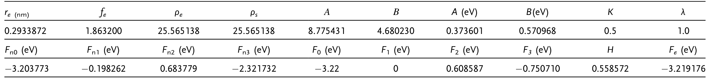
*   **来源**：[[../papers/Zhang2019a]]
*   **图示描述**：Zhou等Ti EAM势的全部数值参数表，分两行列势函数与嵌入能系数。
*   **关键特征**：$r_e=0.2933872$ nm、$f_e=1.863200$、$\rho_e=\rho_s=25.565138$；$A=8.775431$、$B=4.680230$、$A(\text{eV})=0.373601$、$B(\text{eV})=0.570968$、$\kappa=0.5$、$\lambda=1.0$；嵌入能系数$F_{n0..3}$、$F_{0..3}$、$F_e=3.219176$ eV、$\eta=0.558572$；截断半径0.656 nm，复现的无缺陷块体Ti熔点为2218 K。

### 10. 图5 熔化温度随粒子直径变化（<4 nm振荡，>4 nm收敛）
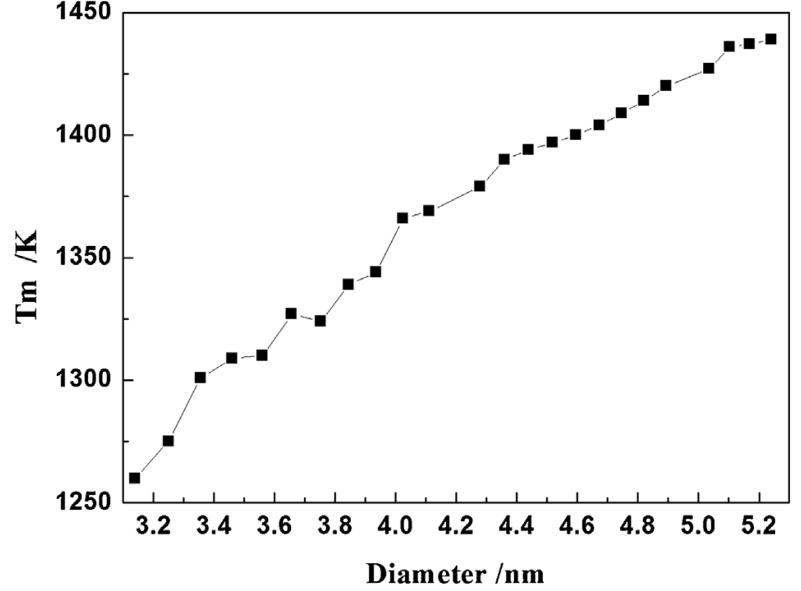
*   **来源**：[[../papers/Zhang2019a]]
*   **图示描述**：27个Ti纳米粒子的熔化温度$T_m$（K）对粒子直径$d$（nm，1.6–5.2 nm）散点/折线图。
*   **关键特征**：$d<4$ nm段$T_m$随$d$振荡式快速升高，逐尺寸波动源于表面原子比例与几何壳层闭合差异；$d>4$ nm后斜率明显变缓，$T_m$向EAM块体预测值2218 K收敛；4 nm是"分子型"向"块体型"熔化过渡的特征尺寸；EAM块体熔点较实验1941 K高约277 K（14%）。

### 11. EAM总势能公式 Eq.1
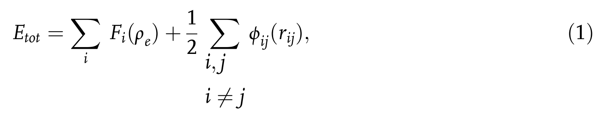
*   **来源**：[[../papers/Zhang2019a]]
*   **图示描述**：EAM势的总能量表达式，将N原子体系的总势能拆为嵌入能与对势能两部分。
*   **关键特征**：$E_{\text{tot}}=\sum_i F_i(\rho_e)+\tfrac12\sum_{i\ne j}\phi_{ij}(r_{ij})$；嵌入能$F_i$依赖背景电子密度$\rho_e$，对势$\phi_{ij}$依赖原子间距$r_{ij}$；该项是后续所有能量/结构分析的势函数基础。

### 12. 广义元素对势 Eq.3
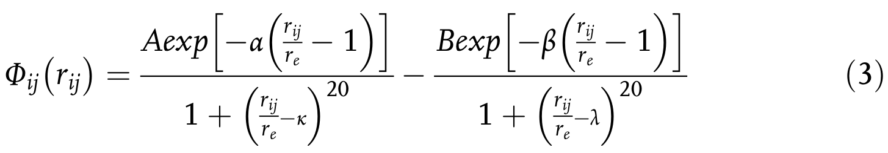
*   **来源**：[[../papers/Zhang2019a]]
*   **图示描述**：Zhou EAM势中两体对势$\phi_{ij}(r_{ij})$的解析形式，由指数衰减项乘以截断多项式构成。
*   **关键特征**：分子分母分别含$(r_{ij}/r_e-\kappa)^{20}$与$(r_{ij}/r_e-\lambda)^{20}$，在$r_e=0.2933872$ nm附近给出平衡间距；20次幂提供在0.656 nm处的陡峭光滑截断；参数$A,B,\alpha,\beta,\kappa,\lambda$由表1给出。

### 13. 电子密度函数 Eq.4
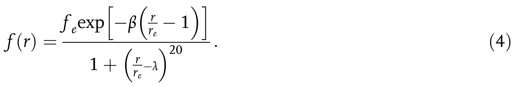
*   **来源**：[[../papers/Zhang2019a]]
*   **图示描述**：原子$j$在原子$i$位置产生的电子密度贡献$f(r)$，形式与对势吸引项相同。
*   **关键特征**：$f(r)=f_e\exp[-\beta(r/r_e-1)]/[1+(r/r_e-\lambda)^{20}]$；$f_e=1.863200$，与对势共用$\beta,\lambda$保证自洽；所有邻居贡献求和即得$\rho_e=\sum_j f_j(r_{ij})$，用于驱动嵌入能。

### 14. 嵌入能分段公式 Eq.5–7
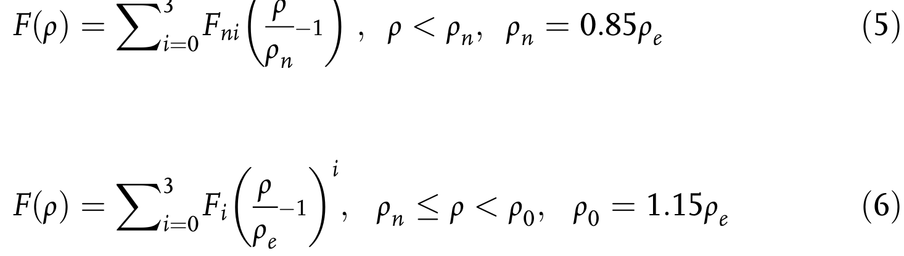
*   **来源**：[[../papers/Zhang2019a]]
*   **图示描述**：嵌入能$F(\rho)$的三段拼接总览，按电子密度$\rho$相对于$\rho_n=0.85\rho_e$、$\rho_0=1.15\rho_e$的位置分段。
*   **关键特征**：低密度段用三次多项式$F_{n0..3}$、中密度段用三次多项式$F_{0..3}$、高密度段用Rose型$F_e[1-\ln(\rho/\rho_s)^\eta]$；三段在连接点处函数值与斜率均连续；$\rho_e=\rho_s=25.565138$。

### 15. 图1 极性金属/类铁电金属/铁电金属概念区分及一维离子链库仑排斥能对比
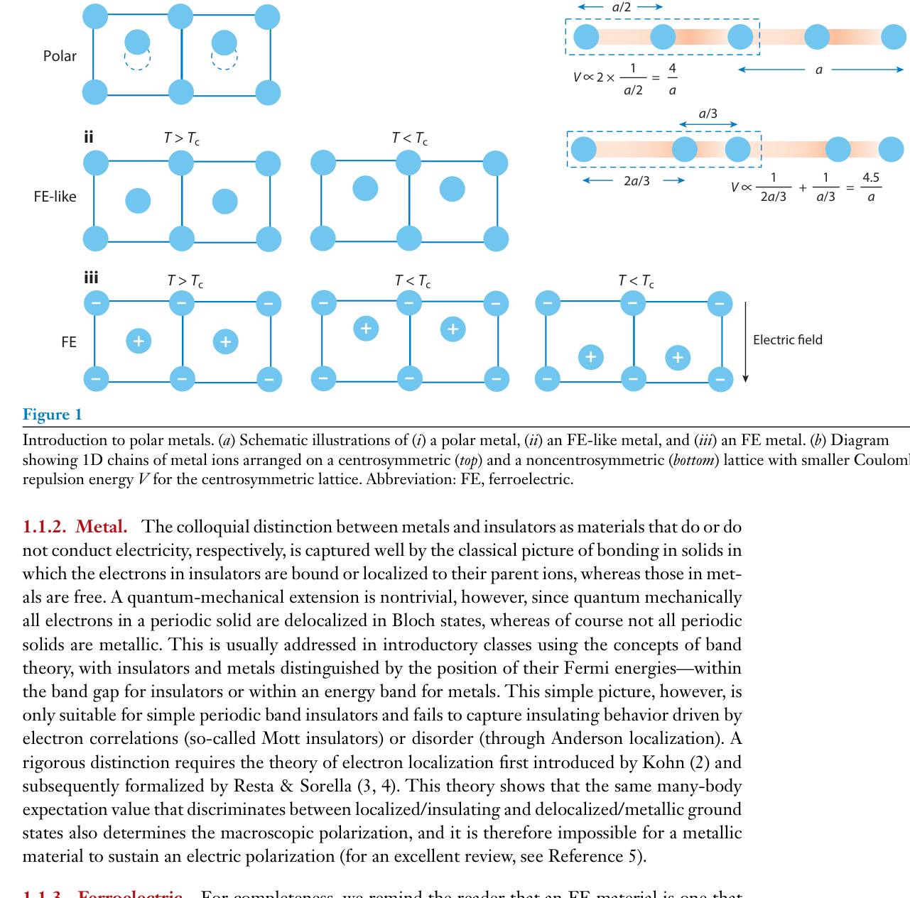
*   **来源**：[[../papers/bhowalPolarMetalsPrinciples2023b]]
*   **图示描述**：由两个子图组成，(a) 用卡通示意区分"极性金属—类铁电金属—铁电金属"三层概念（永久偶极但极化不可测/可发生非极性→极性相变但不可翻转/电场可翻转），(b) 对比中心对称与非中心对称一维离子链的库仑排斥能。
*   **关键特征**：等间距中心对称链（间距 a，电荷 +1）的库仑排斥能 V = 4.5 × a，小于间距交替为 a/3、2a/3 的非中心对称链；这解释了常规金属键无方向性、天然倾向中心对称堆积的原因；图 (a) 建立从"仅极性对称"到"可翻转极化"的递进术语谱系。

### 16. 原子总能量平面波收敛性

*   **来源**：[[../papers/blochlProjectorAugmentedwaveMethod1994b]]
*   **图示描述**：横轴为平面波截断能 E_pw（Ry），纵轴为相对于 E_pw=50 Ry 结果的总能量差 ΔE（eV）；曲线覆盖 H、Li、Be、B、N、O、F 及 Fe，使用不同符号区分（H△、Li*、Be□、B◇、N▽、O○、F☆、Fe¤）。
*   **关键特征**：H、Li 等轻元素收敛最快，O、F 等较"硬"元素与 Fe 收敛最慢；所有被测元素在 30–40 Ry 截断下误差均 <0.1 eV；Fe 作为含 3d 与半芯态的过渡金属代表仍能在此截断收敛。

### 17. 结合能平面波收敛性

*   **来源**：[[../papers/blochlProjectorAugmentedwaveMethod1994b]]
*   **图示描述**：横轴 E_pw（Ry），纵轴为相对于 50 Ry 结果的结合能差 ΔE（eV），被测二聚体与符号同图5。
*   **关键特征**：结合能（能量差）的收敛显著快于绝对总能量，因原子参考抵消了大部分系统误差；在 30 Ry 截断下误差已 <0.1 eV；轻元素二聚体在更低截断即收敛。

### 18. 键长平面波收敛性

*   **来源**：[[../papers/blochlProjectorAugmentedwaveMethod1994b]]
*   **图示描述**：横轴 E_pw（Ry），纵轴为相对于 50 Ry 结果的键长差 Δd（a₀），二聚体与符号同图5。
*   **关键特征**：30 Ry 时键长误差已 <0.02 a₀，相对偏差 <1%；键长对截断的敏感度低于总能量；各元素曲线趋势一致，无异常元素。

### 19. 表I PS分波构造参数

*   **来源**：[[../papers/blochlProjectorAugmentedwaveMethod1994b]]
*   **图示描述**：列出 H、Li、Be、B、N、O、F、Mn（Mn1/Mn2 两种设置）、Fe 等原子构造 PS 分波时的参数，所有原子与角动量通道统一取截断参数 A=6，并给出匹配半径 r_c、ṽ_ps(0) 等。
*   **关键特征**：A=6 为全局固定的多项式阶数/指数参数；截断半径 r_c 通常取共价半径的约 3/4，使 PS 势在缀加区外与 AE 原子势几乎相同；Mn2 对应每角动量两个分波的设置（图2实线所用），Mn1 为单分波设置。

### 20. 公式(4) LSDA+U总能量泛函（对角占据数形式）
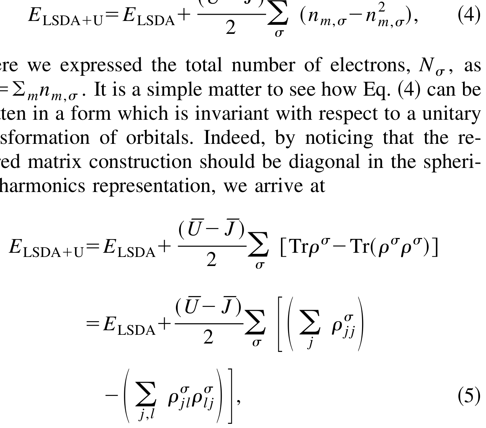
*   **来源**：[[../papers/dudarevElectronenergylossSpectraStructural1998a]]
*   **图示描述**：E_LSDA+U = E_LSDA + (Ū−J̄)/2 · Σ_σ (n_m,σ − n²_m,σ)，其中 n_m,σ 为第 m 个 d 轨道的占据数；该式由非整数占据的 UHF 能量表达式减去整数占据下的密度泛函表达式得到。
*   **关键特征**：(1) 修正项在整数占据（n=0 或 1）时为零，保证不破坏原子参考态；(2) 在半占据 n=1/2 时惩罚最大，强制轨道占据两极分化，从而打开关联带隙；(3) 形式上是 Anisimov 轨道依赖 LSDA+U 的简化版本。

### 21. 图2 Berry 相位法计算的极化随 c 轴归一化位移变化（Sc₂P₂Se₆ 12.36 pC/m，ScCrP₂Se₆ 6.11 pC/m）
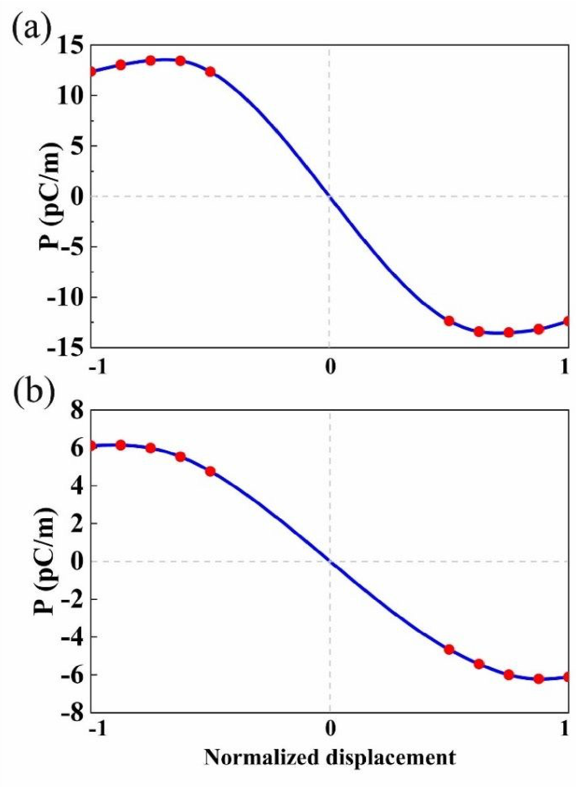
*   **来源**：[[../papers/fengFerroelectricityMultiferroicityTwodimensional2020]]
*   **图示描述**：横轴为沿 c 轴的归一化原子位移（FE-PE-FE 绝热路径），纵轴为 Berry 相位法计算的面外电偶极矩（pC/m），(a) Sc₂P₂Se₆、(b) ScCrP₂Se₆。
*   **关键特征**：Sc₂P₂Se₆ 极化 12.36 pC/m，ScCrP₂Se₆ 6.11 pC/m；按层厚 4.0 Å 折算为 3.09 与 1.53 μC/cm²；与 Sc₂CO₂（1.60 μC/cm²）相当，比 CuInP₂Se₆（0.322 μC/cm²）、AgBiP₂Se₆（0.2 μC/cm²）大约一个数量级；Cr 取代后极化减半反映电子结构重构。

### 22. 图9 同图8，但为 E 模式初始激发

*   **来源**：[[../papers/fornerQuantumTemperatureEffects1993]]
*   **图示描述**：与图 8 相同温度、模型和参数扫描，但初始激发为对称分布在两条链上的简并 E 模式。
*   **关键特征**：总体趋势与局域激发一致——W=13–19 N/m 多被钉扎，W≥40 N/m 起可观察到孤波形成；孤波往往不能在链端反射后存活，且相当一部分激发始终局域在初始位置；作者将反射失败归因于 20 格点短链的端面效应，更长链中应可持续传播。

### 23. 静态介电常数综合对比表（纵向/横向、mic/RPA/DFT、cond/LR、APW+LO、实验）
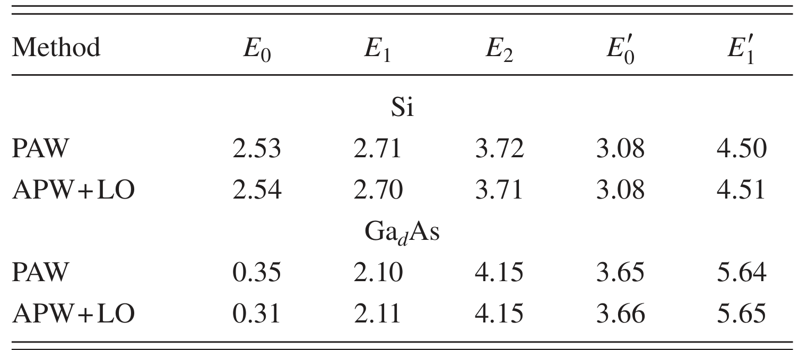
*   **来源**：[[../papers/gajdosLinearOpticalProperties2006]]
*   **图示描述**：行为 C、Si、SiC、AlP、GaAs、Ga_dAs 六种材料设置，列为不同方法与近似：纵向/横向、mic（忽略局域场）/RPA（Hartree 级局域场）/DFT（含交换关联局域场）、cond（对导带求和）/LR（DFPT 线性响应）、含/不含 d 投影子、APW+LO 全电子基准以及实验值。
*   **关键特征**：纵向表达式下 mic_cond 与 mic_LR、RPA_cond 与 RPA_LR、DFT_cond 与 DFT_LR 两两吻合，验证导带求和与 DFPT 自洽；Si mic_cond 纵向 14.04、横向 16.50，横向加入 d 投影子后降至 14.09，与纵向偏差 <1%；含局域场后介电常数降低 3%–9%（如 Si mic 14.08→RPA 12.66→DFT 13.29，C 5.98→5.54→5.80）；DFT_LR 纵向值 C 5.80、Si 13.29、SiC 6.97、AlP 8.33、GaAs 14.42、Ga_dAs 14.37，与 APW+LO（Si 13.99 mic、GaAs 15.36 mic）在 1% 内一致；实验值 C 5.70、Si 11.90、SiC 6.52、AlP 7.54、GaAs 11.10，LDA 系统高估 5%–20%，且带隙越小高估越严重。

### 24. 图2 DP模型与DFT的能量/原子力基准测试（能量误差0.60 meV/atom）
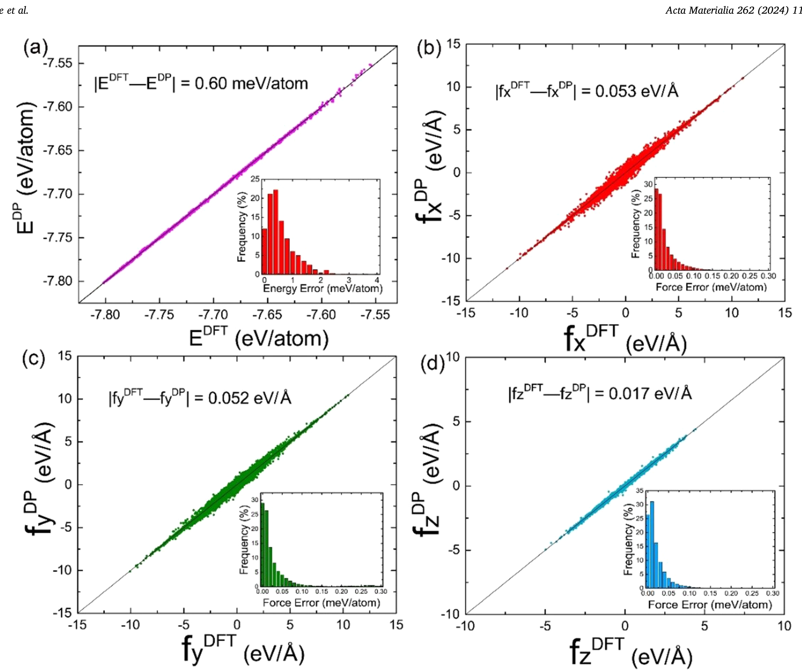
*   **来源**：[[../papers/heUltrafastSwitchingDynamics2024]]
*   **图示描述**：DP机器学习势相对于DFT基准的散点对比。(a)能量对比；(b–d)分别为x、y、z三方向原子受力分量对比，所有点均为最终训练集中的构型，插图给出平均绝对误差。
*   **关键特征**：能量平均绝对误差仅0.60 meV/atom；面内力(x,y)误差0.051 eV/Å，面外力(z)误差0.017 eV/Å；散点紧密沿对角线分布。

### 25. 图3 DP与DFT声子色散对比，验证AB堆垛动力学稳定性
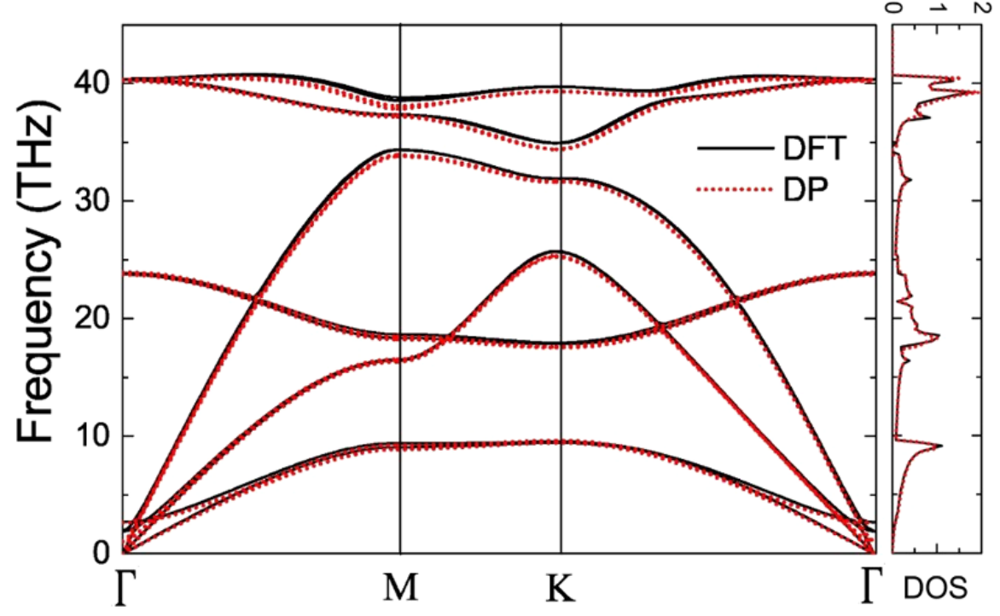
*   **来源**：[[../papers/heUltrafastSwitchingDynamics2024]]
*   **图示描述**：AB堆垛h-BN双层的声子色散关系与声子态密度(DOS)，DP模型(红圈)与DFT(实线)结果叠加对比，横轴为布里渊区高对称路径。
*   **关键特征**：两支曲线几乎完全重合；4原子原胞给出3支声学支与9支光学支；Γ点附近声学支频率趋于零且全程无虚频(负频率)。

### 26. 图6 B位阳离子双势阱势能
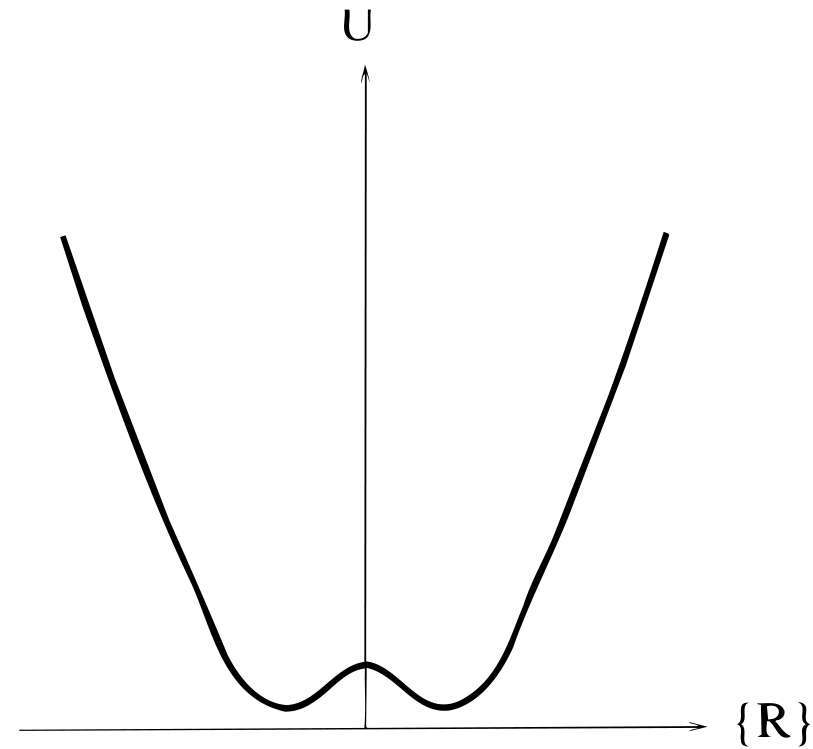
*   **来源**：[[../papers/hillWhyAreThere2000a]]
*   **图示描述**：横轴为 B 位阳离子相对氧八面体中心的位移，纵轴为势能，绘出钙钛矿铁电体典型的"W"形双势阱曲线，左右两个极小值对应两种相反方向的偏心位置。
*   **关键特征**：高温顺电相离子在中心附近振动，越过势垒在两阱间往返；低温铁电相离子"冻结"于某一势阱，产生可被电场翻转的自发极化；软模理论中该势垒对应铁电声子频率在 Tc 处软化至零。它把位移型铁电相变浓缩为一个唯象图像，也是后文判断"d 电子占据是否填平双势阱"的判据。

### 27. 图4

*   **来源**：[[../papers/huangTwodimensionalIn2Se3Rising2022]]
*   **图示描述**：(A) β 相中间层 Se(m) 原子的二维势能面（顶/底 Se 为单谷，中间 Se 为"墨西哥帽"形）；(B) 750 K 下 ab initio MD 快照；(C) 约 20 ps 轨迹中 Se(m) 的位置时间平均；(D–F) 顶/中/底三层 Se 原子的位置分布概率。
*   **关键特征**：PES 中心是能量极大值（不稳定点），环上分布 12 个等价极小值，Se(m) 必自发偏心落入其中一个谷；750 K 下 Se(m) 在 12 个谷之间随机跳跃，时间平均位置恰为中心对称点；顶/底 Se 分布概率尖锐，而 Se(m) 分布几乎平坦，恰好对应 PES 形状。

### 28. Fig.1 力的收敛性对比（fcc-Fe）

*   **来源**：[[../papers/kresseEfficientIterativeSchemes1996d]]
*   **图示描述**：横轴为自洽迭代步数，纵轴为原子受力（单位 eV/Å），对比 fcc-Fe 4 晶胞在自洽循环中采用 out（未经修正的输出密度）、mix（混合密度）、opt（混合密度叠加式(25) Pulay 力修正）三种方案时力的收敛曲线。
*   **关键特征**：out 曲线数十步后仍剧烈振荡，误差约为 opt 的 100 倍；mix 曲线收敛性大幅改善但初期仍有波动；opt 曲线最平滑，约 10 步即达高精度，且随步数单调下降。

### 29. Fig.2 RMM-DIIS 对金刚石的非自洽能量收敛

*   **来源**：[[../papers/kresseEfficientIterativeSchemes1996d]]
*   **图示描述**：固定势场下仅迭代波函数，横轴为 RMM-DIIS 迭代步数，纵轴为总自由能（单位 eV），四条曲线分别对应 1（8 原子）、2、4、8 个立方金刚石晶胞。
*   **关键特征**：四条收敛曲线几乎完全重合；尽管随超胞增大最高占据态与最低空态之间隙缩小，RMM-DIIS 仍稳定收敛到正确本征态；初始波函数由随机初始化加 3 次 CG 子空间旋转生成。

### 30. Fig.3 RMM-DIIS 与 CGa 对 fcc-Fe 的非自洽收敛

*   **来源**：[[../papers/kresseEfficientIterativeSchemes1996d]]
*   **图示描述**：固定势场下对比 RMM-DIIS（实线）与直接最小化 KS 泛函的 CGa（虚线），横轴为迭代步数，纵轴为 fcc-Fe 超胞的总自由能（单位 eV），覆盖 1×–8× 不同超胞尺寸。
*   **关键特征**：两种方法均表现出与尺寸无关的收敛性；RMM-DIIS 能量下降更快、曲线更平滑，所需步数更少；CGa 振荡略大但也能在固定势场下收敛。

### 31. Fig.4 金刚石自洽能量与力收敛

*   **来源**：[[../papers/kresseEfficientIterativeSchemes1996d]]
*   **图示描述**：开启自洽循环后金刚石体系的收敛曲线，上图纵轴为总能量（单位 eV）、下图纵轴为原子力（单位 eV/Å），横轴均为自洽迭代步数，RMM-DIIS 为实线、CGa 为虚线。
*   **关键特征**：能量上 RMM-DIIS 约 12 步即达极高精度，CGa 需约 30 步；力上 RMM-DIIS 曲线平滑快速下降，10 步后小数点后三位以上正确，CGa 需至少加倍迭代步数才能达到同等精度。

### 32. Fig.5 fcc-Fe 自洽能量与力收敛

*   **来源**：[[../papers/kresseEfficientIterativeSchemes1996d]]
*   **图示描述**：过渡金属 fcc-Fe 的自洽收敛，上图为总能量、下图为原子力随迭代步数的变化，对比 RMM-DIIS（实线）与 CGa（虚线），并覆盖 1-cell 到 8-cell 不同超胞尺寸。
*   **关键特征**：RMM-DIIS 能量约 20 步内收敛，从最小到最大超胞迭代次数仅增加约一倍；CGa 收敛非常缓慢，且随体系尺寸增大显著恶化，大晶胞下几乎不收敛；Fe 的开壳层 d 电子使电荷晃动比金刚石更严重。

### 33. Fig.6 fcc-Al 自洽能量收敛

*   **来源**：[[../papers/kresseEfficientIterativeSchemes1996d]]
*   **图示描述**：近自由电子金属 fcc-Al 的自洽总自由能（单位 eV）随迭代步数的收敛曲线，对比 RMM-DIIS 与 CGa，并覆盖从小到大多个超胞尺寸。
*   **关键特征**：RMM-DIIS 仅需约 8 步即收敛，且与体系尺寸无关；CGa 收敛性随尺寸增大而显著变差；Al 的介电屏蔽行为与 Kerker 模型高度吻合，使预条件混合近乎最优。

### 34. Table I 碳体系单步耗时

*   **来源**：[[../papers/kresseEfficientIterativeSchemes1996d]]
*   **图示描述**：在 IBM RS/6000 Model 590 工作站上，RMM-DIIS、CG、CGa 三种方法对不同尺寸碳（金刚石）超胞的单次自洽迭代耗时（单位秒）。
*   **关键特征**：小体系（8 原子）三者耗时相近，分别约为 1.0、1.0、1.2 秒；最大 216 原子体系 RMM-DIIS 约 410 秒、CG 约 800 秒，RMM-DIIS 快近一倍；单步优势来自减少显式正交化与分块 Choleski Gram-Schmidt。

### 35. 图3 完整热历史：1250 K 液态→分段淬火→600 K 退火→300 K 非晶，温度与势能随时间演化
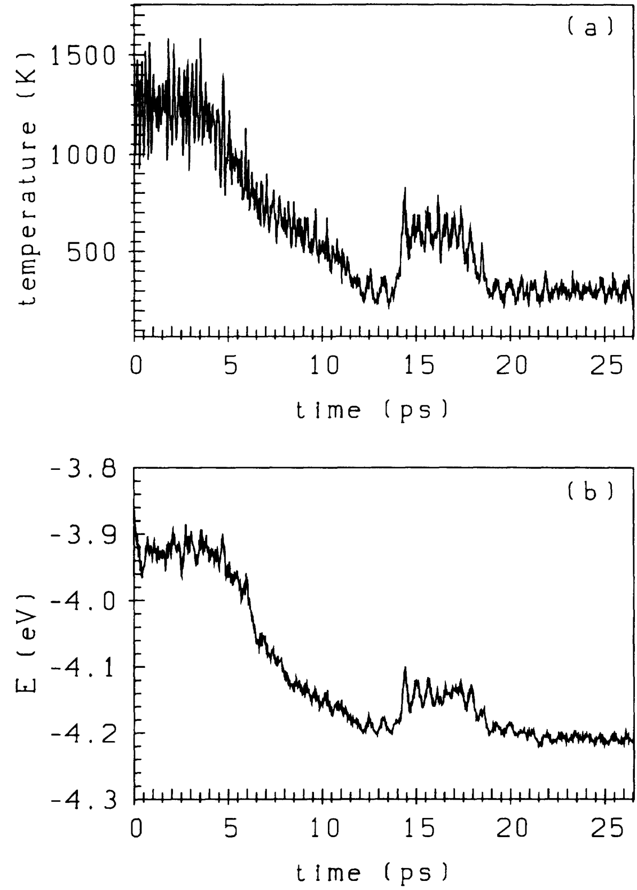
*   **来源**：[[../papers/kresseInitiomoleculardynamicsSimulationLiquidmetalamorphoussemiconductor1994]]
*   **图示描述**：(a) 瞬时离子温度 T(t) 与 (b) 势能 E(t) 随模拟时间记录的完整热历史：1250 K 液相平衡 4.5 ps → 三段淬火至 300 K → 升温到 600 K 退火 3 ps → 再淬火至 300 K。
*   **关键特征**：64 原子、密度 0.04385 Å⁻³；最快淬火速率 1.67×10¹⁴ K/s，750→450 K 段放慢至 0.67×10¹⁴ K/s（结构剧变区）；总热处理 15 ps，退火后再做 7.5 ps 生产运行；势能在每次降温台阶单调下降并在恒温段进入平衡涨落。

### 36. PAW 线性变换：从赝波函数恢复全电子波函数（Eq.2）

*   **来源**：[[../papers/kresseUltrasoftPseudopotentialsProjector1999c]]
*   **图示描述**：公式把平滑的赝波函数 |ψ̃ₙ⟩ 与全电子波函数 |ψₙ⟩ 通过原子参考态的全电子部分波 |φᵢ⟩、赝部分波 |φ̃ᵢ⟩ 及投影函数 ⟨p̃ᵢ| 联系起来，是 PAW 方法的基石；球外用赝波函数，球内用 (φᵢ−φ̃ᵢ) 叠加修正。
*   **关键特征**：(1) 变换是线性的，变分对象仍是平面波网格上的 ψ̃ₙ；(2) 指标 i 同时编码原子位点 R、角动量 (l,m) 和参考能量指标 k；(3) φᵢ 与 φ̃ᵢ 在核心半径 r_c 外完全相同，在 r_c 内连续匹配；(4) 投影函数满足对偶条件 ⟨p̃ᵢ|φ̃ⱼ⟩ = δᵢⱼ。

### 37. PAW 电荷密度分解 n = ñ + n¹ − ñ¹（Eq.3）

*   **来源**：[[../papers/kresseUltrasoftPseudopotentialsProjector1999c]]
*   **图示描述**：总电荷密度被拆成平面波网格上的平滑赝密度 ñ、各原子径向支持网格上的全电子 onsite 密度 n¹，以及球内重叠的赝密度 ñ¹ 三项；后者带负号避免重复计数。
*   **关键特征**：(1) ñ 直接由赝波函数在规则 FFT 网格上求出；(2) n¹ 与 ñ¹ 只在半径 r_rad 内的径向网格上计算，采用占据矩阵 ρᵢⱼ = Σₙ fₙ ⟨ψ̃ₙ|p̃ᵢ⟩⟨p̃ⱼ|ψ̃ₙ⟩；(3) 径向网格与平面波网格之间无交叉耦合项；(4) 当投影函数组完备时，增强球内 ñ¹ 与 ñ 严格相等。

### 38. PAW 总能量三项分解 E = Ẽ + E¹ − Ẽ¹（Eq.20）

*   **来源**：[[../papers/kresseUltrasoftPseudopotentialsProjector1999c]]
*   **图示描述**：总能量写成平面波网格项 Ẽ、原子球内全电子项 E¹、原子球内赝项 Ẽ¹ 三段的代数和，Ẽ 与常规赝势程序结构相同，E¹−Ẽ¹ 是把赝值校正成全电子值的补丁。
*   **关键特征**：(1) Hartree 能按 (ñ+n̂)、(ñ¹+n̂)、n¹ 拆成网格平滑项、球内赝项、球内全电子项；(2) 交换关联能采用 E_xc[ñ+n̂+ñ_c] + Ē_xc[n¹+n_c] − Ē_xc[ñ¹+n̂+ñ_c]，在网格项和球内赝项中显式加入部分核心电荷 ñ_c（[[../entities/molecular-beam-epitaxy|非线性核心修正]]）；(3) 核-核相互作用改用 Ewald 求和 U(R,Z_ion)；(4) 相对于 Blöchl 原始 PAW，这一改写更贴近赝势代码习惯并改善了 GGA 在核附近的数值稳定性。

### 39. US-PP 非局域势强度 G_ij^US（Eq.35），即 PAW 线性化产物

*   **来源**：[[../papers/kresseUltrasoftPseudopotentialsProjector1999c]]
*   **图示描述**：把 PAW 泛函中两个原子中心项 E¹、Ẽ¹ 在原子参考占据数 ρ^a_ij 附近作一阶泰勒展开，其导数合并给出 US-PP 的非局域赝势强度矩阵 G^US_ij；这是 US-PP 总能量泛函中唯一"新"出现的参数。
*   **关键特征**：(1) 展开在原子参考态（如 Fe 的 4s^1.5 3d^{n−1.5} 分数占据）附近进行，使体系偏离参考态最小时线性化误差最小；(2) G^US_ij 在赝势生成时一次性计算并固定，自洽循环中不再更新；(3) 当增强函数取全电子形式 Q̂_ij = φᵢ*φⱼ − φ̃ᵢ*φ̃ⱼ（Eq.36）时，US-PP 与冻结核心 PAW 严格等价；(4) 伪化增强电荷引入的高阶项在强磁性、强电荷转移体系中变得不可忽略。

### 40. PAW 数据集与 US-PP 参数：价态、截断半径、截断能（表II）

*   **来源**：[[../papers/kresseUltrasoftPseudopotentialsProjector1999c]]
*   **图示描述**：表中逐元素列出本文所用 PAW 与 US-PP 数据集的价电子配置、部分波截断半径 r_lc（a.u.）、US-PP 增强电荷截断半径 r_comp（a.u.）以及所需平面波截断能 E_cut（eV），覆盖 H–F、Li–Cl、Ca、3d 过渡金属 Fe/Co/Ni 等。
*   **关键特征**：(1) 第一行元素 C/N/O/F 的 r_lc 约 1.3–1.5 a.u.，对应 E_cut ≈ 400 eV，相对偏硬；(2) r_comp 仅出现在 US-PP 列，PAW 不需要伪化增强电荷；(3) Ca 提供两种价态处理（3p 入价 vs 3s3p 入价），用于检验半芯态效应；(4) K–Mn、Rb–Ru、Cs–Os 等元素若把 np 半芯态留作核心会出现[[../concepts/ghost-states|鬼态]]，必须作为价态处理。

### 41. 论文图2

*   **来源**：[[../papers/lezoualchStudyChargeDensity]]
*   **图示描述**：方法学章节的流程示意图，串联 DFT 基态计算、DFPT 声子谱/电声耦合、NEGF 电子输运以及 NEB 相变能垒等本论文使用的多尺度第一性原理计算框架。
*   **关键特征**：展示从 1×1 单胞的电子结构与声子谱出发，提取虚频软模的波矢 q 与本征矢，在超胞中按 Δu = Σ Re[U·exp(iq·R)] 叠加原子位移并弛豫得到 CDW 相，再用于 STM 模拟与输运计算的完整链条。

### 42. 图1 增强因子对比
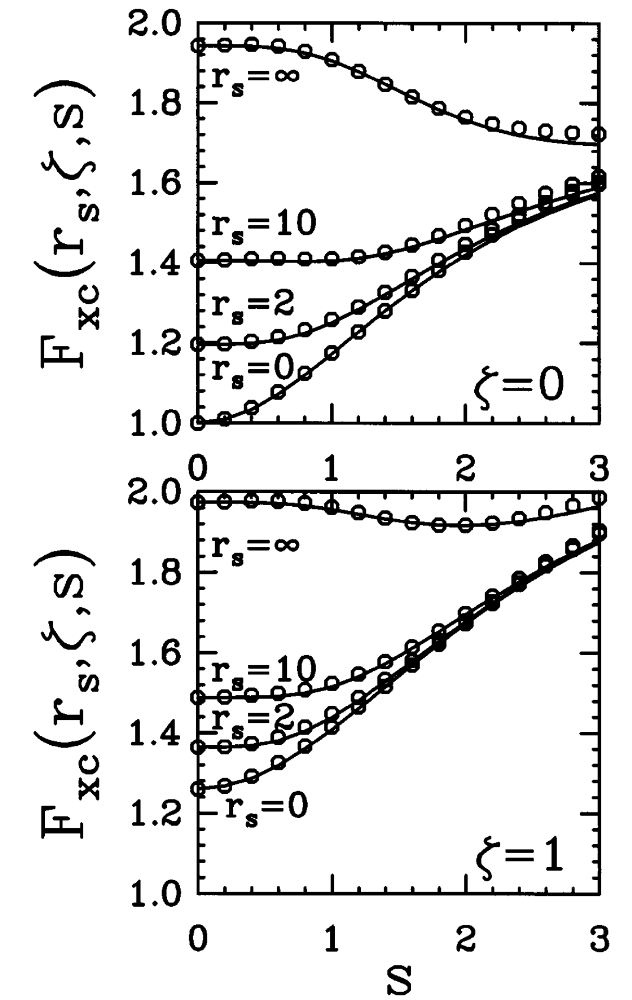
*   **来源**：[[../papers/perdewGeneralizedGradientApproximation1996a]]

### 43. 表I 原子化能
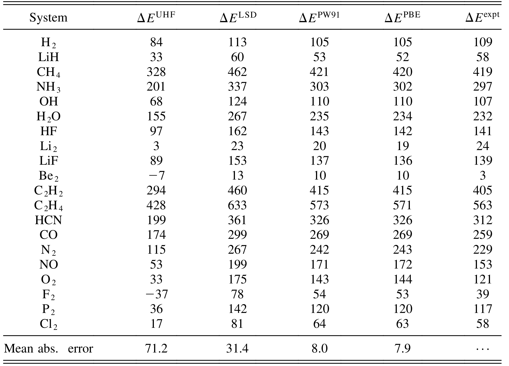
*   **来源**：[[../papers/perdewGeneralizedGradientApproximation1996a]]

### 44. Table 2 二维滑动铁电材料实验与理论清单
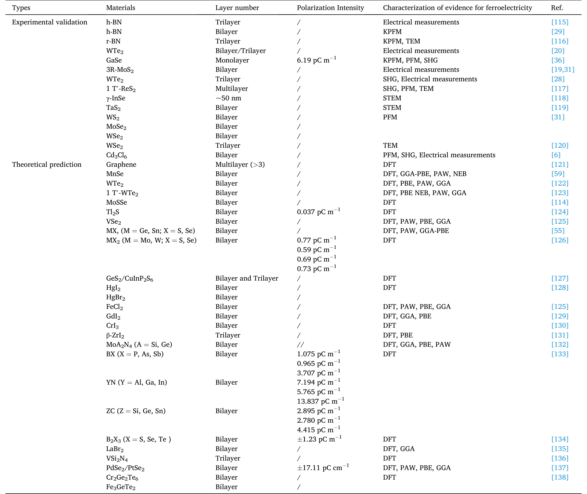
*   **来源**：[[../papers/sunSlidingFerroelectricityTwodimensional2025]]
*   **图示描述**：二维滑动铁电材料大表，分实验报道与理论预测两部分，列出 h-BN、r-BN、WTe₂、GaSe、3R-MoS₂、ReS₂、γ-InSe、TaS₂、WS₂、WSe₂、Cd₃Cl₆ 以及石墨烯、MnSe、MoSSe、Tl₂S、VSe₂、HgI₂、FeCl₂、GdI₂、CrI₃、β-ZrI₂、MoSi₂N₄、BX、YN、VSi₂N₄、PdSe₂/PtSe₂、Cr₂Ge₂Te₆、Fe₃GeTe₂ 等材料。
*   **关键特征**：极化基准包括 GaSe 约 6.19 pC/m、MX₂ 约 0.59–0.77 pC/m、BX 约 0.965–3.707 pC/m、YN 约 5.765–13.837 pC/m、PdSe₂/PtSe₂ 双层约 ±17.11 pC/cm、Tl₂S 约 0.037 pC/m、HgI₂ 约 0.16 μC/cm²；表中同时记录层数、表征证据（PFM/SHG/STEM/电学）和 DFT 泛函（PBE 等），是选材与对照的关键数据库。

### 45. 图1 在网法中被限制在网格点上的最陡上升路径与Bader体积分配

*   **来源**：[[../papers/tangGridbasedBaderAnalysis2009]]
*   **图示描述**：二维电荷密度网格上在网法（on-grid）的工作原理示意：(a) 从两个电荷密度极大值 m1、m2 之间的各网格点出发，沿水平、垂直或对角线方向（二维 8 个离散邻居）追踪最陡上升路径；(b) 所有路径终点汇聚到同一极大值的点集（绿色到 m1、蓝色到 m2）构成该原子的 Bader 体积，红色曲线为分割面。
*   **关键特征**：路径被严格限制在相邻网格点之间跳跃；一旦轨迹碰到已分配点即终止，路径上所有点归入同一 Bader 区域；每个点只需处理一次，因而算法 O(N) 线性标度；分割面在离散网格上呈现明显的网格状棱角。

### 46. 图5 水分子O–H之间Bader分割面：在网法棱角分明 vs 近网法平滑自然

*   **来源**：[[../papers/tangGridbasedBaderAnalysis2009]]
*   **图示描述**：H₂O 分子中氧原子 O 与两个氢原子 H 之间 Bader 分割面的三维形状对比，左为在网法、右为近网法；电荷密度由 Gaussian 98 在 aug-cc-pVDZ/MP2 水平下计算，并写到 257³ 正交网格上。
*   **关键特征**：在网法的 O–H 界面呈现明显的、由网格面构成的棱角和小面，是晶格偏差在真实分子上的直接体现；近网法界面平滑、圆润，符合化学直觉；右侧仍可见的轻微波纹来自有限网格分辨率而非算法偏差，可通过加密网格减小。

### 47. 图7 水分子旋转45°前后Bader体积形状：在网法取向依赖明显，近网法基本不变

*   **来源**：[[../papers/tangGridbasedBaderAnalysis2009]]
*   **图示描述**：H₂O 分子在电荷密度网格平面内旋转 45° 前后的 Bader 体积形状对比，左列为在网法、右列为近网法；电荷密度由 VASP 计算，截断能 250 eV、Γ 点采样。
*   **关键特征**：在网法下分子旋转前后 O、H 的 Bader 体积轮廓明显不同，分割面位置被网格方向带着走；近网法下旋转前后体积形状几乎重合，恢复了物理上应有的旋转不变性；该现象与图6 的系统偏差同源，都是晶格偏差在实空间上的表现。

### 48. 图8 氧原子Bader电荷随分子旋转角的变化：在网法波动约0.1 e，近网法近似水平

*   **来源**：[[../papers/tangGridbasedBaderAnalysis2009]]
*   **图示描述**：横轴为 H₂O 分子相对电荷密度网格的旋转角度（度），纵轴为氧原子 Bader 价电荷（e）；两条曲线分别对应在网法（On-grid）和近网法（Near-grid）。
*   **关键特征**：在网法不仅系统性低估 H→O 电荷转移，氧电荷还随旋转角出现约 0.1 e 的明显波动；近网法的氧电荷约为 −1.23 e，曲线基本为一条水平线，随角度变化极小；该定量结果与图7 的形状观察一致，把取向依赖从视觉现象变成可报告的数值误差。

### 49. 图3 实验-计算谱定量拟合：(a)超临界谱与0.35倍气相谱；(b)差谱=纯氢键组分；(c)DFT三构型加权拟合，90%来自四扭曲氢键构型；(d)均匀非键分布谱被排除

*   **来源**：[[../papers/wernetSpectroscopicCharacterizationMicroscopic2005]]
*   **图示描述**：四个子图共享能量转移（eV）横轴与归一化强度纵轴：(a) 超临界水谱（实线）与按 0.35 缩放的气相谱（虚线）；(b) 两者之差，即纯氢键组分谱；(c) (b) 与 DFT 计算的三种完全成键构型谱（冰状、单扭曲供体+受体、四扭曲氢键）加权和对比，插图展示不同缩放因子对 534 eV 差谱强度的影响以确定 0.35±0.2 误差；(d) O–O 距 3.9 Å 的均匀非成键分子计算谱。
*   **关键特征**：缩放因子 0.35±0.2 给出超临界水中具有两个自由 O–H（不做供体氢键）的类气相分子比例，剩余约 65% 为成键组分；差谱在 535 eV 无峰、542 eV 以上仍有显著权重，与液态水谱明显不同；DFT 最佳拟合中四扭曲氢键构型贡献约 90% 信号，单扭曲供体构型与冰状构型各仅约 5%，成键构型 O–O 距 2.65–3.3 Å、O–H···O 角 150°–180°；(d) 的均匀非成键谱在 537 eV 以上无强度，与实验矛盾，被明确排除，二聚体/三聚体/链状等中间构型总量被限制在几个百分点。

### 50. 公式 机器学习势总能量表达式 Etot=ΣEi=ΣΣαm K(Vi,Vt)
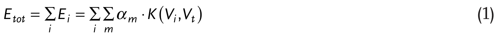
*   **来源**：[[../papers/yangRipplingFerroicPhase2021]]
*   **图示描述**：基于 Botu-Ramprasad 框架、核岭回归（KRR）构建的 ML 势总能量公式，系统总能量 Etot 为各原子能量 Ei 之和，每个 Ei 由权重系数 αm 与原子环境特征 Vi 和参考数据集 Vt 之间的核函数 K(Vi,Vt) 线性叠加得到。
*   **关键特征**：以 11893 个 DFT 构型（VASP, PBE-GGA, 300 eV cutoff, 3×3×1 k 网格）训练，使用 121 个特征（指数衰减余弦键函数 + 高斯平滑径向分布）；ML 势重现晶格常数、弹性常数、声子谱、相变温度与相变势垒；超胞 40a×40b（a=3.986 Å, b=4.246 Å），LAMMPS 模拟，使万原子、纳秒级波纹-铁性耦合动力学成为可能。

### 51. 图9
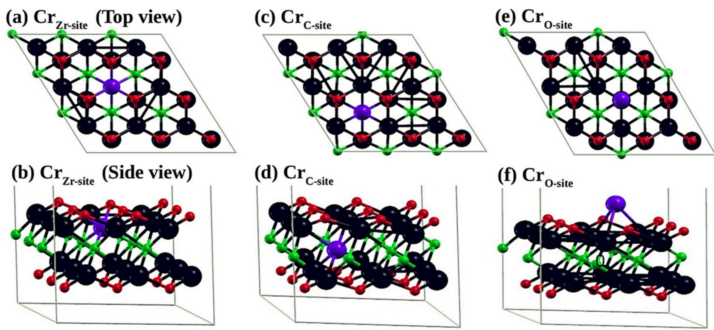
*   **来源**：[[../papers/zahraCriticalAnalysisFerroelectric2025]]
*   **图示描述**：DFT 建模给出 Cr 等过渡金属在 Zr2CO2 单层中的三种替位构型：(a) Zr 位替代、(c) C 位替代、(e) O 位替代，以及各自优化后的局域结构。
*   **关键特征**：比较三类位点的形成能可判断热力学最易实现的掺杂方式；结论是 Cr 替 Zr 位形成能最低、具铁磁基态与半金属性；该图是"计算筛选掺杂位点"策略的范例。

### 52. 图16

*   **来源**：[[../papers/zahraCriticalAnalysisFerroelectric2025]]
*   **图示描述**：以 Mo2Ti2C3Tx MXene 为中间活性层、激光还原石墨烯为上下电极的三层铁电忆阻器结构，及其 I-V 开关曲线、电阻开关耐久性。
*   **关键特征**：存储窗口 R_off/R_on≈10²，循环耐久性达 10³ 次；MXene 铁电性使导电细丝形成可控；对比 Cu/PZT 体系，MXene 显著降低 Cu 离子迁移势垒（PZT 中约 4.43 eV）。

### 53. 图17
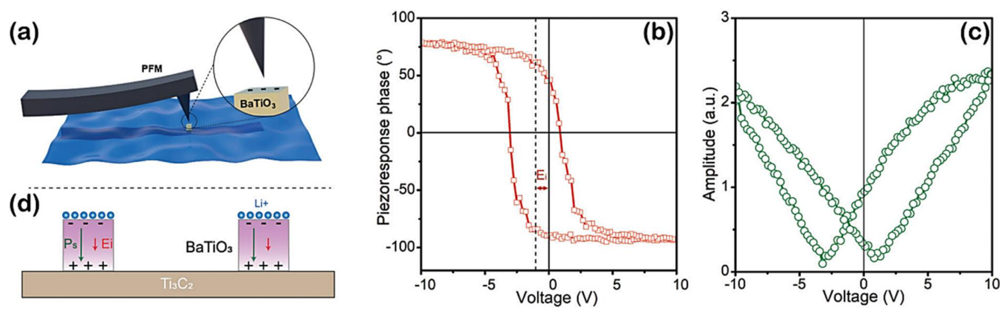
*   **来源**：[[../papers/zahraCriticalAnalysisFerroelectric2025]]
*   **图示描述**：(a) MXene 用于锂离子电池示意；(b,c) BT/f-Ti3C2Tx 复合物的循环稳定性与倍率性能；(d) BTO 纳米颗粒极化内建电场吸引 Li+ 至 MXene 负极的机理示意。
*   **关键特征**：10 A g⁻¹ 下比容量达 84 mAh g⁻¹，约为本征 Ti3C2Tx 的 5 倍；BTO 同时抑制 MXene 片层堆叠与 Ti 原子还原；铁电极化内建电场加速 Li+ 传输并促进均匀 SEI 膜。

### 54. 图18
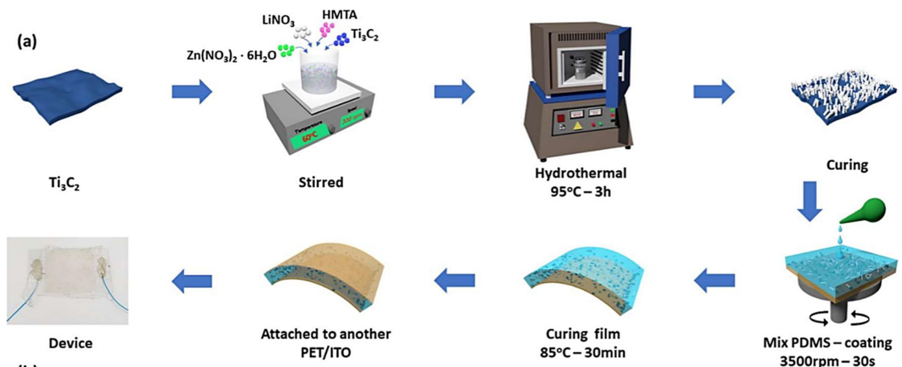
*   **来源**：[[../papers/zahraCriticalAnalysisFerroelectric2025]]
*   **图示描述**：Li 掺杂 ZnO 纳米线与 Ti3C2 MXene 复合的 PENG 器件分层结构，以及其输出电压/电流相对于纯 Li:ZnO PENG 的对比。
*   **关键特征**：MXene 在极化过程中协助 Li:ZnO 纳米线有效极化；纳米线包覆阻止金属 Ti3C2 薄片聚集，提高电场均匀性；铁电性与输出功率整体提升约 2 倍。

### 55. 表3：相应条件下Λ_U的95% C.L.下限（GeV），κ=λ_S=1
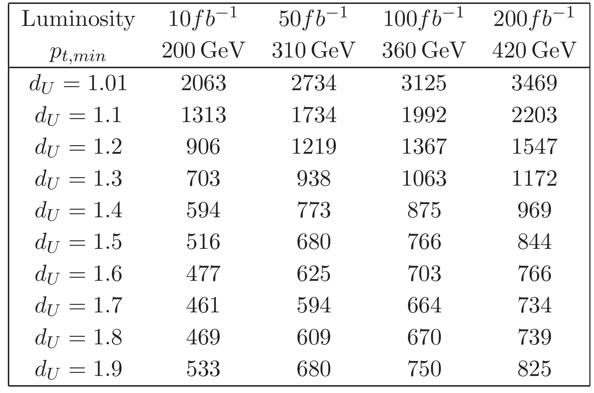
*   **来源**：[[../papers/Şahin2009probe]]
*   **图示描述**：与表1相同亮度-p_t,min 组合下，把 κλ_S 固定为 1 时反推出的 Λ_U 95% C.L. 下限（GeV）。
*   **关键特征**：d_U=1.01 时 Λ_U 下限从 10 fb⁻¹ 的 2109 GeV 提升到 200 fb⁻¹ 的 4063 GeV；d_U=1.1 在 200 fb⁻¹ 为 2625 GeV；d_U=1.5 为 1063 GeV；d_U=1.9 因 sin²(d_Uπ) 周期性反而比 d_U=1.8 更高（1141 GeV vs 1000 GeV）。该表是双轻子道与双光子道图17做能标 reach 对比的基准。
