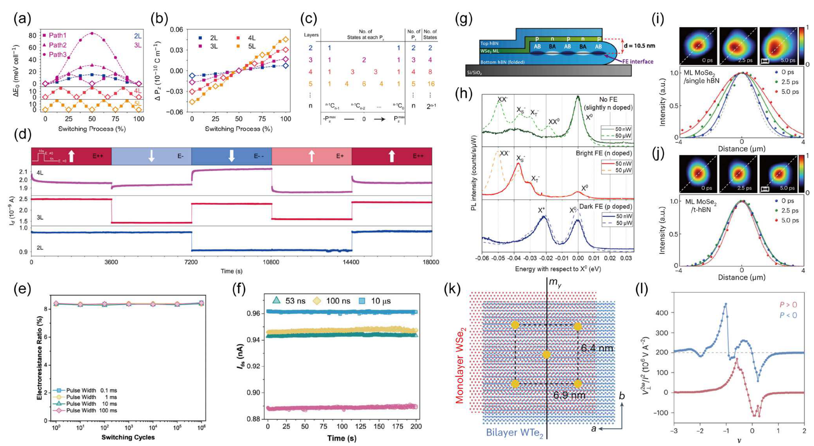
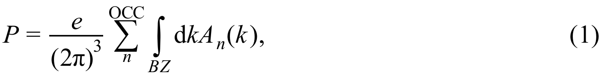

*   **来源**：[[../papers/fengFerroelectricityMultiferroicityTwodimensio
*   **来源**：[[../papers/fen
*   **来源**：[[../papers/junqueraCriticalThicknessFerroelectricity2003]]

*   **关键特征**：这是一张核心结果图。横轴是软模畸变 y的幅度（以体相BaTiO
*   **来源**：[[../papers/liMonolayerPuckeredPentagonal2022]]

*   **关键特征**：横轴为NEB计算的反应路径坐标，纵轴为“Energy (eV/atom)”。从IS到MS再到FS，
*   **来源**：[[../papers/fiebigEvolutionMultiferroics2016]]

*   **关键特征**
*   **来源**：[[../papers/Goswami2011multiferroic]]

*   **关键特征**：(a) 差示扫描量热（DSC）曲线：对比了块材（黑色）和纳米颗粒（红色）在TN附近的DSC迹线。块材有一个尖锐的吸热峰，
*   **来源**：[[../papers/huangPolarPhaseDomain2019]]

*   **关键特征**：选区电子衍射斑点沿c轴分裂
*   **来源**：[[../papers/huangPolarPhaseDomain2019]]

*   **关键特征**：在平面视图中，暗场像的黑白衬度反映了Td相中极化方向不
*   **来源**：[[../papers/xuTwodimensionalFerroelasticityVan2021]]

*   **
*   **来源**：[[../papers/hanPolarTopologicalMaterials2025]]

*   **关键特征**：_图1a是一个时间线流程图_，展示了从2003
*   **来源**：[[../papers/hanPolarTopologicalMaterials2025]]

*   **来源**：[[../papers/
*   **来源**：[[../papers/lvUnconventionalHystereticTransition2022]]

*   **关键特征**：Eu L₃边的X射线吸收近边结构谱y表示）。明了外电场方向。**：[[../papers/fen
*   **来源**：[[../papers/junqueraCriticalThicknessFerroelectricity2003]]

*   **关键特征**：这是一张核心结果图。横轴是软模畸变 y的幅度（以体相BaTiO
*   **来源**：[[../papers/liMonolayerPuckeredPentagonal2022]]

*   **关键特征**：横轴为NEB计算的反应路径坐标，纵轴为“Energy (eV/atom)”。从IS到MS再到FS，
*   **来源**：[[../papers/fiebigEvolutionMultiferroics2016]]

*   **关键特征**
*   **来源**：[[../papers/Goswami2011multiferroic]]

*   **关键特征**：(a) 差示扫描量热（DSC）曲线：对比了块材（黑色）和纳米颗粒（红色）在TN附近的DSC迹线。块材有一个尖锐的吸热峰，
*   **来源**：[[../papers/huangPolarPhaseDomain2019]]

*   **关键特征**：选区电子衍射斑点沿c轴分裂
*   **来源**：[[../papers/huangPolarPhaseDomain2019]]

*   **关键特征**：在平面视图中，暗场像的黑白衬度反映了Td相中极化方向不
*   **来源**：[[../papers/xuTwodimensionalFerroelasticityVan2021]]

*   **
*   **来源**：[[../papers/hanPolarTopologicalMaterials2025]]

*   **关键特征**：_图1a是一个时间线流程图_，展示了从2003
*   **来源**：[[../papers/hanPolarTopologicalMaterials2025]]

*   **来源**：[[../papers/
*   **来源**：[[../papers/lvUnconventionalHystereticTransition2022]]

*   **关键特征**：Eu L₃边的X射线吸收近边结构谱y表示）。明了外电场方向。 电子结构方法（USPP/PAW、迭代对角化、Berry 相极化）、非线性光学与激光微加工、铁电/多铁器件基准、CDW 声子模、磁输运模型、以及相稳定性与弹性力学的解析判据。所有条目均直接取自原刊公式或数据表，剔除了 Zotero 元数据与 AI 转写噪声。

[[科研Wiki/wiki/figures/_index|← 返回总索引]]

---

## ⚛️ 铁电与多铁性模型 I：基础理论与二维铁电 (FE/MF I: Foundations & 2D FE)

[[mathematical-models|← 返回数学模型与物理公式]]

### 1. CINEB 最小能量路径：FE-PE-FE 翻转（a,b）与 FE-AFE 相变（c,d）
CINEB 最小能量路径：FE-PE-FE 翻转（a,b）与 FE-AFE 相变（c,d），势垒 0.34/0.31 eV 与 0.13/0.12 eV

*   **来源**：[[../papers/fengFerroelectricityMultiferroicityTwodimensional2020]]

### 2. 外电场方向 (a) 与四态（FE-AFM/FE-FM/AFE-AFM/AFE-FM）能量随
外电场方向 (a) 与四态（FE-AFM/FE-FM/AFE-AFM/AFE-FM）能量随电场变化，0.82 V/Å 处发生 FE-AFM ↔ AFE-FM 切换

*   **来源**：[[../papers/fengFerroelectricityMultiferroicityTwodimensional2020]]

### 3. 公式：Eform = (E_Sc2P2Se6 − 2μSc − 2μP − 6μSe)/n
Eform = (E_Sc2P2Se6 − 2μSc − 2μP − 6μSe)/n

*   **来源**：[[../papers/fengFerroelectricityMultiferroicityTwodimensional2020]]

### 4. 公式：Eform = (E_ScCrP2Se6 − μSc − μCr − 2μP − 6
Eform = (E_ScCrP2Se6 − μSc − μCr − 2μP − 6μSe)/n

*   **来源**：[[../papers/fengFerroelectricityMultiferroicityTwodimensional2020]]

### 5. 数据表（见原始图注）
出自「Ferroelectricity and multiferroicity in two-dimensional Sc                     2                     P                     2                     Se                     6                     and ScCrP                     2                     Se                     6                     monolayers」的表格

*   **来源**：[[../papers/fengFerroelectricityMultiferroicityTwodimensional2020]]

### 6. 数据表（见原始图注）
出自「Ferroelectricity and multiferroicity in two-dimensional Sc                     2                     P                     2                     Se                     6                     and ScCrP                     2                     Se                     6                     monolayers」的表格

*   **来源**：[[../papers/fengFerroelectricityMultiferroicityTwodimensional2020]]

### 7. 非易失存储与光电异质结（3R-MoS₂多态/MEP能垒/疲劳特性/53 ns脉冲/铁电BN
非易失存储与光电异质结（3R-MoS₂多态/MEP能垒/疲劳特性/53 ns脉冲/铁电BN-WSe₂激子调控/PL谱/泵浦探测激子限域/WSe₂-WTe₂非线性反常霍尔）

*   **来源**：[[../papers/guoAdvancesTwodimensionalFerroelectric2025]]

### 8. 公式：(1)：Berry phase 极化强度 P = (e/(2π)³) Σ_n^occ
(1)：Berry phase 极化强度 P = (e/(2π)³) Σ_n^occ ∫_BZ dk A_n(k)

*   **来源**：[[../papers/guoAdvancesTwodimensionalFerroelectric2025]]

### 9. 公式：(2)：层间差分电荷密度 Δρ_interlayer(r) = ρ_total(r)
(2)：层间差分电荷密度 Δρ_interlayer(r) = ρ_total(r) − Σ_i ρ_isolated^i(r)

*   **来源**：[[../papers/guoAdvancesTwodimensionalFerroelectric2025]]

### 10. B位阳离子双势阱势能
B位阳离子双势阱势能

*   **来源**：[[../papers/hillWhyAreThere2000a]]

### 11. 不稳定铁电声子模式本征矢
不稳定铁电声子模式本征矢

*   **来源**：[[../papers/hillWhyAreThere2000a]]

### 12. 不同 BaTiO3 厚度 m=2–10 下能量随软模畸变 y 的变化：m≤4 顺电稳定，m
不同 BaTiO3 厚度 m=2–10 下能量随软模畸变 y 的变化：m≤4 顺电稳定，m≥6 出现双阱铁电相；插图为 P_s 随 m 的恢复

*   **来源**：[[../papers/junqueraCriticalThicknessFerroelectricity2003]]

### 13. 极化反转动力学路径：(a)中心Se直接位移能垒0.85 eV；(b)三步协同运动路径能垒仅
极化反转动力学路径：(a)中心Se直接位移能垒0.85 eV；(b)三步协同运动路径能垒仅0.066 eV

*   **来源**：[[../papers/dingPredictionIntrinsicTwodimensional2017a]]

### 14. 畴壁运动动力学路径：低能畴壁构型形成能 0.22 eV/单胞，移动能垒 0.40/0.28
畴壁运动动力学路径：低能畴壁构型形成能 0.22 eV/单胞，移动能垒 0.40/0.28 eV per unit cell，远低于直接位移的0.85 eV

*   **来源**：[[../papers/dingPredictionIntrinsicTwodimensional2017a]]

### 15. In2Se3基异质结电子结构：(a)单层In2Se3间接带隙1.46 eV(HSE06)；
In2Se3基异质结电子结构：(a)单层In2Se3间接带隙1.46 eV(HSE06)；(b-e)In2Se3/石墨烯中肖特基势垒随极化翻转可调；(f-i)In2Se3/WSe2中极化翻转导致显著带隙减小

*   **来源**：[[../papers/dingPredictionIntrinsicTwodimensional2017a]]

### 16. 铁弹翻转IS-MS-FS路径及NEB能垒(258 meV/atom)，易磁化轴随之旋转90
铁弹翻转IS-MS-FS路径及NEB能垒(258 meV/atom)，易磁化轴随之旋转90°

*   **来源**：[[../papers/liMonolayerPuckeredPentagonal2022]]

### 17. 公式：(1) 准二维海森堡模型哈密顿量 H=-J0Σ⟨i,j⟩Si·Sj - λΣSi²
(1) 准二维海森堡模型哈密顿量 H=-J0Σ⟨i,j⟩Si·Sj - λΣSi²

*   **来源**：[[../papers/liMonolayerPuckeredPentagonal2022]]

### 18. 回旋自旋结构中的电磁振子：不同自旋激发模式对应不同极化振荡
回旋自旋结构中的电磁振子：不同自旋激发模式对应不同极化振荡

*   **来源**：[[../papers/fiebigEvolutionMultiferroics2016]]

### 19. (a) DSC、(b) 晶格参数 a/c、(c) 体积、(d) 离子位移 δ、(e) 极化
(a) DSC、(b) 晶格参数 a/c、(c) 体积、(d) 离子位移 δ、(e) 极化 P 随温度变化

*   **来源**：[[../papers/Goswami2011multiferroic]]

### 20. 截面DF-TEM与HAADF-STEM：室温1T′孪晶壁含Td单元，80 K下Td/1T′
截面DF-TEM与HAADF-STEM：室温1T′孪晶壁含Td单元，80 K下Td/1T′类超晶格相畴壁

*   **来源**：[[../papers/huangPolarPhaseDomain2019]]

### 21. 平面DF-TEM中Td极性畴、电子束操控畴壁、DFT势能面与低能垒翻转路径、群-子群关系
平面DF-TEM中Td极性畴、电子束操控畴壁、DFT势能面与低能垒翻转路径、群-子群关系

*   **来源**：[[../papers/huangPolarPhaseDomain2019]]

### 22. 公式：A畴二维自发应变张量 εxx=+0.0049, εyy=-0.0049
A畴二维自发应变张量 εxx=+0.0049, εyy=-0.0049

*   **来源**：[[../papers/xuTwodimensionalFerroelasticityVan2021]]

### 23. 公式：120°旋转矩阵J±
120°旋转矩阵J±

*   **来源**：[[../papers/xuTwodimensionalFerroelasticityVan2021]]

### 24. 公式：B畴自发应变张量
B畴自发应变张量

*   **来源**：[[../papers/xuTwodimensionalFerroelasticityVan2021]]

### 25. 公式：C畴自发应变张量
C畴自发应变张量

*   **来源**：[[../papers/xuTwodimensionalFerroelasticityVan2021]]

### 26. ≤0.5%外应变驱动的铁弹畴切换序列及A畴面积分数-应变曲线
≤0.5%外应变驱动的铁弹畴切换序列及A畴面积分数-应变曲线

*   **来源**：[[../papers/xuTwodimensionalFerroelasticityVan2021]]

### 27. 公式：3R相A变体三维应变张量（含εxz=-0.0126）
3R相A变体三维应变张量（含εxz=-0.0126）

*   **来源**：[[../papers/xuTwodimensionalFerroelasticityVan2021]]

### 28. 公式：3R相B变体三维应变张量
3R相B变体三维应变张量

*   **来源**：[[../papers/xuTwodimensionalFerroelasticityVan2021]]

### 29. 公式：3R相C变体三维应变张量
3R相C变体三维应变张量

*   **来源**：[[../papers/xuTwodimensionalFerroelasticityVan2021]]

### 30. 表：各体系电偶极矩、二维/三维极化、真空能级差与反转势垒汇总
各体系电偶极矩、二维/三维极化、真空能级差与反转势垒汇总

*   **来源**：[[../papers/aiFerroelectricityCoexistedPorbital2022]]

### 31. 极性拓扑发展里程碑与早期理论预测：时间线、降维策略、PZT薄膜厚度依赖的通量闭合畴、PZT
极性拓扑发展里程碑与早期理论预测：时间线、降维策略、PZT薄膜厚度依赖的通量闭合畴、PZT纳米棒/BTO纳米点中的涡旋预言

*   **来源**：[[../papers/hanPolarTopologicalMaterials2025]]

### 32. 典型铁电材料各向异性：四方/菱方相极化变体、有机分子取向、Bloch型畴壁、各向异性对La
典型铁电材料各向异性：四方/菱方相极化变体、有机分子取向、Bloch型畴壁、各向异性对Landau能势垒的平坦化

*   **来源**：[[../papers/hanPolarTopologicalMaterials2025]]

### 33. THz场下极性涡旋集体动力学：CW/CCW涡旋对弹簧球链模型；004超晶格峰与δ04卫星峰
THz场下极性涡旋集体动力学：CW/CCW涡旋对弹簧球链模型；004超晶格峰与δ04卫星峰傅里叶谱中的可调涡旋子模式；涡旋子振荡周期内的手性动态反转

*   **来源**：[[../papers/hanPolarTopologicalMaterials2025]]

### 34. CDW能隙Eg和一级衍射峰积分强度I_CDW的滞回行为，证明滞回源于序参量振幅变化
CDW能隙Eg和一级衍射峰积分强度I_CDW的滞回行为，证明滞回源于序参量振幅变化

*   **来源**：[[../papers/lvUnconventionalHystereticTransition2022]]

### 35. 候选机制排除：XANES排除价态转变、老化实验估算势垒>1 eV、RTe3/EuTe4结构
候选机制排除：XANES排除价态转变、老化实验估算势垒>1 eV、RTe3/EuTe4结构对比、层间相位切换模型

*   **来源**：[[../papers/lvUnconventionalHystereticTransition2022]]

### 36. 表：不同滑移操作下双层FGT的相对能量
不同滑移操作下双层FGT的相对能量

*   **来源**：[[../papers/miaoMagneticFerroelectricMetal2024]]

### 37. 单轴应变调控能量、极化与势垒
单轴应变调控能量、极化与势垒

*   **来源**：[[../papers/gaoStrainEngineeringFerroelectric2024]]

### 38. 公式：转变应变张量定义
转变应变张量定义

*   **来源**：[[../papers/gaoStrainEngineeringFerroelectric2024]]

### 39. 公式：2D应变矩阵形式
2D应变矩阵形式

*   **来源**：[[../papers/gaoStrainEngineeringFerroelectric2024]]

### 40. 公式：η21转变应变张量
η21转变应变张量

*   **来源**：[[../papers/gaoStrainEngineeringFerroelectric2024]]

### 41. 公式：η31转变应变张量
η31转变应变张量

*   **来源**：[[../papers/gaoStrainEngineeringFerroelectric2024]]

### 42. 表：HgX₂体相与双层关键参数：结合能、极化、Hg位移、FE-PE能垒
HgX₂体相与双层关键参数：结合能、极化、Hg位移、FE-PE能垒

*   **来源**：[[../papers/chenStrongSlidingFerroelectricity2024]]

### 43. 表：19 种非磁铁电体带隙、极化与翻转势垒
19 种非磁铁电体带隙、极化与翻转势垒

*   **来源**：[[../papers/zhaoRealization2DMultiferroic2024]]

### 44. 表：21 种多铁体磁基态、T_C/T_N、MAE、极化与势垒
21 种多铁体磁基态、T_C/T_N、MAE、极化与势垒

*   **来源**：[[../papers/zhaoRealization2DMultiferroic2024]]

---

## 🔗 相关概念与实体 (Related Concepts & Entities)

**核心概念**：[[../concepts/density-functional-theory|密度泛函理论 (DFT)]]、[[../concepts/paw-method|投影增强波法 (PAW/USPP)]]、[[../concepts/berry-phase|Berry 相与现代极化理论]]、[[../concepts/born-effective-charge|Born 有效电荷]]、[[../concepts/ferroelectricity|铁电性]]、[[../concepts/multiferroicity|多铁性]]、[[../concepts/charge-density-wave|电荷密度波 (CDW)]]、[[../concepts/flexoelectric-effect|挠曲电效应]]、[[../concepts/peierls-distortion|Peierls 畸变]]、[[../concepts/superconducting-dome|超导穹顶]]

**相关材料/实体**：[[../entities/h-BN|h-BN]]、[[../entities/graphene|石墨烯]]、[[../entities/TMDs|过渡金属二硫化物 (TMDs)]]、[[../entities/NbSe2|2H-NbSe₂]]、[[../entities/BiFeO3|BiFeO₃]]、[[../entities/HZO|HfZrO (HZO)]]、[[../entities/In2Se3|In₂Se₃]]、[[../entities/BaTiO3|BaTiO₃]]、[[../entities/WTe2|WTe₂]]

