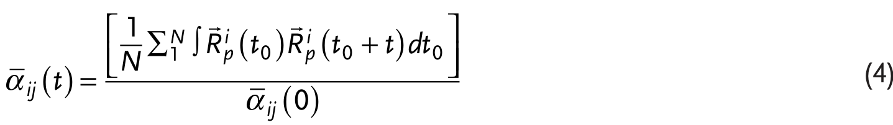

*   **来源**：[[../papers/gomez-ortizKittelLawDomain2023]]

*   **关键特征**：虚线表示中心对称参考相的能量。在q_min ≈ 0.
*   **来源**：[[../papers/martinThinfilmFerroelectricMaterials2016]]

*   **关键特征**：压电力显微镜（左、中）和导电原子力显微镜（右）图像对比，直接证明了BiFeO₃中109°畴壁具有电子导电性，而畴内是绝缘的。特征**：虚线表示中心对称参考相的能量。在q_min ≈ 0.
*   **来源**：[[../papers/martinThinfilmFerroelectricMaterials2016]]

*   **关键特征**：压电力显微镜（左、中）和导电原子力显微镜（右）图像对比，直接证明了BiFeO₃中109°畴壁具有电子导电性，而畴内是绝缘的。式与数据表格，涵盖 DFT 电子结构方法（USPP/PAW、迭代对角化、Berry 相极化）、非线性光学与激光微加工、铁电/多铁器件基准、CDW 声子模、磁输运模型、以及相稳定性与弹性力学的解析判据。所有条目均直接取自原刊公式或数据表，剔除了 Zotero 元数据与 AI 转写噪声。

[[科研Wiki/wiki/figures/_index|← 返回总索引]]

---

## ⚛️ 铁电与多铁性模型 II：畴律、多铁原理与综述 (FE/MF II: Kittel, MF Principles, Reviews)

[[mathematical-models|← 返回数学模型与物理公式]]

### 1. 公式：(1)：包含 FE-AFD、磁偶极、磁交换、软模/AFD/应变-磁交换耦合、双二次耦
(1)：包含 FE-AFD、磁偶极、磁交换、软模/AFD/应变-磁交换耦合、双二次耦合及 Dzyaloshinskii-Moriya 型项的有效哈密顿量

*   **来源**：[[../papers/prosandeevKittelLawInBiFeO3Ultrathin2010]]

### 2. 公式：(2)：Kittel 唯象能量密度 e_tot=e0+A/w+Cw
(2)：Kittel 唯象能量密度 e_tot=e0+A/w+Cw

*   **来源**：[[../papers/prosandeevKittelLawInBiFeO3Ultrathin2010]]

### 3. 力常数谱分析
力常数谱分析

*   **来源**：[[../papers/gomez-ortizKittelLawDomain2023]]

### 4. 公式：Lifshitz 不变量耦合 f_me = g_ij E_i M_i ∂_j M_j
Lifshitz 不变量耦合 f_me = g_ij E_i M_i ∂_j M_j（逆 DM 唯象项）

*   **来源**：[[../papers/mostovoyMultiferroicsDifferentRoutes2024]]

### 5. 公式：螺旋诱导极化 P ∝ q × e_3
螺旋诱导极化 P ∝ q × e_3

*   **来源**：[[../papers/mostovoyMultiferroicsDifferentRoutes2024]]

### 6. 公式：自旋哈密顿量 H = Σ J S_i S_j + Σ K S_i S_i - μ_B
自旋哈密顿量 H = Σ J S_i S_j + Σ K S_i S_i - μ_B Σ g S_i H

*   **来源**：[[../papers/mostovoyMultiferroicsDifferentRoutes2024]]

### 7. 公式：磁致极化统一公式 P = -(1/V)⟨∂H/∂E⟩
磁致极化统一公式 P = -(1/V)⟨∂H/∂E⟩

*   **来源**：[[../papers/mostovoyMultiferroicsDifferentRoutes2024]]

### 8. 公式：Onsager 倒易 α^em_ij(ω,L,H)=α^me_ji(ω,-L,H)
Onsager 倒易 α^em_ij(ω,L,H)=α^me_ji(ω,-L,H)

*   **来源**：[[../papers/mostovoyMultiferroicsDifferentRoutes2024]]

### 9. 公式：Rashba 哈密顿量 H_R = α_R(σ×k)·ẑ
Rashba 哈密顿量 H_R = α_R(σ×k)·ẑ

*   **来源**：[[../papers/bhowalPolarMetalsPrinciples2023b]]

### 10. 公式：贝里曲率偶极子 D_bd 定义
贝里曲率偶极子 D_bd 定义

*   **来源**：[[../papers/bhowalPolarMetalsPrinciples2023b]]

### 11. 公式：动磁电效应磁化 M_j 表达式
动磁电效应磁化 M_j 表达式

*   **来源**：[[../papers/bhowalPolarMetalsPrinciples2023b]]

### 12. 公式：(1)-(4) SOC有效哈密顿量与谷劈裂解析表达式
(1)-(4) SOC有效哈密顿量与谷劈裂解析表达式

*   **来源**：[[../papers/xunCoexistingMagnetismFerroelectric2024]]

### 13. 公式：滑动双层在垂直电场下的哈密顿量
滑动双层在垂直电场下的哈密顿量

*   **来源**：[[../papers/sunSlidingFerroelectricityTwodimensional2025]]

### 14. 器件应用：BiFeO3中109°畴壁的c-AFM导电证据；负电容双阱势能与C=d²U/dQ
器件应用：BiFeO3中109°畴壁的c-AFM导电证据；负电容双阱势能与C=d²U/dQ²<0示意；DFT计算LiNbO3上石墨烯n/p型掺杂；拉曼G峰空间成像显示载流子调制

*   **来源**：[[../papers/martinThinfilmFerroelectricMaterials2016]]

### 15. 公式：机器学习势总能量表达式 Etot=ΣEi=ΣΣαm K(Vi,Vt)
机器学习势总能量表达式 Etot=ΣEi=ΣΣαm K(Vi,Vt)

*   **来源**：[[../papers/yangRipplingFerroicPhase2021]]

### 16. 公式：波纹热涨落 Gao-Huang 模型 <h²>≈16 kB T S0/(π² δ)
波纹热涨落 Gao-Huang 模型 <h²>≈16 kB T S0/(π² δ)

*   **来源**：[[../papers/yangRipplingFerroicPhase2021]]

---

## 🔗 相关概念与实体 (Related Concepts & Entities)

**核心概念**：[[../concepts/density-functional-theory|密度泛函理论 (DFT)]]、[[../concepts/paw-method|投影增强波法 (PAW/USPP)]]、[[../concepts/berry-phase|Berry 相与现代极化理论]]、[[../concepts/born-effective-charge|Born 有效电荷]]、[[../concepts/ferroelectricity|铁电性]]、[[../concepts/multiferroicity|多铁性]]、[[../concepts/charge-density-wave|电荷密度波 (CDW)]]、[[../concepts/flexoelectric-effect|挠曲电效应]]、[[../concepts/peierls-distortion|Peierls 畸变]]、[[../concepts/superconducting-dome|超导穹顶]]

**相关材料/实体**：[[../entities/h-BN|h-BN]]、[[../entities/graphene|石墨烯]]、[[../entities/TMDs|过渡金属二硫化物 (TMDs)]]、[[../entities/NbSe2|2H-NbSe₂]]、[[../entities/BiFeO3|BiFeO₃]]、[[../entities/HZO|HfZrO (HZO)]]、[[../entities/In2Se3|In₂Se₃]]、[[../entities/BaTiO3|BaTiO₃]]、[[../entities/WTe2|WTe₂]]

