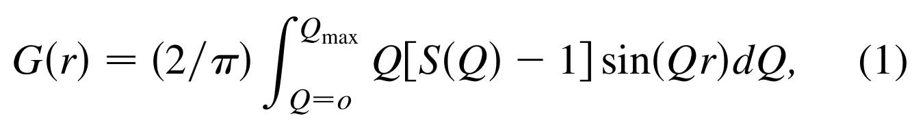

---
tags:
  - type/figure-collection
---

# 理论模型与计算方法：光学、输运与其他解析公式

> 属于 [[mathematical-models|理论模型与计算方法]]

## 条目

### 1. 公式3 倏逝场 Ez=E0·exp(−z/dp)

*   **来源**：[[../papers/2019optical]]
*   **图示描述**：倏逝波电场沿垂直纤芯—包层界面方向的衰减公式 Ez=E0·exp(−z/dp)，z 为距界面距离，E0 为界面处初始场强，dp 为穿透深度。
*   **关键特征**：电场在包层中按指数规律衰减，而非突然截止；dp 越大，倏逝场延伸到包层越远，与外界环境（吸湿后的 TiO2-SiO2 涂层）相互作用越强，导波光损耗越大；湿度通过改变涂层折射率来调制 dp，从而调制到达探测器的光强。

### 2. 公式4 穿透深度 dp=λ/(2nπ√(sin²θ−n²))

*   **来源**：[[../papers/2019optical]]
*   **图示描述**：倏逝波穿透深度公式 dp=λ/(2nπ√(sin²θ−n²))，λ 为光源波长（本研究 638 nm），θ 为光线在纤芯—包层界面的入射角，n 为包层与纤芯折射率之比 n_clad/n_core。
*   **关键特征**：dp 与波长 λ 成正比，与折射率比 n 及入射角 θ 成非线性关系；TiO2-SiO2 涂层吸水后 n_clad 发生变化，直接改变 dp，进而改变导波光强；原文对 n_clad 升降方向与 dp、光强之间因果的论述存在表述上的不自洽，需结合图4–6的实测趋势谨慎解读。

### 3. 式3 CDW 微扰 H'=Σ_{k,Q} Δ_Q^k c_k†c_{k+Q}+h.c.

*   **来源**：[[../papers/Barnett2006coexistence]]
*   **图示描述**：晶格畸变展开到一阶给出的电子微扰哈密顿量，把 k 与 k+Q 态耦合（h.c. 为厄米共轭）。
*   **关键特征**：畸变晶胞含 9 个原位，重整化能带为 9×9 矩阵本征值；微扰只对感受到位移的子晶格起作用，未畸变子晶格在一阶上完全不受影响。

### 4. 公式3 Tauc关系式

*   **来源**：[[../papers/Blessing2026optical]]
*   **图示描述**：横轴为波长 200–1000 nm，纵轴为吸光度 A (a.u.)，四条曲线分别对应 10 V、11 V、12 V、13 V 沉积的 SnTe 薄膜。所有样品均在紫外区出现峰值，随后随波长向可见-近红外延伸而逐渐下降。
*   **关键特征**：11 V 样品在 321 nm 处吸光度最高（A=1.2077 a.u.），12 V 次之（350 nm, A=1.1071 a.u.），10 V（340 nm, A=0.9707 a.u.）与 13 V（330 nm, A=0.9651 a.u.）接近；电压-吸光度呈非单调关系，提示 11 V 附近存在薄膜光密度"甜点"。

### 5. 图3 非均匀超导渗流与涡旋约束示意：(a) 0D 成核→1D 网络渗流→2D 全域超导；(b) 1D 通道中涡旋被钉扎，解释 Little-Parks 振荡

*   **来源**：[[../papers/Chen2019superconductivity]]
*   **图示描述**：纯示意图，(a) 以一个 Kagome 单胞展示降温过程中超导序参量的三阶段空间演化；(b) 展示 1D 渗流阶段外加磁场下超流沿 DC 网络循环、涡旋被约束在网格中的图像。
*   **关键特征**：T_s1^cd<T≤T_s0^cd 时 SC 仅在 Kagome 顶点 0D 成核；T_s2^cd<T≤T_s1^cd 时点长大并沿 DC 连成 1D 渗透网络；T<T_s2^cd 时扩展为 2D 全域超导（若 Φ 向 C 区穿透长度小于 L，T_s2^cd 可能为 0）；1D 阶段超流沿连通通道循环、磁通涡旋被 DC 晶格自然钉扎，构成微观超导线网格，从而产生随磁通量子 φ₀=h/2e 周期振荡的 Little–Parks 磁阻效应。

### 6. 图1 TPP原理与体素尺寸理论预测（I vs I²、阈值效应、D 随驻留时间/功率/NA 变化）

*   **来源**：[[../papers/Kumar2017microstructuring]]
*   **图示描述**：四联体原理示意图。(a) 对比高斯光束强度 I 与 I² 的空间分布与 FWHM；(b) 用强度曲线与聚合阈值水平虚线说明阈值效应如何把固化区压缩到焦点中心；(c) (d) 为由公式 (5) 预测的体素宽度 D 随驻留时间、平均功率和物镜 NA 的理论曲线（λ = 532 nm，f = 10 kHz）。

### 7. 公式3 高斯光束强度分布 I(r,z)

*   **来源**：[[../papers/Kumar2017microstructuring]]
*   **图示描述**：高斯光束沿径向 r 与轴向 z 的强度分布 I(r,z) = 2P/[π w(z)²] exp[−2(r/w(z))²]，其中 P 为平均功率，w(z) 为 z 平面处的光斑半径。
*   **关键特征**：径向呈高斯衰减；束腰处振幅最大；离焦后 w(z) 增大、峰值强度下降，决定体素只在焦点附近形成。

### 8. 公式4 束宽 w(z) 随离焦量 z 的变化

*   **来源**：[[../papers/Kumar2017microstructuring]]
*   **图示描述**：高斯光束束宽沿传播方向的演化式 w(z) = w₀ [1 + (z/z_R)²]^(1/2)，其中 w₀ 为束腰半径，z_R 为瑞利长度，二者均由 λ 和 NA/n 决定。
*   **关键特征**：NA 越大，w₀ 与 z_R 同时缩小；轴向聚焦越深，束宽按二次方展宽；该式把物镜 NA 纳入体素深度方向的计算。

### 9. 图4 概率函数对比

*   **来源**：[[../papers/Nakanishi2009full]]
*   **图示描述**：横轴均为无量纲量 Δ·τ（失谐量与关联时间之积），纵轴为无量纲概率函数；(a) 高斯波函数情形，实线 |F(Δ·τ)|² 正比于 P₂（F 为等离子体色散函数），虚线 e^{-2(Δ·τ)²} 正比于 P₁；(b) 矩形波函数情形，实线 sinc²(Δ·τ/2) 正比于 P₂，虚线 sinc²(Δ·τ) 正比于 P₁。
*   **关键特征**：(a) 在 Δ·τ>1 区域，虚线（P₁）指数衰减至近零，而实线（P₂）仅按 ~1/(Δ·τ)² 多项式衰减，故比值 R_G = (√π/2)r₂T·|F(Δ·τ)|²/e^{-2(Δ·τ)²} 随 Δ·τ 增大而发散，可使 P₂≫P₁；(b) 两条曲线均为周期振荡但周期差两倍，当 Δ·τ = π(2n+1)（n 为整数）时 sinc²(Δ·τ)=0 → P₁ 完全抑制，而 sinc²(Δ·τ/2) = sinc²(π(2n+1)/2) = 4/[π(2n+1)]² ≠ 0 → P₂ 保持非零；另一组零点 Δ·τ = 2πn 则令 P₂=0（即 Fei 等 1997 预言的双光子透明）。

### 10. 公式1 Kubelka–Munk函数

*   **来源**：[[../papers/Tobeiha2025optical]]
*   **图示描述**：Kubelka–Munk函数 F(R) = (1 − R)² / (2R)，将漫反射率R转换为与吸收系数α成正比的量（F(R) = α/S，S为散射系数）。
*   **关键特征**：是把DRS粉末样品反射率数据转化为吸收光谱的标准桥梁；无需测量绝对吸收系数即可用于后续Tauc分析；适用于本文G/GO粉末这类强散射样品。

### 11. 公式2 Tauc公式

*   **来源**：[[../papers/Tobeiha2025optical]]
*   **图示描述**：Tauc关系式 (α·hν)^(1/n) = A(hν − Eg)，其中α为吸收系数、hν为光子能量、Eg为带隙、A为常数，n由跃迁类型决定（直接跃迁n=1/2，间接跃迁n=2）。
*   **关键特征**：以(αhν)^(1/n)对hν作图，将吸收边线性段外推至横轴即可读出光学带隙Eg；本文对G/GO样品外推得到1.56 eV（约794 nm）和2.66 eV（约466 nm）两个能态值，分别对应G畴与GO畴；与公式1的Kubelka–Munk转换联用，构成完整的DRS带隙分析流程。

### 12. 公式1 调制深度与相位差关系 Δφ=(2π/λ)·h·(n-n₀)

*   **来源**：[[../papers/Unknown2025diffractive]]
*   **图示描述**：公式1 给出 DOE 表面结构高度 h 与所产生相位差 Δφ 的关系：Δφ = (2π/λ)·h·(n−n₀)。
*   **关键特征**：λ = 800 nm 为设计波长；n = 1.55 为固化后 FemtoBond 4B 的折射率；n₀ ≈ 1 为空气折射率；取 h = 4.4 μm 得 Δφ = 6π；该调制深度是衍射效率（越大越好）与打印时间（越小越好）的折衷。

### 13. 公式3 轴锥镜后理论空间强度分布（零阶贝塞尔函数J₀）

*   **来源**：[[../papers/Unknown2025diffractive]]
*   **图示描述**：公式3 给出轴锥镜后横向空间强度分布，其中 I₀ 为轴上强度，J₀ 为零阶贝塞尔函数，即理想贝塞尔光束的横向剖面。
*   **关键特征**：按文中参数（6° 轴锥角、800 nm 波长、n=1.55）计算的焦斑直径约 8 μm；轴上最高强度出现在距 DOE 约 12 mm 处；贝塞尔光束具有无衍射和自愈特性，但因焦斑尺寸与相机像素相当，实验只在 51 mm 远场表征环形光束。

### 14. 反应式(1) 单光子与双光子引发聚合对比

*   **来源**：[[../papers/WRZYSZCZYNSKI2010initiators]]
*   **图示描述**：对比两条引发反应方程式——单光子路径为 hν(UV) + 引发剂 → R· 或 R⁺；双光子路径为 2 hν(NIR) + 引发剂 → R· 或 R⁺，分别对应线性吸收与非线性吸收下活性种（自由基或阳离子）的生成。

### 15. 图5 经校准矩阵反演后的混凝土内部 RH（100%→68.9%）与温度（升至 32.3°C 后降至 28°C）演化曲线

*   **来源**：[[../papers/XiaokangZhang2013calibrating]]
*   **图示描述**：双 Y 轴时域曲线，横轴为时间（0–33 h），左轴为反演后的混凝土内部相对湿度（%），右轴为温度（°C）。由图4的 A_H、A_T 经图3校准矩阵及公式(2)(3)计算得到。
*   **关键特征**：① RH 由初始 100% 单调下降至 68.9%，反映硬化过程中水分被水化反应消耗、内部自干燥的发展；② 温度由室温先升至峰值约 32.3 °C（水泥水化放热），随后回落至约 28 °C；③ 两条曲线共同复现了"水化放热-自干燥"的典型混凝土早期演化图像，与已知土木工程认知一致。

### 16. 公式(1) 饱和水汽压经验公式

*   **来源**：[[../papers/XiaokangZhang2013calibrating]]
*   **图示描述**：饱和水汽压 P_S 关于温度 T 的经验公式（引自文献 [9]，Eccel 2012），是相对湿度定义中温度依赖性的来源。
*   **关键特征**：① P_S = 6.1078·exp[17.269·T/(T+237.3)]（T 以 °C 代入，P_S 单位为 hPa/mbar 量级）；② 作者用它估算 25→34 °C 时 P_S 变化约 2.15 kPa，并据此算出 30% RH 与 90% RH 下绝对水汽压变化分别为 0.65 kPa 和 1.94 kPa；③ 该定量对比是作者论证"高 RH 下琼脂糖吸湿能力减弱"的关键参照——90% RH 时绝对水汽变化反而更大，但传感器温度响应却更小。

### 17. 公式(2) 列号 k = A_T − 249

*   **来源**：[[../papers/XiaokangZhang2013calibrating]]
*   **图示描述**：现场测量时由温度传感器输出 A_T 确定校准矩阵列号 k 的换算式。
*   **关键特征**：① k = A_T − 249，A_T 是经温度计校准、放大 10 倍并取整后的温度读数（即实际温度 ×10）；② 列号 k 在 1–91 范围内对应 25.0–34.0 °C（分辨率 0.1 °C）；③ 该式把温度通道直接映射为矩阵索引，使"按温定列"的查表操作可由程序自动完成。

### 18. 公式(3) RH(%) = (i + 299)/10

*   **来源**：[[../papers/XiaokangZhang2013calibrating]]
*   **图示描述**：在第 k 列中找到与湿度读数 A_H 最接近的矩阵元素 C_ik 后，由行号 i 反演相对湿度的换算式。
*   **关键特征**：① RH(%) = (i + 299)/10，行号 i 在 1–701 范围对应 30.0%–100.0% RH（分辨率 0.1%）；② 对应的实际温度由 A_T/10 给出；③ 公式(2)(3)共同构成查找表校准的完整反演流程，可由计算机编程实时执行，体现了方法"简单、低成本"的工程特点。

### 19. 嵌入能分段公式 Eq.6

*   **来源**：[[../papers/Zhang2019a]]
*   **图示描述**：中密度段（$\rho_n\le\rho<\rho_0$）的三次多项式嵌入能表达式。
*   **关键特征**：$F(\rho)=\sum_{i=0}^{3}F_i(\rho/\rho_e-1)^i$；系数$F_0=3.22$ eV、$F_1=0$、$F_2=0.608587$ eV、$F_3=0.750710$ eV；与Eq.5、Eq.7在端点匹配值与一阶导数，保证能量曲面光滑。

### 20. 嵌入能分段公式 Eq.7

*   **来源**：[[../papers/Zhang2019a]]
*   **图示描述**：高密度段（$\rho\ge\rho_0$）嵌入能的Rose普适状态方程形式。
*   **关键特征**：$F(\rho)=F_e[1-\ln(\rho/\rho_s)^\eta]$；$F_e=3.219176$ eV、$\eta=0.558572$；描述过压缩状态下嵌入能随电子密度对数缓慢上升的行为。

### 21. 公式1 Rashba 哈密顿量 H_R = α_R(σ×k)·ẑ

*   **来源**：[[../papers/bhowalPolarMetalsPrinciples2023b]]
*   **图示描述**：写出反演破缺体系中相对论性自旋-轨道耦合的 Rashba 哈密顿量 H_R = α_R (σ × k)·ẑ，描述极性电场方向 ẑ、电子动量 k 与泡利矩阵 σ 之间的三重叉积关系。
*   **关键特征**：色散分裂为两支抛物线，能移 ±α_R k，自旋在恒能面上垂直于动量形成手性自旋纹理（自旋-动量锁定）；α_R 的大小由极性结构破缺反演的强度和自旋-轨道耦合共同决定，可被电极化翻转所切换。

### 22. 公式2 贝里曲率偶极子 D_bd 定义

*   **来源**：[[../papers/bhowalPolarMetalsPrinciples2023b]]
*   **图示描述**：给出贝里曲率偶极子张量 D_bd = (1/(2π)³) ∫ d³k (∂_b f₀) Ω_d = −(1/(2π)³) ∫ d³k (∂_b Ω_d) f₀ 的定义，其中 f₀ 为零场平衡费米分布、Ω_d 为贝里曲率。
*   **关键特征**：D_bd 刻画贝里曲率在动量空间的一阶矩（偶极），它把外电场 E 转化为二阶非线性霍尔电导率 χ_abc = −ε_adc e³τ/[2(1+iωτ)] D_bd；其反对称分量 D⁻ = (D − Dᵀ)/2 对应的矢量 d_a = ε_abc D⁻_bc/2 指向极性轴；已在双层/多层 WTe₂ 上测得二倍频霍尔电压 V_y^{2ω}，DFT 预测 LiOsO₃ 中 D_xy = −D_yx 待实验验证。

### 23. 公式3 动磁电效应磁化 M_j 表达式

*   **来源**：[[../papers/bhowalPolarMetalsPrinciples2023b]]
*   **图示描述**：写出动磁电效应（KME）在弛豫时间近似下的线性响应 M_j = K_ij E_i = − a₀/(2π)³ ∫ d³k m_j(k) ∂_{k_i}ε_k (∂f₀/∂ε_k) E_i，其中费米面位移 a_s = −(eτ/ħ) E = −a₀ E。
*   **关键特征**：KME 与 NHE 机制同源——外加电场使费米面刚性偏移 a_s，非平衡电子分布携带净轨道磁矩 m_j(k) 从而产生磁化；所有非磁性旋光性（含极性）金属对称性允许该效应；铁电金属中极化反转可切换 K_ij 符号，类铁电金属的结构相变可将其开启/关闭。

### 24. 图5 ： -> [[../figures/mathematical-models-formulas|光学、输运与其他解析公式]]
 -> [[../figures/mathematical-models-formulas|光学、输运与其他解析公式]]](../../raw/figures/cossuStackingChargedensityWaves2024/fig_5_GXNU2V27.png)
*   **来源**：[[../papers/cossuStackingChargedensityWaves2024]]
*   **图示描述**：Tersoff-Hamann 恒流模式 STM 模拟，偏压 −0.2 V、电流等高线最大值统一取 5.8 Å；从左到右依次为无 CDW 对称双层、单层 HC、HC-HC_(S3)、HC-HC_(S1)、HC-CC_(S4)。绿色为表观高度大、红色为小。
*   **关键特征**：单层 HC 呈高度对称的三叶状凸起；三个双层 CDW 构型均不对称且绿斑位置各异——HC-HC_(S3) 在三叶凸起之一、HC-HC_(S1) 在凹陷之一、HC-CC_(S4) 在所有尖端；起伏度对称相约 13 pm、CDW 双层 29–39 pm、单层 HC 51 pm，绿斑表观高度差 2、4–5、6 pm，现代 STM 垂直分辨率（<10 pm）足以分辨。

### 25. 公式2 平衡态磁化

*   **来源**：[[../papers/deSousa2008electrical]]
*   **图示描述**：对公式 (1) 取极小值得到的双子晶格平衡磁化构型，用倾斜角 β 写出 M₁、M₂ 的平衡分量。
*   **关键特征**：两子晶格磁矩大小相等、主分量反平行，同时存在一个由 DM 相互作用诱导的同相小分量，使 M₁×M₂ 沿 P 方向；倾斜角 β≈dP₀/J（小角度近似），其大小直接正比于 P₀，因此 P 翻转时 M₁、M₂ 的倾斜方向也随之翻转。

### 26. 公式3 LL方程

*   **来源**：[[../papers/deSousa2008electrical]]
*   **图示描述**：每个子晶格磁化在有效场 H_eff=−δF/δM_j 下的无阻尼朗道-莱弗席兹进动方程 ∂M_j/∂t=γ M_j×H_eff。
*   **关键特征**：有效场由自由能 (1) 对 M_j 变分得到，同时包含交换场、DM 场和磁静退磁场；无阻尼形式足以给出本征频率与色散，阻尼只在讨论"开关能否真正阻止传播"时作为附加损耗引入。

### 27. 公式4 线性化方程

*   **来源**：[[../papers/deSousa2008electrical]]
*   **图示描述**：在平衡态 (2) 附近把 M_j 写作 M_j⁰+δM_j 并代入 (3)，线性化后解耦为两组简正模方程。
*   **关键特征**：(y,z) 变量描述反相进动，对应图 1(b) 的高频有隙模，ω≈dP₀；(Y,Z) 变量描述同相进动，对应图 1(a) 的低频软模，其色散取决于传播方向，是磁静波各向异性的承载体；两组模态近似解耦是后续只分析低频支的依据。

### 28. 公式5 退磁场

*   **来源**：[[../papers/deSousa2008electrical]]
*   **图示描述**：在 k≫ω/c 的磁静近似下，由 ∇·h=−4π∇·δM、∇×h≈0 自洽求解得到的平面波退磁场 h=−4π(δM·n̂)n̂。
*   **关键特征**：退磁场只挑出 δM 沿传播方向 n̂ 的分量，对应退磁场能 2π(δM·n̂)²；该能量项引入了对 n̂ 方向的显式依赖，是产生各向异性能隙的唯一来源；它与交换作用、磁晶各向异性无关，纯属长程磁偶极相互作用。

### 29. 公式6 电磁振子耦合

*   **来源**：[[../papers/deSousa2008electrical]]
*   **图示描述**：在自由能中加入 −P·E 后，线性化方程右端出现交流电场 E 直接驱动 δM 的耦合项，给出电磁振子的电偶极激发选择定则。
*   **关键特征**：低频同相模可被特定方向（x 或 z 方向）的交流电场激发，高频模则有各自的偏振选择；这些选择定则依赖于 DM 矢量 D=dP 是否线性正比于 P，可被光谱/微波实验直接检验。

### 30. 公式7 低频色散关系

*   **来源**：[[../papers/deSousa2008electrical]]
*   **图示描述**：把磁静退磁场 (5) 代入低频模方程 (4) 后解析得到的低频磁振子色散关系，是图 2(a) 五条曲线的解析表达。
*   **关键特征**：n̂=(n_x,n_y,n_z) 为传播方向单位矢量；当 n_y=0（垂直 L，如沿 P）时常数项为零，ω∝k 无能隙、线性色散；当 n_y=1（平行 L）时常数项给出磁静能隙 Δω≈√(4π/J) dP₀，k→0 时群速度为零；k² 项系数也含 n_z²，进一步修正各向异性的群速度。

### 31. 公式(1) 含轨道简并的模型哈密顿量，含Ū和J̄两项

*   **来源**：[[../papers/dudarevElectronenergylossSpectraStructural1998a]]
*   **图示描述**：考虑 3d 壳层五重轨道简并的 Hubbard 模型哈密顿量，求和遍及轨道投影 m, m′（d 电子取 −2…2）与自旋 σ；第一项系数为 Ū/2（相反自旋、含 m=m′ 自身相互作用），第二项系数为 (Ū−J̄)/2（同自旋、m≠m′）。
*   **关键特征**：(1) Ū 为球平均屏蔽库仑矩阵元（有效在位排斥），J̄ 为球平均 Hund 交换；(2) 对单轨道 Hubbard 模型退化为 (U/2)Σ_σ n̂_σ n̂_{−σ}；(3) 固定 J̄=0.95 eV，本文主要变化 Ū。

### 32. 公式(6) 单电子势矩阵元 V_jl^σ = δE_LSDA/δρ_jl^σ + (Ū-J̄)(δ_jl/2 - ρ_jl^σ)

*   **来源**：[[../papers/dudarevElectronenergylossSpectraStructural1998a]]
*   **图示描述**：对公式(5)关于密度矩阵元 ρ_{jl}^σ 求变分导数得到的单电子势矩阵：V_{jl}^σ = δE_LSDA/δρ_{jl}^σ + (Ū−J̄)(δ_{jl}/2 − ρ_{jl}^σ)。
*   **关键特征**：(1) 第二项 (Ū−J̄) 作用于已占据轨道（ρ→1）时为负、未占据轨道（ρ→0）时为正，从而把占据态下移、空态上移、打开带隙；(2) 非对角元使势本身也是密度矩阵的函数，需自洽求解；(3) 是 FP-LMTO 自洽循环中实际进入 Kohn–Sham 方程的势。

### 33. 公式(7) 用Kohn-Sham本征值表示的总能量，含双计数修正项

*   **来源**：[[../papers/dudarevElectronenergylossSpectraStructural1998a]]
*   **图示描述**：用 Kohn–Sham 本征值 {ε_i} 重写总能量：E_LSDA+U = E_LSDA[{ε_i}] + (Ū−J̄)/2 · Σ_{l,j,σ} ρ_{lj}^σ ρ_{jl}^σ，其中末项为双计数修正。
*   **关键特征**：(1) 末项减去被 E_LSDA[{ε_i}] 重复计入的在位平均库仑能；(2) 与整数占据消去性质配合，使原子与固体参考态一致；(3) 是输出表1中结合能、弹性模量等结构量的总能量表达式。

### 34. Eform = (E_ScCrP2Se6 − μSc − μCr − 2μP − 6μSe)/n

*   **来源**：[[../papers/fengFerroelectricityMultiferroicityTwodimensional2020]]
*   **图示描述**：ScCrP₂Se₆ 单层形成能定义，在公式 (1) 基础上加入 μ_Cr 并把 Sc 化学势系数改为 1。
*   **关键特征**：计算值 −0.587 eV/atom；多种 Cr 分布构型能量差 < 0.01 eV/atom，均出现面外极化与自旋极化共存，作者取 Cr 均匀分布构型作代表。

### 35. 公式(1)：Berry phase 极化强度 P = (e/(2π)³) Σ_n^occ ∫_BZ dk A_n(k)

*   **来源**：[[../papers/guoAdvancesTwodimensionalFerroelectric2025]]
*   **图示描述**：King-Smith & Vanderbilt（1993）提出的贝里相位极化公式，P = (e/(2π)³) Σ_n^occ ∫_BZ dk A_n(k)，其中 A_n(k) 为第 n 条占据态的贝里联络，在布里渊区上积分并对所有占据能带求和。
*   **关键特征**：用 Wilson 环或累积相位差量化电荷中心位移，把宏观极化定义为量子几何量而非偶极矩密度；是计算二维铁电（尤其是滑移铁电）极化强度的标准第一性原理方法。

### 36. 极性拓扑发展里程碑与早期理论预测：时间线、降维策略、PZT薄膜厚度依赖的通量闭合畴、PZT纳米棒/BTO纳米点中的涡旋预言

*   **来源**：[[../papers/hanPolarTopologicalMaterials2025]]
*   **图示描述**：(a) 2003 年 BaTiO₃ 纳米点涡旋预测到 2021 年所罗门环等复杂拓扑发现的时间线；(b) 从三维块体到零维纳米点的降维策略；(c–f) PZT 薄膜厚度依赖的 180° 条带畴→通量闭合畴，以及超薄 PZT 膜、BaTiO₃ 纳米点中由退极化场驱动的气泡畴/涡旋畴相场模拟。
*   **关键特征**：纵轴为薄膜厚度/单位晶胞，PZT 膜减薄使面外 180° 条带畴向通量闭合畴过渡；模拟晶胞如 12×12×12 cells；气泡畴与涡旋畴均由退极化场驱动，是实验证实前的理论预言。

### 37. 图1 液态/非晶态守恒量Ω与势能E随时间变化，验证数值稳定性（液态<5 meV/atom，非晶<1 meV/atom）

*   **来源**：[[../papers/kresseInitiomoleculardynamicsSimulationLiquidmetalamorphoussemiconductor1994]]
*   **图示描述**：(a) T=1250 K 液态、(b) T=300 K 非晶态下，Nosé 扩展哈密顿量（守恒量 Ω，上曲线）与离子势能 E（下曲线）随模拟时间（ps）的演化，用于检验 BO 直接最小化方案的绝热性与能量守恒。
*   **关键特征**：液态 3 ps（1000 步、Δt=3 fs）内 Ω 漂移 < 5 meV/atom，不足结合能的 0.1%；非晶态 6 ps 内 < 1 meV/atom；势能在恒温器周期 ω_T≈13.6 ps⁻¹ 附近小幅振荡但无系统漂移。

### 38. PAW 哈密顿算符 H = −½Δ + ṽ_eff + Σ|p̃_i⟩(D̂_ij+D¹_ij−D̃¹_ij)⟨p̃_j|（Eq.50）

*   **来源**：[[../papers/kresseUltrasoftPseudopotentialsProjector1999c]]
*   **图示描述**：哈密顿量由动能项、平面波网格上的平滑有效势 ṽ_eff，以及非局域投影项 |p̃ᵢ⟩ ΔD_ij ⟨p̃ⱼ| 构成；广义本征方程为 H|ψ̃ₙ⟩ = εₙ S|ψ̃ₙ⟩，重叠算符 S = 1 + Σ|p̃ᵢ⟩ q_ij ⟨p̃ⱼ|（Eq.40）。
*   **关键特征**：(1) PAW 中 D¹_ij、D̃¹_ij 依赖当前占据矩阵 ρ_ij，在电子迭代中每步更新；(2) US-PP 中这两项被原子参考势固定，仅在生成赝势时算一次，这是两种方法实现上的唯一实质差别；(3) 力由 Goedecker–Maschke 定理拆成 F1（局域势移动）、F2（补偿电荷移动）、F3（投影函数移动）及 NLCC 项 F_nlcc（Eq.58–61），PAW 与 US-PP 表达式几乎相同。

### 39. 公式1 1T相超胞矩阵H0

*   **来源**：[[../papers/liFerroelasticityDomainPhysics2016]]
*   **图示描述**：1T 母相 2×2√3 超胞的二维基矢矩阵 H₀ = [h₁, h₂] = [2t₀, 0; 0, 2√3 t₀]，其中 h₁ = 2t₀ x̂、h₂ = 2√3 t₀ ŷ，h₁、h₂ 按列矢量处理。
*   **关键特征**：该公共超胞可分别畸变为 O1、O2、O3 三个变体的超胞，是定量比较三变体自发应变的参考构型；t₀ 为 1T 相菱形原胞边长。

### 40. 公式(1) 准二维海森堡模型哈密顿量 H=-J0Σ⟨i,j⟩Si·Sj - λΣSi²

*   **来源**：[[../papers/liMonolayerPuckeredPentagonal2022]]
*   **图示描述**：公式(1)为用于蒙特卡洛模拟的准二维海森堡模型哈密顿量，H = −J0 Σ⟨i,j⟩ Si·Sj − λ Σi Si²，其中第一项为最近邻自旋交换相互作用、第二项为单离子各向异性。
*   **关键特征**：J0=3.68 meV由磁交换能计算得到，代表PP-VTe2最近邻磁耦合；λ为由MAE得到的易轴单离子各向异性参数；模型考虑了PP-VTe2的双子层晶格，每个V有8个最近邻；基于该哈密顿量在100×100二维网格上MC模拟5,000,000步，估出Tc≈110 K。

### 41. 自旋哈密顿量 H = Σ J S_i S_j + Σ K S_i S_i - μ_B Σ g S_i H

*   **来源**：[[../papers/mostovoyMultiferroicsDifferentRoutes2024]]
*   **图示描述**：包含三项的微观自旋哈密顿量：最近邻交换 J_{ij}^{ab}、单离子各向异性 K_i^{ab}、以及 g 张量介导的塞曼相互作用。
*   **关键特征**：交换项含各向同性 Heisenberg 与反对称 DM 部分（D_{ij}^a = ½ ε_{abc} J_{ij}^{bc}）；耦合常数若对局域电场有线性依赖即可产生磁致电偶极。

### 42. 磁致极化统一公式 P = -(1/V)⟨∂H/∂E⟩

*   **来源**：[[../papers/mostovoyMultiferroicsDifferentRoutes2024]]
*   **图示描述**：P = −(1/V)⟨∂H/∂E⟩，将磁有序态下的电极化分解为交换项、单离子各向异性项与 g 张量项三部分对电场的导数。
*   **关键特征**：对称交换伸缩 d_ij = (∂J_ij/∂E)(S_i·S_j) 来自 Heisenberg 交换，在共线非等价键上最强，YMnO₃ 薄膜与加压 TbMnO₃ 中达 P=1–2 μC/cm²；逆 DM 项 d_ij^a = (∂D_ij/∂E_a)[S_i×S_j] 来自 SOC；单离子/g 张量项在 Fe₂Mo₃O₈、LiFePO₄ 中贡献显著。

### 43. 公式2 Te 空位形成能计算式

*   **来源**：[[../papers/niuDirectVisualizationLargeScale2021]]
*   **图示描述**：DFT 中 Te 空位形成能表达式 E_f(Te vacancy) = E_Te + E(W₃₂Te₆₃) − 32 E(WTe₂)，其中 E_Te 为三角碲单质中每原子总能量，E(W₃₂Te₆₃) 为含 1/64 Te 空位的 WTe2 超胞总能量，E(WTe₂) 为完美单胞中每个基本单元能量。
*   **关键特征**：计算用 PWmat、PBE 交换关联、SG15 模守恒赝势、50 Ryd 截断、DFT-D2 色散校正；弯曲超胞通过固定 W 原子 z 坐标为 Δz = d·sin(2πy/b) 构建，W 的 x、y 及其余原子完全弛豫。

### 44. eq7 H函数

*   **来源**：[[../papers/perdewGeneralizedGradientApproximation1996a]]

### 45. eq14 Fx

*   **来源**：[[../papers/perdewGeneralizedGradientApproximation1996a]]

### 46. 公式(1)：PDF的傅里叶变换定义式

*   **来源**：[[../papers/petkovStructureIntercalatedCs2002]]
*   **图示描述**：G(r) = 4πr[ρ(r) − ρ₀] = (2/π) ∫₀^{Qmax} Q[S(Q) − 1] sin(Qr) dQ，其中 ρ₀ 为平均原子数密度，ρ(r) 为原子对密度，Q 为波矢大小，S(Q) 为校正归一化后的粉末衍射结构函数。
*   **关键特征**：积分覆盖整个衍射图谱（包括布拉格峰和漫散射），因此可以同时捕捉长程有序与短程序/无序；高 Qmax 直接决定实空间分辨率，是 PDF 能解析纳米尺度、缺乏长程平移对称材料（如本文嵌 Cs 沸石）的数学基础；数据用 RAD 程序校正归约、PDFFIT 程序建模拟合。

### 47. 公式(2)：Kittel 唯象能量密度 e_tot=e0+A/w+Cw

*   **来源**：[[../papers/prosandeevKittelLawInBiFeO3Ultrathin2010]]
*   **图示描述**：Landau–Lifshitz–Kittel 唯象能量密度表达式，每 5 原子胞总能 e_tot=e0+Aw+C/w，其中 w 为畴周期，e0、A、C 对给定膜厚为常数。
*   **关键特征**：C/w 为畴壁能项（随畴细化而升高），Aw 为长程场/表面能项（随畴变大而升高）；对 w 求极小得平衡周期 w_e=√(C/A)；结合 h>5 时 A=A0/(h−h0)、C=C0，推得 w_e=√(C0(h−h0)/A0)∝√h，即 Kittel 定律；数值上 C0/A0≈31 晶格常数，与 w_e²-h 斜率一致。

### 48. 公式1 Z扫描透射率公式

*   **来源**：[[../papers/shuTwoDimensionalBlackArsenic2020]]
*   **图示描述**：开孔 Z 扫描归一化透射率公式 T(z) = 1 − βI₀L_eff / [2^(3/2)(1 + z²/z₀²)]，其中 I₀ 为焦点处轴上峰值强度，z₀ 为瑞利长度，L_eff 为样品有效长度。
*   **关键特征**：β < 0 对应可饱和吸收（焦点处透射率升高），β > 0 对应双光子/反饱和吸收；论文以此公式对 800、1550、1800 nm 三条 Z 扫描曲线分别拟合得到 β = −0.49、−0.15、−0.23 cm/GW；有效长度 L_eff 汇总于支持信息表 S1。

### 49. 公式2 单光子吸收模型

*   **来源**：[[../papers/shuTwoDimensionalBlackArsenic2020]]
*   **图示描述**：单光子饱和吸收模型 T(z) = 1 − A_s/(1 + I/Is) − A_ns，把归一化透射率分解为饱和吸收项 A_s/(1+I/Is) 与常数非饱和损耗 A_ns。
*   **关键特征**：拟合可同时给出饱和强度 Is（GW/cm²）、调制深度 Ts（即 A_s，%）、非饱和损耗 Tns（即 A_ns，%）；1800 nm 处 Is = 3.336 GW/cm²、Ts = 10.45%、Tns = 10.27%。

### 50. 公式3 时间带宽积公式

*   **来源**：[[../papers/shuTwoDimensionalBlackArsenic2020]]
*   **图示描述**：时间带宽积 TBP = τ_pulse · C · Δλ / λ_c²，其中 τ_pulse 为脉宽、C 为光速、Δλ 为 3 dB 光谱带宽、λ_c 为中心波长。
*   **关键特征**：Sech² 型变换极限脉冲 TBP = 0.315；本工作 EDF 输出 TBP ≈ 0.366（弱啁啾），TDF 输出 TBP ≈ 0.332（接近变换极限）；数值越接近 0.315 表示脉冲越接近无啁啾的傅里叶变换极限。

### 51. 海森堡哈密顿量（公式1）

*   **来源**：[[../papers/wuNonvolatileSwitchableHalfmetallicity2024]]
*   **图示描述**：最近邻海森堡模型哈密顿量 H = −J₁ Σ⟨i,j⟩ S_i·S_j，用于把 FM/AFM 总能量差映射为交换参数 J₁。
*   **关键特征**：S_i 为 Mn 位点的净自旋；由 ΔE=E_AFM−E_FM 拟合 J₁，孤立 Hf₂MnC₂O₂ 得 6.38 meV，Pk 异质结 6.72 meV，Pm 异质结 9.97 meV（摘要写 9.67 meV），P4 三明治 11.57 meV；正值表示铁磁耦合。

### 52. 二阶微扰 MAE 公式（公式2）

*   **来源**：[[../papers/wuNonvolatileSwitchableHalfmetallicity2024]]
*   **图示描述**：基于二阶微扰理论把 MAE 分解为自旋守恒（ΔSz=0，Lz/Lx）与自旋翻转（ΔSx=±1）项，对占据态 o 与未占据态 u 的 SOC 矩阵元求和。
*   **关键特征**：三角晶场下 d 轨道分裂为 dz²(|mz=0⟩)、(dxz,dyz)(|±1⟩)、(dx²−y²,dxy)(|±2⟩) 三组；Pm 电荷转移使自旋向下 CB 下移、带隙减小，自旋翻转项分母变小、正贡献增强，从而把 MAE 由负翻正。

### 53. 公式2 120°旋转矩阵J±

*   **来源**：[[../papers/xuTwodimensionalFerroelasticityVan2021]]
*   **图示描述**：用于在母相六方坐标下把 A 畴张量变换为 B、C 畴张量的 ±120° 旋转矩阵 J±。
*   **关键特征**：J± = [[cos(±120°), −sin(±120°)], [sin(±120°), cos(±120°)]]；三个变体的拉伸应变方向沿三个对称等效的 <11-20>，彼此相差 60°/120°；属 Aizu 6mm→mm2 或 3m→2/m 铁弹转变物种。

### 54. 公式(1)-(4) SOC有效哈密顿量与谷劈裂解析表达式

*   **来源**：[[../papers/xunCoexistingMagnetismFerroelectric2024]]
*   **图示描述**：把 SOC 项 H_SOC=L·S 拆为同自旋 H_SOC⁰ 与反自旋 H_SOC¹ 两部分，并在 VBM 由自旋向上能带贡献的前提下忽略 H_SOC¹；当面外磁化（θ=φ=0）时 H_SOC⁰=S_z L_z；取 τ=±1 对应 K/K' 的轨道基函数 |ψ^τ_v⟩=(1/√2)(|d_xy⟩+iτ|d_x²−y²⟩)⊗|↑⟩，推导得价带谷劈裂 E^K_v−E^{K'}_v=4i⟨d_xy|S_z|d_xy⟩⟨d_x²−y²|L_z|d_xy⟩。
*   **关键特征**：解析表达式直接给出谷劈裂正比于 S_z 期望值与 L_z 矩阵元的乘积，从而自然解释磁矩沿 +z/−z 时谷极化符号反转；C₃ 对称下 d_xy 与 d_x²−y² 通过 L_z 耦合（L_z|d_xy⟩=−2iℏ|d_x²−y²⟩、L_z|d_x²−y²⟩=2iℏ|d_xy⟩）是劈裂不为零的轨道来源；解析结果与 DFT 计算的 155.5 meV 一致，且 U=2.5–5 eV 范围内谷极化仅变化 0.5 meV，结果稳健。

### 55. 公式7 应变修正二阶非线性极化率张量 χ⁽²⁾ᵢⱼₖ=χ⁽²,⁰⁾ᵢⱼₖ+Pᵢⱼₖₗₘuₗₘ

*   **来源**：[[../papers/yangStrainEngineeringTwodimensional2021]]
*   **图示描述**：二阶非线性极化率张量在应变下的修正表达式，是偏振分辨 SHG 应变映射的理论基础。
*   **关键特征**：χ⁽²⁾ᵢⱼₖ=χ⁽²,⁰⁾ᵢⱼₖ+Pᵢⱼₖₗₘuₗₘ，其中 Pᵢⱼₖₗₘ 为光弹张量（五阶），uₗₘ 为应变张量；通过分析 SHG 强度和偏振随应变的变化，可重建全应变张量；单层 MoSe₂ 的 SHG 相对变化率约 0.49±0.05/ε，比 PL 峰强度变化敏感约一个数量级，空间分辨约 280 nm。

### 56. 子过程 γγ→l⁻l⁺ 的树级费曼图：SM的t/u道与非粒子s道交换

*   **来源**：[[../papers/Şahin2009probe]]
*   **图示描述**：示意子过程 γγ→l⁻l⁺ 的树级费曼图，包括标准模型中电子交换的 t 道和 u 道图，以及新物理贡献——非粒子（标量 O_U 或张量 O_U^{μν}）作为中间态的 s 道交换图。
*   **关键特征**：SM 图在 t、u=0 处有极点，导致截面在前/后向及低 p_t 区发散；非粒子走 s 道，其振幅含 (−s)^{d_U−2} 与 1/sin(d_Uπ)，在高 p_t 区相对平坦，与 SM 自然分离。

### 57. pp→pl⁻l⁺p截面随末态轻子p_t,min的变化：SM在高p_t处骤降，非粒子贡献平坦

*   **来源**：[[../papers/Şahin2009probe]]
*   **图示描述**：纵轴为 pp→pl⁻l⁺p 的总截面 σ（fb，对数坐标），横轴为末态轻子的最小横动量 p_t,min（GeV）；实线为标准模型预期，虚线为加入标量（d_U=1.1）和张量（d_U=3.001）非粒子贡献后的总截面。
*   **关键特征**：SM 曲线随 p_t,min 增加迅速跌落（t/u 道极点被切掉），非粒子贡献曲线相对平坦；在 p_t,min>400 GeV 后非粒子贡献反超 SM，信号/背景比显著提高。

### 58. 子过程 γγ→γγ 的树级费曼图：非粒子s/t/u道（SM树级禁止）

*   **来源**：[[../papers/Şahin2009probe]]
*   **图示描述**：子过程 γγ→γγ 的树级费曼图，标量与张量非粒子分别通过 s、t、u 三个道贡献，共 12 张图；标准模型在树级没有该过程。
*   **关键特征**：与 γγ→l⁻l⁺ 不同，这里标量非粒子的 t/u 道与 s 道彼此干涉（振幅含 cos(d_Uπ) 项）；由于无 SM 树级"背景"，该道直接测量 γγU 与 γγU^{μν} 耦合。

### 59. pp→pγγp对能量标度Λ_U的95% C.L.下限（κ=1），d_U在1.4–1.9时优于双轻子道

*   **来源**：[[../papers/Şahin2009probe]]
*   **图示描述**：0.0015<ξ<0.5 下 pp→pγγp 对标量非粒子能量标度 Λ_U 的 95% C.L. 下限（GeV）随积分亮度的变化，κ=1、λ'_2=0，截断同图13；上半图 d_U=1.01–1.4（Λ_U 范围约 1000–4000 GeV），下半图 d_U=1.5–1.9（约 1000–2000 GeV）。
*   **关键特征**：d_U=1.01 在 200 fb⁻¹ 时 Λ_U 下限可达约 4 TeV；与双轻子道的表3对比，d_U=1.01–1.1 时双轻子道更严，但 d_U=1.4–1.9 区间双光子道反而能探测到更高的 Λ_U，显示两通道互补。

### 60. 公式(1.3)–(1.7)：标量与张量非粒子传播子、A_{d_U}与张量投影算符T^{μν,ρσ}

*   **来源**：[[../papers/Şahin2009probe]]
*   **图示描述**：列出标量非粒子传播子 Δ(P²)=i A_{d_U}/[2 sin(d_Uπ)] (−P²)^{d_U−2}、张量传播子 Δ^{μν,ρσ}=同因子 ×T^{μν,ρσ}、归一化系数 A_{d_U}（含 Γ 函数）以及横向无迹投影算符 T^{μν,ρσ} 与 π^{μν}=−g^{μν}+P^μP^ν/P²。
*   **关键特征**：幺正性约束给出标量 d_U≥1、张量标度不变 d_U≥3（共形不变则 d_U≥4）；分母 sin(d_Uπ) 既带来复数相位（张量-SM 干涉中的 cot(d_Uπ)），也导致灵敏度随 d_U 非单调；这些公式是后续所有振幅和极限数值的理论基础。

### 61. 公式(2.1)–(2.6)：EPA截面卷积、有效γγ亮度、等效光子谱与质子电/磁形状因子

*   **来源**：[[../papers/Şahin2009probe]]
*   **图示描述**：等效光子近似（EPA）的核心公式：dσ=∫dL_γγ/dW dσ̂(W)dW、有效亮度对虚度 Q² 与光子能量 y 的双重积分、y_min/y_max 由 ξ 接受度决定、等效光子谱 f=dN/dE_γdQ²（含电/磁形状因子 F_E、F_M 与偶极参数化 Q_0²=0.71 GeV²）。
*   **关键特征**：Q²_max 取 2 GeV²，质子磁矩 μ_p²=7.78；ξ=(|p̃|−|p̃′|)/|p̃| 直接决定可观测的中心质量范围；这些公式把 pp→pXp 与 γγ→X 定量联系起来，是图1亮度曲线的来源。

### 62. 公式(3.1)：γγ→l⁻l⁺极化求和振幅平方（SM+标量+张量及干涉项）

*   **来源**：[[../papers/Şahin2009probe]]
*   **图示描述**：γγ→l⁻l⁺ 的极化求和 |M|²，含四项：SM t/u 道 8g_e⁴tu(1/t²+1/u²)、标量非粒子 s 道（与 SM 不相干，总为正叠加）、张量非粒子平方项，以及张量-SM 干涉项 −4g_e²A_{d_U}s^{d_U−2}(λ_2λ'_2/Λ_U^{2d_U})cot(d_Uπ)(t²+u²)。
*   **关键特征**：λ_PS 与 λ_S 在截面上完全简并，λ_V 耦合并无贡献（非粒子耦合到在壳 l⁻l⁺ 流），因此数值计算只保留 κλ_S；cot(d_Uπ) 因子使张量极限可正可负、对 d_U 极敏感；该式是图3–10 所有双轻子结果的直接计算依据。
