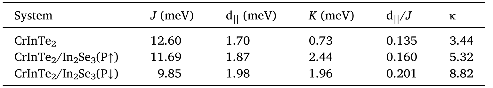
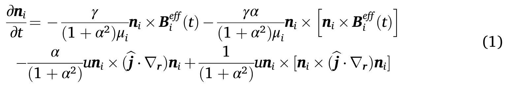
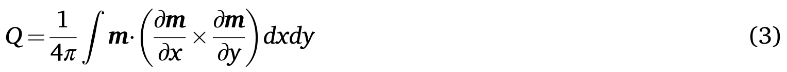
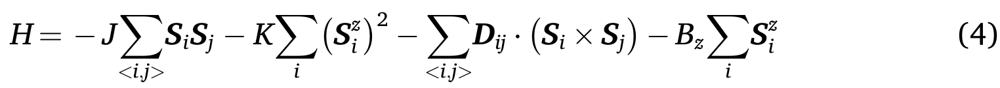
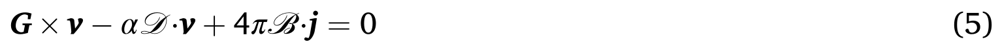
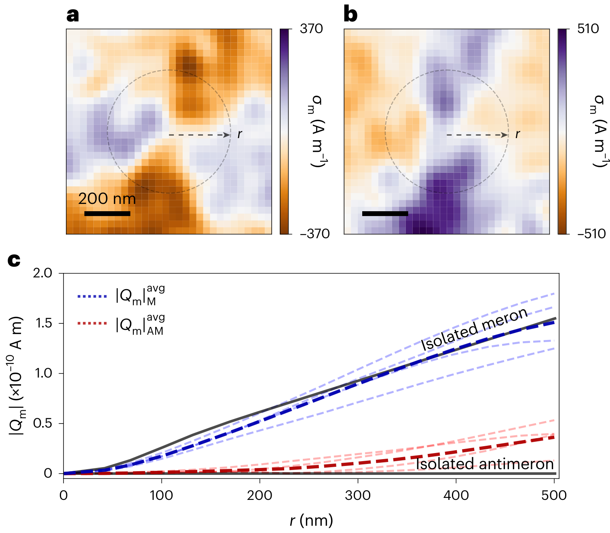

# 数学模型与物理公式 (Mathematical Models & Formulas)

> 本页为 [[mathematical-models|物理模型与数学公式]] 的子页面：海森堡模型、磁各向异性、自旋输运。

[[科研Wiki/wiki/figures/_index|← 返回总索引]]

---

## ⚛️ 磁性、磁输运与自旋电子学 (Magnetism & Magnetotransport)

[[mathematical-models|← 返回数学模型与物理公式]]

### 1. 自旋波模式示意图
自旋波模式示意图

*   **来源**：[[../papers/deSousa2008electrical]]

### 2. 低频磁静波色散
低频磁静波色散

*   **来源**：[[../papers/deSousa2008electrical]]

### 3. 公式：自由能模型
自由能模型

*   **来源**：[[../papers/deSousa2008electrical]]

### 4. 公式：平衡态磁化
平衡态磁化

*   **来源**：[[../papers/deSousa2008electrical]]

### 5. 公式：LL方程
LL方程

*   **来源**：[[../papers/deSousa2008electrical]]

### 6. 公式：线性化方程
线性化方程

*   **来源**：[[../papers/deSousa2008electrical]]

### 7. 公式：退磁场
退磁场

*   **来源**：[[../papers/deSousa2008electrical]]

### 8. 公式：电磁振子耦合
电磁振子耦合

*   **来源**：[[../papers/deSousa2008electrical]]

### 9. 公式：低频色散关系
低频色散关系

*   **来源**：[[../papers/deSousa2008electrical]]

### 10. 公式：Hanle公式
Hanle公式

*   **来源**：[[../papers/liuSpintronicsTwoDimensionalMaterials2020b]]

### 11. 表：磁学参数表
磁学参数表

*   **来源**：[[../papers/zhangNonvolatileControlTopological2025]]

### 12. 公式：方程1 LLG
方程1 LLG

*   **来源**：[[../papers/zhangNonvolatileControlTopological2025]]

### 13. 公式：方程3 拓扑荷
方程3 拓扑荷

*   **来源**：[[../papers/zhangNonvolatileControlTopological2025]]

### 14. 公式：方程4 自旋哈密顿量
方程4 自旋哈密顿量

*   **来源**：[[../papers/zhangNonvolatileControlTopological2025]]

### 15. 公式：方程5 Thiele
方程5 Thiele

*   **来源**：[[../papers/zhangNonvolatileControlTopological2025]]

### 16. 二维积分磁荷 |Qm| 随积分半径 r 的标度：半子线性增长、反半子近零并因织构间相互作用
二维积分磁荷 |Qm| 随积分半径 r 的标度：半子线性增长、反半子近零并因织构间相互作用而偏离

*   **来源**：[[../papers/tanRevealingEmergentMagnetic2024]]

### 17. 公式：(1)-(4) SOC有效哈密顿量与谷劈裂解析表达式
(1)-(4) SOC有效哈密顿量与谷劈裂解析表达式

*   **来源**：[[../papers/xunCoexistingMagnetismFerroelectric2024]]

### 18. 阻挫定量证据：逆介电常数-温度、MC自相关函数、缺陷空间概率分布
阻挫定量证据：逆介电常数-温度、MC自相关函数、缺陷空间概率分布

*   **来源**：[[../papers/nahasFrustrationSelfOrderingTopological2016]]

### 19. 公式：蒙特卡洛时间自相关函数公式(1)
蒙特卡洛时间自相关函数公式(1)

*   **来源**：[[../papers/nahasFrustrationSelfOrderingTopological2016]]

### 20. 表：19 种非磁铁电体带隙、极化与翻转势垒
19 种非磁铁电体带隙、极化与翻转势垒

*   **来源**：[[../papers/zhaoRealization2DMultiferroic2024]]

### 21. 表：21 种多铁体磁基态、T_C/T_N、MAE、极化与势垒
21 种多铁体磁基态、T_C/T_N、MAE、极化与势垒

*   **来源**：[[../papers/zhaoRealization2DMultiferroic2024]]

---

## 🔗 相关概念与实体 (Related Concepts & Entities)

**核心概念**：[[../concepts/density-functional-theory|密度泛函理论 (DFT)]]、[[../concepts/paw-method|投影增强波法 (PAW/USPP)]]、[[../concepts/berry-phase|Berry 相与现代极化理论]]、[[../concepts/born-effective-charge|Born 有效电荷]]、[[../concepts/ferroelectricity|铁电性]]、[[../concepts/multiferroicity|多铁性]]、[[../concepts/charge-density-wave|电荷密度波 (CDW)]]、[[../concepts/flexoelectric-effect|挠曲电效应]]、[[../concepts/peierls-distortion|Peierls 畸变]]、[[../concepts/superconducting-dome|超导穹顶]]

**相关材料/实体**：[[../entities/h-BN|h-BN]]、[[../entities/graphene|石墨烯]]、[[../entities/TMDs|过渡金属二硫化物 (TMDs)]]、[[../entities/NbSe2|2H-NbSe₂]]、[[../entities/BiFeO3|BiFeO₃]]、[[../entities/HZO|HfZrO (HZO)]]、[[../entities/In2Se3|In₂Se₃]]、[[../entities/BaTiO3|BaTiO₃]]、[[../entities/WTe2|WTe₂]]

