---
tags:
  - type/figure-collection
---

# 理论模型与计算方法：磁电耦合与多铁理论

> 属于 [[mathematical-models|理论模型与计算方法]]

## 条目

### 1. 图3 PoDW相电荷磁化率的费曼图与三轨道模型计算结果

*   **来源**：[[../papers/Kang2012dimer]]
*   **图示描述**：左图为 PoDW 相中计算电荷磁化率 χ_c 所保留的主要费曼图（正常与反常格林函数构成的传播子及相互作用顶点，其余破坏时间反演对称的图在求和后抵消）；右图为三轨道模型中 Δ_PoDW = 20 meV 时 χ_c(k⃗) 在布里渊区的数值分布。
*   **关键特征**：顺磁态下位于 (0, ±π) 的原嵌套峰被抑制；在 q⃗_a ≈ (±0.4π, 0) 处出现一个高平台而非对称分布的峰，C4 旋转对称性被明确打破；该平台与简单抛物带模型在最优嵌套时 δχ(q_a) ∝ (Δk/(v_F³β))^{1/4} 的解析结果定性一致。

### 2. 表1 理论预测与实验合成的二维多铁材料汇总
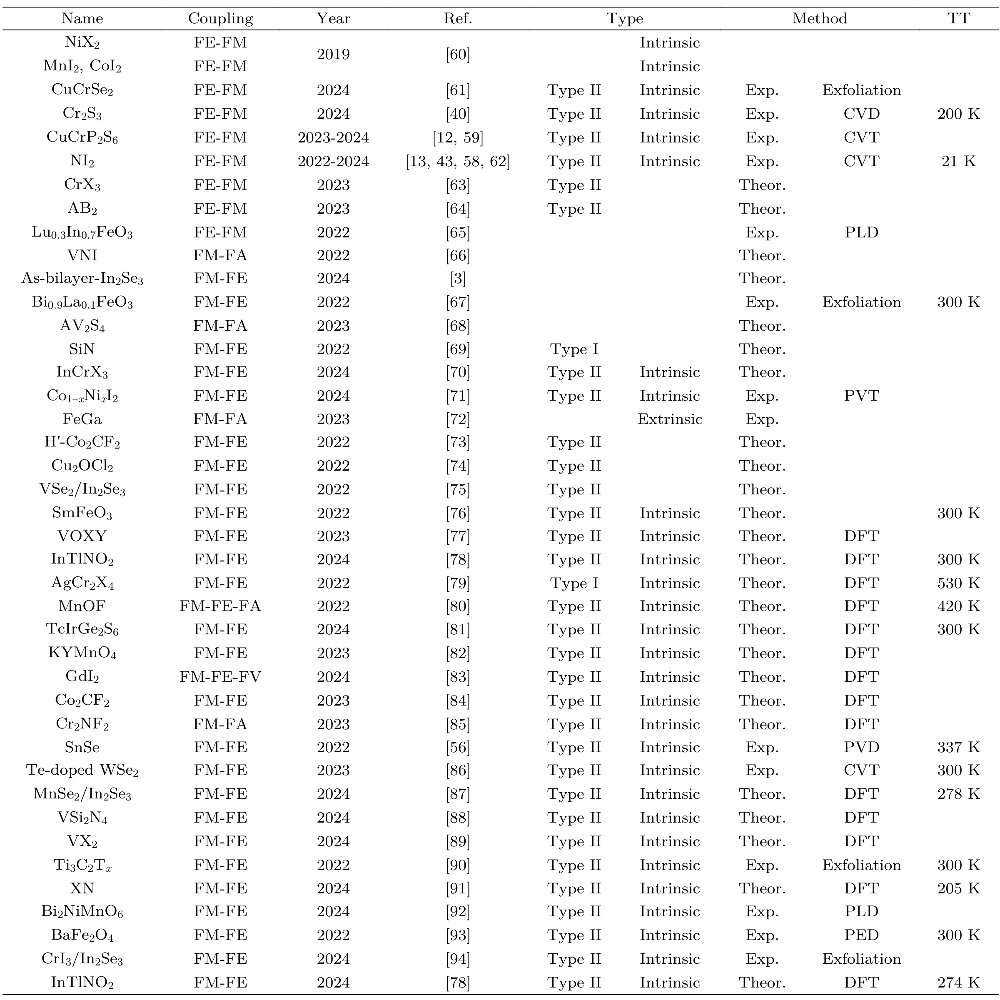
*   **来源**：[[../papers/RecentAdvancesGrowth2025]]

### 3. 图1 多铁性起源理论模型

*   **来源**：[[../papers/aminiAtomicscaleVisualizationMultiferroicity2024]]
*   **图示描述**：多面板概念图，建立"非共线磁序 → 电极化 → 静电势 → STM 衬度"的理论链条；(a) 标注 9a × √3a 公度超胞、传播矢量 q、自旋旋转轴 e 与 SOC 诱导的净极化 P，(b) 标出 Ni 原子间铁磁第一近邻 J₁ 与反铁磁第三近邻 J₃，(c–e) 分别绘制磁化分量、电极化分量与静电势沿 x 方向的空间分布。
*   **关键特征**：磁化 M = M(−sin qr, cos qr, 0) 的实空间周期为 9a；由 P = Λ M × (∇ × M)/M²（Λ ∝ λSOC）给出的 P 含 sin(2q·r) 项，因此电极化周期为 9a/2，恰为磁螺旋周期的一半；伴随原子铁电位移产生同周期的调制静电势，直接调制 NiI₂ 能带，成为 STM 可观测的"指纹"。

### 4. 图4 本征铁电体与赝本征铁电体跨顺电-铁电相变的自由能曲线

*   **来源**：[[../papers/bhowalPolarMetalsPrinciples2023b]]
*   **图示描述**：对比 (a) 本征铁电体与 (b) 赝本征铁电体在 T > Tc 与 T < Tc 时自由能 F 随极化 P 的变化：本征情形 T < Tc 出现 ±P 双势阱；赝本征情形始终为单势阱，只是最小值被非极性主序参量耦合偏移到非零 P 处。
*   **关键特征**：本征双阱的两极小值可由外电场在 ±P 间翻转；赝本征中极化是旋转/倾斜等非极性主畸变的次级产物，其大小由主序参量决定而非直接由外场翻转；图中标出 T > Tc 的顺电相与 T < Tc 的铁电相。

### 5. 公式1 自由能模型

*   **来源**：[[../papers/deSousa2008electrical]]
*   **图示描述**：全文出发点，写出 BFO 薄膜耦合铁电/反铁磁序参量的唯象金兹堡-朗道自由能密度，按能量来源分块列出。
*   **关键特征**：铁电部分 aP²/2+uP⁴/4 为朗道-德冯谢亚双阱势；磁性部分含子晶格各向异性能 rM²/2+GM⁴/4 与梯度项 α(∇M)²/2；磁致伸缩项 (J₀+ηP²)M₁·M₂ 让反铁磁交换强度受 P² 调制；最关键的 DM 项 **dP·(M₁×M₂)** 线性依赖于 P，既产生弱铁磁性又锁定 L 与 P 的垂直关系，是电控磁序的耦合源头。

### 6. 图1 四种多铁性机制：孤对电子、几何、电荷有序、自旋驱动（逆DM/交换伸缩/p-d杂化）

*   **来源**：[[../papers/fiebigEvolutionMultiferroics2016]]
*   **图示描述**：以四个子图示意磁序与铁电长程序共存的四种微观机制：(a) BiFeO₃中Bi³⁺ 6s²孤对电子不对称分布形成局域偶极；(b) h-RMnO₃中MnO₅双锥倾斜挤压R³⁺位移；(c) LuFe₂O₄中Fe²⁺/Fe³⁺电荷有序；(d) 自旋驱动的三条路径（逆DM、交换伸缩、自旋依赖p-d杂化）。
*   **关键特征**：孤对电子机制给出Ps≈100 μC/cm²（应变下达150），Tc=1103 K、TN=643 K，是唯一室温单相多铁；几何机制Ps=5.6 μC/cm²、Tc≥1200 K但TN≤120 K；电荷有序声称约25 μC/cm²但铁电性至今存争议；自旋驱动由P∝eij×(Si×Sj)、P∝Rij(Si·Sj)、P∝(Si·eij)²eij三个公式统一描述。

### 7. 图4 电磁振子动态磁电耦合与材料对比

*   **来源**：[[../papers/gaoGiantChiralMagnetoelectric2024a]]
*   **图示描述**：两联图量化磁电耦合强度：(a) 在泵浦通量 1.65 mJ cm⁻² 下，将 tr-SHG（蓝）和 tr-RKerr（红）信号转换为投影到 κ 轴的电极化 ΔPκ（10⁻¹⁶ C m⁻¹）和磁化 ΔMκ（10⁻⁸ A）随延迟时间的振荡，并与 DFT 加唯象阻尼的理论曲线（阴影）对比；(b) 在不同多铁/螺旋磁体材料中反演的太赫兹动态磁电耦合常数 α(ω)（单位 ps m⁻¹）随能量（meV）汇总，蓝圆为 NOA、红三角为 GB。
*   **关键特征**：实验 ΔPκ、ΔMκ 曲线清晰呈现 π/2 相位差且幅值与 DFT 阴影高度吻合；沿 EMo 调制轴 κ 提取 Im{ακκ}=11×10³ ps m⁻¹（~4 meV/1 THz），与 DFT 理论值 12×10³ ps m⁻¹ 一致；对应旋光率 η≈1000° mm⁻¹，比 CuO、CuFe₀.₉₆₅Ga₀.₀₃₅O₂ 等螺旋磁体以及 Ba₂CoGe₂O₇、Eu₀.₇Y₀.₃MnO₃、(Fe,Zn)₂Mo₃O₈ 等单相多铁中的 GB/定向二向色性高出约两个数量级。

### 8. 图4 DREAM/Allegro MLIP 预测 Tc≈1500 K、倾斜电场降低矫顽场、恒定 24° 倾角

*   **来源**：[[../papers/kaurRecentAdvancesTheoretical2025a]]
*   **图示描述**：(a) 复序参量 ψ=e^{iG·t} 的虚部随温度变化；(b) 矫顽场 E⊥,c 随温度变化（橙线）及加 0.2 V/Å 平行电场后（紫叉）；(c) E⊥,c–E∥ 关系的解析、数值与 0.1 K MD 对比；(d) 总临界场 Et,c 及其与水平面夹角（倾角）随温度的变化。
*   **关键特征**：MLIP 能量差 MAE=0.053 meV/atom，900 原子 MD 给出 h-BN Tc≈1500 K（修正此前 1.58×10⁴ K 高估）；E⊥,c 从 100 K 的 1.99 V/Å 降至 200 K 的 1.39 V/Å；加 E∥ 打破三重对称，Et,c 与水平面夹角恒定 24°，利于实验设计。

### 9. eq4

*   **来源**：[[../papers/kaurRecentAdvancesTheoretical2025a]]
*   **图示描述**：从原文抽取的关键公式图像，涵盖 GPRI 定义、层间高斯重叠 s_in、电偶极矩点电荷模型、倾斜电场势能、动态多铁性感生磁矩、自旋螺旋诱导极化、磁电系数关系及连续介质相变模型等，是正文中 Berry 相/NEB、MLIP、激光翻转、多铁耦合与热力学分析的数学骨架。
*   **关键特征**：eq.2/4 为 GPRI 与原子高斯重叠；eq.7 为含平行+垂直电场的势能 ε(t)=ε0(t)−E∥·p∥−E⊥·p⊥；eq.13 引入 f(h) 修正不等价层间距；eq.14 为点电荷偶极模型；eq.15 为 P=m/d；eq.17 为 P=M∑(S_i×S_j) 自旋螺旋极化；eq.19/20 为磁电关系 μ0ΔM=βS E²+αS E 等。具体编号以图片为准。

### 10. eq5

*   **来源**：[[../papers/kaurRecentAdvancesTheoretical2025a]]
*   **图示描述**：从原文抽取的关键公式图像，涵盖 GPRI 定义、层间高斯重叠 s_in、电偶极矩点电荷模型、倾斜电场势能、动态多铁性感生磁矩、自旋螺旋诱导极化、磁电系数关系及连续介质相变模型等，是正文中 Berry 相/NEB、MLIP、激光翻转、多铁耦合与热力学分析的数学骨架。
*   **关键特征**：eq.2/4 为 GPRI 与原子高斯重叠；eq.7 为含平行+垂直电场的势能 ε(t)=ε0(t)−E∥·p∥−E⊥·p⊥；eq.13 引入 f(h) 修正不等价层间距；eq.14 为点电荷偶极模型；eq.15 为 P=m/d；eq.17 为 P=M∑(S_i×S_j) 自旋螺旋极化；eq.19/20 为磁电关系 μ0ΔM=βS E²+αS E 等。具体编号以图片为准。

### 11. eq6

*   **来源**：[[../papers/kaurRecentAdvancesTheoretical2025a]]
*   **图示描述**：从原文抽取的关键公式图像，涵盖 GPRI 定义、层间高斯重叠 s_in、电偶极矩点电荷模型、倾斜电场势能、动态多铁性感生磁矩、自旋螺旋诱导极化、磁电系数关系及连续介质相变模型等，是正文中 Berry 相/NEB、MLIP、激光翻转、多铁耦合与热力学分析的数学骨架。
*   **关键特征**：eq.2/4 为 GPRI 与原子高斯重叠；eq.7 为含平行+垂直电场的势能 ε(t)=ε0(t)−E∥·p∥−E⊥·p⊥；eq.13 引入 f(h) 修正不等价层间距；eq.14 为点电荷偶极模型；eq.15 为 P=m/d；eq.17 为 P=M∑(S_i×S_j) 自旋螺旋极化；eq.19/20 为磁电关系 μ0ΔM=βS E²+αS E 等。具体编号以图片为准。

### 12. eq7

*   **来源**：[[../papers/kaurRecentAdvancesTheoretical2025a]]
*   **图示描述**：从原文抽取的关键公式图像，涵盖 GPRI 定义、层间高斯重叠 s_in、电偶极矩点电荷模型、倾斜电场势能、动态多铁性感生磁矩、自旋螺旋诱导极化、磁电系数关系及连续介质相变模型等，是正文中 Berry 相/NEB、MLIP、激光翻转、多铁耦合与热力学分析的数学骨架。
*   **关键特征**：eq.2/4 为 GPRI 与原子高斯重叠；eq.7 为含平行+垂直电场的势能 ε(t)=ε0(t)−E∥·p∥−E⊥·p⊥；eq.13 引入 f(h) 修正不等价层间距；eq.14 为点电荷偶极模型；eq.15 为 P=m/d；eq.17 为 P=M∑(S_i×S_j) 自旋螺旋极化；eq.19/20 为磁电关系 μ0ΔM=βS E²+αS E 等。具体编号以图片为准。

### 13. eq10

*   **来源**：[[../papers/kaurRecentAdvancesTheoretical2025a]]
*   **图示描述**：从原文抽取的关键公式图像，涵盖 GPRI 定义、层间高斯重叠 s_in、电偶极矩点电荷模型、倾斜电场势能、动态多铁性感生磁矩、自旋螺旋诱导极化、磁电系数关系及连续介质相变模型等，是正文中 Berry 相/NEB、MLIP、激光翻转、多铁耦合与热力学分析的数学骨架。
*   **关键特征**：eq.2/4 为 GPRI 与原子高斯重叠；eq.7 为含平行+垂直电场的势能 ε(t)=ε0(t)−E∥·p∥−E⊥·p⊥；eq.13 引入 f(h) 修正不等价层间距；eq.14 为点电荷偶极模型；eq.15 为 P=m/d；eq.17 为 P=M∑(S_i×S_j) 自旋螺旋极化；eq.19/20 为磁电关系 μ0ΔM=βS E²+αS E 等。具体编号以图片为准。

### 14. eq13

*   **来源**：[[../papers/kaurRecentAdvancesTheoretical2025a]]
*   **图示描述**：从原文抽取的关键公式图像，涵盖 GPRI 定义、层间高斯重叠 s_in、电偶极矩点电荷模型、倾斜电场势能、动态多铁性感生磁矩、自旋螺旋诱导极化、磁电系数关系及连续介质相变模型等，是正文中 Berry 相/NEB、MLIP、激光翻转、多铁耦合与热力学分析的数学骨架。
*   **关键特征**：eq.2/4 为 GPRI 与原子高斯重叠；eq.7 为含平行+垂直电场的势能 ε(t)=ε0(t)−E∥·p∥−E⊥·p⊥；eq.13 引入 f(h) 修正不等价层间距；eq.14 为点电荷偶极模型；eq.15 为 P=m/d；eq.17 为 P=M∑(S_i×S_j) 自旋螺旋极化；eq.19/20 为磁电关系 μ0ΔM=βS E²+αS E 等。具体编号以图片为准。

### 15. eq14

*   **来源**：[[../papers/kaurRecentAdvancesTheoretical2025a]]
*   **图示描述**：从原文抽取的关键公式图像，涵盖 GPRI 定义、层间高斯重叠 s_in、电偶极矩点电荷模型、倾斜电场势能、动态多铁性感生磁矩、自旋螺旋诱导极化、磁电系数关系及连续介质相变模型等，是正文中 Berry 相/NEB、MLIP、激光翻转、多铁耦合与热力学分析的数学骨架。
*   **关键特征**：eq.2/4 为 GPRI 与原子高斯重叠；eq.7 为含平行+垂直电场的势能 ε(t)=ε0(t)−E∥·p∥−E⊥·p⊥；eq.13 引入 f(h) 修正不等价层间距；eq.14 为点电荷偶极模型；eq.15 为 P=m/d；eq.17 为 P=M∑(S_i×S_j) 自旋螺旋极化；eq.19/20 为磁电关系 μ0ΔM=βS E²+αS E 等。具体编号以图片为准。

### 16. eq16

*   **来源**：[[../papers/kaurRecentAdvancesTheoretical2025a]]
*   **图示描述**：从原文抽取的关键公式图像，涵盖 GPRI 定义、层间高斯重叠 s_in、电偶极矩点电荷模型、倾斜电场势能、动态多铁性感生磁矩、自旋螺旋诱导极化、磁电系数关系及连续介质相变模型等，是正文中 Berry 相/NEB、MLIP、激光翻转、多铁耦合与热力学分析的数学骨架。
*   **关键特征**：eq.2/4 为 GPRI 与原子高斯重叠；eq.7 为含平行+垂直电场的势能 ε(t)=ε0(t)−E∥·p∥−E⊥·p⊥；eq.13 引入 f(h) 修正不等价层间距；eq.14 为点电荷偶极模型；eq.15 为 P=m/d；eq.17 为 P=M∑(S_i×S_j) 自旋螺旋极化；eq.19/20 为磁电关系 μ0ΔM=βS E²+αS E 等。具体编号以图片为准。

### 17. eq17

*   **来源**：[[../papers/kaurRecentAdvancesTheoretical2025a]]
*   **图示描述**：从原文抽取的关键公式图像，涵盖 GPRI 定义、层间高斯重叠 s_in、电偶极矩点电荷模型、倾斜电场势能、动态多铁性感生磁矩、自旋螺旋诱导极化、磁电系数关系及连续介质相变模型等，是正文中 Berry 相/NEB、MLIP、激光翻转、多铁耦合与热力学分析的数学骨架。
*   **关键特征**：eq.2/4 为 GPRI 与原子高斯重叠；eq.7 为含平行+垂直电场的势能 ε(t)=ε0(t)−E∥·p∥−E⊥·p⊥；eq.13 引入 f(h) 修正不等价层间距；eq.14 为点电荷偶极模型；eq.15 为 P=m/d；eq.17 为 P=M∑(S_i×S_j) 自旋螺旋极化；eq.19/20 为磁电关系 μ0ΔM=βS E²+αS E 等。具体编号以图片为准。

### 18. eq18

*   **来源**：[[../papers/kaurRecentAdvancesTheoretical2025a]]
*   **图示描述**：从原文抽取的关键公式图像，涵盖 GPRI 定义、层间高斯重叠 s_in、电偶极矩点电荷模型、倾斜电场势能、动态多铁性感生磁矩、自旋螺旋诱导极化、磁电系数关系及连续介质相变模型等，是正文中 Berry 相/NEB、MLIP、激光翻转、多铁耦合与热力学分析的数学骨架。
*   **关键特征**：eq.2/4 为 GPRI 与原子高斯重叠；eq.7 为含平行+垂直电场的势能 ε(t)=ε0(t)−E∥·p∥−E⊥·p⊥；eq.13 引入 f(h) 修正不等价层间距；eq.14 为点电荷偶极模型；eq.15 为 P=m/d；eq.17 为 P=M∑(S_i×S_j) 自旋螺旋极化；eq.19/20 为磁电关系 μ0ΔM=βS E²+αS E 等。具体编号以图片为准。

### 19. eq19

*   **来源**：[[../papers/kaurRecentAdvancesTheoretical2025a]]
*   **图示描述**：从原文抽取的关键公式图像，涵盖 GPRI 定义、层间高斯重叠 s_in、电偶极矩点电荷模型、倾斜电场势能、动态多铁性感生磁矩、自旋螺旋诱导极化、磁电系数关系及连续介质相变模型等，是正文中 Berry 相/NEB、MLIP、激光翻转、多铁耦合与热力学分析的数学骨架。
*   **关键特征**：eq.2/4 为 GPRI 与原子高斯重叠；eq.7 为含平行+垂直电场的势能 ε(t)=ε0(t)−E∥·p∥−E⊥·p⊥；eq.13 引入 f(h) 修正不等价层间距；eq.14 为点电荷偶极模型；eq.15 为 P=m/d；eq.17 为 P=M∑(S_i×S_j) 自旋螺旋极化；eq.19/20 为磁电关系 μ0ΔM=βS E²+αS E 等。具体编号以图片为准。

### 20. eq20

*   **来源**：[[../papers/kaurRecentAdvancesTheoretical2025a]]
*   **图示描述**：从原文抽取的关键公式图像，涵盖 GPRI 定义、层间高斯重叠 s_in、电偶极矩点电荷模型、倾斜电场势能、动态多铁性感生磁矩、自旋螺旋诱导极化、磁电系数关系及连续介质相变模型等，是正文中 Berry 相/NEB、MLIP、激光翻转、多铁耦合与热力学分析的数学骨架。
*   **关键特征**：eq.2/4 为 GPRI 与原子高斯重叠；eq.7 为含平行+垂直电场的势能 ε(t)=ε0(t)−E∥·p∥−E⊥·p⊥；eq.13 引入 f(h) 修正不等价层间距；eq.14 为点电荷偶极模型；eq.15 为 P=m/d；eq.17 为 P=M∑(S_i×S_j) 自旋螺旋极化；eq.19/20 为磁电关系 μ0ΔM=βS E²+αS E 等。具体编号以图片为准。

### 21. eq21

*   **来源**：[[../papers/kaurRecentAdvancesTheoretical2025a]]
*   **图示描述**：从原文抽取的关键公式图像，涵盖 GPRI 定义、层间高斯重叠 s_in、电偶极矩点电荷模型、倾斜电场势能、动态多铁性感生磁矩、自旋螺旋诱导极化、磁电系数关系及连续介质相变模型等，是正文中 Berry 相/NEB、MLIP、激光翻转、多铁耦合与热力学分析的数学骨架。
*   **关键特征**：eq.2/4 为 GPRI 与原子高斯重叠；eq.7 为含平行+垂直电场的势能 ε(t)=ε0(t)−E∥·p∥−E⊥·p⊥；eq.13 引入 f(h) 修正不等价层间距；eq.14 为点电荷偶极模型；eq.15 为 P=m/d；eq.17 为 P=M∑(S_i×S_j) 自旋螺旋极化；eq.19/20 为磁电关系 μ0ΔM=βS E²+αS E 等。具体编号以图片为准。

### 22. eq23

*   **来源**：[[../papers/kaurRecentAdvancesTheoretical2025a]]
*   **图示描述**：从原文抽取的关键公式图像，涵盖 GPRI 定义、层间高斯重叠 s_in、电偶极矩点电荷模型、倾斜电场势能、动态多铁性感生磁矩、自旋螺旋诱导极化、磁电系数关系及连续介质相变模型等，是正文中 Berry 相/NEB、MLIP、激光翻转、多铁耦合与热力学分析的数学骨架。
*   **关键特征**：eq.2/4 为 GPRI 与原子高斯重叠；eq.7 为含平行+垂直电场的势能 ε(t)=ε0(t)−E∥·p∥−E⊥·p⊥；eq.13 引入 f(h) 修正不等价层间距；eq.14 为点电荷偶极模型；eq.15 为 P=m/d；eq.17 为 P=M∑(S_i×S_j) 自旋螺旋极化；eq.19/20 为磁电关系 μ0ΔM=βS E²+αS E 等。具体编号以图片为准。

### 23. eq25

*   **来源**：[[../papers/kaurRecentAdvancesTheoretical2025a]]
*   **图示描述**：从原文抽取的关键公式图像，涵盖 GPRI 定义、层间高斯重叠 s_in、电偶极矩点电荷模型、倾斜电场势能、动态多铁性感生磁矩、自旋螺旋诱导极化、磁电系数关系及连续介质相变模型等，是正文中 Berry 相/NEB、MLIP、激光翻转、多铁耦合与热力学分析的数学骨架。
*   **关键特征**：eq.2/4 为 GPRI 与原子高斯重叠；eq.7 为含平行+垂直电场的势能 ε(t)=ε0(t)−E∥·p∥−E⊥·p⊥；eq.13 引入 f(h) 修正不等价层间距；eq.14 为点电荷偶极模型；eq.15 为 P=m/d；eq.17 为 P=M∑(S_i×S_j) 自旋螺旋极化；eq.19/20 为磁电关系 μ0ΔM=βS E²+αS E 等。具体编号以图片为准。

### 24. eq26

*   **来源**：[[../papers/kaurRecentAdvancesTheoretical2025a]]
*   **图示描述**：从原文抽取的关键公式图像，涵盖 GPRI 定义、层间高斯重叠 s_in、电偶极矩点电荷模型、倾斜电场势能、动态多铁性感生磁矩、自旋螺旋诱导极化、磁电系数关系及连续介质相变模型等，是正文中 Berry 相/NEB、MLIP、激光翻转、多铁耦合与热力学分析的数学骨架。
*   **关键特征**：eq.2/4 为 GPRI 与原子高斯重叠；eq.7 为含平行+垂直电场的势能 ε(t)=ε0(t)−E∥·p∥−E⊥·p⊥；eq.13 引入 f(h) 修正不等价层间距；eq.14 为点电荷偶极模型；eq.15 为 P=m/d；eq.17 为 P=M∑(S_i×S_j) 自旋螺旋极化；eq.19/20 为磁电关系 μ0ΔM=βS E²+αS E 等。具体编号以图片为准。

### 25. eq27

*   **来源**：[[../papers/kaurRecentAdvancesTheoretical2025a]]
*   **图示描述**：从原文抽取的关键公式图像，涵盖 GPRI 定义、层间高斯重叠 s_in、电偶极矩点电荷模型、倾斜电场势能、动态多铁性感生磁矩、自旋螺旋诱导极化、磁电系数关系及连续介质相变模型等，是正文中 Berry 相/NEB、MLIP、激光翻转、多铁耦合与热力学分析的数学骨架。
*   **关键特征**：eq.2/4 为 GPRI 与原子高斯重叠；eq.7 为含平行+垂直电场的势能 ε(t)=ε0(t)−E∥·p∥−E⊥·p⊥；eq.13 引入 f(h) 修正不等价层间距；eq.14 为点电荷偶极模型；eq.15 为 P=m/d；eq.17 为 P=M∑(S_i×S_j) 自旋螺旋极化；eq.19/20 为磁电关系 μ0ΔM=βS E²+αS E 等。具体编号以图片为准。

### 26. 独立双磁序耦合 f_me = g_i E_i L_+ L_-
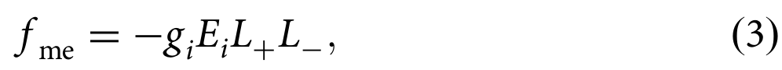
*   **来源**：[[../papers/mostovoyMultiferroicsDifferentRoutes2024]]
*   **图示描述**：L₊ 与 L₋ 是分别在反演下为偶、奇的两个独立磁序参量，其乘积 L₊L₋ 同时为反演奇、时间反演偶，可与均匀电场线性耦合。
*   **关键特征**：两个磁序因破坏不同对称性而在不同温度出现；GdFeO₃ 中 Fe 序 T_Fe=661 K（不破反演、弱铁磁），Gd 序 T_Gd=2.5 K（破反演），后者出现后材料成为多铁；P_i = g_i L₊L₋。

### 27. Lifshitz 不变量耦合 f_me = g_ij E_i M_i ∂_j M_j（逆 DM 唯象项）
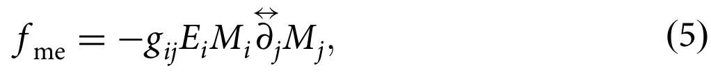
*   **来源**：[[../papers/mostovoyMultiferroicsDifferentRoutes2024]]
*   **图示描述**：自由能中电场 E_i 与磁化梯度组合 M_i ∂_j M_j（Lifshitz 不变量）耦合；两个轴矢量乘积 M_iM_j 在所有对称操作下与极矢量梯度组合变换方式相同。
*   **关键特征**：在中心对称磁体中 Lifshitz 不变量本身因反演变号而被禁戒，但与同样反演奇的电场耦合后成为允许项；对反铁磁体将 M 替换为 Néel 矢量 L 仍然成立（亚晶格符号对 L_iL_j 整体相同）。

### 28. 逆 DM 微观键偶极 d_ij ∝ r̂_ij × (S_i × S_j)
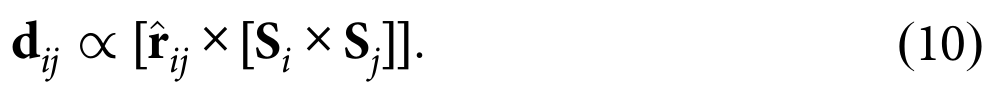
*   **来源**：[[../papers/mostovoyMultiferroicsDifferentRoutes2024]]
*   **图示描述**：单配体介导的 DM 矢量满足 D_ij ∝ r̂_ij×u，对电场一阶展开后得到键偶极 d_ij ∝ r̂_ij×[S_i×S_j]，其中 r̂_ij 为连接两磁位点方向的单位矢量。
*   **关键特征**：非共线自旋 S_i×S_j≠0 通过 SOC 驱动配体位移产生偶极；可等价表述为自旋流理论 P_a ∝ ε_{ab} j_i^b；螺旋态下 j_i^a ∝ q_i e₃^a，从而回到式 (6)。

### 29. Onsager 倒易 α^em_ij(ω,L,H)=α^me_ji(ω,-L,H)
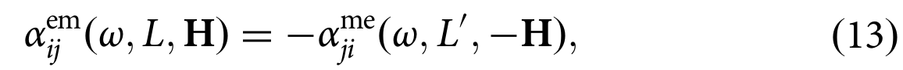
*   **来源**：[[../papers/mostovoyMultiferroicsDifferentRoutes2024]]
*   **图示描述**：两个动态磁电张量 α^em（电极化对振荡磁场的响应）与 α^me（磁化对振荡电场的响应）通过 Onsager 关系互相约束，时间反演序参量 L 在转置时变号。
*   **关键特征**：ω 为光频，H 为静磁场；螺旋态中所有自旋经时间反演反转后可由沿 q 平移半个螺旋周期抵消，给出附加对称性。

### 30. 无场螺旋态 α^em_ij(ω)=α^me_ji(ω)
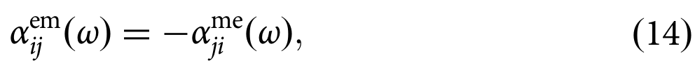
*   **来源**：[[../papers/mostovoyMultiferroicsDifferentRoutes2024]]
*   **图示描述**：在无外加磁场的非公度螺旋态中，式 (13) 中时间反演加半周期平移的组合对称性使 α^em_ij(ω) = α^me_ji(ω)。
*   **关键特征**：同时加电场与磁场光分量可产生非互易定向二向色性，强度 ∝ Im(α^em_ij + α^me_ji)；该二向色性需同时破反演与时间反演，在螺旋态中只有加外磁场才能观测到。

### 31. 公式(1)：包含 FE-AFD、磁偶极、磁交换、软模/AFD/应变-磁交换耦合、双二次耦合及 Dzyaloshinskii-Moriya 型项的有效哈密顿量

*   **来源**：[[../papers/prosandeevKittelLawInBiFeO3Ultrathin2010]]
*   **图示描述**：本文所用基于第一性原理参数化的有效哈密顿量 E_tot({u_i},{η},{ω_i},{m_i})，自由度为局域软模 u_i、应变 η、氧八面体倾斜 ω_i 与磁矩 m_i（|m_i|=4 μ_B）。
*   **关键特征**：共八项——E_FE-AFD（铁电/应变/AFD 及其耦合，长程偶极矩阵替换为开路边界下的二维形式）、磁偶极-偶极 Q_ij、磁交换 D_ij、软模-磁交换双二次耦合 E_ij（磁电耦合）、AFD-磁交换耦合 F_ij、应变-磁交换耦合 G_ij、应变-软模双二次项 B_0l（再现应变下极化）、以及 K_ij(ω_i−ω_j)·(m_i×m_j) 型 Dzyaloshinskii–Moriya 项（再现弱铁磁性）；j 对 Fe 位点 i 取第一至第三近邻，唯磁偶极项取所有 Fe 位点、DM 项仅取最近邻。

### 32. 图2 镍在居里点附近放大，区分顺磁居里点 Tc 与铁磁居里点 Tc'（相差约20 K）
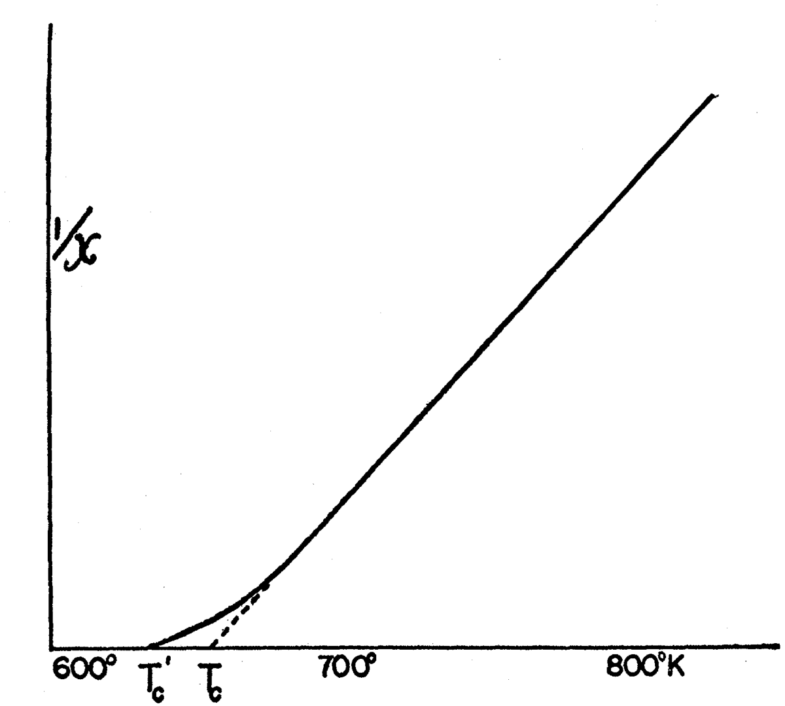
*   **来源**：[[../papers/vanvleckSurveyTheoryFerromagnetism1945]]
*   **图示描述**：将图1中镍在居里点附近的区域放大，横轴为温度，纵轴为 1/χ，示意性标出由高温直线外推得到的顺磁居里点 Tc 与实际自发磁化消失的铁磁居里点 Tc'。
*   **关键特征**：Tc 与 Tc' 并不重合，通常 Tc > Tc'，镍中两者相差约 20 K；这一差距被归因于分子场理论未包含的短程序/自旋涨落等"二级效应"，是平均场图像在相变附近失效的直接证据。

### 33. 图6 反铁磁体 χ(T) 对约化温度：理论实线与 MnO 实验虚线（Bizette 等），奈尔温度处出现峰值
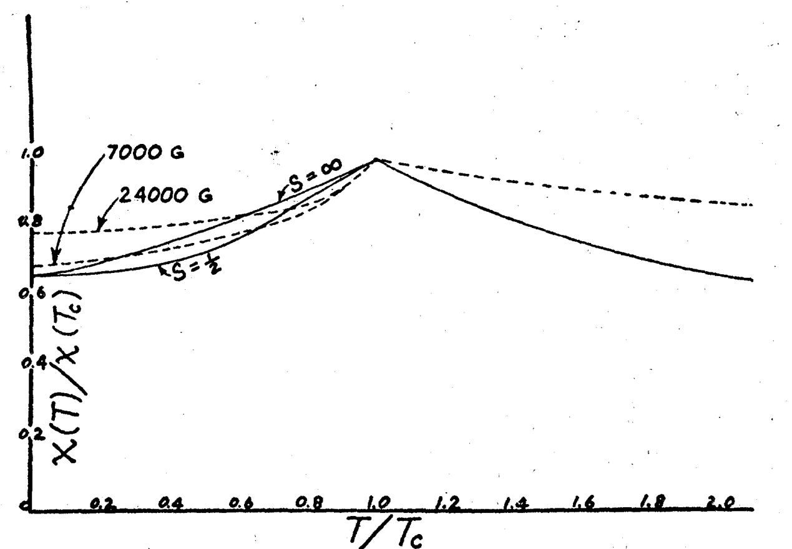
*   **来源**：[[../papers/vanvleckSurveyTheoryFerromagnetism1945]]
*   **图示描述**：横轴为约化温度 T/TN，纵轴为归一化磁化率 χ（在奈尔温度处取 1），实线为交错子晶格分子场理论曲线，虚线为 Bizette、Squire、Tsai 对 MnO 的实验测量。
*   **关键特征**：T>TN 时 χ=C/(T+θ) 随降温而升高；在 T=TN 处出现一个尖锐的极大值；T<TN 时 χ 随降温反而下降，反映 A、B 子晶格反平行排列越来越稳固，外场越难偏转自旋；T=0 时平行/垂直外场两种构型按 1:2 加权给出 χ0/χc≈2/3（实验在 0.3–0.85 之间）；MnO 实验虚线整体趋势与理论实线吻合。

### 34. 图1
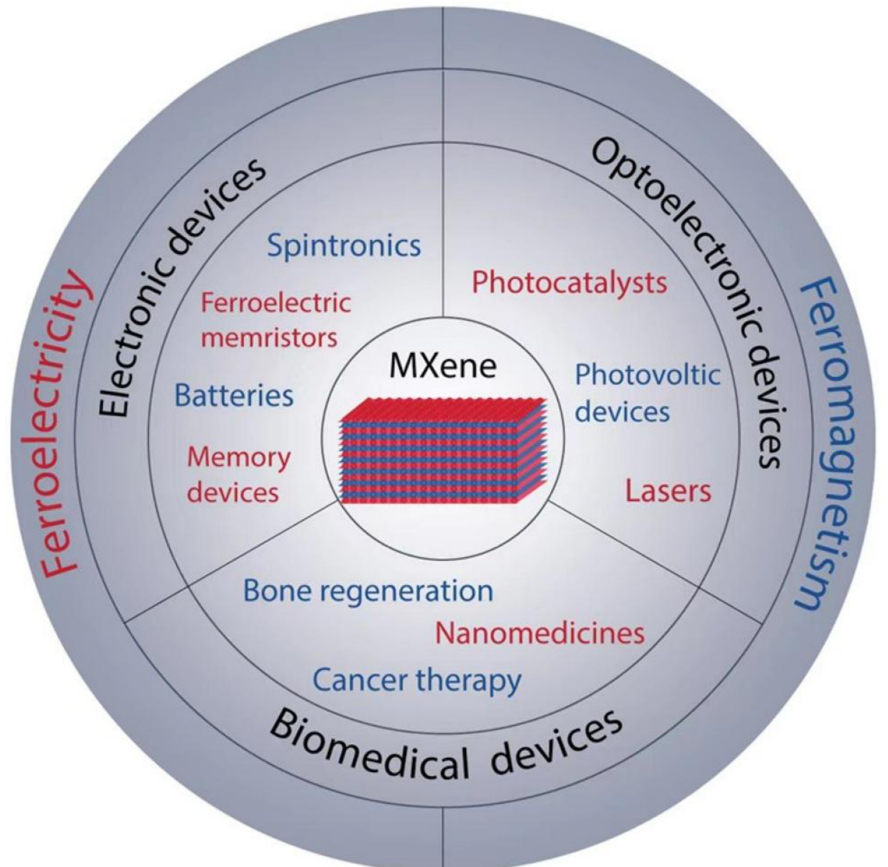
*   **来源**：[[../papers/zahraCriticalAnalysisFerroelectric2025]]
*   **图示描述**：以 MXene 为中心的辐射状示意图，外围分电学（电池、超级电容器）、磁学（电磁干扰屏蔽）、光学（光子学、激光器）、机械以及层状结构五大应用板块。
*   **关键特征**：全景式呈现 MXene 的多功能平台属性；强调其高导电、可调表面端基、高比表面积带来的跨领域应用潜力；为后文聚焦铁电/铁磁两大物性提供应用语境。

### 35. 图10
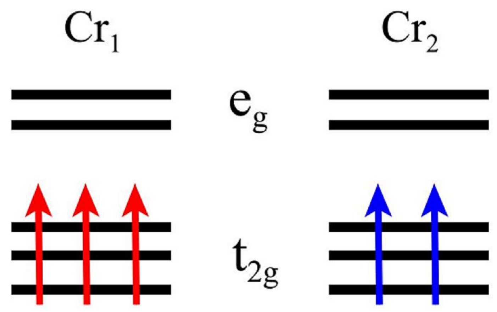
*   **来源**：[[../papers/zahraCriticalAnalysisFerroelectric2025]]
*   **图示描述**：扭曲八面体晶体场下 Cr2COOH 中两个不等价 Cr 原子（Cr1、Cr2）的 3d 轨道能级分裂图，标出每个轨道的电子占据与对应磁矩。
*   **关键特征**：Cr1 为 3d³ 贡献 3 μB，Cr2 为 3d² 贡献 2 μB，每单胞总磁矩 5 μB；两 Cr 局域配位环境不同导致 d 轨道分裂方式不同，净磁矩非零→宏观铁磁性；材料为铁磁半导体。

### 36. 图11
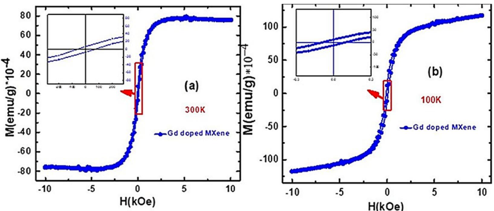
*   **来源**：[[../papers/zahraCriticalAnalysisFerroelectric2025]]
*   **图示描述**：300 K（室温）与 100 K（低温）下 Gd³⁺/Ti3C2 复合物的磁化强度 M 随外加磁场 H 变化的磁滞回线。
*   **关键特征**：闭合"S"型曲线显示矫顽力与剩磁，是铁磁体指纹；300 K 仍保留清晰回线，表明实现室温铁磁性；机制为 Gd³⁺ 自由电子与费米能级处 Ti-3d 自旋密度的交换耦合，形成软铁磁复合。

### 37. 图12
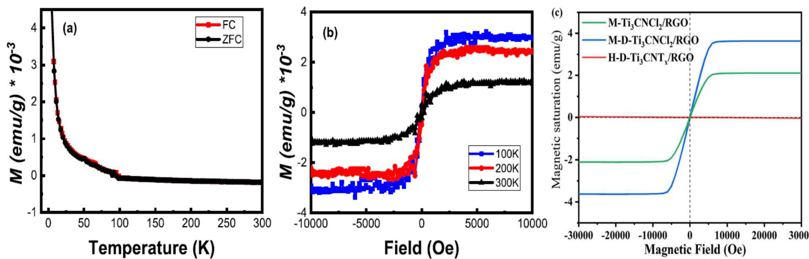
*   **来源**：[[../papers/zahraCriticalAnalysisFerroelectric2025]]
*   **图示描述**：(a,b) Nb 掺杂 Ti3C2 的理论与实验 M-H 曲线；(c) Lewis 熔融盐刻蚀过程中 Co²⁺ 高温掺入碳氮化物 Ti3CNCl2 所得的"S"形 M-H 曲线。
*   **关键特征**：Nb 无需额外端基即可在 Ti3C2 中诱导铁磁；熔盐法实现无氟、无毒刻蚀并同步完成磁性元素掺杂；典型"S"形回线证实 Co 掺入后铁磁序稳定。

### 38. 图13
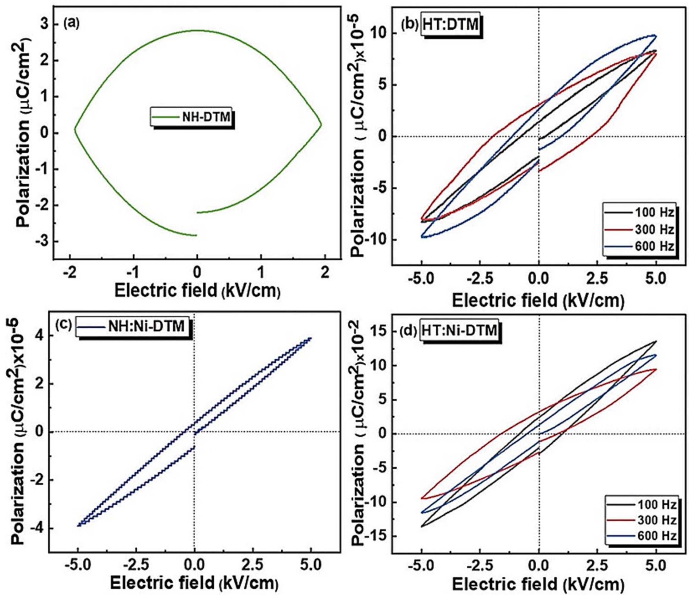
*   **来源**：[[../papers/zahraCriticalAnalysisFerroelectric2025]]
*   **图示描述**：Rabia Tahir 等从 Mo2TiAlC2 MAX 相出发，经刻蚀、分层得到 Mo2TiC2Tx 薄膜并测试其 FE/FM 共存的简单制备流程。
*   **关键特征**：这是室温下在双过渡金属 MXene 薄膜中实验观察到多铁性的代表工作；刻蚀工艺增强铁电性并同时诱导铁磁性；DTM 多铁材料在纳米器件中具潜力。

### 39. 图15
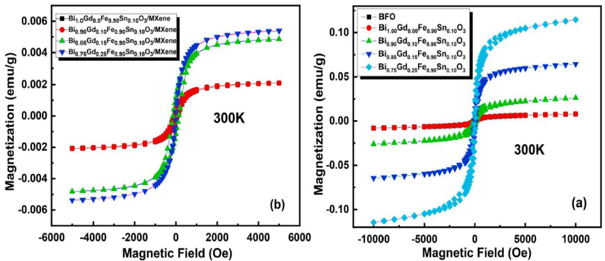
*   **来源**：[[../papers/zahraCriticalAnalysisFerroelectric2025]]
*   **图示描述**：300 K 下 (a) BGFSO 纳米颗粒、(b) Ti3C2Tx/BGFSO 复合物的 M-H 磁滞回线对比。
*   **关键特征**：复合后饱和磁化与剩余磁化均增强，呈典型"S"形铁磁回线；Ti3C2Tx 与 BGFSO 界面的超交换作用是磁性增强来源；证明铁磁钙钛矿与 MXene 复合是室温磁电/多铁设计的有效路径。

### 40. 图19
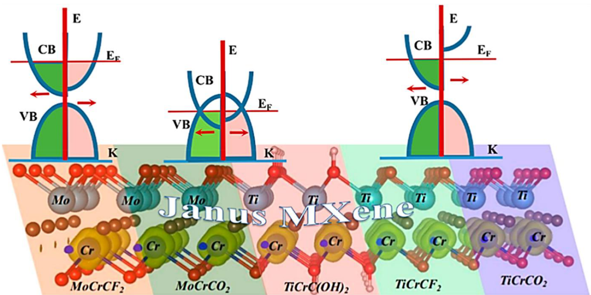
*   **来源**：[[../papers/zahraCriticalAnalysisFerroelectric2025]]
*   **图示描述**：不同端基（-O、-F、-OH）的 Janus MXene 原子结构与磁各向异性能（MAE）对比，区分面内 vs 面外各向异性。
*   **关键特征**：-O 端基 Janus MXene 磁各向异性较低；-F、-OH 端基倾向面内各向异性；TiCrCO2 在所有 Janus MXene 中铁磁性与交换常数最高；双过渡金属 W2CrN2O2、Mo2Cr2N2O2 表现强铁磁半金属性，是自旋电子学优选。

### 41. 方程1 LLG

*   **来源**：[[../papers/zhangNonvolatileControlTopological2025]]
*   **图示描述**：依次给出微磁学模拟所用的 Landau-Lifshitz-Gilbert 方程（含阻尼、STT 与热场项，α = 0.1）、自旋转移矩强度定义 u = jPħμ_B/(2eM_s)、拓扑荷 Q = (1/4π)∫m·(∂_x m × ∂_y m) dxdy、自旋哈密顿量 H = −JΣS_i·S_j − KΣ(S_i^z)² − ΣD_ij·(S_i×S_j) − B_zΣS_i^z，以及描述刚体运动的 Thiele 方程 G×v − αD·v + 4πB·j = 0。
*   **关键特征**：LLG 是 Spirit 微磁模拟（150×150×1 超胞、周期性边界）的动力学基础；u 与电流密度 j 线性对应，u = 0.6 μeV 对应 j ≈ 4.14×10⁹ A/m²；自旋哈密顿量中 J 为各向同性交换、K 为有效各向异性（含磁晶与形状贡献）、D_ij 按 Moriya 规则在 C3v 下以面内 d∥ 为主；Thiele 方程中 G = (0,0,−4πQ)，耗散张量 D 的各向同性/各向异性直接决定斯格明子与双半子的霍尔角差异。

### 42. 方程3 拓扑荷

*   **来源**：[[../papers/zhangNonvolatileControlTopological2025]]
*   **图示描述**：依次给出微磁学模拟所用的 Landau-Lifshitz-Gilbert 方程（含阻尼、STT 与热场项，α = 0.1）、自旋转移矩强度定义 u = jPħμ_B/(2eM_s)、拓扑荷 Q = (1/4π)∫m·(∂_x m × ∂_y m) dxdy、自旋哈密顿量 H = −JΣS_i·S_j − KΣ(S_i^z)² − ΣD_ij·(S_i×S_j) − B_zΣS_i^z，以及描述刚体运动的 Thiele 方程 G×v − αD·v + 4πB·j = 0。
*   **关键特征**：LLG 是 Spirit 微磁模拟（150×150×1 超胞、周期性边界）的动力学基础；u 与电流密度 j 线性对应，u = 0.6 μeV 对应 j ≈ 4.14×10⁹ A/m²；自旋哈密顿量中 J 为各向同性交换、K 为有效各向异性（含磁晶与形状贡献）、D_ij 按 Moriya 规则在 C3v 下以面内 d∥ 为主；Thiele 方程中 G = (0,0,−4πQ)，耗散张量 D 的各向同性/各向异性直接决定斯格明子与双半子的霍尔角差异。

### 43. 方程4 自旋哈密顿量

*   **来源**：[[../papers/zhangNonvolatileControlTopological2025]]
*   **图示描述**：依次给出微磁学模拟所用的 Landau-Lifshitz-Gilbert 方程（含阻尼、STT 与热场项，α = 0.1）、自旋转移矩强度定义 u = jPħμ_B/(2eM_s)、拓扑荷 Q = (1/4π)∫m·(∂_x m × ∂_y m) dxdy、自旋哈密顿量 H = −JΣS_i·S_j − KΣ(S_i^z)² − ΣD_ij·(S_i×S_j) − B_zΣS_i^z，以及描述刚体运动的 Thiele 方程 G×v − αD·v + 4πB·j = 0。
*   **关键特征**：LLG 是 Spirit 微磁模拟（150×150×1 超胞、周期性边界）的动力学基础；u 与电流密度 j 线性对应，u = 0.6 μeV 对应 j ≈ 4.14×10⁹ A/m²；自旋哈密顿量中 J 为各向同性交换、K 为有效各向异性（含磁晶与形状贡献）、D_ij 按 Moriya 规则在 C3v 下以面内 d∥ 为主；Thiele 方程中 G = (0,0,−4πQ)，耗散张量 D 的各向同性/各向异性直接决定斯格明子与双半子的霍尔角差异。

### 44. 方程5 Thiele

*   **来源**：[[../papers/zhangNonvolatileControlTopological2025]]
*   **图示描述**：依次给出微磁学模拟所用的 Landau-Lifshitz-Gilbert 方程（含阻尼、STT 与热场项，α = 0.1）、自旋转移矩强度定义 u = jPħμ_B/(2eM_s)、拓扑荷 Q = (1/4π)∫m·(∂_x m × ∂_y m) dxdy、自旋哈密顿量 H = −JΣS_i·S_j − KΣ(S_i^z)² − ΣD_ij·(S_i×S_j) − B_zΣS_i^z，以及描述刚体运动的 Thiele 方程 G×v − αD·v + 4πB·j = 0。
*   **关键特征**：LLG 是 Spirit 微磁模拟（150×150×1 超胞、周期性边界）的动力学基础；u 与电流密度 j 线性对应，u = 0.6 μeV 对应 j ≈ 4.14×10⁹ A/m²；自旋哈密顿量中 J 为各向同性交换、K 为有效各向异性（含磁晶与形状贡献）、D_ij 按 Moriya 规则在 C3v 下以面内 d∥ 为主；Thiele 方程中 G = (0,0,−4πQ)，耗散张量 D 的各向同性/各向异性直接决定斯格明子与双半子的霍尔角差异。

### 45. 表3：T-CdCr2Te4 顶层/底层 Cr 的 J 与 DMI 参数

*   **来源**：[[../papers/zhaoRealization2DMultiferroic2024]]
*   **图示描述**：表格给出 T-CdCr₂Te₄ 在 FE1 与 FE2 态下，顶层与底层 CrTe₂ 亚层的近邻海森堡交换 J_ij 与 Dzyaloshinskii-Moriya 矢量 D_ij 等自旋哈密顿量参数。
*   **关键特征**：FE1 态顶层 |D| 约为底层的 3 倍，FE2 态两层的 D 强度与方向整体互换；J 始终为铁磁性符号但随极化方向略有变化；由此算出的 D/|J| 比落在约 9.03%–20.80%，恰好进入可承载斯格明子的区间；这些参数是 MC 模拟复现反斯格明子及其手性反转的直接输入。
