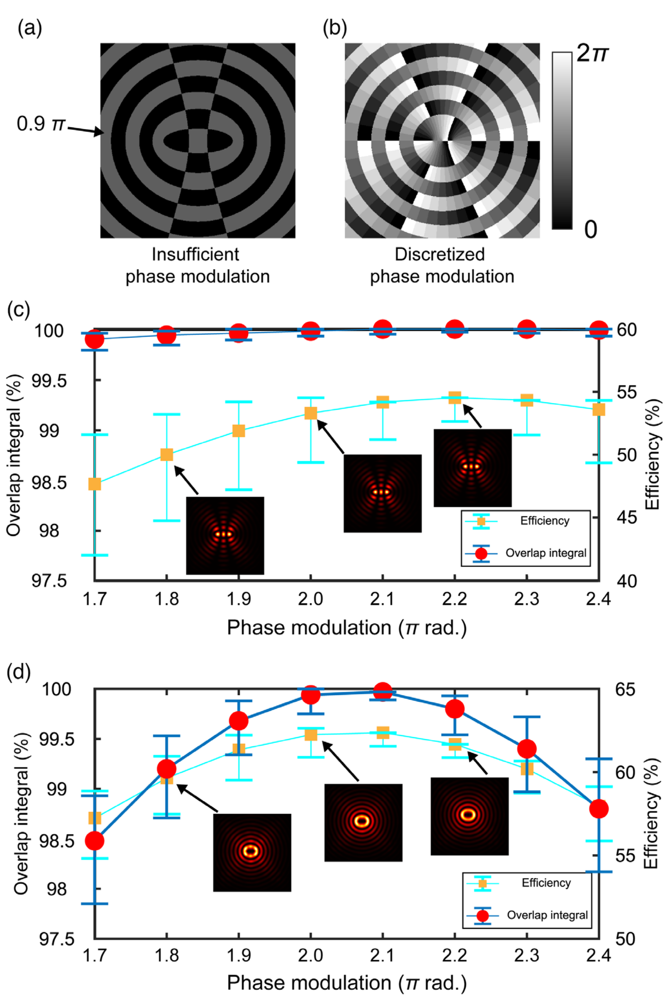

# 数学模型与物理公式 (Mathematical Models & Formulas)

> 本页为 [[mathematical-models|物理模型与数学公式]] 的子页面：介电函数、光学响应、非线性光学公式。

[[科研Wiki/wiki/figures/_index|← 返回总索引]]

---

## ⚛️ 光学模型与器件公式 (Optical Models & Devices)

[[mathematical-models|← 返回数学模型与物理公式]]

### 1. 公式：倏逝场 Ez=E0·exp(−z/dp)
倏逝场 Ez=E0·exp(−z/dp)

*   **来源**：[[../papers/2019optical]]

### 2. 公式：穿透深度 dp=λ/(2nπ√(sin²θ−n²))
穿透深度 dp=λ/(2nπ√(sin²θ−n²))

*   **来源**：[[../papers/2019optical]]

### 3. TPP原理与体素尺寸理论预测（I vs I²、阈值效应、D 随驻留时间/功率/NA 变化）
TPP原理与体素尺寸理论预测（I vs I²、阈值效应、D 随驻留时间/功率/NA 变化）

*   **来源**：[[../papers/Kumar2017microstructuring]]

### 4. 公式：高斯光束强度分布 I(r,z)
高斯光束强度分布 I(r,z)

*   **来源**：[[../papers/Kumar2017microstructuring]]

### 5. 公式：束宽 w(z) 随离焦量 z 的变化
束宽 w(z) 随离焦量 z 的变化

*   **来源**：[[../papers/Kumar2017microstructuring]]

### 6. 双光子波函数频谱
双光子波函数频谱

*   **来源**：[[../papers/Nakanishi2009full]]

### 7. 时域波函数
时域波函数

*   **来源**：[[../papers/Nakanishi2009full]]

### 8. 公式：Kubelka–Munk函数
Kubelka–Munk函数

*   **来源**：[[../papers/Tobeiha2025optical]]

### 9. 公式：Tauc公式
Tauc公式

*   **来源**：[[../papers/Tobeiha2025optical]]

### 10. 公式：Tauc关系式
Tauc关系式

*   **来源**：[[../papers/Blessing2026optical]]

### 11. 整体高度误差与相位离散化误差对偶/螺旋光束重叠积分和效率的影响
整体高度误差与相位离散化误差对偶/螺旋光束重叠积分和效率的影响

*   **来源**：[[../papers/Wang2023ultracompact]]

### 12. 方差分析
方差分析

*   **来源**：[[../papers/Owji20212d]]

### 13. 公式：Z扫描透射率公式
Z扫描透射率公式

*   **来源**：[[../papers/shuTwoDimensionalBlackArsenic2020]]

### 14. 公式：单光子吸收模型
单光子吸收模型

*   **来源**：[[../papers/shuTwoDimensionalBlackArsenic2020]]

### 15. 公式：时间带宽积公式
时间带宽积公式

*   **来源**：[[../papers/shuTwoDimensionalBlackArsenic2020]]

### 16. 公式：(1) 饱和水汽压经验公式
(1) 饱和水汽压经验公式

*   **来源**：[[../papers/XiaokangZhang2013calibrating]]

### 17. 公式：(2) 列号 k = A_T − 249
(2) 列号 k = A_T − 249

*   **来源**：[[../papers/XiaokangZhang2013calibrating]]

### 18. 公式：(3) RH(%) = (i + 299)/10
(3) RH(%) = (i + 299)/10

*   **来源**：[[../papers/XiaokangZhang2013calibrating]]

---

## 🔗 相关概念与实体 (Related Concepts & Entities)

**核心概念**：[[../concepts/density-functional-theory|密度泛函理论 (DFT)]]、[[../concepts/paw-method|投影增强波法 (PAW/USPP)]]、[[../concepts/berry-phase|Berry 相与现代极化理论]]、[[../concepts/born-effective-charge|Born 有效电荷]]、[[../concepts/ferroelectricity|铁电性]]、[[../concepts/multiferroicity|多铁性]]、[[../concepts/charge-density-wave|电荷密度波 (CDW)]]、[[../concepts/flexoelectric-effect|挠曲电效应]]、[[../concepts/peierls-distortion|Peierls 畸变]]、[[../concepts/superconducting-dome|超导穹顶]]

**相关材料/实体**：[[../entities/h-BN|h-BN]]、[[../entities/graphene|石墨烯]]、[[../entities/TMDs|过渡金属二硫化物 (TMDs)]]、[[../entities/NbSe2|2H-NbSe₂]]、[[../entities/BiFeO3|BiFeO₃]]、[[../entities/HZO|HfZrO (HZO)]]、[[../entities/In2Se3|In₂Se₃]]、[[../entities/BaTiO3|BaTiO₃]]、[[../entities/WTe2|WTe₂]]

