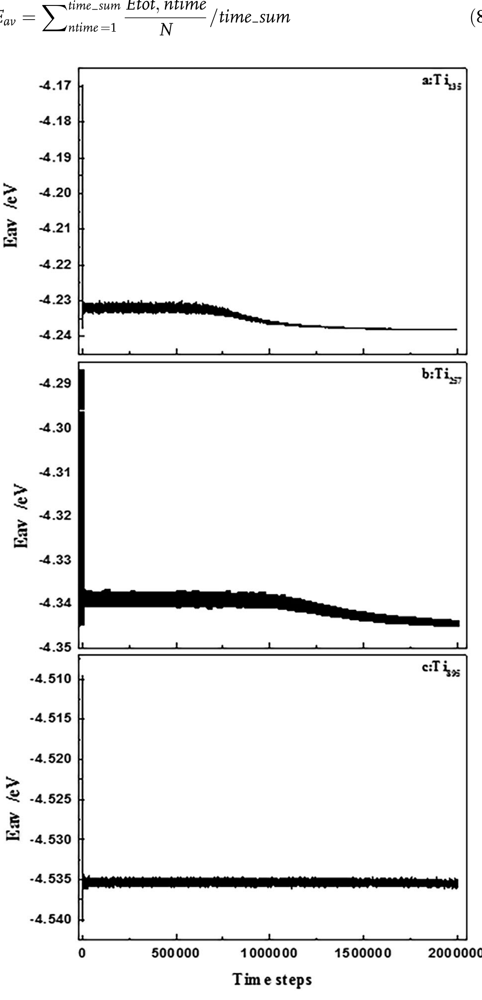
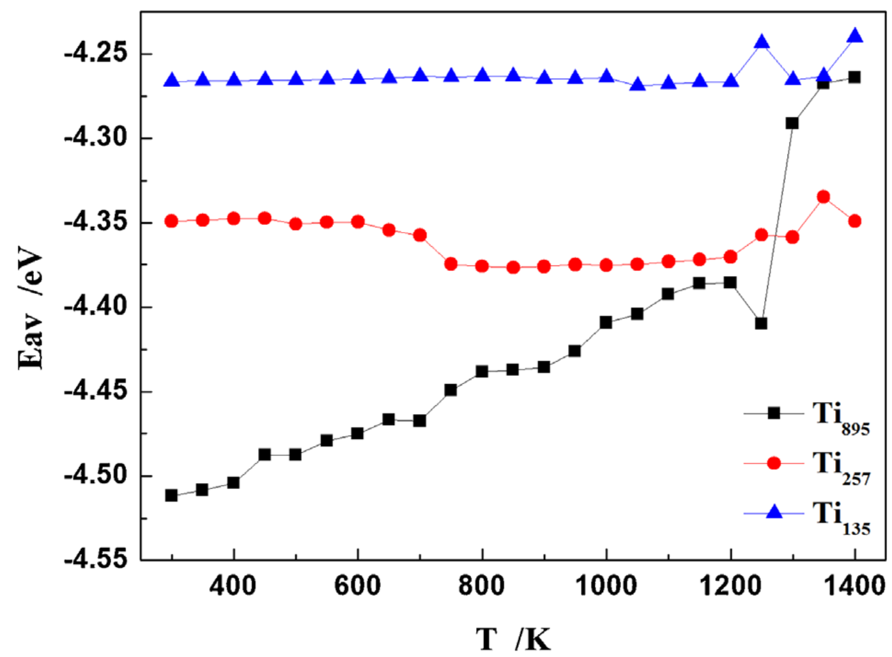
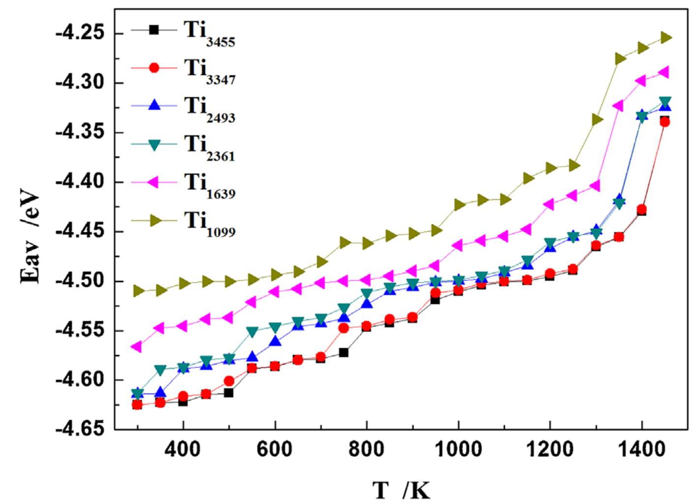
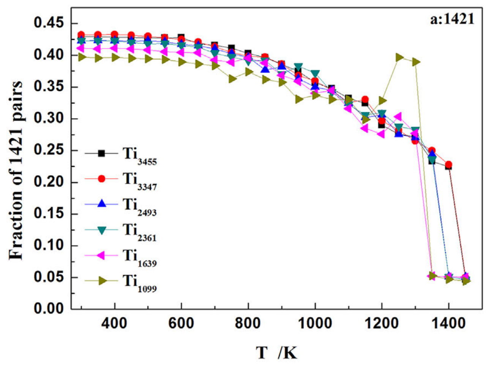
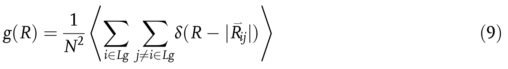

---
tags:
  - type/figure-collection
---

# 理论模型与计算方法：模拟与数值结果

> 属于 [[mathematical-models|理论模型与计算方法]]

## 条目

### 1. 图4 φ=π/2 时的 CDW 原子位移模式（蓝色原子构成未畸变子晶格）；插图为总能量随 φ 的变化，固定 μ 与固定 N 两种极端均在 π/2 取极小

*   **来源**：[[../papers/Barnett2006coexistence]]
*   **图示描述**：主图为 Σ1 对称位移在 φ=π/2 时 3×3 超胞内的 Ta 原子位移箭头图，颜色标出三套子晶格；插图为总能量 E_tot 随相位 φ（以 π 为单位）的变化，对比固定化学势 μ 与固定粒子数 N 两种极限。
*   **关键特征**：对任意 φ，总有一套子晶格（图中蓝色原子）位移严格为零；φ=π/2 时位移图案呈"风车/三叶草"状，与 STM 观测到的电荷极大位置一致；两种化学势条件下 E_tot 均在 φ=π/2 取全局极小；将 t₆ 置零后极小位置不变，结论对参数稳健。

### 2. Si原胞总能量随倒空间网格阶数的指数收敛

*   **来源**：[[../papers/Delley2000]]
*   **图示描述**：纵轴为 Si 原胞总能量相对于收敛极限的差值（单位 mHa，1 Ha ≈ 27.2114 eV），横轴为 Monkhorst–Pack 倒空间网格阶数；实心点为包含 Γ 点的未平移网格，空心点为平移网格（shifted meshes）。
*   **关键特征**：随网格阶数从 2 增至 14，总能量差呈典型的**指数收敛**，这是绝缘体/半导体因带隙存在、被积函数光滑的标志；平移网格在同阶数下误差普遍低于未平移网格（如 10 阶平移与 14 阶未平移相当），但考虑对称性约化后两者特殊 k 点数接近（14 阶未平移 104 个、10 阶平移 110 个）；默认 δk = 0.03 a.u. 对应 Si 原胞取 6 阶网格。

### 3. 图1 偶/螺旋MG光束生成原理（相位调制+4-f滤波+传播不变性模拟）

*   **来源**：[[../papers/Wang2023ultracompact]]
*   **图示描述**：分组(a1-c1)为偶 MG 光束(m=2, q=12)、(a2-c2)为螺旋 MG 光束(m=3, q=2)的生成原理数值模拟；(a) 为 1550 nm 高斯光加载马蒂厄相位后经 f1=30 mm 透镜得到的环状傅里叶谱，(b) 为环形狭缝滤波后经 f2=300 mm 透镜重构的横向光强，(c) 为沿传播轴 z 的强度分布。
*   **关键特征**：未滤波谱含主环加多个外围弱环，理想马蒂厄光束谱仅有一条无限细主环；主环半径 R=k_tλf1/(2π)、宽度 ΔR=2λf1/(ω0π)；重构光斑已近似理想椭圆晶格/椭圆环；(c) 显示横向模式在有限距离内保持不变，即传播不变性；仿真中焦距 c 分别取 50 μm(偶)与 19 μm(螺旋)。

### 4. Mülliken布居差

*   **来源**：[[../papers/Wei2021]]
*   **图示描述**：纵轴为最大与最小 Mülliken 电荷之差（单位 e），横轴为手性指数 n；对比纯 CNT 中 C 原子，以及 N-CNT 中 C 原子、N 原子、全部原子四类电荷差。
*   **关键特征**：纯 CNT 中 C 原子电荷差在 (3,0) 最大，n>7 后消失，电荷分布趋于均匀；N-CNT 中 C 原子间电荷差始终存在且小管径振荡明显，表明氮持续扰动碳骨架电荷分布；电荷转移主要发生在 C-N 键上，小管径极化效应最强；大管径时 C-C 与 N-N 原子间布居差趋近，曲率效应减弱。

### 5. Mülliken布居可视化

*   **来源**：[[../papers/Wei2021]]
*   **图示描述**：用颜色（黄→橙色表示失电子程度增加）编码一个含两个碳环与两个氮环的重复单元内每个原子的 Mülliken 电荷，直观展示得失电子空间分布。
*   **关键特征**：(3,0) 管中与 C 相连的三个 N 呈黄→橙色明显失电子，相邻 C 得电子；(4,0)/(5,0) 管 N 间电荷差近零，电荷转移主要发生在 C 之间，内部 C 得电子、邻 N 的 C 失电子；(6,0)/(7,0)/(8,0) 管沿管轴 N-N 键上的 N 失电子更多、C-C 键上的 C 得电子更多；(9,0) 管半数 N 失电子、内部 C 得电子；大管径时空间布居模式趋于相似。

### 6. 公式1 吸附能定义 Eads = Etot(Sislab) + E(Ge) − Etot(Ge/Sislab)

*   **来源**：[[../papers/Wu2018]]
*   **图示描述**：Eads(Ge/Si_slab) = Etot(Si_slab) + E(Ge) − Etot(Ge/Si_slab)，其中E(Ge)取自S-K文件中Ge的s、p轨道能量之和。
*   **关键特征**：该定义下Eads为正值表示放热吸附，正值越大吸附后体系越稳定；与常见"负值吸附能"约定符号相反，阅读图6和表3时须注意。

### 7. 表2 未重构与重构表面总能量及表面能（重构降低表面能0.0458/0.0469 eV/Ų）

*   **来源**：[[../papers/Wu2018]]
*   **图示描述**：列出US1/US2（未重构初始平板）与p(2×2)/c(4×2)重构平板的总能量、表面能及能量差Δγ。
*   **关键特征**：块体Si单原子能为−34.2776 eV；p(2×2)重构使表面能降低0.0458 eV/Ų，c(4×2)降低0.0469 eV/Ų；表面能按γ=(E_slab−N·E_bulk)/(2A)计算。

### 8. 表3 Ge原子稳定吸附构型参数汇总（初始高度、吸附能、键长、翘曲角、布居数）

*   **来源**：[[../papers/Wu2018]]
*   **图示描述**：论文最核心数据表，列出18种稳定构型的初始高度h、吸附能Eads、Ge–Si距离、二聚体键长、翘曲角及Ge和两个Si原子的Mulliken布居数。
*   **关键特征**：最高吸附能出现在p(2×2)表面Top_SiA、h=4.1 Å构型，Eads=5.07 eV，对应二聚体键长2.31 Å、翘曲角最大；顶位上翘构型Ge布居2.65–2.73；中心桥位构型翘曲角1.1°–2.2°、Ge布居3.04–3.11；偏心桥位偏向上翘Si时翘曲角可达23.3°、Ge布居2.57。

### 9. 图4 p(2×2)和c(4×2)表面Mulliken电荷布居等高线图（上翘原子得电荷>4.00，下陷原子失电荷<4.00；p(2×2)呈带状，c(4×2)呈块状）

*   **来源**：[[../papers/Wu2018]]
*   **图示描述**：(a) p(2×2)、(b) c(4×2)重构上表面的Mulliken总布居等高线图；色标范围3.55–4.75，中性Si价电子数为4.00。
*   **关键特征**：绿/黄/红区(>4.00)为得电荷区，对应上翘原子SiA、SiD；浅蓝/深蓝/黑区(<4.00)为失电荷区，对应下陷原子SiB、SiC；p(2×2)得失电荷区沿[1-10]方向呈间隔带状，c(4×2)呈间隔块状；翘曲角越大，二聚体内部电荷转移越明显。

### 10. 图6 吸附能随初始高度h变化曲线（p(2×2)最高约5.6 eV，c(4×2)最高约4.8 eV，多峰谷波动）

*   **来源**：[[../papers/Wu2018]]
*   **图示描述**：横轴为初始高度h(Å)，纵轴为吸附能Eads(eV)；(a) p(2×2)、(b) c(4×2)两种表面；黑方块=上翘原子顶位、红圆点=下陷原子顶位、蓝三角=二聚体桥位。
*   **关键特征**：Eads按式(1)定义为正值，越大越稳定；曲线随h呈非单调波动，存在多个局域极大（如p(2×2)上Top_SiA在h=1.8、2.8、4.1 Å处出现4.6–5.2 eV的峰）；p(2×2)最高约5.6 eV、最低约3.8 eV，c(4×2)最高约4.8 eV、最低约3.5 eV；c(4×2)桥位在h=3.3 Å处出现4.65 eV平台峰。

### 11. 图8 Ge原子与二聚体局部Mulliken电荷布居（Ge布居2.57–3.11，总是失电荷）

*   **来源**：[[../papers/Wu2018]]
*   **图示描述**：与图7(a1)–(f3)一一对应的Ge原子及紧邻Si二聚体区域的Mulliken布居等高线放大图。
*   **关键特征**：所有Ge原子布居数2.57–3.11（<4.00），即Ge总是失电荷；顶位吸附于上翘Si时Ge失电荷最多(布居2.65–2.73)，二聚体恢复"一得一失"模式，上翘原子得、下陷原子失；中心桥位时Ge布居3.04–3.11（失电荷较少），两个Si原子均得电荷(布居4.00–4.29)；偏心桥位偏向下陷Si时Ge布居3.07–3.09、二聚体均得电荷4.25–4.39、翘曲角降至5.7°–5.8°；偏向上翘Si时Ge布居2.57–2.78、翘曲角增大至11.4°–23.3°。

### 12. 图9 整个表面Mulliken电荷分布全局图

*   **来源**：[[../papers/Wu2018]]
*   **图示描述**：与图7、图8一一对应的(a1)–(f3)全局表面电荷等高线图，显示Ge吸附对周边更大范围Si原子电荷重分布的影响。
*   **关键特征**：顶位吸附构型中，紧邻二聚体的表面原子出现明显的得/失电荷分化，与图4清洁表面的条带/块状图案相比发生局部重构；桥位吸附构型中二聚体附近整体呈得电荷区，图案趋于均匀；偏心桥位构型的电荷图案介于顶位与桥位之间。

### 13. 表1：22个稳定构型的Eave、h、θ

*   **来源**：[[../papers/Wu2021]]
*   **图示描述**：表格列出图3–7中A1–F4共22个稳定构型对应的平均原子能量Eave（eV）、初始高度h（Å）和偏转倾角θ（°）。
*   **关键特征**：Eave区间−33.565 eV至−33.557 eV，能量差仅约8 meV/atom，说明22个构型近简并；B1（h=3.4 Å, θ=0°）、B2（h=2.8 Å, θ=0°）、F1（h=1.3 Å, θ=150°）并列最低Eave=−33.565 eV但构型迥异；A区3个、B区7个、C区2个、D区1个、E区5个、F区4个，B区构型最丰富。

### 14. Eave随初始高度h和倾角θ变化的能量景观图，标出A–F六个低能区

*   **来源**：[[../papers/Wu2021]]
*   **图示描述**：二维等高线能量景观图，横轴为倾角θ（0°–170°），纵轴为初始高度h（1.0–5.2 Å），颜色由深蓝到红代表每原子平均能量Eave由低到高；图中标出A–F六个低能稳定区。
*   **关键特征**：A区h>3.5 Å、θ≈20°–150°，倾向垂直吸附；B区h=2.5–3.5 Å、θ≈0°–20°，C区h=2.5–3.5 Å、θ≈160°–180°，二者接近Si–Ge键长2.397 Å，倾向平行/小角度吸附；D区h≈1.1–1.5 Å、θ≈40°–50°，E区h≈1.5–2.5 Å、θ≈120°–170°，F区h≈1.0–1.5 Å、θ≈120°–180°，为低高度大倾角区；774个构型中筛出22个稳定结构，最低Eave=−33.565 eV（B1、B2、F1能量简并但构型不同）。

### 15. A区垂直吸附构型DVTS/DVBS及Mülliken布居分布

*   **来源**：[[../papers/Wu2021]]
*   **图示描述**：展示A区A1–A3三个构型，每列含(a)俯视图、(b)侧视图、(c)Mülliken总布居等高线；A1、A2为Ge二聚体垂直顶位吸附（DVTS，Ge2落在Si2顶位），A3为垂直桥位吸附（DVBS，Ge2同时键合Si1和Si2）。
*   **关键特征**：Ge–Ge键由初始2.239 Å拉长至2.85/2.85/2.81 Å；DVTS使下方Si二聚体键从2.60 Å显著缩短至2.30–2.31 Å、键能从5.358 eV升至8.024–8.160 eV，但弯曲角变化小；DVBS使Si键仅拉长0.03 Å至2.63 Å、键能降至4.434 eV，Si二聚体趋于平行表面；两个Ge原子均失电子且远离表面的Ge1失电子更多，DVTS失电荷显著多于DVBS；DVTS中Si2由得电子反转为失电子，DVBS中Si1则由失电子反转为得电子。

### 16. 图2：连续冷却曲线离散为等温阶梯的近似处理

*   **来源**：[[../papers/Zhang2002b]]
*   **图示描述**：纵轴为温度 T、横轴为时间 t，将一条斜率为 −Q 的平滑连续冷却曲线，分解为一系列微小温度区间内的等温保持台阶。
*   **关键特征**：每个台阶内可套用等温形核率 I(T)；连续冷却下新增晶核密度由 n = ∫(I/Q)(1−f) d(ΔT) 给出（式 2、13）；冷却速率 Q 体现在台阶下降的快慢。

### 17. 图3：铁素体在奥氏体晶界形核并向晶内生长示意

*   **来源**：[[../papers/Zhang2002b]]
*   **图示描述**：几个多边形奥氏体晶粒的截面，新生铁素体晶粒（深色）优先出现在奥氏体晶界交汇处和晶界面上，再向奥氏体晶粒内部推进。
*   **关键特征**：明确"晶界优先形核"假设，奥氏体晶界上的每个元胞都是潜在形核点；铁素体生长前沿为 α/γ 界面，远离研究区的边界 B 取恒温 T∞；形核后向晶内排碳并释放潜热。

### 18. 图6：Q = 1 K/s 下铁素体形核–生长–最终组织的演化快照

*   **来源**：[[../papers/Zhang2002b]]
*   **图示描述**：Fe–0.15C–0.09Si–0.4Mn 等合金从 1320 K 以 1.0 K/s 连续冷却到室温的三幅模拟快照（0.6×0.6 mm，200×200 元胞），不同灰度代表不同取向的铁素体晶粒：(a) 晶界零星形核（白色方块标记），(b) 大量晶粒形核并向晶内生长，(c) 最终大小不一的铁素体晶粒加晶界/晶内深色渗碳体小块。
*   **关键特征**：形核贯穿整个冷却过程而非一次性完成；先形核晶粒向邻近奥氏体排碳、释放潜热，使邻区 c 升高、T 升高、Ae3 下降、过冷度 ΔT 减小，从而抑制后续形核；扩散不均可解释最终晶粒尺寸分布的不均；未及扩散的富碳区在降温到渗碳体形成温度时析出深黑色渗碳体并钉扎界面。

### 19. 图7：不同冷速（0.05–5.0 K/s）下实验光学金相与模拟组织对比

*   **来源**：[[../papers/Zhang2002b]]
*   **图示描述**：上排 (a)–(d) 为连续冷却转变后的光学显微照片，下排 (e)–(h) 为对应 CA 模拟组织；冷速依次为 0.05、0.17、1.25、5.0 K/s，初始奥氏体晶粒尺寸均为 126 μm，起始温度 1323 K。
*   **关键特征**：随冷速增大，实验平均铁素体晶粒尺寸由约 106 μm 细化到约 33 μm，模拟由约 108 μm 细化到约 38 μm，趋势与量级吻合；高冷速下大过冷度同时激活大量晶界形核点，且溶质来不及扩散、渗碳体在生长前沿析出钉扎界面，故晶粒细小；低冷速下形核少、扩散充分，晶粒粗大。

### 20. 表1：Si/Mn/Ni/Cu/Cr的Zener参数ΔT_i^M与ΔT_i^NM

*   **来源**：[[../papers/Zhang2003a]]
*   **图示描述**：表1列出五种合金元素 Si、Mn、Ni、Cu、Cr 对应的两个 Zener 参数 ΔT_i^M 与 ΔT_i^NM（单位：°C/at.%），用于式4计算超元素 S 的自由能变化。
*   **关键特征**：Mn 的影响最大（ΔT^M = −39.5、ΔT^NM = −37.5），Cr 次之（−18、−19），Si 最小（0、−3）；Ni（−18、−6）、Cu（−11.5、−4.5）介于其间；这些参数把置换型合金元素对相变驱动力的影响以线性叠加方式纳入形核公式，是"超元素 S"近似的关键数据支撑。

### 21. Fe-C合金示意相图与Ae3线

*   **来源**：[[../papers/Zhang2003a]]
*   **图示描述**：简化的 Fe-C（超元素 S-C）二元相图局部，横轴为碳浓度 c，纵轴为温度 T，标出 γ 相区、α+γ 两相区及 γ 相线 Ae3。
*   **关键特征**：给定合金碳浓度 c 时，Ae3 线上的对应温度即为该成分下奥氏体开始向铁素体转变的平衡温度；过冷度 ΔT = Ae3 − T 即以此为基准，是后续形核率与生长速度公式的热力学起点。

### 22. 形核元胞数n_nuc随过冷度ΔT：I区上升II区饱和（561/1352/1590）

*   **来源**：[[../papers/Zhang2003a]]
*   **图示描述**：横轴为过冷度 ΔT = Ae3_0 − T（°C），纵轴为形核元胞数 n_nuc（无量纲），三条曲线分别对应 11、41、61 °C/s 冷速。
*   **关键特征**：每条曲线在 I 区随 ΔT 快速上升、在 II 区趋于饱和；饱和值随冷速增大而显著升高，分别为 561（11 °C/s）、1352（41 °C/s）、1590（61 °C/s）；形核过程在过冷早期（I 区）即已基本完成。

### 23. 铁素体转变分数Y随过冷度ΔT

*   **来源**：[[../papers/Zhang2003a]]
*   **图示描述**：横轴为过冷度 ΔT（°C），纵轴为铁素体转变分数 Y = (n_nuc + n_grow)/n_cell（%），三条曲线对应 11、41、61 °C/s 冷速。
*   **关键特征**：三种冷速下 Y 的饱和值几乎相同；高冷速因渗碳体提前析出消耗部分碳，饱和值略低；结合图7可知，低冷速下形核数少而总转变量相当，因此每个铁素体晶粒可分得更多碳、扩散更充分，最终长得更大。

### 24. 形核分数Y_nuc随ΔT：高冷速下早期剧烈振荡

*   **来源**：[[../papers/Zhang2003a]]
*   **图示描述**：横轴为过冷度 ΔT（°C），纵轴为形核分数 Y_nuc = n_nuc/(n_nuc + n_grow)（无量纲），对比 11 °C/s 与 61 °C/s 两条曲线。
*   **关键特征**：61 °C/s 曲线在 ΔT < 95 °C 的早期区间出现剧烈振荡且数值明显高于低冷速曲线；振荡反映形核与生长在空间和溶质上的激烈争夺，高 Y_nuc 表明此阶段形核主导而非生长主导；低冷速下曲线平缓，形核与生长交替较温和。

### 25. 图1 Ti135/Ti257/Ti895弛豫过程每原子能量随时间步变化

*   **来源**：[[../papers/Zhang2019a]]
*   **图示描述**：三条曲线分别给出Ti135、Ti257、Ti895在50 K初始弛豫阶段每原子总势能（eV/atom）随模拟时间步的变化。
*   **关键特征**：所有粒子从人为切割的高能HCP构型起步，能量快速跌落并进入振荡平衡；Ti135、Ti257出现阶梯式再次下降，标志从HCP向更低能量的Ih等结构发生相变；Ti895仅平滑下降后平稳，保持初始HCP；直接证明小粒子表面原子比例高、低温即自发重构。

### 26. 图3 小尺寸粒子平均能量-温度曲线

*   **来源**：[[../papers/Zhang2019a]]
*   **图示描述**：Ti135、Ti257、Ti895在300–1400 K逐级加热中的每原子平均势能$E_{\text{av}}$（eV/atom）对温度（K）曲线。
*   **关键特征**：Ti135在750 K附近出现平台/下降，300 K因表面比例最高而整体能量最高；Ti257在600 K以下不稳定、700–1200 K出现长平台，1200 K后再变；Ti895在1300 K以下近线性上升、1300 K斜率突变进入熔化（二分法定位熔点1260 K）；三条曲线对比直观呈现尺寸依赖的多形转变与类块体熔化。

### 27. 图6 大尺寸粒子（Ti1099–Ti3455）能量-温度曲线

*   **来源**：[[../papers/Zhang2019a]]
*   **图示描述**：Ti1099、Ti1639、Ti2361、Ti2493、Ti3347、Ti3455六个直径3.36–5.03 nm粒子的$E_{\text{av}}$–$T$曲线（eV/atom vs K）。
*   **关键特征**：熔化前能量随温度近线性增加，误差棒小，结构稳定；熔点处能量阶跃上升，且直径越大熔点越高、熔化前势能越低；Ti1099误差棒略大，暗示其熔化前有少量HCP→FCC局部转变（与图7一致）；整体呈现"表面预熔—整体崩溃"的类块体熔化模式。

### 28. 图8 ΔEav/ΔT斜率随原子数N变化（杜隆-珀蒂1.5kB边界）

*   **来源**：[[../papers/Zhang2019a]]
*   **图示描述**：高温区势能-温度斜率$\Delta E_{\text{av}}/\Delta T$对粒子原子数$N$的散点图，并以1.5$k_B$水平线作杜隆-珀蒂参照。
*   **关键特征**：$N<800$（约$d<3$ nm）的粒子斜率远低于1.5$k_B$，Ti135、Ti257甚至为负，因加热中朝更低势能的Ih等结构转变；$N\ge 895$后斜率稳定在约1.5$k_B$，与块体晶体势能贡献一致；Ti135取1050–1200 K、Ti257取850–1200 K、其他取300–1200 K拟合；该图把经典热力学的纳米尺度适用边界定在~3 nm。

### 29. 对分布函数公式 Eq.9

*   **来源**：[[../papers/Zhang2019a]]
*   **图示描述**：对分布函数$g(R)$的统计定义，用于在模拟轨迹中识别晶态/液态短程序。
*   **关键特征**：$g(R)\propto\langle\sum_{i\ne j}\delta(R-|R^*_{ij}|)\rangle$，对全部原子对距离作直方图并在整条轨迹上平均；尖锐多重峰对应HCP/FCC/Ih晶态，宽化单峰对应液态；是图4判熔化的核心定量指标。

### 30. Fe2 分子动力学能量守恒

*   **来源**：[[../papers/blochlProjectorAugmentedwaveMethod1994b]]
*   **图示描述**：单图三条曲线，横轴为模拟时间（ps），纵轴为相对于初始值的能量（eV）；点划线为 LDA 总能量（Born-Oppenheimer 势能面），虚线为波函数虚拟动能，实线为守恒总能量。
*   **关键特征**：势能面与虚拟动能呈规整反相周期振荡，周期对应振动频率约 441 cm⁻¹；守恒能量在 0.5 ps 内漂移 <0.8 meV，无系统性单调漂移；虚拟动能振荡是波函数在势能面上的绝热运动，并非偏离 BO 面；对应核质量重整化约 8%。

### 31. 图2 CrS₂、CrSe₂、CrTe₂在双轴应变(εx, εy)下的总能量地形图，显示NM-CDW与FM-CDW两个能谷及其间势垒（101/35.1/5.9 meV/f.u.）

*   **来源**：[[../papers/chenFerromagneticNonmagnetic1T2022]]
*   **图示描述**：三个面板分别为CrS₂、CrSe₂、CrTe₂在双轴应变（εx约−4%~14%，εy约−2%~7%）平面上的总能量等高线图，以1T′ NM-CDW基态为能量零点，颜色越暖能量越高。
*   **关键特征**：每张图均出现两个能谷，分别对应1T′ NM-CDW与1T′ FM-CDW；分隔两谷的最小势垒由CrS₂→CrSe₂→CrTe₂依次为约101、35.1、5.9 meV/f.u.；沿S→Se→Te，1T′-NM能量相对1T′-FM升高，NM谷变浅；CrS₂两谷能量接近且势垒显著（高于室温热能~26 meV），预示环境条件下两相可共存。

### 32. 图2 极化反转动力学路径：(a)中心Se直接位移能垒0.85 eV；(b)三步协同运动路径能垒仅0.066 eV

*   **来源**：[[../papers/dingPredictionIntrinsicTwodimensional2017a]]
*   **图示描述**：横轴为 CI-NEB 反应坐标（极化向下的 FE-ZB' 初态 → 极化向上的等价终态），纵轴为相对总能量；(a)为中心 Se 层直接从 B 位横向滑移到 C 位的路径，(b)为上三层 Se-In-Se 协同运动的三步路径。
*   **关键特征**：直接位移路径的活化势垒高达 0.85 eV/单胞（图中按 1/10 比例缩小显示），室温下几乎不可逾越；三步协同路径依次为：上三层整体滑移到亚稳 fcc'、中心 Se 绕 C 位旋转 60°、顶二层沿旋转 60° 方向再滑移，最高势垒仅 0.066 eV/单胞，与经典铁电体 PbTiO3 相当；面外极化反转同步带动面内 [110] 极化反转，二者相互锁定。

### 33. 图1 上：氧K边EELS实验谱与LSDA/LSDA+U计算的O 2p空态DOS对比；下：总能量随晶格常数变化曲线

*   **来源**：[[../papers/dudarevElectronenergylossSpectraStructural1998a]]
*   **图示描述**：上半部分为归一化的氧 K 边实验 EELS 谱（实线，能量轴已平移 528.3 eV 以对齐 O 1s 芯能级）与 LSDA、LSDA+U（Ū=6.2 eV 和 8.0 eV）计算的 O 2p 空态密度（虚线，经高斯展宽模拟 0.4–0.5 eV 仪器/寿命分辨率）的对比；下半部分为 LSDA 与 LSDA+U 每 NiO 单元总能量随晶格常数的变化曲线。
*   **关键特征**：(1) LSDA 两主峰间距比实验大 ~2 eV，且低能 O 2p–Ni 3d 杂化峰权重过高；(2) Ū=6.2 eV 时两峰间距与低能峰强度均显著贴近实验，Ū=8.0 eV 也优于 LSDA 但峰距偏差稍大；(3) 能量极小值从 LSDA 的 4.08 Å 右移至 LSDA+U（Ū=6.2 eV）的 4.19 Å，接近实验值 4.17 Å（Ū=8.0 eV 给出 4.22 Å）；(4) 对应的 LSDA+U 带隙为 3.0 eV（Ū=8.0 eV 为 3.2 eV），高于 LSDA 的 0.6 eV 但仍低于实验 4.2 eV。

### 34. 图6 外电场方向 (a) 与四态（FE-AFM/FE-FM/AFE-AFM/AFE-FM）能量随电场变化，0.82 V/Å 处发生 FE-AFM ↔ AFE-FM 切换

*   **来源**：[[../papers/fengFerroelectricityMultiferroicityTwodimensional2020]]
*   **图示描述**：(a) 沿极化方向施加外电场的几何示意；(b) FE-AFM、FE-FM、AFE-AFM、AFE-FM 四种态的能量随外电场强度（V/Å）的演化曲线。
*   **关键特征**：FE 与 AFE 能量对电场均呈二次关系，但 FE 相变化斜率更大；静态磁交换能本身几乎不随电场改变，切换由静电能驱动；临界电场 ≈0.82 V/Å 处基态由 FE-AFM 转为 AFE-FM；反向电场可实现可逆翻转，构成"电写磁读"原型。

### 35. Eform = (E_Sc2P2Se6 − 2μSc − 2μP − 6μSe)/n

*   **来源**：[[../papers/fengFerroelectricityMultiferroicityTwodimensional2020]]
*   **图示描述**：Sc₂P₂Se₆ 单层的形成能定义，E_Sc2P2Se6 为 FE 相总能量，μ_Sc、μ_P、μ_Se 为对应体相化学势，n 为原胞原子数。
*   **关键特征**：计算值 −0.922 eV/atom，负值表明热力学稳定；配合无虚频声子谱共同确认结构可合成性。

### 36. tab_1

*   **来源**：[[../papers/fengFerroelectricityMultiferroicityTwodimensional2020]]
*   **图示描述**：AFE 相 2×1×1 超胞中 FM、AFM1、AFM2、AFM3 相对 FM 构型的总能量，以及 Cr1–Cr2、Cr1–Cr3、Cr1–Cr4 三条路径的最近邻交换耦合参数。
*   **关键特征**：EFM=0、EAFM1=23.3、EAFM2=33.8、EAFM3=21.6 meV（均高于 FM，确认 FM 为基态）；J1=0.25、J2=0.22、J3=0.08 meV，全部为正，按 Goodenough–Kanamori 规则对应 FM 超交换；J1 路径（Cr1–Cr2）p-d 杂化最强，与 PDOS 结果一致。

### 37. 图4 T=0 K 三链 |D₂⟩ 模型中 A/E/L 三种初始激发的概率演化

*   **来源**：[[../papers/fornerQuantumTemperatureEffects1993]]
*   **图示描述**：T = 0 K、|D₂⟩ 态、标准参数（W=13 N/m, M=114 mₚ, X=62 pN, J=0.967 meV, L=1.54 meV）下三条耦合链共 60 格点上 |α_n(t)|² 的时空演化，分别对应对称 A 模式、简并 E 模式（a_{n1}=0, a_{n2}=1/√2, a_{n3}=−1/√2）和单链局域激发 L。
*   **关键特征**：A 模式下三条链上各形成一个完全相同、同步移动的局域脉冲；E 模式下孤子仅在两条链上反向传播；局域激发下孤子主要留在原链，仅小部分能量转移到邻链；未观察到 Scott 曾报道的孤子整条跳链现象。

### 38. 图5 图4 三种激发各取一条链的展示，孤子形态相似

*   **来源**：[[../papers/fornerQuantumTemperatureEffects1993]]
*   **图示描述**：将图 4 中 A、E、L 三种初始激发各取一条代表性链单独绘出的概率演化图，便于跨模式比较孤子形状与速度。
*   **关键特征**：三种激发下孤子的脉宽、振幅和传播形态高度相似；穿越整条 20 格点链所需时间均约为 40 ps；表明初始激发对称性对孤子宏观动力学影响很小。

### 39. 图6 单链 W=13/M=114m_p 与 W=39/M=342m_p 对比，验证 3 倍参数才能复现三链

*   **来源**：[[../papers/fornerQuantumTemperatureEffects1993]]
*   **图示描述**：|D₂⟩ 态、T = 0 K 下两组单链模拟的概率演化对比：上图采用标准参数 W=13 N/m、M=114 mₚ，下图采用 Scott 建议的 3 倍参数 W=39 N/m、M=342 mₚ。
*   **关键特征**：标准参数单链给出的孤子速度/形态与图 5 三链 A 模式明显不符；3 倍参数单链则在孤子形状、穿越时间（约 40 ps）和晶格位移模式上精确复现三链结果；该一致性对 A、E、L 三种激发均成立。

### 40. 图7 |D₁⟩ 态 A 模式：三链与标准参数单链一致，无需重整化（X=62 与 180 pN）

*   **来源**：[[../papers/fornerQuantumTemperatureEffects1993]]
*   **图示描述**：T = 0 K、|D₁⟩ 态下对称 A 模式的三链显式模拟与标准参数单链模拟对比；(a) X=62 pN，(b) 取较大值 X=180 pN（因 |D₁⟩ 零温行波孤子阈值 X > 150 pN）。
*   **关键特征**：三链 A 模式与单链（M、W 均不取 3 倍）结果完全重合；X=180 pN 时两者均出现移动孤波；数学根源是相干态振幅方程中链间耦合项含 (b_{n,k,α±1}−b_{n,k,α})=0 而自动消失，D_{nα,nα±1}=1。

### 41. 图8 T=300 K 三链 |D₁⟩ 局域激发下不同 (W,X) 的孤子钉扎/传播行为

*   **来源**：[[../papers/fornerQuantumTemperatureEffects1993]]
*   **图示描述**：T = 300 K、|D₁⟩ 态、20 格点三链、初始激发位于链 1 位点 19、L=1.5373 meV、时间步 0.25 fs，六幅子图对应不同 (W, X) 组合的概率演化。
*   **关键特征**：(a) W=13, X=35 pN：孤子先形成后被钉扎在链中部；(b) W=13, X=62：激发被钉扎在链端，大量能量转移至未激发链；(c) W=19, X=35：清晰孤波传播，且激发概率在链 1 与链 2/3 之间振荡；(d) W=19, X=62：再次被钉扎；(e) W=40, X=62：出现移动孤子；(f) W=60, X=62：稳定孤子。数值守恒：总能量偏差约 2 peV，范数偏差优于 5 ppb。

### 42. 图10 同图8，但为对称 A 模式（三链相同，仅示一链）

*   **来源**：[[../papers/fornerQuantumTemperatureEffects1993]]
*   **图示描述**：T = 300 K、|D₁⟩ 态下对称 A 模式的三链模拟，因三条链行为完全相同仅展示其中一条；参数扫描同图 8（W=13、19、40、50、60 N/m，X=35 或 62 pN）。
*   **关键特征**：小 W 时几个格点后即出现强烈钉扎；W=19, X=35 pN 再次形成孤波；W=40 N/m 时反射后孤子在链端附近振荡；W=50 N/m 时孤子在反射后存活但部分激发被捕获；W=60 N/m（未显示）时孤波恢复但反射后运动不规则。

### 43. 图2 斯格明子周期 d 与 PTO 层厚 h 的实验与相场双曲拟合及能量密度曲线

*   **来源**：[[../papers/gongAbsenceCriticalThickness2023]]
*   **图示描述**：四面板曲线图，横轴均为 PTO 层厚 h（nm），纵轴为斯格明子周期 d（nm）或总能量密度；(a) 实验数据点加双曲拟合与 Kittel 定律预测虚线，(b)(c) 分别为统计法（d = √(S/N)）和能量最低法两种相场模拟结果，(d) 不同厚度 STO/PTO/STO 三层膜的总能量密度–周期曲线。
*   **关键特征**：实验双曲拟合为 d = 0.68h + 2.17/h + 3.24（nm），h < 4 nm 时实验点明显偏离黑色 Kittel 虚线，第二项 2.17/h 在超薄区主导，使曲线在约 5–6 nm 处出现"勾形"反曲；两种相场方法分别给出 d = 0.72h + 3.73/h + 4.48 和 d = 1.32h + 4.10/h + 2.48，定性复现"先减后增"；图 (d) 中每条能量密度曲线的极小值（黑色箭头）即对应最优周期，随 h 减小最低点先左移后右移，直接解释最优周期的非单调演化；补充能量分解显示 h ≥ 4 nm 时体/静电/梯度/弹性各能量分量在最优周期附近均单调，h < 4 nm 时体自由能出现极小值、梯度能出现极大值，单调性破坏。

### 44. CH4/Ir(111) 解离吸附 MEP：常规 NEB 与 CI-NEB 对比

*   **来源**：[[../papers/henkelmanClimbingImageNudged2000c]]
*   **图示描述**：以归一化反应坐标（0.0 为解离后 H 与 CH₃ 分别吸附在相邻 Ir 顶位，1.0 为距表面 4 Å 的 CH₄ 分子）为横轴，体系能量（eV）为纵轴，对比 8 个可动图像下常规 NEB（圆点/方块点）与 CI-NEB（三角点）两条 MEP；曲线由相邻图像间的力—能三次多项式插值得到。
*   **关键特征**：① 常规 NEB 在窄能垒顶部没有图像，插值曲线最高点明显偏低，系统性低估活化能；② CI-NEB 把一个图像严格拉到鞍点上，直接读出活化能约 0.4 eV（DFT/PW91，实验值 0.28 eV，尚需零点能、色散、有限尺寸修正）；③ MEP 上存在一个比 0.0 端化学吸附态更深的中间极小值（H 处于桥位），过渡态最近邻 Ir 原子被拉出表面 0.5 Å，说明真实路径显著偏离端点直线插值；④ 两种方法的力评估次数差在 10% 以内，CI-NEB 不一定更慢。

### 45. H2/Si(100) 解离吸附 MEP：等弹簧与可变弹簧 CI-NEB 对比

*   **来源**：[[../papers/henkelmanClimbingImageNudged2000c]]
*   **图示描述**：横轴为归一化反应坐标（0.0 为吸附在 Si 二聚体上的解离态，1.0 为距表面 3.8 Å 的 H₂ 分子），纵轴为能量（eV）；对比等弹簧常数的 CI-NEB（圆点/方块点）与能量自适应可变弹簧常数的 CI-NEB（三角点，曲线整体上移 1.0 eV 以便区分），两条路径均由 DFT/PW91 计算。
*   **关键特征**：① 等弹簧时大量图像堆在反应坐标 0.6–1.0 的长而平坦的物理吸附前驱区，窄而陡的能垒区只有两个点；② 可变弹簧按公式 (6) 让高能段弹簧变硬、低能段变软，图像被"拉向"鞍点附近，平坦区变得稀疏，能垒区显著加密，从而改善切线估计与鞍点反应坐标；③ 收敛容差 0.03 eV/Å 下，常规 NEB 需 179 次力评估，等弹簧 CI-NEB 需 190 次，可变弹簧 CI-NEB 仅需 178 次，加密鞍点并未增加计算量；④ E_ref 取两端点中较高者的能量，保证两个端点附近图像密度大致均衡。

### 46. 图2 不同 BaTiO3 厚度 m=2–10 下能量随软模畸变 y 的变化：m≤4 顺电稳定，m≥6 出现双阱铁电相；插图为 P_s 随 m 的恢复

*   **来源**：[[../papers/junqueraCriticalThicknessFerroelectricity2003]]
*   **图示描述**：核心结果图。横轴为沿体相四方软模的归一化位移幅度 y（y=1 对应体相 BaTiO₃ 四方畸变量），纵轴为相对于顺电参考相的能量差；不同曲线对应 BaTiO₃ 厚度 m=2–10 个晶胞，符号为 DFT-LDA 计算结果，实线为静电模型 E=U−P·E_d 的拟合；插图给出自发极化 P_s 随 m 的变化。

### 47. 图4 不同温度下均方位移 ⟨r²(t)⟩，扩散随降温急剧冻结

*   **来源**：[[../papers/kresseInitiomoleculardynamicsSimulationLiquidmetalamorphoussemiconductor1994]]
*   **图示描述**：液态与过冷液态 Ge 在 1250、1050、850、650 K 等温度下均方位移 ⟨|r(t)−r(0)|²⟩ 随时间（ps）的双对数曲线，斜率直接反映原子扩散机制。
*   **关键特征**：1250 K 曲线长时间呈线性增长（正常液体扩散）；温度下降后斜率迅速变缓，650 K 附近进入平台+次扩散（caging）；曲线在约 750 K 处出现明显拐折，对应非晶化温度 T_a，T_a/T_m≈0.6。

### 48. 图9 扩散系数 D(T)：液态 D≈1.0×10⁻⁴ cm²/s，T_a 以下降至 6%

*   **来源**：[[../papers/kresseInitiomoleculardynamicsSimulationLiquidmetalamorphoussemiconductor1994]]
*   **图示描述**：由均方位移斜率与速度自相关函数积分两种途径给出的自扩散系数 D 随温度 T（K）的变化，线性-对数坐标上呈 Arrhenius 型下降。
*   **关键特征**：近熔点 1250 K 处 D≈1.0×10⁻⁴ cm²/s，与 Pavlov/Dobrokhotov 实验值 0.78–1.21×10⁻⁴ cm²/s 一致；在 T_a≈750 K 附近发生拐折，之后 D 迅速降到熔点值的约 6%；液态段激活能与简单金属熔体同量级，进入非晶后扩散被冻结。

### 49. 图13 两种 T=0 构型（慢淬/快淬）g(R) 对比

*   **来源**：[[../papers/kresseInitiomoleculardynamicsSimulationLiquidmetalamorphoussemiconductor1994]]
*   **图示描述**：通过准牛顿淬火把瞬时室温构型投影到最近势能极小得到的两个 T=0 K 非晶构型的对关联函数 g(R) 对比：实线为经 600 K 退火的慢淬构型，虚线为 0.3 ps 快淬构型。
*   **关键特征**：两构型第一峰位置与高度几乎重合（d₁≈2.46–2.48 Å、N_c≈3.97–4.06）；第二峰之后的中长程振荡细节不同，慢淬构型与中子衍射符合更好但含更多几何缺陷；快淬构型能量反而低约 0.4 eV（作者注明可能为偶然）。

### 50. 公式4 Hanle公式

*   **来源**：[[../papers/liuSpintronicsTwoDimensionalMaterials2020b]]
*   **图示描述**：非局域自旋阀在垂直磁场下的 Hanle 响应积分式，ω_L = gμ_B B⊥/ℏ 为 Larmor 进动频率，Ds 为自旋扩散系数，L 为注入-检测间距，τs 为自旋弛豫时间。
*   **关键特征**：1/√(4πDs t)·exp(−L²/4Ds t) 描述自旋在通道中的扩散分布；cos(ω_L t) 描述磁场下的进动相位；exp(−t/τs) 为自旋衰减包络；正负号对应平行/反平行磁化构型；拟合实验 RNL(B⊥) 曲线即可同时提取 τs 与 Ds，并由 λs=√(τs Ds) 得到扩散长度。

### 51. 蒙特卡洛时间自相关函数公式(1)

*   **来源**：[[../papers/nahasFrustrationSelfOrderingTopological2016]]
*   **图示描述**：论文公式 (1)，归一化的蒙特卡洛时间自相关函数 G(δt_s)，用以量化拓扑缺陷空间分布在两次相隔 δt_s 次 MC 扫描之间的相似度。
*   **关键特征**：G = (1/ρ_T^N (s−δt_s)) Σ_{t_s,i} δ[W(t_s,i); W(t_s+δt_s,i)]，其中 t_s 为 MC 扫描序号、ρ_T^N 为温度 T 下平均缺陷数、s 为总扫描数；δ[W;W'] 按两时刻位点 i 上缺陷空间分布是否相同取 1 或 0；G=1 表示分布完全不变，G 下降表示缺陷发生空间重排，可定量估计缺陷在基质中的"自由体积"；该公式是图 3(b) 曲线和剩余熵论断的计算依据。

### 52. O2分子在少层CuCrX2表面的吸附构型与吸附能柱状图

*   **来源**：[[../papers/wangTwodimensionalFerroelectricMetal2025]]
*   **图示描述**：(a) O₂分子在少层CuCrX2表面X（S/Se）原子顶位的吸附构型示意；(b) 2L/3L/4L、P⁻/P⁺、CuCrS₂/CuCrSe₂各工况的O₂吸附能柱状图，纵轴单位eV。
*   **关键特征**：所有吸附能落在0.78–1.31 eV区间，作者依据Sabatier原理视为"恰到好处"的理想范围；相同层数下CuCrSe₂对O₂的吸附普遍强于CuCrS₂，归因于Se电负性弱于S；高密度表面X原子即为活性位点。

### 53. 双层CuCrX2表面ORR反应路径与吉布斯自由能变化图

*   **来源**：[[../papers/wangTwodimensionalFerroelectricMetal2025]]
*   **图示描述**：(a) 双层CuCrX2表面四电子缔合路径O₂→*OOH→*O→*OH→H₂O示意；(b)–(e) 分别为CuCrS₂/CuCrSe₂的P⁻和P⁺面在U=0 V与U=1.23 V下的ORR吉布斯自由能阶梯图，横轴为四个反应中间体，纵轴ΔG（eV）。
*   **关键特征**：2L CuCrS₂ P⁻/P⁺面η_ORR分别为0.68/0.38 V；2L CuCrSe₂ P⁻/P⁺面为0.60/1.06 V；CuCrS₂ P⁻面PDS为最后一步*OH→H₂O，P⁺面PDS为第三步*O→*OH；CuCrSe₂两面PDS均为第一步O₂→*OOH；2L CuCrS₂ P⁺面0.38 V已低于Pt基催化剂（~0.45 V）。

### 54. 三层CuCrX2基态自旋构型、PDOS及ORR自由能图

*   **来源**：[[../papers/wangTwodimensionalFerroelectricMetal2025]]
*   **图示描述**：(a) 三层CuCrS₂（即Cu₂(CrX₂)₃）基态自旋构型（面内FM、层间FM/AFM混合）与PDOS；(b) 三层CuCrX2两表面在四电子路径下的ORR ΔG阶梯图。
*   **关键特征**：三层体系仍为金属，费米能级附近PDOS显著；3L CuCrS₂ P⁻/P⁺面η_ORR为0.70/0.28 V，3L CuCrSe₂为0.54/1.02 V；P⁺面PDS仍为第三步*O→*OH，CuCrSe₂两面PDS仍为第一步O₂→*OOH。

### 55. 四层CuCrX2基态自旋构型、PDOS及ORR自由能图

*   **来源**：[[../papers/wangTwodimensionalFerroelectricMetal2025]]
*   **图示描述**：(a) 四层CuCrS₂（Cu₃(CrX₂)₄）基态自旋构型与PDOS；(b) 四层CuCrX2两表面四电子路径的ORR ΔG阶梯图。
*   **关键特征**：面内自旋耦合仍为FM、层间FM/AFM混合且保持金属性；4L CuCrS₂ P⁻/P⁺面η_ORR为0.71/0.33 V，4L CuCrSe₂为0.51/0.99 V；性能随层数呈非单调变化（3L最优，4L次之，2L再次）。

### 56. 少层CuCrX2的OER吉布斯自由能变化图

*   **来源**：[[../papers/wangTwodimensionalFerroelectricMetal2025]]
*   **图示描述**：(a)–(c) 分别为2L、3L、4L CuCrX2在不同电极电压下沿四电子路径H₂O→*OH→*O→*OOH→O₂的OER ΔG阶梯图，黑箭头标出PDS，整体呈逐渐上坡趋势。
*   **关键特征**：多数体系PDS为第三步*O→*OOH；2L与3L CuCrS₂ P⁺面η_OER分别为0.43 V和0.50 V，均低于贵金属基准IrO₂（0.56 V）；OER是ORR逆过程，自由能曲线为能量耗散型。

### 57. 图14

*   **来源**：[[../papers/zahraCriticalAnalysisFerroelectric2025]]
*   **图示描述**：Gd 掺杂 BiFeO3 纳米颗粒的扫描电子显微镜形貌图，展示颗粒尺寸、分布与团聚情况。
*   **关键特征**：Gd 取代改变 BFO 晶粒尺寸与形貌，是后续 BGFSO 共掺体系磁性增强的微观结构基础；与纯 BFO 对比可看出稀土掺杂对钙钛矿微结构的调制。

### 58. Eq.4 两相平均原子位移 ΔR

*   **来源**：[[../papers/zhongHighthroughputExfoliationMultiferroic2025]]
*   **图示描述**：ΔR = (1/N) √[Σ_{α=x,y,z} (R_{α,j} − R_{α,i})²]，量化两相间原子几何重构幅度。
*   **关键特征**：用于配合 cNEB 判定 P4mm/P4bm/Pc 等相间的结构距离，配合 6.9–118.4 meV/atom 势垒范围评估动力学可达性。
