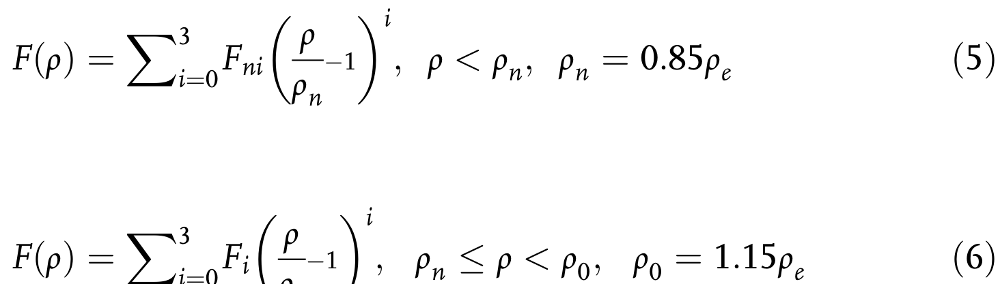
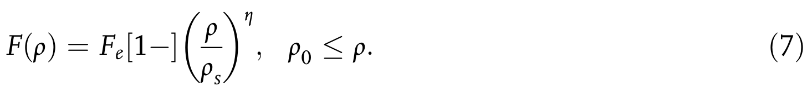

# 数学模型与物理公式 (Mathematical Models & Formulas)

> 本页为 [[mathematical-models|物理模型与数学公式]] 的子页面：弹性、挠曲电、应变耦合。

[[科研Wiki/wiki/figures/_index|← 返回总索引]]

---

## ⚛️ 应变、铁弹与结构力学 (Strain, Ferroelasticity & Mechanics)

[[mathematical-models|← 返回数学模型与物理公式]]

### 1. 公式：预应变定义 εpre=ΔL/L×100%
预应变定义 εpre=ΔL/L×100%

*   **来源**：[[../papers/yangStrainEngineeringTwodimensional2021]]

### 2. 公式：褶皱顶部最大应变 ε=π²hδ(1−σ²)/λ²
褶皱顶部最大应变 ε=π²hδ(1−σ²)/λ²

*   **来源**：[[../papers/yangStrainEngineeringTwodimensional2021]]

### 3. 公式：弯曲基底应变 ε=τ/(2R)；AFM针尖局部应变 ε=F/(AE)
弯曲基底应变 ε=τ/(2R)；AFM针尖局部应变 ε=F/(AE)

*   **来源**：[[../papers/yangStrainEngineeringTwodimensional2021]]

### 4. 公式：气泡高宽比 h/R=√(πγ/(5C₁Y))
气泡高宽比 h/R=√(πγ/(5C₁Y))

*   **来源**：[[../papers/yangStrainEngineeringTwodimensional2021]]

### 5. 公式：气泡局部应变 ε∝(h/R)²
气泡局部应变 ε∝(h/R)²

*   **来源**：[[../papers/yangStrainEngineeringTwodimensional2021]]

### 6. 公式：悬浮膜中心应变 ε=σ(ν)(δ/a)²
悬浮膜中心应变 ε=σ(ν)(δ/a)²

*   **来源**：[[../papers/yangStrainEngineeringTwodimensional2021]]

### 7. 公式：应变修正二阶非线性极化率张量 χ⁽²⁾ᵢⱼₖ=χ⁽²,⁰⁾ᵢⱼₖ+Pᵢⱼₖₗₘuₗₘ
应变修正二阶非线性极化率张量 χ⁽²⁾ᵢⱼₖ=χ⁽²,⁰⁾ᵢⱼₖ+Pᵢⱼₖₗₘuₗₘ

*   **来源**：[[../papers/yangStrainEngineeringTwodimensional2021]]

### 8. 公式：（原文编号续）配套非线性光学/力学关系
（原文编号续）配套非线性光学/力学关系

*   **来源**：[[../papers/yangStrainEngineeringTwodimensional2021]]

### 9. 沿a轴单轴拉伸下O1与O2/O3能量曲线及公切线（1%–4%共存区）
沿a轴单轴拉伸下O1与O2/O3能量曲线及公切线（1%–4%共存区）

*   **来源**：[[../papers/liFerroelasticityDomainPhysics2016]]

### 10. 公式：1T相超胞矩阵H0
1T相超胞矩阵H0

*   **来源**：[[../papers/liFerroelasticityDomainPhysics2016]]

### 11. 公式：Green-Lagrange应变张量定义
Green-Lagrange应变张量定义

*   **来源**：[[../papers/liFerroelasticityDomainPhysics2016]]

### 12. 公式：二维应变张量对称形式
二维应变张量对称形式

*   **来源**：[[../papers/liFerroelasticityDomainPhysics2016]]

### 13. 公式：WTe2从1T到1T′三变体的自发应变矩阵η1/η2/η3
WTe2从1T到1T′三变体的自发应变矩阵η1/η2/η3

*   **来源**：[[../papers/liFerroelasticityDomainPhysics2016]]

### 14. 公式：O1→O2/O1→O3的相对转换应变张量e²₁/e³₁
O1→O2/O1→O3的相对转换应变张量e²₁/e³₁

*   **来源**：[[../papers/liFerroelasticityDomainPhysics2016]]

### 15. DP模型与DFT的能量/原子力基准测试（能量误差0.60 meV/atom）
DP模型与DFT的能量/原子力基准测试（能量误差0.60 meV/atom）

*   **来源**：[[../papers/heUltrafastSwitchingDynamics2024]]

### 16. 公式：EAM总势能公式 Eq.1
EAM总势能公式 Eq.1

*   **来源**：[[../papers/Zhang2019a]]

### 17. 公式：广义元素对势 Eq.3
广义元素对势 Eq.3

*   **来源**：[[../papers/Zhang2019a]]

### 18. 公式：电子密度函数 Eq.4
电子密度函数 Eq.4

*   **来源**：[[../papers/Zhang2019a]]

### 19. 公式：嵌入能分段公式 Eq.5–7
嵌入能分段公式 Eq.5–7

*   **来源**：[[../papers/Zhang2019a]]

### 20. 公式：嵌入能分段公式 Eq.6
嵌入能分段公式 Eq.6

*   **来源**：[[../papers/Zhang2019a]]

### 21. 公式：嵌入能分段公式 Eq.7
嵌入能分段公式 Eq.7

*   **来源**：[[../papers/Zhang2019a]]

### 22. 公式：对分布函数公式 Eq.9
对分布函数公式 Eq.9

*   **来源**：[[../papers/Zhang2019a]]

### 23. Ti135/Ti257/Ti895弛豫过程每原子能量随时间步变化
Ti135/Ti257/Ti895弛豫过程每原子能量随时间步变化

*   **来源**：[[../papers/Zhang2019a]]

### 24. 小尺寸粒子平均能量-温度曲线
小尺寸粒子平均能量-温度曲线

*   **来源**：[[../papers/Zhang2019a]]

### 25. 大尺寸粒子（Ti1099–Ti3455）能量-温度曲线
大尺寸粒子（Ti1099–Ti3455）能量-温度曲线

*   **来源**：[[../papers/Zhang2019a]]

### 26. 六粒子1421/1422原子对数量随温度变化
六粒子1421/1422原子对数量随温度变化

*   **来源**：[[../papers/Zhang2019a]]

### 27. ΔEav/ΔT斜率随原子数N变化（杜隆-珀蒂1.5kB边界）
ΔEav/ΔT斜率随原子数N变化（杜隆-珀蒂1.5kB边界）

*   **来源**：[[../papers/Zhang2019a]]

### 28. 表：EAM势参数
EAM势参数

*   **来源**：[[../papers/Zhang2019a]]

### 29. 公式：Te 空位形成能计算式
Te 空位形成能计算式

*   **来源**：[[../papers/niuDirectVisualizationLargeScale2021]]

### 30. 表：理论预测与实验合成的二维多铁材料汇总
理论预测与实验合成的二维多铁材料汇总

*   **来源**：[[../papers/RecentAdvancesGrowth2025]]

### 31. 理论上的二维铁电材料：中心对称与畸变1T-MoS2原子结构、能带及电荷密度；MX2三聚化畸
理论上的二维铁电材料：中心对称与畸变1T-MoS2原子结构、能带及电荷密度；MX2三聚化畸变模式与锯齿链

*   **来源**：[[../papers/guanRecentProgressTwoDimensional2020]]

### 32. 表：理论预测的二维铁电材料池（含年份、IP/OOP、极化值、厚度、Tc、机制、参考文献）
理论预测的二维铁电材料池（含年份、IP/OOP、极化值、厚度、Tc、机制、参考文献）

*   **来源**：[[../papers/guanRecentProgressTwoDimensional2020]]

### 33. 非易失存储与光电异质结（3R-MoS₂多态/MEP能垒/疲劳特性/53 ns脉冲/铁电BN
非易失存储与光电异质结（3R-MoS₂多态/MEP能垒/疲劳特性/53 ns脉冲/铁电BN-WSe₂激子调控/PL谱/泵浦探测激子限域/WSe₂-WTe₂非线性反常霍尔）

*   **来源**：[[../papers/guoAdvancesTwodimensionalFerroelectric2025]]

### 34. 公式：(1)：Berry phase 极化强度 P = (e/(2π)³) Σ_n^occ
(1)：Berry phase 极化强度 P = (e/(2π)³) Σ_n^occ ∫_BZ dk A_n(k)

*   **来源**：[[../papers/guoAdvancesTwodimensionalFerroelectric2025]]

### 35. 公式：(2)：层间差分电荷密度 Δρ_interlayer(r) = ρ_total(r)
(2)：层间差分电荷密度 Δρ_interlayer(r) = ρ_total(r) − Σ_i ρ_isolated^i(r)

*   **来源**：[[../papers/guoAdvancesTwodimensionalFerroelectric2025]]

### 36. 表：已报道低维铁电材料汇总（极化值、方向、翻转势垒、Tc、理论/实验标注）
已报道低维铁电材料汇总（极化值、方向、翻转势垒、Tc、理论/实验标注）

*   **来源**：[[../papers/huProgressProspectsLowdimensional2019]]

---

## 🔗 相关概念与实体 (Related Concepts & Entities)

**核心概念**：[[../concepts/density-functional-theory|密度泛函理论 (DFT)]]、[[../concepts/paw-method|投影增强波法 (PAW/USPP)]]、[[../concepts/berry-phase|Berry 相与现代极化理论]]、[[../concepts/born-effective-charge|Born 有效电荷]]、[[../concepts/ferroelectricity|铁电性]]、[[../concepts/multiferroicity|多铁性]]、[[../concepts/charge-density-wave|电荷密度波 (CDW)]]、[[../concepts/flexoelectric-effect|挠曲电效应]]、[[../concepts/peierls-distortion|Peierls 畸变]]、[[../concepts/superconducting-dome|超导穹顶]]

**相关材料/实体**：[[../entities/h-BN|h-BN]]、[[../entities/graphene|石墨烯]]、[[../entities/TMDs|过渡金属二硫化物 (TMDs)]]、[[../entities/NbSe2|2H-NbSe₂]]、[[../entities/BiFeO3|BiFeO₃]]、[[../entities/HZO|HfZrO (HZO)]]、[[../entities/In2Se3|In₂Se₃]]、[[../entities/BaTiO3|BaTiO₃]]、[[../entities/WTe2|WTe₂]]

