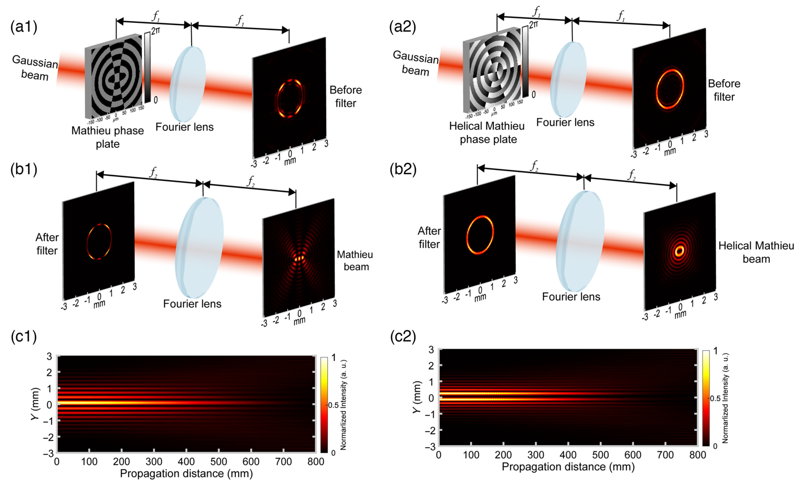
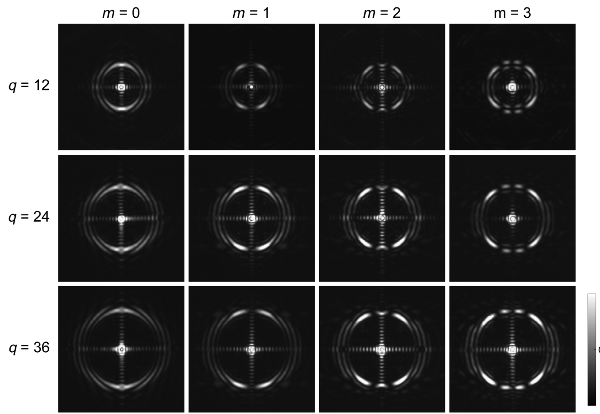
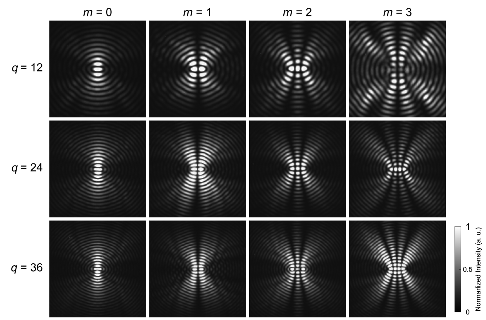
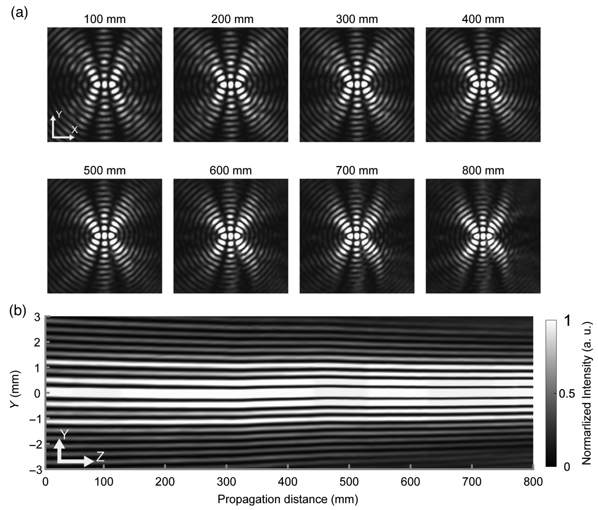
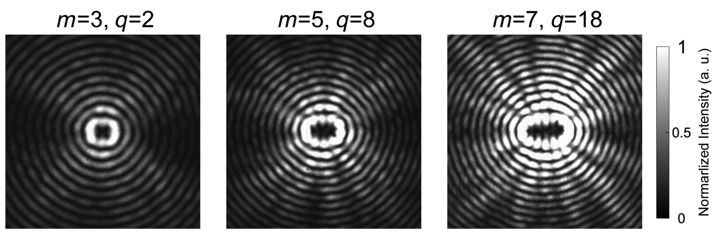
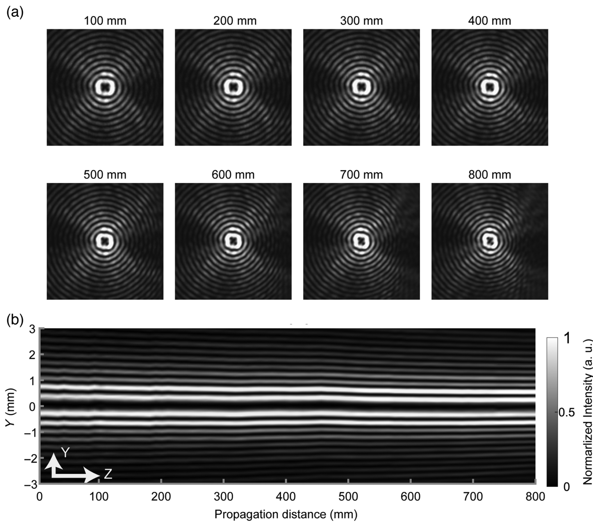
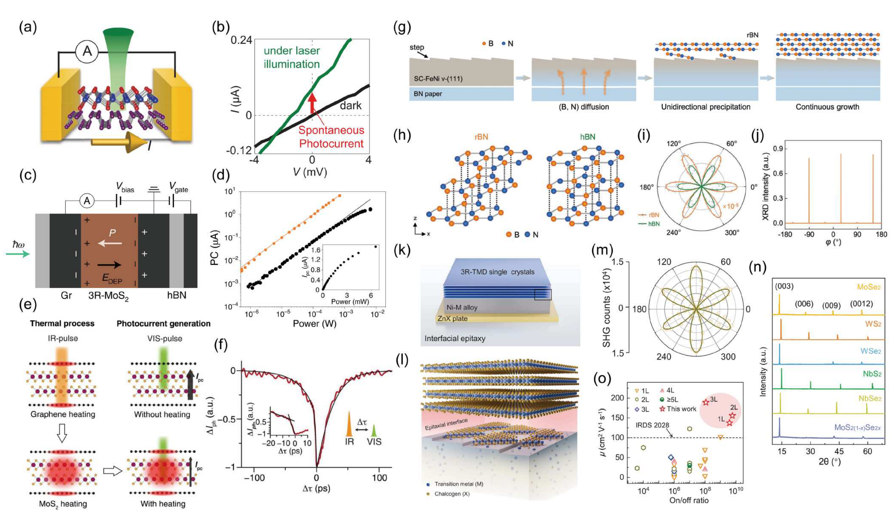
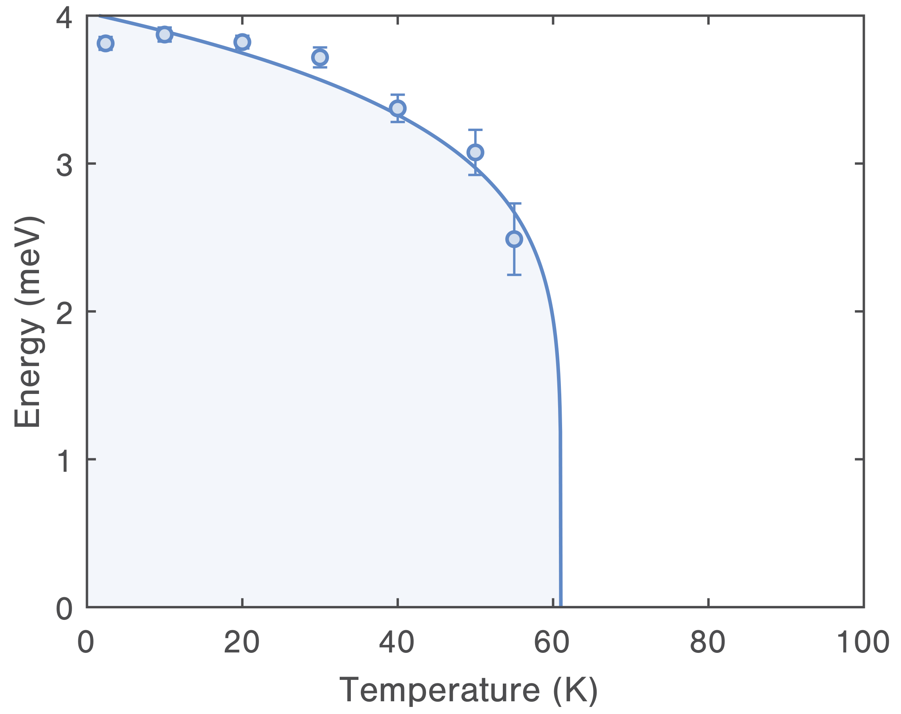
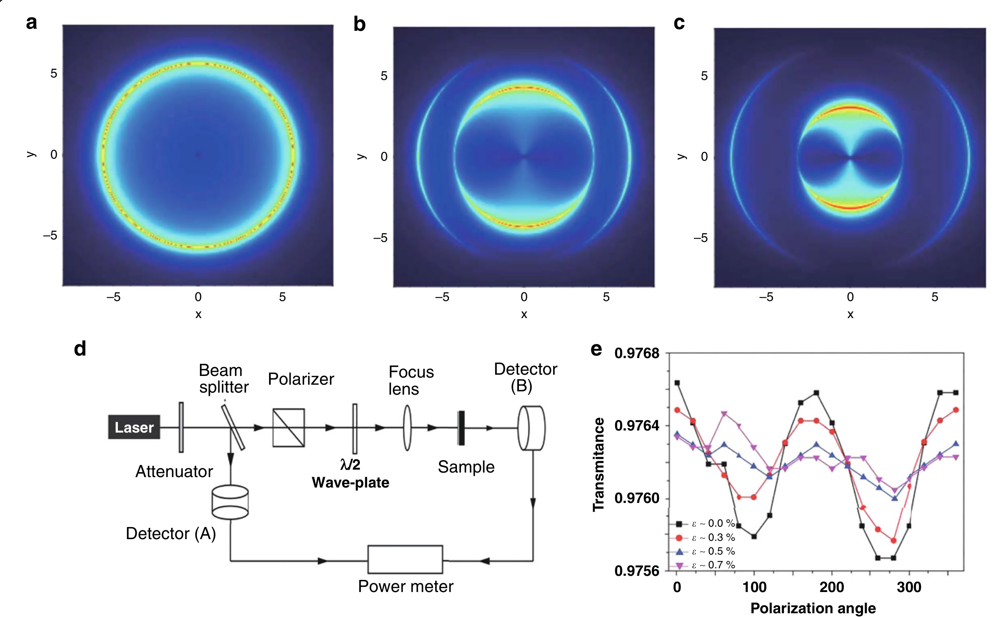
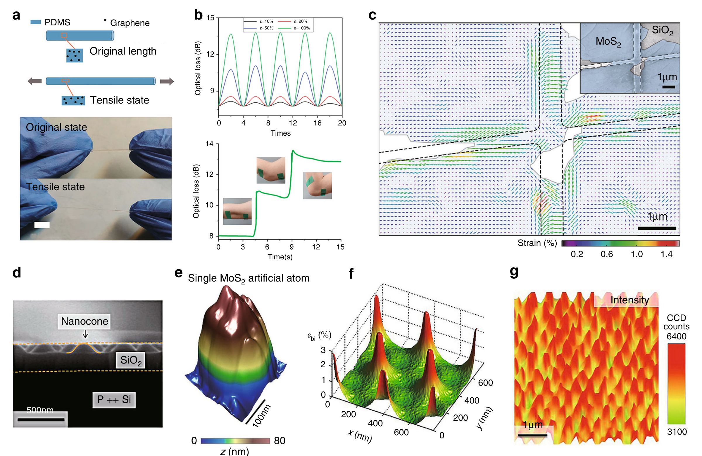

# 二维材料光学、SHG 与多铁光谱 (2D Materials Optics, SHG & Multiferroic Spectra)

> 收录非线性光学与 Z 扫描、范德华材料光学表征（NiI₂、MnBi₂Te₄、In₂Se₃ 等）、SHG 偏振映射、应变工程光学响应等相关图表。本页为 [[optical-spectra|光学与吸收光谱]] 的子页面。

[[../optical-spectra|← 返回光学与吸收光谱总览]]

---

## 🔬 非线性光学与 Z 扫描 (Nonlinear Optics & Z-Scan)

### 1. 黑砷磷 UV-vis-NIR 线性吸收光谱与 XPS
黑砷磷（b-AsP）在紫外-可见-近红外的线性吸收光谱，覆盖 300–1100 nm，结合 XPS 元素分析确认化学计量比。

*   **来源**：[[../papers/shuTwoDimensionalBlackArsenic2020]]

### 2. 黑砷磷开孔 Z 扫描曲线
开孔 Z 扫描测量非线性吸收系数，证实 b-AsP 在 2 μm 处具有强双光子吸收（TPA）特性。

*   **来源**：[[../papers/shuTwoDimensionalBlackArsenic2020]]
*   **关键特征**：双光子吸收系数 β = 4.6 cm/GW，优于多数二维材料，适用于 2 μm 锁模光纤激光器。

### 3. 黑砷磷 NLO 参数（数据表）
不同波长下 b-AsP 的双光子吸收系数与饱和强度等 NLO 参数汇总。

*   **来源**：[[../papers/shuTwoDimensionalBlackArsenic2020]]

### 4. 黑砷磷与其他 NLO 材料对比（数据表）
多种二维/块体 NLO 材料在 2 μm 处 β 与 Is 的对比表。

*   **来源**：[[../papers/shuTwoDimensionalBlackArsenic2020]]

### 5. 黑砷磷 2 μm 锁模激光器性能（数据表）
基于 b-AsP 可饱和吸收体的锁模光纤激光器输出参数对比。

*   **来源**：[[../papers/shuTwoDimensionalBlackArsenic2020]]

### 6. 偶/螺旋 MG 光束生成原理
相位调制 + 4-f 滤波产生偶极（m=2）与螺旋（m>0）Mathieu-Gauss 光束的方案与传播不变性模拟。

*   **来源**：[[../papers/Wang2023ultracompact]]

### 7. 偶 MG 光束实测傅里叶频谱
不同 m,q 参数偶 MG 光束的远场傅里叶频谱，显示主环结构及中心低频亮斑。

*   **来源**：[[../papers/Wang2023ultracompact]]

### 8. 偶 MG 光束实测横向光强
不同 m,q 参数偶 MG 光束的横向光强分布，呈现椭圆晶格图案。

*   **来源**：[[../papers/Wang2023ultracompact]]

### 9. 偶 MG 光束传播不变性 (Z=100–800 mm)
偶 MG 光束（m=2, q=12）在 100–800 mm 自由空间传播中的横向光强不变性验证。

*   **来源**：[[../papers/Wang2023ultracompact]]

### 10. 螺旋 MG 光束实测光强
不同 m,q 螺旋 MG 光束的横向光强，呈现椭圆环结构，离心率随 m 增大而增大。

*   **来源**：[[../papers/Wang2023ultracompact]]

### 11. 螺旋 MG 光束传播不变性 (Z=100–800 mm)
螺旋 MG 光束（m=3, q=2）在 800 mm 自由空间传播中的光强分布不变性。

*   **来源**：[[../papers/Wang2023ultracompact]]

### 12. DOE 设计：输入高斯振幅、CGH 相位与远场振幅
衍射光学元件（DOE）设计流程：输入高斯振幅分布 → CGH 相位图 → FFT 远场振幅。

*   **来源**：[[../papers/Unknown2025diffractive]]

### 13. DOE 远场振幅模拟（层数/层高参数化）
不同 DOE 层数（2/10/45/255）与层高（4.4 μm / 1.5 μm / 100 nm / 17 nm）的远场振幅模拟对比。

*   **来源**：[[../papers/Unknown2025diffractive]]
*   **关键特征**：多层薄 DOE 可逼近连续相位板，实现高衍射效率与环形光束整形。

### 14. DOE 实测光束相机拼接图像
DOE 后 51 mm 处实测光束相机拼接图像，可见两个相交环形光束。

*   **来源**：[[../papers/Unknown2025diffractive]]

### 15. 双光子辐射吸收机理
双光子辐射（TPR）的两种吸收机理：a) 顺序型经真实中间激发态，b) 同时型经虚态。

*   **来源**：[[../papers/WRZYSZCZYNSKI2010initiators]]

### 16. 单光子与双光子引发聚合对比（公式）
反应式对比单光子引发聚合（SP）与双光子引发聚合（TP）的激发路径差异。

*   **来源**：[[../papers/WRZYSZCZYNSKI2010initiators]]

---

## 🔬 范德华材料光学表征 (van der Waals Materials Optical Characterization)

### 1. NiI₂ 线性二色性与双折射偏振旋转
块体 NiI₂ 的线性二色性（LD）与双折射偏振旋转测量，揭示层状反铁磁体的各向异性光学响应。

*   **来源**：[[../papers/songEvidenceSinglelayerVan2022]]
*   **关键特征**：块体 NiI₂ 在 1.55–1.65 eV 出现明显的二色性特征，与自旋诱导的层间耦合相关。

### 2. NiI₂ 波长依赖二次谐波产生
NiI₂ 的 SHG 强度随激发波长的变化，显示在 1.06 μm 附近 SHG 信号峰。

*   **来源**：[[../papers/songEvidenceSinglelayerVan2022]]

### 3. NiI₂ 体光伏效应
块体 NiI₂ 的光生电流-偏压曲线与光谱响应，证实其体光伏效应。

*   **来源**：[[../papers/songEvidenceSinglelayerVan2022]]

### 4. NiI₂ 交叉偏振图像
块体/1层/2层 NiI₂ 的交叉偏振光学图像，显示厚度依赖的光学衬度。

*   **来源**：[[../papers/songEvidenceSinglelayerVan2022]]

### 5. 单层 NiI₂ 温度依赖 SHG 成像
单层 NiI₂ 从 300 K 降温到 2 K 的温度依赖 SHG 强度成像，追踪反铁磁有序转变。

*   **来源**：[[../papers/songEvidenceSinglelayerVan2022]]
*   **关键特征**：SHG 信号在 ~22 K 处突然增强，对应块体 Néel 温度（~21 K）的层数缩放行为。

### 6. 少层 NiI₂ AFM 与偏振旋转测量
少层 NiI₂ 的 AFM 形貌与额外偏振旋转测量，定量表征层间堆垛对光学各向异性的影响。

*   **来源**：[[../papers/songEvidenceSinglelayerVan2022]]

### 7. NiI₂ CVT 生长单层偏振显微与角分辨线二色性
CVT 生长的单层 NiI₂ 的偏振显微图像与角分辨线二色性（ARLD），C3→C2 对称破缺可视化。

*   **来源**：[[../papers/RecentAdvancesGrowth2025]]
*   **关键特征**：从 3 重旋转对称（C3，块体）到 2 重对称（C2，单层）的转变在 ARLD 图案中直接可见。

### 8. 双层 MnBi₂Te₄ 晶体结构与 SHG 系数
双层 MnBi₂Te₄ 的晶体结构、A 型反铁磁序下的 σ^A_xy 以及偶/奇 SHG 张量系数。

*   **来源**：[[../papers/zhaoOpticalFingerprintsTwodimensional2024]]
*   **关键特征**：偶 SHG（i 型）源于体反铁磁序打破时间反演，奇 SHG（e 型）源于表面非中心对称。

### 9. 斜入射 SHG 探测构型与"六瓣花"图案
斜入射 PPP 偏振分辨 SHG 测量构型及观测到的"六瓣花"偏振图案，反演对称破缺的指纹。

*   **来源**：[[../papers/zhaoOpticalFingerprintsTwodimensional2024]]

### 10. In₂Se₃ PFM 极化图案与 SHG 映射
PFM 极化图案与 SHG 空间映射共同验证 In₂Se₃ 中面内/面外极化偶极锁定。

*   **来源**：[[../papers/guanRecentProgressTwoDimensional2020]]
*   **关键特征**：SHG 映射与 PFM 空间对应，证实 In₂Se₃ 中面内偶极与面外偶极的强耦合。

### 11. 自发光伏与材料生长
WSe₂/BP 光伏、石墨烯屏蔽 3R-MoS₂、EQE 16%、2 ps 响应、倾斜 FeNi 生长 rBN、Ni-M 外延 3R-TMDs 等。

*   **来源**：[[../papers/guoAdvancesTwodimensionalFerroelectric2025]]

### 12. 手性表表征与操控
(PTO)ₙ/(STO)ₙ 超晶格 RSXD 探测涡旋阵列手性；XCD mapping；La 掺杂 BFO 纳米岛 SHG-CD"电写光读"手性光电器件。

*   **来源**：[[../papers/hanPolarTopologicalMaterials2025]]

### 13. 静态与瞬态 SHG 偏振测量
静态与瞬态 SHG 偏振测量构型，用于表征手性磁电耦合的超快动力学。

*   **来源**：[[../papers/gaoGiantChiralMagnetoelectric2024a]]

### 14. 高场可调多铁性：TbMnO₃、DyMnO₃ 等
TbMnO₃ 极化 90° 翻转、DyMnO₃ 巨磁介电（~500%）、TbMn₂O₅ 180° 可逆翻转、DyMn₂O₅ 介电台阶。

*   **来源**：[[../papers/cheongMultiferroicsMagneticTwist2007a]]
*   **关键特征**：强磁场可对锰基多铁体进行"电写磁调"操作，验证螺旋自旋序驱动的磁电耦合。

### 15. 吸收光谱蓝移、泵浦-探测载流子动力学与 VHS
DFPT 介电常数各向异性、DFT 能带与 STS 验证范霍夫奇点（VHS）的综合光学表征。

*   **来源**：[[../papers/duUltrasensitiveOptoelectronicBiosensor2025]]

### 16. 应变诱导石墨烯光学电导率各向异性
施加单轴应变后石墨烯的偏振依赖光学电导率，展示应变对狄拉克锥的调制效应。

*   **来源**：[[../papers/pengStrainEngineering2D2020]]
*   **关键特征**：沿应变方向的光学电导率显著增强，垂直方向减弱，实现应变可调的偏振光探测。

### 17. 应变工程应用：光纤传感器、SHG 成像、太阳能漏斗
石墨烯-PDMS 光纤应变传感器、SHG 应变成像、宽谱太阳能漏斗器件。

*   **来源**：[[../papers/pengStrainEngineering2D2020]]

---

## 🔗 相关概念与实体 (Related Concepts & Entities)

**核心概念**：[[../concepts/nonlinear-optics|非线性光学]]、[[../concepts/second-harmonic-generation|二次谐波产生 (SHG)]]、[[../concepts/z-scan|Z 扫描]]、[[../concepts/nonlinear-absorption|非线性吸收]]、[[../concepts/two-photon-absorption|双光子吸收]]、[[../concepts/saturable-absorption|可饱和吸收]]、[[../concepts/linear-dichroism|线性二色性]]、[[../concepts/birefringence|双折射]]、[[../concepts/dielectric-response|介电响应]]

**相关材料/实体**：[[../entities/NiI2|NiI₂]]、[[../entities/MnBi2Te4|MnBi₂Te₄]]、[[../entities/b-AsP|黑砷磷 (b-AsP)]]、[[../entities/BiFeO3|BiFeO₃]]、[[../entities/In2Se3|In₂Se₃]]、[[../entities/WSe2|WSe₂]]、[[../entities/graphene|石墨烯]]
