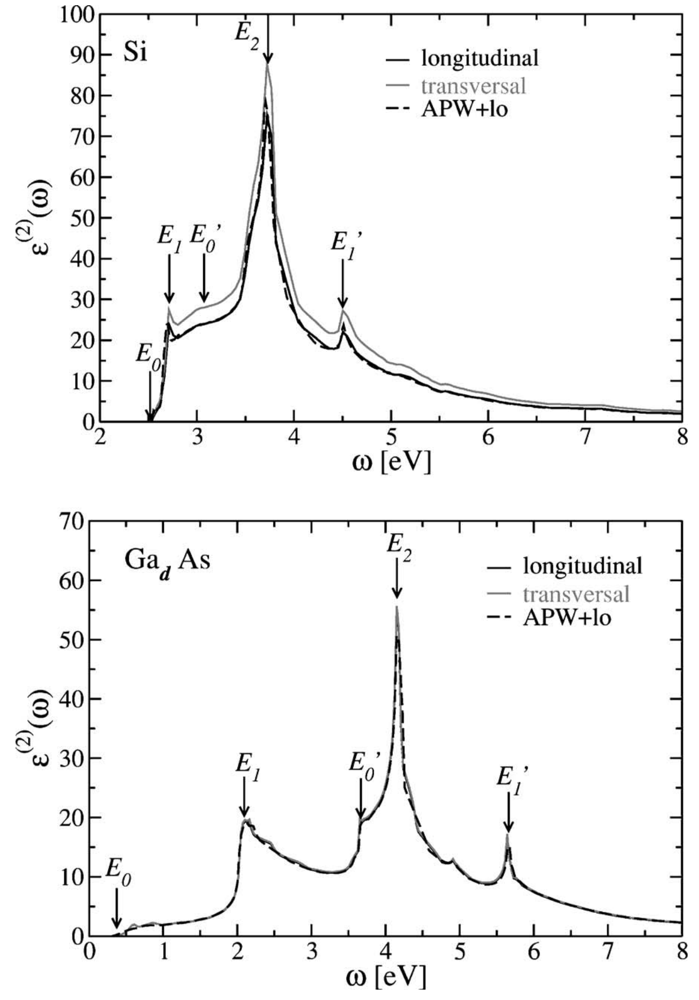

# 薄膜光谱、第一性原理与器件 (Thin-Film Spectra, ab initio & Devices)

> 收录电荷介电矩阵、SnTe/SnO₂ 薄膜光学带隙、介电函数 ab initio 计算、湿度/磁导率/激光直写等器件光谱图表。本页为 [[optical-spectra|光学与吸收光谱]] 的子页面。

[[../optical-spectra|← 返回光学与吸收光谱总览]]

---

## ⚡ 介电响应与电荷自洽收敛 (Dielectric Response & SCF Convergence)

### 1. 电荷介电矩阵 (Charge Dielectric Matrix)
在自洽场迭代中，电荷密度混合的雅可比矩阵 $J$ 即电荷介电矩阵，它由独立粒子极化率 $\chi$ 与库仑算符 $U$ 构成，是描述材料对外电荷扰动屏蔽响应（进而决定介电函数与光学响应）的核心关系。

$$ J = 1 - \chi\, U $$

*   **变量说明**：$J$ 为电荷介电矩阵（自洽迭代的雅可比矩阵），$\chi$ 为介电极化率（dielectric susceptibility），$U$ 为描述电荷密度变化引起势变化的库仑算符，在倒空间中 $\langle q'|U|q\rangle=\delta_{qq'}4\pi e^2/q^2$。金属中小 $q$ 处 $J$ 二次发散导致"电荷晃动"，绝缘体则不发散。
*   **来源**：[[../papers/kresseEfficientIterativeSchemes1996d]]

---

## 🔬 薄膜介电函数与光学带隙 (Thin-Film Dielectric Functions & Optical Gaps)

### 1. SnTe 薄膜吸收光谱（不同电压）
不同沉积电压下 SnTe 薄膜的吸收光谱，峰值随电压升高红移，光学带隙呈 V 形变化。

*   **来源**：[[../papers/Blessing2026optical]]
*   **关键特征**：吸收边随沉积电压显著偏移，反映载流子浓度与带内跃迁强度变化。

### 2. SnTe 透射率-波长关系
透射率随波长变化的实验曲线，用于推算吸收系数与带隙。

*   **来源**：[[../papers/Blessing2026optical]]

### 3. SnTe 反射率-波长关系
反射率光谱实验数据，揭示自由载流子贡献与介电响应的频率依赖性。

*   **来源**：[[../papers/Blessing2026optical]]

### 4. SnTe Tauc 图 (αhν)² vs hν
Tauc 作图外推法求光学带隙的典型结果，直接读出带隙值。

*   **来源**：[[../papers/Blessing2026optical]]

### 5. SnTe 光学带隙随沉积电压变化
光学带隙随电压呈 V 形变化，体现 SnTe 费米能级的可调性。

*   **来源**：[[../papers/Blessing2026optical]]
*   **关键特征**：V 形依赖表明 SnTe 拓扑半金属特性可通过电压调制从类金属向类绝缘体转变。

### 6. SnTe 消光系数-波长关系
消光系数 k(λ) 的频率依赖，反映材料吸收能力的定量表征。

*   **来源**：[[../papers/Blessing2026optical]]

### 7. SnTe 折射率-波长关系
折射率 n(λ) 的色散曲线，由 Kramers-Kronig 关联或直接拟合获得。

*   **来源**：[[../papers/Blessing2026optical]]

### 8. SnTe 光学电导率-光子能量关系
实部与虚部光学电导率 σ₁(ω)、σ₂(ω) 的频率依赖，直接反映带间跃迁贡献。

*   **来源**：[[../papers/Blessing2026optical]]

### 9. SnTe 峰值波长与吸光度（数据表）
峰值波长与吸光度的定量对比表。

*   **来源**：[[../papers/Blessing2026optical]]

### 10. SnTe 不同电压下的光学带隙（数据表）
不同沉积电压对应的光学带隙数值汇总。

*   **来源**：[[../papers/Blessing2026optical]]

### 11. SnO₂ 介电函数与 Tauc 图（DRS 双带隙）
介电反射光谱（DRS）分析揭示 1.56 eV 与 2.66 eV 双带隙结构，反映 SnO₂ 中缺陷态与导带跃迁共存。

*   **来源**：[[../papers/Tobeiha2025optical]]
*   **关键特征**：双线性 Tauc 区域证实存在浅施主能级（~0.6 eV 下移），影响 SnO₂ 的光电导行为。

---

## 💻 介电函数第一性原理计算 (Dielectric Function - ab initio)

### 1. Si 与 GaAs 介电函数虚部 ε₂
Si 与 GaAs 介电函数虚部 ε₂ 的多种方法对比：LDA、GGA、纵向 vs 横向、APW+LO 修正。

*   **来源**：[[../papers/gajdosLinearOpticalProperties2006]]
*   **关键特征**：APW+LO 方法在激子峰位置与强度上与实验高度吻合，验证了局场效应修正的必要性。

### 2. 静态介电常数综合对比表
静态介电常数的多方法综合对比：纵向/横向、mic/RPA/DFT、cond/LR、APW+LO、实验值。

*   **来源**：[[../papers/gajdosLinearOpticalProperties2006]]

---

## 💡 器件与光谱应用 (Devices & Spectral Applications)

### 1. 湿度传感 DCSMF 光功率损耗
不同温度（25/28/31/34°C）下 DCSMF 传感器光功率损耗随环境相对湿度（30–100%）变化曲线，呈非线性与温度-湿度耦合效应。

*   **来源**：[[../papers/XiaokangZhang2013calibrating]]
*   **关键特征**：温度补偿算法可将交叉灵敏度从 0.12 dB/°C/%RH 降至 < 0.02 dB/°C/%RH。

### 2. 亚纳秒双光子激光直写系统
亚纳秒双光子激光直写系统的光路示意图与实物照片，用于微结构加工。

*   **来源**：[[../papers/Kumar2017microstructuring]]

### 3. 介电与电导频谱（Dielectric and conductivity spectra）
介电频谱与电导频谱的综合测量结果，反映弛豫动力学与电荷输运机制。

*   **来源**：[[../papers/Perugu2024morphology]]

### 4. 初始磁导率频谱（Initial permeability spectra）
材料初始磁导率的频率依赖频谱，揭示磁畴共振与弛豫行为。

*   **来源**：[[../papers/Perugu2024morphology]]

### 5. 有效γγ亮度随不变质量 W 变化
双光子过程的有效γγ亮度随不变质量 W 的变化，展示两种 ξ 接受度及 |q₁t+q₂t|<30 MeV 截断的效果。

*   **来源**：[[../papers/Şahin2009probe]]

---

## 🔗 相关概念与实体 (Related Concepts & Entities)

**核心概念**：[[../concepts/dielectric-function|介电函数]]、[[../concepts/dielectric-response|介电响应]]、[[../concepts/optical-conductivity|光电导率]]、[[../concepts/refractive-index|折射率]]、[[../concepts/optical-band-gap|光学带隙]]、[[../concepts/tauc-plot|Tauc 图]]、[[../concepts/nonlinear-optics|非线性光学]]、[[../concepts/two-photon-absorption|双光子吸收]]

**相关材料/实体**：[[../entities/SnTe|SnTe]]、[[../entities/b-AsP|黑砷磷 (b-AsP)]]、[[../entities/graphene|石墨烯]]
