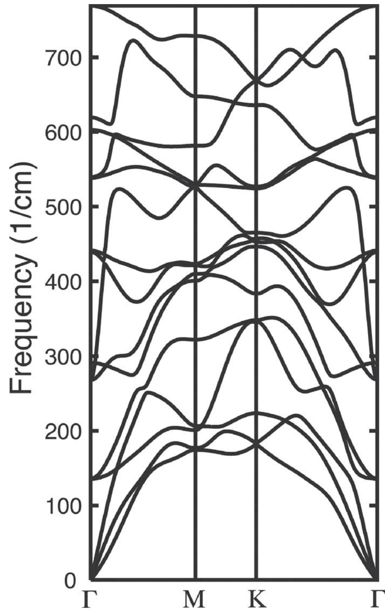

---
tags:
  - type/figure-collection
---

# 振动光谱

> 声子谱、拉曼光谱、红外光谱、振动模式

## 条目

### 1. 式4 电子-声子耦合矩阵元 Δ_Q^k

*   **来源**：[[../papers/Barnett2006coexistence]]
*   **图示描述**：微扰矩阵元 Δ_Q^k = −u e^{−iφ} Σ_R γ_|R| (e^{−iQ·R}−1) e^{−ik·R} Q̂·R̂，假设跃迁变化与相邻原子距离改变成正比。
*   **关键特征**：R 求和遍历次近邻，γ_|R|=2（能量/距离）为电子-声子耦合常数；稳健性检验中加入 γ₁≈γ₂/3（对应 t₁≈t₂/3），费米面仍不打开全局准粒子能隙。

### 2. 表1 峰值波长与吸光度

*   **来源**：[[../papers/Blessing2026optical]]
*   **图示描述**：横轴为波长 200–1000 nm，纵轴为吸光度 A (a.u.)，四条曲线分别对应 10 V、11 V、12 V、13 V 沉积的 SnTe 薄膜。所有样品均在紫外区出现峰值，随后随波长向可见-近红外延伸而逐渐下降。
*   **关键特征**：11 V 样品在 321 nm 处吸光度最高（A=1.2077 a.u.），12 V 次之（350 nm, A=1.1071 a.u.），10 V（340 nm, A=0.9707 a.u.）与 13 V（330 nm, A=0.9651 a.u.）接近；电压-吸光度呈非单调关系，提示 11 V 附近存在薄膜光密度"甜点"。

### 3. 图2 透射率-波长关系

*   **来源**：[[../papers/Blessing2026optical]]
*   **图示描述**：横轴为波长 200–1000 nm，纵轴为吸光度 A (a.u.)，四条曲线分别对应 10 V、11 V、12 V、13 V 沉积的 SnTe 薄膜。所有样品均在紫外区出现峰值，随后随波长向可见-近红外延伸而逐渐下降。
*   **关键特征**：11 V 样品在 321 nm 处吸光度最高（A=1.2077 a.u.），12 V 次之（350 nm, A=1.1071 a.u.），10 V（340 nm, A=0.9707 a.u.）与 13 V（330 nm, A=0.9651 a.u.）接近；电压-吸光度呈非单调关系，提示 11 V 附近存在薄膜光密度"甜点"。

### 4. 图3 反射率-波长关系

*   **来源**：[[../papers/Blessing2026optical]]
*   **图示描述**：横轴为波长 200–1000 nm，纵轴为吸光度 A (a.u.)，四条曲线分别对应 10 V、11 V、12 V、13 V 沉积的 SnTe 薄膜。所有样品均在紫外区出现峰值，随后随波长向可见-近红外延伸而逐渐下降。
*   **关键特征**：11 V 样品在 321 nm 处吸光度最高（A=1.2077 a.u.），12 V 次之（350 nm, A=1.1071 a.u.），10 V（340 nm, A=0.9707 a.u.）与 13 V（330 nm, A=0.9651 a.u.）接近；电压-吸光度呈非单调关系，提示 11 V 附近存在薄膜光密度"甜点"。

### 5. 图4 Tauc图(αhν)² vs hν

*   **来源**：[[../papers/Blessing2026optical]]
*   **图示描述**：横轴为波长 200–1000 nm，纵轴为吸光度 A (a.u.)，四条曲线分别对应 10 V、11 V、12 V、13 V 沉积的 SnTe 薄膜。所有样品均在紫外区出现峰值，随后随波长向可见-近红外延伸而逐渐下降。
*   **关键特征**：11 V 样品在 321 nm 处吸光度最高（A=1.2077 a.u.），12 V 次之（350 nm, A=1.1071 a.u.），10 V（340 nm, A=0.9707 a.u.）与 13 V（330 nm, A=0.9651 a.u.）接近；电压-吸光度呈非单调关系，提示 11 V 附近存在薄膜光密度"甜点"。

### 6. 图9 光学电导率-光子能量关系

*   **来源**：[[../papers/Blessing2026optical]]
*   **图示描述**：横轴为波长 200–1000 nm，纵轴为吸光度 A (a.u.)，四条曲线分别对应 10 V、11 V、12 V、13 V 沉积的 SnTe 薄膜。所有样品均在紫外区出现峰值，随后随波长向可见-近红外延伸而逐渐下降。
*   **关键特征**：11 V 样品在 321 nm 处吸光度最高（A=1.2077 a.u.），12 V 次之（350 nm, A=1.1071 a.u.），10 V（340 nm, A=0.9707 a.u.）与 13 V（330 nm, A=0.9651 a.u.）接近；电压-吸光度呈非单调关系，提示 11 V 附近存在薄膜光密度"甜点"。

### 7. 图2 XRD、FTIR、Raman与PL结构/光学表征

*   **来源**：[[../papers/Tobeiha2025optical]]
*   **图示描述**：四子图结构-光学综合表征：(a) XRD衍射图谱，(b) FTIR红外光谱，(c) Raman拉曼光谱，(d) PL光致发光光谱（280 nm与300 nm两种激发）。
*   **关键特征**：XRD在2θ=10°、20°、26°出现三个峰，对应GO(001)、GO/G中间相和G(002)，布拉格定律给出层间距0.83 nm、0.48 nm、0.38 nm，证实G畴与GO畴共存；FTIR在3000–3600 cm⁻¹有宽强O-H峰，1382–1746 cm⁻¹为羧基/环氧，1026 cm⁻¹为C=O，证明含氧官能团丰富、材料亲水；Raman出现D峰~1345 cm⁻¹（缺陷/sp³）、G峰~1587 cm⁻¹（sp²面内E2g）、2D峰~2668 cm⁻¹；PL在280 nm/300 nm激发下分别于378 nm/386 nm出现蓝光发射，源于sp²团簇中电子-空穴对的辐射复合。

### 8. 表II 二聚体性质对比

*   **来源**：[[../papers/blochlProjectorAugmentedwaveMethod1994b]]
*   **图示描述**：汇总 H₂、Li₂、Be₂、B₂、N₂、O₂、F₂、Fe₂ 等二聚体在 30 Ry 平面波截断下的结合能、键长、振动频率，并与当时最精确的全电子 LDA 计算并列对比。
*   **关键特征**：PAW 键长与全电子结果偏差 <1%；振动频率偏差约 4%；结合能偏差在 0.1–0.2 eV 量级；二聚体键长短、势场非球性强，被视为对任何电子结构方法的严格测试，Fe₂ 还验证了含过渡金属体系的可靠性。

### 9. 图2 应变机制证据链：AHE 曲线偏转、TEM 界面、拉曼峰位红/蓝移、XRD 晶格常数变化、DFT 交换耦合常数

*   **来源**：[[../papers/caiFerroelectricitydrivenStrainmediatedMagnetoelectric2025]]
*   **图示描述**：图2 用六组子图构建"电学—结构—理论"完整证据链：(a)(b) 为 θH=0° 面内磁场下不同底栅极化电压的反常霍尔电阻 Rxy-B 曲线（Rxy 单位 Ω，B 单位 T）；(c) 为器件截面 TEM 图像；(d) 为 Fe₃GaTe₂ 拉曼光谱随底栅 V₂ 的演化；(e) 为 XRD 谱及插图中 a/c 晶格常数（Å）随 V₂ 的变化；(f) 为 DFT 计算的不同应变下块体 Fe₃GaTe₂ 沿 mx/mz 方向交换耦合常数。
*   **关键特征**：负偏压（−10 V）使易磁化轴由 90° 偏至约 95°（面外分量增强），正偏压使其向面内偏转；TEM 显示 Fe₃GaTe₂ 与 P(VDF-TrFE) 形成分子级紧密、无缺陷界面；Fe₃GaTe₂ 特征峰 ~125 cm⁻¹（A1g）、~141 cm⁻¹（E²₁g）在正偏压下蓝移（压缩）、负偏压下红移（拉伸），V₂=+10 V 估算拉伸应变约 0.6–0.8%，V₂=−10 V 压缩应变约 0.4–0.5%；XRD 定量零偏 a=3.972 Å、c=16.225 Å，±10 V 下 εa≈0.5–0.8%；DFT 显示 (a+0.8%, c−0.48%) 拉伸应变下总耦合能倾向面内磁化，与实验一致。

### 10. 图1 体相HgX₂的滑动铁电相变：(a) PE→±P结构示意图，(b) PE-HgI₂声子谱虚频软模，(c) 双势阱翻转路径与极化演变

*   **来源**：[[../papers/chenStrongSlidingFerroelectricity2024]]

### 11. 表1 2H-TaS2拉曼模温度依赖对比

*   **来源**：[[../papers/chowdhuryReviewTheoreticalComputational]]
*   **图示描述**：列出 2H-TaS₂ 多个 CDW 特征拉曼模式在不同温度下的实验频率，并与两种 DFT 模型（施加应力模拟 IC-CDW、未施加应力）逐一对比，单位 cm⁻¹。
*   **关键特征**：施加微小应力的模型（如 CDW 模在 51 cm⁻¹）显著优于无应力模型，整体与实验吻合良好。

### 12. 表2 泛函-赝势组合拉曼误差基准

*   **来源**：[[../papers/chowdhuryReviewTheoreticalComputational]]
*   **图示描述**：列出 GGA、LDA 等交换关联泛函与 Norm-conserving、Ultra-soft、PAW 等赝势的多种组合所计算的 TaSe₂ 单胞拉曼频率，并与实验值（cm⁻¹）对照，末行给出平均误差。
*   **关键特征**：LDA(PW)+模守恒赝势平均误差最小（3.2 cm⁻¹），优于 GGA(PBE-PAW)（10.5 cm⁻¹）、GGA(PW)（11.2 cm⁻¹）；GGA 晶格常数更准但拉曼频率反而不如 LDA，误差互补。

### 13. 表2 2H-MoS2拉曼模式的DFT(PBE-Norm)与实验对比

*   **来源**：[[../papers/chowdhuryReviewTheoreticalComputational]]
*   **图示描述**：逐模式对比实验测得的E1g、E2g¹、E2g²、A1g拉曼峰位与GGA(PBE-Norm)计算值，并给出平均误差。
*   **关键特征**：E1g实验136 cm⁻¹ vs 计算147.0（偏差最大）；E2g¹/E2g²实验210 vs 计算206.3；A1g实验239 vs 计算237；平均误差5.1 cm⁻¹，表明PBE可定量复现层内振动模但对层间/剪切模误差偏大。

### 14. 图4 低温拉曼光谱与CDW振膜模式

*   **来源**：[[../papers/chowdhuryReviewTheoreticalComputational]]
*   **图示描述**：(a) 低温（<130 K）下拉曼谱出现 Amp1、Amp2、P1、P2 四个新峰；(b) 各峰频率与半高宽随温度的变化；(c) DFT 计算的原子振动可视化（Se 原子绿色圆球，箭头表示位移）。
*   **关键特征**：Amp1/Amp2 随降温频率上升、线宽窄化、强度增大，是 CDW 序参量振幅振荡（振幅模）；P1/P2 频率和 FWHM 几乎不随温度变化、强度上升，且仅在 C-CDW 相出现（IC-CDW 中为声学支、拉曼非活性），判定为相位模。

### 15. 图1 蛋白质中氢键通道示意，标注 W/M/J/X

*   **来源**：[[../papers/fornerQuantumTemperatureEffects1993]]
*   **图示描述**：α-螺旋蛋白质中一条氢键通道的简化示意图，标出沿链轴排列的位点 n−1、n、n+1，以及氢键弹簧常数 W、位点质量 M、链内偶极耦合 J 和激子-声子耦合 X 四个核心参数。
*   **关键特征**：仅为物理模型示意，无量纲与坐标轴；为后续哈密顿量（式 1，含 ε₀、J、M、W、X 五项）提供空间直观；三链结构中相邻链上的 C=O 振子还通过偶极-偶极项 L = 1.54 meV 耦合。

### 16. 图14 不稳定铁电声子模式本征矢

*   **来源**：[[../papers/hillWhyAreThere2000a]]
*   **图示描述**：两幅晶胞示意图以箭头表示 Γ 点不稳定光学声子的原子位移方向与相对振幅，(a) 为铁电型不稳定模，大的 A 位（Bi/La）阳离子与氧笼反向运动；(b) 为非铁电模，主要由赤道面氧原子转动构成。
*   **关键特征**：BiMnO3 铁电模虚频约 82.30i cm⁻¹，约为 LaMnO3（21.1i cm⁻¹）的两倍，不稳定性显著更强；本征矢中 Mn 与氧同向移动、几乎不主导位移，与 BaTiO3 中 Ti 驱动的图像相反；这说明 BiMnO3 的铁电性由 A 位 Bi–O 共价性驱动，绕开了对 B 位 d0 的要求。

### 17. 图9

*   **来源**：[[../papers/huangTwodimensionalIn2Se3Rising2022]]
*   **图示描述**：(A–B) 750 K ab initio MD 模拟 4 ps 前后结构从 α 相到 β 相的对比；(C) 触发相变的面内剪切光学声子模式示意；(D–E) 各原子亚层位移随时间变化；(F) 原子位移在各声子模式上的投影振幅随时间演化。
*   **关键特征**：α→β 相变在约 1.5 ps 内完成，属于超快结构相变；运动方式是上两层（In(t)、Se(t)）与下三层（Se(m)、In(b)、Se(b)）作反向面内集体剪切；声子投影中只有该剪切光学模式的振幅随时间单调增长，其它模式不增长。

### 18. 图4 Ti2CO2声子色散谱（无虚频，动力学稳定）

*   **来源**：[[../papers/khazaeiNovelElectronicMagnetic2013]]
*   **图示描述**：完全氧终止的 Ti₂CO₂ 沿第一布里渊区高对称路径的声子色散曲线，横轴为波矢，纵轴为声子频率（THz）。
*   **关键特征**：图中所有声学支与光学支频率均为正值，没有虚频出现；虚频意味着结构在微小扰动下会自发弛豫到更低能量构型。

### 19. 图10 液态与非晶态速度自相关函数 ψ(t)：液态笼蔽振荡 vs 非晶多频叠加

*   **来源**：[[../papers/kresseInitiomoleculardynamicsSimulationLiquidmetalamorphoussemiconductor1994]]
*   **图示描述**：(a) T=1250 K 液态与 (b) 300 K 退火非晶态下，归一化速度自相关函数 ψ(t)=⟨v(0)·v(t)⟩/⟨v²⟩ 随时间（ps）的演化，用于表征原子运动的时间关联。
*   **关键特征**：液态 ψ(t) 在快速衰减到零附近后出现阻尼振荡，振荡周期约 0.2 ps，反映周围原子构成的瞬态"笼"对中心原子的反弹；非晶态下扩散背景消失，ψ(t) 表现为多个频率叠加的持续振荡，振幅缓慢衰减，对应固体本征振动模式。

### 20. 论文图4：1T-VSe₂ 与 1T-VTe₂ 单层沿 Γ-M-K-Γ 的声子色散，虚频软模标志 CDW 失稳波矢

*   **来源**：[[../papers/lezoualchStudyChargeDensity]]
*   **图示描述**：用 DFPT 在 1×1 单胞中计算的 1T-VSe₂ 与 1T-VTe₂ 单层沿 Γ-M-K-Γ 高对称路径的声子色散曲线；虚频（不稳定声子模式）以负值绘制。
*   **关键特征**：1T-VSe₂ 在 1/2 Γ-M（对应 4×1 畸变）和 3/5 Γ-K（对应 √7×√3 畸变）出现两个虚频软模；1T-VTe₂ 则在 1/2 Γ-M、1/2 Γ-K、1/3 Γ-K 处出现三个虚频，分别对应 4×1、3×√3、√21×√3 畸变，解释 VTe₂ 比 VSe₂ 更丰富的 CDW 多形态性。

### 21. 图4 未应变石墨烯的蜂窝晶格、狄拉克锥能带、典型拉曼光谱及普适透射率

*   **来源**：[[../papers/pengStrainEngineering2D2020]]
*   **图示描述**：石墨烯的基线图，(a) 蜂窝晶格（A/B 两子格）与面内光学声子振动方向、(b) K/K′ 点处线性色散的狄拉克锥、(c) 2.41 eV 激发下典型拉曼光谱（G 峰 ~1582 cm⁻¹、2D/G′ 峰 ~2700 cm⁻¹，缺陷样出现 D 峰 ~1350 cm⁻¹）、(d) 双声子共振与 G/D/2D 峰的散射过程示意、(e) 可见光波段的普适透射率曲线。
*   **关键特征**：未应变石墨烯在狄拉克点为零带隙，载流子为无质量狄拉克费米子；单层可见光吸收率由精细结构常数决定，πα≈2.3%，透射率 ~97.7%，与频率和偏振无关；G 峰为双重简并的面内光学声子，是后续应变分裂讨论的基准。

### 22. 图5 应变石墨烯的拉曼 G/2D 峰位移与分裂、G⁺/G⁻ 本征矢量及 SERS 增强

*   **来源**：[[../papers/pengStrainEngineering2D2020]]
*   **图示描述**：(a) TB 计算的剪切+单轴应变（约 15%）下石墨烯能带，显示在狄拉克点附近打开带隙；(b–c) 单轴拉伸下 2D 峰与 G 峰的红移和分裂为 2D⁺/2D⁻、G⁺/G⁻ 子峰；(d) G⁺/G⁻ 声子本征矢量方向示意；(f–h) 石墨烯转移到粗糙银膜上同时出现 SERS 电磁增强与局部应变诱导的拉曼位移/分裂。
*   **关键特征**：G⁺（垂直应变方向）位移率约 −10.8 cm⁻¹/%，G⁻（平行应变方向）约 −31.7 cm⁻¹/%；2D 峰单轴位移约 −64 cm⁻¹/%，双轴拉伸可达 −160.3 cm⁻¹/%；压缩应变则出现蓝移（G⁺ 约 +22.3 cm⁻¹/%）；TB 预言 12–17% 剪切+单轴应变可打开 0–0.9 eV 带隙。

### 23. ED Fig.4 块体 NiI2 变温偏振拉曼光谱

*   **来源**：[[../papers/songEvidenceSinglelayerVan2022]]
*   **图示描述**：a 为 XY 交叉偏振通道 30 K 到 300 K 的 waterfall 变温拉曼谱（横轴 Raman shift，单位 cm⁻¹）；中段为 XX 与 XY 通道的对比；底部为 30 K 时 Domain I 与 Domain II 上 σ⁺、σ⁻ 入射的圆偏振拉曼谱及其差值 σ⁺−σ⁻（净 ROA）。
*   **关键特征**：T_N,1 以上仅观察到 80.2 cm⁻¹ 的 E_g 声子；T_N,1 以下出现 120.8、168.8 cm⁻¹ 单磁振子峰；T_N,2 以下低频准弹性信号（QES）硬化为 31、37 cm⁻¹ 的尖锐电磁振子模；31、37 cm⁻¹ 模在 σ⁺ 与 σ⁻ 下强度显著不对称，净 ROA 幅值大，并在 Domain I 与 Domain II 间符号相反；其余声子/磁振子峰无 ROA。

### 24. ED Fig.5 角分辨偏振拉曼 ARPRS

*   **来源**：[[../papers/songEvidenceSinglelayerVan2022]]
*   **图示描述**：多子图极坐标曲线，分别给出多铁相中 31 cm⁻¹、37 cm⁻¹ 模式在 XY 构型下随样品转角的强度分布，并与纯声子/纯磁振子对称性预期对比；同时展示 80 cm⁻¹ 附近峰的高分辨线形以及 120.8、168.8 cm⁻¹ 磁振子模的温度依赖。
*   **关键特征**：31、37 cm⁻¹ 模的极坐标图既不符合纯声子的拉曼张量也不符合纯磁振子，必须用磁振子-声子混合（电磁振子）张量拟合；80.2 cm⁻¹ E_g 声子在 T_N,2 以下分裂为 79.9 与 80.2 cm⁻¹ 两支，反映单斜畸变使简并解除；120.8、168.8 cm⁻¹ 模仅在 T_N,1 以下出现，其温度依赖与磁有序参量一致。

### 25. ED Fig.9 2层/3层 NiI2 变温拉曼软模

*   **来源**：[[../papers/songEvidenceSinglelayerVan2022]]
*   **图示描述**：a、b 分别为 2 层和 3 层 NiI₂ 在 XY 交叉偏振构型下从高温到低温的 waterfall 变温拉曼谱，横轴 Raman shift（cm⁻¹），重点关注低频区。
*   **关键特征**：低温下在约 38 cm⁻¹ 处出现与块材电磁振子对应的软模；该模在 2 层样品中于 25 K 以下、在 3 层样品中于 35 K 以下建立，强度随降温快速增大；这些软模出现温度与双折射 θ(T) 与 SHG 给出的 T_c（2L ≈ 30 K、3L ≈ 39 K）在同一区间。

### 26. 图4 应变对声子（石墨烯G峰分裂、MoS₂ E'峰分裂）与能带（WSe₂间接-直接带隙转变、漏斗效应）的调控

*   **来源**：[[../papers/yangStrainEngineeringTwodimensional2021]]
*   **图示描述**：(A) 单层石墨烯拉曼 G 峰随单轴应变红移并分裂为 G⁺/G⁻；(B) 单层 MoS₂ 的 E' 面内峰分裂而 A'₁ 面外峰几乎不动；(C)(D) 褶皱 MoS₂ 的光学照片与 E¹₂g 峰位 Raman mapping；(E) 双层 WSe₂ 光致发光谱随拉伸应变增强、红移；(F) "漏斗效应"示意，激子向褶皱顶部最大应变、最窄带隙处漂移复合。
*   **关键特征**：石墨烯 G 峰在应变 >0.6% 时分裂，解除 E₂g 简并；MoS₂ 面内振动对应变更敏感，面外 A'₁ 峰基本不响应；Raman mapping 仅在褶皱处显示峰位红移，实现应变空间成像；双层 WSe₂ 拉伸下导带极小值由 K 移至 Σ，发生间接→直接带隙转变，PL 强度急剧增强；1% 拉伸使单层 MoS₂ 带隙减小约 45 meV、双层约 120 meV。

### 27. 960→21 高通量筛选漏斗流程图

*   **来源**：[[../papers/zhaoRealization2DMultiferroic2024]]
*   **图示描述**：以漏斗式流程图呈现从 960 种非中心对称 AM₂X₄ 候选物到最终 21 种多铁体的四步高通量筛选，每一步标出通过的材料数目与判据。
*   **关键特征**：第一步结构优化确认自发极化；第二步声子谱无虚频（104 种）+ 形成能为负（100 种）保证动力学/热力学稳定；第三步以铁电翻转势垒 < 200 meV/f.u. 并排除已报道体系，筛出 40 种稳定铁电体；第四步按磁基态再筛得 21 种多铁体（10 FM、9 AFM、2 FiM），并按磁性起源分成 type-a/b/c 三类。

### 28. 图2 声子谱（45 支，无虚频）+ 模式分辨 λqν 红圈、PhDOS（Cu/O/C 及面内/面外投影）、Eliashberg 谱函数 α²F(ω) 与累积 λ(ω)=0.72、q 分辨 λq 六芒星分布

*   **来源**：[[../papers/zhengAnisotropicSuperconductivityTwodimensional2025]]
*   **图示描述**：(a) 沿高对称路径的声子色散，红圈大小正比于模式分辨电-声耦合 λqν；(b) 按 Cu/O/C 原子投影的声子态密度 PhDOS；(c) 按面内（xy，红线）/面外（z，蓝线）振动投影的 PhDOS；(d) Eliashberg 谱函数 α²F(ω)（红线）与累积耦合 λ(ω)（蓝线）；(e) 整个布里渊区的 q 分辨 λq 二维分布。
*   **关键特征**：15 原子原胞共 45 支声子（3 声学+42 光学），全布里渊区无虚频，证明动力学稳定；频率分三区——I 区 <40 meV 以 Cu、O 振动为主，II 区 40–49 meV 为 C 与 O 强混合，III 区 >49 meV 为 C 高能光学模（50–80 meV 突出 Oxy、80–174 meV 以 C 为主）；总 λ=0.72（低于 Cu3(CS)6 的 1.16），其中 I 区贡献 0.43（59.7%）、II 区约 30.6%（Cz 面外+Oxy/Oz）、III 区仅约 9.7%；(a)(e) 中 Γ 附近低能光学支红圈最大，λq 呈六重对称六角星芒分布。
