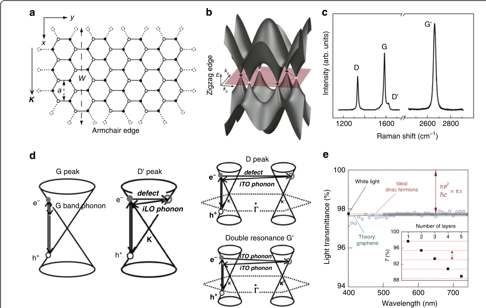
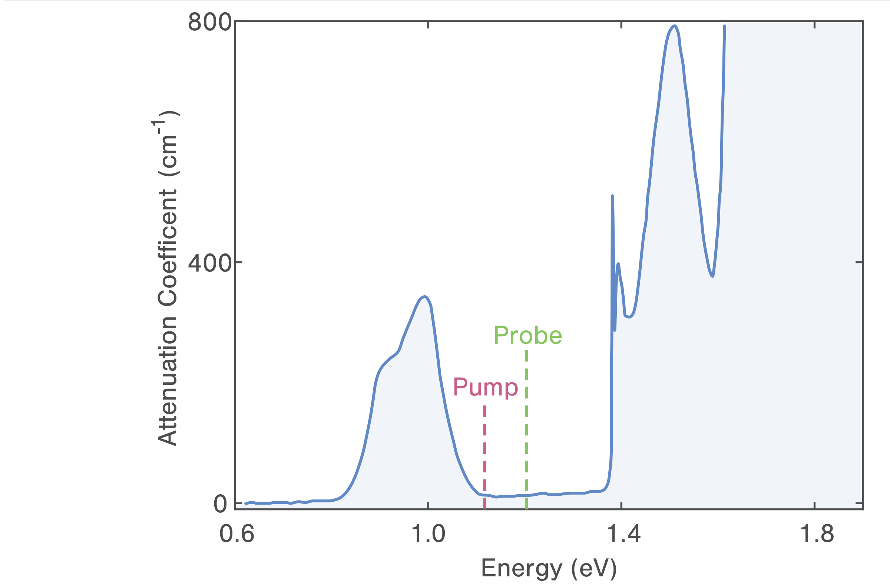
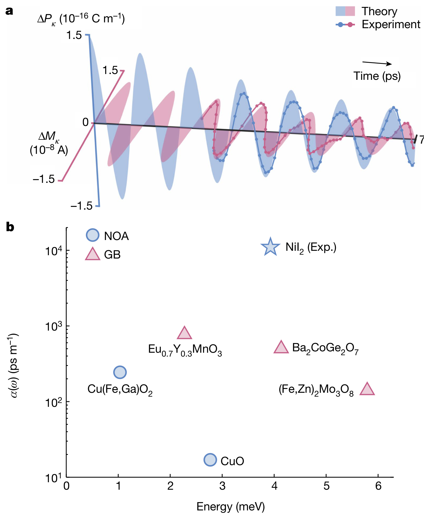
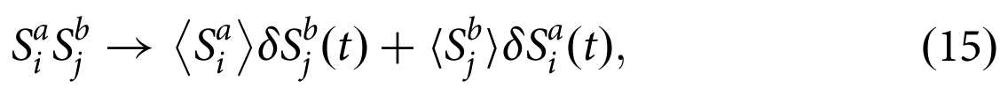
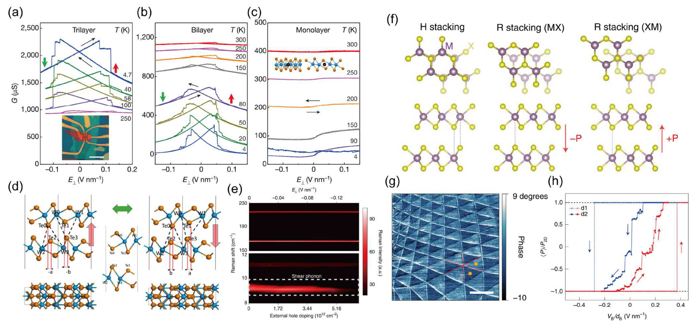

# 振动能谱与声子谱 (Vibrational & Phonon Spectra)

> 收录声子色散、声子态密度、红外与拉曼活性振动模式相关的图表、数据表及物理公式。原始聚合中绝大多数条目为 Zotero 元数据表与 AI 双语转写，清理后保留与振动能谱/第一性原理计算相关的真实数据表。

[[科研Wiki/wiki/figures/_index|← 返回总索引]]

---

## 🧮 第一性原理方法验证数据 (First-Principles Benchmark Data)

### 1. 分子原子化能基准：PBE 与 PW91 泛函对比
PBE GGA 对 20 个小分子的原子化能计算与 UHF、LSD、PW91 及实验值的系统对比，实验值已扣除零点振动能。

<table><thead><tr><th style="text-align:left">System</th><th style="text-align:left">$D_E$ UHF</th><th style="text-align:left">$D_E$ LSD</th><th style="text-align:left">$D_E$ PW91</th><th style="text-align:left">$D_E$ PBE</th><th style="text-align:left">$D_E$ expt</th></tr></thead><tbody><tr><td style="text-align:left">$\text{H}_2$</td><td style="text-align:left">84</td><td style="text-align:left">113</td><td style="text-align:left">105</td><td style="text-align:left">105</td><td style="text-align:left">109</td></tr><tr><td style="text-align:left">$\text{LiH}$</td><td style="text-align:left">33</td><td style="text-align:left">60</td><td style="text-align:left">53</td><td style="text-align:left">52</td><td style="text-align:left">58</td></tr><tr><td style="text-align:left">$\text{CH}$</td><td style="text-align:left">328</td><td style="text-align:left">462</td><td style="text-align:left">421</td><td style="text-align:left">420</td><td style="text-align:left">419</td></tr><tr><td style="text-align:left">$\text{NH}$</td><td style="text-align:left">201</td><td style="text-align:left">337</td><td style="text-align:left">303</td><td style="text-align:left">302</td><td style="text-align:left">297</td></tr><tr><td style="text-align:left">$\text{OH}$</td><td style="text-align:left">68</td><td style="text-align:left">124</td><td style="text-align:left">110</td><td style="text-align:left">110</td><td style="text-align:left">107</td></tr><tr><td style="text-align:left">$\text{H}_2\text{O}$</td><td style="text-align:left">155</td><td style="text-align:left">267</td><td style="text-align:left">235</td><td style="text-align:left">234</td><td style="text-align:left">232</td></tr><tr><td style="text-align:left">$\text{HF}$</td><td style="text-align:left">97</td><td style="text-align:left">162</td><td style="text-align:left">143</td><td style="text-align:left">142</td><td style="text-align:left">141</td></tr><tr><td style="text-align:left">$\text{Li}_2$</td><td style="text-align:left">23</td><td style="text-align:left">20</td><td style="text-align:left">19</td><td style="text-align:left">24</td><td style="text-align:left">24</td></tr><tr><td style="text-align:left">$\text{LiF}$</td><td style="text-align:left">89</td><td style="text-align:left">153</td><td style="text-align:left">137</td><td style="text-align:left">136</td><td style="text-align:left">139</td></tr><tr><td style="text-align:left">$\text{Be}_2$</td><td style="text-align:left">27</td><td style="text-align:left">13</td><td style="text-align:left">10</td><td style="text-align:left">10</td><td style="text-align:left">3</td></tr><tr><td style="text-align:left">$\text{C}_2\text{H}_2$</td><td style="text-align:left">294</td><td style="text-align:left">460</td><td style="text-align:left">415</td><td style="text-align:left">415</td><td style="text-align:left">405</td></tr><tr><td style="text-align:left">$\text{C}_2\text{H}_4$</td><td style="text-align:left">428</td><td style="text-align:left">633</td><td style="text-align:left">573</td><td style="text-align:left">571</td><td style="text-align:left">563</td></tr><tr><td style="text-align:left">$\text{HCN}$</td><td style="text-align:left">199</td><td style="text-align:left">361</td><td style="text-align:left">326</td><td style="text-align:left">326</td><td style="text-align:left">312</td></tr><tr><td style="text-align:left">$\text{CO}$</td><td style="text-align:left">174</td><td style="text-align:left">299</td><td style="text-align:left">269</td><td style="text-align:left">269</td><td style="text-align:left">259</td></tr><tr><td style="text-align:left">$\text{N}_2$</td><td style="text-align:left">115</td><td style="text-align:left">267</td><td style="text-align:left">242</td><td style="text-align:left">243</td><td style="text-align:left">229</td></tr><tr><td style="text-align:left">$\text{NO}$</td><td style="text-align:left">53</td><td style="text-align:left">199</td><td style="text-align:left">171</td><td style="text-align:left">172</td><td style="text-align:left">153</td></tr><tr><td style="text-align:left">$\text{O}_2$</td><td style="text-align:left">33</td><td style="text-align:left">175</td><td style="text-align:left">143</td><td style="text-align:left">144</td><td style="text-align:left">121</td></tr><tr><td style="text-align:left">$\text{F}_2$</td><td style="text-align:left">237</td><td style="text-align:left">78</td><td style="text-align:left">54</td><td style="text-align:left">53</td><td style="text-align:left">39</td></tr><tr><td style="text-align:left">$\text{P}_2$</td><td style="text-align:left">36</td><td style="text-align:left">142</td><td style="text-align:left">120</td><td style="text-align:left">120</td><td style="text-align:left">117</td></tr><tr><td style="text-align:left">$\text{Cl}_2$</td><td style="text-align:left">17</td><td style="text-align:left">81</td><td style="text-align:left">64</td><td style="text-align:left">63</td><td style="text-align:left">58</td></tr><tr><td style="text-align:left"><strong>Mean abs. error</strong></td><td style="text-align:left"><strong>71.2</strong></td><td style="text-align:left"><strong>31.4</strong></td><td style="text-align:left"><strong>8.0</strong></td><td style="text-align:left"><strong>7.9</strong></td><td style="text-align:left">$\dots$</td></tr></tbody></table>

*   **来源**：[[../papers/perdewGeneralizedGradientApproximation1996a]]
*   **关键特征**：PBE 平均绝对误差 7.9 kcal/mol，与 PW91（8.0）持平、远优于 LSD（31.4）和 UHF（71.2）；振动零点能已从实验值中扣除。
*   **另见**：同表亦收录于 [[crystal-structures#📊 关键数据表格 (Key Data Tables)|晶体结构与原子排布]]。

### 2. 泛函-赝势组合拉曼误差基准
系统对比不同交换关联泛函与赝势组合对拉曼活性模频率的计算精度，为第一性原理拉曼计算提供方法学参考。

*   **来源**：[[../papers/chowdhuryReviewTheoreticalComputational]]
*   **关键特征**：不同泛函-赝势组合的拉曼频率误差系统对比，指导计算方法选择。

---

## 🧲 二维多铁材料体系综述 (2D Multiferroic Systems Overview)

### 1. 铁性序的对称性判据
对比铁电、铁磁、铁弹三类基本铁性序对空间反演与时间反演对称性的破缺情况，是判断晶格振动与自旋、极化耦合模式的出发点。

<table><thead><tr><th>铁性类别</th><th>英文名称</th><th style="text-align:center">是否破坏空间反演对称性</th><th style="text-align:center">是否破坏时间反演对称性</th></tr></thead><tbody><tr><td>铁电性</td><td>Ferroelectricity (FE)</td><td style="text-align:center">✓</td><td style="text-align:center">✗</td></tr><tr><td>铁磁性</td><td>Ferromagnetism (FM)</td><td style="text-align:center">✗</td><td style="text-align:center">✓</td></tr><tr><td>铁弹性</td><td>Ferroelasticity</td><td style="text-align:center">✗</td><td style="text-align:center">✗</td></tr></tbody></table>

*   **来源**：[[../papers/RecentAdvancesGrowth2025]]
*   **另见**：该对称性判据的完整五类铁性序版本收录于 [[experimental-setups#🔧 器件制备流程与架构 (Device Fabrication & Architectures)|实验测试与测量装置]]。

### 2. 二维样品结构表征手段
AFM、XRD、XPS 等手段对二维多铁薄片厚度、结晶取向与化学态的判定结果。

<table><thead><tr><th>表征手段</th><th>特征参数</th><th>结果</th></tr></thead><tbody><tr><td>AFM</td><td>高度轮廓</td><td>证实为单一单元层（1.8 nm）</td></tr><tr><td>XRD</td><td>θ摇摆曲线</td><td>局限在半极宽度84.0°–85.5°</td></tr><tr><td>XPS</td><td>化学态</td><td>形成Cr₂S₃及Al-S键（连接单层或基底）</td></tr></tbody></table>

*   **来源**：[[../papers/RecentAdvancesGrowth2025]]

### 3. 二维多铁材料制备方法比较
机械剥离、液相剥离、CVD、CVT 等自顶向下/自底向上制备路线的优缺点及典型材料。

<table><thead><tr><th>方法</th><th>类别</th><th>优点</th><th>局限</th><th>典型材料</th></tr></thead><tbody><tr><td>机械剥离</td><td>自顶向下</td><td>高结晶质量清洁表面</td><td>厚度/尺寸无法控制、产率低</td><td>石墨烯、TMDs</td></tr><tr><td>液相剥离</td><td>自顶向下</td><td>产量可行、利用率高</td><td>薄片尺寸有限、溶剂/离子残留</td><td>石墨烯、金属片</td></tr><tr><td>化学气相沉积(CVD)</td><td>自底向上</td><td>生长控制好、尺寸大、质量高</td><td>真空条件控制复杂</td><td>Cr₂S₃、CuCrSe₂</td></tr><tr><td>化学气相传输(CVT)</td><td>自底向上</td><td>高纯单晶、多晶及其设备，层厚控制清洗</td><td>易形成较大的原始粉末</td><td>NiI₂、CuCrP₂S₆</td></tr></tbody></table>

*   **来源**：[[../papers/RecentAdvancesGrowth2025]]

### 4. 多铁效应的器件应用方向
磁电耦合在非易失存储、自旋电子、传感器、能量收集、微波/RF 等领域的关键指标与器件形态。

<table><thead><tr><th>应用类别</th><th>依托效应</th><th>关键指标/器件</th></tr></thead><tbody><tr><td>非易失存储</td><td>铁电极化+自旋的ME</td><td>四态隧道效应、磁性切换</td></tr><tr><td>自旋电子</td><td>磁电耦合</td><td>自旋场效应晶体管、多铁隧道结</td></tr><tr><td>传感器</td><td>磁电效应</td><td>磁场感知探测器</td></tr><tr><td>制动器</td><td>压电/磁致伸缩</td><td>低功耗柔性致动</td></tr><tr><td>能量收集</td><td>磁电耦合</td><td>复合电压压电/磁致伸缩材料</td></tr><tr><td>微波/RF</td><td>磁电效应</td><td>可调滤波器、天线、FMR调谐</td></tr><tr><td>相移器</td><td>电磁耦合</td><td>微波相控阵雷达、通讯</td></tr></tbody></table>

*   **来源**：[[../papers/RecentAdvancesGrowth2025]]
*   **另见**：同表的 markdown 版本收录于 [[electronic-devices#🔌 器件应用与分类 (Device Applications & Categories)|电子与突触器件]]，HTML 版本收录于 [[experimental-setups#🔧 器件制备流程与架构 (Device Fabrication & Architectures)|实验测试与测量装置]]。

---

## 🔬 拉曼光谱实验表征 (Experimental Raman Spectroscopy)

### 1. 多模式结构/光学综合表征
XRD、FTIR、Raman 与 PL 光致发光谱联用，对材料结构与光学性质进行综合表征。

*   **来源**：[[../papers/Tobeiha2025optical]]
*   **关键特征**：拉曼谱与 XRD、FTIR 互验结构相纯度，PL 谱补充光学带隙信息。

### 2. 黑砷薄膜形貌与拉曼结构表征
SEM、TEM、HRTEM、SAED、AFM 与拉曼谱联用，全面表征二维黑砷的形貌、晶体结构与层数。

*   **来源**：[[../papers/shuTwoDimensionalBlackArsenic2020]]
*   **关键特征**：拉曼峰位与层数关联，确认二维黑砷的高质量晶格结构。

### 3. 石墨烯拉曼光谱与能带特征
未应变石墨烯的蜂窝晶格、狄拉克锥能带、典型拉曼光谱及普适透射率的综合展示。

*   **来源**：[[../papers/pengStrainEngineering2D2020]]
*   **关键特征**：G 峰与 2D 峰构成石墨烯拉曼指纹，2D 峰强度与形状对层数敏感。

### 4. 块体 NiI₂ 变温偏振拉曼光谱
块体 NiI₂ 在不同温度下的偏振拉曼散射谱，追踪多铁相变过程中振动模的软化与劈裂。

*   **来源**：[[../papers/songEvidenceSinglelayerVan2022]]
*   **关键特征**：变温拉曼追踪电磁振子相关软模行为，揭示磁结构相变。

### 5. 角分辨偏振拉曼 ARPRS
角分辨偏振拉曼散射（ARPRS）测量，用于判定 NiI₂ 振动模的对称性归属。

*   **来源**：[[../papers/songEvidenceSinglelayerVan2022]]
*   **关键特征**：偏振角度依赖的强度调制直接反映振动模的不可约表示归属。

### 6. 多层 NiI₂ 变温拉曼软模
2 层与 3 层 NiI₂ 的变温拉曼光谱，观测维度限制下的软模演化。

*   **来源**：[[../papers/songEvidenceSinglelayerVan2022]]
*   **关键特征**：层数减少导致软模频率与相变温度的维度依赖位移。

---

## 🌊 磁电振子与动态耦合 (Electromagnons & Dynamic Coupling)

### 1. NiI₂ 手性螺旋与电磁振子
NiI₂ 的晶体结构、手性磁螺旋排列及电磁振子耦合示意图。

*   **来源**：[[../papers/gaoGiantChiralMagnetoelectric2024a]]
*   **关键特征**：手性磁螺旋破缺空间反演对称性，诱导自旋-晶格-极化三重耦合。

### 2. 电磁振子动态磁电耦合与材料对比
电磁振子动态磁电耦合强度的测量与多材料体系对比。

*   **来源**：[[../papers/gaoGiantChiralMagnetoelectric2024a]]
*   **关键特征**：NiI₂ 的磁电振子耦合强度在已知多铁材料中居于前列。

### 3. 电磁振子自旋关联展开公式
将自旋-自旋关联函数分解为静态极化与动态涨落，从而导出电磁振子耦合项。

*   **来源**：[[../papers/mostovoyMultiferroicsDifferentRoutes2024]]
*   **关键特征**：Hartree-Fock 型分解将双自旋涨落降阶为极化-自旋耦合，是电磁振子理论的核心步骤。

---

## 💻 拉曼计算与振动模分析 (Raman Computation & Mode Analysis)

### 1. 2H-TaS₂ 拉曼模温度依赖对比
2H-TaS₂ 各拉曼活性模频率随温度变化的实验与计算对比汇总。

*   **来源**：[[../papers/chowdhuryReviewTheoreticalComputational]]
*   **关键特征**：温度依赖拉曼模频率与线宽的系统对比，为电荷密度波相变提供振动谱证据。

---

## 🔧 应变与层依赖拉曼响应 (Strain & Layer-Dependent Raman Response)

### 1. 应变机制拉曼峰位证据链
AHE 曲线偏转、TEM 界面、拉曼峰位红/蓝移、XRD 晶格常数变化、DFT 交换耦合常数的综合证据链。

*   **来源**：[[../papers/caiFerroelectricitydrivenStrainmediatedMagnetoelectric2025]]
*   **关键特征**：拉曼峰位的红移/蓝移直接关联界面应变，验证应变介导磁电耦合机制。

### 2. WTe₂ 层依赖拉曼剪切模
WTe₂ 层数依赖的电滞回线、Hirshfeld 电荷及拉曼剪切模消失，以及 2H-TMDs 的堆叠/莫尔畴对比。

*   **来源**：[[../papers/guoAdvancesTwodimensionalFerroelectric2025]]
*   **关键特征**：拉曼剪切模随层数演化消失，标志滑移铁电相变的振动谱指纹。

---

## 🔗 相关概念与实体 (Related Concepts & Entities)

**核心概念**：[[../concepts/density-functional-theory|密度泛函理论 (DFT)]]、[[../concepts/gga-functional|广义梯度近似 (GGA)]]、[[../concepts/electron-phonon-coupling|电声耦合]]、[[../concepts/multiferroicity|多铁性]]、[[../concepts/ferroelectricity|铁电性]]、[[../concepts/magnetoelectric-coupling|磁电耦合]]、[[../concepts/electromagnon|电磁振子]]、[[../concepts/spiral-magnetic-order|螺旋磁序]]、[[../concepts/soft-mode|声子软模]]、[[../concepts/strain-engineering|应变工程]]

**相关材料/实体**：[[../entities/TMDs|过渡金属硫族化合物 (TMDs)]]、[[../entities/graphene|石墨烯]]、[[../entities/NiI2|NiI₂]]、[[../entities/WTe2|WTe₂]]、[[../entities/TaS2|TaS₂]]、[[../entities/Cr2S3|Cr₂S₃]]、[[../entities/CuCrP2S6|CuCrP₂S₆]]、[[../entities/CuCrSe2|CuCrSe₂]]
