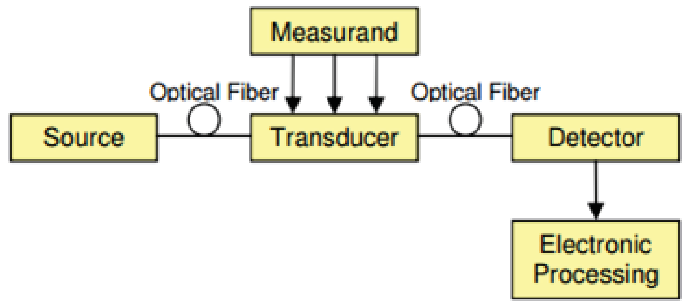
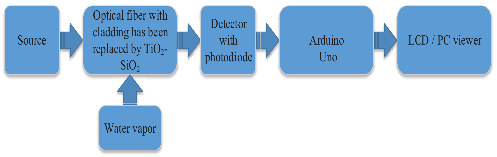
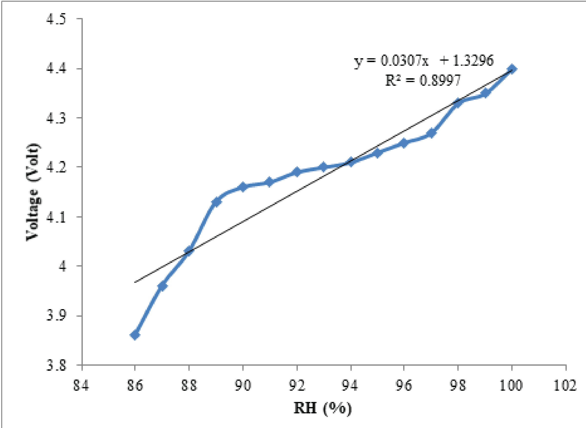
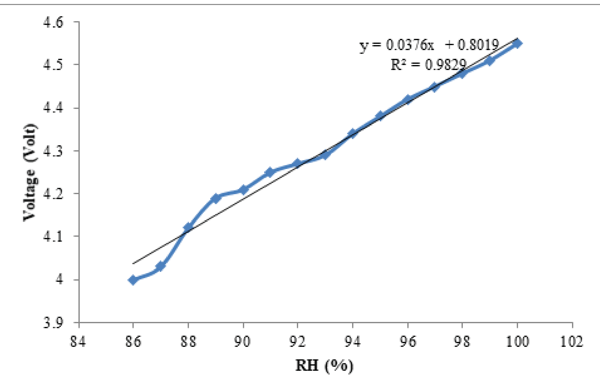
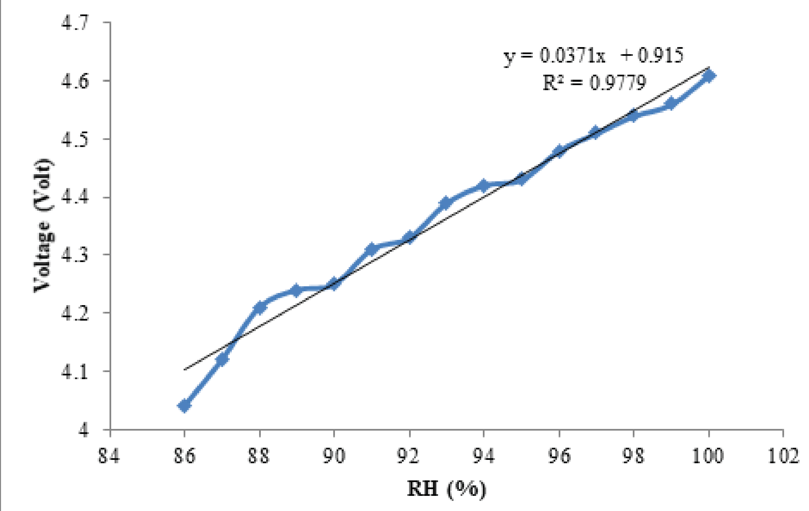
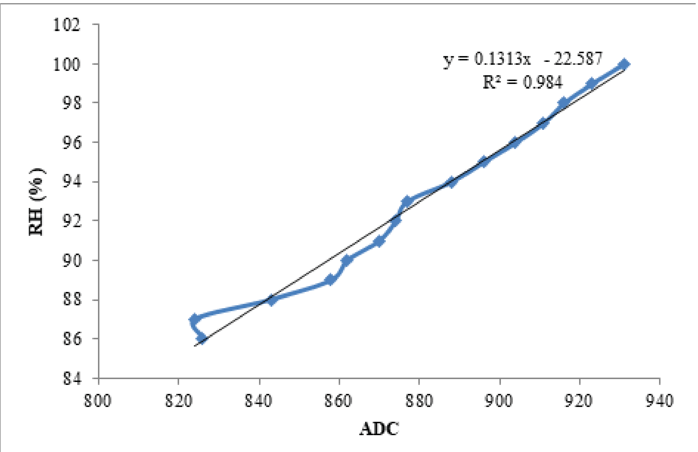
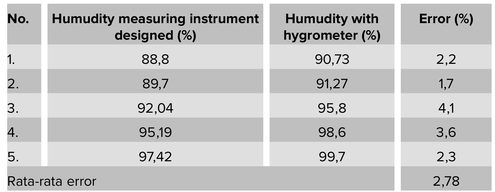
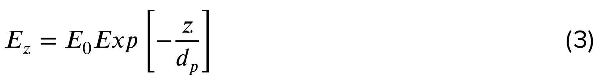
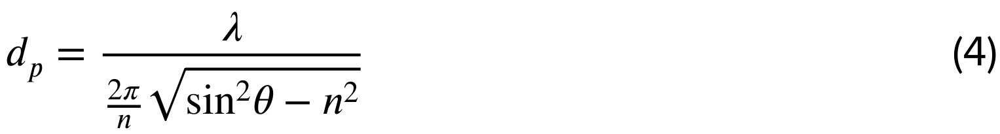

## 2019optical — TiO2-SiO2包层聚合物光纤湿度传感器系统

## 📄 元数据
Febrielviyanti, Harmadi, Dahyunir Dahlan, Yetria Rilda, Helmi Septaria Herlin，2019，KnE Engineering（ICBSA 2018 会议论文），DOI: 10.18502/keg.v1i2.4437
## 💡 一句话
将聚合物光纤（POF, Autonics FD-620-10）中段包层剥离并浸渍涂覆 TiO2-SiO2 纳米复合亲水层，利用倏逝场强度调制实现相对湿度测量，确定最佳剥离长度 2 cm（R²=0.982，灵敏度 0.0376 V/%），并集成到基于 Arduino Uno 的测量系统中（平均误差 2.78%）。

## 🔗 Wiki 双链
  - 概念 [[../concepts/evanescent-wave|倏逝波]]、[[../concepts/optical-fiber-sensor|光纤传感器]]、[[../concepts/humidity-sensing|湿度传感]]、[[../concepts/intensity-modulation|光强调制]]、[[../concepts/dip-coating|浸渍提拉法]]
  - 实体 [[../entities/TiO2-SiO2|TiO2-SiO2纳米复合材料]]、[[../entities/polymer-optical-fiber|聚合物光纤（POF）]]
  - 图表 [[../figures/experimental-setups]]（图1-3 测量/系统框图）、[[../figures/mathematical-models]]（倏逝场公式 Ez=E0·exp(−z/dp)、穿透深度 dp、误差/精度公式）、[[../figures/optical-spectra]]（强度调制型光传感输出曲线）
  - 年度 [[../write/2019]]
  - 项目 [[../projects/project-6-humidity-sensor]]
  - 相关论文 **2019optical**

## 📊 关键图表
  -  -> [[../figures/experimental-setups|实验测试与测量装置]]
  -  -> [[../figures/experimental-setups|实验测试与测量装置]]
  -  -> [[../figures/experimental-setups|实验测试与测量装置]]
  -  -> [[../figures/experimental-setups|实验测试与测量装置]]
  -  -> [[../figures/experimental-setups|实验测试与测量装置]]
  -  -> [[../figures/experimental-setups|实验测试与测量装置]]
  -  -> [[../figures/experimental-setups|实验测试与测量装置]]
  -  -> [[../figures/experimental-setups|实验测试与测量装置]]
  - ![公式2 测量精度 An=1−[(Yn−Yo)/Yn]×100%](../../raw/figures/2019optical/eq_2_A2EEKRHU.png)
  -  -> [[../figures/mathematical-models|数学模型与物理公式]]
  -  -> [[../figures/mathematical-models|数学模型与物理公式]]

## 🔬 项目连接
  - **project-6（小花闻的电压湿度传感器，strong）**：本文是直接的光纤湿度传感文献，与项目已收录的 xuOpticalFiberHumidity2004（倏逝波散射）、Owji20212d（二维材料涂层光纤）、Lv2023humidity（FBG）形成同代际/同方法谱系。具体参考价值：(1) 给出了一套完整的"亲水涂层替代包层 → 剥离长度优化 → 电压/ADC 校准 → 标准湿度计比对"的实验流程与误差分析框架，可直接对照项目六的器件测试流程；(2) 提供了 TiO2-SiO2 这一混合氧化物涂层的制备参数（1 g TiO2 + 1 g SiO2 + 2 g PEG6000，500 ℃ 煅烧 2-4 h，0.3 g 成品 + 30 mL 水，柠檬酸交联 3 h，浸涂 5 min/50 ℃ 干燥 15 min），可作为涂层工艺对比基准；(3) 给出了高湿段（88.8%-97.42% RH）的灵敏度与线性度数据，与项目关注的 G/GO 高湿段行为（Owji2021）可相互印证；(4) 其手动对准与微弯/宏弯损耗导致的系统误差分析，提示项目在数据处理中需关注耦合稳定性。局限：仅测高湿窄区间、未做 SEM/XRD 微观表征、未报告响应/恢复时间，这些恰是项目六可以深化的方向。
  - 其他项目：无直接连接。project-1 为双光子吸收/发光，与本文单光子 638 nm 红光强度调制机制无关。

## 🔗 项目双链
- 项目 [[../projects/project-6-humidity-sensor|项目六：小花闻的电压湿度传感器]]

## 📝 组织与用词
文章按"引言（领域背景+前人工作：明胶/TiO2/PAH-SiO2/Al-ZnO）→ 材料与方法（材料/涂层制备/光纤涂覆/测量系统/光纤传感系统/湿度系统设计共6小节）→ 结果与讨论（电压-湿度表征/ADC-湿度校准/湿度测量测试）→ 结论"的标准实验论文结构组织。论证主线为"原理（倏逝波穿透深度受包层折射率调制）→ 制备（固相合成+浸涂）→ 参数扫描（1/2/3 cm 剥离长度）→ 系统集成（Arduino 校准）→ 精度验证（与标准湿度计比对）"。值得复用的术语：
  - 倏逝波 / 消逝场（[[../concepts/evanescent-wave|evanescent wave]] / evanescent field）
  - 穿透深度（[[../concepts/penetration-depth|penetration depth]], dp）
  - 聚合物光纤（[[../entities/polymer-optical-fiber|polymer optical fiber]], POF）
  - 包层剥离（cladding stripping / exfoliation）
  - 浸渍提拉法（[[../concepts/dip-coating|dip coating]]）
  - 强度调制（[[../concepts/intensity-modulation|intensity modulation]]）
  - 传递函数 / 校准方程（transfer function / calibration equation）
  - 判定系数（coefficient of determination, R²）
  - 迟滞（[[../concepts/hysteresis|hysteresis]]）
  - 相对湿度（[[../concepts/relative-humidity|relative humidity]], RH）

## ✏️ 可写入 Wiki 的要点
  1. 传感机制：剥除 POF 包层后涂覆亲水 TiO2-SiO2 层，环境湿度变化改变涂层[[../concepts/refractive-index|折射率]] n_clad，由 dp=λ/(2nπ√(sin²θ−n²))（n=n_clad/n_core）调制[[../concepts/evanescent-wave|倏逝波]][[../concepts/penetration-depth|穿透深度]]，进而改变到达光电二极管的光强（原文公式3、4）。
  2. 光源为 638 nm 红色二极管激光器，探测器为光电二极管；光纤总长 21 cm（Autonics FD-620-10），剥离长度变量 1/2/3 cm。
  3. TiO2-SiO2 制备：1 g TiO2 + 1 g SiO2 + 2 g PEG6000 混合研磨，500 ℃ 加热 2-4 h 形成锐钛矿相（anatase，400-500 ℃ 合成；金红石 500-600 ℃；板钛矿 700 ℃）；取 0.3 g 成品 + 30 mL 超纯水搅拌 1 h、超声 30 min 制涂覆液。
  4. 涂覆工艺：光纤先在柠檬酸中交联 3 h 作粘结剂，再浸涂 5 min，50 ℃ 干燥 15 min。
  5. 最佳剥离长度为 2 cm（TiO2:SiO2=1:2 比例表述见正文结果段），电压-湿度 R²=0.982，灵敏度 0.0376 V/%；1 cm 线性差，3 cm 引入更多损耗与不稳定性。
  6. ADC 校准（2 cm）：y=0.131x−22.58，x 为光电二极管输出经 ADC 转换后的数值，y 为 RH(%)，R²=0.984；该方程写入 Arduino Uno（ATmega328，10 bit ADC，0-5 V 映射 0-1023）。
  7. 与标准湿度计 5 点比对（88.8%-97.42% RH 设计值 vs 90.73%-99.7% RH 标准值），单点误差 1.7%-4.1%，平均误差 2.78%。
  8. 误差来源：光电二极管与光纤末端手动对准导致重复性差；光纤微弯/宏弯影响光传播；作者明确指出该传感器尚不能直接用作测量仪器，需标准化封装。
  9. 文献谱系定位：Zhang 2008（明胶，1.8 cm，42%-99% RH，最佳 60%-72%）、Aneesh 2009（纯 TiO2，石英光纤，3.5%-95.7% RH）、David/Gomez 2017（PAH/SiO2，POF，10%-75% RH 灵敏度 −3.87×10⁻³，90%-97% RH 为 −9.61×10⁻³）、Harith Z 2017（Al 掺杂 ZnO 锥形 POF，0.0386 mV/%）；本文 0.0376 V/% 即 37.6 mV/%，量级高于 Harith 的 mV/% 数值，但因系统灵敏度含光源/探测器增益，跨工作横比需谨慎。
  10. 机理疑点（批判）：原文正文称"湿度升高→光强变小→电压升高"存在逻辑不自洽（若光强变小，光电二极管电压通常下降），且未定量给出涂层折射率变化方向与幅度；真正机制可能涉及水分子在特定波长的[[../concepts/evanescent-field|倏逝场]]吸收，而非单纯折射率调制，提示 wiki 叙述中应区分"折射率调制"与"消逝场吸收"两种路径。
