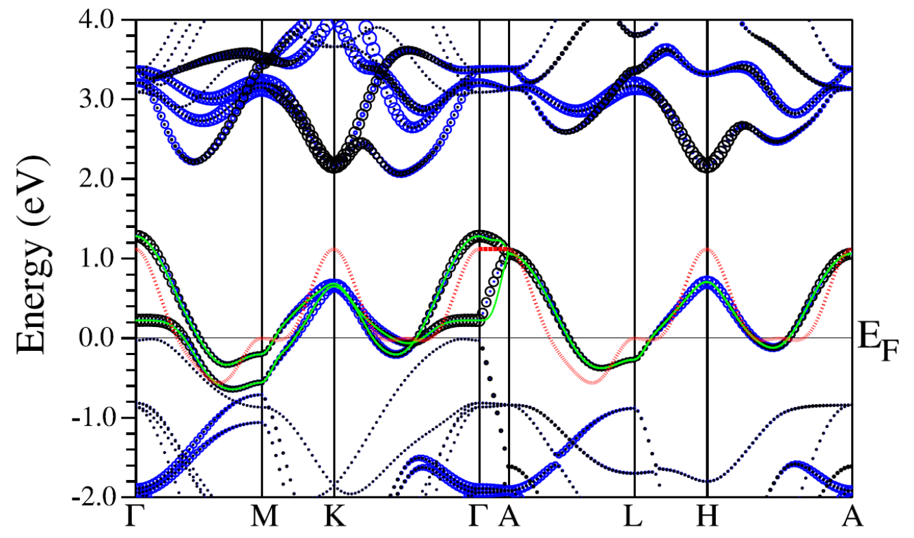
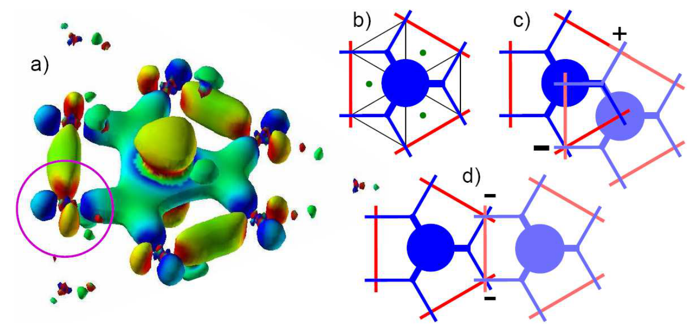
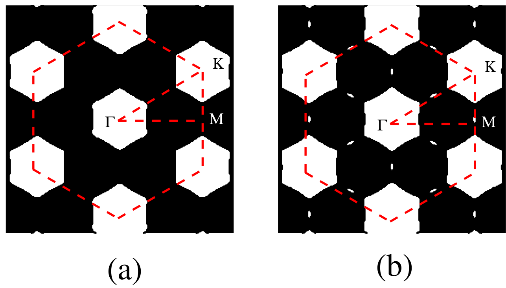
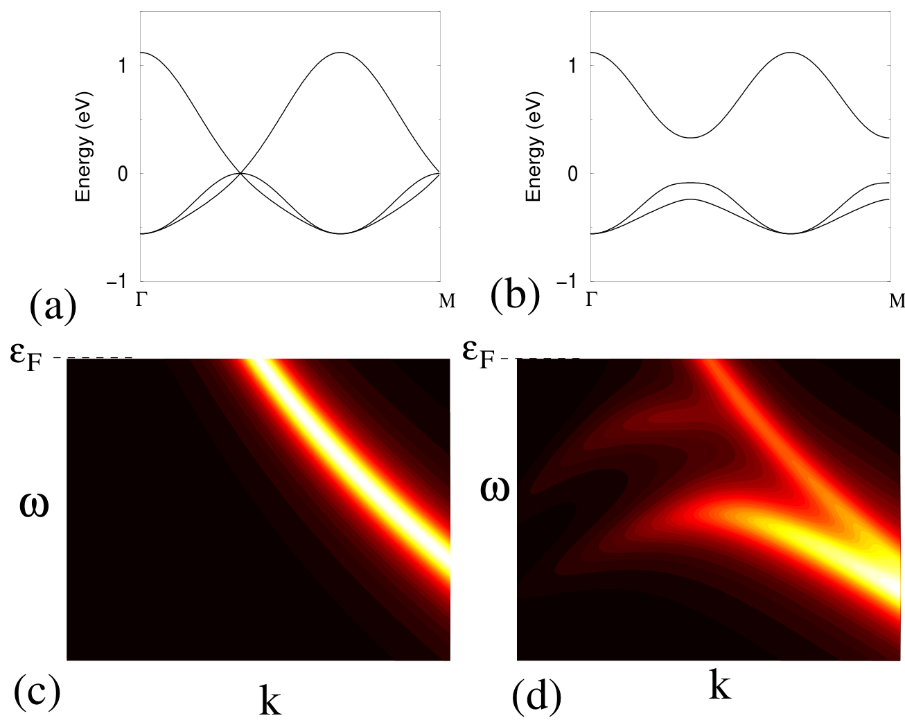

## Barnett2006coexistence — Coexistence of Gapless Excitations and Commensurate CDW in the 2H-TMDs

## 📄 元数据
Barnett, Polkovnikov, Demler, Yin, Ku et al.，2006，Physical Review Letters 96, 026406，DOI 10.1103/PhysRevLett.96.026406
## 💡 一句话
通过第一性原理瓦尼尔函数分析发现 2H-TaSe₂ 低能 d_z² 带由次近邻跃迁（t₂=115 meV）主导，使三角晶格近似解耦为三个子晶格；CDW 畸变只扭曲其中两个，第三个子晶格保持无畸变，因而其能带在整个费米面上不打开能隙，解释了困扰领域二十余年的"公度 CDW 与无隙金属性共存"谜题。

## 🔗 Wiki 双链
  - 概念 [[../concepts/charge-density-wave]]
  - 概念 [[../concepts/density-functional-theory]]
  - 概念 [[../concepts/2D-materials]]
  - 概念 [[../concepts/fermi-surface-nesting|费米面嵌套]]
  - 概念 [[../concepts/wannier-function|瓦尼尔函数]]
  - 概念 [[../concepts/tight-binding|紧束缚模型]]
  - 概念 [[../concepts/sublattice-decoupling|子晶格解耦]]
  - 概念 [[../concepts/hopping-integral|跃迁积分]]
  - 概念 [[../concepts/gapless-excitation|无隙激发]]
  - 概念 [[../concepts/electron-phonon-coupling|电子-声子耦合]]
  - 概念 [[../concepts/commensurate-cdw|公度电荷密度波]]
  - 概念 [[../concepts/phase-interference|相位干涉]]
  - 实体 [[../entities/TMDs]]
  - 实体 [[../entities/2H-TaSe2|2H-TaSe₂]]
  - 实体 [[../entities/WIEN2k|WIEN2k]]
  - 图表 [[../figures/electronic-bands]]
  - 图表 [[../figures/crystal-structures]]
  - 图表 [[../figures/mathematical-models]]
  - 年度 [[../write/2006]]
  - 项目 [[../projects/project-7-cdw-charge-density-wave]]
  - 相关论文 **Barnett2006coexistence**

## 🆕 新概念/实体建议
  （暂无）

## 📊 关键图表
  - 
  - 
  - 
  - 
  - 
  - 公式：
  - 公式：
  - 公式：
  - 公式：
  - 公式：

## 🔬 项目连接
  - **project-7（CDW）— core**：本文是 CDW 领域的核心机理文献。直接研究 2H-TaSe₂ 公度 CDW 相中费米面不打开能隙的反常现象，提出"次近邻跃迁主导→三子晶格解耦→一个子晶格不畸变→能带部分无隙"的完整物理图像，并给出与 ARPES 实验定性一致的理论谱。对 project-7 理解 CDW 驱动力（费米面嵌套 vs 电子-声子耦合）、CDW 态电子结构、公度/非公度转变、以及 CDW 与金属性/超导共存均有直接参考价值。
  - **project-5（SnTe 铁电模拟）— medium**：本文展示的"DFT（WIEN2k/LDA）→能量分辨瓦尼尔函数→定量抽取各近邻跃迁积分→构建最小紧束缚模型→引入电子-声子微扰求解畸变后能带"的 downfolding 工作流，是从第一性原理提炼低能有效模型的标准范例，对 SnTe 铁电/拓扑晶态绝缘体的有效模型构建、应变下跃迁参数变化分析有明确方法学参考价值；但物理体系（CDW 三角晶格 TMD）与 SnTe 不同，故不为 strong。

## 📝 组织与用词
文章采用"问题驱动→第一性原理揭示微观机制→最小模型验证→实验对比→稳健性检验"的论证链条。开篇把领域争议拆为定量（嵌套矢量）与定性（为何无能隙）两个问题，明确锁定后者；中段用 WF 形状的相位干涉直观解释 t₂≫t₁，再以三角晶格几何自然导出三子晶格解耦；后段用 Σ1 位移模式的相位 φ 能量极小化自洽确定基态，并以有限 t₁ 检验结论稳健性。值得复用的术语：
  - 电荷密度波 charge-density wave ([[../concepts/charge-density-wave|CDW]])
  - [[../concepts/fermi-surface-nesting|费米面嵌套 Fermi surface nesting]]
  - [[../concepts/wannier-function|瓦尼尔函数 Wannier function]]
  - [[../concepts/sublattice-decoupling|子晶格解耦 sublattice decoupling]]
  - 次近邻跃迁 second-nearest-neighbor hopping
  - 相位（相长/相消）干涉 phase (constructive/destructive) interference
  - 公度/非公度 commensurate/incommensurate
  - 紧束缚 downfolding / minimal tight-binding model

## ✏️ 可写入 Wiki 的要点
  1. 2H-TaSe₂ 每个晶胞含两个弱耦合 TaSe₂ 夹层，费米能级附近两条金属带主要由 Ta 5d_z² 轨道贡献（Ta⁴⁺ 构型，每个 Ta 一个价电子），−0.7 eV 以下才以 Se p 带为主。
  2. 瓦尼尔函数呈 d_z² 中心、d_xy/d_x²-y² 尾部的特殊形状（由 K/H 点 d 轨道杂化所致），导致最近邻跃迁 t₁=38 meV 因尾部相位相消被抑制，次近邻跃迁 t₂=115 meV 因相位相长反而主导；层间跃迁 t⊥,1=29 meV、t⊥,2=23 meV，与面内 t₁ 同量级。
  3. 在仅保留次近邻跃迁的三角晶格中，体系拓扑上分解为三个互不耦合的三角子晶格——这是"子晶格解耦"概念的数学基础。
  4. 最小二维紧束缚模型取 t₂（调整为 140 meV）与 t₆=t₂/3，得到近乎完美嵌套的"六边形棋盘"费米面，与具有扩展鞍点的 ARPES 数据吻合；即便嵌套如此完美，CDW 仍不打开全能隙。
  5. 中子衍射确定的 Σ1 对称位移 δR=Σ_Q u cos(Q·R+φ)Q̂（Q=b/3 三个波矢，3×3 超胞）对任意 φ 总有一个子晶格位移为零；弹性能与 φ 无关，基态相位由导带能量极小决定。
  6. 在固定粒子数 N 与固定化学势 μ=0 两种极端条件下，总能量均在 φ=π/2 取全局极小，与 STM 观测到的电荷极大位置一致；将 t₆ 置零后极小仍在 π/2，结果稳健。
  7. CDW 态 9×9 哈密顿量对角化：未畸变子晶格的能带不受影响、无隙穿过 E_F；两个畸变子晶格的双重简并带在 E_F 打开能隙。理论 ARPES 谱（η=40 meV 展宽）同时显示有隙与无隙谱权重，直接解释 Valla 等实验在 ΓM（嵌套区）和 ΓK 均未观测到能隙。
  8. 引入有限最近邻电子-声子耦合 γ₁≈γ₂/3（对应 t₁≈t₂/3）后，三子晶格严格解耦被破坏、简并被解除，但三重简并以"两条上移至 E_F 以上、一条下移至 E_F 以下"的方式分裂，仍不产生全局准粒子能隙，证明无隙结论对 t₁ 微扰稳健。
  9. 方法论意义：本文是"DFT+Wannier downfold 到最小模型"范式的经典范例——第一性原理给出精确数值，瓦尼尔函数给出可解释的实空间跃迁，最小模型给出解析可处理的物理图像与可实验验证预测。
  10. 遗留问题：CDW 驱动力（嵌套 vs q 依赖电子-声子耦合）的定量争议仍未解决；模型为二维、忽略层间耦合与多轨道效应；LDA 可能低估关联效应，未做原子弛豫/声子谱验证；这些为后续 DMFT、Wannier90 复核、手性 CDW、非平衡动力学留下空间。