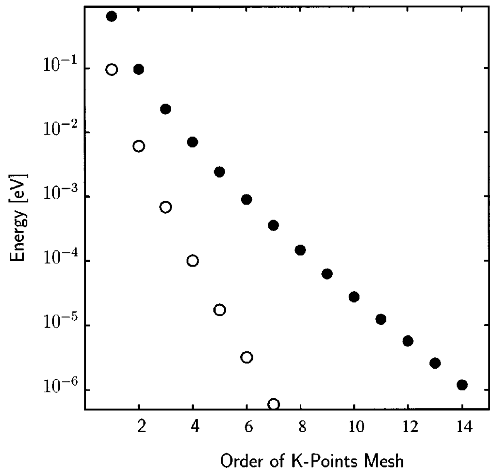
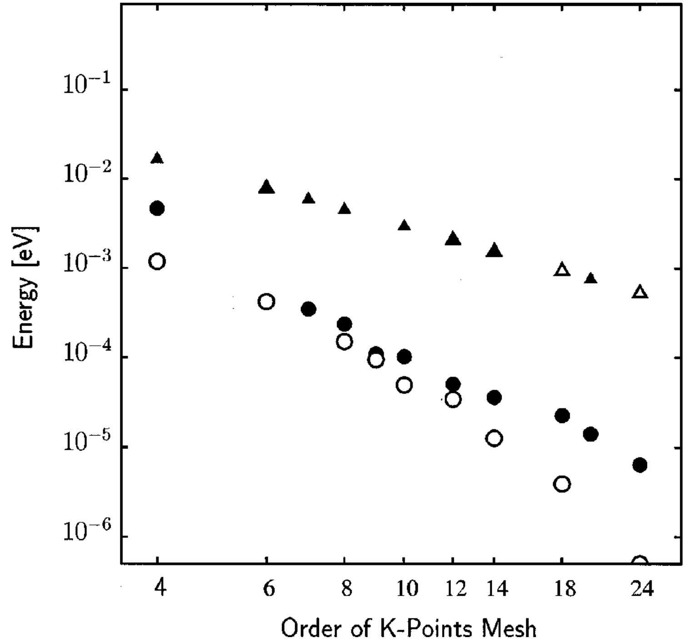
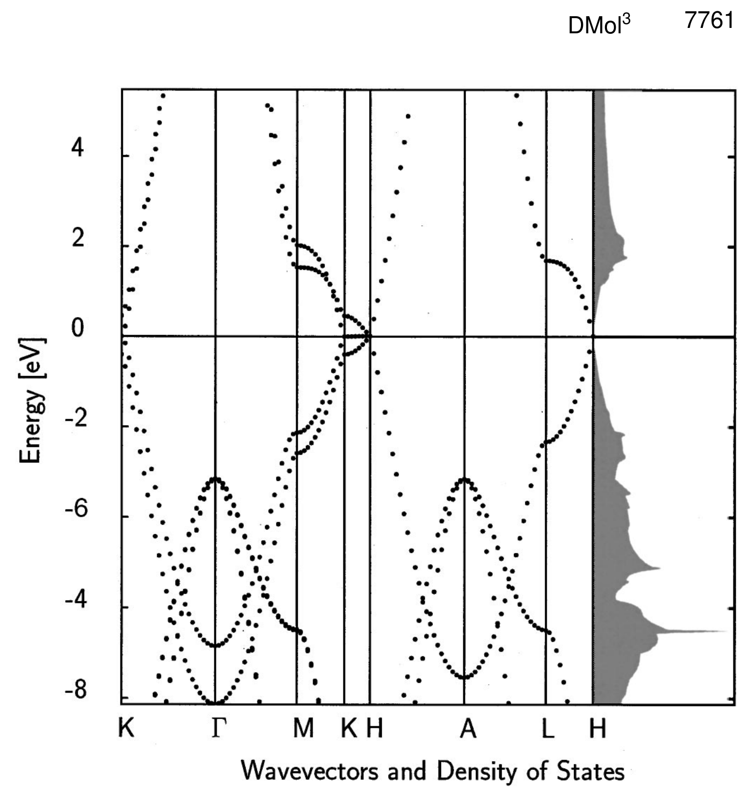
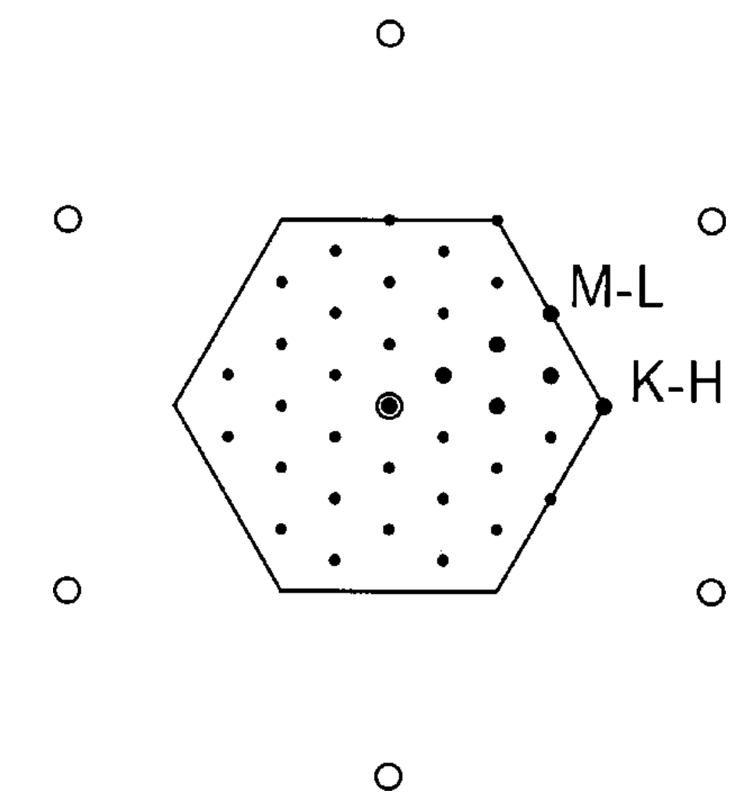

## Delley2000 — 从分子到固体的 DMol3 方法

## 📄 元数据
B. Delley，2000，*The Journal of Chemical Physics* 113(18), 7756–7764，DOI [10.1063/1.1316015](https://doi.org/10.1063/1.1316015)

## 💡 一句话
系统公开 DMol3 从气相分子 DFT 扩展到绝缘体、半导体、半金属与金属固体的关键实现（短尾数值原子轨道、半局域赝势、k 点矩阵元、Bloechl 四面体积分、梯度泛函数值处理），并用 Cu/Si/石墨/α-S8 与 G2 分子集标定，指出精度瓶颈在泛函而非数值方法。

## 🔗 Wiki 双链
  - 概念 [[../concepts/density-functional-theory]]
  - 概念 [[../concepts/numerical-atomic-orbitals|数值原子轨道]]
  - 概念 [[../concepts/pseudopotential|赝势]]
  - 概念 [[../concepts/brillouin-zone-integration|布里渊区积分]]
  - 概念 [[../concepts/gga-functional|GGA 泛函]]
  - 概念 [[../concepts/enthalpy-of-formation|生成焓]]
  - 实体 [[../entities/dmol3|DMol3]]
  - 实体 [[../entities/VASP]]（同为平面波/固体 DFT 代码，可作方法对照）
  - 图表 [[../figures/electronic-bands]]（石墨能带与 DOS）
  - 图表 [[../figures/crystal-structures]]（Cu/Si/石墨/α-S8 结构基准）
  - 年度 [[../write/2000]]
  - 项目 [[../projects/project-4-ttf-molecular-calc]]
  - 项目 [[../projects/project-5-snte-ferroelectric-sim]]
  - 项目 [[../projects/project-2-mn-multiferroics]]
  - 项目 [[../projects/project-7-cdw-charge-density-wave]]
  - 相关论文 **Delley2000**

## 📊 关键图表
  - **图 1：Si 原胞总能量随倒空间网格阶数的收敛性**
  -  -> [[../figures/mathematical-models|数学模型与物理公式]]
  - **图示描述**：纵轴为 Si 原胞总能量相对于收敛极限的差值（单位 mHa，1 Ha ≈ 27.2114 eV），横轴为 Monkhorst–Pack 倒空间网格阶数；实心点为包含 Γ 点的未平移网格，空心点为平移网格（shifted meshes）。
  - **关键特征**：随网格阶数从 2 增至 14，总能量差呈典型的**指数收敛**，这是绝缘体/半导体因带隙存在、被积函数光滑的标志；平移网格在同阶数下误差普遍低于未平移网格（如 10 阶平移与 14 阶未平移相当），但考虑对称性约化后两者特殊 k 点数接近（14 阶未平移 104 个、10 阶平移 110 个）；默认 δk = 0.03 a.u. 对应 Si 原胞取 6 阶网格。
  - **结论/意义**：证明对绝缘体只需用倒空间网格间距（而非绝对 k 点数）作为先验收敛控制变量，为小带隙半导体（如 SnTe 顺电相）的 k 点收敛测试建立了标准范式。
  - **图 2：Cu 原胞总能量随 k 网格阶数的幂律收敛**
  -  -> [[../figures/mathematical-models|数学模型与物理公式]]
  - **图示描述**：纵轴为金属 Cu 原胞总能量差（mHa），横轴为 k 网格阶数；圆点表示启用 Bloechl 二阶（费米面曲率）修正的四面体法，三角形表示线性四面体法，实心/空心分别对应未平移/平移网格。
  - **关键特征**：与 Si 不同，Cu 因费米面切割部分填充能带，总能量随网格阶数按**幂律**缓慢收敛；Bloechl 修正曲线在所有阶数下都比线性四面体法低数个量级的误差，显著加速金属 k 点积分；Cu 原胞默认取 8 阶网格；二阶修正会在部分 k 点引入负占据权重（积分总占据仍正定），可结合有限温度占据或高斯展宽抑制 SCF 虚假振荡。
  - **结论/意义**：确立了金属/CDW 等含费米面体系必须使用 Bloechl 四面体积分并加密 k 网格的方法论准则，是 project-7 等金属态电子结构计算的直接参考。
  - **图 3：石墨能带结构与态密度**
  -  -> [[../figures/electronic-bands|电子能带与电子态]]
  - **图示描述**：左半为石墨沿 Γ–M–K–H 高对称路径的能带色散（纵轴能量，eV，以费米能级 E_F 为零），右半为对应的态密度 DOS（states/eV，能量轴与左侧对齐）；采用 BP 泛函、未平移 12×12×4 k 网格及实验几何（a = 246 pm，c = 680 pm）。
  - **关键特征**：在 K–H 线上价带顶与导带底简并并恰好穿过 E_F，带隙为零；E_F 处 DOS 非零但极小，形成经典"V 形"伪隙，印证石墨为**半金属**；DOS 中的峰对应能带中较平坦、电子态富集的区段；PWC 给出 c/a = 2.694（偏小），GGA/PBE/B88PW91 分别高估 c/a 约 13.8%、14.5%、25%，但 c 轴膨胀对应的总能变化仅约 1 mHa/原子。
  - **结论/意义**：既展示了 DMol3 计算半金属能带的能力，也暴露了 GGA 对石墨层间弱键描述失效的问题，为后续 vdW-DF/DFT-D 修正提供了经典基准。
  - **图 4：六方固体 6×6×n 未平移 k 网格在 ab 面的投影**
  -  -> [[../figures/electronic-bands|电子能带与电子态]]
  - **图示描述**：将三维 6×6×n 未平移 Monkhorst–Pack 网格投影到六方晶格的 ab 倒格面上；普通圆圈表示倒格点，粗体点表示经空间群对称性约化后需显式计算的"特殊 k 点"。
  - **关键特征**：要让网格点恰好落在 K–H 线（石墨半金属简并线）上，ab 面网格阶数必须为 3 的倍数；因此能带/DOS 展示用 12×12×4，而日常性质计算为避免 E_F 处简并导致的虚假占据，选用 8×8×4 网格（ab 面阶数不是 3 的倍数，避开 K–H 采样问题）；该示意图是对称性约化与 k 网格设计的直观教具。
  - **结论/意义**：解释了石墨类六方体系 k 点选择的几何约束，对层状/二维材料的收敛性测试具有普遍指导意义。
  - **表 I–VI（以表格图片形式收录）**
  - 表 I（Cu 随截断半径 Rc 收敛，PWC 下 Rc > 9 a.u. 晶格常数稳定在 0.1% 内、B ≈ 174 GPa，BP 使晶格膨胀约 2%、B 降至 113 GPa）、表 II（Si 与 FLAPW 对照：同泛函下能量差 < 1 mHa、晶格差 0.1%、体模量差 3%；加 f/g 极化将 KS 带隙从 0.59 eV 降至约 0.50 eV 收敛值）、表 III（Si 零点振动能随超胞从 2 原子 1.10 收敛到 64 原子 1.41 kcal/mol/原子，16 原子超胞即达 ~0.1 kcal/mol 精度）、表 IV（PWC 错判金刚石比石墨稳定 1.2 mHa/原子，BP 正确给出石墨稳定 3.9 mHa/原子≈2.4 kcal/mol）、表 V（G2 集 148 分子：BP 平均绝对偏差 5.9 kcal/mol、rms 8.0；PBE 用实验原子参考时偏差大，改用自洽 H/N/O/F/Cl 分子与 C/Si/S 固体参考态后显著改善）、表 VI（C/Si/S 气态原子生成焓分解，含结合能、洪特规则增益、零点能等贡献）以表格图片形式收录于 `raw/figures/Delley2000/tab_0_FNPDC6W7.png`、`tab_298_S38GC7X5.png`

## 🔬 项目连接
  - **project-4 TTF 分子计算**：直接方法参考。(1) DMol3 本就是分子 DFT 代码，文中详述数值原子轨道基组在分子中的精度来源（分离原子极限精确解 + 少量极化函数），与项目中 TTF 有机分子晶体的 DFT 参考计算选型直接相关；(2) 表 V 对 G2 集 148 个中性分子的生成焓系统标定（BP 平均绝对偏差约 6 kcal/mol，PBE 用计算原子参考态后接近 BP），为评估 TTF 分子内/分子间键能、生成焓的泛函选择提供定量依据；(3) 文中零点振动能与 298 K 热修正随超胞尺寸的收敛（16 原子超胞即可达 ~0.1 kcal/mol，表 III）可作为 TTF 晶体声子/热力学修正的收敛标准；(4) 对石墨层间弱键在 GGA 下被严重削弱（c/a 高估 14–25%）的讨论，对 TTF 晶体 π–π 堆叠/层间作用能的泛函与色散修正选择具有警示价值（需 DFT-D/vdW-DF），与项目中用 UFF/MACE/DeepMD 描述层间作用的验证逻辑相通。
  - **project-5 SnTe 铁电模拟**：方法学参考。(1) SnTe 为小原胞窄带隙半导体/临近铁电失稳，文中对 Si 原胞 k 点收敛（默认 δk=0.03 a.u.、6 阶网格、shifted mesh 效率）及绝缘体指数收敛规律直接适用于 SnTe 体相收敛性测试；(2) 若研究 SnTe 顺电相或载流子掺杂下的金属态，Bloechl 四面体法对费米面二阶曲率修正、负占据处理、有限温度/高斯展宽抑制 SCF 振荡的经验可直接借鉴；(3) 表 I/II 定量展示 LDA(PWC) 晶格常数偏小、体模量偏大，而 BP/PBE 等 GGA 晶格膨胀约 2%、体模量软化——这对铁电体尤为关键（铁电性对晶格常数与应变极敏感），为 SnTe 势函数拟合/校验时选择 DFT 参考泛函提供依据；(4) 半局域赝势（ECP/AREP）在 DFT 中约 1.2% 晶格收缩来自可移植性不足、约 0.8% 来自相对论收缩的拆解，对 Sn（重元素）Te 的赝势/相对论处理有直接参考意义。
  - **project-2 Mn 多铁**：间接方法参考。Mn 等过渡金属氧化物涉及重原子、磁性、固体周期计算；文中半局域赝势引入标量相对论效应、自旋极化 LSDA/GGA 实现、磁性初猜导致对称性破缺时的 k 点对称处理，以及 ECP/AREP 从波函数方法移植到 DFT 的可移植性误差，对 Mn 基氧化物 DFT 建模（全电子 vs 赝势、LDA+U/GGA+U 基线）有参考价值。但本文未涉及强关联/磁电耦合本身。
  - **project-7 CDW**：方法学参考。CDW 材料多为含费米面的金属，文中图 2 与正文对金属 k 点积分的幂律收敛、Bloechl 修正相对于线性四面体法的显著精度提升、k 点不足导致虚假占据与 SCF 振荡及其阻尼方法，是计算金属/CDW 体系电子结构与声子不稳定性时 k 点收敛测试的标准参考。
  - **project-1 双光子、project-3 机械发光 NN、project-6 湿度传感器**：无直接项目连接（本文为电子结构 DFT 方法学，不涉及双光子吸收、神经网络势建模或湿敏器件物理）。

## 🔗 项目双链
- 项目 [[../projects/project-1-two-photon|项目一：双光固化和双光发光]]
- 项目 [[../projects/project-2-mn-multiferroics|项目二：Mn极化结构铁电材料]]
- 项目 [[../projects/project-3-mechanoluminescence-nn|项目三：应力发光神经网络]]
- 项目 [[../projects/project-4-ttf-molecular-calc|项目四：lsl老师的ttf分子计算]]
- 项目 [[../projects/project-5-snte-ferroelectric-sim|项目五：lammps势函数SnTe铁电模拟]]
- 项目 [[../projects/project-6-humidity-sensor|项目六：小花闻的电压湿度传感器]]
- 项目 [[../projects/project-7-cdw-charge-density-wave|项目七：CDW电荷密度波]]

## 📝 组织与用词
  文章按"提出问题（分子→固体）→ 四大方法模块（短尾局域基函数 / 半局域赝势矩阵元 / k 表示矩阵元与 BZ 积分 / 梯度泛函数值处理）→ 基准标定（Cu、Si、石墨、α-S8 的 Rc 与 k 网格收敛，与 FLAPW 对照）→ 应用（G2 分子集与原子参考态生成焓）→ 结论（瓶颈在泛函）"递进，论证以"数值实现细节 + 收敛曲线/表格 + 与独立方法或实验对照"三位一体展开。
  可复用术语：
  - numerical atomic orbitals / 数值原子轨道 [[../concepts/numerical-atomic-orbitals|数值原子轨道]]（NAO）
  - short-tail localized basis / 短尾局域基函数（soft confining potential 软约束势 + hard wall 硬壁）
  - semilocal pseudopotential / 半局域赝势（ECP、AREP、scalar relativistic 标量相对论）
  - Brillouin-zone integration / 布里渊区积分 [[../concepts/brillouin-zone-integration|布里渊区积分]]（Monkhorst–Pack mesh、tetrahedron method with Bloechl corrections）
  - Fermi-surface curvature correction / 费米面曲率二阶修正
  - LDA (PWC) vs GGA (BP/B88PW91, PBE) overbinding/softening / 过结合与软化
  - enthalpy of formation & atomic reference state / 生成焓与原子参考态
  - transferability of pseudopotentials / 赝势可移植性

## ✏️ 可写入 Wiki 的要点
  1. DMol3 用自由原子的数值径向解作为基函数主体（DND 为双数值 + d 极化，DNP 再加更高极化），在分离原子极限精确，因而用较少基函数即可高精度描述成键；基函数通过软约束势（类谐振势，可用半径更高次幂）与硬壁边界条件结合实现严格有限截断，兼顾动能实空间计算与矩阵稀疏性。
  2. 时间复杂度公式 T ≈ a N Rc^{2d}/M + b N³(K/M)int + c N log M：矩阵元/密度部分对体系大小 N 线性、对截断半径 Rc 随维度 d 呈 2d 次幂；对角化为 N³ 且对 k 点数 K 线性；线性部分可高效并行，对角化按 k 点分布到处理器。
  3. 绝缘体（Si）总能量对 k 网格阶数呈**指数收敛**，控制变量是倒空间网格间距（默认 δk = 0.03 a.u.），Si 原胞默认 6 阶网格；金属（Cu）因[[../concepts/fermi-surfaces|费米面]]呈**幂律收敛**，默认 8 阶网格。
  4. 金属 BZ 积分采用 Bloechl 四面体格点法并默认启用二阶（费米面曲率）修正，相对线性四面体法精度大幅提升；二阶修正会在部分 k 点产生负占据权重（总占据仍正定），简并能带在某 k 点与空带重合时等权占据两轨道以避免 SCF 虚假振荡，也可用有限温度占据或高斯展宽阻尼。
  5. 半局域赝势 Vps = Vloc + Σ_lm |lm⟩V_l(r)⟨lm|；球面上的角投影（式 2）主导矩阵元构建时间，故 Kleinman–Bylander 型完全可分离化并不能显著加速。Stuttgart–Dresden ECP 与 AREP 原为 Hartree–Fock 波函数方法开发，直接用于 DFT 会产生额外晶格收缩——对 Cu，全电子标量相对论收缩为 0.76%，ECP 非相对论版给出 0.94% 相对论收缩，剩余约 1.2% 收缩归因于赝势在 DFT 中的可移植性不足。
  6. 与 FLAPW 在同一泛函下对照（Si，表 II）：DMol3 与 FLAPW 能量差 < 1 mHa、晶格常数差 0.1%、体模量差 3%；但两者与实验的偏差大于彼此偏差，证明数值方法已收敛、误差 majorly 来自泛函。加 f、g 极化函数系统降低 KS 带隙至与 FLAPW 一致的收敛值（约 0.50 eV），但 KS 带隙仍远小于[[../concepts/optical-band-gap|光学带隙]]。
  7. LDA(PWC) 过结合：Cu 晶格偏短、体模量 174 GPa（实验 137 GPa）；BP(GGA) 使 Cu 晶格膨胀约 2%、体模量降至 113 GPa。Si 上 PWC [[../concepts/lattice-bias|晶格偏差]] −0.5%、B = 97 GPa（实验 98.8 GPa），BP 晶格 +0.8%、B = 90 GPa。
  8. 石墨是弱键失效的典型案例：PWC 给出 c/a = 2.694（偏小），GGA 高估 c/a 13.8%、PBE 高估 14.5%、B88PW91 高估约 25%；但 c 轴膨胀对应的总能降低仅约 1 mHa/原子。PWC 错误预测金刚石比石墨稳定 1.2 mHa/原子，BP 正确预测石墨更稳定 3.9 mHa/原子（2.4 kcal/mol），说明 GGA 才修正弱键相对稳定性。
  9. G2 中性分子集（148 个）[[../concepts/enthalpy-of-formation|生成焓]]（298 K）：BP/B88PW91 平均绝对偏差约 5.9 kcal/mol、rms 8.0；PBE 用实验原子参考时平均绝对偏差高达 12.4 kcal/mol（系统性过估原子解离能），改用自洽计算的 H/N/O/F/Cl 分子参考态与 C/Si/S 固体参考态后降至 7.1 kcal/mol，接近 BP指标。Si、S 原子生成焓被 BP 低估（Si 计算 99.58 vs 实验 106.6 kcal/mol；S 60.33 vs 65.66），PWC 则反转为高估。
  10. 零点振动/热修正收敛：Si 超胞从 2 原子增至 64 原子，E_vib(0) 从 1.10 收敛到 1.41 kcal/mol/原子，H(298)−H(0) 从 0.20 到 0.78；16 原子超胞即可给出 ~0.1 kcal/mol 精度。石墨零点能用 36 原子超胞、金刚石与 Si 用 16 原子超胞计算。
