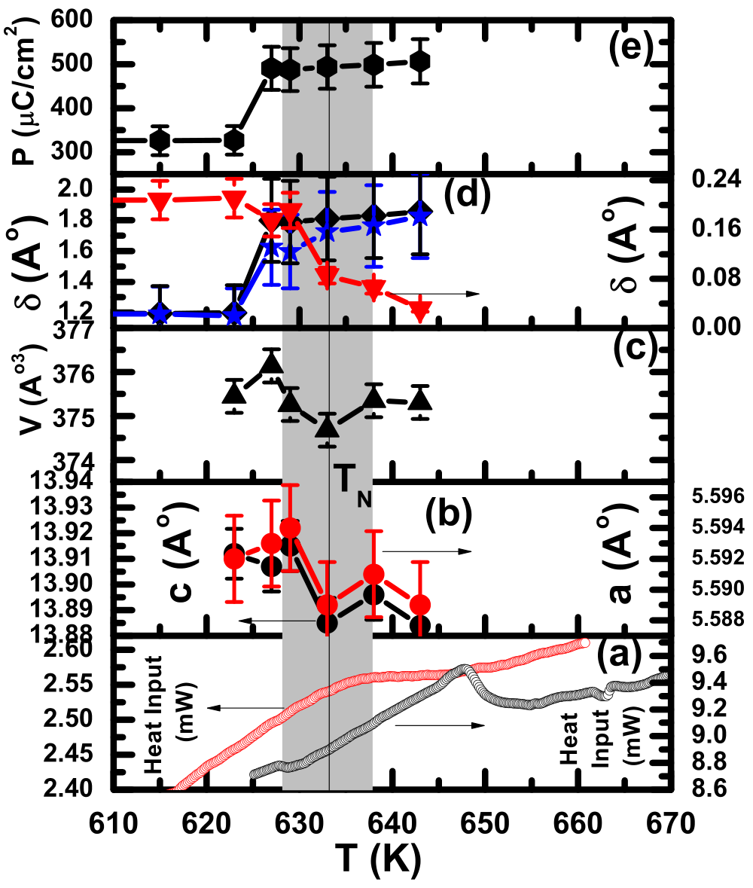

## Goswami2011multiferroic — 纳米尺度 BiFeO3 中的多铁性耦合

## 📄 元数据
Goswami, Bhattacharya, Choudhury, Ouladdiaf, Chatterji，2011，Applied Physics Letters 99, 073106，DOI [10.1063/1.3625924](https://doi.org/10.1063/1.3625924)
## 💡 一句话
通过变温 XRD 与加场中子衍射，首次直接证实约 22 nm 的 BiFeO3 纳米颗粒中仍存在强磁电耦合——极化在 TN 处跃升约 30%、在 5 T 磁场下被抑制约 7%。

## 🔗 Wiki 双链
  - 概念 [[../concepts/multiferroicity]]、[[../concepts/magnetoelectric-coupling]]、[[../concepts/strain-engineering]]、[[../concepts/antiferromagnetism|反铁磁性]]、[[../concepts/spin-spiral|自旋螺旋]]、[[../concepts/dzyaloshinskii-moriya-interaction|DM相互作用]]、[[../concepts/oxygen-octahedron-rotation|氧八面体旋转]]、[[../concepts/magnetoelastic-coupling|磁弹耦合]]、[[../concepts/critical-thickness-ferroelectric|尺寸效应]]
  - 实体 [[../entities/BiFeO3]]、[[../entities/Bi2Fe4O9]]、[[../entities/FullProf]]、[[../entities/ILL-D20]]
  - 图表 [[../figures/crystal-structures]]
  - 年度 [[../write/2010-2014|2011]]
  - 项目 [[../projects/project-2-mn-multiferroics]]
  - 概念 [[../concepts/size-effect]]、[[../concepts/first-order-phase-transition]]
  - 相关论文 [[../../raw/note/Goswami2011multiferroic]]
## 📊 关键图表
  - **图1**：超声化学法合成的 ~22 nm BiFeO3 纳米颗粒的 TEM 与 HRTEM 照片。
  -  -> [[../figures/crystal-structures-bulk|体相晶体结构]]
  - **图示描述**：(a) TEM 照片给出整体形貌与粒径分布（平均约 22 nm，颗粒间有轻微团聚）；(b) HRTEM 照片对单颗粒做原子级分辨，可见规则晶格条纹。
  - **关键特征**：(b) 中条纹间距对应 R3c 结构的 (012) 晶面（部分颗粒观察到 (110) 面取向）；条纹连续贯穿整个颗粒，无内部晶界，证明颗粒为高度结晶的单晶；单晶性保证了后续 Rietveld 精修与极化估算的结构可靠性。
  - **图2**：跨越 TN 的多个温度下（298–643 K）粉末 XRD 实验谱与 FullProf 精修结果。
  -  -> [[../figures/experimental-setups|实验装置与测量系统]]
  - **图示描述**：横轴为衍射角 2θ，纵向堆叠多个温度的谱图；红色空心圆为实验数据，黑色实线为 FullProf 计算谱，蓝色实线为残差，绿色竖线为布拉格峰位。
  - **关键特征**：298 K 至 643 K 全部谱线均可用 R3c 空间群（六方坐标）指标化，跨 TN (~635 K) 无结构相变；含约 5% Bi2Fe4O9 杂质峰并已指认；精修考虑了晶粒尺寸与微应变展宽，χ² 约 2.2–2.7，为后续提取晶格常数、原子坐标与离子位移提供基础。
  - **图3**：室温下 0 T 与 5 T 磁场的粉末中子衍射谱及精修结果（λ = 2.41 Å，ILL D20）。
  -  -> [[../figures/experimental-setups|实验装置与测量系统]]
  - **图示描述**：与图2类似的实验/计算/残差/布拉格峰布局，但绿色竖线同时标出晶体学与磁性晶格的布拉格位置；上下两条谱分别对应零场和 5 T。
  - **关键特征**：磁传播矢量 k = (0,0,0)，为公度磁晶格；Fe3+ 有序磁矩约 3.22 μB；对比 0 T/5 T 精修，Bi 的 z 坐标由 0.4524 变为 0.4486，净离子位移 δ 减小约 0.06 Å，对应极化被抑制约 7%；未观察到极化方向翻转；χ² 分别为 30.3 与 16.1，磁结构精修可接受。
  - **图4**：DSC、晶格参数、体积、离子位移与极化随温度变化的五子图综合图。
  -  -> [[../figures/crystal-structures-xrd-phases|XRD与相变]]
  - **图示描述**：五个子图共享温度 T（K）横轴：(a) DSC 热流（块体黑、纳米红）、(b) 晶格参数 c（左轴，Å）与 a（右轴，Å）、(c) 晶胞体积 V（ų）、(d) Bi/Fe 偏心位移及净 δ（菱形/倒三角/星号，Å）、(e) 点电荷模型计算的铁电极化 P（μC/cm²）。
  - **关键特征**：纳米颗粒 TN 由块体 ~653 K 降至 ~635 K，DSC 吸热峰明显宽化（表面效应圆化一级相变）；TN 处 V 收缩约 0.4%，a、c 出现拐折，呈磁弹耦合特征；δBi、δFe 与净 δ 在 TN 处台阶式跃升；P 在 TN 处跃升约 30%，磁有序"从无到有"对极化的影响远大于远低于 TN 时 5 T 磁场的 7% 抑制。
  - **结论/意义**：温变（30%）与场变（7%）两条独立证据链共同证实 ~22 nm 颗粒中仍存在强多铁性耦合，并支持"自旋螺旋抑制 → DM 作用增强氧八面体绕 [111] 非铁电旋转 → 极性-旋转耦合调控极化"的机制图像。

## 🔬 项目连接
  - **project-2 Mn 多铁（strong）**：本文是 BiFeO3 纳米尺度磁电耦合的直接实验证据，对项目有多方面参考价值。机制上，作者提出"自旋螺旋抑制 → 净磁化增强 → 通过 DM 相互作用增强氧八面体绕 [111] 轴的非铁电旋转 → 极性-旋转畸变耦合改变铁电位移"这一完整链条，对 Mn 基多铁中磁-晶格-极化耦合的物理图像是直接可类比的模板；数据上，给出了 R3c 结构跨 TN 的精修原子坐标、Bi-O/Fe-O 键长、Fe-O-Fe/O-Bi-O 键角，以及 0 T/5 T 下的对比（如 Bi 的 z 坐标 0.4524→0.4486、净 δ 减小约 0.06 Å），可作为结构-极化关系的对照；方法上，展示了用变温 XRD + 加场中子衍射 + 离子位移点电荷模型间接定量磁电耦合的完整流程，且 BFO 本身就是 project-2 wiki 页中明确列出的参考实体。
  - project-1 双光子 / project-3 机械发光 NN / project-4 TTF 分子计算 / project-5 SnTe 铁电模拟 / project-6 湿度传感器 / project-7 CDW：无直接项目连接。

## 🔗 项目双链

## 📝 组织与用词
文章走"问题（纳米尺度耦合是否存在）→ 样品与基础物性（TEM、TN=635 K）→ 两条互补证据链（变温 XRD 给极化跃变 30%；加场中子衍射给磁场抑制 7%）→ 机制讨论（排除六方锰氧化物式畴翻转，提出自旋螺旋抑制 + DM + 八面体旋转耦合）→ 结论与展望（P-E 回线直测、器件集成）"的紧凑 APL 四段式结构。值得复用的术语：
  - multiferroic coupling — 多铁性耦合
  - [[../concepts/spin-spiral|spin spiral / cycloidal modulation — 自旋螺旋 / 摆线调制]]
  - [[../concepts/dzyaloshinskii-moriya-interaction|Dzyaloshinskii–Moriya interaction — DM 相互作用]]
  - nonferroelectric rotation of oxygen octahedra — 氧八面体的非铁电性旋转
  - off-center displacement — 偏心位移
  - [[../concepts/magnetoelastic-coupling|magnetoelastic coupling — 磁弹耦合]]
  - [[../concepts/magnetic-propagation-vector|propagation vector / commensurate magnetic lattice — 传播矢量 / 公度磁晶格]]
  - point-charge model — 点电荷模型（离子位移估算极化）

  - [[../concepts/point-charge-model|point-charge-model]]
## ✏️ 可写入 Wiki 的要点
  1. 超声化学共沉淀法合成的 ~22 nm BiFeO3 颗粒为单晶（HRTEM 晶格条纹对应 (012) 面），室温及跨 TN 空间群均保持 R3c，与块体一致；含约 5% Bi2Fe4O9 杂质。
  2. 纳米颗粒 TN 由块体 ~653 K 降至 ~635 K；DSC 峰显著宽化，表明[[../concepts/first-order-phase-transition|一级相变]]在纳米尺度因表面效应而圆化，但 TN 处仍有约 0.4% 的体积收缩，保留一级特征。
  3. 变温 XRD 精修显示跨 TN 时晶格参数 a、c 与体积均出现异常，源自[[../concepts/magnetoelastic-coupling|磁弹耦合]]；基于离子位移模型算出的极化 P 在 TN 处跃升约 30%。
  4. 室温中子衍射（λ=2.41 Å）给出[[../concepts/magnetic-propagation-vector|磁传播矢量]] (0,0,0)（公度磁晶格），Fe3+ 磁矩约 3.22 μB；加 5 T 磁场后净离子位移 δ 减小约 0.06 Å，对应极化被抑制约 7%，未观察到极化方向翻转。
  5. 极化方向在低温下偏离 [111]rh‖[001]hex 约 27° 向六方 ab 面倾斜（颗粒应变约 0.1%），升温至 TN 方向回到 [111]rh‖[001]hex。
  6. 磁有序"从无到有"对极化的影响（30%）远大于远低于 TN 时 5 T 磁场的微扰（7%），据此作者排除了六方锰氧化物中畴翻转-伸缩介导的耦合机制。
  7. 提出的耦合机制：粒径 < ~62 nm 抑制周期约 62 nm 的[[../concepts/spin-spiral|自旋螺旋]]，释放大磁化（~0.4 μB/Fe），经 DM 相互作用增强氧八面体绕 [111] 轴的非铁电旋转；因极性畸变与旋转畸变相互耦合，旋转变化牵引 Bi/Fe 偏心位移，从而调控极化。
  8. 极化由 Abrahams–Kurtz–Jamieson 离子位移/点电荷方法从精修原子坐标估算（P ~ Σ qi δi），属间接测量；作者明确指出未来需在零场与加场下直接做 P-E 电滞回线验证。
  9. 粉末样品平均掉了[[../concepts/migdal-eliashberg-theory|各向异性]]，无法确定磁场相对于晶轴的方向，这可能掩盖了单晶中沿特定方向更剧烈（甚至翻转）的响应。
  10. Table I/II 提供了 298–643 K 七个温度及 0/5 T 下完整的 R3c 精修数据（晶格常数、Wyckoff 坐标、Bi-O/Fe-O 键长、Fe-O-Fe/O-Bi-O 键角、Rp/Rwp/χ²），可作为 BFO 纳米颗粒结构-极化关系的可复用基准数据。
