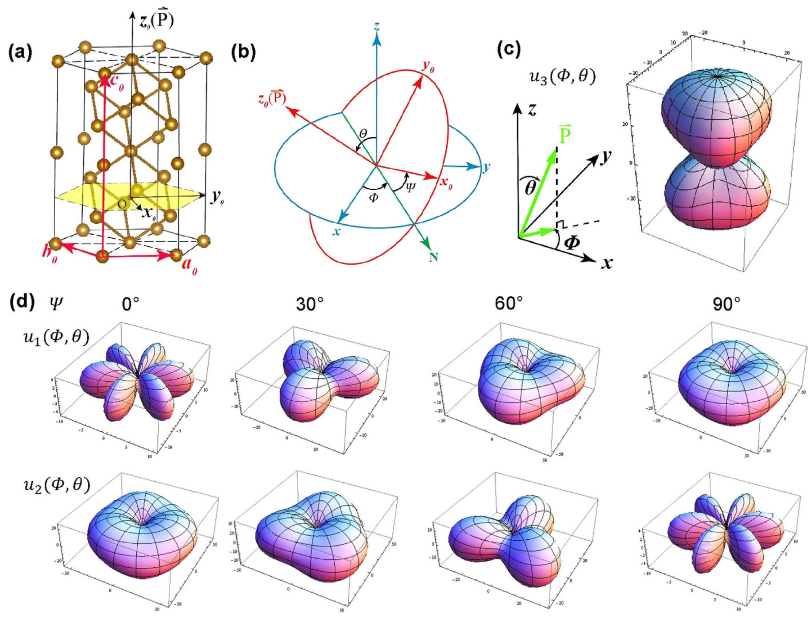
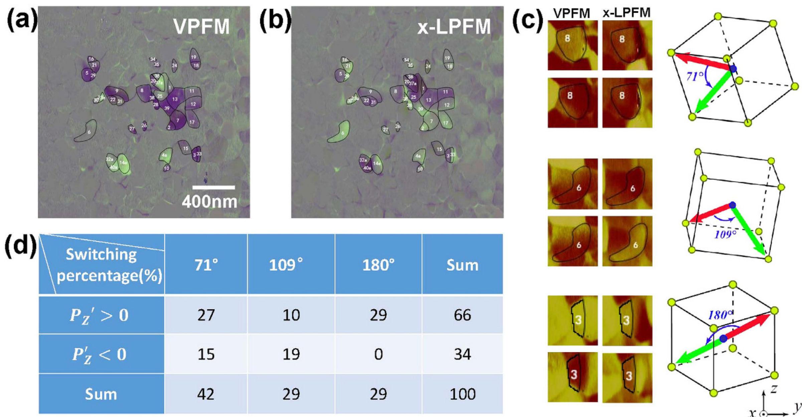

## Jin2015studying — 用二维压电响应力显微镜研究 BiFeO3 多晶薄膜的极化开关

## 📄 元数据
Yaming Jin, Xiaomei Lu, Junting Zhang, Yi Kan, Huifeng Bo, Fengzhen Huang, Tingting Xu, Yingchao Du, Shuyu Xiao, Jinsong Zhu，2015，Scientific Reports 5, 12237，DOI [10.1038/srep12237](https://doi.org/10.1038/srep12237)
## 💡 一句话
开发了一套从二维 PFM（OP+IPx）信号反演随机取向多晶 BiFeO₃ 晶粒三维极化翻转角的数值方法，定量给出 71°/109°/180° 翻转面积占比（42%/29%/29%），并建立"电荷迁移能 vs 面内应力能"竞争模型解释翻转路径选择。
## 🔗 Wiki 双链
  - 概念 [[../concepts/polarization-switching]]、[[../concepts/multiferroicity]]、[[../concepts/magnetoelectric-coupling]]、[[../concepts/ferroelasticity]]、[[../concepts/strain-engineering]]、[[../concepts/density-functional-theory]]、[[../concepts/piezoelectric-response]]、[[../concepts/polycrystalline-ferroelectrics]]、[[../concepts/charge-migration-energy]]
  - 实体 [[../entities/BiFeO3]]、[[../entities/domain-wall]]
  - 图表 [[../figures/crystal-structures]]、[[../figures/mathematical-models]]、[[../figures/experimental-setups]]、[[../figures/domain-walls]]
  - 年度 [[../write/2015]]
  - 项目 [[../projects/project-2-mn-multiferroics]]、[[../projects/project-5-snte-ferroelectric-sim]]
  - 相关论文 [[../../raw/note/Jin2015studying]]
## 🆕 新概念/实体建议
  - `PFM`（压电响应力显微镜）：实验技术实体条目，可涵盖 VPFM/LPFM、锁相检测、导电探针等。
  - `first-principles-piezoelectric-tensor`（第一性原理压电张量）：方法实体，d₁₀₅=80、d₂₀₂=27、d₃₀₁=1.4、d₃₀₃=23 pC/N 等参数可写入。
## 📊 关键图表
  -  -> [[../figures/crystal-structures|晶体结构与原子排布]]
  -  -> [[../figures/experimental-setups|实验测试与测量装置]]
  -  -> [[../figures/experimental-setups|实验测试与测量装置]]
## 🔬 项目连接
  - **project-2（Mn 多铁）—— strong**：本文系统研究了菱方相多铁材料 BiFeO₃ 中非 180° 铁电畴翻转（71°/109°）伴随铁弹应变、进而可耦合磁序的物理机制，给出的"电荷迁移能–面内应力能"竞争模型、三种翻转角统计规律以及 PFM 表征方法，对理解 Mn 基多铁体系中铁电/铁弹/磁耦合具有直接参考价值；BFO 中 8 个 ⟨111⟩ 极化方向、71°/109°/180° 翻转角的几何来源也是多铁畴物理的通用图像。
  - **project-5（SnTe 铁电模拟）—— medium**：本文使用第一性原理压电张量 + 欧拉角旋转构建任意取向下的理论压电响应曲面，并通过数值反演匹配实验信号，这套"计算张量→旋转→响应面→反演"的流程对铁电材料的计算模拟有方法学参考意义；电荷迁移能与弹性能竞争决定翻转路径的框架，也可为 SnTe 铁电翻转/畴壁能的 DFT 计算提供物理类比与能量分解思路。
  - project-1（双光子）、project-3（机械发光 NN）、project-4（TTF 分子计算）、project-6（湿度传感器）、project-7（CDW）：无直接项目连接。
## 🔗 项目双链
- 项目 [[../projects/project-2-mn-multiferroics|项目二：Mn极化结构铁电材料]]
- 项目 [[../projects/project-5-snte-ferroelectric-sim|项目五：lammps势函数SnTe铁电模拟]]

## 📝 组织与用词
文章按"引言→理论基础（压电面计算 + 四步数据处理）→实验结果（PFM 图像 + 统计）→讨论（与外延膜对比）→方法"组织，核心论证是"理论指纹库 + 实验归一化信号 + 全局数值匹配"反演取向，再以能量竞争模型解释统计。值得复用的术语：
  - [[../concepts/polarization-switching|polarization switching — 极化翻转/开关]]
  - non-180° domain switching — 非180°畴翻转
  - [[../concepts/out-of-plane-ferroelectricity|out-of-plane / in-plane piezoresponse]] (OP/IP) — 面外/面内压电响应
  - piezoelectric tensor — 压电张量
  - Euler angles (Φ, θ, Ψ) — 欧拉角
  - [[../concepts/charge-migration-energy|charge migration energy — 电荷迁移能]]
  - IP stress / stress energy — 面内应力/应力能
  - ferroelastic relaxation — 铁弹弛豫
## ✏️ 可写入 Wiki 的要点
  1. 菱方相（R3c）BiFeO₃ 自发极化沿伪立方 ⟨111⟩ 方向，共 8 个等效极化方向，任意两方向夹角只有 70.53°（≈71°）、109.47°（≈109°）和 180° 三种。
  2. 180° 翻转不改变晶格、无残余应力；71°/109° 翻转伴随铁弹应变，可改变磁序，是[[../concepts/magnetoelectric-coupling|磁电耦合]]的物理基础，但也可导致翻转畴失稳。
  3. BFO 第一性原理压电张量非零系数：d₁₀₅=80 pC/N、d₂₀₂=27 pC/N、d₃₀₁=1.4 pC/N、d₃₀₃=23 pC/N；通过欧拉角旋转 d_ij(Φ,θ,Ψ)=A_ik d⁰_kl N_lj 可得到任意晶粒取向下的压电张量。
  4. 2D PFM 只测一个 OP（u₃）和一个 IPx（u₁）信号；以全扫描区最大信号为内标归一化后，与理论响应面在欧拉角空间（步长 0.01 rad）全局匹配，遍历 7 种翻转路径，以目标函数 |u₁′−u₁e′|+|u₃′−u₃e′|+|u₁″−u₁e″|+|u₃″−u₃e″| 最小者确定取向与翻转角，无需旋转样品。
  5. 多晶 BFO 薄膜（300 nm 厚，130 nm 晶粒，MOD 法生长于 Pt/Ti/SiO₂/Si）在 +12 V 极化后：71° 翻转占 42%，109° 和 180° 各占约 29%。
  6. 高达 34% 的翻转面积其初始 OP 极化与极化电场平行（Pz′<0），这是多晶样品特有现象：即使宏观分量已沿场方向，只要不是 8 个等效方向中沿场分量最大者，仍可通过 71°/109° 翻转到更稳定态。
  7. 电荷迁移能随翻转角增大（180°>109°>71°）；180° 翻转无残余应力，71°/109° 翻转有面内应力且大小取决于翻转前后畴取向；OP 应力易在自由表面释放，故 IP 应力主导。
  8. 初始 OP 反平行于电场时：71° 与 180° 概率相当（27% vs 29%），109° 最低（10%）；初始 OP 平行于电场时：无 180° 翻转，109°（19%）略多于 71°（15%），因后者平均 IP 应力更大。
  9. 变电压实验：4 V 时仅有初始 OP 反平行的 71° 翻转；6 V 以上其他路径被激活；10 V 后统计趋于稳定，支持电荷迁移能最小的 71° [[../concepts/switching-barrier|翻转势垒]]最低。
  10. 与外延膜对比：外延 (001) BFO 中[[../concepts/phase-field-modeling|相场模拟]]给出能量序 180°<71°<109°（Balke et al.），低场下 180° 主导；而多晶膜中由于横向约束弱，IP 应力仍与电荷迁移能可比拟，导致 71° 翻转在低场下更易发生、12 V 时 71° 与 180° 占比接近。
