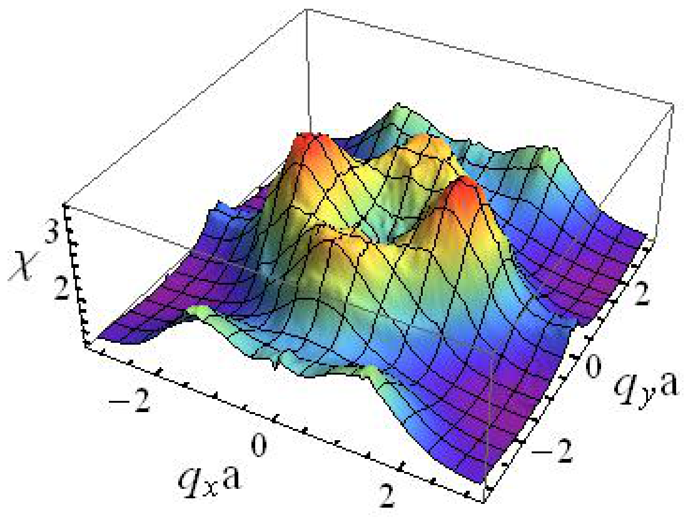

## Kang2012dimer — 二聚体杂质散射、重构嵌套与铁基磷族化合物中的密度波诊断

## 📄 元数据
Jian Kang, Zlatko Tešanović，2012，Physical Review B 85, 220507(R)，DOI 10.1103/PhysRevB.85.220507
## 💡 一句话
提出"重构嵌套"概念，将铁基超导体中钴杂质周围的 STM 二聚体共振解释为口袋密度波（PoDW）序导致的费米面重构与轨道选择性各向异性，并论证此类纳米结构可作为诊断隐藏密度波序的工具。
## 🔗 Wiki 双链
  - 概念 [[../concepts/charge-density-wave]]、[[../concepts/antiferromagnetism|反铁磁性]]、[[../concepts/fermi-surface-nesting|费米面嵌套]]、[[../concepts/nematic-order|向列序]]、[[../concepts/orbital-content|轨道成分]]、[[../concepts/pocket-density-wave|口袋密度波]]、[[../concepts/quasiparticle-interference|准粒子干涉]]、[[../concepts/reconstructed-nesting|重构嵌套]]、[[../concepts/spin-density-wave|自旋密度波]]
  - 图表 [[../figures/crystal-structures]]、[[../figures/electronic-bands]]、[[../figures/mathematical-models]]
  - 年度 [[../write/2012]]
  - 项目 [[../projects/project-7-cdw-charge-density-wave]]、[[../projects/project-2-mn-multiferroics]]
  - 相关论文 [[../../raw/note/Kang2012dimer]]
## 🆕 新概念/实体建议
  - `fermi-surface-nesting`（费米面嵌套）：费米面不同片段经波矢平移后高度重合，是密度波不稳定性的几何驱动力。
  - `pocket-density-wave`（口袋密度波，PoDW）：仅耦合特定电子/空穴口袋并部分打开能隙的密度波序，可诱导结构相变与轨道铁磁性。
  - `reconstructed-nesting`（重构嵌套）：有序态建立后费米面变形产生的、在顺磁态不存在的新嵌套矢量。
  - `quasiparticle-interference`（准粒子干涉，QPI）：杂质散射的准粒子在实空间形成驻波，由 LDOS 振荡图案反推费米面几何。
  - `nematic-order`（向列序）：电子态自发打破 C4 旋转对称但保留平移对称的有序态。
  - `orbital-content`（轨道成分/轨道内容）：费米口袋由哪些 d 轨道构成，决定散射顶点的轨道重叠因子。
  - `three-orbital-model`（三轨道模型）：铁基超导体中考虑 dxz/dyz/dxy 轨道的最小紧束缚模型。
  - `iron-pnictides`（铁基磷族化合物/铁基超导体）：实体条目，一类含 FeAs/FeP 层的高温超导体。
  - `t-matrix-impurity-scattering`（T 矩阵杂质散射）：通过 T 矩阵精确求解单杂质格林函数以计算 LDOS 的方法。
## 📊 关键图表
  - 
  - 
  - 
  - 
  - 
  - 
## 🔬 项目连接
  - **project-7（CDW电荷密度波）— strong**：本文核心是密度波序（PoDW/SDW）通过费米面嵌套驱动电子失稳，与 CDW 项目的物理机制直接同源。"重构嵌套"概念——即有序态一旦建立就会改变费米面几何并产生新的嵌套波矢——可直接用于分析 TMD 中 1T' CDW 态的费米面重构。杂质 QPI/T 矩阵方法计算 LDOS 的流程，可用于诊断 CDW 材料中的隐藏序及各向异性；电荷磁化率 χ(q) 的费曼图计算框架也可迁移到 CDW 波矢判定。文中明确提到将理论推广到过渡金属硫化物。
  - **project-2（Mn多铁材料）— weak**：论文讨论"隐藏电子序驱动结构相变"以及轨道铁磁性，这与多铁材料中自旋—轨道—晶格耦合的物理有形式上的类比；PoDW 同时诱导结构相变和轨道序的机制，可作为理解 Mn 基多铁中多重序耦合的参考图像，但材料体系与核心机理差异较大。
  - 其余项目（project-1 双光子、project-3 机械发光 NN、project-4 TTF 分子计算、project-5 SnTe 铁电模拟、project-6 湿度传感器）无直接内容连接。
## 📝 组织与用词
文章采用"实验谜题→解析几何模型→引入 PoDW 序的重构机制→三轨道模型数值验证→轨道对称性分析→杂质 T 矩阵 LDOS 模拟→与 STM 实验对比"的递进式论证链。先以简化抛物带模型给出 χ(q) 解析表达式证明顺磁态无 q_a 峰，再以 PoDW 序重构费米面产生嵌套峰，最后用三轨道模型和费曼图坐实，并通过单杂质散射计算把倒空间磁化率特征翻译成实空间二聚体图案，形成可与 STM 直接对比的预言。值得复用的术语：
  - 重构嵌套（[[../concepts/reconstructed-nesting|reconstructed nesting]]）
  - 口袋密度波（[[../concepts/pocket-density-wave|pocket density-wave]], PoDW）
  - 二聚体共振（dimer resonance）
  - 准粒子干涉（[[../concepts/quasiparticle-interference|quasiparticle interference]], QPI）
  - 局域态密度（[[../concepts/density-of-states|local density of states]], LDOS）
  - 轨道成分/轨道内容（[[../concepts/orbital-content|orbital content]]）
  - 展开布里渊区（unfolded Brillouin zone）
  - C4 对称性破缺（C4 symmetry breaking）
  - [[../concepts/c4-symmetry-breaking|c4-symmetry-breaking]]
## ✏️ 可写入 Wiki 的要点
  1. 铁基超导体在展开布里渊区中有四个典型费米口袋：Γ 点两个空穴口袋 h1、h2，M1=(π,0) 和 M2=(0,π) 点各一个椭圆电子口袋 e_x、e_y；正常态几何嵌套波矢为 (π,0)/(0,π)，而非二聚体对应的 q_a。
  2. "重构嵌套"定义：PoDW 序建立后，e_y 电子口袋变形、重构空穴口袋片段变平，使原本不存在嵌套的波矢 q_a ≈ (±0.4π, 0) 成为新的嵌套矢量；这是有序态的结果而非起因。
  3. PoDW 部分打开 e_y 与一个空穴口袋（h2）的能隙并诱导结构相变，而 e_x 与另一空穴口袋形成部分能隙的 SDW；该理论自然解释了反铁磁相变与结构相变的邻近性及观测到的轨道铁磁性。
  4. 顺磁态下单个椭圆电子口袋的电荷磁化率 χ(q) 在 q/2 位于口袋内时近似为常数，仅形成平缓"山脊"而非尖峰，因此正常态几何嵌套无法解释二聚体共振。
  5. PoDW 优化嵌套的序参量为 Δ_opt = ε0 (m−m_b)/(m_a+m_b) √(m_a/m)；在最优嵌套时 δχ(q_a) ∝ (Δk/(v_F^3 β))^{1/4}，其中 Δk 为重构空穴口袋宽度，v_F 为费米速度，β 为空穴口袋色散的四阶导数。
  6. 即使 PoDW 与 SDW 序参量大小相等，费米口袋的轨道成分差异仍会自发打破 C4 对称：e_y 主要为 d_xz 轨道、e_x 主要为 d_yz 轨道，散射顶点因子 cos²θ 与 sin²θ 的差异使 χ(q_a) ≠ χ(q_b)。
  7. 三轨道模型（d_xz/d_yz/d_xy）数值计算表明，Δ_PoDW = 20 meV 时 χ_c 在 (±0.4π, 0) 出现高平台而原 (0,±π) 峰被抑制；PoDW 与 SDW 共存时在 (±0.4π, ±π) 出现两个不对称小峰。
  8. 钴杂质用局域势 H_imp = Σ_{σ,α}(V_{sα}+σV_{mα}) d†_α d_α 描述（含非磁与磁性部分），通过 T 矩阵 V_imp = H_imp(1−G0 H_imp)^{−1} 计算 LDOS。
  9. 模拟得到单杂质周围 LDOS 在 r = (±3a, 0) 出现峰，二聚体尺寸 6a，与 STM 实验观测的 ~8a 在同一量级；取向沿 a 轴（垂直于 PoDW 波矢方向），尺寸由 q_a 倒数（2π/q_a ≈ 5a）决定。
  10. 方法论结论：杂质诱导的准粒子干涉图案是费米面几何与对称性的"指纹"，其取向编码被破坏的对称方向、尺寸编码重构嵌套波矢大小，可作为诊断铁基超导体乃至其他关联电子材料（铜氧化物、TMDs）中隐藏密度波序的通用工具。
