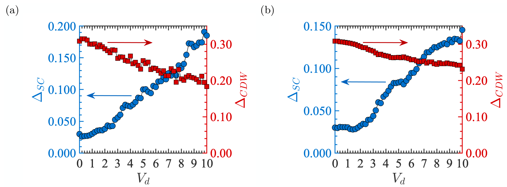
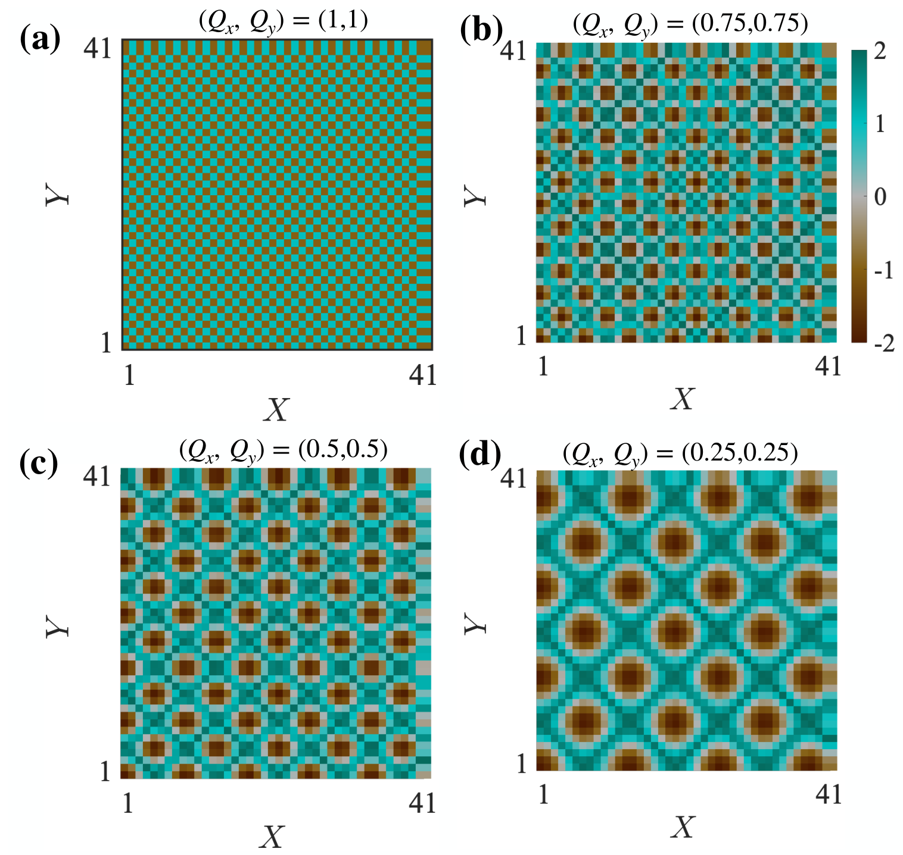
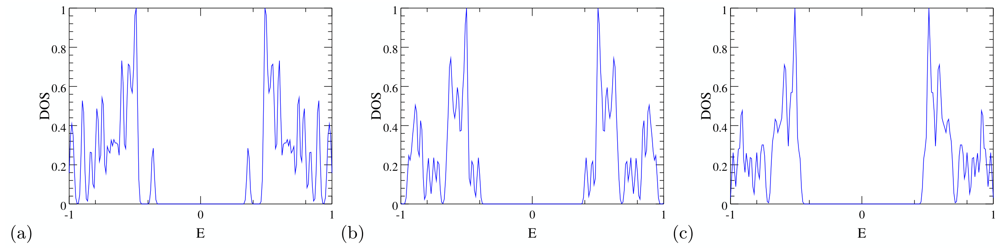
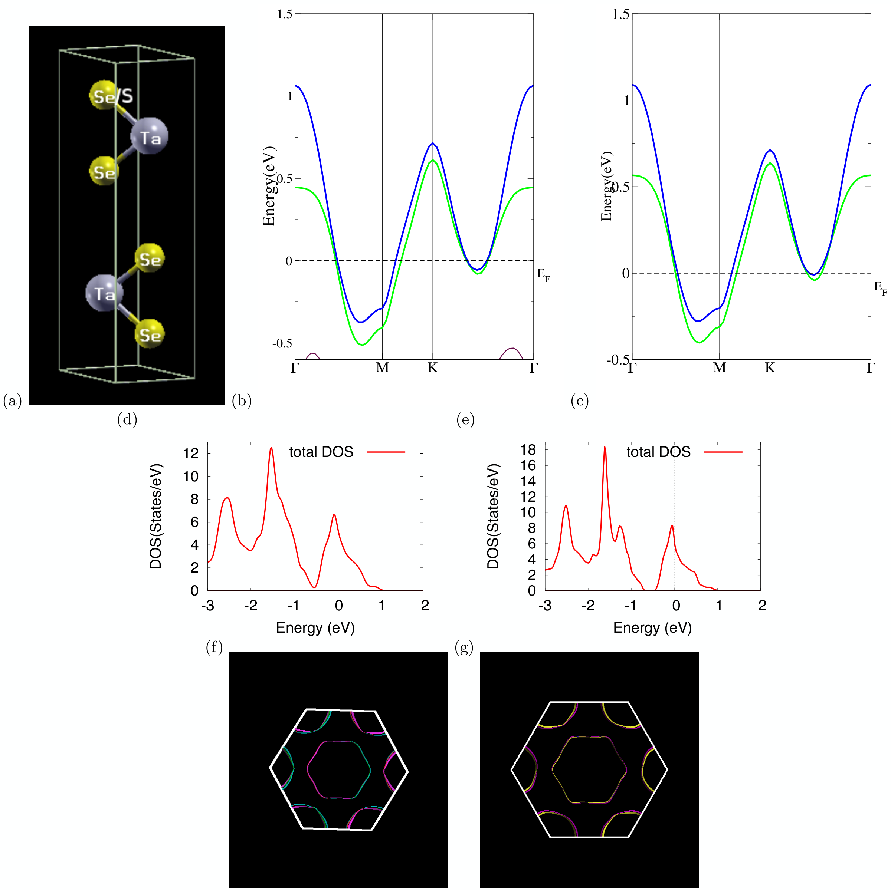

## Koley2020charge — 过渡金属二硫族化物中的电荷密度波与超导电性

## 📄 元数据
Sudipta Koley、Narayan Mohanta、Arghya Taraphder，2020，The European Physical Journal B 93, 77，DOI: 10.1140/epjb/e2020-100522-5
## 💡 一句话
用实空间自洽 BdG 与动量空间 DFT+DMFT 两套互补计算证明，非磁性无序（尤其是团簇无序）通过破坏 CDW 的长程相干/预成型激子凝聚而释放被压制的 s 波超导，解释了 TaSe₂₋ₓSₓ 合金中超导重入并增强的实验现象。
## 🔗 Wiki 双链
  - 概念 [[../concepts/charge-density-wave]]
  - 概念 [[../concepts/superconductivity|超导电性]]
  - 概念 [[../concepts/2D-materials]]
  - 概念 [[../concepts/density-functional-theory]]
  - 概念 [[../concepts/strong-coupling|强耦合]]
  - 概念 [[../concepts/exciton-condensation|激子凝聚]]
  - 概念 [[../concepts/preformed-excitons|预成型激子]]
  - 概念 [[../concepts/anderson-theorem|安德森定理]]
  - 概念 [[../concepts/fermi-surface-nesting|费米面嵌套]]
  - 概念 [[../concepts/competing-orders|竞争序]]
  - 概念 [[../concepts/disorder-engineering|无序工程]]
  - 概念 [[../concepts/bad-metal|坏金属]]
  - 概念 [[../concepts/coherence-length|相干长度]]
  - 实体 [[../entities/TMDs]]
  - 实体 [[../entities/TaSe2]]
  - 实体 [[../entities/TaS2]]
  - 实体 [[../entities/TiSe2]]
  - 实体 [[../entities/WIEN2k]]
  - 图表 [[../figures/crystal-structures]]
  - 图表 [[../figures/electronic-bands]]
  - 图表 [[../figures/mathematical-models]]
  - 年度 [[../write/2020]]
  - 项目 [[../projects/project-7-cdw-charge-density-wave]]
  - 相关论文 [[../../raw/note/Koley2020charge]]
## 📊 关键图表
  -  -> [[../figures/crystal-structures|晶体结构与原子排布]]
  -  -> [[../figures/heterostructures-stacking-polar-cdw|极性金属、拓扑相、CDW 与相变]]
  -  -> [[../figures/heterostructures-stacking-polar-cdw|极性金属、拓扑相、CDW 与相变]]
  -  -> [[../figures/electronic-bands|电子能带与电子态]]
  -  -> [[../figures/crystal-structures|晶体结构与原子排布]]
  -  -> [[../figures/mathematical-models|数学模型与物理公式]]
## 🔬 项目连接
  - **project-7（CDW，core）**：本文是 CDW 项目的核心理论文献。它直接针对 TMDs 中 CDW 与超导的竞争，系统反驳了弱耦合费米面嵌套图像，提出强耦合"预成型激子凝聚"的 CDW 图像，并用 BdG + DFT+DMFT 双方法定量复现了 TaSe₂₋ₓSₓ 中无序压制 CDW、诱导 ~5 K 超导重入的实验。可为 wiki CDW 条目提供：(1) 强/弱耦合判据（2Δ/kBT_SC、ARPES 动量无关自能、无声子特征、线性电阻）；(2) CDW 相干长度与 CDW 波矢的尺度竞争；(3) 团簇无序 vs 随机无序对竞争序的差异化调控；(4) DFT+DMFT 计算 CDW/SC 竞争的完整流程（WIEN2k 能带 → MO-IPT 杂质求解器 → 电阻率/反常关联函数）；(5) 可直接引用的 TaSe₂ 120 K/90 K 双 CDW 转变、TaSeS ~5 K SC 等数据。
  - 其他项目：无直接项目连接。project-2（Mn 多铁）涉及竞争序但本文无磁性/多铁内容；project-4（TTF 分子计算）与 project-5（SnTe 铁电模拟）虽涉及 DFT，但本文的 DMFT/BdG 强关联方法与分子晶体/铁电体问题差异较大，不构成可复用的方法或物理类比。
## 🔗 项目双链
- 项目 [[../projects/project-7-cdw-charge-density-wave|项目七：CDW电荷密度波]]

## 📝 组织与用词
论文按"问题提出 → 两套方法 → BdG 结果 → DFT+DMFT 结果 → 结论"组织。引言先立靶（弱耦合费米面嵌套图像的失败），再引入强耦合激子凝聚范式与 Li 等人合金实验动机；方法部分把唯象实空间模型（BdG，正方晶格 41×41，U_SC=2t、U_CDW=4t）与第一性原理动量空间方法（WIEN2k + MO-IPT DMFT，U=1.0 eV、U'=0.5 eV）并列；结果部分先由 BdG 给出无序"撕裂"CDW、催生超导岛的直观空间图像与序参量-无序强度相图，再由 DFT+DMFT 在真实材料 TaSe₂/TaSeS 上给出能带、费米面、电阻率与超导序参量的定量验证；最后以激子凝聚+安德森定理统一两套结果。值得复用的术语：charge density wave / 电荷密度波（CDW）；superconductivity / 超导电性（SC）；preformed excitonic liquid / 预成型激子液体；excitonic condensation / 激子凝聚；strong coupling vs weak coupling / 强耦合与弱耦合；Fermi surface nesting / 费米面嵌套；clustered disorder vs random disorder / 团簇无序与随机无序；spectral gap / 谱隙；coherence length / 相干长度；Anderson's theorem / 安德森定理；bad metal / 坏金属；reentrance of superconductivity / 超导重入；incommensurate/commensurate CDW / 非公度与公度 CDW。
## ✏️ 可写入 Wiki 的要点
  1. 传统弱耦合 CDW 图像（[[../concepts/fermi-surface-nesting|[[../concepts/fermi-surfaces|费米面]]嵌套]]/[[../concepts/peierls-instability|Peierls 不稳定性]]、声子介导）在 TMDs 中失败：嵌套常出现在错误波矢并远离费米面；ARPES 观测到动量无关自能、大谱权重转移、典型能量处无声子特征；2Δ/k_BT_SC 在 1T-TiSe₂ 约 7、2H-TaSe₂ 约 10，远超 BCS 值 3.5。
  2. [[../concepts/strong-coupling|强耦合]]激子图像：TMDs 在 T_CDW 以上是"[[../concepts/bad-metal|坏金属]]"，电子-空穴形成非相干[[../concepts/preformed-excitons|预成型激子]]，高温线性电阻率（n=1）即源于激子涨落散射；T_CDW 处发生的是预成型激子的玻色凝聚（相干恢复转变），而非单粒子能隙打开，因此 CDW 转变处电阻率无明显异常尖峰。
  3. BdG 模型设定：41×41 二维正方晶格、开放边界、s 波配对；H_BdG 含最近邻跃迁 t、[[../concepts/chemical-potential|化学势]] μ、在位非磁无序 V_i∈[-V_d,V_d]、配对项 U_SC=2t；CDW 通过在位势调制 H_CDW=-U_CDW Σ(cos(Qx·x+α)+cos(Qy·y+β))c†c 加入，U_CDW=4t；200 个无序构型平均。
  4. BdG 核心结果：V_d=0 时 CDW 呈棋盘状、SC 被完全压制；随 V_d 增大，Δ_CDW 单调下降、Δ_SC 从零上升，V_d≈7 时两者共存并交叉；团簇无序比随机无序更有效地产生宏观 SC，随机无序需 >20% 浓度才能恢复稳健 SC；空间上形成被残余 CDW/绝缘区隔开的"超导岛"，岛尺寸即[[../concepts/coherence-length|相干长度]]的量度。
  5. CDW 波长与 SC 相干长度的尺度竞争：(Qx,Qy)=(1,1) 棋盘短波 CDW 强烈抑制 SC；随 Q 减小至 (0.25,0.25)（长波 CDW），无无序时 SC 几乎不被压制；短波密度调制破坏长程超导相位相干，大超导相干长度有助于抵御 CDW。
  6. 谱隙反直觉演化：团簇无序 V_d=2→10（浓度 40%）下，费米能级处单粒子[[../concepts/density-of-states|态密度]]谱隙始终存在且随无序增强而增大——无序摧毁的是 CDW 长程相干，局域电荷调制/局域化仍维持甚至加深单粒子能隙。
  7. DFT+DMFT 流程：WIEN2k（FP-LAPW，GGA-PBE，10×10×10 k 网格，Rkmax=7.5）算 2H-TaSe₂（P6₃/mmc）与 TaSeS 能带/DOS/费米面；多轨道 Hubbard 模型 H=Σt_ab c†c + UΣn↑n↓ + U'Σn_a n_b，U=1.0 eV、U'=0.5 eV；MO-IPT 作杂质求解器；DMFT 单带顶点修正为零、多带极小，故可由格林函数直接算电阻率；超导[[../concepts/order-parameter|序参量]] Δ_SC∝⟨c_a↓c_a↑⟩ 自洽计算。
  8. 电子结构对比：S 替代 Se 后两条穿越 E_F 的金属带（Ta-d_z² 与 Se/S-p 杂化）和六重对称六空穴口袋费米面几乎不变，证明掺杂主要引入替代位无序而非改变能带填充；晶胞参数演化与实验一致。
  9. DMFT 输运：x=0（2H-TaSe₂）在 ~120 K 出现电阻率斜率变化（非公度 CDW 起始），90 K 公度 CDW 在电阻率上无反映（[[../concepts/exciton-condensation|激子凝聚]]已在高温开始）；x=1（TaSeS）无 CDW 特征，高温线性电阻，~5 K 电阻率陡降；超导序参量在 4.5 K 趋于零并符合 (1-T/Tc)^(1/2) BCS 平均场行为，与实验定性定量一致。
  10. 物理机制统一：无序引入新长度尺度，通过局域化电荷、压制激子涨落来降解 CDW；而 s 波 SC 因[[../concepts/anderson-theorem|安德森定理]]对非磁无序鲁棒，故在 CDW 被削弱后显现并占据主导；等电子 S 掺杂还增加 EF 载流子密度，使 SC 在高于原 Tc 处稳定。作者明确指出正方晶格只是因为竞争机制具有普适性，预计三角晶格结论不变。
