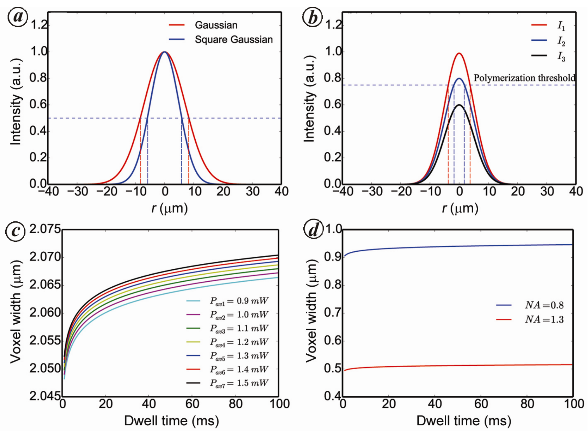
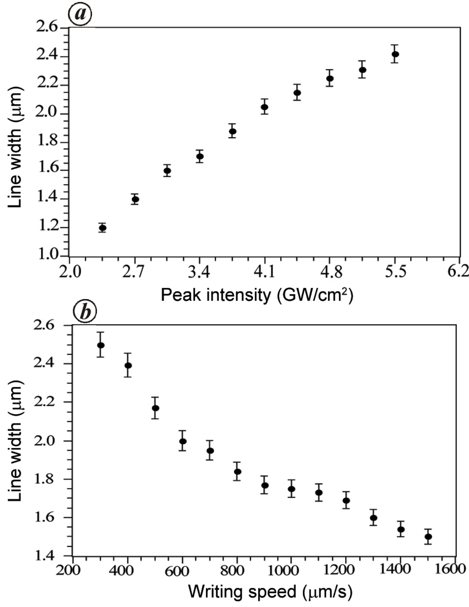
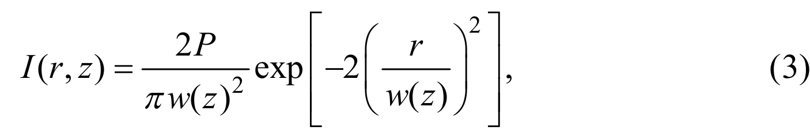
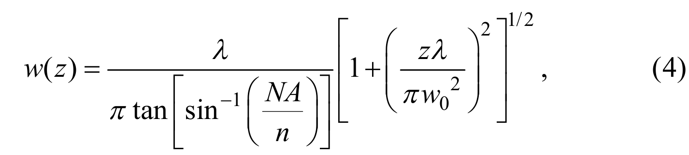

## Kumar2017microstructuring — 亚纳秒激光双光子聚合制备微结构

## 📄 元数据
Raghwendra Kumar, S. Anantha Ramakrishna，2017，Current Science，112(08): 1668–1674，DOI: 10.18520/cs/v112/i08/1668-1674
## 💡 一句话
用 700 ps 亚纳秒 532 nm 激光器配合商用负性光刻胶 SU-8 / AR-N 4340 与大双光子吸收截面的噻吨酮光引发剂，搭建了低成本双光子聚合直写系统，实现约 500 nm 线宽与 6 μm 高 3D 微柱，并以阈值模型定量拟合了功率/速度对线宽的影响。
## 🔗 Wiki 双链
  - 概念 [[../concepts/two-photon-polymerization|双光子聚合 (TPP)]]
  - 概念 [[../concepts/two-photon-absorption|双光子吸收 (TPA)]]
  - 概念 [[../concepts/voxel|体素 (Voxel)]]
  - 概念 [[../concepts/photoinitiator|光引发剂]]
  - 概念 [[../concepts/diffraction-limit|衍射极限]]
  - 概念 [[../concepts/threshold-effect|阈值效应]]
  - 实体 [[../entities/SU-8|SU-8]]
  - 图表 [[../figures/mathematical-models]]
  - 图表 [[../figures/experimental-setups]]
  - 年度 [[../write/2015-2019|2017]]
  - 项目 [[../projects/project-1-two-photon]]
  - 概念 [[../concepts/aspect-ratio]]、[[../concepts/nonlinear-optics]]
  - 实体 [[../entities/thioxanthone-photoinitiator]]、[[../entities/piezo-nanopositioning-stage]]、[[../entities/LabVIEW]]、[[../entities/sub-nanosecond-laser]]、[[../entities/AFM]]、[[../entities/AR-N-4340]]、[[../entities/AOM]]
  - 相关论文 [[../../raw/note/Kumar2017microstructuring]]
## 🆕 新概念/实体建议
  - [[../concepts/two-photon-polymerization|two-photon-polymerization]]（双光子聚合，TPP）：基于 TPA 非线性效应的 3D 微纳光刻技术，核心机制词条。
  - [[../concepts/two-photon-absorption|two-photon-absorption]]（双光子吸收，TPA）：吸收速率正比于 I² 的三阶非线性光学过程，是超衍射极限加工的物理基础。
  - [[../concepts/voxel|voxel]]（体素）：TPP 中单次曝光固化的最小三维体积单元，其宽/深由阈值条件与高斯光束参数共同决定。
  - [[../concepts/photoinitiator|photoinitiator]]（光引发剂）：吸收双光子后产生自由基引发单体交联的分子；本文用 2,4-二乙基-9H-噻吨-9-酮。
  - [[../entities/SU-8|SU-8]]：常用环氧基负性光刻胶，350–400 nm 单光子最佳交联，需配光引发剂做 532 nm TPP。
  - [[../entities/AR-N-4340|AR-N-4340]]：Allresist 负性光刻胶，对 532 nm TPA 聚合响应极好，甚至可不加光引发剂直接固化。
  - [[../concepts/threshold-effect|threshold-effect]]（阈值效应）：光聚合需超过最小剂量阈值，使实际固化区远小于光斑，是突破衍射极限的关键。
  - [[../concepts/diffraction-limit|diffraction-limit]]（衍射极限）：传统光学聚焦的最小尺度限制；TPP 通过 I² 非线性与阈值将特征尺寸压缩至 FWHM 的 1/√2 以下。
## 📊 关键图表
  -  -> [[../figures/mathematical-models-formulas|光学、输运与其他解析公式]]
  - **图示描述**：四联体原理示意图。(a) 对比高斯光束强度 I 与 I² 的空间分布与 FWHM；(b) 用强度曲线与聚合阈值水平虚线说明阈值效应如何把固化区压缩到焦点中心；(c) (d) 为由公式 (5) 预测的体素宽度 D 随驻留时间、平均功率和物镜 NA 的理论曲线（λ = 532 nm，f = 10 kHz）。
  - **关键特征**：
    - I² 曲线的 FWHM 比 I 曲线窄约 √2 倍，是非线性吸收压缩特征尺寸的根本机制；
    - 阈值线只截取峰值附近的一小段，使实际体素宽度远小于光斑，可突破衍射极限；
    - D 随驻留时间（≤ 20 ms 区间）和平均功率（约 1.2 mW 附近）单调增大；
    - NA 越高（如 1.3、1.4）D 越小，说明高 NA 物镜是高分辨率的主要途径；
    - 在精细聚焦条件下，驻留时间与 NA 对 D 的影响比平均功率更显著。
  - **结论/意义**：给出后续工艺优化和图 5、图 6 实验数据拟合的理论框架，所有理论曲线使用拟合得到的 E'_th ≈ 6.6×10⁻⁷³ W²/m⁴ 绘制。
  -  -> [[../figures/experimental-setups|实验装置与测量系统]]
  - **图示描述**：(a) 自研亚纳秒激光直写系统光路与控制流程示意图；(b) 系统实物照片。光路自激光器 (L) 经声光调制器 (AOM)、高反镜、二向色镜进入倒置显微镜物镜，聚焦到由 3D 压电台 (3DPS) 承载的样品 (SH)，CCD (C) 经二向色镜实时监控，全部由 LabVIEW 协同控制。
  - **关键特征**：
    - 光源为 Bright Solutions Wedge_532_1064，脉宽 700 ps，同时输出 532 nm 与 1064 nm，二向色镜只保留 532 nm；
    - AOM 工作在布拉格角，针孔选取 +1 级衍射，实现激光快速选通与剂量控制；
    - 位移台为 PI E-725 三维压电台，行程 200×200×200 μm，闭环分辨率 0.5 nm；
    - 整机置于 Newport 浮式防震台，配 Nikon Eclipse Ti-s 倒置显微镜与 50×/100× 高 NA 物镜；
    - CAD 笛卡尔坐标经文本文件导入 LabVIEW，同时驱动位移台与 AOM。
  - **结论/意义**：以全商用、低成本组件构成完整的 TPP 直写平台，是论文"廉价替代飞秒系统"论断的硬件证据。
  -  -> [[../figures/experimental-setups|实验装置与测量系统]]
  - **图示描述**：五联结构展示图。(a) (b) 为 SU-8 中二维光栅和二维微盘阵列的 AFM 三维形貌；(c) 为 IIT Kanpur 校徽的光学显微镜照片；(d) 为 SU-8 中三维微柱阵列的光学显微镜照片；(e) 为在 AR-N 4340 中制备的二维微盘阵列。统一工艺参数：平均功率 1.2 mW、写入速度 100 μm/s、重复频率 10 kHz、NA = 0.8 物镜。
  - **关键特征**：
    - AFM 三维形貌显示光栅与微盘阵列周期规整、高度均匀，证明 2D 周期结构能力；
    - 校徽图案由 CAD 坐标驱动，路径可任意规划，证明系统可制造复杂连续图案；
    - 三维微柱高度约 6 μm，是 3D 加工能力的关键证据；
    - AR-N 4340 上同样可形成规则微盘，表明材料方案具有普适性；
    - 所有结构使用同一组温和参数即获得良好形貌，工艺窗口较宽。
  - **结论/意义**：从 2D 阵列、复杂图案到 3D 微柱、跨两种光刻胶，全面验证了自研系统的多功能加工能力。
  -  -> [[../figures/experimental-setups|实验装置与测量系统]]
  - **图示描述**：使用 100×、NA = 1.3 油浸物镜在 SU-8 中写出的二维光栅 AFM 形貌图，插图为沿选定线条测得的高度剖面（横轴位置 μm，纵轴高度 nm）。工艺参数：平均功率 1.0 mW、写入速度 200 μm/s、重复频率 10 kHz。
  - **关键特征**：
    - 插图剖面的半高全宽（FWHM）约 500 nm，是本系统达到的最佳线宽；
    - 线条边缘清晰、阵列均匀，无明显熔断或崩塌；
    - 对应图 1d 中高 NA 曲线的小体素预测，理论与实验一致；
    - 该分辨率被作者定位为可与飞秒系统"可比"的亚微米水平。
  - **结论/意义**：500 nm FWHM 是论文核心性能指标，直接支撑"亚纳秒+商用胶即可达亚微米分辨率"的中心结论。
  -  -> [[../figures/experimental-setups|实验装置与测量系统]]
  - **图示描述**：工艺参数扫描结果。(a) 为不同激光峰值强度下写出的微线条阵列 AFM 形貌，从左至右峰值强度由 5.7 递减至 2.5 GW/cm²；(b) 为不同写入速度下的微线条 AFM 形貌，从左至右速度由 300 增至 1600 μm/s；(c) (d) 分别为 (a) (b) 对应线条的高度剖面。
  - **关键特征**：
    - 峰值强度最高的最左两条线出现树脂损伤，最右一条因低于阈值而线条不连续，中间区段为可用工艺窗口；
    - 峰值强度增大时，线条宽度与高度整体增大，与阈值模型预测一致；
    - 写入速度提高（驻留时间缩短）时线条变窄、变矮，高速端轮廓趋于平滑、圆润；
    - 高度剖面给出比形貌图更定量的宽/高变化，用于图 6 数据提取；
    - 图 5b 左起第四条微线被选为 E'_th 拟合基准线。
  - **结论/意义**：以单参数扫描同时呈现损伤阈值、聚合阈值和最优窗口，为图 6 的定量拟合和工艺优化提供原始数据。
  -  -> [[../figures/electronic-devices-memory-transistors|存储器与晶体管]]
  - **图示描述**：由图 5 提取的线宽 FWHM 与工艺参数的定量关系。(a) 横轴为激光峰值强度（GW/cm²），纵轴为线宽（μm）；(b) 横轴为写入速度（μm/s），纵轴同为线宽 FWHM（μm）；数据点带误差棒，并叠加由公式 (5) 用 E'_th = 6.6×10⁻⁷³ W²/m⁴ 生成的理论拟合曲线。
  - **关键特征**：
    - 线宽随峰值强度呈非线性单调增加，误差棒反映多次测量的离散度；
    - 线宽随写入速度单调减小，等价于驻留时间 t 缩短导致体素缩小；
    - 拟合条件：λ = 532 nm、NA = 0.8、n = 1.0、f = 10 kHz、P_av = 1.2 mW；
    - 理论曲线同时回扣图 1c/d 的预测，形成理论-实验闭环。
  - **结论/意义**：定量验证了体素尺寸阈值模型，并标定出可复用的有效阈值能量密度 E'_th，为后续工艺选择提供直接依据。
  - ![公式1 双光子吸收能量速率 dW/dt ∝ I² Im[χ⁽³⁾]](../../raw/figures/Kumar2017microstructuring/eq_1_B45IT96C.png)
  - **图示描述**：双光子吸收能量密度变化速率方程 dW/dt = (8π²ω)/(c n²) I² Im[χ⁽³⁾]。W 为单位体积吸收能量，ω 为光角频率，c 为真空光速，n 为折射率，I 为光强，χ⁽³⁾ 为介质三阶非线性极化率。
  - **关键特征**：速率正比于 I²，使 TPA 仅在焦点高峰值强度区发生；Im[χ⁽³⁾] 决定材料双光子吸收强度，是引入大截面光引发剂的理论依据。
  - **结论/意义**：这是全文所有阈值与体素公式的出发点，也是"非线性压缩光斑"论证的物理基础。
  -  -> [[../figures/mathematical-models-formulas|光学、输运与其他解析公式]]
  - **图示描述**：高斯光束沿径向 r 与轴向 z 的强度分布 I(r,z) = 2P/[π w(z)²] exp[−2(r/w(z))²]，其中 P 为平均功率，w(z) 为 z 平面处的光斑半径。
  - **关键特征**：径向呈高斯衰减；束腰处振幅最大；离焦后 w(z) 增大、峰值强度下降，决定体素只在焦点附近形成。
  - **结论/意义**：与阈值条件结合即可积分出体素宽 D 与深 L，是公式 (5)、(6) 的直接来源。
  -  -> [[../figures/mathematical-models-formulas|光学、输运与其他解析公式]]
  - **图示描述**：高斯光束束宽沿传播方向的演化式 w(z) = w₀ [1 + (z/z_R)²]^(1/2)，其中 w₀ 为束腰半径，z_R 为瑞利长度，二者均由 λ 和 NA/n 决定。
  - **关键特征**：NA 越大，w₀ 与 z_R 同时缩小；轴向聚焦越深，束宽按二次方展宽；该式把物镜 NA 纳入体素深度方向的计算。
  - **结论/意义**：解释了高 NA 物镜同时压缩体素横向和纵向尺寸的原因，为图 1d 的 NA 扫描曲线提供依据。

## 🔬 项目连接
  - **project-1 双光固化和双光发光 — core**：本文是项目的核心机理性实验文献。直接给出 (1) TPA 速率公式 dW/dt = (8π²ω)/(cn²) I² Im[χ⁽³⁾]；(2) 基于阈值条件 I_th² βτ f t ≥ E_th 与高斯光束传播推导的体素宽 D 与深 L 解析表达式（公式 5、6），将 D/L 与平均功率 P_av、驻留时间 t、重复频率 f、NA、阈值能量密度 E'_th 定量关联；(3) 一套完整的亚纳秒（700 ps, 532 nm）TPP 系统搭建方案（AOM 选单、3D 压电台 0.5 nm 闭环、LabVIEW 坐标控制、二向色镜滤 1064 nm）；(4) 商用光刻胶 SU-8、AR-N 4340 与 3 wt% 2,4-二乙基-9H-噻吨-9-酮光引发剂的工艺配方与旋涂/前烘/后烘/显影参数；(5) 实验拟合得到 E'_th ≈ 6.6×10⁻⁷³ W²/m⁴，可作为项目计算/实验对照的可复用基准数据；(6) 功率、写入速度、NA 对线宽/线高影响的系统定量曲线。这些机制、配方、工艺窗口数据对 project-1 选择光源、光引发剂和预测分辨率具有直接参考价值。
  - project-2 Mn多铁 / project-3 机械发光NN / project-4 TTF分子计算 / project-5 SnTe铁电模拟 / project-6 湿度传感器 / project-7 CDW：均无内容参考价值，不列入。
## 🔗 项目双链
- 项目 [[../projects/project-1-two-photon|项目一：双光固化和双光发光]]

## 📝 组织与用词
论文按"原理（TPA/阈值理论 → 体素尺寸公式）→ 设备与材料（自研亚纳秒系统 + 商用光刻胶新组合）→ 制备（2D/3D 微结构）→ 表征校准（AFM/光学显微镜测线宽，拟合 E'_th）→ 结论"的经典实证链条展开，理论预测先行、实验数据回扣模型。值得在 wiki 叙述中复用的术语：
  - two-photon polymerization (TPP) — 双光子聚合
  - two-photon absorption (TPA) — 双光子吸收
  - voxel — 体素
  - polymerization threshold — 聚合阈值
  - dwell time — 驻留时间
  - numerical aperture (NA) — 数值孔径
  - photoinitiator — 光引发剂
  - negative photoresist — 负性光刻胶
  - aspect ratio — 深宽比（高宽比）
  - sub-nanosecond laser — 亚纳秒激光器
## ✏️ 可写入 Wiki 的要点
  - TPA 能量吸收速率 dW/dt = (8π²ω)/(cn²) I² Im[χ⁽³⁾]，非线性 I² 依赖使反应区 FWHM 比线性吸收窄 √2 倍；叠加材料聚合阈值（最小剂量）后可进一步把特征尺寸压缩至波长以下。
  - 阈值条件写成 I_th² βτ f t ≥ E_th（β 为吸收系数，τ 脉宽，f 重复频率，t 驻留时间，E_th 单位体积阈值能量）；结合高斯光束 I(r,z) 可推出体素宽 D(t,NA,P_av,f) 与体素深 L 的解析公式（原文公式 5、6），D/L 随 P_av、f、t 增大而增大，随 NA 增大而减小。
  - 写入速度 v 与驻留时间成反比，因此提高写入速度等价于缩短 t，线宽单调下降；理论预测小体素需要功率略高于阈值、驻留时间 < 20 ms、平均功率约 1 mW、高 NA 物镜。
  - 自研系统：Bright Solutions Wedge_532_1064 亚纳秒激光器（700 ps，532/1064 nm 同时输出，二向色镜取 532 nm）；AOM 布拉格角衍射选 +1 级控制开关；Physik Instrumente E-725 三维压电台 200×200×200 μm、0.5 nm 闭环分辨率；Nikon Eclipse Ti-s 倒置显微镜配 50×/100× 物镜；Newport 浮式防震台；LabVIEW 读入 CAD 笛卡尔坐标并协同控制位移台与 AOM。
  - 材料组合首次报道：商用负胶 SU-8-3005（MicroChem）与 AR-N 4340（Allresist）+ 3 wt% 2,4-二乙基-9H-噻吨-9-酮[[../concepts/photoinitiator|光引发剂]]（吸收峰 255 nm，但在 532 nm 具大 TPA 截面）。AR-N 4340 本身对 532 nm TPA 已足够强，甚至无需光引发剂即可固化；SU-8 则需添加光引发剂。
  - SU-8 工艺：玻璃基底先 6000 RPM 旋涂 HMDS 45 s、120 °C 烘 2 min 增粘；SU-8+光引发剂 2000 RPM 旋涂 1 min，65 °C/2 min + 95 °C/3 min 前烘；532 nm 直写后 65 °C/3 min + 95 °C/5 min 后烘；丙二醇甲醚醋酸酯显影 20 s，异丙醇洗 1 min。AR-N 4340 工艺：2000 RPM 旋涂 1 min，85 °C/2 min 前烘，曝光后 95 °C/5 min 后烘，AR-300-475 显影 20 s，去离子水洗 1 min。
  - 典型制备参数（0.8 NA，图3）：平均功率 1.2 mW、写入速度 100 μm/s、重复频率 10 kHz；高分辨参数（1.3 NA 100× 油浸，图4）：1.0 mW、200 μm/s、10 kHz，得 FWHM ≈ 500 nm 清晰线条与高约 6 μm 的 3D 微柱阵列，证明 2D/3D 加工能力。
  - 工艺窗口：峰值强度 2.5–5.7 GW/cm² 范围内，过强（最左两条）造成树脂损伤，过弱（最右）线条不连续（低于阈值），存在最优窗口；写入速度 300→1600 μm/s 时线条变窄、变矮、轮廓趋圆滑，这些趋势与公式 5 预测一致。
  - 用一条特定工艺线下的线宽反演拟合得到有效阈值能量密度 E'_th = E_th/(βτ) ≈ 6.6×10⁻⁷³ W²/m⁴（λ=532 nm, NA=0.8, n=1.0, f=10 kHz, P_av=1.2 mW），并据此回代生成图1c/d 理论曲线，实现了理论-实验闭环。
  - 相较传统 2D 激光直写，TPP 的 3D 焦点局域化使其在二维结构上也能获得更高深宽比；相较飞秒系统，亚纳秒+商用胶方案成本显著降低，是其核心定位（成本/性能折衷的实用化路径），但 500 nm 分辨率仍逊于飞秒+亚 10 fs 脉冲已实现的 <50 nm。
