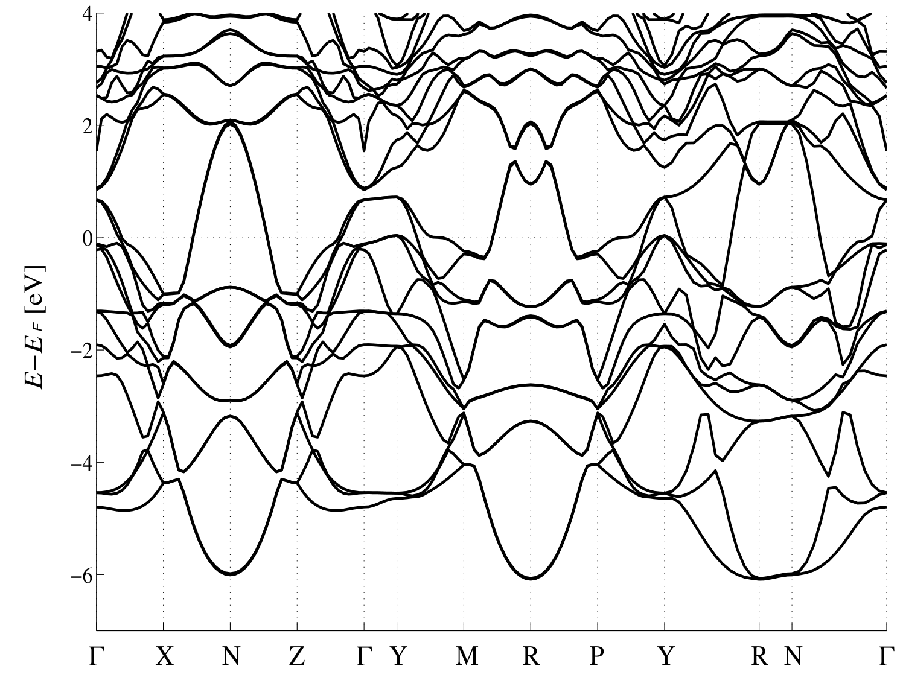
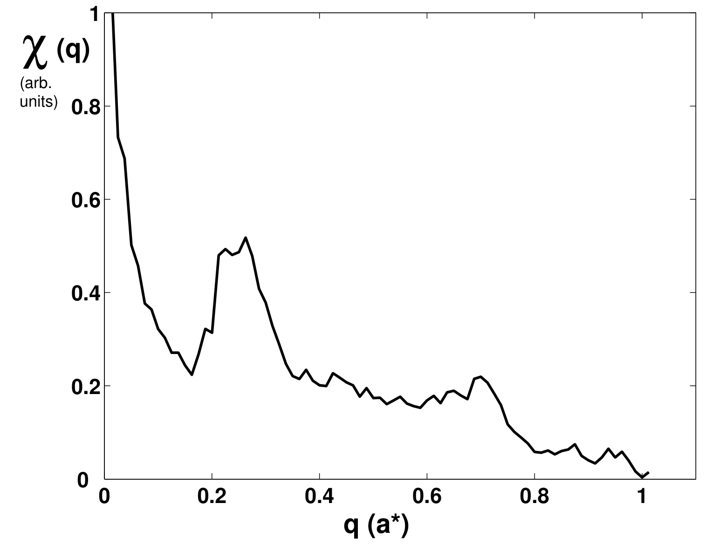

## Laverock2005fermi — 稀土三碲化物中的费米面嵌套与电荷密度波形成

## 📄 元数据
J. Laverock, S. B. Dugdale, Zs. Major, M. A. Alam, N. Ru, I. R. Fisher, G. Santi, E. Bruno，2005，Physical Review B 71, 085114，DOI [10.1103/PhysRevB.71.085114](https://doi.org/10.1103/PhysRevB.71.085114)
## 💡 一句话
结合 2D-ACAR 正电子湮灭实验与 LMTO 第一性原理计算，首次直接观测到稀土三碲化物 RTe₃ 未被 CDW 重构的"裸"费米面，测定嵌套矢量 q = (0.28 ± 0.02, 0, 0) a*，决定性地证实费米面嵌套是驱动该体系 CDW 形成的机制。
## 🔗 Wiki 双链
  - 概念 [[../concepts/charge-density-wave]]、[[../concepts/2d-materials]]、[[../concepts/fermi-surface-nesting|费米面嵌套]]、[[../concepts/bilayer-splitting|双层劈裂]]、[[../concepts/generalized-susceptibility|广义磁化率]]、[[../concepts/2d-acar|2D-ACAR]]、[[../concepts/commensurate-incommensurate|公度-非公度]]、[[../concepts/fermi-surfaces|费米面]]
  - 实体 [[../entities/RTe3|RTe₃ 稀土三碲化物]]
  - 图表 [[../figures/crystal-structures]]、[[../figures/electronic-bands]]
  - 年度 [[../write/2005-2009|2005]]
  - 项目 [[../projects/project-7-cdw-charge-density-wave]]
  - 概念 [[../concepts/brillouin-zone]]、[[../concepts/band-structure]]
  - 实体 [[../entities/LuTe3]]、[[../entities/GdTe3]]、[[../entities/LuTe2]]
  - 相关论文 [[../../raw/note/Laverock2005fermi]]
## 🆕 新概念/实体建议
  - [[../entities/GdTe3|GdTe3]]、[[../entities/LuTe3|LuTe3]]、[[../entities/LuTe2|LuTe2]]（实体）：本文实验/计算所用具体材料，相关页面尚未建立。
## 📊 关键图表
  -  -> [[../figures/crystal-structures-bulk|体相晶体结构]]
  - **图示描述**：对比展示 (a) RTe₂（四方反-Cu₂Sb 结构，空间群 P4/nmm）与 (b) RTe₃（层状 NdTe₃ 结构，空间群 Cmcm）的晶体结构，晶体学 b 轴为长轴。RTe₃ 的关键特征是两层正方平面排列的 Te 原子层被夹在惰性的 RTe 板层之间。
  - **关键特征**：RTe₃ 中双 Te 方平面是后续双层劈裂与费米面嵌套的结构前提；RTe 板层近似惰性，导电电子主要集中在 Te 5p 平面；电阻率各向异性 ρa/ρb 在 SmTe₃ 中高达约 5000，印证了准二维性。
  - **结论/意义**：此图确立了 RTe₃ 作为准二维 CDW 模型体系的结构基础，也是将 RTe₂（单层 Te 平面、公度 CDW）作为对照基准的依据。
  - ![图2 LuTe2沿高对称路径的电子能带结构，三条能带穿过EF，沿[010]色散很小](../../raw/figures/Laverock2005fermi/fig_2_ACX8597X.png)
  - **图示描述**：LMTO-ASA 计算的 LuTe₂ 沿第一布里渊区高对称路径（Γ-X-N-Z-Γ-Y-M-R-…）的电子能带结构；纵轴为相对费米能级的能量 E − E_F（单位 eV），EF = 0 以横线标出。
  - **关键特征**：共有三条能带穿过 EF，主要由平面 Te 层的 5p 轨道贡献；沿 [010] 方向（Γ−Y、N−R）色散极小、能带近乎平坦，证实层间耦合很弱、电子结构强准二维；其中两条能带对应菱形费米面片，第三条仅刚穿过 EF，对计算细节敏感。
  - **结论/意义**：为 LuTe₂ 的公度嵌套提供能带层面的依据，并作为方法可靠性基准，再过渡到 LuTe₃ 的双层劈裂讨论。
  -  -> [[../figures/electronic-bands-dos-fermi|态密度与费米面]]
  - **图示描述**：(a) 穿过 Γ 点的 (010) 平面上 LuTe₂ 的计算费米面，箭头标出公度嵌套矢量；(b) 负责嵌套的单一菱形（钻石形）费米面片；(c) 以 Y 点为中心的小型空穴口袋。Γ 点位于布里渊区中心。
  - **关键特征**：两片菱形费米面拥有大段平行边，构成嵌套的理想几何条件；箭头所示嵌套矢量为 q = (1/2) a*，对应 (2×1×1) 公度超结构；Y 点空穴口袋尺寸小、对计算细节敏感，与嵌套矢量无关。
  - **结论/意义**：在已知公度 CDW 的 RTe₂ 中复现 q = (1/2) a*，验证 LMTO 计算方法可靠，为后续 RTe₃ 非公度嵌套的对比奠定基准。
  -  -> [[../figures/electronic-bands-band-structures|能带结构与带隙]]
  - **图示描述**：与图 2 相同高对称路径下，LMTO 计算的 LuTe₃ 电子能带结构；纵轴仍为 E − E_F（eV），图中放大部分突出穿过 EF 能带的细微劈裂。
  - **关键特征**：与 LuTe₂ 相比，穿过 EF 的 Te 5p 能带因两个不等价正方 Te 平面之间的耦合而发生双层劈裂（bilayer splitting）；沿 [010] 仍保持弱色散，准二维性不变；该劈裂在 CeTe₃、SmTe₃ 的 ARPES 实验中已被报道。
  - **结论/意义**：双层劈裂是理解 RTe₃ 费米面由单片菱形变为内外两片、嵌套矢量由公度 1/2 转为非公度 ≈2/7 的关键能带学原因。
  -  -> [[../figures/electronic-bands-dos-fermi|态密度与费米面]]
  - **图示描述**：(a) 穿过 Γ 点的 (010) 平面上 LuTe₃ 的计算费米面，箭头标出非公度嵌套矢量；(b) 因双层劈裂形成的内外两个菱形费米面片；(c) 位于 X 点的两个电子口袋，高对称点标注与图 3 一致。
  - **关键特征**：嵌套发生在内、外两个菱形片之间，矢量 q ≈ (2/7) a*，为非公度；与图 3 中 LuTe₂ 的单一菱形片、公度 q = 1/2 a* 形成直接对比；X 点电子口袋是后续 2D-ACAR 实验中用来核对理论-实验一致性的标志性特征。
  - **结论/意义**：此图从费米面几何上解释了 RTe₃ CDW 为何非公度，是理论计算部分的核心结论图。
  - ![图6 LuTe3沿[100]方向广义磁化率χ(q)，q≈0.26 a*处出现由嵌套产生的宽峰](../../raw/figures/Laverock2005fermi/fig_6_NNR73I97.png)
  - **图示描述**：由 LMTO 计算得到的 LuTe₃ 沿 [100] 方向广义磁化率 χ(q) 曲线；横轴为波矢 q（单位 a*，a* = 2π/a），纵轴为 χ(q)（任意单位）。
  - **关键特征**：在 q ≈ 0.26 a* 处出现明显而宽阔的峰；峰位对应内、外菱形费米面片之间的最佳嵌套；峰宽源于费米面的双层劈裂，意味着一段波矢范围内嵌套条件都较好，是非公度 CDW 的定量理论指纹。
  - **结论/意义**：把"几何上看起来平行"的嵌套图像提升为 χ(q) 峰值的定量预测，并与 ARPES 的 2/7 a*（≈0.286 a*）和电子衍射的 0.27–0.31 a* 相吻合。
  -  -> [[../figures/electronic-bands-dos-fermi|态密度与费米面]]
  - **图示描述**：(a) LMTO 计算的 LuTe₃ 与 (b) 2D-ACAR 实验测量的 GdTe₃ 在第一布里渊区 [010] 投影方向上的 k 空间占据密度；浅色（阴影）代表高占据率，明暗边界即费米面，高对称点在投影中标出。实验在约 80 K 下累积约 1.5 亿计数，并经最大熵去卷积。
  - **关键特征**：理论与实验的占据区形状、大小高度一致，X 点电子口袋的尺寸和形状均吻合；实验图中可见大段平行的费米面边界，直接展示嵌套；用"过零法"（最大熵去卷积图减去原始占据图，取零值轮廓）测得嵌套矢量 q = (0.28 ± 0.02, 0, 0) a*，且在 [100] 与 [001] 方向均存在；谱仪分辨率约为 BZ 的 15%，CDW 能隙造成的阶跃模糊被淹没，因而看到的是未重构的"裸"费米面。
  - **结论/意义**：此图是全文证据链的闭环——实验嵌套矢量 0.28 a* 与理论 χ(q) 峰 0.26 a*、电子衍射 0.27–0.31 a*、ARPES 2/7 a* 交叉验证，决定性地支持费米面嵌套驱动 RTe₃ CDW 的论断。
  -  -> [[../figures/electronic-bands-band-structures|能带结构与带隙]]
  - **图示描述**：沿高对称路径Γ-X-N-Z-Γ-Y-M-R-P-Y-R-N-Γ的能带图，能量范围约-6至4 eV，费米能级置零。
  - **关键特征**：多条Ta 5d能带穿越费米能级，其鞍点与平带段构成费米面嵌套的来源，为后续χ(q)计算中CDW不稳定性提供能带基础。
  -  -> [[../figures/electronic-bands-cdw-transport|CDW与输运性质]]
  - **图示描述**：倒空间波矢q自0至1 a*的广义电子磁化率χ(q)曲线，q=0处的发散已作截断处理。
  - **关键特征**：χ(q)在q≈0.22–0.25 a*出现显著峰（约0.5任意单位），与实验观测的2×2 CDW波矢一致，说明该CDW可由费米面嵌套驱动的电子磁化率峰解释。

## 🔬 项目连接
  - **project-7（CDW）— core**：本文是 CDW 费米面嵌套机制的经典实验/理论联合标杆文献，直接构成本项目的核心机理参考。具体可复用内容：(1) RTe₃ 菱形费米面片 + 单一嵌套矢量连接大段平行边的标准几何图像；(2) 用广义磁化率 χ(q) 峰值定量定位 CDW 波矢的计算流程；(3) 双 Te 层耦合导致双层劈裂、进而将公度嵌套（RTe₂, q=1/2 a*）转为非公度嵌套（RTe₃, q≈2/7 a*）的物理图像，可类比到其他多层/双层 CDW 体系；(4) 2D-ACAR 体相探针与 ARPES 表面探针互补的方法论——前者对 CDW 能隙不敏感从而看到"裸"费米面，后者直接测能隙各向异性（RTe₃ 中沿 Γ−Y 能隙约 200 meV）；(5) 实验嵌套矢量 0.28 a* 与电子衍射 0.27–0.31 a*、ARPES 2/7 a* 的交叉验证范式，可作为项目中判定嵌套驱动 CDW 的证据链模板。
  - 其他项目：无直接项目连接。本文虽使用 LMTO/DFT 第一性原理计算，但其对象为稀土碲化物金属体系，方法学（正电子湮灭、费米面/χ(q) 分析）与 project-4（TTF 分子计算）、project-5（SnTe 铁电模拟）所关注的极化、Berry 相、分子晶体等问题无实质交集。
## 🔗 项目双链
- 项目 [[../projects/project-7-cdw-charge-density-wave|项目七：CDW电荷密度波]]

## 📝 组织与用词
文章按"引言（提出费米面不稳定性假说与 RTe₃ 模型体系）→ 电子结构计算（先 LuTe₂ 建立基准，再 LuTe₃ 揭示双层劈裂与 χ(q) 峰）→ 正电子湮灭实验（2D-ACAR + LCW 折叠重构 k 空间占据密度）→ 结论（理论实验互证）"的经典假说-预测-验证链条组织。论证上以 LuTe₂ 的公度嵌套作为方法可靠性检验，再以 LuTe₃ 的非公度嵌套为主结论，层次清晰。值得在 wiki 叙述中复用的术语：
  - 费米面嵌套 [[../concepts/fermi-surface-nesting|费米面嵌套]] / Fermi surface nesting
  - 嵌套矢量 / nesting vector q
  - 广义磁化率 [[../concepts/generalized-susceptibility|广义磁化率]] / generalized susceptibility χ(q)
  - 双层劈裂 [[../concepts/bilayer-splitting|双层劈裂]] / bilayer splitting
  - 未重构（裸）费米面 / unreconstructed ("bare") Fermi surface
  - 公度与非公度 / commensurate vs incommensurate
  - 锁定 / lock-in
  - 二维角关联湮灭辐射 / 2D-ACAR [[../concepts/2d-acar|2D-ACAR]] (two-dimensional angular correlation of annihilation radiation)
## ✏️ 可写入 Wiki 的要点
  1. RTe₃ 结晶于层状 NdTe₃ 结构（空间群 Cmcm，No.63），由惰性 RTe 板层夹双层正方平面 Te 方片构成；b 轴为长轴，电阻率[[../concepts/migdal-eliashberg-theory|各向异性]] ρa/ρb 在 SmTe₃ 中高达约 5000，电子结构具强准二维性。
  2. RTe₂ 为相关材料，四方反-Cu₂Sb 结构（P4/nmm，No.129），具有 (2×1×1) 公度 CDW 超结构；其[[../concepts/fermi-surfaces|费米面]]由 Te 5p 轨道主导，三条能带穿过 EF，其中两条形成单一菱形费米面片，公度嵌套矢量 q = (1/2) a*。
  3. RTe₃ 中两个不等价正方 Te 平面间的耦合使穿过 EF 的 Te 能带发生[[../concepts/bilayer-splitting|双层劈裂]]，产生内外两个近乎平行的菱形费米面片；嵌套发生在两片之间，导致非公度 CDW（q ≈ 2/7 a*）。
  4. LMTO-ASA 计算的 LuTe₃ [[../concepts/generalized-susceptibility|广义磁化率]] χ(q) 在 q ≈ 0.26 a*（沿 [100]）处出现宽峰；峰宽源于费米面劈裂，表明一个波矢范围内均有较好嵌套条件，这是非公度 CDW 的定量理论特征。
  5. 2D-ACAR 测量电子-正电子湮灭双 γ 光子的角偏差以获得二维动量密度投影，经 Lock-Crisp-West（LCW）折叠回第一[[../concepts/brillouin-zone|布里渊区]]后得到 k 空间占据密度；谱仪固有动量分辨率约为 BZ 的 15%，CDW 能隙引起的阶跃模糊远小于该展宽，因此该技术对 CDW 不敏感，可揭示未被重构的高温相"裸"费米面——这是其相对于 ARPES 的关键互补优势。
  6. GdTe₃ 实验在约 80 K 下累积约 1.5 亿计数，经最大熵去卷积后，k 空间占据密度与 LuTe₃ 的 LMTO 计算在 X 点电子口袋的尺寸、形状上高度吻合；用"过零法"（最大熵去卷积图减去原始占据图，取零值轮廓）提取实验嵌套矢量 q = (0.28 ± 0.02, 0, 0) a*（[100] 与 [001] 方向均存在）。
  7. 实验嵌套矢量 0.28 a* 与 DiMasi 等电子衍射的 0.27–0.31 a*、ARPES 的 2/7 a*（≈0.286 a*）以及理论 χ(q) 峰 0.26 a* 构成完整交叉证据链，确立[[../concepts/fermi-surface-nesting|费米面嵌套]]为 RTe₃ CDW 的驱动力。
  8. 选用 Lu 做计算是因其 4f 壳层全满，可规避 LDA 下 f 电子处理困难；由于费米面主要由 Te 5p 态构成，且实验上 CDW 波矢对不同稀土 R（La–Tm）稳定，故 LuTe₃ 计算可与 GdTe₃ 实验直接比较；计算对晶格参数约 5% 的变化不敏感。
  9. ARPES 在 RTe₃ 中观测到沿 Γ−Y（ARPES 坐标中 Γ−Z）方向约 200 meV 的大能隙，对应温度远超样品熔点；而 2D-ACAR 因分辨率原因完全看不到该能隙，两者分别刻画 CDW 的"结果"（能隙）与"原因"（裸费米面拓扑）。
  10. 本文局限：实验动量分辨率不足以直接观测双层劈裂（劈裂量小于分辨率，但反而增强了嵌套的可观测性）；计算采用 a = c 正方胞近似（实际晶胞轻微正交，a ≠ c），但 RTe 层取向仍导致面内各向异性；未直接计算[[../concepts/electron-phonon-coupling|电子-声子耦合]]矩阵元或声子软化，故结论为"嵌套是强候选驱动力"而非完整 CDW 理论（尚缺 [[../concepts/kohn-anomaly|Kohn 异常]]/声子冻结环节）。
