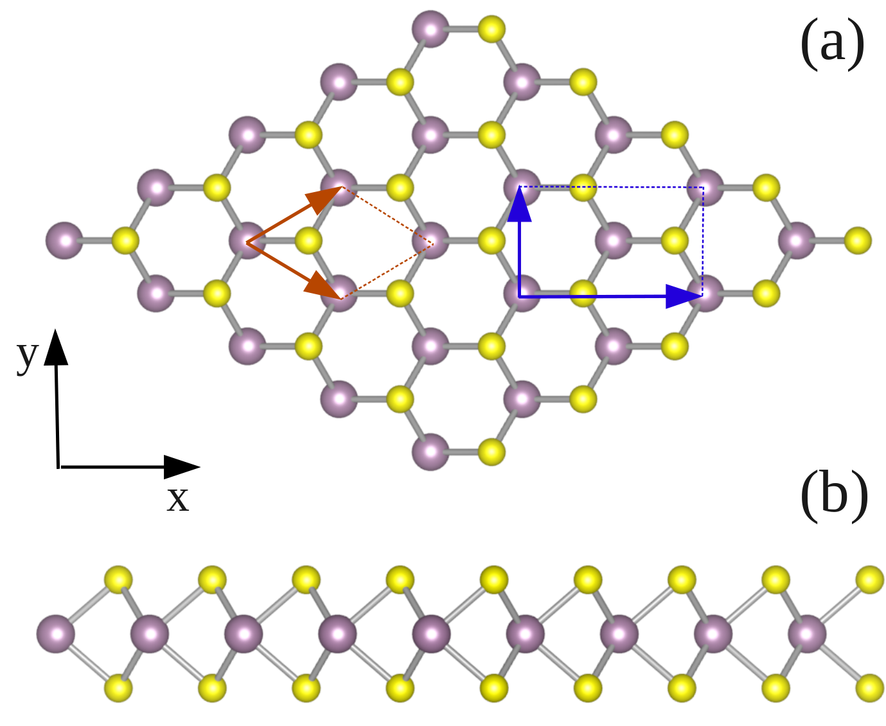
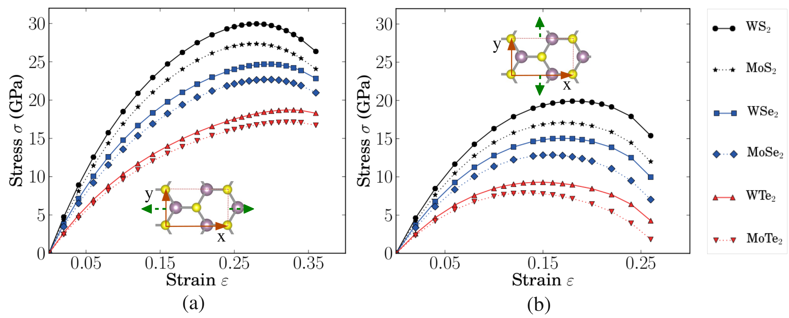
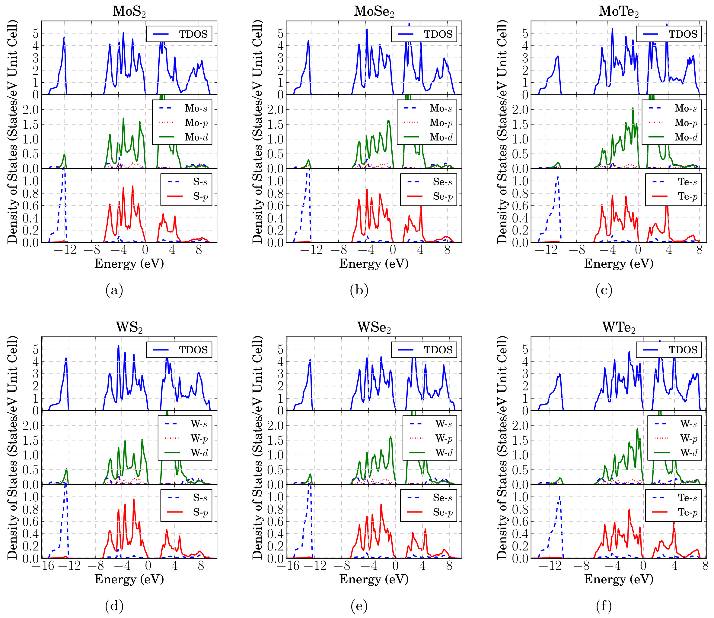
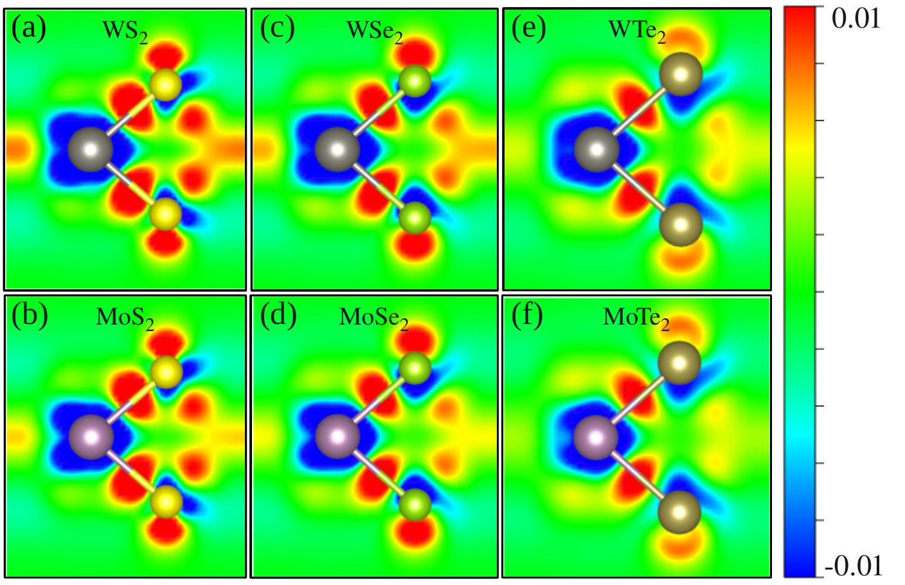
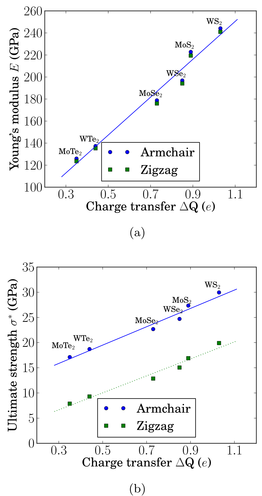
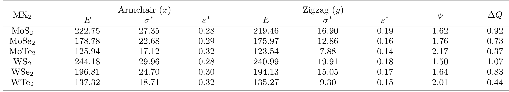

## Li2013bonding — 单层过渡金属二硫化物的键合电荷密度与极限强度

## 📄 元数据
Li, Medhekar, Shenoy，2013，*The Journal of Physical Chemistry C* 117(30), 15842–15848，DOI 10.1021/jp403986v。
## 💡 一句话
用第一性原理 DFT 系统计算了六种单层 VI 族 TMD（Mo/W × S/Se/Te）沿扶手椅和锯齿方向的完整应力–应变曲线，揭示极限强度的组分/方向依赖性，并建立"力学性能（E、σ*）随 M→X 电荷转移量 ΔQ 线性增长"的简单定量模型，其电子结构根源是 M-d/X-p 轨道杂化强度。

## 🔗 Wiki 双链
  - 概念 [[../concepts/2D-materials]]、[[../concepts/strain-engineering]]、[[../concepts/density-functional-theory]]、[[../concepts/bond-density]]、[[../concepts/binding-strength]]、[[../concepts/bonding-charge-density|键合电荷密度]]、[[../concepts/charge-transfer-descriptor|电荷转移描述符 ΔQ]]、[[../concepts/d-band-center|d 带中心]]、[[../concepts/mechanical-anisotropy|力学各向异性]]、[[../concepts/p-d-hybridization|p-d 轨道杂化]]、[[../concepts/ultimate-strength|极限强度 σ*]]
  - 实体 [[../entities/TMDs]]、[[../entities/VASP]]、[[../entities/MoTe2|MoTe₂]]、[[../entities/WTe2|WTe₂]]
  - 图表 [[../figures/crystal-structures]]、[[../figures/mathematical-models]]、[[../figures/heterostructures-stacking-mechanics-misc|力学性质、剥离能与杂项]]
  - 年度 [[../write/2013]]
  - 相关论文 [[../../raw/note/Li2013bonding]]

## 🆕 新概念/实体建议
  - `stress-strain-relation`（应力–应变关系）：无缺陷材料在断裂前对应变的完整力学响应。
  - 实体 `ABINIT`：本文用于力学响应（应力–应变）计算的开源平面波 DFT 软件，采用 LDA + HGH 模守恒赝势。

## 📊 关键图表
  -  → [[../figures/heterostructures-stacking-mechanics-misc|力学性质、剥离能与杂项]]
  -  → [[../figures/heterostructures-stacking-mechanics-misc|力学性质、剥离能与杂项]]
  -  → [[../figures/heterostructures-stacking-mechanics-misc|力学性质、剥离能与杂项]]
  -  → [[../figures/heterostructures-stacking-mechanics-misc|力学性质、剥离能与杂项]]
  -  → [[../figures/heterostructures-stacking-mechanics-misc|力学性质、剥离能与杂项]]
  - 

## 🔬 项目连接
  - **project-5（SnTe 铁电模拟，medium）**：本文给出了一套可直接复用的 DFT 力学响应工作流——正交超胞单轴拉伸、允许横向弛豫计入泊松收缩、超胞应力按 Z/h（真空层厚/块体层间距）重整化得到二维等效应力——对用 DFT 标定 SnTe（及其二维相）在应变下的弹性常数、理想强度和极化–应变耦合有方法学参考价值。"键合电荷密度差 + Bader 电荷"用于把宏观力学/极化行为追溯到成键电荷重分布的思路，也适用于分析 SnTe 中 Sn-5p/Te-5p 杂化与孤对驱动铁电失稳之间的关系；其 ΔQ 描述符思想可类比用于寻找"电荷转移量 vs 极化/畸变"的定量关系。
  - **project-4（TTF 分子计算，weak）**：本文使用的 Bader 电荷分析和电荷密度差方法是定量表征电荷转移的标准工具，对 TTF/金属盐体系中供体–受体电荷转移比例、氧化态判定有方法参考；但其物理对象（共价无机单层）与 TTF 分子晶体（π–π 堆叠、范德华层间）差异较大，仅为方法层面类比。
  - **project-7（CDW，weak）**：研究对象同属 TMD 家族，本文提供的六种 VI 族 TMD 完整弹性常数、极限应变和电子结构（d 带位置、p-d 杂化）数据，可作为讨论 TMD 中电声耦合/CDW 转变与晶格刚度、应变调控关系的背景参考；但本文不直接涉及 CDW。
  - project-1/2/3/6：无直接项目连接。

## 📝 组织与用词
  - 论证结构："问题提出（实验只有 MoS₂ 取向平均数据）→ 方法（ABINIT 算应力–应变，VASP 算电子结构）→ 现象（小应变各向同性/大应变各向异性、组分趋势）→ 机理（DOS/PDOS、d 带中心、键合电荷密度）→ 定量模型（E、σ* 与 ΔQ 线性拟合）"，是典型的"组分→电子结构→宏观性能"三段式 DFT 工作。
  - 值得复用的术语（中英对照）：
    - 键合电荷密度 / Bonding charge density（电荷密度差）
    - 极限强度 / Ultimate strength（σ*）
    - 极限应变 / Ultimate strain（ε*）
    - 扶手椅方向 / Armchair direction；锯齿方向 / Zigzag direction
    - p-d 轨道杂化 / p–d orbital hybridization
    - d 带中心 / d-band center
    - 电荷转移量 / Charge transfer ΔQ（Bader 分析）
    - 各向异性因子 / Anisotropy factor φ = σ*_AR/σ*_ZZ
    - 应力重整化 / Stress renormalization（Z/h 因子）
    - 泊松收缩 / Poisson's contraction

## ✏️ 可写入 Wiki 的要点
  1. 六种单层 VI 族 TMD 的晶格常数（LDA）：MoS₂/WS₂ a=3.13 Å，MoSe₂/WSe₂ a=3.25 Å，MoTe₂/WTe₂ a=3.49 Å；M–X 键长 2.38/2.39、2.51、2.70 Å，与实验误差<1%。
  2. 计算细节：力学部分用 ABINIT + LDA + Hartwigsen–Goedecker–Hutter 模守恒赝势（Mo、W 半芯电子作价电子），平面波截断 65 Ha，弛豫/应力 k 网格分别 15×15×1 和 10×15×1；电子结构用 VASP + LDA + PAW，截断 400 eV；真空层 12 Å，应力乘以 Z/h 重整化。
  3. 小应变（ε<4%）下两方向杨氏模量几乎相同（六方对称→面内弹性各向同性）；MoS₂ E≈220 GPa，与实验单层 270±100 GPa、少层 330±70 GPa 吻合；MoS₂ 平均极限强度约 22 GPa，与 AFM 纳米压痕实验 23 GPa 吻合。
  4. 大应变下六方对称破缺，扶手椅方向极限强度显著高于锯齿方向，φ=σ*_AR/σ*_ZZ 介于 1.50（WS₂）到 2.17（MoTe₂）；强度越低的材料各向异性越强。这与石墨烯相反——石墨烯扶手椅方向峰值应力比锯齿方向低 9%。
  5. 组分趋势：同金属 MS₂ > MSe₂ > MTe₂；同硫族 WX₂ > MoX₂。表 II 关键值：WS₂ 最强（E_AR=244.18 GPa、σ*_AR=29.96 GPa、φ=1.50、ΔQ=1.07 e）；MoTe₂ 最弱且各向异性最大（E_AR=125.94 GPa、σ*_AR=17.12 GPa、σ*_ZZ=7.88 GPa、φ=2.17、ΔQ=0.37 e）。
  6. 扶手椅方向极限应变 ε*_AR=0.28–0.32，远大于锯齿方向 ε*_ZZ=0.14–0.19；这与 DFTB 对 MoS₂ 纳米管预测两方向均约 16% 形成对比，说明二维单层与纳米管几何在大应变下力学响应不同。
  7. 电子结构机理：费米能级以下 0 到 −8 eV 区间 M-d 与 X-p 态密度峰强烈重叠即 p–d 杂化；从硫化物到碲化物，杂化峰整体向费米能级上移（MoS₂ 最深峰约 −5.25 eV，MoTe₂ 对应峰上移约 1 eV），且低能 d 峰降低、近费米峰增强。
  8. d 带中心 E_d（积分下限 −8 eV，E_F=0）：MoS₂/ MoSe₂/MoTe₂ 为 −2.68/−2.37/−1.94 eV；WS₂/WSe₂/WTe₂ 为 −2.98/−2.65/−2.18 eV。E_d 越深→M–X 共价键越强→E 和 σ* 越高；W 的 5d 比 Mo 的 4d 更弥散，杂化更强，故 WX₂ 更强。
  9. 键合电荷密度（体系价电荷密度减去中性原子叠加，单位 e/Bohr³）在 M–X 之间出现红色积累区即共价键可视化；从硫化物到碲化物该红色区变浅变小，与强度下降一致；同时 X 周围红、M 周围蓝，直观显示 M→X 电荷转移（离子键成分）。
  10. 线性模型 E(σ*) ≈ a + b·ΔQ（Bader 电荷，表 III）：E 拟合 a=171.97 GPa、b=61.34 GPa/e；σ*_AR 拟合 a=18.21 GPa、b=10.40 GPa/e；σ*_ZZ 拟合 a=16.86 GPa、b=1.60 GPa/e。即 ΔQ 每增加 0.1 e，E 升高约 6.1 GPa，扶手椅 σ* 升高约 1.04 GPa；该模型把量子力学结果简化为一个易算的电荷转移描述符，但仅基于六种同构型 TMD 拟合，向其他族/二维材料外推的适用边界尚未验证（作者批判性讨论点之一）。
