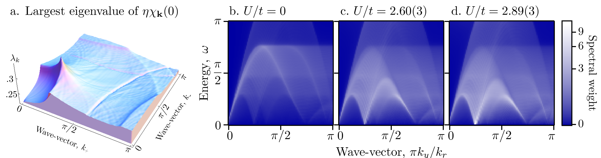

## Makogon2012wave — 超冷原子类方圆形费米面上的自旋-电荷密度波

## 📄 元数据
D. Makogon, I. B. Spielman, C. Morais Smith，2012，EPL (Europhysics Letters) 97, 33002，DOI [10.1209/0295-5075/97/33002](https://doi.org/10.1209/0295-5075/97/33002)
## 💡 一句话
在带交错塞曼场的二维光晶格中，第三能带的"同心方圆形"费米面因不完全嵌套而失稳，作者用 SO(3,1)×SO(3,1) 广义 RPA 证明这是一种自旋与电荷涨落不可分割的耦合有序态——自旋-电荷密度波（SCDW），并指出将自旋与电荷分开处理会显著低估临界相互作用强度。

## 🔗 Wiki 双链
  - 概念 [[../concepts/charge-density-wave|电荷密度波]]
  - 概念 [[../concepts/fermi-surface-nesting|费米面嵌套]]
  - 概念 [[../concepts/spin-density-wave|自旋密度波]]
  - 概念 [[../concepts/spin-charge-density-wave|自旋-电荷密度波]]
  - 概念 [[../concepts/hubbard-model|哈伯德模型]]
  - 概念 [[../concepts/random-phase-approximation|无规相近似]]
  - 概念 [[../concepts/soft-mode|软模]]
  - 概念 [[../concepts/optical-lattice|光晶格]]
  - 概念 [[../concepts/staggered-zeeman-field|交错塞曼场]]
  - 概念 [[../concepts/hubbard-stratonovich-transformation|哈伯德-斯特拉托诺维奇变换]]
  - 概念 [[../concepts/tight-binding|紧束缚]]
  - 图表 [[../figures/electronic-bands]]
  - 图表 [[../figures/mathematical-models]]
  - 图表 [[../figures/experimental-setups]]
  - 年度 [[../write/2012]]
  - 项目 [[../projects/project-7-cdw-charge-density-wave]]
  - 相关论文 [[../../raw/note/Makogon2012wave]]

## 🆕 新概念/实体建议
  - 实体 `potassium-40.md`（⁴⁰K）：作者建议的实验用费米子同位素，文中给出激光波长约 980 nm、远失谐于 D1/D2 线的具体参数。

## 📊 关键图表
  -  -> [[../figures/electronic-bands|电子能带与电子态]]
  -  -> [[../figures/heterostructures-stacking-multiferroic|多铁与磁电异质结]]

## 🔬 项目连接
  - **project-7（CDW）—— strong**：本文虽以超冷原子为载体，但物理内核是 CDW/SDW 失稳的标准范式：费米面几何 → 嵌套矢量 Q → 磁化率发散 → 软模 → 二级相变。RPA 磁化率计算、Stoner 型判据 Uc⁻¹=maxₖλₖ、动态结构因子预言软模等方法可直接迁移到固体 CDW 体系；"不完全嵌套导致非公度序"以及"自旋-电荷耦合修正 Uc"的结论，对理解真实材料中 CDW/SDW 共存与竞争有直接参考价值。
  - **project-2（Mn 多铁）—— medium**：多铁性的本质是自旋自由度与电荷/晶格自由度的耦合。本文的核心论点——二维体系中自旋与电荷涨落必须统一处理，分离处理会定性错误——与多铁物理中磁电耦合的思维高度一致；SO(3,1) 框架把电荷与三个自旋分量放进同一四矢量、用度规符号差异体现泡利原理的做法，可为构造磁电耦合序参量提供形式类比。但材料体系（光晶格 vs Mn 氧化物）和能量尺度差异大，仅作物理图像与方法论参考。
  - **project-4（TTF 分子计算）—— weak**：TTF 类分子晶体常用紧束缚/Hubbard 模型描述，RPA 与 Hubbard-Stratonovich 也是其电子失稳分析的可选工具；本文的紧束缚哈密顿量构造（跃迁 + 局域自旋翻转项）和多带磁化率计算流程在方法层面有形式参考价值，但体系（冷原子 vs 分子晶体）与具体物理不同。
  - project-1（双光子）、project-3（机械发光 NN）、project-5（SnTe 铁电模拟）、project-6（湿度传感器）：无直接项目连接。

## 🔗 项目双链
- 项目 [[../projects/project-7-cdw-charge-density-wave|项目七：CDW电荷密度波]]
- 项目 [[../projects/project-2-mn-multiferroics|项目二：Mn极化结构铁电材料]]
- 项目 [[../projects/project-4-ttf-molecular-calc|项目四：lsl老师的ttf分子计算]]

## 📝 组织与用词
  文章按"实验方案 → 有效紧束缚哈密顿量 → 单粒子能带与费米面 → 多体 SO(3,1)×SO(3,1) 理论 → 静态失稳（图2a）→ 动态软模（图2b-d）→ 结论"的经典理论物理链条推进，每一步都给出可被实验检验的参数（Ω_R、Ω_rf、φ、μ、U/t）。论证上先建立单粒子图像，再以相互作用 U 为旋钮展示从零声到软模的演化，逻辑闭环清晰。值得在 wiki 叙述中复用的术语：
  - rounded-square / squircle Fermi surface — 方圆形（圆角方形）费米面
  - imperfect nesting — 不完全嵌套
  - staggered Zeeman field — 交错塞曼场
  - spin-charge-density wave (SCDW) — 自旋-电荷密度波
  - SO(3,1)×SO(3,1) theory — SO(3,1)×SO(3,1) 理论
  - generalized RPA susceptibility — 广义无规相近似磁化率
  - soft mode — 软模
  - incommensurate wave-vector — 非公度波矢

## ✏️ 可写入 Wiki 的要点
  1. **模型哈密顿量**：H₀ = −t∑⟨ij⟩,s c†_{i,s}c_{j,s} + (Ω_rf/2)∑_j(e^{iφ}c†_{j↑}c_{j↓}+h.c.) + (Ω_R/2)∑_j(e^{iπ(j_x+j_y)}c†_{j↑}c_{j↓}+h.c.)；第三项即[[../concepts/staggered-zeeman-field|交错塞曼场]]，e^{iπ(j_x+j_y)} 在相邻格点交替变号。参数：Ω_rf=gμ_B B_rf，Ω_R=U_v/2（U_v 为矢量光移）。
  2. **方圆形[[../concepts/fermi-surfaces|费米面]]**：取 Ω_R=2t、Ω_rf=4t、φ=π/4，将费米子填至第三能带（呈"变形墨西哥帽"状），费米面由两个同心方圆形构成；动量以 k_±=π(k_x±k_y)/k_r 度量，能量以 t 为单位。
  3. **四能带本征值**：ε²_k = (tγ_k)² + (Ω_rf/2)² + (Ω_R/2)² ± Ω_rf √[(tγ_k)² + (Ω_R cosφ/2)²]，其中 γ_k=4cos(k_+/2)cos(k_-/2)；子晶格 A± 上有效塞曼场 B_±=(Ω_rf cosφ ± Ω_R, −Ω_rf sinφ, 0)。
  4. **SO(3,1) 不变的相互作用分解**：c†_{↑}c†_{↓}c_{↓}c_{↑} = (1/8)n²_j − (1/2) S^T_j·S_j；电荷项与自旋项符号相反，直接体现泡利原理（完全自旋极化态自能为零）。度规 η=Diag(−1,1,1,1,−1,1,1,1) 对应两个子晶格上的 SO(3,1)×SO(3,1)。
  5. **广义 RPA 失稳判据**：(χ^RPA)⁻¹ = χ⁻¹₀ − ηU；失稳条件 det(χ⁻¹₀−U_c η)=0，等价于 U_c⁻¹=maxₖ λₖ（λₖ 为 ηχ_k(0) 的最大特征值），即 Stoner 判据的矩阵推广。
  6. **临界值数值结果**：Q=(π/4,π/4)处 λ_Q=0.345(3)，对应 U_c/t=2.89(3)（240×240 网格，k_BT=10⁻³t，μ=t）；特征向量 V_Q 具有反铁磁特征，是 SDW 与 CDW 的混合——即 SCDW。
  7. **自旋-电荷耦合的定量重要性**：若仅算自旋通道，同 Q 处 U_c/t=2.13(3)（明显偏低）；若仅算电荷通道，排斥 U>0 下根本无 CDW 失稳。说明分离处理既错误估计临界值，也会漏掉只有耦合才能产生的有序态格式。
  8. **非公度与可调性**：SCDW 周期 2π/|Q| 一般与晶格周期无公度，可通过改变 B_±（即 Ω_R、Ω_rf、φ）和[[../concepts/chemical-potential|化学势]] μ 连续调节嵌套矢量。
  9. **软模动力学证据**：对 χ_k(iΩ_n) 作解析延拓 iΩ_n→ω+iκ（κ=10⁻²），U=0 时仅见长波朗道零声；U/t=2.60(3) 时在 πk_y/k_r=π/4 处萌芽第二支线性色散模式；U/t=2.89(3) 时该模式在 ω=0 处谱权重急剧增加，标志二级相变。
  10. **实验探测方案**：建议用 ⁴⁰K 原子（⁴⁰K 的 Δ_FS/2π=1.7 THz，所需激光约 980 nm，远失谐于 770.1 nm D1 与 766.7 nm D2 线），通过原子类比 ARPES 或能量-动量分辨的布拉格光谱测量动态结构因子来观测软模；该方案只需对 Lin et al. Nature 462, 628 (2009) 的"拉曼"激光作简单回射即可实现。
