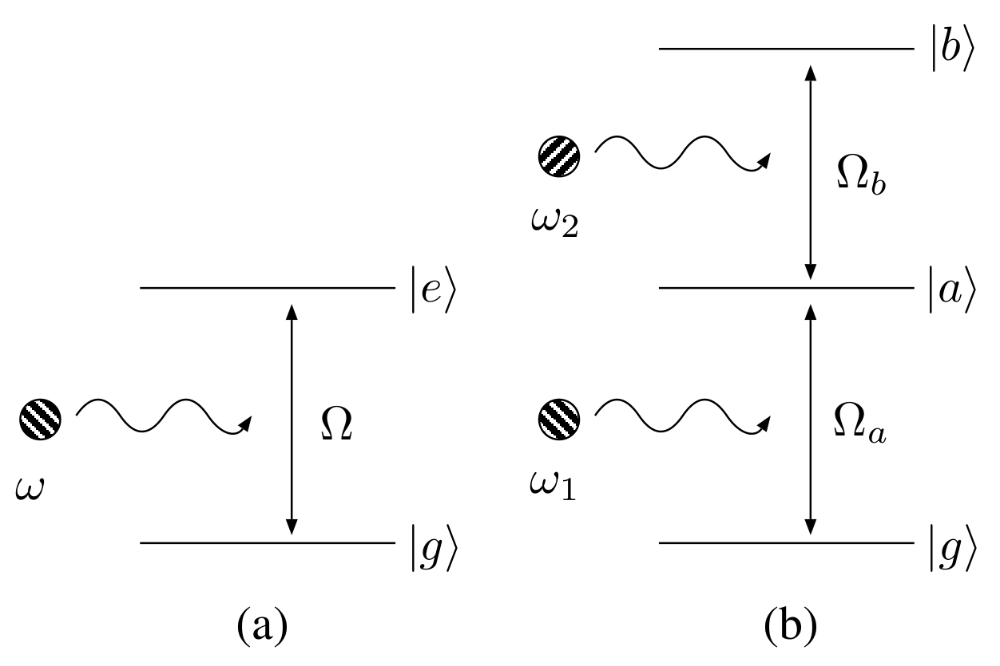
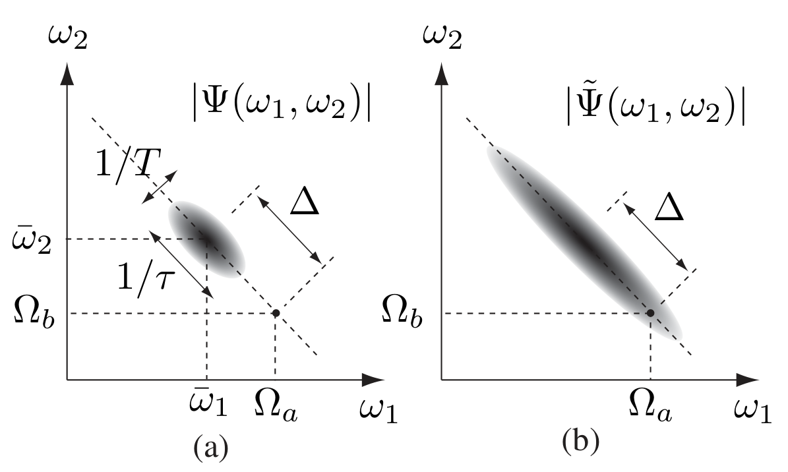
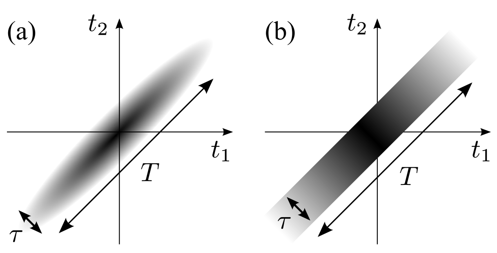
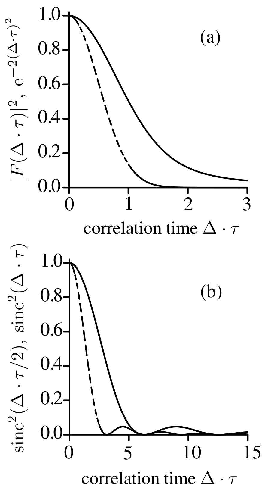

## Nakanishi2009full — 双光子波函数对双光子吸收的全量子分析：与单光子吸收的比较

- **元数据**：Nakanishi, Kobayashi, Sugiyama, Kitano，2009，*Journal of the Physical Society of Japan* 78, 104401，DOI [10.1143/JPSJ.78.104401](https://doi.org/10.1143/JPSJ.78.104401)（arXiv:0906.0213）。京都大学电子科学与工程系 + JST CREST。
- **一句话**：建立基于双光子波函数的全量子多模理论，解析给出任意光子对态的单/双光子吸收概率，并证明矩形时间窗波函数在 Δ·τ = π(2n+1) 时可完全抑制单光子吸收而保持双光子吸收，即"纠缠诱导双光子透明"。

- **现有wiki双链**：
  - 概念：wiki 现有概念条目均围绕二维材料/铁电/磁电，无量子光学条目可链。
  - 实体：无直接匹配。
  - 图表 [[../figures/mathematical-models]]（P1/P2 概率公式、时序波函数、sinc² 与等离子体色散函数对比图均属数学模型类）
  - 年度 [[../write/2009]]
  - 项目 [[../projects/project-1-two-photon]]
  - 相关论文 [[../../raw/note/Nakanishi2009full]]

- **新概念/实体建议**：
  - `concepts/two-photon-absorption.md` — 双光子吸收（TPA）基本定义、选择定则、与单光子吸收的竞争。
  - `concepts/two-photon-wavefunction.md` — 双光子波函数 ψ(t₁,t₂)≡⟨0|â₂(t₂)â₁(t₁)|ψ⟩，及其频域形式 Ψ(ω₁,ω₂)；与时序波函数 ψ(t₁,t₂)θ(t₂−t₁) 的关系。
  - `concepts/time-correlation.md` — 光子对的相干时间 T（泵浦决定）与关联时间 τ（下转换带宽决定），τ≪T 是 SPDC 孪生光子对的特征。
  - `concepts/entanglement-induced-two-photon-transparency.md` — 纠缠诱导双光子透明：矩形波函数下 sinc² 函数零点导致单光子吸收被完全抑制，而双光子吸收保留。
  - `concepts/biphoton.md` — 双光子（biphoton）态，SPDC 产生的能量-时间纠缠光子对。
  - `concepts/spontaneous-parametric-down-conversion.md` — SPDC，Type-I/Type-II、信号光与闲频光、群速度补偿。
  - `concepts/electromagnetic-induced-transparency.md` — EIT，作为对比方案（用耦合光修饰原子能级），与本文"修饰光子态"机制对照。
  - `figures/energy-level-diagrams.md` — 二能级/三能级阶梯型（|g〉-|a〉-|b〉）单光子与双光子跃迁能级图。
  - `figures/spectral-schematics.md` — 双光子波函数频谱 (ω₊,ω₋) 椭圆示意及时序导致的 1/ω₋ 拖尾展宽。

- **关键图表**：
  - 图1 能级图：(a)二能级单光子跃迁 |g〉→|e〉；(b)三能级阶梯型双光子跃迁 |g〉→|a〉→|b〉
    
  - 图2 双光子波函数频谱：(a)|Ψ(ω₁,ω₂)|沿 ω₊ 宽 1/T、沿 ω₋ 宽 1/τ；(b)时序 |Ψ̃|被 1/ω₋ 卷积拖尾展宽
    
  - 图3 时域双光子波函数：(a)高斯型，t₁+t₂ 方向宽 T、t₁−t₂ 方向窄 τ；(b)矩形型，t₁−t₂ 为 ±τ 矩形窗
    
  - 图4 核心函数对比：(a)|F(Δτ)|²（P2，缓慢 1/(Δτ)² 衰减）vs e^{-2(Δτ)²}（P1，指数衰减）；(b)sinc²(Δτ/2)（P2）vs sinc²(Δτ)（P1），周期差两倍导致"魔法点"
    
  - 笔记另附 eq_1 至 eq_42 共 42 个公式截图（场算符、微扰展开、高斯/矩形波函数及其傅里叶变换、P1/P2 表达式等）。

- **项目连接**：
  - **project-1（双光子）— core**。本文是 project-1 的核心机理论文：
    1. 给出双光子吸收概率的全量子解析表达式 P₂ = 4π²r₁r₂|Ψ̃(Ω_a,Ω_b)|²，其中 Ψ̃ 是时序双光子波函数的频谱，直接为双光子激发/荧光过程的量子建模提供公式基础。
    2. 给出 P₂ ∝ (T/τ)(1/Δ²) 的标度律——短关联时间 τ（频率强反关联）+ 长相干时间 T 才能高效双光子吸收，这解释了为何连续泵浦 SPDC 孪生光子对比超短脉冲更适合双光子激发，对 project-1 选择激发光源（脉冲宽度、相干性、光子统计）有直接指导意义。
    3. 单光子损耗 P₁ = 2πr₁∫dω₂'|Ψ(Ω_a,ω₂')|² 须对伴生光子求迹——这是分析纠缠光子对中单光子背景（如荧光漂白、单光子噪声）的正确方法，对压低 project-1 双光子荧光探测中的单光子背景有参考价值。
    4. 矩形波函数下 Δ·τ=π(2n+1) 时 P₁=0、P₂≠0 的"纠缠诱导双光子透明"条件，提示可通过脉冲整形/双折射补偿制备特定时间波函数，实现无单光子损耗的双光子激发——对 project-1 若涉及量子增强双光子显微/传感是直接的设计依据。
    5. 高斯情况下 |F(Δτ)|² 与 e^{-2(Δτ)²} 的渐近对比（多项式 vs 指数）给出了在大失谐下提高 P₂/P₁ 比值的参数窗口，可用于失谐激发方案的定量设计。
  - project-2 至 project-7：无直接项目连接（本文为量子光学/光子-光子相互作用理论，与 Mn 多铁、机械发光 NN、TTF 分子计算、SnTe 铁电模拟、湿度传感、CDW 均无机制、材料或方法上的可复用交集）。

- **组织与用词**：
  文章按"引言（问题）→ 理论（场算符→单光子→双光子→纠缠对中单光子损耗）→ 两类波函数案例（高斯/矩形）→ 结论"组织，核心论证链条是"光子对时间关联 → 双光子波函数 → 时序波函数（θ 函数引入 1/ω 卷积展宽）→ P₂ 由时序频谱决定；同时纠缠使 P₁ 须求迹 → 两者对 Δ·τ 依赖不同 → 解耦调控"。公式 (23) P₂、(24) P₁、(28) P₂∝T/(τΔ²)、(35) R_G、(42) R_r 是五个承上启下的关键等式。
  可复用术语：
  - two-photon absorption（双光子吸收, TPA）
  - two-photon wavefunction / biphoton（双光子波函数/双光子态）
  - time-ordered two-photon wavefunction（时序双光子波函数，ψ(t₁,t₂)θ(t₂−t₁)）
  - coherence time T vs correlation time τ（相干时间与关联时间）
  - entanglement-induced two-photon transparency（纠缠诱导双光子透明）
  - detuning Δ（失谐，∆≡(Ω_a−Ω_b)/2−ω̄₋）
  - plasma dispersion function F(ξ)（等离子体色散函数，高斯波函数下 P₂ 的谱形）
  - type-II SPDC with group-velocity compensation（II 型自发参量下转换+群速度补偿，矩形波函数的物理来源）

- **可写入wiki的要点**：
  1. 双光子吸收概率的全量子公式：P₂ = 4π²r₁r₂|Ψ̃(Ω_a,Ω_b)|²，其中 Ψ̃(ω₁,ω₂) 是 **时序**双光子波函数 ψ(t₁,t₂)θ(t₂−t₁) 的二维傅里叶变换；θ(t₂−t₁) 强制光子 1（|g〉→|a〉）必须先于光子 2（|a〉→|b〉）被吸收。
  2. 单光子吸收概率：对非纠缠光 P₁ = 2πr|Ψ(Ω)|²（仅由跃迁频率处谱强决定）；对纠缠光子对，P₁ = 2πr₁∫dω₂'|Ψ(Ω_a,ω₂')|²，必须对伴生光子频率求迹，不能直接取边缘谱。
  3. 一般标度律：当双光子共振 ω̄₊=Ω_a+Ω_b 且失谐 Δ 足够大时，Ψ̃(Ω_a,Ω_b)∝(√T/τ)(1/Δ)，故 **P₂ ∝ (T/τ)(1/Δ²)**；τ≪T 是 SPDC 孪生光子对相对经典超短脉冲高效发生 TPA 的量子根源。
  4. 时序 θ 函数的频域核 Θ(ω)=√(π/2)δ(ω)−(i/√(2π))P(1/ω)，其 1/ω 项使 Ψ̃ 沿 ω₋=(ω₁−ω₂)/2 方向被显著展宽，这是双光子谱对中间态失谐仅按 1/Δ² 缓慢衰减（而非 δ 函数）的数学来源。
  5. 高斯波函数 ψ∝exp[−(t₁+t₂)²/(16T²)]exp[−(t₁−t₂)²/(4τ²)] 下：P₂∝|F(Δ·τ)|²（F 为等离子体色散函数，大 Δτ 时 ~1/(Δτ)²），P₁∝T⁻¹e^{-2(Δτ)²}；比值 R_G=(√π/2)r₂T·|F(Δτ)|²/e^{-2(Δτ)²}，在 Δτ>1 区域 P₁ 指数衰减而 P₂ 仅多项式衰减，故可调参使 P₂≫P₁。
  6. 矩形波函数 ψ∝exp[−(t₁+t₂)²/(16T²)]·Π_τ(t₁−t₂)（Π_τ 为 |t|<τ 的窗函数，由 II 型 SPDC + 双折射群速度补偿产生）下：P₁∝(1/T)sinc²(Δτ)，P₂∝sinc²(Δτ/2)；比值 R_r=(√π/2)r₂T·sinc²(Δτ/2)/sinc²(Δτ)。
  7. "纠缠诱导双光子透明"：矩形波函数下当 **Δ·τ = π(2n+1)**（n 整数）时 sinc²(Δτ)=0 → P₁=0（单光子吸收完全抑制），而 sinc²(Δτ/2)=sinc²(π(2n+1)/2)=4/[π(2n+1)]² ≠ 0 → P₂ 保持非零；这是无需耦合光/腔的无损耗双光子吸收条件。
  8. 另一组零点 τ=2πn/Δ 时 sinc²(Δτ/2)=0 → P₂=0，即 Fei 等 (1997) 早先预言的"双光子透明"（TPA 自身被抑制）；本文新发现的是上述 P₁=0、P₂≠0 的互补"魔法点"。
  9. 高效双光子激发的两个必要条件：(i) 两光子时间上靠近（短 τ，保证经虚态的瞬时跃迁）；(ii) 双光子总线宽 1/T 小于激发态线宽（保证长时间双光子共振）；超短脉冲因谱过宽不满足 (ii)，而连续泵浦 SPDC 孪生光子对同时满足两者。
  10. 与 EIT/cavity QED 的本质区别：EIT 靠外加耦合光修饰原子能级（缀饰态），cavity QED 靠腔增强光-物质耦合；本文方案完全靠"剪裁光子对自身量子态（时间关联）"实现单/双光子吸收的解耦，无需外部装置，是从"修饰光子态"而非"修饰原子态"入手的新范式。
