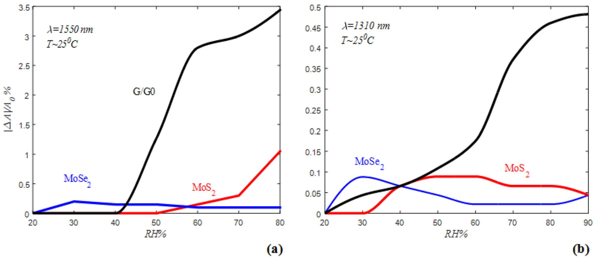
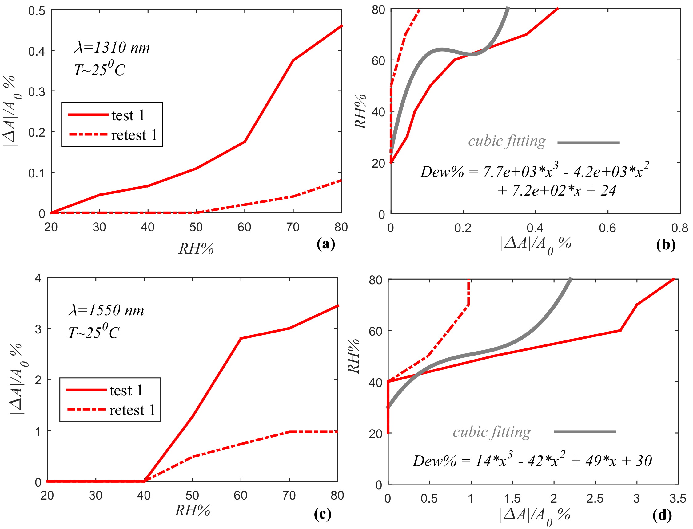
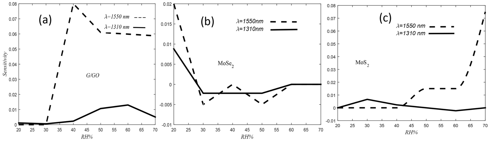
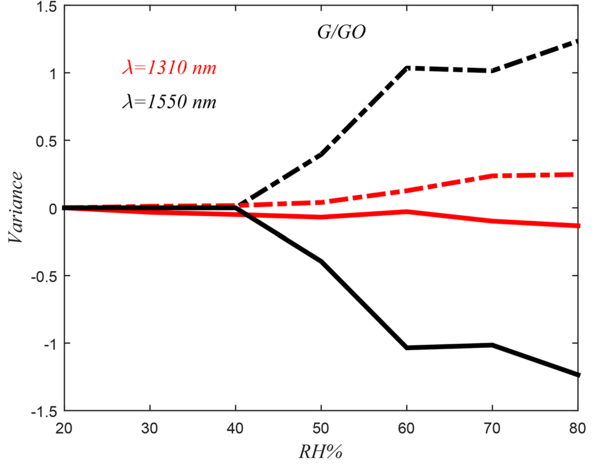

## Owji20212d — 蚀刻光纤表面涂覆二维材料作为湿度传感器

## 📄 元数据
Owji, Mokhtari, Ostovari, Darazereshki, Shakiba，2021，Scientific Reports 11:1771，DOI 10.1038/s41598-020-79563-w
## 💡 一句话
首次用 HF 化学蚀刻减薄单模光纤并分别涂覆 G/GO、MoSe₂、MoS₂ 三种二维材料，在 1310/1550 nm 通信波长下系统比较其湿度传感性能，证明 G/GO 涂层在 20–90% RH 全量程具有高且单调的 RDA 响应，并用表面官能团–半导体类型（n/p）–Penn 模型折射率框架统一解释了三种材料的行为差异。

## 🔗 Wiki 双链
  - 概念 [[../concepts/2D-materials]]、[[../concepts/evanescent-field|倏逝场]]、[[../concepts/optical-fiber-humidity-sensor|光纤湿度传感器]]、[[../concepts/penn-model|Penn模型]]、[[../concepts/relative-differentiation-of-attenuation|相对衰减差分RDA]]
  - 实体 [[../entities/TMDs]]、[[../entities/graphene|石墨烯]]
  - 图表 [[../figures/crystal-structures]]、[[../figures/optical-spectra]]、[[../figures/experimental-setups]]、[[../figures/electronic-devices]]、[[../figures/mathematical-models]]
  - 年度 [[../write/2021]]
  - 项目 [[../projects/project-6-humidity-sensor]]
  - 相关论文 [[../../raw/note/Owji20212d]]

## 🆕 新概念/实体建议
  - `optical-fiber-humidity-sensor`（光纤湿度传感器）：以倏逝场与敏感涂层相互作用为核心的光学传感概念条目，可纳入 project-6 概念库。
  - `evanescent-field`（倏逝场/消逝场）：光纤全反射时渗透到包层外侧的指数衰减电磁场，是光纤化学/生物传感的物理基础。
  - `penn-model`（Penn 模型）：描述材料电子带隙 E_g 与折射率 n 之间反比关系的理论模型，被本文用于把载流子浓度变化映射为折射率变化。
  - `relative-differentiation-of-attenuation`（相对衰减差分 RDA）：定义为 |ΔA|/A₀，是本文衡量湿度响应幅度的核心指标。
  - `MoS2`（二硫化钼）：层状 TMD，本文中因表面同时存在 –OH 施主与 Mo–O 受主导致杂质补偿，湿度响应模糊。
  - `MoSe2`（二硒化钼）：层状 TMD，p 型，低湿（<30% RH）下 RDA 高但中高湿饱和失效。
  - `graphene-oxide`（氧化石墨烯 GO）：富含羟基/羧基/环氧基的亲水二维材料，n 型，是 G/GO 复合涂层亲水吸附的核心组分。
  - `optical-loss-test-set`（OLTS 光损耗测试仪）：由光源 OPS 与光功率计 OPM 组成，用于测量光纤衰减随 RH 的变化。

## 📊 关键图表
  - 图1 G/GO 的 TEM/SEM/EDX/Raman/FTIR/XRD 表征
    
  - 图2 MoSe₂ 的 TEM/SEM/EDX/Raman/FTIR/XRD 表征
    
  - 图3 MoS₂ 的 TEM/SEM/EDX/Raman/FTIR/XRD 表征
    
  - 图4 蚀刻后 ESMF 及分别涂覆 G/GO、MoSe₂、MoS₂ 的 SEM 图像
    
  - 图5 光纤传感器制备流程与温湿度云室测试系统示意图
    
  - 图6 三种涂层 ESMF 在 1310 nm 与 1550 nm 下 RDA 随 RH 变化的核心曲线
    
  - 图7 G/GO 传感器重复性曲线及三次多项式反向标定拟合（MATLAB）
    
  - 图8 三种涂层传感器在两波长下的灵敏度（d(RDA)/dRH）对比
    
  - 图9 G/GO 传感器在 1310/1550 nm 下随 RH 的方差分析
    

## 🔬 项目连接
  - **project-6（小花闻的电压湿度传感器，core）**：本文是 project-6 Zotero 文献池中已收录的核心对比文献，项目页已直接引用其结论。具体参考价值：
    1. **材料筛选数据**：在完全相同的蚀刻光纤平台上并排比较 G/GO、MoSe₂、MoS₂ 三种二维涂层，给出 20–90% RH 全量程的 RDA、灵敏度、方差、重复性数据，可直接作为 project-6 选择湿敏材料的对照基线；
    2. **机理框架可复用**：作者用"表面官能团 → n/p 型半导体 → 水分子吸附抽取电子 → 载流子浓度变化 → Penn 模型下 E_g 与折射率反向变化 → 倏逝场损耗改变"的链条统一解释三种材料行为，这一框架与 project-6 关注的"水分子吸附–电荷传输/介电常数调制"机制高度同源，可迁移到电压型器件的电导率/带隙分析；
    3. **关键定量结论**：MoSe₂ 在 <30% RH 因 p 型表面吸附位点有限而快速饱和；G/GO 因 –OH 等含氧官能团可在 90% RH 仍持续吸附、折射率上升；MoS₂ 因施主/受主补偿导致净响应不显著。这些"杂质补偿抑制响应""亲水基团扩展量程"的判据可用于指导 project-6 中材料掺杂/表面处理；
    4. **Penn 模型与 Tauc 带隙**：project-6 当前正在用 Tauc 法做带隙拟合，本文的 Penn 模型（E_g 与折射率反比）提供了把带隙变化与光学/湿度响应串联起来的理论桥梁；
    5. **波长与精度工程经验**：1310 nm 比 1550 nm 方差更小、低湿精度更高；G/GO 在 RH>30% 后灵敏度显著上升；90°C 热处理可打断氢键使传感器再生——这些都是 project-6 实验设计与数据处理可直接借鉴的工程结论。
  - 其他项目（project-1 双光子、project-2 Mn 多铁、project-3 机械发光 NN、project-4 TTF 分子计算、project-5 SnTe 铁电模拟、project-7 CDW）无直接项目连接。

## 📝 组织与用词
  - 文章按"引言（动机与文献缺口）→ 材料与方法（合成三小节 + 器件制备）→ 结果（性能性能曲线 + 机理解释）→ 结论"的经典材料学实验范式组织。逻辑链是：化学蚀刻制备 ESMF（几何改造）→ 三种二维材料浸涂（化学修饰）→ OLTS 测 RDA-RH（性能对比）→ FTIR 判定 n/p 型 + Penn 模型（机理统一）→ 按工况给出材料选择建议。论证以"性能差异—表面官能团—半导体类型—折射率变化方向"的因果链贯穿全文。
  - 值得复用的关键词/术语：
    - 倏逝场 / 消逝场（Evanescent field）
    - 相对衰减差分（Relative Differentiation of Attenuation, RDA）
    - 折射率（Refractive index, RI）
    - Penn 模型（Penn model，E_g 与 n 反比）
    - 载流子浓度（Carrier density）
    - n 型 / p 型半导体（n-type / p-type semiconductor）
    - 氧化石墨烯含氧官能团（Graphene oxide functional groups: –OH, –COOH, epoxide, C=O）
    - 浸涂法（Dip coating）
    - HF 化学蚀刻（HF chemical etching）
    - 氢键饱和与热重生（Hydrogen-bond saturation & thermal regeneration）

## ✏️ 可写入 Wiki 的要点
  1. **器件结构与制备参数**：将单模光纤剥除 3 cm 保护层，浸入 HF 酸 60 min，包层直径由 125 μm 减薄至 34.45 μm，获得强倏逝场；再将 5 mg 二维粉末分散于 10 cc 蒸馏水、超声 2 h、离心后浸涂到 ESMF 表面。
  2. **G/GO 合成与表征**：改进 Hummers 法制备氧化石墨，液相剥离（6000 rpm 离心 3 h）得上清少层 G/GO；Raman D ~1197 cm⁻¹、G ~1634 cm⁻¹；FTIR 检出 C–O(1020)、C=O(1624)、C–H(2923)、酚羟基 C–OH(3430 cm⁻¹ 宽峰)；XRD 在 2θ=10° 给出 d₀₀₁=0.83 nm，远大于石墨 0.34 nm，证实氧化插层。
  3. **MoSe₂ 合成与表征**：溶剂热法（Se 粉 + Na₂MoO₄ + 水合肼，2 °C/min 升至 120 °C 保温 1 h，pH 调至 12）；Raman A₁g ~240 cm⁻¹、E₂g ~290 cm⁻¹；FTIR 仅有 Mo–O(813)、Mo=O(992)、Se–O(1137 cm⁻¹)，无羟基；XRD 六方相 (002)/(004)/(103) 峰。
  4. **MoS₂ 合成与表征**：乙醇/水（45:55 v/v）中 40 Hz 超声 12 h 化学剥离；Raman E₂g ~381、A₁g ~405 cm⁻¹，峰差 ~24 cm⁻¹ 是少层 MoS₂ 判据；FTIR 同时存在 Mo–S(600)、Mo–O(1639) 和 –OH(3287 cm⁻¹)；XRD (002) 对应 d 间距 6.3 Å。
  5. **核心性能结论**：G/GO 涂层 ESMF 在 20–90% RH 内 RDA 单调、全量程 >30%，是最佳方案；MoSe₂ 仅在 <30% RH 有高 RDA，中高湿因吸附饱和失去"一一对应"关系；MoS₂ 在 <30% RH 时 RDA≈0，整体行为不明确，不适合作湿度传感器。
  6. **机理公式链**：水分子在表面极性键下电离 2H₂O ⇌ H₃O⁺ + OH⁻，吸附过程从材料表面抽取电子；对 p 型 MoSe₂，抽取电子使空穴浓度下降、E_g 增大、折射率 n 降低；对 n 型 G/GO，机制相反（作者指出载流子密度增加导致 n 上升），再加上 GO 层间水嵌入改变有效介质折射率；MoS₂ 因 –OH 施主与 Mo–O 受主共存发生杂质补偿，净折射率变化被抵消。
  7. **Penn 模型引用**：根据 Penn 模型，电子带隙 E_g 与折射率 n 反向相关（Ref. 49），本文据此把"水分子吸附→载流子密度变化→E_g 变化→n 变化→倏逝场损耗变化"定量串联，可作为 project-6 把 Tauc 带隙与湿度响应关联的理论入口。
  8. **重复性与再生**：G/GO 传感器复测 RDA 明显下降，归因于 G/GO 结构中氢键位点饱和；90 °C 热处理可使氧/水分子从 G/GO 表面脱附，恢复响应（Ref. 16, 51）。
  9. **标定公式**：用 MATLAB 对反向 RH(RDA) 曲线做三次多项式拟合，1550 nm 下给出 Dew% = 7.7×10³x³ − 4.2×10³x² + 7.2×10²x + 24（x 为 |ΔA|/A₀）；1310 nm 下为 Dew% = 14x³ − 42x² + 49x + 30，可直接用于把测得的衰减量换算为湿度值。
  10. **波长与精度**：G/GO 传感器在 RH<40% 低湿区方差最小，且 1310 nm 下方差显著小于 1550 nm；灵敏度（d(RDA)/dRH）在 RH>30% 后上升，1550 nm 下幅度更大。即"1310 nm 低湿精度高，1550 nm 高湿灵敏度高"的工程结论。
