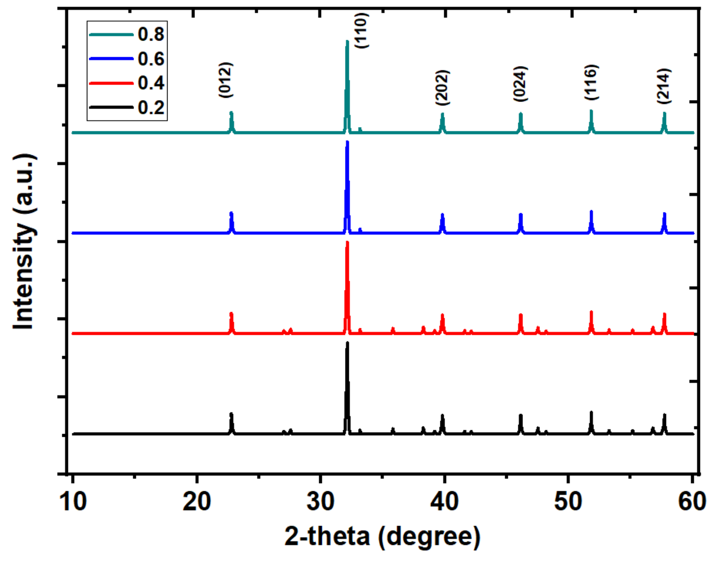
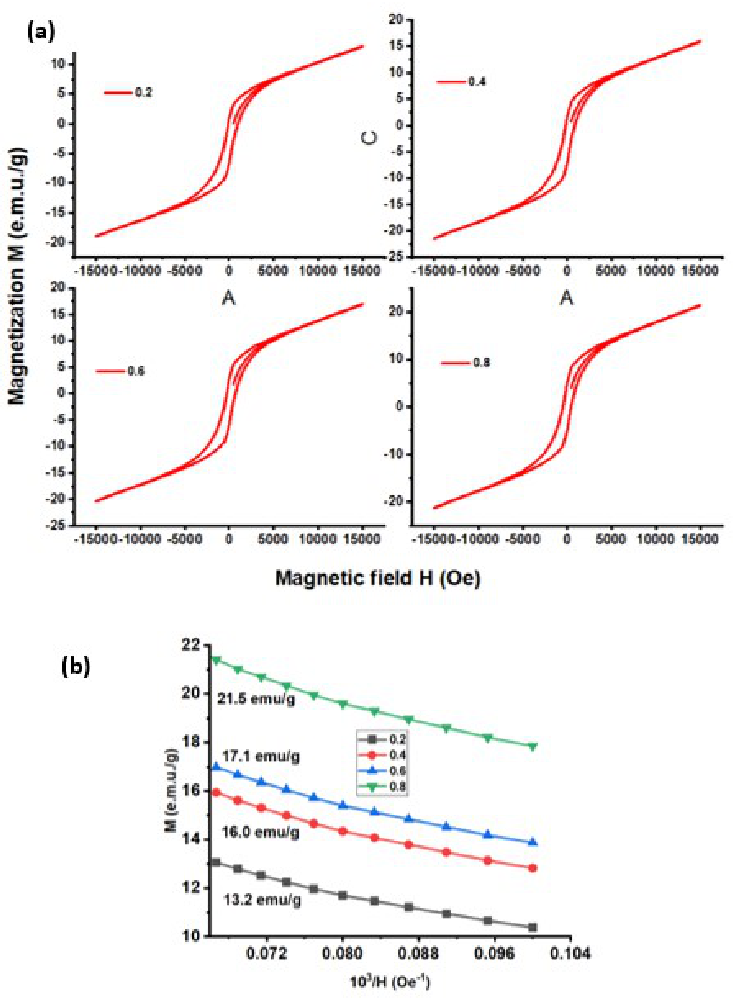
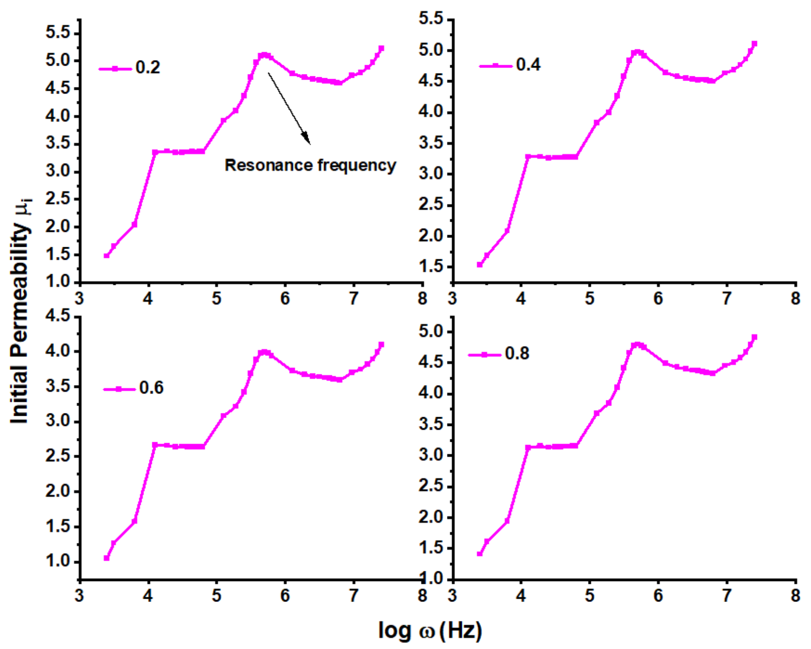
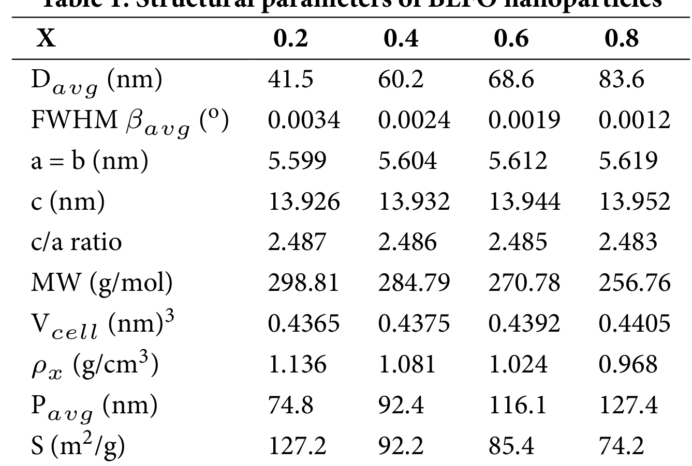
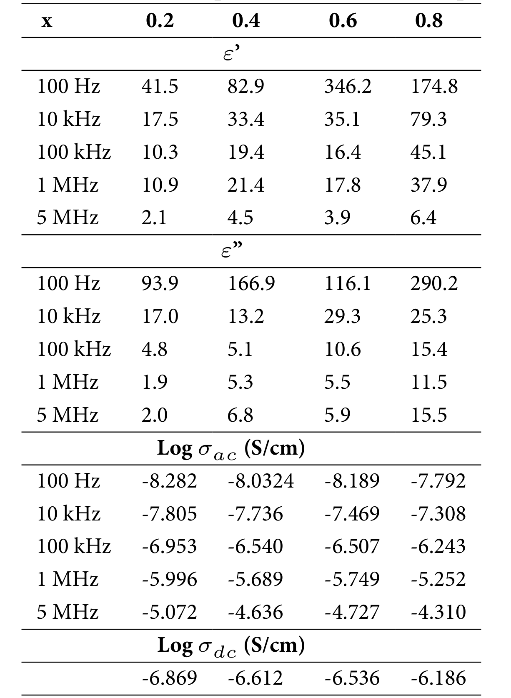

## Perugu2024morphology — La对BiFeO₃纳米颗粒多铁性的影响

## 📄 元数据
Perugu S, Bhanu Kiran G, Anil Babu T, Raghavaiah BV，2024，*Indian Journal of Science and Technology* 17(39): 4038–4047，DOI: 10.17485/IJST/v17i39.2761

## 💡 一句话
水热法合成 Bi₁₋ₓLaₓFeO₃（x=0.2–0.8）纳米颗粒，系统证明 La 取代 Bi 位点导致晶格膨胀、球形→纳米棒形貌转变、杂相抑制、饱和磁化强度从 13.2 升至 21.5 emu/g，并将 x=0.8 样品推荐为介电吸收器候选材料。

## 🔗 Wiki 双链
  - 概念 [[../concepts/multiferroicity]]、[[../concepts/magnetoelectric-coupling]]、[[../concepts/maxwell-wagner-polarization|Maxwell-Wagner 界面极化]]、[[../concepts/hopping-conduction|跳跃传导]]、[[../concepts/jonscher-power-law|Jonscher 幂律]]、[[../concepts/oxygen-vacancy|氧空位]]、[[../concepts/spin-cycloid|自旋回旋/螺旋磁结构]]、[[../concepts/hydrothermal-synthesis|水热合成法]]、[[../concepts/dielectric-absorber|介电吸收器]]、[[../concepts/BLFO|BLFO（La 掺杂 BiFeO₃）]]、[[../concepts/scherrer-equation|谢乐公式]]
  - 实体 [[../entities/BiFeO3]]
  - 图表 [[../figures/crystal-structures]]
  - 年度 [[../write/2020-2024|2024]]
  - 项目 [[../projects/project-2-mn-multiferroics]]
  - 话题 [[../topics/多铁性材料]]
  - 概念 [[../concepts/magnetic-domain]]
  - 实体 [[../entities/BLFO]]
  - 相关论文 [[../../raw/note/Perugu2024morphology]]

## 📊 关键图表
  - 图1 XRD 图谱（菱方钙钛矿 JCPDS 86-1518，杂相 Bi₂Fe₄O₉/Bi₂₅FeO₄₀ 随 La 增加而消失）：
     -> [[../figures/crystal-structures-xrd-phases|XRD与相变]]
    - **图示描述**：横轴为 2θ（度），纵轴为衍射强度（任意单位），并列 x=0.2、0.4、0.6、0.8 四条谱线；最强峰位于 (110) 面。
    - **关键特征**：所有样品均与 JCPDS 86-1518 菱方（三方）钙钛矿标准卡片吻合；低 La 含量样品存在正交 Bi₂Fe₄O₉ 和立方 Bi₂₅FeO₄₀ 杂相峰，La 含量超过 50% 后这些杂峰基本消失；(110) 峰随 x 增大轻微向低角偏移，对应晶格膨胀；结合谢乐公式 D=0.9λ/βcosθ，Davg 从 41.5 nm（x=0.2）增至 83.6 nm（x=0.8），微应变由 0.0034 降至 0.0012。
    - **结论/意义**：从物相层面证明 La³⁺（0.136 nm）成功取代 Bi³⁺（0.096 nm）位而非 Fe³⁺ 位，并抑制杂相生成。
  - 图2 FESEM 图像（纳米球→纳米棒形貌演变，Gavg 96.4→168.3 nm）：
     -> [[../figures/experimental-setups|实验装置与测量系统]]
    - **图示描述**：四幅场发射扫描电镜照片按 x=0.2、0.4、0.6、0.8 排列，展示同一放大倍数下颗粒形貌与堆积方式的演变。
    - **关键特征**：低掺杂以类球形颗粒为主，随 x 增加纳米棒数量与长径比显著增大，高 La 样品中纳米棒成为主导形貌；仍可见少量纳米球共存；线性截距法给出 Gavg 从 96.4 nm（x=0.2）单调增至 168.3 nm（x=0.8），作者归因于内部微应变下降。
    - **结论/意义**：直观呈现 La 掺杂诱导的各向异性生长，作者以"位点波动"（site fluctuation）模型解释大半径 La³⁺ 与 Bi³⁺ 失配导致球形颗粒水平/垂直方向畸变。
  - 图3 HRTEM 图像（纳米棒+纳米球共存，Pavg 74.8→127.4 nm）：
     -> [[../figures/experimental-setups|实验装置与测量系统]]
    - **图示描述**：四幅透射电镜（HRTEM）图像按 x=0.2–0.8 排列，用于核实在 FESEM 中看到的纳米棒形貌并统计颗粒尺寸。
    - **关键特征**：TEM 下同样观察到纳米棒与纳米球共存，且棒状颗粒比例随 x 增加而上升；颗粒尺寸 Pavg 由 74.8 nm（x=0.2）增至 127.4 nm（x=0.8），与 XRD 的 Davg 和 FESEM 的 Gavg 趋势一致；三种独立尺寸测量互相印证了 La 促进晶粒/颗粒长大的结论。
    - **结论/意义**：从介观尺度确认纳米棒形貌真实存在，为后续讨论各向异性与磁性增强提供形貌依据。
  - 图4 介电常数、介电损耗、交流电导率随频率变化（Maxwell-Wagner 极化，弛豫峰 log ω=5.483 与 7.492）：
     -> [[../figures/heterostructures-stacking|异质结与堆叠]]
    - **图示描述**：三联子图 (a)(b)(c) 共享横轴 log ω（对应 42 Hz–5 MHz）；(a) 纵轴为介电常数实部 ε'，(b) 为虚部 ε''，(c) 为交流电导率对数 log σ_ac（S/cm），四条曲线对应 x=0.2–0.8。
    - **关键特征**：所有样品在低频下 ε'、ε'' 都很高，随频率升高迅速下降，到 log ω≈5.864 后趋于平缓并出现共振/弛豫，是典型 Maxwell-Wagner 界面（空间电荷）极化；介电损耗在 log ω=5.483 与 7.492 处出现两个弛豫峰；ε'、ε'' 与 σ_ac 均随 La 含量增加而整体升高，σ_ac 用 Jonscher 幂律 σ_ac=Aωⁿ+σ_dc 拟合，n 值在 0.364–0.872 之间，log σ_dc 由 −6.869 增至 −6.186 S/cm；x=0.8 样品在 100 Hz 下 ε'=174.8、ε''=290.2。
    - **结论/意义**：低频高介电响应归因于晶界电荷堆积，高频电导率升高归因于 Fe²⁺/Fe³⁺ 间电子跳跃；该图直接支撑 x=0.8 作为介电吸收器候选材料的结论。
  - 图5 M-H 磁滞回线及低场放大（弱铁磁/多畴，Ms 13.2→21.5 emu/g）：
     -> [[../figures/electronic-bands-cdw-transport|CDW与输运性质]]
    - **图示描述**：(a) 为室温下磁化强度 M（emu/g）随外加磁场 H（Oe）的完整磁滞回线，(b) 为低场区 LAS 放大图，用于读出剩磁 Mr 和矫顽力 Hc，四条曲线对应 x=0.2–0.8。
    - **关键特征**：所有回线狭窄、未完全线性，表现为弱铁磁性而非纯反铁磁；饱和磁化强度 Ms 由 13.2 emu/g（x=0.2）单调升至 21.5 emu/g（x=0.8）；矩形比 Mr/Ms 在 0.261–0.494 之间，全部 <0.5，判定为多畴磁性纳米颗粒；Hc 在 439.3–758.4 Oe 之间无系统变化；各向异性常数 K1=Hc·Ms/0.96 介于 6845–12640 erg/cm³，磁矩 nB=M.W.·Ms/5585 由 3.41 降至 2.55 μ_B/f.u.（因分子量下降）。
    - **结论/意义**：磁性增强被归因于 La 掺杂扭曲 Fe-O-Fe 键角、破坏 BFO 本征螺旋自旋结构、释放被锁定磁矩。
  - 图6 初始磁导率 μi 随 log ω 变化（双弛豫峰 log ω=4.1 与 5.68，分别归因于铁电/铁磁偶极子）：
     -> [[../figures/domain-walls-switching-properties|极化翻转与铁电性能]]
    - **图示描述**：横轴为 log ω，纵轴为初始磁导率 μi，四条曲线对应 x=0.2–0.8，测试频段同样为 42 Hz–5 MHz。
    - **关键特征**：所有样品在 log ω=4.1 与 5.68 附近出现两个明显的弛豫/共振峰，作者将前者归因于铁电偶极子、后者归因于铁磁偶极子与外场共振；μi 在峰区出现高值；5 MHz 下 μi 从 5.24（x=0.2）降至 4.14（x=0.6），x=0.8 又回升至 4.96，这种非单调变化归因于 Fe³⁺/Fe²⁺ 间交换相互作用的改变。
    - **结论/意义**：双弛豫峰是作者论证 BLFO 同时具有铁电和铁磁序（即多铁性本质）的主要实验依据，但属间接证据，未给出磁电耦合系数 α_ME。
  - 图7 P-E 电滞回线（"香蕉形"，氧空位导致漏电流大，弱铁电性）：
     -> [[../figures/domain-walls-structures|畴结构与畴壁]]
    - **图示描述**：横轴为外加电场 E（kV/cm），纵轴为极化强度 P（μC/cm²），四条闭合曲线对应 x=0.2–0.8。
    - **关键特征**：所有回线均呈"香蕉形"而非矩形饱和环，表明 180° 铁电畴与高浓度氧空位导致的漏电流占主导；矫顽电场 Ec 在 0.2–0.56 kV/cm 之间，剩余极化 Pr 仅 0.0024–0.0048 μC/cm²，两者随成分均无系统变化。
    - **结论/意义**：回线证实材料存在弱铁电性，但漏电流掩盖了本征翻转；批判性地看，应辅以 PUND 等方法扣除漏电贡献才能定量评估铁电性能。
  - 表1 结构参数（Davg、FWHM、晶格常数、晶胞体积、密度、比表面积）：
     -> [[../figures/crystal-structures-surfaces-defects|表面、缺陷与形貌]]
    - **图示描述**：按 x=0.2、0.4、0.6、0.8 四行列出 Davg、FWHM βavg、a=b、c、c/a、MW、Vcell、ρx、Pavg、S 共十列结构参数。
    - **关键特征**：a=b 由 0.5599 nm 增至 0.5619 nm，c 由 1.3926 nm 增至 1.3952 nm，Vcell 由 0.4365 增至 0.4405 nm³，c/a 几乎不变（2.487→2.483）；Davg 由 41.5 增至 83.6 nm，FWHM 由 0.0034° 降至 0.0012°；X 射线密度 ρx 因分子量由 298.81 降至 256.76 g/mol 而由 1.136 降至 0.968 g/cm³；比表面积 S=600/(Davg·ρx) 由 127.2 降至 74.2 m²/g；Pavg 由 74.8 增至 127.4 nm。
    - **结论/意义**：用定量数据系统支撑"La 取代 Bi 位 → 晶格膨胀、晶粒长大、密度与比表面积下降"的结构演化链。
  - 表2 介电参数数据（ε'、ε''、log σ_ac、log σ_dc）：
     -> [[../figures/electronic-devices-sensors|传感器与探测器]]
    - **图示描述**：按 100 Hz、10 kHz、100 kHz、1 MHz、5 MHz 五个频率列出 x=0.2–0.8 样品的 ε'、ε''、log σ_ac，并在末行给出外推得到的 log σ_dc。
    - **关键特征**：ε' 和 ε'' 均随频率升高而大幅下降，并随 x 增大而整体升高；x=0.6 在 100 Hz 下 ε'=346.2 为全表最高，但 x=0.8 同时具有最高的 ε''=290.2 与最高的 σ_dc（log σ_dc=−6.186 S/cm）；5 MHz 下各成分 ε' 仅 2.1–6.4，体现强介电色散；log σ_ac 从低频约 −8 升至 5 MHz 时约 −4.3–−5.1，符合 Jonscher 幂律。
    - **结论/意义**：表中数据直接服务于"x=0.8 因高介电常数与高损耗而适合介电吸收器"的应用结论，并提供 σ_dc 外推值用于讨论 Fe²⁺/Fe³⁺ 跳跃传导。

## 🔬 项目连接
  - **project-2（Mn 多铁）— medium**：本文虽以 Fe 基 BFO 为对象，但所展示的稀土 A 位掺杂调控钙钛矿多铁性物理图像与 Mn 基多铁项目高度可类比。可复用要点包括：(1) 大半径稀土离子取代 A 位导致晶格膨胀、Fe(Mn)-O-Fe(Mn) 键角扭曲从而抑制螺旋反铁磁结构、释放净磁化的机制；(2) Fe²⁺/Fe³⁺ 间跳跃导电与 Mn²⁺/Mn³⁺、Mn³⁺/Mn⁴⁺ 混合价导电在物理上同构，Jonscher 幂律拟合流程可直接迁移；(3) Maxwell-Wagner 界面极化 in 晶粒-晶界体系中的频谱特征；(4) VSM/P-E/阻抗谱联合表征多铁性的实验流程；(5) "香蕉形"P-E 回线作为氧空位/漏电流诊断标志的判据；(6) 水热法制备掺杂钙钛矿纳米晶的合成路线参考。不构成 core 连接的原因是材料体系不同（BFO vs Mn 氧化物），且无磁电耦合系数直接测量。
  - project-1（双光子）、project-3（机械发光 NN）、project-4（TTF 分子计算）、project-5（SnTe 铁电模拟）、project-6（湿度传感器）、project-7（CDW）：无直接项目连接。project-5 虽涉及铁电模拟，但本文为实验氧化物纳米颗粒工作，不含应变工程、拓扑铁电或第一性原理计算内容，无可复用的计算流程或物理模型。

## 🔗 项目双链
- 项目 [[../projects/project-2-mn-multiferroics|项目二：Mn极化结构铁电材料]]

## 📝 组织与用词
论文遵循"合成→表征→性能→机理→结论"的经典材料科学范式。先以水热法制备成分梯度样品（x=0.2–0.8），再依次用 XRD/FESEM/TEM 建立结构与形貌事实，用 LCR 阻抗谱建立介电/导电事实，用 VSM/P-E/μi-f 建立磁与铁电事实，最后将各性能与成分关联并指向介电吸收器应用。论证主线是"La 离子半径大于 Bi → 晶格膨胀+位点波动 → 纳米棒各向异性生长+螺旋磁结构破坏 → 介电与磁性同步增强"。值得在 wiki 叙述中复用的术语：
  - multiferroic nature（多铁性本质）
  - rhombohedral distorted perovskite（菱方畸变钙钛矿）
  - Maxwell-Wagner / interfacial / space-charge polarization（Maxwell-Wagner/界面/空间电荷极化）
  - hopping conduction between Fe²⁺ and Fe³⁺（Fe²⁺/Fe³⁺ 间跳跃传导）
  - spin cycloid suppression（螺旋自旋结构抑制）
  - banana-shaped P-E loop（"香蕉形"电滞回线，漏电流诊断）
  - multi-domain magnetic nanoparticles（多畴磁性纳米颗粒，Mr/Ms<0.5）
  - dielectric absorber（介电吸收器/吸波材料）

## ✏️ 可写入 Wiki 的要点
  1. Bi₁₋ₓLaₓFeO₃（x=0.2–0.8）水热纳米颗粒保持菱方（三方）钙钛矿结构（JCPDS 86-1518，最强峰 (110)）；杂相 Bi₂Fe₄O₉（正交）和 Bi₂₅FeO₄₀（立方）在 La 含量 >50% 时基本消失，说明高 La 掺杂抑制杂相。
  2. La³⁺ 离子半径 0.136 nm 大于 Bi³⁺ 的 0.096 nm，无法取代半径仅 0.0645 nm 的 Fe³⁺，故选择性取代 Bi 位；取代导致晶格常数 a=b 从 0.5599 增至 0.5619 nm，c 从 1.3926 增至 1.3952 nm，晶胞体积 V_cell 从 0.4365 增至 0.4405 nm³，c/a 比几乎不变（2.487→2.483）。
  3. Scherrer 公式 D=0.9λ/βcosθ 给出平均晶粒尺寸 Davg 从 41.5 nm（x=0.2）增至 83.6 nm（x=0.8），微应变从 0.0034 降至 0.0012；FESEM 截距法晶粒尺寸 Gavg 96.4→168.3 nm，TEM 颗粒尺寸 Pavg 74.8→127.4 nm，三者趋势一致。
  4. 比表面积 S=600/(Davg·ρ_x) 从 127.2 降至 74.2 m²/g；X 射线密度 ρ_x=Z·M.W./(N·V)（三方晶系 Z=1）因分子量从 298.81 降至 256.76 g/mol 而从 1.136 降至 0.968 g/cm³。
  5. La 掺杂诱导形貌从纳米球向纳米棒演变，作者归因于 La³⁺/Bi³⁺ 巨大半径差导致"位点波动"（site fluctuation），使球形颗粒在水平/垂直方向发生变形和择优生长。
  6. 室温介电谱（42 Hz–5 MHz）显示低频高 ε'、ε''，随频率升高迅速下降，至 log ω=5.864 后出现共振/弛豫，是典型 [[../concepts/maxwell-wagner-polarization|Maxwell-Wagner 界面极化]]；弛豫峰位于 log ω=5.483 和 7.492。x=0.8 样品在 100 Hz 下 ε'=174.8、ε''=290.2，被推荐用于[[../concepts/dielectric-absorber|介电吸收器]]。
  7. 交流电导率遵循 [[../concepts/jonscher-power-law|Jonscher 幂律]] σ_ac=Aωⁿ+σ_dc，n 值在 0.364–0.872 之间；σ_ac 与 σ_dc 均随 La 含量和频率增加而增大，归因于 Fe²⁺/Fe³⁺ 间电子[[../concepts/hopping-conduction|跳跃传导]]。σ_dc（log）从 −6.869 增至 −6.186 S/cm。
  8. VSM 测得饱和磁化强度 Ms 从 13.2（x=0.2）单调升至 21.5 emu/g（x=0.8），归因于 La 掺杂破坏 BFO 螺旋反铁磁结构、释放被锁定磁矩；矩形比 Mr/Ms=0.261–0.494（均 <0.5）表明多畴结构；Hc 在 439.3–758.4 Oe 间无系统变化；[[../concepts/migdal-eliashberg-theory|各向异性]]常数 K1=Hc·Ms/0.96 在 6845–12640 erg/cm³；磁矩 nB=M.W.·Ms/5585 从 3.41 降至 2.55 μ_B/f.u.（因分子量下降）。
  9. 初始磁导率 μi 随频率谱在 log ω=4.1 和 5.68 处出现两个弛豫峰，作者分别归因于铁电偶极子和铁磁偶极子与外加交流场的共振，作为[[../concepts/multiferroicity|多铁性]]的间接证据；μi（5 MHz）从 5.24（x=0.2）降至 4.14（x=0.6），x=0.8 回升至 4.96。
  10. P-E 回线呈"香蕉形"而非矩形饱和环，表明[[../concepts/oxygen-vacancy|氧空位]]浓度高、漏电流大，真实铁电翻转被导电行为掩盖；Ec 在 0.2–0.56 kV/cm，Pr 仅 0.0024–0.0048 μC/cm²，随成分无系统变化，证实弱[[../concepts/ferroelectricity|铁电性]]。批判性视角：本文以 μi 谱双弛豫峰作为多铁性主要证据属间接证据，未直接测量[[../concepts/magnetoelectric-coupling|磁电耦合]]系数 α_ME；P-E 回线应辅以 PUND 等方法排除漏电流；电子效应与纳米棒形貌各向异性对磁性增强的贡献未被剥离。
