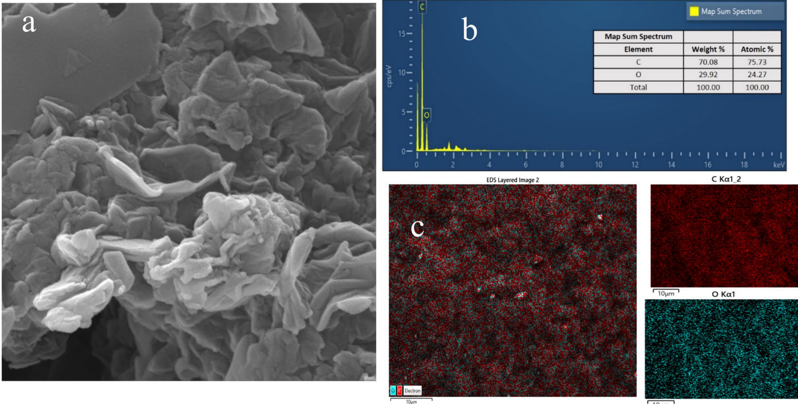
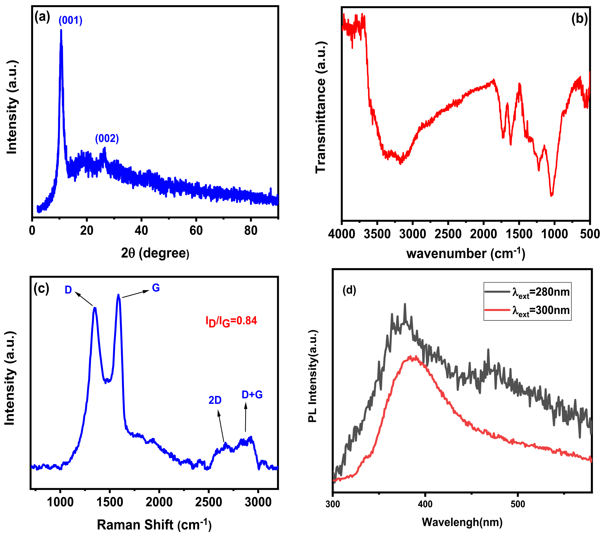
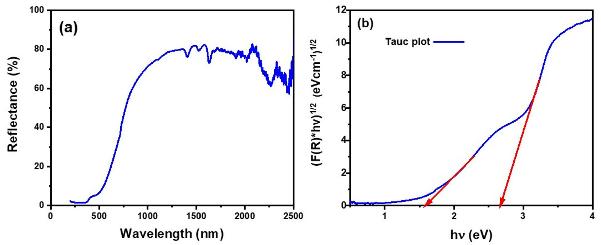
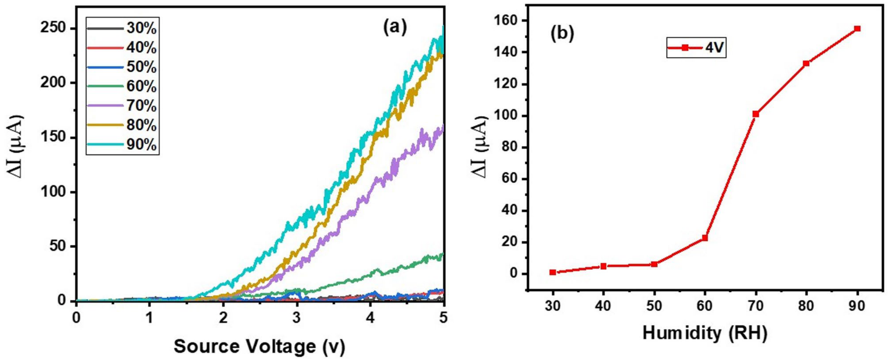
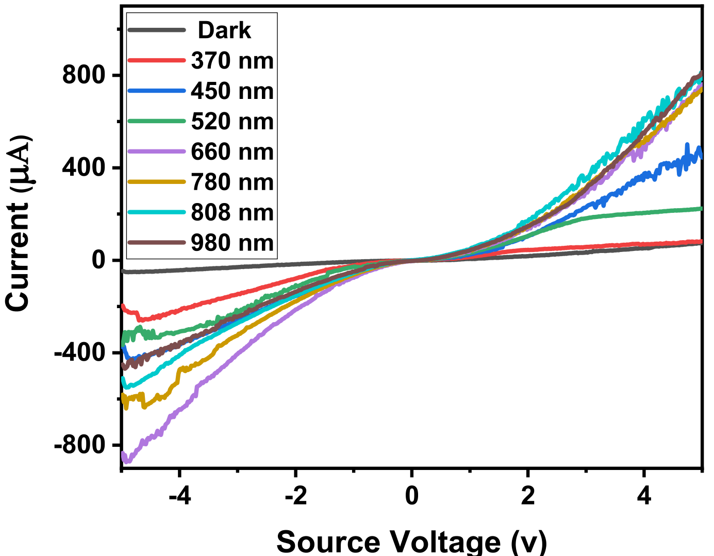
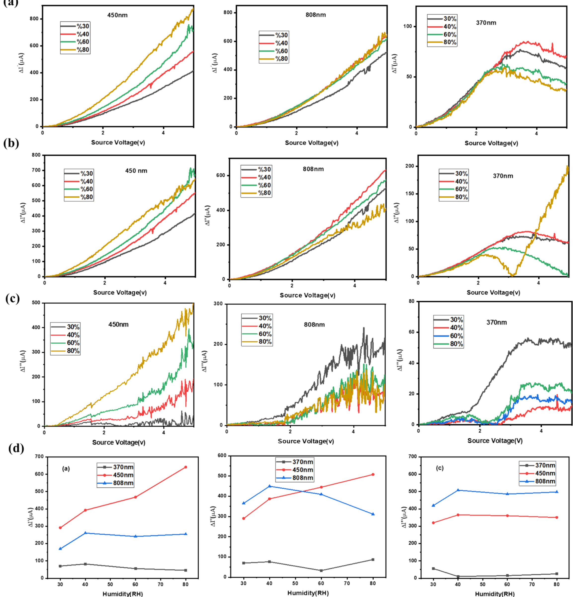
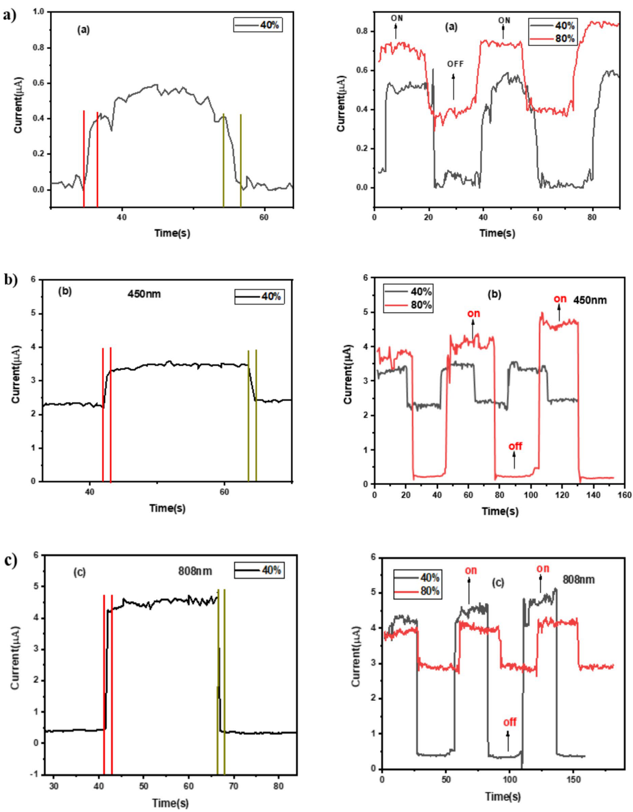
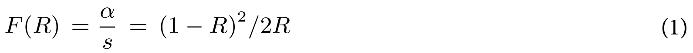
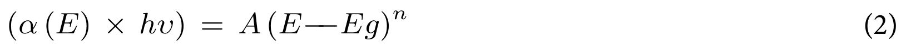

## Tobeiha2025optical — 基于G/GO纳米片的光学湿度传感器

## 📄 元数据
Nafiseh Tobeiha, Nafiseh Memarian, Fatemeh Ostovari，2025年，*Scientific Reports* 15: 25456，DOI: 10.1038/s41598-025-09766-6
## 💡 一句话
用声化学剥离法制备石墨烯/氧化石墨烯（G/GO）纳米片，系统比较370/450/808 nm激光对其湿度传感性能的调控，发现450 nm蓝光因光子能量足以克服GO带隙与激子结合能，使传感器在灵敏度、线性度、响应/恢复速度（1.0 s/1.3 s）上全面最优。
## 🔗 Wiki 双链
  - 概念 [[../concepts/2d-materials]]
  - 概念 [[../concepts/exciton-binding-energy|激子结合能]]
  - 概念 [[../concepts/humidity-sensing-mechanism|湿度传感机制]]
  - 概念 [[../concepts/two-photon-absorption|双光子吸收]]
  - 概念 [[../concepts/p-type-semiconductor]]
  - 概念 [[../concepts/photoconductivity]]
  - 概念 [[../concepts/kubelka-munk-theory]]
  - 概念 [[../concepts/optical-band-gap]]
  - 实体 [[../entities/graphene|石墨烯]]
  - 实体 [[../entities/graphene-oxide]]
  - 实体 [[../entities/g-go-nanosheets]]
  - 图表 [[../figures/vibrational-spectra]]
  - 图表 [[../figures/optical-spectra]]
  - 图表 [[../figures/electronic-devices]]
  - 年度 [[../write/2025-2029|2025]]
  - 项目 [[../projects/project-6-humidity-sensor]]
  - 相关论文 [[../../raw/note/Tobeiha2025optical]]

## 🆕 新概念/实体建议
  - [[../concepts/exciton-binding-energy|exciton-binding-energy]]（激子结合能）：光生电子-空穴对的库仑束缚能，是本文解释450 nm与808 nm波长差异化光-湿耦合效应的核心物理量，石墨烯中约3 eV。
  - [[../concepts/optical-humidity-sensing|optical-humidity-sensing]]（光学湿度传感）：利用光与湿敏材料相互作用（光吸收、光电流、折射率变化等）检测湿度的传感范式，区别于传统电阻/电容式。
  - [[../concepts/p-type-doping|p-type-doping]]（p型掺杂）：水分子含氧端从G表面抽取电子、使空穴积累的电荷转移机制，是G/GO暗态湿敏响应的基础。
  - [[../concepts/tauc-plot|tauc-plot]]（Tauc图法）：通过(αhν)^(1/n)对hν作图外推半导体光学带隙的标准方法，本文据此得到1.56 eV与2.66 eV双带隙。
  - [[../concepts/two-photon-absorption|two-photon-absorption]]（双光子吸收）：强激光下同时吸收两个低能光子实现高能跃迁的非线性光学过程，被用于解释808 nm下GO的异常光电流。
  - [[../concepts/sonochemical-exfoliation|sonochemical-exfoliation]]（声化学剥离）：利用超声空化效应将氧化石墨剥离为少层G/GO纳米片的制备方法。
  - 实体 [[../entities/graphene|graphene]]（石墨烯）：sp²碳二维材料，比表面积2630 m²/g、迁移率2×10⁵ cm²V⁻¹s⁻¹，p型导电畴。
  - 实体 [[../entities/graphene-oxide|graphene-oxide]]（氧化石墨烯）：含羰基、羟基、环氧、羧基等含氧官能团的石墨烯衍生物，亲水、带可调带隙。
  - 实体 [[../entities/g-go-nanosheets|g-go-nanosheets]]（G/GO纳米片复合物）：G导电畴与GO亲水畴共存的混合体系，兼具高载流子迁移率与水分子吸附能力。
## 📊 关键图表
  -  -> [[../figures/experimental-setups|实验装置与测量系统]]
    - **图示描述**：三联图，(a) FESEM场发射扫描电镜下G/GO纳米片的微观形貌，(b) EDX能谱，(c) C与O元素面分布mapping。
    - **关键特征**：FESEM中可见典型二维片层的平坦区与褶皱，是薄层纳米片成功剥离的标志；EDX仅检出C、O两元素，无杂质，C/O重量比约2.34，表明氧化程度介于纯石墨烯与纯氧化石墨烯之间；C、O mapping在所选区域内均匀分布，说明氧化过程均匀。
    - **结论/意义**：从形貌与成分双重确证G/GO混合纳米片合成成功，为后续光-湿耦合测试提供可靠的材料基础。
  -  -> [[../figures/vibrational-spectra|振动光谱]]
    - **图示描述**：四子图结构-光学综合表征：(a) XRD衍射图谱，(b) FTIR红外光谱，(c) Raman拉曼光谱，(d) PL光致发光光谱（280 nm与300 nm两种激发）。
    - **关键特征**：XRD在2θ=10°、20°、26°出现三个峰，对应GO(001)、GO/G中间相和G(002)，布拉格定律给出层间距0.83 nm、0.48 nm、0.38 nm，证实G畴与GO畴共存；FTIR在3000–3600 cm⁻¹有宽强O-H峰，1382–1746 cm⁻¹为羧基/环氧，1026 cm⁻¹为C=O，证明含氧官能团丰富、材料亲水；Raman出现D峰~1345 cm⁻¹（缺陷/sp³）、G峰~1587 cm⁻¹（sp²面内E2g）、2D峰~2668 cm⁻¹；PL在280 nm/300 nm激发下分别于378 nm/386 nm出现蓝光发射，源于sp²团簇中电子-空穴对的辐射复合。
    - **结论/意义**：从晶体结构、化学键、分子振动到电子能级建立G/GO的完整"物化身份档案"，为后续载流子行为与光吸收解释奠定结构基础。
  -  -> [[../figures/optical-spectra|光学光谱]]
    - **图示描述**：(a) 漫反射DRS吸收光谱，展示样品在紫外-可见光区的吸收特征；(b) 经Kubelka–Munk函数转换后的Tauc图，通过外推线性段得到光学带隙。
    - **关键特征**：DRS显示吸收主要集中在紫外区，并延伸至部分可见光区，符合GO基材料特征；Tauc图外推得到两个光学带隙：1.56 eV（约794 nm）归因于G畴，2.66 eV（约466 nm）归因于GO畴；两带隙共存表明材料内部存在两种能级结构的纳米域。
    - **结论/意义**：这是全文最关键的能量标尺，直接决定后续选择450 nm（~2.76 eV）与808 nm（~1.53 eV）激光进行对照实验，并解释两者差异化的光-湿耦合行为。
  -  -> [[../figures/electronic-devices-sensors|传感器与探测器]]
    - **图示描述**：暗态基准测试：(a) 在30%–80% RH不同湿度下，电流变化量ΔI = I − I₀ 随外加电压的变化曲线；(b) 固定4 V偏压下ΔI随相对湿度的变化。
    - **关键特征**：ΔI随电压单调线性增加，且湿度越高曲线斜率越大；4 V偏压下ΔI随湿度上升而非线性增大；Hummers法制备的G为p型半导体，水分子含氧端电负性高，从G表面抽取电子，使空穴载流子密度升高，湿度越高空穴浓度越大、电流越大。
    - **结论/意义**：建立传感器在无光照下的p型湿敏基准响应，作为后续所有光学实验的参照基线。
  -  -> [[../figures/electronic-devices-memory-transistors|存储器与晶体管]]
    - **图示描述**：环境湿度（21% RH）下，传感器在370、450、520、808、980 nm等不同波长激光照射时的总电流-电压曲线对比。
    - **关键特征**：总体上电流随波长增大而增加，808 nm红外照射下电流最大、370 nm紫外下最小；但450 nm与808 nm两处电流相对相邻波长（520、980 nm）出现异常上翘，不满足简单单调关系；450 nm处的增强对应GO带隙2.66 eV的单光子共振，808 nm（~1.53 eV）接近G带隙1.56 eV并可能涉及双光子吸收（合能~3.2 eV）。
    - **结论/意义**：揭示光电流并非光子能量的线性响应，而是与材料双带隙结构共振，为后续波长-湿度耦合实验筛选出450 nm与808 nm两个关键波长。
  -  -> [[../figures/electronic-devices-sensors|传感器与探测器]]
    - **图示描述**：全文核心数据图，四个子图在370/450/808 nm激光与30%–80% RH耦合条件下，分别绘制三个差分电流随电压的变化，以及(d) 4 V偏压下随湿度的汇总对比。
    - **关键特征**：ΔI′ = I(光,湿) − I(暗,21%RH) 表征光加湿总效应，450 nm下随湿度线性增长、370与808 nm无规律；ΔI′′ = I(光,湿) − I(暗,同湿) 为光照净贡献，450 nm随湿度规律增加，808 nm在40% RH达到峰值后反而下降；ΔI′′′ = I(光,湿) − I(光,21%RH) 为湿度净贡献，450 nm下为正且显著线性增加，808 nm下为负、随湿度升高而减小；450 nm光子（~2.76 eV）足以克服GO带隙2.66 eV与石墨烯~3 eV的激子结合能，光生电子自由度高、易被水分子捕获，形成光-湿正向协同；808 nm光子能量不足、激子束缚强，双光子吸收贡献电子数有限，高湿下电子与H⁺/空穴复合反而消耗载流子。
    - **结论/意义**：通过变量解耦给出450 nm激光优越性的决定性证据，并以"光子能量-激子结合能-界面电荷转移"模型统一解释两种波长的相反行为。
  -  -> [[../figures/electronic-devices-sensors|传感器与探测器]]
    - **图示描述**：(a)(b)(c) 分别在暗态、450 nm激光、808 nm激光下，40% RH阶跃时的响应/恢复瞬态曲线；下方子图为40%与80% RH下多次吸脱附循环的重复性测试。
    - **关键特征**：响应时间（达到ΔI 80%）暗态1.9 s、450 nm 1.0 s、808 nm 1.7 s；恢复时间（恢复至80%）暗态2.1 s、450 nm 1.3 s、808 nm 1.39 s；450 nm在响应与恢复两项均最快；多次循环后电流基线与幅度基本保持，重复性良好；快速动力学归因于2θ=10°处GO(001) 0.83 nm的较大层间距有利于水分子快速进出。
    - **结论/意义**：从动态响应与循环可靠性定量证明450 nm光照不仅提升灵敏度与线性度，还显著加快响应/恢复速度，是综合最优工作模式。
  -  -> [[../figures/mathematical-models-formulas|光学、输运与其他解析公式]]
    - **图示描述**：Kubelka–Munk函数 F(R) = (1 − R)² / (2R)，将漫反射率R转换为与吸收系数α成正比的量（F(R) = α/S，S为散射系数）。
    - **关键特征**：是把DRS粉末样品反射率数据转化为吸收光谱的标准桥梁；无需测量绝对吸收系数即可用于后续Tauc分析；适用于本文G/GO粉末这类强散射样品。
    - **结论/意义**：为图3由DRS反射谱得到Tauc图、进而外推1.56 eV与2.66 eV双带隙提供数学依据。
  -  -> [[../figures/mathematical-models-formulas|光学、输运与其他解析公式]]
    - **图示描述**：Tauc关系式 (α·hν)^(1/n) = A(hν − Eg)，其中α为吸收系数、hν为光子能量、Eg为带隙、A为常数，n由跃迁类型决定（直接跃迁n=1/2，间接跃迁n=2）。
    - **关键特征**：以(αhν)^(1/n)对hν作图，将吸收边线性段外推至横轴即可读出光学带隙Eg；本文对G/GO样品外推得到1.56 eV（约794 nm）和2.66 eV（约466 nm）两个能态值，分别对应G畴与GO畴；与公式1的Kubelka–Munk转换联用，构成完整的DRS带隙分析流程。
    - **结论/意义**：定量给出全文波长选择与激子机制讨论所依赖的双带隙能量标尺。

## 🔬 项目连接
  - **project-6（湿度传感器）— core**：本文是G/GO基光学湿度传感器的直接实验研究，从材料制备（声化学剥离+滴涂）、表征（XRD/FTIR/Raman/PL/DRS）、器件构筑（硅片+银浆欧姆接触）、湿度腔测试（30–80% RH，IVM-2.10系统）到光-湿耦合机制（p型掺杂、激子结合能、双光子吸收）完整覆盖。差分电流ΔI′/ΔI′′/ΔI′′′解耦光、湿及协同贡献的方法学可直接复用于项目6其他湿敏材料的光调控测试；450 nm蓝光增强策略（响应1.0 s、恢复1.3 s、线性度好）为器件工作波长选择提供直接范例；表1的六维性能评价框架（灵敏度/选择性/响应/恢复/稳定性/线性度）可作为项目6器件对比的标准模板。
  - **project-1（双光子）— weak**：文中在解释808 nm（~1.53 eV）如何激发带隙>2 eV of GO时，明确讨论了双光子吸收（two-photon absorption，~3.2 eV合能）这一非线性光学机制，并指出其需要高光强、在中等激光功率下贡献电子数有限。这为project-1理解石墨烯/GO体系在近红外飞秒激光下的双光子吸收截面、激发态电子向水分子转移的竞争通道提供了材料层面的参考，但本文未涉及双光子荧光，仅为机制层面的形式类比。
  - 其他项目（project-2/3/4/5/7）：无直接项目连接。
## 🔗 项目双链
- 项目 [[../projects/project-6-humidity-sensor|项目六：小花闻的电压湿度传感器]]
- 项目 [[../projects/project-1-two-photon|项目一：双光固化和双光发光]]

## 📝 组织与用词
论文采用"合成→表征→暗态基准→单波长光电流→光-湿耦合→机制解释→性能评估"的递进结构。核心论证手法是通过三个差分电流（ΔI′总效应、ΔI′′光照净贡献、ΔI′′′湿度净贡献）将混合信号解耦，再用能带-激子结合能模型统一解释450 nm与808 nm的差异化行为。值得在wiki叙述中复用的术语：
  - 相对湿度 [[../concepts/relative-humidity|相对湿度]] / Relative Humidity (RH)
  - 声化学剥离 / sonochemical exfoliation
  - p型半导体 / p-type semiconductor
  - 光学带隙 [[../concepts/optical-band-gap|光学带隙]] / optical bandgap
  - 激子结合能 [[../concepts/exciton-binding-energy|激子结合能]] / exciton binding energy
  - 双光子吸收 [[../concepts/two-photon-absorption|双光子吸收]] / two-photon absorption
  - 光生载流子 / photogenerated carriers
  - 界面电荷转移 / interfacial charge transfer
  - 响应/恢复时间 / response/recovery time
  - 差分电流解耦 / differential current decomposition
## ✏️ 可写入 Wiki 的要点
  1. G/GO纳米片由改进Hummers法合成氧化石墨后，在去离子水中超声3 h（5 mg/100 mL）、12000 rpm离心洗涤、60 °C烘干24 h制得；FESEM显示典型二维片层褶皱，EDX测得C/O重量比为2.34。
  2. XRD三个特征峰：2θ=10°（GO(001)，层间距0.83 nm）、2θ=20°（GO/G中间相，0.48 nm）、2θ=26°（G(002)多层结构，0.38 nm），证实G与GO畴共存。
  3. FTIR：3000–3600 cm⁻¹为O-H伸缩，1382–1746 cm⁻¹为羧基/环氧，1026 cm⁻¹为C=O；Raman：D峰~1345 cm⁻¹（缺陷/sp³）、G峰~1587 cm⁻¹（sp²面内E2g）、2D峰~2668 cm⁻¹。
  4. PL在280 nm/300 nm激发下分别于378 nm/386 nm出现蓝光发射，源于sp²团簇中电子-空穴对辐射复合及氧原子与G费米能级附近π态的键合。
  5. DRS+[[../concepts/tauc-plot|Tauc图]]给出两个[[../concepts/optical-band-gap|光学带隙]]：1.56 eV（~794 nm，G畴）和2.66 eV（~466 nm，GO畴），是后续波长选择的能量标尺。
  6. 暗态湿敏机制：Hummers法制备的G为p型半导体，水分子含氧端电负性高，从G表面抽取电子，使空穴浓度升高、电流增大；湿度越高载流子密度越高。
  7. 21% RH下I-V：808 nm电流最大，450 nm次之，370 nm最小；450 nm与808 nm处电流异常增大，分别对应2.66 eV与1.56 eV带隙共振。
  8. 差分电流定义：ΔI′=I(光,湿)−I(暗,21%RH)为总效应；ΔI′′=I(光,湿)−I(暗,同湿)为光照净贡献；ΔI′′′=I(光,湿)−I(光,21%RH)为湿度净贡献。450 nm下三者均随湿度线性增加；808 nm下ΔI′′′为负，即湿度升高反而抑制电流。
  9. 机制解释：450 nm光子（~2.76 eV）超过GO带隙且足以克服[[../entities/graphene|石墨烯]]~3 eV的[[../concepts/exciton-binding-energy|激子结合能]]，光生电子自由度高，易被水分子捕获，进一步增强p型掺杂，形成光-湿正向协同；808 nm光子（~1.53 eV）激发的电子受激子结合能强束缚，[[../concepts/two-photon-absorption|双光子吸收]]贡献电子数少，高湿度下这些电子与H⁺/空穴复合反而消耗载流子，导致负响应。
  10. 性能数据（40% RH）：暗态响应1.9 s/恢复2.1 s；450 nm响应1.0 s/恢复1.3 s；808 nm响应1.7 s/恢复1.39 s。表1六维评价中只有450 nm在灵敏度、选择性、响应/恢复、稳定性、线性度上全部合格，370 nm全不合格，808 nm非线性。
