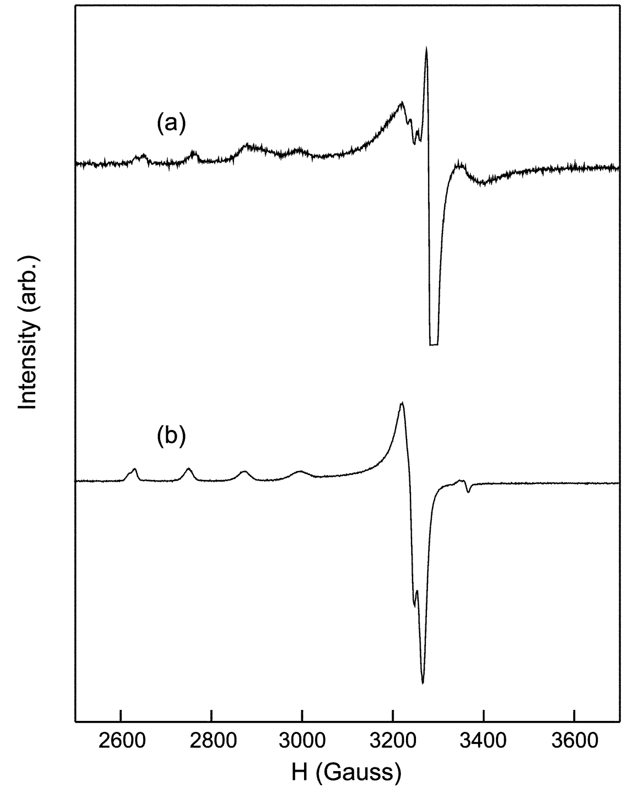
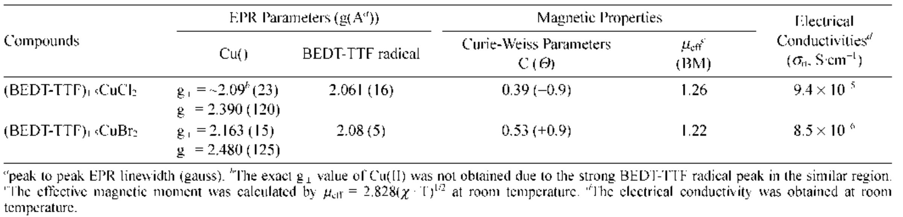
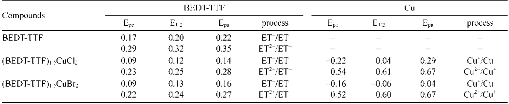

## Unknown2003charge — 双(乙撑二硫)四硫富瓦烯(BEDT-TTF)与卤化铜(II)的电荷转移化合物：(BEDT-TTF)₁.₅CuX₂ (X=Cl, Br)
## 📄 元数据
Young-Inn Kim，2003，Bulletin of the Korean Chemical Society，24(9), 1389–1392，DOI 10.5012/bkcs.2003.24.9.1389
## 💡 一句话
在乙腈中直接反应合成 (BEDT-TTF)₁.₅CuX₂ (X=Cl, Br)，证实 BEDT-TTF 被部分氧化、Cu 处于 Cu(II/I) 混合价态，并建立"Br⁻ 诱导效应更弱→残留 Cu(II) 更多→库仑散射更强→电导率更低"的构效关系；指出给体/受体比需 >2 才能将 Cu(II) 完全还原为 Cu(I)。
## 🔗 Wiki 双链
  - 年度 [[../write/2003]]
  - 项目 [[../projects/project-4-ttf-molecular-calc]]
  - 概念 [[../concepts/charge-transfer-compound|电荷转移化合物]]、[[../concepts/bedt-ttf|BEDT-TTF]]、[[../concepts/mixed-valence|混合价态]]、[[../concepts/vibronic-coupling|振动电子耦合]]、[[../concepts/electron-paramagnetic-resonance|电子顺磁共振(EPR)]]
  - 相关论文 [[../../raw/note/Unknown2003charge]]
## 📊 关键图表
  - **图1：77 K 下 (BEDT-TTF)₁.₅CuCl₂(a) 与 (BEDT-TTF)₁.₅CuBr₂(b) 的 X 波段 EPR 谱（冷冻玻璃 DMF/CH₂Cl₂ = 50/50）**
  -  -> [[../figures/experimental-setups|实验测试与测量装置]]
  - **图示描述**：两个子图分别为 Cl 化物 (a) 与 Br 化物 (b) 在 77 K 冷冻溶液中的一阶导数 EPR 谱；横轴为磁场，纵轴为吸收信号的一阶导数，同时叠加了有机自由基与过渡金属离子两类顺磁中心的响应。
  - **关键特征**：g ≈ 2.07（接近自由电子 g = 2.0023）的尖锐单峰归属为 BEDT-TTF⁺· 自由基，证明给体被部分氧化；g∥ > g⊥ > 2 且带四重超精细分裂的轴向信号归属为 d⁹ 构型的 Cu(II)，表明 Cu 未被完全还原；Br 化物中 Cu(II) 峰相对 BEDT-TTF⁺ 峰的强度明显高于 Cl 化物，直接反映 Br 化物残留更多 Cu(II)；表 1 给出 Cu(II) g∥ = 2.390（Cl）/2.480（Br），BEDT-TTF 自由基 g ≈ 2.06–2.08。
  - **结论/意义**：这是支撑"BEDT-TTF 部分氧化 + Cu 处于 Cu(II/I) 混合价态，且 Br 化物 Cu(II) 比例更高"这一核心论断最直接的谱学证据。
  - **图2：(BEDT-TTF)₁.₅CuCl₂ 的磁化率-温度依赖关系（SQUID，4–300 K）**
  -  -> [[../figures/mathematical-models|数学模型与物理公式]]
  - **图示描述**：横轴为温度 T（K，约 4–300 K），纵轴为摩尔磁化率 χ（emu/mol），曲线展示样品从低温到室温的顺磁响应及居里-外斯拟合区间。
  - **关键特征**：4–50 K 出现典型"居里尾巴"，χ 随降温急剧上升，符合 χ = C/(T−θ)；Cl 化物拟合得 C = 0.39、θ = −0.9 K，Br 化物 C = 0.53、θ = +0.9 K（见原文表 1），C 值更大定量印证 Br 化物含更多局域 Cu(II) 磁矩；50 K 以上偏离居里-外斯行为，作者以 χ(T) = χ_Cu(II) + χ_TTF⁺ + δ(T) 描述，δ(T) 代表 BEDT-TTF⁺ 间交换/反铁磁相互作用；室温 μeff = 1.26 BM（Cl）、1.22 BM（Br），均低于单未配对电子纯自旋值 1.73 BM。
  - **结论/意义**：低温磁化率由局域 Cu(II) 主导，而 μeff 偏低则从宏观磁学角度独立证明存在抗磁 Cu(I)，即混合价态 Cu(II/I)。
  - **表1：(BEDT-TTF)₁.₅CuX₂ 的 EPR 参数、居里-外斯参数、有效磁矩与室温电导率汇总**
  -  -> [[../figures/heterostructures-stacking-multiferroic|多铁与磁电异质结]]
  - **图示描述**：表格横向并列两种化合物的 EPR g 值（Cu(II) g⊥/g∥ 与 BEDT-TTF 自由基 g）、峰峰线宽 ΔHpp（G）、居里常数 C 与外斯温度 θ、有效磁矩 μeff（BM）以及室温粉末电导率 σ（S·cm⁻¹）。
  - **关键特征**：Cu(II) 满足 g∥ > g⊥ > 2 的轴向 d⁹ 特征；C(Br) = 0.53 > C(Cl) = 0.39，定量对应 Br 化物更多 Cu(II)；μeff ≈ 1.22–1.26 BM 显著低于 1.73 BM，证实非磁 Cu(I) 共存；σ_RT(Cl) = 9.4×10⁻⁵ S·cm⁻¹ 比 σ_RT(Br) = 8.5×10⁻⁶ S·cm⁻¹ 高约一个数量级，二者均落在绝缘体区间，且比完全还原的 (BEDT-TTF)₂Cu^ICl₂（~10⁻³ S·cm⁻¹）低 1–2 个数量级。
  - **结论/意义**：该表是全文"数据枢纽"，把 EPR、磁性、电导率三条证据并置，直接建立"Cu(II) 残留量 ↑ → μeff 与 C 变化 → σ ↓"的构效关系。
  - **表2：BEDT-TTF 及两种化合物的循环伏安峰电位（DMF/0.1 M TEAP，V vs Ag/Ag⁺）**
  -  -> [[../figures/experimental-setups|实验测试与测量装置]]
  - **图示描述**：表格列出中性 BEDT-TTF 以及 (BEDT-TTF)₁.₅CuCl₂、(BEDT-TTF)₁.₅CuBr₂ 的各氧化还原过程的阴极峰 Epc、半波电位 E₁/₂、阳极峰 Epa，单位均为 V vs Ag/Ag⁺。
  - **关键特征**：中性 BEDT-TTF 的 ET⁺/ET 半波电位为 +0.20 V，而化合物中移至 +0.12 V（Cl）/+0.13 V（Br），负移约 70–80 mV，表明固体中 BEDT-TTF 已部分带正电、更易进一步氧化；两种化合物同时出现 Cu⁺/Cu（Cl: E₁/₂ = +0.04 V；Br: −0.06 V）与 Cu²⁺/Cu⁺（~+0.60–0.61 V）两对 Cu 的氧化还原峰；BEDT-TTF 的 ET²⁺/ET⁺ 过程在化合物中位于 +0.24–0.25 V，与中性分子（+0.32 V）同样负移。
  - **结论/意义**：循环伏安从电化学角度独立佐证 BEDT-TTF 已被部分氧化、铜以 Cu(II/I) 混合价态共存，与 EPR/SQUID 结论相互印证。
## 🔬 项目连接
  - **project-4（TTF 分子计算）——强相关**：本文正是 BEDT-TTF（TTF 衍生物）电荷转移盐的实验基准工作，已被该项目条目录入。参考价值有三：(1) 给出 BEDT-TTF 与 CuX₂ 反应的化学计量比（1.5:1）和氧化态分配，是建模电荷态时必须考虑的实验约束；(2) 明确 BEDT-TTF (E₁/₂=+0.20 V) π 给体能力弱于 TTF (E₁/₂=−0.01 V vs Ag/Ag⁺)，解释为何 BEDT-TTF 只能部分还原 Cu(II)，对 DeepMD/MACE 训练集中电荷态选取有指导意义；(3) 提出"局域 Cu(II) d 电子通过库仑相互作用散射 BEDT-TTF⁺ 导电电子"的机制，提示在力场/MLP 中必须正确描述长程静电与电荷局域化，不能只用中性 UFF 处理 π 堆叠。
  - **project-7（CDW）——弱相关**：本文研究的 BEDT-TTF 盐属于低维有机导体大家族，IR 中 ~1400/~1330 cm⁻¹ 的 vibronic 双峰与 ~970 nm 电荷转移吸收带，反映电子-分子振动耦合，这与 CDW 体系中电声耦合的物理图像同源，可作为有机导体电声耦合现象的旁证文献；但本文未直接讨论 CDW，参考价值有限。
  - **project-1/2/3/5/6**：无直接项目连接（双光子、Mn 多铁、机械发光 NN、SnTe 铁电模拟、湿度传感器均与 BEDT-TTF/Cu 卤化物体系在材料、机制与方法上无交集）。
## 🔗 项目双链
- 项目 [[../projects/project-1-two-photon|项目一：双光固化和双光发光]]
- 项目 [[../projects/project-4-ttf-molecular-calc|项目四：lsl老师的ttf分子计算]]
- 项目 [[../projects/project-7-cdw-charge-density-wave|项目七：CDW电荷密度波]]

## 📝 组织与用词
论文为短篇 Notes，遵循"合成→组成→光谱离子化证据→EPR/磁性证实混合价→电导率关联→CV 电化学佐证→结论"的线性实验论文逻辑；核心因果链为"卤素配体电子诱导效应差异 → Cu(II) 残留量差异 → 库仑散射强度差异 → 电导率差异"，并通过与 TTF/CuX₂ 及文献中 2:1 高导电相的横向对比强化结论。可复用术语：电荷转移化合物 (charge transfer compound)、BEDT-TTF⁺ 自由基阳离子 (BEDT-TTF radical cation)、混合价态 Cu(II/I) (mixed-valence copper(II/I))、振动电子耦合带 (vibronic bands)、A1g 振动模式 (A1g mode)、超精细分裂 (hyperfine splitting)、居里-外斯定律 (Curie-Weiss law)、库仑散射 (Coulomb scattering/interaction)、电子诱导效应 (electron inductive effect)、半波电位 (half-wave potential)。
## ✏️ 可写入 Wiki 的要点
  1. 合成：在 N₂ 手套箱中，将无水 CuCl₂ 或 CuBr₂ 的乙腈溶液（3.3×10⁻⁴ M, 20 mL）滴入过量 BEDT-TTF 乙腈溶液（9.8×10⁻⁴ M, 10 mL），搅拌 3 h 后冷藏过夜，得深绿色沉淀；元素分析确证化学计量比 BEDT-TTF:CuX₂ = 1.5:1。
  2. BEDT-TTF 离子化的光谱指纹：IR 中原本非活性的 A1g 振动模式被 vibronic 耦合激活，Cl 化物在 1406/1332 cm⁻¹、Br 化物在 1399/1338 cm⁻¹ 出现一对强带（文献 (BEDT-TTF)I₃ 中为 1401/1331 cm⁻¹，分别归属 A1g-V2、A1g-V3）；UV-Vis-NIR 在 ~970 nm（973/969 nm）出现 BEDT-TTF 中性分子所没有的宽[[../concepts/charge-transfer|电荷转移]]吸收。
  3. EPR（77 K, DMF/CH₂Cl₂ 冷冻玻璃, X 波段）同时检出两类信号：g≈2.07 的 BEDT-TTF⁺ 单峰（接近自由电子 g=2.0023）与 Cu(II) 的轴向四重超精细分裂（g∥>g⊥>2，典型 d⁹ 四方场）；Br 化物中 Cu(II) 峰相对 BEDT-TTF⁺ 峰的强度明显高于 Cl 化物。
  4. 磁性（SQUID, 4–300 K）：4–50 K 服从 χ(T)=C/(T−θ)，Cl 化物 C=0.39 (θ=−0.9 K)，Br 化物 C=0.53 (θ=+0.9 K)；总磁化率写作 χ(T)=χ_Cu(II)+χ_TTF⁺+δ(T)，其中 δ(T) 为交换相互作用贡献；室温 μeff=1.26 BM (Cl)、1.22 BM (Br)，均显著低于单未配对电子纯自旋值 1.73 BM，定量证明存在抗磁性 Cu(I)，即 Cu(II/I) [[../concepts/mixed-valence|混合价态]]。
  5. 电导率（室温粉末压片，两电极）：(BEDT-TTF)₁.₅CuCl₂ 为 9.4×10⁻⁵ S·cm⁻¹，(BEDT-TTF)₁.₅CuBr₂ 为 8.5×10⁻⁶ S·cm⁻¹，均属绝缘体；比文献中完全还原的 (BEDT-TTF)₂Cu^ICl₂（~10⁻³ S·cm⁻¹，Ea=0.15 eV 半导体）和 (BEDT-TTF)₂Cu^I₂Cl₄（~10⁻⁴ S·cm⁻¹）低一到两个数量级。
  6. 卤素效应机制：Br⁻ 的电子诱导效应弱于 Cl⁻，使 CuBr₂ 中 Cu(II) 更缺电子、更难被还原，因此 Br 化物残留更多 Cu(II)；Cu(II) 上的局域 d 电子与 BEDT-TTF⁺ 堆叠通道中的导电电子发生库仑散射，降低电导率。类似规律在 (TTF)₄CuX₂ (X=NCS, NO₃, Cl, Br, NCO, NO₂, OAc) 系列中同样成立：Cu(II) 残留量越大，电导率越低。
  7. 给体能力对比：DMF 中 vs Ag/Ag⁺，BEDT-TTF 的 E₁/₂=+0.20 V、E₂/₂=+0.32 V，而 TTF 为 E₁/₂=−0.01 V、E₂/₂=+0.23 V；TTF π 给体能力更强，在乙腈中可将 Cu(II) 完全还原为 Cu(I)，得到 (TTF)_{4/3~7/3}Cu^IX₂，而 BEDT-TTF 只能形成 1.5:1 的混合价相。
  8. 循环伏安（DMF/0.1 M TEAP, vs Ag/Ag⁺）：化合物中 BEDT-TTF 的 ET⁺/ET 半波电位（Cl: +0.12 V；Br: +0.13 V）相对中性 BEDT-TTF（+0.20 V）负移约 70–80 mV，证明 BEDT-TTF 在固体中已部分氧化；同时可观察到 Cu⁺/Cu（Cl: E₁/₂=+0.04 V；Br: −0.06 V）与 Cu²⁺/Cu⁺（~+0.60 V）两对氧化还原峰，从电化学角度独立证实混合价态。
  9. 经验设计原则：每个化学式单元中 BEDT-TTF 与 CuX₂ 的比例须 >2（即每个 Cu(II) 提供 ≥2 个电子）才能将 Cu(II) 完全还原为 Cu(I)、消除局域磁散射中心，从而获得高电导率；1.5:1 配比下电子"供不应求"，必然残留 Cu(II)。
  10. 方法学局限：未获得单晶，无法确认 BEDT-TTF 堆积方式（α/β/κ 相等）；仅测室温粉末电导率，受晶界电阻影响显著；EPR 未做双积分定量 Cu(II)/Cu(I) 比例；电导率差异也可能部分来自两化合物固态堆积结构不同，而非仅由 Cu(II) 含量决定。
