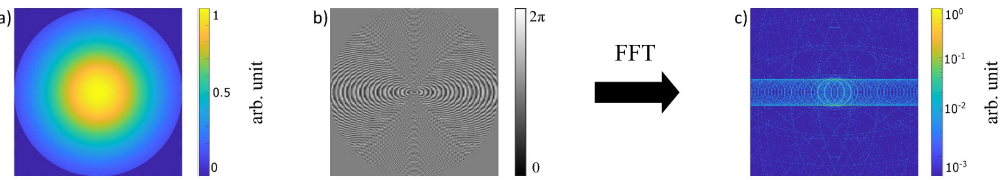
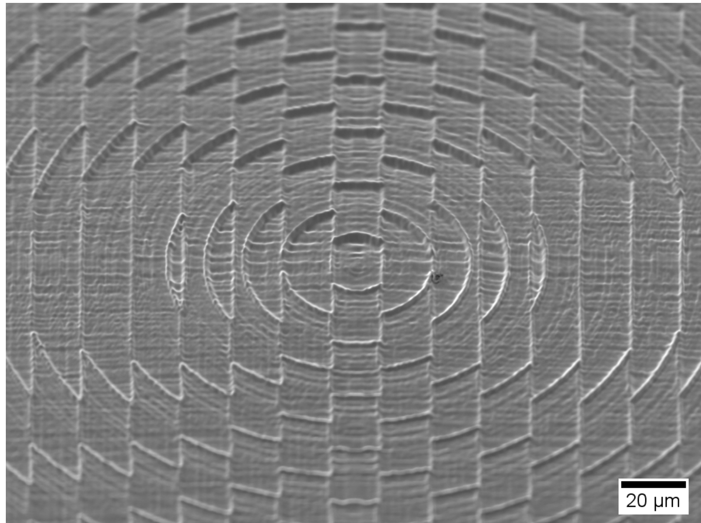
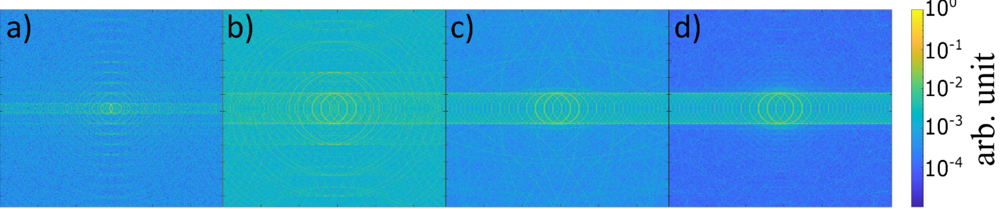
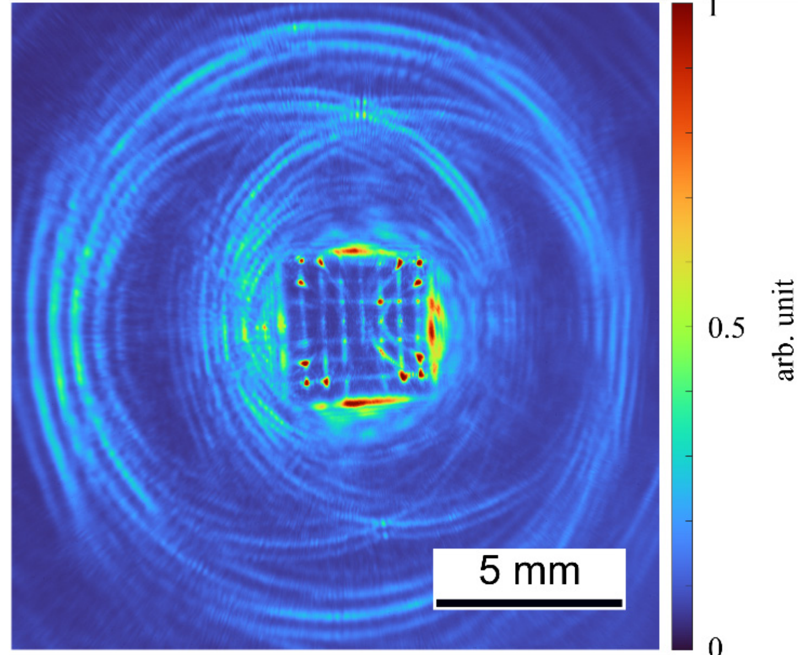
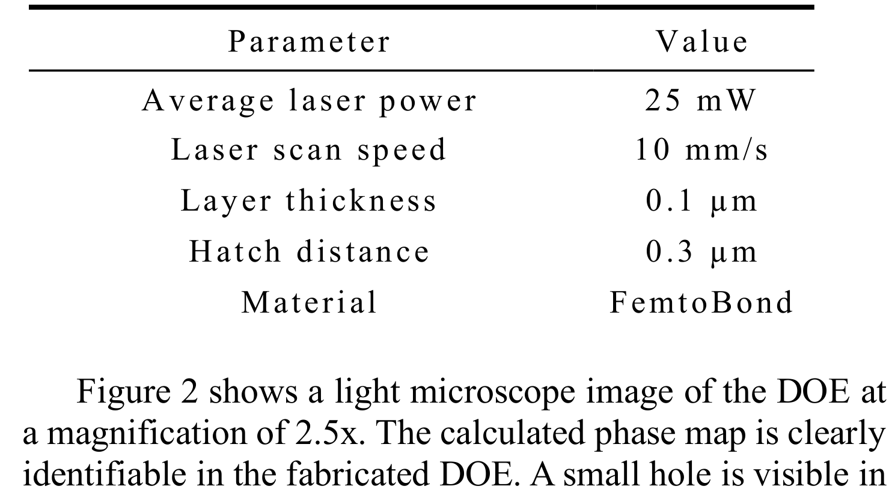
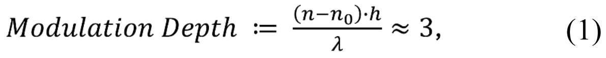
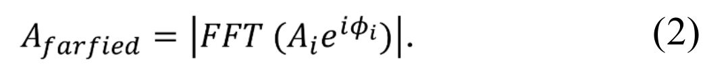
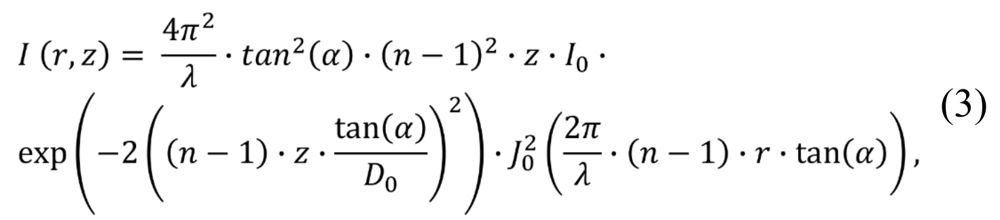

## Unknown2025diffractive — 用于材料加工光束整形的双光子聚合毫米级衍射光学元件

## 📄 元数据
Behlau, Marx, Zimmermann, Thüsing, Albini, Esen, Ostendorf，2025，Journal of Laser Micro/Nanoengineering, Vol. 20 No. 3，DOI: 10.2961/jlmn.2025.03.2008
## 💡 一句话
用双光子聚合（2PP）拼接制造出直径 3.5 mm 的衍射光学元件（DOE），将高斯光束整形为双环形（近场双贝塞尔）光束，并验证其可承受 22.8 W 平均功率 / 24.8 GW/cm² 峰值功率密度的飞秒激光辐照。

## 🔗 Wiki 双链
  - 年度 [[../write/2025]]
  - 项目 [[../projects/project-1-two-photon]]
  - 相关论文 [[../../raw/note/Unknown2025diffractive]]
  - 概念：[[../concepts/beam-shaping|光束整形]]、[[../concepts/diffractive-optical-element|衍射光学元件 DOE]]、[[../concepts/two-photon-polymerization|双光子聚合 2PP]]、[[../concepts/computer-generated-hologram|计算机生成全息图 CGH]]、[[../concepts/bessel-beam|贝塞尔光束]]、[[../concepts/axicon|轴锥镜]]、[[../concepts/staircase-effect|阶梯效应]]、[[../concepts/laser-damage-threshold|激光损伤阈值]]、[[../concepts/stitching|拼接技术]]、[[../concepts/nonlinear-absorption|非线性吸收]]、[[../concepts/FemtoBond-4B|FemtoBond 4B 光刻胶]]

## 📊 关键图表
  -  -> [[../figures/optical-spectra|光学与吸收光谱]]
    - **图示描述**：图1三联图展示 DOE 的设计输入与理论输出：(a) 全息平面上直径 3.5 mm（1/e²）的高斯入射振幅分布；(b) 由棱镜-轴锥镜算法算出的 5833×5833 像素、像素尺寸 600 nm 的 CGH 灰度相位图，呈同心环与干涉条纹交织图案；(c) 对输入振幅 Aᵢ 与相位 φᵢ 做 FFT 得到的远场振幅，可见两个主环形光束及外围较弱的高阶衍射环。
    - **关键特征**：CGH 将传统棱镜-透镜算法中的透镜项替换为 6° 轴锥镜项，从而把高斯光束同时整形成一对相邻环形光束（近场对应两个贝塞尔光束）；灰度像素映射为 2–6.4 μm 的表面高度，对应 4.4 μm 调制深度与 6π 相位差；外围次级环强度越低代表衍射效率越高，是后续实验验证的基准。
    - **结论/意义**：该图完整定义了 DOE 的光学功能，是图5 实测双环轮廓的理论对照。
  -  -> [[../figures/experimental-setups|实验测试与测量装置]]
    - **图示描述**：2.5 倍光学显微镜下整个直径 3.5 mm DOE 的俯视图，宏观相位图样与图1(b) 计算结果一一对应；左上角可见一个较大孔洞，各 500 μm×500 μm 拼接方块的角落也散布小孔。
    - **关键特征**：左上角孔疑为涂胶前玻璃基板上的灰尘颗粒所致；拼接区角落孔可能源于切片算法计算误差；作者引用前期工作指出这类微孔对光束整形影响可忽略；7×7 拼接网格边界在图中隐约可辨，证明大面积拼接策略成功落地。
    - **结论/意义**：从宏观尺度证明 CGH 设计被准确转写为物理元件，同时坦诚暴露了 2PP 大尺寸制造中的典型缺陷来源。
  -  -> [[../figures/experimental-setups|实验测试与测量装置]]
    - **图示描述**：DOE 中心区域 45° 倾角、1000 倍 SEM 图像，展示由不同像素高度形成的三维表面浮雕。
    - **关键特征**：单个像素的高度台阶清晰可见，总调制深度 4.4 μm；表面呈现明显阶梯效应（staircase effect）与较高粗糙度；根源在于选用 NA=0.8 的 20× 物镜以换取 500 μm 大视场，其分辨率低于高 NA 物镜；最小像素高度保留 2 μm 基底作为误差容限。
    - **结论/意义**：微观形貌解释了图4 中高阶衍射环的成因，把"物镜 NA—视场—表面质量"三者的工程权衡可视化。
  -  -> [[../figures/optical-spectra|光学与吸收光谱]]
    - **图示描述**：四幅 FFT 远场模拟图，比较灰度离散化层数变化对衍射图样的影响：(a) 2 层/4.4 μm 近似二值相位；(b) 10 层/1.5 μm；(c) 45 层/100 nm（本实验实际参数）；(d) 255 层/17 nm（近理想连续相位）。
    - **关键特征**：(a) 中代表 −1 级的最小圆环强度与主环相当，杂散光最严重；随层数增加、层高减小，轴锥镜同心光栅引入的高阶衍射环逐步减弱；(c) 45 层时高阶环已不占主导，光束轮廓接近设计；(d) 255 层伪影基本消失但制造时间不可接受。
    - **结论/意义**：定量给出"层高—衍射效率—打印时间"的权衡曲线，为选用 0.1 μm 层厚、45 层、68.5 h 完工的工艺参数提供理论依据。
  -  -> [[../figures/optical-spectra|光学与吸收光谱]]
    - **图示描述**：在 DOE 后 51 mm 处用光束相机（LaserCam-HR II）捕获、再由 AutoStitch 拼接而成的实测远场强度图；两个直径约 10 mm 的环形光束相交，交叠区内可见 DOE 的方形轮廓。
    - **关键特征**：每个环并非单环，而是由间距约 600 μm 的多个细环组成，是衍射法生成环形光束的典型现象；拼接方块角落的亮点对应图2 的微孔衍射；外围一个更大的包围环可能源于 6π 调制深度未完美匹配；因采用线性坐标而非图1(c) 的对数坐标，更暗的高阶环不可见；实验未直接测近场贝塞尔光束（计算焦斑直径约 8 μm，最高强度位于 12 mm 处），因为其尺寸与相机像素相当且相机无法置于焦距位置。
    - **结论/意义**：实测双环与图1(c) 模拟高度吻合，是 DOE 光束整形功能最直接的实验证据。
  -  -> [[../figures/experimental-setups|实验测试与测量装置]]
    - **图示描述**：表1 汇总 DOE 制造所用的 2PP 关键工艺参数。
    - **关键特征**：平均激光功率 25 mW；扫描速度 10 mm/s；层厚 0.1 μm（对应 45 层）；填充间距（hatch）0.3 μm；光刻胶材料为 FemtoBond 4B；配合 Ti:Sa 激光器（780 nm、100 fs、82 MHz）与 20×/NA 0.8 物镜，总制造时长 68.5 h。
    - **结论/意义**：这组参数是后续工艺优化与复用的基准数据，也是图4 中"45 层/100 nm"工况的实物来源。
  -  -> [[../figures/mathematical-models|数学模型与物理公式]]
    - **图示描述**：公式1 给出 DOE 表面结构高度 h 与所产生相位差 Δφ 的关系：Δφ = (2π/λ)·h·(n−n₀)。
    - **关键特征**：λ = 800 nm 为设计波长；n = 1.55 为固化后 FemtoBond 4B 的折射率；n₀ ≈ 1 为空气折射率；取 h = 4.4 μm 得 Δφ = 6π；该调制深度是衍射效率（越大越好）与打印时间（越小越好）的折衷。
    - **结论/意义**：把 CGH 灰度值定量化为物理浮雕高度，是连接"相位设计—STL 几何"的核心换算式。
  -  -> [[../figures/mathematical-models|数学模型与物理公式]]
    - **图示描述**：公式2 表明 DOE 远场振幅 A 由全息平面输入振幅 Aᵢ 与输入相位 φᵢ 的快速傅里叶变换（FFT）计算得到。
    - **关键特征**：仿真直接复现图1(c) 与图4 各子图；可在不打印实物的前提下预测主环位置、强度以及高阶衍射杂散光；是把离散层数（阶梯效应）映射为远场光斑质量的工具。
    - **结论/意义**：为 DOE 设计阶段的参数扫描和图5 实验结果的比对提供了统一的数值框架。
  -  -> [[../figures/mathematical-models|数学模型与物理公式]]
    - **图示描述**：公式3 给出轴锥镜后横向空间强度分布，其中 I₀ 为轴上强度，J₀ 为零阶贝塞尔函数，即理想贝塞尔光束的横向剖面。
    - **关键特征**：按文中参数（6° 轴锥角、800 nm 波长、n=1.55）计算的焦斑直径约 8 μm；轴上最高强度出现在距 DOE 约 12 mm 处；贝塞尔光束具有无衍射和自愈特性，但因焦斑尺寸与相机像素相当，实验只在 51 mm 远场表征环形光束。
    - **结论/意义**：把"远场环形"与"近场贝塞尔"两种表现联系起来，支撑 DOE 用于精密钻孔等长焦深应用的物理依据。

## 🔬 项目连接
  - **project-1 双光子 — strong（强相关）**：本文是一篇 2PP 制造应用论文，对双光子项目有直接参考价值：
    1. 提供了完整的 2PP 工艺参数窗口（激光功率 25 mW、扫描速度 10 mm/s、层厚 0.1 μm、填充间距 0.3 μm），可作为工艺优化的基准数据；
    2. 使用的光刻胶 FemtoBond 4B 为有机-无机杂化材料，文中讨论了光引发剂导致的淡黄色着色与激光吸收/损伤阈值的关系，并明确指出更换或去除光引发剂是未来提升损伤阈值的途径——这与双光子引发剂的分子设计直接相关；
    3. 论文展示了 2PP 技术的一个高端应用场景（高功率激光微光学元件），为引发剂性能需求（透明度、热稳定性、抗激光损伤）提供了应用导向的指标；
    4. 后处理方向（煅烧去除有机组分、高温退火、ALD 涂层）对理解杂化光刻胶中有机/无机组分分工有参考价值。
  - project-2 至 project-7：无直接项目连接（本文不涉及 Mn 多铁、机械发光 NN、TTF 分子计算、SnTe 铁电模拟、湿度传感或 CDW）。

## 🔗 项目双链
- 项目 [[../projects/project-1-two-photon|项目一：双光固化和双光发光]]

## 📝 组织与用词
  文章遵循经典工程研究逻辑"设计→制造→表征→验证"：
  1. 引言提出传统 DOE 制造痛点和 2PP 的尺寸瓶颈；
  2. 第二节描述 CGH 计算（改进棱镜-透镜算法，替换为轴锥镜项）和灰度-高度-STL 转换；
  3. 第三节详述 2PP 制造，重点是 7×7 拼接策略和三点倾斜校正这两个解决大尺寸制造的关键工程手段；
  4. 第四节用光束分析仪验证远场双环输出，并坦承缺陷来源；
  5. 第五节损伤阈值测试是全文最具应用价值的数据；
  6. 第六节结论与展望。
  全文贯穿"制造效率—表面质量—光学性能"三维权衡主线。

  值得复用的关键词/术语：
  - 光束整形 [[../concepts/beam-shaping|光束整形]] (beam shaping)
  - 衍射光学元件 (diffractive optical element, DOE)
  - 双光子聚合 [[../concepts/two-photon-polymerization|双光子聚合]] (two-photon polymerization, 2PP)
  - 计算机生成全息图 (computer-generated hologram, CGH)
  - 轴锥镜 [[../concepts/axicon|轴锥镜]] (axicon)
  - 贝塞尔光束 [[../concepts/bessel-beam|贝塞尔光束]] (Bessel beam)
  - 阶梯效应 [[../concepts/staircase-effect|阶梯效应]] (staircase effect)
  - 拼接 (stitching)
  - 调制深度 (modulation depth)
  - 损伤阈值 (damage threshold)

## ✏️ 可写入 Wiki 的要点
  1. **DOE 几何参数**：直径 3.5 mm，最大结构高度 6.4 μm，最小高度（基底）2 μm，有效调制深度 h = 4.4 μm；光刻胶[[../concepts/refractive-index|折射率]] n = 1.55（800 nm 波长下），对应相位调制量 Δφ = 6π。
  2. **CGH 算法改进**：在 Liesener 等人的棱镜-透镜算法基础上，将轴向聚焦的"透镜项"替换为"[[../concepts/axicon|轴锥镜]]项"（axicon hologram），轴锥镜角度设为 6°，从而将高斯光束直接转换为贝塞尔/环形光束；CGH 矩阵 5833×5833 像素，像素尺寸 600 nm。
  3. **调制深度公式**：Δφ = (2π/λ)·h·(n−n₀)，其中 λ = 800 nm，n = 1.55，n₀ ≈ 1；选择 6π 而非更大调制深度是衍射效率与打印时间的折中。
  4. **远场模拟方法**：远场振幅 A 通过输入振幅 Aᵢ 与相位 φᵢ 的快速傅里叶变换（FFT）计算得到，用于预测双环形光束和高阶衍射环。
  5. **2PP 拼接制造**：物镜 FOV 仅 500 μm × 500 μm（20×, NA = 0.8），将 STL 分割为 7×7 = 49 块逐块逐层打印；通过在玻璃基板上测三点拟合倾斜平面，对每块的 Z 起始位置做动态补偿（倾斜校正），消除了 3.5 mm 范围内数微米的垂直度误差。
  6. **工艺参数**：平均激光功率 25 mW，扫描速度 10 mm/s，层厚 0.1 μm（45 层），填充间距 0.3 μm，材料 FemtoBond 4B，总耗时 68.5 h；光源为 Ti:Sa 激光器（780 nm, 100 fs, 82 MHz）。
  7. **层高对衍射质量的影响（图4模拟）**：2 层（4.4 μm 层高）时 −1 级衍射环强度接近主环；10 层（1.5 μm）时高阶环减弱；45 层（100 nm，实际参数）时高阶环已不占主导；255 层（17 nm）时伪影基本消失但制造时间不可接受。
  8. **实测光束轮廓**：在 DOE 后 51 mm 处用光束相机捕获直径约 10 mm 的两个相交环形光束；环由多个间距约 600 μm 的细环组成（衍射生成环形光束的典型现象）；角落亮点对应拼接区微孔衍射；外环伪影可能源于 6π 调制深度不完美匹配。
  9. **损伤阈值数据**：使用 1030 nm、191 fs、100 kHz 飞秒激光，以 5% 步长每步持续 30 s 升功率；DOE 在 22.8 W 平均功率（228 μJ 脉冲能量）下未损坏，对应峰值功率密度 24.8 GW/cm²、激光能量密度 4.74 mJ/cm²；高阈值归因于 6.4 μm 极薄厚度减少了吸收。
  10. **[[../concepts/bessel-beam|贝塞尔光束]]理论参数**：轴锥镜后轴上强度按零阶贝塞尔函数 J₀ 分布；按文中参数计算焦斑直径约 8 μm，最高强度出现在距 DOE 12 mm 处；因焦斑尺寸与相机像素相当且相机无法置于焦距位置，实验只表征了远场环形光束。
