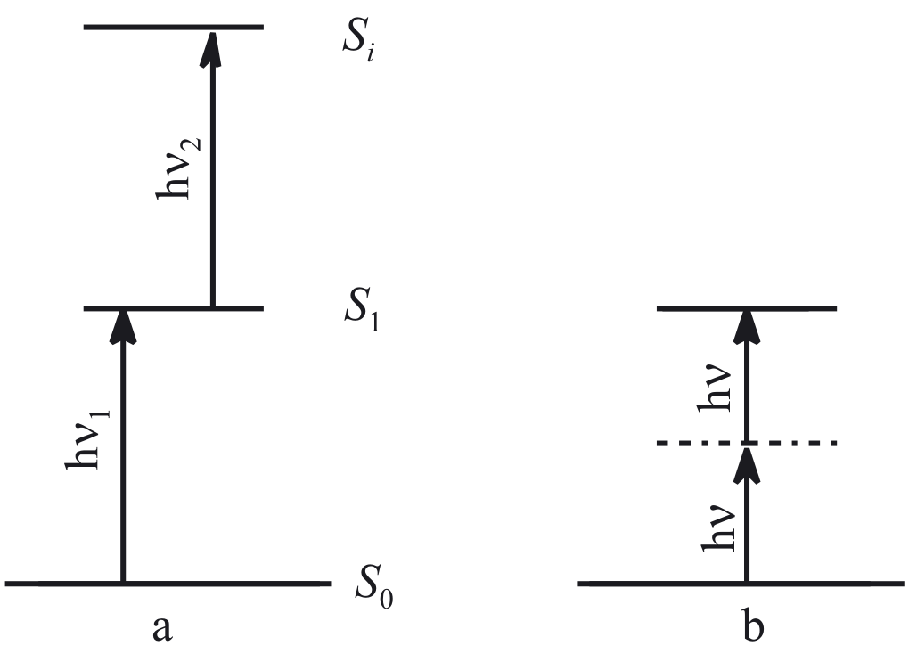
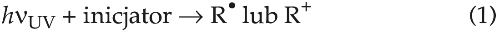

## WRZYSZCZYNSKI2010initiators — 双光子聚合引发剂

## 📄 元数据
Wrzyszczyński A.，2010，*Polimery*，55(3), 167–171，DOI: 10.14314/polimery.2010.167
## 💡 一句话
本文系统综述双光子聚合引发剂的物理机制（顺序/同时双光子吸收）、分子设计准则（D-π-D / D-π-A-π-D / A-π-D-π-A）、代表性化合物类别（二苯乙烯衍生物、噻嗪染料、三苯胺、香豆素/酮香豆素二元体系等）及其在三维微纳加工中的应用优势。
## 🔗 Wiki 双链
本文涉及且 wiki 中已存在的条目：
  - 年度 [[../write/2010-2014|2010]]
  - 项目 [[../projects/project-1-two-photon]]
  - 概念 [[../concepts/two-photon-absorption-cross-section]]、[[../concepts/nonlinear-optics]]
  - 实体 [[../entities/coumarin]]、[[../entities/diphenyliodonium-salt]]、[[../entities/habi]]、[[../entities/femtosecond-laser]]、[[../entities/xanthene-dye]]、[[../entities/thiazine-dye]]、[[../entities/triphenylamine]]
  - 相关论文 [[../../raw/note/WRZYSZCZYNSKI2010initiators]]
  - 概念：
    - [[../concepts/two-photon-absorption|双光子吸收]]
    - [[../concepts/two-photon-polymerization|双光子聚合]]
    - [[../concepts/photoinitiator|光引发剂]]
    - [[../concepts/d-pi-a-architecture]]
    - [[../concepts/two-photon-absorption-cross-section|双光子吸收截面]]
    - [[../concepts/photopolymerization|光聚合]]
    - [[../concepts/photoinduced-electron-transfer|光诱导电子转移]]
    - [[../concepts/exciplex|激基复合物]]
    - [[../concepts/ict-mechanism]]
  - 实体：
    - [[../entities/stilbene|二苯乙烯]]
## 🆕 新概念/实体建议
  - [[../concepts/two-photon-absorption|two-photon-absorption]] — 双光子吸收（TPA），非线性光学过程，分子同时吸收两个低能光子，概率正比于 I₀²
  - [[../concepts/two-photon-polymerization|two-photon-polymerization]] — 双光子聚合（TPP），利用 TPA 在激光焦点 λ³ 体素内引发聚合的真三维微加工技术
  - [[../concepts/photoinitiator|photoinitiator]] — 光引发剂，吸收光能后产生自由基/阳离子引发聚合的化合物
  - [[../concepts/d-pi-a-architecture]] — D-π-A / D-π-D 分子结构，电子给体-共轭桥-电子受体架构，是增大双光子吸收截面的经典设计
  - [[../concepts/two-photon-absorption-cross-section]] — 双光子吸收截面 δ，单位 GM（1 GM = 10⁻⁵⁰ cm⁴·s·photon⁻¹），衡量分子双光子吸收能力
  - [[../concepts/photoinduced-electron-transfer|photoinduced-electron-transfer]] — 光诱导电子转移（PET），二元引发体系中光敏剂与共引发剂之间的电子传递机制
  - [[../concepts/exciplex|exciplex]] — 激基复合物，激发态引发剂与基态单体形成的瞬态复合物，参与自由基生成
  - [[../entities/coumarin|coumarin]] — 香豆素类染料，常用作双光子光敏剂（电子受体），与 DPI/HABI 等共引发剂配合
  - [[../entities/stilbene|stilbene]] — 二苯乙烯类衍生物，D-π-D 型双光子引发剂的经典骨架（化合物 I–V）
  - [[../entities/diphenyliodonium-salt|diphenyliodonium-salt]] — 二苯基碘鎓盐（DPI），碘鎓盐类电子给体共引发剂，接受电子后裂解产生芳基自由基
  - [[../entities/habi|habi]] — 邻氯六苯基双咪唑（HABI），另一类常用电子给体共引发剂
## 📊 关键图表
  -  -> [[../figures/optical-spectra|光学光谱]]
  - **图示描述**：简化的 Jablonski 能级图，纵轴为能量，分子从基态 S₀ 跃迁至更高激发态，对比两条双光子吸收路径——a) 顺序型经真实中间态 S₁，b) 同时型经虚态直接到达 S₁。
  - **关键特征**：
    - 顺序型：先吸收 hν₁ 跃迁至真实中间激发态（如 S₁），该态寿命为 10⁻⁴–10⁻⁹ s，在寿命内再吸收 hν₂ 跃迁至 Sₙ；对光源峰值功率要求较低，传统光源或长寿命三重态即可实现。
    - 同时型：不存在真实中间能级，两光子通过寿命 < 10⁻¹⁵ s 的虚态被同时吸收，需飞秒钛宝石激光器（脉宽约 100 fs，波长约 800 nm）提供极高光子密度。
    - 无论哪种机制，单位时间单位体积内被激发分子数 N ∝ I₀²（单光子为 ∝ I₀），因此吸收被限制在焦点 λ³ 体素内；约 800 nm 的近红外光近似对应 UV 400 nm 单光子能量的两倍。
  - **结论/意义**：该图是理解双光子聚合为何需要飞秒激光、为何能在透明树脂内部实现真三维"体加工"的物理基础。
  -  -> [[../figures/mathematical-models-formulas|光学、输运与其他解析公式]]
  - **图示描述**：对比两条引发反应方程式——单光子路径为 hν(UV) + 引发剂 → R· 或 R⁺；双光子路径为 2 hν(NIR) + 引发剂 → R· 或 R⁺，分别对应线性吸收与非线性吸收下活性种（自由基或阳离子）的生成。
  - **关键特征**：
    - 单光子：近紫外光沿光路被线性吸收，固化主要发生在单体/树脂表面，是"面加工"，须逐层叠加。
    - 双光子：两个近红外光子在材料内部焦点处被同时吸收，NIR 区本无引发剂的单光子吸收带，反应严格限制在 λ³ 体素内。
    - 动力学判据不同：双光子聚合速率 ∝ I₀，单光子聚合速率 ∝ I₀⁰·⁵（源于自由基双基终止动力学）；化合物 II 在 λ=355 nm 激发时速率 ∝ I₀⁰·⁵，在 λ=600 nm 激发时 ∝ I₀，实验上印证了两种机制。
  - **结论/意义**：这组方程式从反应工程层面把 TPA 的非线性光强依赖转化为可测量的聚合速率幂次，为区分单/双光子机制和论证三维加工优势提供了直接依据。
## 🔬 项目连接
  - **project-1（双光固化和双光发光）— core**：本文是双光子聚合引发剂的专题综述，直接命中项目核心。参考价值包括：（1）完整阐述了 TPA 的两种物理机制（顺序 vs 同时）及 I₀² 光强依赖，是理解双光固化非线性空间选择性的基础；（2）总结了增大 δ 的三大分子设计策略——延长 π 共轭、平面化发色团、增强 D/A 推拉电子能力，可直接指导项目中引发剂分子的筛选与设计；（3）分类梳理了二苯乙烯衍生物、噻嗪染料、三苯胺、香豆素/酮香豆素+DPI/HABI 二元体系等主流引发剂，给出了具体 δ 值（如化合物 II 达 210 GM，为母体 E-二苯乙烯的 20 倍）和引发机理（激基复合物、α-H 质子转移、PET）；（4）指出光物理（大 δ）与光化学（高自由基量子产率）必须兼顾，二苯胺基衍生物虽 δ 大但因缺 α-H 而引发效率低，这一权衡对配方设计有直接指导意义；（5）双光子聚合速率 ∝ I₀（单光子为 ∝ I₀⁰·⁵）这一动力学判据可用于实验上验证双光子机制。
  - 其他项目无直接连接。
## 🔗 项目双链
- 项目 [[../projects/project-1-two-photon|项目一：双光固化和双光发光]]

## 📝 组织与用词
文章按"物理原理 → 系统要求 → 分子设计 → 化合物分类 → 应用优势"的综述逻辑展开，先建立 TPA 非线性吸收的物理图像（Jablonski 图、GM 单位、λ³ 体素），再过渡到聚合反应工程（单/双光子速率方程对比），主体按化学结构分类逐一介绍引发剂，最后总结四大技术优势。值得复用的术语：
  - 双光子吸收（[[../concepts/two-photon-absorption|two-photon absorption]], TPA / dwufotonowa absorpcja）
  - 双光子吸收截面（[[../concepts/two-photon-absorption-cross-section|two-photon cross section]], δ, 单位 GM）
  - 顺序吸收 / 同时吸收（sequential / simultaneous absorption）
  - 虚态（[[../concepts/virtual-state|virtual state]], stan wirtualny）
  - 体素（[[../concepts/voxel|voxel]], objętość λ³）
  - 给体-π-受体（[[../concepts/d-pi-a-architecture]], D-π-D / D-π-A-π-D）
  - 激基复合物（[[../concepts/exciplex|exciplex]], ekscipleks）
  - 共引发剂（co-initiator, koinicjator）
  - 光诱导电子转移（[[../concepts/photoinduced-electron-transfer|photoinduced electron transfer]], PET）
  - 近红外（near-infrared, NIR, bliska podczerwień）
## ✏️ 可写入 Wiki 的要点
  1. [[../concepts/two-photon-absorption|双光子吸收]]由 Göppert-Mayer 于 1931 年理论预言，1961 年由 Kaiser 和 Garret 实验证实；截面单位 GM = 10⁻⁵⁰ cm⁴·s·photon⁻¹。
  2. TPA 有两种机制：顺序型（经真实中间激发态，寿命 10⁻⁴–10⁻⁹ s）和同时型（经寿命 < 10⁻¹⁵ s 的虚态，需飞秒钛宝石激光器，~100 fs 脉冲，~800 nm 波长）。
  3. [[../concepts/two-photon-excitation|双光子激发]]粒子数 ∝ I₀²，单光子 ∝ I₀；因此 TPA 被限制在激光焦点 λ³ 体素内，实现真三维加工。[[../concepts/two-photon-polymerization|双光子聚合]]速率 ∝ I₀，单光子聚合速率 ∝ I₀⁰·⁵（源于自由基链终止动力学）。
  4. 高效双光子引发剂需同时满足：δ > 10⁻⁵⁰ cm⁴·s·photon⁻¹（即 > 1 GM，实际高效体系可达数百 GM），且能高效产生活性自由基/离子。
  5. Cumpston、Albota 等证明 D-π-D、D-π-A-π-D、A-π-D-π-A 结构分子 δ 可达约 1250 × 10⁻⁵⁰ cm⁴·s·photon⁻¹；增大 δ 的三大策略：延长 π 共轭链（引入苯撑乙烯基）、烯烃桥锁定平面构型、增强给/受电子基团。
  6. 化合物 II（2-4,4'-双(二正丁氨基)-E-[[../entities/stilbene|二苯乙烯]]）δ = 210 GM，是母体 E-二苯乙烯（I）的 20 倍，源于末端氨基到 π 核心的对称[[../concepts/charge-transfer|电荷转移]]；其引发丙烯酸酯聚合遵循自由基机理，λ=355 nm 单光子激发时速率 ∝ I₀⁰·⁵，λ=600 nm 双光子激发时 ∝ I₀。
  7. D-π-D 二苯乙烯衍生物的引发机理：双光子吸收后发生[[../concepts/ict-mechanism]]，与单体形成[[../concepts/exciplex|激基复合物]]，经 α-碳（相对 N）脱质子产生自由基；末端氨基 α-碳上必须有 H，无 α-H 的二苯基氨基衍生物虽 δ 大但只能经电荷复合失活，引发效率极低。
  8. 二元引发体系：香豆素/酮香豆素（电子受体/光敏剂）+ HABI 或 DPI（电子给体/共引发剂）；激发态香豆素从共引发剂夺电子，DPI 接受电子后裂解产生芳基自由基引发聚合；其他体系包括呫吨染料（曙红）+ 胺（N-甲基二乙醇胺、N,N-二甲基-2,6-二异丙基苯胺）。
  9. 双光子聚合四大优势：真三维体加工（无需逐层叠加）、近红外光低损伤/深穿透、氧阻聚仅受单体溶解氧影响（表面氧影响被消除）、亚微米分辨率（突破[[../concepts/diffraction-limit|衍射极限]]）。
  10. 典型应用：三维微纳结构制造（光子晶体、微机械、微针）、三维光学数据存储、生物细胞无损成像；新型近红外高 δ 高量子产率引发剂的合成仍是繁琐漫长的过程。
