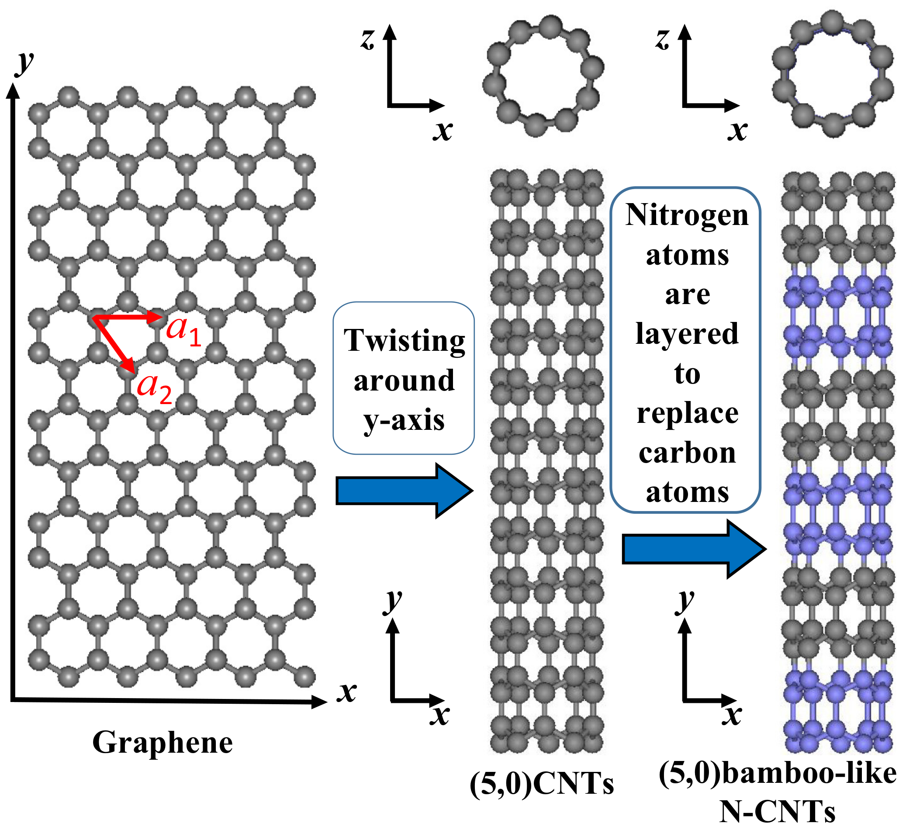
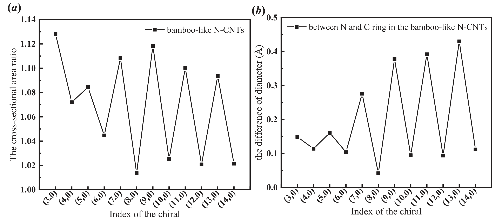
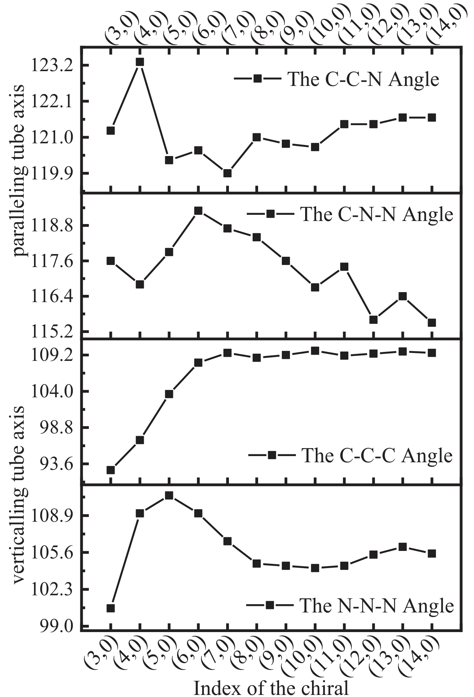
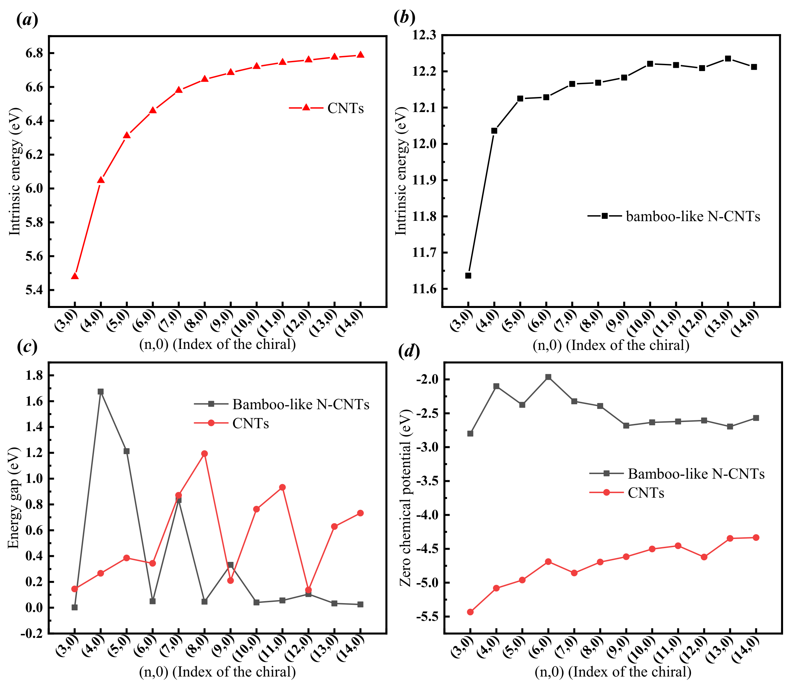
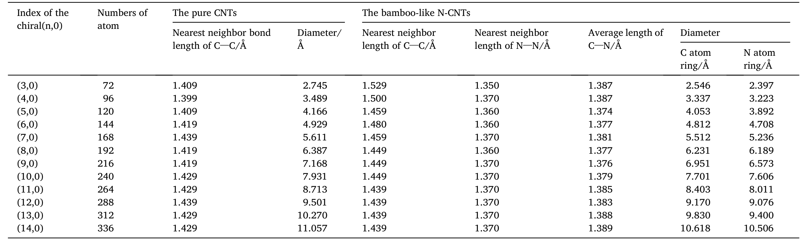

## Wei2021 — 基于DFTB算法的类竹氮碳纳米管的原子模拟

## 📄 元数据
Lina Wei, Dandan Zhao, Jing Li, Junjun Liu, Lin Zhang（张林，通讯作者，东北大学）et al.，2021，*Diamond and Related Materials* 116, 108383，DOI: 10.1016/j.diamond.2021.108383
## 💡 一句话
用 SCC-DFTB 系统模拟了锯齿型 (n,0)（n=3–14）氮/碳原子层交替排列的竹节状氮掺杂碳纳米管，发现氮环向内收缩、几何与能隙的奇偶振荡、大管径管转变为金属性，以及受管径调制的复杂 N→C 电荷转移模式。
## 🔗 Wiki 双链
  - 概念 [[../concepts/density-functional-theory]]
  - 概念 [[../concepts/nitrogen-doping|氮掺杂]]
  - 概念 [[../concepts/mulliken-population|Mülliken布居分析]]
  - 概念 [[../concepts/odd-even-oscillation|奇偶振荡]]
  - 概念 [[../concepts/curvature-effect|曲率效应]]
  - 概念 [[../concepts/charge-transfer|电荷转移]]
  - 概念 [[../concepts/chemical-potential]]
  - 概念 [[../concepts/sp2-sp3-hybridization]]
  - 概念 [[../concepts/dftb]]
  - 实体 [[../entities/DFTB+|DFTB]]
  - 实体 [[../entities/bamboo-like-N-CNTs]]
  - 实体 [[../entities/carbon-nanotube]]
  - 图表 [[../figures/crystal-structures]]
  - 图表 [[../figures/electronic-bands]]
  - 图表 [[../figures/mathematical-models]]
  - 年度 [[../write/2020-2024|2021]]
  - 项目 [[../projects/project-4-ttf-molecular-calc]]
  - 相关论文 [[../../raw/note/Wei2021]]

## 🆕 新概念/实体建议
  - [[../entities/carbon-nanotube]]（entity）：碳纳米管（CNTs），由石墨烯卷成的一维纳米材料，按手性 (n,m) 分类。
  - [[../entities/bamboo-like-N-CNTs|bamboo-like-N-CNTs]]（entity）：竹节状氮掺杂碳纳米管，氮在节点富集、内部隔室化的特殊形貌。
  - [[../entities/DFTB+|DFTB+]]（entity）：德国不来梅大学开发的 SCC-DFTB 计算软件包。
## 📊 关键图表
  - 图1 模型构建：石墨烯→(5,0)纯碳管→氮层替换碳层形成竹节状 N-CNT
     -> [[../figures/crystal-structures-bulk|体相晶体结构]]
    - **图示描述**：展示从标注晶格矢量 a₁、a₂ 的石墨烯片沿 y 轴卷曲成 (5,0) 纯碳管，再以氮原子层（紫色球）替换碳原子层（灰色球）形成竹节状 N-CNT 的完整建模流程。
    - **关键特征**：管轴沿 y 方向，x/z 方向各加 200 Å 真空层以消除周期镜像相互作用；C/N 原子层以 1:1 比例交替排列，构成"竹节"形貌；该模型是后续 12 种 (n=3–14,0) 管几何优化与电子性质计算的原子构型基础。
    - **结论/意义**："层状替换"建模思路是本文核心模型创新，为理解高浓度氮在节点富集的实验现象提供了理想化原子构型。
  - 图2 12 种 (n=3–14,0) 竹节状 N-CNT 的 SCC-DFTB 优化结构（侧视+俯视），紫色 N 环明显内缩
     -> [[../figures/mathematical-models-computational|计算方法与泛函]]
    - **图示描述**：12 种锯齿型竹节状 N-CNT 经 SCC-DFTB 几何优化后的侧视图（上排）与俯视图（下排），按手性指数 n 从 3 到 14 排列。
    - **关键特征**：侧视图中紫色 N 原子环相对灰色 C 原子环明显向管轴收缩，表明 N-N 相互作用强于 C-C；俯视图中随 n 增大管径递增，C 环与 N 环保持同心环状构型；体系原子数从 (3,0) 的 72 个增至 (14,0) 的 336 个，体现 DFTB 处理大体系的能力。
    - **结论/意义**：氮环内缩是全文最直观的几何发现，直接驱动后续对直径差、键角与电荷转移的定量分析。
  - 图3 (a) C/N 环直径差；(b) C/N 环横截面积比，均呈奇偶振荡
     -> [[../figures/crystal-structures-bulk|体相晶体结构]]
    - **图示描述**：(a) N 环与 C 环直径差（单位 Å）随手性指数 n 的变化；(b) C 环与 N 环横截面积比（无量纲）随 n 的变化。
    - **关键特征**：两子图均呈明显奇偶振荡，奇数 n 管（如 3、5、7）的直径差/面积比大于相邻偶数 n 管；(3,0) 管横截面积比最高，氮环相对收缩最剧烈、曲率效应最强；C 环直径线性拟合为 D_C-ring = 0.72829 n + 0.40656 Å。
    - **结论/意义**：将图2的定性"氮收缩"现象量化，并揭示手性奇偶性对结构稳定性的调制作用。
  - 图4 四个键角（C-C-N、C-N-N、C-C-C、N-N-N）随手性指数变化
     -> [[../figures/crystal-structures-bulk|体相晶体结构]]
    - **图示描述**：四个独立键角——C-C-N、C-N-N（平行于管轴的六原子环）与 C-C-C、N-N-N（垂直于管轴）——随手性指数 n 的变化曲线，单位为度 (°)。
    - **关键特征**：C-C-N 均值 121.15°（(4,0) 最大 123.3°），C-N-N 均值 117.325°（(6,0) 最大 119.3°），二者随 n 呈相反趋势，反映 C-N 键随管径增大向内倾；C-C-C 角在 (7,0) 后稳定于 109.5°，呈现 sp³ 杂化特征；N-N-N 角在 (5,0) 达峰值 110.7° 后，于 (8,0) 起稳定在 104.6°；小直径管（n<7）键角畸变剧烈，曲率应力显著。
  - 图5 (a)(b) 纯 CNT 与 N-CNT 本征能；(c) 能隙；(d) 化学势
     -> [[../figures/electronic-bands-band-structures|能带结构与带隙]]
    - **图示描述**：四个子图均随手性指数 n 变化：(a) 纯 CNT 每原子本征能；(b) N-CNT 每原子本征能（eV/atom）；(c) 能隙（eV）；(d) 零化学势（eV）。
    - **关键特征**：N-CNT 本征能约 11.6–12.3 eV/atom，显著高于纯 CNT 的约 5.4–6.8 eV/atom，n=3→5 快速上升后振荡缓增，作者归因于 N 多一个价电子、更易形成 sp³ 键合；(5,0) 纯 CNT 能隙 0.38 eV 与文献值 0.37 eV 吻合，验证方法可靠性；N-CNT 在 n=3、6、8 能隙极小（金属性），n=4、5、7 能隙较宽，n>10 后整体转为金属性，n=5–10 区间奇数 n 能隙高于偶数 n；N-CNT 化学势约 −4.0 至 −2.5 eV，明显高于纯 CNT 约 −5.5 至 −4.5 eV，n>9 后快速下降并趋于平稳，小管径变化尤为剧烈。
    - **结论/意义**：氮掺杂使大管径竹节管整体转为金属性，并提高化学势增强化学活性，为无需精确控制手性即可获得金属性碳管及电催化/传感应用提供理论依据。
  - 图6 纯 CNT 中 C、N-CNT 中 C/N/全部原子的 Mülliken 布居最大-最小差值
     -> [[../figures/mathematical-models-simulations|模拟与数值结果]]
    - **图示描述**：纵轴为最大与最小 Mülliken 电荷之差（单位 e），横轴为手性指数 n；对比纯 CNT 中 C 原子，以及 N-CNT 中 C 原子、N 原子、全部原子四类电荷差。
    - **关键特征**：纯 CNT 中 C 原子电荷差在 (3,0) 最大，n>7 后消失，电荷分布趋于均匀；N-CNT 中 C 原子间电荷差始终存在且小管径振荡明显，表明氮持续扰动碳骨架电荷分布；电荷转移主要发生在 C-N 键上，小管径极化效应最强；大管径时 C-C 与 N-N 原子间布居差趋近，曲率效应减弱。
  - 图7 一个碳环-氮环重复单元内各原子 Mülliken 电荷的颜色编码可视化
     -> [[../figures/mathematical-models-simulations|模拟与数值结果]]
    - **图示描述**：用颜色（黄→橙色表示失电子程度增加）编码一个含两个碳环与两个氮环的重复单元内每个原子的 Mülliken 电荷，直观展示得失电子空间分布。
    - **关键特征**：(3,0) 管中与 C 相连的三个 N 呈黄→橙色明显失电子，相邻 C 得电子；(4,0)/(5,0) 管 N 间电荷差近零，电荷转移主要发生在 C 之间，内部 C 得电子、邻 N 的 C 失电子；(6,0)/(7,0)/(8,0) 管沿管轴 N-N 键上的 N 失电子更多、C-C 键上的 C 得电子更多；(9,0) 管半数 N 失电子、内部 C 得电子；大管径时空间布居模式趋于相似。
    - **结论/意义**：证实电荷转移不仅是局域 N→C，还具有受管径调制的复杂空间依赖性，氮原子附近为电子活性区域，为催化活性位点识别提供原子尺度依据。
  - 表1 锯齿型 (n,0) CNT 与竹节状 N-CNT 的几何参数（原子数、键长、环直径）
     -> [[../figures/crystal-structures-bulk|体相晶体结构]]
    - **图示描述**：列出 n=3–14 共 12 种手性指数下，纯 CNT 与竹节状 N-CNT 的原子数、最近邻 C-C/N-N 键长、平均 C-N 键长、C/N 环直径等几何参数。
    - **关键特征**：纯 CNT 最近邻 C-C 键长约 1.4 Å，直径拟合 D = 0.75688 n + 0.39712 Å（与文献 Zolyomi & Kurti 的 D = 0.77037 n + 0.17441 Å 略有差异）；N-CNT 中 N-N 键长在 ~1.37 Å 附近小幅波动，C-N 平均键长约 1.380 Å，(5,0) 管最短为 1.374 Å；所有 N-CNT 的 N 环直径均小于 C 环直径及同手性纯 CNT 直径，从数据上印证氮环收缩。

## 🔬 项目连接
  - **project-4（TTF 分子计算）— weak**：本文无材料或物理体系重叠，但在**计算电荷转移的方法学**上有参考价值：(1) 使用 SCC-DFTB 处理含数百原子（72–336 原子）体系的几何优化流程，可作为大尺度分子/低维体系电子结构计算的方法备选；(2) 系统给出 Mülliken 布居分析的完整公式链（LCAO 系数+重叠积分→原子/轨道电荷→重叠电荷），其电荷转移定量分析框架可迁移到 TTF 类给体-受体分子体系的电荷转移表征；(3) 用化学势/能隙趋势关联反应活性的思路，对分子晶体的电子性质分析有方法类比意义。注意本文 DFTB 半经验参数未对 C-N 电荷转移做 DFT 基准，方法迁移时需验证。
  - project-1（双光子）、project-2（Mn 多铁）、project-3（机械发光 NN）、project-5（SnTe 铁电模拟）、project-6（湿度传感器）、project-7（CDW）：无直接项目连接（不涉及铁电/多铁/CDW/双光子/机械发光机理；SnTe 项目虽属计算电子结构，但本文为碳管 DFTB 研究，无 Berry 相/极化/铁电物理可类比；电化学传感被提及但非湿度传感）。
## 🔗 项目双链
- 项目 [[../projects/project-4-ttf-molecular-calc|项目四：lsl老师的ttf分子计算]]

## 📝 组织与用词
文章遵循典型计算材料学范式——"实验背景与理论缺口 → SCC-DFTB 方法与公式（式1–12）→ 模型构建（C/N 层 1:1 交替，x/z 方向 200 Å 真空层）→ 几何结构 3.1 → 能量与电子性质 3.2 → Mülliken 电荷 3.3 → 结论与应用展望"，每一节均以手性指数 n=3–14 为主线串联数据，并反复将纯 CNT 与 N-CNT 对照。值得复用的术语：
  - bamboo-like N-CNTs（竹节状氮掺杂碳纳米管）
  - zigzag (n,0) chiral index（锯齿型手性指数）
  - SCC-DFTB, self-consistent-charge DFTB（自洽电荷密度泛函紧束缚）
  - Mülliken population / charge transfer（Mülliken 布居 / 电荷转移）
  - intrinsic energy per atom（每原子本征能）
  - energy gap, HOMO–LUMO gap（能隙）
  - chemical potential / zero chemical potential（化学势 / 零化学势）
  - [[../concepts/odd-even-oscillation|odd-even oscillation]]（奇偶振荡）
  - [[../concepts/curvature-effect|curvature effect]]（曲率效应）
  - sp²/sp³ hybridization coexistence（sp²/sp³ 杂化共存）
  - [[../concepts/bamboo-like-N-CNTs|bamboo-like-N-CNTs]]
  - [[../concepts/mulliken-population|mulliken-population]]
  - [[../entities/DFTB+|dftb]]
## ✏️ 可写入 Wiki 的要点
  1. **模型与计算设置**：锯齿型 (n,0) n=3–14 共 12 种竹节状 N-CNT，以碳原子层与氮原子层 1:1 交替替换构建；管轴沿 y，x/z 方向加 200 Å 真空层消除周期镜像；用 DFTB+ 做 SCC-DFTB 几何优化；原子数从 (3,0) 的 72 个到 (14,0) 的 336 个。SCC-DFTB 总能量 E_SCC = Σ_i n_i⟨φ_i|Ĥ0|φ_i⟩ + ½ Σ_{αβ} Δq_α Δq_β γ_{αβ} + E_rep，其中 Δq_α = q_α − q_α⁰。
  2. **氮环内缩几何**：所有 N-CNT 中氮原子环相对碳原子环向管轴收缩；N-N 最近邻键长在 ~1.37 Å 附近小幅波动，C-N 平均键长约 1.380 Å，(5,0) 管最短（1.374 Å）；C 环直径线性拟合为 D_C-ring = 0.72829 n + 0.40656 Å；纯 CNT 直径拟合为 D = 0.75688 n + 0.39712 Å（与文献 Zolyomi & Kurti 的 D=0.77037n+0.17441 略有差异）。
  3. **[[../concepts/odd-even-oscillation|奇偶振荡]]**：N 环与 C 环的直径差、横截面积比均随手性指数 n 呈奇偶振荡，奇数 n 管差值大于相邻偶数 n 管；(3,0) 管横截面积比最高，氮环相对收缩最剧烈，[[../concepts/curvature-effect|曲率效应]]最强。
  4. **键角与杂化**：C-C-N 与 C-N-N 均值分别为 121.15° 和 117.325°，二者随 n 呈相反变化趋势（C-N 键随管径增大向内倾）；C-C-C 角在 n≥7 后稳定于 109.5°（sp³ 特征）；N-N-N 角在 (5,0) 达峰值 110.7° 后于 (8,0) 起稳定在 104.6°；小直径管因高曲率导致键角急剧畸变。
  5. **本征能**：N-CNT 本征能（约 11.6–12.3 eV/atom）显著高于纯 CNT（约 5.4–6.8 eV/atom），n=3→5 快速上升后振荡缓增；作者归因于 N 比 C 多一个价电子、更易形成 sp³ 键合使体系能量升高。本征能定义 E_int = [n_C E(C) + n_N E(N) − E_tot]/N，物理上等价于负的平均结合能；AI 批判指出因 C、N 自由原子能量基准不同，跨纯 CNT/N-CNT 直接比较数值需谨慎，应更关注相对趋势。
  6. **能隙与金属性转变**：(5,0) 纯 CNT 能隙 0.38 eV，与文献值 0.37 eV 吻合，验证了方法可靠性；纯 CNT 在 (7,0)–(8,0)、(10,0)–(11,0)、(13,0)–(14,0) 三对处有较大能隙。N-CNT 在 n=3、6、8 能隙极小（金属性），n=4、5、7 较宽，n>10 再次变小呈金属性；n=5–10 区间奇数 n 能隙高于偶数 n。[[../concepts/nitrogen-doping|氮掺杂]]使大管径竹节管整体转为金属性，与许多纯 CNT 的半导体性形成对比，为无需精确控制手性即可获得金属性碳管提供思路。
  7. **[[../concepts/chemical-potential|化学势]]与活性**：N-CNT 化学势（约 −4.0 至 −2.5 eV）明显高于纯 CNT（约 −5.5 至 −4.5 eV），N 多余电子主要聚集在氮原子附近使其局部化学活性更高，为[[../concepts/electrocatalysis|电催化]]/传感应用提供理论依据；n>9 后化学势快速下降并趋于平稳；小管径化学势变化比大管径剧烈，N-CNT 尤其明显。
  8. **Mülliken [[../concepts/charge-transfer|电荷转移]]的管径依赖**：纯 CNT 中 C 原子间电荷差在 n>7 后消失；N-CNT 中 C 原子间电荷差持续存在且小管径振荡明显，电荷转移主要发生在 C-N 键上。(3,0)：与 C 相连的三个 N 失电子（黄→橙色），相邻 C 得电子；(4,0)/(5,0)：N 间电荷差近零，电荷转移主要发生在 C 之间，内部 C 得电子、邻 N 的 C 失电子；(6,0)/(7,0)/(8,0)：沿管轴 N-N 键上的 N 失电子更多，C-C 键上的 C 得电子更多；(9,0)：半数 N 失电子、内部 C 得电子；大管径时 C-C 与 N-N 原子间布居差趋近，曲率效应减弱。
  9. **方法学价值与局限**：SCC-DFTB 被证明可高效处理数百原子掺杂纳米管体系；Mülliken 分析由 LCAO 轨道系数与重叠积分 S_{Aμ,Bλ} 系统计算（式 3–11），可同时给出原子轨道电荷 n(Aμ)、原子电荷 n(A) 与重叠电荷 n(i,Aμ,Bλ)。局限：模型为理想化 C/N 完美层状交替（实验中氮在节点富集约 23 at.%，分布更随机）；DFTB 参数对 C-N 电荷转移的定量精度未与 DFT 做基准对比；金属性转变缺乏 DOS/能带物理解释；化学势未关联到具体催化描述符（如 [[../concepts/d-band-center|d 带中心]]）；全部为静态 0 K 计算，无温度/[[../concepts/molecular-dynamics|分子动力学]]稳定性验证。
  10. **应用展望**：作者指出竹节状 N-CNT 可用于分子器件、电催化剂、电化学传感器载体，并具光学、耐腐蚀、高效微波吸收剂潜力；AI 进一步建议研究不同掺杂浓度/随机分布、空位缺陷与扶手椅型管、外场（电场/应力/气体吸附）响应、以及生长动力学模拟。
