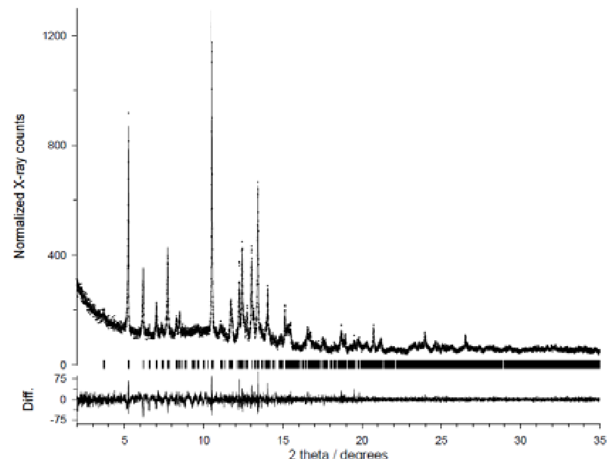
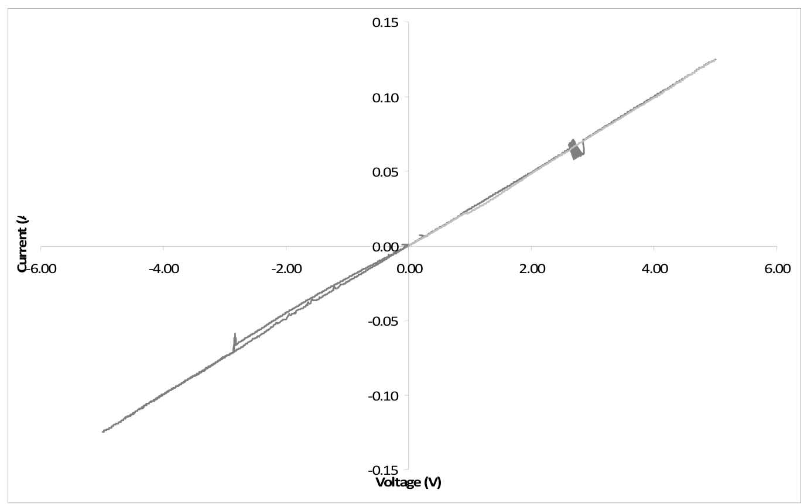

## Wixtrom2011electrical — TTF-CA 电荷转移盐黑色新多晶型的电学与光学性质

- **元数据**：Alex Wixtrom、Jessica Buhler、Silvina Pagola、Tarek M. Abdel-Fattah，2011，ECS Meeting Abstracts（第220届 ECS 会议，摘要 #1834），DOI: 10.1149/MA2011-02/25/1834
- **一句话**：用无溶剂机械化学法首次合成出 TTF-CA 电荷转移盐的黑色三斜新多晶型，解析其混合堆砌晶体结构，并通过循环伏安发现压片几乎无电容、与 ITO 存在接触电阻。
- **现有wiki双链**：
  - 图表 [[../figures/crystal-structures]]
  - 年度 [[../write/2011]]
  - 项目 [[../projects/project-4-ttf-molecular-calc]]
  - 相关论文 [[../../raw/note/Wixtrom2011electrical]]
  - （wiki 中暂无电荷转移盐、TTF-CA、多晶型、机械化学等对应条目，故无概念/实体双链）
- **新概念/实体建议**：
  - `charge-transfer-salt`（概念）：电子给体与受体间发生部分电荷转移形成的分子固体，常具低维电子结构与强关联效应
  - `TTF-CA`（实体）：四硫富瓦烯-四氯苯醌电荷转移盐，研究一维中性-离子相变的经典模型体系
  - `polymorphism`（概念）：同一化学组成形成不同晶体结构（多晶型），物理性质可显著不同
  - `mechanochemical-synthesis`（概念）：以研磨/球磨等机械力驱动无溶剂固-固反应的绿色合成方法
  - `neutral-ionic-transition`（概念）：给体-受体体系中电荷转移度随温度/压力突变的量子相变，伴随二聚化与自旋-Peierls 物理
  - `mixed-stack`（概念）：给体与受体分子交替堆砌的柱状结构，区别于分列堆砌（segregated stack）
  - `tetrathiafulvalene`（实体，TTF）：富硫强电子给体有机分子
  - `chloranil`（实体，CA）：四氯苯醌，醌类强电子受体
  - `ITO`（实体）：氧化铟锡透明导电氧化物，常用电极材料
- **关键图表**：
  - 
  - 
  - 
  - 
- **项目连接**：
  - **project-4（TTF 分子计算）— strong**：本文直接报道 TTF-CA 这一 TTF 基电荷转移盐的新多晶型，并给出完整三斜晶胞参数（a=10.756(5), b=11.057(4), c=6.614(2) Å，α=101.36(2)°, β=93.69(3)°, γ=89.37(3)°, V=769.6(5) ų, Z=2）与混合堆砌结构。对 TTF 分子的 DFT/第一性原理计算而言，这是除经典绿色单斜多晶型之外可直接复用的另一套晶体结构输入，可用于计算电荷转移度 ρ、能带/态密度、介电与光学性质，并对比多晶型依赖的电子结构；机械化学路线也提示如何实验获取亚稳态 TTF 相。
  - **project-2（Mn 多铁）— weak**：TTF-CA 绿色多晶型在 81 K 的中性-离子相变伴随二聚化、自旋-Peierls 物理与铁电性出现，是电荷-晶格-自旋自由度耦合产生多铁性的物理类比对象；但本摘要仅报道黑色多晶型的合成/结构/CV，并未探测 N-I 相变或磁/铁电有序，仅作机理性参照。
  - project-1（双光子）、project-3（机械发光 NN）、project-5（SnTe 铁电模拟）、project-6（湿度传感器）、project-7（CDW）：无直接项目连接。
- **组织与用词**：摘要按"合成策略（机械化学）→ 物相鉴定（粉末 XRD）→ 晶体结构（晶胞参数+堆积图）→ 电学性质（CV）→ 应用推论（集流体/接触电阻）"的典型"合成→结构→性质"链条展开；标题承诺光学性质但正文未给出光学数据，是明显缺口。值得复用的术语：
  - 电荷转移盐（charge transfer salt, CTS）
  - 多晶型（polymorph）
  - 机械化学合成（mechanochemical synthesis）
  - 中性-离子相变（neutral-ionic transition, NIT）
  - 混合堆砌（mixed stack）
  - 循环伏安法（cyclic voltammetry, CV）
  - 接触电阻（contact resistance）
  - 集流体（current collector）
- **可写入wiki的要点**：
  1. 通过无溶剂机械化学法（研磨/球磨）合成了 TTF-CA 的黑色新多晶型，区别于被广泛研究的绿色多晶型；机械化学可获得溶液法无法得到的亚稳态结构/化学计量产物。
  2. 黑色多晶型晶体为三斜晶系，a=10.756(5) Å, b=11.057(4) Å, c=6.614(2) Å, α=101.36(2)°, β=93.69(3)°, γ=89.37(3)°, V=769.6(5) ų, Z=2；XRD 峰尖锐、与理论允许峰位吻合，表明结晶良好、物相纯净。
  3. 结构为 TTF（给体）与 CA（受体）交替的混合堆砌（mixed stack）一维柱，沿柱方向利于电荷转移但易因 Peierls 失稳呈现绝缘基态；黑色外观暗示比绿色相更强的电荷转移吸收或更窄带隙。
  4. 经典绿色 TTF-CA 多晶型在约 81 K 发生中性-离子（N-I）相变，是理解一维 TTF 基电荷转移盐中电荷、自旋、晶格协同调控的原型材料。
  5. TTF 基电荷转移盐普遍具有低维性、强电子-电子与电子-声子相互作用，相图中反铁磁态、绝缘态与超导态相互邻近。
  6. CV 测试在约 -6 V 至 +6 V 范围内电流仅在 -0.15 A 至 +0.15 A 间近似线性变化，无氧化还原峰、无矩形电容响应，表明压片在电化学窗口内惰性、几乎无电容，表现为电阻行为。
  7. 作者将 CV 线性斜率归因于 TTF-CA 圆片与 ITO 电极间的接触电阻，并称该材料可作"合适的电流收集器"；但摘要未提供四探针或交流阻抗证据，本体电阻/晶界电阻贡献未被排除，"导电"定性缺乏直接电导率数据。
  8. 标题包含"Optical Properties"，但摘要正文未给任何光学谱（UV-Vis-NIR、漫反射等）数据，黑色成色机制与电荷转移度 ρ 未被实验确定。
  9. 后续应补充：UV-Vis-NIR 吸收确定带隙与电荷转移度；变温电导率/磁化率探测黑色相是否存在 N-I 相变或磁有序；四探针/阻抗谱分离本体与接触电阻；DSC/变温 XRD 考察黑色相向绿色相的热力学稳定性；基于所解析结构做第一性原理能带计算。
