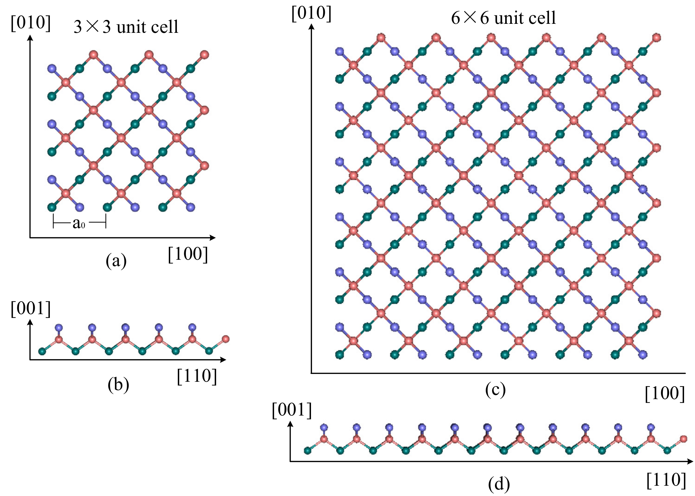
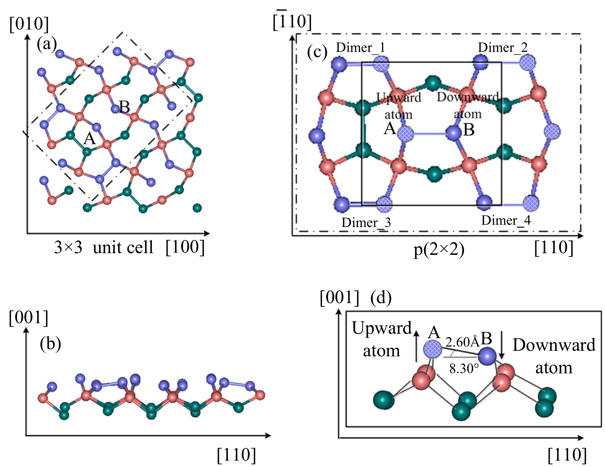
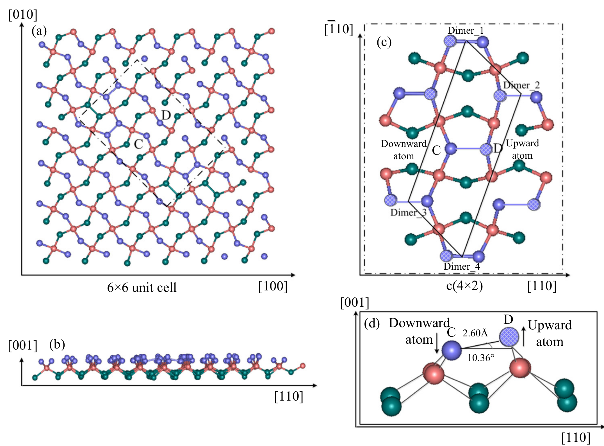
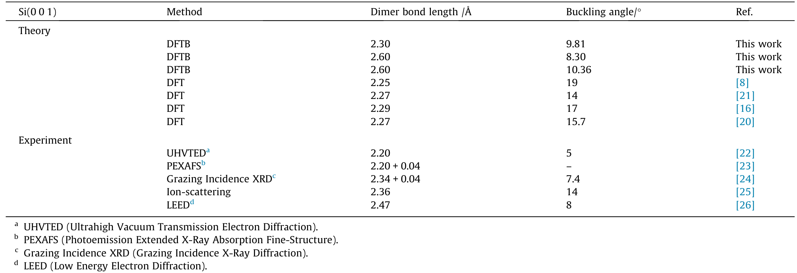
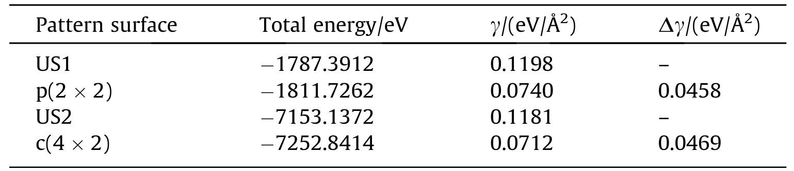
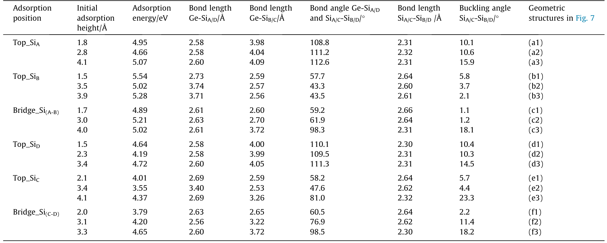
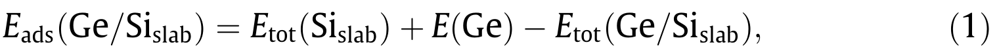

## Wu2018 — 用DFTB方法研究单Ge原子吸附Si(001)表面的原子排列和电荷分布

## 📄 元数据
吴丽君（Lijun Wu）、张林（Lin Zhang）、申龙海（Longhai Shen），2018年，*Applied Surface Science* 447, 22–30，DOI: 10.1016/j.apsusc.2018.03.079
## 💡 一句话
用DFTB方法系统计算了单个Ge原子在Si(001)的p(2×2)和c(4×2)重构表面上的吸附行为，发现Ge优先吸附于二聚体翘起原子的外侧顶位或二聚体桥位，且总是失去电荷，其最终构型与电荷转移模式强烈依赖初始吸附高度和位置。

## 🔗 Wiki 双链
  - 概念 [[../concepts/density-functional-theory]]、[[../concepts/DFTB+|DFTB]]、[[../concepts/surface-reconstruction|表面重构]]、[[../concepts/dimer-buckling|二聚体翘曲]]、[[../concepts/adsorption-energy|吸附能]]、[[../concepts/mulliken-population|Mulliken布居]]、[[../concepts/charge-transfer|电荷转移]]、[[../concepts/slab-model|平板模型]]
  - 实体 [[../entities/Si|硅]]、[[../entities/Ge|锗]]、[[../entities/SiGe|硅锗]]
  - 年度 [[../write/2018]]
  - 相关论文 [[../../raw/note/Wu2018]]

## 📊 关键图表
  - **图1：初始构建的Si(001)平板模型**
  -  -> [[../figures/crystal-structures-bulk|体相晶体结构]]
  - **图示描述**：(a)(c) 为沿[001]方向的俯视图，(b)(d) 为侧视图；绿色球为底层、橙粉色为中间层、紫色为顶层。3×3单胞用于获得p(2×2)重构，6×6单胞用于c(4×2)重构。
  - **关键特征**：平板含3个原子层（约0.272 nm厚），层间真空层宽度265.00 Å；Si块体晶格常数取5.43 Å，DFTB优化得到Si=5.46 Å、Ge=5.71 Å，与实验偏差<1%；底部固定、上部弛豫。
  - **结论/意义**：该模型是后续重构与吸附计算的几何起点，真空层厚度足以消除周期镜像层间相互作用。

  - **图2：p(2×2)重构表面原子结构**
  -  -> [[../figures/crystal-structures-surfaces-defects|表面、缺陷与形貌]]
  - **图示描述**：(a) 顶视图显示顶层原子沿[110]方向成对靠近形成"之"字形二聚体；(b)(c) 侧视图展示二聚体一原子上翘、一原子下陷的不对称排列；(d) 为(c)中打点区域的局部放大，标出SiA（上翘）和SiB（下陷）。
  - **关键特征**：二聚体键长有2.30 Å和2.60 Å两种；短键翘曲角9.81°，长键8.30°；沿[1-10]方向相邻二聚体列翘曲方向呈"同-同-反"交替，形成p(2×2)周期。
  - **结论/意义**：直观验证了DFTB弛豫可复现实验上的p(2×2)不对称二聚体重构，键长与Northrup DFT结果(2.29 Å)吻合，翘曲角更接近实验值(7.4°–8°)。

  - **图3：c(4×2)重构表面原子结构**
  -  -> [[../figures/crystal-structures-surfaces-defects|表面、缺陷与形貌]]
  - **图示描述**：6×6超胞弛豫后的原子排布；(d)为局部放大，标出上翘原子SiD与下陷原子SiC；(b)中可见部分二聚体翘曲方向出现无序。
  - **关键特征**：二聚体翘曲方向沿[1-10]呈"同-反-反-同"排列，即反铁电式c(4×2)图案；SiC-SiD二聚体翘曲角10.36°，略大于p(2×2)中SiA-SiB的8.30°；部分二聚体翘曲方向无序，与实验在真实Si(001)-(2×1)表面观察到的现象一致。
  - **结论/意义**：与图2共同表明DFTB能同时再现两种实验重构，且c(4×2)表面能降幅略大(0.0469 eV/Ų)。

  - **图4：p(2×2)和c(4×2)表面Mulliken电荷布居等高线图**
  -  -> [[../figures/mathematical-models-simulations|模拟与数值结果]]
  - **图示描述**：(a) p(2×2)、(b) c(4×2)重构上表面的Mulliken总布居等高线图；色标范围3.55–4.75，中性Si价电子数为4.00。
  - **关键特征**：绿/黄/红区(>4.00)为得电荷区，对应上翘原子SiA、SiD；浅蓝/深蓝/黑区(<4.00)为失电荷区，对应下陷原子SiB、SiC；p(2×2)得失电荷区沿[1-10]方向呈间隔带状，c(4×2)呈间隔块状；翘曲角越大，二聚体内部电荷转移越明显。
  - **结论/意义**：从电子结构层面证明不对称翘曲伴随电荷从下陷原子向上翘原子转移，为后续Ge吸附电荷分析提供基线。

  - **图5：Ge原子在Si二聚体上的6个初始吸附位置示意图**
  -  -> [[../figures/crystal-structures-surfaces-defects|表面、缺陷与形貌]]
  - **图示描述**：(a) p(2×2)、(b) c(4×2)表面上红色Ge球在Si二聚体上方的初始位置编号1–6。
  - **关键特征**：6个位置分别为Top_SiA(1)、Top_SiB(2)、Bridge_Si(A-B)(3)、Top_SiD(4)、Top_SiC(5)、Bridge_Si(C-D)(6)；顶位分上翘原子(SiA/SiD)和下陷原子(SiB/SiC)两种；Ge与二聚体初始高度h扫描范围1.2–5.4 Å。
  - **结论/意义**：该图把吸附问题参数化为"位置×高度"二维扫描空间，是图6能量曲线和图7稳定构型的输入定义。

  - **图6：吸附能随初始高度h变化曲线**
  -  -> [[../figures/mathematical-models-simulations|模拟与数值结果]]
  - **图示描述**：横轴为初始高度h(Å)，纵轴为吸附能Eads(eV)；(a) p(2×2)、(b) c(4×2)两种表面；黑方块=上翘原子顶位、红圆点=下陷原子顶位、蓝三角=二聚体桥位。
  - **关键特征**：Eads按式(1)定义为正值，越大越稳定；曲线随h呈非单调波动，存在多个局域极大（如p(2×2)上Top_SiA在h=1.8、2.8、4.1 Å处出现4.6–5.2 eV的峰）；p(2×2)最高约5.6 eV、最低约3.8 eV，c(4×2)最高约4.8 eV、最低约3.5 eV；c(4×2)桥位在h=3.3 Å处出现4.65 eV平台峰。
  - **结论/意义**：p(2×2)表面对Ge的吸附整体强于c(4×2)；多峰谷揭示了势能面的多亚稳态结构和初始条件依赖性。

  - **图7：18种稳定Ge吸附几何构型**
  -  -> [[../figures/crystal-structures-surfaces-defects|表面、缺陷与形貌]]
  - **图示描述**：(a1)–(f3)共18个子图，对应表3中三种特征高度下弛豫后的Ge位置；a/b/c为p(2×2)上的Top_SiA、Top_SiB、Bridge_Si(A-B)，d/e/f为c(4×2)上的Top_SiD、Top_SiC、Bridge_Si(C-D)。
  - **关键特征**：Ge最终只稳定在两类位置——二聚体单原子的外侧顶位(outside top)和桥位(bridge)；顶位吸附于上翘Si时Ge–Si距离2.58–2.61 Å、二聚体键长缩至2.31 Å、翘曲角增大；中心桥位时二聚体键长拉长至2.64–2.66 Å、翘曲角仅1.1°–2.2°（近乎对称）；初始高度越高，初始位置影响越小，Ge越易弛豫到全局最优顶位。
  - **结论/意义**：系统证实"顶位增强不对称、桥位抚平二聚体"的几何规律，是表3数据的可视化对应。

  - **图8：Ge原子与二聚体局部Mulliken电荷布居**
  -  -> [[../figures/mathematical-models-simulations|模拟与数值结果]]
  - **图示描述**：与图7(a1)–(f3)一一对应的Ge原子及紧邻Si二聚体区域的Mulliken布居等高线放大图。
  - **关键特征**：所有Ge原子布居数2.57–3.11（<4.00），即Ge总是失电荷；顶位吸附于上翘Si时Ge失电荷最多(布居2.65–2.73)，二聚体恢复"一得一失"模式，上翘原子得、下陷原子失；中心桥位时Ge布居3.04–3.11（失电荷较少），两个Si原子均得电荷(布居4.00–4.29)；偏心桥位偏向下陷Si时Ge布居3.07–3.09、二聚体均得电荷4.25–4.39、翘曲角降至5.7°–5.8°；偏向上翘Si时Ge布居2.57–2.78、翘曲角增大至11.4°–23.3°。
  - **结论/意义**：建立了"吸附几何—电荷转移"的直接对应，是论文机理分析的核心证据。

  - **图9：整个表面Mulliken电荷分布全局图**
  -  -> [[../figures/mathematical-models-simulations|模拟与数值结果]]
  - **图示描述**：与图7、图8一一对应的(a1)–(f3)全局表面电荷等高线图，显示Ge吸附对周边更大范围Si原子电荷重分布的影响。
  - **关键特征**：顶位吸附构型中，紧邻二聚体的表面原子出现明显的得/失电荷分化，与图4清洁表面的条带/块状图案相比发生局部重构；桥位吸附构型中二聚体附近整体呈得电荷区，图案趋于均匀；偏心桥位构型的电荷图案介于顶位与桥位之间。
  - **结论/意义**：把图8的局部电荷分析扩展到整个表面，说明单个Ge吸附的影响不局限于正下方二聚体，会沿二聚体列向外传播。

  - **表1：重构表面二聚体键长与翘曲角**
  -  -> [[../figures/mathematical-models-computational|计算方法与泛函]]
  - **图示描述**：汇总DFTB计算的p(2×2)、c(4×2)重构中二聚体键长和翘曲角，并与Northrup(DFT,17°)、Miwa(DFT,2.27 Å/15.7°)及实验值(7.4°–8°)对比。
  - **关键特征**：键长2.30 Å(短)和2.60 Å(长)；翘曲角9.81°(短键)、8.30°和10.36°(长键两种情形)；DFTB翘曲角整体小于DFT文献值但更接近实验。
  - **结论/意义**：方法学验证表，证明DFTB在该体系结构参数上的可靠性。

  - **表2：未重构与重构表面总能量及表面能**
  -  -> [[../figures/mathematical-models-simulations|模拟与数值结果]]
  - **图示描述**：列出US1/US2（未重构初始平板）与p(2×2)/c(4×2)重构平板的总能量、表面能及能量差Δγ。
  - **关键特征**：块体Si单原子能为−34.2776 eV；p(2×2)重构使表面能降低0.0458 eV/Ų，c(4×2)降低0.0469 eV/Ų；表面能按γ=(E_slab−N·E_bulk)/(2A)计算。
  - **结论/意义**：从热力学上定量证明两种重构相对于理想截断表面更稳定，且c(4×2)略稳定于p(2×2)。

  - **表3：Ge原子稳定吸附构型参数汇总**
  -  -> [[../figures/mathematical-models-simulations|模拟与数值结果]]
  - **图示描述**：论文最核心数据表，列出18种稳定构型的初始高度h、吸附能Eads、Ge–Si距离、二聚体键长、翘曲角及Ge和两个Si原子的Mulliken布居数。
  - **关键特征**：最高吸附能出现在p(2×2)表面Top_SiA、h=4.1 Å构型，Eads=5.07 eV，对应二聚体键长2.31 Å、翘曲角最大；顶位上翘构型Ge布居2.65–2.73；中心桥位构型翘曲角1.1°–2.2°、Ge布居3.04–3.11；偏心桥位偏向上翘Si时翘曲角可达23.3°、Ge布居2.57。
  - **结论/意义**：是图7几何和图8电荷结论的定量来源，支撑"初始条件—最终结构—电荷分布"三元关联。

  - **公式1：吸附能定义**
  -  -> [[../figures/mathematical-models-simulations|模拟与数值结果]]
  - **图示描述**：Eads(Ge/Si_slab) = Etot(Si_slab) + E(Ge) − Etot(Ge/Si_slab)，其中E(Ge)取自S-K文件中Ge的s、p轨道能量之和。
  - **关键特征**：该定义下Eads为正值表示放热吸附，正值越大吸附后体系越稳定；与常见"负值吸附能"约定符号相反，阅读图6和表3时须注意。
  - **结论/意义**：统一了全文吸附能曲线和表格的符号约定，是判读稳定性高低的基础。

## 🔬 项目连接
  - **project-5（SnTe铁电模拟）— weak**：本文展示的平板模型构建流程（3层原子+厚真空层、底部固定+上部弛豫）、表面能计算公式 γ = (E_slab − N·E_bulk)/(2A)、吸附能定义以及Mulliken电荷-结构关联分析方法，对SnTe表面/界面铁电畸变的DFT模拟有方法学参考价值；不对称二聚体的翘曲-电荷转移耦合图像也可类比SnTe中的极性畸变与电荷重分布。但材料体系（Si/Ge vs SnTe）和物理目标（外延吸附 vs 铁电拓扑）差异较大，仅作弱方法参考。
  - project-1/2/3/4/6/7：无直接项目连接。

## 🔗 项目双链

## 📝 组织与用词
  - 文章按"计算细节 → 清洁表面重构（3.1）→ 单Ge原子吸附（3.2）→ 结论"的经典计算表面科学范式组织。先验证基底（p(2×2)/c(4×2)重构的键长、翘曲角、表面能与实验/DFT吻合），再系统扫描Ge的初始位置×初始高度参数空间，最后将几何构型与Mulliken电荷布居逐一对号入座，归纳出"顶位增强不对称、桥位抚平二聚体"的规律。
  - 值得复用的关键词：
    1. 密度泛函紧束缚（DFTB, Density Functional Tight Binding）
    2. 表面重构（Surface reconstruction）— p(2×2)、c(4×2)
    3. 不对称二聚体（Asymmetric dimer）
    4. 翘曲角/屈曲角（Buckling angle）
    5. 吸附能（Adsorption energy, E_ads）
    6. Mulliken总布居（Mulliken gross population）
    7. 顶位吸附/桥位吸附（Top adsorption / Bridge adsorption）
    8. Slater-Koster文件（Slater-Koster files）

## ✏️ 可写入 Wiki 的要点
  1. DFTB用Slater-Koster参数化Si-Si、Ge-Ge、Si-Ge相互作用，优化晶格常数Si=5.46 Å、Ge=5.71 Å，与实验偏差<1%；能量收敛阈值0.0002 eV，最多3000步。
  2. Si(001)表面自发重构为不对称二聚体：键长2.30 Å（短）和2.60 Å（长），翘曲角9.81°（短键）、8.30°和10.36°（长键）；DFTB翘曲角比Northrup(17°)和Miwa(15.7°)的DFT值小，但更接近实验值（7.4°–8°）。
  3. p(2×2)重构（3×3超胞）[[../concepts/dimer-buckling|二聚体翘曲]]方向"同-同-反"交替；c(4×2)重构（6×6超胞）呈"同-反-反-同"排列，且部分二聚体翘曲方向无序（实验中也有观测）。重构使表面能分别降低0.0458和0.0469 eV/Ų。
  4. 电荷分布：p(2×2)表面得失电荷区沿[1–10]方向呈间隔带状分布，c(4×2)呈间隔块状分布；同一二聚体中上翘原子（SiA/SiD）总是得电荷（Mulliken>4.00），下陷原子（SiB/SiC）总是失电荷（<4.00），翘曲角越大[[../concepts/charge-transfer|电荷转移]]越明显。
  5. Ge初始高度h=1.2–5.4 Å，位置6种（Top_SiA/B/D/C、Bridge_Si(A-B)/(C-D)）；p(2×2)表面最高[[../concepts/adsorption-energy|吸附能]]约5.6 eV，c(4×2)约4.8 eV，前者对Ge吸附更强。
  6. Ge最终稳定位置只有两类：二聚体单原子的外侧顶位（outside top）和二聚体桥位（bridge）；初始高度较高时初始位置的影响减小，Ge更易找到全局最优顶位。
  7. 顶位吸附于上翘Si原子时：Ge–Si距离2.58–2.61 Å，二聚体键长缩短至2.31 Å，翘曲角增大；Ge失电荷最多（[[../concepts/mulliken-population|Mulliken布居]]2.65–2.73），二聚体内电荷转移加剧（上翘原子得、下陷原子失）。
  8. 中心桥位吸附时：二聚体键长拉长至2.64–2.66 Å，翘曲角仅1.1°–2.2°（近乎对称），Ge布居3.04–3.11（失电荷较少），两个Si原子均得电荷（4.00–4.29）。
  9. 偏心桥位偏向下方原子时：Ge布居3.07–3.09，二聚体原子均得电荷4.25–4.39，翘曲角降至5.7°–5.8°；偏向上翘原子时：Ge布居2.57–2.78，翘曲角增大至11.4°–23.3°，恢复"一得一失"模式。
  10. 吸附能定义为 E_ads = E_tot(Si_slab) + E(Ge) − E_tot(Ge/Si_slab)，故正值越大越稳定（放热吸附）；表面能 γ = (E_slab − N·E_bulk)/(2A)。
