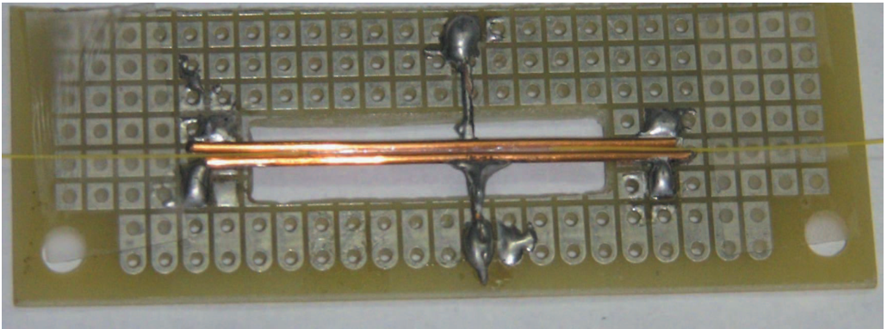
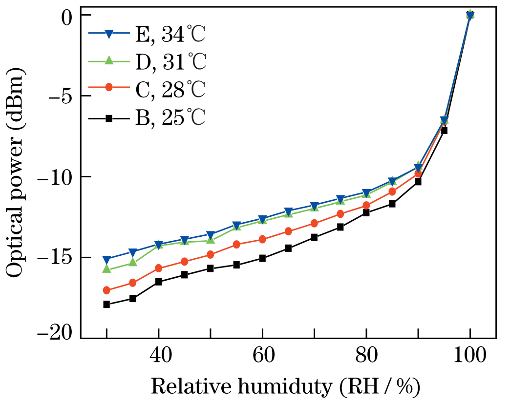
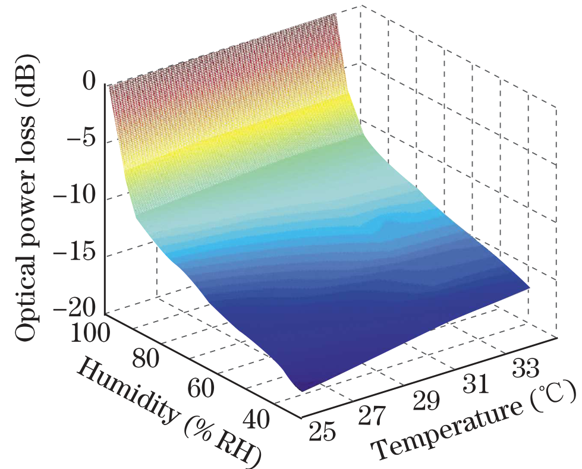
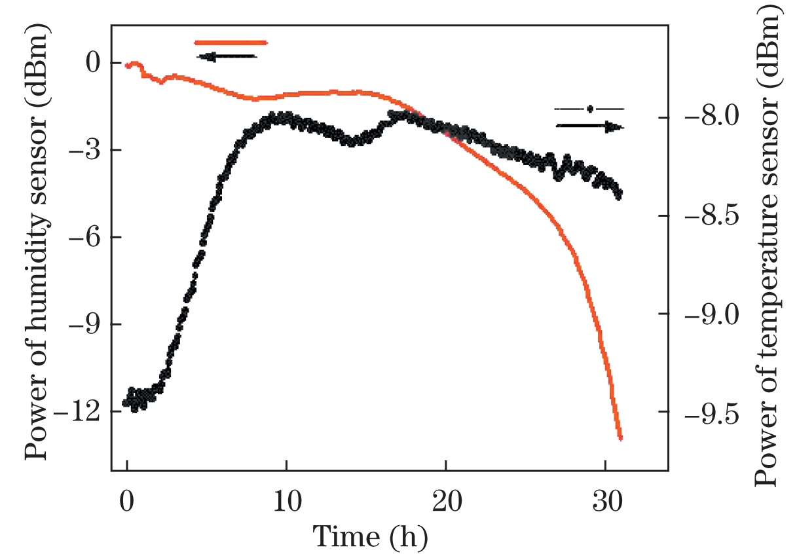
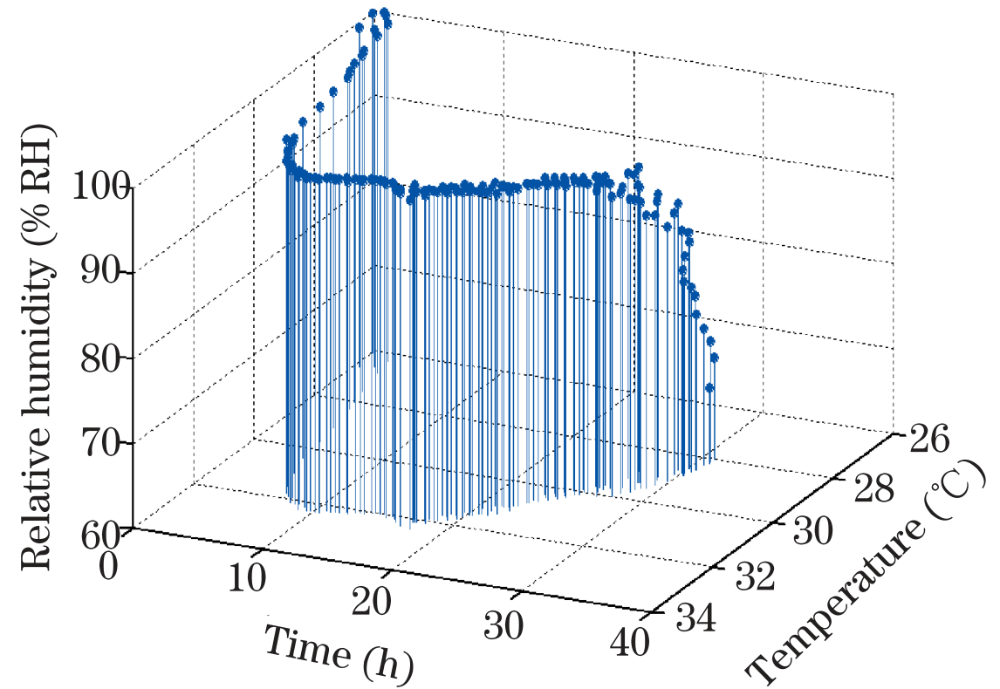
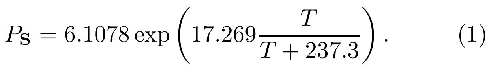
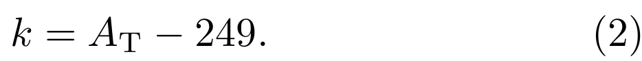
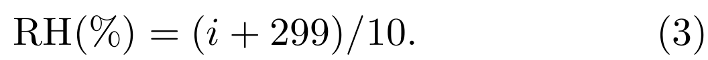

## XiaokangZhang2013calibrating — 光纤湿度传感器的标定及其在新拌混凝土相对湿度实时监测中的应用

## 📄 元数据
Xiaokang Zhang、Zhuoyong Deng、Hanlang Xu，2013，Chinese Optics Letters，10.3788/COL201311.090604
## 💡 一句话
制备了一种琼脂糖涂覆的双层包层单模光纤（DCSMF）湿度传感器，首次系统研究其在 25–34 °C、30–100% RH 范围内的温-湿耦合响应，提出基于查找表/校准矩阵的工程化校准方法，并成功埋入新拌混凝土实现 33 小时内部相对湿度与温度的实时原位监测。

## 🔗 Wiki 双链
  - 概念：[[../concepts/relative-humidity|相对湿度]]、[[../concepts/evanescent-field|倏逝场]]、[[../concepts/evanescent-field-sensing|倏逝场传感]]、[[../concepts/cross-sensitivity|交叉敏感]]、[[../concepts/temperature-compensation|温度补偿]]、[[../concepts/hydrogel-swelling|水凝胶溶胀]]、[[../concepts/lookup-table-calibration|查找表校准]]
  - 实体：[[../entities/agarose|琼脂糖]]、[[../entities/dcsmf|DCSMF 双层包层单模光纤]]、[[../entities/pmma-pvdf-blend|PMMA/PVDF 共混聚合物]]
  - 图表 [[../figures/experimental-setups]]（图1 传感器实物/封装）、[[../figures/optical-spectra]]（图2 光功率损耗-RH 响应曲线）、[[../figures/mathematical-models]]（图3 701×91 校准矩阵）
  - 年度 [[../write/2013]]
  - 项目 [[../projects/project-6-humidity-sensor]]
  - 相关论文 [[../../raw/note/XiaokangZhang2013calibrating]]

## 🆕 新概念/实体建议
  - `figures/response-curves.md` — 建议新增：传感器在多个温度下的"光功率损耗–RH"响应曲线族。
  - `figures/calibration-matrix.md` — 建议新增：温度-RH-损耗三维校准矩阵伪彩色/曲面图。
  - `figures/time-series-monitoring.md` — 建议新增：混凝土硬化过程中 RH 与温度随时间演化的双 Y 轴曲线。

## 📊 关键图表
  -  -> [[../figures/experimental-setups|实验测试与测量装置]]
  - **图示描述**：制备完成的 DCSMF 湿度传感器实物照片。光纤总长约 100 cm，中央约 2 cm 的腐蚀传感区被固定在 7×3×0.2 cm 镂空平板的中央悬空段，两侧各放一根直径 0.9 mm、长 4 cm 的铜线围挡，中段涂覆琼脂糖水凝胶作为外包层。
  - **关键特征**：① 传感区原包层被化学腐蚀部分去除，剩余部分作内包层，琼脂糖凝胶构成外包层（即"纤芯-内包层-琼脂糖外包层"的双层包层结构）；② 铜线既保护脆弱的腐蚀区，也作为涂覆凝胶时的围挡，便于成形；③ 平板中央镂空使传感区不与衬底接触，保证四周均与环境水汽接触；④ 两端经熔接接上尾纤，可直接接入 1550 nm DFB-LD 光源与光功率计。
  - **结论/意义**：该图直观表明传感器并非复杂实验室器件，而是工艺简单、可重复制备、面向工程封装的探头，为后续混凝土埋入监测提供了物理基础。

  -  -> [[../figures/optical-spectra|光学与吸收光谱]]
  - **图示描述**：论文最核心的数据图，横轴为环境相对湿度 RH（30%–100%），纵轴为传感头光功率损耗（dB），共四条曲线分别对应 25、28、31、34 °C。数据点来自气候试验箱（Binder KBF 115）以 5% RH 为步长、每点停留 40 min 测得，100% RH 点由向传感区滴水至饱和获得。
  - **关键特征**：① 恒温下损耗随 RH 升高单调减小，25 °C 时 30%→100% RH 总变化 −17.83 dB（较文献 [1] 报道的约 9 dB 提升近一倍）；② 同 RH 下温度越高损耗越低，呈现明显的温-湿耦合；③ 曲线呈"喇叭口"：30% RH 时 25→34 °C 损耗变化 2.8 dB（温度响应 0.3 dB/°C），90% RH 时仅 0.9 dB（0.1 dB/°C），作者据此推断琼脂糖涂层在高 RH 下吸湿能力显著减弱；④ 强分段非线性：以 34 °C 曲线为例，30%–90% RH 段功率变化 −5.68 dB（灵敏度 9.47 dB/%RH），90%–100% RH 段为 −9.40 dB（94.0 dB/%RH），后者约为前者 10 倍；⑤ 100% RH 时四个温度下衰减几乎相同，约 −0.08 dBm（浸水 1 min 内由 −0.12 dBm 降至平台 −0.008 dBm），温度几乎无影响。
  - **结论/意义**：这组曲线直接证明无法用单一解析式同时描述 RH、温度与衰减的关系，是作者放弃函数拟合、转向查找表校准法的直接依据；"高 RH 下吸湿能力减弱"也是本文提出的关键材料学观察。

  -  -> [[../figures/experimental-setups|实验测试与测量装置]]
  - **图示描述**：DCSMF 湿度传感器的校准矩阵可视化，可视为三维曲面或伪彩色图：一轴为温度（25–34 °C），一轴为 RH（30%–100%），颜色/高度代表光功率损耗值 C_ik。它由 5% RH、2 °C 间隔的离散实验数据插值拟合得到。
  - **关键特征**：① 矩阵维度 701×91，对应 30%–100% RH 范围内 0.1% RH 分辨率（701 行）与 25–34 °C 范围内 0.1 °C 分辨率（91 列）；② 同一列对应固定温度下的整条 RH-损耗曲线，同一行对应固定 RH 下不同温度的数据；③ 现场使用时由温度读数 A_T 定位列、由湿度读数 A_H 在该列中匹配最近的 C_ik，再反演 RH；④ 本质是一张"温-湿-损耗"数字地图，把图2的非线性、耦合行为整体编码进查找表。
  - **结论/意义**：该矩阵是连接传感器原始光功率输出与真实 RH 的桥梁，使系统无需物理模型即可在变温环境下给出 0.1% RH、0.1 °C 分辨率的读数，是全文工程方法的核心。

  -  -> [[../figures/experimental-setups|实验测试与测量装置]]
  - **图示描述**：双 Y 轴时域曲线，横轴为监测时间（0–33 h），左轴为湿度传感器光功率输出 A_H（dBm），右轴为温度传感器输出经温度计校准后放大 10 倍并取整的 A_T（无量纲整数）。两条曲线均为校准矩阵反演之前的原始信号。
  - **关键特征**：① 湿度曲线 A_H 随时间单调变化，对应混凝土内部 RH 由初始饱和（100%）逐步下降；图中已扣除系统插入损耗，该损耗以传感器刚被新拌混凝土覆盖、琼脂糖涂层吸水饱和时的最小损耗为基准；② 温度曲线 A_T 先升后降，对应水泥水化放热升温再冷却的过程；③ 温度传感器为 PMMA/PVDF（49:51）外包层光纤探头，本身也受湿度干扰，即使包裹多层铝箔仍未消除，因此必须用插入混凝土中的温度计做原位二次校准。
  - **结论/意义**：该图给出从现场采回的"未解读"原始数据流，是后续经图3矩阵反演得到图5物理量曲线的输入。

  -  -> [[../figures/experimental-setups|实验测试与测量装置]]
  - **图示描述**：双 Y 轴时域曲线，横轴为时间（0–33 h），左轴为反演后的混凝土内部相对湿度（%），右轴为温度（°C）。由图4的 A_H、A_T 经图3校准矩阵及公式(2)(3)计算得到。
  - **关键特征**：① RH 由初始 100% 单调下降至 68.9%，反映硬化过程中水分被水化反应消耗、内部自干燥的发展；② 温度由室温先升至峰值约 32.3 °C（水泥水化放热），随后回落至约 28 °C；③ 两条曲线共同复现了"水化放热-自干燥"的典型混凝土早期演化图像，与已知土木工程认知一致。
  - **结论/意义**：这是全文的最终应用成果图，证明 DCSMF 传感器加查找表校准法能够在混凝土这种高碱、高湿、多离子的恶劣环境中实现 33 h 连续原位监测，验证了方法的现场可行性。

  -  -> [[../figures/mathematical-models|数学模型与物理公式]]
  - **图示描述**：饱和水汽压 P_S 关于温度 T 的经验公式（引自文献 [9]，Eccel 2012），是相对湿度定义中温度依赖性的来源。
  - **关键特征**：① P_S = 6.1078·exp[17.269·T/(T+237.3)]（T 以 °C 代入，P_S 单位为 hPa/mbar 量级）；② 作者用它估算 25→34 °C 时 P_S 变化约 2.15 kPa，并据此算出 30% RH 与 90% RH 下绝对水汽压变化分别为 0.65 kPa 和 1.94 kPa；③ 该定量对比是作者论证"高 RH 下琼脂糖吸湿能力减弱"的关键参照——90% RH 时绝对水汽变化反而更大，但传感器温度响应却更小。

  -  -> [[../figures/mathematical-models|数学模型与物理公式]]
  - **图示描述**：现场测量时由温度传感器输出 A_T 确定校准矩阵列号 k 的换算式。
  - **关键特征**：① k = A_T − 249，A_T 是经温度计校准、放大 10 倍并取整后的温度读数（即实际温度 ×10）；② 列号 k 在 1–91 范围内对应 25.0–34.0 °C（分辨率 0.1 °C）；③ 该式把温度通道直接映射为矩阵索引，使"按温定列"的查表操作可由程序自动完成。

  -  -> [[../figures/mathematical-models|数学模型与物理公式]]
  - **图示描述**：在第 k 列中找到与湿度读数 A_H 最接近的矩阵元素 C_ik 后，由行号 i 反演相对湿度的换算式。
  - **关键特征**：① RH(%) = (i + 299)/10，行号 i 在 1–701 范围对应 30.0%–100.0% RH（分辨率 0.1%）；② 对应的实际温度由 A_T/10 给出；③ 公式(2)(3)共同构成查找表校准的完整反演流程，可由计算机编程实时执行，体现了方法"简单、低成本"的工程特点。

## 🔬 项目连接
  - **project-6 湿度传感器 — core**：本文正是项目-6的核心机理性文献之一。它直接给出了基于琼脂糖/DCSMF 的倏逝场光纤湿度传感器的制备工艺（Corning SMF-28e、腐蚀去包层、涂覆琼脂糖凝胶、铜线保护、熔接尾纤）、完整的温湿度耦合表征数据（25/28/31/34°C × 30–100% RH，每 5% RH 停留 40 min；插入损耗 −0.08 dB、总功率变化 −17.83 dB）、以及一套可直接复用的查找表校准流程（5% RH/2°C 离散实验点 → 0.1% RH/0.1°C 插值矩阵 701×91；k=A_T−249，RH=(i+299)/10）。对项目-6 后续做传感器选型、温度补偿、校准算法和原位混凝土/土壤监测试验都有直接参考价值。文中关于"琼脂糖吸湿能力随 RH 升高而减弱"、90–100% RH 段灵敏度（94.0 dB/%RH）较 30–90% RH 段（9.47 dB/%RH）高近 10 倍、以及 PMMA/PVDF 温度传感器仍受湿度干扰需用温度计二次校准等观察，对理解同类水凝胶光纤传感器的非线性、交叉敏感和封装要求都很关键。
  - project-1 双光子、project-2 Mn多铁、project-3 机械发光NN、project-4 TTF分子计算、project-5 SnTe铁电模拟、project-7 CDW：均无内容参考价值（无机理/方法/材料/可复用数据上的连接），不列入。

## 🔗 项目双链
- 项目 [[../projects/project-6-humidity-sensor|项目六：小花闻的电压湿度传感器]]

## 📝 组织与用词
文章按"器件制备与老化 → 多温多湿表征 → 现象分析（温-湿耦合、非线性分段）→ 查找表校准矩阵构建 → 混凝土原位监测验证"的经典实验链条推进；当作者明确指出"无法拟合出将 RH 与传感器衰减联系起来的表达式"后，转而用工程化数据驱动方法绕开解析建模，是全文论证的枢纽。可在 wiki 叙述中复用的术语：
  - 双层包层单模光纤（DCSMF, doubly cladding single-mode fiber）
  - 倏逝场传感 [[../concepts/evanescent-field-sensing|倏逝场传感]]（evanescent field sensing）
  - 琼脂糖水凝胶涂层（agarose hydrogel coating）
  - 光功率损耗/插入损耗（optical power loss / insertion loss）
  - 温度-湿度交叉敏感（temperature-humidity cross-sensitivity）
  - 查找表/校准矩阵（lookup table / calibration matrix）
  - 干湿循环加速老化（wet-dry cycle accelerated aging）
  - 原位实时监测（in-situ real-time monitoring）

## ✏️ 可写入 Wiki 的要点
  1. 传感器结构与工艺：裸 Corning SMF-28e 光纤总长约 100 cm，中心约 2 cm 区段的原包层被化学腐蚀部分去除（剩余部分作内包层），涂覆[[../entities/agarose|琼脂糖]]颗粒+去离子水配制的水凝胶作为外包层；传感区固定于 7×3×0.2 cm 镂空平板上，两侧放置直径 0.9 mm、长 4 cm 铜线作围挡与保护；室温干燥一天后两端熔接尾纤。
  2. 光学系统：1550 nm 稳频 DFB-LD 光源（输出功率 0.08 dBm）经光分路器均分进入[[../concepts/humidity-sensing|湿度传感]]器与温度传感器，输出由两个光功率计检测、两台计算机记录；传感探头置于 Binder KBF 115 气候试验箱。
  3. 关键性能指标：插入损耗 −0.08 dB；25 °C 下 30%→100% RH 总光功率变化 −17.83 dB（较文献 [1] 报道的约 9 dB 提升近一倍）；100% RH 下饱和衰减约 −0.08 dBm 且几乎与温度无关（浸水 1 min 内由 −0.12 dBm 降至平台 −0.008 dBm）。
  4. 老化流程：25 °C 下 30%–90% RH 每天一个干湿循环，连续 5 天，以稳定琼脂糖涂层性能。
  5. 温度-湿度耦合定量数据：30% RH 下 25→34 °C 损耗变化 2.8 dB（温度响应 0.3 dB/°C），90% RH 下仅 0.9 dB（0.1 dB/°C）；而由公式(1)算出该温度区间饱和水汽压变化约 2.15 kPa，30% RH 与 90% RH 下绝对水汽压变化分别为 0.65 kPa、1.94 kPa。低湿端温度响应反而更大，作者据此推断琼脂糖涂层在高 RH 下吸湿能力显著下降。
  6. 分段非线性：34 °C 曲线上 30%–90% RH 与 90%–100% RH 两段功率变化分别为 −5.68 dB 与 −9.40 dB，对应灵敏度 9.47 与 94.0 dB/%RH，相差约 10 倍，因此无法用单一解析式将 RH 与衰减联系起来。
  7. 校准方法：以 5% RH、2 °C 为间隔的离散实验数据插值出 0.1% RH、0.1 °C 分辨率的 701×91 矩阵 C_ik（同列对应固定温度，同行对应固定 RH）；现场测量时由温度传感器读数 A_T 经 k = A_T − 249 定位列，再在该列查找与湿度读数 A_H 最接近的 C_ik，由 RH(%) = (i + 299)/10 反演 RH，温度由 A_T/10 给出。
  8. 混凝土监测试验配置：石井复合硅酸盐水泥 P.C 32.5，水泥:砂:水质量比 3.5:3:1；拌和后装入 6 L 容器，新拌混凝土上覆薄铜板保护光纤，温/湿传感器置于铜板上再覆混凝土；另插温度计校准温度传感器（PMMA/PVDF 49:51 外包层温度传感器即使包裹多层铝箔仍受湿度影响）。
  9. 监测结果（33 h）：混凝土内部 RH 由初始 100% 单调下降至 68.9%；温度由室温先升至 32.3 °C（水泥水化放热）后回落至 28 °C，与已知水化反应放热-自干燥过程一致。
  10. 方法局限与批判点：[[../concepts/lookup-table-calibration|查找表]]法无外推能力（仅限 25–34 °C、30–100% RH）；100% RH 参考点由滴水/浸水获得，与气相 100% RH 平衡的水合状态可能存在系统偏差；洁净空气中标定的矩阵在混凝土高碱（pH>12）、含 K⁺/Na⁺/OH⁻ 离子环境中可能因离子渗入涂层而失效；约 2 cm 传感区给出的是空间平均湿度，空间分辨率有限；温度传感器需用温度计二次校准，存在循环依赖风险。
