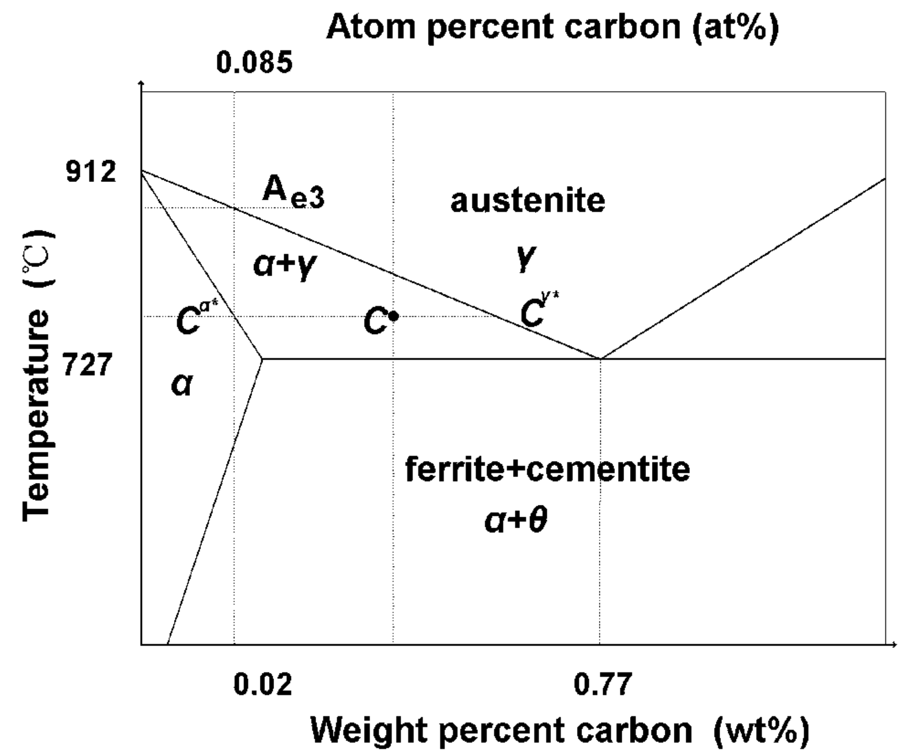
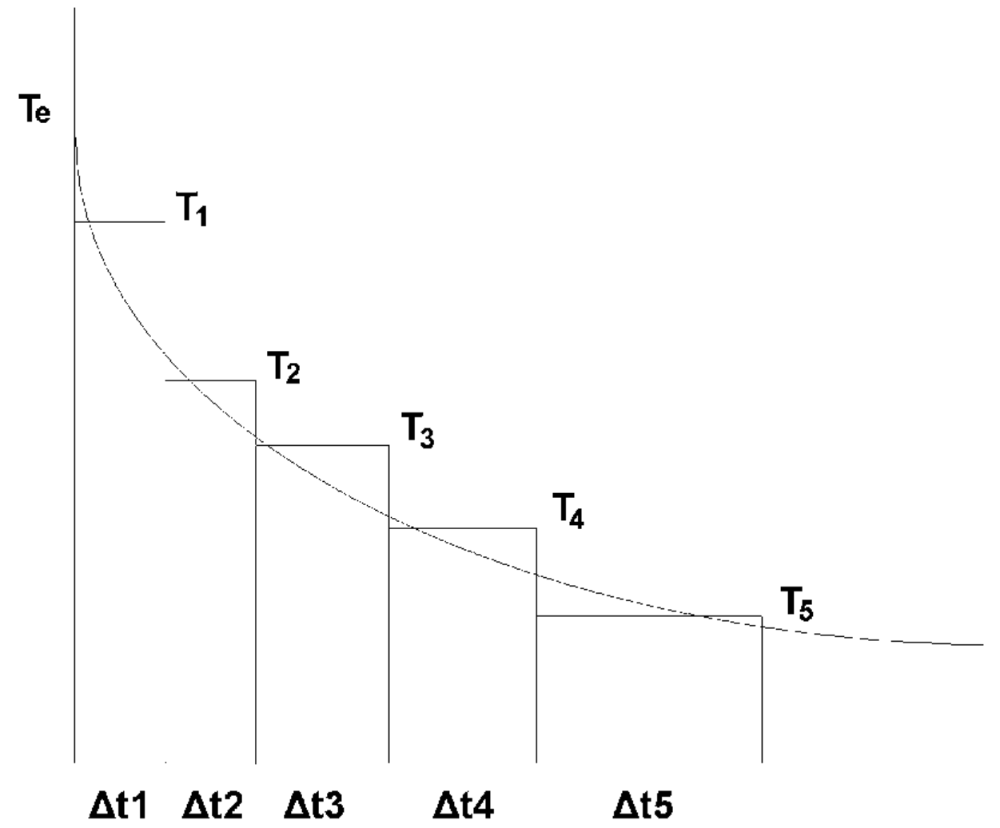
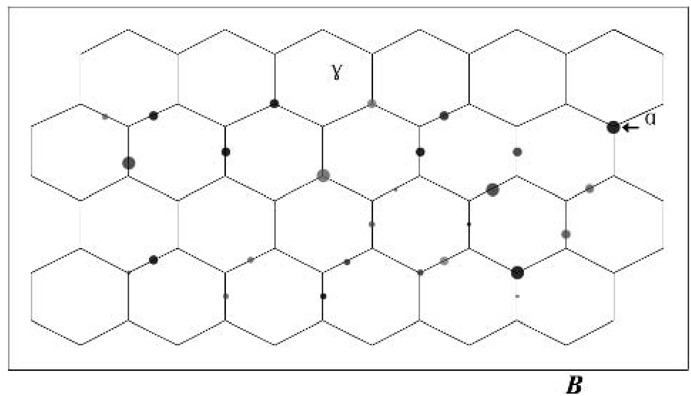
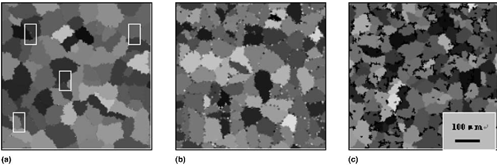
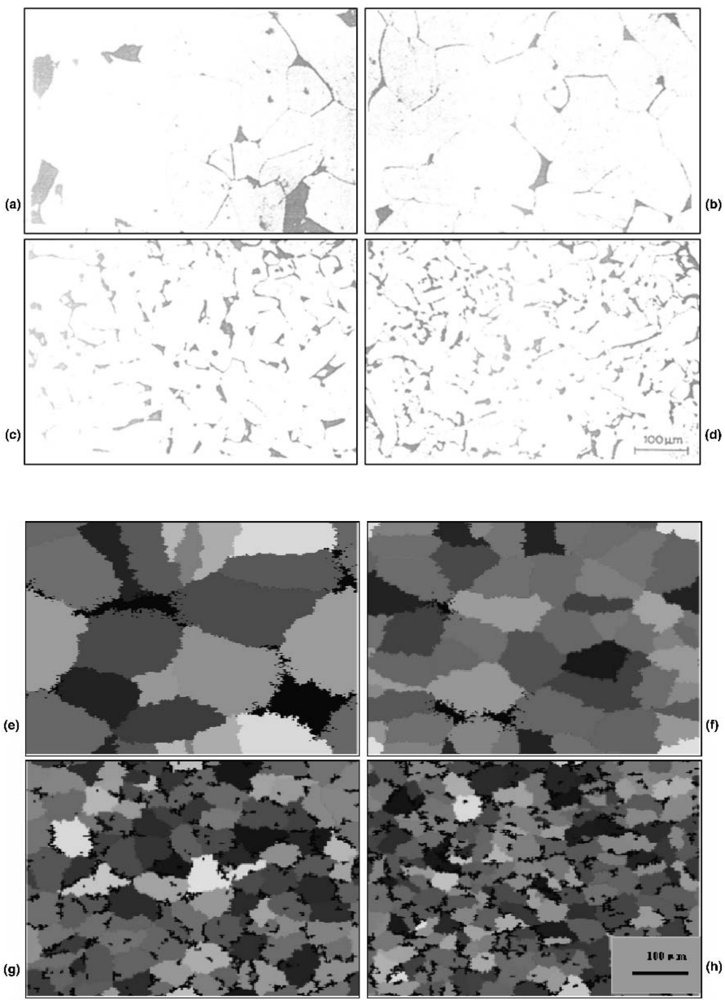
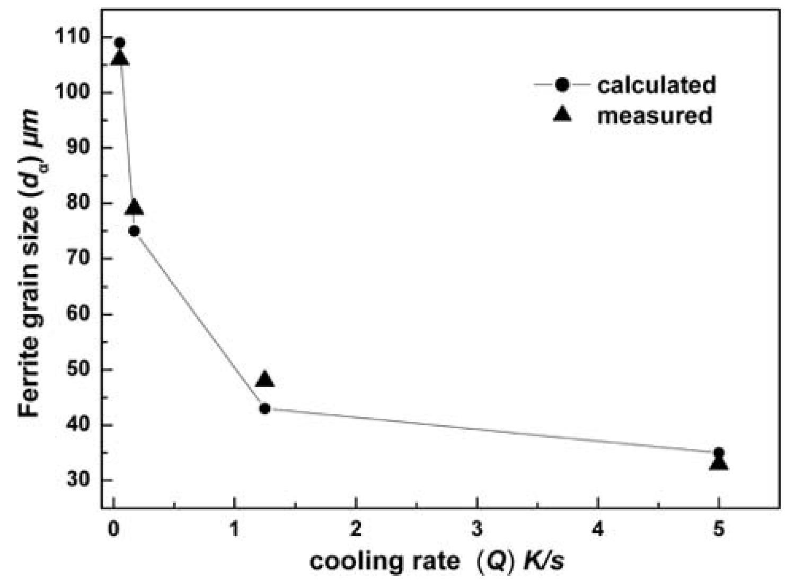

## Zhang2002b — 模拟低碳钢铁素体晶粒形核与长大的元胞自动机模型

## 📄 元数据
L. Zhang, C. C. Zhang, Y. Y. Wang, X. X. Liu, G. G. Wang，2002，Journal of Materials Research，17(9), 2251-2259，DOI [10.1557/JMR.2002.0331](https://doi.org/10.1557/JMR.2002.0331)
## 💡 一句话
建立了一个耦合溶质/温度扩散场的二维元胞自动机模型，定量复现了低碳钢连续冷却过程中γ→α相变的形核、生长及冷却速率对铁素体晶粒细化的影响，并揭示了扩散控制的自限制机制。
## 🔗 Wiki 双链
  - 概念：[[../concepts/cellular-automaton|元胞自动机 (Cellular Automaton)]]、[[../concepts/nucleation-and-growth|形核与长大 (Nucleation and Growth)]]、[[../concepts/diffusion-controlled-transformation|扩散控制型相变 (Diffusion-controlled Transformation)]]、[[../concepts/undercooling|过冷度 (Undercooling)]]、[[../concepts/grain-boundary-nucleation|晶界形核 (Grain-boundary Nucleation)]]、[[../concepts/super-element-approximation|超元素近似 (Super-element Approximation)]]、[[../concepts/cementite-precipitation|渗碳体析出 (Cementite Precipitation)]]
  - 图表：[[../figures/heterostructures-stacking-mechanics-misc|力学性质、剥离能与杂项 (Mechanical Properties, Exfoliation & Misc)]]
  - 年度 [[../write/2002]]
  - 相关论文 [[../../raw/note/Zhang2002b]]
## 🆕 新概念/实体建议
  - `low-carbon-steel`（低碳钢）：以 Fe–C–Si–Mn 为代表、碳含量约 0.15 wt% 的钢种，组织以铁素体为主。
  - `fe-c-phase-diagram`（铁碳相图）：模型确定 Ae3、cγ、cα 等热力学边界的依据。
## 📊 关键图表
  - **图1：Fe–C 合金相图示意，标出 Ae3 温度线**
     -> [[../figures/crystal-structures-xrd-phases|XRD与相变]]
  - **图示描述**：简化的 Fe–C 二元相图局部，标出奥氏体(γ)区、铁素体(α)区以及 γ/α 平衡相界 Ae3 温度线，任一局部碳浓度 c 都对应一个 Ae3(c)。
  - **关键特征**：Ae3 是 γ→α 相变开始的平衡温度；模型把 Fe–Xi–C 多组分钢经"超元素 S"近似成 S–C 伪二元合金后，cγ、cα 与 Ae3 均直接读自该相图；每个元胞的形核判据 T < Ae3 即来自此图。
  - **结论/意义**：为整个 CA 模型提供"热力学地图"，把局部温度、浓度与相变驱动力联系起来。

  - **图2：连续冷却曲线离散为等温阶梯的近似处理**
     -> [[../figures/mathematical-models-simulations|模拟与数值结果]]
  - **图示描述**：纵轴为温度 T、横轴为时间 t，将一条斜率为 −Q 的平滑连续冷却曲线，分解为一系列微小温度区间内的等温保持台阶。
  - **关键特征**：每个台阶内可套用等温形核率 I(T)；连续冷却下新增晶核密度由 n = ∫(I/Q)(1−f) d(ΔT) 给出（式 2、13）；冷却速率 Q 体现在台阶下降的快慢。
  - **结论/意义**：把非等温相变转化为模型可逐步计算的等温过程之和，是连接等温形核理论与连续冷却模拟的关键数学技巧。

  - **图3：铁素体在奥氏体晶界形核并向晶内生长示意**
     -> [[../figures/mathematical-models-simulations|模拟与数值结果]]
  - **图示描述**：几个多边形奥氏体晶粒的截面，新生铁素体晶粒（深色）优先出现在奥氏体晶界交汇处和晶界面上，再向奥氏体晶粒内部推进。
  - **关键特征**：明确"晶界优先形核"假设，奥氏体晶界上的每个元胞都是潜在形核点；铁素体生长前沿为 α/γ 界面，远离研究区的边界 B 取恒温 T∞；形核后向晶内排碳并释放潜热。
  - **结论/意义**：定义了模型的初始几何与形核位置，是 CA 扫描规则和扩散边界条件的物理基础。

  - **图4：六边形 CA 网格的中心元胞与六个最近邻**
     -> [[../figures/heterostructures-stacking|异质结与堆叠]]
  - **图示描述**：二维六边形格子，标出中心元胞 (i,j) 及编号 1–6 的六个最近邻，L_CA 为相邻元胞中心间距。
  - **关键特征**：网格为 200×200 元胞、对应 0.6×0.6 mm 试样；各边界面采用周期性边界；显式有限体积扩散式 16–17 中的求和即遍历这 6 个邻居；时间步长 Δt（式 23）以 L_CA 为特征长度。
  - **结论/意义**：相比方形网格，六边形邻居更各向同性，构成扩散和生长计算的空间骨架。

  - **图5：元胞的 γ / α / α-γ 界面三种状态**
     -> [[../figures/heterostructures-stacking|异质结与堆叠]]
  - **图示描述**：展示连续 α/γ 相界面如何被离散到 CA 网格上，元胞可处于奥氏体 γ、铁素体 α 或 α/γ 界面三种状态之一。
  - **关键特征**：界面元胞同时携带 α、γ 两相分数 f（式 21），扩散系数按 f 在 Dα、Dγ 间加权（式 19–20）；每个元胞还用 1–100 的整数标记结晶取向以区分不同晶粒；模型只考虑 γ→α，不考虑逆相变。
  - **结论/意义**：三态划分是 CA 的核心数据结构，界面元胞正是浓度/温度梯度最大、决定形核与捕获的"前线"。

  - **图6：Q = 1 K/s 下铁素体形核–生长–最终组织的演化快照**
     -> [[../figures/mathematical-models-simulations|模拟与数值结果]]
  - **图示描述**：Fe–0.15C–0.09Si–0.4Mn 等合金从 1320 K 以 1.0 K/s 连续冷却到室温的三幅模拟快照（0.6×0.6 mm，200×200 元胞），不同灰度代表不同取向的铁素体晶粒：(a) 晶界零星形核（白色方块标记），(b) 大量晶粒形核并向晶内生长，(c) 最终大小不一的铁素体晶粒加晶界/晶内深色渗碳体小块。
  - **关键特征**：形核贯穿整个冷却过程而非一次性完成；先形核晶粒向邻近奥氏体排碳、释放潜热，使邻区 c 升高、T 升高、Ae3 下降、过冷度 ΔT 减小，从而抑制后续形核；扩散不均可解释最终晶粒尺寸分布的不均；未及扩散的富碳区在降温到渗碳体形成温度时析出深黑色渗碳体并钉扎界面。
  - **结论/意义**：直观呈现了"扩散控制的自限制"微观机制，是论文最核心的动态可视化结果。

  - **图7：不同冷速（0.05–5.0 K/s）下实验光学金相与模拟组织对比**
     -> [[../figures/mathematical-models-simulations|模拟与数值结果]]
  - **图示描述**：上排 (a)–(d) 为连续冷却转变后的光学显微照片，下排 (e)–(h) 为对应 CA 模拟组织；冷速依次为 0.05、0.17、1.25、5.0 K/s，初始奥氏体晶粒尺寸均为 126 μm，起始温度 1323 K。
  - **关键特征**：随冷速增大，实验平均铁素体晶粒尺寸由约 106 μm 细化到约 33 μm，模拟由约 108 μm 细化到约 38 μm，趋势与量级吻合；高冷速下大过冷度同时激活大量晶界形核点，且溶质来不及扩散、渗碳体在生长前沿析出钉扎界面，故晶粒细小；低冷速下形核少、扩散充分，晶粒粗大。
  - **结论/意义**：从形貌和定量尺寸两方面验证了 CA 模型对冷速效应的预测能力。

  - **图8：平均铁素体晶粒尺寸随冷却速率增大而单调下降的定量曲线**
     -> [[../figures/crystal-structures-surfaces-defects|表面、缺陷与形貌]]
  - **图示描述**：以冷却速率 Q（K/s）为横轴、平均铁素体晶粒尺寸 d（μm）为纵轴的曲线图，d = Σd_i / num。
  - **关键特征**：曲线呈单调下降趋势且斜率随 Q 增大逐渐变缓；Q 由 0.05 增至 5.0 K/s 时，实验晶粒尺寸 106→33 μm、模拟 108→38 μm；下降源于高冷速提高形核率并以渗碳体钉扎限制生长，趋缓则反映扩散时间被压缩到极限后细化空间收窄。
  - **结论/意义**：把图7的定性对照定量化，为通过控轧控冷冷速设计铁素体晶粒尺寸提供了直接的预测工具。

## 🔬 项目连接
无直接项目连接。本文属于钢铁冶金领域的介观组织模拟（元胞自动机 + 扩散方程），与 project-1 双光子、project-2 Mn 多铁、project-3 机械发光 NN、project-4 TTF 分子计算、project-5 SnTe 铁电模拟、project-6 湿度传感器、project-7 CDW 在材料体系、物理机制与计算方法（非 DFT/MD/MLIP，而是概率性 CA）上均无可复用的机制或数据。project-5 虽涉及铁电材料的计算模拟，但其尺度（电子结构/DFT）与物理（极化翻转）和本文（介观相变动力学/碳扩散）差异过大，不构成有意义的方法学借鉴。
## 📝 组织与用词
论文采用"问题—数学模型—CA 算法—结果验证—结论"的经典结构。先以超元素近似把多组分钢降维为 S–C 二元系，给出形核驱动力（式 4–8）、形核率（式 3、13、15）、扩散控制生长速度（式 11）和显式有限体积扩散（式 16–21）；再定义六边形 CA 网格、三态元胞（α/γ/α-γ 界面）、概率性形核与捕获规则，以及由最快过程约束的时间步长（式 23）；最后用 Q=1 K/s 的动态快照和四组冷速（0.05、0.17、1.25、5.0 K/s）的实验/模拟对照完成验证。值得复用的术语：
  - [[../concepts/cellular-automaton|cellular automaton]]（元胞自动机，CA）
  - γ→α phase transformation（奥氏体→铁素体相变）
  - undercooling ΔT（过冷度）
  - Ae3 temperature（Ae3 平衡相变温度）
  - super-element S（超元素 S）
  - [[../concepts/diffusion-controlled-growth|diffusion-controlled growth]]（扩散控制生长）
  - nucleation probability / capture probability（形核概率 / 捕获概率）
  - [[../concepts/latent-heat|latent heat release]]（潜热释放）
  - cementite pinning（渗碳体钉扎）
  - [[../concepts/controlled-rolling-and-cooling|controlled rolling and cooling]]（控轧控冷，TMCP）
## ✏️ 可写入 Wiki 的要点
  1. 二维 CA 网格为六边形、200×200 元胞、对应 0.6×0.6 mm 试样，每个元胞处于 α、γ 或 α/γ 界面三态之一，并用 1–100 的整数标记结晶取向以区分不同晶粒。
  2. 多组分低碳钢 Fe–Xi–C（Xi=Si, Mn, Ni, Cu, Cr；成分为 C 0.15、Si 0.09、Mn 0.4、Cr 0.02、Ni 0.02、Cu 0.01 wt%）通过"超元素 S"近似为 S–C 伪二元合金，使 Fe–C 相图及 Ae3、cγ、cα 可直接使用。
  3. 超元素 S 的 γ→α 自由能变化 ΔGSγ→α = (1/4)Σ xi(TiM − TiNM) + ΔGFe(S)γ→α，其中 TiM、TiNM 为 Zener 参数，合金元素的贡献通过其摩尔分数线性叠加。
  4. 形核率 I(T) = K1(kT)^(−1/2) D exp[−K2/(RT·ΔGNγ→α+γ1)]，连续冷却下新晶核密度 n = ∫(I/Q)(1−f)d(ΔT)，单胞形核概率 pnuc = n·S，由随机数 rs ≤ pnuc 决定是否形核。
  5. 生长由碳在 α/γ 界面的扩散通量守恒控制：Dγ(∂cγ/∂n) − Dα(∂cα/∂n) = vn(cγ − cα)；铁素体向邻居界面元胞的捕获概率 pcap = l/LCA，其中 l 为一个时间步内的生长长度。
  6. 温度场与溶质场均用显式有限体积法在六边形邻域上扩散，更新式为 u(i,j) + (2Δt/3LCA²)Σ Du(u_nei − u_ij) → u_ij；跨相界面时扩散系数按界面元胞中 α/γ 相分数 f 加权（式 19–21）。
  7. 时间步长取 Δt = (1/5) min(LCA/vmax, LCA²/Du, LCA²/Dα, LCA²/Dγ)，即必须小于生长、热扩散、α 中溶质扩散、γ 中溶质扩散四个时间尺度中最快者的 1/5，以保证数值稳定和物理一致。
  8. 扩散控制的"自限制"机制：先形核的铁素体向邻近奥氏体排出碳并释放潜热，使邻区碳浓度升高（Ae3 下降）、温度升高，导致[[../concepts/undercooling|过冷度]] ΔT 减小、后续形核概率下降，从而自然产生大小不均的晶粒分布。
  9. 冷速效应：高冷速下过冷度大、形核点被大量激活，且溶质来不及扩散、渗碳体在生长前沿析出钉扎界面，故得到细小晶粒；低冷速下形核少、扩散充分、晶粒充分长大。模拟初始奥氏体晶粒 126 μm，冷速 0.05→5.0 K/s 时实验铁素体晶粒 106→33 μm、模拟 108→38 μm，定量吻合。
  10. 模型局限：二维截面与三维晶粒尺寸的体视学换算未严格处理；扩散系数 Dγ、Dα 取常数而非 Arrhenius 温度依赖；[[../concepts/super-element-approximation|超元素近似]]忽略了不同合金元素对碳活度和界面能的差异化影响；形核常数 K1、K2 等参数的可移植性有限，作者展望三维扩展、CALPHAD 耦合以及与轧制变形/再结晶模型的集成。
