## Zhang2003a — 连续冷却过程中奥氏体向铁素体转变的元胞自动机研究

## 📄 元数据
L. Zhang, C.B. Zhang, Y.M. Wang, S.Q. Wang, H.Q. Ye，2003，Acta Materialia 51(18): 5519–5527，DOI 10.1016/S1359-6454(03)00416-6（中科院金属所沈阳材料科学国家实验室 / 东北大学理学院）
## 💡 一句话
建立二维六边形元胞自动机模型，将局部碳浓度变化耦合到概率性形核/捕获规则中，定量揭示了低碳钢连续冷却时冷却速率通过形核-生长竞争决定铁素体晶粒尺寸与形貌的机制。
## 🔗 Wiki 双链
  - 年度 [[../write/2003]]
  - 相关论文 [[../../raw/note/Zhang2003a]]
  - 概念 [[../concepts/solid-state-phase-transformation|固态相变]]、[[../concepts/diffusion-controlled-growth|扩散控制生长]]、[[../concepts/nucleation-and-growth|形核与生长]]、[[../concepts/undercooling|过冷度]]、[[../concepts/solute-redistribution|溶质再分配]]、[[../concepts/soft-impingement|软碰撞]]、[[../concepts/super-element-approximation|超元素近似]]、[[../concepts/grain-boundary-nucleation|晶界形核]]、[[../concepts/cementite-precipitation|渗碳体析出]]
  - 图表 [[../figures/mathematical-models|数学模型与物理公式]]、[[../figures/heterostructures-stacking-mechanics-misc|力学性质、剥离能与杂项]]
## 🆕 新概念/实体建议
  - `solid-state-phase-transformation`（固态相变）：固态中母相到新相的转变，按扩散/位移分类，是本论文的物理背景
  - `diffusion-controlled-growth`（扩散控制生长）：界面推进速度由溶质长程扩散决定的生长模式，对应 Stefan 条件
  - `nucleation-and-growth`（形核与生长）：经典相变两阶段过程，二者竞争决定最终组织
  - `undercooling`（过冷度）：平衡温度 Ae3 与实际温度之差，是形核率与生长速度的驱动力
  - `solute-redistribution`（溶质再分配）：相变时新相将多余溶质排出至母相的过程，CA 中通过向邻居分配 c_precipitate 实现
  - `soft-impingement`（软碰撞）：相邻扩散场重叠导致生长减速，无需晶粒直接接触
  - `super-element-approximation`（超元素近似）：把 Fe-Mn-Si-Ni-Cu-Cr 等效为 S-C 伪二元的建模简化
  - `grain-boundary-nucleation`（晶界形核）：铁素体优先在奥氏体晶界形核的实验观察与模型假设
  - `cellular-automaton`（元胞自动机）：离散时空状态、局部规则驱动的介观模拟方法（可作为 methods/实体条目）
  - `A36-low-carbon-steel`（A36 低碳钢）：本工作的模拟对象，成分 C0.17 Mn0.74 Si0.012 Cu0.016 Ni0.01 Cr0.019（wt%）
  - `cementite`（渗碳体 Fe3C）：高冷速下碳富集形成并阻碍铁素体生长的第二相
## 📊 关键图表
  - 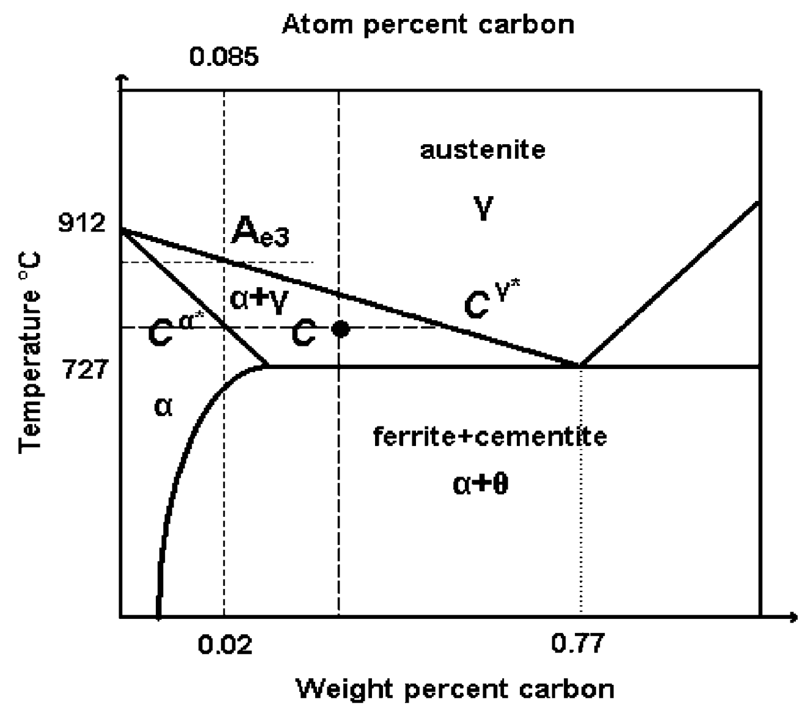 -> [[../figures/crystal-structures|晶体结构与原子排布]]
  - 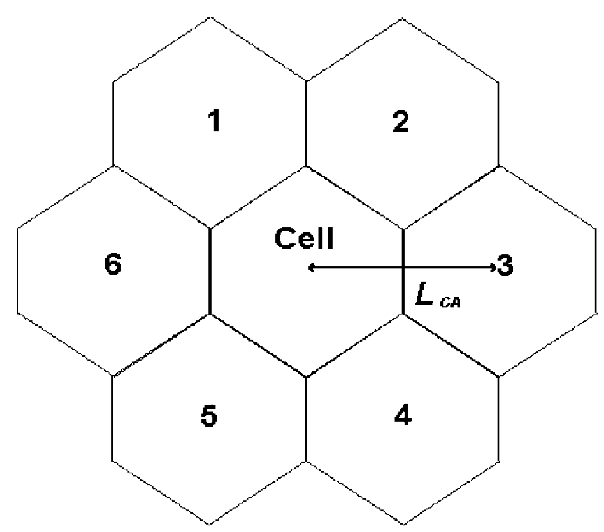 -> [[../figures/crystal-structures|晶体结构与原子排布]]
  - 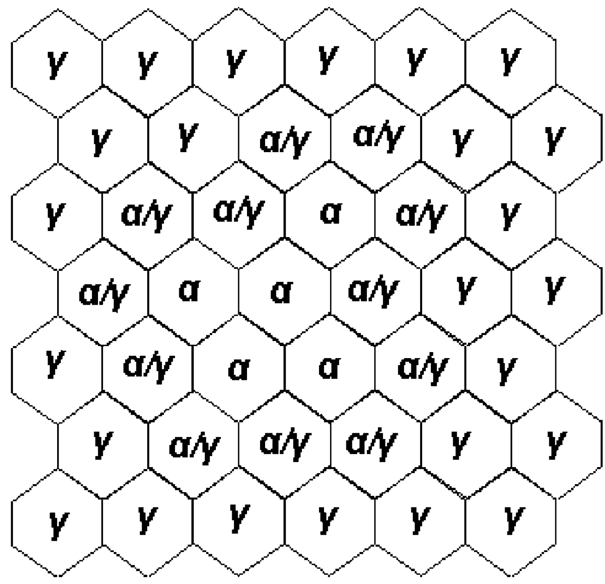 → [[../figures/heterostructures-stacking-mechanics-misc|力学性质、剥离能与杂项]]
  - 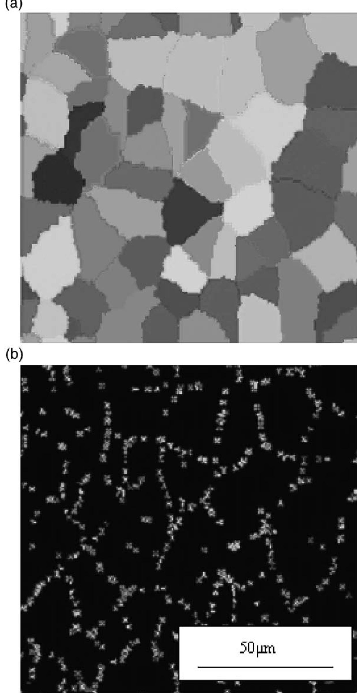 -> [[../figures/crystal-structures|晶体结构与原子排布]]
  - 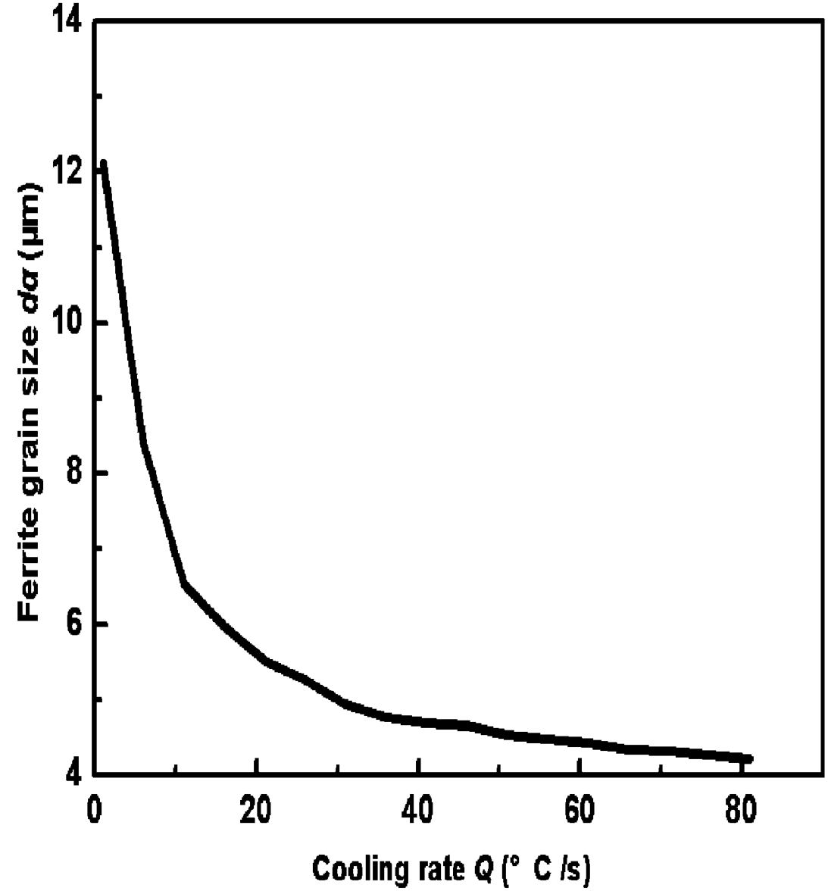 -> [[../figures/crystal-structures|晶体结构与原子排布]]
  - 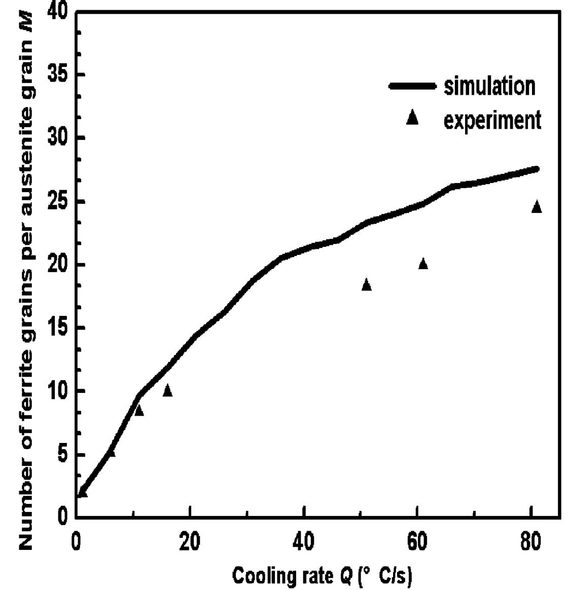 -> [[../figures/crystal-structures|晶体结构与原子排布]]
  - 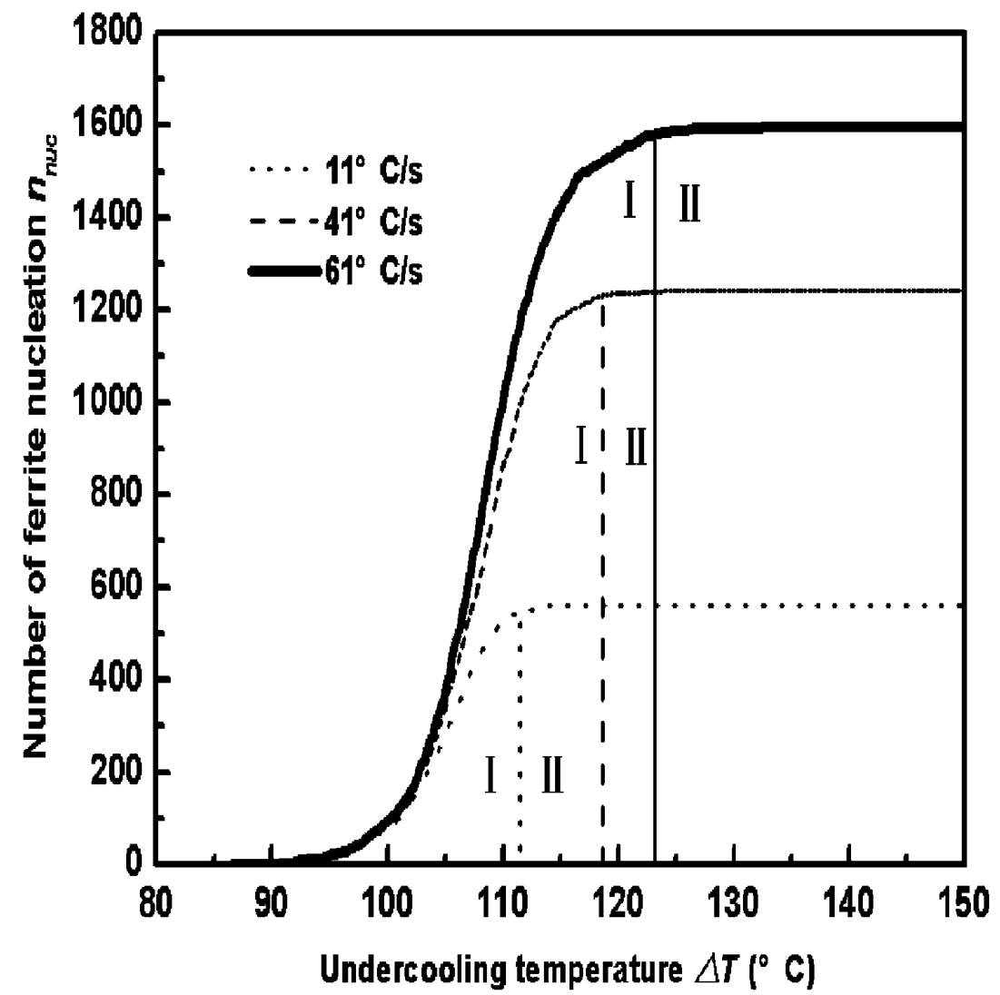 -> [[../figures/crystal-structures|晶体结构与原子排布]]
  - 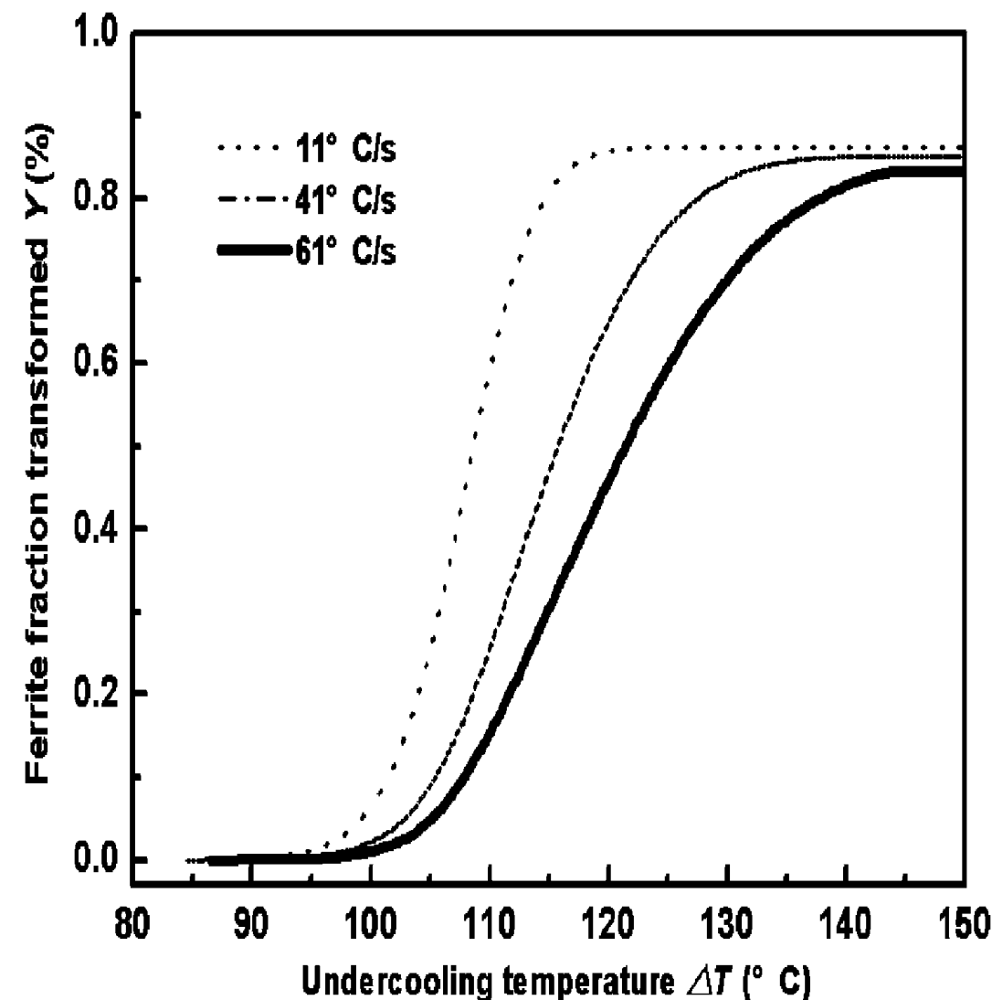 -> [[../figures/crystal-structures|晶体结构与原子排布]]
  - 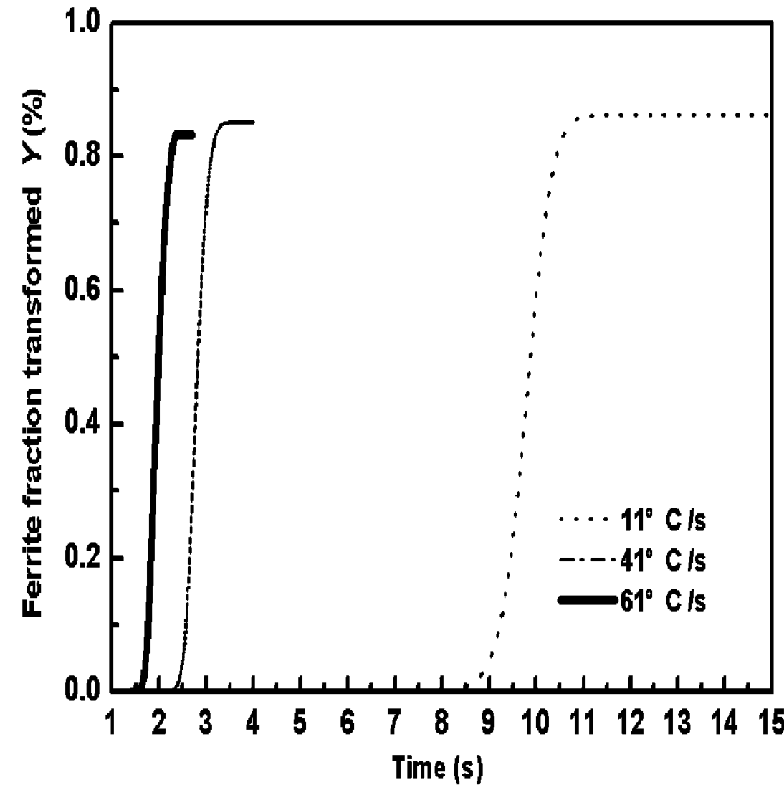 -> [[../figures/crystal-structures|晶体结构与原子排布]]
  - 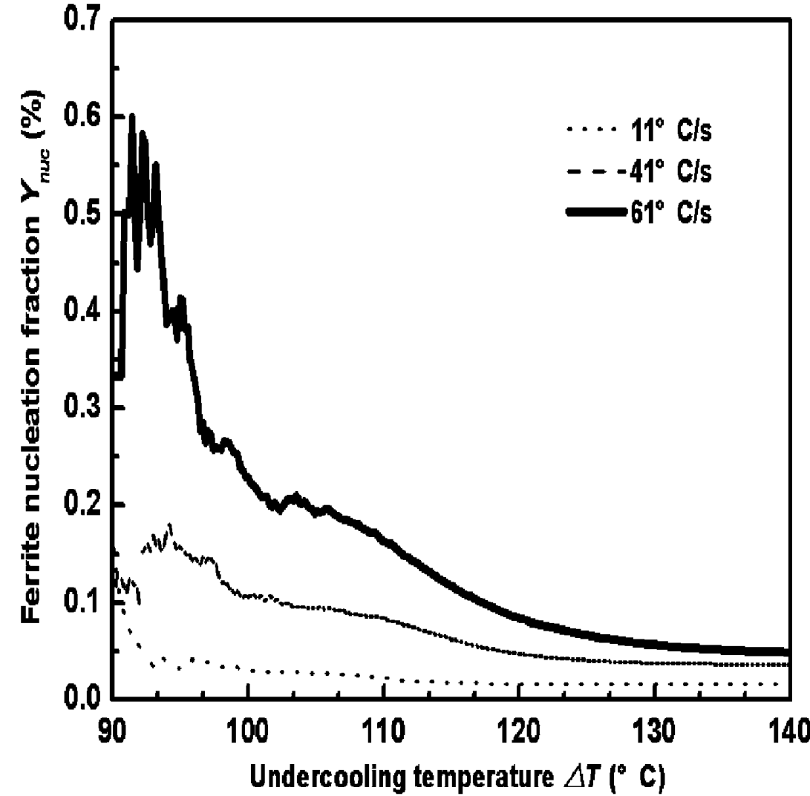 -> [[../figures/crystal-structures|晶体结构与原子排布]]
  - 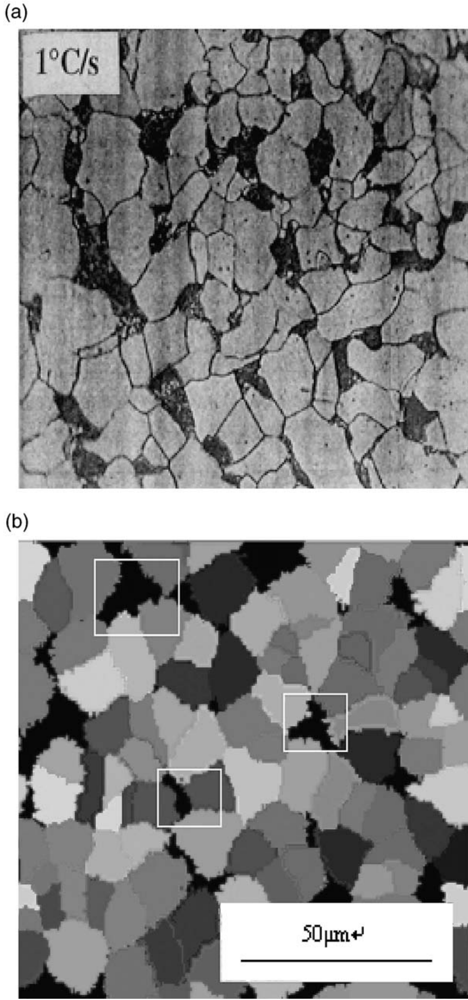 -> [[../figures/experimental-setups|实验测试与测量装置]]
  - 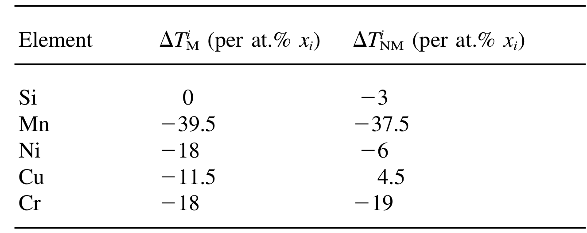 -> [[../figures/crystal-structures|晶体结构与原子排布]]
## 🔬 项目连接
无直接项目连接。本文是低碳钢奥氏体→铁素体扩散型相变的元胞自动机介观模拟，与双光子/非线性光学（project-1）、Mn 多铁（project-2）、机械发光 NN（project-3）、TTF 分子计算（project-4）、SnTe 铁电模拟（project-5）、湿度传感（project-6）、CDW（project-7）在材料体系、物理机制和方法上均无可复用的直接参考价值；其 CA/有限体积扩散求解流程针对钢铁凝固相变设计，不属于上述项目所依赖的 DFT/MLIP/光学/铁电方法链。
## 📝 组织与用词
文章按"问题提出→四项基本假设→形核/生长数学模型（式1–8）→CA 算法七要素（网格/状态/初始化/温变/形核/生长/时间步）→结果验证（图6 定量、图11 定性）→机理讨论（图5,7–10）→结论"推进，核心论证链是"冷速↑→过冷度↑→晶界元胞形核概率 p_nuc↑→形核数 M↑→晶粒 dα↓"，并通过 Y_nuc 振荡曲线把"形核-生长竞争"可视化。值得复用的术语：
  - [[../concepts/cellular-automaton|cellular automaton / 元胞自动机]]（CA）
  - [[../concepts/undercooling|undercooling / 过冷度]]（ΔT = Ae3 − T）
  - nucleation probability / capture probability / 形核概率 p_nuc 与捕获概率 p_cap
  - [[../concepts/soft-impingement|soft impingement / 软碰撞]]（扩散场重叠）
  - [[../concepts/solute-redistribution|solute redistribution / rejection / 溶质再分配与排出]]（c_precipitate）
  - super-element S–C / 超元素 S–C 伪二元
  - α/γ interface cell / α/γ 界面元胞（过渡态）
  - equiaxed growth / 等轴生长
## ✏️ 可写入 Wiki 的要点
  1. 模型用 200×200 二维六边形 CA 网格代表 125×125 μm² 样品、周期性边界，六边形网格比正方形网格能显著降低数值[[../concepts/migdal-eliashberg-theory|各向异性]]。
  2. 四项基本假设：(i) Fe-Xi-C 等效为超元素 S–C 二元；(ii) 铁素体在奥氏体[[../concepts/grain-boundary-nucleation|晶界形核]]；(iii) 生长由 C 在 γ 中的扩散控制；(iv) 以 Fe-C 相图 γ 相线 Ae3 为相变平衡判据。
  3. 形核率 I(T) = K1(kT)^(−1/2) D_γ exp[−K2/(kT(ΔG_{γ→α}^N)²)]，其中 K1=2.07×10³ J^{1/2} cm^{−4}、K2=6.33×10^{−15} J³ mol^{−2}（Umemoto 等经验值）；形核驱动力 ΔG_{γ→α}^N = ΔG_{γ→α}^S − RT ln a_γ^S，叠加 Zener 参数（表1：Mn ΔT^M=−39.5、ΔT^NM=−37.5；Si 0/−3；Ni −18/−6；Cu −11.5/−4.5；Cr −18/−19）。
  4. 扩散用 ∂c_ν/∂t = D_ν∇²c_ν，界面用 Stefan 条件 D_γ(∂c_γ/∂n) − D_α(∂c_α/∂n) = v_n(c_α^{α/γ} − c_γ^{α/γ})；六边形网格上用显式有限体积法求解。
  5. CA 概率规则：形核概率 p_nuc = δn·S_γ（δn 由式9 对[[../concepts/undercooling|过冷度]]积分），随机数 r_s≤p_nuc 即形核；捕获概率 p_cap = l(t)/L_CA，l(t)=∫v dt；元胞转变后向邻居奥氏体元胞平均分配 c_precipitate = c − c^{α*}，每个邻居得 c_precipitate/n_ei，自然再现[[../concepts/soft-impingement|软碰撞]]。
  6. 时间步 Δt = min(L_CA/v_max, L_CA²/D_α, L_CA²/D_γ)，同时受生长速度和两相扩散稳定性约束。
  7. A36 钢（d_γ=18 μm）模拟定量结果：冷速 11/41/61 °C/s 对应的饱和形核数 n_nuc = 561/1352/1590；冷速越大 d_α 越小、M 越大、相变完成时间越短；最终转变分数 Y 几乎相同，高冷速因[[../concepts/cementite-precipitation|渗碳体析出]]而略低。
  8. 形核集中在过冷早期 zone I 完成，zone II 进入饱和；高冷速下 Y_nuc=n_nuc/(n_nuc+n_grow) 在 ΔT<95 °C 区间剧烈振荡且数值更高，表明早期形核主导而非生长主导。
  9. 低冷速下形核数少，每个铁素体晶粒平均分担的排出碳更多、扩散更充分，利于等轴生长，最终晶粒粗大；高冷速则相反。
  10. 渗碳体作为铁素体生长前方 α/γ 界面元胞碳富集到无法及时扩散时形成的障碍相，是高冷速下 Y 饱和值略降的原因；模型与 Militzer 等实验的 M 曲线及 1 °C/s 金相形貌均吻合。
