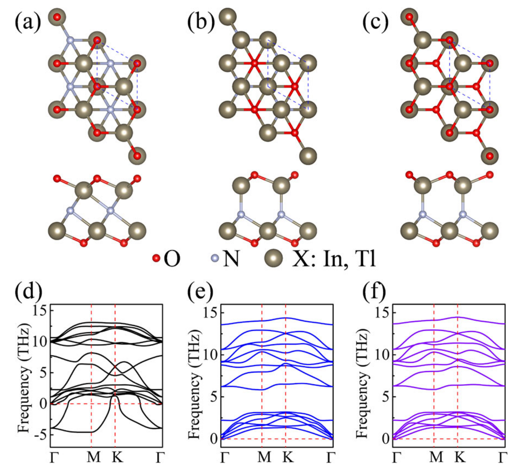
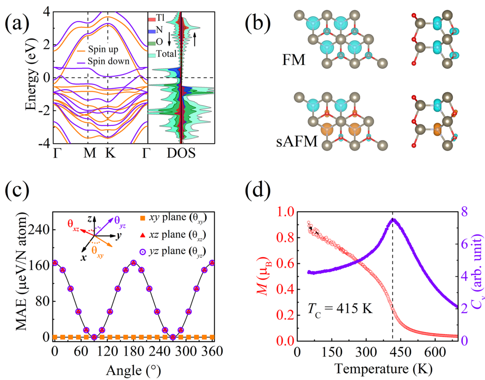
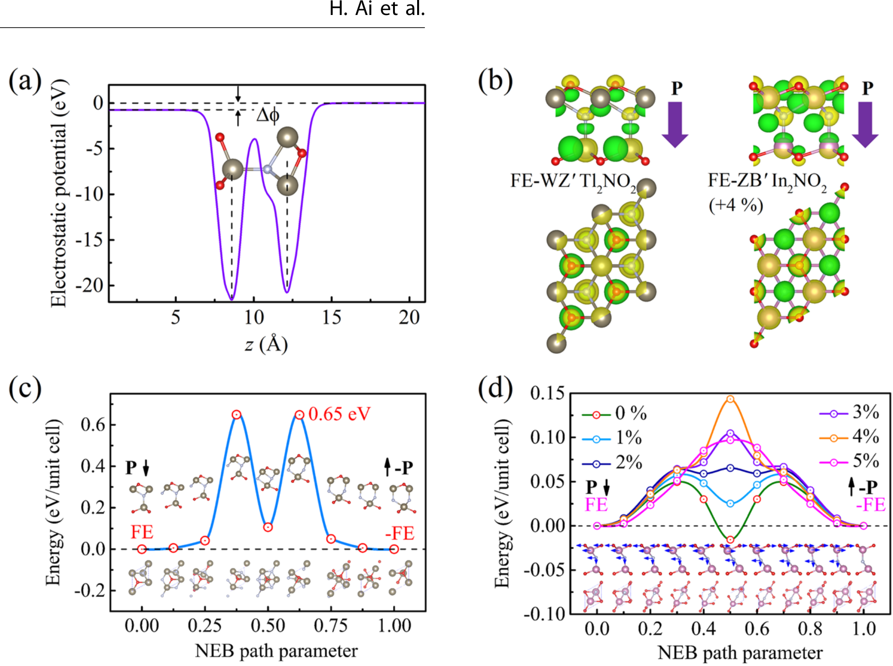
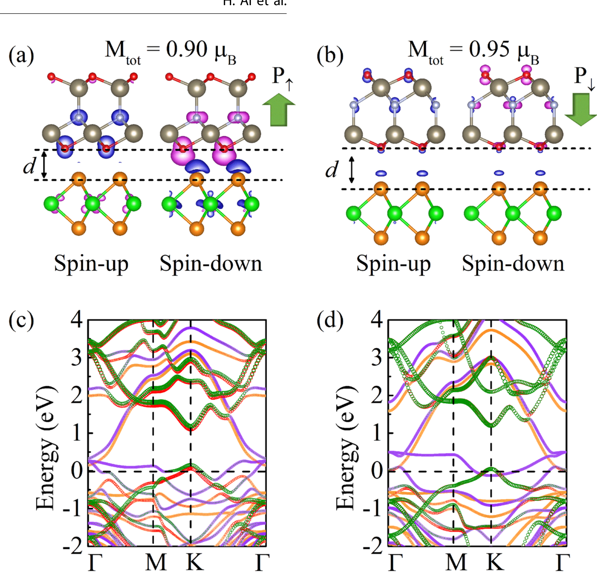
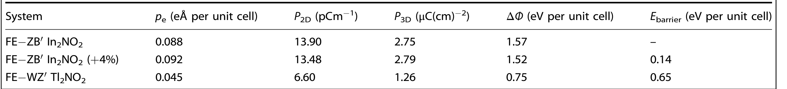

## aiFerroelectricityCoexistedPorbital2022 — 二维金属氮氧化物中铁电性与p轨道铁磁性和金属性的共存

## 📄 元数据
Haoqiang Ai, Feifei Li, Haoyun Bai, Dong Liu, Kin Ho Lo, Shengyuan A. Yang, Yoshiyuki Kawazoe, Hui Pan，2022，npj Computational Materials 8:60，DOI: 10.1038/s41524-022-00737-3

## 💡 一句话
通过第一性原理计算，在二维类MXene氧氮化物 X₂NO₂（X = In, Tl）中预测了铁电性、N-2p 电子驱动的巡游铁磁性与金属性三者共存，从根本上绕过 d⁰ 规则，并在 Tl₂NO₂/WTe₂ 异质结中演示了界面磁电耦合。

## 🔗 Wiki 双链
  - 概念 [[../concepts/multiferroicity]]、[[../concepts/magnetoelectric-coupling]]、[[../concepts/2D-materials]]、[[../concepts/density-functional-theory]]、[[../concepts/strain-engineering]]、[[../concepts/spin-orbit-coupling]]、[[../concepts/polarization-switching]]、[[../concepts/berry-phase]]
  - 实体 [[../entities/VASP]]、[[../entities/MXenes]]、[[../entities/BiFeO3]]、[[../entities/In2Se3]]、[[../entities/Fe3GeTe2]]、[[../entities/WTe2]]
  - 图表 [[../figures/crystal-structures]]、[[../figures/electronic-bands]]、[[../figures/heterostructures-stacking]]、[[../figures/mathematical-models]]、[[../figures/experimental-setups|实验测试与测量装置]]、[[../figures/heterostructures-stacking-multiferroic|多铁与磁电异质结]]
  - 年度 [[../write/2022]]
  - 项目 [[../projects/project-2-mn-multiferroics]]、[[../projects/project-5-snte-ferroelectric-sim]]
  - 主题 [[多铁性材料]]、[[材料模拟计算设计]]
  - 相关论文 [[../../raw/note/aiFerroelectricityCoexistedPorbital2022]]

## 🆕 新概念/实体建议
  - `d0-rule`（d⁰规则）：经验规则，钙钛矿铁电体中B位阳离子需空d轨道以发生离子偏心位移，与磁性所需的部分填充d轨道互斥，是单相多铁稀缺的根源。
  - `p-orbital-magnetism`（p轨道磁性 / d⁰磁性）：由非金属元素p电子（而非过渡金属d/f电子）产生的磁性，可在金属离子d轨道全空/全满的体系中出现。
  - `ferroelectric-metal`（铁电金属）：Anderson & Blount 1965年提出的物态，金属中存在非中心对称结构相变与面外偶极矩；二维极限下面外屏蔽减弱使电场翻转成为可能。
  - `stoner-criterion`（Stoner判据）：D(EF)·I > 1 判定金属发生自发自旋极化形成巡游铁磁态的条件；本文 D(EF)=5.03 states/eV/N、I≈0.97 eV。
  - `itinerant-ferromagnetism`（巡游铁磁性）：磁性电子同时参与导电，表现为非整数磁矩、自旋劈裂能带穿越费米能级。
  - `Tl2NO2`（Tl₂NO₂单层）：FE-WZ′相为基态，N-2p巡游铁磁（Tc≈415 K）+ N偏心位移铁电（P≈1.3 μC/cm²，势垒0.65 eV），是室温以上二维铁电金属候选。
  - `In2NO2`（In₂NO₂单层）：fcc相为基态，但>1%双轴拉伸应变可诱导FE-ZB′相成为铁电金属；4%应变下势垒0.14 eV、P≈2.79 μC/cm²。
  - `soft-mode-theory`（软模理论）：中心对称相Γ点虚频声子模式驱动对称性降低相变，是fcc→FE-WZ′相变的机理。
  - `double-well-potential`（双势阱势）：铁电极化反转能量曲线特征，两个简并极小值对应±P。

## 📊 关键图表
  -  → [[../figures/heterostructures-stacking-multiferroic|多铁与磁电异质结]]
  -  → [[../figures/heterostructures-stacking-multiferroic|多铁与磁电异质结]]
  -  → [[../figures/heterostructures-stacking-multiferroic|多铁与磁电异质结]]
  -  → [[../figures/heterostructures-stacking-multiferroic|多铁与磁电异质结]]
  -  -> [[../figures/mathematical-models|数学模型与物理公式]]

## 🔬 项目连接
  - **project-2 Mn多铁**：高度相关。本文核心是"同一离子（N）同时提供铁电极化与磁矩"这一多铁设计新范式，可直接启发Mn基多铁中"d电子磁性 + 另一亚晶格铁电"或"p轨道辅助磁性"的机理思考；d⁰规则的物理根源、I型/II型多铁分类、孤对电子铁电（BiFeO₃）与几何铁电（YMnO₃）的对比，为Mn多铁项目提供机理参照；Stoner判据分析磁基态、CI-NEB计算极化反转势垒、海森堡模型+蒙特卡洛估算Tc的完整计算流程可直接复用到Mn体系；应变诱导铁电（In₂NO₂ >1%拉伸）的思路可类比迁移到Mn基薄膜的应变工程。
  - **project-5 SnTe铁电模拟**：高度相关。本文是p轨道（N-2p）电子参与铁电与磁性的典型案例，与SnTe这类p轨道主族元素铁电体在电子结构层面有共通之处——两者均涉及主族元素p电子的成键/极化；二维面外铁电极化的计算方法（Berry相位/偶极校正、静电势差ΔΦ、CI-NEB反转路径、双势阱判定）完全适用于SnTe薄膜/异质结模拟；应变工程调控铁电双势阱（In₂NO₂从单阱→双阱的转变，临界应变~1-2.6%）的分析框架可直接用于SnTe应变调参；铁电金属概念（二维面外屏蔽减弱允许金属中铁电翻转）为SnTe基异质结界面设计提供新思路；Tl₂NO₂/WTe₂异质结中"极化翻转→界面自旋选择性电荷转移→磁矩变化"的分析方法可迁移到SnTe/磁性层异质结的电控磁研究。
  - **project-7 CDW**：间接相关。本文使用的声子谱虚频→软模→结构相变分析方法（fcc Tl₂NO₂在Γ点虚频驱动对称性破缺）与CDW中声子软化/电荷密度波相变的分析手段一致；费米能级附近平带、高态密度峰（N-2p）驱动电子失稳的图像与CDW的费米面嵌套机制有方法论上的可类比性。
  - **project-4 TTF分子计算**：方法学参考价值。VASP+PBE/HSE06计算流程、形成能定义、声子谱/AIMD稳定性验证、自旋极化与SOC处理等DFT工作流可作为分子/低维体系计算的规范参照。
  - **project-1 双光子 / project-3 机械发光NN / project-6 湿度传感器**：无直接项目连接。

## 🔗 项目双链
- 项目 [[../projects/project-1-two-photon|项目一：双光固化和双光发光]]
- 项目 [[../projects/project-2-mn-multiferroics|项目二：Mn极化结构铁电材料]]
- 项目 [[../projects/project-3-mechanoluminescence-nn|项目三：应力发光神经网络]]
- 项目 [[../projects/project-4-ttf-molecular-calc|项目四：lsl老师的ttf分子计算]]
- 项目 [[../projects/project-5-snte-ferroelectric-sim|项目五：lammps势函数SnTe铁电模拟]]
- 项目 [[../projects/project-6-humidity-sensor|项目六：小花闻的电压湿度传感器]]
- 项目 [[../projects/project-7-cdw-charge-density-wave|项目七：CDW电荷密度波]]

## 📝 组织与用词
  - 文章按"提出d⁰规则瓶颈 → 设计p轨道策略 → 筛选53种结构确定稳定相 → 分别验证磁性（Stoner机制）和铁电性（N偏心位移）→ 异质结演示磁电耦合"的因果链组织，逻辑是典型的"机理假设—计算验证—功能演示"范式。
  - 关键术语：
    - 多铁性材料 multiferroics / 铁电性 ferroelectricity / 铁磁性 ferromagnetism
    - d⁰规则 d⁰ rule / d⁰磁性 d⁰ magnetism
    - p轨道铁磁性 p-orbital ferromagnetism / 巡游铁磁性 itinerant ferromagnetism
    - 铁电金属 ferroelectric metal / 极性金属 polar metal
    - Stoner判据 Stoner criterion / Stoner参数 Stoner parameter I
    - 自发极化 spontaneous polarization / 双势阱 double-well potential / 软模 soft mode
    - 磁电效应 magnetoelectric effect / 界面工程 interface engineering
    - 极化反转势垒 activation barrier for polarization reversal (CI-NEB)

## ✏️ 可写入 Wiki 的要点
  1. X₂NO₂（X = In, Tl）为O-X-N-X-O五层三角晶格结构，类MXene；fcc相中心对称（D3d），FE-ZB′/FE-WZ′相N原子偏心四面体配位（三长一短X-N键，C3v对称），N偏心位移是面外铁电的结构根源，与α-In₂Se₃类似。
  2. FE-WZ′ Tl₂NO₂[[../concepts/formation-energy|形成能]] 0.279 eV/atom（低于硅烯 0.744 eV/atom），声子谱无虚频、AIMD 300 K稳定、满足Born-Huang力学判据，是实验可合成的基态相；fcc Tl₂NO₂在Γ点有两个虚频光学模，自发破缺对称。
  3. Tl的d、f壳层全满，磁性完全来自N-2p_x/2p_y电子自旋极化：单胞净磁矩 1.06 μB，N局域磁矩 0.6 μB，顶表面O贡献 0.2 μB；FM比sAFM低 128.92 meV/N；自旋向下能带穿越EF，呈金属性（巡游铁磁）。
  4. Stoner机制：非磁态N-2p在Γ-M附近形成平带，D(EF)=5.03 states/eV/N，I≈0.97 eV，D(EF)·I≈4.9 > 1，满足Stoner判据；FM基态在SOC与6%双轴拉伸应变下仍稳健。
  5. FE-WZ′ Tl₂NO₂易磁化面为xy平面（面内各向同性），MAE≈166 μeV/N，远大于经典磁性金属，与CrGeTe₃单层（220 μeV/f.u.）相当；基于[[../concepts/heisenberg-model|海森堡模型]]的蒙特卡洛模拟给出Tc≈415 K（平均场近似332 K），高于室温。
  6. Tl₂NO₂面外自发极化：真空能级差ΔΦ=0.75 eV，电偶极矩 0.045 eÅ，P₂D=6.6 pC/m，P₃D=1.3 μC/cm²（取厚度5.2 Å），与α-In₂Se₃同数量级；CI-NEB反转势垒 0.65 eV/unit cell，经中心对称顺电相过渡。
  7. In₂NO₂本征fcc相最稳定（非铁电），但双轴拉伸应变≥1%时FE-ZB′相出现[[../concepts/double-well|双势阱]]，4%应变下势垒最大 0.14 eV、P≈2.79 μC/cm²，fcc相声子谱出现虚频，是[[../concepts/strain-engineering|应变工程]]诱导[[../concepts/ferroelectric-metal|铁电金属]]的实例。
  8. 二维极限下电子面外运动受限，对极化的屏蔽不充分，使金属性Tl₂NO₂的面外铁电可能被电场翻转，归为Anderson-Blount铁电金属（参照LiOsO₃、双层WTe₂）。
  9. Tl₂NO₂/2H-WTe₂异质结（晶格失配~1%，DFT-D3描述层间作用）：极化向上时WTe₂向Tl₂NO₂转移的自旋向下电子显著增多，K点附近两层自旋向下态杂化，总磁矩从 0.95 μB（极化向下）降至 0.90 μB（极化向上），演示了电场（控极化）调控磁性的界面磁电效应。
  10. 计算方法：VASP + PAW + PBE（结构/基本性质）+ HSE06（精确能带），截断能 520 eV，k网格 16×16×1（PBE）/10×10×1（HSE06），真空层 >15 Å，偶极校正；声子谱用PHONOPY[[../concepts/linear-response|线性响应]]；AIMD 5×5超胞 300 K/1 fs；Tc用MCSOLVER海森堡蒙特卡洛；反转路径用CI-NEB。