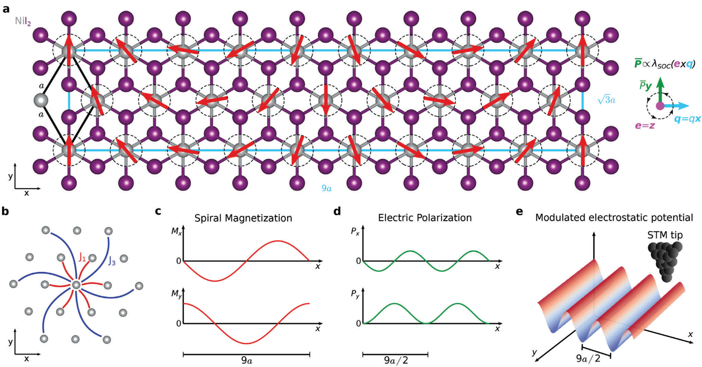
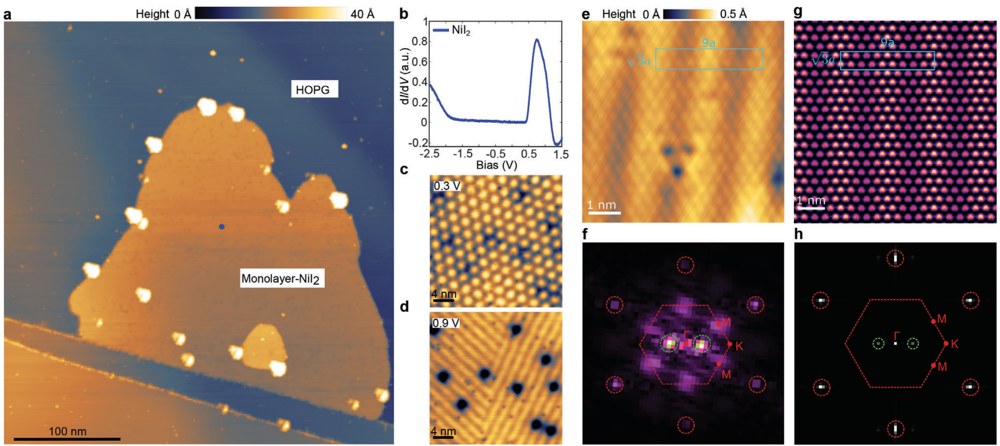
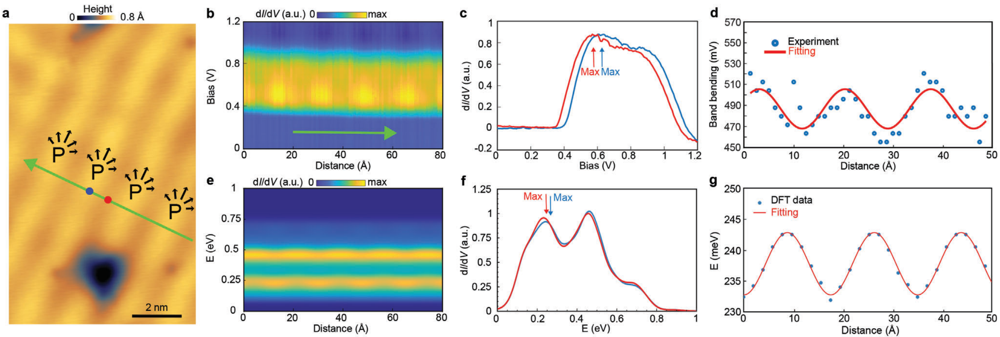

## aminiAtomicscaleVisualizationMultiferroicity2024 — 单层 NiI₂ 中多铁性的原子尺度可视化

- **元数据**：Amini, Fumega, González-Herrero, Vaňo, Kezilebieke, Lado, Liljeroth et al.，2024，*Advanced Materials* 36(18), 2311342，DOI: 10.1002/adma.202311342。
- **一句话**：用低温 STM 结合非共线 DFT，首次在原子尺度上看到单层 NiI₂ 中由自旋螺旋 + 强 SOC 诱导的第 II 类多铁序（周期为磁螺旋一半的电极化条纹），并通过针尖电压脉冲直接移动多铁畴壁，证明磁电耦合。
- **现有wiki双链**：
  - 概念 [[../concepts/multiferroicity]]、[[../concepts/magnetoelectric-coupling]]、[[../concepts/spin-orbit-coupling]]、[[../concepts/2D-materials]]、[[../concepts/strain-engineering]]、[[../concepts/density-functional-theory]]、[[../concepts/moire-superlattice]]、[[../concepts/topological-defects]]
  - 实体 [[../entities/SnTe]]（作为声子驱动铁电体的对照，其 STM 能带弯曲与畴壁操控先例）、[[../entities/h-BN]]（衬底对照之一）、[[../entities/BiFeO3]]（经典多铁体背景）、[[../entities/domain-wall]]、[[../entities/VASP]]（note 关联文献中引用，但本文实际使用 Elk）
  - 图表 [[../figures/crystal-structures]]、[[../figures/electronic-bands]]、[[../figures/domain-walls]]、[[../figures/experimental-setups]]、[[../figures/mathematical-models]]
  - 年度 [[../write/2024]]
  - 项目 [[../projects/project-2-mn-multiferroics]]、[[../projects/project-5-snte-ferroelectric-sim]]、[[../projects/project-7-cdw-charge-density-wave]]
  - 主题 [[../topics/D02-多铁性材料]]、[[../topics/Z01-材料模拟计算设计]]
  - 相关论文 [[../../raw/note/aminiAtomicscaleVisualizationMultiferroicity2024]]
- **新概念/实体建议**：
  - `NiI2.md`（实体）：本文核心体系，首个被实验证实的纯二维第 II 类多铁材料，蜂窝晶格、T_C = 21 K、自旋螺旋 + I 原子 SOC 驱动铁电；建议作为二维多铁标杆条目。
  - `type-ii-multiferroicity.md`（概念）：铁电极化完全由特定磁序（螺旋/涡旋）诱导、磁电同源强耦合的多铁类别，与第 I 类区分；公式 P = Λ M × (∇ × M)/M²。
  - `spin-spiral.md`（概念）：非共线螺旋磁序，由竞争交换（如 J₁/J₃）产生，波矢 q 表征；是第 II 类多铁和手性磁体的共同母题。
  - `band-bending.md`（概念）：局部电极化/电场导致能带边缘在空间上的能量偏移；本文用以从 STM dI/dV 线谱定量反推二维极化强度。
  - `scanning-tunneling-microscopy.md`（实体/方法）：原子分辨实空间成像与 dI/dV 谱学手段，本文展示其无需自旋极化即可探测非共线磁序诱导的静电势调制。
  - `Elk.md`（实体）：本文使用的全电子全势 LAPW 第一性原理代码，支持完全非共线磁性与 SOC，可作为 VASP 之外的方法条目。
  - `HOPG.md`（实体）：高定向热解石墨，常用 STM 衬底；本文显示其支持 NiI₂ 多铁序（与 hBN 一致、与 SiO₂ 不同），是衬底效应讨论的关键一方。
  - （可选）`kitaev-interaction.md`、`dzyaloshinskii-moriya-interaction.md`：文中讨论 q 矢量偏离 ΓK 线时提到的竞争磁相互作用，可在磁学概念扩充时建立。
- **关键图表**：
  - 图 1：单层 NiI₂ 多铁性起源的理论模型（9a × √3a 超胞、J₁/J₃ 交换、磁化/极化/静电势的周期关系）。
    
  - 图 2：单层 NiI₂ 的 STM 表征（大形貌、dI/dV 带隙 2.3 eV、带隙内莫尔纹 vs 导带条纹、原子分辨与 FFT 提取 q、DFT 模拟对照）。
    
  - 图 3：通过能带弯曲探测电极化（dI/dV 线谱、最大/最小极化处单点谱、E_P 余弦拟合，实验 16.8 meV vs DFT 5.0 meV）。
    
  - 图 4：STM 针尖电压脉冲操控多铁畴壁（畴壁远离脉冲点移动，带电缺陷移动、中性缺陷作参考）。
    
- **项目连接**：
  - **project-2（Mn 多铁）— strong**：本文是二维第 II 类多铁性最直接的微观实验证据，机制（自旋螺旋 + SOC → 铁电极化 P ∝ M × (∇ × M)）、磁交换竞争（J₁/J₃）、磁电耦合的电场操控均可直接类比/迁移到 Mn 基多铁体系的物理图像；同时提供了用常规 STM（而非自旋极化 STM）探测非共线磁序的范式，对 project-2 中磁电耦合表征有直接方法参考。
  - **project-5（SnTe 铁电模拟）— medium**：论文明确以 SnTe、SnSe 等声子驱动铁电体作为 STM 能带弯曲（数百 meV、P ~ 10⁻¹⁰ C m⁻¹）的标尺来反推 NiI₂ 的极化（16.8 meV、P ~ 10⁻¹² C m⁻¹）；并指出 SnTe 中已有电压脉冲操控铁电畴壁的先例，本文把它推广到多铁畴壁。对 project-5 的 SnTe 表面 STM 信号模拟、畴壁能/极化-能带弯曲映射有可复用的定量参照与方法语言。
  - **project-7（CDW）— weak**：文中核心反证之一是把导带条纹与简单 CDW/结构相变区分（带隙内只有莫尔纹、导带才出现条纹、周期为磁螺旋一半并与 DFT 吻合），这种"用偏压依赖 + FFT + DFT 排除 CDW"的论证逻辑对 project-7 中 CDW 条纹的甄别仅有形式/方法上的类比价值；材料与物理本身无直接关联。
  - project-1（双光子）、project-3（机械发光 NN）、project-4（TTF 分子计算）、project-6（湿度传感器）：无直接项目连接。
- **组织与用词**：文章按"理论模型（自旋螺旋 + SOC → 调制极化 → 调制静电势/能带）→ MBE/STM 实验观测（导带条纹、FFT 提取 q）→ DFT 非共线计算复现 → 能带弯曲定量估算 P → 电压脉冲操控畴壁演示磁电耦合"的闭环推进，每一步都把实验可观测量回挂到公式 (1) 的半周期预测上，论证链非常紧凑。值得复用的术语：
  - Type-II multiferroicity（第 II 类多铁性）
  - Spin spiral / helical magnetic order（自旋螺旋/螺旋磁序）
  - Emergent ferroelectric polarization（涌现铁电极化）
  - Magnetoelectric coupling（磁电耦合）
  - Electrostatic potential modulation（静电势调制）
  - Band bending（能带弯曲）
  - Non-collinear ab initio calculation（非共线从头算）
  - Multiferroic domain wall（多铁畴壁）
  - Commensurate supercell（公度超胞）
  - Half-period relation（半周期关系，极化周期 = 磁螺旋周期 / 2）
- **可写入wiki的要点**：
  1. 单层 NiI₂ 是首个被实验证实的纯二维第 II 类多铁材料，T_C = 21 K；其铁电性由 Ni 的自旋螺旋磁序与 I 的强 SOC 共同诱导，而非结构位移。
  2. 微观关系为 P = Λ M × (∇ × M) / M²（Λ ∝ λSOC），对 M = M(−sin qr, cos qr, 0) 的螺旋给出 P = Λq(−sin(2q·r)/2, sin 2(q·r), 0)，因此电极化的实空间调制周期恰为自旋螺旋周期的一半；这是 STM 条纹判读的核心。
  3. 实验测得单层 NiI₂ 晶格常数 a = 3.85 Å，条纹周期 L_S = 17.8 Å ≈ 4.6a，对应自旋螺旋周期 9.2a；自旋螺旋波矢 q = (0.069, 0.041, 0)（倒格矢单位），在 ΓK 线上的投影为 0.173ΓK，即 q ≈ (0.057, 0.057, 0)，相对 J₁–J₃ 模型预测有约 4.6° 的倾斜。
  4. 由 q 估算磁交换比 J₃/J₁ = −0.263，非常接近自旋螺旋-铁磁相变临界点 −0.25；这解释了为何不同衬底上单层 NiI₂ 是否表现多铁性存在争议（Song 等在 hBN 上看到、Ju 等在 SiO₂ 上未看到，作者在 HOPG 上看到），提示衬底对磁交换与序参量有关键影响。
  5. 单层 NiI₂ 在 STM dI/dV 中显示约 2.3 eV 的带隙（价带顶 −1.9 V、导带底 0.4 V）；带隙内（0.3 V）只有 HOPG/NiI₂ 晶格失配产生的六角莫尔纹，导带（0.9 V）才出现与极化调制同周期的条纹，且可见两个不同条纹取向的多铁畴。
  6. 导带底沿 q 方向出现余弦式能带弯曲，拟合 E = E₀ + E_P sin(2πx/L_S + φ)，实验 E_P = 16.8 meV，DFT(LDA) E_P = 5.0 meV；LDA 同时低估带隙（已知问题），但定性吻合。
  7. 以 SnSe/SnTe 声子驱动铁电体的 STM 能带弯曲（数百 meV，P ≈ 10⁻¹⁰ C m⁻¹）为标尺，按 1–2 个数量级差异外推得到单层 NiI₂ 局域最大极化 P ≈ 10⁻¹² C m⁻¹，跨条纹空间平均 P̄ ≃ 5 × 10⁻¹³ C m⁻¹；体材料输运测量换算为每层约 P̄_bulk = 10⁻¹³ C m⁻¹，数量级一致。
  8. STM 针尖电压脉冲（1→4 V 扫描，闭环反馈，I = 100 pA）可使多铁畴壁远离脉冲点移动；带电缺陷随之移动、中性缺陷不动（可作参考），这是继 SnTe 铁电畴壁操控之后，首次在二维磁致多铁体中直接演示电场调控磁电畴，等价于原子尺度的磁电耦合功能验证。
  9. 计算方法细节：Elk 代码（全电子全势 LAPW），LDA 交换关联，完全非共线 + SOC，9a × √3a 公度超胞、q = (0.064, 0.064, 0)，2 × 6 × 1 k 网格，20 Å 真空，力收敛 10⁻⁴ a.u.、Kohn-Sham 势收敛 10⁻⁷ a.u.，STM 图在 312 × 60 实空间网格计算后插值到 800 × 800。这是 wiki 中 Elk/非共线 DFT 方法条目的可复用参数模板。
  10. 样品制备：MBE 在 UHV（~1×10⁻¹⁰ mbar）下于 HOPG 上生长，衬底 100 °C，Ni 由电子束蒸发、I 由 Knudsen 池（以无水 NiI₂ 粉为源，~400 °C 分解）供给，碘背景压 ~9×10⁻⁸ mbar（须维持 >7×10⁻⁸ mbar），生长 30 min 后在碘气氛中退火 5 min；STM 在 4.7 K 下以恒流模式成像，dI/dV 用 515 Hz 锁相检测。
