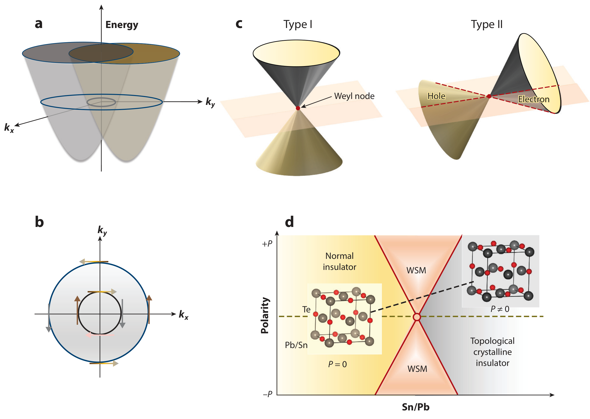
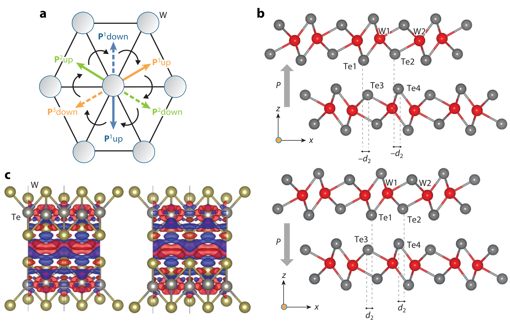
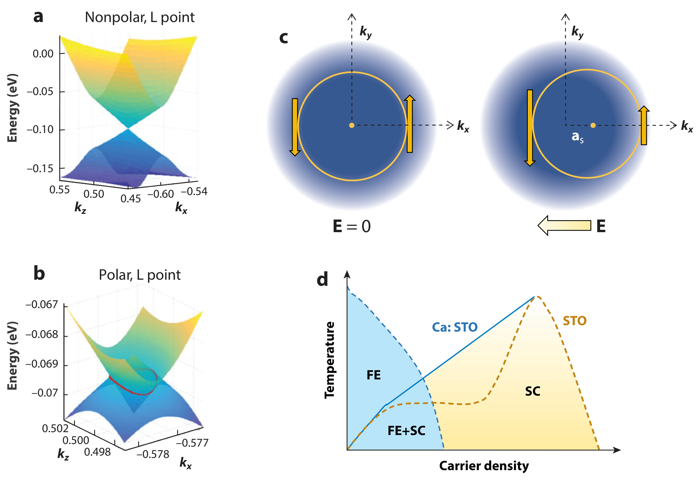
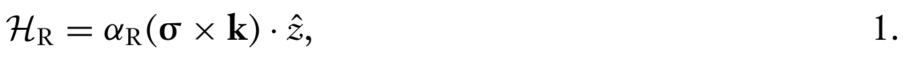
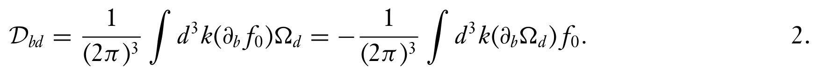
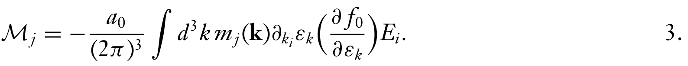

## bhowalPolarMetalsPrinciples2023b — 极性金属：原理与展望

- **元数据**：Sayantika Bhowal、Nicola A. Spaldin（ETH Zürich），2023，*Annual Review of Materials Research* 53, 53–79，DOI: 10.1146/annurev-matsci-080921-105501

- **一句话**：本文系统综述了极性与金属性共存这一"禁忌"组合的设计原理，提出以"解耦"为核心思想，以 LiOsO₃（首个类铁电金属）和 WTe₂（首个可翻转铁电金属）为里程碑，并梳理了其在 Rashba 自旋电子学、拓扑半金属、非线性霍尔效应、动磁电效应及铁电超导等方向的奇异物性。

- **现有wiki双链**：
  - 概念 [[../concepts/2D-materials]]、[[../concepts/density-functional-theory]]、[[../concepts/spin-orbit-coupling]]、[[../concepts/berry-phase]]、[[../concepts/magnetoelectric-coupling]]、[[../concepts/multiferroicity]]、[[../concepts/polarization-switching]]、[[../concepts/strain-engineering]]、[[../concepts/sliding-ferroelectricity]]、[[../concepts/ferroelasticity]]
  - 实体 [[../entities/WTe2]]、[[../entities/TMDs]]、[[../entities/BiFeO3]]、[[../entities/SnTe]]、[[../entities/PbTe]]、[[../entities/domain-wall]]
  - 图表 [[../figures/crystal-structures]]、[[../figures/electronic-bands]]、[[../figures/mathematical-models]]、[[../figures/heterostructures-stacking]]、[[../figures/domain-walls]]、[[../figures/vibrational-spectra]]、[[../figures/experimental-setups]]
  - 年度 [[../write/2023]]
  - 项目 [[../projects/project-5-snte-ferroelectric-sim]]、[[../projects/project-2-mn-multiferroics]]
  - 主题 [[../topics/D02-多铁性材料]]、[[../topics/Z01-材料模拟计算设计]]
  - 相关论文 [[../../raw/note/bhowalPolarMetalsPrinciples2023b]]

- **新概念/实体建议**：
  - `polar-metals.md` — 极性金属：属于极性点群且具有合理电导率的金属，不要求可测量宏观极化或可翻转极化；本文核心概念。
  - `anderson-blount-mechanism.md` — Anderson–Blount 解耦电子机制：若金属电子不与铁电 TO 声子强耦合，则类铁电相变可在金属中发生（1965 年提出）。
  - `geometric-ferroelectricity.md` — 几何铁电性/非本征铁电性：极化由氧八面体旋转等非极性主序参量耦合产生，对载流子掺杂鲁棒，是设计极性金属的重要平台。
  - `hyperferroelectrics.md` — 超铁电体：在未屏蔽退极化场下仍保持极化的本征铁电体，Born 有效电荷小、LO–TO 分裂弱，LO 模也可不稳定，掺杂后易成极性金属。
  - `rashba-effect.md` — Rashba 效应：破缺空间反演+强自旋轨道耦合导致的自旋-动量锁定，H_R = α_R(σ×k)·ẑ，铁电金属中可由极化翻转调控自旋织构。
  - `weyl-semimetal.md` — 外尔半金属（含第二类 WSM）：极性金属破缺空间反演，是承载 Weyl 节点的天然平台；WTe₂ 为第二类 WSM。
  - `nonlinear-hall-effect.md` — 非线性霍尔效应/贝里曲率偶极子：所有极性金属对称性允许的二阶电流响应，可作为探测极性相变的通用"指纹"。
  - `kinetic-magnetoelectric-effect.md` — 动磁电效应（KME）：非磁性旋光金属中电场诱导磁化 M_j=K_ij E_i，是极性金属的另一普适非平衡效应。
  - `ferroelectric-superconductivity.md` — 铁电超导：量子顺电体（如 SrTiO₃、KTaO₃）中铁电量子临界涨落可能介导超导配对，Tc 在铁电量子临界点附近增强。
  - `LiOsO3.md` — 实体：首个实验确认的类铁电金属，2013 年高压合成，R-3c→R3c 相变（T_s≈140 K），由"欠键合"Li⁺ 离子 rattle 驱动，Os-t₂g 电子贡献金属性。
  - `Ca3Ru2O7.md` — 实体：几何极性金属原型（n=2 RP 相），X₂⁺旋转+X₃⁻倾斜耦合 Γ₅⁻极性模式，Ru-t₂g 电子导电，已用 SHG 成像 90°/180° 极性畴并用应变翻转 90° 畴。
  - `lone-pair-ferroelectricity.md` — 孤对电子驱动铁电性：Pb²⁺(6s²)、Bi³⁺(6s²)、Ge²⁺(4s²) 等的立体化学活性孤对驱动极性畸变，能级远离费米面，对掺杂鲁棒。
  - `elemental-polar-metals.md` — 元素极性金属：同一元素占据至少两个不同 Wyckoff 位置（其中之一无反演对称）形成的单元素极性相，如 P、As、Sb、Bi 的 P6₃mc 亚稳相（理论预测）。

- **关键图表**：
  - 
  - 
  - 
  - 
  - 
  - 
  - 
  - 

- **项目连接**：
  - project-5 SnTe铁电模拟：SnTe 在岩盐相下为拓扑晶体绝缘体，低温发生沿⟨111⟩的铁电相变；In 掺杂 Pb₁₋ₓSnₓTe 在临界浓度 x_c≈0.35 附近同时保留铁电性（极化沿⟨001⟩）与非平庸拓扑，构成铁电 Weyl 半金属相，已由能斯特效应测量证实——与 SnTe 铁电/拓扑模拟直接相关。
  - project-2 Mn多铁：文章提出以 Mn 替代 Bi₅Ti₅O₁₇ 中的 Ti 设计多铁性金属 Bi₅Mn₅O₁₇（Pm2₁n，Bi 孤对电子驱动极化）；并讨论了 Ca₃Mn₂O₇ 等杂化非本征铁电体及六方锰氧化物体系，与 Mn 基多铁主题有间接但明确的关联。
  - 其余项目（双光子、机械发光 NN、TTF 分子计算、湿度传感器、CDW）无直接连接。

- **组织与用词**：
  - 文章采用"提出悖论 → 严谨定义 → 设计原理分类 → 里程碑材料深剖 → 奇异物性 → 总结展望"的总-分-总结构。设计原理部分按"向极性体系加金属性"（掺杂传统/非常规铁电体）、"向金属体系加极性"（几何铁电、人工层状/二维）和"全新共存机制"（超铁电体、自旋螺旋、元素极性金属）三条线索组织；物性部分按对称性破缺所允许的普适效应（Rashba、NHE、KME）与材料特异性效应（Weyl 拓扑、铁电超导）展开。
  - 值得复用的关键词/术语：
    - 极性金属 polar metal / 类铁电金属 ferroelectric-like (FE-like) metal / 铁电金属 ferroelectric metal
    - 解耦电子机制 decoupled electron mechanism（Anderson–Blount 机制）
    - 解耦空间机制 decoupled space mechanism（WTe₂ 层间滑移）
    - 几何铁电性 / 非本征铁电性 geometric / improper ferroelectricity
    - 孤对电子立体化学活性 stereochemically active lone pair
    - 超铁电体 hyperferroelectrics
    - 自旋-动量锁定 spin-momentum locking
    - 贝里曲率偶极子 Berry curvature dipole / 非线性霍尔效应 nonlinear Hall effect (NHE)
    - 动磁电效应 kinetic magnetoelectric effect (KME)
    - 第二类外尔半金属 type-II Weyl semimetal

- **可写入wiki的要点**：
  1. **形式定义**：依据 Resta–Sorella 电子局域化理论，金属中不可能维持宏观电极化（同一多体期望值既区分金属/绝缘体又决定极化）；因此本文将极性金属定义为"属于极性晶类（10 个极性点群：1, 2, m, mm2, 4, 4mm, 3, 3m, 6, 6mm）且具有合理电导率"的材料，涵盖金属、半导体、半金属和极化子导电，但不要求极化可测或可翻转。
  2. **传统互斥根源**：物理图像上自由载流子屏蔽长程偶极-偶极相互作用；化学图像上传统钙钛矿铁电体依赖 B 位 d⁰ 构型的二阶 Jahn–Teller 效应，而 d⁰ 本身对应绝缘态；常规金属的无方向性金属键+库仑排斥又倾向中心对称结构。
  3. **Anderson–Blount 解耦原则（1965）**：若费米能级附近的金属电子不与驱动铁电性的软横光学（TO）声子强耦合，则类铁电相变可在金属中发生。这是贯穿全文的核心设计哲学，分为"电子解耦"（LiOsO₃：Li 位移 vs Os-t₂g 导电）和"空间解耦"（WTe₂：面内滑移/导电 vs 面外极化）两类。
  4. **LiOsO₃——首个类铁电金属**：2013 年高压合成，T_s=140 K 发生 R-3c→R3c 连续二级相变；Li⁺ 沿赝立方[111]位移约 0.5 Å，A₂u 极性声子双阱几乎完全由 Li–O 位移贡献（Os–O 单独位移反而升高能量）；费米面由 Os-d 与 O-p 强杂化态主导；低 T_s（12 meV）相对双阱深度（44 meV）提示有序-无序特征；6.5 GPa 压力可将 T_s 提至 250 K，约 2.5% 拉伸应变被预测诱发应变量子相变。
  5. **WTe₂——首个铁电金属**：Td 相 Pmn2₁ 层状结构，单层中心对称、相邻层旋转 180°；金属性强限域于面内（至 3 层厚度仍金属），DFT 计算面外极化约 0.19 μC/cm²，室温下已由 PFM 成像并翻转畴；翻转机制为层间水平滑移（上层沿−x 滑动 d₁+d₂，层间 Te–Te 距离由−d₁,−d₂ 变为+d₂,+d₁，反转层间化学键合）；三个等效畸变矢量使跨矢量翻转能垒远低于同矢量直接反演。
  6. **掺杂极限数据**：n 型掺杂 BaTiO₃ 中铁电畸变可持续至约 0.1 电子/单胞（压缩应变下更高），而抑制反铁电 WO₃ 中 W 偏心需 0.75 e/W，凸显偶极屏蔽在铁电情形中的主导作用；均匀正电荷背景掺杂下极化对掺杂更鲁棒，低空穴浓度甚至因面内 Ti–O 键减弱而增强极化；PbTi₁₋ₓNbₓO₃ 在 x=0.12 仍保持极性基态并出现金属导电（STEM 直接观测 Ti/Nb 偏心）。
  7. **几何极性金属 Ca₃Ru₂O₇**：n=2 Ruddlesden–Popper 相，波矢边界旋转模 X₂⁺ 与倾斜模 X₃⁻ 耦合到区域中心极性模 Γ₅⁻ 产生极性基态；Ru-t₂g 电子主导金属导电且不受几何畸变影响；光学二次谐波（SHG）已成像 90°/180° 极性畴，应变可翻转 90° 畴（铁弹翻转）；DFT 预测引入孤对电子（Bi₅Ti₅O₁₇）可增强极性，以 Mn 替 Ti 可设计多铁性金属。
  8. **超铁电体判据**：本征铁电体中 Born 有效电荷小、LO–TO 分裂弱（甚至 LO 模也不稳定），即使存在未屏蔽退极化场仍保持极化；Carpy–Galy 相 La₂Ti₂O₇、Sr₂Nb₂O₇ 及 RP 相 Ca₃Ti₂O₇ 被鉴定为超铁电体，预测掺杂后成为极性金属；六方 ABC 型金属对应物（如 LiGaGe、CaAgBi 家族）承载 Dirac/Weyl 费米子。
  9. **NHE 作为极性金属通用指纹**：非线性霍尔效应 j_a^{2ω}=χ_abc E_b E_c 源于贝里曲率偶极子 D_bd；所有极性点群均为旋光性（gyrotropic），故对称性允许 NHE；D_bd 的反对称分量 D⁻ 的矢量方向即极性轴方向，可由电导率张量提取；已在双层/多层 WTe₂ 上实验证实（产生二倍频霍尔电压 V_y^{2ω}），LiOsO₃ 中 DFT 预测 D_xy=−D_yx 待验证；类铁电金属中 NHE 的出现应标志中心对称→极性结构相变。
  10. **极性-拓扑-超导关联**：WTe₂ 为第二类 WSM（8 个 Weyl 点，分别位于 E_F 上方 52 meV 和 58 meV，ARPES 证实）；非极性 LiOsO₃ 在 T 点有线性/立方 Dirac 点（非简单滑移镜面对称保护），极性 R3c 相中反演对称破缺使 L 处 Dirac 点退化为包围 L 的节线环；In 掺杂 Pb₁₋ₓSnₓTe（x_c≈0.35）实现铁电 WSM 相；SrTiO₃ 量子顺电体中 Ca 掺杂/同位素替代/应变调节铁电量子临界点可改变超导 T_c，铁电量子涨落被提议为非 BCS 超导配对媒介，KTaO₃(111) 表面亦有类似行为。
