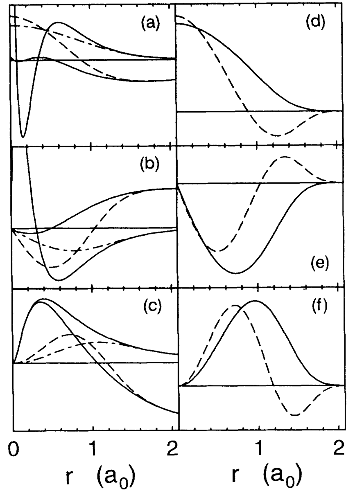
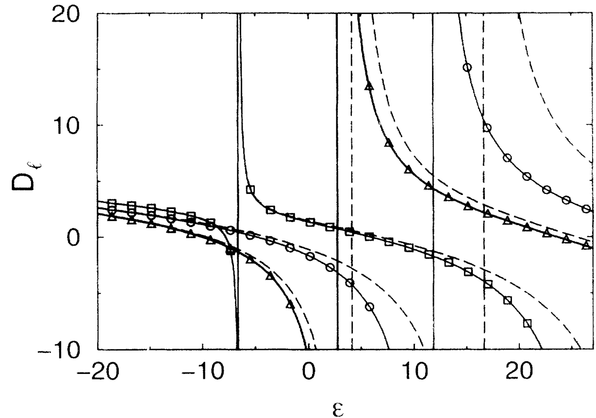
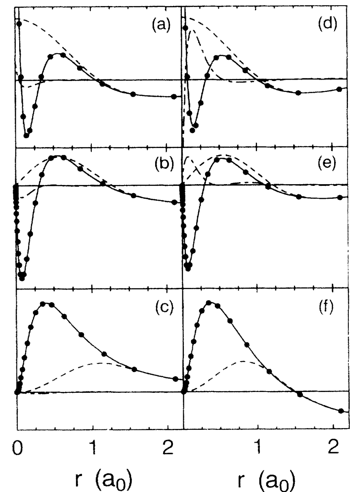
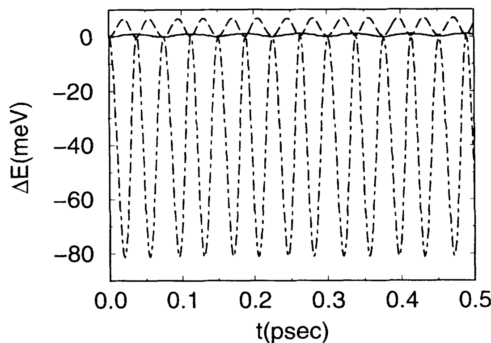
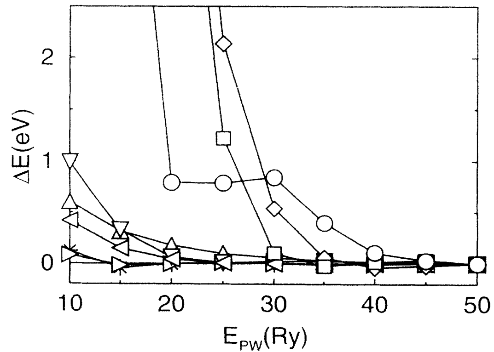
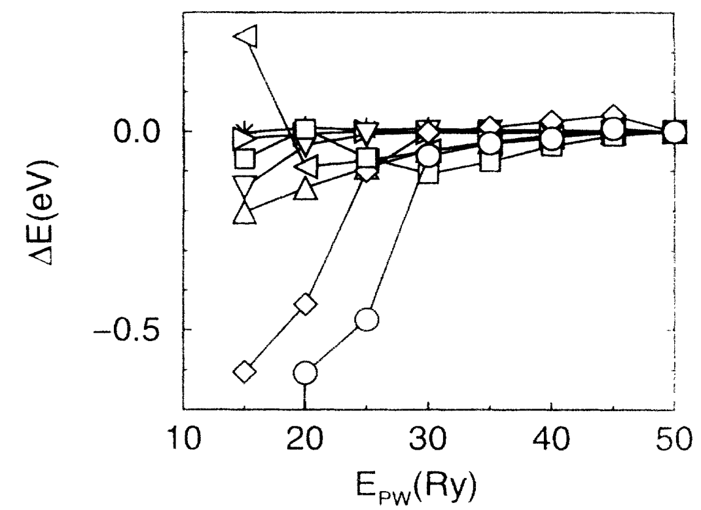
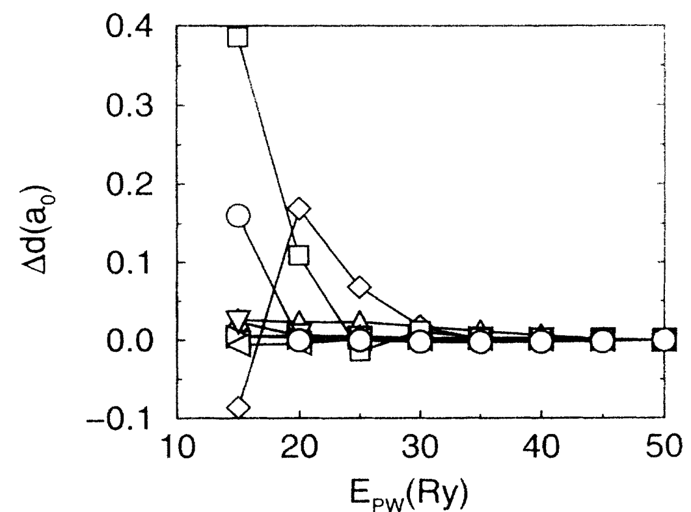
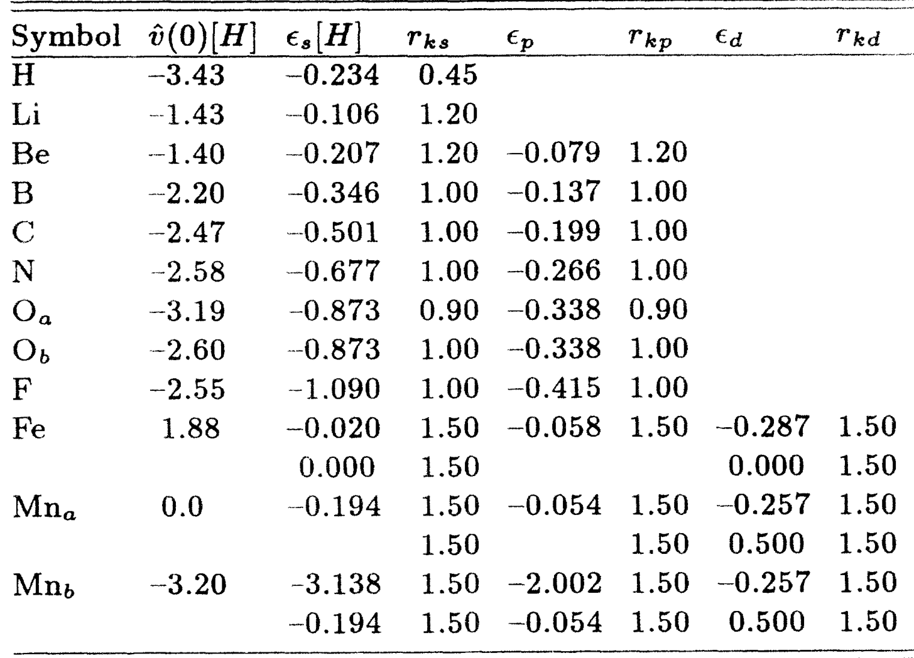
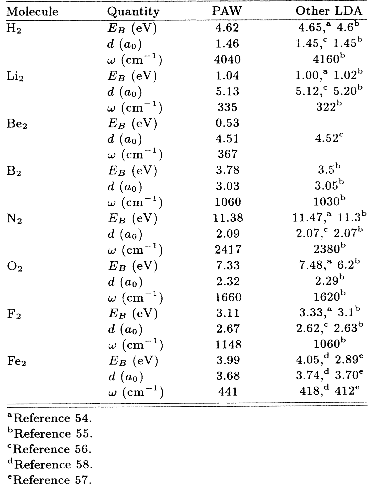

## blochlProjectorAugmentedwaveMethod1994b — 投影增强波法（Projector Augmented-Wave Method, PAW）

## 📄 元数据
P. E. Blöchl，1994，Physical Review B 50(24), 17953–17979，DOI: 10.1103/PhysRevB.50.17953
## 💡 一句话
本文提出投影增强波（PAW）方法，通过一个由全电子分波、赝分波和投影函数定义的线性变换，将全电子 LAPW 方法的精度与平面波赝势方法的效率统一起来，并首次实现基于完整波函数的能量守恒第一性原理分子动力学。

## 🔗 Wiki 双链
  - 概念 [[../concepts/density-functional-theory|密度泛函理论（DFT）]]
  - 概念 [[../concepts/paw-method|投影增强波（PAW）]]
  - 概念 [[../concepts/pseudopotential|赝势]]
  - 概念 [[../concepts/projector-functions|投影函数]]
  - 概念 [[../concepts/augmentation-region|增强区域]]
  - 概念 [[../concepts/compensation-charge-density|补偿电荷密度]]
  - 概念 [[../concepts/additive-augmentation|加法缀加]]
  - 概念 [[../concepts/frozen-core-approximation|冻结芯近似]]
  - 概念 [[../concepts/overlap-operator|重叠算符]]
  - 概念 [[../concepts/pulay-force]]
  - 概念 [[../concepts/LAPW]]
  - 概念 [[../concepts/norm-conservation]]
  - 概念 [[../concepts/Car-Parrinello]]
  - 实体 [[../entities/VASP]]
  - 实体 [[../entities/Wannier90]]（PAW 部分波形式天然适合构造 Wannier 轨道）
  - 实体 [[../entities/Fe2]]
  - 实体 [[../entities/LMTO]]
  - 实体 [[../entities/MnFO3]]
  - 年度 [[../write/1945-1999|1994]]
  - 相关论文 [[../../raw/note/blochlProjectorAugmentedwaveMethod1994b]]

## 📊 关键图表
  - 图1：Mn 原子的全电子分波、赝分波与投影函数（s/p/d 通道）
   -> [[../figures/electronic-bands-cdw-transport|CDW与输运性质]]
  - **图示描述**：采用 2×3 子图布局，左列 (a)-(c) 对比 Mn 原子 s、p、d 三个角动量通道的全电子（AE，实线）与赝（PS，虚线/点划线）分波，右列 (d)-(f) 给出对应通道的第一、第二投影函数；横轴为到核距离 r（单位 a₀），纵轴为函数值。
  - **关键特征**：AE 分波在核附近剧烈振荡，体现全电子波函数的节点结构；PS 分波在增强区域外与 AE 完全重合、在核附近被平滑化；投影函数严格局域在增强区域内，其形状与对应 PS 分波相关联；Mn 的 3s、3p 被当作价态（半芯态）显式处理。
  - **结论/意义**：该图给出 PAW 变换三要素的可视化"配方"，PS 分波的平滑度直接决定所需平面波截断，投影函数的局域性保证了单中心修正的计算效率。

  - 图2：Mn 原子散射性质（对数导数 D_l(ε) 随能量变化）
   -> [[../figures/electronic-bands-band-structures|能带结构与带隙]]
  - **图示描述**：单图三条曲线，横轴为能量 ε（eV），纵轴为在 r=3a₀ 处计算的对数导数 D_l(ε)=r·∂rP_l(r,ε)/P_l(r,ε)，分别对应 s、p、d 角动量；三角、圆、方符号为精确解，实线为每 l 用两个分波的 PAW（表 I 中 Mn2 设置），虚线为仅用一个分波的 PAW。
  - **关键特征**：价带区（约 −10–0 eV）两种设置均与精确解吻合；能量高于约 5 eV 后单分波结果明显偏离，s 通道偏差最大；增加第二个分波后散射性质在占据态以上约 1.5 Ry（约 20 eV）范围内仍保持精确。
  - **结论/意义**：对数导数直接反映波函数在 muffin-tin 边界的匹配质量，证明通过增加每角动量分波数可系统扩展 PAW 的能量适用范围，这是过渡金属窄 d 态需要两分波的依据。

  - 图3：Mn 原子波函数精度比较
   -> [[../figures/electronic-bands-cdw-transport|CDW与输运性质]]
  - **图示描述**：2×3 子图，上排 (a)-(c) 对应价带能量 ε=−8.16 eV、下排 (d)-(f) 对应高能 ε=+13.61 eV，每图给出 PAW 重构的 AE 波函数（实线）、径向薛定谔方程精确解（圆点）、差值放大 10 倍（点划线）及 PS 波函数（虚线）；横轴 r（a₀），s、p、d 通道分列。
  - **关键特征**：价带能区 PAW 重构波函数与精确解几乎完全重合，相对误差 <1%；高能区 s 通道在核附近低估极大值、偏差约 15%，而 p、d 通道仍保持高精度；PS 波函数在核附近显著平滑、在增强区外与 AE 一致。
  - **结论/意义**：该图直观证明 PAW 能在宽能量范围内高保真地重构全电子波函数——这是赝势方法无法直接提供的，高能 s 波的偏差属分波截断的典型可控误差。

  - 图4：Fe₂ 第一性原理分子动力学的能量演化
   -> [[../figures/mathematical-models-simulations|模拟与数值结果]]
  - **图示描述**：单图三条曲线，横轴为模拟时间（ps），纵轴为相对于初始值的能量（eV）；点划线为 LDA 总能量（Born-Oppenheimer 势能面），虚线为波函数虚拟动能，实线为守恒总能量。
  - **关键特征**：势能面与虚拟动能呈规整反相周期振荡，周期对应振动频率约 441 cm⁻¹；守恒能量在 0.5 ps 内漂移 <0.8 meV，无系统性单调漂移；虚拟动能振荡是波函数在势能面上的绝热运动，并非偏离 BO 面；对应核质量重整化约 8%。
  - **结论/意义**：这是首次基于完整全电子波函数实现能量守恒的 Car-Parrinello 分子动力学，证明 PAW 力与总能量严格一致，可用于高质量动力学模拟。

  - 图5：第一行元素及 Fe 原子总能量的平面波收敛性
   -> [[../figures/mathematical-models-computational|计算方法与泛函]]
  - **图示描述**：横轴为平面波截断能 E_pw（Ry），纵轴为相对于 E_pw=50 Ry 结果的总能量差 ΔE（eV）；曲线覆盖 H、Li、Be、B、N、O、F 及 Fe，使用不同符号区分（H△、Li*、Be□、B◇、N▽、O○、F☆、Fe¤）。
  - **关键特征**：H、Li 等轻元素收敛最快，O、F 等较"硬"元素与 Fe 收敛最慢；所有被测元素在 30–40 Ry 截断下误差均 <0.1 eV；Fe 作为含 3d 与半芯态的过渡金属代表仍能在此截断收敛。
  - **结论/意义**：确立了 PAW 实际计算中 30 Ry 量级平面波截断即可达到化学精度，与超软赝势收敛性相当但保留全电子信息。

  - 图6：双原子分子结合能的平面波收敛性
   -> [[../figures/mathematical-models-computational|计算方法与泛函]]
  - **图示描述**：横轴 E_pw（Ry），纵轴为相对于 50 Ry 结果的结合能差 ΔE（eV），被测二聚体与符号同图5。
  - **关键特征**：结合能（能量差）的收敛显著快于绝对总能量，因原子参考抵消了大部分系统误差；在 30 Ry 截断下误差已 <0.1 eV；轻元素二聚体在更低截断即收敛。
  - **结论/意义**：说明 PAW 中相对能量（成键、反应能）比绝对总能量更易收敛，30 Ry 足以可靠预测分子结合能。

  - 图7：双原子分子键长的平面波收敛性
   -> [[../figures/mathematical-models-computational|计算方法与泛函]]
  - **图示描述**：横轴 E_pw（Ry），纵轴为相对于 50 Ry 结果的键长差 Δd（a₀），二聚体与符号同图5。
  - **关键特征**：30 Ry 时键长误差已 <0.02 a₀，相对偏差 <1%；键长对截断的敏感度低于总能量；各元素曲线趋势一致，无异常元素。
  - **结论/意义**：与表 II 中 30 Ry 下键长偏差 <1% 的结论互相印证，证明 PAW 在中等截断下即可给出可靠的结构参数。

  - 表I：构造 PS 分波所用参数
   -> [[../figures/mathematical-models-computational|计算方法与泛函]]
  - **图示描述**：列出 H、Li、Be、B、N、O、F、Mn（Mn1/Mn2 两种设置）、Fe 等原子构造 PS 分波时的参数，所有原子与角动量通道统一取截断参数 A=6，并给出匹配半径 r_c、ṽ_ps(0) 等。
  - **关键特征**：A=6 为全局固定的多项式阶数/指数参数；截断半径 r_c 通常取共价半径的约 3/4，使 PS 势在缀加区外与 AE 原子势几乎相同；Mn2 对应每角动量两个分波的设置（图2实线所用），Mn1 为单分波设置。
  - **结论/意义**：该表是 PAW 势构造"配方"的参数清单，为复现本文结果及后续元素势的构建提供了可操作的数值依据。

  - 表II：30 Ry 截断下二聚体性质与全电子 LDA 结果的对比
   -> [[../figures/vibrational-spectra|振动光谱]]
  - **图示描述**：汇总 H₂、Li₂、Be₂、B₂、N₂、O₂、F₂、Fe₂ 等二聚体在 30 Ry 平面波截断下的结合能、键长、振动频率，并与当时最精确的全电子 LDA 计算并列对比。
  - **关键特征**：PAW 键长与全电子结果偏差 <1%；振动频率偏差约 4%；结合能偏差在 0.1–0.2 eV 量级；二聚体键长短、势场非球性强，被视为对任何电子结构方法的严格测试，Fe₂ 还验证了含过渡金属体系的可靠性。
  - **结论/意义**：以一组严格测试体系定量证明 PAW 以 30 Ry 的中等代价即可达到最先进全电子方法的精度，是论文方法学论断的核心数值证据。
## 🔬 项目连接
  - **project-2 Mn多铁（core）**：项目子课题明确使用 VASP 做多孔 MoS₂、多层黑磷、高通量 DFT 计算，且核心材料含 Mn（BiFeO₃、HoMnO₃、Mn 基多铁）。PAW 正是 VASP 的默认电子结构表示，本文是理解 VASP 中 PAW 势、截断能选择、半芯态处理（3s/3p）、Mn/Fe 等过渡金属 d 电子为何需要两分波的原始文献，直接决定计算精度与收敛性判断，属核心方法文献。
  - **project-7 CDW（strong）**：项目对 CrS₂、VTe₂、MnX₂ 等 TMD 做 DFT 计算（1T/1T′ 结构、DOS、电荷掺杂、磁耦合），这些过渡金属二硫属化物的 DFT 几乎都依赖 PAW 势处理 Cr/V/Mn 的 d 电子与 S/Te 的价电子。本文关于过渡金属用四阶多项式匹配 PS 势、每角动量两分波处理窄 d 态、30 Ry 收敛标准等内容可直接指导其 INCAR/POTCAR 选择与收敛性测试。
  - **project-5 SnTe铁电模拟（medium）**：项目主体用 LAMMPS/DeepMD 做势函数与铁电动力学，但其训练标签与参考能量/力通常来自 DFT（VASP/QE，均用 PAW）。理解 PAW 对 Sn（半芯态 4d）、Te 重元素的处理、自旋-轨道耦合扩展（本文已展望）对评估 DFT 参考数据质量、Berry 相极化计算的精度有方法参考价值；体项目本身不直接做 PAW 级开发，故定为 medium。
  - **project-4 TTF分子计算（weak）**：项目以 UFF/LAMMPS/MACE/DeepMD 分子模拟为主，涉及 TTF 有机分子（C/S/H），不直接做平面波 DFT。但若用 DFT 生成训练数据或做单点能参考，PAW 对第一行元素（C/N/O/F/S）的处理结论（一分波即可、30 Ry 收敛）有间接参考意义，故定为 weak。
  - **project-1 双光子 / project-3 机械发光NN / project-6 湿度传感器**：无直接项目连接（光学/ML/器件实验为主，不涉及平面波 DFT 电子结构方法）。

## 🔗 项目双链
- 项目 [[../projects/project-2-mn-multiferroics|项目二：Mn极化结构铁电材料]]
- 项目 [[../projects/project-5-snte-ferroelectric-sim|项目五：lammps势函数SnTe铁电模拟]]
- 项目 [[../projects/project-7-cdw-charge-density-wave|项目七：CDW电荷密度波]]

## 📝 组织与用词
  文章按"形式理论（II）→实用近似（III）→力/哈密顿量/重叠矩阵（IV）→Car-Parrinello 分子动力学（V）→分波与投影函数构造（VI）→截断误差分析与扩展（VII）→数值测试（VIII）→与现有方法比较（IX）"的总-分-总结构组织。先给最一般线性变换，再逐层落到可实现方案，最后用误差分析反向证明设计选择的合理性，并把 LAPW 与赝势分别证明为其特例/近似，完成两大流派的理论统一。
  值得复用的关键术语：
  - 投影增强波（Projector Augmented-Wave, PAW）
  - 全电子分波 / 赝分波（AE / PS partial waves）
  - 投影函数 [[../concepts/projector-functions|投影函数]]（projector functions）
  - 线性变换（linear transformation T = 1 + Σ_R T_R）
  - 增强区域 [[../concepts/augmentation-region|增强区域]]（augmentation region / muffin-tin sphere / core region）
  - 补偿电荷密度 [[../concepts/compensation-charge-density|补偿电荷密度]]（compensation charge density n̂）
  - 加法缀加 [[../concepts/additive-augmentation|加法缀加]]（additive augmentation）
  - 冻结芯近似 [[../concepts/frozen-core-approximation|冻结芯近似]]（frozen-core approximation）
  - 重叠算符 [[../concepts/overlap-operator|重叠算符]]（overlap operator Õ，放松范数守恒的结果）
  - Pulay 力（Pulay forces，位置依赖基组拖拽电子产生的力）

## ✏️ 可写入 Wiki 的要点
  - PAW 核心变换：|Ψ⟩ = |Ψ̃⟩ + Σ_i (|φ_i⟩ − |φ̃_i⟩) ⟨p̃_i|Ψ̃⟩，三要素为 AE 分波 |φ_i⟩、PS 分波 |φ̃_i⟩（[[../concepts/augmentation-region|增强区域]]外与 AE 分波相同）、[[../concepts/projector-functions|投影函数]] ⟨p̃_i|（满足 ⟨p̃_i|φ̃_j⟩=δ_ij）。
  - 任意算符 A 的 PS 表示为 Ã = T†AT，形式与广义可分离赝势完全一致；PS 算符含直接作用项与两类局域投影修正项，后者在径向网格上用球谐函数与 Clebsch-Gordan 系数求值。
  - 总能量分解为 E = Ẽ + E¹ − Ẽ¹：Ẽ 在规则网格/傅里叶空间计算平滑部分，E¹、Ẽ¹ 在径向网格上做单中心 AE 与 PS 修正，相减去除双计数。
  - [[../concepts/compensation-charge-density|补偿电荷密度]] n̂ = Σ_R n̂_R = Σ_R,L g_RL(r) Q_RL（广义高斯函数）使单中心电荷差的多极矩为零，把静电作用转移到平面波部分，并允许[[../concepts/charge-density|电荷密度]]平面波截断仅取波函数截断的两倍（相比 USPP 的四倍显著省算）。
  - 实用近似仅两个：平面波截断 E_pw（典型 30 Ry）与每位点每角动量分波数（典型 1–2 个，l_max=1 或 2）；第一行元素一分波即可，过渡金属窄 d 态和半芯态需两分波。
  - 放松范数守恒导致非平凡[[../concepts/overlap-operator|重叠算符]] Õ = 1 + Σ_ij |p̃_i⟩(⟨φ_i|φ_j⟩−⟨φ̃_i|φ̃_j⟩)⟨p̃_j|，波函数需在 Õ 下正交化；这是 PAW/USPP 区别于范数守恒赝势的根本点。
  - 力分三部分：F_R = F_R⁽¹⁾+F_R⁽²⁾+F_R⁽³⁾，分别对应平滑部分刚性位移、单中心密度形状变化（Pulay 力）、波函数正交性变化；力与总能量 must 一致才能保证 MD 能量守恒。
  - [[../concepts/additive-augmentation|加法缀加]]原理下，AE 与 PS 分波以完全相同方式截断，未显式包含的高阶分波由平面波尾部表示，基组完备性不依赖分波数；误差分析证明芯与核的强变化势不对截断误差贡献（电荷密度可迁移性误差与能量可迁移性误差有效抵消）。
  - 数值验证：MnFO₃（Mn +7 氧化态）冻芯与显式含半芯 3s/3p 结果几乎一致（d_MnF≈3.19–3.21 a₀，d_MnO≈2.97–2.98 a₀），与全电子计算吻合，优于赝势（高估约 2.5%）；Fe₂ 全电子 Car-Parrinello MD 能量漂移 <0.8 meV/0.5 ps，核[[../concepts/mass-renormalization|质量重整化]]约 8%。
  - 方法统一：LAPW 是 PAW 的特例（用球面值与导数匹配代替投影函数内积）；范数守恒赝势可通过对单中心密度偏离原子值做一阶泰勒展开从 PAW 导出；Vanderbilt 超软赝势与 PAW 形式相似但 PAW 是全电子方法（保留完整波函数、含芯态、无"赝化"步骤），且因单中心项在径向网格处理而效率更高。
