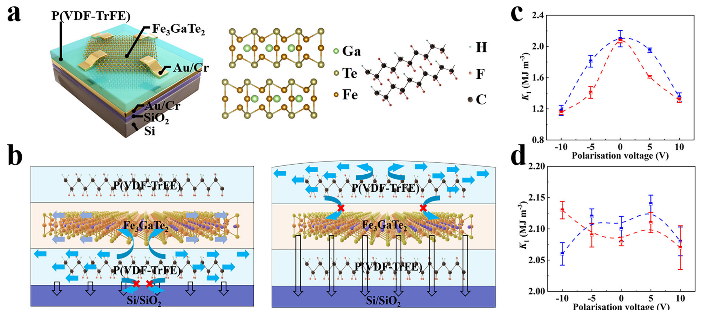
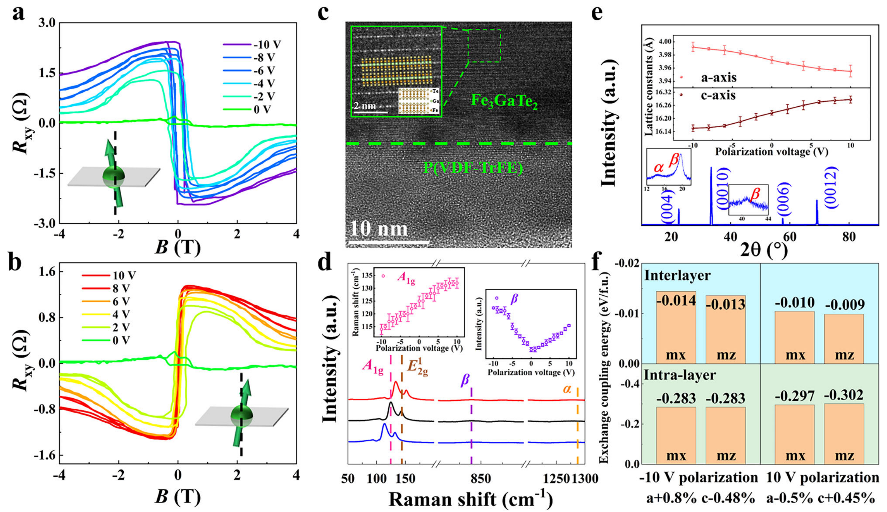
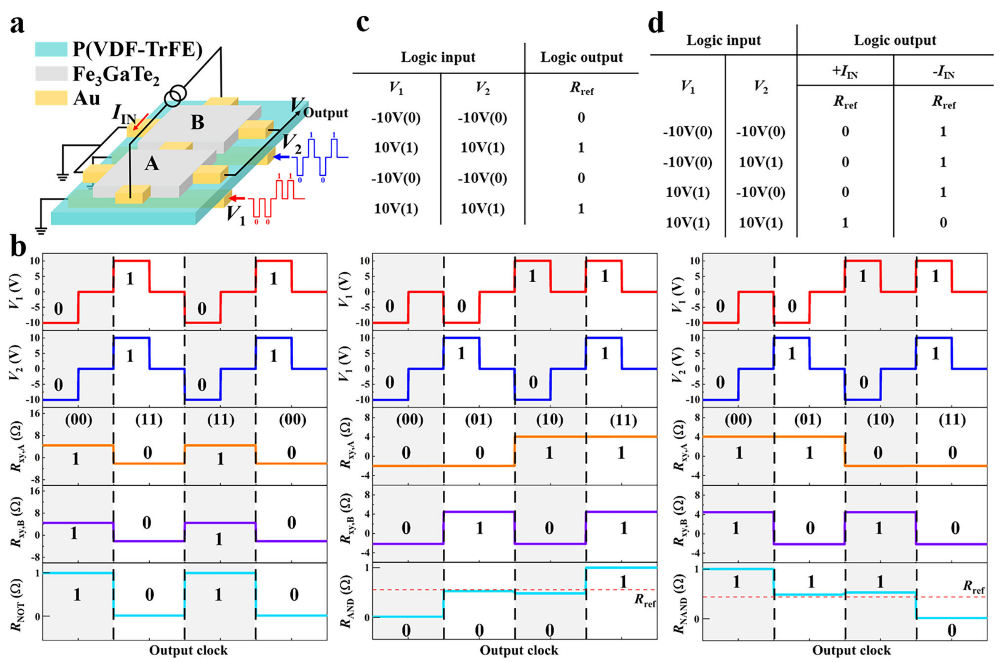
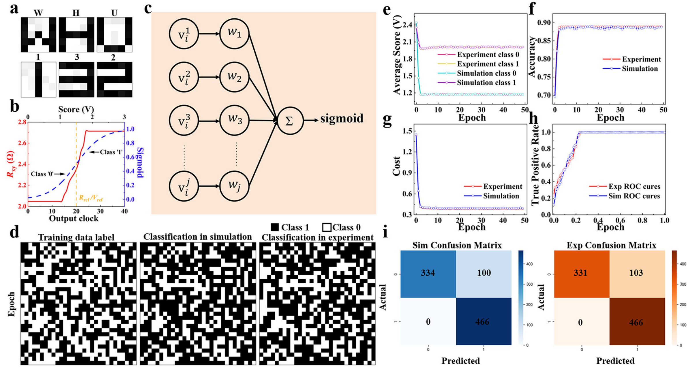

## caiFerroelectricitydrivenStrainmediatedMagnetoelectric2025 — 二维多铁异质结构中的铁电驱动应变介导磁电耦合

- **元数据**：Chuanyang Cai, Yao Wen, Shiheng Liang, Lei Yin, Ruiqing Cheng, Hao Wang, Xiaoqiang Feng, Liang Liu, Jun He et al.，2025，Nature Communications 16:10664，DOI: 10.1038/s41467-025-65688-x

- **一句话**：在 Fe3GaTe2/P(VDF-TrFE) 双栅二维多铁异质结中，利用底栅铁电聚合物的逆压电效应诱导应变，室温下非易失、全电学可逆地调控 Fe3GaTe2 的磁各向异性常数 K1，并演示了 0.5 aJ/5 ns 的可重构自旋逻辑门、半加器及二分类神经网络。

- **现有wiki双链**：
  - 概念 [[../concepts/multiferroicity]]
  - 概念 [[../concepts/magnetoelectric-coupling]]
  - 概念 [[../concepts/strain-engineering]]
  - 概念 [[../concepts/2D-materials]]
  - 概念 [[../concepts/spin-orbit-coupling]]
  - 概念 [[../concepts/density-functional-theory]]
  - 概念 [[../concepts/berry-phase]]（Berry 曲率积分决定反常霍尔电导符号）
  - 概念 [[../concepts/polarization-switching]]
  - 实体 [[../entities/Fe3GeTe2]]（同族参照材料；本文主体为 Fe3GaTe2）
  - 实体 [[../entities/VASP]]
  - 图表 [[../figures/heterostructures-stacking]]
  - 图表 [[../figures/crystal-structures]]
  - 图表 [[../figures/electronic-devices]]
  - 图表 [[../figures/mathematical-models]]
  - 年度 [[../write/2025]]
  - 相关论文 [[../../raw/note/caiFerroelectricitydrivenStrainmediatedMagnetoelectric2025]]

- **新概念/实体建议**：
  - `Fe3GaTe2.md`（实体）：室温二维铁磁体，具强垂直磁各向异性（PMA）、高自旋霍尔角、良好空气稳定性；Fe 原子 3d 电子主导铁磁性，每层含两个不等价 Fe 位点。
  - `PVDF-TrFE.md`（实体）：铁电聚合物 P(VDF-TrFE)，β 相具强极化与逆压电效应；C-F 偶极子与 Fe3GaTe2 表面 Te 孤对电子耦合；疏水 C-F 链兼作钝化层。
  - `inverse-piezoelectric-effect.md`（概念）：施加电场使压电材料产生机械形变；本文中底栅 P(VDF-TrFE) 受刚性硅衬底约束，形变被转化为面内剪切应力传递至铁磁层。
  - `perpendicular-magnetic-anisotropy.md`（概念）：PMA，易磁化轴垂直于膜面，利于高密度存储；本文零应变下块体 Fe3GaTe2 的 MAE 为 +2.158 meV/atom。
  - `anomalous-hall-effect.md`（概念）：AHE，铁磁材料中由 SOC 与 Berry 曲率产生的零场霍尔电阻，正比于磁化强度，是电学读出磁态的标准手段。
  - `strain-mediated-magnetoelectric-coupling.md`（概念）：区别于界面电荷转移机制，通过铁电层逆压电应变改变铁磁层晶格常数进而调制磁各向异性的耦合路径。
  - `spin-logic-device.md`（概念）：以磁矩量子态编码信息、电场/应变写入、AHE 读出的低功耗可重构逻辑器件，可实现 AND/NAND/NOT/XOR 及半加器。
  - `dual-gate-asymmetric-strain-control.md`（概念）：顶栅以铁电场效应调控载流子浓度（HC、Rxy），底栅以铁电极化+逆压电应变双重机制调控磁各向异性轴方向的非对称双栅设计。

- **关键图表**：
  - 
  - 
  - 
  - 

- **项目连接**：project-2 Mn多铁（二维多铁异质结与磁电耦合主题高度相关，可作为应变介导电控磁范式的对照案例）；无其他直接项目连接。

- **组织与用词**：文章按"问题提出（后摩尔时代存储墙/功耗墙）→ 策略设计（非对称双栅 Fe3GaTe2/P(VDF-TrFE) 异质结）→ 机理验证（电学-AHE、结构-TEM/Raman/XRD、理论-DFT/格林函数）→ 功能演示（可重构逻辑门、半加器、二分类神经网络）"的完整证据链推进。核心论证逻辑是通过顶栅与底栅调控效果的对比，将磁各向异性变化归因于底栅逆压电应变而非电荷转移。值得复用的术语：
  - 应变介导磁电耦合 (strain-mediated magnetoelectric coupling)
  - 逆压电效应 (inverse piezoelectric effect)
  - 垂直磁各向异性 (perpendicular magnetic anisotropy, PMA)
  - 磁各向异性常数/磁各向异性能 (K1 / magnetic anisotropy energy, MAE)
  - 反常霍尔电阻 (anomalous Hall resistance, Rxy)
  - 非易失性电控磁 (non-volatile electric-field control of magnetism)
  - 自旋逻辑互补架构 (spin logic complementary architecture, SLCA)
  - 范德华界面剪切应力传递 (vdW interfacial shear stress transfer)

- **可写入wiki的要点**：
  1. 器件结构为顶栅 P(VDF-TrFE)/Fe3GaTe2/底栅 P(VDF-TrFE)/SiO2-Si 垂直堆叠；Fe3GaTe2 厚度约 12 nm（机械剥离），上下 P(VDF-TrFE) 各约 10 nm（旋涂，70/30 摩尔比，130 °C 真空退火结晶为 β 相）。
  2. 底栅因与刚性硅衬底强键合，逆压电形变被约束为面内应力并经界面剪切高效传递至 Fe3GaTe2；顶栅上表面自由，应变通过翘曲/弯曲耗散，传递效率低于临界阈值——这是双栅非对称调控的力学根源。
  3. 零偏压下 Fe3GaTe2 各向异性常数 Ku ≈ 4.82×10^5 J/m³；±10 V 底栅扫描使 K1 显著降低并呈蝶形磁滞回线，顶栅 K1 基本不变。负偏压（−10 V）使易磁化轴从 90° 偏至 95°（面外分量增强）。
  4. 拉曼证据：Fe3GaTe2 特征峰 ~125 cm⁻¹（A1g）、~141 cm⁻¹（E²₁g）在正偏压下蓝移（压缩）、负偏压下红移（拉伸）；零偏剩余态测量以排除表面电荷调制干扰。V2=+10 V 估算拉伸应变 0.6–0.8%，V2=−10 V 压缩应变 0.4–0.5%。
  5. XRD 定量：零偏 a=3.972 Å、c=16.225 Å；+10 V 时 εa≈0.5%（a 增 c 减），−10 V 时 εa≈0.8%（a 减 c 增），εc 分别约 0.45% 与 0.48%；顶栅极化下 a/c 轴呈无序变化。
  6. DFT（VASP，PAW-PBE，截断 550 eV，Fe d 轨道 Ueff=4 eV，含 SOC）：零应变块体 MAE=+2.158 meV/atom、单层 +0.354 meV/atom（均偏好垂直磁化）；+0.8% 双轴拉伸后块体 MAE=−0.233 meV/atom、单层 −0.58 meV/atom，转变为面内易轴。单层 MAE 调制幅度 −263.8%，远大于块体 −110.7%，源于层内交换与层间超交换的竞争。
  7. 微观机制：Fe 占据 Te 八面体中心，d 轨道晶体场分裂为 t2g/eg；无应变时 dz² 低于 dx²−y²  favor 面外；双轴应变改变 d 轨道能级差 ΔE，当 ΔE<0.1 eV 时面内磁化能垒显著降低；Fe-II 与 Te 的 dyz-dz²、dxz-dz²、px-pz、py-pz 轨道贡献各向异性。
  8. 磁电耦合系数 α_CME：−10 V 时 8.6×10⁻⁶ S/m，+10 V 时 6.4×10⁻⁶ S/m；界面 C-F 偶极子与 Te 孤对电子耦合增强磁电耦合，并通过逆 Rashba-Edelstein 效应（IREE）进一步提升；偶极排列动态调控范围超过 10⁴。
  9. 非易失性来源：P(VDF-TrFE) 剩余极化 Pr 在撤去电场后维持逆压电应变状态，持续作用于 Fe3GaTe2；器件性能保持 120 小时；应变弛豫与电弛豫动力学解耦比 1:1.68，288 小时后恢复。
  10. 器件性能：单次写入能耗 0.5 aJ（5×10⁻¹⁹ J）、写入速度 5 ns，优于 STT/SOT 及典型多铁逻辑器件；4 器件集成实现自旋逻辑半加器（SLHA，XOR+AND 输出 SUM/CARRY）；TIA+比较器模拟神经网络对 4×4 像素字母/数字二分类 AUC 接近 1；矫顽场/霍尔电阻/开关电压器件间波动控制在 5–10%。
